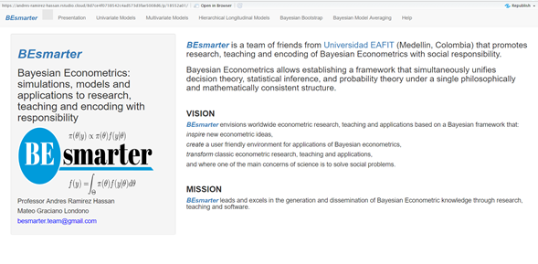
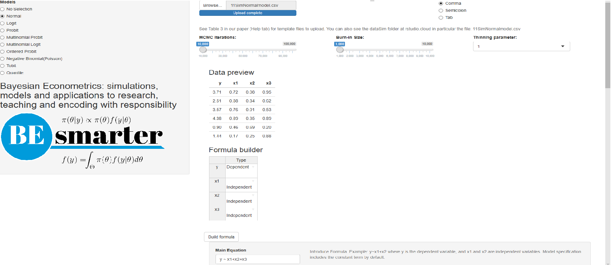
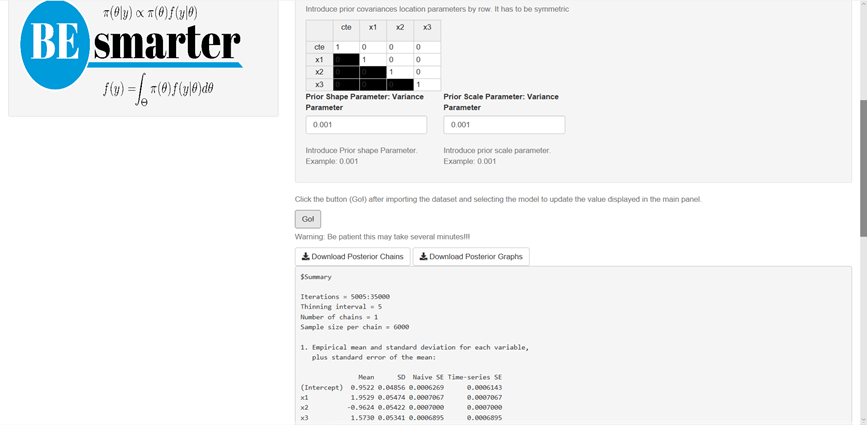
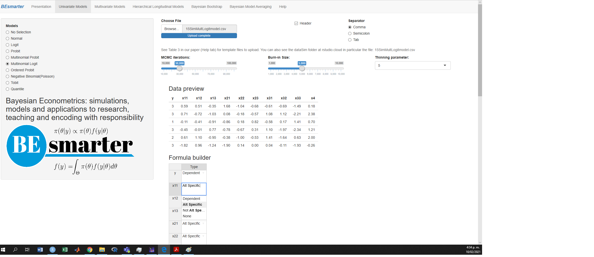
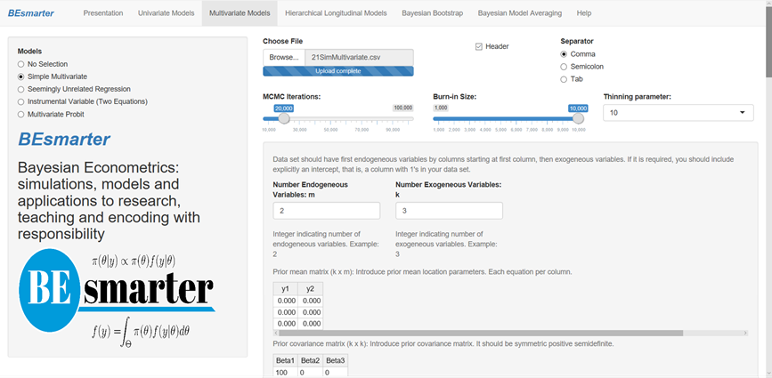
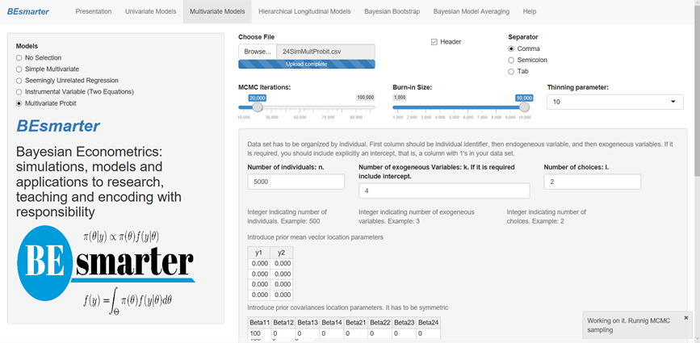
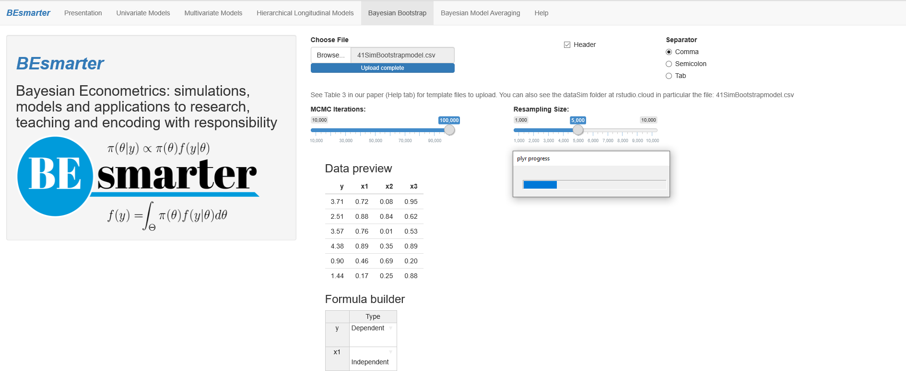

::: article
# Introduction

The main objective of this paper is to present an open source teaching
Graphical User Interface (GUI) to implement Bayesian regression analysis
using cross-sectional and longitudinal data.[^1] We present a tutorial
for implementing these models in our GUI and some applications. The Help
option in the main tap panel exhibits an extended version of this paper
where users can find more applications and the basic theoretical
foundations of each model in our GUI. Therefore, practitioners and
researchers can apply Bayesian regression analysis to understand its
theoretical foundation without requiring programming skills. The latter
seems to be a significant impediment to increasing the use of the
Bayesian framework [@Woodward2005; @Karabatsos2016].

Table [1](#tab:software) shows the available graphical user interfaces
for carrying out Bayesian regression analysis.
[*shinystan*](https://CRAN.R-project.org/package=shinystan)
[@shinystan2017] is a very flexible open source program, but users are
required to have some programming skills. BugsXLA [@Woodward2005] is
open source but less flexible. However, users do not need to have
programming skills. Bayesian regression: Nonparametric and parametric
models [@Karabatsos2016] is a very flexible and friendly GUI that is
based on MATLAB Compiler for a 64-bit Windows computer. Its focus is on
Bayesian nonparametric regressions, and it can be thought of for users
who have mastered basic parametric models, such as the ones that we show
in our GUI. On the other hand, MATLAB toolkit, Stata, and BayES are not
open source.

We developed our GUI based on an interactive web application using
**shiny** [@Chang2018] and some libraries in R [@R2018]. The specific
libraries and commands that are used in our GUI can be seen in Table
[2](#tab:libraries). It has nine univariate models, four multivariate,
three hierarchical longitudinal, Bayesian bootstrap, and six Bayesian
model averaging frameworks. In addition, it gives basic summaries and
diagnostics of the posterior chains, as well as the posterior chains
themselves, and different plots, such as trace, autocorrelation, and
densities. In terms of its flexibility and possibilities, our GUI lies
between ShinyStan and BugsXLA: users are not required to have any
programming skills, but it is not as advanced as [@Karabatsos2016]'s
software. However, our GUI can be run in any operating system. Our GUI,
which we call BEsmarter,[^2] is freely available at
<https://github.com/besmarter/BSTApp>. Thus, users have access to all
our code and datasets.

After this brief introduction, we present our GUI and how to use it in
Section **Using BEsmarter**. Section **Applications** presents some
empirical examples to illustrate the potential use of our GUI. Lastly,
Section **Concluding remarks** presents some conclusions and future
developments.

# Using BEsmarter {#sec:GUI}

Simulated and applied datasets are in the folders *DataSim* (see Table
[3](#tab:datasets) for details) and *DataApp* (see Table
[4](#tab:datasetsApp) for details), respectively. The former folder also
includes the files that were used to simulate different processes so
that the population parameters are available, and as a consequence,
these files can be used as a pedagogical tool to show some statistical
properties of the inferential frameworks available in our GUI. The
latter folder contains the datasets used in our applications in Section
**Applications**. Users should use these datasets as templates as a
guide to the structure of their own datasets. Simply type
**shiny::runGitHub(\"besmarter/BSTApp\", launch.browser=T)** in the R
package console or any R code editor to run our GUI.[^3]

After this, users can see a new window where a presentation of our
research team is displayed. In addition, the top panel in Figure
[1](#figC) shows the class of models that can be estimated in our GUI.

{#figC width="100%"
alt="graphic without alt text"}

The selection indicates univariate models in that the radio button on
the left hand side shows the specific models inside this generic class.
In particular, users can see that the normal model is selected from
inside the class of univariate models. See Figure [2](#fig1).

{#fig1
width="100%" alt="graphic without alt text"}

Then, the right-hand side panel displays a widget to upload the input
dataset, which should be a csv file with headers in the first row. Users
should also select the kind of separator used in the input file: comma,
semicolon, or tab (use the folders *DataSim* and *DataApp* for the input
file templates). Once users upload the dataset, they can see a data
preview. Range sliders help to set the number of iterations of the MCMC
and the amount of burn-in, and the thinning parameter can be selected as
well (see online paper in Help tab for technical details). After this,
users should specify the equation. This can be done with the formula
builder, where users can select the dependent and the independent
variables, and then click on the \"Build formula\" tab. Users can see in
the \"Main Equation\" space the formula expressed in the format used by
R (see Main equation box in Figure [2](#fig1), $y\sim x1+x2+x3$). Users
can modify this if necessary, for instance, including higher order or
interaction terms. Other transformations are also allowed. This is done
directly in the \"Main Equation\" space, taking into account that these
extra terms should follow formula command structure (see
https://www.rdocumentation.org/packages/stats/versions/3.6.2/topics/formula).
Note that the class of univariate models includes the intercept by
default, except ordered probit, where the specification has to do this
explicitly. That is, ordered probit models do not admit an intercept for
identification issues. Hence, users should write down specifically this
fact ($y\sim x1+x2+x3-1$). Finally, users should define the
hyperparameters of the prior. For instance, in the normal-inverse gamma
model, these are the mean, covariance, shape, and scale (see Figure
[3](#fig2)). However, users should take into account that our GUI has
\"non-informative" hyperparameters by default in all our modeling
frameworks, so the last part is not a requirement.

{#fig2 width="100%"
alt="graphic without alt text"}

After this specification process, users should click the Go! button to
initiate the estimation. Our GUI displays the summary statistics and
convergence diagnostics after this process is finished (see Figure
[3](#fig2)). There are also widgets to download posterior chains (csv
file) and graphs (pdf and eps files). Note that the order of the
coefficients in the results (summary, posterior chains, and graphs) is
first for the location parameters and then for the scale parameters.

Multinomial models (probit and logit) require a dataset file to have the
dependent variable in the first column, then alternative specific
regressors (for instance, alternatives' prices), and finally,
non-alternative regressors (for instance, income). The formula builder
specifies the dependent variable and independent variables that are
alternative specific and non-alternative specific. The specification
also requires defining the base category, number of alternatives (this
is also required in ordered probit), number of alternative specific
regressors, and number of non-alternative regressors (see Figure
[4](#fig3)). Multinomial logit also allows defining a tuning parameter,
the number of degrees of freedom, in this case, for the
Metropolis--Hastings algorithm (see online paper in Help tab for
technical details). This is a feature in our GUI when the estimation of
the models is based on the Metropolis--Hastings algorithm. The order of
the coefficients in the results of these models is, first, the
intercepts (cte$_l$ appearing in the summary display, $l$-th
alternative), then the non-alternative specific regressors (NAS$_{jl}$
appearing in the summary display, $l$-th alternative and $j$-th
non-alternative regressor), and lastly, the coefficients for the
alternative specific regressors (AS$_{j}$ appearing in the summary
display, $j$-th alternative specific regressor). Note that the
non-alternative specific regressors associated with the base category
are equal to zero (they do not appear in the results). In addition, some
coefficients of the main diagonal of the covariance matrix are constant
due to identification issues in multinomial and multivariate probit
models.

{#fig3
width="100%" alt="graphic without alt text"}

In the case of the negative binomial model, users should set a
dispersion parameter ($\alpha$, see the negative binomial model). User
should also set the censorship points and quantiles in the Tobit and
quantile models, respectively.

Figure [5](#fig4) displays the multivariate regression setting. In this
case, the input file should have first the dependent variables and then
the regressors. If there are intercepts in each equation, there should
be a column of 1's after the dependent variables in the input file. The
user also has to set the number of dependent variables, the number of
regressors, if necessary include the intercept, and the values of the
hyperparameters (see Figure [5](#fig4)).

{#fig4
width="100%" alt="graphic without alt text"}

The input file in seemingly unrelated regressions should have first the
dependent variables and then the regressors by equation, including the
intercept in each equation if necessary (column of 1's). Users should
define the number of dependent variables (equations) and the number of
total regressors. That is, the sum of all regressors associated with the
equation (if necessary include intercepts, each intercept is an
additional regressor), and the number of regressors by equation (if
necessary include the intercept). Users can also set the values of the
hyperparameters if there is prior information.

The results of the simple multivariate and seemingly unrelated
regressions show first the posterior location parameters by equation and
then the posterior covariance matrix.

In the instrumental variable setting, users should specify the main
equation and the instrumental equation. This setting includes intercepts
by default. The first variable on the right-hand side in the main
equation has to be the variable with endogeneity issues. In the
instrumental equation box, the dependent variable is the variable with
endogeneity issues as a function of the instruments. Users can also
specify the values of the hyperparameters if they have prior
information. The input file should have the dependent variable, the
endogenous regressor, the instruments, and the exogenous regressors. The
results first list the posterior estimates of the endogenous regressor,
then the location parameters of the auxiliary regression (instrumental
equation), and the location parameters of the exogenous regressors. Last
is the posterior covariance matrix.

{#fig5
width="100%" alt="graphic without alt text"}

The multivariate probit model requires an input dataset ordered by unit.
For instance, three choices imply repeating each unit three times. The
first column has to be the identification of each unit; users should use
ordered integers, then the dependent variable, just one vector, composed
of 0's and 1's, then the regressors, which should include a column of
1's for the intercepts. Users should set the number of units, the number
of regressors, and the number of choices (see Figure [6](#fig5)). The
results first display the posterior location parameters by equation, and
then the posterior covariance matrix.

The input files for hierarchical longitudinal models should have first
the dependent variable, then the regressors, and a cross-sectional
identifier ($i=1,2,\dots,m$). It is not a requirement to have a balanced
dataset: $n_i$ can be different for each $i$. Users should specify the
fixed part equation and the random part equation, both in R format. In
case of only requiring random intercepts, do not introduce anything in
the latter part (see Figure [7](#fig6)). Users should also type the name
of the cross-sectional identifier variable. The results displayed and
the posterior graphs are associated with the fixed effects and
covariance matrix. However, users can download the posterior chains of
all posterior estimates: fixed and random effects and covariance matrix.

{#fig6 width="100%"
alt="graphic without alt text"}

Bayesian bootstrap only requires uploading a dataset, specifying the
number of iterations of the MCMC, the resampling size, and the equation
(see Figure [8](#fig7)). The input file has the same structure as the
file used in the univariate normal model.

{#fig7
width="100%" alt="graphic without alt text"}

Bayesian model averaging based on a Gaussian distribution can be carried
out using the Bayesian Information Criterion (BIC) approximation, Markov
chain Monte Carlo model composition (MC3), or instrumental variables
(see Figure [9](#fig8)). The former two approaches require an input
dataset where the first column is the dependent variable and then the
potentially important regressors. Users should set the bandwidth model
selection parameter ($O_R$) and the number of iterations for BIC and
MC3, respectively. The results include the posterior inclusion
probability ($p!=0$), the expected value (EV), and the standard
deviation (SD) of the coefficients associated with each regressor. The
BIC framework also displays the most relevant models, including the
number of regressors, the coefficient of determination ($R^2$), the BIC,
and the posterior model probability. Users can download two csv files:
*Best models* and *Descriptive statistics coefficients*. The former is a
0-1 matrix such that the columns are the regressors and the rows are the
models; a 1 indicates the presence of a specific regressor in a specific
model, 0 otherwise. Note that the last column of this file is the
posterior model probability for each model (row). The latter file shows
the posterior inclusion probabilities, expected values, and standard
deviations associated with each regressor, taking into account the BMA
procedure based on the best models.

{#fig8 width="100%" alt="graphic without alt text"}

Bayesian model averaging with endogeneity issues requires two input
files. The first one has the dependent variable in the first column. The
next columns are the regressors with endogeneity issues and then the
exogenous regressors. The user should include a column of 1's if an
intercept is required. The second input file has all the instruments.
Users should also introduce the number of regressors with endogeneity
issues (see Figure [10](#fig9)).

{#fig9 width="100%"
alt="graphic without alt text"}

The results include the posterior inclusion probabilities and the
expected values for each regressor. The user can find the results of the
main equation and the auxiliary equations. Users can download csv files
of BMA results for both the second stage (main equation) and the first
stage (auxiliary equations). In addition, users can download the
posterior chains of the location parameters of the main equation,
$\beta_{l}$, $l=1,2,\dots,dim\left\{\mathbf{\beta}\right\}$, the
location parameters of the auxiliary equations, $\gamma_{j,i}$,
$j=1,2,\dots,dim\left\{\mathbf{\beta}_s\right\}$, where
$dim\left\{\mathbf{\beta}_s\right\}$ is the number of regressors with
endogeneity issues, $i=1,2,\dots,dim\left\{\mathbf{\gamma}\right\}$,
where $dim\left\{\mathbf{\gamma}\right\}$ is the number of regressors in
the auxiliary regressors (exogenous regressors + instruments), and the
elements of the covariance matrix $\sigma_{j,k}$ (see online paper in
Help tab for technical details).

Bayesian model averaging based on BIC approximation for non-linear
models, logit, gamma, and Poisson requires an input dataset. The first
column is the dependent variable and the other columns are the
potentially relevant regressors. Users should specify the bandwidth
model selection parameters, which are also referred to as Occam's window
parameters ($O_R$ and $O_L$). Our GUI displays the PIP ($p!=0$), the
expected value of the posterior coefficients (EV), and the standard
deviation (SD). In addition, users can see the results associated with
the models with the highest posterior model probabilities and download
csv files with the results of specifications of the best model, and
descriptive statistics of the posterior coefficients from the BMA
procedure. These files are similar to the results of the BIC
approximation of the Gaussian model.

User should also note that sometimes our GUI shuts down. In our
experience, this is due to computational issues using the implicit
commands that we call when estimating some models, for instance,
computationally singular systems, missing values where TRUE/FALSE
needed, L-BFGS-B needs finite values of "fn", NA/NaN/Inf values, or
Error in backsolve. Sometimes these issues can be solved by adjusting
the dataset, for instance, avoiding high levels of multicollinearity. In
addition, users can identify these problems by checking the console of
their rstudio cloud sections, where the specific folder/file where the
issue happened is specified. In any case, we would appreciate your
feedback to improve and enhance our GUI.

# Applications {#sec:app}

The main purpose of this section is to illustrate the potential of our
GUI to carry out some applications. We encourage users to replicate
these applications as we do not display in figures most of the results
due to space limitations.[^4] In addition, there are technical aspects
that are covered in the online paper in Help tab of our GUI.

## Univariate models

**Continuous response: The market value of soccer players in Europe**\
We use the dataset *1ValueFootballPlayers.csv*, which was provided by
[@Serna2018], to find the determinants of high-performance soccer
players in the five most important national leagues in Europe.

The specification to enter in the main equation box is
$$\log(\text{Value})\sim\text{Perf}+\text{Perf2}+\text{Age}+\text{Age2}+\text{NatTeam}+\text{Goals}+\text{Goals2}+\text{Exp}+\text{Exp2}+\text{Assists},$$

where Value is the market value in Euros (2017), Perf is a measure of
performance, Age is the players' age in years, NatTem is an indicator
variable that takes the value of 1 if the player has been on the
national team, Goals is the number of goals scored by the player during
his career, Exp is his experience in years, and Assists is the number of
assists made by the player in the 2015--2016 season. All variables
followed by a 2 are squared variables.

We initially assume that there are no censorship problems, the effect of
the regressors are the same through the support of the dependent
variable, and the dependent variable obeys normal distribution. So, we
ran a normal-inverse gamma model using 30,000 MCMC iterations plus a
burn-in equal to 5,000 and a thinning parameter equal to 1 using the
default hyperparameters.

The results suggest that age, squared age, national team, goals,
experience, and squared experience are relevant regressors. For
instance, we found that the 2.5% and 97.5% percentiles of the posterior
estimate associated with the variable Goals are 4.57e-03 and 1.82e-02.
These values can be used to find the 95% symmetric credible interval.
This means that there is a 0.95 probability that the population
parameter lies in (4.57e-03, 1.82e-02), which would suggest that this
variable is relevant to explain the market value of a soccer player.[^5]
We also found that the effect of having been on the national team has a
95% credible interval equal to (0.58, 1.04) with a median equal to 0.81.
That is, an increase of the market value of the player of 124.8%
($\exp(0.81)-1$) compared with a player that has not ever been on a
national team. The posterior distribution of this variable can be seen
in Figure [11](#fig1App). This graph is automatically generated by our
GUI and can be downloaded in the zip file named *Posterior Graphs.csv*.
However, we should take into account that the national team is the sixth
variable. Remember that by default, the intercept is the first variable.

{#fig1App width="100%"
alt="graphic without alt text"}

A good advantage of the Bayesian framework is that we can easily
calculate the posterior distribution of functions of the parameter
estimates,for instance, the age that maximizes the market value of a
soccer player, $\text{OptAge}=-\frac{\beta_{Age}}{2\beta_{Age2}}$. We
can estimate this using the posterior chains that can be downloaded from
our GUI. This is in the file named *Posterior chains.csv*. We have that
the mean value is equal to 24.31 years, and the 95% symmetric credible
interval is (23.28, 25.36).

We can also see some convergence diagnostics from this application. In
particular, the [@Geweke1992] test indicates that there is no
statistically significant difference at 5% between the first 10% of the
posterior chains and the last 50% of the posterior chains. This is due
to the fact that the absolute values of all the statistical tests are
less than 1.96 (the value that defines the critical region in a normal
distribution for a bilateral test at the 5% significance level). The
[@Raftery1992] tests indicate dependence factors very close to 1 in all
cases, and as a consequence ,lower than 5, which means a low level of
autocorrelation of the posterior draws. Lastly, all the posterior chains
passed the [@Heidelberger1983] test, indicating that it seems that the
posterior draws come from stationary distributions.

Let's assume that we only have the market value of soccer players whose
value is greater than €1,000,000, which means that approximately 21.5%
of our sample is censored. Estimating a normal-inverse gamma model
without taking into account the censoring issue would mean inconsistent
parameter estimates. For instance, we estimated a normal-inverse gamma
model having a dependent variable $\log(\text{ValueCens})$, which is the
censored dependent variable, using the same setting as the baseline
framework. We found that age, squared age, national team, goals, and
experience are potentially relevant variables for predicting the market
value, but this exercise suggests that squared experience is not
relevant, a variable that was relevant in our previous estimation
without censoring issues. Therefore, we estimated a Tobit model where
$\log(\text{ValueCens})$ is the dependent variable, which is
left-censored at $\log(1,000,000)\approx 13.82$, with the same MCMC
setting and hyperparameters as the baseline estimation. All convergence
diagnostics seem good, and we got the same potentially relevant
variables as in the baseline estimation, except for squared experience.

Now let us check if the marginal effects of the regressors are not
constant over the support of the dependent variable. For instance, we
want to check if the marginal effect of goals varies with the market
value of the soccer player. So, we can estimate a Bayesian quantile
regression. In particular, we estimated models at the 0.1, 0.5 (median),
and 0.9 quantiles. We found that age, squared age, and national team are
potentially relevant regressors to explain these quantiles. For
instance, the age that maximizes the market value is approximately 24.5
years in all these three quantiles. However, goals are only relevant
when we estimated the median model, which in general has better
convergence diagnostics and narrower credible intervals. Observe that
experience is not relevant in quantile regressions, whereas this
variable is relevant in mean regressions.

Lastly, we carried out a Bayesian bootstrap, which means that we did not
assume any particular distribution for the dependent variable. In
particular, we set 20,000 iterations with a resample size equal to
1,000. We used the same specification as in the normal-inverse gamma
model.

The results show the posterior mean estimates, the highest posterior
density credible intervals at 95%, and some percentiles that can be used
to obtain the 95% symmetric credible interval. It seems that age,
squared age, national team, goals, experience, and squared experience
are statistically significant variables to explain the market value of a
soccer player. Observe that these variables were also relevant in the
normal-inverse gamma model. For instance, the highest density and
symmetric credible intervals for the national team are the same (0.61,
1.08). This is also similar to the 95% credible interval using the
normal-inverse gamma model. All convergence statistics seem good, which
suggests that the posterior draws come from stationary distributions.\
**Binary response: Determinants of hospitalization in Medellín**\
We use the dataset named *2HealthMed.csv*, which was provided by
[@Ramirez2013]. Our dependent variable is a binary indicator with a
value equal to 1 if an individual was hospitalized in 2007, and 0
otherwise.

The equation to enter in the main equation box is
$$\text{Hosp}\sim\text{SHI}+\text{Female}+\text{Age}+\text{Age}2+\text{Est2}+\text{Est3}+\text{Fair}+\text{Good}+\text{Excellent},$$

where SHI is a binary variable equal to 1 if the individual is in a
subsidized health care program and 0 otherwise, Female is an indicator
of gender, Age in years, Age2 is squared age, Est2 and Est3 are
indicators of socio-economic status, the reference is Est1, which is the
lowest, and self perception of health status where bad is the reference.

We ran this application using a logit model with 30,000 MCMC iterations
plus a burn-in equal to 10,000, a thinning parameter equal to 5, and a
tuning parameter for the Metropolis--Hastings algorithm equal to 1.01.
This implies an effective sample size equal to 6,000. Our results
indicate that female and health status are relevant variables for
hospitalization as their 95% credible intervals do not cross 0. Women
have a higher probability of being hospitalized than do men, and people
with bad self-perception of health conditions also have a higher
probability of being hospitalized. Observe that we can use the posterior
chains, which can be downloaded from our GUI, to obtain the posterior
distributions of the marginal effects without extra computational
burden.

We also carried out this application using the probit model with the
baseline setting of the logit model. We got the same results regarding
potentially relevant predictors.[^6] However, the probit model does not
require a tuning parameter in its MCMC algorithm, which in turn
generates fewer autocorrelated chains.

## Multivariate models

**Continuous responses: The effect of institutions on per capita GDP**\
To illustrate the potential of our GUI to estimate multivariate models,
we used the dataset provided by [@Acemoglu2001], who analyzed the effect
of property rights on economic growth.

First of all, we used the dataset *5Institutions.csv* to estimate the
following set of equations:

$$\begin{aligned}
\label{eq:red1}
    \log(\text{pcGDP95}_i)=\pi_0+\pi_1\log(\text{Mort}_i)+\pi_2 \text{Africa}+\pi_3 \text{Asia}+\pi_4 \text{Other}+e_{1i},   
\end{aligned}   (\#eq:red1)$$

$$\begin{aligned}
\label{eq:red2}
    \text{PAER}_i=\gamma_0+\gamma_1\log(\text{Mort}_i)+e_{2i},
\end{aligned}   (\#eq:red2)$$
where pcGDP95, PAER, and Mort are the per capita GDP in 1995, the
average index of protection against expropriation between 1985 and 1995,
and the settler mortality rate during the time of colonization. Africa,
Asia, and Other are dummies for continents, with America as the baseline
group.

As there are different sets of regressors in each equation, and we
suspect there is a correlation between the stochastic errors of these
two equations, we should estimate a seemingly unrelated regressions
(SUR) model.

We should take into account that there are two equations: the first one
has five regressors, including the intercept, and the second equation
has two regressors (intercept plus the mortality rate). We used default
values for the hyperparameters. This implies "vague" prior information,
and hence an "objective" Bayesian approach.

We set 10,000 MCMC iterations plus 1,000 burn-in iterations and a
thinning parameter equal to 1. It seems that this setting gives
posterior chains that converge to stationary distributions. All
stationary tests do not reject the null hypothesis of "stationarity,"
and the mixing properties look good (dependence factors close to 1,
autocorrelation, and trace plots seem to indicate no autocorrelation).

The most important parameters are the effect of the mortality rate on
gross domestic product and property rights. Their 95% credible intervals
are (-0.67, -0.29) and (-0.85, -0.35), respectively (second and seventh
parameters). This suggests that the settler mortality rate during the
time of colonization is negatively associated with economic growth and
property rights. In addition, the 95% credible interval of the
covariance between the stochastic errors of these two equations is
(0.33, 0.88), which suggests that there is statistically significant
evidence of a correlation between the equations.

The previous set of equations can be considered as a restricted reduced
form system, where the coefficients of the continents are set equal to 0
in the property rights equation. We can think in the following system of
structural equations as producing the previous, but unrestricted,
reduced form system,

$$\begin{aligned}
\label{eq:str1}
    \log(\text{pcGDP95}_i)=\beta_0+\beta_1\text{PAER}_i+\beta_2 \text{Africa}+\beta_3 \text{Asia}+\beta_4 \text{Other}+u_{1i},
\end{aligned}   (\#eq:str1)$$

$$\begin{aligned}
\label{eq:str2}
    \text{PAER}_i=\alpha_0+\alpha_1\log(\text{pcGDP95}_i)+\alpha_2\log(\text{Mort}_i)+u_{2i}.
\end{aligned}   (\#eq:str2)$$

We used the file *4Institutions.csv*, which has the structure to
estimate multivariate Bayesian regressions using our GUI, to identify
the causal effect of property rights on per capita GDP. In particular,
we use the same MCMC and hyperparameters setting as in the previous
exercise to obtain the posterior estimates of the reduced system without
imposing zero restrictions on the effect of continents on property
rights. The structural parameter $\beta_1$ is equal to
$\pi_1/\gamma_1$.[^7] We used the posterior draws automatically
generated by our GUI to obtain the posterior chain of this structural
parameter, which are the causal effects that [@Acemoglu2001] wanted to
identify. The 95% credible interval is (0.56, 2.93), the posterior mean
value is 1.12, and the median value is 0.98. If we estimate a
multivariate system without taking into account the dummy variables
associated with the continents, the causal effect has a 95% credible
interval (0.68, 1.43) with posterior mean and median values equal to
0.94 and 0.97, respectively. Observe that the length of the second
interval is shorter than the first. This is because the dummy variables
of the continents are not statistically relevant for the property rights
equation. As a consequence, the former estimation is less efficient.

Observe that we also obtain the posterior draws of the covariance matrix
of these two reduced form equations from our GUI. All the convergence
diagnostics indicate that the posterior draws (location and scale
parameters) seem to come from stationary distributions.

Another way to identify the causal effect of property rights on per
capita GDP is using instrumental variables. Therefore, we used the file
*6Institutions.csv* to estimate Equation \@ref(eq:str1) using the
mortality rate as an instrument for property rights. The equation to
enter in the main equation box is
$$\text{logpcGDP95}\sim\text{PAER}+\text{Africa}+\text{Asia}+\text{Other},$$
and the equation to enter in the instrumental equation box is
$$\text{PAER}\sim\text{logMort}.$$

We used 20,000 MCMC iterations plus a burn-in equal to 5,000 and a
thinning parameter equal to 5. So, the effective length of the posterior
draws is 4,000. Using the default hyperparameters, the 95% credible
interval of the coefficient associated with the endogenous variable,
which is the first to be displayed in our descriptive and diagnostic
statistics, is (0.55, 1.21), and the mean value is equal to 0.82. So,
this is the effect of property rights on per capita GDP. Our GUI display
next the posterior results associated with the instrumental equation,
there we obtained a 95% credible interval equal to (-0.83, -0.35) for
the effect of the mortality rate on the property rights. This suggests
that the instrument is not weak. Then, we obtained the posterior results
for the exogenous regressors in the main equation, which suggests that
Africa and Asia dummies variables have negative effects on per capita
GDP. Finally, we got the posterior estimates for the covariance matrix,
which suggest that there is a negative covariance between the GDP
equation and PAER equation, the 95% credible interval is (-1.50, -0.26).

All posterior draws seem to come from stationary distributions. However,
there are high levels of autocorrelation in some posterior chains, as
suggested by the dependence factors and posterior plots.

## Hierarchical longitudinal models

**Normal model: The relation between productivity and public
investment**\
We used the dataset named *8PublicCap.csv* used by [@Ramirez2017] to
analyze the relation between public investment and gross state product
in the setting of a spatial panel dataset consisting of 48 US states
from 1970 to 1986. In particular, the specification to type into the
main equation box of fixed effects is
$$\log(\text{gsp})\sim\log(\text{pcap})+\log(\text{pc})+\log(\text{emp})+\text{unemp},$$

where gsp in the gross state product, pcap is public capital, and pc is
private capital all in US\$, emp is employment (people), and unemp is
the unemployment rate in percentage.\
We left the main equation box of random effects empty as we assumed that
the unobserved heterogeneity is not associated with any particular
regressors. This means that we control for the unobserved heterogeneity
using just the constant terms. The variable which identifies the units
is id.

We ran this application using 10,000 MCMC iterations plus a burn-in
equal to 5,000 iterations and a thinning parameter equal to 1. We also
used the default values for the hyperparameters of the prior
distributions. It seems that all posterior draws come from stationary
distributions as suggested by the diagnostics and posterior plots.

The 95% symmetric credible intervals for public capital, private
capital, employment, and unemployment, are (-2.54e-02, -2.06e-02),
(2.92e-01, 2.96e-01), (7.62e-01, 7.67e-01), and (-5.47e-03, -5.31e-03),
respectively. The posterior mean elasticity estimate of public capital
to gsp is -0.023. That is, an increase of 1% in public capital means a
0.023% decrease in gross state product. The posterior mean estimates of
private capital and employment elasticities are 0.294 and 0.765,
respectively. In addition, a 1% increase in the unemployment rate means
a decrease of 0.54% in gsp. It seems that all these variables are
statistically relevant. In addition, the posterior mean estimates of the
variance associated with the unobserved heterogeneity and stochastic
errors are 1.06e-01 and 1.45e-03. We obtained the posterior chain of the
proportion of the variance associated with the unobserved heterogeneity
(see Figure [12](#fig4App)). The 95% symmetric credible interval is
(0.98, 0.99) for this proportion. That is, unobserved heterogeneity is
very important to explain the total variability.

{#fig4App width="100%"
alt="graphic without alt text"}

## Bayesian model averaging

**Continuous response: Determinants of export diversification**\
We used the dataset provided by [@Jetter2015] to analyze the
determinants of export diversification. The dataset named
*10ExportDiversificationHHI.csv* contains information about 36 potential
determinants of export diversification measured using the
Herfindahl--Hirschman Index (avghhi) for 104 countries (see
[@Jetter2015] for details). This setting implies 68.7 billion models
($2^{36}$).

We implemented three Bayesian Model Average (BMA) strategies: Bayesian
Information Criterion approximation (BIC), Markov chain Monte Carlo
model composition (MC$^3$), and instrumental variable (IVBMA). The
former takes into account possible endogeneity between export
diversification and gross domestic product.

Regarding BMA using the BIC approximation, we set 50 (default value) for
OR. This parameter defines the number of best models to take into
account in our BMA strategy. We obtained a table where we can see the
posterior inclusion probability (PIP), expected value, standard
deviation, and posterior mean estimates associated with the best models
for each variable. The best models are defined using posterior model
probabilities, which appear at the bottom of the table, where we also
see the number of variables associated with each model as well as the
coefficients of determination and BIC values. Our GUI also produces two
csv files. The first one is *Best Models.csv*, where we have by row the
best models and the variables by columns, a 1 indicates the presence of
the specific variable in the model's specification, and a 0 its absence.
The last column in this file is the posterior model probability. The
second one is *Descriptive Statistics.csv*, where we see the posterior
inclusion probability, expected value, and standard deviation of each
variable.

Following [@Kass1995]'s suggestions, we found that there is very strong
evidence that being a former colony of Portugal, the total net primary
enrollment and the total natural resources rents as a percentage of GDP
are determinants of export diversification. Their expected values are
0.15, -0.006 and 0.008, respectively, which means that there are
negative effects of having been a colony of Portugal and of having
natural resources on export diversification. Recall that higher values
of HHI indicate less diversification.

We also ran this application using the MC3 strategy with 10,000 MCMC
iterations. We got results similar to those with the BIC approximation.

We estimated an instrumental variable BMA to take into account possible
endogeneity between export diversification and GDP using 20,000 MCMC
iterations plus a burn-in equal to 5,000, where there is one endogenous
variable (GDP). In particular, we used the files
*11ExportDiversificationHHI.csv* and
*12ExportDiversificationHHIInstr.csv*. The first file has the dependent
variable in the first column (avhhhi) followed by the endogenous
variable (avglgdpcap), the constant term (a column of 1's), and
exogenous regressors. The second file has the instrumental variables,
which are geographical, cultural, and colonial factors.

Our GUI first displays the outcomes of the second stage equation (main
equation) and then the first stage equation (instrumental equation). We
can download three csv files: *BMA Results First Stage.csv*, *BMA
Results Second Stage.csv*, and *Posterior chains.csv*. The first two
files have the same structure: posterior inclusion probabilities and
expected values. We can see from these files that educational levels and
governance performance are the most important variables to foster gross
domestic product (PIP=100), primary enrollment fosters export
diversification (PIP=79.5), whereas natural resources discourage it
(PIP=97.1). The latter file has the posterior draws where the name
*beta* is associated with the variables in the main equation (second
stage), and *gamma* is associated with the instrumental variable
equation (first stage). Lastly, we have the posterior draws of the
covariance matrix of the stochastic errors in the first and second-stage
equations. We have a 95% symmetric credible interval equal to (-0.014,
0.024), suggesting that there are no endogeneity issues.

# Concluding remarks {#sec:Con}

The Bayesian statistical framework has become very popular among
scientists since the computational revolution in the 1990s. In
particular, computationally burdensome procedures such as Markov chain
Monte Carlo algorithms can be easily implemented nowadays. However, most
of the open source software to apply these procedures requires
programming skills. This may be one reason why the Bayesian framework is
not very popular among applied researchers and practitioners. In this
paper, we introduced a graphical user interface to implement Bayesian
regression analysis under different frameworks, explaining the basic
theory so that users can understand the basic principles of Bayesian
statistics and apply them easily. Our objective has been to increase the
popularity of the Bayesian statistical framework among applied
researchers and practitioners.

::: {#tab:software}
  ------------------------------------------------------------------------------------------------------------------------------------------------------------------------------------------------------------------------------------
  **Name**                                                                                                                                **Language**       **Models**                                               **Open source**
  --------------------------------------------------------------------------------------------------------------------------------------- ------------------ ------------------------------------------------------- -----------------
  [ShinyStan](https://github.com/stan-dev/shinystan/graphs/contributors)                                                                  R+Stan             MCMC Implementation$^*$                                        Yes

  [Bayesian regression: NP&P](https://georgek.people.uic.edu/BayesSoftware.html)                                                          MATLAB Compiler    Bayesian infinite-mixture regression                           Yes

                                                                                                                                                             Bayesian normal regression                              

                                                                                                                                                             Hierarchical linear regression                          

                                                                                                                                                             Binary regression                                       

                                                                                                                                                             Ordered regression                                      

                                                                                                                                                             Censoring regression                                    

                                                                                                                                                             Quantile regression                                     

                                                                                                                                                             Survival regression                                     

                                                                                                                                                             Density estimation                                      

                                                                                                                                                             Variable selection (spike-and-slab)                     

  [BugsXLA](http://www.philwoodward.co.uk/bugsxla/)                                                                                       OpenBUGS + Excel   Normal linear models                                           Yes

                                                                                                                                                             GLM: Binomial                                           

                                                                                                                                                             GLM: Poisson                                            

                                                                                                                                                             GLM: Survival                                           

                                                                                                                                                             GLM: Multivariate categorical data                      

                                                                                                                                                             Normal linear mixed                                     

                                                                                                                                                             Generalized linear mixed                                

                                                                                                                                                             Bayesian variable selection                             

                                                                                                                                                             Robust models                                           

  [MATLAB toolkit: E&E$^{+}$](https://la.mathworks.com/matlabcentral/fileexchange/32601-toolkit-on-econometrics-and-economics-teaching)   MATLAB             Linear Regression                                              No

                                                                                                                                                             Regression with non-spherical errors                    

                                                                                                                                                             Regime switch regression                                

                                                                                                                                                             Regression with restricted parameters                   

                                                                                                                                                             Seemingly unrelated regression (SUR)                    

                                                                                                                                                             Vector AutoRegression (VAR)                             

                                                                                                                                                             Instrumental variable                                   

                                                                                                                                                             Probit and logit                                        

                                                                                                                                                             Tobit Model                                             

                                                                                                                                                             Panel Data Analysis                                     

                                                                                                                                                             Stochastic search variable selection                    

                                                                                                                                                             Highest posterior density (HPD) region                  

                                                                                                                                                             Marginal likelihood of linear regression                

  [Stata](https://www.stata.com/manuals14/bayes.pdf)                                                                                      Stata              MCMC implementation$^*$                                        No

  [BayES](http://www.bayeconsoft.com/)                                                                                                    C++                Simple linear model                                            No

                                                                                                                                                             Random-effects                                          

                                                                                                                                                             Random-coefficients                                     

                                                                                                                                                             Stochastic frontiers                                    

                                                                                                                                                             Inefficiency-effects                                    

                                                                                                                                                             Random-effects stochastic frontiers                     

                                                                                                                                                             Dynamic stochastic frontier                             

                                                                                                                                                             Probit and logit                                        

                                                                                                                                                             Random-effects probit and logit                         

                                                                                                                                                             Multinomial probit and logit                            

                                                                                                                                                             Ordered probit and logit                                

                                                                                                                                                             Poisson and negative-binomial                           

                                                                                                                                                             Type I Tobit                                            

                                                                                                                                                             Type II Tobit                                           

                                                                                                                                                             Seemingly unrelated regressions (SUR)                   

                                                                                                                                                             Vector Autoregressive (VAR)                             

                                                                                                                                                             $^*$User should define prior and likelihood.            

                                                                                                                                                             $^{+}$Toolkit on econometrics and economics teaching.   
  ------------------------------------------------------------------------------------------------------------------------------------------------------------------------------------------------------------------------------------

  : Table 1: Graphical user interfaces to perform Bayesian regression
  analysis.
:::

::: {#tab:libraries}
  ----------------------------------------------------------------------------------------
  **Univariate models**                                                  
  -------------------------------------- ------------- ----------------- -----------------
  **Model**                               **Library**     **Command**      **Reference**

  Normal                                   MCMCpack       MCMCregress      [@Martin2018]

  Logit                                    MCMCpack        MCMClogit       [@Martin2018]

  Probit                                    bayesm       rbprobitGibbs     [@Rossi2017]

  Multinomial(Mixed) Probit                 bayesm         rmnpGibbs       [@Rossi2017]

  Multinomial(Mixed) Logit                  bayesm      rmnlIndepMetrop    [@Rossi2017]

  Ordered Probit                            bayesm      rordprobitGibbs    [@Rossi2017]

  Negative Binomial(Poisson)                bayesm         rnegbinRw       [@Rossi2017]

  Tobit                                    MCMCpack        MCMCtobit       [@Martin2018]

  Quantile                                 MCMCpack      MCMCquantreg      [@Martin2018]

  **Multivariate models**                                                

  **Model**                               **Library**     **Command**      **Reference**

  Multivariate                              bayesm         rmultireg       [@Rossi2017]

  Seemingly Unrelated Regression            bayesm         rsurGibbs       [@Rossi2017]

  Instrumental Variable                     bayesm         rivGibbs        [@Rossi2017]

  Bivariate Probit                          bayesm         rmvpGibbs       [@Rossi2017]

  **Hierarchical longitudinal models**                                   

  **Model**                               **Library**     **Command**      **Reference**

  Normal                                   MCMCpack      MCMChregress      [@Martin2018]

  Logit                                    MCMCpack       MCMChlogit       [@Martin2018]

  Poisson                                  MCMCpack      MCMChpoisson      [@Martin2018]

  **Bayesian Bootstrap**                                                 

  **Model**                               **Library**     **Command**      **Reference**

  Bayesian bootstrap                       bayesboot       bayesboot       [@Baath2018]

  **Bayesian model averaging**                                           

  **Model**                               **Library**     **Command**      **Reference**

  Normal (BIC)                                BMA           bic.glm       [@Raftery2012]

  Normal (MC$^3$)                             BMA           MC3.REG       [@Raftery2012]

  Normal (instrumental variables)            ivbma           ivbma        [@Lenkoski2013]

  Logit (BIC)                                 BMA           bic.glm       [@Raftery2012]

  Gamma (BIC)                                 BMA           bic.glm       [@Raftery2012]

  Poisson (BIC)                               BMA           bic.glm       [@Raftery2012]

  **Diagnostics**                                                        

  **Diagnostic**                          **Library**     **Command**      **Reference**

  Trace plot                                 coda          traceplot      [@Plummer2016]

  Autocorrelation plot                       coda        autocorr.plot    [@Plummer2016]

  Geweke test                                coda         geweke.diag     [@Plummer2016]

  Raftery & Lewis test                       coda        raftery.diag     [@Plummer2016]

  Heidelberger & Welch test                  coda         heidel.diag     [@Plummer2016]
  ----------------------------------------------------------------------------------------

  : Table 2: Libraries and commands in BEsmarter GUI.
:::

::: {#tab:datasets}
  ------------------------------------------------------------------------------------------------
  **Univariate models**                                                
  -------------------------------------- ----------------------------- ---------------------------
  **Model**                                    **Data set file**         **Data set simulation**

  Normal                                     11SimNormalmodel.csv             11SimNormal.R

  Logit                                       12SimLogitmodel.csv              12SimLogit

  Probit                                     13SimProbitmodel.csv             13SimProbit.R

  Multinomial(Mixed) Probit                 14SimMultProbmodel.csv      14SimMultinomialProbit.R

  Multinomial(Mixed) Logit                  15SimMultLogitmodel.csv      15SimMultinomialLogit.R

  Ordered Probit                          16SimOrderedProbitmodel.csv     16SimOrderedProbit.R

  Negative Binomial(Poisson)                 17SimNegBinmodel.csv             17SimNegBin.R

  Tobit                                       18SimTobitmodel.csv             18SimTobit.R

  Quantile                                  19SimQuantilemodel.csv           19SimQuantile.R

  **Multivariate models**                                              

  **Model**                                    **Data set file**         **Data set simulation**

  Multivariate                               21SimMultivariate.csv           21SimMultReg.R

  Seemingly Unrelated Regression                 22SimSUR.csv                  22SimSUR.R

  Instrumental Variable                           23SimIV.csv                   23SimIV.R

  Bivariate Probit                            24SimMultProbit.csv           24SimMultProbit.R

  **Hierarchical longitudinal models**                                 

  **Model**                                    **Data set file**         **Data set simulation**

  Normal                                  31SimLogitudinalNormal.csv    31SimLogitudinalNormal.R

  Logit                                    32SimLogitudinalLogit.csv     32SimLogitudinalLogit.R

  Poisson                                 33SimLogitudinalPoisson.csv   33SimLogitudinalPoisson.R

  **Bayesian Bootstrap**                                               

  **Model**                                    **Data set file**         **Data set simulation**

  Bayesian bootstrap                        41SimBootstrapmodel.csv       41SimBootstrapmodel.R

  **Bayesian model averaging**                                         

  **Model**                                    **Data set file**         **Data set simulation**

  Normal (BIC)                                511SimNormalBMA.csv           511SimNormalBMA.R

  Normal (MC$^3$)                             512SimNormalBMA.csv           512SimNormalBMA.R

  Normal (instrumental variables)          513SimNormalBMAivYXW.csv        513SimNormalBMAiv.R

                                            513SimNormalBMAivZ.csv     

  Logit (BIC)                                  52SimLogitBMA.csv             52SimLogitBMA.R

  Gamma (BIC)                                  53SimGammaBMA.csv             53SimGammaBMA.R

  Poisson (BIC)                               53SimPoissonBMA.csv           53SimPoissonBMA.R
  ------------------------------------------------------------------------------------------------

  : Table 3: Data sets templates in folder *DataSim*.
:::

::: {#tab:datasetsApp}
  -------------------------------------- ------------------------------------- --------------------------------------------
  **Univariate models**                                                        

  **Model**                                        **Data set file**                      **Dependent variable**

  Normal                                       1ValueFootballPlayers.csv                   $\log(\text{Value})$

  Logit                                             2HealthMed.csv                                 Hosp

  Probit                                            2HealthMed.csv                                 Hosp

  Multinomial(Mixed) Probit                           Fishing.csv                                  mode

  Multinomial(Mixed) Logit                            Fishing.csv                                  mode

  Ordered Probit                                    2HealthMed.csv                             MedVisPrevOr

  Negative Binomial(Poisson)                        2HealthMed.csv                              MedVisPrev

  Tobit                                        1ValueFootballPlayers.csv                 $\log(\text{ValueCens})$

  Quantile                                     1ValueFootballPlayers.csv                   $\log(\text{Value})$

  **Multivariate models**                                                      

  **Model**                                        **Data set file**                      **Dependent variable**

  Multivariate                                     4Institutions.csv                       logpcGDP95 and PAER

  Seemingly Unrelated Regression                   5Institutions.csv                       logpcGDP95 and PAER

  Instrumental Variable                            6Institutions.csv                       logpcGDP95 and PAER

  Bivariate Probit                                  7HealthMed.csv              $y=\left[\text{Hosp} \ \text{SHI}\right]'$

  **Hierarchical longitudinal models**                                         

  **Model**                                        **Data set file**                      **Dependent variable**

  Normal                                            8PublicCap.csv                          $\log(\text{gsp})$

  Logit                                              9VisitDoc.csv                                DocVis

  Poisson                                            9VisitDoc.csv                                DocNum

  **Bayesian Bootstrap**                                                       

  **Model**                                        **Data set file**                      **Dependent variable**

  Bayesian bootstrap                           1ValueFootballPlayers.csv                   $\log(\text{Value})$

  **Bayesian model averaging**                                                 

  **Model**                                        **Data set file**                      **Dependent variable**

  Normal (BIC)                              10ExportDiversificationHHI.csv                        avghhi

  Normal (MC$^3$)                           10ExportDiversificationHHI.csv                        avghhi

  Normal (instrumental variables)           11ExportDiversificationHHI.csv                avghhi and avglgdpcap

                                          12ExportDiversificationHHIInstr.csv  

  Logit (BIC)                                      13InternetMed.csv                             internet

  Gamma (BIC)                                 14ValueFootballPlayers.csv                     Ln market value

  Poisson (BIC)                                     15Fertile2.csv                                 ceb
  -------------------------------------- ------------------------------------- --------------------------------------------

  : Table 4: Real data sets in folder *DataApp*.
:::
:::

[^1]: We used instrumental variables to identify causal effects when
    there are endogeneity issues in linear regression. This is a very
    common approach among econometricians in this situation. Otherwise,
    all regression approaches presented here are well known by
    statisticians.

[^2]: Bayesian econometrics: Simulations, models and applications to
    research, teaching, and encoding with responsibility.

[^3]: We strongly recommend to type this directly, rather than copy and
    paste. This is due to an issue with the quotation mark.

[^4]: Take into account that as inference in Bayesian models is based on
    simulation methods, results do not coincide 100%.

[^5]: Users should take into account that formal inference (hypothesis
    tests) in a Bayesian framework are based on Bayes factors.

[^6]: Remember that in this model our GUI displays the posterior results
    according to the order in the equation.

[^7]: Substituting Equation \@ref(eq:str2) into Equation \@ref(eq:str1),
    and comparing it with Equation \@ref(eq:red1) yields
    $\pi_1=\frac{\beta_1\alpha_2}{1-\beta_1\alpha_1}$. Solving for the
    PAER as a function of the exogenous regressors in the structural
    system, and comparing it with Equation \@ref(eq:red2) yields
    $\gamma_1=\frac{\alpha_2}{1-\beta_1\alpha_1}$. Observe one needs
    independent equations ($\beta_1\alpha_1\neq 1$) and the exclusion
    restriction ($\alpha_2\neq 0$).
