::: article
# Introduction

The presence of spatial autocorrelation in regression residuals
constitutes a severe problem in standard inferential statistics as it
causes common econometric methods to produce inefficient or even biased
and inconsistent parameter estimates
[@darmofal2015; @goodchild2009; @franzese2007]. Besides parametric
spatial regression techniques, which became the dominant approach to
this challenge in the social sciences, spatial filtering techniques
offer an alternative approach to handle spatially clustered data. The
particular appeal of these alternative semiparametric approaches to
spatial autocorrelation arise from their flexibility and the relative
ease of estimation and interpretation [e.g.,
@tiefelsdorf2007; @getis2002]. Especially the eigenvector-based spatial
filtering (ESF) approach pioneered by @griffith2003
[@griffith2000; @griffith1996] has proven to be useful in various
academic disciplines.

This article introduces the
[*spfilteR*](https://CRAN.R-project.org/package=spfilteR) package that
provides a set of flexible and useful functions to implement the ESF
approach in regression models. Besides tools to detect spatial
autocorrelation in individual variables and regression residuals by
means of the Moran coefficient (MC) [@cliff1981; @cliff1972], the
package features easily customizable functions which allow users to
perform supervised and unsupervised spatial filtering with eigenvectors.
While other R packages like
[*spatialreg*](https://CRAN.R-project.org/package=spatialreg)
[@bivand2015] and
[*spmoran*](https://CRAN.R-project.org/package=spmoran) [@murakami2020]
also contain implementations of the unsupervised ESF approach, they are
less flexible in the specification of eigenvector selection criteria
which constitutes the crucial step in the ESF approach. These packages
also offer few functions for the supervised selection of eigenvectors.

In contrast, the *spfilteR* package allows users to obtain eigenvectors
from a transformed connectivity matrix and to identify a suitable
candidate set in order to perform supervised spatial filtering.
Alternatively, unsupervised eigenvector selection procedures for
different (generalized) linear models based on a stepwise regression
procedure are implemented as well. These functions select eigenvectors
based on either i) the maximization of model fit, ii) minimization of
residual autocorrelation, iii) the statistical significance of residual
autocorrelation, or iv) the statistical significance of the candidate
eigenvectors. Parameter estimates are obtained by means of ordinary
least squares (OLS) for linear models and maximum likelihood estimation
(MLE) for generalized linear models (GLMs). The `print`, `summary`, and
`plot` methods further facilitate the interpretation and visualization
of the results.

After a theoretical description of the ESF approach in a regression
framework, this article presents some stylized R code to demonstrate the
implementation of the ESF approach using the functions and the synthetic
dataset accompanying the *spfilteR* package. It also briefly compares
the unsupervised ESF procedures contained in this package to alternative
implementations in other R packages. The last section summarizes and
concludes this article.

# Spatial filtering with eigenvectors

Intuitively, the ESF approach put forth by @griffith2003
[@griffith2000; @griffith1996] and also @tiefelsdorf2007 addresses the
problem of spatially autocorrelated regression residuals by partitioning
the error term into a spatially structured and a random component [see
also @griffith2014]. Consider a stylized linear regression model of the
following form:

$$\label{eq:ols}
\mathbf{y} = \mathbf{X\beta} + \mathbf{e},   (\#eq:ols)$$
where $\mathbf{X}$ denotes the matrix of covariates (plus a vector of
ones for the intercept term) and $\mathbf{\beta}$ is the corresponding
parameter vector. If the errors $\mathbf{e}$ are not independent but
exhibit a non-random spatial pattern, the ESF approach removes this
pattern from the disturbances and thereby "whitens" the residuals.

To this end, synthetic proxy variables are generated that reflect the
spatial pattern present in model residuals as closely as possible.
Subsequently including these synthetic variables as control variables in
the regression's mean equation removes the problematic spatial structure
from the disturbances and allows the use of standard procedures --- such
as OLS or MLE --- for parameter estimation. Generating these proxy
variables that act as the spatial filter requires the decomposition of
the transformed and exogenously defined connectivity matrix which
represents the dependence structure among the units of analysis.

## Eigenfunction decomposition {#decomposition}

The eigenfunction (or spectral) decomposition of a transformed
connectivity matrix constitutes the core element of the ESF approach.
More formally, the decomposition yields

$$\label{eq:MVM}
\mathbf{MVM}=\mathbf{E\Lambda E}',   (\#eq:MVM)$$
where $\mathbf{M}$ is a symmetric and idempotent projection matrix, and
$\mathbf{V}$ is the exogenously specified connectivity matrix which is
symmetrized by $\frac{1}{2}(\mathbf{W}+\mathbf{W}')$. The columns of
matrix $\mathbf{E}$ are the $n$ mutually uncorrelated eigenvectors
obtained from $\mathbf{MVM}$, and $\mathbf{\Lambda}$ is a diagonal
matrix with the corresponding eigenvalues
$\mathbf{\lambda}=\{\lambda_1,\lambda_2,\dots,\lambda_n\}$ on its main
diagonal. @tiefelsdorf1995 show that each eigenvector in $\mathbf{E}$
represents a distinct map pattern permitted by the units' spatial
arrangement and is associated with a certain level of spatial
autocorrelation.[^1]

The projection matrix is given by
$\mathbf{M}=\mathbf{I}-\mathbf{X}(\mathbf{X}'\mathbf{X})^{-1}\mathbf{X}'$,
where $\mathbf{I}$ is the identity matrix, and the eigenvectors in
$\mathbf{E}$ are mutually uncorrelated and orthogonal to the covariates
in the design matrix $\mathbf{X}$.[^2] If only the intercept is included
in the construction of the projection matrix, this equation simplifies
to $\mathbf{M}=(\mathbf{I}-\mathbf{11}'/n)$, where $\mathbf{1}$ is an
$n\times 1$-dimensional vector of ones. As @tiefelsdorf2007 show, the
underlying spatial process generating the data determines both the form
of the spatial misspecification in a naïve nonspatial regression and the
appropriate specification of $\mathbf{M}$.

However, since the number of eigenvectors equals the number of
observations in the data, only a subset of eigenvectors can be included
in the regression equation.

## Eigenvector selection and the spatial filter {#selection}

Identifying and selecting relevant eigenvectors is decisive in the ESF
approach and involves two steps. In a first step, a set of candidate
eigenvectors, the search set $\mathbf{E}^C \subset \mathbf{E}$, needs to
be determined based on different criteria. If the model residuals
exhibit positive levels of spatial autocorrelation, eigenvectors
depicting negative autocorrelation can be discarded since simultaneously
including eigenvectors associated with positive and negative spatial
autocorrelation can cause problems [@tiefelsdorf2007]. Moreover,
eigenvectors portraying negligible levels of spatial autocorrelation can
be eliminated as well since they contribute little to the spatial
pattern present in model residuals [@chun2014].

@griffith2003, for example, proposes a qualitative threshold determining
the candidate set by computing $MC_i/MC_{max}$ for all eigenvectors
$i \in \{1,2,\dots,n\}$, where $MC_{max}$ denotes either the largest
positive or the largest negative Moran coefficient of all eigenvectors
in $\mathbf{E}$. According to this approach, eigenvectors for which
$MC_i/MC_{max} \geq 0.25$ should be included in the candidate set
$\mathbf{E}^C$. Alternatively, @chun2016 propose a nonlinear function to
calculate the ideal size of the candidate set for a given level of
spatial autocorrelation and the total number of positive eigenvectors.
However, this approach is only applicable if the residuals exhibit
positive levels of spatial autocorrelation.

Once a feasible candidate set is identified, the importance of each
eigenvector in $\mathbf{E}^C$ needs to be established in a second step.
This is typically done by a stepwise regression procedure which
sequentially evaluates each eigenvector in the candidate set. To this
end, the search algorithm utilizes an objective function in order to
determine which eigenvectors to select. The selected eigenvectors
$\mathbf{E}^* \in \mathbf{E}^C$ are the synthetic covariates
constituting the spatial filter. Selection criteria commonly employed in
the literature include the maximization of model fit statistics [e.g.,
@tiefelsdorf2007; @griffith2003], the statistical significance of the
eigenvectors [e.g., @griffith2014; @legallo2013], the minimization of
residual autocorrelation [e.g., @tiefelsdorf2007], or arbitrary
combinations of different selection criteria [e.g., @paez2019]. The aim
is to specify an objective function that provides a parsimonious subset
of eigenvectors. *Parsimony* here means that $\mathbf{E}^*$ minimizes
residual autocorrelation with respect to the pre-specified connectivity
structure of the filtered model by selecting the smallest number of
eigenvectors possible to obtain spatially independent errors
[@tiefelsdorf2007].

Once $\mathbf{E}^*$ is established, it can be added to the regression
model in Equation (\@ref(eq:ols)):

$$\label{eq:filter}
\mathbf{y} = \mathbf{X\beta} + \overbrace{\underbrace{\mathbf{E}^*\mathbf{\gamma}}_{filter} + \underbrace{\vphantom{\gamma}\mathbf{\epsilon}}_{noise}}^{\mathbf{e}}.   (\#eq:filter)$$

Equation (\@ref(eq:filter)) depicts the spatially filtered regression
model and illustrates how the ESF approach partitions the regression
residuals $\mathbf{e}$ from Equation (\@ref(eq:ols)) into a spatial
trend component ($\mathbf{E}^*\mathbf{\gamma}$) and a random component
($\mathbf{\epsilon}$). The selected eigenvectors $\mathbf{E}^*$, in
conjunction with their parameter estimates $\mathbf{\gamma}$, represent
the spatial pattern latent in $\mathbf{e}$. This term constitutes the
synthetic spatial filter that shifts the spatial pattern from the error
term to the regression's systematic part. Thereby, it removes the
spatial structure from the error term, leaving white noise residuals
$\mathbf{\epsilon}$.

This stylized filtering scheme directly extends to GLMs, although the
link function might corrupt the uncorrelatedness of the eigenvectors. If
a substantial amount of multicollinearity among the eigenvectors is
present, each eigenvector included in the subset of $\mathbf{E}^*$
should be reevaluated whenever a new eigenvector is selected [e.g.,
@griffith2019].

# The *spfilteR* package

The stable release version of the *spfilteR* package can be obtained
from CRAN.[^3] Alternatively, the latest development version is
available on GitHub:

``` r
# install package from CRAN
R> install.packages("spfilteR")

# OR: install development version from GitHub
R> library(devtools)
R> devtools::install_github("sjuhl/spfilteR")
```

Alongside a collection of functions, the package also provides an
artificial dataset and a stylized binary connectivity matrix based on
the rook scheme of adjacency that connects $n=100$ units on a regular
$10 \times 10$ grid. I use this made-up dataset to illustrate key
features of the package and its functionality.

To this end, consider a simple linear regression model with a single
regressor. Once the model is fitted, the function `MI.resid()` performs
a test of residual spatial autocorrelation based on the Moran
coefficient [@cliff1981].

``` r
# load package and data
R> library(spfilteR)
R> data("fakedata")

R> y <- fakedataset$x1
R> X <- fakedataset$x2

R> resid <- resid(lm(y~X))
R> MI.resid(resid,x=X,W=W,alternative="greater")

       I         EI       VarI       zI           pI    
0.350568 -0.0119261 0.01207299 3.299085 0.0004850019 ***
```

The results suggest that the residuals are spatially autocorrelated,
which violates the Gauss-Markov assumption of uncorrelated errors since
$cov(\epsilon_i,\epsilon_j)\neq0 \forall i\neq j$. To address this
problem, the *spfilteR* package allows users to implement the ESF
approach and to select relevant eigenvectors using different supervised
or unsupervised selection procedures.

## Supervised spatial filtering

As shown above, the ESF approach starts with the eigenfunction
decomposition of a transformed and symmetrized connectivity matrix as
depicted in Equation (\@ref(eq:MVM)). The function `getEVs()` allows
users to easily obtain these eigenvectors. Moreover, users have the
option to specify covariates that are used in order to construct the
projection matrix $\mathbf{M}$ via the input `covars`.

``` r
R> EVs <- getEVs(W=W,covars=NULL)
R> E <- EVs$vectors
```

In addition to the eigenvectors and their corresponding eigenvalues,
`getEVs()` also reports the value of the MC associated with each of the
eigenvectors.[^4] The first eigenvector depicts the spatial pattern
permitted by $\mathbf{W}$ with the largest possible degree of positive
spatial autocorrelation. The second eigenvector displays the pattern
associated with the second largest possible degree of positive
autocorrelation that is uncorrelated with the first pattern, and so on
[@griffith1996]. Consequently, while the first eigenvectors represent
global patterns of positive spatial autocorrelation, the pattern becomes
more local as the degree of spatial autocorrelation approaches zero. The
last eigenvectors in the set capture patterns of negative
autocorrelation (see Figure [1](#fig:eigenvectors)).

<figure id="fig:eigenvectors">
<table>
<caption> </caption>
<tbody>
<tr class="odd">
<td style="text-align: center;">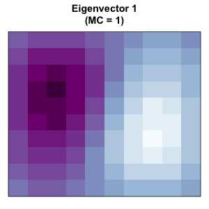</td>
<td style="text-align: center;">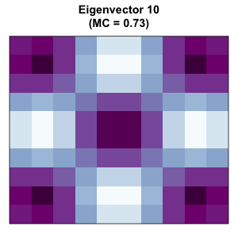</td>
<td style="text-align: center;">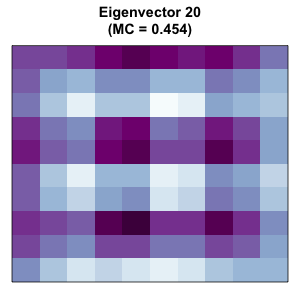</td>
<td style="text-align: center;">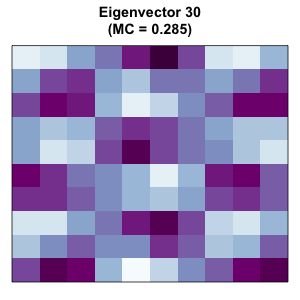</td>
</tr>
<tr class="even">
<td style="text-align: center;">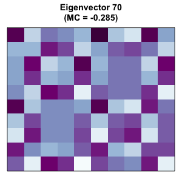</td>
<td style="text-align: center;">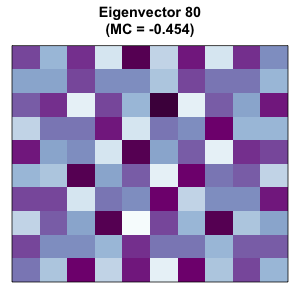</td>
<td style="text-align: center;">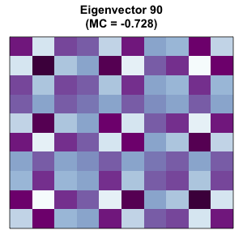</td>
<td style="text-align: center;">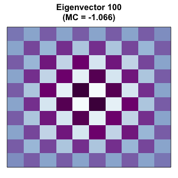</td>
</tr>
</tbody>
</table>
<figcaption>Figure 1: Visualization of Eigenvectors and their respective
Moran coefficient (MC). Positive spatial patterns are shown in the first
row while negative patterns are depicted in the second row.</figcaption>
</figure>

Based on the MC values, users can define the candidate set
$\mathbf{E}^C$ and select relevant eigenvectors based on any desired
selection criterium. Using the threshold suggested by @griffith2003
outlined above, the set $\mathbf{E}^C$ consists of $31$ eigenvectors.
For illustrative purposes, I skip the second step of the eigenvector
selection procedure and include all eigenvectors in the ESF model so
that $\mathbf{E}^C=\mathbf{E}^*$.

``` r
# identify candidate set
R> Ec <- EVs$moran/max(EVs$moran)>=.25

# obtain ESF residuals
R> esf.resid <- resid(lm(y~X+E[,Ec]))

# check for remaining spatial autocorrelation in model residuals
R> MI.resid(esf.resid,x=X,W=W,alternative="greater")

         I         EI       VarI        zI       pI  
-0.1836998 -0.0119261 0.01207299 -1.563326 0.941012
```

The results indicate that the ESF approach successfully removed positive
spatial autocorrelation from regression residuals. Furthermore, the
functions `partialR2()` and `vif.ev()` included in the *spfilteR*
package allow users to investigate the proportion of explained variance
by each eigenvector and identify potential problems of variance
inflation. In this example, eigenvector 13 accounts for about $23.21\%$
of the variance in $\mathbf{y}$. Moreover, none of the eigenvectors
induces problematic levels of multicollinearity as the variance
inflation factor (VIF) of each eigenvectors remains close to $1$.

``` r
R> round(partialR2(y=y,x=X,evecs=E[,Ec]),6)

0.000377 0.060584 0.001004 0.028734 0.020554 0.004804 0.000091 0.007010
0.030418 0.079015 0.004550 0.000012 0.232083 0.011407 0.000959 0.004993
0.001714 0.000094 0.036713 0.044113 0.006588 0.005762 0.001845 0.009648
0.002761 0.031923 0.007490 0.000075 0.004271 0.004042 0.004060

R> vif.ev(x=X,evecs=E[,Ec],na.rm=TRUE)

1.004420 1.001660 1.050409 1.049729 1.011899 1.001588 1.008393 1.000929
1.034209 1.013360 1.000230 1.000027 1.005781 1.022793 1.073397 1.015425
1.014602 1.014900 1.000798 1.002998 1.004616 1.019448 1.001397 1.015900
1.005540 1.000474 1.018344 1.008363 1.000284 1.009756 1.086114
```

## Unsupervised spatial filtering

Besides the supervised eigenvector selection procedure, the function
`lmFilter()` performs unsupervised spatial filtering and provides
parameter estimates by means of OLS. Importantly, users can specify
different selection criteria. Thereby, this function eases the
implementation of the ESF approach while simultaneously providing
considerable flexibility regarding the stepwise selection of
eigenvectors. Specifically, the following input arguments allow users to
customize the selection procedure and ensure the function's flexibility:

-   `objfn` allows users to determine the objective function of the
    search algorithm determining $\mathbf{E}^*$. It supports eigenvector
    selection based on the adjusted $R^2$ (`’R2’`), residual spatial
    autocorrelation (`’MI’`), the significance of eigenvectors (`’p’`),
    and the significance level of residual spatial autocorrelation
    (`’pMI’`). Alternatively, all eigenvectors may be included by
    spefifying `objfn=’all’`, implying that no selection takes place.
-   `MX` (optional) specifies the covariates used to construct the
    projection matrix $\mathbf{M}$. As @tiefelsdorf2007 show, the
    specification of $\mathbf{M}$ is directly linked to the form of the
    spatial misspecification in the unfiltered naïve regression model.
-   `sig` and `bonferroni` indicate the significance level if the search
    algorithm selects eigenvectors based on their significance or the
    significance of residual spatial autocorrelation. If
    `bonferroni=TRUE` and `objfn=’p’`, the significance level will be
    adjusted in order to account for inflated Type-I errors. If
    `objfn=’pMI’`, `bonferroni` is automatically set to `FALSE`.
-   `positive` (`TRUE` or `FALSE`) restricts the eigenvector search to
    those eigenvectors associated with positive levels of spatial
    autocorrelation.
-   `ideal.setsize` (`TRUE` or `FALSE`) determines the ideal size of the
    candidate set $\mathbf{E}^C$ according to the formula given in
    @chun2016. Note that this is only valid when filtering for positive
    spatial autocorrelation.
-   `alpha` allows users to specify a threshold for the inclusion of
    eigenvectors in the candidate set based on their MC values [see
    @griffith2003].
-   `tol` sets a tolerance threshold for remaining residual
    autocorrelation if `objfn=’MI’`. Once the level of residual
    autocorrelation reaches the threshold, the selection procedure
    terminates.
-   `boot.MI` (optional) takes integers indicating the number of
    bootstrap permutations in order to estimate the variance of the
    Moran test for residual autocorrelation.

These arguments allow users to customize the ESF model and obtain
parameter estimates by using a single function call and only a few lines
of code. While the `print` method for the output --- an object of class
`"spfilter"` --- only reports the number of selected eigenvectors in
$\mathbf{E}^*$ and the size of the candidate set $\mathbf{E}^C$, the
`summary` method provides a host of useful additional information.

``` r
R> (esf <- lmFilter(y=y,x=X,W=W,objfn="p",sig=.1,bonferroni=TRUE
+                   ,positive=TRUE,ideal.setsize=TRUE))

3 out of 22 candidate eigenvectors selected

R> summary(esf,EV=TRUE)

	- Spatial Filtering with Eigenvectors (Linear Model)  -

Coefficients (OLS):
            Estimate         SE      p-value    
(Intercept) 9.370881 0.71253832 4.103548e-23 ***
beta_1      0.975771 0.08536198 1.511830e-19 ***

Adjusted R-squared:
  Initial  Filtered 
0.4673945 0.6534442 

Filtered for positive spatial autocorrelation
3 out of 22 candidate eigenvectors selected
Objective Function: "p" (significance level=0.1)
Bonferroni correction: TRUE (adjusted significance level=0.00455)

Summary of selected eigenvectors:
       Estimate       SE      p-value  partialR2      VIF        MI    
ev_13 -9.552977 1.626696 6.290028e-08 0.23208263 1.005781 0.6302019 ***
ev_10 -5.571465 1.632824 9.483754e-04 0.07901543 1.013360 0.7303271 ***
ev_2   4.900028 1.623316 3.261057e-03 0.06058390 1.001660 1.0004147  **

Moran's I ( Residuals):
          Observed    Expected   Variance        z      p-value    
Initial  0.3505680 -0.01192610 0.01207299 3.299085 0.0004850019 ***
Filtered 0.1397003 -0.03703186 0.02417938 1.136562 0.1278607838
```

Besides the parameter estimates of the filtered model, the `summary`
method provides information on the fit of the filtered and the
unfiltered models, the objective function, and the Moran test for
residual autocorrelation. If users specify `EV=TRUE`, information on the
included eigenvectors in the order of their selection will be displayed
as well. Just like above, we see that the eigenvector 13, for example,
explains $23.21\%$ of the variance, and the VIF indicates no problems of
multicollinearity in the filtered model. The adjusted $R^2$ also shows
that the ESF approach considerably improves model fit.

<figure id="fig:output">
<table>
<caption> </caption>
<tbody>
<tr class="odd">
<td style="text-align: center;">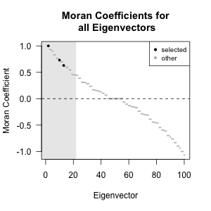</td>
<td style="text-align: center;">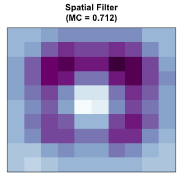</td>
<td style="text-align: center;">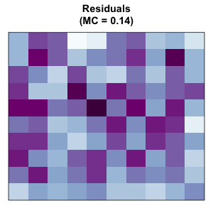</td>
</tr>
</tbody>
</table>
<figcaption>Figure 2: Plotting method for objects of class
<code>"spfilter"</code> (left), spatial pattern captured by the filter
and calculated by <code>MI.sf()</code> (center), and spatial patterns of
filtered residuals (right).</figcaption>
</figure>

Finally, the left part of Figure [2](#fig:output) demonstrates the
plotting method for objects of class `"spfilter"` which is produced by
`plot(esf)`. It visualizes the MC of each eigenvector and highlights the
ones selected by the unsupervised selection procedure. The grey shaded
area illustrates the candidate set $\mathbf{E}^C$ from which the
eigenvectors in $\mathbf{E}^*$ are selected. Figure [2](#fig:output)
further depicts the spatial pattern of the spatial filter (center) and
the filtered residuals (right). The function `MI.sf()` computes the MC
value associated with the map pattern depicted by the spatial filter
$\mathbf{E}^*\mathbf{\gamma}$ in Equation (\@ref(eq:filter)) [e.g.,
@legallo2013].

## Spatial filtering in generalized linear models

The ESF methodology directly extends to GLMs. In fact, one of the
advantages of the filtering approach as compared to parametric spatial
regression models in this context is that parameter estimates can be
obtained by standard MLE and do not require the application of more
sophisticated estimation techniques [@griffith2019].

Besides the supervised filtering procedure, the function `glmFilter()`
from the *spfilteR* package allows users to perform unsupervised spatial
filtering in GLMs. While its usage is purposefully similar to the
function `lmFilter()` introduced above, GLMs require some adjustments of
the filtering procedure. As a result, `glmFilter()` not only uses MLE
instead of OLS to obtain parameter estimates but also differs in some of
the function's input. Hence, in addition the input already discussed
above, `glmFilter()` differs to `lmFilter()` with respect to the
following input arguments:

-   `objfn` defines the eigenvector selection criterium. Possible
    criteria are the maximization of model fit (`’AIC’` or `’BIC’`),
    minimization of residual autocorrelation (`’MI’`), the significance
    level of candidate eigenvectors (`’p’`), the significance of
    residual spatial autocorrelation (`’pMI’`), or all eigenvectors in
    the candidate set (`’all’`).
-   `model` specifies the type of model to be estimated. The current
    version of *spfilteR* (version 1.0.0) supports `’probit’`,
    `’logit’`, and `’poisson’` as input.
-   `optim.method` determines the method used to optimize the likelihood
    function.
-   `min.reduction` takes values in the interval $[0,1)$. It defines the
    minimum level of reduction in the AIC or BIC (if either selection
    criterium is chosen) relative to the current AIC/ BIC a candidate
    eigenvector needs to achieve in order to be included in the spatial
    filter.
-   `resid.type` allows users to specify the type of residuals which is
    used to calculate the MC value. Valid arguments are `’raw’`,
    `’deviance’`, and the default option `’pearson’`.

Implementing the ESF approach in GLMs using `glmFilter()` requires as
few lines of code as using the `lmFilter()` function in the context of
linear regression models. The following example demonstrates the ease of
implementation in the context of a logit, a probit, and a Poisson
regression model:

``` r
# define DVs
R> y.bin <- fakedataset$indicator
R> y.count <- fakedataset$count

# seed (because of 'boot.MI')
set.seed(123)

# logit model
R> (esf.logit <- glmFilter(y=y.bin,x=NULL,W=W,objfn="p",model="logit",optim.method="BFGS"
+                          ,sig=.05,bonferroni=FALSE,resid.type="pearson",boot.MI=100))

3 out of 31 candidate eigenvectors selected

# probit model
R> (esf.probit <- glmFilter(y=y.bin,x=NULL,W=W,objfn="BIC",model="probit"
+                           ,optim.method="BFGS",min.reduction=0,resid.type="deviance"
+                           ,boot.MI=100))

2 out of 31 candidate eigenvectors selected

# poisson model
R> (esf.poisson <- glmFilter(y=y.count,x=NULL,W=W,objfn="pMI",model="poisson"
+                            ,optim.method="BFGS",sig=.1,resid.type="pearson"
+                            ,boot.MI=100))

0 out of 31 candidate eigenvectors selected
```

Of course, users can also define their own eigenvector selection
criteria or apply the ESF approach to models currently not supported by
the `glmFilter()` function. Just like for linear regression models
illustrated above, the function `getEVs()` performs the eigenfunction
decomposition of the transformed and symmetrized connectivity matrix,
and users can implement a supervised selection procedure using the
standard `glm()` function.

## A brief comparison to other R packages

Of course, alternative implementations of the ESF approach outlined here
exist in other R packages as well. While these packages are highly
useful for spatial analysts, the *spfilteR* package offers a couple of
notable extensions that improve these existing implementations.[^5]

The *spmoran* package developed by @murakami2020 contains different
functions for estimating eigenvector-based spatial additive mixed
models. Although the function `esf()` estimates a linear spatial
filtering model, the main advantages of this package are the estimation
of the random effects ESF model [e.g., @murakami2019] and the fast
approximation of the eigenfunction decomposition, which makes this
package especially useful for large datasets. Moreover, users can also
use the functions `meigen()` and `meigen_f()` to obtain eigenfunctions
and perform supervised eigenvector selection.

At the same time, the eigenvector selection criteria implemented in
`esf()` only allow for the identification of relevant eigenvectors based
on model fit statistics such as the adjusted $R^2$, the AIC, or the BIC.
The specification of the projection matrix $\mathbf{M}$ also does not
allow for the inclusion of covariates. Furthermore, the *spmoran*
package does not support the ESF approach in the context of GLMs.

Alternatively, the *spatialreg* package, which encompasses a great
variety of different spatial estimation techniques, not only provides
the `SpatialFiltering()` function estimating spatially filtered linear
models. It also allows for the estimation of spatially filtered GLMs by
using `ME()`. Yet, both of these functions utilize an objective function
that selects eigenvectors based on the overall reduction of residual
autocorrelation. While it is possible to restrict the candidate set size
and to customize the level of remaining autocorrelation at which the
search terminates, users cannot select alternative objective functions.
Moreover, `ME()` does not allow for the inclusion of covariates in the
construction of $\mathbf{M}$. Since there is no function to perform the
eigenfunction decomposition shown in Equation (\@ref(eq:MVM)), the
package offers no support for supervised spatial filtering.

Therefore, the *spfilteR* package provides additional flexibility --
especially for the estimation of filtered linear and generalized linear
models where the ESF approach is predominantly applied. Since the
eigenvector selection procedure is the crucial step in the ESF approach,
the options provided by `lmFilter()` and `glmFilter()` allow users to
tailor the ESF procedure to their specific needs. The option to estimate
the ideal size of the eigenvector candidate set $\mathbf{E}^C$ according
to @chun2016, the specification of different residual types in GLMs, and
the ability to define a threshold for the minimum increase in model fit
when an objective function is chosen accordingly are examples of
features unique to the *spfilteR* package.

Despite this additional flexibility, the functions that perform
unsupervised eigenvector selection are very easy to use and only require
a minimum of code. Moreover, the `getEVs()` command and several
additional helper functions such as `MI.ev()`, `MI.sf()`, `partialR2()`,
and `vif.ev()` introduced above facilitate the estimation of spatially
filtered (generalized) linear models. Consequently, while the *spmoran*
and the *spatialreg* packages cover additional model types and
estimation strategies, the flexibility provided by the *spfilteR*
package constitutes a great advantage in the most common applications of
the ESF approach.

# Summary

This article briefly covers the basics of spatial filtering with
eigenvectors and introduces the *spfilteR* package. Using the synthetic
dataset provided by the package, it discusses the main functions and
their implementation in the context of supervised and unsupervised
spatial filtering as well as its extension to GLMs. By comparing the
package to alternative implementations of the ESF approach, this article
highlights that the flexibility provided by the *spfilteR* package
constitutes an important improvement in settings where the ESF approach
is commonly applied.

# Acknowledgments

Funding was provided by the German Research Foundation (DFG) through the
Collaborative Research Center (SFB) 884 (grant number: 139943784). This
work was also supported by a postdoc fellowship of the German Academic
Exchange Service (DAAD).
:::

[^1]: The Moran coefficient for each eigenvector in $\mathbf{E}$ can be
    computed by $MC_i=\lambda_in/\mathbf{1}'\mathbf{V1}$ [e.g.,
    @griffith1996; @tiefelsdorf1995].

[^2]: It is important to note that, just like weights in linear models,
    the presence of a link function corrupts the uncorrelatedness of the
    eigenvectors in generalized linear models [e.g., @griffith2003
    104-105]. To check for problematic levels of multicollinearity among
    the eigenvectors, the function `glmFilter()` in the *spfilteR*
    package reports the condition number [see also @griffith1997].

[^3]: This article is based on version 1.0.0 of the *spfilteR* package.

[^4]: To this end, `getEVs()` calls the helper function `MI.ev()`, which
    calculates the MC for each supplied eigenvector [see also
    @griffith1996; @tiefelsdorf1995].

[^5]: Note that other R packages such as
    [*adespatial*](https://CRAN.R-project.org/package=adespatial)
    [@dray2020] and [*vegan*](https://CRAN.R-project.org/package=vegan)
    [@oksanen2019] also provide tools to eigendecompose a transformed
    connectivity matrix and implement the supervised ESF approach. Yet,
    since these packages are not primarily concerned with ESF and do not
    support unsupervised spatial filtering, I do not discuss them in
    greater detail here.
