::: article
# Introduction {#sec:intro}

The [*vote*](https://CRAN.R-project.org/package=vote) package implements
several electoral methods: plurality voting, approval voting, score
voting, Condorcet methods, and Single Transferable Vote (STV) methods
[@vote].

In developing the package, we were motivated particularly by the needs
of organizations with small electorates, such as learned societies,
clubs, and university departments, who may need to elect more than one
person in a given election. In the early 1980s, one of us (BWS) was a
member of the Royal Statistical Society (RSS) Council. At that time, six
members of the Council were elected at a time. A nominating committee
nominated six candidates, and the RSS membership as a whole voted, with
each member allowed to vote for up to six candidates, and the six
candidates with the most votes being elected. Usually, there were only
the six nominated candidates, but that year a seventh candidate stood on
a platform different from that of the "official" candidates. This
candidate received votes from about a quarter of the electorate but was
not elected because the other three-quarters of the members voted as a
block for the six candidates proposed by the nominating committee.

This was viewed as unsatisfactory because the seventh candidate's
position was not represented on the Council, even though it had
substantial support among the RSS membership. This led the RSS Council
to undertake a study of electoral methods for multi-winner elections,
with a view to adopting a more representative system. They selected the
Single Transferable Vote (STV) method, which was then adopted for
Council elections, initially using a program in the Pascal programming
language developed by @Hill&1987. In the next election, held under STV,
the seventh candidate stood again and was elected. STV has been used
since then to elect the RSS Council.

In 2002, the Institute of Mathematical Statistics (IMS), the leading
international association of academic mathematical statisticians,
considered the same issue and came to the same conclusion, also adopting
STV for its Council elections. They used an R program developed by BWS
[@Silverman2002; @Silverman2003], who was also then the IMS President.
This R program became the core of the *vote* package that we are
describing here. This STV electoral method has been used since then by
the IMS.

Since then, another one of us (AER) has implemented the STV method in
the context of small electorates selecting or ranking multiple
candidates, such as nominating committees selecting multiple awardees
for a prize, or academic departments selecting job candidates for
interviews. Those involved have generally reported finding the method
satisfactory. This experience has led to several modifications of the
program that are also implemented in the package.

Our implementation and discussion of STV and other systems is aimed
particularly at those involved in non-party-political elections and
decisions, such as those outlined above. Questions of what approaches
are or are not desirable for national elections are matters of political
science beyond the scope of this paper, which is not intended to
advocate for or against the use of any particular voting systems in that
context. However, a brief review may be informative.

The USA and the UK, for their national legislatures, almost entirely use
the plurality, "first past the post" or "winner takes all" system, where
the leading candidate in each district is elected. The Electoral College
for the US presidency is also elected this way, but with an election
between slates rather than individuals, in all states except Maine and
Nebraska. On the other hand, the majority of countries use some system
that (in principle at least) aims for the elected body to represent the
views of the wider electorate proportionately, either over the country
as a whole or within larger electoral districts. However, pure
proportional systems are fairly unusual, for example because in
nationwide proportional systems there is often a threshold below which a
party will not have any representation. The Single Transferable Vote
system is used to elect the parliaments or national assemblies of the
Republic of Ireland, Northern Ireland, and Malta, as well as upper
houses and/or local assemblies in some other countries
[@WikipediaSTV2020], and we draw an example from a Dublin election in
the paper.

As we have said, it is not our purpose to advocate any one electoral
method, and indeed it is well known that there is no one method that
dominates all others given a reasonable set of criteria, according to
the impossibility theorems of @Arrow1963, @Gibbard1973 and
@Satterthwaite1975. Indeed, method choice can depend on the purpose of
the election, and a method that works well for one purpose (such as
representing the views of the electorate), may not be best for others
(such as electing an effective team to work together) [@Syddique1988].
As a result, we have implemented multiple electoral methods in the
package. Pros and cons of a wide range of different electoral systems
are described in @Ace2020, but these focus on nationwide political
elections, whereas here we also pay attention to smaller, often
non-political elections, such as those for councils and committees.

The paper is organized as follows. In Section [2](#sec:methods), we
describe the plurality, two-round runoff, approval, score, and Condorcet
vote-counting methods. In Section [3](#sec:STV), we describe the STV
method, including the first software implementation of the equal
preference STV method, to our knowledge. This also describes a new
variant of STV, which enforces minimal representation of a marked group.
In Section [4](#sec:examples), we describe three multi-winner elections
with electorates of different sizes: an election from one constituency
in the 2002 Irish General Election, an election of the IMS Council, and
a vote to select job candidates by a university department. We conclude
in Section [5](#sec:discussion) with the discussion of issues including
other R packages for vote-counting.

# Electoral methods {#sec:methods}

In this section, we describe several electoral methods and how they are
implemented in the *vote* package. We defer description of STV to
Section [3](#sec:STV).

We first illustrate the results here with the toy `food_election`
dataset:

``` r
> library (vote)
> data (food_election)
> food_election
```

``` r
   Oranges Pears Chocolate Strawberries Sweets
1       NA    NA         1            2     NA
2       NA    NA         1            2     NA
3       NA    NA         1            2     NA
4        2     1        NA           NA     NA
5       NA    NA        NA            1     NA
6        1    NA        NA           NA     NA
7       NA    NA        NA           NA      1
8        1    NA        NA           NA     NA
9       NA    NA         1            2     NA
10      NA    NA         1           NA      2
11       1    NA        NA           NA     NA
12      NA    NA         1            2     NA
13      NA    NA         1            2     NA
14      NA    NA         1            2     NA
15      NA    NA         1           NA      2
16       1    NA        NA           NA     NA
17      NA    NA         1           NA      2
18       2     1        NA           NA     NA
19      NA    NA         1           NA      2
20      NA    NA         1            2     NA
```

In this toy dataset, voters were asked to rank the options in order of
preference. They gave only their first two preferences, although they
could have given more; an `NA` indicates that no preference was
expressed.

## Plurality voting {#subsec:plurality}

Plurality voting, or First-Past-The-Post, is used for single-winner
elections, such as elections to the House of Representatives in the USA
or the House of Commons in the UK. Each voter votes for one candidate,
and the candidate with the most votes wins.

To implement this with our toy dataset, we first converted it to a
dataset where only first preferences count:

``` r
> food_election_plurality <- 1 * (food_election == 1 & !is.na (food_election))
> head(food_election_plurality)
```

``` r
     Oranges Pears Chocolate Strawberries Sweets
[1,]       0     0         1            0      0
[2,]       0     0         1            0      0
[3,]       0     0         1            0      0
[4,]       0     1         0            0      0
[5,]       0     0         0            1      0
[6,]       1     0         0            0      0
```

We then counted the votes using the `plurality` command:

``` r
> plurality (food_election_plurality)
```

``` r
Results of Plurality voting
===========================                           
Number of valid votes:   20
Number of invalid votes:  0
Number of candidates:     5
Number of seats:          1


|    |Candidate    | Total| Elected |
|:---|:------------|-----:|:-------:|
|1   |Chocolate    |    12|    x    |
|2   |Oranges      |     4|         |
|3   |Pears        |     2|         |
|4   |Strawberries |     1|         |
|5   |Sweets       |     1|         |
|Sum |             |    20|         |

Elected: Chocolate 
```

Plurality voting has the advantage of simplicity. In political
elections, it tends not to yield results that are in direct proportion
to support among the voters but to amplify pluralities when compared to
proportional voting systems, which merge single-winner districts into
larger multi-member groups. In general, any large party which has strong
support across a large number of electoral districts will do well under
plurality voting, while smaller parties or interests will tend to be
underrepresented numerically, especially if they are evenly or thinly
spread. This may mean that important interests are not represented,
while on the other hand, it may present a barrier to the traction of
extremist groups. The US Electoral College is, in nearly all states,
elected by a plurality voting system, with multiple members, all being
elected simultaneously.

Plurality voting in individual-member districts tends to lead to
one-party governments with working majorities, even when the leading
party does not achieve half of the popular vote. It also allows
districts to be smaller to facilitate direct contact between a voter and
their representative and identifies each representative more closely
with all the voters in their district.

Another effect of plurality voting can be to "waste" the votes of those
who live in highly polarised districts, because they win their
particular district by a very wide margin; this seems to be a deliberate
feature of much redistricting in the USA. In non-political elections in
the smaller contexts of primary concern in this paper, there is little
or no need for a stable one-"party" result, and the desirability of
closer proportional representation of the views of the voters is less
contentious, and so there is likely to be a clearer case for using other
voting systems wherever possible.

## Two-round runoff voting {#subsec:two-round}

Two-round systems are also used for single-winner elections. In the
first round, voters vote for their first preference. If no candidate
gets a majority, there is a second round that involves the top two
candidates. Voters vote again, and the candidate getting more votes
wins.

In the *vote* package, we implemented a variant of this system that can
be counted in a single pass over the data. Each voter ranks the
candidates in order of preference. The first round takes place as
described. The second round is counted as if voters voted for the
remaining candidate for which they had a higher preference.

To illustrate the two-round runoff system, we modify the food election
data by removing voters 12--15, so that Chocolate does not have a
majority on the first round:

``` r
> food_election3 <- food_election[-c(12:15),]
> tworound.runoff (food_election3)
```

``` r
Results of two-round-runoff voting
==================================                           
Number of valid votes:   16
Number of invalid votes:  0
Number of candidates:     5
Number of seats:          1


|    |Candidate    | Total| Percent| ROffTotal| ROffPercent| Elected |
|:---|:------------|-----:|-------:|---------:|-----------:|:-------:|
|1   |Oranges      |     4|    25.0|         6|        42.9|         |
|2   |Pears        |     2|    12.5|         0|         0.0|         |
|3   |Chocolate    |     8|    50.0|         8|        57.1|    x    |
|4   |Strawberries |     1|     6.2|         0|         0.0|         |
|5   |Sweets       |     1|     6.2|         0|         0.0|         |
|Sum |             |    16|   100.0|        14|       100.0|         |

Elected: Chocolate 
```

We see that no candidate got a majority on the first round, although
Chocolate came close. In the second round, the two top vote-getters,
Chocolate and Oranges, squared off, and Chocolate won.

In the `tworound.runoff` function, a tie in either the first or the
runoff round is resolved by random draw. A random seed can be specified
so that the results are replicable.

Two-round elections are quite common, most famously for French
presidential elections since 1965. In practice, it is usually carried
out by voters actually voting twice, rather than ranking candidates as
here. An exception to it is a special case of the two-round runoff,
called supplementary voting, where voters give only their first and
second preferences on one ballot, the same way as happened in our food
example. Supplementary voting is used, for example, in electing mayors
in England, including the Mayor of London [@LondonElects2020].

The two-round runoff system differs from plurality voting in that voters
for candidates with low levels of support can change their votes to one
of the leading candidates so that they can express support for a
possibly less popular first choice without their vote being "wasted". Of
course, the choice between the two finalists shares some of the aspects
of plurality voting.

## Approval voting {#subsec:approval}

Approval voting was advocated by @BramsFishburn1978. In this system,
voters vote for as many candidates as they wish. It has been most often
advocated for single-winner elections, in which case the winner is the
candidate with the most votes [@BramsFishburn2007]. A direct extension
to multi-winner elections with $m$ winners is that voters vote in the
same way, and the $m$ candidates with the most votes win.

Counting the votes is simple. The argument `nseats` determines the
number of winners $m$:

``` r
> food_election_approval <- 1 * !is.na (food_election)
> approval (food_election_approval, nseats = 2)
```

``` r
Results of Approval voting
==========================                           
Number of valid votes:   20
Number of invalid votes:  0
Number of candidates:     5
Number of seats:          2


|    |Candidate    | Total| Elected |
|:---|:------------|-----:|:-------:|
|1   |Chocolate    |    12|    x    |
|2   |Strawberries |     9|    x    |
|3   |Oranges      |     6|         |
|4   |Sweets       |     5|         |
|5   |Pears        |     2|         |
|Sum |             |    34|         |

Elected: Chocolate, Strawberries 
```

Approval voting for multi-winner elections has been criticized on
various grounds, e.g., @Hill1988, and indeed in the book by
@BramsFishburn1983 that advocated and popularized approval voting for
single-winner elections. For elections in which there are parties or
slates of candidates, it would tend to lead to the election of all the
members of the most supported party or slate, as happened in the RSS
Council election that first motivated this work. However, one of us
\[AER\] has participated in multi-winner elections using approval voting
and has observed it to work well, particularly when there are many
candidates about whom information is limited and there are no parties or
slates. One example could be the early stages of job candidate selection
when a long list is being whittled down to a small set of finalists.

## Score voting {#subsec:score}

In the score or range voting, each voter gives each candidate a score
within a prespecified range. If the voter does not give a score to a
particular candidate, a corresponding prespecified score is assigned.
The candidates with the lowest scores win (or the highest scores if
higher scores are better). In the `score` function, the argument
`larger.wins` specifies whether lower scores are better or higher scores
are better. The argument `max.score` sets the prespecified non-vote
score. Here, we illustrate score voting by applying it to the food
election example, where the score is equal to the preference, a non-vote
is assigned a value of 6, and lower scores are better:

``` r
> score (food_election, larger.wins = FALSE, nseats = 2, max.score = 6)
```

``` r
Results of Score voting
=======================                           
Number of valid votes:   20
Number of invalid votes:  0
Number of candidates:     5
Number of seats:          2


|    |Candidate    | Total| Elected |
|:---|:------------|-----:|:-------:|
|1   |Chocolate    |    60|    x    |
|2   |Strawberries |    83|    x    |
|3   |Oranges      |    92|         |
|4   |Sweets       |    99|         |
|5   |Pears        |   110|         |
|Sum |             |   444|         |

Elected: Chocolate, Strawberries 
```

Score voting is often used by committees for purposes such as selecting
grant applications to be funded. In such cases, there are often many
candidates or applications to be assessed, and it would not be feasible
for the voters to produce a complete ranking. Score voting is similar to
multi-winner approval voting in this sense but allows for a more refined
assessment by the voters. Multi-winner approval voting is actually a
special case of score voting.

## Condorcet method {#subsec:Condorcet}

The Condorcet method is attributed to Marquis de
Condorcet [@Condorcet1785]. It is a single-winner method where voters
rank the candidates according to their preferences. The so-called
*Condorcet winner* is the candidate who wins the majority of votes in
all head-to-head comparisons. In other words, each candidate is compared
pairwise to all other candidates. To become the Condorcet winner, one
has to win all such comparisons. Analogously, a *Condorcet loser* is the
candidate who loses in every pairwise comparison.

The `condorcet` function can be applied directly to the food election
data:

``` r
> condorcet(food_election)
```

``` r
Results of Condorcet voting
===========================                           
Number of valid votes:   20
Number of invalid votes:  0
Number of candidates:     5
Number of seats:          1


|             | Oranges| Pears| Chocolate| Strawberries| Sweets| Total| Winner | Loser |
|:------------|-------:|-----:|---------:|------------:|------:|-----:|:------:|:-----:|
|Oranges      |       0|     1|         0|            0|      1|     2|        |       |
|Pears        |       0|     0|         0|            0|      0|     0|        |   x   |
|Chocolate    |       1|     1|         0|            1|      1|     4|   x    |       |
|Strawberries |       1|     1|         0|            0|      1|     3|        |       |
|Sweets       |       0|     1|         0|            0|      0|     1|        |       |

Condorcet winner: Chocolate
Condorcet loser: Pears
```

The output above shows the results of all the pairwise comparisons.
Chocolate beat all other candidates and was, therefore, the Condorcet
winner. Similarly, Pears lost against all other candidates and was thus
the Condorcet loser.

The Condorcet method does not guarantee that a Condorcet winner exists.
There are many different ways to deal with such a situation; see, for
example, @WikipediaCondorcet2020. Our implementation offers the
possibility of a runoff (argument `runoff`). In this case, two or more
candidates with the most pairwise wins are selected, and the Condorcet
method is applied to such subset. If more than two candidates are in
such a runoff, the selection is performed repeatedly until either a
winner is selected or no more selection is possible.

To our knowledge, the Condorcet method is not used for governmental
elections anywhere in the world. @WikipediaCondorcet2020 cites a few
private organizations that use the method, e.g., the Student Society of
the University of British Columbia.

# Single Transferable Vote (STV) {#sec:STV}

The Single Transferable Vote (STV) system is also referred to as Ranked
Choice Voting (RCV), Instant Runoff Voting (IRV), or the Alternative
Vote (AV) system for single-winner elections, and as Multi-Winner Ranked
Choice Voting for multi-winner elections. One of the properties of the
Single Transferable Vote system is that if any subset of candidates gets
a sufficient share of the votes, anything strictly exceeding $1/(m+1)$,
where $m$ is the number of candidates to be elected, then one of this
group is bound to be elected. To be precise, what is required is that a
proportion above $1/(m+1)$ of the voters have to put all the candidates
in the subset at the top of their list of preferences, but it does not
matter in what order. This would apply equally if the subset was a
particular slate/party, or specified by some other group characteristic
such as sex, race, geographical location, career stage, or subject area,
even if the subset was not consciously constituted. In particular, if a
candidate's proportion of the first preference votes is above $1/(m+1)$,
then that candidate will be successful.

There is also the fact that a group is not disadvantaged if more of its
members stand for election, at least if their voters vote along group
lines the full way down the preferences. Unlike in some other systems,
they cannot cancel each other out.

When STV was adopted for the elections of the Council of the RSS in the
mid-1980s and the IMS in 2002, it was hoped that it would lead to more
diverse Councils than the results of the previous methods, and also that
individual members, other than those chosen by the nominating committee,
would feel able to stand with a real chance of being elected.

## STV method {#subsec:STV}

There are many descriptions of the STV system
[@Newland&1997; @FairVote2020] and its history
[@Hill1988; @Tideman1995]. The basic principle is that voters rank the
candidates in order of preference. In order to be elected, a candidate
must achieve the quota of $N/(m+1) + \varepsilon$, where $N$ is the
total number of votes cast, $m$ is the number of candidates to be
elected (or seats), and $\varepsilon$ is a pre-specified small positive
number, often taken to be 1 when the electorate is large and 0.001 when
it is small. Excess votes over the quota are appropriately downweighted
and allocated to the next preference of voters. If no candidate reaches
the quota, the candidate with the smallest number of votes is eliminated
and his or her votes are transferred to the next preferences.

Voters are asked to rank the candidates $1,2,3,\ldots$ until they have
no further preference between candidates. Thus 1 is a voter's first
preference, 2 is their next choice, and so on. There is no disadvantage
to higher candidates in expressing a full list of preferences; later
preferences are used only when the fate of candidates given higher
preferences has been decided one way or the other.

By default, a vote is considered spoiled if the preferences are not
numbered consecutively, starting at 1. However, if this is not desired,
the votes can be preprocessed to be consecutive using the
`correct.ranking` function in the *vote* package. A useful application
of this correction is the case when a candidate has to be removed,
perhaps because of having withdrawn his or her candidacy. In this case,
the function `remove.candidate` can be used, which removes the given
candidate(s) from the set of votes, and also adjusts the preferences to
be consecutive. The package optionally allows the user to accept a
partially correct ranking. That is, only preferences equal to or higher
than the non-consecutive rankings are removed. For example, with this
option, a valid version of a vote $1,2,3,4,4,5$ would be $1,2,3,0,0,0$.

Also by default, apart from the candidates not numbered at all, no ties
are allowed among the numbered preferences. However, equal preferences
can be allowed by using the setting `equal.ranking=TRUE` in the `stv`
function, as described in more detail in Section
[3.4](#subsec:equalpref).

The fact that some voters may not express a full list of preferences can
be allowed for by reducing the quota in later counts[^1]. In the *vote*
package, the default is that the quota is reduced in later counts.
However, in some STV systems (such as the electoral system in the
Republic of Ireland), the quota remains constant over counts at the
value that is initially defined. This is specified in the *vote* package
by setting the argument `constant.quota=TRUE` in the `stv` function. In
this implementation of STV, the last candidate is often elected without
reaching the quota, which does not happen when the quota is reduced
appropriately at each count.

In the *vote* package, the votes should be entered into a matrix or data
frame, with the header containing the names of the candidates and each
row the votes cast, with blank preferences being replaced by zeroes or
`NA`s. This will often be done by entering the votes into a spreadsheet
first and then reading the spreadsheet into R. If the data are stored in
a text file, the package allows one to pass the name of the file
directly into the `stv` function while setting the column separator in
the `fsep` argument.

At the end of the process, the program yields a list of the successful
candidates in the order in which they were elected. It also usually
yields a complete ordering of the candidates. This may be useful, for
example, if the purpose of the election is to select job candidates, and
one wishes to have an ordered list of the initially unsuccessful
candidates in case any of those selected decline the offer. Also, in
some systems, candidates can claim expenses if a certain rank is
achieved, which could be another motivation for a runner-up list being
available.

Until the 1980s, STV elections were counted manually by physically
transferring a sample of the ballot papers from the pile of the
candidate being elected or eliminated, to those of the benefitting
candidates. This remains the case in several long-established STV
election systems, such as elections for the Dáil (the lower house of the
Irish parliament). @Meek1969 [@Meek1970] described the form a
computer-based STV system could take, and this was implemented in Pascal
by @Hill&1987. This code was used for the RSS Council elections. A
modified version was implemented in R by @Silverman2002
[@Silverman2003], and this was the starting point for the current STV
implementation in the *vote* package.

Here is the result of the food election with two candidates to be
elected, using the `stv` function:

``` r
> stv (food_election, nseats = 2)
```

``` r
Results of Single transferable vote
===================================                           
Number of valid votes:   20
Number of invalid votes:  0
Number of candidates:     5
Number of seats:          2


|             |         1| 2-trans|     2| 3-trans|      3| 4-trans|       4|
|:------------|---------:|-------:|-----:|-------:|------:|-------:|-------:|
|Quota        |     6.668|        | 6.667|        |  6.667|        |   5.278|
|Oranges      |     4.000|   0.000| 4.000|       2|  6.000|   0.000|   6.000|
|Pears        |     2.000|   0.000| 2.000|      -2|       |        |        |
|Chocolate    |    12.000|  -5.332|      |        |       |        |        |
|Strawberries |     1.000|   3.555| 4.555|       0|  4.555|   0.000|   4.555|
|Sweets       |     1.000|   1.777| 2.777|       0|  2.777|  -2.777|        |
|Elected      | Chocolate|        |      |        |       |        | Oranges|
|Eliminated   |          |        | Pears|        | Sweets|        |        |

Elected: Chocolate, Oranges 
```

Oranges was elected second, whereas, under the approval vote system with
first and second preferences treated equally, Strawberries was elected
second. This reflects the fact that Oranges had 4 first preferences,
whereas Strawberries had only 1. Under STV, a vote is credited entirely
to the first preference candidate unless that candidate is elected or
eliminated, in which case the second preferences come into play.
Strawberries had 8 second-preference votes, all of which were from
voters who voted for Chocolate first. The quota was only 56% of the
votes for Chocolate, and so 44% of Chocolate's votes were transferred
when Chocolate was elected. Strawberries gained 3.555 votes this way
from its second preference votes, but this was not quite enough to
overcome Orange's advantage in first preferences. The complete ordering
of candidates can be read off the results: Chocolate, Oranges,
Strawberries, Sweets, Pears. Setting the argument `complete.ranking` to
`TRUE` will include the complete ordering as part of the output.

The package has several functions for visualizing the STV results, and
we will illustrate these in the Examples section below. In addition,
`summary` functions are available for the resulting objects of all
voting methods in the package. In the case of `stv`, the `summary`
function returns a data frame containing the table shown in the above
output, which can be used for further processing, for example, for
storing in a spreadsheet.

## Computational methods {#subsec:computational}

The algorithm used for counting STV elections using the `stv` function
in the *vote* package is shown in Algorithm [1](#alg:stv). There are
only two changes needed to implement STV with equal preferences; these
are shown in Section [3.4](#subsec:equalpref).

{#alg:stv width="100%" alt="graphic without alt text"}

## Tie-breaking {#subsec:tie}

Suppose that on a given count, no candidate is elected, and a candidate
needs to be selected for elimination, and that two or more candidates
are tied with the smallest number of votes. Then a method is needed for
choosing the one to be eliminated. The same issue arises when two
candidates can be elected on the same count with the same number of
votes, namely which surplus to transfer first.

Several different methods have been proposed. The Electoral Reform
Society, one of the leading organizations advocating the use of STV,
recommends using the Forwards Tie-Breaking Method [@Newland&1997 Section
5.2.5]. Other methods such as Backwards Tie-Breaking, Borda
Tie-Breaking, Coombs Tie-Breaking, or a combination of those have been
proposed; see, e.g., @ONeill2004 [@Kitchener2005; @Lundell2006].

By default, the *vote* package uses the Forwards Tie-Breaking Method.
This consists of eliminating/electing the candidate who had the
fewest/most votes on the first count or on the earliest count where they
had unequal votes. If the argument `ties` in the `stv` function is set
to \"`b`\", the Backwards Tie-Breaking Method is used. In this case, it
eliminates/elects the candidate who has the fewest/most votes on the
latest count where the tied candidates had unequal votes.

There is no guarantee that a tie will be broken by either the Forwards
or Backwards Tie-Breaking Method. Also, if one of these two methods does
not break the tie, the other will not either because the tied candidates
will have the same number of votes in all the counts so far. In
particular, this will be the case whenever a tie has to be broken on the
first count, and it is also relatively likely when a tie arises on the
second count.

When there is a tie that Forwards and Backwards Tie-Breaking fail to
break, the `stv` function uses a method that compares the candidates on
the basis of the numbers of individual preferences. We call this the
*Ordered* method as it creates an ordering of the candidates before the
STV count begins. First, candidates are ordered by the number of first
preferences. Any ties are resolved by proceeding to the total number of
second preferences, then the third preferences, and so on. If a tie
cannot be resolved even by counting the last preference, then it is
broken by a random draw with equal probabilities for the tied
candidates. A random seed is specified so that the result is replicable.

Combining Forwards and Backwards Tie-Breaking with the Ordered method
and random sampling, each tie in the `stv` function is broken in one of
the following three ways:

1.  Forwards ("f") or Backwards ("b") Tie-Breaking method alone

2.  Forwards or Backwards Tie-Breaking followed by the Ordered method
    ("fo", "bo")

3.  Forwards or Backwards Tie-Breaking followed by the Ordered method,
    and finally, random sampling ("fos", "bos")

The abbreviation of these three possibilities in parentheses is included
in the STV output whenever a tie is broken during the election count.

Ties of any kind are relatively rare unless the electorate is small. In
very small electorates, ties are more common, but cases where Forwards,
Backwards, and Ordered Tie-Breaking all fail to break the tie are
unusual even then, so election by random draw will be a rare event.

In the earliest version of the software [@Silverman2002], ties were
broken deterministically: if a candidate was to be elected, the
last-named member of a tie was chosen. On the other hand, if there was a
tie for elimination, it was the first-named who was eliminated. These
choices were aimed at compensating in a small way for the tendency of
candidates higher up the ballot paper to get more votes. However, they
depended on position on the ballot paper, which might be viewed as
somewhat arbitrary, and in the *vote* package, we have used a more
systematic criterion.

## Equal preference STV {#subsec:equalpref}

Extant implementations of STV require that voters not give equal
preferences (except among the candidates that they do not rank).
However, @Meek1970 has pointed out that the single transferable vote
system does not exclude this possibility and outlined how the votes
might be counted. This has never been implemented before in software, to
our knowledge, although it is used for the election of the Trustees of
the John Muir Trust [@WikipediaSTV2020].

The basic idea is that if, for example, a voter gives their first
preference to candidates A and B, then the vote will be equally split
between the two, giving half a vote to each. If A is elected, then the
proportion of the half-vote for A corresponding to A's surplus will be
transferred to their next highest preference. This will be B if B is
still in contention, i.e., if B has not been elected or eliminated by
that stage. Otherwise, it will be the remaining candidate with the next
highest preference from that voter. Similarly, if A is eliminated, the
half-vote for A will be fully transferred to their next highest
remaining preference. This will be B if B is still in contention, or
otherwise the candidate with the next highest preference.

The same principle applies if there are three or more equal preferences.
For example, consider the case where there are three equal preferences
A, B, and C, and A is eliminated/elected. If A is elected, the
proportion of the one-third vote for A corresponding to A's surplus is
equally divided between B and C. If A is eliminated, then both B and C
get increased to a half vote. Algebraically, this is implemented by the
change below in Line 11 of Algorithm [1](#alg:stv).

Otherwise, the count proceeds in the same way as when equal preferences
are not allowed. The argument `equal.ranking` in the `stv` function is
set to `TRUE` when equal preferences are allowed. In this case, votes
are postprocessed before counting so that they correctly reflect
preferences. For example, a vote 1, 1, 2, 3, 3, 3 would be recoded to 1,
1, 3, 4, 4, 4. This is in contrast with the usual case where equal
preferences are not allowed and `equal.ranking=FALSE` when votes with
non-sequential preferences, such as 1, 2, 4, 5, are declared invalid and
considered spoiled unless a partial correction is allowed.

STV with equal preferences can be implemented by Algorithm [1](#alg:stv)
with only two relatively small changes, namely:

Line 11

:   replaced by:
    $u_{i,j} \gets w_i \delta_{Y_{i,j}}(1) /\sum_{\ell=1}^M \delta_{Y_{i,\ell}}(1)  \quad \forall \,  i = 1, \dots, N, \; j = 1,\dots,M$

Line 20

:   replaced by:
    $w_r \gets \sum_{j=1}^M u_{r,j} - u_{r,k} + u_{r,k} * S \quad \forall \, r \text{ where } Y_{r,k} = 1$

Note that if applied to votes with no equal preferences, the modified
algorithm yields the same result as Algorithm [1](#alg:stv). In such a
case, the denominator in Line [[algline:u]](#algline:u) is equal to 1
for all $i$, and thus, $u$ is the same as in Algorithm [1](#alg:stv).
Similarly, in Line [[algline:w]](#algline:w),
$\sum_{j=1}^M u_{r,j} - u_{r,k} = 0$ if there are no equal preferences,
and thus, $w$ is the same as in Algorithm [1](#alg:stv).

We illustrate this functionality using the food election data by setting
the first three votes to equal first preferences for Chocolate and
Strawberries, instead of first and second preferences:

``` r
> food_election2 <- food_election
> food_election2[c(1:3), 4] <- 1
> stv (food_election2, equal.ranking = TRUE)
```

``` r
Results of Single transferable vote with equal preferences
==========================================================                           
Number of valid votes:   20
Number of invalid votes:  0
Number of candidates:     5
Number of seats:          2


|             |         1| 2-trans|     2| 3-trans|      3| 4-trans|       4|
|:------------|---------:|-------:|-----:|-------:|------:|-------:|-------:|
|Quota        |     6.668|        | 6.667|        |  6.667|        |   5.437|
|Oranges      |     4.000|   0.000| 4.000|       2|  6.000|   0.000|   6.000|
|Pears        |     2.000|   0.000| 2.000|      -2|       |        |        |
|Chocolate    |    10.500|  -3.832|      |        |       |        |        |
|Strawberries |     2.500|   2.372| 4.872|       0|  4.872|   0.000|   4.872|
|Sweets       |     1.000|   1.460| 2.460|       0|  2.460|  -2.460|        |
|Elected      | Chocolate|        |      |        |       |        | Oranges|
|Eliminated   |          |        | Pears|        | Sweets|        |        |

Elected: Chocolate, Oranges 
```

Once again, Oranges is elected second, ahead of Strawberries, although
the margin of victory is smaller than before.

## Reserved seats in STV {#subsec:groups}

In addition to having a given number of seats to fill, it may be desired
to elect a minimum number of candidates from a specified class or group
of candidates. For example, the selectors of plenary papers at a
conference might wish to reserve at least two slots for students. Or the
election of a committee might wish to ensure that at least three women
were elected.

We have incorporated this feature into the `stv` function as an option.
Users can specify the number of reserved seats with the argument
`group.nseats` and mark the members eligible for those seats in the
argument `group.members`.

When this requirement is present, we modify our STV algorithm as
follows. Suppose $m$ denotes the number of seats and $g$ denotes the
number of reserved seats, and candidates are either *marked* (eligible
for reserved seats) or *unmarked* (not eligible). Then on each count,

-   if the leading candidate exceeds the quota, they are elected, except
    that if $m-g$ unmarked candidates have already been elected, they
    are only elected if they are marked. Or,
-   if no candidate has been elected on this round, the candidate with
    the fewest votes is eliminated, except that if there are only $g$
    marked candidates still in play (including any already elected) or
    if there are already $m - g$ unmarked candidates elected, the
    unmarked candidate with the fewest votes is eliminated (even if that
    number of votes is above the quota).

We will illustrate the reserved seats feature in
Section [4.3](#subsec:committee).

We are not aware of any previous method in the literature to allow for
reserved seats in STV. It seems possible that other methods for doing
this could be developed. For example, one could just eliminate all
remaining unmarked candidates once $m-g$ unmarked candidates had been
elected. It is not clear if or when this would give different results.

In principle, this general approach could be extended to the situation
where there are two or more constraints, such as ensuring that at least
three women and at least two students are elected to a committee of 12.
The basic principles are the same:

-   When eliminating a candidate, make sure that there are enough of the
    right kinds of candidates still in play that all remaining
    constraints can be satisfied.
-   When choosing a candidate to elect, make sure there are enough slots
    left so that the remaining constraints can be satisfied later.

However, in the *vote* package, for now, it is implemented only for one
constraint.

# Examples {#sec:examples}

We now illustrate the different systems using three examples of
elections. Perhaps ironically, systems are more robust with larger than
smaller electorates, in the sense that their results are less sensitive
to small changes in the electoral system. We therefore start with a
political election with a relatively large electorate, continue with the
election of the council of a scientific organization with a
moderate-sized electorate, and finally describe an election with a very
small electorate. Each of these was a multi-winner election, but we will
also use them to illustrate the single-winner electoral methods.

## Irish general election 2002: Dublin West constituency {#subsec:DublinWest}

The Dublin West constituency in the 2002 Irish general election had
three seats to be filled, nine candidates, and just under 30,000 ranked
votes. The dataset, called `dublin_west`, is included in the package.
These data were collected electronically in a trial of electronic
voting, with a system that prevented invalid votes. As a result, there
were no invalid votes, unusually for an election of this kind.

``` r
> data (dublin_west)
> head(dublin_west)
```

``` r
  Bonnie Burton Ryan Higgins Lenihan McDonald Morrissey Smyth Terry
1      0      4    0       3       0        0         1     5     2
2      0      0    2       0       1        4         3     0     0
3      0      0    3       0       1        0         2     0     0
4      0      2    0       0       0        0         3     0     1
5      0      2    1       0       0        0         0     0     0
6      0      3    2       0       1        0         0     0     0
```

We illustrate the single-winner methods by assuming that there is just
one seat to be filled. First we consider the plurality method. It is
necessary to convert the dataset into a set of zeros and ones to run the
`plurality` function:

``` r
> dublin_west1 <- 1*(dublin_west == 1)
> plurality (dublin_west1)
```

``` r
Results of Plurality voting
===========================                              
Number of valid votes:   29988
Number of invalid votes:     0
Number of candidates:        9
Number of seats:             1


|    |Candidate | Total| Elected |
|:---|:---------|-----:|:-------:|
|1   |Lenihan   |  8086|    x    |
|2   |Higgins   |  6442|         |
|3   |Burton    |  3810|         |
|4   |Terry     |  3694|         |
|5   |McDonald  |  2404|         |
|6   |Morrissey |  2370|         |
|7   |Ryan      |  2300|         |
|8   |Bonnie    |   748|         |
|9   |Smyth     |   134|         |
|Sum |          | 29988|         |

Elected: Lenihan 
```

Lenihan was elected, although he received only 27% of the first
preference votes.

Here is the two-round runoff result:

``` r
> tworound.runoff (dublin_west)
```

``` r
|    |Candidate | Total| Percent| ROffTotal| ROffPercent| Elected |
|:---|:---------|-----:|-------:|---------:|-----------:|:-------:|
|1   |Bonnie    |   748|     2.5|         0|         0.0|         |
|2   |Burton    |  3810|    12.7|         0|         0.0|         |
|3   |Ryan      |  2300|     7.7|         0|         0.0|         |
|4   |Higgins   |  6442|    21.5|     12457|        47.3|         |
|5   |Lenihan   |  8086|    27.0|     13900|        52.7|    x    |
|6   |McDonald  |  2404|     8.0|         0|         0.0|         |
|7   |Morrissey |  2370|     7.9|         0|         0.0|         |
|8   |Smyth     |   134|     0.4|         0|         0.0|         |
|9   |Terry     |  3694|    12.3|         0|         0.0|         |
|Sum |          | 29988|   100.0|     26357|       100.0|         |

Elected: Lenihan 
```

Lenihan was again elected, but this time after a run-off, as he did not
get a majority on the first count. He got an absolute majority on the
second count. This indicates a broader base of support than the
plurality vote.

We now illustrate the single-winner approval voting method by assuming
that voters "approved" any candidate to whom they gave their first,
second, or third preference. Under this assumption, voters approved 2.8
candidates on average.

``` r
> dublin_west2 <- 1*(dublin_west == 1 | dublin_west == 2 | dublin_west == 3)
> approval (dublin_west2)
```

``` r
|    |Candidate | Total| Elected |
|:---|:---------|-----:|:-------:|
|1   |Lenihan   | 15253|    x    |
|2   |Higgins   | 13638|         |
|3   |Burton    | 12863|         |
|4   |Ryan      | 10014|         |
|5   |Terry     |  9810|         |
|6   |Morrissey |  9411|         |
|7   |McDonald  |  6674|         |
|8   |Bonnie    |  4936|         |
|9   |Smyth     |   636|         |
|Sum |          | 83235|         |

Elected: Lenihan 
```

Once again, Lenihan wins. The multi-winner approval vote method with
three seats gives wins to Lenihan, Higgins, and Burton because they got
the most votes.

The Condorcet method did have both a winner and a loser in this case:

``` r
> condorcet (dublin_west)
```

``` r
|          | Bonnie| Burton| Ryan| Higgins| Lenihan| McDonald| Morrissey| Smyth| Terry| Total| Winner | Loser |
|:---------|------:|------:|----:|-------:|-------:|--------:|---------:|-----:|-----:|-----:|:------:|:-----:|
|Bonnie    |      0|      0|    0|       0|       0|        0|         0|     1|     0|     1|        |       |
|Burton    |      1|      0|    1|       0|       0|        1|         1|     1|     1|     6|        |       |
|Ryan      |      1|      0|    0|       0|       0|        1|         1|     1|     0|     4|        |       |
|Higgins   |      1|      1|    1|       0|       0|        1|         1|     1|     1|     7|        |       |
|Lenihan   |      1|      1|    1|       1|       0|        1|         1|     1|     1|     8|   x    |       |
|McDonald  |      1|      0|    0|       0|       0|        0|         0|     1|     0|     2|        |       |
|Morrissey |      1|      0|    0|       0|       0|        1|         0|     1|     0|     3|        |       |
|Smyth     |      0|      0|    0|       0|       0|        0|         0|     0|     0|     0|        |   x   |
|Terry     |      1|      0|    1|       0|       0|        1|         1|     1|     0|     5|        |       |

Condorcet winner: Lenihan
Condorcet loser: Smyth
```

The STV result is as follows:

``` r
> stv.dwest <- stv (dublin_west, nseats = 3, eps = 1, digits = 0)
```

``` r
Results of Single transferable vote
===================================                              
Number of valid votes:   29988
Number of invalid votes:     0
Number of candidates:        9
Number of seats:             3
```

``` r
|           |       1| 2-trans|     2| 3-trans|      3| 4-trans|        4| 5-trans|       5| 6-trans|         6| 7-trans|    7| 8-trans|      8|
|:----------|-------:|-------:|-----:|-------:|------:|-------:|--------:|-------:|-------:|-------:|---------:|-------:|----:|-------:|------:|
|Quota      |    7498|        |  7491|        |   7486|        |     7465|        |    7303|        |      7233|        | 7043|        |   6143|
|Bonnie     |     748|       8|   756|      20|    776|    -776|         |        |        |        |          |        |     |        |       |
|Burton     |    3810|      55|  3865|       4|   3869|     207|     4076|     295|    4372|     211|      4583|     763| 5345|    1191|   6536|
|Ryan       |    2300|     298|  2598|      23|   2621|      65|     2686|     357|    3042|      77|      3119|     673| 3792|   -3792|       |
|Higgins    |    6442|      68|  6510|      21|   6531|     198|     6728|    1124|    7853|    -550|          |        |     |        |       |
|Lenihan    |    8086|    -588|      |        |       |        |         |        |        |        |          |        |     |        |       |
|McDonald   |    2404|      24|  2428|      19|   2447|      76|     2523|   -2523|        |        |          |        |     |        |       |
|Morrissey  |    2370|      70|  2440|      13|   2453|      98|     2551|     108|    2659|      52|      2711|   -2711|     |        |       |
|Smyth      |     134|       1|   135|    -135|       |        |         |        |        |        |          |        |     |        |       |
|Terry      |    3694|      43|  3737|      21|   3758|      69|     3828|     151|    3979|      71|      4050|     896| 4946|     802|   5748|
|Elected    | Lenihan|        |      |        |       |        |         |        | Higgins|        |          |        |     |        | Burton|
|Eliminated |        |        | Smyth|        | Bonnie|        | McDonald|        |        |        | Morrissey|        | Ryan|        |       |

Elected: Lenihan, Higgins, Burton 
```

The three candidates elected were also the ones who got the most first
preference votes. All the candidates represented different political
parties or were independents, except Ryan and Lenihan, who were both
candidates for the Fianna Fáil party, the largest party in Ireland at
the time. Lenihan was elected on the first count with a surplus of 588
votes, and 298 of these were transferred to Ryan, the most of any
candidate. This reflects the fact that voters tend to give their highest
preferences to candidates of the same party, although here, we can see
that many of the Lenihan voters did not, in fact, give their second
preferences to Ryan.

Although this was an election with almost 30,000 votes and the electoral
system appears somewhat complex, the counting takes just two seconds on
a Macbook Pro laptop.

Note that the results were slightly different from the results using the
Irish STV system, although the same candidates were elected; see
@WikipediaDublinWest2020. This is because of several minor differences
between the Irish STV system and the `stv` function in the *vote*
package. The most important of these is that in the *vote* package, the
quota declines as the counts proceed to reflect votes that are not
transferred because voters did not express enough preferences. In the
Irish STV system, the quota remains the same throughout the counts. We
chose to make the quota adaptive because it allows a more complete
transfer of the votes of candidates elected. However, if the argument
`constant.quota` is set to `TRUE`, the quota is kept constant for all
counts.

The STV results can be visualized in several ways. Figure
[1](#fig-STVdwest1) has been produced by the command

``` r
> plot (stv.dwest)
```

It shows the evolution of the candidate's vote totals over successive
counts, as well as of the quota. It can be seen that while candidates
mostly stayed in the same order, candidate Ryan overtook two other
candidates thanks to transfers, even though she was eventually
eliminated. This reflects the fact that she had high preferences among
voters who gave their first preferences to Lenihan and Morrissey.

{#fig-STVdwest1
width="100%" alt="graphic without alt text"}

Figure [2](#fig-STVdwest2) shows the number of preference votes that
each candidate received. The first preferences reflect the numbers we
know from the first count. It can be seen that Ryan and Burton had the
most second preferences; in Ryan's case, this is because she was the
second Fianna Fáil (FF) candidate behind Lenihan and got the majority of
his second preferences. Burton and Morrissey had the most third
preferences.

{#fig-STVdwest2 width="100%"
alt="graphic without alt text"}

Figure [3](#fig-STVdwest3) (left panel) shows the number of votes for
each combination of first and second preference. The biggest number is
those who voted first for Lenihan and then for Ryan, again reflecting
that they are from the same party and that Lenihan had the most first
preferences.

<figure id="fig-STVdwest3">
<p>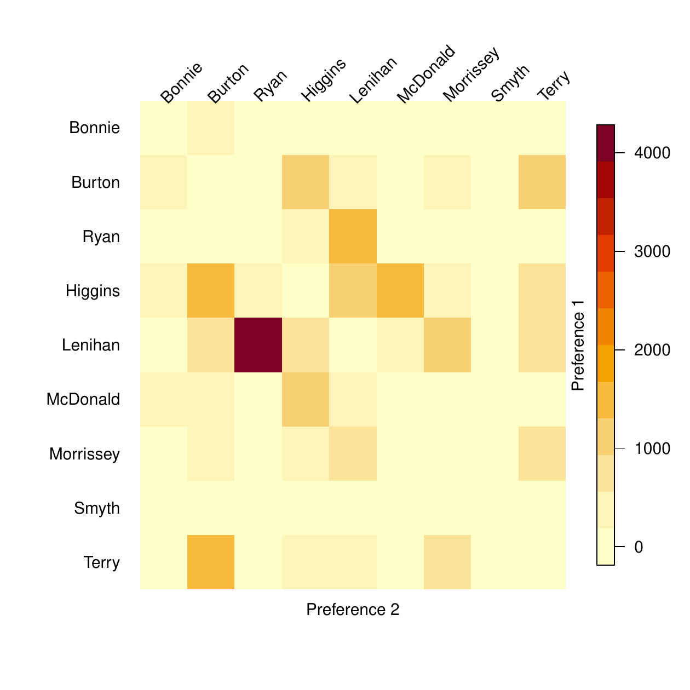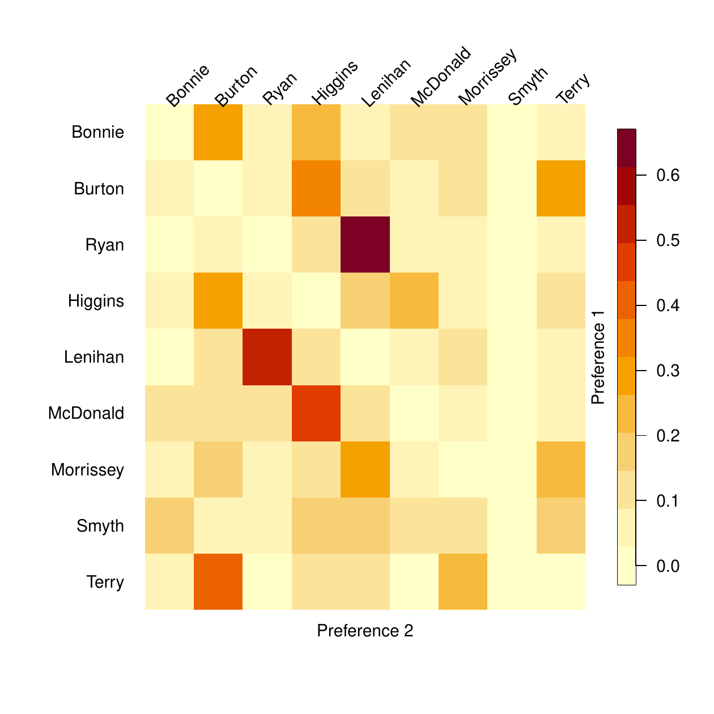</p>
<figcaption>Figure 3: Joint preferences in the 2002 Irish general
election in Dublin West. Left panel: Number of votes for each
combination of first and second preferences. Right panel: Proportion of
the first preference votes for each candidate that gave their second
preference vote to each other candidate.</figcaption>
</figure>

The right panel in Figure [3](#fig-STVdwest3) shows the same information
but in the form of the *proportion* of the first preference voters for
each candidate that cast their second preference votes for each other
candidate. The largest single cell shows that over 60% of Ryan voters
cast their second preferences for Lenihan.

The code for producing Figures [2](#fig-STVdwest2) and
[3](#fig-STVdwest3) is as follows:

``` r
> image (stv.dwest, all.pref = TRUE)  # Figure 2
> image (stv.dwest, proportion = FALSE) # Figure 3 left panel
> image (stv.dwest, proportion = TRUE) # Figure 3 right panel
```

Note that the `image` method is available for all functions in the
package that use ranked votes, namely `condorcet` and `tworound.runoff`,
in addition to `stv`. However, the method cannot be used if equal
preferences are present in the ballots.

## IMS council election {#subsec:IMS}

The `ims_election` dataset contains the votes in a past election for the
Council of the Institute of Mathematical Statistics (IMS). There were
four seats to be filled with 10 candidates running and 620 voters. The
names of the candidates have been anonymized[^2]. The election was
carried out by STV. The results were:

``` r
> data (ims_election)
> stv.ims <- stv (ims_election, nseats = 4, eps = 1, digits = 0)
```

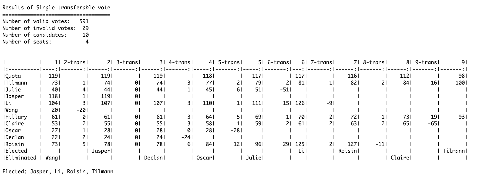{width="100%" alt="graphic without alt text"}

The results are shown in Figure [4](#fig-IMS). Although the electorate
was much smaller, the results show some common patterns to those from
Dublin West. The quota declined slowly in the early counts and more
rapidly in the later ones. The four candidates elected were the ones
that got the most first preferences. Figure [4](#fig-IMS)(d) shows that,
while there are no political parties in this election, Tilmann and
Hillary tended to share voters, as did Jasper and Li. We do not know the
identities of the candidates because their names have been anonymized,
but these pairs of candidates clearly appeal to the same voters, perhaps
because of geographical or intellectual commonalities.

<figure id="fig-IMS">
<table>
<caption> </caption>
<tbody>
<tr class="odd">
<td style="text-align: center;">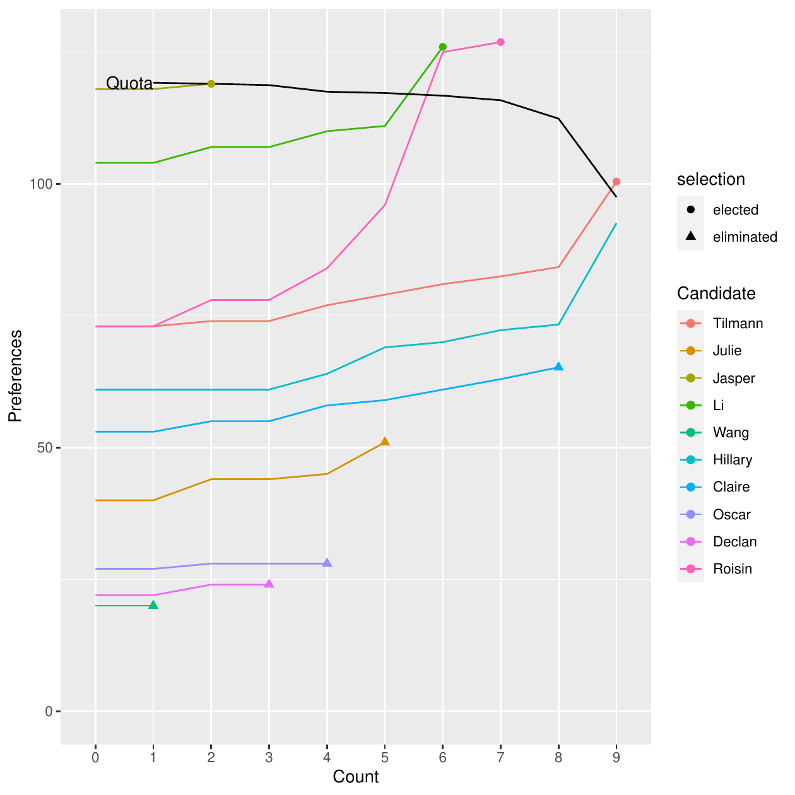</td>
<td style="text-align: center;">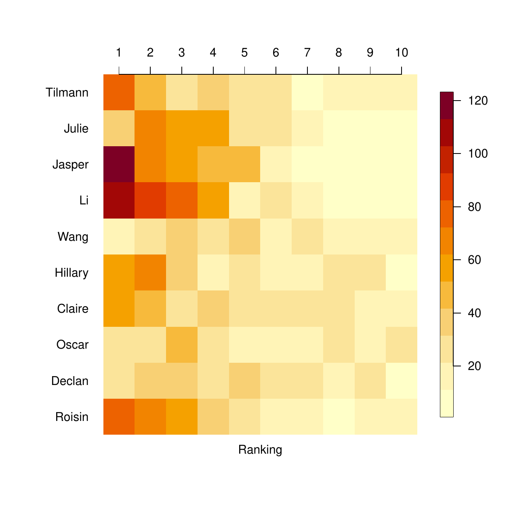</td>
</tr>
<tr class="even">
<td style="text-align: center;">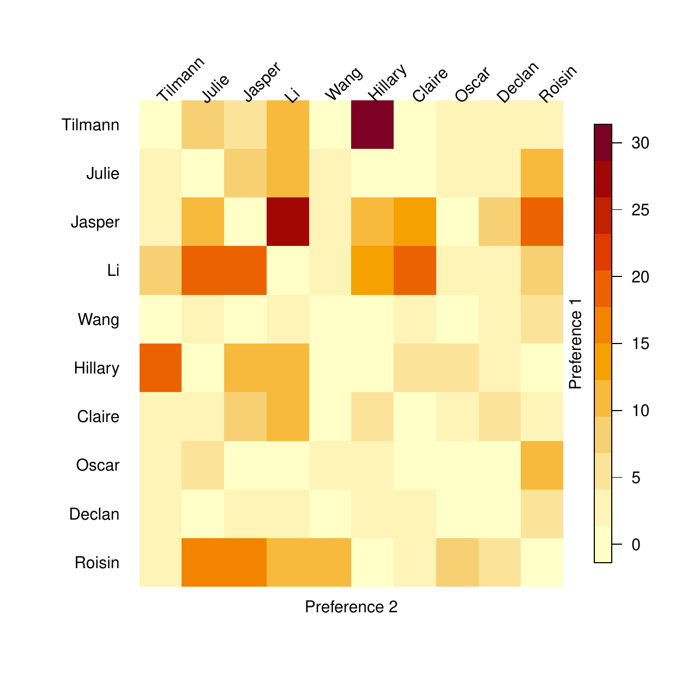</td>
<td style="text-align: center;">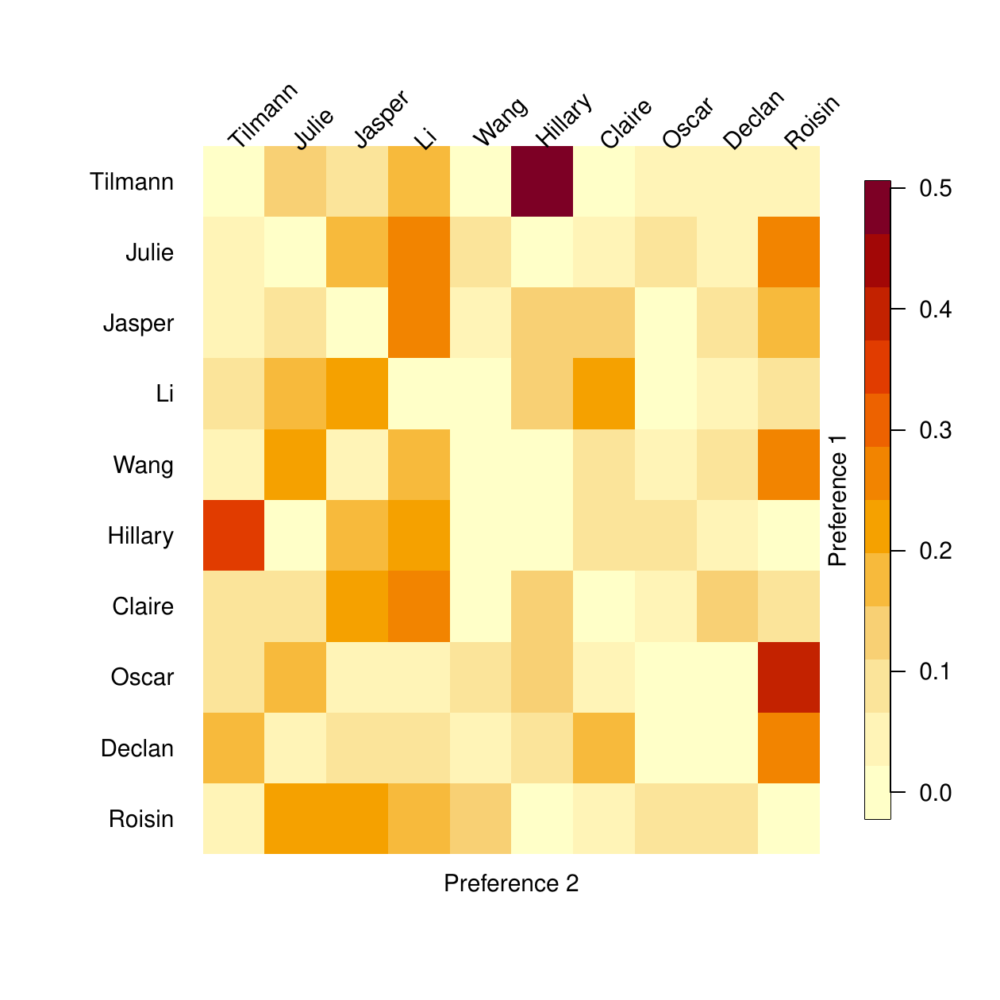</td>
</tr>
</tbody>
</table>
<figcaption>Figure 4: Visualization of results of IMS Council election
by STV. (a) Top left: Evolution of votes over counts. (b) Top right:
Number of votes for each candidate at each preference level. (c) Bottom
left: Number of votes for each first and second preference combination.
(d) Bottom right: Number of second preferences as a proportion of the
number of first preference voters for each candidate. </figcaption>
</figure>

However, neither Li nor Hillary was able to benefit from these shared
preferences in this election. While Jasper was elected on the second
count, he reached exactly the number of votes needed to reach the quota,
namely 119, and thus no surplus was available for a transfer. Tilmann,
on the other hand, was elected last, after which the election ended. If
there had been one more seat available (i.e., `nseats = 5`), Hillary
would have got Tilmann's surplus and then would have been elected.

In this example, 29 votes were identified as invalid. One can explore
those votes using

``` r
> invalid.votes(stv.ims)
```

Most of these votes are all zero preference votes. However, a few of
them contain a gap in the ranking. If it is desired that such votes be
considered valid up to the last valid ranking, one can add the argument
`invalid.partial = TRUE` to the `stv` call. In this case, those votes
are corrected. Using `corrected.votes(stv.ims)` will then display the
original and corrected versions of the votes. Similarly,
`valid.votes(stv.ims)` will display all the valid votes considered in
the election.

## Trial faculty recruitment vote {#subsec:committee}

This is a trial election that was carried out to test a proposed use of
STV in a university statistics department for selecting faculty job
candidates to whom to make offers. There were two jobs to be filled,
five finalists, and ten voters. It was desired to select the two
candidates to whom to make offers and also to produce a ranking of the
other candidates. This is fairly typical of such elections. The
candidates were named Augustin-Louis Cauchy, Carl Friedrich Gauss,
Pierre-Simon Laplace, Florence Nightingale, and Siméon Poisson.

The voters entered their choices into a web-based survey which was then
converted into a text file. Here, we create the corresponding dataset
manually:

``` r
> faculty <- data.frame(
+    Cauchy =      c(3, 4, 4, 4, 4, 5, 4, 5, 5, 5),
+    Gauss  =      c(4, 1, 2, 2, 2, 2, 2, 2, 2, 4),
+    Laplace =     c(5, 2, 1, 3, 1, 3, 3, 4, 4, 1),
+    Nightingale = c(1, 3, 5, 1, 3, 1, 5, 1, 1, 2),
+    Poisson =     c(2, 5, 3, 5, 5, 4, 1, 3, 3, 3)
+    )
```

The results of the STV election were as follows:

``` r
> stv.faculty <- stv (faculty, nseats = 2, digits = 2, complete.ranking = TRUE)
```

``` r
Results of Single transferable vote
===================================                           
Number of valid votes:   10
Number of invalid votes:  0
Number of candidates:     5
Number of seats:          2

|            |           1| 2-trans|      2| 3-trans|       3| 4-trans|     4|
|:-----------|-----------:|-------:|------:|-------:|-------:|-------:|-----:|
|Quota       |        3.33|        |   3.33|        |    3.33|        |  3.33|
|Cauchy      |        0.00|    0.00|   0.00|       0|        |        |      |
|Gauss       |        1.00|    1.33|   2.33|       0|    2.33|    1.33|  3.67|
|Laplace     |        3.00|    0.00|   3.00|       0|    3.00|    0.00|  3.00|
|Nightingale |        5.00|   -1.67|       |        |        |        |      |
|Poisson     |        1.00|    0.33|   1.33|       0|    1.33|   -1.33|      |
|Elected     | Nightingale|        |       |        |        |        | Gauss|
|Eliminated  |            |        | Cauchy|        | Poisson|        |      |

Complete Ranking
================

| Rank|Candidate   | Elected |
|----:|:-----------|:-------:|
|    1|Nightingale |    x    |
|    2|Gauss       |    x    |
|    3|Laplace     |         |
|    4|Poisson     |         |
|    5|Cauchy      |         |

Elected: Nightingale, Gauss 
```

Nightingale and Gauss were elected. The complete ranking could be useful
for a vote like this, where an ordering beyond the winning candidates
may be desired, for example, to make further offers if one of the top
two declines the offer. Note that the complete ranking is conditional on
the pre-specified number of seats or winners in the election.

The results are illustrated in Figure [5](#fig-faculty). An interesting
feature that can be seen from Figure [5](#fig-faculty)(a) is that
Laplace got more first preference votes than Gauss, but Gauss ended up
beating him by a small margin for the second offer because almost every
voter gave Gauss either their first or second preference. Thus, as other
candidates were elected or eliminated, their votes were transferred to
Gauss rather than Laplace. The large number of second preferences for
Gauss is apparent from Figure [5](#fig-faculty)(b). Figure
[5](#fig-faculty)(c) and especially Figure [5](#fig-faculty)(d) show
that Gauss got the highest number and proportion of second preference
votes from the electors of each of the other candidates.

<figure id="fig-faculty">
<table>
<caption> </caption>
<tbody>
<tr class="odd">
<td style="text-align: center;">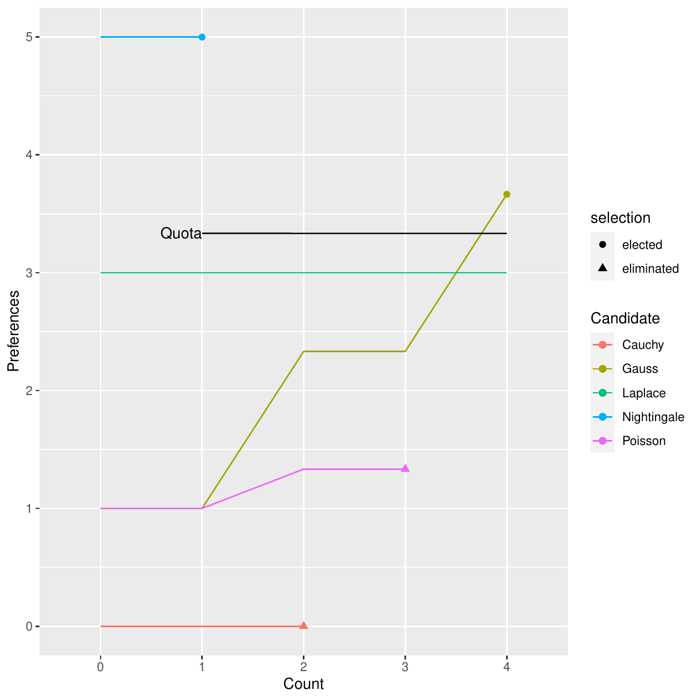</td>
<td style="text-align: center;">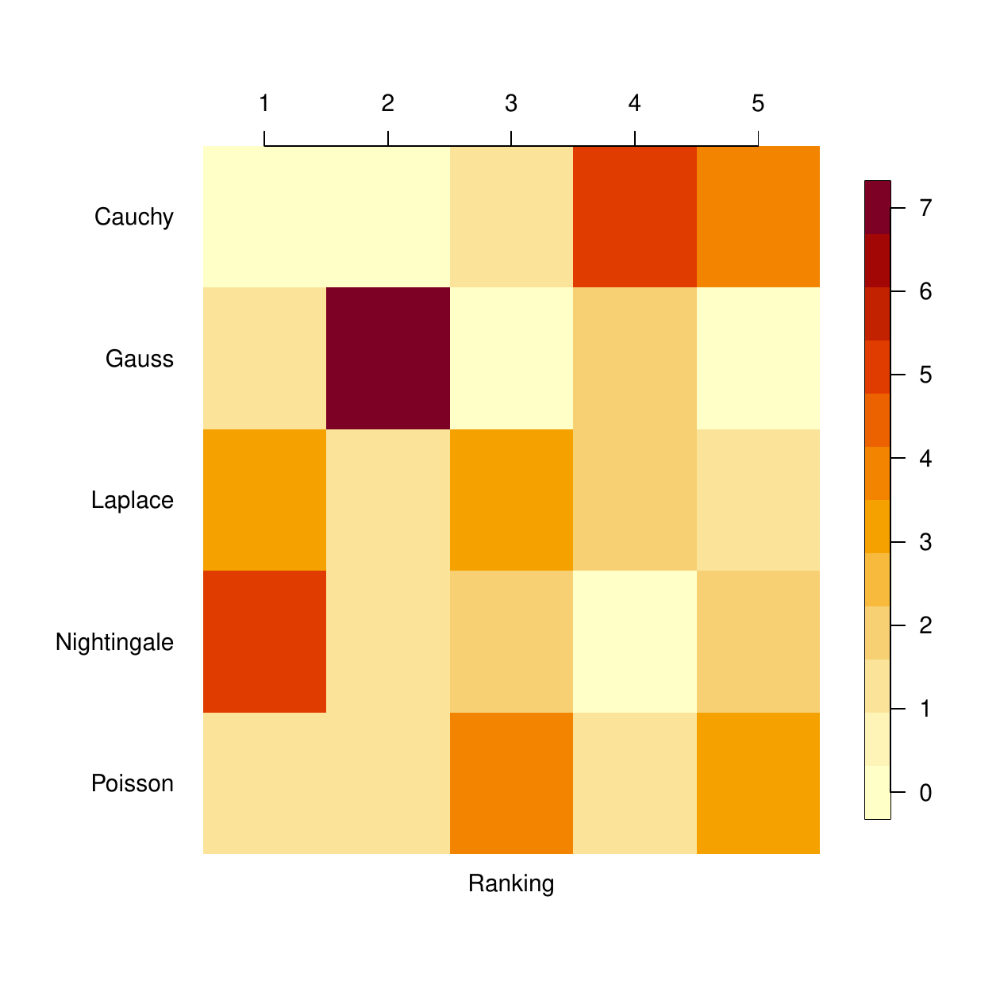</td>
</tr>
<tr class="even">
<td style="text-align: center;">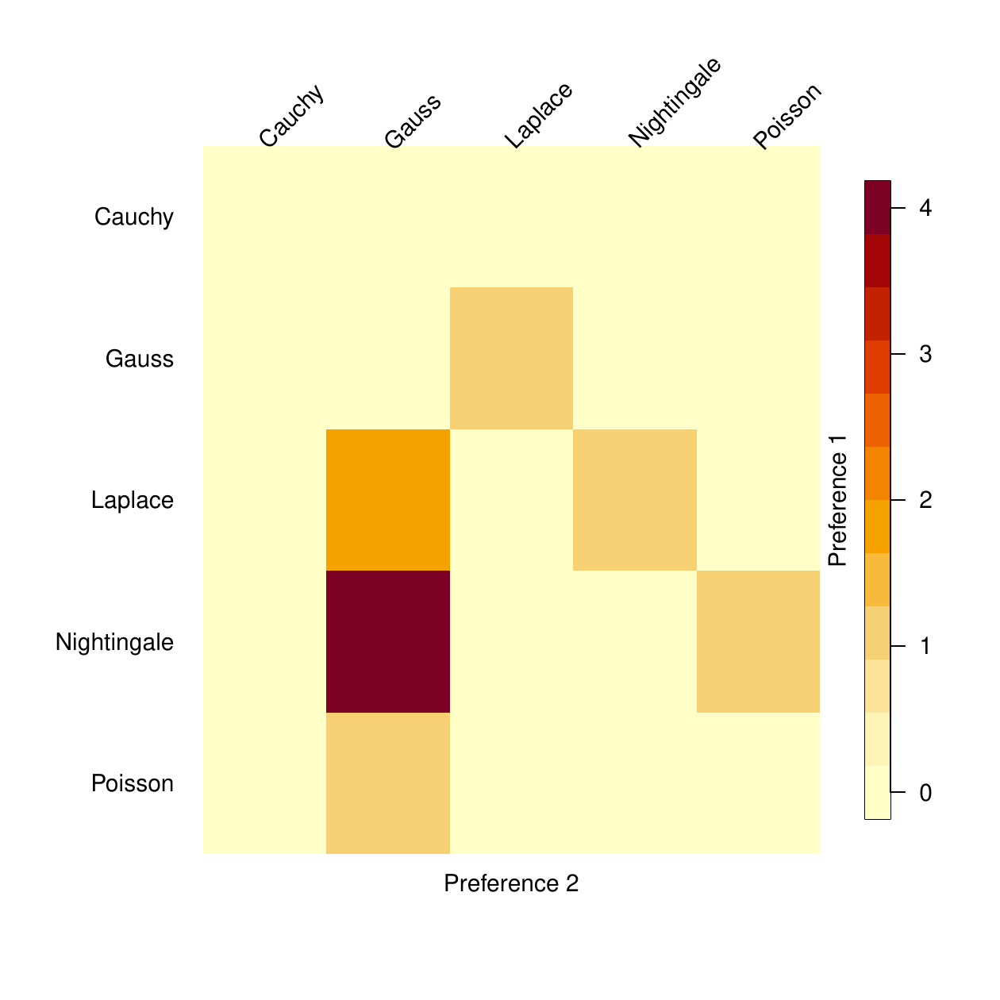</td>
<td style="text-align: center;">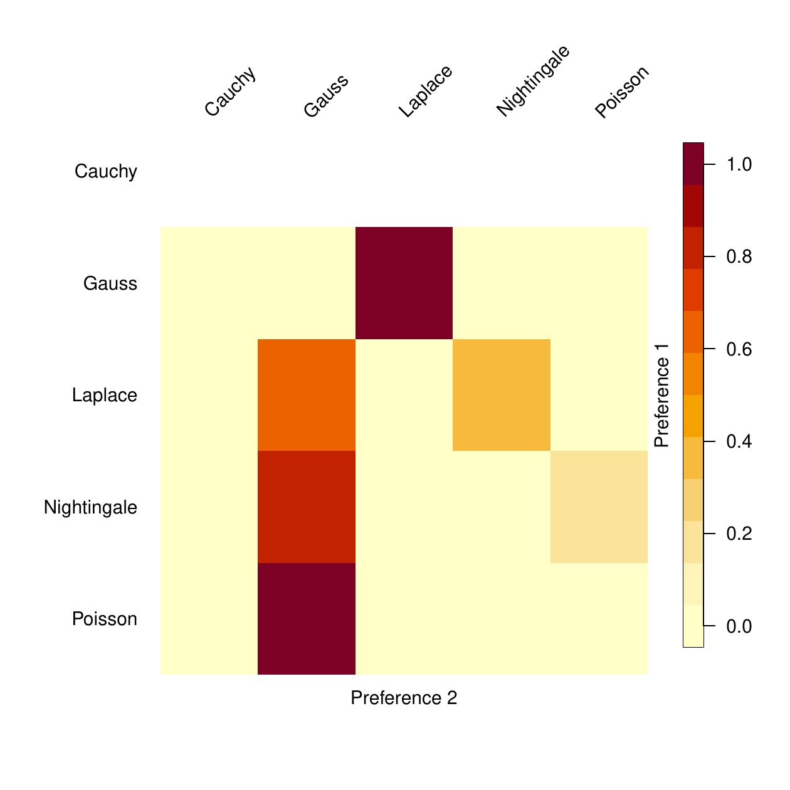</td>
</tr>
</tbody>
</table>
<figcaption>Figure 5: Visualization of results of the trial faculty
recruitment vote by STV. (a) Top left: Evolution of votes over counts.
(b) Top right: Number of votes for each candidate at each preference
level. (c) Bottom left: Number of votes for each first and second
preference combination. (d) Bottom right: Number of second preferences
as a proportion of the number of first preference voters for each
candidate. </figcaption>
</figure>

If this had been done by approval voting, and all the voters had
approved their top two choices, the same two candidates would have been
selected as by STV (i.e., Nightingale and Gauss).

It is interesting to note that there was no Condorcet winner in this
election, even though Nightingale was far ahead of the other candidates
by most criteria:

``` r
> condorcet (faculty)
```

``` r
|            | Cauchy| Gauss| Laplace| Nightingale| Poisson| Total| Loser |
|:-----------|------:|-----:|-------:|-----------:|-------:|-----:|:-----:|
|Cauchy      |      0|     0|       0|           0|       0|     0|   x   |
|Gauss       |      1|     0|       1|           0|       1|     3|       |
|Laplace     |      1|     0|       0|           0|       1|     2|       |
|Nightingale |      1|     1|       0|           0|       1|     3|       |
|Poisson     |      1|     0|       0|           0|       0|     1|       |

There is no condorcet winner (no candidate won over all other candidates).
Condorcet loser: Cauchy
```

This illustrates the fact that even in a relatively clearcut case, there
may be no Condorcet winner.

To illustrate the feature of reserved seats in STV, let us assume that
it is required that at least one French candidate be selected. Then,

``` r
> stv (faculty, nseats = 2, group.nseats = 1, 
+     group.members = c("Laplace", "Poisson", "Cauchy"), digits = 2)
```

``` r
Results of Single transferable vote
===================================                           
Number of valid votes:   10
Number of invalid votes:  0
Number of candidates:     5
Number of seats:          2
Number of reserved seats:          1 
Eligible for reserved seats:       3 


|            |           1| 2-trans|     2| 3-trans|       3|
|:-----------|-----------:|-------:|-----:|-------:|-------:|
|Quota       |        3.33|        |  3.33|        |    3.33|
|Cauchy*     |        0.00|    0.00|  0.00|    0.00|    0.00|
|Gauss       |        1.00|    1.33|  2.33|   -2.33|        |
|Laplace*    |        3.00|    0.00|  3.00|    1.67|    4.67|
|Nightingale |        5.00|   -1.67|      |        |        |
|Poisson*    |        1.00|    0.33|  1.33|    0.67|    2.00|
|Elected     | Nightingale|        |      |        | Laplace|
|Eliminated  |            |        | Gauss|        |        |

Elected: Nightingale, Laplace 
```

Here, the modifications to the algorithm described in
Section [3.5](#subsec:groups) ensured that none of the French candidates
was eliminated on the second count, as the only seat left at that point
was the reserved seat. Thus, Gauss, the only non-French candidate left,
was eliminated in spite of having more votes than Cauchy or Poisson.
Laplace was then elected on the following count. In the output, the
candidates eligible for reserved seats are marked with a star.

We now modify this dataset slightly to illustrate the equal ranking STV
method. Four of the votes were changed so as to include equal
preferences:

``` r
> faculty2 <- faculty
> faculty2[1,] <- c(2,2,3,1,1)
> faculty2[4,] <- c(3,1,2,1,3)
> faculty2[9,] <- c(4,1,3,1,2)
> faculty2[10,] <- c(2,1,1,1,1)
> faculty2
```

``` r
   Cauchy Gauss Laplace Nightingale Poisson
1       2     2       3           1       1
2       4     1       2           3       5
3       4     2       1           5       3
4       3     1       2           1       3
5       4     2       1           3       5
6       5     2       3           1       4
7       4     2       3           5       1
8       5     2       4           1       3
9       4     1       3           1       2
10      2     1       1           1       1
```

The results of the STV election with equal preferences were as follows:

``` r
> stv.faculty.equal <- stv (faculty2, equal.ranking = TRUE, digits = 2)
```

``` r
Results of Single transferable vote with equal preferences
==========================================================                           
Number of valid votes:   10
Number of invalid votes:  0
Number of candidates:     5
Number of seats:          2

|            |           1| 2-trans|      2| 3-trans|       3| 4-trans|     4|
|:-----------|-----------:|-------:|------:|-------:|-------:|-------:|-----:|
|Quota       |        3.33|        |   3.33|        |    3.33|        |  3.33|
|Cauchy      |        0.00|    0.00|   0.00|       0|        |        |      |
|Gauss       |        2.25|    0.34|   2.59|       0|    2.59|    1.69|  4.28|
|Laplace     |        2.25|    0.01|   2.26|       0|    2.26|    0.13|  2.39|
|Nightingale |        3.75|   -0.42|       |        |        |        |      |
|Poisson     |        1.75|    0.06|   1.81|       0|    1.81|   -1.81|      |
|Elected     | Nightingale|        |       |        |        |        | Gauss|
|Eliminated  |            |        | Cauchy|        | Poisson|        |      |

Elected: Nightingale, Gauss 

Warning message:
In correct.ranking(votes, quiet = quiet) :
  Votes 1, 4, 9, 10 were corrected to comply with the required format.
```

The warning message indicates that the ranking was corrected. When
`equal.ranking=TRUE`, this correction will be made with any input, as
long as the preferences are recorded as positive numbers (not
necessarily integers). The corrected votes can be viewed using the
`corrected.votes` function, which returns a list. The element `new`
contains the updated votes:

``` r
> corrected.votes(stv.faculty.equal)$new
```

``` r
   Cauchy Gauss Laplace Nightingale Poisson
1       3     3       5           1       1
4       4     1       3           1       4
9       5     1       4           1       3
10      5     1       1           1       1
```

Such a correction is not made in the default case in which
`equal.ranking=FALSE`, when the preferences have to be an ordered
sequence of integers starting at one, with no ties and no gaps. However,
votes can be corrected in the same way also from outside `stv`, using
the function `correct.ranking`. As noted previously, another option is
to set `invalid.partial=TRUE` in the `stv` function, which accepts
partial-valid ranking, i.e., each vote is considered valid up to its
largest valid preference, after which ties and gaps are set to 0. When
doing such correction externally via the `correct.ranking` function, set
the argument `partial` to `TRUE`.

Finally, we give the results when there is a single winner to illustrate
tie-breaking, as it so happens that tie-breaking is needed on two
different counts in this case:

``` r
> stv.faculty.tie <- stv (faculty, nseats = 1)
```

``` r
Results of Single transferable vote
===================================                           
Number of valid votes:   10
Number of invalid votes:  0
Number of candidates:     5
Number of seats:          1

|            |      1| 2-trans|       2| 3-trans|     3| 4-trans|       4| 5-trans|           5|
|:-----------|------:|-------:|-------:|-------:|-----:|-------:|-------:|-------:|-----------:|
|Quota       |  5.001|        |   5.001|        | 5.001|        |   5.001|        |       5.001|
|Cauchy      |  0.000|       0|        |        |      |        |        |        |            |
|Gauss       |  1.000|       0|   1.000|       1| 2.000|      -2|        |        |            |
|Laplace     |  3.000|       0|   3.000|       0| 3.000|       2|   5.000|      -5|            |
|Nightingale |  5.000|       0|   5.000|       0| 5.000|       0|   5.000|       5|      10.000|
|Poisson     |  1.000|       0|   1.000|      -1|      |        |        |        |            |
|Tie-breaks  |       |        |      fo|        |      |        |       f|        |            |
|Elected     |       |        |        |        |      |        |        |        | Nightingale|
|Eliminated  | Cauchy|        | Poisson|        | Gauss|        | Laplace|        |            |

Elected: Nightingale 
```

On the second count, Gauss and Poisson both had one vote, the lowest
number, and so were tied for elimination. The Forwards Tie-Breaking
method did not break the tie, as they both had the same number of votes
also on the first count. The Ordered method did break the tie, however,
because Gauss had 7 second preferences, and Poisson had only 1, so
Poisson was eliminated. The notation "fo" in the Tie-breaks row
indicates the tie-breaking method used, here Forwards followed be
Ordered.

On the fourth count, Laplace and Nightingale were tied with 5 votes
each, so they were tied for elimination as neither reached the quota of
5.001. The Forwards Tie-Breaking method was then used and involved
looking first at their numbers of votes on the first count when Laplace
had 3 votes, and Nightingale had 5. As a result, Laplace was eliminated,
and then Nightingale was elected. If the Backwards Tie-Breaking method
had been used (by setting `ties = "b"`), the comparison would have been
done based on the third count instead of the first count. Here too,
Laplace had 3 votes, and Nightingale had 5 on the third count, and thus,
Laplace would have been eliminated.

Note that the ranking used by the Ordered method can be viewed via the
`ordered.tiebreak` function, while passing the valid votes stored in the
`data` element of the `stv` object:

``` r
> ordered.tiebreak(stv.faculty.tie$data)
```

``` r
     Cauchy       Gauss     Laplace Nightingale     Poisson
          1           3           4           5           2 
attr(,"sampled")
[1] FALSE FALSE FALSE FALSE FALSE
```

It gives the elimination ranking. When used for electing a candidate,
the order is reversed. The attribute "sampled\" indicates for each
candidate whether sampling was involved in determining its rank, which
was not the case in our example. The function `ordered.preferences` can
be used to view the matrix of preference counts from which the ordered
ranking is derived. It gives the same information as the `image` plot
with `all.pref = TRUE`, but in matrix form.

# Discussion {#sec:discussion}

We have described and illustrated the *vote* package in R, which
implements several electoral systems, namely the plurality, two-round
runoff, approval, score, and Single Transferable Vote (STV) systems
[@vote]. It also identifies the Condorcet winner and loser, if they
exist. It implements the Single Transferable Vote system with equal
preferences, the first time this has been implemented in software to our
knowledge. It also provides several ways of visualizing the STV results.

We are not advocating any electoral system, and indeed it is well known
that no one system satisfies all of a set of criteria that one might
reasonably want to hold. Thus, which system one uses can depend on the
purpose of the election. However, we are particularly interested in
multi-winner elections with small electorates, such as committee and
council elections in organizations, and the selection of multiple job
candidates, award winners, or other choices by small "selectorates."
Such elections are common, and there is no universally accepted method
for conducting them. We have found the STV system to work well in
practice for such elections, and so we have emphasized it here, giving
several examples.

For completeness, we note that the most widely used political voting
system around the world is a party-list approach, where voters vote for
a party rather than for individuals, and some mechanism is then used to
fill the party slots allocated [@ERS2020]. Such systems are not relevant
for the purposes of our primary interest.

There are several other R packages that implement electoral systems. The
[*votesys*](https://CRAN.R-project.org/package=votesys) package
implements several electoral methods, including several that are not
included in the *vote* package [@votesys]. It implements the Instant
Runoff Voting (IRV), which is the special case of STV for single-winner
elections, but it does not implement the full version of STV for
multi-winner elections. The
[*rcv*](https://CRAN.R-project.org/package=rcv) package also implements
IRV (calling it Ranked Choice Voting) but has been removed from CRAN
[@rcv].

The [*STV*](https://CRAN.R-project.org/package=STV) package implements
the STV method [@STV]. The results are generally very similar to those
from the `stv` function in the *vote* package. However, there are some
minor differences that can lead to different results, particularly in
elections with small electorates. Notably, in the *STV* package, all
quotas, vote counts, and transfers are rounded to integers, which can
lead to different results when the electorate is small. Also, in the
*STV* package all tie-breaking is done at random, in contrast with the
*vote* package, which uses forwards and backwards tie-breaking. Unlike
the *vote* package, none of these other packages implements the STV
method with equal ranking or allows for reserved positions for marked
groups.

The
[*HighestMedianRules*](https://CRAN.R-project.org/package=HighestMedianRules)
implements voting rules electing the candidate with the highest median
grade [@HighestMedianRules; @Fabre2020]. The
[*electoral*](https://CRAN.R-project.org/package=electoral) and
[*esaps*](https://CRAN.R-project.org/package=esaps) packages compute
various measures of electoral systems; in spite of their names, they do
not implement electoral systems or voting rules [@electoral; @esaps].

#### Acknowledgements:

The research of Raftery and Ševčı́ková was supported by NIH grant R01
HD070936. The authors are grateful to Salvatore Barbaro and Brendan
Murphy for helpful discussions and to an anonymous reviewer for helpful
comments that improved the article.
:::

[^1]: In STV, the process of distributing the surplus or votes of a
    candidate who is elected or eliminated is referred to variously as a
    count, a stage, or a round. Here, we use the term count. The
    tabulation of the first preference votes is then called the first
    count.

[^2]: To ensure confidentiality, the names of the candidates were
    replaced by arbitrarily chosen first names that have no connection
    to the actual names of the candidates.
