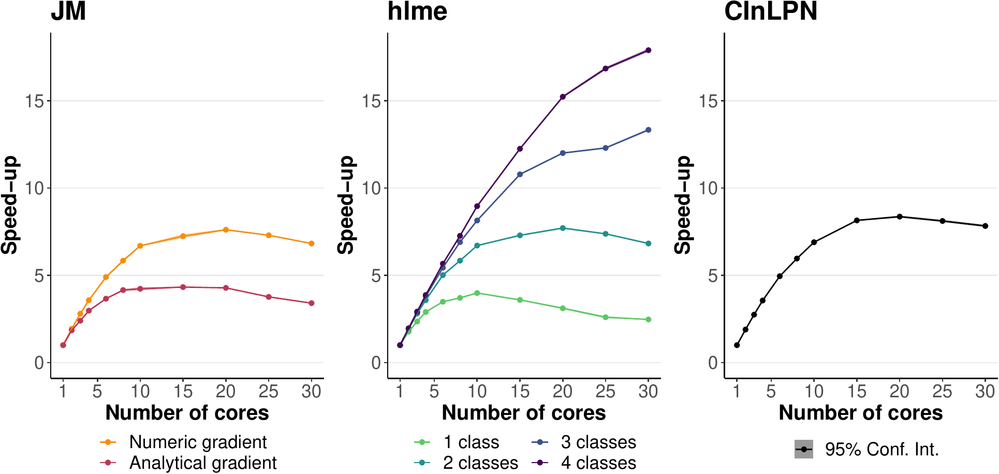

::: article
# Introduction

Optimization is an essential task in many computational problems. In
statistical modeling, for instance, in the absence of analytical
solutions, maximum likelihood estimators are often retrieved using
iterative optimization algorithms, which locally solve the problem from
given starting values.

Steepest descent algorithms are among the most famous general local
optimization algorithms. They generally consist in updating parameters
according to the steepest gradient (gradient descent) possibly scaled by
the Hessian in the Newton (Newton-Raphson) algorithm or an approximation
of the Hessian based on the gradients in the quasi-Newton algorithms
(e.g., Broyden-Fletcher-Goldfarb-Shanno - BFGS). Newton-like algorithms
have been shown to provide good convergence properties
[@joe_numerical_2003] and were demonstrated in particular to behave
better than Expectation-Maximization (EM) algorithms in several contexts
of Maximum Likelihood Estimation, such as the random-effect models
[@lindstrom_newtonraphson_1988] or the latent class models
[@proust_estimation_2005]. Among Newton methods, the Marquardt-Levenberg
algorithm, initially proposed by Levenberg [@levenberg_method_1944],
then Marquardt [@marquardt_algorithm_1963], combines BFGS and gradient
descent methods to provide a more robust optimization algorithm. Like
other Newton methods, the Marquardt-Levenberg algorithm is designed to
find a local optimum of the objective function from given initial
values. When dealing with multimodal objective functions, it can thus
converge to local optimum and needs to be combined with a grid search to
retrieve the global optimum.

The R software includes multiple solutions for local and global
optimization tasks (see CRAN task View on
[*Optimization*](https://CRAN.R-project.org/view=Optimization)
[@optimization]). In particular, the `optim` function in
[*base*](https://CRAN.R-project.org/package=base) R offers different
algorithms for general-purpose optimization, and so does
[*optimx*](https://CRAN.R-project.org/package=optimx), a more recent
package extending `optim` [@nash_2011]. Numerous additional packages are
available for different contexts, from nonlinear least square problems
(including some exploiting Marquardt-Levenberg idea like
[*minpack.lm*](https://CRAN.R-project.org/package=minpack.lm)
[@elzhov_2016] and [*nlmrt*](https://CRAN.R-project.org/package=nlmrt)
[@nlmrt_2016]) to stochastic optimization and algorithms based on the
simplex approach. However, R software could benefit from a
general-purpose R implementation of the Marquardt-Levenberg algorithm.

We present here an R implementation of the Marquardt-Levenberg algorithm
in the package
[*marqLevAlg*](https://CRAN.R-project.org/package=marqLevAlg), which
relies on a stringent convergence criterion based on the first and
second derivatives to avoid loosely convergence [@prague:hal-00717566]
and includes (from version 2.0.1) parallel computations within each
iteration to speed up convergence. This implementation is particularly
dedicated to complex settings, that is, when a large number of
parameters are optimized, and/or the computation of the objective
function is time-consuming. The parallel computations speed up the
procedure, and the stringent convergence criterion prevents false
convergences on the flat regions of the objective function obtained with
convergence criteria based on the function stability.

Section 2 and 3 describe the algorithm and the implementation,
respectively. Then Section 4 provides an example of a call with the
estimation of a linear mixed model. A benchmark of the package is
reported in Section 5 with the performances of parallel implementation.
Performances of Marquardt-Levenberg algorithm implementation are also
challenged in Section 6 using a variety of simple and complex examples
from the literature and compared with other optimizers. Finally, Section
7 concludes.

# Methodology

::: {#the-marquardt-levenberg-algorithm}
## The Marquardt-Levenberg algorithm {#algorithm}
:::

The Marquardt-Levenberg algorithm (MLA) can be used for any problem
where a function $\mathcal{F}(\theta)$ has to be minimized (or
equivalently, function $\mathcal{L}(\theta)$= - $\mathcal{F}(\theta)$
has to be maximized) according to a set of $m$ unconstrained parameters
$\theta$ as long as the second derivatives of $\mathcal{F}(\theta)$
exist. In statistical applications, for instance, the objective function
is the deviance to be minimized or the log-likelihood to be maximized.

Our improved MLA iteratively updates the vector $\theta^{(k)}$ from a
starting point $\theta^{(0)}$ until convergence using the following
formula at iteration $k+1$:

$$\theta^{(k+1)}=\theta^{(k)}-\delta_{k} \left(\tilde{H}(\mathcal{F}(\theta^{(k)}))\right)^{-1}\nabla(\mathcal{F}(\theta^{(k)})),$$

where $\theta^{(k)}$ is the set of parameters at iteration $k$,
$\nabla(\mathcal{F}(\theta^{(k)}))$ is the gradient of the objective
function at iteration $k$, and $\tilde{H}(\mathcal{F}(\theta^{(k)}))$ is
the Hessian matrix $H(\mathcal{F}(\theta^{(k)}))$ where the diagonal
terms are replaced by
$\tilde{H}(\mathcal{F}(\theta^{(k)}))_{ii}=H(\mathcal{F}(\theta^{(k)}))_{ii}+\lambda_k[(1-\eta_k)|H(\mathcal{F}(\theta^{(k)}))_{ii}|+\eta_k \text{tr}(H(\mathcal{F}(\theta^{(k)})))]$.
In the original MLA, the Hessian matrix is inflated by a scaled identity
matrix. Following @fletcher_modified_1971, we consider refined inflation
based on the curvature. The diagonal inflation of our improved MLA makes
it an intermediate between the steepest descent method and the Newton
method. The parameters $\delta_k$, $\lambda_k$, and $\eta_k$ are scalars
specifically determined at each iteration $k$. Parameter $\delta_k$ is
fixed to 1 unless the objective function is not reduced, in which case a
line search determines the locally optimal step length. Parameters
$\lambda_k$ and $\eta_k$ are internally modified in order to ensure that
(i) $\tilde{H}(\mathcal{F}(\theta^{(k)}))$ be definite-positive at each
iteration $k$, and (ii) $\tilde{H}(\mathcal{F}(\theta^{(k)}))$
approaches $H(\mathcal{F}(\theta^{(k)}))$ when $\theta^{(k)}$ approaches
$\hat{\theta}$.

When the problem encounters a unique solution, the minimum is reached
whatever the chosen initial values.

::: {#sec:criteria}
## Stringent convergence criteria {#sec:criteria}
:::

As in any iterative algorithm, the convergence of MLA is achieved when
convergence criteria are fulfilled. In
[*marqLevAlg*](https://CRAN.R-project.org/package=marqLevAlg) package,
convergence is defined according to three criteria:

-   parameters stability:
    $\sum_{j=1}^{m} \left(\theta_{j}^{(k+1)}-\theta_{j}^{(k)}\right)^2 < \epsilon_a$;
-   objective function stability:
    $|\mathcal{F}^{(k+1)} - \mathcal{F}^{(k)}| < \epsilon_b$;
-   relative distance to minimum/maximum (RDM):
    $\frac{\nabla(\mathcal{F}(\theta^{(k)})) \left(H(\mathcal{F}(\theta^{(k)}))\right)^{-1} \nabla(\mathcal{F}(\theta^{(k)})) }{m} < \epsilon_d$.

The original Marquardt-Levenberg algorithm [@marquardt_algorithm_1963]
and its implementations [@elzhov_2016; @nlmrt_2016] consider the two
first criteria (as well as a third one based on the angle between the
objective function and its gradient). Yet, these criteria, which are
also used in many other iterative algorithms, do not ensure convergence
towards an actual optimum. They only ensure the convergence towards a
saddle point. We thus chose to complement the parameter and objective
function stability by the relative distance to minimum/maximum. As it
requires the Hessian matrix to be invertible, it prevents any
convergence to a saddle point and is thus essential to ensure that an
optimum is truly reached. When the Hessian is not invertible, RDM is set
to 1+$\epsilon_d$, and convergence criteria cannot be fulfilled.

Although it constitutes a relevant convergence criterion in any
optimization context, RDM was initially designed for log-likelihood
maximization problems, that is, cases where $\mathcal{F}(\theta)$= -
$\mathcal{L}(\theta)$ with $\mathcal{L}$ the log-likelihood. In that
context, RDM can be interpreted as the ratio between the numerical error
and the statistical error [@commenges_rvs_2006 @prague2013nimrod].

The three thresholds $\epsilon_a$, $\epsilon_b$, and $\epsilon_d$ can be
adjusted, but values around $0.0001$ are usually sufficient to guarantee
a correct convergence. In some complex log-likelihood maximization
problems, for instance, @prague2013nimrod showed that the RDM
convergence properties remain acceptable, providing $\epsilon_d$ is
below 0.1 (although the lower, the better).

::: {#derivatives-calculation}
## Derivatives calculation {#derivatives}
:::

MLA update relies on first ($\nabla(\mathcal{F}(\theta^{(k)}))$) and
second ($H(\mathcal{F}(\theta^{(k)}))$) derivatives of the objective
function $\mathcal{F}(\theta^{(k)})$ at each iteration k. The gradient
and the Hessian may sometimes be calculated analytically, but numerical
approximation can become necessary in a general framework. In
[*marqLevAlg*](https://CRAN.R-project.org/package=marqLevAlg) package,
in the absence of analytical gradient computation, the first derivatives
are computed by central finite differences. In the absence of analytical
Hessian, the second derivatives are computed using forward finite
differences. The step of finite difference for each derivative depends
on the value of the involved parameter. It is set to
$\max(10^{-7},10^{-4}|\theta_j|)$ for parameter $j$.

When both the gradient and the Hessian are to be numerically computed,
numerous evaluations of $\mathcal{F}$ are required at each iteration:

-   $2\times m$ evaluations of $\mathcal{F}$ for the numerical
    approximation of the gradient function;
-   $\dfrac{m \times (m+1)}{2}$ evaluations of $\mathcal{F}$ for the
    numerical approximation of the Hessian matrix.

The number of derivatives thus grows quadratically with the number $m$
of parameters, and calculations are per se independent as done for
different vectors of parameters $\theta$.

When the gradient is analytically calculated, only the second
derivatives have to be approximated, requiring $2 \times m$ independent
calls to the gradient function. In that case, the complexity thus
linearly increases with $m$.

In both cases, and especially when each calculation of derivative is
long and/or $m$ is large, parallel computations of independent
$\mathcal{F}$ evaluations become particularly relevant to speed up the
estimation process.

::: {#sec:loglik}
## Special case of a log-likelihood maximization {#sec:loglik}
:::

When the optimization problem is the maximization of the log-likelihood
$\mathcal{L}(\theta)$ of a statistical model according to parameters
$\theta$, the Hessian matrix of the
$\mathcal{F}(\theta) = - \mathcal{L}(\theta)$ calculated at the optimum
$\hat{\theta}$,
$\mathcal{H}(\mathcal{F}({\hat{\theta}})) = - \dfrac{\partial^2 \mathcal{L}(\theta)}{\partial \theta^2} \bigg|_{\theta = \hat{\theta}}$,
provides an estimator of the Fisher Information matrix. The inverse of
$\mathcal{H}(\mathcal{F}({\hat{\theta}}))$ computed in the package thus
provides an estimator of the variance-covariance matrix of the optimized
vector of parameters $\hat{\theta}$.

# Implementation

::: {#marqlevalg-function}
## marqLevAlg function {#marqlevalgFunction}
:::

The call of the `marqLevAlg` function, or its shorcut `mla`, is the
following :

``` r
marqLevAlg(b, m = FALSE, fn, gr = NULL, hess = NULL, maxiter = 500,
  epsa = 0.0001, epsb = 0.0001, epsd = 0.0001, digits = 8,
  print.info = FALSE, blinding = TRUE, multipleTry = 25, nproc = 1,
  clustertype = NULL, file = "", .packages = NULL, minimize = TRUE, ...)
```

Argument `b` is the set of initial parameters; alternatively, its length
`m` can be entered. `fn` is the function to optimize; it should take the
parameter vector as the first argument, and additional arguments are
passed in .... Optional `gr` and `hess` refer to the functions
implementing the analytical calculations of the gradient and the Hessian
matrix, respectively. `maxiter` is the maximum number of iterations.
Arguments `epsa`, `epsb`, and `epsd` are the thresholds for the three
convergence criteria defined in Section [2.2](#sec:criteria).
`print.info` specifies if details on each iteration should be printed;
such information can be reported in a file if argument `file` is
specified, and `digits` indicates the number of decimals in the
eventually reported information during optimization. `blinding` is an
option allowing the algorithm to go on even when the `fn` function
returns NA, which is then replaced by the arbitrary value of 500,000
(for minimization) and -500,000 (for maximization). Similarly, if an
infinite value is found for the chosen initial values, the `multipleTry`
option will internally reshape `b` (up to `multipleTry` times) until a
finite value is got, and the algorithm can be correctly initialized. The
parallel framework is first stated by the `nproc` argument, which gives
the number of cores, and by the `clustertype` argument (see the next
section). In the case where the `fn` function depends on R packages,
these should be given as a character vector in the `.packages` argument.
Finally, the `minimize` argument offers the possibility to minimize or
maximize the objective function `fn`; a maximization problem is
implemented as the minimization of the opposite function (`-fn`).

::: {#implementation-of-parallel-computations}
## Implementation of parallel computations {#implementationParallel}
:::

In the absence of analytical gradient calculation, derivatives are
computed in the `deriva` subfunction with two loops, one for the first
derivatives and one for the second derivatives. Both loops are
parallelized. The parallelized loops are at most over $m*(m+1)/2$
elements for $m$ parameters to estimate, which suggests that the
performance could theoretically be improved with up to $m*(m+1)/2$
cores.

When the gradient is calculated analytically, the `deriva` subfunction
is replaced by the `deriva_grad` subfunction. It is parallelized in the
same way, but with the parallelization being executed over $m$ elements,
the performance should be bounded at $m$ cores.

In all cases, parallelization is achieved using the
[*doParallel*](https://CRAN.R-project.org/package=doParallel) and
[*foreach*](https://CRAN.R-project.org/package=foreach) packages. The
snow and multicore options of the `doParallel` backend are kept, making
the parallel option of
[*marqLevAlg*](https://CRAN.R-project.org/package=marqLevAlg) package
available on all systems. The user specifies the type of parallel
environment among FORK, SOCK, or MPI in argument `clustertype` and the
number of cores in `nproc`. For instance,
`clustertype = "FORK", nproc = 6` will use FORK technology and 6 cores.

# Example

We illustrate how to use `marqLevAlg` function with the maximum
likelihood estimation in a linear mixed model
[@laird_random-effects_1982]. Function `loglikLMM` available in the
package implements the log-likelihood of a linear mixed model for a
dependent outcome vector ordered by subject (argument $Y$) explained
according to a matrix of covariates (argument $X$) entered in the same
order as $Y$ with a Gaussian individual-specific random intercept and
Gaussian independent errors:

``` r
loglikLMM(b, Y, X, ni) 
```

Argument $b$ specifies the vector of parameters with first the
regression parameters (length given by the number of columns in $X$) and
then the standard deviations of the random intercept and the independent
error. Finally, argument $ni$ specifies the number of repeated measures
for each subject.

We consider the dataset `dataEx` (available in the package) in which
variable $Y$ is repeatedly observed at time $t$ for 500 subjects along
with a binary variable $X1$ and a continuous variable $X3$. For the
illustration, we specify a linear trajectory over time adjusted for
$X1$, $X3$, and the interaction between $X1$ and time $t$. The vector of
parameters to estimate corresponds to the intercept, 4 regression
parameters, and the 2 standard deviations.

We first define the quantities to include as an argument in `loglikLMM`
function:

``` r
> Y <- dataEx$Y
> X <- as.matrix(cbind(1, dataEx[, c("t", "X1", "X3")], 
+                      dataEx$t * dataEx$X1))
> ni <- as.numeric(table(dataEx$i))
```

The vector of initial parameters to specify in `marqLevAlg` call is
created with the trivial values of 0 for the fixed effects and 1 for the
variance components.

``` r
> binit <- c(0, 0, 0, 0, 0, 1, 1)
```

The maximum likelihood estimation of the linear mixed model in
sequential mode is then run using a simple call to `marqLevAlg` function
for a maximization (with argument `minimize = FALSE`):

``` r
> estim <- marqLevAlg(b = binit, fn = loglikLMM, minimize = FALSE, 
+                     X = X, Y = Y, ni = ni)
> estim
 
                   Robust marqLevAlg algorithm                    
 
marqLevAlg(b = binit, fn = loglikLMM, minimize = FALSE, X = X, 
    Y = Y, ni = ni)
 
Iteration process: 
      Number of parameters: 7  
      Number of iterations: 18 
      Optimized objective function: -6836.754  
      Convergence criteria satisfied 
 
Convergence criteria: parameters stability= 3.2e-07 
                    : objective function stability= 4.35e-06 
                    : Matrix inversion for RDM successful 
                    : relative distance to maximum(RDM)= 0 
 
Final parameter values: 
 50.115  0.106  2.437  2.949 -0.376 -5.618  3.015 
 
```

The printed output `estim` shows that the algorithm converged in 18
iterations with convergence criteria of 3.2e-07, 4.35e-06, and 0 for
parameters stability, objective function stability, and RDM,
respectively. The output also displays the list of coefficient values at
the optimum. All this information can also be recovered in the `estim`
object, where item `b` contains the estimated coefficients.

As mentioned in Section [2.4](#sec:loglik), in log-likelihood
maximization problems, the inverse of the Hessian given by the program
provides an estimate of the variance-covariance matrix of the
coefficients at the optimum. The upper triangular matrix of the inverse
Hessian is thus systematically computed in object `v`. When appropriate,
the `summary` function can output this information with option
`loglik = TRUE`. With this option, the summary also includes the square
root of these variances (i.e., the standards errors), the corresponding
Wald statistic, the associated $p$-value, and the 95% confidence
interval boundaries for each parameter:

``` r
> summary(estim, loglik = TRUE)
 
                   Robust marqLevAlg algorithm                    
 
marqLevAlg(b = binit, fn = loglikLMM, minimize = FALSE, X = X, 
    Y = Y, ni = ni)
 
Iteration process: 
      Number of parameters: 7  
      Number of iterations: 18 
      Optimized objective function: -6836.754  
      Convergence criteria satisfied 
 
Convergence criteria: parameters stability= 3.2e-07 
                    : objective function stability= 4.35e-06 
                    : Matrix inversion for RDM successful 
                    : relative distance to maximum(RDM)= 0 
 
Final parameter values: 
   coef SE.coef        Wald P.value   binf   bsup
 50.115   0.426 13839.36027   0e+00 49.280 50.950
  0.106   0.026    16.02319   6e-05  0.054  0.157
  2.437   0.550    19.64792   1e-05  1.360  3.515
  2.949   0.032  8416.33202   0e+00  2.886  3.012
 -0.376   0.037   104.82702   0e+00 -0.449 -0.304
 -5.618   0.189   883.19775   0e+00 -5.989 -5.248
  3.015   0.049  3860.64370   0e+00  2.919  3.110
 
```

The exact same model can also be estimated in a parallel mode using FORK
implementation of parallelism (here with two cores):

``` r
> estim2 <- marqLevAlg(b = binit, fn = loglikLMM, minimize = FALSE, 
+                      nproc = 2, clustertype = "FORK", 
+                      X = X, Y = Y, ni = ni)
```

It can also be estimated by using analytical gradients (provided in
gradient function `gradLMM` with the same arguments as `loglikLMM`):

``` r
> estim3 <- marqLevAlg(b = binit, fn = loglikLMM, gr = gradLMM, 
+                      minimize = FALSE, X = X, Y = Y, ni = ni)
```

In all three situations, the program converges to the same maximum as
shown in Table [1](#tab:fit) for the estimation process and Table
[2](#tab:estim) for the parameter estimates. The iteration process is
identical when using either the sequential or the parallel code (number
of iterations, final convergence criteria, etc.). It necessarily differs
slightly when using the analytical gradient, as the computation steps
are not identical (e.g., here it converges in 15 iterations rather than
18), but all the final results are identical.

::: {#tab:fit}
  ---------------------------------------------------------------------
                           Object estim   Object estim2   Object estim3
  ---------------------- -------------- --------------- ---------------
  Number of cores                     1               2               1

  Analytical gradient                no              no             yes

  Objective Function          -6836.754       -6836.754       -6836.754

  Number of iterations               18              18              15

  Parameter Stability      3.174428e-07    3.174428e-07    6.633702e-09

  Likelihood stability     4.352822e-06    4.352822e-06    9.159612e-08

  RDM                      1.651774e-12    1.651774e-12    2.935418e-17
  ---------------------------------------------------------------------

  : Table 1: Summary of the estimation process of a linear mixed model
  using 'marqLevAlg' function run either in sequential mode with
  numerical gradient calculation (object estim), parallel mode with
  numerical gradient calculation (object estim2), or sequential mode
  with analytical gradient calculation (object estim3).
:::

::: {#tab:estim}
  ---------------------------------------------------------------------------------------
                  Object estim            Object estim2            Object estim3 
  ------------- -------------- -------- --------------- -------- --------------- --------
                          Coef       SE            Coef       SE            Coef       SE

    Parameter 1        50.1153   0.4260         50.1153   0.4260         50.1153   0.4260

    Parameter 2         0.1055   0.0264          0.1055   0.0264          0.1055   0.0264

    Parameter 3         2.4372   0.5498          2.4372   0.5498          2.4372   0.5498

    Parameter 4         2.9489   0.0321          2.9489   0.0321          2.9489   0.0321

    Parameter 5        -0.3764   0.0368         -0.3764   0.0368         -0.3764   0.0368

    Parameter 6        -5.6183   0.1891         -5.6183   0.1891          5.6183   0.1891

    Parameter 7         3.0145   0.0485          3.0145   0.0485          3.0145   0.0485
  ---------------------------------------------------------------------------------------

  : Table 2: Estimates (Coef) and standard error (SE) of the parameters
  of a linear mixed model fitted using 'marqLevAlg' function run either
  in sequential mode with numerical gradient calculation (object estim),
  parallel mode with numerical gradient calculation (object estim2), or
  sequential mode with analytical gradient calculation (object estim3).
:::

# Benchmark

We aimed at evaluating and comparing the performances of the
parallelization in some time-consuming examples. We focused on three
examples of sophisticated models from the mixed models area, estimated
by maximum likelihood. These examples rely on packages using three
different languages, thus illustrating the behavior of
[*marqLevAlg*](https://CRAN.R-project.org/package=marqLevAlg) package
with a program exclusively written in R
([*JM*](https://CRAN.R-project.org/package=JM), @rizopoulos_jm_2010) and
programs, including Rcpp (*CInLPN*, @tadde_dynmod) and Fortran90
([*lcmm*](https://CRAN.R-project.org/package=lcmm),
@proust-lima_lcmm_2017) languages, widely used in complex situations.

We first describe the generated dataset on which the benchmark has been
realized. We then introduce each statistical model and associated
program. Finally, we detail the results obtained with the three
programs. Each time, the model has been estimated sequentially and with
a varying number of cores in order to provide the program speed-up. We
used a Linux cluster with 32 cores machines and 100 replicates to assess
the variability. Codes and datasets used in this section are available
at <https://github.com/VivianePhilipps/marqLevAlgPaper.>

::: {#simulated-dataset}
## Simulated dataset {#simulatedDataset}
:::

We generated a dataset of 20,000 subjects having repeated measurements
of a marker `Ycens` (measured at times `t`) up to a right-censored time
of event `tsurv` with the indicator that the event occurred `event`. The
data were generated according to a 4 latent class joint model
[@proust-lima_joint_2014]. This model assumes that the population is
divided into 4 latent classes, each class having a specific trajectory
of the marker defined according to a linear mixed model with specific
parameters, and specific risk of event defined according to a parametric
proportional hazard model with specific parameters too. The
class-specific linear mixed model included a basis of natural cubic
splines with 3 equidistant knots taken at times 5, 10 and 15, associated
with fixed and correlated random effects. The proportional hazard model
included a class-specific Weibull risk adjusted on 3 covariates: one
binary (Bernoulli with 50% probability) and two continous variables
(standard Gaussian and Gaussian with mean 45 and standard deviation 8).
The proportion of individuals in each class is about 22%, 17%, 34%, and
27% in the sample.

Below are given the five first rows of the three first subjects:

``` r
   i class X1        X2       X3 t    Ycens     tsurv event
1  1     2  0 0.6472205 43.42920 0 61.10632 20.000000     0
2  1     2  0 0.6472205 43.42920 1 60.76988 20.000000     0
3  1     2  0 0.6472205 43.42920 2 58.72617 20.000000     0
4  1     2  0 0.6472205 43.42920 3 56.76015 20.000000     0
5  1     2  0 0.6472205 43.42920 4 54.04558 20.000000     0
22 2     1  0 0.3954846 43.46060 0 37.95302  3.763148     1
23 2     1  0 0.3954846 43.46060 1 34.48660  3.763148     1
24 2     1  0 0.3954846 43.46060 2 31.39679  3.763148     1
25 2     1  0 0.3954846 43.46060 3 27.81427  3.763148     1
26 2     1  0 0.3954846 43.46060 4       NA  3.763148     1
43 3     3  0 1.0660837 42.08057 0 51.60877 15.396958     1
44 3     3  0 1.0660837 42.08057 1 53.80671 15.396958     1
45 3     3  0 1.0660837 42.08057 2 51.11840 15.396958     1
46 3     3  0 1.0660837 42.08057 3 50.64331 15.396958     1
47 3     3  0 1.0660837 42.08057 4 50.87873 15.396958     1
```

::: {#statistical-models}
## Statistical models {#statisticalModels}
:::

::: {#joint-shared-random-effect-model-for-a-longitudinal-marker-and-a-time-to-event-package-jm}
### Joint shared random effect model for a longitudinal marker and a time to event: package JM
:::

The maximum likelihood estimation of joint shared random effect models
has been made available in R with the
[*JM*](https://CRAN.R-project.org/package=JM) package
[@rizopoulos_jm_2010]. The implemented optimization functions are
`optim` and `nlminb`. We added the `marqLevALg` function for the purpose
of this example. We considered a subsample of the simulated dataset,
consisting of 5,000 randomly selected subjects.

The joint shared random effect model is divided into two submodels
jointly estimated:

-   a linear mixed submodel for the repeated marker $Y$ measured at
    different times $t_{ij}$ ($j=1,...,n_i$):
    $$\begin{split}
      Y_{i}(t_{ij})  &= \tilde{Y}_{i}(t_{ij}) + \varepsilon_{ij}\\
     &= X_i(t_{ij}) \beta + Z_i(t_{ij}) u_i + \varepsilon_{ij},
      \end{split}$$

where, in our example, $X_i(t)$ contained the intercept, the class
indicator, the 3 simulated covariates, a basis of natural cubic splines
on time $t$ (with 2 internal knots at times 5 and 15), and the
interactions between the splines and the time-invariant covariates,
resulting in 20 fixed effects. $Z_i(t)$ contained the intercept and the
same basis of natural cubic splines on time $t$, and was associated with
$u_i$, the 4-vector of correlated Gaussian random effects.
$\varepsilon_{ij}$ was the independent Gaussian error.

-   a survival submodel for the right censored time-to-event:
    $$\alpha_i(t) = \alpha_0(t) \exp(X_{si}\gamma + \eta \tilde{Y}_{i}(t)),$$

where, in our example, the vector $X_{si}$, containing the 3 simulated
covariates, was associated with the vector of parameters $\gamma$; the
current underlying level of the marker $\tilde{Y}_{i}(t)$ was associated
with parameter $\eta$ and the baseline hazard $\alpha_{0}(t)$ was
defined using a basis of B-splines with 1 interior knot.

The length of the total vector of parameters $\theta$ to estimate was 40
(20 fixed effects and 11 variance component parameters in the
longitudinal submodel and 9 parameters in the survival submodel).

One particularity of this model is that the log-likelihood does not have
a closed-form. It involves an integral over the random effects (here, of
dimension 4), which is numerically computed using an adaptive
Gauss-Hermite quadrature with 3 integration points for this example.

As package [*JM*](https://CRAN.R-project.org/package=JM) includes an
analytical computation of the gradient, we ran two estimations: one with
the analytical gradient and one with the numerical approximation to
compare the speed up and execution times.

::: {#latent-class-linear-mixed-model-package-lcmm}
### Latent class linear mixed model: package lcmm {#lcmm}
:::

The second example is a latent class linear mixed model, as implemented
in the `hlme` function of the
[*lcmm*](https://CRAN.R-project.org/package=lcmm) R package. The
function uses a previous implementation of the Marquardt algorithm coded
in Fortran90 and in sequential mode. For the purpose of this example, we
extracted the log-likelihood computation programmed in Fortran90 to be
used with [*marqLevAlg*](https://CRAN.R-project.org/package=marqLevAlg)
package.

The latent class linear mixed model consists of two submodels estimated
jointly:

-   a multinomial logistic regression for the latent class membership
    ($c_i$):

$$\mathbb{P}(c_i = g) = \frac{\exp(W_{i} \zeta_g)}{\sum_{l=1}^G \exp(W_{i} \zeta_l)}  ~~~~~~~~~,~~~~ \text{with      }  g=1,...,G,$$
where $\zeta_G=0$ for identifiability, and $W_{i}$ contained an
intercept and the 3 covariates.

-   a linear mixed model specific to each latent class $g$ for the
    repeated outcome $Y$ measured at times $t_{ij}$ ($j=1,...,n_i$):

$$Y_i(t_{ij} | c_i = g) =  X_i(t_{ij}) \beta_g + Z_i(t_{ij}) u_{ig} + \varepsilon_{ij},$$

where, in this example, $X_i(t)$ and $Z_i(t)$ contained an intercept,
time $t$, and quadratic time. The vector $u_{ig}$ of correlated Gaussian
random effects had a proportional variance across latent classes, and
$\varepsilon_{ij}$ were independent Gaussian errors.

The log-likelihood of this model has a closed-form, but it involves the
logarithm of a sum over latent classes, which can become computationally
demanding. We estimated the model on the total sample of 20,000 subjects
with 1, 2, 3, and 4 latent classes, which corresponded to 10, 18, 26,
and 34 parameters to estimate, respectively.

::: {#multivariate-latent-process-mixed-model-package-cinlpn}
### Multivariate latent process mixed model: package CInLPN {#cinlpn}
:::

The last example is provided by the *CInLPN* package, which relies on
the Rcpp language. The function fits a multivariate linear mixed model
combined with a system of difference equations in order to retrieve
temporal influences between several repeated markers [@tadde_dynmod]. We
used the data example provided in the package where three continuous
markers `L_1`, `L_2`, `L_3` were repeatedly measured over time. The
model related each marker $k$ ($k=1,2,3$) measured at observation times
$t_{ijk}$ ($j=1,...,T$) to its underlying level $\Lambda_{ik}(t_{ijk})$
as follows:
$$\text{L}_{ik}(t_{ijk}) = \eta_{0k}+ \eta_{1k} \Lambda_{ik}(t_{ijk}) +\epsilon_{ijk},$$

where $\epsilon_{ijk}$ are independent Gaussian errors and
$(\eta_0,\eta_1)$ parameters to estimate. Simultaneously, the structural
model defines the initial state at time 0 ($\Lambda_{ik}(0)$) and the
change over time at subsequent times $t$ with $\delta$ is a
discretization step:

$$\begin{split}
 \Lambda_{ik}(0) &= \beta_{0k} + u_{ik}\\
 \frac{\Lambda_{ik}(t+\delta) - \Lambda_{ik}(t)}{\delta} &= \gamma_{0k} + v_{ik}  + \sum_{l=1}^K a_{kl} \Lambda_{il}(t),
\end{split}$$

where $u_{ik}$ and $v_{ik}$ are Gaussian random effects.

Again, the log-likelihood of this model that depends on 27 parameters
has a closed-form, but it may involve complex calculations.

::: {#results}
## Results
:::

All the models have been estimated with 1, 2, 3, 4, 6, 8, 10, 15, 20,
25, and 30 cores. To fairly compare the execution times, we ensured that
changing the number of cores did not affect the final estimation point
or the number of iterations needed to converge. The mean of the speed up
over the 100 replicates is reported in Table [3](#tab:perf) and plotted
in Figure [1](#fig:speedup).

::: {#tab:perf}
  ------------------------------------------------------------------------------------------------
                                               JM             hlme                          CInLPN
  ------------------------------------ ---------- --------- ------ ------ ------- ------- --------
                                         analytic   numeric    G=1    G=2     G=3     G=4 

  Number of parameters                         40        40     10     18      26      34       27

  Number of iterations                         16        16     30     30      30      30       13

  Number of elements in foreach loop           40       860     65    189     377     629      405

  Sequential time (seconds)                  4279     14737    680   3703   10402   22421      272

  Speed up with 2 cores                      1.85      1.93   1.78   1.93    1.94    1.96     1.89

  Speed up with 3 cores                      2.40      2.80   2.35   2.81    2.88    2.92     2.75

  Speed up with 4 cores                      2.97      3.57   2.90   3.58    3.80    3.87     3.56

  Speed up with 6 cores                      3.66      4.90   3.49   5.01    5.44    5.66     4.95

  Speed up with 8 cores                      4.15      5.84   3.71   5.84    6.90    7.26     5.96

  Speed up with 10 cores                     4.23      6.69   3.98   6.70    8.14    8.96     6.89

  Speed up with 15 cores                     4.32      7.24   3.59   7.29   10.78   12.25     8.14

  Speed up with 20 cores                     4.28      7.61   3.11   7.71   12.00   15.23     8.36

  Speed up with 25 cores                     3.76      7.29   2.60   7.37   12.30   16.84     8.11

  Speed up with 30 cores                     3.41      6.82   2.47   6.82   13.33   17.89     7.83
  ------------------------------------------------------------------------------------------------

  : Table 3: Estimation process characteristics for the 3 different
  programs (JM, hlme, and CInLPN). Analytic and Numeric refer to the
  analytical and numerical computations of the gradient in JM; G refers
  to the number of latent classes.
:::

<figure id="fig:speedup">

<figcaption>Figure 1: Speed up performances for the 3 different programs
(JM, hlme, and CInLPN). Analytic and Numeric refer to the analytical and
numerical computations of the gradient in JM. The number of parameters
was 40 for JM; 10, 18, 26, 34 for hlme with 1, 2, 3, 4 classes,
respectively; 27 for CInLPN.</figcaption>
</figure>

The joint shared random effect model (`JM`) converged in 16 iterations
after 4279 seconds in sequential mode when using the analytical
gradient. Running the algorithm in parallel on 2 cores made the
execution 1.85 times shorter. Computational time was gradually reduced
with a number of cores between 2 and 10 to reach a maximal speed up
slightly above 4. With 15, 20, 25, or 30 cores, the performances were no
more improved, the speed up showing even a slight reduction, probably
due to the overhead. In contrast, when the program involved numerical
computations of the gradient, the parallelization reduced the
computation time by a factor of almost 8 at maximum. The better speed-up
performances with a numerical gradient calculation were expected since
the parallel loops iterate over more elements.

The second example, the latent class mixed model estimation (`hlme`),
showed an improvement of the performances as the complexity of the
models increased. The simple linear mixed model (one class model), like
the joint models with analytical gradient, reached a maximum speed-up of
4 with 10 cores. The two-class mixed model with 18 parameters showed a
maximum speed up of 7.71 with 20 cores. Finally, the 3 and 4-class mixed
models reached speed-ups of 13.33 and 17.89 with 30 cores and might
still be improved with larger resources.

The running time of the third program (CInLPN) was also progressively
reduced with the increasing number of cores reaching the maximal
speed-up of 8.36 for 20 cores.

In these 7 examples, the speed up systematically reached almost 2 with 2
cores, and it remained interesting with 3 or 4 cores, although some
variations in the speed-up performances began to be observed according
to the complexity of the objective function computations. This
highlights the benefit of the parallel implementation of MLA, even on
personal computers. As the number of cores continued to increase, the
speed-up performances varied a lot. Among our examples, the most
promising situation was the one of the latent class mixed model (with a
program in Fortran90) where the speed-up was up to 15 for 20 cores with
the 4 class model.

::: {#comparison-with-other-optimization-algorithms}
# Comparison with other optimization algorithms {#comparison}
:::

::: {#other-marquardt-levenberg-implementations}
## Other Marquardt-Levenberg implementations {#otherML}
:::

The Marquardt-Levenberg algorithm has been previously implemented in the
context of nonlinear least squares problems in
[*minpack.lm*](https://CRAN.R-project.org/package=minpack.lm) and
[*nlmrt*](https://CRAN.R-project.org/package=nlmrt). We ran the examples
provided in these two packages with `marqLevAlg` and compared the
algorithms in terms of the final solution (that is, the residual
sum-of-squares) and runtime. Results are shown in the supplementary
material. Our implementation reached exactly the same value as the two
others but performed slower in these simple examples.

We also compared the sensitivity to initial values of `marqLevAlg` with
[*minpack.lm*](https://CRAN.R-project.org/package=minpack.lm) using a
simple example from
[*minpack.lm*](https://CRAN.R-project.org/package=minpack.lm). We ran
the two implementations of MLA on 100 simulated datasets, each one from
100 different starting points (see supplementary material). On the 10000
runs, `marqLevAlg` converged in 51.55% of the cases whereas the
[*minpack.lm*](https://CRAN.R-project.org/package=minpack.lm) converged
in 65.98% of the cases. However, 1660 estimations that converged
according to nls.lm criteria were far from the effective optimum. This
reduced the proportion of satisfying convergences with
[*minpack.lm*](https://CRAN.R-project.org/package=minpack.lm) to 49.38%
(so similar rate as `marqLevAlg`) but more importantly illustrated the
convergence to saddle points when using classical convergence criteria.
In contrast, all the convergences with
[*marqLevAlg*](https://CRAN.R-project.org/package=marqLevAlg) were
closed to the effective solution thanks to its stringent RDM convergence
criterion.

::: {#examples-from-the-literature}
## Examples from the literature {#exliterature}
:::

We tested our algorithm on 35 optimization problems designed by
@more_1981 to test unconstrained optimization software and compared the
`marqLevAlg` performances with those of several other optimizers, namely
Nelder-Mead, BFGS, conjugate gradients (CG) implemented in the `optim`
function, L-BFGS-B algorithm from `optimParallel`, and `nlminb`. Each
problem consists of a function to optimize from given starting points.
The results are presented in supplementary material in terms of bias
between the real solution and the final value of the objective function.
Our implementation of MLA converged in almost all the cases (31 out of
35), and provided almost no bias. Except for nlminb, which showed
similar very good performances, the other algorithms converged at least
once very far from the effective objective value. In addition,
Nelder-Mead and CG algorithms converged only in approximately half of
the cases.

::: {#joint-models}
## Example of complex optimization problem: Maximum Likelihood Estimation of a Joint model for longitudinal and time-to-event data
:::

Our implementation is particularly dedicated to complex problems
involving many parameters and/or complex objective function calculation.
We illustrate here its performances and compare them with other
algorithms for the likelihood maximization of a joint model for
longitudinal and time-to-event data, as an example of complex objective
function optimization.

The [*JM*](https://CRAN.R-project.org/package=JM) package
(@rizopoulos_jm_2010), dedicated to the maximum likelihood estimation of
joint models, includes several optimization algorithms, namely the BFGS
of `optim` function and an expectation-maximization (EM) technique
internally implemented. It thus offers a nice framework to compare the
reliability of MLA to find the maximum likelihood in a complex setting
with the reliability of other optimization algorithms. We used in this
comparison the `prothro` dataset described in the
[*JM*](https://CRAN.R-project.org/package=JM) package and elsewhere
[@skrondal_generalized_2004 @andersen_statistical_1993]. It consists of
a randomized trial in which 488 subjects were split into two treatment
arms (prednisone *versus* placebo). Repeated measures of prothrombin
ratio were collected over time as well as time to death. The
longitudinal part of the joint model included a linear trajectory with
time in the study, an indicator of the first measurement and their
interaction with the treatment group. Correlated individual random
effects on the intercept and the slope with time were also included. The
survival part was a proportional hazard model adjusted for the treatment
group as well as the dynamics of the longitudinal outcome either through
the current value of the marker or its slope or both. The baseline risk
function was approximated by B-splines with one internal knot. The total
number of parameters to estimate was 17 or 18 (10 for the longitudinal
submodel and 7 for the survival submodel, given that only the curent
value of the marker or its slope or 8 for the survival model when both
the current level and the slope were considered). The marker initially
ranged from 6 to 176 (mean=79.0, sd=27.3).

To investigate the consistency of the results to different dimensions of
the marker, we also considered cases where the marker was rescaled by a
factor 0.1 or 10. In these cases, the log-likelihood was rescaled a
posteriori to the original dimension of the marker to make the
comparisons possible. The starting point was systematically set at the
default initial value of the `jointModel` function, which is the
estimation point obtained from the separated linear mixed model and
proportional hazard model.

In addition to EM and BFGS included in `JM` package, we also compared
the MLA performances with those of the parallel implementation of the
L-BFGS-B algorithm provided by the
[*optimParallel*](https://CRAN.R-project.org/package=optimParallel)
package. Codes and dataset used in this section are available at
<https://github.com/VivianePhilipps/marqLevAlgPaper>.

MLA and L-BFGS-B ran on 3 cores. MLA converged when the three criteria
defined in section [2.2](#sec:criteria) were satisfied with tolerance
0.0001, 0.0001, and 0.0001 for the parameters, the likelihood, and the
RDM, respectively. BFGS and L-BFGS-B converged when the convergence
criterion on the log-likelihood was satisfied with the square root of
the tolerance of the machine ($\approx 10^{-8}$). The EM algorithm
converged when stability on the parameters or on the log-likelihood was
satisfied with tolerance 0.0001 and around $10^{-8}$ (i.e., the square
root of the tolerance of the machine), respectively.

::: {#tab:prothro}
  ------------ ----------- --------- --------------- -------------- -------------- ------------ ---------
     Nature of   Algorithm   Scaling   Rescaled log-   Variation of   Variation of    Number of   Time in

    dependency                factor      likelihood      value (%)      slope (%)   iterations   seconds

         value        BFGS         1       -13958.55          -3.73                         120     27.39

         value        BFGS       0.1       -13957.91          -0.01                         490    116.33

         value        BFGS        10       -13961.54          -9.28                          91     18.16

         value      LBFGSB         1       -13958.41          -3.56                         289     79.07

         value      LBFGSB       0.1       -13957.69          -0.11                         244     67.53

         value      LBFGSB        10           error                                            

         value          EM         1       -13957.91          -0.29                          66     72.44

         value          EM       0.1       -13957.72           0.14                         104    106.70

         value          EM        10       -13957.94          -0.59                          62     67.80

         value         MLA         1   **-13957.69**          -0.00                           7     34.37

         value         MLA       0.1       -13957.69          -0.00                           6     29.48

         value         MLA        10       -13957.69          -0.00                          17     75.48

         slope        BFGS         1       -13961.41                         -1.85          251     52.76

         slope        BFGS       0.1       -13961.23                         -1.37          391     87.61

         slope        BFGS        10       -13980.90                        -13.98          444     80.16

         slope      LBFGSB         1       -13960.69                         -0.15          266     60.29

         slope      LBFGSB       0.1       -13960.70                         -0.27          206     47.87

         slope      LBFGSB        10       -13962.56                         -2.87          823    182.20

         slope          EM         1       -13960.69                          0.17          170    161.64

         slope          EM       0.1       -13960.69                          0.02          208    196.68

         slope          EM        10       -13960.70                          0.08          156    159.58

         slope         MLA         1   **-13960.69**                         -0.00           11     48.00

         slope         MLA       0.1       -13960.69                         -0.00           11     48.10

         slope         MLA        10       -13960.69                          0.00           14     61.61

          both        BFGS         1       -13951.60          15.97         -28.17          164     37.83

          both        BFGS       0.1       -13949.82           2.66          -4.63          502    132.84

          both        BFGS        10       -13965.25          40.31         -95.26           52     10.48

          both      LBFGSB         1       -13950.04          -1.67           7.10          800    177.61

          both      LBFGSB       0.1       -13949.42          -0.01           0.38          411     93.31

          both      LBFGSB        10       -13985.72          67.33        -147.30           18      7.75

          both          EM         1       -13949.82           4.10          -7.22          159    186.69

          both          EM       0.1       -13949.44           1.68          -3.66          156    152.89

          both          EM        10       -13950.46          10.67         -16.31          142    220.07

          both         MLA         1   **-13949.42**          -0.00          -0.00           10     49.91

          both         MLA       0.1       -13949.42          -0.00           0.00           10     51.63

          both         MLA        10       -13949.42          -0.00           0.00           24    121.69
  ------------ ----------- --------- --------------- -------------- -------------- ------------ ---------

  : Table 4: Comparison of the convergence obtained by MLA, BFGS,
  LBFGSB, and EM algorithms for the estimation of a joint model for
  prothrobin repeated marker (scaled by 1, 0.1, or 10) and time to death
  when considering a dependency on the current level of prothrobin
  ('value'), the current slope ('slope'), or both ('both'). All the
  models converged correctly according to the algorithm outputs. We
  report the final log-likelihood rescaled to scaling factor 1 (for
  comparison), the percentage of variation of the association parameters
  ('value' and 'slope' columns) compared to the one obtained with the
  overall maximum likelihood with scaling 1, the number of iterations
  and the running time in seconds.
:::

Table [4](#tab:prothro) compares the convergence obtained using the four
optimization methods when considering a pseudo-adaptive Gauss-Hermite
quadrature with 15 points. All the algorithms converged correctly
according to the programs except one with L-BFGS-B, which gave an error
(non-finite value) during optimization. Although the model for a given
association structure is exactly the same, some differences were
observed in the final maximum log-likelihood (computed in the original
scale of prothrombin ratio). The final log-likelihood obtained by MLA
was always the same, whatever the outcome's scaling, showing its
consistency. It was also higher than the one obtained using the three
other algorithms, showing that BFGS, L-BFGS-B, and, to a lesser extent,
EM did not systematically converge toward the effective maximum. The
difference could go up to 20 points of log-likelihood for BFGS in the
example with the current slope of the marker as the association
structure. The convergence also differed according to outcome's scaling
with BFGS/L-BFGS-B and slightly with EM, even though, in general, the EM
algorithm seemed relatively stable in this example. The less stringent
convergence of BFGS/L-BFGS-B and, to a lesser extent, of EM had also
consequences on the parameters estimates as roughly illustrated in Table
[4](#tab:prothro) with the percentage of variation in the association
parameters of prothrombin dynamics estimated in the survival model
(either the current value or the current slope) in comparison with the
estimate obtained using MLA which gives the overall maximum likelihood.
The better performances of MLA were not at the expense of the number of
iterations since MLA converged in at most 22 iterations, whereas several
hundreds of iterations could be required for EM or BFGS. Note, however,
that one iteration of MLA is much more computationally demanding.

Finally, for BFGS, the problem of convergence was even more apparent
when the outcome was scaled by a factor 10. Indeed, the optimal
log-likelihood of the model assuming a bivariate association structure
(on the current level and the current slope) was worse than the optimal
log-likelihood of its nested model, which assumes an association
structure only on the current level (i.e., constraining the parameter
for the current slope to 0). We faced the same situation with the
L-BFGS-B algorithm when comparing the log-likelihoods with a bivariate
association and with an association through the current slope only.

::: {#concluding-remarks}
# Concluding remarks {#concluding}
:::

We proposed in this paper a general-purpose optimization algorithm based
on a robust Marquardt-Levenberg algorithm. The program, written in R and
Fortran90, is available in
[*marqLevAlg*](https://CRAN.R-project.org/package=marqLevAlg) R package.
It provides a very nice alternative to other optimization packages
available in R software such as
[*optim*](https://CRAN.R-project.org/package=optim),
[*roptim*](https://CRAN.R-project.org/package=roptim) [@pan_2020], or
[*optimx*](https://CRAN.R-project.org/package=optimx) [@nash_2011] for
addressing complex optimization problems. In particular, as shown in our
examples, notably the estimation of joint models, it is more reliable
than classical alternatives (in particular EM, BFGS, and L-BFGS-B). This
is due to the very good convergence properties of the
Marquardt-Levenberg algorithm associated with very stringent convergence
criteria based on the first and second derivatives of the objective
function, which avoids spurious convergence at saddle points
[@commenges_rvs_2006].

The Marquardt-Levenberg algorithm is known for its very computationally
intensive iterations due to the computation of the first and second
derivatives. However, compared to other algorithms, it converges in a
very small number of iterations (usually less than 30 iterations). This
may not make MLA competitive in terms of running time in simple and
rapid settings. However, the parallel computations of the derivatives
can largely speed up the program and make it very competitive with
alternatives in terms of running time in complex settings.

We chose in our implementation to rely on the RDM criterion, which is a
very stringent convergence criterion. As it is based on the inverse of
the Hessian matrix, it may cause non-convergence issues when some
parameters are at the border of the parameter space (for instance, 0 for
a parameter constrained to be positive). In that case, we recommend
fixing the parameter at the border of the parameter space and running
the optimization again on the rest of the parameters. In cases where the
stabilities of the log-likelihood and of the parameters are considered
sufficient to ensure satisfactory convergence, the program outputs might
be interpreted despite a lack of convergence according to the RDM, as is
done for other algorithms that only converge according to the parameter
and/or objective function stability.

As with any other optimization algorithm based on the steepest descent,
MLA is a local optimizer. It does not ensure the convergence of
multimodal objective functions toward the global optimum. In such a
context, we recommend the use of a grid search which consists in running
the algorithm from a grid of (random) initial values and retaining the
best result as the final solution. We illustrate in supplementary
material how this technique succeeds in finding the global minimum with
the Wild function of the `optim` help page.

[*marqLevAlg*](https://CRAN.R-project.org/package=marqLevAlg) is not the
first optimizer to exploit parallel computations. Other R optimizers
include a parallel mode, in particular stochastic optimization packages
like [*DEoptim*](https://CRAN.R-project.org/package=DEoptim)
[@DEoptim_2011], [*GA*](https://CRAN.R-project.org/package=GA)
[@ga_2017], [*rgenoud*](https://CRAN.R-project.org/package=rgenoud)
[@rgenoud_2011], or
[*hydroPSO*](https://CRAN.R-project.org/package=hydroPSO)
[@hydroPSO_2020]. We compared these packages, the local optimizer of
`optimParallel`, and
[*marqLevAlg*](https://CRAN.R-project.org/package=marqLevAlg) for the
estimation of the linear mixed model described in Section [4](#example).
For this specific problem `marqLevAlg` was the fastest, followed by
`optimParallel` (results shown in supplementary files).

With its parallel implementation of derivative calculations combined
with very good convergence properties of MLA,
[*marqLevAlg*](https://CRAN.R-project.org/package=marqLevAlg) package
provides a promising solution for the estimation of complex statistical
models in R. We have chosen for the moment to parallelize the
derivatives, which is very useful for optimization problems involving
many parameters. However, we could also easily parallelize the
computation of the objective function when the latter is decomposed into
independent sub-computations, as is the log-likelihood computed
independently on the statistical units. This alternative is currently
under development.

# Funding

This work was funded by French National Research Agency \[grant number
ANR-18-CE36-0004-01 for project DyMES\].

# Acknowlegdments

The computing facilities MCIA (Mésocentre de Calcul Intensif Aquitain)
at the Université de Bordeaux and the Université de Pau et des Pays de
l'Adour provided advice on parallel computing technologies, as well as
computer time.
:::
