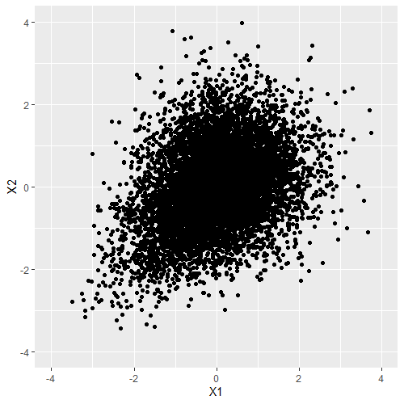
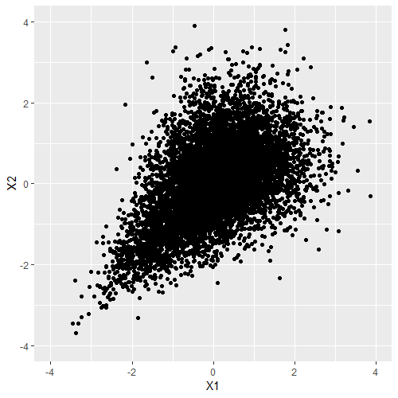
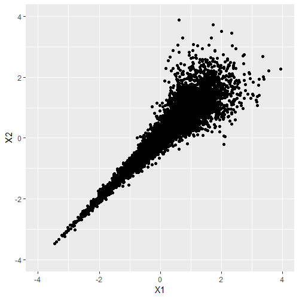
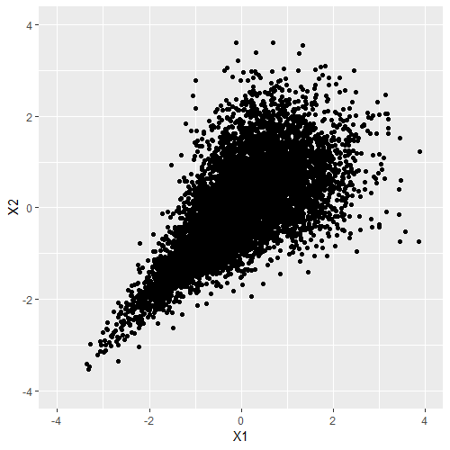

# Introduction

A $k$-dimensional multivariate Lomax (Pareto Type II) probability
distribution was first introduced by [@nayak:1987] as a joint
distribution of $k$ skewed nonnegative random variables
$X_1,\cdots, X_k$ with joint probability density function given by
$$\begin{aligned}
f(x_1, \dots, x_k) = \frac{\left[ \prod_{i=1}^{k} \theta_i\right] a(a+1) \cdots (a+k-1)}{\left(1+\sum_{i=1}^{k} \theta_i x_i \right)^{a+k}}, \quad x_i > 0, a, \theta_i>0, i=1,\dots,k. \label{ML}
\end{aligned}   (\#eq:ML)$$
We will denote above density function by
ML$_k(a; \theta_1,\dots, \theta_k)$. Prior to @nayak:1987, the bivariate
case of multivariate Lomax distribution was studied by @Lindley:1986.
@nayak:1987 indicated that the $k$-dimensional multivariate Lomax
distribution could be obtained by mixing $k$ independent univariate
exponential distributions with different failure rates with the mixing
parameter $\eta$ that has a gamma distribution with certain shape
parameter $a$ and the scale parameter $1$. This fact readily provides an
approach to simulate the multidimensional random vectors from the
multivariate Lomax distribution. The multivariate Lomax distribution is
also transformable to many other useful multivariate distributions, and
therefore, simulations from these distributions are also easily
accomplished. Similarly, with appropriate transformations or
reparameterizations (or otherwise directly from the probability density
function ($pdf$)), we can also accomplish the cumulative probability
calculations as well as the calculation of equicoordinate quantiles. The
objective of this work is to formalize all of the above and to provide a
ready-to-use R package titled
[*NonNorMvtDist*](https://CRAN.R-project.org/package=NonNorMvtDist) for
practitioners to efficiently execute the same. See @lun:2019.

The objective of our work is to enrich the existing R packages for
supporting simulation and computations for nonnormal continuous
multivariate distributions. To the best of our knowledge and also from
the list of packages for multivariate distributions in CRAN
(<https://cran.r-project.org/web/views/Distributions.html>), there is no
package that provides both simulation and probability computations for
multivariate Pareto distribution. In our package, we provide functions
for doing so to both Lomax (Pareto type II) and Mardia's Pareto type I
distributions. For multivariate logistic distribution, package
[*VGAM*](https://CRAN.R-project.org/package=VGAM) [@Yee:2019] implements
the bivariate logistic distribution while we support $p$-variate
logistic distribution for $p>2$. Moreover, multivariate Burr, $F$, and
inverted beta distributions had not been implemented in R until we
included them in the package *NonNorMvtDist*.

This paper is organized as follows. In Section [2](#sec:MLomax), we
provide simulation algorithms for generating data from $k$-dimensional
multivariate Lomax and generalized Lomax (to be defined later)
distributions. Through transformations, the tasks of random numbers
generation from Mardia's multivariate Pareto Type I, Logistic, Burr,
Cook-Johnson's uniform, and $F$ are achieved. Based on the remarks from
@Bala:2009, we then extend Nayak's work to simulate data from the
multivariate inverted beta distribution. In Section [3](#sec:ProbCompt),
we discuss numerical computations of cumulative distribution functions
of equicoordinate quantiles and survival functions for the above
distributions. In Section [4](#sec:Illust), we illustrate the use of
respective functions as implemented in R for each of the above
distributions for the bivariate ($k=2$) case. In Section
[5](#sec:runtime), we provide a run-time study to assess the computation
times for functions as the dimension of data increases. In Section
[6](#sec:MLE), we implement maximum likelihood estimation of parameters
for these distributions. In Section [7](#sec:App), we give two
applications of package *NonNorMvtDist*, namely, (i) data generation
from certain nonelliptical symmetric multivariate distributions with
univariate normal marginals and (ii) computation of critical values of
the multivariate $F$ distribution. Section [8](#sec:Concludsion)
includes some concluding remarks, pointing out other applications.

# Multivariate Lomax and related distributions {#sec:MLomax}

Multivariate Lomax distribution can be derived as the probability
distribution of a $k$-component system where $k$ independent exponential
random variables have a common environment or mixing parameter following
a gamma distribution with shape parameter $a$ and scale parameter $b$.
Let the corresponding random vector be $\mathbf{X}=(X_1,\cdots,X_k)'$.
The probability density function of $\mathbf{X}$ is given by
(\@ref(eq:ML)), and the joint survival function of $\mathbf{X}$ is
$$\begin{aligned}
S(x_1, \dots, x_k) = \left( 1+\sum_{i=1}^{k} \theta_i x_i \right)^{-a}, \quad x_i > 0, a>0, \theta_i>0, i=1,\dots,k. \label{Eq:MLSv}
\end{aligned}   (\#eq:EqMLSv)$$
Specifically, the pivotal result that we use is given by the following
theorem (see @nayak:1987),\
**Theorem 2.1**: Conditioned on fixed mixing parameter $\eta$,
representing the environment effect, let $X_1, \cdots, X_k$ be
independent exponentially distributed random variables with failure
rates $\eta \lambda_1, \cdots, \eta \lambda_k$, respectively. Let the
environment effect $\eta$ be distributed as a Gamma random variate with
probability density
$$\begin{aligned}
g(\eta) = b^a \exp(-\eta b) \eta^{a-1}/\Gamma(a), \eta > 0, a,b > 0.
\end{aligned}$$
Then, the unconditional joint density of $X_1, \cdots,X_k$ is given by
(\@ref(eq:ML)), where $\theta_i = \lambda_i/b, i=1,\cdots,k$. Clearly,
without loss of generality, $b$ can be taken as 1, in which case
$\theta_i=\lambda_i$, $i=1,\cdots, k$.

In view of the above result, we implement the simulation from
$k$-dimensional multivariate Lomax distribution by adopting the
following algorithm.

**Algorithm-ML$_k(a; \theta_1,\dots, \theta_k)$:**

1.  Generate a random number $\eta$ from Gamma$(a,1)$ distribution;

2.  With $\eta$ as generated in Step 1, generate $k$-independent random
    variables $X_i$, $i=1,\dots,k$, each from exponential distribution
    with parameter $\eta \theta_i$, $i=1,\dots,k$, respectively. Let
    $\mathbf{X}=(X_1,X_2,\cdots,X_k)'$;

3.  To obtain a random sample of size $n$, repeat the Steps 1 and 2 $n$
    times.

@nayak:1987 also generalized this distribution by mixing conditionally
independent $X_i$ having the Gamma$(l_i, \eta \theta_i)$ distribution,
with mixing variable $\eta \sim \text{Gamma}(a,1)$, $i=1,\dots,k$. This
is termed as generalized multivariate Lomax distribution denoted by
GML$(a; \theta_1,\dots, \theta_k, l_1,\dots,l_k)$ and has the
probability density function
$$\begin{aligned}
\label{GML}
f(x_1, \cdots, x_k) = \frac{\left[ \prod_{i=1}^{k} \theta_i^{l_i}\right] \Gamma\left(\sum_{i=1}^{k} l_i + a \right) \prod_{i=1}^{k} x_i^{l_i-1}}{\Gamma(a) \left[ \prod_{i=1}^{k} \Gamma(l_i) \right] \left(1+\sum_{i=1}^{k} \theta_i x_i \right)^{\sum_{i=1}^{k} l_i + a}}, \quad x_i>0, a,\theta_i, l_i>0, i=1,\cdots,k
\end{aligned}   (\#eq:GML)$$
Accordingly, we perform the corresponding simulation by implementing the
suitable changes in the above algorithm. The algorithm is given below.

**Algorithm-GML$(a; \theta_1,\dots, \theta_k, l_1,\dots,l_k)$:**

1.  Generate a random number $\eta$ from Gamma$(a,1)$ distribution;

2.  With $\eta$ as generated in Step 1, generate $k$-independent $X_i$,
    each following Gamma$(l_i, \eta \theta_i)$, $i=1,\dots,k$,
    respectively;

3.  To obtain a random sample of size $n$, repeat the Steps 1 and 2 $n$
    times.

Both algorithms are easily implemented using R
[*stats*](https://CRAN.R-project.org/package=stats) [@R:2019] functions
`rexp()` and `rgamma()`, respectively, for generating univariate
exponential and gamma random variates. In the following, we describe
approaches to generate other distributions related to multivariate Lomax
and generalized multivariate Lomax distributions.

@nayak:1987 has also discussed the inter-relationships between many
other multivariate distributions and generalized multivariate Lomax
distribution. In view of these inter-relationships, the above algorithm
can accordingly be amended to simulate data from these distributions - a
task which can be quite difficult to accomplish directly. These
inter-relationships are described in Table [1](#Tab:MLDists). For
convenience, we assume
$\mathbf{X} = (X_1,\cdots,X_k)' \sim \text{ML}_k(a;\theta_1,\cdots,\theta_k)$
and
$\mathbf{T} = (T_1,\cdots,T_k)' \sim \text{GML}_k(a;\theta_1,\cdots,\theta_k;l_1,\cdots,l_k)$.

::: {#Tab:MLDists}
  ------------------------- --------------------------------------- -----------------------------------------------------------------------------------------------------------------------------------------------------------------------------------------------------------------------------------------------------------------------------------
  **Multivariate**          **Transformation/**                     **Probability Density Function**

  **Distribution**          **Parameter Substitutions**             

                                                                    

  Lomax                     $l_i=1$,                                $f(x_1, \dots, x_k) = \frac{\left[ \prod_{i=1}^{k} \theta_i\right] a(a+1) \cdots (a+k-1)}{\left(1+\sum_{i=1}^{k} \theta_i x_i \right)^{a+k}}$

                            $i=1,\cdots, k$                         $x_i > 0, \quad a >0, \quad \theta_i>0$

                            $l_i=1$,                                

  Mardia's                  $Y_i=X_i + 1/\theta_i,$                 $f(y_1, \cdots, y_k) = \frac{\left[ \prod_{i=1}^{k} \theta_i\right] a(a+1) \cdots (a+k-1)}{\left(\sum_{i=1}^{k} \theta_i y_i - k + 1 \right)^{a+k}},$

  Pareto Type I             $i=1,\cdots, k$                         $y_i > 1/\theta_i > 0, \quad a >0, \quad \theta_i>0$

                            $l_i=1$ and $a=1$,                      

  Logistic                  $W_i=\mu_i-\sigma_i\ln(\theta_iX_i),$   $f(w_1, \cdots, w_k) = \frac{k! \exp{\left(-\sum_{i=1}^{k} \frac{w_i - \mu_i}{\sigma_i}\right)}}{\prod_{i=1}^{k} \sigma_i \left(1 + \sum_{i=1}^{k} \exp{(-\frac{w_i - \mu_i}{\sigma_i})}\right)^{1+k}},$

                            $i=1,\cdots, k$                         $-\infty<w_i, \mu_i<\infty, \quad \sigma_i > 0$

                            $l_i=1$,                                

  Burr                      $B_i=(\theta_iX_i/d_i)^{1/c_i},$        $f(b_1, \cdots, b_k) = \frac{\left[ \prod_{i=1}^{k} c_i d_i\right] a(a+1) \cdots (a+k-1) \left[ \prod_{i=1}^{k} b_i^{c_i-1}\right]}{\left(1 + \sum_{i=1}^{k} d_i b_i^{c_i}\right)^{a+k}},$

                            $i=1,\cdots, k$                         $b_i >0, \quad a>0,\quad c_i>0, \quad d_i>0$

                            $l_i=1$,                                

  Cook-Johnson's            $V_i = (1+\theta_iX_i)^{-a},$           $f(v_1, \cdots, v_k) = \frac{\Gamma(a+k)}{\Gamma(a)a^k}\prod_{i=1}^{k} v_i^{(-1/a)-1}\left[\sum_{i=1}^{k} v_i^{-1/a} - k +1\right]^{-(a+k)},$

  uniform                   $i=1,\cdots, k$                         $0<v_i\le 1, \quad a>0$

  $F$                                                               

  with degrees of freedom   $\theta_i=l_i/a,$                       $f(t_1, \cdots, t_k) = \frac{\left[ \prod_{i=1}^{k} (l_i/a)^{l_i}\right] \Gamma\left(\sum_{i=1}^{k} l_i + a \right) \prod_{i=1}^{k} t_i^{l_i-1}}{\Gamma(a) \left[ \prod_{i=1}^{k} \Gamma(l_i) \right] \left(1+\sum_{i=1}^{k} \frac{l_i}{a}t_i \right)^{\sum_{i=1}^{k} l_i + a}},$

  $(2a, 2l_1,\dots,2l_k)$   $i=1,\cdots,k$                          $t_i>0, \quad a>0, \quad l_i>0$

                                                                    

  Inverted Beta             $\theta_i=1,$                           $f(t_1, \cdots, t_k) = \frac{\Gamma\left(\sum_{i=1}^{k} l_i + a \right) \prod_{i=1}^{k} t_i^{l_i-1}}{\Gamma(a) \left[ \prod_{i=1}^{k} \Gamma(l_i) \right] \left(1+\sum_{i=1}^{k} t_i \right)^{\sum_{i=1}^{k} l_i + a}},$

                            $i=1,\cdots,k$                          $t_i>0, \quad a>0, \quad l_i>0$
  ------------------------- --------------------------------------- -----------------------------------------------------------------------------------------------------------------------------------------------------------------------------------------------------------------------------------------------------------------------------------

  : Table 1: Multivariate distributions related to
  $\text{GML}_k(a;\theta_1,\cdots,\theta_k;l_1,\cdots,l_k)$.
:::

The multivariate $F$ distribution can also be obtained by considering
$$\begin{aligned}
T_i = \frac{S_i/(2l_i)}{S_0/(2a)}, \quad i=1,\dots,k, \label{Eq:ChiRatio}
\end{aligned}   (\#eq:EqChiRatio)$$
where $S_0, S_1,\dots, S_k$ are independent Chi-square variables with
$2a, 2l_1,\dots,2l_k$ degrees of freedom respectively; see
@JohnsonKotz:1972. It is the joint distribution of the ratios of mean
squares under certain linear hypotheses on treatments as discussed in
@Krishnaiah:1965 in the context of simultaneous ANOVA and MANOVA tests
where $S_0$ is a residual sum of squares and $S_i$'s are various effect
sums of squares. The density given in Table [1](#Tab:MLDists) is a
special case of generalized multivariate $F$ distribution defined by
@Krishnaiah:1965 when $S_i$'s, $i=1,\cdots, k,$ are all independent.
This fact is useful in that the Tables given by @ArmitageKrishnaiah:1964
make use of this in constructing the statistical tables for certain
linear hypotheses. We use these tables to confirm our calculation as
done by our R programs. The multivariate Inverted Beta distribution also
called the multivariate inverted Dirichlet distribution, is essentially
a special case of multivariate $F$ distribution when
$l_1=l_2=\cdots=l_k=a$.

Figure [1](#Fig:Relation) pictorially summarizes the relationships
between (generalized) Lomax and other distributions.

{#Fig:Relation width="100%"
alt="graphic without alt text"}

# Probability computations {#sec:ProbCompt}

Here, we give details of computations of cumulative probability
distribution function ($cdf$), survival function, equicoordinate
quantile function for each distribution introduced in Section
[2](#sec:MLomax). Depending on the situation, the calculation may
sometimes be simpler for joint $cdf$ or joint survival function.

## Distributions transformable from Lomax distribution

The multivariate Lomax distribution has an explicit closed-form
expression for the joint survival function given by (\@ref(eq:EqMLSv)).
The survival or cumulative distribution function of other related
distributions can be obtained either directly or through appropriate
transformations. We summarize these explicit expressions of cumulative
distribution function $F(\cdot)$ and survival function $S(\cdot)$ in
Table [2](#Tab:CDF-SF).

::: {#Tab:CDF-SF}
  --------------------------------------------------------------------------------------------------------------------------------------------------------------------------------------------------------------------
  **Multivariate Distribution**   **Cumulative Distribution Function**                                                               **Survival Function**
  ------------------------------- -------------------------------------------------------------------------------------------------- ---------------------------------------------------------------------------------
  Lomax                           No closed form                                                                                     $S(x_1, \cdots, x_k) = \left( 1+\sum_{i=1}^{k} \theta_i x_i \right)^{-a}$

                                                                                                                                     $x_i>0, \quad a, \theta_i>0$

                                                                                                                                     

  Mardia's Pareto Type I          No closed form                                                                                     $S(y_1, \cdots, y_k) = \left( \sum_{i=1}^{k} \theta_i y_i - k + 1 \right)^{-a}$

                                                                                                                                     $y_i>0, \quad a, \theta_i>0$

                                                                                                                                     

  Logistic                        $F(w_1, \cdots, w_k) = \left[ 1 + \sum_{i=1}^{k} \exp(-\frac{w_i-\mu_i}{\sigma_i}) \right]^{-1}$   No closed form

                                  $-\infty < w_i, \mu_i < \infty, \quad \sigma_i>0$                                                  

                                                                                                                                     

  Burr                            No closed form                                                                                     $S(b_1,\cdots, b_k) = \left( 1+\sum_{i=1}^{k} d_i b_i^{c_i} \right)^{-a}$

                                                                                                                                     $b_i>0, \quad a, d_i, c_i>0$

                                                                                                                                     

  Cook-Johnson's Uniform          $F(v_1, \cdots, v_k) = \left[ \sum_{i=1}^{k} v_i^{-1/a} - k + 1 \right]^{-a}$                      No closed form

                                  $0<v_i\le 1, \quad a >0$                                                                           
  --------------------------------------------------------------------------------------------------------------------------------------------------------------------------------------------------------------------

  : Table 2: Cumulative distribution functions and survival functions of
  multivariate Lomax and related distributions.
:::

For the cumulative distribution functions or survival functions with no
closed-form expressions, we rely on the following useful formulas
[@Joe:1997]:
$$\begin{aligned}
S(\mathbf{x}) = 1 + \sum_{C \in \mathcal{C}} (-1)^{|C|} F_C(x_j, j \in C), \label{eq:cdf}
\end{aligned}   (\#eq:cdf)$$

$$\begin{aligned}
F(\mathbf{x}) = 1 + \sum_{C \in \mathcal{C}} (-1)^{|C|} S_C(x_j, j \in C)  \label{eq:sf},
\end{aligned}   (\#eq:sf)$$
where $F_C(x_j, j \in C)$ ($S_C(x_j, j \in C)$) is the joint $cdf$
(joint survival function) of $x_j$ where the subscripts belong to the
set $C$, which is a subset of $\{1, 2, \cdots, k\}$. Clearly,
$C \in \mathcal{C}$ where $\mathcal{C}$ is the powerset of
$\{1, 2, \cdots, k\}$. Also, $|C|$ represents the cardinality of $C$.

The equation
$$\begin{aligned}
P[x_i \le q_i, i=1,\cdots,k] = \int_{0}^{q_1} \cdots \int_{0}^{q_k} f(x_1, \cdots, x_k) dx_k \cdots dx_1 = p
\end{aligned}$$
for a given $p$ does not have a unique solution $(q_1, \cdots, q_k)$. We
thus provide the quantile computations only for the equicoordinate
quantile, obtained by solving the following equation for $q$,
$$\begin{aligned}
P[X_i \le q, i=1,\cdots, k]= \int_{0}^{q} \cdots \int_{0}^{q} f(x_1, \cdots, x_k) dx_k \cdots dx_1 = p, \label{Eq:rootQuan}
\end{aligned}   (\#eq:EqrootQuan)$$
where $0 < p < 1$ is a (given) cumulative probability. We make use of
the R *stats* function `uniroot()`, which is used for finding one
dimensional root.

## Distributions related to generalized multivariate Lomax distribution

For generalized multivariate Lomax distribution and its related
distributions, explicit expressions of the cumulative distribution
function and survival function are not available. Thus, we obtain the
cumulative probabilities through multiple integral in
(\@ref(eq:EqmvInt)) below over the unit cube $[0,1]^k$ by using the
adaptive multivariate integration function `hcubature()` in package
[*cubature*](https://CRAN.R-project.org/package=cubature)
[@Narasimhan:2018].
$$\begin{aligned}
\label{Eq:mvInt}
F(x_1, \dots, x_k) & = \int_{0}^{x_1} \cdots  \int_{0}^{x_k} f(t_1, \cdots, t_k) dt_k \cdots dt_1 \nonumber, \\
& = \prod_{i=1}^k x_i \int_{0}^{1} \cdots  \int_{0}^{1}  f(u_1x_1, \cdots,u_kx_k) du_k \cdots du_1, \quad (u_i = t_i/x_i, i=1,\cdots, k).
\end{aligned}   (\#eq:EqmvInt)$$

The following result is used for the computation of the cumulative
distribution function for the generalized Lomax distribution.\
**Property 3.1**: Let $T_1, \cdots, T_k$ be $k$ continuous random
variables that jointly follow the
GML$_k(a;\theta_1,\cdots,\theta_k,$$l_1,\cdots,l_k)$ distribution as
given in (\@ref(eq:GML)). Then, the cumulative distribution function of
$T_1, \cdots, T_k$ can be computed as
$$\begin{aligned}
F(x_1, \cdots, x_k) = P(T_1 \le x_1, \cdots, T_k \le x_k) = P(U_1 \le 1, \cdots, U_k \le 1),
\end{aligned}$$
where $U_1, \cdots, U_k$ jointly follow
GML$_k(a;\theta_1 x_1,\cdots,\theta_k x_k,l_1,\cdots,l_k)$ distribution.

Proof of the above is straightforward by making the substitutions
$u_i = t_i/x_i$, $i=1,\cdots,k$.

Through parameter substitutions, the cumulative distribution functions
of multivariate $F$ and the inverted beta distribution can be found.
These are summarized in Table [3](#Tab:CDF-GML).

::: {#Tab:CDF-GML}
  ------------------------- ------------------- ------------------------------------------------------------------------------------
  **Distribution**          **Parameter**       **Cumulative Distribution Function**

                            **Substitutions**   

  Multivariate $F$                              

  with degrees of freedom   $\theta_i=l_i/a,$   $F(x_1, \cdots, x_k) = P(U_1 \le 1, \cdots, U_k \le 1)$,

  $(2a, 2l_1,\dots,2l_k)$   $i=1,\cdots,k$      $(U_1, \cdots, U_k)$ follows GML$_k(a;x_1 l_1/a,\cdots, x_k l_k/a,l_1,\cdots,l_k)$

                                                

  Multivariate              $\theta_i=1,$       $F(x_1, \cdots, x_k) = P(U_1 \le 1, \cdots, U_k \le 1)$,

  Inverted Beta             $i=1,\cdots,k$      $(U_1, \cdots, U_k)$ follows GML$_k(a;x_1,\cdots, x_k,l_1,\cdots,l_k)$
  ------------------------- ------------------- ------------------------------------------------------------------------------------

  : Table 3: Cumulative distribution functions of related multivariate
  distributions to generalized multivariate Lomax.
:::

For the above method, the run-time consumption rapidly increases as $k$
becomes large. Thus as an alternative, we also provide the option of
computation of cumulative distribution function via Monte Carlo method.
The corresponding algorithm is

**Algorithm - CDF Computation using Monte Carlo Method**:

1.  Generate $N$ random vectors
    $\boldsymbol{t}^{(i)}=(t_1^{(i)}, \cdots, t_k^{(i)})', i = 1,\cdots, N$
    from the desired distribution;

2.  Compute
    $$\begin{aligned}
    	\hat{P}(T_1 \le x_1, \cdots, T_k \le x_k) = \frac{1}{N} \sum_{i=1}^{N} \mathcal{I} (\boldsymbol{t}^{(i)} \le \boldsymbol{x}),
    \end{aligned}$$
    where $\boldsymbol{x}=(x_1, \cdots, x_k)'$ and $\mathcal{I}(\cdot)$
    is the zero-one indicator function corresponding to the conditions
    specified.

Step 1 above is readily carried out by the random numbers generation as
described in Section [2](#sec:MLomax) using the package *NonNorMvtDist*.
Since $cdf$ is computable using adaptive multivariate integration over
unit cube $[0,1]^k$ or via the Monte Carlo method, it follows that the
survival function can also be calculated (by using (\@ref(eq:sf))). The
equicoordinate quantile is computed by using (\@ref(eq:EqrootQuan)).

We also add in our package the calculations of joint probability density
function - Being self-explanatory with all $pdfs$ available in closed
form, it needs no further elaboration. The corresponding function is
`dmv*()`.

# Illustrations of simulations and probability calculations {#sec:Illust}

We will illustrate here the functions and corresponding arguments for
*NonNorMvtDist*. The calling sequences include probability density
calculation (`dmv*`), cumulative distribution calculation (`pmv*`),
equicoordinate quantile calculation (`qmv*`), random numbers generation
(`rmv*`), and survival function calculation (`smv*`) for each of the
multivariate distributions introduced in Section [2](#sec:MLomax). For
each distribution, we consider the bivariate case $(k=2)$. This choice
enables us to also succinctly and graphically present the probability
density plots. The detailed description of the calling sequence for each
of the several cases has been moved into a digital complement of this
paper.

For example, for the bivariate Lomax distribution $(k=2)$ with
parameters $a=5$, $\boldsymbol{\theta}=(0.5,1)$, the calling sequences
for various functions are

``` r
dmvlomax(x, parm1 = 5, parm2 = (0.5,1))
pmvlomax(q, parm1 = 5, parm2 = (0.5,1))
qmvlomax(p, parm1 = 5, parm2 = (0.5,1))
rmvlomax(n, parm1 = 5, parm2 = (0.5,1))
smvlomax(q, parm1 = 5, parm2 = (0.5,1))
```

It may be mentioned that our approach may be more efficient than the
NORTA method [@Ghosh:2002] for simulation in that NORTA always first
requires simulation from multivariate normal, which are then transformed
to multivariate uniform. Only often this step, one could subsequently
transform the simulated data to the desired distribution. Consequently,
for large dimensions, the approach requires more computing power and
time (in fact, to simulate data from the normal distribution, many
programs themselves first require random number generations from uniform
distributions, from which normal random numbers are obtained).

## 3D bivariate density plot

For each bivariate distribution, we provide the density surface plots
along with contours using the function `persp3D()` from the package
[*plot3D*](https://CRAN.R-project.org/package=plot3D) [@Soetaert:2017].
To illustrate, we define function `dplot2()`, and we pass appropriate
density functions to the density function argument `dfun` to create the
density surfaces. These are summarized in the digital complement along
with corresponding resulting plots. For the Lomax distribution with
parameters indicated previously, the statements will be

``` r
library(plot3D)

dplot2 <- function(dfun, x1, x2, zlim) {
    zmat <- matrix(0, nrow = length(x1), ncol = length(x2))
    for (i in 1:length(x1)) {
        for (j in 1:length(x2)) {
            zmat[i, j] = dfun(x = c(x1[i], x2[j])) 
        } 
    }
    persp3D(z = zmat, x = x1, y = x2, theta = -60, phi = 10, ticktype = "detailed",  
            zlim = zlim, contour = list(nlevels = 30, col = "red"), 
            facets = FALSE, image = list(col = "white", side = "zmin"),
            xlab = "X1", ylab="X2", zlab = "Density", expand = 0.5, d = 2) 
}

dplot2(dfun = function(x) dmvlomax(x, parm1 = 5, parm2 = c(0.5, 1)), x1 = seq(0, 4, 0.1), 
       x2 = seq(0, 4, 0.1), zlim = c(-5, 13))
```

The plot that results is shown in Figure [2](#Fig:LomaxPlot).

{#Fig:LomaxPlot
width="100%" alt="graphic without alt text"}

## Random number generation

The following code illustrates the use of the function `rmvlomax*()`
with a bivariate sample of size $n=2$. Sampling is done by setting
`set.seed(2019)` in advance. The digital complement explicitly provides
the code as well as output for all of the probability distributions
discussed here. In the output, each row represents a bivariate
observation.

-   **Bivariate Lomax:** $a=5$, $\theta_1=0.5$, $\theta_2=1$
    ``` r
    > set.seed(2019)
    > rmvlomax(n = 2, parm1 = 5, parm2 = c(0.5, 1))
    	  [,1]      [,2]
    [1,] 1.0174406 0.7076480
    [2,] 0.3686253 0.7826978
    	
    ```

## CDF, survival function and equicoordinate quantile

The applications of $cdf$ `pmv*()`, survival function `smv*()`, and
equicoordinate quantile function `qmv*()` are straightforward and follow
the same pattern earlier. See the digital complement for computation
details. In the following, we give code as well as output only for Lomax
distribution ($a=5$, $\theta_1=0.5$, $\theta_2=1$) for specified
coordinates $(x_1,x_2)$ and for the cumulative probability $p=0.5$.

-   **Bivariate Lomax:** $a=5$, $\theta_1=0.5$, $\theta_2=1$; quantiles:
    $(x_1, x_2)=(1, 0.5)$.
    ``` r
    	> pmvlomax(q = c(1, 0.5), parm1 = 5, parm2 = c(0.5, 1))
    	[1] 0.7678755
    	> smvlomax(q = c(1, 0.5), parm1 = 5, parm2 = c(0.5, 1))
    	[1] 0.03125
    	> qmvlomax(p = 0.5, parm1 = 5, parm2 = c(0.5, 1))
    	[1] 0.3928917
    	
    ```

# Computation times {#sec:runtime}

We assess the run-times for the computation of probability (`pmv*`),
equicoordinate quantile function (`qmv*`) for multivariate Lomax, and
generalized multivariate Lomax distributions for reference. The survival
function (`smv*`) of multivariate Lomax distribution has a closed-form
expression, and hence the assessment of computation time is omitted. We
have used the computer with Intel Core i5-8250U CPU and 8.00 GB RAM. The
results for $p$-variate Lomax distribution are summarized in Table
[4](#Tab:Runtime-Lomax). As we can see, the run-times for `pmvlomax()`
are quit short, even for the dimension $p=20$. However, `qmvlomax()`
requires a considerable longer time when $p \ge 17$, which seems to
double for every extra dimension added to the size of the random vector.
The computation times in Table [4](#Tab:Runtime-Lomax) can also be used
as a reference for the distributions related to multivariate Lomax,
which are in Table [2](#Tab:CDF-SF) since we apply the same approach for
probability computations there as well.

::: {#Tab:Runtime-Lomax}
  --------------------------------------------------------------------------
   $p$  `pmvlomax()`   `qmvlomax()`       $p$  `pmvlomax()`   `qmvlomax()`
  ----- -------------- -------------- -- ----- -------------- --------------
    1   0.01695895     0.03702188         11   0.04889703     0.7992568

    2   0.01795197     0.02293706         12   0.09025002     1.879766

    3   0.01794696     0.02789807         13   0.1545889      3.087925

    4   0.01795197     0.03290296         14   0.245369       5.950396

    5   0.01976085     0.04189205         15   0.4657819      11.37162

    6   0.01995182     0.06582808         16   0.853502       22.04591

    7   0.02094102     0.098768           17   1.708418       45.51909

    8   0.02197218     0.146611           18   2.803703       90.70764

    9   0.02396512     0.2393882          19   5.453189       181.55772

   10   0.04587412     0.4296861          20   10.40903       351.58896
  --------------------------------------------------------------------------

  : Table 4: Runtimes (in seconds) for functions `pmvlomax()` and
  `qmvlomax()` as functions of $p$.
:::

The results for generalized $p$-variate Lomax distribution are
summarized in Tables [5](#Tab:Runtime-GLomax) and
[6](#Tab:Runtime-GLomax2). Both functions `pmvglomax()` and
`smvglomax()` require relatively much longer time when $p > 4$, and
`qmvglomax()` takes longer when $p > 2$. Based on the run-time
consumption, we recommend algorithm `MC` for larger dimensions (e.g.,
when $p>5$). Similarly, this run-time study can also be used as a
reference for the related distributions (to generalized Lomax
distribution) as listed in Table [3](#Tab:CDF-GML) since we apply the
same method for computations.

::: {#Tab:Runtime-GLomax}
  ----- --------------- ---------- -- --------------- ----------
        `pmvglomax()`                 `smvglomax()`   

   $p$  `numerical`     `MC`          `numerical`     `MC`

    1   0.03395414      4.600386      0.03084397      3.977374

    2   0.02397585      6.536522      0.05378199      5.510087

    3   0.101758        8.396577      0.208086        7.229721

    4   0.9758801       10.64278      2.13447         8.741386

    5   16.43411        19.30024      40.11997        9.762063

    6   305.50092       19.57221      1344.1908       11.63218
  ----- --------------- ---------- -- --------------- ----------

  : Table 5: Runtimes (in seconds) for functions `pmvglomax()` and
  `smvglomax()` by using algorithms `numerical` and `MC` as functions of
  $p$.
:::

::: {#Tab:Runtime-GLomax2}
  ----- --------------- ----------
        `qmvglomax()`   

   $p$  `numerical`     `MC`

    1   0.4144461       12.5594

    2   6.383504        18.97528

    3   96.86238        27.23917

    4   2929.5018       30.62036
  ----- --------------- ----------

  : Table 6: Runtimes (in seconds) for function `qmvglomax()` by using
  algorithms `numerical` and `MC` as functions of $p$.
:::

# Maximum likelihood estimation of parameters {#sec:MLE}

We also include the maximum likelihood estimation to estimate the
parameters for various Lomax related distributions (except for the
bivariate $F$ distribution). Although many of the density functions in
Section [2](#sec:MLomax) have complicated forms, maximum likelihood
estimation can be easily accomplished by using the built-in optimization
functions in R *stats*. The log-likelihood function for a given sample
$\mathbf{x_1, \dots, x_n}$ is given by
$$\begin{aligned}
\label{LLK}
\mathcal{L}(\boldsymbol{\theta}|\mathbf{x_1, \dots, x_n}) &= \log \left[ \prod_{j=1}^{n} f(x_{j1}, \dots, x_{jk}|\boldsymbol{\theta}) \right] \nonumber\\
&= \sum_{j=1}^{n} \log \left[ f(x_{j1}, \dots, x_{jk}|\boldsymbol{\theta}) \right], \qquad \boldsymbol{\theta} \in \Theta, 
\end{aligned}   (\#eq:LLK)$$
where $n$ is the sample size, $\boldsymbol{\theta}$ is a vector of
parameters to be estimated, and
$\mathbf{x}_j = (x_{j1}, \dots, x_{jk})'$ is the $j$th observation for
the random vector $\mathbf{X} =(X_1,\dots, X_k)'$, respectively. The
maximizer $\hat{ \boldsymbol{\theta}}$ of the log-likelihood function
given in (\@ref(eq:LLK)), namely,
$$\begin{aligned}
\hat{\boldsymbol{\theta}} = \arg \max_{\boldsymbol{\theta} \in \Theta} \mathcal{L}(\boldsymbol{\theta}|\mathbf{x_1, \dots, x_n}),
\end{aligned}$$
is obtained using an appropriate optimization method. The parameter
space $\Theta$ in each case must be appropriately constrained, and these
constraints must be taken into account during the optimization process.
We have thus made use of three R *stats* functions, namely, `optim()`,
`constrOptim()`, and `optimize()` in this work. The functionality of
these optimization functions is described in Table [7](#Tab:Optim).

::: {#Tab:Optim}
  -----------------------------------------------------------------------------------
  **Function**      **Number of parameters**   **Usage**
  ----------------- -------------------------- --------------------------------------
  `optim()`         Multiple                   General-purpose Optimization

  `constrOptim()`   Multiple                   Optimization with linear constraints

  `optimize()`      Single                     One Dimensional Optimization
  -----------------------------------------------------------------------------------

  : Table 7: Use of optimization functions in R *stats*.
:::

By default, all these functions perform the task of minimization of a
function. To maximize (\@ref(eq:LLK)), we only need to add argument
`control = list(fnscale = -1)` in functions `optim()` and
`constrOptim()`, and set `maximum = TRUE` in function `optimize()`.

For example, for the multivariate Lomax distribution, we define the
log-likelihood function `loglik.lomax()` by using the following code:

``` r
loglik.lomax <- function(data, par) {
    ll <- sum(dmvlomax(data, parm1 = par[1], parm2 = par[-1], log = TRUE))
}
```

The R *stats* function `constrOptim()` is chosen to obtain the maximizer
of the log-likelihood function (or equivalently, `loglik.lomax()`). The
linear constraints imposed on the parameters $a, \theta_1$, and
$\theta_2$ are $a > 0$, $\theta_1 > 0$, and $\theta_2 > 0$. In matrix
notation, it is,
$$\begin{aligned}
\boldsymbol{U} \boldsymbol{\theta} = \begin{pmatrix}
1 &  0  & 0 \\
0 &  1  & 0 \\
0 &  0  & 1        
\end{pmatrix}
\begin{pmatrix}
a \\
\theta_1  \\
\theta_2         
\end{pmatrix}
= \begin{pmatrix}
a \\
\theta_1  \\
\theta_2         
\end{pmatrix}
> 
\begin{pmatrix}
0 \\
0  \\
0         
\end{pmatrix} = \boldsymbol{C}.
\end{aligned}$$
Thus, in the code that follows, the constraint matrix `ui` is set as an
identity matrix $\mathbf{I}_3$ by using the function `diag(3)`, and
constraint vector `ci` is set as a zero vector `rep(0, 3)`. For our
illustration, let the data be the one simulated by the methods described
earlier, each with $n=300$. It is done by

``` r
set.seed(1)
bvtlomax <- rmvlomax(n = 300, parm1 = 5, parm2 = c(0.5, 1))
```

The starting initial values for $a, \theta_1$, and $\theta_2$ are all
set as 10 by assigning `rep(10, 3)` to the argument `theta` in function
`constrOptim()`. The gradient argument `grad` is optional, and we have
chosen this to be `NULL`.

``` r
> est = constrOptim(theta = rep(10, 3), f = loglik.lomax, grad = NULL, data = bvtlomax, 
+                   ui = diag(3), ci = rep(0, 3), control = list(fnscale = -1))
> est$convergence
[1] 0
> est$par
[1] 5.0555691 0.4468724 0.9036692
```

The output consists of two important pieces of information, (i) whether
convergence is successfully achieved (`est$convergence = 0`) or not
(`est$convergence = 1`) and (ii) the values of the final maximum
likelihood estimates. In our illustration, the convergence is
successfully achieved, and we have $\hat{a} = 5.0555691$ and
$(\hat{\theta}_1, \hat{\theta}_2)=(0.4468724, 0.9036692)$.

We summarize the optimization methods, constraints, and the resulting
outputs for all the bivariate distributions (except for bivariate $F$
distribution) in Table [8](#Tab:ParaEstm). The detailed illustrations
and codes for the remaining distributions are included in the digital
complement. Observe that these estimates are reasonably close to the
true parameter values, thereby confirming that the program is
functioning as it is expected to.

::: {#Tab:ParaEstm}
  ------------------------ --------------------------------- ------------------ ---------------------------------------------- ---------------------------------------------------
  **Multivariate**         **Parameters**                    **Optimization**   **Constraints**                                **Estimated Parameters**

  **Distribution**                                           **Method**                                                        

  Lomax                    $a=5$                             constrOptim()      $U=I_3$                                        $\hat{a} = 5.05556$

                           $\boldsymbol{\theta}=(0.5, 1)'$                      $C=(0,0,0)'$                                   $\hat{\boldsymbol{\theta}}=(0.44687, 0.90366)'$

  Mardia's                 $a=5$                             constrOptim()      $U=I_3$                                        $\hat{a} = 4.63862$

  Pareto Type I            $\boldsymbol{\theta}=(0.5,2)'$                       $C=(0, [\min(X_1)]^{-1}, [\min(X_2)]^{-1})'$   $\hat{\boldsymbol{\theta}}=(0.49971, 1.99785)'$

  Logistic                 $\boldsymbol{\mu}=(0.5, 1)'$      optim()            N/A                                            $\hat{\boldsymbol{\mu}} = (0.39199, 0.89731)'$

                           $\boldsymbol{\sigma}=(1,1.5)'$                                                                      $\hat{\boldsymbol{\sigma}} = (0.97573, 1.55976)'$

  Burr                     $a=3$                             constrOptim()      $U=I_5$                                        $\hat{a} = 3.91498$

                           $\boldsymbol{d}=(1,3)'$                              $C=(0,0,0,0,0)'$                               $\hat{\boldsymbol{d}}=(0.64889, 2.06858)'$

                           $\boldsymbol{c}=(2,5)'$                                                                             $\hat{\boldsymbol{c}}=(1.92719, 5.07697)'$

  Cook-Johnson's Uniform   $a=0.3$                           optimize()         $a > 0$                                        $\hat{a} = 0.31064$

  Generalized              $a=5$                             constrOptim()      $U=I_5$                                        $\hat{a} = 3.91869$

  Lomax                    $\boldsymbol{\theta}=(0.5, 1)'$                      $C=(0,0,0,0,0)'$                               $\hat{\boldsymbol{\theta}} = (0.54674, 1.79126)'$

                           $\boldsymbol{l}=(2, 4)'$                                                                            $\hat{\boldsymbol{l}} = (1.70310, 5.21736)'$

  Inverted Beta            $a=4$                             constrOptim()      $U=I_3$                                        $\hat{a} = 3.67153$

                           $\boldsymbol{l}=(2, 6)'$                             $C=(0,0,0)'$                                   $\hat{\boldsymbol{l}} = (1.82450, 5.46465)'$
  ------------------------ --------------------------------- ------------------ ---------------------------------------------- ---------------------------------------------------

  : Table 8: Comparison between True and Estimated Values of Parameters
  for each of the Distributions (except for bivariate $F$ distribution).
:::

# Two applications {#sec:App}

In this last section, we give two brief applications, which not only
demonstrate the use but also confirm the accuracy and verify the
correctness of our work.

## Generating data from the nonelliptical symmetric distributions with univariate normal marginals

Cook-Johnson's multivariate uniform distribution is a family of
distributions that can be used for modeling nonelliptical symmetric
data. Further, in view of uniform distribution for marginal, it has been
as one of the useful choices for modeling through copula (in fact,
Cook-Johnson's uniform distribution is indeed a Clayton copula
[@Nelsen:2006]). The value of parameter $a$ impacts the common
correlation coefficient $\rho$ among variates in that
$\rho \rightarrow 0$ as $a \rightarrow \infty$, and $\rho \rightarrow 1$
as $a \rightarrow 0$ [@CookJohnson:1981]. An interesting application of
Cook-Johnson's multivariate uniform distribution is to obtain new joint
distributions by marginal transformation. Specifically, we consider the
problem of generating random numbers from a multivariate distribution
that is not elliptically symmetric but has univariate normal marginals.
Let $U_i$'s, $i=1,2$, be two random variables corresponding to the
Cook-Johnson's bivariate uniform distribution. The following code yields
the pairs of random numbers, each having the normal marginals by the
transformation $X_i = \Phi^{-1}(Ui)$, where $\Phi^{-1}(\cdot)$ is the
quantile function of a standard normal distribution. Clearly, the joint
distribution of $X_1$ and $X_2$ is not bivariate normal. To begin with,
the parameter $a$ is taken to be $a=2$.

``` r
set.seed(1)
biv.unif <- rmvunif(8000, parm = 2, dim = 2)
biv.norm <- as.data.frame(apply(biv.unif, 2, qnorm))
```

The sample correlation coefficient $\rho$ of data set `biv.norm` is
computed by the following code.

``` r
> cor(biv.norm$V1, biv.norm$V2)
[1] 0.3180119
```

We create a bivariate scatter plot using the function `ggplot()` in
package [*ggplot2*](https://CRAN.R-project.org/package=ggplot2)
[@Wickham:2016] for data set `biv.norm`. This is shown in Figure
[3](#Fig:CJ) (a).

``` r
library(ggplot2)

ggplot(biv.norm, aes(x = V1, y = V2)) + xlim(c(-4, 4)) + 
ylim(c(-4, 4)) + xlab("X1") + ylab("X2") + geom_point()
```

To assess the behavior as a function of $a$, we now decrease the
parameter $a$ to $1.0, 0.5, 0.1$ resulting in higher correlations $\rho$
($=0.51, 0.68, 0.93$, respectively) between the two variates. The
bivariate scatter plots for the four cases that is, when
$a = 2.0, 1.0, 0.5, 0.1$ are shown in Figure [3](#Fig:CJ) (a)-(d). It is
easy to observe that the generated bivariate data have nonelliptical
yet, symmetric contours.

<figure id="Fig:CJ">
<table>
<caption> </caption>
<tbody>
<tr class="odd">
<td style="text-align: center;"></td>
<td style="text-align: center;"></td>
</tr>
<tr class="even">
<td style="text-align: center;">(a) <span
class="math inline"><em>a</em> = 2, <em>ρ</em> = 0.32</span></td>
<td style="text-align: center;">(b) <span
class="math inline"><em>a</em> = 1, <em>ρ</em> = 0.51</span></td>
</tr>
<tr class="odd">
<td style="text-align: center;"></td>
<td style="text-align: center;"></td>
</tr>
<tr class="even">
<td style="text-align: center;">(c) <span
class="math inline"><em>a</em> = 0.5, <em>ρ</em> = 0.68</span></td>
<td style="text-align: center;">(d) <span
class="math inline"><em>a</em> = 0.1, <em>ρ</em> = 0.93</span></td>
</tr>
</tbody>
</table>
<figcaption>Figure 3: The scatterplots of nonelliptical symmetric normal
data generated from transformed Cook-Johnson’s uniform random numbers
with <span class="math inline"><em>a</em> = 2, 1, 0.5</span> and <span
class="math inline">0.1</span>.</figcaption>
</figure>

## Creating tables for simultaneous MANOVA hypothesis tests

Multivariate $F$ distribution arises naturally as the distribution of
test statistics in several testing problems in simultaneous MANOVA. Let
$s_1^2, \cdots, s_k^2$ be $k$ independent sums of squares, and $s_0^2$
be the sum of squares due to error in the classical ANOVA model. Also,
let $H_1, \cdots, H_k$ be certain individual linear hypotheses with the
corresponding sum of squares $s_1^2, \cdots, s_k^2$. Assume that under
$H_1,\cdots, H_k$, respectively, the sums of squares
$s_1^2, \cdots, s_k^2$ are all $\chi^2$ random variables each with $n$
degrees of freedom and $s_0^2$ is a $\chi^2$ random variable with $m$
degrees of freedom and is independent of $s_1^2, \cdots, s_k^2$.
@ArmitageKrishnaiah:1964 defined the critical values $F_{\alpha}$ at
$\alpha$ level of significance for simultaneously testing hypotheses
$H_1, \cdots, H_k$ by the probability statement,
$$\begin{aligned}
P \left[ \frac{m \max{(s_1^2, \cdots, s_k^2)}}{n s_0^2} \le F_{\alpha} \Bigg| \bigcap_{i=1}^k H_i \right] = P \left[ \frac{m s_i^2}{n s_0^2} \le F_{\alpha} , i=1, \cdots, k \Bigg| \bigcap_{i=1}^k H_i \right] = 1 - \alpha.
\end{aligned}$$
The quantities $(m s_i^2)/(n s_0^2), i=1, \cdots, k$ jointly follow
multivariate $F$ distribution if the overall null hypothesis
$H_0=\bigcap_{i=1}^k H_i$ is true. In this case, the critical value
$F_{\alpha}$ can be readily computed using the equicoordinate quantile
function `qmvf()` by setting the argument corresponding to $k+1$ values
of the degrees of freedom as `df = c(m, n, ..., n)`. The following code
gives $F_{0.05}=9.551505$ for the bivariate $F$ case when $m=5$ and
$n=1$ with default algorithm by using adaptive multiple integration over
unit cube (`algorithm = "numerical"`). With Monte Carlo algorithm
(`algorithm = "MC"` with `nsim=1,000,000`), we obtain
$F_{0.05}=9.550944$. Note that the Monte Carlo method is seed dependent,
so the output from different runs may slightly differ from each other.

``` r
> qmvf(0.95, df = c(5, 1, 1))
[1] 9.551505
> qmvf(0.95, df = c(5, 1, 1), algorithm = "MC")
[1] 9.550944
```

For further demonstration and also to further affirm our trust in the
calculations, we compare the output of quantile function `qmvf()` using
both adaptive multivariate integration and Monte Carlo methods with the
values given in @ArmitageKrishnaiah:1964. These three calculations are
reported in Table [9](#Tab:MF) for a few choices of $m$ and $n$. The
agreement among the three columns shows that the package
**NonNorMvtDist** provides a convenient way to obtain percentage points
for the hypothesis testing problems considered by
@ArmitageKrishnaiah:1964 and @Krishnaiah:1965. Clearly, unlike the
tables in Armitage and Krishnaiah, the choices of $\alpha$ and degrees
of freedom are not restricted, and in that sense, our package is very
comprehensive and exhaustive in this respect.

::: {#Tab:MF}
  ---------- ------------------ ----------------------------- ---------------------- -----------------------------------------------
  $\alpha$   **df** $(m,n,n)$   `qmvf()` **Output**           `qmvf()` **Output**    **Tabulated Values in**

                                (`algorithm = "numerical"`)   (`algorithm = "MC"`)   **Armitage and Krishnaiah (1964, pp. 33-42)**

  $0.05$     $(5,1,1)$          9.551505                      9.550944               9.55

             $(5,2,2)$          7.879999                      7.881698               7.88

             $(5,3,3)$          7.136473                      7.165361               7.14

             $(5,4,4)$          6.702224                      6.715759               6.70

             $(5,5,5)$          6.412372                      6.399167               6.41

             $(10,6,6)$         3.899335                      3.898442               3.90

             $(10,7,7)$         3.768494                      3.767915               3.77

             $(10,8,8)$         3.665646                      3.661366               3.67

             $(10,9,9)$         3.582271                      3.583923               3.58

             $(10,10,10)$       3.513163                      3.514059               3.51
  ---------- ------------------ ----------------------------- ---------------------- -----------------------------------------------

  : Table 9: Comparison between the output of `qmvf()` with the values
  given in @ArmitageKrishnaiah:1964.
:::

# Concluding remarks {#sec:Concludsion}

We have developed a new R package, *NonNorMvtDist*, for generating
multivariate random numbers from Lomax (Pareto type II), generalized
Lomax, Mardia's Pareto type I, logistic, Burr, Cook-Johnson's uniform,
$F$, and inverted beta distributions. Detailed examples of each
distribution are given to illustrate data simulation, probability
calculations, and statistical modeling.

The fact that nonnormal and skewed multivariate distributions are common
in the real world but are rarely pursued for analysis due to the lack of
ready-to-use computational support underscores the importance of this
package. Possibilities of the use of these distributions are practically
limitless and yet unforeseen in a variety of areas, starting from the
biomedical sciences, reliability, and engineering as well as in
statistical finance in the contexts of volatility estimation.
Simulations, probability calculations, as well as calculations of
quantiles, and the maximum likelihood estimation of parameters are the
natural first set of computations in such studies. We have addressed all
of these in this work.

The calculations of probabilities of hypercubes (for example, of
$P[a_1 < X_1 < b_1, a_2 < X_2 < b_2, a_3 < X_3 < b_3]$) can be easily
implemented by appropriately combining several $cdf$ calculations.
Alternatively, our codes for `pmv*()` can be suitably modified for this
purpose. The probability density surface plots for $any$ bivariate
marginal can be easily constructed since, for the multivariate Lomax
distribution, the marginal distributions of any subset of random
variables also follow the multivariate Lomax distribution in the
appropriate dimension. Further, our work provides a way to generate data
from, probability calculations for, as well as modeling for, the data
which are marginally distributed as normal but jointly are not.

# Acknowledgements

Content of this article constitutes a part of the PhD dissertation of
Zhixin Lun at Oakland University. Financial research support from
Oakland University during the summer of Year 2019 is acknowledged. We
would like to thank the anonymous referees for their helpful comments
and remarks to improve both package and this paper.
