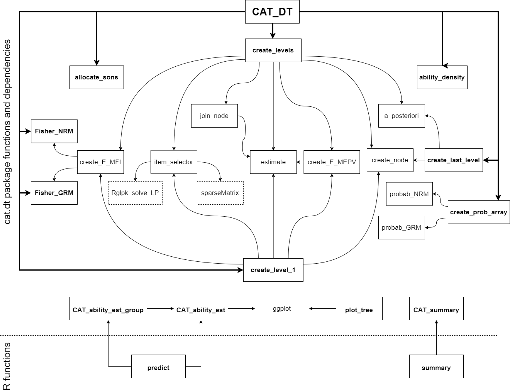
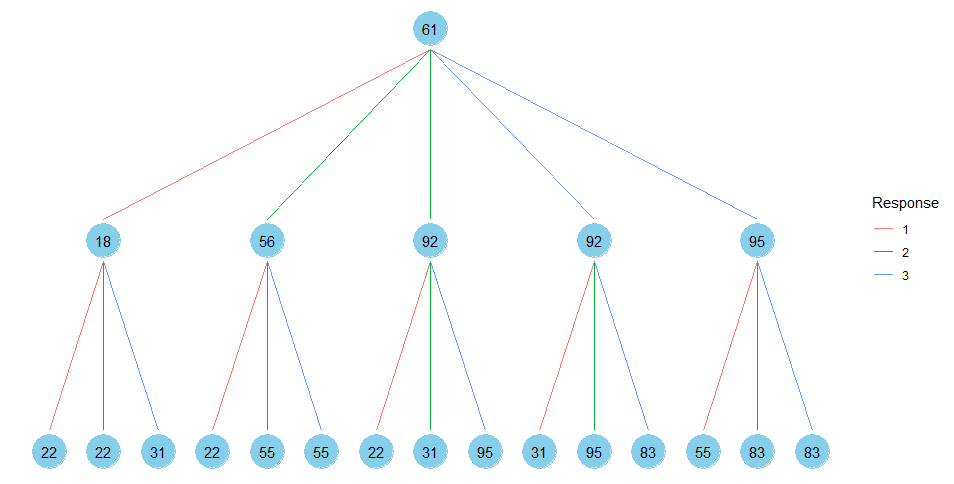
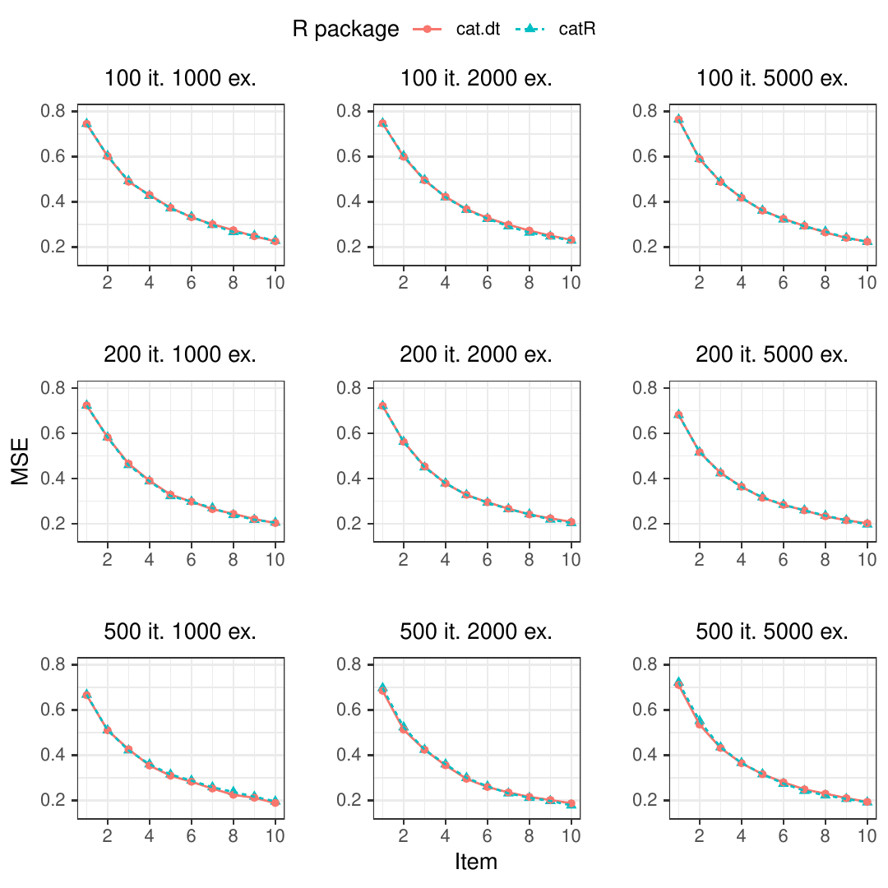

::: article
# Introduction

Nowadays, there is an increasing interest in the development and
application of Computerized Adaptive Tests (CATs). For instance, they
are applied in several areas such as psychology
[@ma2017new; @mizumoto2019developing], education
[@he2017development; @wu2017computerized], or medicine
[@michel2018computerized; @fox2019integrating]. The reason behind their
popularity is that CATs can estimate the ability level of a
psychological variable of interest in an examinee with greater accuracy
than the classical tests by administering a smaller number of items
[@weiss2004computerized]. Besides, the existence of certain mechanisms,
such as item exposure control [@georgiadou2007review] limits the leaking
of items between participants.

Concisely, CATs are tailored tests. Every item administered to the
examinee is chosen from an item bank by employing a selection criterion
that considers: i) the answers given by the participant to the items
previously administered; ii) the characteristics of such items, and iii)
the probabilities provided by a model that relates the responses to each
item with its characteristics. The most commonly used criterion is
Maximum Fisher Information (MFI) [@zhou2014optimal; @li2020look], which
selects the item that provides the highest information for the current
estimate of the ability level. However, this criterion presents several
drawbacks. These include item selection bias, large estimation errors at
the beginning of the test, high item exposure rates, and content
imbalance problems [@ueno2013adaptive; @zhuokang2012computational].
Various alternatives have been proposed as attempts for addressing these
problems. Among them stand out Minimum Expected Posterior Variance
(MEPV) [@van2009item], Kullback-Leibler Information [@chang1996global],
and Maximum Likelihood Weighted Information [@veerkamp1997some].
Although these selection techniques largely solve the aforementioned
problems, their high computational cost complicates their practical use.

Decision Trees (DTs) have been proposed to reduce the computational cost
in the creation of CATs. [@yan2004adaptive] used regression trees to
predict the participants  total score. A remarkable feature of this work
is the merge of nodes to maintain a sufficient sample size to perform
the partitions. Afterward, [@ueno2010computerized] developed an item
selection criterion based on mutual information in regression trees.
However, unlike CATs based on Item Response Theory (IRT), these works
predict the total score of the participant rather than estimate their
ability level, which makes it difficult to compare the performance of a
participant in two different tests aimed at measuring the same
construct. Recently, [@delgado2019computerized] mathematically proved
the equivalence between IRT-based CATs and DTs when the MEPV item
selection criterion is used, proposing the Tree-CAT method, which
integrates both methodologies. In their method, each node of the tree
contains an item, emerging from it as many branches as the number of the
item's possible responses. The examinees progress through the tree
according to the responses they provide until reaching the last node,
where their final estimate corresponds to the found ability level. The
disadvantage of this method is that it requires a high-performance
cluster to create the tree. In this regard, the Merged Tree-CAT method
[@rodriguez2020merged] extends and improves Tree-CAT, accelerating tree
construction by joining nodes with similar estimates or ability level
distributions.

Currently, there are several packages oriented to the creation of CATs
in R. Among them, we can find
[*catR*](https://CRAN.R-project.org/package=catR)
[@magis2012random; @magis2017computerized],
[*mirtCAT*](https://CRAN.R-project.org/package=mirtCAT)
[@chalmers2016generating], and
[*catIrt*](https://CRAN.R-project.org/package=catIrt) [@Nydick2014]. The
drawback of these packages is that they create a separate CAT for each
examinee, reducing their efficiency. For example, if two individuals
provided the same response to the first item, the computations for
estimation and selection of the next item would be performed twice, even
though the result would be the same. Therefore, the shortage of memory
in these packages considerably increases computational time, which makes
the practical application of CATs difficult, or even impossible, when
the item selection criterion is one of the most computationally
demanding.

This article describes the *cat.dt* package in which the Merged Tree-CAT
method [@rodriguez2020merged] is implemented. Unlike the existing
packages, *cat.dt* creates the CAT before it is administered to the
examinees and stores it in a DT structure. This allows that each time
the participant responds to an item, the estimation of their ability
level and the selection of the next item to be administered is immediate
since it is pre-computed. This differs from the existing packages, in
which both calculations are performed during the test administration,
making it difficult or even impossible to use computationally expensive
item selection criteria such as the MEPV. In this way, the *cat.dt*
package manages to quickly create CATs on a standard personal computer
as well as provides accurate estimates of the ability level of each
examinee.

The rest of the article is structured as follows. Firstly, it introduces
the elements of IRT and CATs used by the Merged Tree-CAT. Next, the
functions contained in the package are detailed, and an example of its
use is provided. Then, the performance of the *cat.dt* package is
compared to that of the *catR* package. Finally, the article discusses
the benefits of the package.

# IRT and CATs

The IRT, on which CATs are based, assumes that a participant's response
to an item depends on the ability level of the individual and the
characteristics of that item
[@richardson1936relation; @lawley1943xxiii; @tucker1946maximum]. This
relationship is obtained through probabilistic models in which the
probability $P_{ik} (\theta, \pi_i)$ that an examinee gives the response
$k=1,\ldots,K_i$ to an item $i$ depends on their ability level $\theta$
and the parameters of the item $\pi_i$.

For polytomous items, the most widespread model for ordered responses is
the Graded Response Model (GRM) developed by [@samejima1969estimation]:

$$P_{ik}^*(\theta,\pi_i)=\frac{e^{\alpha_i(\theta-\beta_{ik})}}{1+e^{\alpha_i(\theta-\beta_{ik})}},$$
where $\alpha_i$ is the discrimination parameter, $\beta_{ik}$ are the
difficulty (or location) parameters of each response $k$, and
$P^*_{ik}(\theta, \pi_i)$ the probability of giving the response $k$ or
greater. Therefore
$P_{ik}(\theta, \pi_i)=P^*_{ik} (\theta, \pi_i)-P_{ik+1}^*(\theta, \pi_i)$,
being $P^*_{i1}(\theta, \pi_i)=1,\ldots, P^*_{iK_i+1}(\theta, \pi_i)=0$.

When there is not a particular order in the responses, the most generic
model is the Nominal Response Model (NRM), defined by
[@bock1972estimating]:

$$P_{ik}(\theta,\pi_i)=\frac{e^{\rho_{ik}\theta+\gamma_{ik}}}{\sum_{r=1}^{K_i}e^{\rho_{ir}\theta+\gamma_{ir}}},$$
being $\rho_{ik}$ and $\gamma_{ik}$ the slope and intercept parameters,
respectively, for item $i$ and response $k$.

These probabilistic models are used in the CATs to obtain the estimate
of the ability level of the examinee based on their responses. Of all
the existing estimation methods, the Expected a Posteriori (EAP)
technique is widely used given the simplicity of its calculation and the
minimum Mean Squared Error (MSE) of its estimations [@bock1982adaptive].
When the responses $R_{i_1},\ldots, R_{i_M}$ of the examinee to the
items $i_i,\ldots,i_M$ are the possible responses $k_1,\ldots,k_M$ of
those items, the estimate $\hat{\theta}$ of the ability level is given
by:

$$\label{eq:est}
\hat{\theta}=\int_{-\infty}^{\infty}\theta f(\theta \mid R_{i_1}=k_1,\ldots, R_{i_M}=k_M) d\theta,   (\#eq:est)$$
being $f(\theta \mid R_{i_1}=k_1,\ldots, R_{i_M}=k_M)$ the posterior
density function given the responses according to Bayes' theorem:

$$\label{eq:apos}
f(\theta \mid R_{i_1}=k_1,\ldots, R_{i_M}=k_M)=\frac{P_{i_1k_1}(\theta,\pi_{i_1})\cdots P_{i_Mk_M}(\theta,\pi_{i_M}) f(\theta)}{\int_{-\infty}^{\infty} P_{i_1k_1}(\theta,\pi_{i_1})\cdots P_{i_Mk_M}(\theta,\pi_{i_M}) f(\theta) d\theta},   (\#eq:apos)$$
where $f(\theta)$ is the prior density function of the examinee's
ability level.

Each time an examinee responds to an item, this ability level estimation
is used by the CAT to choose the next item. Among the existing item
selection methods, MFI is the most popular. This criterion consists of
choosing the item $i^*$ that maximizes the Fisher information function
$F_i(\theta)$ evaluated at the current estimate $\hat{\theta}$ of the
ability level. This function is given by [@magis2015note]:

$$\label{eq:fish}
F_i(\theta)=\sum_{k=1}^{K_i} \frac{P'_{ik}(\theta,\pi_i)^2}{P_{ik}(\theta,\pi_i)}-P''_{ik}(\theta,\pi_i)   (\#eq:fish)$$

Another criterion to highlight is the MEPV because it has been shown to
be equivalent to minimizing the MSE of the estimates of the ability
level [@delgado2019computerized]. In this case, given the posterior
density function $f(\theta \mid X_{i_1}=k_1,\ldots, X_{i_M}=k_M)$
obtained from the responses to the items $i_1,\ldots,i_M$, the MEPV
criterion chooses the item $i^*$ that minimizes the function:

$$\label{eq:mepv}
E_i=\int_{-\infty}^{\infty} \left(\sum_{k=1}^{K_i} \left(\theta-\hat{\theta}^i_{M+1,k}\right)^2 P_{ik}(\theta,\pi_i)\right) f(\theta \mid R_{i_1}=k_1,\ldots, R_{i_M}=k_M) d\theta,   (\#eq:mepv)$$
being $\hat{\theta}_{M+1,k}^i$ the ability level estimation if the
examinee's response $R_{M+1}$ is the possible response $k$ of item $i$.

In summary, CATs are constructed as follows. Starting from a prior
density $f(\theta)$ and a prior estimate $\theta_0$, the first item to
be administered to the examinee is selected according to an established
criterion. Once a response is given, their ability level is estimated,
from which the next item to administer is selected. This process is
repeated until a stopping criterion is reached (for example, a
predetermined number of items to be administered per participant), being
the final estimation of the examinee the one obtained after their last
response.

The aforementioned process is structured by the Merged Tree-CAT method
in a DT as follows [@rodriguez2020merged]. As in the Tree-CAT method,
each tree node has an assigned item and an associated estimate based on
the responses given to the items assigned to the parent nodes. The
novelty of the Merged Tree-CAT method consists of limiting the growth of
the tree by joining nodes with similar estimates, accelerating its
construction with the least loss of precision in the estimates. Once
constructed, the examinee progresses through the tree according to their
answers until reaching the last node, where the final estimate of their
ability level is found. In addition, the Merged Tree-CAT method
incorporates item exposure control by establishing an exposure rate that
limits the percentage of participants that are administered with each
item, which increases the safety of the test.

The *cat.dt* package implements the Merged Tree-CAT method. As it will
be explained in the following section, each of the items that form the
test is chosen using the MFI or MEPV criterion, employing the estimate
obtained by the EAP method according to the GRM or NRM model.

# The cat.dt package

This section starts by describing the *cat.dt* package architecture and
its main function `CAT_DT`. This is followed by a practical example on
how to use this package to create CATs structured in DTs, to visualize
them, and to obtain estimates of the ability level of participants.
Finally, we detail some of the computational features taken into account
in the building of the package to increase its efficiency.

The *cat.dt* package can be installed from CRAN
(`install.packages(“cat.dt”)`) or from the development version's GitHub
repository <https://github.com/jlaria/cat.dt>. [^1]

## cat.dt structure

The *cat.dt* package consists of the functions shown in Figure
[1](#depen), which also displays the dependency relationships between
them.

{#depen
width="100%" alt="graphic without alt text"}

The most relevant functions are the following:

-   `CAT_DT`: Creates the CAT structured in a DT.
-   `create_level_1`: Creates the nodes that conform to the first level
    of the DT.
-   `create_levels`: Creates the nodes that conform to the levels of the
    DT (except for the first level).
-   `join_node`: Joins nodes from the same tree level with similar
    estimations or distributions of the ability level.
-   `CAT_ability_est` : Estimates the ability level of a participant
    after each response and computes a Bayesian credible interval of the
    final estimation.

## The `CAT_DT` function

The input parameters of the main function `CAT_DT` are introduced in
Table [1](#tab:res).

::: {#tab:res}
  ---------- ------------------------------------------------------------------------------------------------------------------------------------------------------------------------------------------------------------------------------------------------------------------------------------------------------------------------------------------------------------------------------------------------------------------------------------
    `bank`    Item bank. It must be a data frame in which each row represents an item and each column one of its parameters. If the model is GRM, the first column must be the discrimination parameter and the remaining columns are the difficulty (or location) parameters [@samejima1969estimation]. If the model is NRM, the odd columns must be the slope parameters and the even columns the intercept parameters. [@bock1972estimating].

   `model`                                                                                                                                                                                     CAT probabilistic model. Options: `“GRM”` (default) and `“NRM”`.

    `crit`                                                                                                                                             Item selection criterion. Options: `“MEPV”` for the Minimum Expected Posterior Variance (default) or `“MFI”` for the Maximum Fisher Information.

     `C`                                                                                                        Expected fraction $C$ of participants administered with each item (exposure rate). It can be a vector with as many elements as items in the bank or a positive number if all the items have the same rate. Default: `C = 0.3`.

    `stop`                                                          Vector of two components that represent the CAT stopping criteria. The first component represents the maximum level $L$ of the DT and the second represents the threshold for the Standard Error (SE) of the ability level [@bock1982adaptive] (if 0, this second criterion is not applied). Default: `stop = c(6,0)`.

   `limit`                                                                                                                                  Maximum number $N$ of nodes per level (max. $N=10000$). This is the main parameter that controls the tree growth. It must be a natural number. Default: `limit = 200`.

   `inters`                                                                                                       Minimum intersection of the density functions of two nodes to be joined. It must be a number between 0 and 1. If the user wants to avoid using this criteria, `inters = 0` should be specified. Default: `inters = 0.98`.

     `p`                                                                                                                                               Prior probability of the interval whose limits determine a threshold for the distance between estimations of nodes to join. Default: `p = 0.9`.

    `dens`                                                                                                                                                                      Prior density function of the ability level. It must be an R function: `dnorm`, `dunif`, etc.

    `...`                                                                                                                                                                                                           Parameters to `dens`.
  ---------- ------------------------------------------------------------------------------------------------------------------------------------------------------------------------------------------------------------------------------------------------------------------------------------------------------------------------------------------------------------------------------------------------------------------------------------

  : Table 1: Main function parameters.
:::

The tree growth is controlled by the parameters `limit`, `inters`, and
`p`. The `limit` parameter is the maximum number $N$ of nodes per level.
When this number is exceeded in the construction of the tree, those
nodes whose estimates of the ability level are at a distance less than a
threshold $(\lambda_L-\lambda_U)/N$ are joined, being $\lambda_L$ and
$\lambda_U$ the lower and upper bounds of an interval with probability
`p` according to the prior density function of the ability level.
Finally, `inters` is the minimum value that must exceed the intersection
between the density functions of two nodes to join when the maximum
number $N$ of nodes per level has not been reached. This intersection is
obtained using the methodology defined in [@cha2007comprehensive].

Finally, the `CAT_DT` function returns a list with the input parameters
introduced by the user and the elements described in Table [2](#tab:ex).

::: {#tab:ex}
  ----------------- ---------------------------------------------------------------------------------------------------------------------------------------------------------------------------------------------------------------------------------------------------------------------------------------------------------------------------------------------------------------------------------------------------------------------------------------------------------------------------------------------------------------------------------------------------------------------------------------------
       `nodes`       List with a maximum of $L+1$ elements (levels). Each level contains a list of the nodes of the corresponding level. Note that the first level will contain more than one root node if $C<1$. In this case, each examinee would start the test for one of them at random. The nodes of the additional level $L+1$ only include the estimation and distribution of the ability level given the responses to the items of the final level $L$. Note that the `nodes` list can have less than $L+1$ elements if the SE stopping criterion is satisfied for all the nodes from a previous level.

      `C_left`                                                                                                                                                                                                                                                                     Residual exposure rate of each item after the CAT construction.

      `predict`                                                                                    Function that returns the estimated ability level of an examinee after each response and a Bayesian credible interval of the final estimation given their responses to the items from the item bank. These responses must be entered by the user as a numeric vector input. In addition, it returns a vector with the items that have been administered to the examinee. This is the function `CAT_ability_est` of the package.

   `predict_group`                                                                                                                                                                                                  Function that returns a list whose elements are the returned values of the function `predict` for every examinee from the group. This is the function `CAT_ability_est_group` of the package.
  ----------------- ---------------------------------------------------------------------------------------------------------------------------------------------------------------------------------------------------------------------------------------------------------------------------------------------------------------------------------------------------------------------------------------------------------------------------------------------------------------------------------------------------------------------------------------------------------------------------------------------

  : Table 2: Main function output.
:::

## cat.dt usage example

Firstly, it is shown how to build a CAT using the main function
`CAT_DT`. To do this, the item bank from the data frame `itemBank`
included in the package is used. Given the nature of these items, the
probabilistic model used is the GRM. Also, the item selection criterion
adopted is the MEPV, the exposure rate is set at $0.3$, the length of
the test at $10$ items, and the prior distribution of the ability level
at an $N(0,1)$, leaving the rest of the parameters at their default
values. The function call is made as follows:

``` r
example_cat <- CAT_DT(bank = itemBank, model = "GRM", crit = "MEPV", C = 0.3, 
stop = c(10,0), limit = 200, inters = 0.98, p = 0.9, dens = dnorm, 0, 1)
```

Among the values returned by this function, the list `nodes` contains
all the nodes that conform the DT in which the CAT is structured. These
nodes are grouped by levels. As an example, if we access the first node
of the third level,

``` r
example_cat$nodes[[3]][[1]]
```

we obtain

``` r
$`ID`
[1] 30001

$item
[1] 22

$item_prev
[1] 18 11

$est
[1] -1.10257

$SE
[1] 0.8071584

$ID_sons
  ID_son Response Probability
1  40001        1           1
2  40002        2           1
3  40003        3           1

$D
[1] 0.03331851

$as_val
[1] 0.5396903
```

This list contains, among others, information about: i) `ID`, the node
identifier; ii) `item`, the item assigned to the node; iii) `item_prev`,
the items previously administered to the examinee that reaches the node;
iv) `est`, the estimation of the ability level after their responses to
these items, v) `SE`, the SE associated to that estimation. Finally, the
data frame `ID_sons` contains the ID of each child node, the response
that leads to it, and the probability of, given that response, accessing
that child node.

A description of the tree can be obtained using the R function
`summary`. This function provides: i) The number of levels; ii) The
number of nodes per level; iii) The probabilistic model used; iv) The
item selection criterion used; v) The residual exposure rate of every
item and vi) The percentage of items used to build the test. In order to
summarize the tree, we enter

``` r
summary(example_cat)
```

to obtain

``` r
----------------------------------------------------------------------
Number of tree levels: 10 

Number of nodes in level 1 : 4 
Number of nodes in level 2 : 14 
Number of nodes in level 3 : 39 
Number of nodes in level 4 : 99 
Number of nodes in level 5 : 101 
Number of nodes in level 6 : 124 
Number of nodes in level 7 : 141 
Number of nodes in level 8 : 158 
Number of nodes in level 9 : 165 
Number of nodes in level 10 : 177 
----------------------------------------------------------------------
Psychometric probabilistic model: GRM 
Item selection criterion: MEPV 
----------------------------------------------------------------------
Item exposure:
item  1 : 0.000   item  2 : 0.0768   item  3 : 0.000   item  4 : 0.1704   
item  5 : 0.1532   item  6 : 0.000   item  7 : 0.300   item  8 : 0.000   
item  9 : 0.000   item  10 : 0.000   item  11 : 0.300   item  12 : 0.000   
item  13 : 0.000   item  14 : 0.000   item  15 : 0.2508   item  16 : 0.000   
item  17 : 0.000   item  18 : 0.300   item  19 : 0.2113   item  20 : 0.255   
item  21 : 0.2314   item  22 : 0.2565   item  23 : 0.000   item  24 : 0.000   
item  25 : 0.0532   item  26 : 0.000   item  27 : 0.000   item  28 : 0.000   
item  29 : 0.000   item  30 : 0.0855   item  31 : 0.300   item  32 : 0.000   
item  33 : 0.0107   item  34 : 0.000   item  35 : 0.000   item  36 : 0.0127   
item  37 : 0.000   item  38 : 0.000   item  39 : 0.2467   item  40 : 0.0902   
item  41 : 0.000   item  42 : 0.000   item  43 : 0.2611   item  44 : 0.300   
item  45 : 0.000   item  46 : 0.000   item  47 : 0.300   item  48 : 0.0885   
item  49 : 0.000   item  50 : 0.300   item  51 : 0.1192   item  52 : 0.000   
item  53 : 0.0166   item  54 : 0.000   item  55 : 0.300   item  56 : 0.300   
item  57 : 0.000   item  58 : 0.000   item  59 : 0.2233   item  60 : 0.000   
item  61 : 0.300   item  62 : 0.000   item  63 : 0.2583   item  64 : 0.0839   
item  65 : 0.000   item  66 : 0.0367   item  67 : 0.000   item  68 : 0.300   
item  69 : 0.300   item  70 : 0.300   item  71 : 0.1213   item  72 : 0.000   
item  73 : 0.1803   item  74 : 0.000   item  75 : 0.000   item  76 : 0.000   
item  77 : 0.000   item  78 : 0.000   item  79 : 0.0153   item  80 : 0.000   
item  81 : 0.000   item  82 : 0.000   item  83 : 0.300   item  84 : 0.000   
item  85 : 0.2125   item  86 : 0.1251   item  87 : 0.1741   item  88 : 0.000   
item  89 : 0.0253   item  90 : 0.300   item  91 : 0.000   item  92 : 0.300   
item  93 : 0.2539   item  94 : 0.300   item  95 : 0.300   item  96 : 0.300   
item  97 : 0.000   item  98 : 0.000   item  99 : 0.000   item  100 : 0.000   

Percentage of items used: 49 %
----------------------------------------------------------------------
```

In addition, the tree created can be visualized by means of the function
`plot_tree`. This function takes as input arguments: i) The tree
created; ii) The number of levels to plot, iii) The index of the root
node to start the test. For example, by introducing

``` r
plot_tree(example_cat, levels = 3, tree = 3)
```

we obtain the following plot

{#tree width="100%"
alt="graphic without alt text"}

Once the CAT has been created, the ability level of an examinee is
estimated using the `predict` function. The *cat.dt* package includes as
an example the matrix `itemRes`, which contains the responses of 30
examinees to the 100 items of the bank `itemBank`. For instance, to
calculate the estimate of the fifth examinee (a seed is needed to obtain
the same result due to probabilistic node access) we use

``` r
set.seed(0)
predict(example_cat, itemRes[5, ])
```

We obtain

``` r
$`estimation`
 [1] 0.7649071 0.3114948 0.4320018 0.6780359 0.4762673 0.7993720 0.7504451 0.5928716
 [9] 0.7041479 0.6217778

$llow
[1] -0.325

$lupp
[1] 1.565

$items
[1] 70 83 95 55  4 39  7 51 96 73

$graphics
```

This output list contains: i) The vector `estimation`, which includes
the estimated ability level after each response; ii) The lower `llow`
and upper `lupp` bounds of a Bayesian credible interval at 95% of the
final estimation of the examinee's ability level; iii) The vector
`items`, which contains the items that have been administered to the
examinee in the CAT, iv) The object `graphics`, which represents the
evolution of the ability level estimation automatically as shown in
[3](#evol).

{#evol width="100%"
alt="graphic without alt text"}

This plot represents the estimation of the ability level after
responding to each administered item. For example, giving response $3$
to item $70$ results in an estimate of approximately
$\hat{\theta}=0.76$. Then, after giving response $1$ to item $83$, the
estimate decreases to approximately $\hat{\theta}=0.31$, and so on. Note
that the value of the response influences whether the estimate decreases
or increases. Alternatively to the `predict` function, it can be entered
`CAT_ability_est(example_cat, itemRes[5, ])` or
`example_cat$predict(itemRes[5, ])`.

Finally, these results can be obtained for a whole group of examinees
also by calling the function `predict`. In this case, this function
returns a list whose elements are the outputs as if it was called for
every examinee. Once it is stored in a variable in the following way,

``` r
est_group <- predict(example_cat, itemRes)
```

the estimation information is available for every examinee. For
instance, to know the items administered to the second examinee, the
following must be introduced:

``` r
est_group[[2]]$items
```

Obtaining:

``` r
[1] 61 92 95 55 50 59 85 63 19 69
```

Alternatively to the `predict` function, it can be introduced
`example_cat$predict_group(itemRes)` or
`CAT_ability_est_group(example_cat, itemRes)`.

A similar example can be found in the tutorial vignette included in the
package.

## Computational features

Before ending this section, we detail the computational features that
accelerate the construction of the tree and reduce memory space.

-   Message passing: The calculation of the posterior density function
    (equation \@ref(eq:apos)) is necessary to obtain the estimation of
    the ability level (equation \@ref(eq:est)), the selection of the
    next item according to the MEPV criterion (equation \@ref(eq:mepv)),
    and the Bayesian credible interval of the final estimation. Such
    calculation would involve the multiplication of $M$ terms for each
    node of the corresponding level. However, since the multiplication
    of the first $M-1$ terms is done to obtain the density function of
    the parent node, this information is stored by the *cat.dt* package
    and passed to the child node, in which only the last term is
    multiplied.
-   Joining nodes: the *cat.dt* package joins those nodes whose
    estimations and/or posterior density functions meet the similarity
    criteria determined by the parameters `limit`, `inters`, and `p`.
    These unions control tree growth, which significantly accelerates
    tree creation and reduces the amount of memory space without losing
    precision in the estimations.
-   Riemann integration and probability pre-calculation: The integrals
    required in the equations \@ref(eq:est), \@ref(eq:apos), and
    \@ref(eq:mepv) are approximated numerically by Riemann integration.
    To do this, a set of ability levels
    $\{\theta_0,\ldots,\theta_{4000}\}$ is considered, where
    $\theta_j=-10+j/200$, covering the interval $(-10,10)$. The Riemann
    integration in equation \@ref(eq:mepv) requires the previous
    calculation of $P_{ik}(\theta_j,\pi_i)$ for each item $i$, possible
    answer $k$, and ability level $\theta_j$. Because of this, these
    probabilities are calculated and stored before the creation of the
    tree and then used in equations \@ref(eq:apos), \@ref(eq:fish), and
    \@ref(eq:mepv). This avoids repeating unnecessary calculations and
    accelerates the creation of the CAT.

# Performance assessment

In this section, the performance of the *cat.dt* package is compared to
that of the *catR* package. Ability level estimates and computational
times of both packages have been studied for nine different simulation
scenarios. In each scenario, a CAT is constructed from an item bank
(composed of 100, 200, or 500 items), which is administered to a group
of examinees (1000, 2000, or 5000 examinees). The database for each
scenario can be found online [^2] in the format
`[number of items]_items_[number of examinees]_examinees.RData`.

Similar to the example of the previous section, the probabilistic model
used is GRM, the criteria for selecting items is MEPV, the length of the
test is ten items per participant (the SE threshold is set at 0), and
the prior distribution of the ability level is $N(0,1)$. However, unlike
the aforementioned example, there is no item exposure control ($C = 1$)
since the implementation differs in both packages: the *cat.dt* package
builds the CAT before administration and the *catR* package during
administration.

All the simulations for both packages were run in an HP Z230 Tower
Workstation with an Intel(R) Core(TM) i7-4770 CPU @ 3.40GHz, with 32 GB
of RAM, running Debian GNU/Linux 10, R 3.5.2.

Figure [4](#mse) illustrates the MSE of the ability level estimates
after each response of the examinees, obtained by both packages in each
scenario. It is observed that the estimates after each response are
equally accurate, indicating that the performance of both packages is
very similar.

{#mse
width="100%" alt="graphic without alt text"}

On the other hand, Table [3](#tab:times) displays the time employed by
each package in the computations for the creation of the CAT and the
evaluation of those examined in each scenario. It can be seen that the
*cat.dt* package is barely affected by the number of examinees since the
CAT is created before it is administered to the participants. However,
the *catR* package creates a CAT for each examinee, so the computational
time is proportional to the number of participants. This causes *catR*
package to take several days in total for the creation and
administration of the CAT, whereas package *cat.dt* takes a few minutes,
being this difference larger the higher the number of examinees.

::: {#tab:times}
  -- ------ ----------- ---------- ----------- ---------- ----------- -----------
             100 items              200 items              500 items  

              cat.dt       catR      cat.dt       catR      cat.dt       catR

      1000    93.94 s    40.23 h    263.04 s    81.04 h    608.71 s    206.61 h

      2000   160.67 s    78.55 h    314.88 s    162.22 h   635.54 s    413.82 h

      5000   160.14 s    196.98 h   264.50 s    406.79 h   675.42 s    1033.65 h
  -- ------ ----------- ---------- ----------- ---------- ----------- -----------

  : Table 3: CAT creation and evaluation times.
:::

# Summary

This article has introduced the *cat.dt* package oriented to the
creation of CATs structured in DTs, their visualization, and the
estimation of the ability levels of the examinees. Unlike the existing
packages, the *cat.dt* package creates the test before being
administered to the examinees, so its performance is independent of the
number of participants. For this reason, it is ideal for application to
large groups, taking a few minutes to create and administer the test.
Besides, it has been shown that the *cat.dt* package obtains ability
level estimates as accurate as those obtained by the *catR* package,
which is widely used in the field of CATs.

# Acknowledgments

This article has been funded by the Spanish National Project No.
RTI2018-101857-B-I00.
:::

[^1]: This package imports the dependencies
    [*Matrix*](https://CRAN.R-project.org/package=Matrix),
    [*Rglpk*](https://CRAN.R-project.org/package=Rglpk), and
    [*ggplot2*](https://CRAN.R-project.org/package=ggplot2) for matrix
    treatment, linear programming, and visualization, respectively.

[^2]: <https://github.com/jlaria/cat.dt-performance-assessment>
