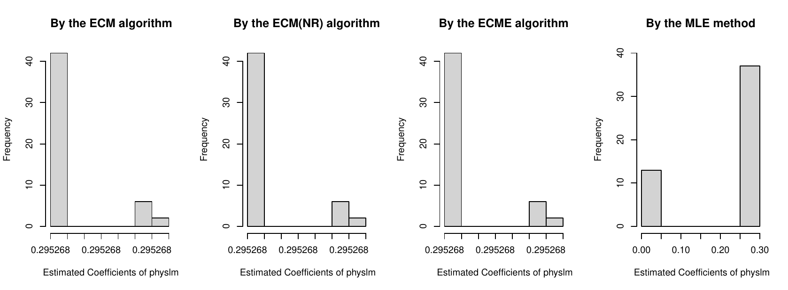
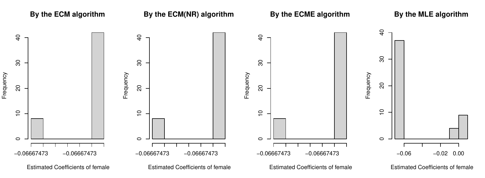
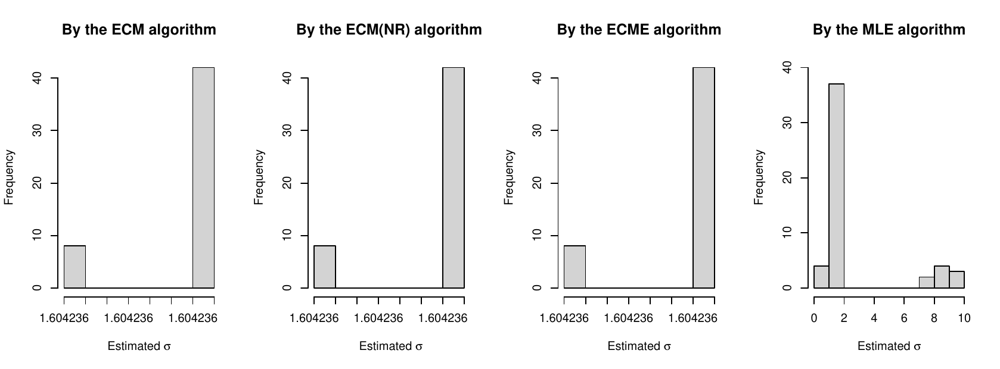

::: article
# Introduction

The problem arising from the sampling mechanism where an investigator
extracts a sample non-randomly, and then this sample cannot represent
the population is usually referred to as a sample selection problem.
Methods relying on a distributional assumption are widely used to deal
with this selection problem. A classical sample selection model under
the assumption of bivariate normality is introduced in [@Heckman:1974],
and it is commonly called the Heckman selection model. [@Heckman:1979]
further developed two estimation procedures for the above Heckman
selection model: the maximum likelihood estimation method (MLE) and the
two-step method.

The application of these two methods in the Heckman selection model is
first described in the R package
[*sampleSelection*](https://CRAN.R-project.org/package=sampleSelection)
by [@Toomet+Henningsen:2008]. For the observations where outlying ones
are considered in the Heckman selection model, [@Zhelonkin+etal:2016]
found that the unboundedness of the influence functions in the two-step
method leads to an arbitrary bias. [@Zhelonkin+etal:2016] developed a
robust two-stage method that performs more robustly than the two-step
method, and the *ssmrob* package is available for robust estimation and
inference for the selection model.

@Little+Rubin:2002 [pp. 322-323] applied an EM algorithm, which is
numerically stable and easily implemented, to estimate the parameters of
the Heckman selection model. However, it is limited to the cases in
which the two vectors of the observed characteristics in the Heckman
selection model are the same. [@Zhaoetal:2020] extended three new
EM-type algorithms: expectation-conditional maximization (ECM),
expectation-conditional maximization with Newton-Raphson method
(ECM(NR)), and Expectation/Conditional Maximization Either (ECME) to
more general cases. They also have the main advantages of the EM
algorithm, namely stability and ease of implementation. However, section
6 in [@Zhaoetal:2020] suggests that the ECME algorithms require much
more time than other two EM-type algorithms in the same real data
analysis. In addition, there is still no R package available for these
EM-type algorithms. [@MengandRubin:1993], [@LiuandRubin:1994], and
[@McLachlanandKrishnan:2008] are helpful to understand the procedures of
the ECM and ECME algorithms.

This study developed the ECME algorithm by first applying the
Newton--Raphson method to reduce the estimation time. Then, it is
proposed to describe these new EM-type algorithms in R. In the next
section, the Heckman selection model is described in brief, followed by
new algorithms, namely ECM, ECM(NR), and ECME. Next, the usage of the
*EMSS* package is presented through simulation and real data examples.
Then, the robustness issue is further discussed for the MLE method and
the new EM-type algorithms. Under the conditions where the robustness
issue arises from the initial values, the *EMSS* package is preferable
to the
[*sampleSelection*](https://CRAN.R-project.org/package=sampleSelection).
Because of the unreasonable results in the MLE or the two-step method,
the "NA\" might occur in the standard errors in the
[*sampleSelection*](https://CRAN.R-project.org/package=sampleSelection).
However, the standard errors can be calculated effectively in the *EMSS*
package in almost all cases. Finally, we provide a summary of this
study.

The *EMSS* package is available from the Comprehensive R Archive Network
(CRAN) at <https://CRAN.R-project.org/package=EMSS> and the GitHub at
<https://github.com/SangkyuStat/EMSS>. R code for the examples
demonstrated herein has been provided as supplementary material. The
supplementary code has been tested with *EMSS* version 1.1.1, and
results presented herein have been produced with this version.

# Model and algorithms {#sec:ModelAlgorithms}

## Heckman selection model

Suppose that the regression model of the outcome variable of interest is
$$\begin{aligned}
\label{eq:classheck}
	Y_{i1} = {\bf x}_i^\top \boldsymbol\beta + \epsilon_i,\,\,\, i=1, \ldots, N.
\end{aligned}   (\#eq:classheck)$$
Due to selection mechanism,
$$\begin{aligned}
\label{eq:seleq}
	Y_{i2} = {\bf w}_i^\top \boldsymbol\gamma + \eta_i,\,\,\, i=1, \ldots, N,
\end{aligned}   (\#eq:seleq)$$
we observe only $N_1$ out of $N$ observations $y_{i1}$ for which
$y_{i2} > 0$ such that
$$\begin{aligned}
	u_i = I(y_{i2} > 0).
\end{aligned}$$
${\bf x}_i \in \mathbb{R}^p$ and ${\bf w}_i \in  \mathbb{R}^q$ are
observed characteristics. In addition, vectors
${\boldsymbol\beta}\in  \mathbb{R}^p$,
${\boldsymbol\gamma} \in  \mathbb{R}^q$ are unknown parameters. Assume
that the error terms $\epsilon_i$ and $\eta_i$ follow bivariate
normality as in [@Heckman:1974], that is,
$$\begin{aligned}
\label{eq:completeDataDist}
	\left(
	\begin{array}{c}
		\epsilon_i\\
		\eta_i\\
	\end{array}
	\right)
	\stackrel{\text{i.i.d.}}{\sim}
		N_2\left[
	\left(
	\begin{array}{c}
		0\\
		0\\
	\end{array}
	\right)
	,
	\left(
	\begin{array}{cc}
		\sigma^2 & \rho\sigma\\
		\rho\sigma & 1 \\
	\end{array}
	\right)\right],
\end{aligned}   (\#eq:completeDataDist)$$
where $``i.i.d."$ means independent and identically distributed, then
$\left(Y_{i1},Y_{i2}\right)$ also follow bivariate normal distribution.

## EM-type algorithms

### ECM and ECM(NR) algorithms

The ECM algorithm is discussed first. In the Heckman selection model, it
is assumed that we observe the first $N_1$ out of $N$ $y_{i1}$
observations. The observed data are
${\bf y}_{obs} = (y_{11}, \cdots, y_{N_1, 1})^\top$, and the missing
data are
${\bf y}_{mis} = ((y_{N_1+1,1}, \cdots, y_{N,1}), {\bf y}_2^\top)^\top$.
Applying the invariance property of MLEs, the parameter
$\boldsymbol{\theta} = \{ \boldsymbol{\beta}, \boldsymbol{\gamma}, \sigma, \rho \}$
can be transformed to
$\boldsymbol{\theta}^* = \{ \boldsymbol{\beta}, \boldsymbol{\gamma}, \psi^*, \rho^* \}$
with $\psi = \sigma^2 (1 - \rho^2)$, $\psi^* = \log(\psi)$,
$\rho^* = \rho \sigma$ and
$$\begin{aligned}
\label{eq:sigma and rho}
	\sigma^2 = \exp(\psi^*) + (\rho^*)^2~ \text{and}~ \rho = \dfrac{\rho^*}{\sqrt{ \exp(\psi^*) + (\rho^*)^2}}.
\end{aligned}   (\#eq:sigma-and-rho)$$
The complete data log-likelihood is
$$\begin{aligned}
	&&l_c (\boldsymbol{\theta}^* | {\bf y}) =  -N \log(2\pi) -\dfrac{N}{2} \log (\psi) -\dfrac{1}{2 \psi} \left\{ \sum_{i=1}^N (y_{i1} - {\bf x}_{i}^\top \boldsymbol{\beta})^2\right\} \\
	&&~~~ -\dfrac{1}{2} \left(1 + \dfrac{(\rho^*)^2}{\psi} \right) \left\{ \sum_{i=1}^N (y_{i2} - {\bf w}_{i}^\top \boldsymbol{\gamma})^2 \right\} + \dfrac{\rho^*}{\psi} \left\{ \sum_{i=1}^N (y_{i1} - {\bf x}_{i}^\top \boldsymbol{\beta}) (y_{i2} - {\bf w}_{i}^\top \boldsymbol{\gamma}) \right\}.
\end{aligned}$$
The corresponding Q-function, which is the conditional expectation of
the above complete-data log-likelihood
$l_c (\boldsymbol{\theta}^* | {\bf y})$ with respect to the conditional
distribution of ${\bf y}_{mis}$ given ${\bf y}_{obs}$ at the $k$-th
iteration, is obtained as
$$\begin{aligned}
	&&Q\left(\boldsymbol{\theta}^*|\hat{\boldsymbol{\theta}}^{*(k)}\right) = E \left[ l_c (\boldsymbol{\theta}^* | {\bf y}) | \hat{\boldsymbol{\theta}}^{*(k)} \right] = -N \log(2\pi) -\dfrac{N}{2} \log (\psi)\\
	&&~~~ -\dfrac{1}{2 \psi} \left\{ \sum_{i=1}^{N_1} (y_{i1} - {\bf x}_{i}^\top \boldsymbol{\beta})^2 + \sum_{i=N_1+1}^N (\hat{\nu}_{1m}^{(k)} - 2 \hat{\alpha}_{1m}^{(k)} {\bf x}_{i}^\top \boldsymbol{\beta} +  \boldsymbol{\beta}^\top {\bf x}_{i} {\bf x}_{i}^\top \boldsymbol{\beta}) \right\} \\
	&&~~~-\dfrac{1}{2} \left(1 + \dfrac{(\rho^*)^2}{\psi} \right) \left\{ \sum_{i=1}^{N_1} ( \hat{\nu}_{2o}^{(k)} - 2 \hat{\alpha}_{2o}^{(k)} {\bf w}_{i}^\top \boldsymbol{\gamma}  + \boldsymbol{\gamma}^\top {\bf w}_{i} {\bf w}_{i}^\top \boldsymbol{\gamma} ) \right.\\
&&\hskip 4cm \left. +  \sum_{i=N_1+1}^{N} ( \hat{\nu}_{2m}^{(k)} - 2 \hat{\alpha}_{2m}^{(k)} {\bf w}_{i}^\top \boldsymbol{\gamma}  + \boldsymbol{\gamma}^\top {\bf w}_{i} {\bf w}_{i}^\top \boldsymbol{\gamma} )  \right\}
\end{aligned}$$

$$\begin{aligned}
	&&~~~+ \dfrac{\rho^*}{\psi} \left\{ \sum_{i=1}^{N_1} (y_{i1} \hat{\alpha}_{2o}^{(k)} - y_{i1}  {\bf w}_{i}^\top \boldsymbol{\gamma} - \hat{\alpha}_{2o}^{(k)} {\bf x}_{i}^\top \boldsymbol{\beta} + \boldsymbol{\beta}^\top {\bf x}_i {\bf w}_i^\top \boldsymbol{\gamma} ) \right.\\
	&&\hskip 2cm \left.  \sum_{i=N_1+1}^{N} ( \hat{\alpha}_{12m}^{(k)} - \hat{\alpha}_{1m}^{(k)} {\bf w}_{i}^\top \boldsymbol{\gamma} - \hat{\alpha}_{2m}^{(k)} {\bf x}_{i}^\top \boldsymbol{\beta} + \boldsymbol{\beta}^\top {\bf x}_{i} {\bf w}_i^\top \boldsymbol{\gamma} ) \right\},
\end{aligned}$$
where specific vectors are provided in the Appendix.

The ECM(NR) algorithm is developed based on the former ECM algorithm to
accelerate the convergence process. The only difference is
$\hat{\psi}^{*(k+1)}$ in the CM-steps (Conditional Maximization-steps )
is first updated using the Newton--Raphson method, and
$\hat{\psi}^{(k+1)}$ is then obtained. The specific expressions can be
obtained in [@Zhaoetal:2020]. For a better understanding of the ECM
algorithm, [@MengandRubin:1993] and [@McLachlanandKrishnan:2008] can be
referred to.

### ECME algorithm

In this section, the ECME algorithm is briefly introduced and further
developed to save running time. [@LiuandRubin:1994] and
[@McLachlanandKrishnan:2008] can be referred to in understanding the
ECME algorithm in detail.

Assume that the complete data is $({\bf z}, {\bf y}_{obs}, {\bf u})$,
where ${\bf z} = (z_1, \cdots, z_{N_1})^\top$ is missing data,
${\bf y}_{obs} = (y_{11}, \cdots, y_{N_1, 1})^\top$, and
${\bf u} = (u_1, \cdots, u_N)^\top$. The related parameters
$\boldsymbol{\theta} = \{ \boldsymbol{\beta}, \boldsymbol{\gamma}, \sigma, \rho \}$
are transformed to
$\boldsymbol{\theta}^* = \{ \boldsymbol{\beta}, \boldsymbol{\gamma}, \psi^*, \rho^* \}$
like those in ECM algorithm. The complete data log-likelihood function
can be written as
$$\begin{aligned}
&l_c (\boldsymbol{\theta}^* ; {\bf z}, {\bf y}_{obs}, {\bf u}) = -\dfrac{1}{2} \sum_{i=1}^{N} u_i \log (2 \pi \psi) - \sum_{i=1}^{N} \dfrac{u_i \left( y_{i1} - {\bf x}_i^\top \boldsymbol\beta - \rho \sigma z_i \right)^2}{2\psi}\\
&~~~ - \dfrac{1}{2} \sum_{i=1}^{N} u_i \log (2 \pi) - \dfrac{1}{2} \sum_{i=1}^{N} u_i z_i^2 + \sum_{i=1}^{N} (1-u_i) \log \left( \Phi (- {\bf w}_i^\top \boldsymbol{\gamma})\right),
\end{aligned}$$
and the following is the Q-function (which is the conditional
expectation of the complete-data log-likelihood
$l_c (\boldsymbol{\theta}^* ; {\bf z}, {\bf y}_{obs}, {\bf u})$ with
respect to the conditional distribution of ${\bf z}$ given
${\bf y}_{obs}$ and ${\bf u}$) calculated at the $k$-th iteration of the
E-step:
$$\begin{aligned}
&Q(\boldsymbol{\theta}^*|\hat{\boldsymbol{\theta}}^{*(k)}) = E \left[ l_c (\boldsymbol{\theta}^* |  {\bf z}, {\bf y}_{obs}, {\bf u}) | \hat{\boldsymbol{\theta}}^{*(k)} \right] = -\dfrac{1}{2} \sum_{i=1}^N
u_i \log (2 \pi \psi)  \\
&~~~ - \dfrac{1}{2 \psi} \sum_{i=1}^N \left\{ u_i (y_{i1} - {\bf x}_i^\top \boldsymbol{\beta})^2 - 2 u_i (y_{i1} - {\bf x}_i^\top \boldsymbol{\beta}) \rho^*
\hat{\alpha}_i^{(k)} + u_i (\rho^*)^2 \hat{\delta}_i^{(k)} \right\}\\
&~~~ -\dfrac{1}{2} \sum_{i=1}^N u_i \log (2 \pi) - \dfrac{1}{2} \sum_{i=1}^N u_i \hat{\delta}_i^{(k)} + \sum_{i=1}^N (1 - u_i) \log (\Phi (- {\bf w}_i^\top \boldsymbol{\gamma})),
\end{aligned}$$
where
$$\begin{aligned}
\hat{\alpha}_i^{(k)} &= E[Z_i | \hat{\theta}^{*^{(k)}}, y_{i1}, U_i = 1] ~\text{and}\\
\hat{\delta}_i^{(k)} &= E[Z_i^2 | \hat{\theta}^{*^{(k)}}, y_{i1}, U_i = 1],
\end{aligned}$$
with the conditional distribution
$$\begin{aligned}
Z_i | \hat{\theta}^{*^{(k)}}, y_{i1}, U_i = 1 \sim TN_{(-{\bf w}_i^\top \hat{\boldsymbol{\gamma}}^{(k)}, \infty )} \left( \dfrac{\hat{\rho}^{(k)}}{\hat{\sigma}^{(k)}} \left( y_{i1} - {\bf x}_i^\top \hat{\boldsymbol{\beta}}^{(k)} \right), 1 - \hat{\rho}^{2^{(k)}} \right),
\end{aligned}$$
where the stochastic representation of the density function for
$y_{i1} | u_i = 1$ is considered. The ECME algorithm is time-consuming
because calculating $\hat{\boldsymbol{\gamma}}^{(k+1)}$ requires a
significant amount of time. The Newton-Raphson method is applied to
reduce the computing time. In the CM-step, the
$\hat{\boldsymbol{\gamma}}^{(k)}$ is updated by
$$\begin{aligned}
	\hat{\boldsymbol \gamma}^{(k+1)}
	=\hat{\boldsymbol \gamma}^{(k)}-\left[\dfrac{\partial^2}{\partial {\boldsymbol \gamma} \partial{\boldsymbol \gamma}^\top}\log L\left(\boldsymbol{\theta}^*|\hat{\boldsymbol{\theta}}^{*(k)}\right)\right]^{-1}\dfrac{\partial  }{\partial {\boldsymbol \gamma}}\log L\left(\boldsymbol{\theta}^*|\hat{\boldsymbol{\theta}}^{*(k)}\right),
\end{aligned}$$
where
$$\begin{aligned}
	\dfrac{\partial  }{\partial {\boldsymbol \gamma}}\log L\left(\boldsymbol{\theta}^*|\hat{\boldsymbol{\theta}}^{*(k)}\right)
	=\sum\limits_{i=1}^N u_i\dfrac{\phi(A)}{\Phi(A)}\dfrac{\hat{\sigma}^{(k+1)}}{\sqrt{\exp\left(\hat{\psi}^{*(k+1)}\right)}}{\bf w}_i
	+\sum\limits_{i=1}^N (u_i-1)\dfrac{\phi\left(-{\bf w}_i^\top{\boldsymbol \gamma}^{(k+1)}\right)}{\Phi\left(-{\bf w}_i^\top{\boldsymbol \gamma}^{(k+1)}\right)}{\bf w}_i,
\end{aligned}$$
and
$$\begin{aligned}
	&&\dfrac{\partial^2 \log L\left(\boldsymbol{\theta}^*|\hat{\boldsymbol{\theta}}^{*(k)}\right) }{\partial {\boldsymbol \gamma}\partial {\boldsymbol \gamma}^\top} = -\sum\limits_{i=1}^N \dfrac{u_i\hat{\sigma}^{(k+1)^2}}{\exp\left(\hat{\psi}^{*(k+1)}\right)}
	\left[A\dfrac{\phi(A)}{\Phi(A)}+\left(\dfrac{\phi(A)}{\Phi(A)}\right)^2\right]{\bf w}_i {\bf w}_i^\top\\
	&&~~~~~+\sum\limits_{i=1}^N (1-u_i)\left[\dfrac{{\bf w}_i^\top{\boldsymbol \gamma}\phi\left(-{\bf w}_i^\top{\boldsymbol \gamma}^{(k+1)}\right)}{\Phi\left(-{\bf w}_i^\top{\boldsymbol \gamma}^{(k+1)}\right)}
	-\left(\dfrac{\phi\left(-{\bf w}_i^\top{\boldsymbol \gamma}^{(k+1)}\right)}{\Phi\left(-{\bf w}_i^\top{\boldsymbol \gamma}^{(k+1)}\right)}\right)^2 \right]{\bf w}_i {\bf w}_i^\top,
\end{aligned}$$
with
$$\begin{aligned}
	A=\dfrac{\hat{\sigma}^{(k+1)}{\bf w}_i^\top\hat{\boldsymbol \gamma}^{(k)}
		+\hat{\rho}^{(k+1)}\left(y_{i1}-{\bf x}_{i}^\top \hat{\boldsymbol{\beta}}^{(k+1)}\right)}{\sqrt{\exp\left(\hat{\psi}^{*(k+1)}\right)}}.
\end{aligned}$$

# Implementation in `EMSS` {#sect:implement}

The package *EMSS* is constructed to describe the three EM-type
algorithms. In *EMSS*, the main function for the estimation of the
Heckman selection model is `EMSS`. A formula for the response equation
whose argument is `response` and a formula for the selection equation
with argument `selection` are required. With the default estimation
method ECM ("`ECM`\"), the user can also choose the method "`ECMnr`\"
for the ECM(NR) method or "`EMCE`\" for the ECME method. The argument
`initial``.param` can be used to set the initial values. If the initial
values are not provided by the user, *EMSS* conducts the estimation of
the consistent initial values offered by the two-step method through the
package *sampleSelection*.

The result of *EMSS* is a list of class '`EMSS`', and several methods
for the objects of this class are also provided by the package *EMSS*.
Command `print` prints the estimation results. Command `summary`
calculates and prints the summarized results. `coef` extracts the
estimated coefficients, and `vcov` extracts the variance-covariance
matrix. `confint` can be used to calculate the confidence intervals of
all the parameters by applying the following equation.
$$\begin{aligned}
	\left[\begin{array}{cc}
		\hat{\text{para}}+Z_{\alpha}\times \text{stdrr} &\hat{\text{para}}+Z_{1-\alpha}\times\text{stdrr}  \\
	\end{array}
	\right],
\end{aligned}$$
where $\hat{\text{para}}$ is the estimated value of a parameter,
$\text{stdrr}$ is the corresponding standard error value, and
$Z_{\alpha}$ and $Z_{1-\alpha}$ are the quantile values of standard
normal distribution at $\alpha$ and $1-\alpha$, respectively, with
$\alpha=(1-\text{level})/2$, where "level\" is the confidence level. The
default confidence level (`level`) is 0.95 (95%), and it can be changed
to any value between $0$ and $1$.

# Using *EMSS* {#sec:usage}

This section illustrates the usage of *EMSS* using a simulation example
and application to a real data set. An example using random numbers is
given first, with exclusion restriction where the two observed
characters ${\bf X}$ and ${\bf W}$ are not the same.

``` r
set.seed(0)
library( mvtnorm )
N<-1000
errps<-rmvnorm(N,c(0,0),matrix(c(1,0.5,0.5,1),2,2) )
w<-runif(N)
y2<-w+errps[,1]>0
x<-runif(N)
y1<-(x+errps[,2])*(w>0)
```

The package [*mvtnorm*](https://CRAN.R-project.org/package=mvtnorm) is
used to create bivariate normal disturbances with a correlation of
$0.5$. The observed character for selection, `w`, is generated by
uniform distribution, and the selection outcome `y2` is then generated
using the probit generating process. Through a similar process, the
explanatory variable `x` and the outcome variable of interest `y1` are
generated. Note that the two observed characters, `w` and `x`, are
independent and thus fulfill the exclusion restriction. Hence, the
parameters ${\boldsymbol \beta}$ and ${\boldsymbol \gamma}$ are set
equally as $(0,1)^\top$ and must be estimated. The estimated results in
the ECM algorithm are as follows.

``` r
summary(EMSS(response=y1~x,selection=y2~w))

Call:
EMSS(response = y1 ~ x, selection = y2 ~ w)

Q-Value: -2637.487

Response equation:
             Estimate Std. Error Z Value  Pr(>|Z|)
(Intercept)  -0.2904     0.1258  -2.309 2.096e-02 *
x             1.2319     0.1311   9.398 5.548e-21 ***

Selection equation:
              Estimate Std. Error Z Value  Pr(>|Z|)
(Intercept)   0.1010    0.07628   1.324 1.855e-01
w             0.7569    0.13243   5.716 1.093e-08 ***
---

Sigma:
         Estimate Std. Error Z Value  Pr(>|Z|)
sigma    1.124    0.07167   15.69 1.797e-55 ***

Rho:
      Estimate Std. Error Z Value  Pr(>|Z|)
rho   0.6858     0.1214    5.65 1.603e-08 ***
---
Signif. codes: 0 '***' 0.001 '**' 0.01 '*' 0.05 '.' 0.1 ' ' 1
```

The estimated results for the parameters are reasonably precise.

The following real data example is an example in @Cameron+Trivedi:2009
[Section 16.6.5, p. 546] regarding ambulatory expenditures from the 2001
Medical Expenditure Panel Survey. The data consist of 3328 observations
with 526 corresponding to zero expenditures and is available in
`MEPS2001` of the R package *ssmrob*. To estimate an individual's
medical expenditures, the outcome (response) variable of interest, log
ambulatory expenditures (`lnambx`), is modeled by individual's age
(`age`), gender (`female`), education attainment in years (`educ`),
ethnicity (`blhisp`), number of chronic diseases (`totchr`), and
insurance status (`ins`). The selection variable, ambulatory
expenditures, which is described by `dambexp` is modeled by all the
former regressors and the income variable (`income`). The model is
estimated using the ECM(NR) method.

``` r
library(ssmrob)
data(MEPS2001))
outcomeEq<-lnambx ~ age+female+educ+blhisp+totchr+ins
selectEq<-dambexp ~ age+female+educ+blhisp+totchr+ins+income
summary(EMSS(response=outcomeEq, selection=selectEq,
                data=MEPS2001,method="ECMnr"))


Call:
EMSS(response = outcomeEq, selection = selectEq, data = MEPS2001,
method = "ECMnr")

Q-Value: -10213.94

Response equation:
             Estimate  Std. Error Z Value   Pr(>|Z|)
(Intercept)  5.04406    0.22813  22.111 2.493e-108 ***
age          0.21197    0.02301   9.213  3.160e-20 ***
femaleTRUE   0.34814    0.06011   5.791  6.984e-09 ***
educ         0.01872    0.01055   1.774  7.599e-02 .
blhispTRUE  -0.21857    0.05967  -3.663  2.492e-04 ***
totchr       0.53992    0.03933  13.727  6.996e-43 ***
insTRUE     -0.02999    0.05109  -0.587  5.572e-01

Selection equation:
            Estimate   Std. Error Z Value  Pr(>|Z|)
(Intercept) -0.676054   0.194029  -3.484 4.934e-04 ***
age          0.087936   0.027421   3.207 1.342e-03 **
femaleTRUE   0.662665   0.060938  10.874 1.528e-27 ***
educ         0.061948   0.012029   5.150 2.609e-07 ***
blhispTRUE  -0.363938   0.061873  -5.882 4.054e-09 ***
totchr       0.796951   0.071131  11.204 3.895e-29 ***
insTRUE      0.170137   0.062871   2.706 6.807e-03 **
income       0.002708   0.001317   2.056 3.975e-02 *
---

Sigma:
         Estimate Std. Error Z Value Pr(>|Z|)
sigma    1.271    0.01838   69.16        0 ***

Rho:
     Estimate Std. Error Z Value Pr(>|Z|)
rho  -0.1306     0.1471  -0.888   0.3746
---
Signif. codes: 0 '***' 0.001 '**' 0.01 '*' 0.05 '.' 0.1 ' ' 1
```

All coefficients and standard errors are completely identical to the
results reported in @Cameron+Trivedi:2009 [Section 16.6.5, p. 546].

The confidence interval of this example can be calculated using the
following codes.

``` r
 confint(EMSS(response=outcomeEq, selection=selectEq,
               data=MEPS2001,method="ECMnr"))
```

To compare the computing times of the original ECME algorithm and the
developed one for which the Newton-Raphson method is applied, the real
data example in Section 6, [@Zhaoetal:2020], is analyzed again. The
developed ECME algorithm is used as follows.

``` r
library(sampleSelection)
data(Mroz87)
selectEq <- lfp ~ age + I(age^2)+ faminc + kids5 + educ
outcomeEq <- wage ~ exper + I(exper^2) + educ + city
EMSS(response = outcomeEq, selection = selectEq, data = Mroz87,
        method = "ECME")
```

The results are similar to those of the ECM and ECM(NR) algorithm in
table 8 of [@Zhaoetal:2020], which are slightly better than those in the
original ECME algorithm.

The *EMSS* package and R codes were executed on a computer with an
Intel(R) Core (TM) i7-4790M CPU at 3.60 GHz, running MS-Windows 10. The
ECME algorithm developed herein takes 22.67 s while the original one
takes 14.63 min. The computing time of the ECME algorithm is thus
significantly reduced than before.

# Robustness issues {#sec:robustness}

[@Zhaoetal:2020] concluded that a robustness issue arises from the
initial values in the MLE method but not in the three EM-type
algorithms. Here, we aim to discuss this robustness issue further. For
the simulated example in Section Using *EMSS*, the MLE method is also
applied to estimate the data set using the command `selection()` in R
package
[*sampleSelection*](https://CRAN.R-project.org/package=sampleSelection)
[@Heningsenetal:2019]. The initial values are found to influence the
estimated values of parameters in the MLE method. For example, if the
initial value of $\sigma$ is set to 5, that of $\rho$ is set to 0.8, and
those of other parameters are set to 0s, the results of the MLE method
are given as follows.

``` r
summary(selection(y2~w,y1~x,start=c(rep(0,4), 5,0.8) ),method="ml")

--------------------------------------------
Tobit 2 model (sample selection model)
Maximum Likelihood estimation
Newton-Raphson maximization, 3 iterations
Return code 3: Last step could not find a value above the current.
Boundary of parameter space?
Consider switching to a more robust optimization method temporarily.
Log-Likelihood: -2214.037
1000 observations (318 censored and 682 observed)
6 free parameters (df = 994)
Probit selection equation:
             Estimate Std. Error t value Pr(>|t|)
(Intercept)  0.05991    0.03482   1.721   0.0856 .
w            0.03362    0.05204   0.646   0.5185
Outcome equation:
            Estimate Std. Error t value Pr(>|t|)
(Intercept) -0.02336    0.05811  -0.402    0.688
x           -0.01041    0.22132  -0.047    0.963
Error terms:
        Estimate Std. Error t value Pr(>|t|)
sigma   5.0000         NA      NA       NA
rho     0.9652         NA      NA       NA
--------------------------------------------
Warning messages:
1: In sqrt(diag(vc)) : NaNs produced
2: In sqrt(diag(vc)) : NaNs produced
3: In sqrt(diag(vcov(object, part = "full"))) : NaNs produced
```

The $p$-values of the estimated parameters (except $\sigma$ and $\rho$)
suggest that the estimated results are not significant. The occurrence
of "NA\" resulting from the variance-covariance matrix further implies
that the estimated results in the MLE method are not reasonable. The
previous section, Using *EMSS*, presents the results from the ECM
algorithm where the initial values are set by default based on the
results from the two-step method. With the different initial value sets
in this section, the ECM, ECM(NR), and ECME algorithms perform stably,
and their results are the same as the ones of the ECM algorithm shown in
the Using *EMSS* section to eight decimal places. If the simulated
annealing maximizer is applied to select the initial values for the MLE
methods, the estimated results are similar to those in the three EM-type
algorithms.

To avoid the occasion of the robustness issue in the MLE method, the
former scenario is regenerated 1000 times with the degree of censoring
corresponding to approximately $30\%$. Considering the same initial
value set as the former, the boxplots in Figures [1](#fig:bias) and
[2](#fig:MSE) suggest that the three EM-type algorithms perform
similarly and even much better than the MLE algorithm.

{#fig:bias width="100%"
alt="graphic without alt text"}

{#fig:MSE width="100%" alt="graphic without alt text"}

In [@Cameron+Trivedi:2005], the data set `RanHIE`, which is available in
package
[*sampleSelection*](https://CRAN.R-project.org/package=sampleSelection),
based on the "RAND Health Insurance Experiment" is used to analyze how
the patient's use of health services is affected by the types of
randomly assigned health insurance. An example based on the analysis in
@Cameron+Trivedi:2005 [p. 553] is provided to further discuss this
situation.

The outcome variable ${\bf y}_1$ is `lnmeddol`, which measures the log
of an individual's medical expenses, and the selection variable
${\bf y}_2$ is `binexp`, which indicates whether the medical expenses
are positive. The observed character ${\bf X}$ consists of the log of
the coinsurance rate plus 1 (`logc=log(coins+1)`), the dummy for the
individual deductible plan (`idp`), the log of participation incentive
payment (`lpi`), the number of chronic diseases (`disea`), the log of
family size (`lfam`), education of household head in years (`educdec`),
age of individual in years (`xage`), quadratic polynomial in the age of
individual in years, and a dummy variable for female individuals
(`female`). The observed character ${\bf W}$ consists of `logc`,
physical limitations (`phslm`), `disea`, quadratic polynomial in
`disea`, `lfam`, `educdec`, `xage`, and `female`. A partial sample where
the study year (`year`) is equal to 2 and the education information is
given is selected for the estimation with sample size $N=5,574$.

Fix the initial values of all parameters except $\sigma$ and $\rho$ at 0
and consider three different initial values sets for $\sigma$ and
$\rho$. If the initial values of $\sigma$ range from 0.1 to 0.65, then
the estimated values of all parameters in the MLE method are the
corresponding initial values regardless of the initial values of $\rho$.
The estimated results in the ECM algorithm are stable as follows.

``` r
data(RandHIE)
subsample<-RandHIE$year==2&!is.na(RandHIE$educdec)
outcomeEq<-lnmeddol~logc+physlm+disea+I(disea^2)+lfam+educdec+xage+female
selectEq<-binexp~logc+idp+lpi+disea+lfam+educdec+xage+I(xage^2)+female
summary(EMSS(response=outcomeEq,selection=selectEq,
    initial.para=c(rep(0,19),0.2,0.5), data=RandHIE[subsample,]))

Call:
EMSS(response = outcomeEq, selection = selectEq,
data = RandHIE[subsample, ])

Q-Value: -16195.75

Response equation:
            Estimate   Std. Error  Z Value  Pr(>|Z|)
(Intercept)  2.4841461   0.168714  14.7240 4.523e-49 ***
logc        -0.1199851   0.011946 -10.0440 9.762e-24 ***
physlm       0.2952680   0.068552   4.3072 1.653e-05 ***
disea        0.0415756   0.008574   4.8490 1.241e-06 ***
I(disea^2)  -0.0001355   0.000250  -0.5421 5.878e-01
lfam        -0.1828111   0.048101  -3.8006 1.443e-04 ***
educdec      0.0350172   0.008674   4.0368 5.418e-05 ***
xage         0.0203750   0.001588  12.8310 1.100e-37 ***
female       0.3123718   0.048632   6.4231 1.335e-10 ***

Selection equation:
            Estimate   Std. Error  Z Value  Pr(>|Z|)
(Intercept) -0.0807292  1.240e-01  -0.651 5.150e-01
logc        -0.1138537  1.078e-02 -10.562 4.470e-26 ***
idp         -0.0632783  3.994e-02  -1.584 1.131e-01
lpi          0.0320468  7.301e-03   4.389 1.136e-05 ***
disea        0.0283038  3.329e-03   8.503 1.841e-17 ***
lfam        -0.0666747  3.799e-02  -1.755 7.922e-02 .
educdec      0.0516196  6.923e-03   7.456 8.928e-14 ***
xage        -0.0051879  4.066e-03  -1.276 2.020e-01
I(xage^2)    0.0001979  6.907e-05   2.865 4.164e-03 **
female       0.2098103  3.829e-02   5.479 4.281e-08 ***
---

Sigma:
         Estimate Std. Error Z Value Pr(>|Z|)
sigma    1.604    0.02888   55.56        0 ***

Rho:
      Estimate Std. Error Z Value   Pr(>|Z|)
rho    0.745     0.0323   23.07   9.724e-118 ***
---
Signif. codes: 0 '***' 0.001 '**' 0.01 '*' 0.05 '.' 0.1 ' ' 1
```

In the second initial value set, the initial value of $\rho$ is 0.5, and
that of $\sigma$ is within $[0.66,7.9]$. The three new EM-type
algorithms perform similarly to the ECM algorithm in the first initial
value set. The estimated results in the MLE method are stable like those
in the ECM algorithm.

In the third initial value set, the initial values of $\sigma$ are
larger than 7.9, and the three new EM-type algorithms still perform
stably, similar to the former. However, the estimated values of each
parameter in the MLE method are not stable. For example,

``` r
summary(selection(selectEq,outcomeEq,start=c(rep(0,19),8.8,0.5),
           data=RandHIE[subsample,],method="ml" ))

--------------------------------------------
Tobit 2 model (sample selection model)
Maximum Likelihood estimation
Newton-Raphson maximization, 3 iterations
Return code 3: Last step could not find a value above the current.
Boundary of parameter space?
Consider switching to a more robust optimization method temporarily.
Log-Likelihood: -15707.81
5574 observations (1293 censored and 4281 observed)
21 free parameters (df = 5553)
Probit selection equation:
            Estimate   Std. Error  t value Pr(>|t|)
(Intercept)  2.155e-03  1.029e-01   0.021   0.9833
logc         5.082e-03  8.366e-03   0.607   0.5436
idp          1.106e-03  2.536e-02   0.044   0.9652
lpi          6.242e-04  4.436e-03   0.141   0.8881
disea       -4.776e-03  2.504e-03  -1.907   0.0565 .
lfam         4.923e-03  3.258e-02   0.151   0.8799
educdec     -1.921e-03  5.710e-03  -0.336   0.7366
xage        -2.601e-03  2.440e-03  -1.066   0.2866
I(xage^2)   -1.355e-05  3.918e-05  -0.346   0.7294
female      -2.802e-03  3.258e-02  -0.086   0.9315
Outcome equation:
            Estimate   Std. Error  t value Pr(>|t|)
(Intercept) -0.0056280  0.8243005  -0.007  0.99455
logc        -0.0120012  0.0616586  -0.195  0.84568
physlm       0.0001365  0.2694167   0.001  0.99960
disea       -0.0359361  0.0349727  -1.028  0.30421
I(disea^2)   0.0001022  0.0009454   0.108  0.91390
lfam        -0.0086017  0.2567682  -0.033  0.97328
educdec     -0.0622248  0.0449205  -1.385  0.16604
xage        -0.0286630  0.0081770  -3.505  0.00046 ***
female      -0.0023083  0.2580752  -0.009  0.99286
Error terms:
        Estimate Std. Error t value Pr(>|t|)
sigma   8.8015         NA      NA       NA
rho     0.9186         NA      NA       NA
--------------------------------------------
Warning messages:
1: In sqrt(diag(vc)) : NaNs produced
2: In sqrt(diag(vc)) : NaNs produced
3: In sqrt(diag(vcov(object, part = "full"))) : NaNs produced
```

The warning messages, the $p$-value of each parameter, and the "NA\" in
the standard errors of parameters $\sigma$, and $\rho$ suggest that the
estimated results of the MLE method are not reasonable.

By summarizing the above three initial value sets with setting the
initial values of $\sigma$ at $\left\{0.1,0.3,\ldots,10\right\}$, Figure
[3](#fig:RanHIE) presents the histograms of the estimated coefficients
for the variables `physlm`, `female`, and the estimated values of the
parameter $\sigma$ in all four algorithms. The histograms illustrate
that the horizontal axis value in the three EM-type algorithms are the
same all the time, which further suggests that three EM-type algorithms
do not affect by the initial values, and they perform similarly.
However, the histograms of the MLE method imply that the MLE method is
not stable.

<figure id="fig:RanHIE">
<table>
<caption> </caption>
<tbody>
<tr class="odd">

</tr>
<tr class="even">

</tr>
<tr class="odd">

</tr>
</tbody>
</table>
<figcaption>Figure 3: Some estimated values in the four algorithms for
the <code>RanHIE</code> data.</figcaption>
</figure>

This suggests that the three EM-type algorithms are more robust than the
MLE method. However, the computing times of the above three examples
using the ECME algorithm are relatively longer than those of ECM and
ECM(NR). It is found that the computing time of the ECME algorithm is
affected by the sample size. For instance, under different sample sizes,
Table [1](#tab:time) presents the running time of the ECM, ECM(NR), and
ECME algorithms for the simulated example shown in the section using
*EMSS* with 10-times regeneration. As the sample size increases, the
ECME algorithm costs much more time than the ECM and ECM(NR) algorithms.

::: {#tab:time}
  ------------------ -------- --------- --------- ---------- ---------- --
  Sample sizes $n$   200      300       500       800        1000       

  ECM                2.5415   3.1542    4.4769    6.1861     7.8049     

  ECM(NR)            2.5232   3.0921    4.4393    6.0212     7.6943     

  ECME               7.7486   16.9576   26.7005   119.0904   159.1983   
  ------------------ -------- --------- --------- ---------- ---------- --

  : Table 1: Running time (seconds) of the simulated example in the
  section Using *EMSS* with 10-times regeneration.
:::

If the sample size of the former RandHIE data example decreases to
$1,000$ randomly with the same outcome and selection models, MLE
presents results similar to the three EM-type algorithms only when the
initial values of $\sigma$ ranges from 0.71 to 7.0 (the values may
change since the sample size is randomly reduced to $1,000$). The three
EM-type algorithms still present stable results that are similar to each
other. Furthermore, the EMCE algorithm takes a similar computing time
with the ECM and ECM(NR). So it will be better to use ECM or ECM(NR)
algorithms for the large-size samples.

To achieve more robust estimation, the simulated annealing maximizer for
10,000 iterations is applied to offer better initial values for the MLE
method. Note that the selected value for "parscale\" in SANN is 0.001,
which was satisfactory for this data set. The estimated results of the
parameters are the same as those in the MLE method in the second initial
value set. The calculated log-likelihood value is -10331.12, which is
greater than -15707.81 in the third initial value set.

# Discussion {#sec:disscu}

The ECME algorithm is developed through the application of the
Newton-Raphson method to reduce the computing time. The implementation
of three new EM-type algorithms, namely ECM, ECM(NR), and ECME, are
described in package *EMSS*. The application of the package *EMSS* is
conducted using simulated and real data sets. The examples for which
initial values are considered in detail further confirm that the three
new EM-type algorithms are more robust than the MLE method. The *EMSS*
package is preferable to the
[*sampleSelection*](https://CRAN.R-project.org/package=sampleSelection)
when the robustness issue arising from the initial values is involved.
The standard errors might not be calculated appropriately in the MLE or
the two-step method in the
[*sampleSelection*](https://CRAN.R-project.org/package=sampleSelection)
because of the unreasonable results, but they can always be calculated
effectively using the *EMSS* package.

# Acknowledgment {#acknowledgment .unnumbered}

The corresponding author's research was supported by Basic Science
Research Program through the National Research Foundation of Korea (NRF)
funded by the Ministry of Education (2018R1D1A1B07045603) and the
National Research Foundation of Korea (NRF) grant funded by the Korea
government (MSIT) (2021R1A4A5032622).

::: appendix
# Appendix {#appendix .unnumbered}

Some vectors in the Q-function of ECM and ECM(NR) algorithms at the
$k$-th iteration are presented herewith. For missing $y_{i1}$,

1.  $\hat{\alpha}_{1m}^{(k)} = E(Y_{i1}|Y_{i2}\le 0) = \hat{\mu}_{i1}^{(k)}- \hat{\rho^{*}}^{(k)} \lambda(-\hat{\mu}_{i2}^{(k)})$,
    where
    $\hat{\mu}_{i1}^{(k)}= \textbf{x}_i^\top \hat{\boldsymbol{\beta}}^{(k)}$
    and
    $\hat{\mu}_{i2}^{(k)} =\textbf{w}_i^\top \hat{\boldsymbol{\gamma}}^{(k)}$;

2.  $\hat{\alpha}_{2m}^{(k)} = E(Y_{i2}| Y_{i2}\le 0) = \hat{\mu}_{i2}^{(k)} - \lambda(-\hat{\mu}_{i2}^{(k)})$;

3.  $\hat{\nu}_{1m}^{(k)} = E(Y_{i1}^2| Y_{i2}\le 0)  = \hat{\mu}_{i1}^{2(k)} + \hat{\sigma}^{2(k)} - \hat{\rho^{*}}^{(k)} \lambda(-\hat{\mu}_{i2}^{(k)}) (2 \hat{\mu}_{i1}^{(k)} -   \hat{\rho^{*}}^{(k)} \hat{\mu}_{i2}^{(k)})$;

4.  $\hat{\nu}_{2m}^{(k)} = E(Y_{i2}^2| Y_{i2}\le 0) = 1 + \hat{\mu}_{i2}^{2(k)} - \hat{\mu}_{i2}^{(k)} \lambda(- \hat{\mu}_{i2}^{(k)})$;

5.  $\hat{\alpha}_{12m}^{(k)} = E( Y_{i1} Y_{i2}| Y_{i2}\le 0) = \hat{\mu}_{i1}^{(k)} (\hat{\mu}_{i2}^{(k)} -\lambda( - \hat{\mu}_{i2}^{(k)} ) ) + \hat{\rho^{*}}^{(k)}$,
    and for observed $y_{i1}$,

6.  $\hat{\alpha}_{2o}^{(k)} = E(Y_{i2}| Y_{i1}, Y_{i2}>0) = \hat{\mu}_{i2.1}^{(k)} + \sqrt{1-\hat{\rho}^{2(k)}} ~ \lambda \left(\dfrac{\hat{\mu}_{i2.1}^{(k)}}{\sqrt{1 - \hat{\rho}^{2(k)}}} \right)$;\
    $\hat{\nu}_{2o}^{(k)} = E(Y_{i2}^2| Y_{i1}, Y_{i2}>0)  = 1 - \hat{\rho}^{2(k)} + \hat{\mu}_{i2.1}^{2(k)} + \hat{\mu}_{i2.1}^{(k)} \sqrt{1 - \hat{\rho}^{2(k)}} \lambda \left(\dfrac{\hat{\mu}_{i2.1}^{(k)}}{\sqrt{ 1 - \hat{\rho}^{2(k)}}} \right),$
    where
    $\hat{\mu}_{i2.1}^{(k)} = \textbf{w}_i^\top \boldsymbol{\gamma}^{(k)} + \dfrac{\hat{\rho}^{(k)}}{\hat{\sigma}^{(k)}} (y_{i1}-\textbf{x}_i^\top \boldsymbol{\beta}^{(k)})$.
:::
:::
