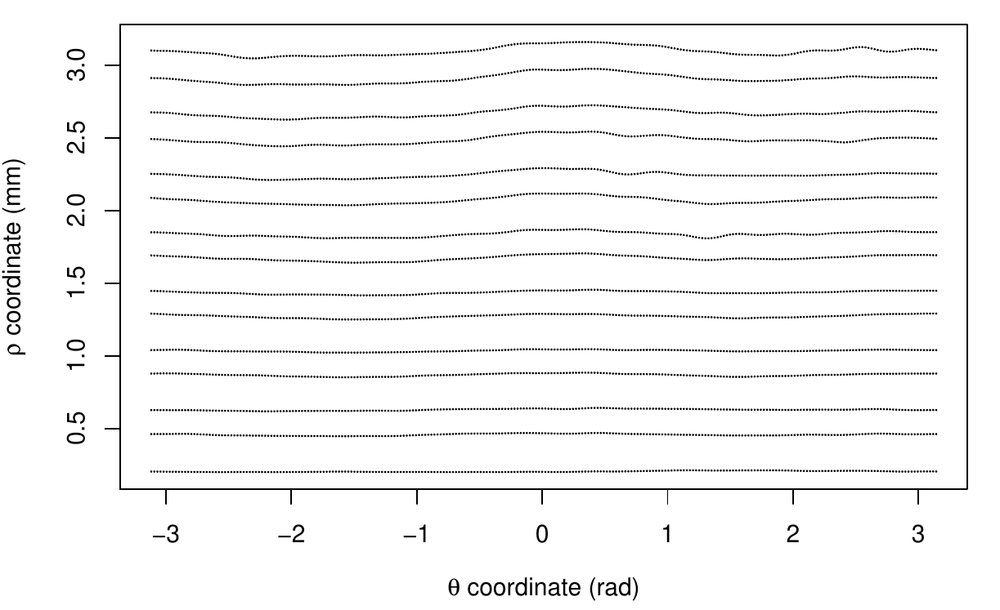
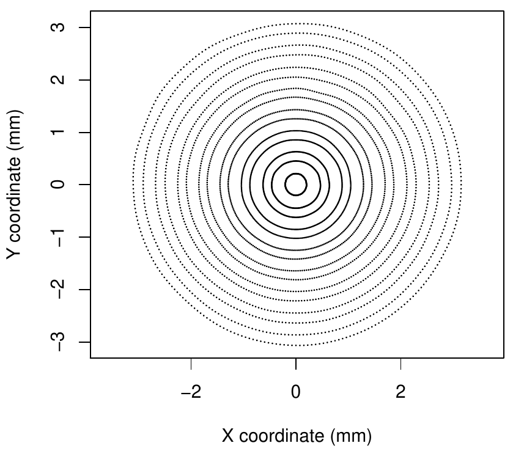
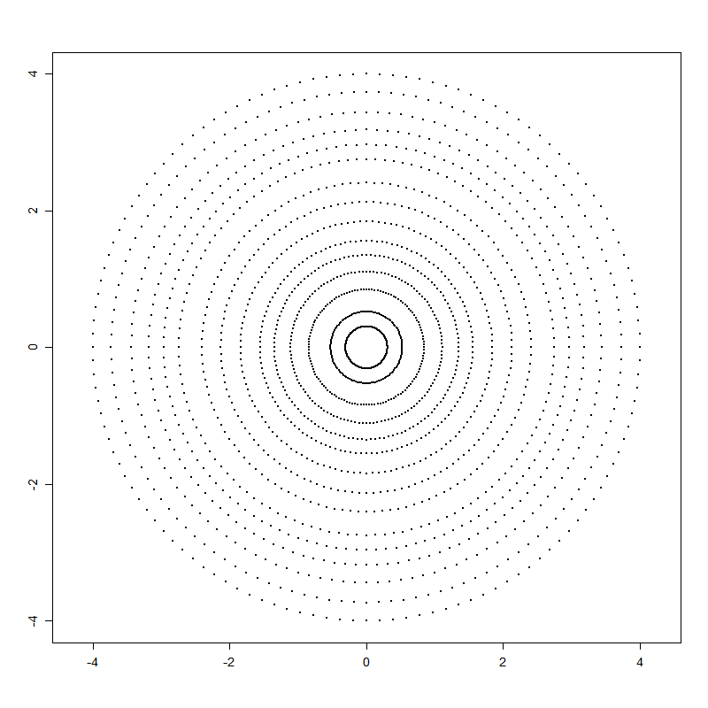
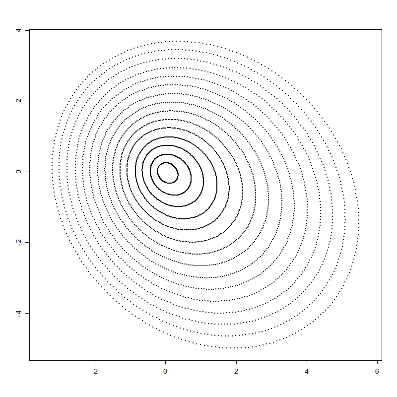

::: article
# Introduction

One of the major problems in the field of ophthalmology is the early
detection of keratoconus
[@MartinezAbad2017; @Accardo2002; @Rabinowitz1998]. Keratoconus is a
serious disease that deforms and weakens the cornea (the outer part of
the eye). There are several grades of this disease [@Alio2006], with the
most advanced stages being easy to detect. However, early or subclinical
keratoconus cases are much more difficult to identify
[@Sanctis2008; @Maguire1989]. Diagnosing keratoconus is crucial before
undergoing any kind of refractive eye surgery [@Llorente2004], in which
vision is corrected by modifying the corneal curvature, normally with
lasers. Failure to detect early keratoconus in these circumstances can
result in an ectasia [@Randleman2003], which in the most severe cases
can lead to blindness or corneal transplantation.

For the measurement and analysis of the cornea, the main clinical tool
is the corneal topography
[@Fan2018; @Pinero2015; @Read2009; @Rowsey1981]. Depending on the
employed technology, they can be basically classified into two types:
Scheimpflug camera devices [@Read2009] or Placido disk devices
[@Alkhaldi2009; @Samapunphong1998; @Rand1997], although some devices
combine these two technologies [@Fan2018; @Pinero2015]. As a result of
the measurement, topographers internally compute and provide altimetric
(elevation), curvature, or diopters data of the anterior or posterior
sides of the cornea. Currently, most of the topographers available in
clinics worldwide are Placido disk topographers as the Scheimpflug
technology is newer and more expensive. Thus, it is not so well
established in small or medium-sized clinics nor in countries with a
more limited health care system.

Many indices or metrics using corneal topography have been proposed for
the early detection of keratoconus [@Alio2016; @Prakash2012]. Some of
the most widely used indices are KPI [@Maeda1994] and KISA
[@Rabinowitz1999]. In recent years, work is continuing to find more
reliable indices for detecting keratoconus
[@Alio2016; @RamosLopez2011; @CastroLuna2020; @Buehren2010], with a
special focus on the early stages of this clinical condition
[@RamosLopez2013; @Issarti2019]. However, the early detection of
keratoconus is still an open research problem, and new approaches have
been proposed [@Issarti2020; @Yousefi2018; @Toquero2020].

In ophthalmological practice, however, the reference indices are
normally only those included in the topographer by default, computed
internally in a black-box scheme from the raw measurements. It can be
difficult for a practitioner to calculate other indices that are not
directly provided by the device, either for comparison, to complement a
diagnosis, or for research purposes. Therefore, this article aims to
present and explain the R package
[*rPACI*](https://CRAN.R-project.org/package=rPACI) (Placido Analysis of
Corneal Irregularity, @rPACI2020) and its use cases. This package was
developed to facilitate the calculation and interpretation of several
indices for detecting corneal irregularities, and especially keratoconus
(the indices introduced in @CastroLuna2020
[@RamosLopez2011; @RamosLopez2013]). These indices proved to be
effective in detecting keratoconus and early keratoconus (see those
references for more details).

The main goal of *rPACI* [@rPACI2020] is that these indices can be
easily computed by an ophthalmologist, an optometrist, or any
practitioner in general. To this end, several intuitive and easy-to-use
functions are provided, including those that can read the data of a
Placido disk topography from a file, analyze the data read and calculate
the indices, return the results in a manageable format, and represent
them graphically so that they are easily interpreted. To the best of the
authors' knowledge, there are neither other similar R packages nor other
pieces of non-commercial software sharing this goal.

As some practitioners may have difficulties in using the R syntax, we
provide, in addition to the package itself, a user-friendly intuitive
web application for *rPACI*, built using
[*shiny*](https://CRAN.R-project.org/package=shiny) [@RShiny]. This
graphical user interface is available to use from any web browser, and
it allows the user to readily use the functionality of *rPACI* without
installing R or any of its packages.

# Placido corneal topography and supported file formats {#sec:format}

The majority of topographers used in clinical practice to measure
corneal topography rely on the Placido disk technology (either alone or
in combination with others, such as the Scheimpflug camera)
[@Pinero2015; @Samapunphong1998; @Fan2018]. In such a topographer, an
illuminated pattern of concentric rings or mires (which is the actual
Placido disk) is projected into the corneal surface, and its reflection
on the anterior surface of the cornea is captured by a camera situated
at the center of the system. The picture is then digitized along with a
certain number of radii at equally spaced angles
[@Samapunphong1998; @Espinosa2013].

Many manufacturers produce corneal topographers that employ the Placido
disk technology. Some devices are often referred to as aberrometers or
tomographers (as they also include other technologies than the Placido
disk) or even keratometers or corneal analyzers. Some of these
manufacturers are: CSO (Firenze, Italy), Gaush (Beijing, China), Medmont
(Victoria, Australia), Nidek (Aichi, Japan), Optikon (Roma, Italy),
Topcon (Tokyo, Japan), Zeiss (Oberkochen, Germany), and Ziemer (Port,
Switzerland). This list has been elaborated with publicly available
information or reported in scientific papers. The authors do not have
any commercial or financial interest in the manufacturers reported here
or in any other related companies. The *rPACI* package includes a
vignette entitled "Corneal topographers and data formats", where
additional information about topographers and manufacturers is provided.

There are two basic magnitudes in the Placido corneal measurement: the
number of rings or mires in the actual Placido disk $N_R$ and the number
of angles (or points per ring) $N_A$ in the digitization process. These
may vary from a device to another. Typical values of $N_R$ in commercial
topographers are $20$, $22$, or $24$, even though some topographers have
as few as $10$ or as many as $33$. With respect to $N_A$, the most
common values used by commercial topographers are $256$ and $360$,
although some of them use other values.

The plain coordinates ($x$ and $y$) of these points are the primary raw
information measured by the Placido corneal topographers. Afterward,
they usually post-process the data to obtain a third coordinate ($z$),
yielding altimetric (elevation) or curvature data, and provide color
maps and other easy-to-interpret metrics and indices to the
practitioner. In some topographers, the raw measurements can be exported
in a structured text file.

*rPACI* can read corneal topography files in two different formats by
now. It will possibly be expanded in the future, allowing other formats.
Both are structured plain text files. The first supported file format is
basically the one employed by CSO topographers, but with some more
flexibility. The second supported file format has the structure used
internally by *rPACI*. These two formats are described in the next two
subsections.

## CSO file format

This file format is the one in which some CSO topographers (EyeTop2005,
Sirius, Antares, or Osiris-T), export the raw data measurements. The
corneal topography file should have the following 3-block structure:

-   An optional header with metadata: patient data, optical
    measurements, date of exploration, etc. Its size depends on the
    device. For CSO topographers, the header typically has 24 lines. The
    *rPACI*'s reading function for these files is able to identify the
    header block and skip it.
-   A list of size $N_R \times N_A$ with the $\rho$ coordinate (distance
    to the origin in polar coordinates, measured in mm) of the digitized
    points, at equally spaced angles ($\theta$, the argument in polar
    coordinates). The $\theta$ coordinate is inferred from the position
    (assuming a uniform distribution), as it is not explicitly given in
    the data file.
-   A list of size $N_R \times N_A$ with the $z$ coordinate, which can
    be altitude (elevation) or curvature, depending on the topographer
    and the exportation settings. These data are post-processed by the
    device using different algorithms, not directly measured, and the
    $z$ values are not used in *rPACI*.

In the best scenario (which is not very common in the clinical
practice), the $N_R$ rings are fully available, having $N_A$ points
each, giving a total of $N_R \times N_A$ data points. However, many
points are often missing, especially those corresponding to outermost
rings (as they could not be digitized properly). Missing data are
generally codified in the file with a specific key number (such as "-1"
or "-1000"). Thus, these values do not correspond to real measured
points and should be removed or substituted by `NA`s when reading the
data file.

## rPACI file format

This file format has been developed to directly manage the datasets
handled by *rPACI*, allowing to save and read data easily. A corneal
topography file with this format should have the following 2-block
structure:

-   An optional header of any length (its size is automatically detected
    and it may be missing). If the file was saved from a dataset
    generated by simulation, the header contains the simulation
    parameters.
-   The data block, which consists of three separated columns ($x$ and
    $y$ coordinates of each point (in mm) and its ring index), with
    $N \times N_A$ lines (a line per data point), with $N$ being the
    number of rings or mires and $N_A$ being the number of points in
    each ring. The last column (ring index) will consist only of
    positive integer values, whereas the two coordinates can be any real
    numbers.

Since files with this format have been exported by *rPACI*, their data
will consist only of full rings (either if the dataset was read from
another format or generated by simulation). Thus, these files should not
have any missing data.

# Placido indices of corneal irregularity {#sec:indices}

Several indices of corneal irregularity can be calculated from the raw
measurements of a Placido disk corneal topographer
[@RamosLopez2011; @RamosLopez2013]. Many other similar indices exist
[@Alio2016; @Prakash2012; @Maeda1994; @Rabinowitz1999; @Issarti2019; @Buehren2010],
but they cannot be computed using just the raw data of a Placido
topographer, as they require information about both surfaces of the
cornea, or other parameters, besides altimetry, pachymetry, or curvature
data.

The Placido indices based on the raw ring images have demonstrated their
ability in diagnosing clinical diseases such as keratoconus and
subclinical keratoconus, showing high accuracy
[@RamosLopez2011; @RamosLopez2013; @CastroLuna2020]. For the readers'
convenience, a brief summary of those indices is reported below (more
details and derivations can be found in those references).

The indices available in the *rPACI* package make use only of the plain
coordinates of the points (either $\rho$ and $\theta$ in polar
coordinates or $x$ and $y$ in Cartesian coordinates), as that is the raw
information measured by a Placido corneal topographer. The
post-processed data in $z$, if any, are discarded. Also, incomplete
rings (which are normally in the periphery) are not considered for the
calculation of the indices, and only the innermost, complete rings are
used. Incomplete rings could be used too, but they are usually highly
affected by noise and measurement errors, and their use could distort
the results. Hence, after reading the data file (in any format), one has
$N \times N_A$ 2D points $P_j$, $j=1,\dots,N \times N_A$, where $N$
denotes the number of innermost complete rings ($N \leq N_R$), given in
Cartesian coordinates by $(x_j, y_j)$ or in polar coordinates by
$(\rho_j, \theta_j)$.

If the data file was in CSO format, the values $\rho_j$ are read from
the file, and $\theta_j$ values are computed as
$\theta_j=(2\pi/N_A)j \mod 2\pi$ (assuming these angles or arguments
$\theta_j$ are equally spaced along each ring). Thus, if $R_k$ is the
$k$-th ring ($1 \leq k \leq N$), then
$$P_j=(\rho_j,\theta_j) \in M_k \quad \Leftrightarrow \quad j \in J_k:=\{ n_k, n_k+1, ..., n_k+(N_A-1) \}, \quad n_k = 1+N_A(k-1).$$
The Cartesian coordinates $(x_j, y_j)$ of point $P_j$ can be readily
computed using the variable change $x_j = \rho_j \cos( \theta_j )$,
$y_j = \rho_j \sin( \theta_j )$. Figure [1](#figure:datos) shows an
example of the digitized points, both in polar and Cartesian
coordinates, as given by a CSO commercial corneal topographer.

If the data file was in rPACI format, then the Cartesian coordinates
$(x_j, y_j)$ of full rings are directly read, with the same structure
explained above, but without the need of applying the variable change.

<figure id="figure:datos">
<table>
<caption> </caption>
<tbody>
<tr class="odd">
<td style="text-align: center;"></td>
<td style="text-align: center;"></td>
</tr>
</tbody>
</table>
<figcaption>Figure 1: Corneal topography data given by a commercial
Placido topographer, in polar coordinates (left) and Cartesian
coordinates (right).</figcaption>
</figure>

The Placido irregularity indices computed by *rPACI* can be split into
two categories: primary and combined indices. The primary indices
measure certain geometrical properties of the data distribution. Based
on them, other combined or compound indices are computed.

## Primary indices

With the notation introduced before, the primary information for
computing the Placido irregularity indices are the Cartesian coordinates
of points belonging to full rings (no missing data):\
$P_j = (x_j, y_j) \in R_k$, $k \in \{1, \dots, N\}$, $j \in J_k$.

The first step to calculate the indices is to compute the best-fitting
circle (with center $C_k$ and (average) radius $AR(k)$) for each ring.
This is done by least-squares fitting of a general circle equation to
the Cartesian coordinates of data points in ring $k$, and then the
geometrical parameters (center and radius) are computed from the
coefficients (see @RamosLopez2011 for more details). Similarly, one can
find also best-fitting ellipses (with centers $\tilde{C}_k$ and axis
ratio $c_k$) for each ring. Additionally, a best-fitting line can be
adjusted to the coordinates of the centers $C_k$ with slope $m$.

With these quantities, four indices labeled as $PI_n$ (from "Placido
Irregularity indices") and $SL$ (from "SLope" index) can be defined:
$$PI_1  = \frac{1}{N} \max_{1 \leq n,m \leq N}{ \|C_n - C_m \| }$$
corresponds to the diameter of the set of centers $C_k$ (normalized by
the total number of rings $N$), where $\| \cdot \|$ is the standard
Euclidean norm in $\mathbb R^2$.

$$PI_2 = \frac{1}{N-1} \sum_{1 \leq n \leq N-1}{ \|C_{n+1} - C_{n} \| }$$
corresponds to the total length of the path connecting consecutive
centers.

$$PI_3   =   \sqrt{ \frac{1}{N} \sum_{1 \leq k \leq N} { (c_k - \overline{c})^2 } }, \quad \text{where} \quad  \overline{c}=\frac{1}{N} \sum_{1 \leq k \leq N}  c_k$$
measures the variability of the axis ratios or eccentricities of the
individual rings.
$$SL = |m|$$
is the absolute value of the slope of the best-fitting line to the
coordinates of the centers $C_k$.

In order to obtain indices with values in the same range (more easily
comparable and to prevent scale problems when combining them), a
normalization of each primary index was performed
[@RamosLopez2011; @RamosLopez2013]. After the normalization, the indices
will be in general in the range $[0,150]$, and values outside that
interval are truncated. Values near zero correspond to normal corneas,
whereas large values (above $70$, approximately) correspond to irregular
corneas. See additional details on the mathematical definition of these
indices and their normalization, including the normalization
coefficients, in [@RamosLopez2011; @RamosLopez2013].

## Building compound indices

The primary Placido indices described above, $PI_1$, $PI_2$, $PI_3$,
$SL$, and $AR(k)$, show sensitivity to detecting various irregularities
in the cornea, such as keratoconus. However, a single index does not
reach sufficient accuracy in the task, and compound indices have been
proposed and tested [@RamosLopez2013; @CastroLuna2020] to improve the
performance and precision of the individual indices. These compound
indices showed a significant improvement in accuracy when predicting
keratoconus. A brief description of them is given as follows (see the
mentioned references for more details):

The $GLPI$ index (from Generalized Linear Placido Index)
[@RamosLopez2013] is a generalized linear model computed from the
primary indices in the following way:
$$GLPI = 100 \Phi \left( \left(-224.90 + 1.69 PI_1 + 1.28 PI_3 + 1.89 AR(4) + 0.19 SL \right)/20 \right),$$
where $\Phi$ stands for the cumulative distribution function of the
standard normal distribution. This corresponds to a generalized linear
regression model with *probit* ($\Phi^{-1}$) link function. Therefore,
$GLPI$ has values between $0$ and $100$.

The compound index $NBI$ (from Naïve Bayes Index) [@CastroLuna2020] is a
Bayesian classifier. More precisely, it is a Bayesian network with the
naïve Bayes structure depicted in Figure [2](#figure:NB). This Bayesian
network is a conditional linear Gaussian (CLG) network, with its root
node ($KC$) being a discrete binary variable and the rest of the nodes
being continuous. The parameters of the model were reported in
[@CastroLuna2020]. This model can be used for predicting whether a
specific cornea (whose values of the primary indices are known) is a
normal cornea or a keratoconic cornea. Moreover, the probability of
being one type or another can be computed as well, either using exact
inference or approximate inference with algorithms such as evidence
weighting, likelihood weighting, or more generally, importance sampling
[@Fung1990; @Cheng2000; @RamosLopez2018]. Even though the exact
inference is feasible, in this case, the approximate inference is easier
to implement and to generalize to more complex network structures.

{#figure:NB width="100%"
alt="graphic without alt text"}

In a nutshell, these algorithms consist of simulating a large number of
samples from the network according to the evidence (i.e., variable
values that are known a priori) and averaging their likelihoods to
estimate the probability of each state of the target variable (in this
case, $KC$).

More formally, if $Y$ is the class variable with $m$ states ($KC$ in
this model, with $2$ states), and $\mathbf X$ is the vector of
explanatory variables ($PI_1$, $PI_2$, $PI_3$, $SL$, $AR(1)$, and
$AR(4)$ in this model), then the posterior probability distribution over
$Y$ can be calculated with
$$p(Y = y_j\, |\, \mathbf X) =\frac{p(\mathbf X, Y = y_j)}{p\left( \mathbf X \right)}=   \frac{p(Y = y_j)\,  \prod_{i=1}^n  p\left( X_i \, | \, Y=y_j \right)}{  \sum_{j=1}^m p(Y = y_j) \prod_{i=1}^n  p\left( X_i \, | \, Y=y_j \right)}, \quad j=1, \dots, m.$$
The quantities above can be estimated by drawing, according to the
evidence, $S$ independent samples
$\left( y^{(s)}, \mathbf x^{(s)} \right)_{s=1}^S = \left( y^{(s)}, x_1^{(s)}, \dots, x_n^{(s)} \right)_{s=1}^S$
from the Bayesian network and computing:
$$\begin{aligned}
\hat{p} &(\mathbf X, Y = y_j) = \sum_{s=1}^{S} \mathbf 1_{y_j}\left(y^{(s)} \right) p \left(Y = y^{(s)} \right)\,  \prod_{i=1}^n  p\left( X_i = x_i^{(s)} \, | \, Y=y^{(s)} \right),  \\
\hat{p} &(\mathbf X) = \sum_{s=1}^{S} p \left(Y = y^{(s)} \right)\,  \prod_{i=1}^n  p\left( X_i = x_i^{(s)} \, | \, Y=y^{(s)} \right),
\end{aligned}$$
where $\mathbf 1_{y_j}\left(y^{(s)}\right)$ denotes the indicator
function for $y_j$ (i.e., its values are $1$ if $y_j=y^{(s)}$, and $0$
otherwise). Note that in the first expression we are adding up only the
terms corresponding to $Y=y_j$, whereas in the second one, terms
corresponding to all samples are summed up. Thus, the probability of the
class $Y$ to take the value $y_j$ can be estimated as:
$$\hat{p}(Y = y_j\, |\, \mathbf X) = \frac{\sum_{s=1}^{S} \mathbf 1_{y_j}\left(y^{(s)} \right) p \left(Y = y^{(s)} \right)\,  \prod_{i=1}^n  p\left( X_i = x_i^{(s)} \, | \, Y=y^{(s)} \right)}{\sum_{s=1}^{S} p \left(Y = y^{(s)} \right)\,  \prod_{i=1}^n  p\left( X_i = x_i^{(s)} \, | \, Y=y^{(s)} \right)}.$$
The posterior probability estimation $\hat{p}(Y = y_j\, |\, \mathbf X)$
can be computed efficiently with several approaches [@RamosLopez2018].
The R package [*bnlearn*](https://CRAN.R-project.org/package=bnlearn)
[@Scutari2010; @Scutari2019] includes an implementation of the
likelihood weighting algorithm, which is used by *rPACI* for computing
the index NBI.

# The *rPACI* package

This section is intended to illustrate the usage of the R package
*rPACI* [@rPACI2020], which implements easy-to-use functions to read
corneal topographic data and to compute the corneal irregularity indices
as defined in [@RamosLopez2011; @RamosLopez2013; @CastroLuna2020] (also
described in the previous section). To the best of the authors'
knowledge, there are no other R packages related to the analysis of the
corneal data, other indices for detecting keratoconus or other corneal
diseases, or any other related topics.

The *rPACI* package includes several useful functions to analyze the
corneal data of a patient and 11 example data sets, with seven of them
being real measurements from a CSO topographer, and the remaining are
simulated data sets. Among them, six are in CSO file format, whereas the
other five are in rPACI file format. One can install and load the
package as follows:

``` r
 install.packages("rPACI", dependencies = TRUE)
 library("rPACI")
```

## Reading and writing data

The *rPACI* package is able to read corneal topography files in the two
formats described before: CSO format and rPACI format. The package
contains three functions to read data: `readCSO()`, `readrPACI()` and
`readFile()`. The two former ones read data in CSO and rPACI formats,
respectively, while the latter one is a wrapper function able to read
both formats. In general, `readFile()` is the reading function
recommended by default, as it is able to read any supported file format.
These three reading functions produce a `"data.frame"` in the rPACI
format, i.e., a data frame with three columns ($x$ and $y$ coordinates
of each point and its ring index) and a row per data point. On the other
hand, the package contains a function to save corneal topography data
sets in the format used by *rPACI*: `writerPACI()`.

External files with a corneal topography in the format exported by some
Placido disk topographers, especially those from CSO, can be loaded
using the function `readCSO()`, which takes six arguments: `filepath`,
the path of the file to be read; `ringsTotal`, the total number of rings
available in the measurement (including incomplete rings or missing
data; by default, 24); `pointsPerRings`, the number of points per ring
that are digitized in the measurement (by default, 256); `ringsToUse`,
the effective number of innermost rings to use (by default, 15);
`onlyCompleteRings`, a logical value indicating whether to use rings
with complete data only or not (by default, `TRUE`); and `NAvalues`, a
numerical value or vector indicating the value(s) encoding NAs (missing
data) in the file (by default, `c(-1, -1000)`).

On the other hand, external files with a corneal topography in the
format exported by *rPACI* can be loaded using the `readrPACI()`
function. This function has two arguments: `filepath`, the path to the
file; and `sep`, the character used as column separator in the file.
Finally, the general wrapper function `readFile()` internally determines
the format of the specified file and applies either `readCSO()` or
`readrPACI()` if possible, or else it throws an error (if none can be
applied, which occurs when the file format does not fit any of these two
available formats). The `readFile()` function takes the file path as a
mandatory argument (`filepath`) and, optionally, any of the arguments
available for the other two reading functions. In the following example,
`readFile()` is used the read a sample file with the corneal topography
of a normal eye (included in the package as `N01.txt`):

``` r
  dataset_N = readFile(system.file("extdata","N01.txt", package="rPACI"))
```

In order to save a corneal topography data set to disk, the
`writerPACI()` function can be used. This function takes three
arguments: `dataset`, a `data.frame` containing the corneal topography
points in rPACI format; `filename`, a character string naming a file
(including the extension); and `sep`, the field separator string (by
default, ','). The file is saved in a structured plain text file
following the rPACI format. If the data set to be saved is simulated
using the `simulateData()` function (see more details on this function
below), the exported file would include the parameters used for the
simulation in its header. The following example exports the previously
loaded object, `dataset_N`, in a text file with comma-separated values:

``` r
  writerPACI(dataset_N, filename = "newData.txt", sep = ",")
```

## Corneal analyses

The *rPACI* package includes functions to perform three different
analyses: 1) analyze a single eye; 2) analyze a single eye based on
repeated measures over time; and 3) analyze multiple eyes
simultaneously. All analyses compute the Placido irregularity indices of
the given data sets and return a table with the numerical results and a
plot, which differs depending on the type of analysis performed.

To compute the Placido irregularity indices of a single eye, the
`computePlacidoIndices()` can be used, which takes the object returned
by `readFile()` (or, alternatively, `readCSO()` or `readrPACI()`) and
two other arguments: `truncateIndicesAt150`, a logical value (by
default, `TRUE`) indicating whether the primary indices should be
truncated at 150 (so they are in the range 0-150) or not; and
`useMaxRings`, a positive integer (by default 15) to specify the maximum
number of innermost rings to use (as long as there are enough in the
data set). Note that this function requires a minimum of five complete
rings to work; otherwise, it will throw an error.

``` r
  results_N = computePlacidoIndices(dataset_N)
  
  > results_N
       Diagnose NBI GLPI PI_1 PI_2 PI_3 SL AR_1 AR_2 AR_3 AR_4 AR_5
  Normal cornea   0    0   13   20   18 36   43   22   25   21   23
```

The object returned by `computePlacidoIndices()` is of class
`"data.frame"` and contains 12 columns and one row (because we are
analyzing only one eye). Note that the results have been rounded to
integers here for a better display. The first column of the returned
`"data.frame"` is the diagnosis, based on the GLPI index, which can be
either `Irregular cornea` (GLPI$\geq$`<!-- -->`{=html}70),
`Suspect cornea` (30 $\leq$ GLPI \<70), or `Normal cornea` (GLPI \<30).
The next column is the Naïve Bayes Index (NBI), which ranges between 0
and 100 and can be interpreted as the probability of suffering from
keratoconus. The remaining columns correspond to the other indices (see
definitions in the previous sections).

The Placido irregularity indices can be plotted using function
`plotSingleCornea()`, which takes three arguments: `dataset`, a
`"data.frame"` containing the corneal topography data, i.e., the object
returned by a reader function, for instance, `readFile()`;
`PlacidoIndices`, a `"data.frame"` containing the computed Placido
indices, i.e., the object returned by `computePlacidoIndices()`; and,
optionally, `filename`, a character vector to be displayed on the plot
(for instance, the filename of the corneal topography data set).

``` r
  plotSingleCornea(dataset_N, results_N, filename = "N01.txt")
```

The result of this function can be seen in Figure [3](#figure:ex1). The
left-hand side of the figure shows the input data, whereas the
right-hand side shows two charts: the GLPI index plot, which visually
indicates the value taken by this index on a colored scale of possible
values, and the PI indices distribution, which shows the distribution of
the $PI_1$, $PI_2$, $PI_3$ and $SL$ indices in a boxplot placed on a
scale of possible values. The color of the charts indicates whether the
indices fall within the *normal cornea* region (green color),
*suspicious cornea* region (orange color), or *irregular cornea* region
(red color). In the example shown in Figure [3](#figure:ex1), we can
clearly see that the eye is diagnosed as normal.

{#figure:ex1 width="100%"
alt="graphic without alt text"}

Alternatively to using the `readFile()`, `computePlacidoIndices()` and
`plotSingleCornea()` functions, the wrapper function `analyzeFile()` can
be used instead, which takes 2 arguments: `path`, which is a character
element indicating the location of the corneal topography file, and
`drawplot`, which is a logical argument indicating whether the results
should be plotted or not.

``` r
   res_N = analyzeFile(system.file("extdata","N01.txt", package="rPACI"), 
   	drawplot=TRUE)
```

This function returns a `"data.frame"` containing the same information
as the object returned by `computePlacidoIndices()` and, optionally, the
plot returned by `plotSingleCornea()` if the argument `drawplot` is
`TRUE`. An analogous function to `analyzeFile()`, called
`analyzeDataset()`, can be used if the corneal topography data is
already loaded in memory.

In order to examine the evolution of a patient's eye over time, the
function `analyzeEvolution()` can be used. This function takes two
arguments: `data`, which can be either 1) the path to a folder that
contains corneal topography files, in any format supported by *rPACI*,
or 2) a `"list"` containing properly formatted data (loaded from a file
using the function `readFile()` (or `readCSO()` or `readrPACI()`),
simulated using `simulateData()` or by other ways as long as it meets
the data set requirements). If data is a path to a folder, the second
argument, `fileExtension`, must be specified, and all the files (with
the given extension) in that folder will be assumed to be corneal
topography files of a patient's eye and, therefore, will be loaded.

Moreover, it is assumed that the files are arranged chronologically,
i.e., the filenames should follow some date format (for instance,
'YYYY-MM-DD.txt'). On the other hand, if the data are stored in a list,
it is assumed that the temporal order corresponds with the index of each
data set in the list. The next example analyzes a patient's cornea at
three different moments (the data sets are included in the package) :

``` r
   analyzeEvolution(data = system.file("extdata/evolution/", package="rPACI"), 
        fileExtension = 'txt')
        
              Diagnose NBI GLPI PI_1 PI_2 PI_3 SL AR_1 AR_2 AR_3 AR_4 AR_5 Time
    1    Normal cornea 100   29  126  100    0  9    0    0    0    0    0    1
    2   Suspect cornea 100   44  126  100    0 50    0    0    0    0    0    2
    3 Irregular cornea 100   98  150  138    0 60    0    0    0    0    0    3
```

The `analyzeEvolution()` function returns a `"data.frame"` containing 13
columns and as many rows as files analyzed. Note that the results have
been rounded to integers for a better display. The first 12 columns
correspond to the diagnosis and the indices as in the object returned by
`computePlacidoIndices()`. The last column corresponds to the time step
at which the measures were taken. Moreover, two temporal plots are
returned (Figure [4](#figure:evolution)). The left-hand side plot shows
the $GLPI$ index, represented by a red line, and the boxplots of the
primary indices $PI_1$, $PI_2$, $PI_3$, and $SL$ over time. The
right-hand side plot shows the times series of these five indices,
$GLPI$, $PI_1$, $PI_2$, $PI_3$, and $SL$, individually. Finally, both
plots present a colored background, corresponding with the final
diagnosis of the patient.

In this example shown in Figure [4](#figure:evolution), the results
indicate that the patient's cornea was normal at time 1, suspected at
time 2, and irregular at time 3.

{#figure:evolution width="100%"
alt="graphic without alt text"}

So far, `analyzeFile()`, `analyzeDataset()`, and `analyzeEvolution()`
are intended to analyze a single cornea based on single or repeated
measurements. In order to analyze multiple corneas simultaneously, the
function `analyzeFolder()` can be used. This function takes 4 arguments:
`path`, to indicate the location of the folder containing the files;
`fileExtension`, which indicates the extension of the files, is set to
'txt' by default; `individualPlots`, which is an optional logical
argument indicating whether the plot for each file should be displayed
or not; and `summaryPlot`, which is an optional logical argument
indicating whether a summary plot of all files analyzed should be
displayed or not.

``` r
   resultsAll = analyzeFolder(system.file("extdata", package="rPACI"), 
   individualPlots = FALSE, summaryPlot = T)  

   > resultsAll

              Diagnose  NBI GLPI PI_1 PI_2 PI_3  SL AR_1 AR_2 AR_3 AR_4 AR_5 Filename
    3 Irregular cornea 100  100  150  150  150 142  119   72   83   73   76  K01.txt
    5 Irregular cornea 100  100  128  101  119  98   57   56   47   59   51  K03.txt
    4 Irregular cornea 100  100   94   85   93   4    0    0    0    0    0  K02.txt
    8   Suspect cornea   0   32   43   53   68  26   39   26   31   27   30  S01.txt
    7    Normal cornea   0    0    8   21   50  35   57   33   38   34   36  N02.txt
    1    Normal cornea   0    0   13   20   18  36   43   22   25   21   23  ds1.txt
    6    Normal cornea   0    0   13   20   18  36   43   22   25   21   23  N01.txt
    2    Normal cornea   0    0    0    0    0  13    0    0    0    0    0  ds2.txt
```

This function returns a `"data.frame"` containing 13 columns and as many
rows as files analyzed. Again, the results have been rounded to integers
for a better display. The first 12 columns correspond to the diagnosis
and the indices, as in the object returned by `computePlacidoIndices()`.
The last column corresponds to the file name so that a specific patient
can be easily found. To see the diagnosis for each analyzed file, the
first and last columns can be selected:

``` r
   resultsAll[,c(13,1)]
   
     Filename         Diagnose
    3  K01.txt Irregular cornea
    5  K03.txt Irregular cornea
    4  K02.txt Irregular cornea
    8  S01.txt   Suspect cornea
    7  N02.txt    Normal cornea
    1  ds1.txt    Normal cornea
    6  N01.txt    Normal cornea
    2  ds2.txt    Normal cornea
```

Note that the rows are sorted from `Irregular` to `Normal cornea`. If
the argument `summaryPlot()` is `TRUE`, then a barplot is depicted, as
shown in Figure [8](#figure:shiny_multiple) (plotted using the Shiny
interface, see next section). This barplot shows the absolute frequency
of each possible value of diagnosis. In this example, three eyes are
diagnosed as `irregular`, one as , and four as `normal`. This is an easy
and straightforward way to check if any patient potentially suffers.
from keratoconus.

## Simulating corneal topographies

*rPACI* includes the function `simulateData()` that permits to simulate
corneal topography data. This function has a large number of geometrical
parameters that allow to generate a wide variety of corneal topographies
of different clinical conditions. It produces a data set in the rPACI
format, i.e., a `data.frame` with three columns ($x$ and $y$ coordinates
of each point and its ring index) and a row per data point, according to
the function parameters (by default, $15 \times 256 = 3840$ rows or data
points, without missing data).

The arguments of `simulateData()` are: `rings`, the total number of
rings or mires in the sample (by default, 15); `pointsPerRing`, the
number of points to be sampled in each ring (by default, 256);
`diameter`, the diameter of the simulated dataset in mm (typically
around 8-12 mm; by default, 12 mm); `ringRadiiPerturbation`, adds a
stochastical perturbation of the mires radii distribution, typically
between 0 (no perturbation) and 1 (high perturbation) (by default, 0);
`maximumMireDisplacement` the total mires displacement, drift or
off-centering in mm, should be a reasonable number according to the
diameter (by default, 0); `mireDisplacementAngle`, the direction of
mires drift given as an angle in degrees, with 0 meaning positive $x$
direction (by default, 0); `mireDisplacementPerturbation` adds a
stochastical perturbation to the mires drift, typically between 0 (no
perturbation) and 1 (high perturbation) (by default, 0);
`ellipticAxesRatio`, the ratio or quotient between the major and minor
axes of each elliptic ring, a ratio of 1 means a perfect circle (no
eccentricity) (by default, 1); `ellipticRotation` direction or
orientation of the elliptic mires given as an angle in degrees, with 0
meaning positive $x$ direction (by default, 0); `overallNoise`, includes
random, white noise of a certain magnitude in the Cartesian coordinates
of the sampled points; the noise magnitude is relative to the diameter
and the number of rings; 0 means no noise and 1 large noise (by default,
0); and finally `seed`, a seed, included for repeatability when using
random perturbations.

For instance, the following piece of code simulates and depicts a
corneal topography with $N = 15$ rings, $N_A = 128$ points per ring,
with a diameter of $8$ mm, and introducing a relatively large
perturbation in the distribution of radii with
`ringRadiiPerturbation = 0.7`. The results are plotted in
Figure [5](#figure:simulation) (left).

``` r
    dataset = simulateData(rings = 15, pointsPerRing = 128, diameter = 8,
                           ringRadiiPerturbation = 0.7)
    plot(dataset$x,dataset$y,pch=20,cex=0.5,asp=1)
```

A highly distorted corneal topography can be generated by using the
parameters related to ellipticity and mire displacement. For example,
the piece of code below simulates and plots a fairly irregular corneal
topography, which includes mires drift of $2$mm in the direction
$-30^{\circ}$, with non-uniform displacements, and elliptic rings with
axes ratio of $1.2$ and orientated at $45^{\circ}$. The resulting data
set is depicted in Figure [5](#figure:simulation) (right).

``` r
    dataset = simulateData(maximumMireDisplacement = 2, mireDisplacementAngle = -30, 
                           mireDisplacementPerturbation = 1.2, ellipticAxesRatio= 1.2, 
                           ellipticRotation = 45)
     
```

<figure id="figure:simulation">
<table>
<caption> </caption>
<tbody>
<tr class="odd">
<td style="text-align: center;"></td>
<td style="text-align: center;"></td>
</tr>
</tbody>
</table>
<figcaption>Figure 5: Simulated corneal topographies using
<code>simulateData</code> with different parameters: (left) rings with
non-uniform radii distribution; (right) adding mires drift and
ellipticity.</figcaption>
</figure>

More examples of using the `simulateData()` function can be found in the
*rPACI* vignette "Simulating corneal datasets".

# A Shiny interface to rPACI

The package presented in the previous section requires a basic knowledge
of the R language. However, many practitioners might find this a serious
obstacle to overcome. For this reason, a shiny interface to *rPACI* has
been deployed. *Shiny* is an R package used to develop interactive web
applications so that users do not need to interact with R code nor to
install any software. The rPACI app can be found at
<https://admaldonado.shinyapps.io/rPACI/>.

This app provides a GUI (Graphical User Interface) organized in
different tabs, allowing to perform the three types of analyses above
described, as well as to simulate corneal topographies. Moreover, the
web app contains a 'Home' tab, to welcome users and offer a guided tour
through the app; a 'Help' tab, which summarizes the app features; and an
'About' tab, which includes information about the package developers.
Links to the *rPACI* vignettes, CRAN, and GitHub repositories are also
available in the shiny app.

Depending on the number of corneas to analyze at a time (i.e., one or
more), the user can select the `Analyze one patient` or
`Analyze multiple patients` tab. If the first option is chosen, a
sub-menu appears, where the user can select between `Single measurement`
and `Repeated measurements`. The former choice analyzes a cornea based
on a single measurement, whereas the latter analyzes a cornea based on
repeated measurements over time to see its evolution. These three
sections allow the users to read external files (in any format supported
by *rPACI*) and also have the option to use demo data to check out how
the app works.

The `Single measurement` menu (accessed through the
`Analyze one patient` tab) contains a browser button, which allows
loading one file only, and a check-box to use the available demo data
sets. If the check-box is checked, a drop-down menu appears, which
allows selecting a particular demo data set. This menu contains six
different demo data sets, which are, in fact, real measurements. Three
of them correspond to keratoconic corneas (filenames starting with `K`),
one of them to suspicious keratoconic cornea (filenames starting with
`S`), and two of them to normal corneas (filenames starting with `N`).
When a file is selected, the app returns a plot depicted by
`plotSingleCornea()` and a table containing the Placido indices. Figure
[6](#figure:shiny_single) shows a screenshot of the app when the demo
file `K01.txt` is selected.

{#figure:shiny_single width="100%"
alt="graphic without alt text"}

The `Repeated measurements` menu (accessed through the
`Analyze one patient` tab) contains a browser button that allows loading
several files, whose names account for the chronological order, and a
check-box to use the available demo data sets. If the check-box is
ticked, the app uses a set of three simulated corneal topographies that
model a patient's cornea at three different moments. This menu returns a
plot depicted by `analyzeEvolution()` and a table containing the Placido
indices of each data set. Figure [7](#figure:shiny_evolution) shows a
screenshot of the app when the demo data is selected.

{#figure:shiny_evolution
width="100%" alt="graphic without alt text"}

The `Analyze multiple patients` tab contains a browser button that
allows loading several files, a check-box to use the available demo data
sets, and two mutually exclusive radio buttons to chose the display of
the results. If the check-box is marked, the analysis is performed on
six available demo data sets. The radio buttons allow visualizing either
the aggregated results (displaying a barplot of the diagnosis values) or
the individual plots of each file, in which case a drop-down menu that
allows selecting a specific case appears. Moreover, this menu returns a
table containing the Placido indices of the selected files. Note that
the table is interactive, as the rows can be sorted according to a
specific column, and the number of entries to display can be changed.
Figure [8](#figure:shiny_multiple) shows a screenshot of the app when
the demo data is selected.

{#figure:shiny_multiple
width="100%" alt="graphic without alt text"}

Finally, the `Simulation` tab allows simulating a corneal topography
data set, specifying up to ten different parameters. The simulated data
set can be downloaded using the button designed for that purpose, and
the parameters can be reset to the default values. If the simulated data
set is downloaded, the file is saved as a '.txt' file in rPACI format,
containing a header with the chosen simulation parameters. This file can
later be loaded into the app to perform any kind of analysis. Figure
[9](#figure:shiny_simulation) shows a screenshot of the app performing a
corneal topography simulation.

{#figure:shiny_simulation width="100%"
alt="graphic without alt text"}

# Summary

Diagnose of corneal diseases, especially keratoconus, is still an
important research and clinical problem. Most of the corneal
topographers in clinics are Placido disk devices, and several
keratoconus indices for these devices exist. In this paper, we have
presented the R package *rPACI*, whose aim is to provide practitioners
or researchers in the field of ophthalmology with several easy-to-use
functions to handle corneal data as provided by a Placido disk corneal
topographer. This package includes several indices for detecting
keratoconus or other irregularities available in the literature, which
proved to be useful and accurate in the diagnosis.

As the main goal is to facilitate the users the computation and use of
the indices, the R package *rPACI* was designed to be as easy to use as
possible and provide results (data tables and graphics) that are
effortless to interpret. Additionally, a *shiny* web app was developed
and openly deployed (<https://admaldonado.shinyapps.io/rPACI/>) so that
*rPACI* can be used in any web browser, in a truly user-friendly
graphical interface, without the need of installing R or *rPACI* or
writing any R code.

In the future, we hope other indices may be included in this package or
in other new R packages, facilitating even further their use,
improvement, or validation by practitioners or researchers in the topic
and contributing to new advances in the field. Also, we would like this
package and its *shiny* GUI to serve as an inspiration for other
researchers in the field of healthcare to make their research results
more accessible to clinicians and other researchers.

# Acknowledgments

D. R-L acknowledges the support from the research group FQM-229 (Junta
de Andalucía), from the 'Campus de Excelencia Internacional del Mar'
CEIMAR (University of Almería) and from the Center for Development and
Transfer of Mathematical Research to Industry CDTIME (University of
Almería). This research is part of Project PID2019-106758GB-C32 funded
by MCIN/AEI/10.13039/501100011033, FEDER "Una manera de hacer Europa"
funds. This research is also partially funded by Junta de Andalucía
Project PY20_00091. A.D.M. thanks the support by Junta de Andalucía
through Grant DOC_00358.
:::
