::: article
# Introduction

Hotspot detection consists of finding zones across space where a certain
event is highly concentrated. There exists a wide variety of methods in
the literature that allow researchers to identify hotspots at a certain
level of accuracy or spatial aggregation. Some of them have been
massively used in the last decades, including certain local indicators
of spatial association such as LISA [@anselin1995local] or the Getis-Ord
statistic [@getis1992analysis], and the spatial scan statistic
[@kulldorff1997spatial]. The first two of these methods are implemented
in the R package [*spdep*](https://CRAN.R-project.org/package=spdep)
[@AppliedSpatialDataAnalysisWithR], whereas the scan statistic is
implemented in [*DCluster*](https://CRAN.R-project.org/package=DCluster)
[@gomez2005detecting] (although other R packages also provide an
implementation of these methods). Furthermore, many new R packages
focused on hotspot detection have been released in the last few years.
Most of them are model-based and oriented to disease mapping studies
that are carried out over administrative (areal) units
[@allevius2018scanstatistics; @JSSv090i14; @meyer2017spatio].

However, the analysis of certain types of events requires detecting
hotspots at a level of spatial accuracy greater than that provided by
administrative or regular areal units. Indeed, many research studies of
the fields of criminology [@andresen2017trajectories; @weisburd2015law]
and traffic safety
[@briz2019spatial; @nie2015network; @xie2013detecting] that have been
published in recent years were entirely carried out on road network
structures rather than on administrative units. More specifically, some
quantitative criminologists have estimated that around 60% of the total
variability in crime incidence occurs at the street segment level
[@schnell2017influence; @steenbeek2016action]. A fact that shows the
essentiality of using road segments instead of areal structures to
properly capture the spatial concentration of certain events.

Fortunately, road network structures were introduced in the context of
spatial statistics some years ago, providing the basis for analyzing
events lying on such structures, which are usually referred to as linear
networks. Indeed, a planar linear network, $L$, is defined as a finite
collection of line segments, $L=\cup_{i=1}^{n} l_{i}$, in which each
segment contains the points
$l_{i}=[u_{i},v_{i}]=\{tu_{i}+(1-t)v_{i} : t\in [0,1]\}$
[@ang2012geometrically; @baddeley2015spatial; @baddeley2017stationary].
Following graph theory nomenclature, these segments are sometimes
referred to as the edges of the linear network, whereas the points that
determine the extremes of such segments are known as the vertices of the
network.

Hence, a point process $\boldsymbol{X}$ on $L$ is a finite point process
in the plane [@diggle2013statistical] such that all points of
$\boldsymbol{X}$ lie on the network $L$, whereas a collection of events
that is observed on $L$ is known as a point pattern, $\boldsymbol{x}$,
on $L$
[@ang2012geometrically; @baddeley2015spatial; @baddeley2017stationary].
In particular, when every event of a point pattern has one or several
attributes, the point pattern is referred to as a marked point pattern.
Each of the attributes, which can be in the form of either a numerical
or a categorical variable, is known as a mark of the pattern. The
intensity function of a process on $L$, denoted by $\lambda(x)$,
satisfies that the number $n(\boldsymbol{X} \cap B)$ of points of
$\boldsymbol{X}$ falling in $B\subset L$ has expectation
$\mathbb{E}[n(\boldsymbol{X} \cap B)]=\int_{B} \lambda(u) \mathrm{d_1}u$,
where $\mathrm{d_1}u$ denotes integration with respect to arc length
[@mcswiggan2017kernel]. Thus, given a point pattern, a typical objective
is to estimate the intensity function of the process from which the
locations of the events are assumed to be drawn, either through
parametric or nonparametric techniques [@diggle2013statistical].

The investigation of spatial patterns lying on linear networks has
gained attention in the last few years. The design of new and more
accurate/efficient kernel density estimators
[@mcswiggan2017kernel; @moradi2018kernel; @moradi2019resample; @rakshitfast],
the introduction of graph-related intensity measures
[@eckardt2018point], the construction of local indicators of spatial
association [@eckardt2017second], or the estimation of relative risks
[@mcswiggan2019estimation] are some topics that have recently started to
be developed for linear networks.

Besides the theoretical advances, it is worth noting that using linear
networks for carrying out a spatial or spatio-temporal analysis entails
certain technical difficulties. In this regard, the R package
[*spatstat.linnet*](https://CRAN.R-project.org/package=spatstat.linnet)
of the [*spatstat*](https://CRAN.R-project.org/package=spatstat) family
[@baddeley2015spatial] provides multiple specific functions that allow R
users to carry out statistical analyses on linear networks. Furthermore,
efforts are constantly being made to reduce the computational cost of
adapting certain classical spatial techniques to the singular case of
linear networks [@rakshit2019efficient].

Despite the existing necessity of analyzing point-referenced data coming
from certain fields of research at the street level, there are not many
software tools fully designed for hotspot detection on road networks.
One relevant contribution in this regard is the KDE+ software
[@{bil2016kde+}], but this is not integrated into R. The package
[*DRHotNet*](https://CRAN.R-project.org/package=DRHotNet) is
specifically prepared for allowing R users to detect differential risk
hotspots (zones where a type of event is overrepresented) along a linear
network. While the function `relrisk.lpp` from *spatstat.linnet* also
allows R users to compute the spatially-varying probability of a type of
event located in a linear network, *DRHotNet* provides a full procedure
to detect, with high accuracy, the segments of a network where the
probability of occurrence of a given type of event is considerably
higher and optimize hotspot detection in terms of a prediction accuracy
index widely used in criminology and other fields. There is no other R
package currently providing this functionality.

# A procedure for detecting differential risk hotspots

The procedure for differential risk hotspot detection available in
*DRHotNet* was introduced by [@briz2019hotspots], who also show an
application of the method considering a traffic accident dataset.
Overall, hotspot detection methods can be classified into partition-,
hierarchy- and density-based methods [@deng2019density]. The one
implemented in *DRHotNet* belongs to the last of these three groups.

Hence, the following subsections describe each of the steps that are
carried out by the *DRHotNet* package. The specification and
exemplification of the functions required for each of them are given in
the following sections.

## Estimating a relative probability surface

The first step consists in using kernel density estimation to infer the
relative probability of occurrence for a certain type of event along a
linear network. Given a marked point pattern
$\boldsymbol{x}=\{x_{1},...,x_{n}\}$, where a binary mark $y_{i}$
indicates if $x_{i}$ corresponds, or not, to the type of event of
interest, the following expression is used to estimate this relative
probability [@kelsall1998spatial]:
$$\label{eq:EqProbability}
p_{h}(x)=\frac{\lambda_{h}^{\{x_i:y_i=1\}}(x)}{\lambda_{h}^{\{x_1,...,x_n\}}(x)}\text{,}   (\#eq:EqProbability)$$
where $\lambda_{h}^{\{x_i:y_i=1\}}(x)$ is an estimate of the intensity
of the pattern formed by the events of interest (those that satisfy
$y_{i}=1$) at location $x$, and $\lambda_{h}^{\{x_1,...,x_n\}}(x)$ is an
estimate of the intensity of the complete pattern at $x$. Both estimates
are nonparametric and depend on a bandwidth parameter, $h$.
Specifically, in *DRHotNet* package, $\lambda_{h}^{\{x_i:y_i=1\}}(x)$
and $\lambda_{h}^{\{x_1,...,x_n\}}(x)$ are computed according to the
network-constrained equal-split continuous kernel density estimation
provided by [@mcswiggan2017kernel]. This version of kernel density is
implemented in the function `density.lpp` of *spatstat.linnet*, which
computes kernel density values rapidly by solving the classical heat
equation defined on the linear network, as shown by
[@mcswiggan2017kernel]. Despite the great performance of this approach,
the computational cost of this version of kernel smoothing increases
quadratically with $h$, so choosing very high values of $h$ can become
too time-consuming.

Therefore, Equation \@ref(eq:EqProbability) allows establishing a
relative probability surface (referring to the type of event represented
by $y_{i}=1$) on the linear network. To this end, given a location, $x$,
of the linear network, the events which mainly contribute to the
estimation of $p_{h}(x)$ are those situated within a linear radius
(following the linear network structure) of $h$ meters from $x$. Thus,
increasing the value of $h$ leads to smoother representations of the
probability surface, whereas smaller values of the bandwidth parameter
produce the opposite effect. On the choice of an optimal bandwidth
parameter, the method described by [@mcswiggan2019estimation] could be
followed, which modifies previous proposals made for planar patterns
[@kelsall1995kernel; @kelsall1995non].

Estimating a relative probability surface implies, in practice,
estimating a relative probability value at the middle points of the
segments forming the road network. In this regard, it is necessary to
split the original road network structure into shorter line segments
called lixels [@xie2008kernel], which are analogous to pixels for a
planar surface. This step provides accuracy and homogeneity to the
process of hotspot formation. Then, the segments satisfying certain
conditions (details are provided in the next section) are selected and
joined together forming the differential risk hotspots.

## Determining differential risk hotspots

Once a relative probability surface has been estimated along the linear
network, it is time to detect differential risk hotspots. The procedure
for their detection relies on two parameters $k$ and $n$. Parameter $k$
is used together with the standard deviation of all the relative
probabilities estimated to define a threshold that needs to be exceeded
to consider a segment as a candidate to be part of a differential risk
hotspot. Then, parameter $n$ is employed to select the segments, from
those satisfying the threshold condition, with $n$ or more events at a
distance lower than $h$. More precisely, a segment, $i$, of the linear
network is considered to be part of a differential risk hotspot if:
$$\hat{p_{i}} > \mathrm{\textit{mean}}(\{\hat{p_{j}}\}_{j=1}^{S})+ k \cdot \mathrm{\textit{SD}}(\{\hat{p_{j}}\}_{j=1}^{S})$$

$$\#\{x \in \{x_{1},...,x_{n}\} : d_{L}(x,m_{i})<h \}\geq n,$$
where $\hat{p_{i}}$ is the relative probability of occurrence for the
type of event of interest estimated at the middle point of segment $i$,
$\mathrm{\textit{mean}}$ and $\mathrm{\textit{SD}}$ denote,
respectively, the mean and the standard deviation of a finite set of
numbers, $S$ is the number of segments of the linear network, $\#$
denotes the cardinality of a finite set, $m_{i}$ is the middle point of
segment $i$, and $d_{L}(x,m_{i})$ represents the shortest-path distance
(distance along the network) between $x$ and $m_{i}$.

The segments that fulfill the two conditions indicated above are then
joined, forming differential risk hotspots. More precisely, two segments
satisfying the aforementioned conditions belong to the same differential
risk hotspot if they are neighbors. Given two segments of a linear
network, a neighboring relationship exists between them if they share a
vertex of the network, which is equivalent to the *queen* criterion used
for defining polygon neighborhoods [@lloyd2010spatial]. This
relationship between segments is referred to as a first-order one.
Similarly, higher-order neighboring relationships are defined
recursively (for instance, for a second-order relationship): $i$ and $j$
are second-order neighbors if one neighbor of $i$ and one neighbor of
$j$ are first-order neighbors.

Note that choosing a higher value of either $k$ or $n$ implies being
stricter in terms of determining differential risk segments. If the
choice is too strict, segments that meet both conditions may not be
found. One criterion for finding suitable values of $k$ and $n$ is to
perform a sensitivity analysis on $k$ and $n$ (consisting of testing a
set of plausible values for $k$ and $n$) and choosing a combination of
both parameters that maximizes a measure that reflects the ability of
the procedure to capture the overrepresentation of the event of interest
along the network. These issues are clarified in subsequent sections.

# Measuring differential risk hotspots importance and significance

## The prediction accuracy index

Given a collection of hotspots in a planar surface,
[@chainey2008utility] defined the prediction accuracy index (PAI) as
follows:
$$\label{eq:EqPAI}
\mathrm{PAI}=\frac{\mathrm{Hit\;rate}}{\mathrm{Area\;percentage}}=\frac{n/N}{a/A},   (\#eq:EqPAI)$$
where $n$ is the total number of events that lie on the hotspots, $N$ is
the total number of events observed, $a$ is the area formed by all the
hotspots together, and $A$ is the total area of the surface. Hence, a
higher value of PAI is desirable in terms of hotspot detection as it
represents a higher concentration of the events in relation to the size
of the space they cover. This formula can be easily adapted to the case
of linear networks using segment lengths in the place of areas.

In the context of detecting hotspots where the relative probability of
one type of event is particularly high, the PAI needs to be modified. A
type-specific version of the PAI (denoted by $\mathrm{PAI}_{t}$) was
proposed in [@briz2019hotspots] (for linear networks):
$$\label{eq:PAItype}
\mathrm{PAI}_{t}=\frac{n_{t}/N_{t}}{\ell/L},   (\#eq:PAItype)$$
where $n_{t}$ is the number of events of the type of interest that lie
on the hotspots, $N_{t}$ is the total number of events of that type that
are observed, $\ell$ is the length of all the hotspots together, and $L$
is the total length of the network. The interpretation of the
$\mathrm{PAI}_{t}$ is analogous to the one for the PAI. That is, a
higher $\mathrm{PAI}_{t}$ value indicates a higher proportion of the
type of interest compared to the proportion of road network length. Some
researchers have recently explored the possibility of using the number
of segments (in total and within the hotspots) instead of segment length
[@drawve2019research] in the denominator of this formula, but we opted
for segment length proportions.

It is also worth noting that the $\mathrm{PAI}_{t}$ can be computed for
the whole set of differential risk hotspots detected, as indicated
above, or for each differential risk hotspot individually. The first
option is useful for comparing the level of spatial concentration that
two or more types of events show along the network or for assessing the
efficiency of different hotspot detection procedures. The second option
is suitable for determining which differential risk hotspot maximizes
the quotient between the proportion of the type and the proportion of
road length spanned, which may represent the importance of the hotspot.

## Estimating a *p*-value

Finally, assigning a statistical significance value to each differential
risk hotspot is necessary to avoid the possibility of focusing on
certain microzones of the network that do not deserve such attention.
Thus, a Monte Carlo approach was used to estimate an empirical $p$-value
for each differential risk hotspot yielded by the previous step of the
procedure. This approach is similar in spirit to the one proposed by
[@bil2013identification], which is applied in the KDE+ software
mentioned before.

Getting back to previous notation, if $\{x_{1},...,x_{n}\}$ is a marked
point pattern, and $y_{i}$ a binary mark that indicates if $x_{i}$
corresponds, or not, to the type of event under analysis, the Monte
Carlo approach implemented consists in generating $K$ simulated datasets
where the locations are left fixed and the marks permutated. Concretely,
this means to keep the locations $\{x_{1},...,x_{n}\}$ and to obtain a
new collection of marks defined by $y_{i}^{k}=y_{\rho(i)}$, where $k$
indicates the iteration number ($k=1,...,K$), and $\rho$ is a
permutation of the first $n$ natural numbers. For each simulation, the
average relative probability presented by each differential risk hotspot
(computed as the weighted average per segment length of the relative
probabilities estimated at the middle points of the segments composing
the hotspot) is obtained and denoted by $\hat{s}_{k}$ ($k=1,...,K$).
Therefore, if $\hat{r}$ represents such average relative probability for
a hotspot, considering the original dataset, the rank of $\hat{r}$
within the ordered vector formed by the $\hat{s}_{k}$'s and $\hat{r}$
allows estimating an empirical $p$-value for the corresponding hotspot:
$$p =  1 - \frac{\#\{k \in \{1,...,K\} : \hat{s}_{k} \leq \hat{r}\}}{K+1}$$

# Dealing with linear networks in R

## Classes and functions

Linear networks can be represented in R by the class `SpatialLines` of
package [*sp*](https://CRAN.R-project.org/package=sp)
[@spPackage; @AppliedSpatialDataAnalysisWithR] or by simple features
with packages [*sf*](https://CRAN.R-project.org/package=sf) [@sf] and
[*sfnetworks*](https://CRAN.R-project.org/package=sfnetworks)
[@sfnetworks]. However, the class `linnet` from the *spatstat.linnet*
package is optimal for doing spatial analysis and modeling on linear
networks.

There are several functions in R that facilitate the conversion between
`SpatialLines` and `linnet` objects. Specifically,
`as.linnet.SpatialLines` from the
[*maptools*](https://CRAN.R-project.org/package=maptools)
[@maptoolsManual] R package converts `SpatialLines` into `linnet`
objects, whereas the double application (in this order) of the `as.psp`
and `as.SpatialLines.psp` functions of the
[*spatstat.geom*](https://CRAN.R-project.org/package=spatstat.geom) and
*maptools* packages, respectively, enable the conversion from a `linnet`
object into a `SpatialLines` one.

Other useful functions available in *spatstat.linnet* for the use of
linear networks are, for example, `connected.linnet` (computes the
connected components of a linear network), `diameter.linnet` (computes
the diameter and bounding radius of a linear network), `insertVertices`
(inserts new vertices in a linear network), and `thinNetwork` (removes
vertices or segments from a linear network).

## Preprocessing the linear network

Although not strictly necessary, preprocessing the linear network is
convenient to facilitate the subsequent statistical analysis. The
[*SpNetPrep*](https://CRAN.R-project.org/package=SpNetPrep) package
[@briz2019spnetprep] can be used for this purpose. The manual edition of
the network, the addition of directionality, and the curation of a point
pattern lying on a network can be performed through a Shiny-based
application implemented in this package if the linear network represents
a road network (which is the most common scenario and the one we assume
for the example shown in this paper). Furthermore, *SpNetPrep* contains
a function, `SimplifyLinearNetwork`, that allows users to reduce the
network's complexity by merging some pairs of edges of the network that
meet certain conditions on their length and angle. In this regard,
another option is to use the `gSimplify` function of
[*rgeos*](https://CRAN.R-project.org/package=rgeos) [@rgeos], which
provides an implementation of the Douglas-Peuker algorithm for curve
simplification [@douglas1973algorithms].

## Creating a point pattern on a linear network

Function `lpp` of package *spatstat.linnet* can be used to create an R
object that represents a point pattern lying on a linear network. The
`lpp` function only requires the coordinates of the events and a
`linnet` object corresponding to a linear network. For instance, the
following commands can be typed to create a point pattern of 100 points
over the `simplenet` network provided by
[*spatstat.data*](https://CRAN.R-project.org/package=spatstat.data),
which lies within the $[0,1]\times[0,1]$ window:

``` r
> x <- runif(100, 0, 1)
> y <- runif(100, 0, 1)
> simplenet.lpp <- lpp(data.frame(x, y), simplenet)
```

Marks can be attached to the points forming the pattern by introducing
several more columns next to the `x` and `y` coordinates. For example,
one can introduce a continuous random mark following a standard normal
distribution or a categorical random mark.

``` r
> random_cont_mark <- rnorm(100, 0, 1)
> random_cat_mark <- letters[round(runif(100, 0, 5))+1]
> simplenet.lpp <- lpp(data.frame(x, y, random_cont_mark, random_cat_mark), 
                                  simplenet)
```

In order to fit the objective of computing a relative probability for
one type of event, categorical marks are required. However, recoding a
continuous mark into several categories to facilitate the estimation of
a specific relative risk is one possible alternative.

# Using DRHotNet

This section shows the complete use of the *DRHotNet* package with a
dataset of crime events recorded in Chicago (Illinois, US). The reader
should note that some of the outputs may vary slightly due to possible
changes over time in some of the packages used. First of all, the
following R libraries have to be loaded to reproduce the example:

``` r
> library(DRHotNet)
> library(lubridate)
> library(maptools)
> library(raster)
> library(rgeos)
> library(sp)
> library(spatstat.core)
> library(spatstat.linnet)
> library(spdep)
> library(SpNetPrep)
> library(tigris)
```

## Downloading and preparing the linear network

The examples provided in this section fully employ open data available
for Chicago. First, geographic data from Chicago was downloaded from the
United States Census Bureau through package
[*tigris*](https://CRAN.R-project.org/package=tigris)
[@walker2016tigris]. Specifically, census tracts and the road network of
the state of Massachusetts were loaded into the R console. The function
`intersect` from the package
[*raster*](https://CRAN.R-project.org/package=raster) [@raster] can be
used.

{#fig:ChicagoNetwork width="100%"
alt="graphic without alt text"}

``` r
> cook.tracts <- tracts(state = "Illinois", county = "031", class = "sp")
> class(cook.tracts)
[1] "SpatialPolygonsDataFrame"
attr(,"package")
[1] "sp"
> cook.network <- roads(state = "Illinois", county = "031", year = 2011, 
                  class = "sp")
> class(cook.network)
[1] "SpatialLinesDataFrame"
attr(,"package")
[1] "sp"
```

The objects `cook.tracts` and `cook.network` are composed of 1319
polygons and 86227 lines, respectively (as of the end of June 2021).
Now, both spatial objects are intersected to construct a smaller road
network that corresponds to the Near West Side Community Area of
Chicago.

``` r
> names.tracts <- as.character(cook.tracts@data[,"NAME"])
> select.tracts <- c("8378","2804","8330","2801","2808","2809","8380",
                     "8381","8331","2819","2827","2828","8382","8329",
                     "2831","2832","8333","8419","8429","2838")
> cook.tracts.select <- cook.tracts[which(names.tracts%in%select.tracts),]
> chicago.SpLines <- intersect(cook.network, cook.tracts.select)
> length(chicago.SpLines)
[1] 1357
```

Object `chicago.SpLine` (`SpatialLinesDataFrame`) has 1357 lines. Then,
this object's coordinates are converted into UTM (Chicago's UTM zone is
16):

``` r
> chicago.SpLines <- spTransform(chicago.SpLines, 
                                 "+proj=utm +zone=16 ellps=WGS84")
```

Now the corresponding `linnet` object is created:

``` r
> chicago.linnet <- as.linnet(chicago.SpLines)
> chicago.linnet
Linear network with 10602 vertices and 11910 lines
Enclosing window: 
    rectangle = [442564.6, 447320] x [4634170, 4637660] units
```

It is worth noting how the transformation of the network into a `linnet`
object increases dramatically the number of line segments (from 1357 to
11910). This is a consequence of the fact that `SpatialLines` objects
can handle curvilinear segments, made of multiple line segments, as a
single line. However, `linnet` objects follow the definition of the
linear network provided in the Introduction section, which excludes this
possibility.

It is required that the network is fully connected to allow the
computation of a distance between any pair of points. This can be
checked with the function `connected`.

``` r
> table(connected(chicago.linnet, what = "labels"))

    1     2     3     4     5     6     7     8     9 
10575     5     2     2     2     5     2     2     7
```

This output indicates that there is a connected component of 10575
vertices and other eight components with only a few vertices. The use of
`connected` with the option `what = "components"` enables us to extract
the larger connected component for the analysis, discarding the others.

``` r
> chicago.linnet.components <- connected(chicago.linnet, 
                                         what = "components")
> chicago.linnet.components[[1]]
Linear network with 10575 vertices and 11891 lines
Enclosing window: 
rectangle = [442564.6, 447320] x [4634170, 4637660] 
units
> chicago.linnet <- chicago.linnet.components[[1]]
```

At this point, it is worth considering the possibility of reducing the
network's complexity. The function `SimplifyLinearNetwork` of
*SpNetPrep* can be used for this purpose. A reasonable choice of the
parameters is `Angle = 20` and `Length = 50` [@briz2019spnetprep]. This
choice of the parameters means that a pair of segments meeting at a
second-degree vertex are merged into one single segment if the angle
they form (measured from 0$^{\circ}$ to 90$^{\circ}$) is lower than
20$^{\circ}$ and if the length of each of them is lower than 50 m.
Hence, the network's complexity is reduced (in terms of the number of
segments and lines) while its geometry is preserved. The following lines
of code execute `SimplifyLinearNetwork` and redefine `chicago.SpLine`
according to the structure of the final `linnet` object.

``` r
> chicago.linnet <- SimplifyLinearNetwork(chicago.linnet, 
                                          Angle = 20, Length = 50)
> chicago.linnet
Linear network with 3026 vertices and 4339 lines
Enclosing window: 
rectangle = [442564.6, 447320] x [4634170, 4637660] units
> chicago.SpLines <- as.SpatialLines.psp(as.psp(chicago.linnet))
```

Thus, the final road network from Chicago that we use for the analysis
has 4339 lines and 3026 vertices. An example of how
`SimplifyLinearNetwork` reduces the network's complexity is shown in
Figure [2](#fig:ChicagoNetworkZoom), which corresponds to a squared zone
of Chicago's network with a diameter of 600 m.

<figure id="fig:ChicagoNetworkZoom">
<table>
<caption> </caption>
<tbody>
<tr class="odd">
<td style="text-align: center;">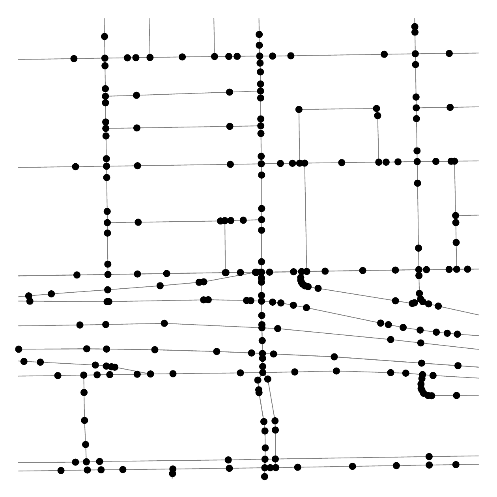</td>
<td style="text-align: center;">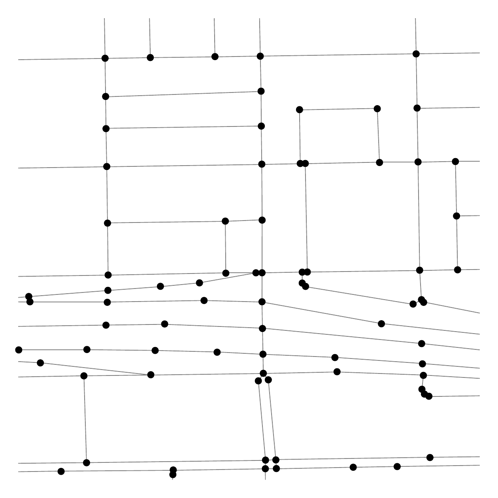</td>
</tr>
<tr class="even">
<td style="text-align: center;">(a)</td>
<td style="text-align: center;">(b)</td>
</tr>
</tbody>
</table>
<figcaption>Figure 2: Extracting a part of the road network structure
analyzed from Chicago. Original structure extracted (left), made of 285
lines and 272 vertices, and simplified version of it (right) with 122
lines and 109 vertices.</figcaption>
</figure>

## Downloading and preparing crime data

Point-referenced crime datasets corresponding to several cities from the
United States of America can be downloaded through the R package
[*crimedata*](https://CRAN.R-project.org/package=crimedata)
[@ashby2019studying]. Concretely, *crimedata* currently provides (as of
June 2021) crime open data recorded in Austin, Boston, Chicago, Detroit,
Fort Worth, Kansas City, Los Angeles, Louisville, Mesa, New York, San
Francisco, Tucson, and Virginia Beach. Therefore, the function
`get_crime_data` from this package can be used for downloading a dataset
of crime events recorded in Chicago in the period 2007-2018.

``` r
> chicago.crimes <- get_crime_data(years = 2007:2018, cities = "Chicago")
> dim(chicago.crimes)
[1] 39206    12
```

The year, month, and hour of occurrence of each crime can be extracted
with the corresponding functions of the package
[*lubridate*](https://CRAN.R-project.org/package=lubridate)
[@lubridate].

``` r
> chicago.crimes$year <- year(chicago.crimes$date_single)
> chicago.crimes$month <- month(chicago.crimes$date_single)
> chicago.crimes$hour <- hour(chicago.crimes$date_single)
```

Then, a marked point pattern lying on `chicago.linnet` can be created
with function `lpp` to provide the framework required by the *DRHotNet*
package. A `data.frame` is passed to `lpp` including the coordinates of
the events (in UTM), the type of event according to the receiver of the
offense (`offense_against`), and the year, month, and hour of occurrence
that have been just computed.

``` r
> chicago.crimes.coord <- data.frame(x = chicago.crimes$longitude, 
                                     y = chicago.crimes$latitude)
> coordinates(chicago.crimes.coord) <-~ x + y
> lonlat_proj <- "+proj=longlat +datum=WGS84 +ellps=WGS84 +towgs84=0,0,0"
> utm_proj <- "+proj=utm +zone=16 ellps=WGS84"
> proj4string(chicago.crimes.coord) <- lonlat_proj
> chicago.crimes.coord <- spTransform(chicago.crimes.coord, utm_proj)
> X.chicago <- lpp(data.frame(x = chicago.crimes.coord@coords[,1], 
                   y = chicago.crimes.coord@coords[,2], 
                   offense_against = chicago.crimes$offense_against,
                   year = chicago.crimes$year,
                   month = chicago.crimes$month,
                   hour = chicago.crimes$hour),
                   chicago.linnet)
Warning message:
38006 points were rejected as lying outside the specified window 
```

A total of 38006 points are rejected because they lie outside the road
network. Hence, a marked point pattern of 1200 crimes that lie on
`chicago.linnet` remains for the analysis. The four marks are
categorical, presenting the following values and absolute frequencies:

``` r
> table(X.chicago$data$offense_against)
other  persons property  society 
   86      257      749      108 
> table(X.chicago$data$year)
2007 2008 2009 2010 2011 2012 2013 2014 2015 2016 2017 2018 
 126  131   97  111  100  110   87   84   76   93   92   93 
> table(X.chicago$data$month)
  1   2   3   4   5   6   7   8   9  10  11  12 
103  71 101  92 110 100 128 102 111 109  95  78 
> table(X.chicago$data$hour)
 0  1  2  3  4  5  6  7  8  9 10 11 12 13 14 15 16 17 
45 34 29 25 19 14 18 41 53 51 48 54 71 71 69 71 60 72 
18 19 20 21 22 23 
64 67 60 52 62 50 
```

Hence, *DRHotNet* functionalities are now applicable to `X.chicago`. In
the main example shown, the relative occurrence of crimes against
persons along the road network included in `X.chicago` is analyzed. To
this end, the functions of the package are used following the steps that
have been established for the differential risk hotspot detection
methodology previously described.

## Estimating a relative probability surface

The function `relpnet` of *DRHotNet* has to be used at first to estimate
a relative probability surface over the linear network. As it has been
explained, this implies estimating a relative probability in the middle
point of each segment of the network.

``` r
> rel_probs_persons <- relpnet(X = X.chicago, 
                               lixel_length = 50,
                               h = 250,
                               mark = "offense_against",
                               category_mark = "persons") 
```

The available parameter `finespacing` is by default set to `FALSE` in
order to reduce the computational cost (as `FALSE` is the default value,
it can be omitted in the specification of the function). If
`finespacing` is set to `TRUE`, more accurate kernel density estimates
are obtained at short segments, but the computational cost can become
prohibitive. The interested reader can consult the documentation of the
`densityHeat` function of *spatstat.linnet* to know precisely how this
parameter works.

In this example, an upper bound of 50 m is chosen for the lixel length.
This means that segments shorter than 50 m are not split, whereas those
longer than 50 m are split into several shorter lixels of no more than
50 m lengths. This operation is performed internally by `relpnet` with
the function `lixellate` from *spatstat.linnet*. The bandwidth
parameter, $h$, is set to 250 m. The `mark` and `category_mark`
parameters are used to specify the type of event that is under analysis.

The exploration of the object `rel_probs_persons` with function `str`
allows the user to check that the choice of a 50 m threshold for the
lixel length produces 8617 segments along the network. Thus, a relative
probability is estimated in the middle point of each of these segments,
which can be accessed by typing `$probs`:

``` r
> str(rel_probs_persons)
List of 5
 $ probs        : num [1:8617] 0.129 0.138 0.202 0.492 0.662 ...
 $ lixel_length : num 50
 $ h        : num 250
 $ mark         : chr "offense_against"
 $ category_mark: chr "persons"
```

The function `plotrelp` can then be used to obtain a map of the relative
probability surface like the one shown in Figure
[3](#fig:ChicagoNetworkRelProbs)b. Figure
[3](#fig:ChicagoNetworkRelProbs) also contains the relative probability
surfaces corresponding to the choices of $h=125$ (Figure
[[fig:ChicagoNetworkRelProbs_a]](#fig:ChicagoNetworkRelProbs_a)a),
$h=500$ (Figure [3](#fig:ChicagoNetworkRelProbs)c) and $h=1000$ (Figure
[3](#fig:ChicagoNetworkRelProbs)d). In this particular case, using an
Intel(R) Core(TM) i7-6700HQ processor, it takes approximately 1 second
to execute `relpnet` if $h=125$, and 8 seconds if $h=1000$.

Figure [1](#fig:ChicagoNetwork) allows us to observe that the choice of
a larger value for $h$ smooths the relative probability surface, which
in the case of $h=500$ or $h=1000$ leads to the configuration of a small
number of clearly distinguishable zones of the network in terms of the
relative probability of offenses against persons. Indeed, whereas the
use of $h=125$ allows the user to obtain quite extreme relative
probability values at some segments of the network (the relative
probability estimates cover the \[0,1\] interval), choosing $h=1000$
causes that all the relative probabilities lie in the interval
$[0.10,0.33]$.

<figure id="fig:ChicagoNetworkRelProbs">
<table>
<caption> </caption>
<tbody>
<tr class="odd">
<td style="text-align: center;">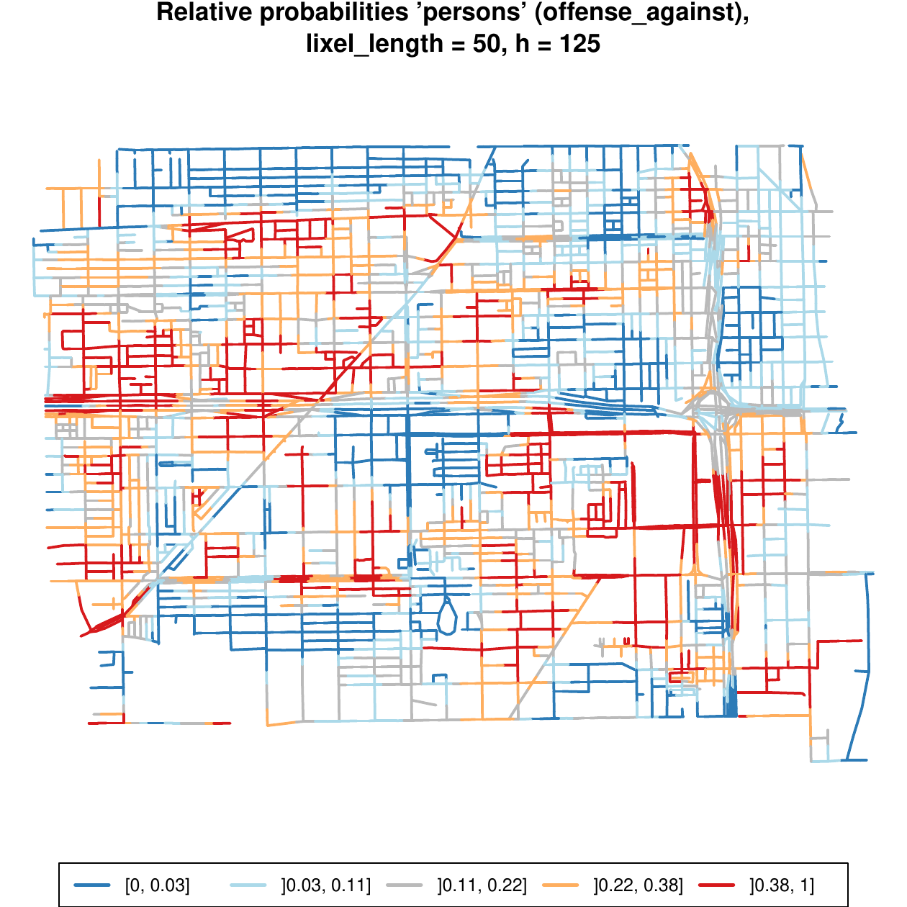</td>
<td style="text-align: center;">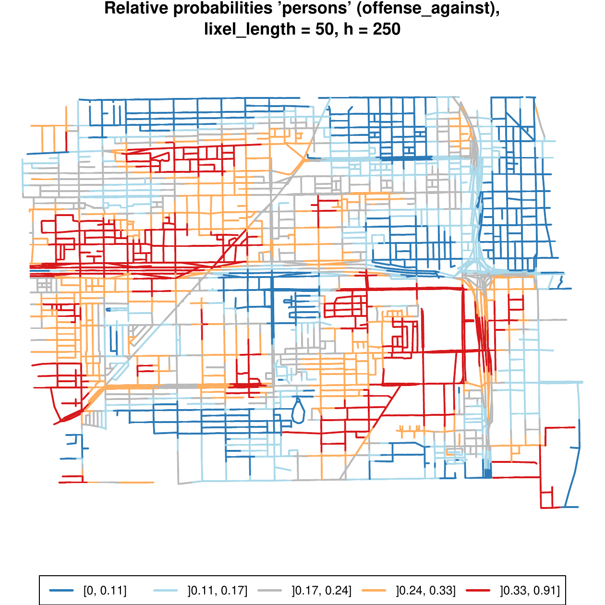</td>
</tr>
<tr class="even">
<td style="text-align: center;">(a)</td>
<td style="text-align: center;">(b)</td>
</tr>
<tr class="odd">
<td style="text-align: center;">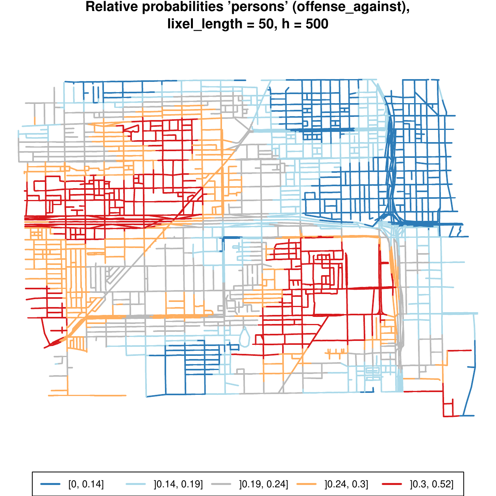</td>
<td style="text-align: center;">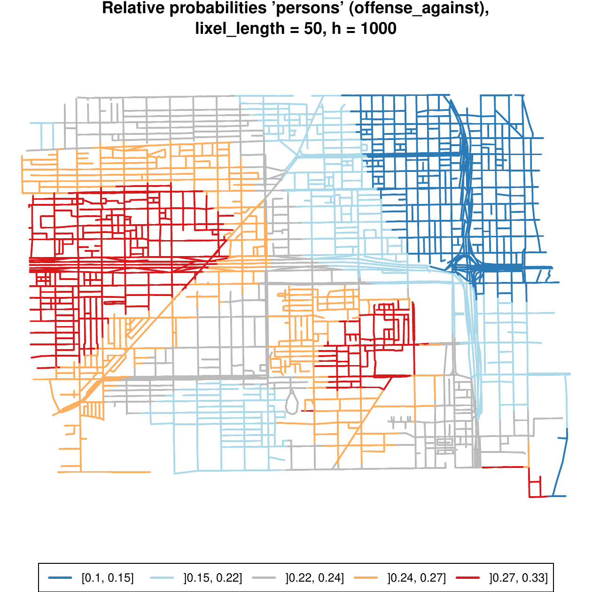</td>
</tr>
<tr class="even">
<td style="text-align: center;">(c)</td>
<td style="text-align: center;">(d)</td>
</tr>
</tbody>
</table>
<figcaption>Figure 3: Outputs from the function <code>plotrelp</code>
for the following choices of <span
class="math inline"><em>h</em></span>: 125 (a), 250 (b), 500 (c) and
1000 (d).</figcaption>
</figure>

In view of Figure [3](#fig:ChicagoNetworkRelProbs), we consider that
$h=250$ is a reasonable choice (although some procedures for bandwidth
selection could be explored for taking this decision). Therefore, this
selection of the bandwidth parameter is maintained to display now how
the `drhot` function of the package works.

## Detecting differential risk hotspots

The function `drhot` needs four parameters to be specified: `X` (a point
pattern on a linear network), `rel_probs` (an object like the one
obtained in the previous step), `k`, and `n`. Parameters `k` and `n`
control the differential risk hotspot procedure, as it has been
explained before. For example, we can try with `k = 1` and `n = 30`:

``` r
> hotspots_persons <- drhot(X = X.chicago, 
                            rel_probs = rel_probs_persons, 
                            k = 1, n = 30)
```

The output of the function `drhot` presents the following structure:

``` r
> str(hotspots_persons)
List of 8
 $ DRHotspots   :List of 5
  ..$ : num [1:42] 248 249 502 503 576 ...
  ..$ : num 2971
  ..$ : num 7551
 $ k            : num 1
 $ n            : num 30
 $ lixel_length : num 50
 $ h        : num 250
 $ mark         : chr "offense_against"
 $ category_mark: chr "persons"
 $ PAI_t     : num 12.1
```

The first component of `hotspots_persons` contains the differential risk
hotspots that have been detected for the values of $k$ and $n$ provided
to `drhot`. In this case, three differential risk hotspots are found,
which are formed by 42, 1, and 1 road segments, respectively. The object
`hotspots_persons` also contains the values of the parameters involved
in the computation of the hotspots and a final component that includes
the global $\mathrm{PAI}_{t}$ for the set, which is 12.10 in this
example.

The function `drsummary` can be used to provide a summary of each of the
differential risk hotspots determined by `drhot`:

``` r
> summary_persons <- drsummary(X = X.chicago, 
                               rel_prob = rel_probs_persons,
                               hotspots = hotspots_persons)
```

The output of `drsummary` includes a count of the number of events
located within each differential risk hotspot and how many of these
correspond to the category `“persons”`:

``` r
> summary_persons[,c("Events type (ctr)", "All events (ctr)", 
                     "Prop. (ctr)")]
  Events type (ctr) All events (ctr) Prop. (ctr)
1                16               35        0.46
2                 0                0         NaN
3                 0                0         NaN
```

The summary also contains the length (in meters) of each differential
risk hotspot and the $\mathrm{PAI}_{t}$ that corresponds to each of
them:

``` r
> summary_persons[,c("Length in m (ctr)", "PAI_t (ctr)")]
  Length in m (ctr) PAI_t (ctr)
1           1532.51       12.59
2             42.99        0.00
3             25.22        0.00
```

Furthermore, the output of `drsummary` also provides the same statistics
for an extension of each of the hotspots. The reason to include this
information is that if there are not many events available in the
dataset (as it happens in this example), the method can determine
differential risk hotspots where very few events, if any, have taken
place. Indeed, in the output of `drsummary` shown above, there are two
hotspots including zero events. The fact of employing kernel density
estimation to infer a relative probability surface makes it more
convenient to think of each differential risk hotspot as the union of a
center or core (what `drhot` returns, the hotspot itself) and an
extension of it. Hence, by considering an extension of the differential
risk hotspot, one can better appreciate the zone of the network that has
been accounted for in the estimation of the relative probability values
corresponding to the segments of the hotspot.

By default, the extension computed by `drsummary` coincides with a
neighbourhood of the segments forming each differential risk hotspot of
order $o=\frac{h}{\mathrm{Lixel\;length}}$ (rounded to the nearest
integer), although a different order can be specified through the
parameter `order_extension`. In this example, we have
$o=\frac{250}{50}=5$, which is used by `drsummary` if no other order is
indicated:

``` r
> summary_persons[,c("Events type (ext)", "All events (ext)", 
                     "Prop. (ext)")]
  Events type (ext) All events (ext) Prop. (ext)
1                22               57        0.39
2                11               26        0.42
3                10               24        0.42
> summary_persons[,c("Length in m (ext)", "PAI_t (ext)")]
  Length in m (ext) PAI_t (ext)
1           6283.36        4.22
2           1700.86        7.80
3           1189.04       10.14
```

It can be observed that all extensions of the differential risk hotspots
include a reasonable number of events and that the corresponding
proportions of offenses against persons are clearly above the global
proportion for the dataset, which is $257/1200=21.42$.

## Assessing the statistical significance of the hotspots

Following the choice of `k = 1` and `n = 30`, it only remains to
estimate a $p$-value for each differential risk hotspot detected. This
can be done by calling the function `drsummary` again and specifying
`compute_p_value = T`. A total of 20 iterations are selected for
performing the Monte Carlo simulation process:

``` r
> summary_persons <- drsummary(X = X.chicago, 
                               rel_prob = rel_probs_persons,
                               hotspots = hotspots_persons,
                               compute_p_value = T,
                               n_it = 200)
> summary_persons$`p-value`
[1] 0.000 0.000 0.000
```

Therefore, the five differential risk hotspots detected with $k=1$ and
$n=30$ are statistically significant ($p<0.05$). It is worth noting,
however, that the usual significance level of 0.05 should be reduced
(corrected) if many differential risk hotspots are detected to avoid the
presence of multiple comparison problems.

## Choosing *k* and *n*

Remember that a higher value of either `k` or `n` represents using a
more stringent criterion regarding hotspot detection. This is
illustrated through the four maps available in Figure
[4](#fig:ChicagoNetworkHotspots), which can be generated with the
function `plothot` of *DRHotNet*. For instance, as in the following
example for the object `hotspots` created previously (which corresponds
to Figure [4](#fig:ChicagoNetworkHotspots)d):

``` r
> plothot(X = X.chicago, hotspots = hotspots_persons)
```

Indeed, Figure [4](#fig:ChicagoNetworkHotspots) shows the differential
risk hotspots that `drhot` detects for the choices of `k = 0.5` and
`n = 20` (Figure [4](#fig:ChicagoNetworkHotspots)a), `k = 1.5` and
`n = 20` (Figure [4](#fig:ChicagoNetworkHotspots)b), `k = 1` and
`n = 10` (Figure [4](#fig:ChicagoNetworkHotspots)c), and `k = 1` and
`n = 30` (Figure [4](#fig:ChicagoNetworkHotspots)d). Two of these
combinations of conditions on $k$ and $n$ are implicitly represented by
the other two. Consequently, the differential risk hotspots shown in
Figure [4](#fig:ChicagoNetworkHotspots)b are contained in Figure
[4](#fig:ChicagoNetworkHotspots)a, and those in Figure
[4](#fig:ChicagoNetworkHotspots)d are contained in Figure
[4](#fig:ChicagoNetworkHotspots)c. The choice of `k = 1` and `n = 30`
leads to the highest global $\mathrm{PAI}_{t}$ among the four
combinations of parameters indicated with the value of 12.1 mentioned
before. In this regard, we recommend performing a sensitivity analysis
on the values of $k$ and $n$ to decide which combination is more
convenient. The sensitivity analysis carried out by [@briz2019hotspots]
yielded that a choice around $k=1.5$ and $n=45$ was optimal in terms of
the $\mathrm{PAI}_{t}$ for the traffic accident dataset that was
investigated. However, each dataset should require a specific analysis.

Thus, a sensitivity analysis on $k$ and $n$ can be carried out with the
function `drsens`. The user has to provide a point pattern (`X`), an
object containing the relative probabilities of a type of event along
the network (`rel_probs`) and a set of values for $k$ and $n$ (`ks` and
`ns`, respectively):

``` r
> sensitivity_analysis <- drsens(X = X.chicago, 
                                 rel_prob = rel_probs_persons, 
                                 ks = seq(0,3,0.5), 
                                 ns = seq(10,30,5))
> sensitivity_analysis
        n = 10 n = 15 n = 20 n = 25 n = 30
k = 0     3.34   5.07   6.75  12.35  12.05
k = 0.5   4.47   6.52   7.92  12.82  12.05
k = 1     5.15   8.62   8.92  10.93  12.05
k = 1.5   5.94   9.12  10.89  10.88  13.70
k = 2     2.16  10.06     NA     NA     NA
k = 2.5     NA     NA     NA     NA     NA
k = 3       NA     NA     NA     NA     NA
```

The output from `drsens` is a matrix that contains the
$\mathrm{PAI}_{t}$ values that correspond to each combination of $k$ and
$n$ indicated by `ks` and `ns`. A `NA` value represents that no
differential risk hotspots can be found for such a combination of
parameters. According to this matrix, the highest $\mathrm{PAI}_{t}$
value is achieved for $k=1.5$ and $n=30$.

Therefore, one can choose the values of $k$ and $n$ that maximize the
$\mathrm{PAI}_{t}$ (considering the parameters provided in `ks` and
`ns`) to determine the final set of differential risk hotspots. However,
this criteria may sometimes lead to detecting a very low number of
differential risks hotspots and hence to miss zones of the network that
may also deserve some attention. Hence, a more conservative approach
could be considering several combinations of $k$ and $n$ that yield some
of the highest values of $\mathrm{PAI}_{t}$ and explore each set of
differential risk hotspots associated. Then, one could investigate the
output of `drsummary` for each combination of parameters (including the
computation of $p$-values) to better decide which zones of the network
are relevant for the type of event of interest.

<figure id="fig:ChicagoNetworkHotspots">
<table>
<caption> </caption>
<tbody>
<tr class="odd">
<td style="text-align: center;">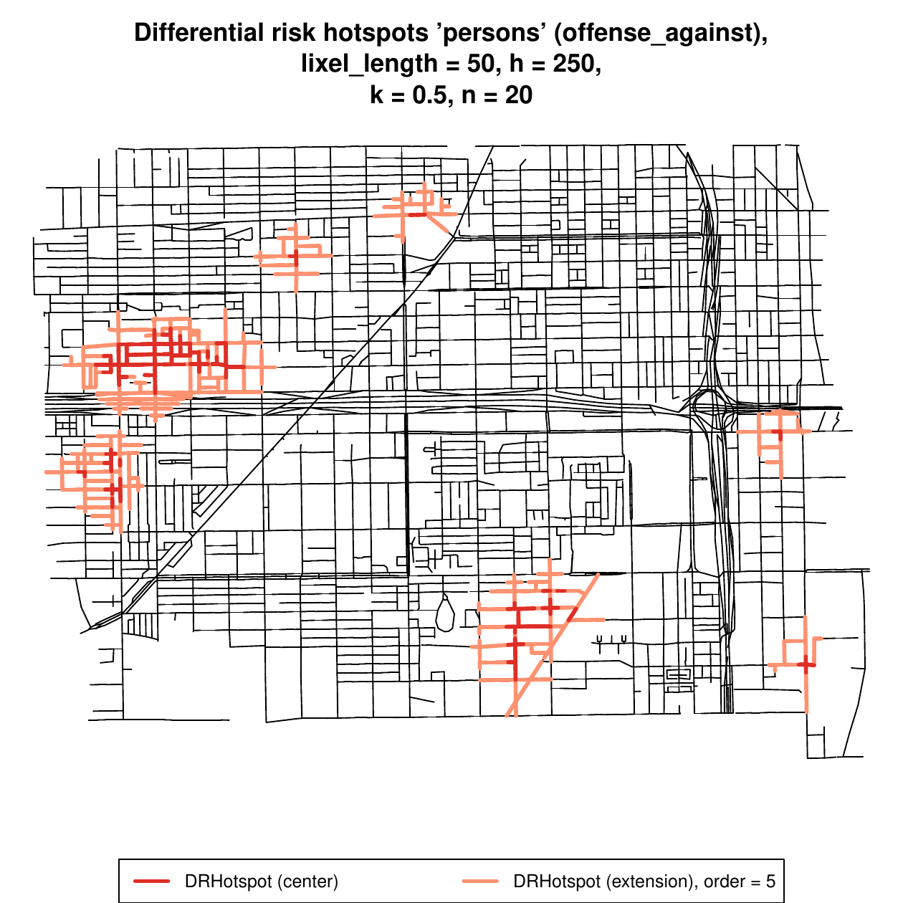</td>
<td style="text-align: center;">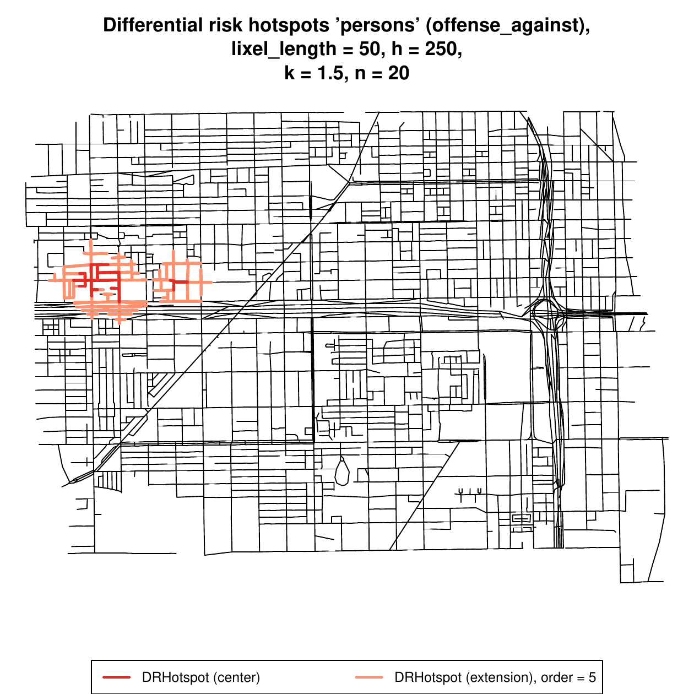</td>
</tr>
<tr class="even">
<td style="text-align: center;">(a)</td>
<td style="text-align: center;">(b)</td>
</tr>
<tr class="odd">
<td style="text-align: center;">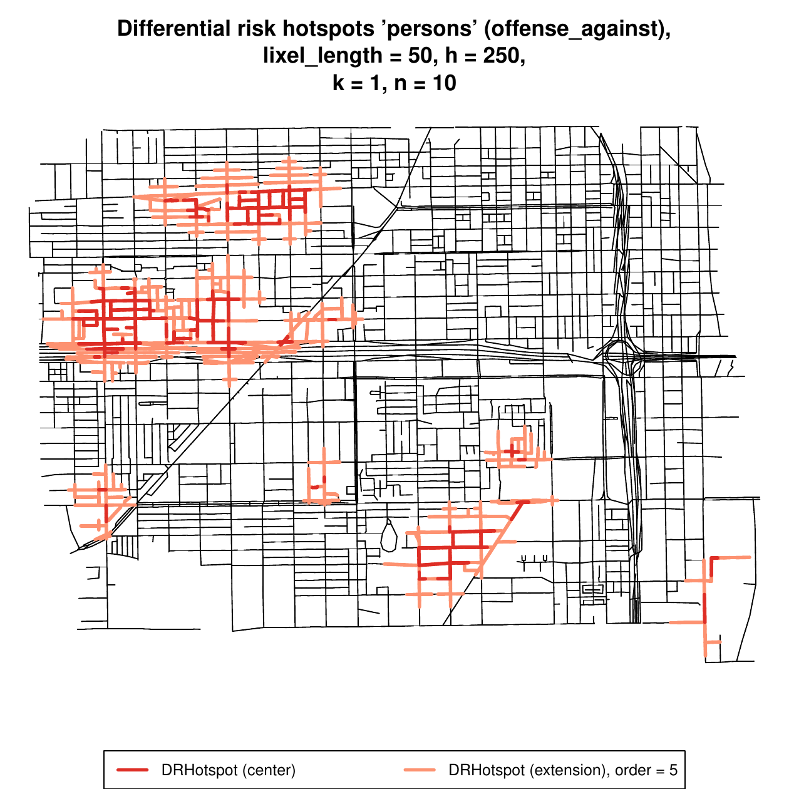</td>
<td style="text-align: center;">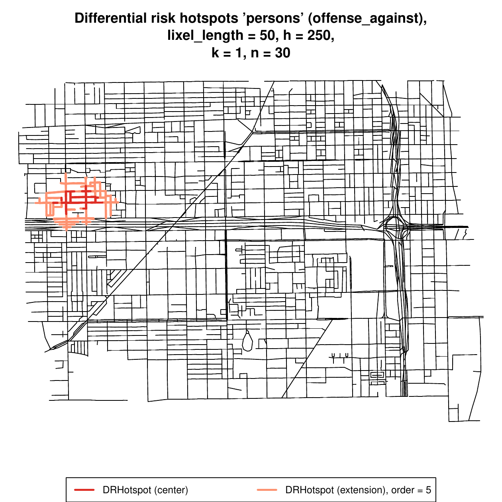</td>
</tr>
<tr class="even">
<td style="text-align: center;">(c)</td>
<td style="text-align: center;">(d)</td>
</tr>
</tbody>
</table>
<figcaption>Figure 4: Outputs from the function <code>plothot</code> for
the following choices of <span class="math inline"><em>k</em></span> and
<span class="math inline"><em>n</em></span>: <span
class="math inline"><em>k</em> = 0.5</span> and <span
class="math inline"><em>n</em> = 20</span> (a), <span
class="math inline"><em>k</em> = 1.5</span> and <span
class="math inline"><em>n</em> = 20</span> (b), <span
class="math inline"><em>k</em> = 1</span> and <span
class="math inline"><em>n</em> = 10</span> (c), and <span
class="math inline"><em>k</em> = 1</span> and <span
class="math inline"><em>n</em> = 30</span> (d).</figcaption>
</figure>

## Other applications of the methodology

This final section shows the results that are obtained for other type of
events for comparative purposes. First, the marks `X.chicago` are
recoded into binary outcomes as follows:

``` r
> year_after_2012 <- ifelse(X.chicago$data$year>2012, "Yes", "No")
> month_winter <- ifelse(X.chicago$data$month%in%c(12,1,2), "Yes", "No")
> hour_21_3 <- ifelse(X.chicago$data$hour%in%c(21:23,0:3), "Yes", "No")
> marks(X.chicago) <- data.frame(as.data.frame(marks(X.chicago)),
                                 year_after_2012 = year_after_2012,
                                 month_winter = month_winter,
                                 hour_21_3 = hour_21_3)
```

The relative probability surfaces have to be computed. We used the same
values for `lixel.length` and `h` than in the previous examples.

``` r
> rel_probs_after_2012 <- relpnet(X = X.chicago, 
                                  lixel_length = 50,
                                  h = 250,
                                  mark = "year_after_2012",
                                  category_mark = "Yes") 
> rel_probs_winter <- relpnet(X = X.chicago, 
                              lixel_length = 50,
                              h = 250,
                              mark = "month_winter",
                              category_mark = "Yes") 
> rel_probs_21_3 <- relpnet(X = X.chicago, 
                            lixel_length = 50,
                            h = 250,
                            mark = "hour_21_3",
                            category_mark = "Yes") 
```

The corresponding sensitivity analyses are carried out:

``` r
> sensitivity_after_2012 <- drsens(X = X.chicago, 
                                   rel_prob = rel_probs_after_2012, 
                                   ks = seq(0,3,0.5), 
                                   ns = seq(10,30,5))
> sensitivity_after_2012
        n = 10 n = 15 n = 20 n = 25 n = 30
k = 0     2.47   3.35   4.59   6.36  10.96
k = 0.5   3.08   4.28   7.11  14.00  15.09
k = 1     2.84   4.38   8.33  25.76  29.98
k = 1.5   2.65   4.63   7.03   0.00   0.00
k = 2     2.24   0.00     NA     NA     NA
k = 2.5     NA     NA     NA     NA     NA
k = 3       NA     NA     NA     NA     NA
> sensitivity_winter <- drsens(X = X.chicago, 
                               rel_prob = rel_probs_winter, 
                               ks = seq(0,3,0.5), 
                               ns = seq(10,30,5))
> sensitivity_winter
        n = 10 n = 15 n = 20 n = 25 n = 30
k = 0     2.75   3.63   4.81   5.17   4.86
k = 0.5   2.83   3.60   4.41   8.35   0.00
k = 1     3.62   3.86   0.00   0.00     NA
k = 1.5   7.59   8.56   0.00     NA     NA
k = 2       NA     NA     NA     NA     NA
k = 2.5     NA     NA     NA     NA     NA
k = 3       NA     NA     NA     NA     NA
> sensitivity_21_3 <- drsens(X = X.chicago, 
                             rel_prob = rel_probs_21_3, 
                             ks = seq(0,3,0.5), 
                             ns = seq(10,30,5))
> sensitivity_21_3
        n = 10 n = 15 n = 20 n = 25 n = 30
k = 0     2.86   4.55   5.41   6.75   7.78
k = 0.5   3.50   5.21   6.02   7.11   7.34
k = 1     4.17   5.90   4.84   0.00   0.00
k = 1.5   4.78   6.92   5.52     NA     NA
k = 2     5.14   5.64   3.00     NA     NA
k = 2.5   4.59   1.75   0.00     NA     NA
k = 3       NA     NA     NA     NA     NA
```

The highest $\mathrm{PAI}_{t}$ values for `year_after_2012`,
`month_winter`, and `hour_21_3` are 29.98, 8.56, and 7.78, respectively.
The differential risk hotspots that are obtained for the combination of
$k$ and $n$ that lead to these $\mathrm{PAI}_{t}$ values can be
visualized with `plothot` (Figure [5](#fig:Comparison)):

``` r
> hotspots_after_2012 <- drhot(X = X.chicago, 
                               rel_prob = rel_probs_after_2012, 
                               k = 1, 
                               n = 30)
> plothot(X = X.chicago, hotspots_after_2012)

> hotspots_winter <- drhot(X = X.chicago, 
                           rel_prob = rel_probs_winter, 
                           k = 1.5, 
                           n = 15)
> plothot(X = X.chicago, hotspots_winter)

> hotspots_21_3 <- drhot(X = X.chicago, 
                         rel_prob = rel_probs_21_3, 
                         k = 0, 
                         n = 30)
> plothot(X = X.chicago, hotspots_21_3)
```

<figure id="fig:Comparison">
<table>
<caption> </caption>
<tbody>
<tr class="odd">
<td style="text-align: center;">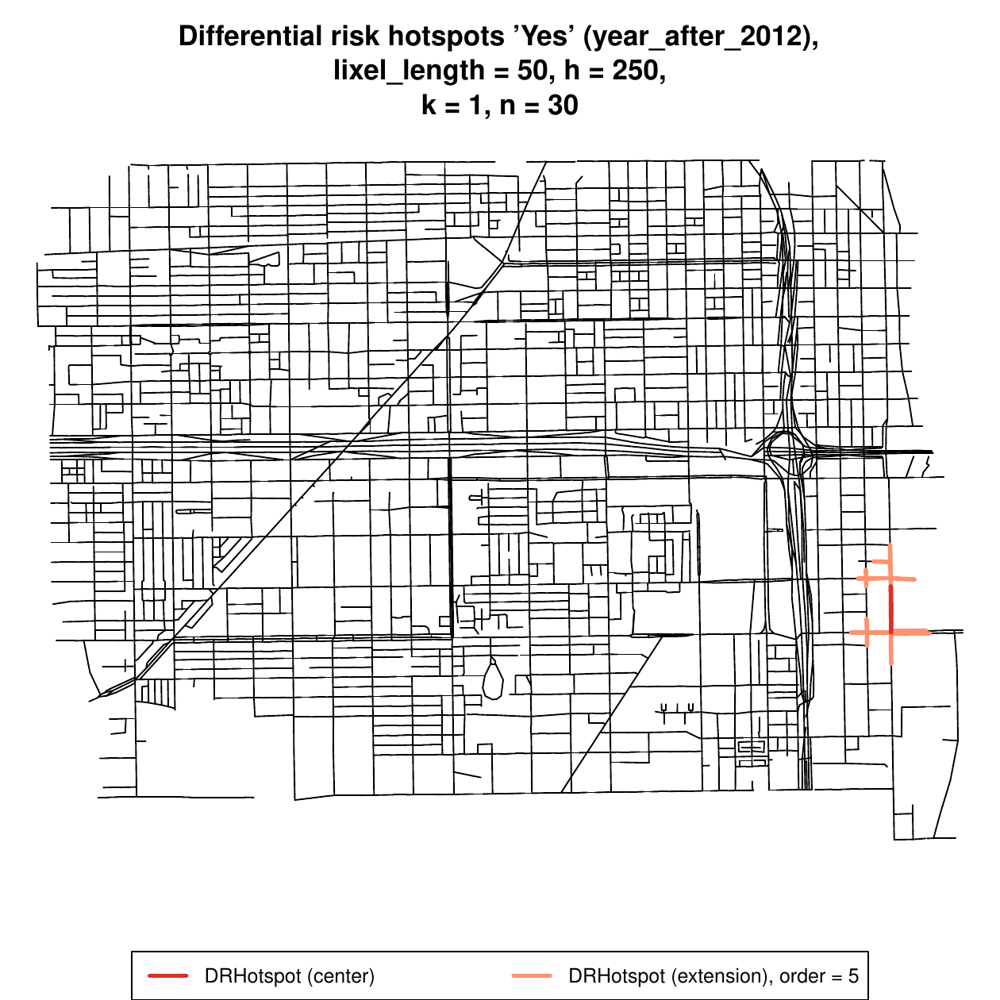</td>
<td style="text-align: center;">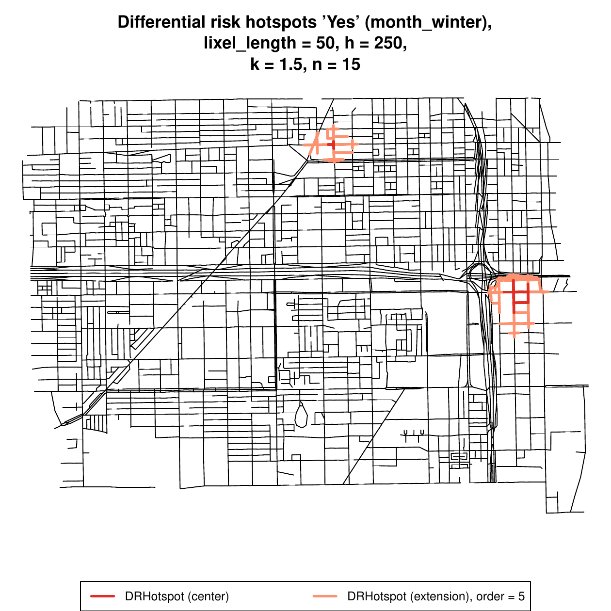</td>
<td style="text-align: center;">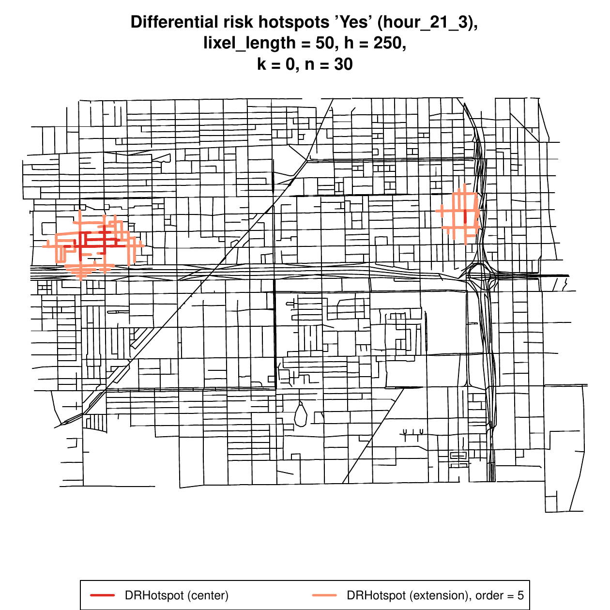</td>
</tr>
<tr class="even">
<td style="text-align: center;">(a)</td>
<td style="text-align: center;">(b)</td>
<td style="text-align: center;">(c)</td>
</tr>
</tbody>
</table>
<figcaption>Figure 5: Outputs from the function <code>plothot</code> for
the marks <code>year_after_2012</code>, <code>month_winter</code>, and
<code>hour_21_3</code> and the categorical value <code>Yes</code> for
the three, considering the combinations of <span
class="math inline"><em>k</em></span> and <span
class="math inline"><em>n</em></span> that maximize the <span
class="math inline">PAI<sub><em>t</em></sub></span> (for the values of
<span class="math inline"><em>k</em></span> and <span
class="math inline"><em>n</em></span> tested).</figcaption>
</figure>

# Summary

The R package *DRHotNet* for detecting differential risk hotspots on
linear networks has been described. The use of linear networks in the
context of hotspot detection is becoming more important over the years,
particularly in the fields of criminology and traffic safety. In
addition, it is also of great interest sometimes to detect zones of a
linear network where a certain type of event is especially
overrepresented. Hence, *DRHotNet* consists of an easy-to-use tool
implemented in R to accurately locate the microzones of a linear network
where the incidence of a type of event is considerably higher than in
the rest of it.
:::
