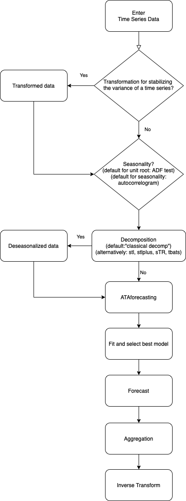
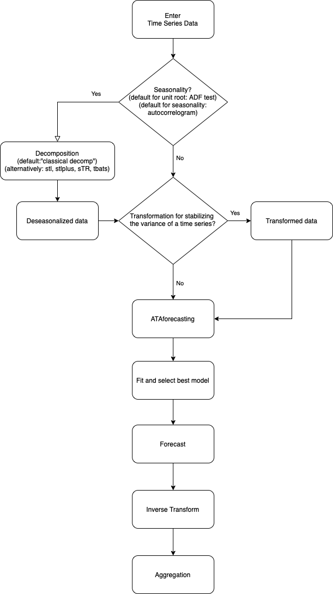

# Introduction

Ata method
[@yavuz2020mses; @yilmaz2019croston; @yapar2019ata; @yapar2018mses; @yapar2018mhes; @yapar2017mses]
is a new univariate time series forecasting method which provides
innovative solutions to issues faced during the initialization and
optimization stages of existing methods. *ATAforecasting* performance is
superior to existing methods both in terms of easy implementation and
accurate forecasting. It can be applied to non-seasonal or
deseasonalized time series, where the deseasonalization can be performed
via any preferred decomposition method. This methodology performed
extremely well on the M3 and M4-Competition data.

The original exponential smoothing has accomplished well in a wide range
of practical researches, and it is well built as a precise and optimal
forecasting method. Nonetheless, two essential difficulties are to
choose the smoothing constant and starting value in exponential
smoothing theory. The Ata method suggests an alternative method for
smoothing constant and initial value. The Ata method places more
emphasis than the classical method on most recent activities. The
forecasting error is compared to the error in forecasts obtained by the
original model.

Exponential smoothing (ES) is not the only model. In fact, a family of
models. ES models suppose that a time series has four components:
seasonality, trend, level, and remainder. @bergmeir2016bagging
recommended the bootstrap aggregation of ES methods. The bootstrap
aggregation employs a Box--Cox transformation afterwards an a seasonal
trend decomposition based on LOESS (LOcally Estimated Scatter-plot
Smoother) (STL) to segregate the time series sub three part: remainder,
seasonal and trend. The remainder is then bootstrapped via a moving
block, and a new data is gathered via this bootstrapped residual part.
Thereafter, an ensemble of ES models is calculated with the bootstrapped
series.

Incorporating other types of model specifications and using different
accuracy measures will surely increase the Ata method's performance.
Like other approaches, the method can also benefit from certain
transformations and decompositions of other types of more involved
combinations, outlier detection, and other more complicated model
selection strategies. The fact that these simple selection and
combination strategies can perform better than existing methods is
fascinating, and this further strengthens the idea that simplicity is
indeed a prerequisite for forecasting accuracy.

Several decomposition techniques are used before applying the Ata method
for selecting an optimized model. The high performance of these combined
models is indicated with an empirical practice. The Ata method is
analyzed in contrast practically with the most well-known forecasting
techniques based on ES and ARIMA in accordance with its predictive
performance on the M3 [@makridakis2000m3] and M4-Competitions
[@makridakis2018m4] data set and is illustrated to outperform its
contestants.

Over the past few years, the preliminary research on ES
[@brown1959statistical; @pegels1969startup; @gardner1985forecasting]
expanded to an approach based on a model so that there are 30 potential
ES models for various types of trend, seasonality, and errors. The
well-known of these are the simple ES, Holt's linear trend model, and
Holt-Winter's model. Then, @gardner1985forecasting proposed damped trend
model to help deal with overtrending. The reputation and universality of
ES can also be attributed to its proven record against more
sophisticated techniques [@makri1984; @makridakis2000m3; @koning2005m3].
The [*forecast*](https://CRAN.R-project.org/package=forecast) package
[@pkgforecast2020] in the programming language R [@R] means that a fully
automated software for fitting ETS models is available. These have led
to a broadly appropriate ES modelling background, and with the use of
latterly developed software packages, these ES models handle
seasonality, trend, and other attributes of series without any human
intervention
[@hyndman2002state; @hyndman2008forecasting; @hyndman2019forecasting].

The Theta method [@assimakopoulos2000theta] was introduced as a new
univariate forecasting method which is similar to a simple ES model with
drift, and its performance in terms of forecasting accuracy was
prominent in M3-Competition. As confirmed once again in
@assimakopoulos2000theta, it is well known that combining forecasts
[@bates1969combination; @clemen1989combining] under certain
circumstances improves forecasting accuracy
[@armstrong1989combining; @armstrong2001principles; @makridakis1983averages; @makridakis1982accuracy].
Due to this, the research focuses on transformations, decompositions,
rules, and combinations of ES and ARIMA (a few examples are
[@clemen1989combining; @cleveland1990stl; @adya2000] to improve the
forecasting performance rather than suggesting new forecasting methods.

Several other studies that are based on automatic forecasting procedures
exist. Particularly for seasonal time series, the *forecast* package
offers the TBATS model [@delivera2011]. TBATS uses a parsimonious
trigonometric representation of seasonality instead of conventional
seasonal indices and also incorporates ARMA errors. In addition, the
function also automatically performs Box-Cox transformation of the time
series if necessary.

This study introduces
[*ATAforecasting*](https://CRAN.R-project.org/package=ATAforecasting)
(available from the Comprehensive R Archive Net- work at
<https://cran.r-project.org/package=ATAforecasting>), a software
application for R which performs a novel decomposition and power
transformation-based approaches to time series forecasting using Ata
method without any academic expertise. To sum up, the *ATAforecasting*
package [@ATAforecasting2021] provides a novel R interface for
researchers interested in automatic time series analysis and students
and academics who teach courses related to univariate time series
analysis topics. There are main 13 functions available in the
*ATAforecasting* package; see Table [1](#tabl1). We are going to
describe all of them as we go on to explain the theoretical procedure.
The rest of the paper is organized as follows. Section 2 presents a
novel forecasting approach using the Ata method, gives an overview of
the main estimation methods of the Ata method, and provides some
technical details about the *ATAforecasting* package. Section 3
illustrates M-forecasting Competition dataset examples showing the
package's functionality. Section 4 contains some concluding remarks.

::: {#tabl1}
  -------------------------------------------------------------------------------------------
  Function            Description
  ------------------- -----------------------------------------------------------------------
  ATA                 Time series analysis and forecasting using the Ata method.

  ATA.Core            The core algorithm of the Ata method.

  ATA.Forecast        Produces forecasts from the output of ATA function.

  ATA.Accuracy        Computes fitting and forecasting accuracy measures.

  ATA.Transform       Computes transformed data using power transformation techniques.

  ATA.BackTransform   Computes back transformed data using power transformation techniques.

  ATA.BoxCoxAttr      Assigns attributes set for unit root and seasonality tests.

  ATA.Seasonality     Tests seasonality.

  ATA.Decomposition   Decomposes a time series into seasonal, trend, and irregular.

  ATA.SeasAttr        Assigns attributes set for unit root and seasonality tests.

  ATA.Plot            Specialized plot function of the output of ATA function.

  ATA.Print           Specialized print screen function of the output of ATA function.

  ATA.CI              Confidence interval function for the Ata method forecasts.
  -------------------------------------------------------------------------------------------

  : Table 1: A summary of the functions available in the
  *ATAforecasting* package.
:::

# Methodology

The objective of this study is to introduce a new decomposition-based
approach to time series forecasting with the Ata method to provide the
automation and the optimization of the Ata method which is an innovative
and accurate univariate time series analysis method without any
expertise of the R program. Specifically, we propose an analytical
methodology of time series method with
[*ATAforecasting*](https://CRAN.R-project.org/package=ATAforecasting) R
package, as it combines several stationarities and seasonality tests,
Box--Cox transformations, seasonal decomposition techniques with the Ata
method. We merge the various preceding concepts to attain a robust and
broadly practicable automatic forecasting algorithm. The methodology
involves 2 alternative algorithms with 6 steps as described and
summarized below:

***First Algorithm* in Figure [1](#figureATAdiagram)a**

-   Step 1 Transformation
    Transformation for stabilizing the variance of a time series if
    necessary;

    There are many power transformation methods available to stabilizing
    linearity and variance. In this paper, logarithm, logarithm with
    shift parameter, Box--Cox, Box--Cox with shift parameter, Modulus,
    Bickel--Doksum, Dual, Yeo--Johnson, generalized logarithm (glog),
    and glog with power function (gpower) methods are able to applied.
-   Step 2 Seasonality Test
    Identify and correct for seasonality in time series;

    There are several methods to detect stationarity and seasonality in
    time series. In this package, Augmented Dickey--Fuller (ADF),
    Phillips and Perron (PP), Kwiatkowski, Phillips, Schmidt, and Shin
    (KPSS) unit root tests are adopted for stationarity. Autocorrelation
    function (ACF), Canova--Hansen (CH), Hylleberg-Engle-Granger-Yoo
    (HEGY), Osborn, Chui, Smith, and Birchenhall (OCSB) seasonal unit
    root tests are adopted for seasonality.
-   Step 3 Decomposition
    Decompose the series into three components: trend, seasonal, and
    remainder;

    There are a few techniques to decompose time series. In this
    package, classical decomposition (decompose --
    [*stats*](https://CRAN.R-project.org/package=stats) package [@R]),
    the Seasonal-Trend decomposition using LOESS (STL -- *stats* package
    [@R]), an enhanced of STL method
    ([*stlplus*](https://CRAN.R-project.org/package=stlplus) package
    [@pkgstlplus2016]), Trigonometric Seasonal Box--Cox
    Transformation--ARMA residuals--Trend and Seasonality (TBATS --
    *forecast* package [@pkgforecast2020]), Seasonal--Trend
    Decomposition Procedure Based on Regression
    ([*stR*](https://CRAN.R-project.org/package=stR) package
    [@pkgstr2018]) are adopted.
-   Step 4 ATA Forecasting
    Apply ATA forecasting method to generate forecasts for the time
    series;

    Although there are many forecasting techniques available to perform
    (e.g., ETS, ARIMA, Theta, etc.), the Ata forecasting method is used.
    Ata method is an innovative new forecasting technique where the
    forms of the models are similar to exponential smoothing models.
    Still, the smoothing parameters depending on the sample size are
    optimized in a discrete space. Initialization is easier as it is
    done simultaneously when the parameters are optimized and less
    influential since the weights assigned to initial values approach
    zero quickly.
-   Step 5 Selection and Aggregation
    The model fits all possible ATA models to the data, then chooses the
    best model using the accuracy measures. Aggregate the best selected
    ATA forecast model for trend + remainder components and seasonal
    component to generate the final result. The final outcome is
    calculated from the forecasts from the single ATA models.
-   Step 6 Inverse Transformation

***Second Algorithm* in Figure [1](#figureATAdiagram)b**

-   Step 1 Seasonality Test
-   Step 2 Decomposition
-   Step 3 Transformation
-   Step 4 ATA Forecasting
-   Step 5 Selection
-   Step 6 Inverse Transformation and Aggregation

To summarize, the *ATAforecasting* procedure is given in Figure
[1](#figureATAdiagram). As default, initially, the selected power family
transformation is implemented, and the series are decomposed into the
seasonal part and trend + remainder part, using the selected
decomposition technique. Then, the Ata method is applied to the trend +
remainder part. The components are added together again, and the
selected power family transformation is inverted.\

<figure id="figureATAdiagram">
<table>
<caption> </caption>
<tbody>
<tr class="odd">
<td style="text-align: center;"></td>
<td style="text-align: center;"></td>
</tr>
<tr class="even">
<td style="text-align: center;">(a) <span>First Algorithm</span></td>
<td style="text-align: center;">(b) <span>Second Algorithm</span></td>
</tr>
</tbody>
</table>
<figcaption>Figure 1: Algorithms of ATAforecasting
procedure.</figcaption>
</figure>

## Power transformation family for *ATAforecasting* package

Traditional statistical procedures often assume that the data is
homoscedastic and normally distributed. Despite its apparent
restrictions, the logarithmic transformation has been used mostly when
data violates these assumptions. The purpose of a particular
transformation for better fitting is additivity, convergence to
normality, stationarity, linearity, reduction of skewness, stabilizing
variance. These purposes, which may even be inconsistent, are quite
significant as it is just under such assumptions that particular
statistical methods are relevant. Generally, logarithmic transformations
almost stabilize the variance for time series consisting of large
values. Some of the problems that arise when implementing a specific
transformation are argued in different settings by @sakia1992,
@staniswalis1993, @quiroz1996, @yeojohn2000, @chen2002, @muhe2007,
@horowitz2009 and @meintanis2015. There are many proposed methods of
transformation and a large amount of research in the literature.
@sakia1992 provided a detailed and extensive review of the Box--Cox
([@boxcox1964]) and some alternative versions. Different methodology
recommended for choosing the appropriate value of transformation
parameters based on maximizing the likelihood function ([@boxcox1964])
or alternatively, Kullback-Leibler information-based method
[@hernandez1980], robust adaptive method [@carroll1980] and a method
based on Kendall's rank correlation, [@han1987].

A chiefly used algorithm of the Box--Cox family is the logarithm
transformation, which is convenient for multiplicative process data.
Moreover, the asymptotic variance of a time series can be stabilized by
the log-transformation. A shift parameter was additionally proposed to
apply the log transformations more responsive and handy. The
parameterizations of the shift parameter depend on knowledge of the data
e.g., data range, data distribution, so user intervention is usually
required. *ATAforecasting* package automates the selection of shift
parameter, which is an important contribution of automatic times series
forecasting.

Selected transformation functions included in the *ATAforecasting* R
package provide the applicability of different types of transformation
techniques for the data to which the Ata method will be applied. The
`ATA.Transform` function works with many different types of inputs. Many
power transformation methods are available to stabilize linearity and
variance. In this package, power transformation family is consist of
\"Box--Cox\", \"Sqrt\", \"Reciprocal\", \"Log\", \"NegLog\",
\"Modulus\", \"Bickel--Doksum\", \"Manly\", \"Dual\", \"Yeo--Johnson\",
\"GPower\", \"GLog\". If the transformation process needs a shift
parameter, `ATA.Transform` will calculate the required shift parameter
automatically.

-   *Log Transformation with Shift*,
-   *Box--Cox Transformation with Shift [@boxcox1964]*,
-   *GLog Transformation [@glog2002]*,
-   *NegLog Transformation [@neglog2005]*,
-   *Reciprocal Transformation [@tukey1977]*,
-   *Bickel--Doksum Transformation [@bickeldoksum1982]*,
-   *Yeo--Johnson Transformation [@yeojohn2000]*,
-   *Modulus Transformation [@johndraper1980]*,
-   *Dual Power Transformation [@yang2006]*,
-   *GPower Transformation [@gpower2013]*,

**The `ATA.BoxCoxAttr` function**

Since the main `ATA` function and `ATA.Transform` are designed by some
attributes of Box--Cox power transformation family, we provide the user
with the function `ATA.BoxCoxAttr`.

The R function `ATA.BoxCoxAttr` can be utilized with the following code,

``` r
	ATA.BoxCoxAttr(bcMethod = "loglik", bcLower = 0
	, bcUpper = 1,  bcBiasAdj = FALSE),	
```

and makes use of four parameters. These are

-   *bcMethod*: Choose method to be used in calculating lambda.
    \"loglik\" is default. Other method is \"guerrero\" [@guerrero1993].
-   *bcLower*: Lower limit for possible lambda values. The lower value
    is limited by -5. Default value is 0.
-   *bcUpper*: Upper limit for possible lambda values. The upper value
    is limited by 5. Default value is 1.
-   *bcBiasAdj*: Use adjusted back-transformed mean for Box--Cox
    transformations. If transformed data is used to produce forecasts
    and fitted values, a regular back transformation will result in
    median forecasts. If *bcBiasAdj* is TRUE, an adjustment will be made
    to produce mean forecasts and fitted values. If *bcBiasAdj=TRUE*,
    optional parameter *fvar* required. *fvar* can either be the
    forecast variance or a list containing the interval *level* and the
    corresponding *upper* and *lower* intervals. Default value of *fvar*
    is NULL and it can't be changed.

**The `ATA.Transform` function**

The main function of power transformations, the `ATA.Transform`, can be
called with

``` r
	ATA.Transform(X, tMethod = "Box_Cox", tLambda
	, tShift = 0, bcMethod = "loglik", bcLower = 0, bcUpper = 1)	
```

and it makes use of seven parameters and returns three outputs. The
inputs are

-   *X*: a numeric vector or time series of class ts or msts for
    in-sample.
-   *tMethod*: Power transformation family is consist of \"Box_Cox\",
    \"Sqrt\", \"Reciprocal\", \"Log\", \"NegLog\", \"Modulus\",
    \"BickelDoksum\", \"Manly\", \"Dual\", \"YeoJohnson\", \"GPower\",
    \"GLog\" in *ATAforecasting* package. If the transformation process
    needs shift parameter, `ATA.Transform` will calculate the required
    shift parameter automatically.
-   *tLambda*: Box--Cox power transformation family parameter. If NULL,
    data transformed before model is estimated.
-   *tShift*: Box--Cox power transformation family shifting parameter.
    If NULL, data transformed before model is estimated.
-   *bcMethod*: Choose method to be used in calculating lambda.
    \"loglik\" is default. Other method is \"guerrero\" [@guerrero1993].
-   *bcLower*: Lower limit for possible lambda values. The lower value
    is limited by -5. Default value is 0.
-   *bcUpper*: Upper limit for possible lambda values. The upper value
    is limited by 5. Default value is 5.

The outputs are

-   *trfmX* : Transformed data.
-   *tLambda*: Box--Cox power transformation family parameter.
-   *tShift* : Box--Cox power transformation family shifting parameter.

To apply this algorithm to an example in the
[*tsibbledata*](https://CRAN.R-project.org/package=tsibbledata) package
\"aus_retail\", monthly retail turnover (in million AUD) in Australian
states from April 1982 to December 2018, we use the following commands.

``` r
	library(tsibbledata)
	library(lubridate)
	library(dplyr)
	library(tsbox)
	library(ATAforecasting)
	train_data <- aus_retail %>% filter(State == "New South Wales"
	 , Industry == "Department stores"
	 , `Series ID`== "A3349790V")
	train_data <- tsbox::ts_ts(train_data)
	bc_attr_set <- ATA.BoxCoxAttr(bcMethod = "loglik", bcLower = 0, bcUpper = 1)
	fit_bc <- ATA(train_data, seasonal.type = "M", model.type = "A"
	, seasonal.test = TRUE, seasonal.model = "decomp", plot.out = TRUE
	, transform.method = "Box_Cox", transform.order = "before"
	, transform.attr = bc_attr_set, negative.forecast = FALSE)	
```

## Seasonality for *ATAforecasting* package

Seasonality is a well-known phenomenon observed in many economic time
series. Seasonal decomposition, which is the first stage of a time
series modeling, is also the first stage of the Ata method. The
performance of the Ata method has been improved after the seasonal
decomposition.

Specifically, our proposed methodology to identify seasonality in time
series is as follows. After or before implementing a Box---Cox
transformation (if necessary) to the data, the data is decomposed into
remainder, seasonal, and trend components. The trend and remainder
components are then forecasted via the Ata method, the seasonal
component is added back in, and the Box---Cox transformation is
inverted. Then, point forecasts are calculated using each of the
different models, and/or the resulting forecasts are able to be
combined.

In previous studies, the classical decomposition method is much used
after the seasonality test. With this package, stl, stlplus, tbats, and
stR decomposition techniques are also available choices by the
*ATAforecasting* package, which can be chosen with only one or multiple.

Seasonality for *ATAforecasting* package enables estimating all of the
below components and specifications. The main functions of seasonality
in the package are the following

-   `ATA.SeasAttr()`,
-   `ATA.Seasonality()`,
-   `ATA.Decomposition()`.

Three seasonality diagnostics methods are able to be applied in the
package.

-   Unit Root Tests,
-   Seasonal Unit Root Tests,
-   Seasonal Decomposition.

**The `ATA.SeasAttr` function**

This function is a class of seasonality tests using `corrgram.test` from
*ATAforecasting* package, `ndiffs` and `nsdiffs` functions from
*forecast* package. Also, `ndiffs` and `nsdiffs` functions have been
modified according to different unit root testing packages. Please
review manual and vignette documents of the latest *forecast* package.
According to *forecast* package, `ndiffs` and `nsdiffs` functions
estimate the number of differences requisite to ensure stationary of a
given time series.

`ndiffs` employs unit root tests to define required number of
differences for time series to be ensured trend stationary. `nsdiffs`
employs seasonal unit root tests to define required number of seasonal
differences for time series to be ensured trend stationary.

The `ATA.SeasAttr` function works with many different types of inputs.
The inputs are below.

-   *corrgram.tcrit*: *t*-value for periodogram seasonality test.
-   *uroot.test*: Type of unit root test before all type seasonality
    test. Possible values are \"adf\", \"pp\", and \"kpss\".
-   *suroot.test*: Type of seasonal unit root test to use. Possible
    values are \"correlogram\", \"sea\", \"hegy\", \"ch\", and \"ocsb\".
-   *suroot.uroot*: If TRUE, unit root test for stationary before
    seasonal unit root test is allowed.
-   *uroot.type*: Specification of the deterministic component in the
    regression for unit root test. Possible values are \"level\" and
    \"trend\".
-   *uroot.alpha*: Significant level of the unit root test, possible
    values range from 0.01 to 0.1.
-   *suroot.alpha*: Significant level of the seasonal unit root test,
    possible values range from 0.01 to 0.1.
-   *uroot.maxd*: Maximum number of nonseasonal differences allowed.
-   *suroot.maxD*: Maximum number of seasonal differences allowed.
-   *suroot.m*: Deprecated. Length of seasonal period: frequency of data
    for `nsdiffs`.
-   *uroot.pkg*: Using [*ucra*](https://CRAN.R-project.org/package=ucra)
    or [*tseries*](https://CRAN.R-project.org/package=tseries) packages
    for unit root test. The default value is *ucra*.
-   *multi.period*: Selection type of multiseasonal period. *min* or
    *max* function for selection.
-   *x13.estimate.maxiter Maximum*: iteration for X13ARIMA/SEATS
    estimation.
-   *x13.estimate.tol*: Convergence tolerence for X13ARIMA/SEATS
    estimation.
-   *x11.estimate.maxiter Maximum*: iteration for X11 estimation.
-   *x11.estimate.tol*: Convergence tolerence for X11 estimation.

### Unit root tests {#unit-root-tests .unnumbered}

Unit root tests for stationarity have compatibility in almost every
practical time series analysis. Choosing which unit root procedure to
employ is an issue of active interest. In this study, we implement the
three widely used unit root tests. In accordance with past research, the
selected unit root tests occasionally disagree in choosing the
convenient order of integration for a given data. The following
literature shows the basic features of unit root tests. Users who demand
details should consult the original resources and standard references
(see, for example, [@russell1993; @hamilton1994; @hayashi2000]).

In the *ATAforecasting* package, the following unit roots methods are
able to be applied.

-   *Augmented Dickey--Fuller Test [@dickey1979; @said1984]*
-   *Phillips and Perron Test [@phillips1988]*
-   *Kwiatkowski, Phillips, Schmidt, and Shin Test [@kpss1992]*

**The `ATA.SeasAttr` function for unit root tests**

Since the main `ATA` function and `ATA.Seasonality` are designed by some
attributes of unit root tests, we provide the user with the function
`ATA.SeasAttr`.

For the main function `ATA`, the attributes of unit root test can be
accessed with

``` r
	ATA.SeasAttr(uroot.pkg = "tseries", uroot.test = "kpss"
	 , uroot.type = "trend", uroot.alpha = 0.05)
```

The following code uses the unit root test approach to search trend
component before the seasonality test of the data in the context of the
Ata method.

``` r
	seas_attr_set <- ATA.SeasAttr(suroot.test = "correlogram"
	, corrgram.tcrit = 1.28, uroot.pkg = "tseries"
	, uroot.test = "kpss", uroot.type = "trend"
	, uroot.alpha = 0.05)
	
	fit_seas <- ATA(train_data, model.type = "A", seasonal.type = "M"
	, seasonal.test = TRUE, seasonal.model = "tbats", plot.out = TRUE
	, seasonal.test.attr = seas_attr_set, negative.forecast = FALSE)
```

### Seasonality tests

There are numerous studies relating seasonality and unit root. One of
these studies uses autocorrelogram. Autocorrelation function and partial
autocorrelation function are useful qualitative tools to estimate the
existence of autocorrelation at individual lags. The Ljung-Box Q-test is
a more quantitative method to test autocorrelation at multiple lags
jointly. Other techniques generally use unit root tests. @hegy1990
improved unit root tests in linear time series regarding seasonality and
studied with different models, including different combinations of
seasonal, trend, remainder, and constant parts. Their purpose is to
improve a testing process that will determine what class of seasonality
is accountable for the seasonality in a time series process. There exist
more studies for testing seasonal unit roots, such as [@ljungbox1978],
[@dhf1984], [@ocsb1988], and [@seas2006].

In the *ATAforecasting* package, the following methods are able to
applied.

-   *Autocorrelogram [@ljungbox1978]*
-   *Canova--Hansen (CH) Test [@ch1995]*
-   *Hylleberg, Engle, Granger & Yoo (HEGY) Test [@hegy1990]*
-   *Osborn, Chui, Smith, Birchenhall (OCSB)Test [@ocsb1988]*
-   *Seasonal Strength Measure [@seas2006]*

**The `ATA.SeasAttr` function for seasonal unit root test**

Since the main `ATA` function and `ATA.Seasonality` are designed by some
attributes of seasonality tests, we provide the user with the function
`ATA.SeasAttr`.

For the main function `ATA`, the attributes of seasonality test can be
accessed with

``` r
	seas_attr_set <- ATA.SeasAttr(suroot.test = "correlogram"
	  , corrgram.tcrit = 1.28)
	  
	seas_attr_set <- ATA.SeasAttr(suroot.test = "ocsb", suroot.alpha = 0.05)
```

An example of the seasonality test's call is the following

``` r
	seas_attr_set <- ATA.SeasAttr(suroot.test = "ocsb", suroot.alpha = 0.05
	, uroot.pkg = "tseries", uroot.test = "adf", uroot.type = "trend"
	, uroot.alpha = 0.05)
	
	fit_seas <- ATA(train_data, model.type = "A", seasonal.type = "M"
	, seasonal.test = TRUE, seasonal.model = "stl", plot.out = TRUE
	, seasonal.test.attr = seas_attr_set, negative.forecast = FALSE)
```

**The `ATA.Seasonality` function for Seasonality Tests**

The *ATAforecasting*'s seasonality diagnostics described before in this
paper are implemented into a function named `ATA.Seasonality` that can
calculate all of them respectively. The function syntax is

``` r
	ATA.Seasonality(input = train_data, ppy = frequency(train_data)
	 , attr_set = seas_attr_set)
```

The `ATA.Seasonality` function works with many different types of
inputs. The inputs are below.

-   *input*: The data.
-   *ppy*: Frequency of the data.
-   *attr$\_$set*: Assign from `ATA.SeasAttr` function. Attributes set
    for the unit root, seasonality tests.

Here is an another simple example, applying `ATA.SeasAttr` and
`ATA.Seasonality` to the M3 data:

``` r
	library(ATAforecasting)
	library(Mcomp)
	seas_attr_set <- ATA.SeasAttr(suroot.test = "correlogram"
	 , corrgram.tcrit = 1.28, uroot.pkg="tseries"
	 , uroot.test="adf", uroot.type = "trend"
	 , uroot.alpha = 0.05, uroot.maxd = 1)
	
	is.season <- ATA.Seasonality(M3[[1899]]$x
	 , frequency(M3[[1899]]$x)
	 , seas_attr_set)
```

### Seasonal decomposition

A substantial aim in time series analysis is the decomposition of a time
series into latent parts that can be incorporated with dissimilar
versions of temporal variations. @persons1919 was the first to state the
assumptions of latent parts particularly. Persons indicated that time
series was constituted of four types of fluctuations [@dagumbianco2016]:
*residual variations*, *seasonal movement*, *secular trend*, and
*cyclical movements*. Further, research in that direction included
@copeland1915 and @persons1919, who introduced for extracting the
seasonal component until @NBERc9369 suggested a technique which turned
into \"classical\" in the log run.

@NBERc9369 developed a computer program which is significantly
simplified the calculations [@NBERc2726]. Extensively used various
techniques and features which have such as ARIMA extensions, regressors,
calendar effects, robustness, and extensive diagnostics in literature
are X-11 [@shishkin1967], X-11-ARIMA [@dagum1988], X-12-ARIMA
[@findley1988] and X-13ARIMA-SEATS
[@monsell2003toward; @findley2005; @monsell2007x]. X-13ARIMA-SEATS
contains a type of the TRAMO/SEATS procedure which was improved by the
Bank of Spain for seasonal adjustment.

@cleveland1990stl recommended a different approach and developed STL
(Seasonal Trend decomposition using LOESS) based on local regression
familiar as moving regression which is a generalization of moving
average and polynomial regression. LOESS is a connected nonparametric
method that assembles multiple regression models in a metamodel based on
the k-nearest neighbor. @burman1980 discussed plenty of seasonal
adjustment techniques and remarked that all but one were ad hoc
techniques. Since this study, several model-based methods for seasonal
decomposition have been evolved, including the TRAMO/SEATS procedure,
assorted structural time series models [@harvey1990; @commandeur2011]
and the BATS and TBATS models of [@delivera2011].

Conventionally, the four variations suppose to be mutually independent
of one another and signify by means of an additive decomposition model.
If there is dependency among the hidden parts, this relation is
signified via a multiplicative decomposition model. In some cases,
combined additive and multiplicative models can be employed. See
[@dagumbianco2016] for further details.

**The `ATA.Decomposition` function for seasonality**

Automatic seasonal decomposition for the ATA method is called
`ATA.Decomposition` function in the *ATAforecasting* package. The
function returns seasonally adjusted data constructed by removing the
seasonal component. The methodology is fully automatic. The
`ATA.Decomposition` function works with many different types of inputs.
The inputs are below.

-   *input*: It must be `ts`, `msts`, or `numeric` object. If it is a
    `numeric` object, `findPeriod` must be 1, 2, 3 or 4. If it is a
    `msts` object, `findPeriod` must be 3 or 4.
-   *s.model*: A string identifying method for seasonal decomposition.
    If NULL, \"decomp\" method is default. c(\"none\", \"decomp\",
    \"stl\", \"stlplus\", \"tbats\", \"stR\") phrases of methods denote.
    -   none: seasonal decomposition is not required.
    -   decomp: classical seasonal decomposition. If *decomp*, the
        *stats* package will be used.
    -   stl: seasonal-trend decomposition procedure based on LOESS
        developed by [@cleveland1990stl] . If *stl*, the *stats* and
        *forecast* packages will be used. Multiple seasonal periods are
        allowed.
    -   stlplus: seasonal-trend decomposition procedure based on LOESS
        developed by [@cleveland1990stl]. If *stlplus*, the *stlplus*
        package will be used.
    -   tbats: exponential smoothing state space model with Box--Cox
        transformation, ARMA errors, trend, and seasonal components as
        described in [@delivera2011]. Parallel processing is used by
        default to speed up the computations. If *tbats*, the *forecast*
        package will be used. Multiple seasonal periods are allowed.
    -   stR: seasonal-trend decomposition procedure based on the
        regression developed by [@dokumentov2015]. If *stR*, the *stR*
        package will be used. Multiple seasonal periods are allowed.
    -   x13: seasonal-trend decomposition procedure based on
        X13ARIMA/SEATS. If *x13*, the
        [*seasonal*](https://CRAN.R-project.org/package=seasonal)
        package will be used.
    -   x11: seasonal-trend decomposition procedure based on X11. If
        *x11*, the *seasonal* package will be used.
-   *s.type*: A one-character string identifying method for the seasonal
    component framework. If NULL, \"M\" is default. The letter \"A\" for
    additive model, the letter \"M\" for multiplicative model.
-   *s.frequency*: Value(s) of seasonal periodicity. If *s.frequency* is
    not integer, *X* must be `msts` time series object. c(s1,s2,s3,\...)
    for multiple period. If *X* has multiple periodicity, \"tbats\" or
    \"stR\" seasonal model have to be selected. For example, period of
    the input data, which have one seasonal pattern --\> 12 for monthly
    / 4 for quarterly / 7 for daily / 5 for business days. Periods of
    the input data which have complex/multiple seasonal patterns --\>
    c(7,354.37,365.25).
-   *seas$\_$attr$\_$set*: Assign from `ATA.SeasAttr` function.
    Attributes set for unit root, seasonality tests.

`ATA.Decomposition` function returns four outputs. The outputs are
below.

-   *AdjustedX* : Deseasonalized data.
-   *SeasIndex* : Particular seasonality data given cycle/frequency.
-   *SeasActual* : Seasonality given original data.
-   *SeasType* : Seasonal decomposition technique.

As an example, let us compute seasonal decomposition on the real life
*tsibbledata* dataset shown in the following seven figures (Figures
[2](#figureATAbestsea), [3](#figureATAall), [4](#figureATAdecomp),
[5](#figureATAstl), [6](#figureATAstlplus), and [7](#figureATAtbats)).

``` r
	best_fit_seas <- ATA(train_data, start.phi = 0.80, end.phi = 0.99
	, size.phi = 0.01, train_test_split = 18, seasonal.test = TRUE
	, seasonal.model = c("decomp","stl", "stlplus","tbats", "stR")
	, negative.forecast = FALSE, plot.out = TRUE)
	best_fit_seas$is.season
```

{#figureATAbestsea width="100%"
alt="graphic without alt text"}

``` r
	library(ggplot2)
	autoplot(train_data) +
	autolayer(fit_decomp$forecast, series="ATA-decomp") +
	autolayer(fit_stl$forecast, series="ATA-stl") +
	autolayer(fit_stlplus$forecast, series="ATA-stlplus") +
	autolayer(fit_stR$forecast, series="ATA-stR") +
	autolayer(fit_tbats$forecast, series="ATA-tbats") +
	ggtitle("Forecasts from ATA seasonal trended methods") + xlab("Year") +
	ylab("Monthly Retail Trade Turnover of Australian States") +
	guides(colour=guide_legend(title="Forecast"))
```

{#figureATAall width="100%"
alt="graphic without alt text"}

There are five different techniques for seasonal decomposition in the
package. We use the following techniques

-   *Classical Decomposition*: The classical method of time series
    decomposition originated in the 1920s and was widely used until the
    1950s.

``` r
	fit_decomp <- ATA(train_data, seasonal.test = TRUE
	  , seasonal.model = "decomp" , negative.forecast = FALSE)
```

{#figureATAdecomp width="100%"
alt="graphic without alt text"}

-   *STL Decomposition [@cleveland1990stl]*:

``` r
	fit_stl <- ATA(train_data,  model.type = "A", seasonal.type = "M"
	, seasonal.test = TRUE, seasonal.model = "stl", negative.forecast = FALSE)
```

{#figureATAstl width="100%"
alt="graphic without alt text"}

-   *STL+ Decomposition [@hafen2010local]*: The STL+ is implemented in
    *stlplus* R package. See more details in [@hafen2010local].

``` r
	fit_stlplus <- ATA(train_data, model.type = "A", seasonal.type = "M"
	, seasonal.test = TRUE, seasonal.model = "stlplus", negative.forecast = FALSE)
```

{#figureATAstlplus width="100%"
alt="graphic without alt text"}

-   *TBATS Decomposition [@delivera2011]*:TBATS uses Box--Cox
    transformation, exponential smoothing, trigonometric seasonality and
    ARMA errors [@delivera2011].

``` r
	fit_tbats <- ATA(train_data, seasonal.test = TRUE, seasonal.model = "tbats"
	, level.fixed = TRUE, negative.forecast = FALSE, plot.out = TRUE)
```

{#figureATAtbats width="100%"
alt="graphic without alt text"}

-   *stR Decomposition [@dokumentov2015]*: Seasonal-Trend decomposition
    procedure based on Regression (stR) is similar to Ridge Regression,
    and *Robust stR* can be related to LASSO. The stR procedure grants
    for multiple seasonal and cyclic components and multiple linear
    regressors with constant, flexible, seasonal, and cyclic effect. The
    Seasonal-Trend decomposition by Regression is implemented in *stR* R
    package.

``` r
	fit_stR <- ATA(train_data, seasonal.test = TRUE, seasonal.model = "stR"
	, negative.forecast = FALSE, plot.out = TRUE)
```

{#figureATAstR width="100%"
alt="graphic without alt text"}

## Univariate time series forecasting with the Ata method

Ata method is an innovative new forecasting technique where the forms of
the models are similar to ES models. Still, the smoothing parameters
depend on the sample size, are optimized on a discrete space.
Initialization is both easier as it is done simultaneously when the
parameters are optimized and is less influential since the weights
assigned to initial values approach zero quickly. The Ata method can
easily be applied to all time series settings and provides better
forecasting performance due to its flexibility. ATA-damped is a version
of the Ata method that mainly focuses on the trend component, allowing
it to range both in magnitude and form.

For a time series $\{y_{1},\ldots,y_{n}\}$, the Ata method can be given
in additive form as below:

$$\label{ata1}
	l_t=\left(\frac{p}{t}\right) y_t+\left(\frac{t-p}{t}\right)(l_{t-1}+\phi b_{t-1}),   (\#eq:ata1)$$

$$\label{ata2}
	b_t=\left(\frac{q}{t}\right)(l_{t}-l_{t-1})+\left(\frac{t-q}{t}\right) \left(\phi b_{t-1}\right),   (\#eq:ata2)$$

where $p$ is the smoothing parameter for level, $q$ is the smoothing
parameter for trend, $\phi$ is the dampening parameter and $l_t=y_t$ for
$t \le p$, $b_{t}=y_{t}-y_{t-1}$ for $t \le q$, $b_1=0$,
$p\in\{1,2,\ldots,n\},$ $q\in \{0,1,2,\ldots,p\}$, $\phi \in (0,1]$, and
$p \ge q$. Then, the $h$ step ahead forecasts can be obtained by:

$$\label{ata3}
	\hat{y}_{t+h|t}=l_t+\left( \phi+\phi^2+ \ldots +\phi^h \right) b_t.   (\#eq:ata3)$$

Similarly for a time series $\{y_{1},\ldots,y_{n}\}$, the Ata method can
be given in multiplicative form as below:

$$\label{ata4}
	l_t=\left(\frac{p}{t}\right) y_t+\left(\frac{t-p}{t}\right) \left(l_{t-1} b^{\phi}_{t-1}\right),   (\#eq:ata4)$$

$$\label{ata5}
	b_t=\left(\frac{q}{t}\right) \left( \frac{l_{t}}{l_{t-1}} \right)+\left(\frac{t-q}{t}\right) \left( b^{\phi}_{t-1}\right),   (\#eq:ata5)$$

where, again, $p$ is the smoothing parameter for level, $q$ is the
smoothing parameter for trend, $\phi$ is the dampening parameter and
$l_t=y_t$ for $t \le p$, $b_t=\frac {y_t}{y_{t-1}}$ for $t \le q$,
$b_1=1$, $p\in\{1,2,\ldots,n\},$ $q\in \{0,1,2,\ldots,p\}$,
$\phi \in (0,1]$, and $p \ge q$. Then, the $h$ step ahead forecasts can
be obtained by:

$$\label{ata6}
	\hat{y}_{t+h|t}=l_t+b^{\left( \phi+\phi^2+ \ldots +\phi^h \right)}_t.   (\#eq:ata6)$$

Since both versions of the method require three parameters, we will
distinguish between them by using the notation $ATA_{add} (p,q, \phi)$
for the additive form and $ATA_{mult} (p,q, \phi)$ for the
multiplicative form.

Notice that when $q=0$, both forms of ATA are reduced to the simple form
$ATA(p,0, \phi)$ which can be written as:

$$\label{ata7}
	l_t=\left(\frac{p}{t}\right) y_t+\left(\frac{t-p}{t}\right) l_{t-1},   (\#eq:ata7)$$

where $p\in \{1,2,\ldots,n\}$ and $l_t=y_t$ for $t \le p$. Forecasts
then can be obtained by $\hat{y}_{t+h|t}=l_t$.

When $q\neq 0$ and $\phi=1$, the additive and multiplicative forms of
ATA are reduced to the trended versions $ATA_{add} (p,q,1)$ and
$ATA_{mult} (p,q,1)$, which are given below, respectively:

$$\label{ata8}
	l_t=\left(\frac{p}{t}\right) y_t+\left(\frac{t-p}{t}\right)(l_{t-1}+ b_{t-1}),   (\#eq:ata8)$$

$$\label{ata9}
	b_t=\left(\frac{q}{t}\right)(l_{t}-l_{t-1})+\left(\frac{t-q}{t}\right) \left( b_{t-1}\right),   (\#eq:ata9)$$

$$\label{ata10}
	\hat{y}_{t+h|t}=l_t+h b_t,   (\#eq:ata10)$$

and

$$\label{ata11}
	l_t=\left(\frac{p}{t}\right) y_t+\left(\frac{t-p}{t}\right) \left(l_{t-1} b_{t-1}\right),   (\#eq:ata11)$$

$$\label{ata12}
	b_t=\left(\frac{q}{t}\right) \left( \frac{l_{t}}{l_{t-1}} \right)+\left(\frac{t-q}{t}\right) \left( b_{t-1}\right),   (\#eq:ata12)$$

$$\label{ata13}
	\hat{y}_{t+h|t}=l_t+b^{h}_t.   (\#eq:ata13)$$

To sum up, ATA can be given in 7 forms, namely the additive damped form
$ATA_{add} (p,q,\phi)$ (equations (1-3)), multiplicative damped form
$ATA_{mult} (p,q,\phi)$ (equations (4-6)), simple form\
$ATA(p,0,\phi)$ (equation (7)), additive trend form $ATA_{add} (p,q,1)$
(equations (8-10)), and finally multiplicative trend form
$ATA_{mult} (p,q,1)$ (equations (11-13)).

Another distinction can be made based on the parameter optimization
process used for these forms. Unless otherwise stated, the parameter
values that minimized the in-sample one step ahead using selected
accuracy measures such as sMAPE, MASE, or OWA are used as optimum
values, and optimization is carried out for all the parameters
simultaneously. However, in some cases, we realized that fixing the
smoothing parameter for the level and then optimizing the trend
parameter can be beneficial. We call these the "level-fixed" versions of
ATA. The optimization is carried out for these models as follows:

1.  Find the value of $p$ that minimized the in-sample one step ahead
    $sMAPE$ for $q = 0$ and $\phi = 1$. Call this value $p^*$.

2.  Holding $p = p^*$ fixed optimize $q$ (and $\phi$ if needed) ,again,
    by minimizing the in-sample one step ahead $sMAPE$.

Models where the parameter optimization is carried out using the
algorithm in 1. and 2. will receive the superscript (lf) an abbreviation
for "level-fixed" such as $ATA_{add}^{lf} (p,q,\phi)$ or
$ATA_{mult}^{lf} (p,q,\phi)$.

### Obtaining prediction interval

For forecasting horizon $h$, the prediction interval is obtained by:

$$y_{n+h|n} \pm C_h,$$

where $C_h=\sqrt{h}  Z_{\alpha/2} S_e$, $Z_{\alpha/2}$ is the Normal
deviate corresponding to $(1-\alpha)\%$ confidence interval, and $S_e$
is the standard deviation of the one step ahead errors of model fitting.
If any lower bounds are found to be negative, they are set equal to
zero.

### Model selection

There are plenty of measures and criteria available in the forecasting
literature for interpreting the achievements and accuracy of forecasting
methods. In the M-Competitions, some of these measures were employed
without any obvious consensus as to the pros and cons of each.

A forecast error is a difference between an observed value and its
forecast. Forecast errors are different from residuals in two aspects.
Firstly, residuals are computed on the training set, while forecast
errors are computed on the test set. Secondly, residuals are based on
one-step-ahead forecasts, while forecast errors can contain multi-step
forecasts [@hyndman2019forecasting].

Let $Y_{t}$ indicates the observation at time $t$, and $F_{t}$ indicates
the forecast of $Y_{t}$. The forecast error $e_{t} = Y_{t} - F_{t}$ is
calculated. The forecasts are calculated from a common base time and are
of varying forecast horizons. Hence, we calculate out of sample
forecasts $F_{n + 1} , \dots , \quad F_{n + m}$ based on data from times
$t = 1 , \ldots , n$. Optionally, the forecasts can be from varying base
times and be of a coherent forecast horizon. Namely, we can calculate
forecasts $F_{1 + h} , \dots , F_{m + h}$ where each $F_{j + h}$ is
based on data from times $t = 1 , \ldots , n$. The in-sample forecasts
in the examples above were based on the second scenario with $h = 1$. A
third scenario shows up when we request to compare the accuracy of
methods across many series at a forecast horizon. Then we calculate a
single $F_{n + h}$ based on data from times $t = 1 , \ldots , n$ for
each of m different series [@hyndmanandkoehler2006]. In this study, we
adapt M4 and prior M-Competitions' accuracy measures pool.

### Automatic forecasting

We unite the prior concepts to obtain a robust and widely appropriate
automatic forecasting algorithm. The concept is summarized below.

1.  Identify and correct for seasonality in time series, respectively.\
    - Detect stationarity and seasonality in time series.\
    - Decompose time series.

2.  For the selected time series data, apply all models that are
    applicable, optimizing the parameters of the ATA model in each case.

3.  Select the best of the ATA models according to the selected accuracy
    measure (SMAPE is default for the *ATAforecasting* package).

4.  Generate point forecasts using the best model (with optimized
    parameters).

5.  Obtain prediction intervals for the best model.

### *ATAforecasting* in practice

This section introduces an overview of how the package is structured.

This software enables both numerical and graphical outputs to be
displayed for all methods described in the previous section. This
software is intended to be used with the R statistical program [@R]. Our
package is composed of 13 functions that allow users to obtain estimates
for all proposed methods. Details on the usage of the functions
(described in Table 1) can be obtained with the corresponding help
pages.

Returns ATA(p,q,$\phi$) applied to *X*, based on the modified simple ES
as described in [@yapar2018mses]. The Ata method is a new univariate
time series forecasting method that provides innovative solutions to
issues faced during the initialization and optimization stages of
existing methods. The ATA's forecasting performance is superior to
existing methods both in terms of easy implementation and accurate
forecasting. It can be applied to non-seasonal or deseasonalized time
series, where the deseasonalization can be performed via any preferred
decomposition method. This methodology performed extremely well on the
M3 and M4-Competition data.

**Functions of *ATAforecasting* package**

Many functions, including `ATA`, `ATA.Forecast`, `ATA.Plot`,
`ATA.Print`, `ATA.Accuracy`, `ATA.Seasonality`, `ATA.Transform`,
`ATA.BackTransform` produce output in the form of a *ATAforecasting*
object (i.e., an object of class \"ata\"). This package needs some R
packages for unit root tests, seasonal unit root tests, seasonal
decompositions, M3 dataset, M4 dataset, and benchmark forecast models to
work consistently across a range of forecasting models. These R package
are [*Rcpp*](https://CRAN.R-project.org/package=Rcpp) [@pkgrcpp2020],
[*RcppArmadillo*](https://CRAN.R-project.org/package=RcppArmadillo)
[@pkgrcpparmadillo2020],
[*tseries*](https://CRAN.R-project.org/package=tseries)
[@pkgtseries2020],
[*forecast*](https://CRAN.R-project.org/package=forecast)
[@pkgforecast2020], [*urca*](https://CRAN.R-project.org/package=urca)
[@pkgurca2016], [*uroot*](https://CRAN.R-project.org/package=uroot)
[@pkguroot2020],
[*seasonal*](https://CRAN.R-project.org/package=seasonal)
[@pkgseasonal2020], [*stR*](https://CRAN.R-project.org/package=stR)
[@pkgstr2018], [*stlplus*](https://CRAN.R-project.org/package=stlplus)
[@pkgstlplus2016], [*xts*](https://CRAN.R-project.org/package=xts)
[@pkgxts2020],
[*timeSeries*](https://CRAN.R-project.org/package=timeSeries)
[@pkgtimeseries2020], [*TSA*](https://CRAN.R-project.org/package=TSA)
[@pkgTSA2020], [*Mcomp*](https://CRAN.R-project.org/package=Mcomp)
[@pkgmcomp2018], *M4Comp2018* [@pkgm4comp2018].

Objects of class \"ata\" contain information about the forecasting
method, the data used, the point forecasts obtained, prediction
intervals, residuals, and fitted values. There are several functions
designed to work with these objects, including `ATA.Forecast`,
`ATA.Accuracy`, `ATA.Plot` and` ATA.Print`.

**Description of the `ATA` function**

`ATA` function produces a `ata` object directly. If the first argument
is of class `ts` (time series object) or `msts` (multi seasonal time
series objects), it returns forecasts from the automatic ATA algorithm
discussed in this chapter. The definition of `ATA` function is below.

  --------------------------------------------------------------------
  ATA(X, Y = NULL, parP = NULL, parQ = NULL, parPHI = NULL

  , start.phi = NULL, end.phi = NULL, size.phi = NULL

  , model.type = NULL, seasonal.test = NULL, seasonal.model = NULL

  , seasonal.period = NULL, seasonal.type = NULL, find.period = NULL

  , seasonal.test.attr = NULL, accuracy.type = NULL

  , level.fixed = FALSE, trend.fixed = FALSE, trend.search = FALSE

  , initial.level = NULL, initial.trend = NULL, h = NULL

  , train_test_split = NULL, holdout = FALSE

  , holdout.adjustedP = TRUE, holdout.set_size = NULL

  , transform.order = \"before\", transform.method = NULL

  , transform.attr = NULL, lambda = NULL, shift = NULL

  , ci.level = 95, negative.forecast = TRUE

  , plot.out = TRUE, print.out = TRUE)
  --------------------------------------------------------------------

  : 

**Inputs of `ATA` function**

The `ATA` function works with many different types of inputs. It
generally takes a time series data or time series model as its main
argument, and produces forecasts appropriately. It always returns
objects of class \"ata\".

If the first argument is of class `ts` or `msts`, it returns forecasts
from the automatic ATA algorithm discussed in this chapter before.

-    ***X* :** A numeric vector or time series of class `ts` or `msts`
    for in-sample (trarining set).
-    ***Y* :** A numeric vector or time series of class `ts` or `msts`
    for out-sample (test set). If you do not have out-sample data, you
    can split in-sample data into training and test dataset with
    *train_test_split* argument.
-    ***h*:** The number of steps to forecast ahead. When the parameter
    is NULL; if the frequency of *X* is 4 the parameter is set to 8; if
    the frequency of *X* is 5, the parameter is set to 10; if the
    frequency of *X* is 12, the parameter is set to 24; if the frequency
    of *X* is 24, the parameter is set to 48; the parameter is set to 6
    for other cases.
-    ***train_test_split* :** If *Y* is NULL, this parameter divides *X*
    into two parts: training set (in-sample) and test set (out-sample).
    *train_test_split* is number of periods for forecasting and size of
    test set. If the value is between 0 and 1, percentage of length is
    active.
-    ***ci.level* :** Confidence Interval levels for forecasting.
-    ***negative.forecast* :** Negative values are allowed for
    forecasting. Default value is TRUE. If FALSE, all negative values
    for forecasting are set to 0.
-    ***plot.out* :** Default is TRUE. If FALSE, graphics of Ata method
    are not shown.
-    ***print.out* :** Default is TRUE. If FALSE, summary of Ata method
    is not shown.

***Level Parameters* :**

-    ***parP* :** Value of Level parameter $p$. If NULL or \"opt\", it
    is estimated. $p$ has all integer values from 1 to *length(X)*.
-    ***level.fixed* :** If TRUE, *pStarQ* is selected. First, fits
    ATA(p,0) where p = p\* is optimized for q=0. Then, fits ATA(p\*,q)
    where q is optimized for p = p\*.
-    ***initial.level* :** If NULL, FALSE is default. If FALSE, Ata
    method calculates the *p*th observation in *X* for level. If TRUE,
    Ata method calculates average of first *p* value in *X* for level.

***Trend Parameters* :**

-    ***parQ* :** Value of Trend parameter $q$. If NULL or \"opt\", it
    is estimated. $q$ has all integer values from 0 to $p$.
-    ***parPHI* :** Value of Damping Trend parameter $\phi$. If NULL or
    \"opt\", it is estimated. $\phi$ has all values from 0 to 1.
-    ***model.type* :** An one-character string identifying method using
    the framework terminology. The letter \"A\" for additive model, the
    letter \"M\" for multiplicative model. If NULL, both letters will be
    tried and the best model (according to the accuracy measure
    *accuracy.type*) returned.
-    ***initial.trend* :** If NULL, FALSE is default. If FALSE, Ata
    method calculates the *q*th observation in *$X_{T} - X_{T-1}$* for
    trend. If TRUE, Ata method calculates average of first *q* value in
    *$X_{T} - X_{T-1}$* for trend.
-   ***trend.opt* :**
    1.   ***none* :** none.

    2.   ***fixed* :** *pBullet* is selected. Fits ATA(p,1) where p =
        p\* is optimized for q = 1.

    3.   ***search* :** *pBullet* is selected. Fits ATA(p,q) where p =
        p\* is optimized for q = q\* (q \> 0). Then, fits ATA(p\*,q)
        where q is optimized for p = p\*.
-    ***start.phi* :** Lower boundary for searching *parPHI*. If NULL, 0
    is default.
-    ***end.phi* :** Upper boundary for searching *parPHI*. If NULL, 1
    is is default.
-    ***size.phi* :** Increment step for searching `parPHI`. If NULL,
    the step size will be determined as the value that allows the bounds
    for the optimized value of `parPHI` to be divided into 20 equal
    parts.

***Seasonal Parameters* :**

-    ***seasonal.test* :** Testing for stationary and seasonality. If
    TRUE, the method firstly uses $test="adf"$, Augmented Dickey-Fuller,
    unit-root test then the test returns the least number of differences
    required to pass the test at level $\alpha$. After the unit-root
    test, a seasonal test applies on the stationary $X$.
-    ***seasonal.type* :** A one-character string identifying method for
    the seasonal component framework. If NULL, \"M\" is default. The
    letter \"A\" for additive model, the letter \"M\" for multiplicative
    model. If other seasonal decomposition method except *decomp* with
    \"M\", Box--Cox transformation with *lambda*=0 is selected.
-   ***seasonal.model* :** A string identifying method for seasonal
    decomposition. If NULL, \"decomp\" method is default. c(\"none\",
    \"decomp\", \"stl\", \"stlplus\", \"tbats\", \"stR\") phrases of
    methods denote.
    -    ***none* :** seasonal decomposition is not required.
    -    ***decomp* :** classical seasonal decomposition. If *decomp*,
        the *stats* package will be used.
    -    ***stl* :** seasonal-trend decomposition procedure based on
        LOESS developed by @cleveland1990stl. If *stl*, the *stats*
        package will be used.
    -    ***stlplus* :** seasonal-trend decomposition procedure based on
        LOESS developed by @cleveland1990stl. If *stlplus*, the
        *stlplus* package will be used.
    -    ***tbats* :** exponential smoothing state space model with
        Box--Cox transformation, ARMA errors, trend, and seasonal
        components as described in @delivera2011. Parallel processing is
        used by default to speed up the computations. If *tbats*, the
        *forecast* package will be used.
    -    ***stR* :** seasonal-trend decomposition procedure based on
        regression developed by @dokumentov2015. If *stR*, the *stR*
        package will be used.
    -   ***x13* :** seasonal-trend decomposition procedure based on
        X13ARIMA/SEATS. If ***x13***, the *seasonal* package will be
        used.
    -   ***x11* :** seasonal-trend decomposition procedure based on X11.
        If ***x11***, the *seasonal* package will be used.
-    ***seasonal.period* :** Value(s) of seasonal periodicity. If NULL,
    *frequency* of X is default If *seasonal.period* is not integer, *X*
    must be an `msts` time series object. c(s1, s2, s3,\...) for
    multiple period. If *X* has multiple periodicity, \"tbats\" or
    \"stR\" seasonal model have to be selected.
-    ***seasonal.test.attr* :** Attributes set for unit root, seasonal
    unit root test, seasonality tests and X13ARIMA/SEATS, and X11. If
    you want to change, please use `ATA.SeasAttr` function and its
    output.
-   ***find.period* :** Find seasonal period(s) automatically. If NULL,
    0 is default. When *find.period*,
    -    ***0* :** none.
    -    ***1* :** single period with `find.freq`.
    -    ***2* :** single period with `forecast::findfrequency`.
    -    ***3* :** multiple period with `find.freq` & stR.
    -    ***4* :** multiple period with `find.freq` & tbats.

***Accuracy Parameters* :**

-   ***accuracy.type* :** Accuracy measure for selection of the best
    model. IF NULL, *sMAPE* is default.
    1.   ***lik* :** maximum likelihood functions.

    2.   ***sigma* :** residual variance.

    3.   ***MAE* :** mean absolute error.

    4.   ***MSE* :** mean square error.

    5.   ***AMSE* :** average MSE over first 'nmse' forecast horizons.

    6.   ***RMSE* :** root mean squared error.

    7.   ***MPE* :** mean percentage error.

    8.   ***MAPE* :** mean absolute percentage error.

    9.   ***sMAPE* :** symmetric mean absolute percentage error.

    10.  ***MASE* :** mean absolute scaled error.

    11.  ***OWA* :** overall weighted average of MASE and sMAPE.

    12.  ***MdAE* :** median absolute error.

    13.  ***MdSE* :** median square error.

    14.  ***RMdSE* :** root median squared error.

    15.  ***MdPE* :** median percentage error.

    16.  ***MdAPE* :** median absolute percentage error.

    17.  ***sMdAPE* :** symmetric median absolute percentage error.
-    ***nmse* :** If accuracy.type == \"AMSE\", \"nmse\" provides the
    number of steps for average multistep MSE ('2\<=nmse\<=30').

***Transform Parameters* :**

-    ***transform.order* :** If \"before\", Box--Cox transformation
    family will be applied, and then seasonal decomposition techniques
    will be applied. If \"after\", seasonal decomposition techniques
    will be applied, and then the Box--Cox transformation family will be
    applied.
-    ***transform.method* :** Transformation methods: *Box_Cox, Sqrt,
    Reciprocal, Log, NegLog, Modulus, BickelDoksum, Manly, Dual,
    YeoJohnson, GPower, GLog* are used. Suppose the transformation
    process needs a shift parameter, `ATA.Transform` will calculate
    required the shift parameter automatically. When all types of
    Box--Cox family power techniques (except sqrt, reciprocal) are
    specified, *model.type* and *seasonal.type* is set to \"A\".
-    ***transform.attr* :** Attributes set for Box--Cox transformation.
    If NULL, bcMethod = \"loglik\", bcLower = 0, bcUpper = 1, bcBiasAdj
    = FALSE. If you want to change, please use `ATA.BoxCoxAttr` function
    and its output.
-    ***lambda* :** Box--Cox power transformation family parameter. If
    NULL, data transformed before the model is estimated.
-    ***shift* :** Box--Cox power transformation family shifting
    parameter. If NULL, data transformed before the model is estimated.
    When *lambda* is specified, *model.type* and *seasonal.type* is set
    to \"A\".

***Holdout Parameters* :**

-    ***holdout* :** Default is FALSE. If TRUE, Ata method uses the
    holdout forecasting for accuracy measure to select the best model.
    In holdout forecasting, the last few data points are removed from
    the data series. The remaining historical data series is called
    in-sample data (training set), and the holdout data is called
    out-of-sample data (holdout set). If TRUE, holdout.set_size will
    used for holdout data.
-    ***holdout.adjustedP* :** Default is TRUE. If TRUE, parP will be
    adjusted by the length of training-validation sets, and in-sample
    set when the holdout forecasting is active.
-    ***holdout.set_size* :** If *holdout* is TRUE, this parameter will
    be the same as *h* for defining holdout set.
-    ***holdin* :** Default is FALSE. If TRUE, Ata method uses the
    hold-in forecasting for accuracy measure to select the best model.
    In hold-in forecasting, the last h-length data points are used for
    accuracy measure.

**Output of `ATA` function**

Returns an object of class \"ata\", containing the generic access or
functions `ATA.Forecast`, and `ATA.Accuracy` extracts the useful
features of the value returned by \"ata\" and associated functions.

-    ***actual* :** The original time series.
-    ***fitted* :** Fitted values (one-step forecasts). The mean is of
    the fitted values is calculated over the ensemble.
-    ***level* :** Estimated level values.
-    ***trend* :** Estimated trend values.
-    ***residuals* :** Original values minus fitted values.
-    ***coefp* :** The weights attached to level observations.
-    ***coefq* :** The weights attached to trend observations.
-    ***p* :** Optimum level parameter.
-    ***q* :** Optimum trend parameter.
-    ***phi* :** Optimum damped trend parameter.
-    ***model.type* :** Form of trend.
-    ***h* :** The number of steps to forecast ahead.
-    ***forecast* :** Point forecasts as a time series.
-    ***out.sample* :** Test sets as a time series.
-    ***method* :** The name of the optimum forecasting method as a
    character string.
-    ***initial.level* :** Selected initial level values for the time
    series forecasting method.
-    ***initial.trend* :** Selected initial trend values for the time
    series forecasting method.
-    ***trend.opt* :** A choice of optional trend and level optimized
    trended methods (none, trend.fixed, or trend.search).
-    ***transform.method* :** Box--Cox power transformation family
    methods are Box_Cox, Sqrt, Reciprocal, Log, NegLog, Modulus,
    BickelDoksum, Manly, Dual, YeoJohnson, GPower, GLog.
-    ***transform.order* :** Define how to apply the Box--Cox power
    transformation techniques before or after seasonal decomposition.
-    ***lambda* :** The Box--Cox power transformation family parameter.
-    ***shift* :** The Box--Cox power transformation family shifting
    parameter.
-    ***accuracy.type* :** Accuracy measure that is chosen for model
    selection.
-    ***nmse* :** The number of steps for average multi-step MSE.
-    ***accuracy* :** In-and out-sample accuracy measures and its
    descriptive that are calculated for optimum model are given.
-    ***par.specs* :** Parameter sets for Information Criteria.
-    ***holdout* :** Holdout forecasting is TRUE or FALSE.
-    ***holdout.training* :** Training set in holdout forecasting.
-    ***holdout.validation* :** Validation set in holdout forecasting.
-    ***holdout.forecast* :** Holdout forecast.
-    ***holdout.accuracy* :** Accuracy measure chosen for model
    selection in holdout forecasting.
-    ***is.season* :** Indicates whether it contains seasonal pattern.
-    ***seasonal.model* :** The name of the selected decomposition
    method.
-    ***seasonal.type* :** Form of seasonality.
-    ***seasonal.period* :** The number of seasonality periods (which
    defaults to `frequency(X)`).
-    ***seasonal.index* :** Weights of seasonality.
-    ***seasonal* :** Estimated seasonal values.
-    ***seasonal.adjusted* :** Deseasonalized time series values.
-    ***execution.time* :** The real and CPU time (in seconds) spent by
    the system executing that task, including the time spent executing
    run-time or system services on its behalf.
-    ***calculation.time* :** How much real time (in seconds) the
    currently running R process has already taken.

Here are quick start examples using \"aus_retail\" dataset monthly
retail turnover (in million AUD) in Australian states from April 1982 to
December 2018 in the *tsibbledata* package.

``` r
	library(tsibble)
	library(tsibbledata)
	library(lubridate)
	library(dplyr)
	library(tsbox)
	library(ATAforecasting)
	
	main_data <- aus_retail %>% 
		filter(State == "New South Wales", 
		Industry == "Department stores", 
		`Series ID`== "A3349790V") 
	train_data <- tsbox::ts_ts(train_data)
	test_data <- tail(train_data, 24)
	train_data <- window(train_data, start = 1983, end = 2016.917)
	ata_fit <- ATA(train_data, test_data, h=24)
	ata_fit$is.season
	unlist(ata_fit$accuracy$sMAPE)
	unlist(ata_fit$accuracy$sMAPE$inSample)
	unlist(ata_fit$accuracy$sMAPE$outSample)
	unlist(ata_fit$accuracy$fits)
	ata_fit$fitted
	ata_fit$forecast
	ata_fit$residuals
```

Here are some outputs for the above example from the *ATAforecasting*
Package whose results are shown in Figure [9](#figureATAauto) and
[10](#figureATAautoOutput). 40 properties of the `ATA` module, including
all results of the automatic forecasting using the Ata method are able
to be obtained by using the \"$\$$\" command as shown in the above
example.\

{#figureATAauto width="100%"
alt="graphic without alt text"}

{#figureATAautoOutput width="100%"
alt="graphic without alt text"}

Another sample data is Makridakis Competitions 2000 (also known as the
M-Competitions) monthly data in the *Mcomp* package [@pkgmcomp2018].

``` r
	atafit <- ATA(M3[[1899]]$x, M3[[1899]]$xx, parQ = 1, parPHI = 1
	 , model.type = "A", seasonal.type = "M", seasonal.test = TRUE
	 , seasonal.model = "decomp", level.fixed = FALSE, transform.method = "Box_Cox"
	 , negative.forecast = FALSE)
```

Here are some outputs for the above example from the *ATAforecasting*
Package. The results are shown in Figure [11](#figureATAM3fit).\

{#figureATAM3fit width="100%"
alt="graphic without alt text"}

The object `atafit` is of class \"ata\" and contains all of the
necessary information about the fitted model including model parameters,
residuals, and so on. Printing the `atafit` object presents the main
items of interest.

``` r
	ATA.Forecast(atafit, h = 18, ci.level = 99
	, negative.forecast = TRUE)
```

Some goodness-of-fit measures of forecast accuracy are obtained based on
only the fitting data using `ATA.Accuracy`, we use the following
commands.

``` r
	ATA.Accuracy(atafit)
```

**Fable modeling wrappers for *ATAforecasting***

We also developed a wrapper software (called
[*fable.ata*](https://CRAN.R-project.org/package=fable.ata)
[@fableATA2021] to add the Ata method into the fable ecosystems using
the [*fabletools*](https://CRAN.R-project.org/package=fabletools)
[@fabletools2021] package, which provides tools, helpers, and data
structures for developing algorithms for the
[*fable*](https://CRAN.R-project.org/package=fable) ecosystems
[@fable2021]. Here are the quick start examples using the \"aus_retail\"
dataset.

``` r
	library(fable)
	library(fable.ata)
	
	fit <- aus_retail %>%
	filter(State %in% c("New South Wales", "Victoria"),
	Industry == "Department stores") %>%
	model(
	  ets = ETS(Turnover),
	  arima = ARIMA(Turnover),
	  snaive = SNAIVE(Turnover),
	  ata = AutoATA(Turnover~trend("M") + season(type="M",method="stR"))
	 ) %>% 
	mutate(mixed = (ets + arima + snaive + ata) / 4)
	fc <- fit %>% forecast(h = 12)
	fc %>% autoplot(filter(aus_retail, year(Month) > 2010), level = NULL)
```

Here are some outputs for the above example from the *fable* ecosystem
functions (*fable* and *fable.ata* packages). The results are shown in
Figure [12](#figFable) and Figure [13](#figFableAccry).\

{#figFable width="100%"
alt="graphic without alt text"}

``` r
	
	fit %>%
	accuracy() %>%
	group_by(.model) %>%
	summarise(
		RMSE = mean(RMSE),
		MAE = mean(MAE),
		MASE = mean(MASE)
		) %>%
	arrange(MASE)
```

{#figFableAccry width="100%"
alt="graphic without alt text"}

### Holdout forecasting {#holdout-forecasting .unnumbered}

Using holdout samples is substantial implementation to fit a model where
the epoch of fit is dissimilar to the epoch of assessment. According to
this model evaluation procedure, the epoch of fit completes at any
moment before the last observation, and the rest of the data are held
out as a non-overlapping epoch of assessment. In concern with the epoch
of fit, the holdout sample is an epoch in the future, used to compare
the forecasting accuracy of model fits to past data.

The concept of a holdout sample is to split the in-sample data into two
parts. The last few data points are taken out from the in-sample data.
The leftover data is called the training set, and the removed data is
called the validation set or holdout set. Assume k periods have been
taken out as holdout samples from a total of T periods. The parameters
are optimized by minimizing the fit accuracy measure for the first part
of the data. After the parameters are optimized, for each model,
computed multi-step forecasts over the period covered by the second
part, or holdout sample. The models are then evaluated, comparing
accuracy measures for these out-of-sample multi-step predictions of the
holdout sample. The model whose out-of-sample predictions best fit the
holdout sample is chosen. The selected model is refitted using all the
data to get the final forecasting model.

The *ATAforecasting* package makes it easy to use the holdout sample
method of model selection. The time range used to fit models and the
time range used for model evaluation are able to independently
controlled. To use holdout samples, the period of evaluation range to
that last part of the data, and the period of fit range to the remainder
of the data are set. The automatic model selection feature is able to be
used to select the model whose multiperiod out-of-sample predictions
best fit the holdout sample.

Now, a quick start example of how to call the holdout method in the
package.

``` r
	ata_holdout <- ATA(train_data, test_data, h=24, holdout = TRUE
	 , holdout.set_size = 24, holdout.adjustedP = TRUE	
	 , seasonal.test = TRUE, seasonal.model = "decomp")
```

# Applications

Ata method was proposed as an alternative to ES, and it is not a special
case of it. The details on the method and how it helps solve some issues
that ES suffers from can be found in @yapar2019ata, @yapar2018mses,
@yapar2018mhes, @yapar2017mses. ATA can be adapted to all types of time
series data and will always outperform its counter ES models.

There are many studies on the numerical and theoretical comparison of
Box-Jenkins and ES methods. Several empirical studies have been
published in turn by @reid1969, @newboldgranger1974,
@makridakisandhibon1979, @makridakis1982accuracy, @makridakisetal1993,
@makridakis2000m3, @makridakis2018m4.

Efforts for better forecasting and the competitions in which the
outcomes of these efforts are tested and measured will never cease.
Better forecasting is crucial to every science and business field. The
most important platforms in which the performance of the studies for
accurate forecasting is measured are the M-Competitions
[@hyndman2020brief]. The most recent of these competitions, M4, has
ended [@makridakis2018m4]. The aim of the M4-Competition, like the
competitions held before it, was to learn how to improve the forecasting
accuracy, and how such learning can be applied to advance the theory and
practice of forecasting, and are there any new methods that could really
make a difference.

M-Competitions are very important and prestigious platforms for
forecasting researchers since they provide researchers and developers of
new forecasting methods opportunities to test and prove themselves.
Another benefit of these competitions is that they usually lead to both
the destruction of many taboos known in the forecasting literature and
the discovery of new methods that help increase forecasting accuracy.
The M-Competition was established by Spyros G. Makridakis in 1982 in a
paper that studied the post-sample accuracy of several time series
forecasting methods [@makridakis1982accuracy]. The number of series was
increased to 1001, and the data were subdivided into various categories
(micro, macro, industry, demography, finance, other). The participants
tested the accuracy of 24 methods on 1001 series with various horizons
which were six for yearly data, eight for quarterly data, and eighteen
for monthly data. The competition's goal was to explore how different
procedures differ from each other and how information can be ensured
that forecasters can make convenient choices under various conditions
[@makri1984].

In @makridakis2000m3, the M3-Competition reports the reasons for
conducting the competition and summarizes its outcomes. In the
M3-Competition, 3003 series, composed of 6 different types of series and
4 different time intervals between successive observations. The three
prior competitions have played a very major role in the forecasting
literature. Their results ensured a basis for future forecasting
research. Consequently, Makridakis et al. initiated the fourth
competition. As per the Makridakis' team, the goal of the M4-Competition
is to further study the utility and accuracy of various forecasting
methods. Thus, the categories and number of the series and the
forecasting methods are increased.

The M4-Competition is the progression of three previous competitions
that began more than 45 years ago, whose objective was to learn how to
evolve forecasting accuracy and how such learning can be implemented to
proceed with the theory and performance of forecasting.

The purpose of M4 was to replicate the consequences of the prior ones
and expand them into three aspects:

1.   Substantially enhanced the number of series,

2.   Contained machine learning forecasting methods,

3.   Interpret both point forecasts and prediction intervals.

The some substantial outcomes of the M4-Competition are:

1.  12 of the 17 most accurate methods were \"combinations\" of mostly
    statistical approaches.

2.   \"hybrid\" approach was a significant finding that use both
    statistical and machine learning features.

In the M4-Competition, the number of data from the previous
M3-Competition [@makridakis2000m3] was increased from 3,000 to 100,000.
There were numerous applications (248), but only 49 of the applicants
were able to provide forecasts for the entire 100,000 series. With the
addition of 10 benchmarks and 2 standard methods, 61 methods were
considered [@makridakis2020m4]. Only 17 out of 49 valid applications
outperformed the benchmark set by the competition committee. Of these 17
successful methods, 12 are combinations of known statistical methods
obtained by using different weighting techniques.

The M3-Competition data set consists of 645 yearly, 756 quarterly, 1428
monthly, and 174 other series. The M4-Competition data set consists of
23000 yearly, 24000 quarterly, 48000 monthly, 359 weekly, 4227 daily,
and 414 hourly series. The original data sets, as well as the forecasts
of the methods that participated in the competitions, are available in
the R packages *Mcomp* [@pkgmcomp2018] and *M4comp2018*
[@pkgm4comp2018].

In order to test and to apply this approach's forecasting performance on
real data and compare it to the benchmarks and especially counter ES
models, forecasts obtained from five versions of it given the shortcode
numbers *Model-M3* and *Model-M4* are fitted to the M3 and M4
competitions.

Therefore, in this implementation, predetermined model parameters as
defined in the following list items are used to obtain accurate
forecasts. Results from seven different applications of the Ata method
will be considered here.

1.  $ATA(p,0,1)$ is an alternative to SES method where $p$ is the
    optimum value for $q=0$ with fixed damped trend ($\phi=1$), and is
    where a simple model selection of the two models in
    $ATA^{add}(p,0,1)$ and $ATA^{mult}(p,0,1)$ is carried out based on
    selected in-sample accuracy measure.

    ``` r
    	# --- Code for Makridakis Competition 2018 
    	# --- (M4 Forecasting Competition) Dataset.
    	
    	# Load packages for creating plots
    	library(ATAforecasting)
    	library(M4comp2018)
    	
    	fit1 <- ATA(M4[[1]]$x, M4[[1]]$xx, h = M4[[1]]$h, parQ = 0
    	, parPHI = 1 , seasonal.test = TRUE
    	, seasonal.model = "decomp", accuracy.type = "sMAPE"
    	, negative.forecast = FALSE)
    ```

2.  $ATA^{add}(p,1,1)$ where p is optimized for $q=1$ with fixed damped
    trend ($\phi=1$)

    ``` r
    	fit2 <- ATA(M4[[1]]$x, M4[[1]]$xx, h = M4[[1]]$h, parQ = 1
    	, parPHI = 1, seasonal.test = TRUE, seasonal.model = "decomp"
    	, model.type = "A", accuracy.type = "sMAPE"
    	, negative.forecast = FALSE)
    ```

3.  $ATA-comb$ where a simple average of the forecasts from the two
    models in (1) and (2) is used as a forecast.

    ``` r
    	fit3 <- (fit1 + fit2) / 2
    ```

4.  $ATA^{add}(p,1,\phi)$ is an alternative to damped trend method where
    $q$ is optimized for $p=p^*$ with damped trend.

    ``` r
    	fit4 <- ATA(M4[[1]]$x, M4[[1]]$xx, h = M4[[1]]$h, parQ = 1
    	, start.phi = 0.80, end.phi = 1, size.phi = 0.01
    	, seasonal.test = TRUE, seasonal.model = "decomp"
    	, model.type = "A", accuracy.type = "sMAPE"
    	, negative.forecast = FALSE)
    ```

Model encoded by Model-M4 fits the $ATA^{add}(p,1,\phi)$ to the yearly
data sets and uses the $ATA-comb$, a simple average of the forecasts
obtained from the models $ATA^{add}(p,1,1)$ and $ATA(p,0,1)$, for the
other data sets in M4-Competitions. Model-M3 fits $ATA^{add}(p,0,1)$,
$ATA(p,0,1)$, and uses the $ATA-comb$ for the data sets in
M3-Competitions.

::: {#tabl2}
  ----------------------------------------------------------------------------------------------------------------------------
  Team                         Method Type              Yearly   Quarterly   Monthly   Weekly   Daily   Hourly    Total   Rank
  ---------------------------- ---------------------- -------- ----------- --------- -------- ------- -------- -------- ------
  Smyl                         Hybrid                   13.176       9.679    12.126    7.817   3.170    9.328   11.374      1

  Montero-Manso, et al.        Combination (S & ML)     13.528       9.733    12.639    7.625   3.097   11.506   11.720      3

  Pawlikowski, et al.          Combination (S)          13.943       9.796    12.747    6.919   2.452    9.611   11.845      5

  Jaganathan. & Prakash        Combination (S & ML)     13.712       9.809    12.487    6.814   3.037    9.934   11.695      2

  Fiorucci & Louzada           Combination (S)          13.673       9.816    12.737    8.627   2.985   15.563   11.836      4

  Petropoulos & Svetunkov      Combination (S)          13.669       9.800    12.888    6.726   2.995   13.167   11.887      6

  Shaub                        Combination (S)          13.679      10.378    12.839    7.818   3.222   13.466   12.020      9

  Legaki & Koutsouri           Statistical              13.366      10.155    13.002    9.148   3.041   17.567   11.986      8

  Doornik, et al.              Combination (S)          13.910      10.000    12.780    6.728   3.053    8.913   11.924      7

  Pedregal, et al.             Combination (S)          13.821      10.093    13.151    8.989   3.026    9.765   12.114     13

  *Model-M4*                   Statistical              13.930      10.292    12.936    8.540   3.095   12.851   12.098     11

  Spiliotis & Assimakopoulos   Statistical              13.804      10.128    13.142    8.990   3.027   17.756   12.148     15

  Roubinchtein                 Combination (S)          14.445      10.172    12.911    8.435   3.270   12.871   12.183     17

  Ibrahim                      Statistical              13.677      10.089    13.321    9.089   3.071   18.093   12.198     18

  Tartu M4 seminar             Combination (S & ML)     14.096      11.109    13.290    8.513   2.852   13.851   12.496     23

  Waheeb                       Combination (S)          14.783      10.059    12.770    7.076   2.997   12.047   12.146     14

  Darin & Stellwagen           Statistical              14.663      10.155    13.058    6.582   3.077   11.683   12.279     19

  Dantas & Cyrino Oliveira     Combination (S)          14.746      10.254    13.462    8.873   3.245   16.941   12.553     25

  The M4 Team (Theta)          Statistical              14.593      10.311    13.002    9.093   3.053   18.138   12.309     20

  The M4 Team (Com)            Statistical              14.848      10.175    13.434    8.944   2.980   22.053   12.555     27

  The M4 Team (Arima)          Statistical              15.168      10.431    13.443    8.653   3.193   12.045   12.661     29

  The M4 Team (Damped)         Statistical              15.198      10.237    13.473    8.866   3.064   19.265   12.661     30

  The M4 Team (ETS)            Statistical              15.356      10.291    13.525    8.727   3.046   17.307   12.725     31

  The M4 Team (Holt)           Statistical              16.354      10.907    14.812    9.708   3.066   29.249   13.775     43

  The M4 Team (SES)            Statistical              16.396      10.600    13.618    9.012   3.045   18.094   13.087     37
  ----------------------------------------------------------------------------------------------------------------------------

  : Table 2: Average forecasting errors for various data types and
  overall ranks with respect to sMAPE.
:::

The forecasting performance of the Model-M4 that competed in the
M4-Competition are given in the following three tables (Tables
[2](#tabl2), [3](#tabl3), and [4](#tabl4)) with respect to the error
criteria sMAPE, MASE, and OWA, respectively.

According to sMAPE (Table [2](#tabl2)), the *Model-M4* of the ATA models
is ranked in the first 20. The *Model-M4* performs much better than ETS
despite the fact that only sMAPE was used for optimizing the ATA
approaches for the in-sample data, and these approaches only considered
limited numbers of candidate models to choose from, unlike ETS.

::: {#tabl3}
  ---------------------------------------------------------------------------------------------------------------------------
  Team                         Method Type              Yearly   Quarterly   Monthly   Weekly   Daily   Hourly   Total   Rank
  ---------------------------- ---------------------- -------- ----------- --------- -------- ------- -------- ------- ------
  Smyl                         Hybrid                    2.980       1.118     0.884    2.356   3.446    0.893   1.536      1

  Montero-Manso, et al.        Combination (S & ML)      3.060       1.111     0.893    2.108   3.344    0.819   1.551      3

  Pawlikowski, et al.          Combination (S)           3.130       1.125     0.905    2.158   2.642    0.873   1.547      2

  Jaganathan. & Prakash        Combination (S & ML)      3.126       1.135     0.895    2.350   3.258    0.976   1.571      6

  Fiorucci & Louzada           Combination (S)           3.046       1.122     0.907    2.368   3.194    1.203   1.554      4

  Petropoulos & Svetunkov      Combination (S)           3.082       1.118     0.913    2.133   3.229    1.458   1.565      5

  Shaub                        Combination (S)           3.038       1.198     0.929    2.947   3.479    1.372   1.595      7

  Legaki & Koutsouri           Statistical               3.009       1.198     0.966    2.601   3.254    2.557   1.601      8

  Doornik, et al.              Combination (S)           3.262       1.163     0.931    2.302   3.284    0.801   1.627     11

  Pedregal, et al.             Combination (S)           3.185       1.164     0.943    2.488   3.232    1.049   1.614     10

  *Model-M4*                   Statistical               3.117       1.231     0.962    2.578   3.277    2.238   1.631     13

  Spiliotis & Assimakopoulos   Statistical               3.184       1.178     0.959    2.488   3.232    1.808   1.628     12

  Roubinchtein                 Combination (S)           3.244       1.159     0.921    2.290   3.632    1.129   1.633     15

  Ibrahim                      Statistical               3.075       1.185     0.977    2.583   3.894    2.388   1.644     16

  Tartu M4 seminar             Combination (S & ML)      3.091       1.250     1.002    2.375   3.025    1.058   1.633     14

  Waheeb                       Combination (S)           3.400       1.160     1.029    2.180   3.321    0.861   1.706     27

  Darin & Stellwagen           Statistical               3.406       1.168     0.924    2.107   4.128    0.856   1.693     25

  Dantas & Cyrino Oliveira     Combination (S)           3.294       1.170     0.952    2.534   3.436    1.598   1.657     17

  The M4 Team (Theta)          Statistical               3.382       1.232     0.970    2.637   3.262    2.455   1.696     26

  The M4 Team (Com)            Statistical               3.280       1.173     0.966    2.432   3.203    4.582   1.663     18

  The M4 Team (Arima)          Statistical               3.402       1.165     0.930    2.556   3.410    0.943   1.666     19

  The M4 Team (Damped)         Statistical               3.379       1.173     0.972    2.404   3.236    2.956   1.683     23

  The M4 Team (ETS)            Statistical               3.444       1.161     0.948    2.527   3.253    1.824   1.680     21

  The M4 Team (Holt)           Statistical               3.550       1.198     1.009    2.420   3.223    9.356   1.772     34

  The M4 Team (SES)            Statistical               3.981       1.340     1.019    2.685   3.281    2.385   1.885     39
  ---------------------------------------------------------------------------------------------------------------------------

  : Table 3: Average forecasting errors for various data types and
  overall ranks with respect to MASE.
:::

::: {#tabl4}
  ---------------------------------------------------------------------------------------------------------------------------
  Team                         Method Type              Yearly   Quarterly   Monthly   Weekly   Daily   Hourly   Total   Rank
  ---------------------------- ---------------------- -------- ----------- --------- -------- ------- -------- ------- ------
  Smyl                         Hybrid                    0.778       0.847     0.836    0.851   1.046    0.440   0.821      1

  Montero-Manso, et al.        Combination (S & ML)      0.799       0.847     0.858    0.796   1.019    0.484   0.838      2

  Pawlikowski, et al.          Combination (S)           0.820       0.855     0.867    0.766   0.806    0.444   0.841      3

  Jaganathan & Prakash         Combination (S & ML)      0.813       0.859     0.854    0.795   0.996    0.474   0.842      4

  Fiorucci & Louzada           Combination (S)           0.802       0.855     0.868    0.897   0.977    0.674   0.843      5

  Petropoulos & Svetunkov      Combination (S)           0.806       0.853     0.876    0.751   0.984    0.663   0.848      6

  Shaub                        Combination (S)           0.801       0.908     0.882    0.957   1.060    0.653   0.860      7

  Legaki & Koutsouri           Statistical               0.788       0.898     0.905    0.968   0.996    1.012   0.861      8

  Doornik, et al.              Combination (S)           0.836       0.878     0.881    0.782   1.002    0.410   0.865      9

  Pedregal, et al.             Combination (S)           0.824       0.883     0.899    0.939   0.990    0.485   0.869     11

  *Model-M4*                   Statistical               0.818       0.916     0.901    0.930   1.008    0.817   0.872     12

  Spiliotis & Assimakopoulos   Statistical               0.823       0.889     0.907    0.939   0.990    0.860   0.874     13

  Roubinchtein                 Combination (S)           0.850       0.885     0.881    0.873   1.091    0.586   0.876     14

  Ibrahim                      Statistical               0.805       0.890     0.921    0.961   1.098    0.991   0.880     15

  Tartu M4 seminar             Combination (S & ML)      0.820       0.960     0.932    0.892   0.930    0.598   0.888     17

  Waheeb                       Combination (S)           0.880       0.880     0.927    0.779   0.999    0.507   0.894     18

  Darin & Stellwagen           Statistical               0.877       0.887     0.887    0.739   1.135    0.496   0.895     19

  Dantas & Cyrino Oliveira     Combination (S)           0.866       0.892     0.914    0.941   1.057    0.794   0.896     20

  The M4 Team (Theta)          Statistical               0.872       0.917     0.907    0.971   0.999    1.006   0.897     21

  The M4 Team (Com)            Statistical               0.867       0.890     0.920    0.926   0.978    1.556   0.898     22

  The M4 Team (Arima)          Statistical               0.892       0.898     0.903    0.932   1.044    0.524   0.902     23

  The M4 Team (Damped)         Statistical               0.890       0.893     0.924    0.917   0.997    1.141   0.907     25

  The M4 Team (ETS)            Statistical               0.903       0.891     0.915    0.931   0.996    0.852   0.908     26

  The M4 Team (Holt)           Statistical               0.947       0.932     0.988    0.966   0.995    2.749   0.971     37

  The M4 Team (SES)            Statistical               1.003       0.970     0.951    0.975   1.000    0.990   0.975     39
  ---------------------------------------------------------------------------------------------------------------------------

  : Table 4: Average forecasting errors for various data types and
  overall ranks with respect to OWA.
:::

The forecasting performance of the Model-M3 that competed in the
M4-Competition are given in the Table [5](#tabl5) with the error
criteria sMAPE.

::: {#tabl5}
  --------------------- ---------------------- ------ ------ ------ ------ ------ ------ ------ ------ ------ -- ---------- ------- ------- ------- ------- -------
                          Forecasting horizons                                                                     Averages                                 

                 Method                      1      2      3      4      5      6      8     12     15     18           1-4     1-6     1-8    1-12    1-15    1-18

                 Naive2                   10.5   11.3   13.6   15.1   15.1   15.9   14.5   16.0   19.3   20.7         12.62   13.57   13.76   14.24   14.81   15.47

                 Single                    9.5   10.6   12.7   14.1   14.3   15.0   13.3   14.5   18.3   19.4         11.73   12.71   12.84   13.13   13.67   14.32

                   Holt                    9.0   10.4   12.8   14.5   15.1   15.8   13.9   14.8   18.8   20.2         11.67   12.93   13.11   13.42   13.95   14.60

                 Winter                    9.1   10.5   12.9   14.6   15.1   15.9   14.0   14.6   18.9   20.2         11.77   13.01   13.19   13.48   14.01   14.65

                 Dampen                    8.8   10.0   12.0   13.5   13.8   14.3   12.5   13.9   17.5   18.9         11.07   12.05   12.17   12.45   12.98   13.64

           Comb (S-H-D)                    8.9   10.0   12.0   13.5   13.7   14.2   12.4   13.6   17.3   18.3         11.10   12.04   12.13    12.4   12.91   13.52

                    ETS                    8.8    9.8   12.0   13.5   13.9   14.7   13.0   14.1   17.6   18.9         11.04   12.13   12.32   12.66   13.14   13.77

           $ATA(p,0,1)$                    8.9   10.0   12.1   13.7   13.9   14.7   12.8   13.9   17.3   18.9         11.16   12.21   12.34   12.64   13.13   13.77

           $ATA(p,1,1)$                    8.4    9.7   11.5   12.9   13.6   14.2   12.9   15.4   18.9   20.9         10.64   11.72   11.94   12.66   13.32   14.09

    $ATA(p,q,\phi=0.5)$                    8.6    9.6   11.6   13.2   13.5   14.2   12.4   13.7   17.0   18.6         10.76   11.77   11.92   12.24   12.75   13.39

             *Model-M3*                    8.5    9.6   11.4   12.8   13.0   13.6   12.0   13.1   16.3   17.4         10.56   11.47   11.58   11.94   12.40   12.94
  --------------------- ---------------------- ------ ------ ------ ------ ------ ------ ------ ------ ------ -- ---------- ------- ------- ------- ------- -------

  : Table 5: Average sMAPE across different forecast horizons: all 3003
  series.
:::

These results should motivate users to consider ATA instead of ES-based
forecasting. An important result from the M4-Competition was that
combining forecasts improved accuracy. This improvement will become even
stronger if the set of initial candidate models are chosen wisely and
more meaningful if the combination can be obtained faster. Speed is an
undeniable factor when choosing a forecasting method due to the need to
obtain forecasts for the streaming and big data sets. The results
obtained by using a simple combination of ARIMA and ATA for the
M4-Competition data set are given in Table [6](#tabl6). For all error
metrics considered, ATA approaches provide much better forecasts, and
since the optimization is much faster than ETS, these more satisfying
forecasts are obtained much faster.

::: {#tabl6}
  --------------------------------------------------------------------------------------
                       Yearly   Quarterly   Monthly   Weekly   Daily   Hourly   Total
  -------------------- -------- ----------- --------- -------- ------- -------- --------
                       sMAPE                                                    

                                                                                

  ETS & ARIMA          14.691   10.027      12.917    8.439    3.076   14.377   12.205

  *Model-M3* & ARIMA   13.847   9.987       12.653    7.607    2.998   11.942   11.859

                       MASE                                                     

                                                                                

  ETS & ARIMA          3.334    1.132       0.909     2.476    3.259   1.249    1.627

  *Model-M3* & ARIMA   3.093    1.148       0.908     2.345    3.255   1.436    1.575

                       OWA                                                      

                                                                                

  ETS & ARIMA          0.869    0.868       0.875     0.906    1.002   0.652    0.875

  *Model-M3* & ARIMA   0.813    0.872       0.866     0.837    0.989   0.625    0.849
  --------------------------------------------------------------------------------------

  : Table 6: Average forecasting errors for various data types and error
  metrics using simple combinations of forecasts.
:::

Just by using the simple combination of ATA and ARIMA, forecasts that
are more accurate than most of the methods that competed in the
M4-Competition and that can compete with the more accurate methods
considering the computation complexity and time as important factors can
be obtained. The results are given along with the ranks when all the
methods are ranked according to OWA in Table [7](#tabl7). The three
simple combinations of ATA and ARIMA are ranked in the top 10 when all
other methods are considered.

::: {#tabl7}
  -------------------------------------------------------------------------------------------------
  Team                      Yearly   Quarterly   Monthly   Weekly   Daily   Hourly   Total   Rank
  ------------------------- -------- ----------- --------- -------- ------- -------- ------- ------
  Smyl                      0.778    0.847       0.836     0.851    1.046   0.440    0.821   1

  Montero-Manso, et al.     0.799    0.847       0.858     0.796    1.019   0.484    0.838   2

  Pawlikowski, et al.       0.820    0.855       0.867     0.766    0.806   0.444    0.841   3

  Jaganathan. & Prakash     0.813    0.859       0.854     0.795    0.996   0.474    0.842   4

  Fiorucci & Louzada        0.802    0.855       0.868     0.897    0.977   0.674    0.843   5

  Petropoulos & Svetunkov   0.806    0.853       0.876     0.751    0.984   0.663    0.848   6

  *Model-M4* & ARIMA        0.813    0.872       0.866     0.837    0.989   0.625    0.849   8

  Shaub                     0.801    0.908       0.882     0.957    1.060   0.653    0.860   10

  Legaki & Koutsouri        0.788    0.898       0.905     0.968    0.996   1.012    0.861   11

  Doornik, et al.           0.836    0.878       0.881     0.782    1.002   0.410    0.865   12
  -------------------------------------------------------------------------------------------------

  : Table 7: Average forecasting errors (OWA) for various data types
  along with the ranks.
:::

# Conclusion

In this study, we have introduced a novel method of bagging for the Ata
method using power family transformations and various seasonal
decomposition techniques. Ata method is a new and simple forecasting
method that is an alternative to exponential smoothing. Although the Ata
method's form is analogous to exponential smoothing, its weighting and
parameterization schemes are utterly particular. Therefore, it is not a
specific case of ES. It can be adapted to all types of time series data,
much like ES and ARIMA, in addition to providing more accurate
forecasts. Also, ATA can be optimized faster than exponential smoothing
since its parameters can take on a limited number of discrete values
only.

The goal of this manuscript is to introduce a new package for a new
univariate time series forecasting method that provides innovative
solutions to issues faced during the initialization and optimization
stages of existing methods. The *ATAforecasting* package implements
several different routines, most of which are related to the Ata method.
Nevertheless, its modular structure enables the user to customize and
complement the included functionality by means of custom algorithms or
even other R packages. The *ATAforecasting* package provides a more
general-purpose development as a comprehensive toolkit for automatic
time series forecasting without any expertise on the R program. It
focuses on modeling all types of time series components with any
preferred Ata method and handling seasonality patterns by utilizing some
popular decomposition techniques. Also, it combines several stationarity
and seasonality tests, Box--Cox transformations, seasonal decomposition
techniques with the Ata method. *ATAforecasting* performance is superior
to existing methods both in terms of easy implementation, accurate, and
flexible forecasting framework.

The *ATAforecasting* package categorizes some of the best-known
techniques into three groups: (a) power transformation-based methods,
(b) decomposition-based methods, and (c) time series forecasting-based
methods. The package is also designed to assist research along with the
whole modeling process: data preparation, model selection, prediction
and forecasting, and interpretation of outcomes handling summaries and
demonstrating functionalities. Providing these combinations of methods
to the users is considered to introduce a new decomposition-based
approach to time series forecasting with the Ata method, to provide
automation, optimization, and bagging of the Ata method, which is an
innovative and accurate univariate time series analysis method without
any expertise by R program. Specifically, a proposed analytical
methodology of the time series method with the*ATAforecasting* R package
combines several stationarity and seasonality tests, power family
transformations, and various seasonal decomposition techniques with the
Ata method. In addition to this theoretical model, we focus on the
computational implementation of all considered Ata methods in the
*ATAforecasting* package. In particular, simulation and estimation have
been demonstrated. Besides, the *ATAforecasting* package is aligned to
many worthy R packages, such as *forecast*, *urca*, *uroot*, *seasonal*,
*stR*, *stlplus*, *xts*, *timeSeries*, *TSA*, *tseries*.

In the future, the package should be extended to provide a comprehensive
set of tools for three common issues in forecast combination prior to
estimation, fast optimization of model parameters, missing values, and
modeling with regressor variables. Users would have the option to
automate the selection algorithm so that a good combination method is
found based on the training set fit. Finally, the package offers
specialized functions for summarizing and visualizing the combination
results. Along this vein, a class for model specifications should be
added alongside the actual implementations via arguments for the fitting
functions. In that way, the package can be aligned to M-Competition
benchmark time series models and useful R package. Furthermore, the
package could benefit from robust estimation methods, another focus for
future research.\

# Acknowledgement

This article was produced from Ali Sabri Taylan's PhD dissertation.

