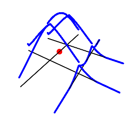

::: article
# Introduction

Data representing events in space are collected in many research fields.
The analysis of these points clouds is crucial in identifying hot spots,
e.g., complaints about environmental noise, cases of diseases,
observation of animals or plant species, crimes, etc. The Kernel Density
Estimate (KDE) is a nonparametric method often used to estimate the
intensity function of a spatial process from a sample of events. More
specifically, the KDE is part of the point pattern analysis (PPA) family
of methods. It allows for the analysis of first-order properties
(variation of density) of a spatial process [@baddeley2015spatial].
Recent works [@xie2008kernel; @okabe2009kernel; @mcswiggan2017kernel]
have shown that the KDE method is unadapted when events are constrained
on a network (road crashes, leaks in a network of pipes, crimes reported
in streets, etc.). The classical KDE is based on the hypothesis of an
infinite, homogenous, two-dimensional space, which is a very rough
approximation if the study area is a network. Indeed, a network is a
particular space between a simple line (1D) and a plan (2D). In a
network, the movement is constrained on multiple one-dimensional lines,
event if it is possible to change direction at intersections.
@steenberghen2010spatial call it a 1.5D space. Moreover, the reticular
distance between objects on a network is always superior or equal to the
Euclidean distance. Thus, using the latter leads to underestimations of
the real distance between the objects on a network. The need to extend
the KDE method is part of a more general trend started in the 1990's
aiming to generalize the spatial analysis to network spaces
[@okabe2006uniform; @xie2008kernel]. At first, several adaptations were
proposed but with a limited relevance because of strong limitations
(applied to very simple networks or a simple spatial aggregation of a
classical KDE)
[@flahaut2003local; @borruso2003network; @porta2009street]. More recent
works have developed methods overcoming these first limitations, forming
the set of the NKDE methods.

Currently, these methods are not easily accessible. @xie2008kernel
developed an ArcMap [@desktop2017release] plugin proposing only a biased
density estimator; @hwang2012user developed GeodaNet (GeodaCenter,
university of Chicago), but it is no longer accessible on their website;
@okabe2006sanet proposed SANET, a toolbox for network analysis as an
ArcMap plugin or a standalone application. Even though SANET is a free
software, it is not open-source, and the actual license limits the use
to research only. Moreover, a new user must send a request to the
maintainer to obtain an activation key. Finally, the R package
[*spatstat*](https://CRAN.R-project.org/package=spatstat) [@spatstat],
dedicated to PPA [@baddeley2004spatstat], includes a function to perform
NKDE analysis (`density.lpp`), but it returns only rasters and requires
an extremely long calculation time for large and medium-sized datasets.
Thus, accessible tools to perform NKDE analysis are missing. This
encourages researchers and professionals to use classical KDE in cases
where NKDE is much more adapted and limits the reproducibility of
research.

We propose the
[*spNetwork*](https://CRAN.R-project.org/package=spNetwork) package to
fill this gap. It implements three estimators of the intensity of a
spatial process on a network, the possibility to use adaptive
bandwidths, and several optimization methods to ensure reasonable
calculation time. R provides a perfect environment to implement the NKDE
method, considering its growing community, its capacity to read, write
and manipulate geographical data
([*rgdal*](https://CRAN.R-project.org/package=rgdal),
[*sp*](https://CRAN.R-project.org/package=sp),
[*rgeos*](https://CRAN.R-project.org/package=rgeos),
[*maptools*](https://CRAN.R-project.org/package=maptools),
[@rgdal; @sp; @rgeos; @maptools]), the existence of libraries to
manipulate networks
([*igraph*](https://CRAN.R-project.org/package=igraph) [@igraph]), and
the facilitated interface to C++ with
[*Rcpp*](https://CRAN.R-project.org/package=Rcpp) [@rcpp].

In the first section of this paper, we present the classical KDE and
introduce the main concepts of the method. In the second section, we
introduce the three NKDE estimators and briefly compare their respective
advantages and limits. The three NKDE are then applied to a small
dataset about road accidents involving a cyclist in a central
neighborhood of Montreal. Finally, we investigate the calculation time
of the three NKDE with different settings considering that calculation
time is an important issue for the NKDE method.

# Kernel density estimate

::: {#general-description}
## General description
:::

For a spatial process *p*, represented by a set of events *e*, its
intensity function $\lambda$ at location *u* ($\lambda(u)$) can be
estimated in a non parametric way by kernel estimation
[@silverman1986density]. Typically, in a two-dimensional space, a
regular grid is defined on the study area, and the intensity is
estimated at the centers of each quadra (pixels). At each location, *u*,
the events within a specified bandwidth, *bw*, contributes to the local
estimated intensity. The strength of this contribution depends on the
distance between the events and *u*, the event's weight, and the kernel
function. This function distributes the mass of the events within a
circular area around each event. The radius of this area is called the
bandwidth (or the standard deviation of the kernel). A larger bandwidth
produces smoother results and higher bias but reduces variance. The
Kernel Density Estimate can thus be obtained as follows:

$$\begin{aligned}
\lambda(u) = \frac{1}{bw^2}\sum^n_{i=1}w_i \cdot K(dist(u,e_i)), \label{eq1}
\end{aligned}   (\#eq:eq1)$$
with *n*, the number of events that satisfy $dist(u,e_i) < bw$, $w_i$
the weight of the event $e_i$ and *K* the kernel function. *K* must be a
probability density function and verifies the two following conditions:

$$\begin{aligned}
\label{eq2}
  \begin{gathered}
    K(x) > 0 \text{ if } x < bw \\
    K(x) = 0 \text{ if } x \ge bw  \\
    \int_{-\infty}^{+\infty}K(x) = 1.
  \end{gathered}
\end{aligned}   (\#eq:eq2)$$

Many kernel functions exist; Figure [1](#fig:kernels) shows the most
commonly used (and implemented in
[*spNetwork*](https://CRAN.R-project.org/package=spNetwork)).

``` r
library(ggplot2)
library(tidyr)
library(spNetwork)
library(RColorBrewer)
library(kableExtra)
library(dplyr)

x <- seq(-15.01, 15.01, by = 0.01)
kernels_func <- list(gaussian_kernel, epanechnikov_kernel, quartic_kernel,
                     triangle_kernel, tricube_kernel, triweight_kernel,
                     cosine_kernel, uniform_kernel)

cols <- lapply(kernels_func, function(f){f(x, 15)})
df <- data.frame(do.call(cbind, cols))
names(df) <- c("Gaussian", "Epanechnikov", "Quartic", "Triangle",
               "Tricube", "Triweight", "Cosine", "Uniform")
df$x <- x

pivot_cols <- names(df)[names(df)!="x"]
df2 <- pivot_longer(df,cols = pivot_cols)
names(df2) <- c("x","kernel","y")

ggplot(df2) +
  geom_line(aes(x = x, y = y, color = kernel), size = 1)+
  xlim(c(-15.01, 15.01))+
  scale_color_brewer(palette = "Accent")+
  scale_y_continuous(name = "density")
```

<figure id="fig:kernels">

<figcaption>Figure 1: The different kernels implemented in
<strong>spNetwork</strong>.</figcaption>
</figure>

Many authors have stressed that the choice of the Kernel function has a
smaller impact on final results in comparison with the choice of the
bandwidth [@o2007surface; @xie2008kernel; @turlach1993bandwidth]. The
Gaussian kernel is a special case (non-compact kernel) because it does
not integrate to one on the domain $[-bw ; +bw]$ but on
$[-\infty ; +\infty]$, leading to a loss of mass for each event.

::: {#diggles-correction}
## Diggle's correction
:::

Formula \@ref(eq:eq1) describes the basic KDE value, which is unbiased
only if the study area is infinite in every direction and if the spatial
process is sampled everywhere in this space. In practice, such
situations are rare, and the basic KDE is biased at the frontier of the
study area. For example, let us imagine a case where abandoned syringes
locations are systematically reported in a specific district of a city.
The ones lying outside the district limits are not considered, leading
to a situation where the border areas systematically have a lower
estimated intensity. To reduce this effect, Diggle's correction
(equation \@ref(eq:eq3)) is generally used [@diggle1985kernel].

$$\begin{aligned}
\label{eq3}
  \begin{gathered}
    \lambda^D(u) = \frac{1}{bw^2}\sum_{i=1}^n w_i \cdot \frac{1}{e(e_i)}K(dist(u,e_i)) \\
    e(u) = \int_W^vK(dist(u,v)).
  \end{gathered}
\end{aligned}   (\#eq:eq3)$$

This correction increases the weight of the events located close to the
study area border because a part of their mass is lost above the border.
For an event $e_i$, with the location *u*, *e(u)* is the fraction of its
mass in the study area (*W*). The correction factor is thus inversely
proportional to the fraction of the event's mass in the study area. For
example, an event having only half its mass in the study area will end
up with a doubled weight.

::: {#adaptive-bandwidth}
## Adaptive bandwidth
:::

In its basic form, the bandwidth of the KDE is fixed, i.e. the value of
the bandwidth is the same everywhere in the study area. This is an
important limitation if the intensity of the spatial process has a
pronounced spatial variation. In that case, the risk is to obtain
oversmoothed results in areas with high intensity and undersmoothed
results in areas with low intensity. To overcome this limitation, it is
possible to replace the fixed bandwidth with a vector of spatially
varying bandwidths. The bandwidths should be smaller in subregions with
higher intensity and wider elsewhere. The Abramson method
[@abramson1982bandwidth] is often used to define this vector of
bandwidths. Its calculation requires two steps. First, a pilot estimate
($\tilde{\lambda}$) is calculated at the location of each event
($u_{ei}$) by using a global bandwidth $h_0$. Second, the vector of
bandwidths ($h(u_{ei})$) is calculated with equation \@ref(eq:eq4):

$$\begin{aligned}
\label{eq4}
  \begin{gathered}
    h(u_{ei}) = h_0 \cdot \frac{1}{\sqrt{\tilde{f}(u_{ei})/\gamma}} \\
    \gamma = (\prod_{i=1}^n\frac{1}{\sqrt{\tilde{f}(e_i)}})^{\frac{1}{n}}.
  \end{gathered}
\end{aligned}   (\#eq:eq4)$$

A trimming value can be defined to avoid obtaining large bandwidths in
subregions with low intensity. Let us recall here that the adaptive
bandwidth is still based on the choice of an arbitrary global bandwidth
and is not a bandwidth selection method.

# The three Network Kernel Density Estimate

We present the three NKDE methods implemented in the
[*spNetwork*](https://CRAN.R-project.org/package=spNetwork) package in
this section .

::: {#the-simple-nkde}
## The simple NKDE
:::

A first NKDE method was proposed by @xie2008kernel and constituted a
geographical attempt to extend the planar KDE to the network case. It
received some attention in geography [@xie2013detecting] but has been
criticized for its statistical incorrectness (detailed later). We refer
to this method as the "*simple NKDE*", and it can be summarized by three
points:

-   The intensity of the spatial process is only estimated on the
    network. Its edges are split into lixels (one-dimensional pixels),
    and the centers of the lixels are used as locations for estimating
    intensity.
-   The distances between events and sampling points are calculated as
    the shortest path distances on the network instead of Euclidean
    distances.
-   The intensity function is slightly modified (equation
    \@ref(eq:eq5)).

$$\begin{aligned}
\lambda(u) = \frac{1}{bw}\sum^n_{i=1}K(dist(u,e_i)). \label{eq5}
\end{aligned}   (\#eq:eq5)$$

The method is appealing for three reasons. First, from a purely
geographical point of view, the extension of the planar KDE to network
KDE is intuitive. The modification applied is in line with other methods
in PPA extended from planar to network cases like the K-function or the
nearest neighbor analysis [@okabe2012spatial]. Second, the method does
not rely on an expensive algorithm and thus achieves a short calculation
time. Third, the adapted formula makes the interpretation
straightforward: it "estimates the density over a linear unit" rather
than an area unit [@xie2008kernel pp. 398]. Note that the modification
of the equation can also be applied to the next methods.

To get a visual representation of the method, we consider the situation
depicted in Figure [2](#fig:base_case). The lines constitute the
network, and a red dot is a single event.

<figure id="fig:base_case">

<figcaption>Figure 2: A single event on a network.</figcaption>
</figure>

We can evaluate the density of the spatial process with the simple NKDE
and visualize the result in 3D (Figure [3](#fig:base_case_simple)),
using density as the height.

<figure id="fig:base_case_simple">

<figcaption>Figure 3: 3D visualization of the simple NKDE.</figcaption>
</figure>

At intersections on the network, the mass of the event is multiplied in
each direction. Consequently, the simple NKDE is not a real kernel
density function because it does not integrate to 1 on its domain. The
practical consequence is the systematic overestimation of the density,
which could be problematic in subregions with many events. To overcome
this limitation, @okabe2009kernel proposed two unbiased estimators: the
discontinuous NKDE and the continuous NKDE.

::: {#the-discontinuous-nkde}
## The discontinuous NKDE
:::

Considering the problem inherent to the simple NKDE, the discontinuous
NKDE proposes a simple solution. The mass is divided at intersections
according to the number of directions minus one. This is easily
represented by Figure [4](#fig:example_discontinuous).

<figure id="fig:example_discontinuous">

<figcaption>Figure 4: Graphical depiction of the discontinuous
NKDE.</figcaption>
</figure>

With the same example as previous, we obtain Figure
[5](#fig:base_case_discontinuous).

<figure id="fig:base_case_discontinuous">

<figcaption>Figure 5: 3D visualization of the discontinuous
NKDE.</figcaption>
</figure>

This estimator is unbiased. However, its discontinuous nature can be
counter-intuitive in real application. For example, considering the
analysis of crimes on a network, it would be counter-intuitive that the
"influence" of a crime suddenly drops from one street to another. The
discontinuous NKDE can be summarized with Equation \@ref(eq:eq6).

$$\begin{aligned}
K(dist(u,e_i)) = \frac{2k(dist(u,e_i))}{n_{i1}\prod_{i=i}^j(n_{ij}-1)}, \label{eq6}
\end{aligned}   (\#eq:eq6)$$
with *k* the kernel function, $n_{ij}$ the number of edges connected at
the intersection *j* on the path originating at the event, $e_i$, and
ending at the location, *u*.

::: {#the-continuous-nkde}
## The continuous NKDE
:::

Finally, the continuous NKDE attempts to combine the best of the two
worlds: it adjusts the values of the NKDE at intersections to ensure
that it integrates to 1 on its domain and applies a backward correction
to force the density values to be continuous. A simple case is
represented in Figure [6](#fig:example_continuous).

<figure id="fig:example_continuous">

<figcaption>Figure 6: Graphical depiction of the continuous
NKDE.</figcaption>
</figure>

In this simple case, there are three different equations to calculate
the kernel density (here, q1, q2, q3). Considering the previous simple
example, we obtain Figure [7](#fig:base_case_continuous).

<figure id="fig:base_case_continuous">

<figcaption>Figure 7: 3D visualization of the continuous
NKDE.</figcaption>
</figure>

Because of its backward correction, the continuous NKDE is recursive in
nature and can hardly be presented as an equation. @okabe2012spatial
describe this method with a recursive function, implemented in
[*spNetwork*](https://CRAN.R-project.org/package=spNetwork). Indeed, for
each node encountered, a correction factor must be applied to all the
previous edges traveled within the remaining bandwidth, and this
correction must also be split between all the nodes encountered in that
direction. In comparison, for the two previous methods, the algorithm
only has to flow in one direction along the edges from the event. As a
consequence, much more iterations are required for the continuous NKDE.
More specifically, @okabe2009kernel state that the complexity of the
discontinuous (and by extension, of the simple) NKDE algorithm is
$O(nn_L)$ with $n_L$ the number of edges and $n$ the number of events.
For the continuous NKDE, the complexity of the algorithm is a function
of the ratio of the bandwidth and the length of the edges. For this
algorithm, @okabe2009kernel observed that the computation time has the
following lower limit (equation \@ref(eq:eq7)):

$$\begin{aligned}
\prod^{i_{max}}_{i=1}(bw-d)/(d_{i+1}-d_i), \label{eq7}
\end{aligned}   (\#eq:eq7)$$
with $d_i$ the distance from an event to the *i*th-nearest node, and
$i_{max}$ the last node verifying $d_i < bw$. In other words, having
many short edges in a network or using a larger bandwidth will increase
the calculation time exponentially for the continuous NKDE.

The pros and cons of the three methods are summarized in Table
[1](#tab:pro_cons).

::: {#tab:pro_cons}
  --------------------------------------------------------------------------------
  Method               Pros                            Cons
  -------------------- ------------------------------- ---------------------------
  Simple NKDE          Continuous / Easy calculation   Biased, not a true kernel

  Discontinuous NKDE   Unbiased / Easy calculation     Discontinuous

  Continuous NKDE      Unbiased / Continuous           Time consuming
  --------------------------------------------------------------------------------

  : Table 1: Pros and cons of the three NKDE.
:::

The two KDE extensions presented in section 2 (adaptive bandwidth and
edge correction) can be directly transposed to these three NKDE methods.

# Implementation in spNetwork

The [*spNetwork*](https://CRAN.R-project.org/package=spNetwork) package
contains two "high- level functions" and three "helper functions". The
"high level functions" `nkde` and `nkde.mc` can be used to calculate the
three NKDE presented in the previous section. Both functions use exactly
the same parameters, `nkde.mc` is a version of `nkde` allowing for
multiprocessing via the package
[*future*](https://CRAN.R-project.org/package=future) [@future]. The
three main inputs are:

-   `lines`, a "SpatialLinesDataFrame" (object defined in the
    [*sp*](https://CRAN.R-project.org/package=sp) package), representing
    the lines of the network.
-   `events`, a "SpatialPointsDataframe" (object defined in the
    [*sp*](https://CRAN.R-project.org/package=sp) package), representing
    the realizations of the spatial process.
-   `samples`, a "SpatialPointsDataframe" providing the locations where
    the density must be estimated.

These three inputs must only have simple and valid geometries and the
same coordinates reference system. Otherwise, an error is raised by the
function before starting any calculation. The parameters `method`,
`kernel_name` and `bw`, indicate respectively which NKDE (simple,
discontinuous, or continuous), and which kernel function (gaussian,
quartic, triweight, etc.) to use, and the bandwidth of the kernel.
`adaptive` and `diggle_correction` allow the user to specify if an
adaptive bandwidth and Diggle's correction must be calculated. Finally,
the remaining parameters control the geometric precision of the network
and the optimization aspects.

The three "helper functions" are provided to facilitate the creation of
the sampling points on the network:

-   The function `lixelize_lines` splits the lines of a
    "SpatialLinesDataFrame" according to a selected distance to generate
    lixels.
-   The function `lines_center` returns for each line of a
    "SpatialLinesDataFrame" its center points (the point located at
    mid-distance between the start and the end of the linestring).
-   The function `lines_points_along` returns points located along the
    lines of a "SpatialLinesDataFrame", evenly spaced according to a
    selected distance.

Considering the previous functions, the workflow of NKDE analysis with
[*spNetwork*](https://CRAN.R-project.org/package=spNetwork) follows five
steps:

1.  Loading the network dataset and the event dataset as sp objects,
    typically with the function `readOGR` from the package
    [*rgdal*](https://CRAN.R-project.org/package=rgdal). Many standard
    formats can thus be used such as ESRI Shapefile, Geopackage,
    GeoJson, SpatialLite, etc.

2.  Generating the sampling points on the network by using the helper
    functions.

3.  Calculating the density estimations with the `nkde` or `nkde.mc`
    functions.

4.  Adding the densities as a new column to the sampling
    "SpatialPointsDataFrame" or lixels "SpatialLinesDataFrame".

5.  Exporting the results, typically with `writeOGR` from
    [*rgdal*](https://CRAN.R-project.org/package=rgdal) to map the
    results with a dedicated mapping software (like Qgis
    [@qgis2016qgis]).

# Optimization

The main problem with NKDE methods is the calculation time. Building the
network and calculating the paths between its nodes can be a costly
process (depending on the size of the network studied and the number of
events). The implementation in
[*SpNetwork*](https://CRAN.R-project.org/package=SpNetwork) uses many
techniques to reduce the calculation time.

First, only the events are added as nodes in the network. The sampling
points are snapped to their nearest edge. Each edge in the network is a
straight line. Thus, the final distance between a sampling point and a
node of the network is calculated with the Euclidean distance.
Consequently, the complexity of the network is not affected by the
density of the sampling points.

Second, the calculus of the density is event-oriented. In other words,
the kernel density is sequentially calculated around each event. The
density values of the samples are updated at each iteration. The
advantage of this approach is that the calculation time is less affected
by the density of the sampling points.

Third, the events can be aggregated, and their weights added within a
threshold distance. In many applications, a small distance between
events is not significant considering the accuracy of the location
method (geocoding, smartphone GPS, location at intersections, etc.).
Aggregating events can simplify networks and limit the number of
iterations when calculating the NKDE.

Fourth, following the idiom "divide and conquer", the user can specify
the shape of a grid on the study area to split the calculation. In that
case, for each quadra of the grid, the sampling points in the quadra are
selected. The events and the lines of the network are selected if they
intersect a buffer around the quadra (the size of the buffer being the
bandwidth of the kernel). Thus, the separate calculations do not produce
edge effects. All the spatial queries are optimized using the quadtree
spatial index proposed by the package
[*SearchTrees*](https://CRAN.R-project.org/package=SearchTrees)
[@searchtrees]. This approach limits the risk of memory issues and
increases calculation speed for big datasets.

Fifth, when the dataset is split, the calculation can be separated
between several processes. Considering the fact that a lot of computers
are now equipped with processors having more than four cores, dividing
the work between them is an easy way to reduce the overall calculation
time. The packages [*future*](https://CRAN.R-project.org/package=future)
and [*future.apply*](https://CRAN.R-project.org/package=future.apply)
[@future_apply] are used in
[*spNetwork*](https://CRAN.R-project.org/package=spNetwork) to support
multiprocessing. It ensures good compatibility between OS and even has
features to dispatch calculations on multiple computers.

Finally, the main algorithms are implemented with
[*Rcpp*](https://CRAN.R-project.org/package=Rcpp) and
[*RcppArmadillo*](https://CRAN.R-project.org/package=RcppArmadillo)
[@rcpparmadillo] to overcome the R (scripted language) limitations when
loops and recursions are involved [@rloops] and benefit from faster C++
compiled code.

# Example with bike accidents in Montreal

In this section, we illustrate the use of the package with a built-in
dataset. This dataset is an extract from the Montreal Open Data website
representing bike accidents that occurred on the Montreal road network
in 2017 (Figure [8](#fig:map1)).

<figure id="fig:map1">

<figcaption>Figure 8: Example dataset of bike accidents in
Montreal.</figcaption>
</figure>

To identify hot spots of bike accidents, we calculated the three NKDE
(simple, discontinuous, and continuous) with a quartic kernel (Figure
[9](#fig:three_nkde_maps_c)). We selected a 200 meters bandwidth
considering that the mean length of a road segment in this network is
108 meters. This bandwidth ensures that, most often, only events located
closer than two street segments from a sampling point contribute to its
density.

``` r
library(spNetwork)
library(rgdal)

## Step 1: Loading the data
networkgpkg <- system.file("extdata", "networks.gpkg",
                           package = "spNetwork", mustWork = TRUE)
eventsgpkg <- system.file("extdata", "events.gpkg",
                          package = "spNetwork", mustWork = TRUE)
mtl_network <- readOGR(networkgpkg,layer="mtl_network",verbose = FALSE)
bike_accidents <- readOGR(eventsgpkg,layer="bike_accidents", verbose = FALSE)

## Step 2: Generating the sampling points on the network
# splitting the lines as lixels
lixels <- lixelize_lines(mtl_network, 100, 50)

# extracting the center of lixels as sampling points
sample_pts <- lines_center(lixels)

## Step 3: Calculating the densities estimations
# densities for the simple NKDE
nkde_simple <- nkde(lines = mtl_network,
                         events = bike_accidents,
                         w = rep(1, nrow(bike_accidents)),
                         samples = sample_pts,
                         kernel_name = "quartic",
                         bw = 200, method = "simple",
                         div = "bw", digits = 2, tol = 0.01,
                         agg = 10, grid_shape = c(1, 1),
                         verbose = FALSE)

# densities for the discontinuous NKDE
nkde_discontinuous <- nkde(lines = mtl_network,
                                events = bike_accidents,
                                w = rep(1, nrow(bike_accidents)),
                                samples = sample_pts,
                                kernel_name = "quartic",
                                bw = 200,method = "discontinuous",
                                div = "bw", digits = 2, tol = 0.01,
                                agg = 10, grid_shape = c(1, 1),
                                verbose = FALSE)

# densities for the continuous NKDE
nkde_continuous <- nkde(lines = mtl_network,
                                events = bike_accidents,
                                w = rep(1, nrow(bike_accidents)),
                                samples = sample_pts,
                                kernel_name = "quartic",
                                bw = 200, method = "continuous",
                                div = "bw",digits = 2, tol = 0.01,
                                agg = 10, grid_shape = c(1, 1),
                                verbose = FALSE)
```

To obtain more readable results, one can multiply the obtained densities
by the total number of accidents (to make the spatial integral equal to
the number of events) and multiply this value again by 1000 to get the
estimated numbers of accidents per kilometer.

``` r
## Step 4: Adding the densities as new columns to the sampling
lixels$simple_density <- nkde_simple * nrow(bike_accidents) * 1000
lixels$continuous_density <- nkde_continuous * nrow(bike_accidents) * 1000
lixels$dicontinuous_density <- nkde_discontinuous * nrow(bike_accidents) * 1000
lixels$difference <- lixels$simple_density - lixels$continuous_density
```

{width="100%"}

{width="100%"}

<figure id="fig:three_nkde_maps_c">

<figcaption>Figure 9: Estimated densities of the three NKDE for bike
accidents in Montreal.</figcaption>
</figure>

As one can observe in Figure [9](#fig:three_nkde_maps_c), the three
methods highlight the same major hot spots. We can identify a primary
area in the downtown with two distinct clusters (1 and 2). Then, more
local hot spots are also visible on the three maps (3, 4, 5, 6). All of
them occur at intersections on streets with the main bicycle paths.

Figure [10](#fig:density_diff) shows the values obtained for each
sampling point for the three NKDE, sorted with the value of the
discontinuous NKDE. We can observe that the simple NKDE tends to produce
higher values and thus seriously overestimate the density of accidents
in hot spot regions.

``` r
library(ggplot2)
library(tidyr)

df <- lixels@data[c("simple_density",
                    "continuous_density", 
                    "dicontinuous_density")]

df <- df[order(df$dicontinuous_density), ]
df$oid <- 1:nrow(df)

pivot_cols <- names(df)[names(df) != "oid"]
df2 <- pivot_longer(df, cols = pivot_cols)
df2$name <- case_when(
  df2$name == "simple_density" ~ "Simple NKDE",
  df2$name == "continuous_density" ~ "Continuous NKDE",
  df2$name == "dicontinuous_density" ~ "Discontinuous NKDE")

ggplot(df2) +
  geom_point(aes(x = oid, y = value, color = name), size = 0.2)+
  ylab("Estimated densities")+
  scale_color_manual(values = c("Simple NKDE"="#F8766D",
                                  "Continuous NKDE"="#00BA38",
                                  "Discontinuous NKDE"="#619CFF"))+
  theme(axis.title.x = element_blank(), axis.text.x = element_blank(), 
        axis.ticks.x = element_blank(), legend.title = element_blank())
```

<figure id="fig:density_diff">

<figcaption>Figure 10: Comparison of the estimated
densities.</figcaption>
</figure>

::: {#adaptive-bandwidth-1}
## Adaptive bandwidth
:::

An adaptive bandwidth based on the Abramson's inverse-square-root rule
[@abramson1982bandwidth] can be used to produce a new version of the
three NKDE. We will only calculate here the results for the continuous
NKDE. Figure [11](#fig:adaptive_map) shows the new results and the size
of some calculated bandwidths with circles (not all the bandwidths are
shown; otherwise the map would not be readable). As we can see, the
adaptive kernel produces more smoothed results in low-intensity
subregions and more detailed results in high-density regions. We can see
now that the primary hot spot (1) seems concentrated on a smaller area.

``` r
library(rgeos)

# calculating the continuous kernel with an adaptive bandwidth
nkde_abw <- nkde(lines = mtl_network,
                             events = bike_accidents,
                             w = rep(1, nrow(bike_accidents)),
                             samples = sample_pts,
                             kernel_name = "quartic",
                             bw = 200,
                             adaptive = TRUE, trim_bw = 400,
                             method = "continuous",
                             div = "bw",
                             digits = 2, tol = 0.01,
                             agg = 10, grid_shape = c(1, 1),
                             verbose = FALSE)

lixels$continuous_density_abw <- nkde_abw$k * nrow(bike_accidents) * 1000

# extracting the local bandwidth
local_bw <- nkde_abw$events
buff_bw <- gBuffer(local_bw,width = local_bw$bw, byid=TRUE)
sel_buff <- buff_bw[c(1, 52, 20, 86, 14, 75, 126, 200, 177), ]

# mapping the elements
tm_shape(lixels,unit = 'm') + 
  tm_lines(1.7, title.col = 'continuous NKDE density',
           col = 'continuous_density_abw', n = 7,
           style = 'jenks', palette = pal)+
tm_shape(sel_buff)+
  tm_borders("black", lwd = 1)+
  tm_layout(legend.outside = TRUE, inner.margins = 0,
            outer.margins = 0, legend.title.size = 1,
            legend.outside.position = "right",
            frame = FALSE)
```

<figure id="fig:adaptive_map">

<figcaption>Figure 11: Estimated densities of the continuous NKDE for
bike accidents in Montreal with an adaptive bandwidth.</figcaption>
</figure>

::: {#local-moran-i}
## Local Moran I
:::

It has been proposed to combine the NKDE with the local Moran I
autocorrelation index to identify significant hot spots or cold spots of
events' intensity [@xie2013detecting]. Such an approach can be easily
applied with
[*spNetwork*](https://CRAN.R-project.org/package=spNetwork), which
provides functions to calculate spatial weight matrices using network
distances. We illustrate it here by creating a weight matrix *w*.
$w_{ij}$ is the spatial weight for observations *i* and *j*, calculated
as the inverse of the network distance between them. Beyond 400 meters
the weight is set to 0, and the matrix is row standardized. This example
illustrates that
[*spNetwork*](https://CRAN.R-project.org/package=spNetwork) is well
integrated with the actual ecosystem of R packages dedicated to spatial
analysis.

``` r
library(spdep)

# calculating the spatial weight matrix
listw <- network_listw(origins = sample_pts,
                         lines = mtl_network,
                         maxdistance = 400, dist_func = "inverse",
                         matrice_type = "W",
                         grid_shape = c(1,1),digits = 2,
                         verbose = F, tol = 0.01)

# calculating the local Moran I values
locmoran<- localmoran(lixels$continuous_density,listw = listw)

# centering the NKDE values and calculating the spatially lagged variable
cent_density <- scale(lixels$continuous_density, scale = F)
lag_cent_density <- lag.listw(listw, cent_density)

# mapping the results
lixels$moran_quad <- case_when(
  cent_density > 0 & lag_cent_density > 0 & locmoran[,5]<=0.05 ~ "high-high",
  cent_density < 0 & lag_cent_density < 0 & locmoran[,5]<=0.05 ~ "low-low",
  cent_density > 0 & lag_cent_density < 0 & locmoran[,5]<=0.05 ~ "high-low",
  cent_density < 0 & lag_cent_density > 0 & locmoran[,5]<=0.05 ~ "low-high",
  locmoran[,5] > 0.05 ~ "not sign.",
)

colors <- c("high-high" = "#E63946",
            "high-low" = "#EC9A9A",
            "low-high" = "#A8DADC",
            "low-low" = "#457B9D",
            "not sign." = "black")

not_sign <- subset(lixels, lixels$moran_quad == "not sign.")
sign <- subset(lixels, lixels$moran_quad != "not sign.")

tm_shape(not_sign,unit = 'm') + 
  tm_lines(1.2, title.col = 'Local Moran for the continuous NKDE',
           col = 'black') + 
  tm_shape(sign,unit = 'm') + 
  tm_lines(2, title.col = 'Local Moran for the continuous NKDE',
           col = 'moran_quad', palette = colors) + 
  tm_layout(legend.outside = TRUE, inner.margins = 0,
            outer.margins = 0, legend.title.size = 1,
            legend.outside.position = "right",
            frame = FALSE)
```

<figure id="fig:unnamed-chunk-2">

<figcaption>Figure 12: Local Moran I calculated on continuous
NKDE.</figcaption>
</figure>

# Calculation time

In this final section, we investigate the calculation time of the three
NKDE. For the first test, we used a complete version of the dataset
presented above (but not included in the package). The network used
covers the full Island of Montreal for a total of 47488 features (5877
km). The 1722 events are road accidents involving a cyclist between 2017
and 2018. We ran the calculation of the three NKDE by using 1 to 8 cores
and by splitting the study area with a grid ranging from 10 by 10 to 18
by 18. The calculations were executed on a computer equipped with an
Intel (R) Xeon (R) Bronze 3104 CPU (12 cores 1.70 GHz) and 32 GO of RAM,
with the Windows 10 operating system and the R version 4.0.2. Table
[2](#tab:durations1) shows the calculation times.

::: {#tab:durations1}
  --------------- ---------------- --------- --------- --------------- --------- --------- ------------ --------- ---------
                  Duration (min)                                                                                  

                                                                                                                  

  l3ptr3pt)2-10   Simple                               Discontinuous                       Continuous             

  Cores           10 x 10          14 x 14   18 x 18   10 x 10         14 x 14   18 x 18   10 x 10      14 x 14   18 x 18

  1               23:33            19:22     18:02     21:49           17:31     16:37     87:29        43:37     33:55

  2               14:01            11:48     11:36     14:37           11:23     10:31     59:13        32:57     19:41

  3               10:28            08:42     08:20     10:57           08:22     08:03     53:35        27:54     17:15

  4               09:44            09:42     07:43     09:12           09:00     07:24     78:00        32:23     17:26

  5               08:02            07:45     07:13     08:04           07:09     06:21     91:16        30:08     14:56

  6               07:50            06:49     07:06     07:01           06:51     06:33     93:05        35:58     12:19

  7               07:38            06:43     06:39     06:38           06:36     06:24     53:06        38:17     14:20

  8               06:54            06:37     07:06     07:06           06:38     06:56     55:52        33:32     18:47
  --------------- ---------------- --------- --------- --------------- --------- --------- ------------ --------- ---------

  : Table 2: Durations of the first setting.
:::

As one can see, the durations are very similar for the simple and the
discontinuous methods. Because of the backward adjustment of the
density, the continuous method is much more time-consuming. Using
multiprocessing is an efficient way to reduce calculation time. In our
setting, the biggest gain is achieved with three cores. Beyond three,
the gains are more negligible. Dividing the study area with a finer grid
contributes to reducing calculation time to a smaller extent.

For the second test, we selected a single event in the middle of the
complete study area. We then constructed several study areas by
selecting all events and all lines within subsequent radiuses from 500 m
to 7000 m. For each iteration, only one core was used and a grid with a
5 x 5 shape. The results are presented in Table [3](#tab:durations2). We
can observe that the calculation time increases slowly for the simple
and the discontinuous NKDE, but the increase for the continuous NKDE is
sharper. These results show that the proposed package can calculate the
three NKDE with reasonable calculation time, even for datasets covering
a full city.

::: {#tab:durations2}
  ---------- ------------------ ----------------- ---------------- --------------- ------------
                                                  Duration (min)                   

  Distance   Number of events   Number of lines   Simple           Discontinuous   Continuous

  1000       97                 447               00:23            00:16           00:16

  1500       198                948               00:41            00:27           00:28

  2000       303                1648              00:58            00:40           00:43

  2500       486                2581              01:25            00:59           01:03

  3000       652                4010              02:01            01:30           04:47

  500        797                5630              02:39            02:03           13:20

  4000       905                7032              03:13            02:21           14:06

  4500       989                8497              03:44            02:53           16:17

  500        22                 138               00:13            00:10           00:10

  5000       1097               10432             04:30            03:40           18:23

  500        1170               11913             05:23            04:27           22:18

  6000       1230               13196             06:04            05:06           25:23

  6500       1276               14674             06:44            05:46           32:49

  7000       1332               16373             07:31            06:30           34:55
  ---------- ------------------ ----------------- ---------------- --------------- ------------

  : Table 3: Durations of the second setting.
:::

# Concluding remarks

The Network Kernel Density Estimate (NKDE) is an extension of the Kernel
Density Estimate (KDE). Numerous spatial phenomena are constrained on a
network like road accidents, crimes reported on streets, leaks in pipes,
breaks in a wiring network, bird nests along a river, etc. Analyzing
these datasets with a classical KDE is unsatisfactory because densities
are evaluated at places where the events cannot occur (outside the
network). The Euclidean distance underestimates the distance between
objects on the network, and a network is not a homogeneous space.
@tang2013comparative argue that in practical applications, the
differences between the classical KDE and NKDE are small, the latter
providing only more accurate and detailed results. However, our brief
comparison suggests that the simple NKDE (the closest to the classical
KDE) systematically overestimates densities compared to the continuous
and discontinuous NKDE. This is in line with results obtained when
comparing the planar and network K-functions [@yamada2004comparison].
The NKDE method remains quite inaccessible because of the lack of
open-source implementation. The
[*spNetwork*](https://CRAN.R-project.org/package=spNetwork) package
introduced here proposes to fill this gap by implementing it with R,
taking advantage of its rich geospatial ecosystem
([*Spatial*](https://CRAN.R-project.org/view=Spatial)).\
Three different NKDE are currently available in the package: the simple,
the discontinuous, and the continuous NKDE. The first one is an early
attempt to generalize the classical KDE to network spaces. It produces
biased results and is not a true kernel, but it is intuitive from a
purely geographical point of view. The discontinuous and continuous NKDE
are true kernels and provide unbiased density estimates. We discussed in
this paper their respective limitations and advantages. Two
complementary features are proposed by
[*spNetwork*](https://CRAN.R-project.org/package=spNetwork): Diggle's
edge correction and adaptive bandwidths based on Abramson's rule. The
[*spNetwork*](https://CRAN.R-project.org/package=spNetwork) package uses
several techniques to reduce computation time and memory use for the
NKDE: dividing the study area into smaller chunks, multiprocessing,
compiled C++ functions, and spatial indexes. However, for large datasets
with large bandwidths the overall process remains long. Consequently, no
methods are currently proposed for automatic bandwidth selection. In the
future, we plan to add in the package other methods for PPA on networks
like the K-function, nearest neighbor analysis and reticular distance
weight matrices.
:::
