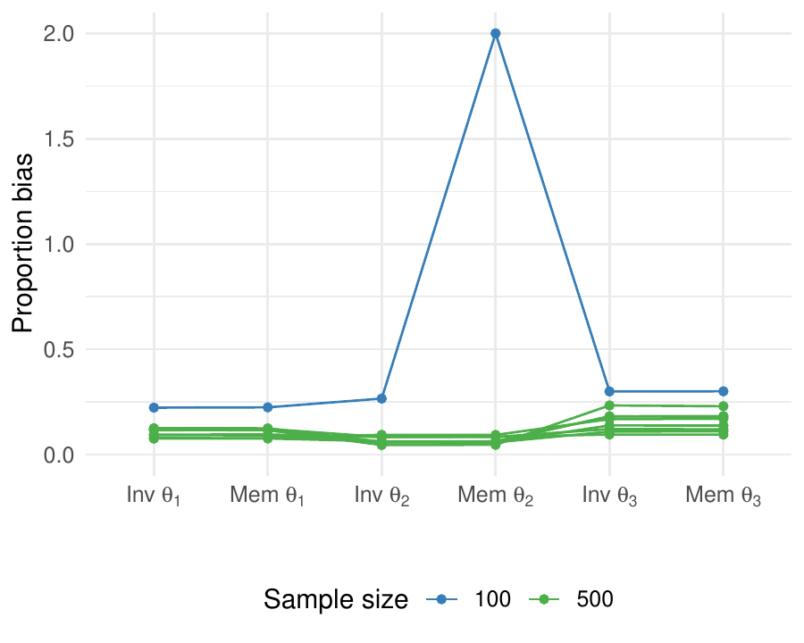

# Introduction: Simulating from time-to-event processes in R

When modeling time-to-event processes, especially over long periods of
time, it is often unreasonable to assume a constant hazard rate. In
these cases, change-point hazard models are applicable. The majority of
research surrounding change-point hazard models focuses on the Cox
proportional hazards and piecewise exponential models with one
change-point [@Yao; @Gijbels; @Wu; @Rojas; @Dupuy], likely due to the
straightforward extension for including fixed and time-varying
covariates [@Zhou; @Hendry; @MontezGuidelines; @Wong]. Research on
hazard models with multiple change-points is also expanding as these
models have a wide range of applications in fields such as medicine,
public health, and economics [@Liu; @Goodman; @He; @Han; @Qian; @Cai].
In the interest of simulating time-to-event data featuring trends with
multiple change-points, [@Walke] presents an algorithm for simulating
data from the piecewise exponential distribution with fixed type I
censoring using the location of the change-points, the baseline hazard,
and the relative hazard for each time interval in between change-points.
As the research surrounding parametric change-point hazard models with
multiple change-points continues to grow, likewise does the need to
simulate data from these distributions. Simulation is also a powerful
and popular tool for assessing the appropriateness of a model for one's
data or conducting a power analysis.

Several R packages available from the Comprehensive R Archive Network
(CRAN) provide functions for simulating time-to-event data in general,
with a heavy focus on the Cox model. Some of the more popular packages
are provided in Table [1](#tb:1), which expands on the METACRAN
compilation [@metacran]. Although considerably smaller in scope, a few R
packages provide functions for simulating data with change-points.
*CPsurv* has functionality for simulating both nonparametric survival
data and parametric survival data from the Weibull change-point
distribution but requires existing data as an argument and only allows
for one change-point [@CPsurv]. *SimSCRPiecewise* simulates data using
the piecewise exponential hazard model within the Bayesian framework,
however, this method requires at least one covariate as an argument
[@SimSCRPiecewise].

::: {#tb:1}
  ---------------------------------------------------------------------------------------
  Package Title       Brief Description
  ------------------- -------------------------------------------------------------------
  *coxed*             Simulates data for the Cox model using the flexible-hazard

                      method and allows for the inclusion of time-varying covariates

                      [@coxed]

  *CPsurv*            Simulates one change-point for non-parametric survival analysis

                      or parametric survival analysis using the Weibull distribution

                      [@CPsurv]

  *cpsurvsim*         Simulates data with multiple change-points from the exponential

                      and Weibull distributions [@Hochheimer]

  *discSurv*          Simulates survival data from discrete competing risk models

                      [@discSurv]

  *gems*              Simulates data from multistate models and allows for

                      non-Markov models that account for previous events

                      [@gems]

  *genSurv*           Gives users the option to generate data with a binary,

                      time-dependent covariate

                      [@genSurv; @genSurvpaper]

  *ipred*             Provides a function for simulating survival data for tree-

                      structured survival analysis [@ipred]

  *MicSim*            Performs continuous time miscrosimulations to simulate life

                      courses [@MicSim]

  *PermAlgo*          Uses a permutational algorithm to generate time-to-event data

                      allowing for the inclusion of several time-dependent covariates

                      [@PermAlgo]

  *prodlim*           Has functions for simulating right censored non-parametric

                      survival data with two covariates and with or without competing

                      risks [@prodlim]

  *simMSM*            Uses inversion sampling to simulate data from multi-state

                      models allowing for non-linear baseline hazards, time-varying

                      covariates, and dependence on past events [@simMSM]

  *simPH*             Simulates data from Cox proportional hazards models

                      [@simPH]

  *simsurv*           Simulates data from various parametric survival distributions,

                      2-component mixture distributions, and user-defined hazards

                      [@simsurv]

  *SimSCRPiecewise*   Uses Bayesian estimation to simulate data from the piecewise

                      exponential hazard model allowing for the inclusion of covariates

                      [@SimSCRPiecewise]

  *SimulateCER*       While not a formal R package, this package extends the methods

                      found in *PermAlgo* and can be downloaded from GitHub

                      [@MontezSimulating]

  *survsim*           Allows users to simulate time-to-event, competing risks, multiple

                      event, and recurrent event data [@survsim]
  ---------------------------------------------------------------------------------------

  : Table 1: R packages for simulating time-to-event data
:::

Our package *cpsurvsim* allows users to simulate data from a both the
exponential and Weibull hazard models with type I right censoring
allowing for multiple change-points [@Hochheimer]. *cpsurvsim* provides
two methods for simulating data, which are introduced in the following
section. The first method draws on [@Walke], using the inverse hazard
function to simulate data. The second employs the memoryless simulation
method, the details of which are also discussed in the next section. We
then demonstrate how to simulate data using *cpsurvsim* and compare the
performance of these methods through a simulation study with the
motivation of enabling users to determine which method is best for their
data.

# Simulating data from popular change-point hazard models

The piecewise exponential model with multiple change-points
$(\tau_k, k=1,\ldots,K)$ can be expressed as
$$\begin{aligned}
f(t)=\begin{cases}
\theta_1\exp\{-\theta_1t\} & 0\leq t<\tau_1\\
\theta_2\exp\{-\theta_1\tau_1-\theta_2(t-\tau_1)\} & \tau_1\leq t <\tau_2\\
\vdots\\
\theta_{K+1}\exp\{-\theta_1\tau_1-\theta_2(\tau_2-\tau_1)-\ldots-\theta_{K+1}(t-\tau_K) \} & t\geq\tau_K
\end{cases}\label{exponential pdf}
\end{aligned}   (\#eq:exponential-pdf)$$
with corresponding hazard function
$$\begin{aligned}
	h(t)=\begin{cases}
	\theta_1 & 0\leq t<\tau_1\\
	\theta_2 & \tau_1\leq t <\tau_2\\
	\vdots & \vdots \\
	\theta_{K+1} & t\geq\tau_K.
	\end{cases}
	\label{exponential hazard}
\end{aligned}   (\#eq:exponential-hazard)$$
We draw on the work of [@Walke] in that we use the inverse hazard
function to simulate survival time $t$. [@Walke] uses a baseline hazard
and relative hazards to simulate each time interval between
change-points, whereas our simulation is based on the value of the scale
parameter ($\theta_i, i = 1,\ldots, K+1$) corresponding to each interval
as specified by the user. Starting with the relationship between the
cumulative density function (CDF) and the cumulative hazard function
($F(t)=1-\exp(-H(t))$ where $H(t)=\int h(t)dt$) and noting that $F(t)=U$
where $U$ is a uniform random variable on (0,1), we derive
$t=H^{-1}(-\log(1-U))$. Seeing as $x=-\log(1-U)\sim Exp(1)$, we can
simulate random variables from the exponential distribution and plug
them into the inverse hazard function to get simulated event time $t$.
With this in mind, the inverse cumulative hazard function for the
exponential change-point hazard model with four change-points is
$$\begin{aligned}
H^{-1}(x)=\begin{cases}
\frac{x}{\theta_1} & 0\leq x<A\\
\frac{x-A}{\theta_2}+\tau_1 & A\leq x<A+B\\
\frac{x-A-B}{\theta_3}+\tau_2 & A+B\leq x <A+B+C\\
\frac{x-A-B-C}{\theta_4}+\tau_3 & A+B+C\leq x<A+B+C+D\\
\frac{x-A-B-C-D}{\theta_5}+\tau_4 & x\geq A+B+C+D
\end{cases}
\end{aligned}$$
where $A=\theta_1\tau_1$, $B=\theta_2(\tau_2-\tau_1)$,
$C=\theta_3(\tau_3-\tau_2)$, and $D=\theta_4(\tau_4-\tau_3)$. In
*cpsurvsim*, this method of simulating time-to-event data is considered
the CDF method. An end-of-study time horizon (or maximum measurement
time) is specified by the user and all simulated event times with values
greater than the end time are censored at that point (type I right
censoring).

The Weibull distribution is another popular parametric model for
survival data due to its flexibility to fit a variety of hazard shapes
while still satisfying the proportional hazards assumption. Note that
when $\gamma=1$, it is identical to the exponential distribution. The
Weibull change-point model has the probability density function
$$\begin{aligned}
f(t)=\begin{cases}
\theta_1 t^{\gamma-1}\exp\{-\frac{\theta_1}{\gamma}t^\gamma\} & 0\leq t<\tau_1\\
\theta_2 t^{\gamma-1}\exp\{-\frac{\theta_2}{\gamma}(t^\gamma-\tau_1^{\gamma})-\frac{\theta_1}{\gamma}\tau_1^{\gamma}\} & \tau_1\leq t<\tau_2\\
\vdots \\
\theta_{K+1} t^{\gamma-1}\exp\{-\frac{\theta_{K+1}}{\gamma}(t^\gamma-\tau_K^{\gamma})-\frac{\theta_K}{\gamma}(\tau_K^{\gamma}-\tau_{K-1}^{\gamma})-\ldots-\frac{\theta_1}{\gamma}\tau_1^\gamma\} & t\geq\tau_K
\end{cases}
\label{weibull pdf}
\end{aligned}   (\#eq:weibull-pdf)$$
with corresponding hazard function
$$\begin{aligned}
	h(t)=\begin{cases}
	\theta_1 t^{\gamma-1} & 0\leq t<\tau_1\\
	\theta_2 t^{\gamma-1} & \tau_1\leq t<\tau_2 \\
	\vdots & \vdots \\
	\theta_{K+1} t^{\gamma-1} & t\geq\tau_K.
	\end{cases}
\end{aligned}$$
As with the exponential model, event times can be simulated using the
inverse hazard function (shown here with four change-points)
$$\begin{aligned}
H^{-1}(x)=\begin{cases}
(\frac{\gamma}{\theta_1}x)^{1/\gamma} & 0\leq x<A\\
[\frac{\gamma}{\theta_2}(x-A)+\tau_1^{\gamma}]^{1/\gamma} & A\leq x<A+B\\
[\frac{\gamma}{\theta_3}(x-A-B)+\tau_2^\gamma]^{1/\gamma} & A+B\leq x<A+B+C\\
[\frac{\gamma}{\theta_4}(x-A-B-C)+\tau_3^\gamma]^{1/\gamma} & A+B+C\leq x<A+B+C+D\\
[\frac{\gamma}{\theta_5}(x-A-B-C-D)+\tau_4^\gamma]^{1/\gamma} & 
x\geq A+B+C+D
\end{cases}
\end{aligned}$$
where $A=\frac{\theta_1}{\gamma}\tau_1^{\gamma}$,
$B=\frac{\theta_2}{\gamma}(\tau_2^\gamma-\tau_1^\gamma)$,
$C=\frac{\theta_3}{\gamma}(\tau_3^\gamma-\tau_2^\gamma)$, and
$D=\frac{\theta_4}{\gamma}(\tau_4^\gamma-\tau_3^\gamma)$.

[@Zhou] touches on the idea of the memoryless property as a means of
interpreting the piecewise exponential model, however, we take this one
step further by using this property to simulate data from change-point
hazard models. In survival analysis, the memoryless property states that
the probability of an individual experiencing an event at time $t$ is
independent of the probability of experiencing an event up to that
point. Likewise, the probability of an event occurring after a
change-point is independent of the probability that the event occurs
before the change-point.

Our memoryless simulation method uses this extension of the memoryless
property in that data between change-points are simulated from
independent exponential or Weibull hazard distributions with scale
parameters $\theta_i$ corresponding to each time interval. Participants
with simulated survival times past the next change-point are considered
surviving at least to that change-point and then an additional survival
time is simulated for them in the next time interval. Total time to
event is calculated as the sum of time in each interval between
change-points, with those surviving past the study end time censored at
that point. Survival times within each interval are calculated using the
inverse hazard of the independent exponential or Weibull function
representing that time period. In this way, the inverse hazard and
memoryless methods are equivalent when there are no change-points.

# The *cpsurvsim* package

The *cpsurvsim* package can be installed from CRAN. Functions for
simulating data are summarized in Table [2](#tb:2)

::: {#tb:2}
  ----------------------------------------------------------------
  Function        Hazard model           Simulation method
  --------------- ---------------------- -------------------------
  `exp_cdfsim`    Piecewise constant     Inverse hazard function

  `exp_memsim`    Piecewise constant     Memoryless

  `weib_cdfsim`   Weibull change-point   Inverse hazard function

  `weib_memsim`   Weibull change-point   Memoryless
  ----------------------------------------------------------------

  : Table 2: Summary of functions for simulating data using *cpsurvsim*
:::

As an example of the functions `exp_cdfsim` and `weib_cdfsim`, which
simulate data using the inverse hazard method from the exponential and
Weibull distributions, respectively, consider the following:

``` r
library(cpsurvsim)
dta1 <- exp_cdfsim(n = 50, endtime = 100, theta = c(0.005, 0.01, 0.05), 
+  tau = c(33, 66))
head(dta1)

       time censor
1 100.00000      0
2  85.99736      1
3  78.21772      1
4  71.03138      1
5 100.00000      0
6  82.71520      1

dta2 <- weib_cdfsim(n = 50, endtime = 100, gamma = 2, 
+  theta = c(0.0001, 0.0002, 0.0001), tau = c(33, 66))
head(dta2)

       time censor
1  11.36844      1
2 100.00000      0
3  81.04904      1
4 100.00000      0
5  71.93590      1
6  56.40275      1
```

When simulating using the memoryless method, we use the following calls
from *cpsurvsim*:

``` r
dta3 <- exp_memsim(n = 50, endtime = 100, theta = c(0.005, 0.01, 0.05), 
+  tau = c(33, 66))
head(dta3)

      time censor
1 93.64262      1
2 63.47413      1
3 84.54253      1
4 89.01574      1
5 73.92685      1
6 23.67631      1     

dta4 <- weib_memsim(n = 50, endtime = 100, gamma = 2, 
+  theta = c(0.0001, 0.0002, 0.0001), tau = c(33, 66))
head(dta4)

       time censor
1  59.47848      1
2 100.00000      0
3  62.08739      1
4 100.00000      0
5 100.00000      0
6 100.00000      0
```

As seen in these examples, all four functions return a dataset with the
survival times and a censoring indicator.

# Comparison of simulation methods

To compare the performance of the inverse hazard method with the
memoryless method under different settings, we conducted a simulation
study using *cpsurvsim*. We simulated data with one, two, three, and
four change-points using both the exponential and Weibull distributions.
In our simulation, time $t$ ranged from 0-100 and change-points occurred
at various times within that range. Sample sizes of 50, 100, and 500
were tested and values of $\theta$ were chosen to demonstrate
differences between the simulation methods when the hazard rate changes
(e.g., smaller to larger hazard versus larger to smaller hazard). For
the Weibull simulations, we set $\gamma=2$. We conducted 10,000
simulations of each setting. We are primarily interested in comparing
the ability of these two simulation methods to simulate data with the
correct change-points $\tau_i$. Therefore, we compared how often the
estimated value ($\hat{\tau_i}$) was within a 10% range, in this case
$[\tau_i-5, \tau_i+5]$ based on our time range. We also evaluated
whether the known values of $\tau_i$ fell within the 95% confidence
interval of the average simulated values for both methods as well as
discuss bias in the model parameters. This simulation study was
conducted in R 3.6.1.

When simulating from the exponential distribution, these two simulation
methods had comparable accuracy in terms of the location of the
change-points (see Figure [1](#fig:expplplots)). Sample size, however,
had a large impact on the accuracy regardless of the simulation method.
When estimating one change-point with a sample size of 50, there were a
few simulation templates where less than a third of estimates
$\hat{\tau}$ were within range of the known change-point
(Figure [1](#fig:expplplots)a). In general, accuracy improved as the
sample size increased. For every simulation scenario using the
exponential distribution, the 95% confidence interval for the mean
estimate of $\tau_i$ included the known value.

<figure id="fig:expplplots">
<table>
<caption> </caption>
<tbody>
<tr class="odd">
<td style="text-align: center;"></td>
<td style="text-align: center;"></td>
</tr>
<tr class="even">
<td style="text-align: center;">(a) One change-point.</td>
<td style="text-align: center;">(b) Two change-points.</td>
</tr>
<tr class="odd">
<td style="text-align: center;"></td>
<td style="text-align: center;"></td>
</tr>
<tr class="even">
<td style="text-align: center;">(c) Three change-points.</td>
<td style="text-align: center;">(d) Four change-points.</td>
</tr>
</tbody>
</table>
<figcaption>Figure 1: Accuracy of change-point simulations for the
exponential distribution. The y-axis represents the proportion of
change-point estimates (<span class="math inline"><em>τ̂</em></span>)
within 10% of the known value. “Inv” refers to the inverse hazard method
and “Mem” refers to the memoryless method. This figure demonstrates that
accuracy is higher with a larger sample size and is similar for both
simulation methods.</figcaption>
</figure>

Simulations for the Weibull distribution, however, revealed important
differences in accuracy between the two methods (see
Figure [2](#fig:weibplplots)). Although accuracy of the two methods was
similar when simulating one change-point, there were many cases where
accuracy was very low, even with a sample size of 500
(Figure [2](#fig:weibplplots)a). In almost one quarter ($4/18$) of the
simulation scenarios, the true value of $\tau$ was not within the 95%
confidence interval of the average estimate for either method. In three
of those scenarios, both simulation methods severely underestimated
$\tau$ when the true value was 80. When simulating two change-points
(Figure [2](#fig:weibplplots)b), accuracy of the first change-point was
often much lower when using the memoryless method, especially with a
larger sample size. All except one of the simulation scenarios where the
known value of $\tau_1$ did not fall within the 95% confidence interval
of the average estimate for the memoryless method had a sample size of
500. Accuracy was lower for all change-points in the three change-point
simulations when using the memoryless method and the discrepancies
between the two methods were larger for larger sample sizes
(Figure [2](#fig:weibplplots)c). In almost half of the simulation
scenarios at least one value of $\tau_i$ was not within the 95%
confidence interval of the mean estimate for the memoryless method and
all except one of those scenarios had a sample size of 500. When
simulating four change-points (Figure [2](#fig:weibplplots)d), for most
scenarios there was a large drop in accuracy at the first and third
change-point for the memoryless method compared to the inverse hazard
method. At the second and fourth change-points, however, there was a
drop in accuracy for sample sizes of 50 and 100 whereas most simulation
scenarios with a sample size of 500 had similar accuracy between the two
methods. Every simulation scenario for four change-points with a sample
size of 500 using the memoryless method had at least one change-point
where the 95% confidence interval did not include the known value of
$\tau_i$. The known value of $\tau_4$ was, however, included in the 95%
confidence interval for every scenario with a sample size of 500.

<figure id="fig:weibplplots">
<table>
<caption> </caption>
<tbody>
<tr class="odd">
<td style="text-align: center;"></td>
<td style="text-align: center;"></td>
</tr>
<tr class="even">
<td style="text-align: center;">(a) <span>One change-point.</span></td>
<td style="text-align: center;">(b) <span>Two change-points.</span></td>
</tr>
<tr class="odd">
<td style="text-align: center;"></td>
<td style="text-align: center;"></td>
</tr>
<tr class="even">
<td style="text-align: center;">(c) <span>Three
change-points.</span></td>
<td style="text-align: center;">(d) <span>Four
change-points.</span></td>
</tr>
</tbody>
</table>
<figcaption>Figure 2: Accuracy of change-point simulations for the
Weibull distribution. The y-axis represents the proportion of
change-point estimates (<span class="math inline"><em>τ̂</em></span>)
within 10% of the known value. “Inv” refers to the inverse hazard method
and “Mem” refers to the memoryless method. This figure demonstrates that
accuracy is generally higher with larger sample sizes and when using the
inverse hazard method.</figcaption>
</figure>

We suspected that the inaccurate estimates using the Weibull
distribution were due to inaccuracies in estimating the shape parameter
$\gamma$, which is assumed constant across all time intervals. Indeed,
$\gamma$ was often under-estimated as seen in
Figure [3](#fig:weibgplots). Values of $\gamma$, however, were similar
for both methods except when there were three change-points
(Figure [3](#fig:weibgplots)c), in which case the estimates of $\gamma$
using the inverse hazard method were closer to the known value of two.
We were unable to estimate $\gamma$ for the simulations using the
memoryless method when there was a sample size of 50
(Figure [3](#fig:weibgplots)d).

<figure id="fig:weibgplots">
<table>
<caption> </caption>
<tbody>
<tr class="odd">
<td style="text-align: center;"></td>
<td style="text-align: center;"></td>
</tr>
<tr class="even">
<td style="text-align: center;">(a) <span>One change-point.</span></td>
<td style="text-align: center;">(b) <span>Two change-points.</span></td>
</tr>
<tr class="odd">
<td style="text-align: center;"></td>
<td style="text-align: center;"></td>
</tr>
<tr class="even">
<td style="text-align: center;">(c) <span>Three
change-points.</span></td>
<td style="text-align: center;">(d) <span>Four
change-points.</span></td>
</tr>
</tbody>
</table>
<figcaption>Figure 3: Estimated values of shape parameter <span
class="math inline"><em>γ</em></span> for the Weibull distribution. Dots
indicate the average estimated value for each simulation scenario with
the vertical lines representing the 95% CI. The solid horizontal line
represents the known value of <span
class="math inline"><em>γ</em></span>. This plot demonstrates inaccurate
estimates of <span class="math inline"><em>γ</em></span> for both
simulation methods except when there are three change-points, in which
case the estimates are more accurate using the inverse hazard
method.</figcaption>
</figure>

# Summary

The R package *cpsurvsim* provides implementation of the standard method
of simulating from a distribution, using the inverse CDF, and a new
method that exploits the memoryless property of survival analysis. When
simulating from the exponential distribution with multiple
change-points, these methods have comparable performance. Simulating
multiple change-points from the Weibull hazard, however, suggested that
the inverse hazard method produces more accurate estimates of the
change-points $\tau_i$. The accuracy of the exponential simulations
suffered when the sample size was less than 500 whereas in some cases,
simulations of the Weibull distribution had worse accuracy with a sample
size of 500. In practice, change-point hazard models are often applied
to data from large longitudinal cohort studies where the sample size is
very large (e.g., [@Goodman] and [@Williams]). These results suggest
that larger sample sizes are preferred when using an exponential model
but to use caution even with a large sample when using the Weibull
model. We hope that having an R package for simulating data from
multiple change-point hazard distributions will aid in the development
of extensions and alternatives to our research on tests for multiple
change-points [@Hochheimer2].

The inspiration to develop the memoryless simulation method and test it
came from observing the shortcomings of the inverse hazard method in our
research. The memoryless method performs better in some simulation
scenarios, which led us to implement both methods in this R package.
This simulation study, however, suggests that in the majority of cases
the inverse hazard method simulates values of $\tau_i$ more accurately.
Our simulation study also highlighted accuracy issues with both methods
when simulating data from sample sizes of 50 or 100, which we suspect
are due to using a relatively small amount of data to estimate several
model parameters. One should consider exploring other methods to
simulate a multiple change-point distribution with a small sample size.
The acceptance-rejection method, for example, may produce more accurate
parameter estimates at the cost of more computational time needed to
reach the desired sample size, a cost that might be worthwhile if the
sample size is smaller to begin with [@StatComp]. Alternatively, one
might run a simulation study to determine which of these two methods is
best suited for their specific parameters.

An important limitation of the `exp_cdfsim` and `weib_cdfsim` functions
is that they only accommodate up to four change-points. While it's
possible to have more than this many change-points in a dataset, it's
also important to make sure that there is a meaningful interpretation
for multiple change-points. Also, *cpsurvsim* only accommodates type I
right censoring. For the Weibull distribution, $\gamma$ is assumed fixed
for every interval between change-points. In our simulation study, we
only estimated an overall value of $\gamma$ due to convergence issues
when trying to estimate it within each interval between change-points.
In an effort to be concise, the accuracy of the scale parameters
$\theta_i$ are not discussed here, however, in some cases this parameter
may be of more interest than the change-point $\tau$. Thus, we briefly
discuss these results in the appendix. Future versions of *cpsurvsim*
could incorporate additional features such as accommodating informative
censoring.

# Acknowledgments

Thank you to Dr. Sarah Ratcliffe for her guidance and for assisting with
running these simulations.


# Appendix: Analysis of scale parameters

While the change-points can be estimated without knowing the values of
the scale parameters, the reverse is not possible. Thus, we used the
estimated values of the change-points in order to estimate values of
$\theta_i$. As the number of change-points increased, so did the
difficulty in estimating values of $\theta_i$, especially with a smaller
sample size.

With a few exceptions, the estimates of $\theta_i$ for the exponential
distribution were similar between both methods
(Figure [4](#fig:exptplots)). These exceptions were $\theta_2$ in the
two change-point (Figure [4](#fig:exptplots)b) and three
change-point models (Figure [4](#fig:exptplots)c), where the memoryless
method with a sample size of 100 had a much larger proportion of bias.
We were only able to estimate the shape parameters for the four
change-point model when the sample size was 500.

<figure id="fig:exptplots">
<table>
<caption> </caption>
<tbody>
<tr class="odd">
<td style="text-align: center;"></td>
<td style="text-align: center;"></td>
</tr>
<tr class="even">
<td style="text-align: center;">(a) <span>One change-point.</span></td>
<td style="text-align: center;">(b) <span>Two change-points.</span></td>
</tr>
<tr class="odd">
<td style="text-align: center;"></td>
<td style="text-align: center;"></td>
</tr>
<tr class="even">
<td style="text-align: center;">(c) <span>Three
change-points.</span></td>
<td style="text-align: center;">(d) <span>Four
change-points.</span></td>
</tr>
</tbody>
</table>
<figcaption>Figure 4: Accuracy of scale parameter <span
class="math inline">$\hat{\theta_i}$</span> for the exponential
distribution. The y-axis represents the average proportion of bias of
<span class="math inline">$\hat{\theta_i}$</span> relative to the known
value of <span
class="math inline"><em>θ</em><sub><em>i</em></sub></span>. A proportion
of bias of 2 represents estimates with at least 200% bias. “Inv” refers
to the inverse hazard method and “Mem” refers to the memoryless method.
This figure demonstrates that bias was generally similar between
simulation methods with a few exceptions where bias was larger using the
memoryless method.</figcaption>
</figure>

Estimates of $\theta_i$ for the one change-point Weibull model were
similar across simulation methods but bias was high even when the sample
size was large (Figure [5](#fig:weibtplots)a). Bias was generally
smaller when using the memoryless method to estimate $\theta_i$ in the
two change-point Weibull model (Figure [5](#fig:weibtplots)b). On the
other hand, bias was larger when using the memoryless method to estimate
the shape parameter for the three change-point Weibull model
(Figure [5](#fig:weibtplots)c). We were unable to estimate $\theta$
using the results from the memoryless method for any of the four
change-point simulations.

<figure id="fig:weibtplots">
<table>
<caption> </caption>
<tbody>
<tr class="odd">
<td style="text-align: center;"></td>
<td style="text-align: center;"></td>
</tr>
<tr class="even">
<td style="text-align: center;">(a) <span>One change-point.</span></td>
<td style="text-align: center;">(b) <span>Two change-points.</span></td>
</tr>
</tbody>
</table>
<table>
<caption> </caption>
<tbody>
<tr class="odd">
<td style="text-align: center;"></td>
</tr>
<tr class="even">
<td style="text-align: center;">(c) <span>Three
change-points.</span></td>
</tr>
</tbody>
</table>
<figcaption>Figure 5: Accuracy of scale parameter <span
class="math inline">$\hat{\theta_i}$</span> for the Weibull
distribution. The y-axis represents the average proportion of bias of
<span class="math inline">$\hat{\theta_i}$</span> relative to the known
value of <span
class="math inline"><em>θ</em><sub><em>i</em></sub></span>. A proportion
of bias of 2 represents estimates with at least 200% bias. “Inv” refers
to the inverse hazard method and “Mem” refers to the memoryless method.
This figure demonstrates similar bias between methods when there is one
change-point, smaller bias using the memoryless method when there are
two change-points, and smaller bias using the inverse hazard method when
there are three change-points.</figcaption>
</figure>

