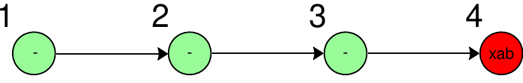
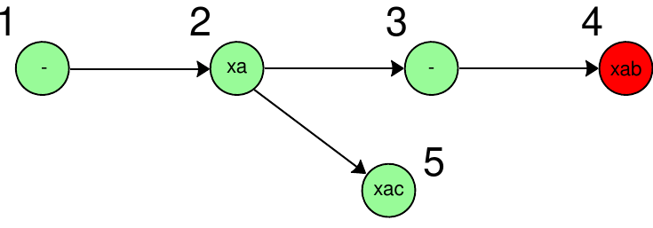
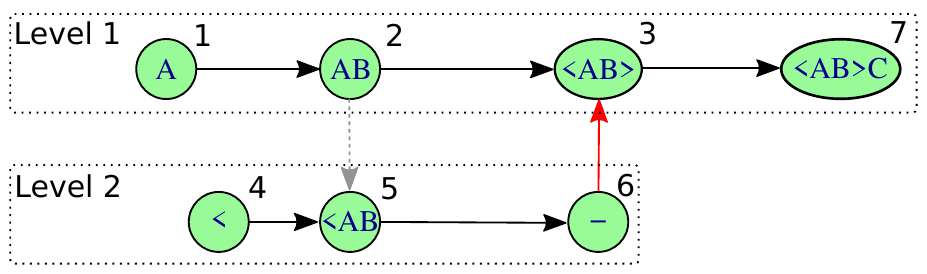

::: article
# Background

Pipeline programming is common practice in the R community, with
[*magrittr*](https://CRAN.R-project.org/package=magrittr),
[*pipeR*](https://CRAN.R-project.org/package=pipeR), and
[*wrapr*](https://CRAN.R-project.org/package=wrapr) packages offering
infix pipe operators [@magrittr2014; @pipeR2016; @mount2018dot]. The
value on the left of the pipe operator is passed as the first argument
to the right-hand function. This style of programming simplifies code by
removing the need to name intermediate values or write deeply nested
function calls. For example, using the
[*magrittr*](https://CRAN.R-project.org/package=magrittr) pipe operator,
`%>%`, the expression `x %>% f %>% g` is equivalent to `g(f(x))`. These
pipelines are equivalent to applied function compositions and termed
function *composition* pipelines.

A monadic [@wadler1990comprehending] pipeline extends composition
pipelines by allowing *context* to be threaded through the pipeline.
Each function call in the pipeline produces both a new value (assuming
successful evaluation) and a computational context surrounding that new
value. This new value and context is then merged with the context of the
prior node in the pipeline, allowing past context to be stored. In this
way, monadic pipelines can be automatically self-describing by returning
both the result and a description of the process that created it.

In this paper, we present
[*rmonad*](https://CRAN.R-project.org/package=rmonad), the first
explicitly monadic pipeline program developed for the R language.
[*rmonad*](https://CRAN.R-project.org/package=rmonad) captures the
history of a pipeline as a graph of all past operations. Each node in
the graph represents either an input or a function. These nodes store
the source code, documentation, any raised messages/warnings/errors,
benchmarking info, and arbitrary additional metadata.
[*rmonad*](https://CRAN.R-project.org/package=rmonad) also generalizes
the standard linear pipeline to a directed graph with support for
branching and looping pipelines.

[*rmonad*](https://CRAN.R-project.org/package=rmonad) is one of many
graph-based workflow tools available to R programmers. The
[*drake*](https://CRAN.R-project.org/package=drake) package [@drake]
allows specification of R workflows using Make-family semantics
[@stallman2002gnu]. The R packages
[*tidycwl*](https://CRAN.R-project.org/package=tidycwl) [@tidycwl2020]
and [*sevenbridges*](https://CRAN.R-project.org/package=sevenbridges)
[@sevenbridges2020] wrap the Common Workflow Language which allows
specification of DAG-based workflows that can be easily run on
high-performance platforms. Many build systems allow execution of R code
snippets, such as Snakemake [@koster2012snakemake], Nextflow
[@di2017nextflow] and Cuneiform [@brandt2017computation]. Like these
programs, [*rmonad*](https://CRAN.R-project.org/package=rmonad)
specifies a graph of dependent operations and can handle large, complex
projects. However, [*rmonad*](https://CRAN.R-project.org/package=rmonad)
offers a lighter solution, with no dependencies outside R. In the
simplest case, [*rmonad*](https://CRAN.R-project.org/package=rmonad) has
no more syntactic complexity than a composition pipeline like
[*magrittr*](https://CRAN.R-project.org/package=magrittr).

Since [*rmonad*](https://CRAN.R-project.org/package=rmonad) can annotate
and summarize intermediate data, it can serve as a provenance tracking
tool. Provenance tracking of data generated through a pipeline is
critical for research reproducibility [@Gentleman2007StatisticalAA]. For
example, the provenance manager VisTrails builds directed acyclic graphs
(DAG) of workflows and stores intermediate data objects as external XML
files in an external database [@Silva2010ProvenanceEnabledDE]. It also
provides a visualization of the workflow (or provenance trail) as it is
being run. By visualizing the workflow in a DAG-like structure, the user
can perform exploratory analysis and retooling on the fly. The R
provenance tracking packages
[*archivist*](https://CRAN.R-project.org/package=archivist)
[@przemyslaw2017archivist],
[*trackr*](https://CRAN.R-project.org/package=trackr)
[@becker2019trackr], and
[*adapr*](https://CRAN.R-project.org/package=adapr) [@Gelfond2018ASF]
store manual annotations (metadata) of data objects as hooks to an
external binary or JSON database.

In the following sections, we introduce the
[*rmonad*](https://CRAN.R-project.org/package=rmonad) monadic pipeline
operator, show how [*rmonad*](https://CRAN.R-project.org/package=rmonad)
generalizes linear pipelines to support branching and nesting, describe
how [*rmonad*](https://CRAN.R-project.org/package=rmonad) evaluation
allows pipeline debugging and annotation, tie these ideas together with
a case study, and provide an overview of the application of
[*rmonad*](https://CRAN.R-project.org/package=rmonad) to a large-scale
project.

# The monadic pipe operator

A pipeline consists of a series of expressions that are evaluated using
upstream data as input. The context that is passed through an
[*rmonad*](https://CRAN.R-project.org/package=rmonad) pipeline is stored
as an "Rmonad" S4 object. This object consists of a directed graph of
the relationships between nodes in the pipelines, a list containing the
information about each node (including the output if it is cached), and
a unique identifier for the head node---the node whose output will be
passed to the next operation in the pipeline. Each expression in the
pipeline is evaluated by the special
[*rmonad*](https://CRAN.R-project.org/package=rmonad) function,
`evalwrap`, that takes an R expression and returns an "Rmonad" object.
After each new expression in a pipeline is evaluated, the past "Rmonad"
object is merged with the new one (see Algorithm [1](#alg:eval)).

 eval function,
`evalwrap`. `get_meta` and `get_doc` are functions that parse the input
expression to extract the documentation string and metadata list.
`get_code_string` gets the R code of the function as a string. These
three functions rely on the metaprogramming features of R, which allow
functions to operate on the code of their inputs. The `run` function is
like the standard `eval` R function except that it captures
error/warning/message output and returns these together with the output
value as a list. `$` is used to access a value in a list. `successful`
returns TRUE if the evaluation raised no error. `size` returns the
memory footprint of an R object. `Rmonad` is a constructor for an
"Rmonad" object. In summary, `evalwrap` evaluates a function call,
captures any raised messages, records information about the function and
its output, and returns a new "Rmonad"
object.](alg/algeval.png){#alg:eval width="100%"
alt="graphic without alt text"}

The [*rmonad*](https://CRAN.R-project.org/package=rmonad) function
`evalwrap` evaluates an R expression and returns an "Rmonad" object. The
type signature of `evalwrap` is:

$$\text{evalwrap} :: R \rightarrow M\ a$$

The `evalwrap` function takes the R expression, $R$, and returns $M\ a$,
which is the "Rmonad" object $M$ wrapping the value returned from the
evaluation of $R$. On success, the returned value has type $a$. Thus,
whereas a composition pipeline would consist of chained functions of
type $a \rightarrow
b$, $b \rightarrow c$, $c \rightarrow d$, etc, an
[*rmonad*](https://CRAN.R-project.org/package=rmonad) pipeline consists
of $a \rightarrow M\ b$, $b \rightarrow M\ c$, $c \rightarrow M\ d$.

Each evaluation step in an
[*rmonad*](https://CRAN.R-project.org/package=rmonad) pipeline creates a
contextualized object. However, including the context in the output
causes a type conflict. For example, suppose there are functions $f$ and
$g$ with types ($a \rightarrow
M\ b$) and ($b \rightarrow M\ c$), respectively. Function $f$ produces
an output of type $M\ b$, but function $g$ requires an input of type
$b$. This conflict is resolved through the special evaluation performed
within the monadic pipe operator.

The monadic pipe operator, or the bind operator, has the type signature
[@wadler1990comprehending]:

$$bind\ ::
  \underbrace{m\ b}_{\text{output of $f$}} \rightarrow
  \underbrace{(b \rightarrow m\ c)}_{\text{the function $g$}} \rightarrow
  \underbrace{m\ c}_{\text{output of $g$}}$$

where $m$ is a generic monad. The function `bind` takes an input of type
$m\ b$ and the function $g$ of type ($b \rightarrow m\ c$). It returns
the output of $g$ which has type $m\ c$. Many functions of the general
type $a
\rightarrow m\ b$ can be chained together using this `bind` function.
For example, the call `bind(bind(f(x), g),h)` would chain the
contextualized results of $f$ through $g$ and then $h$. The
implementation of the bind function defines how context from $m\ b$ is
passed through the monadic chain to $m\ c$.

The simplest possible implementation of the `bind` function passes no
state and is identical to applied functional composition (e.g., as done
in [*magrittr*](https://CRAN.R-project.org/package=magrittr)):

{#alg:bind-comp width="100%"
alt="graphic without alt text"}

The monadic pipeline operator of
[*rmonad*](https://CRAN.R-project.org/package=rmonad), `%>>%`, has the
type signature:

$$\underbrace{M\ a}_{lhs} \rightarrow \underbrace{(a \rightarrow \ b)}_{rhs} \rightarrow \underbrace{M\ b}_{output}$$

`%>>%` is a binary operator where the left hand side (`lhs`) is an
"Rmonad" object ($M$) wrapping a value of type $a$. The right hand side
(`rhs`) is a normal R function that takes an input of type $a$ and, if
successful, returns a value of type $b$. If `lhs` stores a failing state
(i.e., a prior node in the pipeline raised an error), then the `rhs`
function is not evaluated and the failed state is propagated. Otherwise,
the value is extracted from `lhs` and `evalwrap` then evaluates the
`rhs` function with the `lhs` value as its first argument yielding a new
"Rmonad" object. Finally, this new object is merged with the prior,
`lhs` "Rmonad" object. Merging involves joining the node graphs of the
old and new "Rmonad" objects, setting the head of the resulting graph to
the head of the new graph, and removing the value stored in the prior
head (see Algorithm [3](#alg:bind)). The "head" of a graph is critical
for branching pipelines (see the Branching and Nesting section).

![Algorithm 3: The `%>>%` `bind` function. `lhs` and `rhs` are the left
hand side and right hand side of the binary `%>>%` operator,
respectively. `lhs` is an "Rmonad" object, which is a graph of past
operations. `head` extracts the current node in the graph that is being
acted on (the "Rmonad" object stores the index of the current head).
`failed` returns TRUE if the operation stored in its argument raised an
error. `value` returns the data stored in a node (or in the head node of
an "Rmonad" object). `evalwrap` evaluates an R function and its
arguments and returns a singleton "Rmonad" object (see Algorithm
[1](#alg:eval)). `union` merges two "Rmonad" objects, assigning the head
of the new object to the head of the second object. Here the second
"Rmonad" object is a singleton, so we are adding one node to the
function graph and making it the new head node. `set_value` sets the
value of the head node in an "Rmonad" object. `rmonad_bind` returns a
new "Rmonad" object with a new value on success and the old value on
failure.](alg/algbind.png){#alg:bind width="100%"
alt="graphic without alt text"}

The difference between `%>>%` and a true monadic `bind` operator is that
the `rhs` of a monadic bind operator is a function ($a \rightarrow M\
b$), whereas the `rhs` of `%>>%` is a normal R function. The `%>>%`
operator essentially transforms the `rhs` R function into a function
that yields the monadic object. This is carried out within the monadic
bind function through the special evaluation offered by `evalwrap`.

While the primary [*rmonad*](https://CRAN.R-project.org/package=rmonad)
operator is the monadic pipe operator, `%>>%`, several additional
operators are provided for operating on "Rmonad" objects using pipeline
syntax (listed in Table [1](#tab:operators)).

::: {#tab:operators}
  ------------------------------------------------------------------
  Operator   Description
  ---------- -------------------------------------------------------
  `%>>%`     pass `lhs` as initial argument of `rhs` function

  `%v>%`     like `%>>%` but caches the `lhs` value

  `%*>%`     pass list of arguments from `lhs` to `rhs`

  `%__%`     `rhs` starts a new chain that preserves `lhs` history

  `%||%`     use `rhs` value if `lhs` is failing

  `%|>%`     call `rhs` on `lhs` if `lhs` failed
  ------------------------------------------------------------------

  : Table 1: A partial list of the supported operators. `lhs` and `rhs`
  refer to the left-hand and right-hand sides of the given binary
  operator. `%>>%` is the primary monadic chain operator. `%v>%` is a
  variant of the monadic chain operator that always caches its input
  even on a successful run. The `%*>%` operator takes a list of "Rmonad"
  objects on the left and feeds the values of each as arguments into the
  function on the right, linking the history of each input "Rmonad"
  object to the final "Rmonad" object. This operator is important in
  building branching pipelines. The `%__%` operator is like a semicolon
  in a programming language, separating independent pipelines but
  passing on context. The `%||%` and `%|>%`, operators are used in error
  recovery.
:::

The `%>>%` operator by itself can only create linear chains of
operations. Mechanisms for lifting this limitation are introduced in the
next section.

# Branching and Nesting

In a linear pipeline, the output of each internal function is piped to
just one downstream function. In contrast,
[*rmonad*](https://CRAN.R-project.org/package=rmonad) allows branching
to be formed in one of two main ways: 1) the pipeline's head may be
reset to an internal node and the pipeline can continue growing from
there or 2) multiple pipelines may be merged.

The first branching method uses the `tag` function to attach a label to
the current head node and the `view` function to change the head node to
a previously tagged node. An example of a branched pipeline using these
function is shown in Figure [1](#fig:rmonad-branch). A node may be
associated with one or more tags.

The second branching method allows multiple pipelines to merged into
one. The most direct merge method uses the `%*>%` operator to pass the
head value from each "Rmonad" object in the left-hand side list as
arguments to the right-hand side function.
[*rmonad*](https://CRAN.R-project.org/package=rmonad) also offers a
dedicated `loop` function that takes an "Rmonad" object containing a
list of values, passes each into monadic function, and connects the
histories and final results of each pipeline into a new "Rmonad" node.

The example below demonstrates a loop where nodes where individual
elements are dynamically tagged for later access:

``` r
m <- loop(
  evalwrap(letters[1:3]),
  function(x){ x %>>% paste0("!") %>% tag(c("letters", x)) }
) %*>% paste0
get_value(m, tag="letters")
#> $`letters/c`
#> [1] "c!"
#> 
#> $`letters/b`
#> [1] "b!"
#> 
#> $`letters/a`
#> [1] "a!"
get_value(m, tag="letters/b")[[1]]
#> "b!"
```

The elements of the first argument to the `loop` function (the letters
'a', 'b', and 'c') are passed to `loop`'s second argument. The second
argument is an anonymous function that adds an exclamation mark to the
input and tags the resulting value. The tags are hierarchical, thus
`get_value(m, tag="letters")` returns all values with the initial tag
'letters'. Specific values can be accessed like files in a path (e.g.,
\"letters/b\").

Since [*rmonad*](https://CRAN.R-project.org/package=rmonad) pipelines
are branched, there is in general no single output value of the
pipeline. Rather, the data contained in the "Rmonad" object is queried
using a family of vectorized getter functions. For example, `get_value`
will return a list containing the value stored in each node (or `NULL`
if no value is stored); `get_error` returns a list of all error
messages, `get_warning` returns a list of all warnings, `get_code`
returns a list of all code strings, etc. The code below fails on the
'sqrt' call and the failing node can be found by searching for code
blocks that were not successfully executed.

``` r
m <- "a" %>>% paste("cat") %>>% sqrt
get_code(m)[!get_OK(m)]
#> [[1]]
#> [1] "sqrt"
```

<figure id="fig:rmonad-branch">
<table>
<caption> </caption>
<tbody>
<tr class="odd">
<td style="text-align: right;"><div class="sourceCode" id="cb1"><pre
class="sourceCode r"><code class="sourceCode r"><span id="cb1-1"><a href="#cb1-1" aria-hidden="true" tabindex="-1"></a><span class="st">&quot;x&quot;</span> <span class="sc">%&gt;&gt;%</span> <span class="fu">paste</span>(<span class="st">&quot;a&quot;</span>) <span class="sc">%&gt;&gt;%</span></span>
<span id="cb1-2"><a href="#cb1-2" aria-hidden="true" tabindex="-1"></a>         <span class="fu">paste</span>(<span class="st">&quot;b&quot;</span>) <span class="sc">%&gt;&gt;%</span></span>
<span id="cb1-3"><a href="#cb1-3" aria-hidden="true" tabindex="-1"></a>         log <span class="sc">%&gt;%</span> <span class="fu">plot</span>(<span class="at">label=</span><span class="st">&quot;value&quot;</span>)</span></code></pre></div></td>
</tr>
<tr class="even">
<td style="text-align: right;"></td>
</tr>
<tr class="odd">
<td style="text-align: right;"><div class="sourceCode" id="cb2"><pre
class="sourceCode r"><code class="sourceCode r"><span id="cb2-1"><a href="#cb2-1" aria-hidden="true" tabindex="-1"></a><span class="st">&quot;x&quot;</span> <span class="sc">%&gt;&gt;%</span> <span class="fu">paste</span>(<span class="st">&quot;a&quot;</span>) <span class="sc">%&gt;%</span> <span class="fu">tag</span>(<span class="st">&quot;a1&quot;</span>) <span class="sc">%&gt;&gt;%</span></span>
<span id="cb2-2"><a href="#cb2-2" aria-hidden="true" tabindex="-1"></a>         <span class="fu">paste</span>(<span class="st">&quot;b&quot;</span>) <span class="sc">%&gt;&gt;%</span></span>
<span id="cb2-3"><a href="#cb2-3" aria-hidden="true" tabindex="-1"></a>         log <span class="sc">%&gt;%</span> <span class="fu">view</span>(<span class="st">&quot;a1&quot;</span>) <span class="sc">%&gt;&gt;%</span></span>
<span id="cb2-4"><a href="#cb2-4" aria-hidden="true" tabindex="-1"></a>         <span class="fu">paste</span>(<span class="st">&quot;c&quot;</span>) <span class="sc">%&gt;%</span> <span class="fu">plot</span>(<span class="at">label=</span><span class="st">&quot;value&quot;</span>)</span></code></pre></div></td>
</tr>
<tr class="even">
<td style="text-align: right;"></td>
</tr>
</tbody>
</table>
<figcaption>Figure 1: <a
href="https://CRAN.R-project.org/package=rmonad"><em>rmonad</em></a>:
linear and branched pipelines. The <code>plot</code> functions visualize
the graph with values in nodes if the values are cached and "-"
otherwise. The layout of the plots was modified in the vector editor
Inkscape. <strong>Top:</strong> A linear <a
href="https://CRAN.R-project.org/package=rmonad"><em>rmonad</em></a>
pipeline that ends in an error. The pipeline begins at node 1 with the
value "x". This is piped into the <code>paste</code> function which
concatenates the letter "a". Since the <code>paste</code> is successful,
the result is stored in node 2 and the value in node 1 is deleted to
save memory. The value in node 2 is piped into <code>paste</code> again,
concatenating the letter "b" and storing it in node 3. The value in node
3 is piped into the <code>log</code> function, where an error is raised,
terminating this branch, and storing the final failing value, "x a b",
and the error message. The value is only stored at the end node to avoid
storing all intermediate values across a pipeline. That way, values are
stored when there are errors or where explicitly tagged by the user.
<strong>Bottom:</strong> A branched <a
href="https://CRAN.R-project.org/package=rmonad"><em>rmonad</em></a>
pipeline and its resulting graph. From node 2, the “Rmonad” object is
piped into the <code>tag</code> function which annotates the head node
(node 2) with the tag "a1" and sets a flag that ensures the value will
be cached for later use. After function 4, the “Rmonad” object is piped
into <code>view</code>, which sets the head of the graph to node 2.
Lastly, the value in node 2 is piped into the final <code>paste</code>
function that concatenates "c".</figcaption>
</figure>

In addition to branching,
[*rmonad*](https://CRAN.R-project.org/package=rmonad) allows complex
pipelines to be built from smaller nested pipelines defined in normal R
functions (see Figure [2](#fig:rmonad-nest)). When data is piped into a
function that wraps a nested
[*rmonad*](https://CRAN.R-project.org/package=rmonad) pipeline, the
input values will be linked to the nodes in the nested pipeline that use
the input. In this way,
[*rmonad*](https://CRAN.R-project.org/package=rmonad) enables multilevel
debugging. Storing the input to each failed function at each nest level
allows a programmer to step through the code in the failed node using
the input data, without having to rerun the entire pipeline.

<figure id="fig:rmonad-nest">
<table>
<caption> </caption>
<tbody>
<tr class="odd">
<td style="text-align: right;"><div class="sourceCode" id="cb1"><pre
class="sourceCode r"><code class="sourceCode r"><span id="cb1-1"><a href="#cb1-1" aria-hidden="true" tabindex="-1"></a><span class="co"># Level 2</span></span>
<span id="cb1-2"><a href="#cb1-2" aria-hidden="true" tabindex="-1"></a>f <span class="ot">&lt;-</span> <span class="cf">function</span>(x) {</span>
<span id="cb1-3"><a href="#cb1-3" aria-hidden="true" tabindex="-1"></a>  <span class="st">&quot;&lt;&quot;</span> <span class="sc">%v&gt;%</span> <span class="fu">paste</span>(x) <span class="sc">%v&gt;%</span> <span class="fu">paste</span>(<span class="st">&quot;&gt;&quot;</span>)</span>
<span id="cb1-4"><a href="#cb1-4" aria-hidden="true" tabindex="-1"></a>}</span>
<span id="cb1-5"><a href="#cb1-5" aria-hidden="true" tabindex="-1"></a><span class="co"># Level 1</span></span>
<span id="cb1-6"><a href="#cb1-6" aria-hidden="true" tabindex="-1"></a><span class="st">&quot;A&quot;</span> <span class="sc">%v&gt;%</span> <span class="fu">paste</span>(<span class="st">&quot;B&quot;</span>)</span>
<span id="cb1-7"><a href="#cb1-7" aria-hidden="true" tabindex="-1"></a>    <span class="sc">%v&gt;%</span> f</span>
<span id="cb1-8"><a href="#cb1-8" aria-hidden="true" tabindex="-1"></a>    <span class="sc">%v&gt;%</span> <span class="fu">paste</span>(<span class="st">&quot;C&quot;</span>) <span class="sc">%&gt;%</span> <span class="fu">plot</span>(<span class="at">label=</span><span class="st">&quot;value&quot;</span>)</span></code></pre></div></td>
</tr>
<tr class="even">
<td style="text-align: right;"></td>
</tr>
</tbody>
</table>
<figcaption>Figure 2: <a
href="https://CRAN.R-project.org/package=rmonad"><em>rmonad</em></a>:
complex pipelines can be built from smaller nested pipelines. Level 1 is
a pipeline where the node 3 represents the computation performed by the
pipeline in Level 2. The nodes contains values ("A", "AB", etc) if the
value is cached by <a
href="https://CRAN.R-project.org/package=rmonad"><em>rmonad</em></a> and
contains a "-" if the value is not stored. Arrows show relationships
between the nodes. A <strong>black</strong> arrow shows data being
passed directly to a new function. A <strong>Gray</strong> arrow points
from a node in a parent pipeline to a node in a child pipeline that uses
its value. The <strong>red</strong> arrow points from the terminal node
in a child pipeline to the node in the parent pipeline that stores its
result. Stepping through the pipeline: Node 1 wraps the character "A",
node 2 appends "B", and node 3 passes "AB" to the function
<code>f</code>. Next, within the scope of <code>f</code>, node 4 starts
a new pipeline with the value "&lt;", node 5 pastes "&lt;" from node 4
to the local <span class="math inline"><em>x</em></span> variable (which
is the value passed from node 2), and finally node 6 appends the closing
"&gt;" character. The function <code>f</code> returns an “Rmonad” object
to node 3. The value of node 6 is transferred to node 3 (thus node 6 is
empty, "-"). Finally, node 7 appends "C" and the pipeline finishes
successfully.</figcaption>
</figure>

# Evaluation: error handling, metadata, and post-processing

In this section, we expound on how errors are handled in
[*rmonad*](https://CRAN.R-project.org/package=rmonad), how nodes are
documented and annotated, and how post-processing functionality is added
to specify log messages, summarize node output and clean up raised
messages.

## Exception handling and tracebacks

The core functionality of
[*rmonad*](https://CRAN.R-project.org/package=rmonad) is the stateful
data piping provided by the monadic operator `%>>%`. Linear chains of
operations can be constructed with this operator, where each successful
node stores information about the function and results. In the case of
an error, [*rmonad*](https://CRAN.R-project.org/package=rmonad) provides
access to the traceback and to the inputs to each failing function.
Knowing the error messages and the function inputs allows the programmer
to step through the failed function and easily diagnose the problem. All
information is stored within the "Rmonad" object, rather than in the
ephemeral state of an R session.

Here is a concrete example:

``` r
m <- "a cat" %>>% log %>>% sqrt
get_error(m)
#> [[1]]
#> character(0)
#> 
#> [[2]]
#> [1] "non-numeric argument to mathematical function"
get_code(m)[[2]]
#> "log"
get_value(m)[[2]]
#> [1] "a cat"
```

Here an illegal value is passed into the natural log function.
[*rmonad*](https://CRAN.R-project.org/package=rmonad) catches this error
and saves the first failing input and error message. The node index and
error message of the failing function can be found with `get_error(m)`,
the failing expression can be accessed with `get_code`, and the inputs
to the failing function can be retrieved with `get_value`. This approach
scales cleanly to large and deeply nested pipelines.

## Parsing code strings, docstrings and metadata lists

[*rmonad*](https://CRAN.R-project.org/package=rmonad) leverages R
non-standard evaluation to parse the abstract syntax tree of pipeline
functions at runtime, prior to evaluation of the functions.
[*rmonad*](https://CRAN.R-project.org/package=rmonad) extracts 1) the
function's code as a string, 2) an optional documentation string, and 3)
an optional list of metadata. All three items are stored in the "Rmonad"
node. For example:

``` r
foo <- function(x){
  "This is a docstring"
  list(sysinfo = sessionInfo())
  return(x)
}
```

The first two lines in the function body are the docstring and metadata
list, respectively. Each must 1) be of the appropriate type (string and
list, respectively), 2) not be assigned to a variable, and 3) not be the
final line in the function body. Thus `foo` is a legal R function that
can be used naturally outside of the
[*rmonad*](https://CRAN.R-project.org/package=rmonad) context. The
docstring and metadata would be "dead" lines of code that are evaluated
but that are not assigned to any variable or returned. When
[*rmonad*](https://CRAN.R-project.org/package=rmonad) parses the
function before evaluation, the first two lines will be removed and
stored, yielding the following function for evaluation:

``` r
function(x){
  return(x)
}
```

The docstring and the function code are stored as simple strings. The
metadata list is evaluated within the function environment, giving it
access to function input, and then stored.

The metadata is any list associated with a node. It can be used to store
static data such as the author's name, a version for the function,
arbitrary notes. It can also store report generation parameters (like
code chunks in [*knitr*](https://CRAN.R-project.org/package=knitr))
[@knitr]. Because the list is evaluated, its contents are dynamic,
allowing, for example, session info to be stored or
[*knitr*](https://CRAN.R-project.org/package=knitr) parameters to be a
function of the input. Whereas
[*knitr*](https://CRAN.R-project.org/package=knitr) nests code chunks
and their parameters in a text document,
[*rmonad*](https://CRAN.R-project.org/package=rmonad) nests text and
parameters within the code.

The metadata can be modified freely even *after* the pipeline is run, to
enable the user to store notes that are a function of the pipeline
results, as well as personal annotations, reminders, or comments on the
results.

## Post-processing functions: formatting, summarizing, and logging

A built-in use of the metadata is to add formatters, summarizers, and
loggers, which are executed automatically after a node is run. For
example, a pipeline developer might write the following wrapper around a
base 10 log function:

``` r
fancy_log10 <- function(x){
  list(
    format_warnings = function(x, xs) {
      sprintf("%s NaNs produced", sum(is.na(x)))
    },
    format_log = function(x, passing) {
      if(passing){
        cat("pass\n")
      } else {
        cat("fail\n")
      }
    },
    summarize = list(len = length)
  )
  log10(x)
}
```

When run, the captured warnings are processed by `format_warnings` and
log messages by `format_log`, with the following result:

``` r
"a cat" %>>% fancy_log10 -> m
#> fail
c(-2,-1,0,1,2) %>>% fancy_log10 -> m
#> pass 
get_warnings(m)
#> [[1]]
#> character(0)
#>
#> [[2]]
#> [1] "2 NaNs produced"
> get_summary(m)[[2]]$len
#> 5
```

In the first case, an illegal value is passed to the `fancy_log10`
function. This leads to a failure in the second node, and the logger
prints "fail". In the second case, the user passes the integers between
-2 and 2, storing the result in `m`. Since these are legal values (from
R's perspective), the logger prints the message "pass" after evaluation.
When the returned object is printed, the post-processed warning message
"2 NaNs produced" is shown. The result of the summarizing function is
accessed through the `get_summary` function.

# Case Study: the Iris data

As an example of a simple branching
[*rmonad*](https://CRAN.R-project.org/package=rmonad) pipeline with
error, warning and run time handling we analyzed the Iris dataset
[@anderson1936species; @fisher1936use]. The Iris dataset is often used
for case studies of statistics and machine learning workflows, and
consists of features of three species of flowers: *Iris setosa*,
*Iris virginia*, and *Iris versicolor*. Among these features is petal
length. We used three statistical methods, (1) ANOVA, (2)
Kruskal-Wallis, and (3) t-test, to determine if petal length is
significantly different across the three *Iris* species. Some
statistical methods are not appropriate for this dataset without data
pre-processing. This case study provides an example of running multiple
methods using a branching
[*rmonad*](https://CRAN.R-project.org/package=rmonad) pipeline, while
comparing the output and running times of each method.

Normally, a programmer would run the three methods separately using an R
script similar to the following:

``` r
# === Load data
data(iris)

# === 3 Statistical Tests (run one at a time)
# (1) Anova
res.aov <- aov(Petal.Length ~ Species, data = iris)
summary(res.aov)

# (2) Kruskal-Wallis
res.kr <- kruskal.test(Petal.Length ~ Species, data = iris)
res.kr

# (3) T-Test
t.test(Petal.Length~Species, data=iris)
```

Using [*rmonad*](https://CRAN.R-project.org/package=rmonad) tags, data
can be branched out to encompass the three statistical tests. Here, the
R variable $m$ stores the output "Rmonad" S4 object. We must initially
tag the branch point node (in this case, the original Iris dataset).
Since we gave the first node the tag ("indata"), its value will be
cached and can be accessed with the command
`get_value(m, tag="indata")`. From here, we can access and pipe (`%>>%`)
the viewed "indata" tag into the different statistical tests, as
scripted below and visualized in **Figure 3**.

``` r
# === rmonad (run together)
m <- {
  "iris dataset"
  evalwrap(iris, tag="indata")
} %>>% {
  "anova"
  res.aov <- aov(Petal.Length ~ Species, data = .)
  summary(res.aov)
} 

m <- {
  view(m, "indata")
} %>>% {
  "Kruskal-Wallis"
  res.kr <- kruskal.test(Petal.Length ~ Species, data = iris)
  res.kr
}

m <- {
  view(m, "indata")
} %>>% {
  "t-test"
  t.test(Petal.Length~Species, data=iris)
}
```

The above code could have been chained together using
`%>% get_value(tag="indata") %>%` commands, but instead was separately
added to the $m$ rmonad object for ease of reading. From the $m$ rmonad
objects, we can plot the pipeline. In the following command we label the
nodes by node id, documentation, running time, and any errors if they
exists.

``` r
plot(m, label = function(m){paste(get_id(m),
                                  get_doc(m), 
                                  get_time(m),
                                  gsub("character\\(0\\)", "", get_error(m)), 
                                  sep=":")})
```


for three statistical tests. The Iris dataset is piped to (1) ANOVA, (2)
Kruskul-Wallis, and (3) t-test. Node color reflects whether the test ran
(green) or threw an error (red). Time in seconds is shown next to the
test name. Errors are annotated on the node. Notice how t-test has the
error: \"grouping factor must have exactly 2 levels\". Of the two tests
without errors, ANOVA ran slightly slower than
Kruskal-Wallis.](Images/rmonad_threetests.png){#fig:rmonad-irispipeline
width="100%" alt="graphic without alt text"}

In Figure [3](#fig:rmonad-irispipeline), the center node is the iris
dataset and has three arrows going outwards toward one red and two green
nodes. Of those, the red node near the top represents the t-test and
shows the expected error "grouping factor must have exactly 2 levels".
Since we are testing the petal length among the three species, this
error is expected. Any errors of the pipeline can also be obtained in a
table:

``` r
missues(m)
#>   id  type                                      issue
#> 1  4 error grouping factor must have exactly 2 levels
```

Going clockwise, ANOVA and Kruskal-Wallis are represented by nodes 2 and
3. The green nodes indicate that both ran although their running times
were different. From their node labels, Kruskal-Wallis ran in 0.001 ms,
slightly faster than ANOVA (0.002). Also note that green nodes only
indicate that the method ran successfully, not the results of that
method or statistical significance. The results of the ANOVA and
Kruskal-Wallis test can be pulled out of the pipeline using their Node
ID number and the following commands.

``` r
> id=c(2,3)           # place id(s) of end result(s) here
> get_value(m)[id]
#> [[1]]
#>              Df Sum Sq Mean Sq F value Pr(>F)    
#> Species       2  437.1  218.55    1180 <2e-16 ***
#> Residuals   147   27.2    0.19                   
#> ---
#> Signif. codes:  0 ‘***’ 0.001 ‘**’ 0.01 ‘*’ 0.05 ‘.’ 0.1 ‘ ’ 1
#> 
#> [[2]]
#> 	Kruskal-Wallis rank sum test
#> 
#> data:  Petal.Length by Species
#> Kruskal-Wallis chi-squared = 130.41, df = 2, p-value < 2.2e-16
```

Both tests agree that there is a significant difference between
`Petal.Length` across the three Iris species. ANOVA ran on the dataset,
which means that petal length follows a normal distribution within each
species. Kruskal-Wallis does not assume a normal distribution. The
analyst can decide which method to use; in this case the conclusion is
the same. Figure [3](#fig:rmonad-irispipeline) is an example of a
branched [*rmonad*](https://CRAN.R-project.org/package=rmonad) pipeline
comparing three different statistical methods applied to the iris
dataset to test a hypothesis.

# [*rmonad*](https://CRAN.R-project.org/package=rmonad) in the wild: a comparative genomics case study

An example of a large and complex pipeline that uses
[*rmonad*](https://CRAN.R-project.org/package=rmonad) is the orphan gene
classification R pipeline, `fagin` [@arendsee2019fagin] (Figure
[4](#fig:rmonad-fagin)). This pipeline compares genes from one species
of interest (the focal species) to genomes of several related species.
The first step in the pipeline is to store the user's session
information, which can be used in debugging if needed. Next, the
pipeline loops across each species, where, for each species, genomes and
annotation data are loaded and validated. Then secondary data (e.g.,
protein sequences) are derived, and diagnostic summaries are produced
and stored. Next, each of the orphan genes in the focal species is
compared to each of the related species genomes to create 12 features
that are used to classify potential evolutionary relatives of each the
focal gene in the target species. Finally, all data for each focal gene
is compiled into a description.

The output of this pipeline is a single "Rmonad" object. Further
analysis of the pipeline entails a series of queries against this
returned object. Warnings and messages are tabulated into an HTML
report. Tagged summary data is extracted and used to build diagnostic
figures. The primary results are extracted as tabular data and
visualized in the final report. Issues with a pipeline can be identified
by searching through the raised warnings stored in the "Rmonad" object.
Debugging consists of identifying the node of failure, extracting the
stored inputs to the failing node, and then stepping through the failing
code.

 can
handle large projects. Here,
[*rmonad*](https://CRAN.R-project.org/package=rmonad) analysis of the
`fagin` pipeline is shown. Green nodes represent passing; orange nodes
raise warnings. The four symmetric subtrees on the right represent a
loop that loads and validates the input data for four plant species. The
two sets of three symmetric subtrees on the left are loops comparing
each of the four species (*A. thaliana*) to the other
three.](Images/rmonad_fagin.png){#fig:rmonad-fagin width="100%"
alt="graphic without alt text"}

# Conclusion

We implemented a monadic pipeline in R via the
[*rmonad*](https://CRAN.R-project.org/package=rmonad) package.
[*rmonad*](https://CRAN.R-project.org/package=rmonad) provides an
infrastructure for data analysis and report generation.
[*rmonad*](https://CRAN.R-project.org/package=rmonad) stores pipeline
results and metadata that can be easily explored interactively and
collated into reports using tools such as the literate programming
package [*knitr*](https://CRAN.R-project.org/package=knitr) [@knitr] or
the HTML report generator
[*Nozzle.R1*](https://CRAN.R-project.org/package=Nozzle.R1)
[@gehlenborg2013nozzle].

[*rmonad*](https://CRAN.R-project.org/package=rmonad) integrates a
simple profiler into the workflows by automatically capturing the
runtime and memory usage of each node. This feature makes it easier for
the pipeline developer to identify bottlenecks in the code or potential
culprits of memory overflow. Often, a coder must add benchmarking code
to key locations in a pipeline.
[*rmonad*](https://CRAN.R-project.org/package=rmonad) has *built-in*
benchmarking, such that all locations in the pipeline are automatically
tested and performance can be checked post-run.

[*rmonad*](https://CRAN.R-project.org/package=rmonad) provides a
powerful tool for creating and resolving issue reports. If an
[*rmonad*](https://CRAN.R-project.org/package=rmonad) pipeline fails,
the resulting object will store all failing functions, their raised
error/warning messages and also their inputs. This object can be used to
find the error messages, load all inputs to the failing function, and
proceed to step through the code until the bug is found. If the user
prepends a node that stores the local session data (e.g.,
`sessionInfo()`` %__% ...`), the debugger gains access to the state of
the user's machine (an often-requested item in a bug report). An
"Rmonad" object with session info attached contains everything needed to
debug the issue. This streamlines issue resolution by improving
automation and simplifying submission.

Performance has not been a focus of
[*rmonad*](https://CRAN.R-project.org/package=rmonad) up to this point.
The package currently lacks support for the re-use of cached values when
pipelines are re-run. Also each evaluation step has a high overhead cost
relative to lighter pipeline tools like
[*magrittr*](https://CRAN.R-project.org/package=magrittr).
[*rmonad*](https://CRAN.R-project.org/package=rmonad) pipelines tend to
be memory intensive, since they store many intermediate results and
metadata in the "Rmonad" objects. Addressing these performance issues is
a major goal for future work.

In summary, [*rmonad*](https://CRAN.R-project.org/package=rmonad)
integrates the concepts of a pipeline, a build system, a data structure,
and an low-level report-generating engine. An
[*rmonad*](https://CRAN.R-project.org/package=rmonad) project consists
of incremental piped operations (like a pipeline program), supports
complex branching projects (like a build system), and produces a data
structure that can be computed on to generate dynamic reports.

# Availability

[*rmonad*](https://CRAN.R-project.org/package=rmonad) is published under
the GPL-3 license and is available on the Comprehensive R Archive
Network (CRAN) and on GitHub at <https://github.com/arendsee/rmonad>.
Systematic documentation of the features with simple examples can be
found in the vignettes, available through CRAN.

# Funding

This material is based upon work supported by the National Science
Foundation under Grant No. IOS 1546858.
:::
