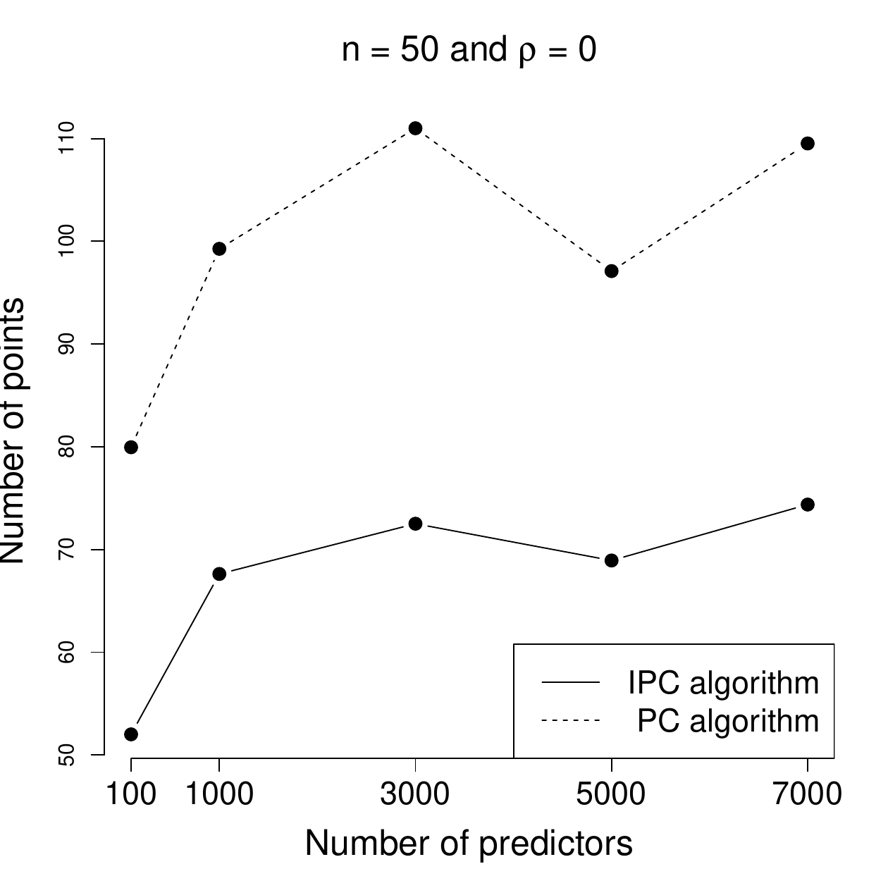
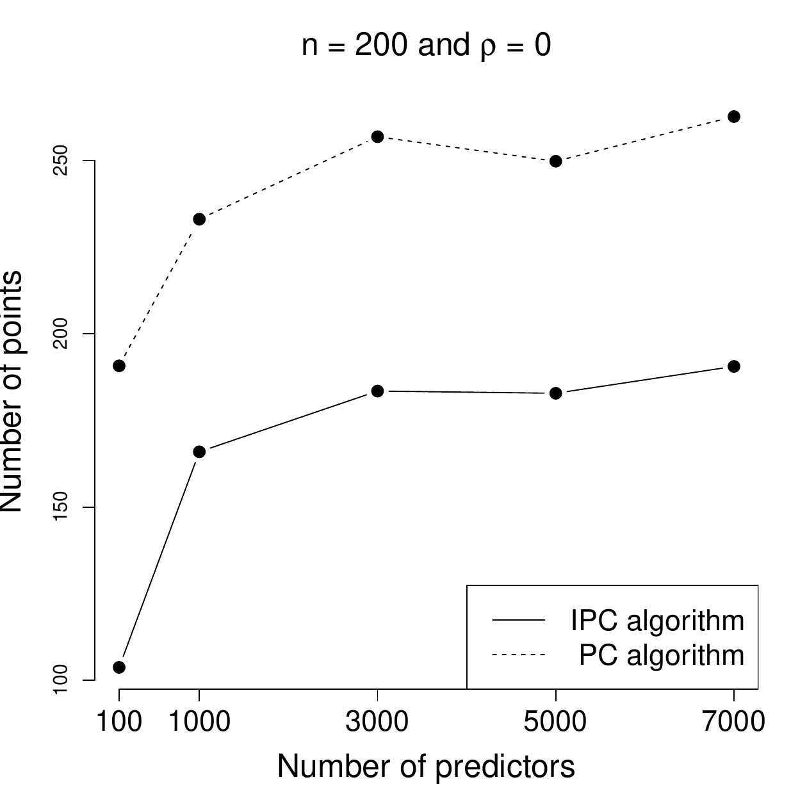
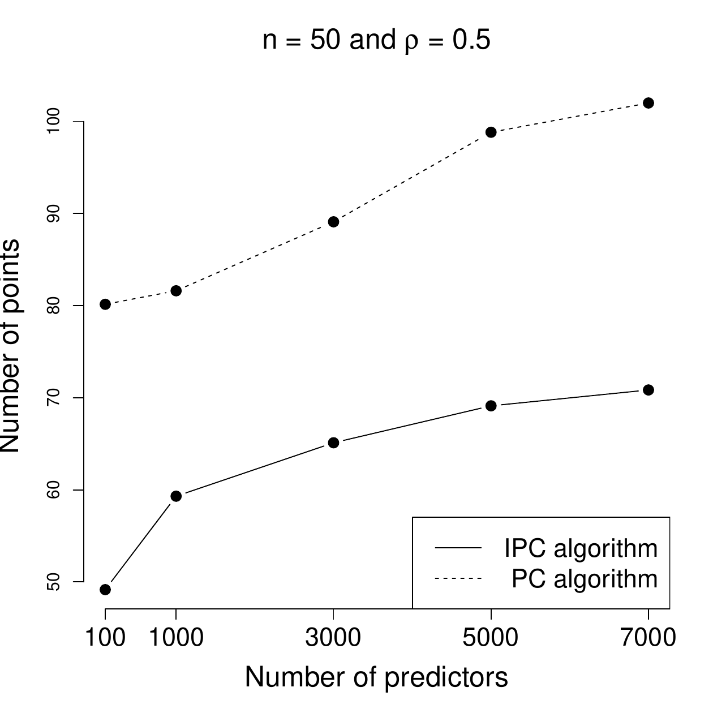
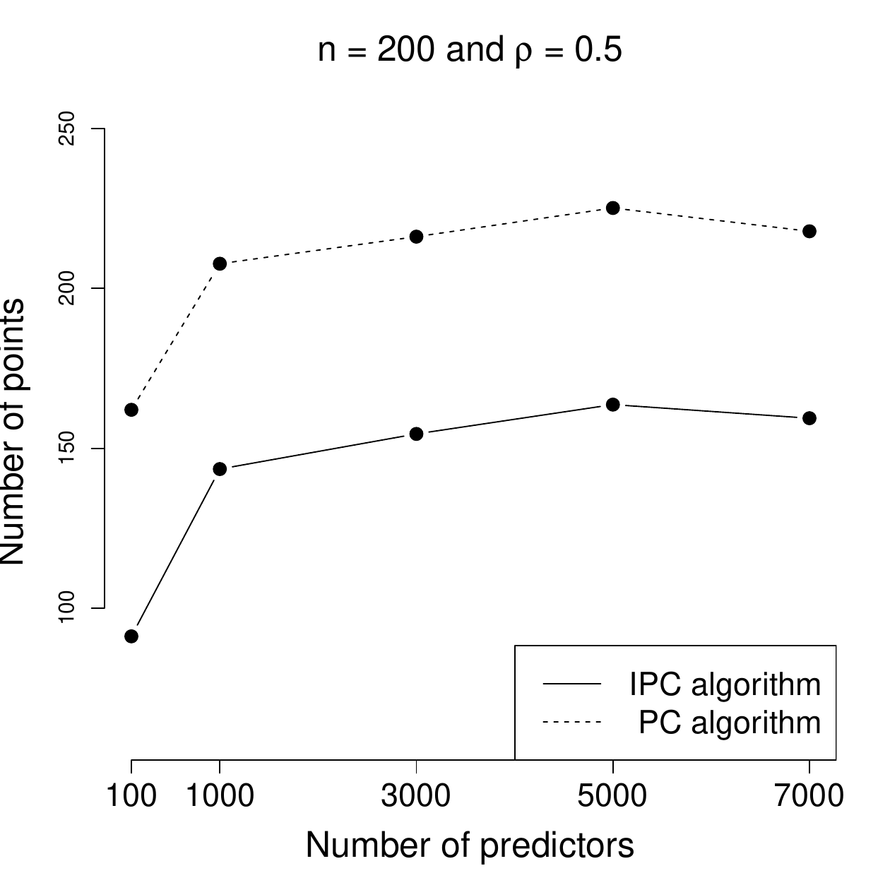

::: article
# Introduction {#sec:intro}

High-dimensional inference problems are studies where the number of
predictors $p$ for some response variable is larger than the sample size
$n$. Modern statistical methods developed to study such high-dimensional
data are usually based on combining the objective function with a
penalty function (i) to calculate a solution curve embedded in the
parameter space and then (ii) to find a point on that curve that
represents the best compromise between sparsity and predictive behaviour
of the model. The recent statistical literature has a great number of
contributions devoted to this problem, such as the $\ell_1$-penalty
function [@tib96], the SCAD method [@fan01] and the Dantzig selector
[@cand07].

[@Augug13] proposed a new approach based on the differential geometrical
representation of the likelihood, in particular for a generalized linear
model (GLM). The method does not require an explicit penalty function
and is called differential geometric LARS (dgLARS) because it
generalizes the geometrical ideas on which the least angle regression
[@efron04] is based. [@pazira] extended the dgLARS method to
high-dimensional GLMs with exponential dispersion models and arbitrary
link functions. In the same paper, the authors repurposed the classic
estimation of the dispersion parameter in a high-dimensional setting and
also proposed a new, more efficient estimatator. [@pazira_2] extended
the dgLARS method to sparse inference in relative risk regression
models.

From a computational point of view, the main problem of the dgLARS
method is related to the standard predictor-corrector (PC) algorithm
developed by [@Augug13] to compute the implicitly defined solution path.
The PC algorithm becomes computationally intractable when working with
thousands of variables because in the prediction step, the number of
arithmetic operations needed to compute the Euler predictor scales as
the cube of the number of variables. This leads to a cubic increase in
the run time needed for computing the solution curve.

In this paper we briefly explain an improved version of the PC
algorithm, proposed in [@pazira] and [@pazira_3], simply called the
improved PC (IPC) algorithm. The IPC algorithm is able to calculate the
solution path in fewer, but more relevant points, greatly reducing the
computational burden. In addition, we use a much more efficient cyclic
coordinate descend (CCD) algorithm [@Augug12] to calculate a rough
dgLARS solution curve for ultra high-dimensional data. In this paper, we
focus on the behaviour of the IPC algorithm. The new version of the
R-package [*dglars*](https://CRAN.R-project.org/package=dglars) is
implemented with both the CCD and IPC algorithms [@Augug14b]. The user
can also opt to use the old PC algorithm. The package is available on
the Comprehensive R Archive Network (CRAN) at
<http://CRAN.R-project.org/package=dglars>.

The remaining of this paper is organized as follows. Firstly, we briefly
review the differential geometry underlying the dgLARS method and
briefly explain the dispersion parameter estimation methods. Next, the
new functions implemented in the updated version of the dglars package
are described and shown that they can be used to estimate the dispersion
parameter. Then, various simulation studies are performed to evaluate
the performance and run times of the proposed estimation algorithms.
Finally, we use the functions implemented in the
[*dglars*](https://CRAN.R-project.org/package=dglars) package to
illustrate its use in an example data set.

# Methodological Background {#sec:metback}

In this section we describe very briefly the dgLARS method and the
dispersion parameter estimation methods. The interested reader is
referred to [@Augug14a] and [@pazira]. In general, the aim of the dgLARS
method is to define a continuous model path that attains the highest
likelihood with the fewest number of variables.

## Geometric foundation and formal definition {#subsec:dglarsmet}

Let $Y$ be a scalar random variable with probability density function
belonging to the exponential family
$p(y; \theta,\phi)=\exp\{(y\theta-b(\theta))/a(\phi)+c(y, \phi)\}$,
where $\theta \in {\Theta} \subseteq \mathcal{R}$ is called canonical
parameter, $\phi \in {\Phi} \subseteq \mathcal{R}^+$ is called
dispersion parameter and $a(\cdot)$, $b(\cdot)$ and $c(\cdot,\cdot)$ are
specific given functions. We shall assume that $\Theta$ is an open set.
The expected value of $Y$ is related to the canonical parameter by the
mean value mapping, namely
$\text{E}(Y) = \mu = \tau(\theta) = \partial b(\theta)/\partial \theta$,
where $\tau:int(\Theta)\rightarrow\Omega$. Similarly, the variance of
$Y$ is related to its expected value by the identity
$\text{Var}(Y) = a(\phi)\text{V}(\mu)$, where $\text{V}(\mu)$ is the
variance function. Since $\mu$ is a reparameterization of the model, in
the following paper we denote by $p(y; \mu, \phi)$ the probability
density function of $Y$. Let $\mathbf{X}$ be a $p$-dimensional vector of
random predictors, a GLM is based on the assumption that the conditional
expected value of $Y$ given $\mathbf{X}$ is specified by the identity
$$g(\text{E}(Y|\mathbf{X}))=\beta_0 +\sum_{m=1}^{p} x_m \, \beta_m = \mathbf x^\top\mathbf\beta,$$
where, with a little abuse of notation,
$\mathbf x = (1, x_1, \ldots, x_p)^\top$ and $g(\cdot)$ is called link
function. For notation purposes, it is more convenient to denote
$g^{-1} (\mathbf x^\top\mathbf\beta)$ as $\mu(\mathbf\beta)$.

When we work with $n$ independent and identically distributed copies of
the pair $(Y, \mathbf{X})$, the marginal distribution of the random
vector $\mathbf{Y}=(Y_1,\ldots,Y_n)^\top$ is an element of the set
$\mathcal{S} = \left\{p(\mathbf{y};\boldsymbol{\mu},\phi) = \right.$
$\left.  \prod_{i=1}^{n} p(y_i;\mu_i,\phi) : \boldsymbol{\mu} \in \Omega^n , \phi \in \mathcal{R}^+ \right\}$,
which is a minimal and regular exponential family of order $n$ and can
be treated as a differential manifold in which $\boldsymbol{\mu}$ is a
coordinate system [@Amari85]. At each point of $\mathcal S$ we can
attach a tangent space, denoted by $T_{p(\boldsymbol{\mu})}\mathcal{S}$,
defined as the as the linear vector space spanned by the $n$ score
functions
$\partial_i \ell(\boldsymbol{\mu},\phi;\mathbf{Y}) = \partial\log p(\mathbf{Y}; \boldsymbol{\mu},\phi)/\partial{\mu}_i$.
As suggested in [@BurbeaEtAl_JMA_82], each tangent space can be equipped
with an inner product: given two tangent vectors belonging to
$T_{\mathbf{\mu}}\mathcal{S}$, say
$v = \sum_{i=1}^n v_i\partial_i \ell(\boldsymbol{\mu},\phi;\mathbf{Y})$
and
$w = \sum_{i=1}^n w_i\partial_i \ell(\boldsymbol{\mu},\phi;\mathbf{Y})$,
their inner product is defined to be:
$$\label{eqn:inner}
\langle v; w \rangle_{\mathbf{\mu}} = E_{\mathbf\mu}(v\cdot w) = \sum_{i=1}^n v_ iw_i E(\{\partial_i \ell(\boldsymbol{\mu},\phi;\mathbf{Y})\}^2) = \sum_{i=1}^n\frac{v_iw_i}{a(\phi) V(\mu_i)}.   (\#eq:eqninner)$$

In order to study the geometrical structure of a GLM, we shall assume
that
$\boldsymbol{\beta} \rightarrow \{ g^{-1}( \mathbf{x}_1^\top\boldsymbol{\beta}),\ldots,$
$g^{-1}( \mathbf{x}_n^\top\boldsymbol{\beta}) \}^\top = \boldsymbol{\mu}(\boldsymbol{\beta})$
is an embedding, then the set
$\mathcal{M}=\{p(\mathbf{y}; \boldsymbol{\mu}(\boldsymbol{\beta}),\phi) \in \mathcal{S} : \boldsymbol{\beta} \in \mathcal{R}^{p+1}, \, \phi \in \mathcal{R}^+ \}
\label{eq:M}$ is a $p+1$-dimensional submanifold of $\mathcal{S}$. As
previously done, the tangent space of $\mathcal{M}$ at the point
$p(\mathbf{y}; \boldsymbol{\mu}(\boldsymbol{\beta}),\phi)$, denoted by
$T_{\boldsymbol{\mu}(\boldsymbol{\beta})}\mathcal{M}$, is the linear
vector space spanned by the $p+1$ score functions
$\partial_h \ell(\boldsymbol{\beta},\phi;\mathbf{Y}) = \partial\log p(\mathbf{Y}; \boldsymbol{\mu}(\boldsymbol{\beta}),\phi)/\partial{\beta}_h$.
Since $T_{\boldsymbol{\mu}(\boldsymbol{\beta})}\mathcal{M}$ is a linear
subspace of $T_{\boldsymbol{\mu}(\boldsymbol{\beta})}\mathcal{S}$, the
inner product (\@ref(eq:eqninner)) can also be used to define the inner
product between two tangent vectors belonging to
$T_{\boldsymbol{\mu}(\boldsymbol{\beta})}\mathcal{M}$. For more details
see [@Augug13] and [@pazira_0].

The dgLARS estimator is based on a differential geometric
characterization of the Rao score test statistic, obtained using the
inner product between the bases of the tangent space
$T_{\boldsymbol{\mu}(\boldsymbol{\beta})}\mathcal{M}$ and the tangent
residual vector
$\mathbf{r}(\boldsymbol{\beta}, \phi, \mathbf{y}; \mathbf{Y}) = \sum_{i=1}^{n} r_{\boldsymbol{\beta},i} \, \partial_i \ell(\boldsymbol{\beta},\phi; \mathbf{Y})$,
where $r_{\boldsymbol{\beta},i}=y_i-\mu_i(\boldsymbol{\beta})$.
Formally, we have the following identity:
$$\begin{aligned}
\partial_h \ell(\boldsymbol{\beta}, \phi; \mathbf{Y}) &= \langle \partial_h \ell(\boldsymbol{\beta}, \phi; \mathbf{Y}) ; \mathbf{r}(\boldsymbol{\beta}, \phi, \mathbf{y}; \mathbf{Y}) \rangle_{\boldsymbol{\mu}(\boldsymbol{\beta})}  \nonumber \\
&= \cos (\rho_h(\boldsymbol{\beta}, \phi)) \cdot ||\mathbf{r}(\boldsymbol{\beta}, \phi, \mathbf{y}; \mathbf{Y}) ||_{\boldsymbol{\mu}(\boldsymbol{\beta})} \cdot \mathcal{I}_{h}^{1/2}(\boldsymbol{\beta}, \phi), 
\label{eq:cos}
\end{aligned}   (\#eq:cos)$$
where $\mathcal{I}_{h}(\boldsymbol{\beta}, \phi)$ is the Fisher
information for $\beta_h$, and $\rho_h(\boldsymbol{\beta}, \phi)$ is a
generalization of the Euclidean notion of angle between the
$h^{\text{th}}$ column of the design matrix and the residual vector
$(r_{\boldsymbol{\beta},i})_{i=\{1, 2,\ldots, n\}}$. Importantly,
\@ref(eq:cos) shows that the gradient of the log-likelihood function
does not generalize the equiangularity condition proposed in [@efron04]
to define the LARS algorithm, since the latter does not consider the
variation related to $\mathcal{I}_{h}^{1/2}(\boldsymbol{\beta}, \phi)$,
which in the case of a GLM is typically not constant. Using the previous
identity, one can see that the signed Rao score test statistic, denoted
by $r_{h}(\boldsymbol{\beta}, \phi)$, can be characterized as follows:
$$\begin{aligned}
r_{h}(\boldsymbol{\beta}, \phi) &= \mathcal{I}^{-1/2}_{h}(\boldsymbol{\beta}, \phi) \cdot \partial_h \ell(\boldsymbol{\beta}, \phi; \mathbf{Y})   \nonumber \\
&=  \cos(\rho_h(\boldsymbol\beta, \phi)) \cdot \|\mathbf{r}(\boldsymbol{\beta}, \phi, \mathbf{y}; \mathbf{Y}) \|_{\boldsymbol{\mu}(\boldsymbol{\beta})}.
\label{eq:rao}
\end{aligned}   (\#eq:rao)$$
From \@ref(eq:rao) we shall say that two given predictors, say $h$ and
$k$, satisfy the generalized equiangularity condition at the point
$(\boldsymbol{\beta}, \phi)$ when
$|r_{h}(\boldsymbol{\beta}, \phi)|=|r_{k}(\boldsymbol{\beta}, \phi)|$.
Inside the dgLARS theory, the generalized equiangularity condition is
used to identify the predictors that are included in the active set.

As shown in [@pazira], the Rao score test statistic can be written as
$$r_{h}(\boldsymbol{\beta}, \phi) = (a(\phi))^{-1/2}\frac{\sum_{i=1}^n\partial_h\mu_i(\mathbf\beta)V^{-1}(\mu_i(\mathbf\beta))(y_i - \mu_i(\mathbf\beta))}{\sqrt{\sum_{i=1}^n V^{-1}(\mu_i(\mathbf\beta))\partial_h\mu_i(\mathbf\beta))}} = (a(\phi))^{-1/2} r_h(\mathbf\beta),$$
then the equiangularity condition and the dgLARS method can be defined
using only the function $r_h(\mathbf\beta)$.

Formally, the dgLARS is a method for constructing a path of solutions,
indexed by a positive parameter $\gamma$, where the nonzero estimates of
each solution can be defined as follows. For any dataset there exists
with probability one a finite decreasing sequence of transitions points,
denoted by $\{\gamma^{(j)}\}$. Such that for any
$\gamma\in (\gamma^{(j)}; \gamma^{(j-1)})$ the subvector of non-zero
estimates, denoted by $\hat{\mathbf\beta}_\mathcal{A}(\gamma)$, is
defined as the solution to the following non-linear equations
$$\label{eq:system_dglars}
r_h(\hat{\mathbf\beta}_\mathcal{A}(\gamma)) -  s_h \gamma = 0, \quad\forall\,h\in\mathcal{A},   (\#eq:system-dglars)$$
where $\mathcal{A}= \{h\,:\, \hat\beta_{h}(\gamma)\neq0\}$ is called
active set and
$s_h = \text{sign}(r_h(\hat{\mathbf\beta}_\mathcal{A}(\gamma)))$.
Furthermore, for any $k\notin\mathcal{A}$ we have that
$|r_k(\hat{\mathbf\beta}(\gamma))| < \gamma$.

At each transition point we have a change in the active set. We shall
say that $\gamma^{(j)}$ is an inclusion transition point if there exists
$k\notin\mathcal{A}$ such that the equiangularity condition is
satisfied, which can also be written as
$$\label{eq:gin}
|r_k(\hat{\mathbf\beta}_\mathcal{A}(\gamma^{(j)}))| = \gamma^{(j)}.   (\#eq:gin)$$
In this case the active set is updated adding the index $k$, i.e. the
predictor $X_k$ is included in the current model. As explained in
[@Augug13], a generalization of the lasso estimator can be obtained
letting $s_h = \text{sign}(\hat\beta_h(\gamma))$, in this way a
predictor will be removed from the current model when the sign of the
the associated estimate is not in agreement with the sign of the Rao
score test statistic. Formally, we shall say that $\gamma^{(j)}$ is an
exclusion transition point if there exists $h\in\mathcal{A}$ such that
the following condition is satisfied:
$$\label{eq:gout}
\text{sign}(r_h(\hat{\mathbf\beta}_\mathcal{A}(\gamma^{(j)}))) \ne s_h.   (\#eq:gout)$$
In this case the active set is updated removing the index $h$ and $X_h$
is removed from the current model. In Table [1](#tab:ipc) the
pseudo-code of the improved PC algorithm is reported. In order to
distinguish between the two generalizations, in this paper the first one
is called dgLARS and dgLASSO denotes the generalization of the lasso
estimator.

## Computational aspects: the improved PC algorithm {#subsec:estdglars}

::: {#tab:ipc}
  -----------------------------------------------------------------------------------------------------------------------------------------------------------------------------------------------------------------------------------------------------
   Step     Algorithm
  ------ -- -------------------------------------------------------------------------------------------------------------------------------------------------------------------------------------------------------------------------------------------
    1       First compute $\hat{{\beta}}_{0}$

    2       Set $\mathcal{A} \leftarrow \arg\max_{k \notin \mathcal{A}} \{ |r_{k}(\hat{{\beta}}_{{0}})| \} \ \text{and} \ \gamma \leftarrow |r_{h \in \mathcal{A}}(\hat{{\beta}}_{{0}})|$

    3       Repeat

    4       Use \@ref(eq:delta-in) to compute $\triangle \gamma^{in}$ and set $\triangle \gamma \leftarrow \triangle \gamma^{in}$

    5       If method = "dgLASSO" then

    6       use \@ref(eq:delta-out) and then \@ref(eq:delta-in-out) to compute $\triangle \gamma^{out}$ and $\triangle \bar\gamma$, respectively, and

    7       set $\triangle \gamma \leftarrow \triangle \bar\gamma$

    8       Set $\gamma \leftarrow \gamma-\triangle \gamma$

    9       Use \@ref(eq:euler-pred) to compute $\tilde{\boldsymbol{\beta}}_{\mathcal{A}}(\gamma)$    (*predictor step*)

    10      Use $\tilde{\boldsymbol{\beta}}_{\mathcal{A}}(\gamma)$ as starting point to solve system \@ref(eq:system-dglars)  (*corrector step*)

    11      For all $k \notin \mathcal{A}$ compute $r_{k}(\hat{\boldsymbol{\beta}}_{\mathcal{A}}(\gamma))$

    12      If $\exists k \notin \mathcal{A}$ such that $\left|r_{k}(\hat{\boldsymbol{\beta}}_{\mathcal{A}}(\gamma) ) \right| > \gamma$ then

    13      use \@ref(eq:mystepsize5) to compute $\gamma_{k}^{rf (l)}$ and set $\gamma_{k}^{rf} \leftarrow \underset{l}{\max} \{ \gamma_{k}^{rf (l)} \}$

    14      first set $\triangle \gamma \leftarrow \triangle \bar\gamma - (\gamma_{k}^{rf}-\gamma)$ and then $\gamma \leftarrow \gamma_{k}^{rf}$, and go to step $\textrm{9}$

    15      If $\exists k \notin \mathcal{A}  \ \text{such that} \ \left|r_{k}(\hat{\boldsymbol{\beta}}_{\mathcal{A}}(\gamma))\right| = \left|r_{h}(\hat{\boldsymbol{\beta}}_{\mathcal{A}}(\gamma))\right|$ for all $h \in \mathcal{A}(\gamma)$, then

    16      update $\mathcal{A}(\gamma)$

    17      Until convergence
  -----------------------------------------------------------------------------------------------------------------------------------------------------------------------------------------------------------------------------------------------------

  : Table 1: Pseudo-code of the IPC algorithm to compute the dgLARS and
  dgLASSO solution curves.
:::

Computationally, the problem of how to estimate the dgLARS solution
curve can be decomposed into two sub-problems. The first defines an
efficient computational method to compute the transition points, i.e.,
the values of the tuning parameter corresponding to a change in the
active set. In other words, at each transition points, say
$\gamma^{(j)}$, only one of condition (\@ref(eq:gin)) or
(\@ref(eq:gout)) is satisfied. Note that condition (\@ref(eq:gout)) is
only used when the generalization of the lasso estimator is considered.
The second problem is to define an efficient computational method to
compute the path of solutions when
$\gamma\in (\gamma^{(j)}; \gamma^{(j-1)})$. This sub-problem requires
the solution to the following system of non-linear equations:
$$r_h(\hat{\mathbf\beta}_\mathcal{A}(\gamma)) -  s_h \gamma= 0, \quad\forall\,h\in\mathcal{A},$$
with $\gamma\in (\gamma^{(j)}; \gamma^{(j-1)})$ and where
$s_h = \text{sign}(r_h(\hat{\mathbf\beta}_\mathcal{A}(\gamma)))$ if we
want to compute the dgLARS solution curve or
$s_h = \text{sign}(\hat\beta_h(\gamma))$ if the dgLASSO solution curve
is required.

[@Augug13] proposed a predictor-corrector (PC) algorithm to solve the
two sub-problems. Although this algorithm can compute the solution curve
for moderately large problems, identifying the transition points is
extremely inefficient and can led to a significant increase in
computational time. This problem is highlighted in [@pazira] and
[@pazira_3], where an improvement to the original PC algorithm is also
proposed. In order to make this paper self-contained, we briefly review
this algorithm.

Let
$\boldsymbol{\tilde{\varphi}}_{\mathcal{A}}(\gamma)=\boldsymbol{{\varphi}}_{\mathcal{A}}(\gamma)- \mathbf{s}_{\mathcal{A}}\gamma$,
where
$\boldsymbol{{\varphi}}_{\mathcal{A}}(\gamma) = (r_h(\hat{\mathbf{\beta}_\mathcal{A}}(\gamma)))_{h\in\mathcal{A}}^\top$
and $\mathbf{s}_{\mathcal{A}}=(s_h)_{h\in\mathcal{A}}^\top$. Suppose we
have computed the solution of the system (\@ref(eq:system-dglars)) at
$\gamma$, denoted by $\mathbf{\hat\beta}_\mathcal{A}(\gamma)$, and we
want to compute the next solution at
$\gamma - \Delta\gamma\in(\gamma^{(j)};\gamma^{(j - 1)})$. In the
predictor step, the new solution is approximated by the following
expression:
$$\label{eq:euler_pred}
\mathbf{\hat{\beta}}_{\mathcal{A}}(\gamma - \Delta \gamma) \approx \mathbf{\tilde{\beta}}_{\mathcal{A}}(\gamma - \Delta \gamma)=\mathbf{\hat{\beta}}_{\mathcal{A}}(\gamma)- \Delta \gamma \ \Im_\mathcal{A}^{-1} (\gamma) \ \mathbf{s}_\mathcal{A},   (\#eq:euler-pred)$$
where $\Im_\mathcal{A}(\gamma)$ is the Jacobian matrix of the vector
function $\mathbf{\varphi}_\mathcal{A}(\gamma)$ evaluated at
$\mathbf{\hat{\beta}}_\mathcal{A}(\gamma)$. In the corrector step, the
approximation (\@ref(eq:euler-pred)) is used as the starting point of
the algorithm solving the system of non-linear equations:
$$r_h(\hat{\mathbf\beta}_\mathcal{A}(\gamma-\Delta\gamma)) - s_h (\gamma - \Delta\gamma)  = 0, \quad\forall\,h\in\mathcal{A}.$$
In order to reduce the computational burden needed to compute the entire
path of solutions, $\Delta\gamma$ is chosen in such a way that at
$\hat{\mathbf\beta}_\mathcal{A}(\gamma-\Delta\gamma)$ there is a change
in the current active set. After straightforward algebra, $\gamma^{(j)}$
can be approximated by $\gamma^{(j - 1)} -\Delta\gamma^{\text{in}}$
where the step size $\Delta\gamma^{\text{in}}$ is equal to:
$$\label{eq:delta_in}
\Delta\gamma^{\text{in}} = \min_{k\notin\mathcal{A}} \left\{\frac{\gamma - r_k(\hat{\mathbf\beta}_\mathcal{A}(\gamma))}{1 - \text{d}r_k(\hat{\mathbf\beta}_\mathcal{A}(\gamma))/\text d\gamma}; \frac{\gamma + r_k(\hat{\mathbf\beta}_\mathcal{A}(\gamma))}{1 + \text{d}r_k(\hat{\mathbf\beta}_\mathcal{A}(\gamma))/\text d\gamma}\right\}_+.   (\#eq:delta-in)$$
When we want to compute the dgLASSO solution curve, exclusion condition
(\@ref(eq:gout)) must be added in the computation of the step size.
Since the sign of a Rao score test associated with a predictor included
in the current model never changes, condition \@ref(eq:gout) is
equivalent to the following condition: $\gamma^{(j)}$ is an exclusion
transition point if there exists a $h\in\mathcal{A}$ such that
$\hat\beta_h(\gamma^{(j)}) = 0.$ Combining
approximation (\@ref(eq:euler-pred)) with the previous condition, it is
easy to see that the step size corresponding to the first exclusion can
be approximated by the quantity
$$\label{eq:delta_out}
\Delta\gamma^{\text{out}} = \min_{h\in\mathcal{A}}\{\hat\beta_h(\gamma) / d_h(\gamma)\},   (\#eq:delta-out)$$
where
$\mathbf d_\mathcal{A}(\gamma) =  \Im_\mathcal{A}^{-1} (\gamma) \ \mathbf{s}_\mathcal{A}$.
Then the step size for the dgLASSO solution curve can be approximated by
the quantity
$$\label{eq:delta_in_out}
\Delta\bar{\gamma} = \min\{\Delta\gamma^{\text{in}}; \Delta\gamma^{\text{out}}\}.   (\#eq:delta-in-out)$$

Since the step size $\Delta\gamma^{\text{in}}$ and
$\Delta\gamma^{\text{out}}$ are obtained using the
approximation (\@ref(eq:euler-pred)), we also include an exclusion step
for removing incorrectly included variables in the model. Determining
how to implement this exclusion step is the main difference between the
PC and IPC algorithms. When an incorrect variable is included in the
model after the corrector step, there exists a non-active variable such
that the absolute value of the corresponding Rao score test statistic is
greater than $\gamma$. In this case, the original PC algorithm reduces
the step size using a contractor factor $cf$, whereas the IPC algorithm
applies the Regula-Falsi ($rf$) method. This method uses information
about the function
$\tilde\varphi_k(\gamma) = r_k(\hat\beta_\mathcal{A}(\gamma)) - \gamma s_k$,
draws a secant from $\tilde\varphi_k(\gamma_{new})$ to
$\tilde\varphi_k(\gamma_{old})$, and estimates the root as where it
crosses the $\gamma$-axis.

From (\@ref(eq:system-dglars)), we know that
$r_{h} (\mathbf{\hat\beta}_\mathcal{A}(\gamma))-s_h \gamma = 0$ for all
$h\in\mathcal{A}$. Indeed, after the corrector step, when there are
non-active variables such that the absolute value of the corresponding
Rao score test statistic is greater than $\gamma$, we want to find a
point, $\gamma^{rf}$ that is close to the true point transition point,
reducing the number of the points of the solution curve. It is easy to
verify that the root $\gamma^{rf}_k$ is given by
$$\begin{aligned}
\gamma^{rf}_k = \frac{r_{k} (\mathbf{\hat\beta}_\mathcal{A}(\gamma_{old})) \ \gamma_{new} -  r_{k} (\mathbf{\hat\beta}_\mathcal{A}(\gamma_{new})) \ \gamma_{old} }{ r_k (\mathbf{\hat\beta}_\mathcal{A}(\gamma_{old}))- r_k (\mathbf{\hat\beta}_\mathcal{A}(\gamma_{new}))+  (\gamma_{new}-\gamma_{old}) \ s_k}, 
 \forall k \notin \mathcal{A}
\label{eq:mystepsize5}
\end{aligned}   (\#eq:mystepsize5)$$
where
$s_k= \text{sign}\{r_k(\mathbf{\hat\beta}_\mathcal{A}(\gamma_{new}))\}$.
Then the optimal step size is defined as
$$\gamma^{rf} = \{\gamma^{rf}_k\;:\; |r_k (\mathbf{\hat\beta}_\mathcal{A}(\gamma))| > \gamma\}.$$
In total, the main difference between the PC and IPC algorithms is the
different techniques used for adjusting the step size to find the
transition points. In At the end of next section we examine the
performance of the IPC algorithm and compare it to the original PC
algorithm by using the functions in the
[*dglars*](https://CRAN.R-project.org/package=dglars) package.

## Estimation of the dispersion parameter {#subsec:estdisp}

Since the dispersion parameter $\phi$ affects the value of the
log-likelihood function, it also impacts the value of various
information criteria such as AIC and BIC. Therefore, model selection
considerations need to take into account the estimation of the
dispersion parameter. There are three commonly-used estimators of the
dispersion parameter for ordinary GLMs: deviance, maximum likelihood and
Pearson estimators [@mcc89]. For high-dimensional GLMs, [@pazira]
proposed two alternative estimators. The first is a generalized version
of the Pearson estimator, $\hat{\phi}_{_{P}}(\gamma)$,
$$\begin{aligned}
\hat{\phi}_{_{P}}(\gamma) = \frac{1}{n-|\mathcal{A}|}\sum^n_{i=1}\frac{(y_i-g^{-1}(\mathbf{x}_i^\top \boldsymbol{\hat{\beta}}_{\mathcal{A}}(\gamma) ))^2}{V(g^{-1}(\mathbf{x}_i^\top \boldsymbol{\hat{\beta}}_{\mathcal{A}}(\gamma)))}.
\label{eq:pearson5}
\end{aligned}   (\#eq:pearson5)$$
This estimator is fast, but can be improved by the second proposal of an
iterative procedure, called General Refitted Cross-Validation (GRCV), to
attenuate the influence of irrelevant variables with high spurious
correlations.

The idea of the GRCV method is to split the data
($\mathbf{y}_{n}, \mathbf{X}_{n \times p}$) randomly into two equal
halves ($\mathbf{y}_{n_1}^{(1)}, \mathbf{X}^{(1)}_{n_1 \times p}$) and
($\mathbf{y}_{n_2}^{(2)}, \mathbf{X}^{(2)}_{n_2 \times p}$). Where we
assume that the sample size $n$ is even and $n_1=n_2=n/2$. In the first
stage, the dgLARS method is applied to these two data sets separately to
estimate two solution paths
$\boldsymbol{\hat{\beta}}_{{\mathcal{A}}_j}(\gamma)$ based on
($\mathbf{y}^{(j)}, \mathbf{X}^{(j)}$) where $j=\{1, 2 \}$ and
$|{\mathcal{A}}_j| \leq \min(\frac{n}{2}-1,p)$.

In the second stage, we perform model selection on each training set to
determine two small subsets of selected variables
$\hat{\mathcal{A}}_1 \subseteq {\mathcal{A}}_1$ and
$\hat{\mathcal{A}}_2 \subseteq {\mathcal{A}}_2$. To do that, we estimate
$\phi$ by the generalized Pearson estimator \@ref(eq:pearson5) on these
two data sets separately to obtain valid log-likelihood functions
$\ell (\boldsymbol{\hat{\beta}}_{\mathcal{A}_1}(\gamma),\hat{\phi}_{_{P}}^{(1)}(\gamma);\mathbf{y}^{(1)})$
and
$\ell (\boldsymbol{\hat{\beta}}_{\mathcal{A}_2}(\gamma),\hat{\phi}_{_{P}}^{(2)}(\gamma);\mathbf{y}^{(2)})$.

In the third stage, the coefficient $\boldsymbol{\beta}$ for each subset
of the data are re-estimated using the variables selected on the other
subset, i.e.,
($\mathbf{y}^{(2)}, \mathbf{X}^{(2)}_{\hat{\mathcal{A}}_1}$) and
($\mathbf{y}^{(1)}, \mathbf{X}^{(1)}_{\hat{\mathcal{A}}_2}$). Since the
MLE may not always exist, in this stage we propose to use the dgLARS
method to estimate the coefficients based on the selected variables
$\hat{\boldsymbol{\beta}}_{\hat{\mathcal{A}}_1}(\gamma_{0})$ and
$\hat{\boldsymbol{\beta}}_{\hat{\mathcal{A}}_2}(\gamma_{0})$ where
$\gamma_{0}$ is close to zero. If the MLE does exist, then the dgLARS
estimate $\hat{\boldsymbol{\beta}}_{{\mathcal{A}}}(0)$ is equal to the
MLE.

{#fig:grcv width="100%"
alt="graphic without alt text"}

Finally, in the fourth stage, we estimate the dispersion parameter
$\phi$ by the following estimator on the two data sets
($\mathbf{y}^{(2)}, \mathbf{X}^{(2)}_{\hat{\mathcal{A}}_1}$) and
($\mathbf{y}^{(1)}, \mathbf{X}^{(1)}_{\hat{\mathcal{A}}_2}$);
$$\begin{aligned}
\hat{\phi}_{_{GRCV}}(\hat{\mathcal{A}}_1,\hat{\mathcal{A}}_2) = {\hat{\phi}_{1}(\hat{\mathcal{A}}_2)+\hat{\phi}_{2}(\hat{\mathcal{A}}_1)},
\label{eq:fan3}
\end{aligned}   (\#eq:fan3)$$
where
$$\begin{aligned}
\hat{\phi}_{\zeta}(\hat{\mathcal{A}}_j) = \frac{1}{{n}-2 | \hat{\mathcal{A}}_j|} \sum^{\frac{n}{2}}_{i=1}\frac{\left( y^{(\zeta)}_i-g^{-1}\left( (\mathbf{x}_{i,\hat{\mathcal{A}}_j}^{(\zeta)\top} \ \hat{\boldsymbol{\beta}}_{\hat{\mathcal{A}}_j}(0) \right) \right) ^2}{V\left( g^{-1}\left( \mathbf{x}_{i,\hat{\mathcal{A}}_j}^{(\zeta) \top} \  \hat{\boldsymbol{\beta}}_{\hat{\mathcal{A}}_j}(0)\right) \right) }, \ \ \ \zeta \neq j
\label{eq:fan}
\end{aligned}   (\#eq:fan)$$
$\mathbf{x}_{i,\hat{\mathcal{A}}_j}^{(\zeta)}$ is the $i^{\text{th}}$
row of the $\zeta^{\text{th}}$ subset of the data
$\mathbf{X}^{(\zeta)}_{\hat{\mathcal{A}}_j}$, $|\hat{\mathcal{A}}_j|$
denotes the cardinality of the set $\hat{\mathcal{A}}_j$,
$\hat{\boldsymbol{\beta}}_{\hat{\mathcal{A}}_j}(\gamma)$ is the dgLARS
estimator at $\gamma \in [ 0,\gamma_{max}]$,
$\hat{\boldsymbol{\beta}}_{\hat{\mathcal{A}}_j}(0)$ is the ML estimate
of ${\boldsymbol{\beta}}_{\hat{\mathcal{A}}_j}$, $j=\{1, 2 \}$ and
$\zeta=\{1, 2 \}$.

Figure [1](#fig:grcv) describes the four step procedure for calculating
the GRCV estimate of the dispersion parameter. Since in the second stage
of the GRCV procedure the dispersion parameter has to be estimated, an
iterative procedure can be defined to reduce its dependence on the
generalized Pearson estimator: The algorithm iterates the four steps,
such that for the $(\kappa+1)^{\text{th}}$ iteration the
$\kappa^{\text{th}}$ GRCV estimate
($\hat{\phi}^{ ^{(\kappa)}}_{_{GRCV}}$) is used to compute the new
$(\kappa+1)^{\text{th}}$ GRCV estimate
($\hat{\phi}^{ ^{(\kappa+1)}}_{_{GRCV}}$), and so on. Furthermore due to
the random cross-validation splits, the estimate contains random
variation, and the algorithm will not numerically converge. Therefore,
the median of the final iterates can be used as the final GRCV estimate
($\hat{\phi}^*_{_{GRCV}}$).

[@pazira] showed that the GRCV estimator $\hat{\phi}^*_{_{GRCV}}$ is
more stable and accurate, which leads to improved overall model
selection behaviour.

# The [*dglars*](https://CRAN.R-project.org/package={dglars}) package: new features {#sec:dglarspkg}

The [*dglars*](https://CRAN.R-project.org/package=dglars) package
[@Augug14b] is a collection of computational tools related to the
inference procedure of the dgLARS method in the R programming
environment.

## Description of the new `dglars()` function

Different from the previous version, the new
[*dglars*](https://CRAN.R-project.org/package=dglars) package (version
$2.1.6$) supports the `gaussian`, `binomial`, `poisson`, `Gamma` and
`inverse.gaussian` families with the most commonly used link functions.
The main function of this package, `dglars()`, is a wrapper function
implemented to handle the formula interface usually used in R to create
the $n \times p$ model matrix $X$ and the $n$-dimensional response
vector $y$;

``` r
dglars(formula, family = gaussian, g, unpenalized, b_wght, data, subset,
       contrast = NULL, control = list())
```

This function is used to compute the dgLARS/dgLASSO solution curve. As
in the standard `glm` function, the user can specify the family and link
functions using the argument `family`; see the next section regarding an
example of Gamma GLM. This can be a character string naming a family
function or the result of a call to a family function. In the new
version of the package, the model can be specified by combining family
and link functions as described in Table [2](#tab:family). By default
the `gaussian` family with `identity` link function is used. In the
future, the package will be updated with the `negative.binomial` family
with the link functions `log`, `identity`, and `sqrt`.

::: {#tab:family}
  -----------------------------------------------------------------------------------------
  Family                    Available link functions
  ---------------------- -- ---------------------------------------------------------------
  `gaussian`                "`identity`\", "`log`\", "`inverse`\"

  `binomial`                "`logit`\", "`probit`\", "`cauchit`\", "`cloglog`\", "`log`\"

  `poisson`                 "`log`\", "`identity`\", "`sqrt`\"

  `Gamma`                   "`inverse`\", "`log`\", "`identity`\"

  `inverse.gaussian`        "\", "`inverse`\", "`log`\", "`identity`\"
  -----------------------------------------------------------------------------------------

  : Table 2: Some families and their link functions that can be used in
  the [*dglars*](https://CRAN.R-project.org/package=dglars) package.
:::

The argument `control` is a named list of control parameters with the
following elements:

``` r
control = list(algorithm = "pc", method = "dgLASSO", g0 = NULL, nNR= 200, 
               nv = NULL, eps = 1.0e-05, np = NULL, dg_max = 0, cf = 0.5,
               NReps = 1.0e-06, ncrct = 50, nccd = 1.0e+05)
```

By using the control parameter `algorithm` it is possible to select the
algorithm used to fit the dgLARS solution curve. Setting
`algorithm = "pc"` selects the default IPC algorithm; the CCD algorithm
is used when `algorithm = "ccd"` is selected. To reduce the
computational time needed to compute the dgLARS/dgLASSO solution curve,
the algorithms have been written in Fortran 90. The argument `method` is
used to choose between the dgLASSO solution curve (`method = "dgLASSO"`)
and the dgLARS solution curve (`method = "dgLARS"`).

The `g0` control parameter is used to define the smallest value of the
tuning parameter. By default this parameter is set to `1.0e-06` when
$p > n$ and to $0.05$ otherwise. For more details about the other
control parameters and arguments see [@Augug14a] and [@Augug14b].

When Gaussian, Gamma or inverse Gaussian family is used, `dglars()`
returns the vector of estimates for the dispersion parameter; by
default, the generalized Pearson statistic is used as estimator but the
user can use the function `phihat()` to specify other estimators. For
the binomial and Poisson family, the dispersion parameter is assumed
known and equal to one.

## Description of the functions `grcv()` and `phihat()` {#subsec:phihatfun}

Since the Gaussian, Gamma and inverse Gaussian error distributions have
an additional dispersion parameter, this package implements the
functions `grcv()` and `phihat()` to estimate the dispersion parameter
$\phi$ for high-dimensional GLMs. The first function implements the
method explained in the previous section and can be called as follows:

``` r
grcv(object, type = c("BIC", "AIC"), nit = 10, control = list(), trace = FALSE, ...)
```

where `object` is a fitted `dglars` object, `type` is the measure of
goodness-of-fit used in Step 2 of the algorithm reported in
Figure [1](#fig:grcv). With the current version, the user can choose
between the Bayesian (default) and the Akaike information criteria. The
argument `nit` is used to specify the number of iterations of the GRCV
procedure. The resulting estimate is obtained as the median of the `nit`
iterations. `control` is a list of control parameters passed to the
function `dglars`, whereas `trace` is a logical variable specifying
whether or not information is printed as the GRCV algorithm proceeds.
Finally, the argument `...` is used to pass the arguments to the method
functions `AIC.dglars` and `BIC.dglars`.

As `grcv()` is only used to estimate the dispersion parameter using the
GRCV estimator, the function `phihat()` is specifically developed to
handle the all the estimators of the dispersion parameter available in
the `dglars` package. This function is defined as follows:

``` r
phihat(object, type = c("pearson", "deviance", "mle", "grcv"), g = NULL, ...)
```

where `object` is a fitted `dglars` object and `type` is string
specifying the estimator of the dispersion parameter. The user can
select the Pearson estimator (default), the deviance estimator, the MLE
estimator or the GRCV estimator. The optional argument `g` is a vector
specifying the values of the tuning parameter $\gamma$. If not specified
(default), the estimates of the dispersion parameter are computed for
the sequence of models stored in the argument `object`; for an example
see next section. Finally, the argument `...` is used to pass the
argument to the function `grcv`. The function `phihat()` returns a
vector with the estimates of the dispersion parameter; when
`type = "grcv"` all elements of this vector are the same, because the
GRCV estimator does not depend on the tuning parameter $\gamma$ whereas
the other three estimators do.

The function `phihat()` is called by the method functions
`logLik.dglars()`, `AIC.dglars()` and `coef.dglars()`:

``` r
logLik(object, phi = c("pearson", "deviance", "mle", "grcv"), g = NULL, ...)

AIC(object, phi = c("pearson", "deviance", "mle", "grcv"), k = 2,
    complexity = c("df", "gdf"), g = NULL, ...)

coef(object, type = c("pearson", "deviance", "mle", "grcv"), g = NULL, ...)
```

when the argument `phi` (or `type` in `coef()`) is set to any of the
four estimation methods, i.e., "`pearson`", "`deviance`", "`mle`" or
"`grcv`". In the [*dglars*](https://CRAN.R-project.org/package=dglars)
package, the `summary()` method:

``` r
summary(object, type = c("AIC", "BIC"), digits = max(3, getOption("digits") - 3), ...)
```

uses the generalized Pearson estimator to define the BIC or AIC values,
but the user can use "`...`" to pass to the method `AIC()` the
additional arguments needed to compute a more general measure of
goodness-of-fit, e.g., "`phi`", "`k`" or "`complexity`".

## An example of a Gamma GLM {#subsec:examgamma}

To gain more insight about the new features of the
[*dglars*](https://CRAN.R-project.org/package=dglars), we simulated a
data set from a Gamma regression model with the `log` link function
where the sample size is $n=50$ and the number of variables is $p=100$.
This is a typical high-dimensional setting ($p > n$). We fix it such
that only the first two predictors influence the response variable.

First we install and load the
[*dglars*](https://CRAN.R-project.org/package=dglars) package in the R
session by the codes

``` r
R> install.packages("dglars")
R> library("dglars")
```

The corresponding R code is given by:

``` r
R> set.seed(11235)
R> n <- 50
R> p <- 100
R> s <- 2
R> X <- matrix(runif(n = n * p), n, p)
R> bs <- rep(2, s)
R> Xs <- X[, 1:s]
R> eta <- drop(0.5 + Xs %*% bs)
R> mu <- Gamma("log")$linkinv(eta)
R> shape <- 1
R> phi <- 1 / shape
R> y <- rgamma(n, shape = shape, scale = mu * phi)
R> fit <- dglars(y ~ X, family = Gamma("log"), 
+                control = list(algorithm = "pc", method = "dgLARS", 
+                g0 = 0.5))
```

We use the argument `g0=0.5` in the function `dglars` to avoid
convergence problems coming from the high-dimensionality of the data.
The `fit` object is a S3 class '`dglars`', for which the method function
`summary.dglars()` can be used to obtain more information about the
estimated sequence of models. The following R code shows the output
printed by the `summary.dglars()` method with BIC criterion and the GRCV
estimate for the dispersion parameter.

``` r
R> set.seed(11235)
R> summary(fit, type = "BIC", phi = "grcv", control = list(g0 = 0.5))

Call:  dglars(formula = y ~ X, family = Gamma("log"), control = list(algorithm = "pc", 
    method = "dgLARS", g0 = 0.5))

  Sequence       g     %Dev  df    BIC   Rank
            2.5003  0.00000   2  381.6  22   
     + X1                                    
            1.9828  0.08380   3  378.4  20   
            1.9827  0.08381   3  378.4  19   
     + X2                                    
            1.5384  0.20214   4  372.3   8   
            1.5314  0.20372   4  372.1   7   
    + X12                                    
            1.3876  0.26004   5  371.3   2   
            1.3861  0.26060   5  371.2   1 <-
    + X74                                    
            1.2834  0.29734   6  372.0   6   
            1.2833  0.29738   6  372.0   5   
    + X31                                    
            1.1688  0.33733   7  372.5   9   
   + X100                                    
            1.1065  0.36541   8  374.0  10   
    + X24                                    
            0.9437  0.44169   9  371.5   4   
            0.9413  0.44271   9  371.4   3   
    + X71                                    
            0.9208  0.45310  10  374.4  11   
     + X9                                    
            0.8460  0.49003  11  375.2  13   
            0.8436  0.49117  11  375.1  12   
    + X16                                    
            0.7450  0.53586  12  375.2  15   
            0.7447  0.53597  12  375.2  14   
    + X64                                    
            0.7252  0.54783  13  378.1  18   
            0.7250  0.54793  13  378.1  17   
    + X18                                    
            0.5902  0.62506  14  375.4  16   
     + X6                                    
            0.5821  0.62907  15  379.0  21   
    + X36                                    
            0.5659  0.63773  16  382.2  23   
    + X37                                    
            0.5279  0.65923  17  384.3  25   
            0.5278  0.65929  17  384.3  24   
    + X93                                    
            0.5000  0.67501  18  386.8  26   

Details:
	 BIC values computed using k = 3.912 and complexity = 'df'
	 dispersion parameter estimated by 'grcv'

===============================================================

Summary of the Selected Model

    Formula: y ~ X1 + X2 + X12
     Family: 'Gamma'
       Link: 'log'

Coefficients:
     Estimate
Int.   1.7494
X1     0.9320
X2     0.5119
X12    0.1749

Dispersion parameter: 1.044 (estimated by 'grcv' method)
---

                 g: 1.386
     Null deviance:  88.74 
 Residual deviance:  65.62 
               BIC: 371.21 

 Algorithm 'pc' ( method = 'dgLARS' )
```

From this output, we can see that the dgLARS method first finds the true
predictors (`X1` and `X2`) and then includes the other false predictors.
The ranking of the estimated models obtained by the number of estimated
non-zero coefficients as a measure of goodness of fit
(`complexity = "df"`) is also shown. The corresponding best model is
identified by an arrow on the right. The formula of the identified best
model, the corresponding estimated coefficients and the estimate of the
dispersion parameter are shown in the second section of the output.
These values are obtained at the optimal value of the tuning parameter
$\gamma$, which is calculated by the BIC criterion. For example, from
the previous output we can see that the values of the BIC criterion,
GRCV estimate and optimal tuning parameter are $371.21$, $1.044$ and
$1.386$, respectively. This section shows that GRCV estimate of the
dispersion parameter is really close to the true value but the selected
model contains false predictors, i.e., `X12`.

Since the deviance, the MLE and the generalized Pearson estimators of
the dispersion parameter depend on the tuning parameter $\gamma$, the
values of these estimates can change during the solution path. The GRCV
estimator is computationally more involved, but is fixed across
$\gamma$. The estimates can be extracted using the `phihat()` function.
For example, with the following R code we can see the sequence of values
of the tuning parameter with the estimated values of the dispersion
parameter by means of the generalized Pearson, deviance, MLE and GRCV
methods. For the GRCV method we apply the BIC criterion and `nit=10`
iterations inside the algorithm.

``` r
R> set.seed(11235)
R> g <- fit$g
R> phi.grcv <- phihat(fit, type = "grcv", control = list(g0 = 0.5))
R> phi.pear <- phihat(fit, type = "pearson")
R> phi.dev <- phihat(fit, type = "deviance")
R> phi.mle <- phihat(fit, type = "mle")
R> path <- cbind(g, phi.pear, phi.dev, phi.mle, phi.grcv)


R> print(path, digits = 4)
           g phi.pear phi.dev phi.mle phi.grcv
 [1,] 2.5003   2.2017  1.8111  1.4327    1.044
 [2,] 1.9828   1.9604  1.6939  1.3309    1.044
 [3,] 1.9827   1.9603  1.6938  1.3309    1.044
 [4,] 1.5384   1.6245  1.5065  1.1829    1.044
 [5,] 1.5314   1.6197  1.5035  1.1809    1.044
 [6,] 1.3876   1.4518  1.4275  1.1085    1.044
 [7,] 1.3861   1.4499  1.4264  1.1078    1.044
 [8,] 1.2834   1.3472  1.3857  1.0599    1.044
 [9,] 1.2833   1.3470  1.3856  1.0598    1.044
[10,] 1.1688   1.2357  1.3365  1.0071    1.044
[11,] 1.1065   1.1848  1.3096  0.9696    1.044
[12,] 0.9437   1.0242  1.1797  0.8659    1.044
[13,] 0.9413   1.0218  1.1775  0.8645    1.044
[14,] 0.9208   1.0189  1.1837  0.8502    1.044
[15,] 0.8460   0.9425  1.1314  0.7988    1.044
[16,] 0.8436   0.9394  1.1289  0.7972    1.044
[17,] 0.7450   0.8419  1.0561  0.7340    1.044
[18,] 0.7447   0.8416  1.0559  0.7338    1.044
[19,] 0.7252   0.8336  1.0560  0.7169    1.044
[20,] 0.7250   0.8334  1.0557  0.7167    1.044
[21,] 0.5902   0.6622  0.8993  0.6045    1.044
[22,] 0.5821   0.6704  0.9144  0.5986    1.044
[23,] 0.5659   0.6676  0.9185  0.5858    1.044
[24,] 0.5279   0.6339  0.8894  0.5537    1.044
[25,] 0.5278   0.6338  0.8893  0.5536    1.044
[26,] 0.5000   0.6160  0.8740  0.5300    1.044
```

By the following R code, we can specify the values of the tuning
parameter $\gamma$ to compute the estimates of the dispersion parameter:

``` r
R> set.seed(11235)
R> new_g <- seq(range(fit$g)[2], range(fit$g)[1], by = -0.5)
R> phi.grcv <- phihat(fit, g = new_g, type = "grcv", 
+                     control = list(g0 = 0.5))
R> phi.pear <- phihat(fit, g = new_g, type = "pearson")
R> phi.dev <- phihat(fit, g = new_g, type = "deviance")
R> phi.mle <- phihat(fit, g = new_g, type = "mle")
R> path <- cbind(new_g, phi.pear, phi.dev, phi.mle, phi.grcv)
R> print(path, digits = 4)
      new_g phi.pear phi.dev phi.mle phi.grcv
[1,] 2.5003   2.2017  1.8111  1.4327    1.044
[2,] 2.0003   1.9677  1.6985  1.3340    1.044
[3,] 1.5003   1.6072  1.5117  1.1647    1.044
[4,] 1.0003   1.0817  1.2328  0.9004    1.044
[5,] 0.5003   0.6163  0.8743  0.5302    1.044
```

Finally, we show the output of function `summary.dglars()` with the
generalized Pearson estimator for a comparison with the results yielded
by the GRCV method.

``` r
R> summary(fit, type = "BIC", phi = "pearson")

Call:  dglars(formula = y ~ X, family = Gamma("log"), control = list(algorithm = "pc", 
    method = "dgLARS", g0 = 0.5))

  Sequence       g     %Dev  df    BIC   Rank
            2.5003  0.00000   2  382.5  26   
     + X1                                    
            1.9828  0.08380   3  380.1  25   
            1.9827  0.08381   3  380.1  24   
     + X2                                    
            1.5384  0.20214   4  374.4  17   
            1.5314  0.20372   4  374.3  16   
    + X12                                    
            1.3876  0.26004   5  373.1   8   
            1.3861  0.26060   5  373.1   7   
    + X74                                    
            1.2834  0.29734   6  373.6  10   
            1.2833  0.29738   6  373.6   9   
    + X31                                    
            1.1688  0.33733   7  373.7  11   
   + X100                                    
            1.1065  0.36541   8  375.0  22   
    + X24                                    
            0.9437  0.44169   9  371.3   3   
            0.9413  0.44271   9  371.2   2   
    + X71                                    
            0.9208  0.45310  10  374.1  14   
     + X9                                    
            0.8460  0.49003  11  373.9  13   
            0.8436  0.49117  11  373.8  12   
    + X16                                    
            0.7450  0.53586  12  372.3   6   
            0.7447  0.53597  12  372.3   5   
    + X64                                    
            0.7252  0.54783  13  374.9  21   
            0.7250  0.54793  13  374.9  20   
    + X18                                    
            0.5902  0.62506  14  368.1   1 <-
     + X6                                    
            0.5821  0.62907  15  371.5   4   
    + X36                                    
            0.5659  0.63773  16  374.2  15   
    + X37                                    
            0.5279  0.65923  17  374.8  19   
            0.5278  0.65929  17  374.8  18   
    + X93                                    
            0.5000  0.67501  18  376.3  23   

Details:
	 BIC values computed using k = 3.912 and complexity = 'df'
	 dispersion parameter estimated by 'pearson'

===============================================================

Summary of the Selected Model

    Formula: y ~ X1 + X2 + X9 + X12 + X16 + X18 + X24 + X31 + X64 + X71 + 
    X74 + X100
     Family: 'Gamma'
       Link: 'log'

Coefficients:
     Estimate
Int.   0.6492
X1     1.6660
X2     1.2259
X9    -0.1183
X12    0.5763
X16   -0.0987
X18   -0.1471
X24    0.6490
X31    0.5249
X64   -0.2859
X71   -0.2110
X74    0.0810
X100  -0.6195

Dispersion parameter: 0.6622 (estimated by 'pearson' method)
---

                 g: 0.5902
     Null deviance:  88.74 
 Residual deviance:  33.27 
               BIC: 368.05 

 Algorithm 'pc' ( method = 'dgLARS' )
```

These outputs show that by using different dispersion estimators one can
obtain different final models. By using the GRCV estimator, the dgLARS
method selects a really small model containing the true predictors, that
is `y` $\sim$ `X1 + X2 + X12`, while using the generalized Pearson
estimator our final model contains 12 predictors. We note, however, that
the final model selected by the dgLARS method is very sensitive to the
(slightly random) value of the GRCV estimator. Although the GRCV tends
to work better than the generalized Pearson estimator, no strong
conclusions should be attached to this particular example.

## Comparing PC and IPC algorithms {#subsec:pcandipc}

In this section we illustrate the difference in performance between the
original PC and the new IPC algorithms; for an extensive simulation
study see next section. As we mentioned before, the new version of the
[*dglars*](https://CRAN.R-project.org/package=dglars) package only
implements the IPC and CCD algorithms to compute the dgLARS solution
curve. Therefore, we use the PC algorithm in version $1.0.5$ of the
package (which can only be run using R version 2.10) and the IPC
algorithm in the latest version ($2.1.6$) for the comparisons.

We consider the following R code to simulate a Poisson regression model
with the canonical link function (`link = ""`), sample size equal to
$n=100$ with $p=5$ predictors. The corresponding R code is given by:

``` r
R> set.seed(11235)
R> n <- 100
R> p <- 5
R> X <- matrix(abs(rnorm(n * p)), n, p)
R> b <- 1:2
R> eta <- drop(b[1] + (X[, 1] * b[2]))
R> mu <- poisson()$linkinv(eta)
R> y <- rpois(n, mu)
```

Only the first predictor is set to affect the response variable $y$. By
the following code we estimate the dgLASSO solution curve using the IPC
algorithm:

``` r
R> fit_ipc <- dglars(y ~ X, family = poisson, 
+                    control = list(algorithm =  "pc"))
```

By running the following commands we remove the last version and then
install the version $1.0.5$ of the package to be able to estimate the
dgLASSO solution curve using the PC algorithm. The function
`install.packages()` can do it for us, such that if the package is
already installed, this function replaces it with the specified package
from source:

``` r
R> detach(name = "package:dglars", unload = TRUE)
R> remove.packages(pkgs = "dglars")
R> Old_dglars <- "https://cran.r-project.org/src/contrib/Archive/dglars/
+                dglars_1.0.5.tar.gz"
R> install.packages(Old_dglars, repos = NULL, type = "source")
R> library("dglars")
R> fit_pc <- dglars(y ~ ., family = "poisson", 
+                   control =  list(algorithm = "pc"))
```

By printing the '`dglars`' object for our simulated data set, we can see
that the number of the points composing the dgLASSO solution curve
achieved by the PC algorithm is $25$;

``` r
R> fit_pc

Call:  dglars(formula = y ~ X, family = "poisson", control = list(algorithm = "pc"))

  Sequence        g      Dev    %Dev  df
            68.2417  9403.51  0.0000   1
       +X1                              
            10.1351   623.36  0.9337   2
             3.7587   186.10  0.9802   2
             2.6310   143.85  0.9847   2
             2.5719   141.99  0.9849   2
             2.5718   141.99  0.9849   2
       +X4                              
             1.9682   124.04  0.9868   3
             1.6730   116.91  0.9876   3
             1.5270   113.79  0.9879   3
             1.4544   112.34  0.9881   3
             1.4182   111.64  0.9881   3
             1.4001   111.30  0.9882   3
             1.3820   110.96  0.9882   3
       +X3                              
             1.1309   104.95  0.9888   4
             1.0056   102.37  0.9891   4
             0.9430   101.20  0.9892   4
             0.9117   100.63  0.9893   4
             0.8804   100.09  0.9894   4
       +X2                              
             0.5796    93.69  0.9900   5
             0.4302    91.44  0.9903   5
             0.3557    90.57  0.9904   5
             0.3186    90.19  0.9904   5
             0.3000    90.02  0.9904   5
             0.2814    89.85  0.9904   5
       +X5                              
             0.0001    88.01  0.9906   6

Algorithm pc ( method = dgLASSO ) with exit = 0 
```

The number of the iterations computing the solution points by the PC
algorithm and the values of the tuning parameter can be obtained by the
following code:

``` r
R> fit_pc$np

[1] 25

R> fit_pc$g

[1]  68.2417321 10.1350645  3.7587453  2.6310292  2.5719482  2.5717722
[7]   1.9681589  1.6729772  1.5269781  1.4543691  1.4181613  1.4000815
[13]  1.3820137  1.1308691  1.0055607  0.9429753  0.9117001  0.8804338
[19]  0.5796210  0.4302023  0.3557410  0.3185725  0.3000037  0.2814428
[25]  0.0001000
```

By printing , we can see that the IPC algorithm reduces the number of
the iterations for obtaining the solution curve at the change points,
leading to significant computational savings.

``` r
R> fit_ipc

Call:  dglars(formula = y ~ X, family = poisson, control = list(algorithm = "pc"))

  Sequence          g      Dev    %Dev  n. non zero
            68.241732  9403.51  0.0000            1
     + X1                                          
            10.135064   623.36  0.9337            2
             3.758745   186.10  0.9802            2
             2.631029   143.85  0.9847            2
             2.571948   141.99  0.9849            2
             2.571772   141.99  0.9849            2
     + X4                                          
             1.382273   110.97  0.9882            3
             1.382018   110.96  0.9882            3
     + X3                                          
             0.880438   100.09  0.9894            4
     + X2                                          
             0.281457    89.85  0.9904            5
             0.281445    89.85  0.9904            5
     + X5                                          
             0.000001    88.01  0.9906            6

Algorithm 'pc' ( method = 'dgLASSO' ) with exit = 0 
```

Fewer than half the number of the iterations are needed by the IPC
algorithm compared to the PC algorithm, speeding up the algorithm by a
factor of 2.

``` r
R> fit_ipc$np

[1] 12

R> fit_ipc$g

[1]  6.824173e+01 1.013506e+01 3.758745e+00 2.631029e+00 2.571948e+00
[6]  2.571772e+00 1.382273e+00 1.382018e+00 8.804378e-01 2.814572e-01 
[11] 2.814454e-01 9.999996e-07
```

From a computational point of view, the main consequence of using the
technique used in the IPC algorithm is a decrease in the run times by
adjusting the step size and finding the true transition points. The next
section investigates the overall performance of the IPC algorithm by a
simulation study.

# Simulation Studies {#sec:simstu}

In this section we present a simulation study to investigate the
performance of the improved PC algorithm implemented in the
[*dglars*](https://CRAN.R-project.org/package=dglars) package. Although
the PC and IPC algorithms compute the same active set, they have
different number of arithmetic operations for getting there. The main
problem of the PC algorithm is related to the number of the number of
arithmetic operations needed to compute the solution curve.

::: {#tab:cpu}
  -------- ------ ---------- --------- --------- ---------- ----------- --------- --------- ---------
                   $n = 50$                                  $n = 200$                      

                     IPC                  PC                    IPC                  PC     

   $\rho$     $p$   $time$      $q$     $time$      $q$       $time$       $q$     $time$      $q$

    0.0       100   0.018     52.011     0.022     79.956      0.250     103.74     0.406    190.74

                   (0.003)    (5.686)   (0.005)   (12.68)     (0.031)    (5.439)   (0.077)   (16.03)

             1000   0.193     67.622     0.278     99.267      4.333     165.94     5.489    233.06

                   (0.023)    (6.225)   (0.056)   (15.51)     (0.458)    (9.120)   (0.935)   (20.51)

             3000   0.775     72.511     0.854     111.00     15.068     183.47    19.933    256.84

                   (0.080)    (6.469)   (0.165)   (16.32)     (1.351)    (8.601)   (2.422)   (18.17)

             5000   1.134     68.933     1.205     97.100     24.219     182.83    31.844    249.78

                   (0.132)    (6.682)   (0.232)   (16.58)     (2.934)    (11.08)   (5.140)   (22.66)

             7000   1.553     74.378     1.962     109.52     37.149     190.58    49.291    262.67

                   (0.190)    (6.604)   (0.444)   (19.62)     (3.198)    (8.760)   (6.439)   (19.96)

    0.5       100   0.016     49.167     0.022     80.144      0.174     91.178     0.274    162.03

                   (0.003)    (5.613)   (0.004)   (12.57)     (0.022)    (5.170)   (0.049)   (14.02)

             1000   0.150     59.311     0.196     81.611      3.129     143.50     4.116    207.72

                   (0.021)    (6.272)   (0.048)   (13.94)     (0.467)    (11.39)   (0.870)   (25.10)

             3000   0.642     65.111     0.684     89.100     10.365     154.49    13.933    216.19

                   (0.067)    (7.083)   (0.141)   (16.59)     (1.255)    (9.871)   (2.611)   (23.57)

             5000   1.095     69.122     1.212     98.822     18.663     163.66    25.388    225.16

                   (0.126)    (6.505)   (0.235)   (15.34)     (2.355)    (10.87)   (4.095)   (20.52)

             7000   1.420     70.844     1.763     102.00     24.742     159.40    33.101    217.87

                   (0.180)    (6.283)   (0.321)   (14.657)    (2.827)    (9.858)   (5.181)   (21.07)
  -------- ------ ---------- --------- --------- ---------- ----------- --------- --------- ---------

  : Table 3: Average CPU times ($time$) in seconds to compute the
  solution curve using the IPC and PC algorithms based on the logistic
  regression model, and the mean number of points of the solution curve
  ($q$). Standard deviations are in parentheses. The means and standard
  deviations are trimmed at the 5% level. The IPC algorithm is always
  faster than the PC algorithm, and the trimmed mean number of $q$
  yielded by IPC is always lower than those needed in PC.
:::

<figure id="fig:cpu">
<p></p>
<p></p>
<figcaption>Figure 2: Simulation study for a logistic regression showing
the relationship between the trimmed mean number of points of the
solution curve <span class="math inline"><em>q</em></span> for the IPC
and PC algorithms at the 5% level. In all cases, the IPC algorithm is
faster than the PC.</figcaption>
</figure>

Our simulation study is based on a logistic regression model with sample
size equal to $n=50, 200$. The number of predictors $p$ follows a
sequence of five values 100, 1000, 3000, 5000 and 7000. The study is
based on two different configurations of the covariance structure of the
$p$ predictors, that is, the random vector
$X=(X_1, X_2, \cdots ,X_p)^\top$ is sampled from an
$N (\boldsymbol{0}, \Sigma)$ distribution with elements of $\Sigma$
satisfying $corr(X_i;X_j)=\rho^{|i-j|}$, where $\rho=0$ or $\rho= 0.5$.
The response vector is simulated using a model with intercept $\beta_0$
and regression coefficients $\mathbf\beta$ chosen as follows:
$$\begin{aligned}
\beta_0 = 1\quad\text{and}\quad\boldsymbol{\beta}=(1, 2, 3, \underset{p-3}{\underbrace{0, \cdots, 0}}).
\end{aligned}$$
The `R` code to replicate our study is reported in the attached file.
Table [3](#tab:cpu) reports the average CPU times in seconds and the
mean number of points of the solution curve ($q$) coming from $100$
simulation runs, so that all means and their standard deviations are
trimmed of the 5% tails. All timings reported were carried out on a
personal computer with Intel Core $i5 \ 520M$ dual-core processor. The
proposed IPC algorithm is always faster than the PC algorithm,
regardless of the correlation between the predictors. This table also
displays that, the trimmed mean number of the points of the solution
curve yielded by the IPC algorithm is always lower than those needed in
the PC algorithm. Interestingly, when the correlation among the
predictors is stronger ($\rho=0.5$) both algorithms are faster than when
there is no correlation. Figure [2](#fig:cpu) shows the trimmed mean
number of the points of the solution curve for the two algorithms. The
IPC algorithm is more efficient than the PC algorithm.

# Application to Example Data {#sec:realdata}

In this section we analyze an example dataset by using the functions
available in the [*dglars*](https://CRAN.R-project.org/package=dglars)
package. We consider the benchmark `diabetes` data [@efron04] to study
the sparse structure of an inverse Gaussian regression model. This
dataset was also used in [@ish10a] and is available in the R package
[*lars*](https://CRAN.R-project.org/package=lars):

``` r
R> install.packages(pkgs = "lars")
R> data("diabetes", package = "lars")
```

The response $y$ are quantitative measurements of disease progression
for patients with diabetes after one year. The covariate data include 10
baseline measurements for each patient, recorded in the design matrix
`x`, such as *age*, *sex*, *bmi* (body mass index), *map* (mean arterial
blood pressure) and six blood serum measurements: *ldl* (low-density
lipoprotein), *hdl* (high-density lipoprotein), *ltg* (lamotrigine),
*glu* (glucose), *tc* (triglyceride) and *tch* (total cholesterol). In
addition to $\binom{10}{2} = 45$ interactions and 9 quadratic terms
(excluding the binary sex variable), the design matrix `x2` consists of
a total of 64 columns. So, the complete data consists of diabetes
progression observations on $n=442$ patients in combination with $p=64$
predictor variables. The aim of the study is to identify which of the
covariates are important factors in disease progression.

From previous analyses, it was clear that the disease progression is not
appropriately modelled by a Gaussian. After some goodness-of-fit
considerations, we settle on an inverse Gaussian regression model, which
requires us to estimate the dispersion parameter. First, we estimate the
optimal value of the tuning parameter $\gamma$ by 10-fold
cross-validation (CV) using the `cvdglars()` function, i.e.,

``` r
R> library("dglars")
R> set.seed(11235)
R> cv_diabetes <- cvdglars(y ~ x, family = inverse.gaussian("log"), 
+                          data = diabetes)
R> cv_diabetes

Call:  cvdglars(formula = y ~ x, family = inverse.gaussian("log"), data = diabetes)

Coefficients:
     Estimate
Int.   4.9539
xsex  -2.0273
xbmi   2.8447
xmap   2.1969
xtc   -0.3811
xhdl  -2.4124
xltg   3.8501

Dispersion parameter: 0.001141

Details:
   number of non zero estimates: 8
      cross-validation deviance: 0.06224
                              g: 0.01533
                        n. fold: 10

Algorithm 'pc' ( method = 'dgLASSO' )
```

This output shows that the dgLARS method by the help of the CV criterion
selects an inverse Gaussian regression model with six covariates (*sex*,
*bmi*, *map*, *tc*, *hdl* and *ltg*);

``` r
R> cv_diabetes$formula_cv
y ~ sex + bmi + map + tc + hdl + ltg
```

Moreover, the optimal tuning parameter is $\gamma=0.01533$ and the
dispersion parameter estimate by the GRCV method is
$\hat{\phi}_{GRCV}=0.001141$. If we had selected the BIC instead of
10-fold cross-validation, we would have obtained

``` r
R> diabetes_dglars <- dglars(y ~ x, family = inverse.gaussian("log"),
+                            data = diabetes)
R> set.seed(11235)
R> summary(diabetes_dglars, type = "BIC", phi = "grcv")

Call:  dglars(formula = y ~ x, family = inverse.gaussian("log"), data = diabetes)

  Sequence         g     %Dev  df   BIC   Rank
            0.505974  0.00000   2  5223  18   
   + xbmi                                     
            0.481473  0.02290   3  5207  17   
            0.481262  0.02309   3  5207  16   
   + xltg                                     
            0.250152  0.26744   4  4986  15   
            0.233248  0.27846   4  4975  14   
            0.233174  0.27851   4  4975  13   
   + xmap                                     
            0.222313  0.28613   5  4974  12   
   + xhdl                                     
            0.100212  0.36560   6  4906  11   
            0.099904  0.36572   6  4906  10   
   + xsex                                     
            0.030320  0.41322   7  4868   2   
            0.030263  0.41324   7  4868   1 <-
    + xtc                                     
            0.014883  0.41892   8  4869   3   
   + xglu                                     
            0.005757  0.42063   9  4873   4   
   + xtch                                     
            0.002389  0.42122  10  4879   6   
            0.002384  0.42122  10  4879   5   
   + xldl                                     
            0.001704  0.42199  11  4884   8   
            0.001691  0.42200  11  4884   7   
   + xage                                     
            0.000001  0.42272  12  4890   9   

Details:
	 BIC values computed using k = 6.091 and complexity = 'df'
	 dispersion parameter estimated by 'grcv'

===============================================================

Summary of the Selected Model

    Formula: y ~ xsex + xbmi + xmap + xhdl + xltg
     Family: 'inverse.gaussian'
       Link: 'log'

Coefficients:
     Estimate
Int.   4.9495
xsex  -1.6834
xbmi   2.7786
xmap   1.9536
xhdl  -2.2917
xltg   3.5420

Dispersion parameter: 0.001112 (estimated by 'grcv' method)
---

                 g: 0.03026
     Null deviance:    1.0361 
 Residual deviance:    0.6079 
               BIC: 4868.0435 

 Algorithm 'pc' ( method = 'dgLASSO' )
```

The fitted model now does not include *tc*, but does include the other
five predictors (*sex*, *bmi*, *map*, *hdl* and *ltg*). In fact, the
optimal value of the tuning parameter $\gamma=0.03026$ is somewhat
larger than with cross-validation, as can be expected from the BIC,
resulting in a sparser model. The GRCV estimate of the dispersion
parameter $\hat{\phi}_{GRCV}= 001112$, due to the stable nature of the
GRCV method. It is also possible to obtain the GRCV estimate directly
without a fitted '`dglrs`' object, by only using the design matrix `x`
and the response variable `y` using the following code:

``` r
set.seed(11235)
grcv(diabetes_dglars, type = "BIC")

[1] 0.001111604
```

Since the original PC algorithm is only available for the version
$1.0.5$ (and older) and the inverse Gaussian family has only been added
to the package from version $2.0.0$ onwards, we are not able to compare
the run times and also the number of the iterations computing the
solution points for the PC and IPC algorithms. The run time of the IPC
algorithm is given using the following R code:

``` r
R> system.time(diabetes_dglars_ipc <- dglars(y ~ x, 
+              family = inverse.gaussian("log"), data = diabetes))

user  system elapsed 
0.016   0.000   0.016 
```

and the number of iterations computing the solution points by the IPC
algorithm is

``` r
R> diabetes_dglars_ipc$np

[1] 18
```

# Conclusions {#sec:conclu}

In this paper, we have described improvements to the R package
[*dglars*](https://CRAN.R-project.org/package=dglars) for estimating a
larger class of generalized linear models with arbitrary link functions
and a general class of exponential dispersion models. We briefly
reviewed the differential geometrical theory underlying the dgLARS
method and briefly explained the dispersion parameter estimation
methods. We described some functions implemented in the new version of
the [*dglars*](https://CRAN.R-project.org/package=dglars) package that
can be used to estimate the dispersion parameter. We also used these
functions to compare run times between the new IPC and old PC
algorithms. The simulations showed that the IPC algorithm is
significantly faster than the original PC algorithm. The new version of
[*dglars*](https://CRAN.R-project.org/package=dglars) is available on
CRAN.

# Acknowledgments {#acknowledgments .unnumbered}

This article is based upon work from COST Action *European Cooperation
for Statistics of Network Data Science* (COSTNET, CA15109), supported by
COST (European Cooperation in Science and Technology).
:::
