# Introduction {#sec:intro}

In August 2018, a local history journal named "Social History" published
an issue on "Pandemics in the History" which left a deep effect on the
world, created new public policies, and, in turn, reshaped state-society
relations over the globe [@TS]. The issue involves several articles
specifically on the pandemics such as plague, malaria, cholera,
diphtheria, trachoma, syphilis, and tuberculosis, where the content of
the articles were accompanied by rich historical photographs and
visualizations.

The article entitled "Fight against syphilis that forgot to embrace in
the era of early Republic" by [@Malkoc] in this issue specifically took
our attention since this article involves several aesthetically
attractive statistical column bar graphics, which were assumed to be
drawn by hand with the help of a ruler, with a citation to a government
report published in $1938$. A deep investigation of this 620-page
government report, which is also available online at
<https://acikerisim.tbmm.gov.tr/handle/11543/553>, revealed that it has
a section where the Ministry of Health reported official statistics
related to all health policy actions taken and health services provided
to improve the public health between the years $1923$ and $1937$. While
most of the official statistics were summarized in tabular form, around
forty different statistical bar graphics were also used to visually
summarize the official statistics related to various epidemic diseases
such as smallpox, trachoma, malaria, and syphilis which occurred in the
country between the years $1923$ and $1937$. While doing so, it was
obvious that the government officials put a special emphasis on the
information design on the graphics at that time. A further investigation
through discussions with several academics studying on the history of
graphic design also revealed that using aesthetically designed
statistical graphics were already common in the country in late 1800's
parallel to the globe [@Durmaz]. Here we note that well-known early
examples of visualization of official statistics over the globe include
[Statistical Atlas of the United States in late
1800's](https://www.census.gov/history/www/programs/geography/statistical\ _atlases.html),
[Album de Statistique
Graphique](https://gallica.bnf.fr/ark:/12148/bpt6k990638x.r=), and
[Graphical Statistical Atlas of Switzerland
1897--2017](https://www.bfs.admin.ch/bfs/en/home/statistics/regional-statistics/atlases/graphical-statistical-atlas-switzerland-1897-2017.html)
where selected illustrative examples are available in
@friendly2008golden.

Furthermore, statistical graphics were also used by the Goverment
officials as an effective communication tool to inform the society who
had low literacy skills during that period [@BS]. This argument is still
true during the Covid-19 pandemic. With the help of technological
advances in data visualization software in our era, government
officials, authorities, and media intensively use (mostly interactive)
data visualization tools to release pandemic related statistics to the
public in a very short time to keep the society informed (e.g., please
visit GitHub account of the Civil Protection Department of the Italian
government given at [@IG] and the GIS based interactive dahsboard of
Coronavirus Resource Center at [@JS]). Hence, as in the past, during the
Covid-19 pandemic over the globe, data visualization continues to be the
most effective way of sharing information and informing society
[@Mccoy].

On the other hand, while statisticians and graphic designers may have
different priorities on what makes a good graphic
[@gelman2013infovis; @QK], reading graphics, understanding the
information design behind them and interpreting them require practice of
data literacy for the society (e.g., use of semi logarithmic graphs for
visualizing rate of change of Covid-19 infections has been a long
discussion [@Significance]). In this sense, motivated by i)
[@vanderplas2019framed] who revisited, reinterpreted, and reproduced
some novel charts from 1870 Statistical Atlas with moden technology, ii)
the exhibition entitled \"Speak to the Eyes\", curated by [@Durmaz]
which revisited and turned some historical graphics on justice
statistics in 1920's into motion graphics, and iii) [@matt] who
revisited and reproduced W.E.B. Du Bois'in visualizations on social and
economic life of African-Americans in 1900's via R, in this study, we
would like to revisit and reproduce the historical column bar graphics
used to visualize official statistics on epidemics occurred in our
country between the years $1923$ and $1937$ via R. For that reason, the
aim of this study is to investigate i) how graphical elements of the
historical column bar graphs such as titles, axis lines, axis tick
marks, tick mark labels, bar colors, and data values are presented on
these graphics and ii) how to reproduce these 1938-made and hand-drawn
graphics via well-known data visualization software ggplot2 [@Wickham]
in our era.

The subsequent sections of the paper are organized as follows: We give
general information on the graphical elements of column bar graphics and
we talk about the column bar graphics used in this study. Then we also
give redesigned versions some of the selected historical graphics.
Finally, we finish with some concluding remarks.

# An overview on graphical elements of a column bar {#sec:overview}

The bar chart was first invented by William Playfair to visualize the
imports and exports of Scotland between seventeen countries in year 1871
and was first published in his book entitled \"Commercial and Political
Atlas\" in 1876 (please visit Figure C in [@beniger1978quantitative]).
In a general sense, column bar graphics are a statistical visualization
technique used to present quantitative information through a series of
vertical rectangles. They are mostly used to display and compare data
values of multiple groups over time [@harris2000information]. Column
bars mostly have a quantitative linear scale on the *vertical axis*. The
height of each column in a bar graph is proportional to the numerical
value it represents so that the viewer make a visual comparison between
the columns. When the vertical axis is not available in the graph, the
*actual data value* which each column represents can be either placed
inside the column or at the top of the column. *Alignment* of the data
value can be done horizontally or vertically, depending on the space
available on the graph.

The scale on the *horizontal axis* is generally categorical or
sequential (e.g. time series) and *tick marks* may or may not be used on
the horizontal axis. The *width* of columns and the *spacing* between
the columns are generally kept uniform over columns in a graph. The data
series belonging to different groups are generally differentiated with
each other by assigning different *colors* or *patterns* to the groups.
The differentiation in *colors* and/or *patterns* are also reflected
into the *legend keys* to help the viewer to identify the quantitative
information displayed in the graph. Furthermore, the information on the
legend keys is ordered as it appears on the graph. The *legends* can be
placed anywhere on the graph, but the closer to the information they
represent, the more convenient for the viewer to decode the information
on the graph. *Grid lines* at the background are not generally preferred
since rectangular bars are very dominant visual objects. The *background
color* may contrast the color of the columns to increase communication
between the graph and the viewer. We illustrate these graphical elements
in
Figure [\[fig:mylabelfanatomy\]](#fig:mylabelfanatomy){reference-type="ref"
reference="fig:mylabelfanatomy"}.

{width="12cm" height="14cm"}
[]{#fig:mylabelfanatomy label="fig:mylabelfanatomy"}

# Column bar graphics used in this study {#sec:graphs}

Due to World War I (1914-1918) and then Independence War (1919-1922),
the country, which was founded in 1923, had to simultaneously deal with
many infectious diseases such as smallpox, malaria, plague, syphilis,
trachoma, tuberculosis, leprosy, and typhus. Due to the increasing
number of infectious diseases and infected people, the government had to
develop new public health policies and offer health care services
through launching new hospitals, training health care workers (including
medical doctors, nurses and so on), and producing disease diagnostic
kits, drugs, serum, and vaccines. In spite of many impossibilities, the
government had achieved great success in prevention of infectious
diseases during the period of 1923-1937. In 1938, all the efforts,
especially the ones on the workload of hospitals and then on vaccine
administration in the country, were summarized officially and these
official statistics were visualized through statistical column bar
graphics along with the tabular raw data in the government report. We
should note that the government report does not provide any additional
information or explanation related to these graphics.

In this study, among these historical column bar graphics, we
investigated and reproduced nine of them. We provide the original
graphics alongside the reproduced graphics as well. In this sense, we
categorize them into five main parts with respect to the number of data
series available as well as grouping structure of the bars (e.g.,
overlapped, side-by-side, and paired bar graphs). We also kindly invite
readers to look at the R codes available as a Supplementary material
while investigating the graphics.

## *Bar graph with one data series*

In the bar graphs with one data series, bars are used to compare a
single numerical variable per item or category.
Figure [\[fig:mylabelf1org\]](#fig:mylabelf1org){reference-type="ref"
reference="fig:mylabelf1org"} gives the amount of smallpox vaccine
administered in various regions of the country between the period $1925$
and $1937$. Smallpox is a deadly infectious disease accompanied by
lesions filled with thick liquid appearing on the face, mouth, nose, and
body of a person. Within the early days of exposure, it had been shown
that the vaccination can prevent or lessen the severity of the disease.
For that reason, the vaccination was mandatory for new borns, at
schools, and at some workplaces. Note that these vaccines were
distributed for free to prevent the disease.

In Figure [\[fig:mylabelf1org\]](#fig:mylabelf1org){reference-type="ref"
reference="fig:mylabelf1org"}, we can see that the background color of
the figure is white. There is no vertical axis and related information
on the vertical axis (e.g., axis line, axis title, axis tick marks, and
tick mark labels). We can get the frequencies of each column bar through
the data values placed inside the columns. Consequently, the column bar
heights are directly proportional to the data values they represent.
Since the height of the columns are taller and take space in the figure
plotting area, the data values are placed vertically inside the columns.
The horizontal axis refers to the time interval with linear increments
without having an axis title. Due to the white background color of the
figure, the column bars are filled in with black color whereas the data
values are colored in white for contrast. Due to a large number of
column bars and lack of space, bar widths and the spacing between
columns are kept short and the labels of the horizontal axis tick marks
are displayed vertically.

Since the heights of the columns of the graph are directly proportional
to the data value they represent, the geom_col() layer right after the
main ggplot() call in ggplot2 is used to produce
Figure [\[fig:mylabelf1\]](#fig:mylabelf1){reference-type="ref"
reference="fig:mylabelf1"}. The data values are placed onto the graphic
via an annotate() layer. The white background is obtained via
theme_classic() layer. The structure of the graph is mostly obtained
through modifying the components of theme() layer such as axis.line,
axis.title, axis.ticks, and axis.text in ggplot2, in addition to
geom_col() layer. The main figure title consists of four lines. However,
the first three line and the last line of the title have different font
types, sizes, and faces (i.e., italic and unitalic texts). For that
reason, several annotate() layers are further used to run the full title
rather than ggtitle() or labs() layer which assumes a uniform text
structure over the multiple lines. Finally, we can see that the number
of smallpox vaccines administered increased over the years.

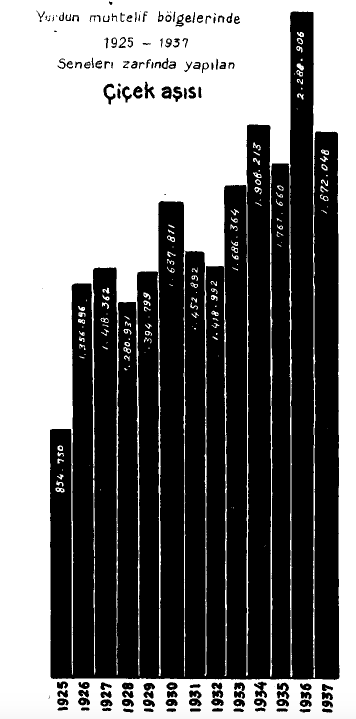{width="9cm" height="12cm"}
[]{#fig:mylabelf1org label="fig:mylabelf1org"}

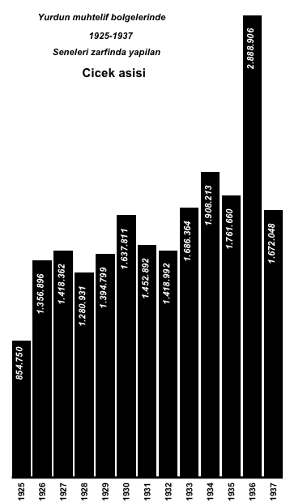{width="7cm" height="14cm"} []{#fig:mylabelf1
label="fig:mylabelf1"}

## *Overlapped bar graphs with two data series*

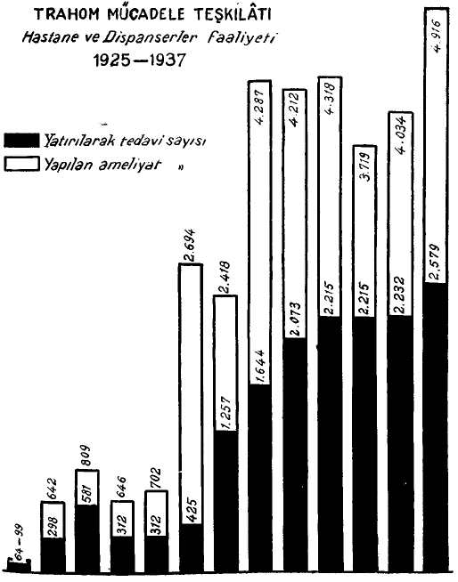{width="12cm" height="11cm"}

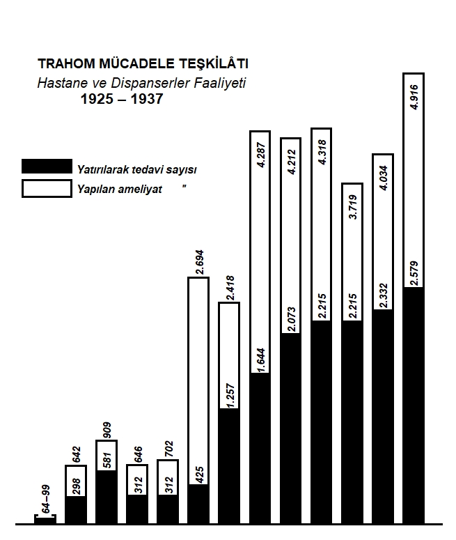{width="12cm" height="12cm"}

Figure [\[fig:mylabelf3org\]](#fig:mylabelf3org){reference-type="ref"
reference="fig:mylabelf3org"} presents the service of hospitals and
dispensaries within the Department of Control of Trachoma between the
years $1925$ and $1937$ with respect to the number of inpatient
treatments performed (in black) and the number of surgeries performed
for treating trachoma (in white).

Trachoma is an infectious eye disease caused by a bacteria and is
transmitted among humans through shared use of items used for cleaning
face. If it is not treated at the earlier stages, it may lead to damages
in eye cornea or even to blindness. In the early stages of trachoma,
antibiotics may be effective to eliminate the infection, whereas surgery
may be required at the later stages.

As in
Figure [\[fig:mylabelf1org\]](#fig:mylabelf1org){reference-type="ref"
reference="fig:mylabelf1org"}, the background color of the
Figure [\[fig:mylabelf3org\]](#fig:mylabelf3org){reference-type="ref"
reference="fig:mylabelf3org"} is white and there is no vertical axis and
any information related to the vertical axis (e.g., axis line, axis
title, axis tick marks, and tick mark labels). The columns of both
groups are overlapped $100\%$ and the column bar heights are directly
proportional to the data values they represent. The data set for the
number of inpatient treatments is always shorter than the data set for
the number of surgeries performed for treating trachoma over the years
$1925$ and $1937$. Thus, the columns for inpatient treatments are
positioned in front of the columns for the number of surgeries
performed. However, the disparity between the heights of both groups is
manipulated through assigning a strong color, black, to the number of
inpatient treatments, and a recessive color, white, to the number of
outpatient treatments, which is a common strategy in graphic design
[@White]. This emphasis is also reflected in the legend keys such that
the legend keys are ordered according to color, not alphabetically.

The data values for the surgery group between the years $1925$ and
$1931$ are placed vertically at the top of the columns. Those between
the years $1932$ and $1937$ are placed inside the columns vertically due
to lack of space in the plotting region, whereas the data values for the
number of inpatient treatments are always placed vertically inside the
column. All the data values for each group are in black since the
background color is white. Due to the reasonable number of column bars
in the plotting area, the width of the column bars and the inter-bar
spacing between them are now increased.

Unlike
Figure [\[fig:mylabelf1org\]](#fig:mylabelf1org){reference-type="ref"
reference="fig:mylabelf1org"}, there are no labels for the horizontal
axis tick marks now. However, the third line of main graph title gives
the clue that horizontal axis starts from $1925$ and goes to $1937$. As
the reviewer pointed out, we think that horizontal tick mark labels here
were unintentionally forgotten since this is the only bar graph with
missing horizontal tick mark labels in the government report. However,
this may result in a cognitive effort for the viewer if the viewer would
like to know the exact information for the number of inpatient
treatments and/or the number of surgeries performed throughout the
years, especially for the years in the middle of 1925 and 1937. In that
case, the viewer has to count the number of bars to get precise
information. On the other hand, if the interest is on the overall trend
of the number of inpatient treatments and/or the number of surgeries
performed over the years, then comparing the heights of the bars
visually will eliminate this problem. If there is not enough space to
place all the tick marks on the horizontal axis, then two design choices
can be followed here: 1) placing all the labels with some vertical shift
such as 90 degree or 45 degree alignment, or 2) starting labeling at the
year 1925 and labeling the years with one year apart.

In Figure [\[fig:mylabelf3\]](#fig:mylabelf3){reference-type="ref"
reference="fig:mylabelf3"}, the $100\%$ overlapping structure of column
bars is obtained via setting argument position = \"identity\" in
geom_col() layer. Note that the look of
Figure [\[fig:mylabelf3\]](#fig:mylabelf3){reference-type="ref"
reference="fig:mylabelf3"} requires arrangement of the levels of
grouping factor in the data with order of inpatient treatments and
surgeries performed, respectively. This grouping variable is also mapped
into fill and alpha arguments of the aesthetics of the main ggplot()
call since the fill-in colors of the bars and transparency level of the
bars should be matched with the levels of this grouping variable. In
addition to modifying several components of theme() layer, assigning
"black" color to the inpatient treatments and "white" color to the
surgeries performed via scale_fill_manual() layer, and then assigning
low level of transparency "1" to the black color of inpatient treatments
and high level of transparency "0" to the white color of surgeries
performed via scale_alpha_manual() layer would yield the final look of
the figure. Hence, the order of elements of the vector of colors in
scale_fill_manual() layer and the order of elements of the vector of
transparency in scale_alpha_manual() layer are matched with the order of
the levels of the grouping variable. Lastly, if transparency were not
added to the plot, the color of the second level of the grouping
variable will be displayed only due to the overlapping structure of the
column bars.

The white line segment in the first column of
Figure [\[fig:mylabelf3\]](#fig:mylabelf3){reference-type="ref"
reference="fig:mylabelf3"} is integrated via an annotate() layer along
with rect argument. On the other hand, three-lined main graph title is
run with labs() and annotate() layers due the italicized font structure
of the middle line compared to the unitalicized font structure of the
first and the last lines. Lastly, we can say that both the number of
inpatient treatments and the number of surgeries performed increased
considerably over the years.

Figure [\[fig:mylabelf4org\]](#fig:mylabelf4org){reference-type="ref"
reference="fig:mylabelf4org"} shows the service of the Zonguldak
Government Hospital between the years $1924$ and $1937$ with respect to
the number of inpatient treatments (in black) and the number of
outpatient treatments (in white). The data value for the number of
outpatient treatment is not available in $1924$ and is coded as NA in
the data. While the columns for the number of inpatient treatments are
taller than that of outpatient treatment over the period $1925$ and
$1932$, the columns for the number of outpatient treatments are taller
than that of inpatient treatments over the period $1933$ and $1937$. To
increase the dominance of the number of inpatient treatments over the
number of outpatient treatments, the former group is colored in black.

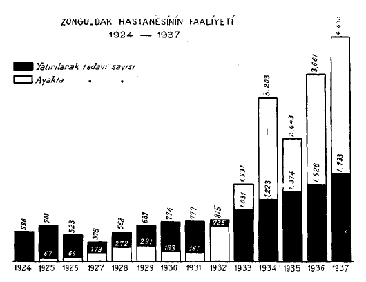{width="12cm" height="12cm"}

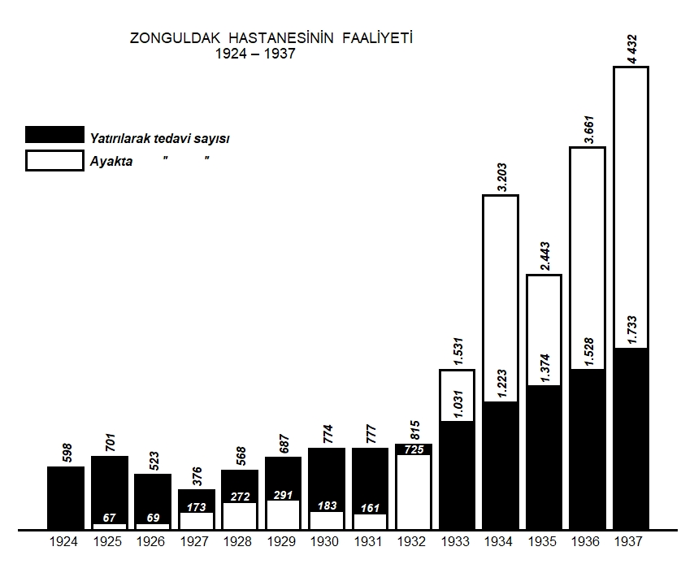{width="12cm" height="12cm"}

In year 1932, the number of outpatient treatments is close to the number
of inpatient treatments in magnitude, where the frequencies are 725 and
815 respectively. Since there is not enough space to place the number
725 vertically inside the bars, it is aligned horizontally and colored
in white due to the black background color. To be consistent with white
front-positioned outpatient treatment bars, all the data labels of
outpatient treatments are placed horizontally between $1925$ to $1932$
and then vertically onwards. This approach gives a practical information
design approach.

The R code structure of
Figure [\[fig:mylabelf4\]](#fig:mylabelf4){reference-type="ref"
reference="fig:mylabelf4"} is very challenging and is not
straightforward since geom_col(position = \"identity\") assumes that
difference between two data series over the years takes a uniform
behaviour, i.e., it assumes that a series is always either greater than
the other one, or always less than the other one. If it is not so,
geom_col(position = \"identity\"), scale_fill_manual(), and
scale_alpha_manual() layers cannot handle the zig-zag pattern in the
difference of data series when drawing bars. This problem actually opens
a research door for ggplot2.

Figure [\[fig:mylabelf5org\]](#fig:mylabelf5org){reference-type="ref"
reference="fig:mylabelf5org"} represents the workload of private
hospitals between the years $1926$ and $1937$ with respect to the number
of inpatient treatments (in black) and the number of outpatient
treatments (in white). Except the year $1926$, the columns for the
number of inpatient treatments are always shorter than the columns for
the number of outpatient treatments. In $1926$, the number of inpatient
treatments is $17,700$, which is greater then the number of outpatient
treatments, $16,009$. The columns, which are positioned in the front,
are shifted to the left, resulting in around $70\%$ overlapping. Due
their front position and stronger color, the number of inpatient
treatments take the attention of the viewer. On the other hand, since
the data values for the number of outpatient treatments is just twice of
the data values for the number of inpatient treatments in the years
$1927$ and $1928$, the heights of the column bars are close to each
other and hence there is not enough space to place the data values for
the number of inpatient treatments in the column bars vertically. To
avoid overlapping of two data labels, the front data labels are placed
horizontally, which is a practical approach. This information gives us
an another idea that alignment of data values according to space
available in
Figures [\[fig:mylabelf4org\]](#fig:mylabelf4org){reference-type="ref"
reference="fig:mylabelf4org"} and
 [\[fig:mylabelf5org\]](#fig:mylabelf5org){reference-type="ref"
reference="fig:mylabelf5org"} is reasonable. However, as the reviewer
pointed out, this inconsistencies i.e., aligning texts horizontally then
vertically, is visually distracting and may decrease the readability.

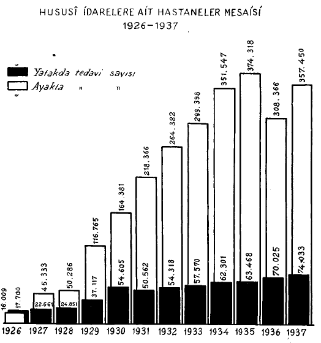{width="12cm" height="11cm"}

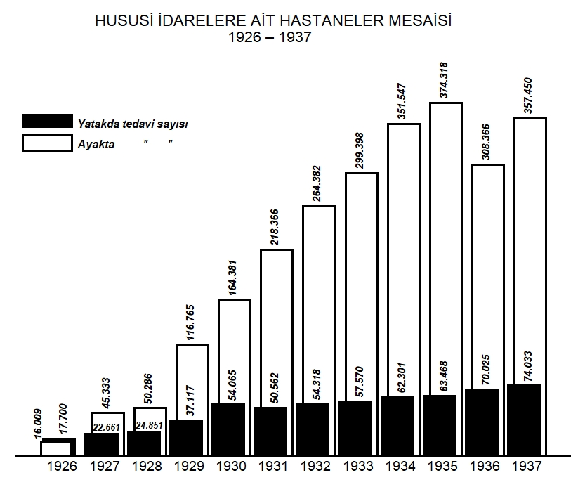{width="12cm" height="12cm"}

The R code structures of
Figures [\[fig:mylabelf3\]](#fig:mylabelf3){reference-type="ref"
reference="fig:mylabelf3"} and
[\[fig:mylabelf5\]](#fig:mylabelf5){reference-type="ref"
reference="fig:mylabelf5"} are very similar to each other. The $70\%$
overlapping position of columns bars in
Figure [\[fig:mylabelf5\]](#fig:mylabelf5){reference-type="ref"
reference="fig:mylabelf5"} is adjusted through setting position =
position_dodge(width = 0.3) in geom_col() layer. Furthermore, in year
1926, the column of outpatient treatment is less than that of inpatient
treatment, which is vice versa in the subsequent bars. As we discussed a
similar problem for
Figure [\[fig:mylabelf4\]](#fig:mylabelf4){reference-type="ref"
reference="fig:mylabelf4"}, geom_col(position = \"identity\") could not
handle this and the white rectangular column bar in year 1926 is drawn
manually via annotate() layer with rect argument.

In
Figures [\[fig:mylabelf3org\]](#fig:mylabelf3org){reference-type="ref"
reference="fig:mylabelf3org"},
[\[fig:mylabelf4org\]](#fig:mylabelf4org){reference-type="ref"
reference="fig:mylabelf4org"}, and
[\[fig:mylabelf5org\]](#fig:mylabelf5org){reference-type="ref"
reference="fig:mylabelf5org"}, the legend is placed vertically at the
top-left of the plotting area, since the overall structure of the graphs
are left-skewed and the legend keys are ordered according to color, not
alphabetically. Furthermore, in
Figures [\[fig:mylabelf3org\]](#fig:mylabelf3org){reference-type="ref"
reference="fig:mylabelf3org"}-[\[fig:mylabelf5\]](#fig:mylabelf5){reference-type="ref"
reference="fig:mylabelf5"}, the double apostrophe, \" , in the title of
second legend key is a typographic symbol, called a ditto mark, which is
used for repeated words above it. In hand-written texts, ditto mark is
used to save time and effort from the writer. Since the government
report includes around forty figures, this may be the reason why ditto
mark is also used in the legend key titles. While this approach also
reduces the amount of ink used in the figures, it does not distort the
readability of the graph. However, we should note that in today's
technology, the repetitive words can be typed as needed with less
effort.

We would like to note that the
Figures [\[fig:mylabelf3org\]](#fig:mylabelf3org){reference-type="ref"
reference="fig:mylabelf3org"},
[\[fig:mylabelf4org\]](#fig:mylabelf4org){reference-type="ref"
reference="fig:mylabelf4org"}, and
[\[fig:mylabelf5org\]](#fig:mylabelf5org){reference-type="ref"
reference="fig:mylabelf5org"} may look like as if they were stacked bar
graphs. However, since the government report published in $1938$
includes the raw tabular data in it, we are $100\%$ confident to say
that these figures are overlapped bar graphs. Furthermore, we would also
like to note that in stacked bar charts, the height of the column bar
gives the total frequency of all groups on a given year. If one needs
the frequency of a specific group on that year, then an additional
arithmetic operation such as subtraction should be done to calculate it.
Keeping in mind that these graphs are presented to the public who has a
low level of literacy, doing an extra mathematical work in stacked bar
charts would add a computational burden to the viewer, which may not be
possible for the viewer at that time.

Another distinction between overlapped bar graphs and stacked bar graphs
is that overlapped bar graphs are used to display the comparison between
two closely related numerical variables over an item/category (here it
is years), whereas stacked bar graphs are used to display comparison at
least two complementary numerical variables over an item/category. As we
can see from the
Figures [\[fig:mylabelf3org\]](#fig:mylabelf3org){reference-type="ref"
reference="fig:mylabelf3org"},
[\[fig:mylabelf4org\]](#fig:mylabelf4org){reference-type="ref"
reference="fig:mylabelf4org"}, and
[\[fig:mylabelf5org\]](#fig:mylabelf5org){reference-type="ref"
reference="fig:mylabelf5org"}, the variables of interests, which are
inpatient vs outpatient or inpatient vs surgeries performed, are closely
related to each other, not directly mutually exclusive events.
Furthermore, the offset (dodging) in the
Figure [\[fig:mylabelf5org\]](#fig:mylabelf5org){reference-type="ref"
reference="fig:mylabelf5org"} also confirms that columns are overlapped.

Lastly, the increasing trends in the number of inpatient treatments in
Figures [\[fig:mylabelf4org\]](#fig:mylabelf4org){reference-type="ref"
reference="fig:mylabelf4org"} and
[\[fig:mylabelf5org\]](#fig:mylabelf5org){reference-type="ref"
reference="fig:mylabelf5org"} may indicate that the hospital bed
capacity increased over the years, whereas a stabile trend shows that
the hospital's bed capacity did not change over the years. On the other
hand, increasing trends in the number of outpatient treatments may
indicate an increase in general service capacity of the hospital.

## *Grouped side-by-side bar graphs with two data series*

Figure [\[fig:mylabelf6org\]](#fig:mylabelf6org){reference-type="ref"
reference="fig:mylabelf6org"} represents the workload of sample
hospitals between the years $1924$ and $1937$. There are also two groups
here: inpatient and outpatient treatments, colored in black and white
respectively.
Figure [\[fig:mylabelf6org\]](#fig:mylabelf6org){reference-type="ref"
reference="fig:mylabelf6org"} is different from previous ones since the
columns for inpatient and outpatient treatments for the same year are
now placed side-by-side accordingly. This can be done by setting the
argument position = position_dodge2() in the geom_col() layer. The
grouping variable is mapped into fill argument of the aesthetics of the
main ggplot() call so that color of the levels of the grouping variable
can be assigned manullay in scale_fill_manual() layer.

There is only one column in the year $1924$ because there is no
information available for the outpatient treatment in $1924$. It is
coded as NA in the data. The length of the column bars for the number of
inpatient treatments are shorter than those of the outpatient treatments
over the years. However, to increase the dominance of the number of
inpatient treatments over the number of outpatient treatments, the
inpatient treatment group is colored in black and placed ahead of
outpatient treatment group, an information design stragety which we
learned from [@White]. The data values for both groups are placed at the
top of columns vertically due to enough space in the plotting area.

The
Figures [\[fig:mylabelf4org\]](#fig:mylabelf4org){reference-type="ref"
reference="fig:mylabelf4org"} and
 [\[fig:mylabelf6org\]](#fig:mylabelf6org){reference-type="ref"
reference="fig:mylabelf6org"} are good examples that geom_col() layer in
ggplot2 can handle missing values in the data. In other words ggplot2can
handle unequal length of data series for a given category (here it
refers to a given year) while sketching overlapped and side-by-side bar
graphs. On the other hand, a literature survey revealed that the
Zonguldak Government Hospital in the
Figure [\[fig:mylabelf4org\]](#fig:mylabelf4org){reference-type="ref"
reference="fig:mylabelf4org"} and the sample hospitals in the
Figure [\[fig:mylabelf6org\]](#fig:mylabelf6org){reference-type="ref"
reference="fig:mylabelf6org"} were launched in 1924 as the second-stage
hospitals in the cities offering inpatient services with specialized
health workers such as doctors, nurses, and laboratory services. In the
cities where these hospitals were available, a person with medical
complications was initially admitted to the small hospitals with low
health care capacity as the first-stage hospitals, and only the ones who
needed inpatient services in a specialized medical area were transferred
to the second-stage hospitals. For that reason, there is no data value
for outpatient treatments in the
Figures [\[fig:mylabelf4org\]](#fig:mylabelf4org){reference-type="ref"
reference="fig:mylabelf4org"} and
[\[fig:mylabelf6org\]](#fig:mylabelf6org){reference-type="ref"
reference="fig:mylabelf6org"} in 1924. After 1924, due to on-going
efforts improving health care policies and hospital capacities, these
main hospitals started to offer both outpatient and inpatient
treatments.

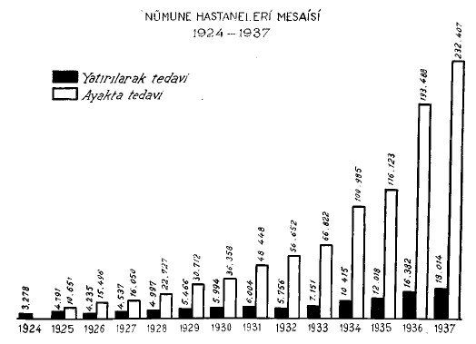{width="12cm" height="12cm"}

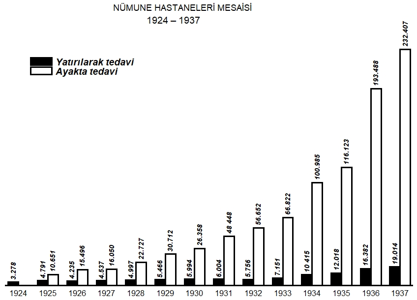{width="12cm" height="12cm"}

Figure [\[fig:mylabelf7org\]](#fig:mylabelf7org){reference-type="ref"
reference="fig:mylabelf7org"} represents the laboratory workload for
Malaria struggle between the years $1925$ and $1937$. The white color
refers to the number of blood tests performed and the black color refers
to the number of diagnoses. As in
Figure [\[fig:mylabelf6org\]](#fig:mylabelf6org){reference-type="ref"
reference="fig:mylabelf6org"}, in
Figure [\[fig:mylabelf7org\]](#fig:mylabelf7org){reference-type="ref"
reference="fig:mylabelf7org"}, the paired columns for the same year are
now placed side-by-side. The columns for the number of blood tests are
taller than the columns for the number of diagnoses over the years
$1925$ and $1937$. Placing the number of blood tests ahead of the number
of diagnoses enables us to compare how many blood tests resulted in a
positive Malaria diagnosis (like today, the world is now comparing "the
number of Covid-19 tests performed" with "the number of positive test
results"). Although the number of diagnoses is smaller, coloring it in
black increased its importance and softened the disparity between the
sizes of the pair, which is an information design principle given in
[@White]. Since the number of diagnoses falls behind the number of blood
tests, vertically placing the horizontal axis tick mark labels in black
color makes an illusion and increases the dominance of the number of
diagnoses (in black) in the graphic.

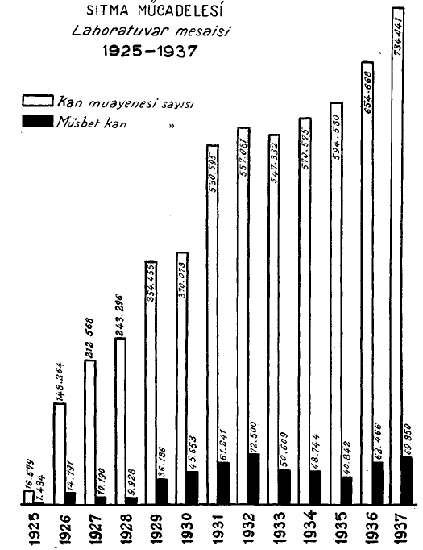{width="15cm" height="11cm"}

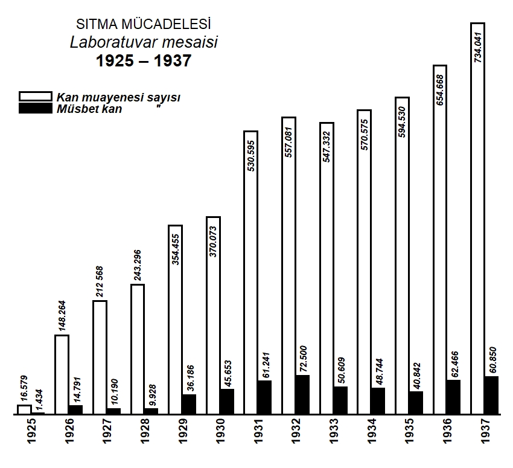{width="10cm" height="12cm"}

The data values for the number of diagnoses are easily placed at the top
of columns vertically due the shorter length of corresponding columns.
However, while the data values for the number of blood tests are placed
at the top of the column vertically between the years $1925$ and $1928$,
the data values for the number of blood tests between the years $1929$
and $1935$ are placed inside the column bars vertically due to the space
limitation in the plotting region.

In the
Figures [\[fig:mylabelf6org\]](#fig:mylabelf6org){reference-type="ref"
reference="fig:mylabelf6org"} and
[\[fig:mylabelf7org\]](#fig:mylabelf7org){reference-type="ref"
reference="fig:mylabelf7org"}, the space between groups of bars is
increased and now equals to the width of a single bar in a given group.
On the other hand, space between bars within a group is not available.

The legends in the
Figures [\[fig:mylabelf6org\]](#fig:mylabelf6org){reference-type="ref"
reference="fig:mylabelf6org"} and
[\[fig:mylabelf7org\]](#fig:mylabelf7org){reference-type="ref"
reference="fig:mylabelf7org"} are placed vertically at the top-left of
the figures since the overall structure of graphs are left-skewed. Note
that the ordering in the group colors are also reflected in the legend
keys as well. For example, in
Figure [\[fig:mylabelf7org\]](#fig:mylabelf7org){reference-type="ref"
reference="fig:mylabelf7org"}, the first legend is in white and the
second one is in black. Here we note that in the
Figures [\[fig:mylabelf6\]](#fig:mylabelf6){reference-type="ref"
reference="fig:mylabelf6"} and
[\[fig:mylabelf7\]](#fig:mylabelf7){reference-type="ref"
reference="fig:mylabelf7"}, the legend key order is inherited from the
order of the level of the grouping variable in each plot and this
grouping variable is declared in fill argument of the aesthetics of the
main ggplot() call. The color of the legend keys are also matched with
the color of the corresponding level of the grouping variable which was
assigned in scale_fill_manual layer(). Lastly, from
Figures [\[fig:mylabelf7org\]](#fig:mylabelf7org){reference-type="ref"
reference="fig:mylabelf7org"}, we can say that the government kept
administrating blood tests over the years with an increasing trend and
nearly $10\%$ of them were being turned out to be positive.

## *Grouped side-by-side bar graph with more than two data series*

Figure [\[fig:mylabelf12org\]](#fig:mylabelf12org){reference-type="ref"
reference="fig:mylabelf12org"} represents the drugs sent by the
Department of Control of Syphilis to cities for treatment between the
period $1926$ and $1937$. Syphilis is a sexually transmitted disease
caused by a bacteria and it has bee a very serious public health problem
in the world since $1800$'s. Several antibiotic-based drugs were used to
cure the Syphilis.

In the
Figure [\[fig:mylabelf12org\]](#fig:mylabelf12org){reference-type="ref"
reference="fig:mylabelf12org"} we can see that there are four different
drug types: Arsenobenzol, Bizmopen, Mercury, and Iodine, where they are
filled in with black color, white color, textured with vertical lines,
and textured with dots, respectively. This textured design is
specifically called hatching in graphic design.

To emphasize grouping over the years, the horizontal axis is broken into
segments. It can also be seen from the figure that there were Bizmopen
and Mercury drugs in $1926$ only; there were Arsenobenzol, Bizmopen, and
Mercury drugs between the years $1927$ and $1933$, and afterwards, the
fourth drug Iodine came out in $1934$. Regardless of the number of drugs
available at a specific year, the width of grouping is always kept
uniform over the years $1926$ and $1937$.

The data series for the groups are placed side-by-side, which can be
done by setting argument position = position_dodge() in the geom_col()
layer. The order in the placement of the groups is also reflected in the
legend keys. A side note is also attached to the graph telling that "The
counts show kilo". Adding captions to the graphs is possible via caption
argument in labs() layer of ggplot2.

On the other hand, we should say that some of the raw materials of these
four drugs were imported from abroad, the treatment of syphilis was
mandatory and free. Similarly, these four drugs were distributed free to
the patients. In the
Figure [\[fig:mylabelf12org\]](#fig:mylabelf12org){reference-type="ref"
reference="fig:mylabelf12org"} the columns for the Mercury filled with
vertical lines are very eye-catching due to their taller heights. While
@Si says that Mercury had been commonly used to cure Syphilis until
discovery of penicillin around $1940$'s , @mumyakmaz7illet reported that
the mercury was the most effective drug to treat the patients ($95\%$
effective), and the Iodine was the second effective drug.

The
Figure [\[fig:mylabelf12org\]](#fig:mylabelf12org){reference-type="ref"
reference="fig:mylabelf12org"} is a good example for use of hatching for
differentiating the data groups when there is no color option or color
printing was not easy or economical in 1938. However, this resulted in a
challange that textured patterns are not allowed in the core functions
of the ggplot2 package. For that reason, we used several annotate()
layers along with segment argument to integrate hatches with vertical
lines and dots into the column bars. Since we did hatching manually, we
could not synchronize textured patterns in the column bars with the
legend keys. As a consequence of this, several annotate() layers with
rect argument for drawing the legend boxes, several annotate() layers
with segment argument for filling the textured patterns in legend keys,
and several annotate() layers with text argument for typing the legend
key titles were used.

We also provided three different historical column bar graphics along
with R codes in the Supplementary material for further interest.

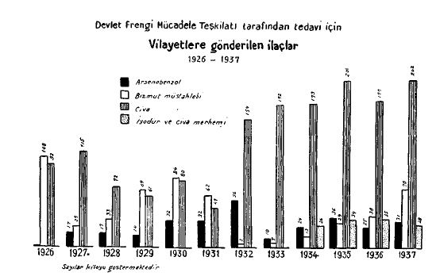{width="13cm" height="18cm"}

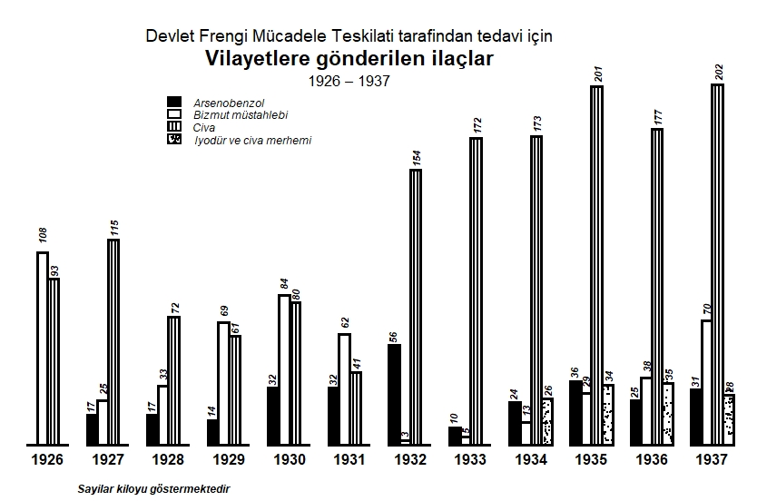{width="12cm" height="14cm"}

## *Paired bar graphs with two data series*

Figure [\[fig:mylabelf13org\]](#fig:mylabelf13org){reference-type="ref"
reference="fig:mylabelf13org"} shows the total number of serums and
vaccines, which are produced and consigned, at the Central Hygiene
Institute for the years between $1930$ and $1937$. The Central Hygiene
Institute was a reference laboratory in the country launched for
producing serum and vaccine for several infectious diseases such as
rabies, typhoid, and whooping cough.

Figure [\[fig:mylabelf13org\]](#fig:mylabelf13org){reference-type="ref"
reference="fig:mylabelf13org"} breaks down the data into two panels as
produced (left-panel) and cosigned (right-panel) through a vertical
axis. The left side of vertical axis is for the number of produced serum
and vaccine items in kilogram and the right side of the vertical axis is
for the number of consigned serum and vaccine items in kilogram. Under
each panel, the data set for serum (in black) and vaccine (in white) are
displayed via overlapping columns from $1930$ to $1937$. The legend keys
for serum (in black) and vaccine (in white) are separated horizontally.
Note that this is the first time a vertical axis appears in a graph and
it is placed at the center of the graph. It denotes the years with the
title "Yillar" and descends from $1937$ to $1930$. Since the columns of
recent years are taller than the columns of earlier years, which also
shows the continuing success of the institute, reversing the order of
years (starting from the recent year $1937$) makes the graphic to look
like a population pyramid. Furthermore, although data values are
annotated to the column bars, a horizontal axis with tick marks and tick
mark labels are also available. The tick mark labels show the respective
counts, which are not linear in magnitude, going from $0$ to $4500$ with
unequal increments. The horizontal axis title "SAYISI" refers to the
"Frequency". This is the first time we have a horizontal axis title as
well. The text aligned with 45 degree at the left panels refers to the
"PRODUCED (IN KILO)" and the one with 135 degree at the right refers to
the "CONSIGNED IN (KILO)", which are symmetric to each other with
respect to the vertical axis. We can consider this graph as a paired bar
graph having a double horizontal axis with a common vertical axis.
Lastly, here we can see that the country was very successful both at
producing and consigning vaccine in 1930's due to increasing trend over
the years.

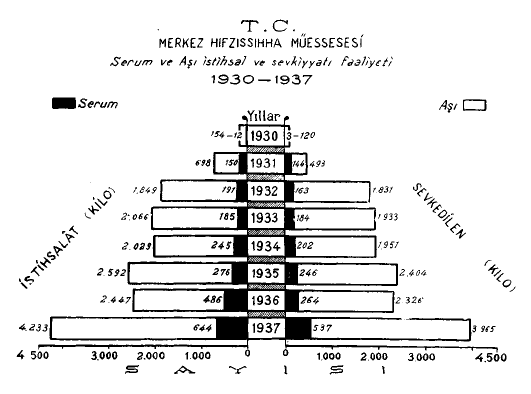{width="12cm" height="19cm" width="9cm"}

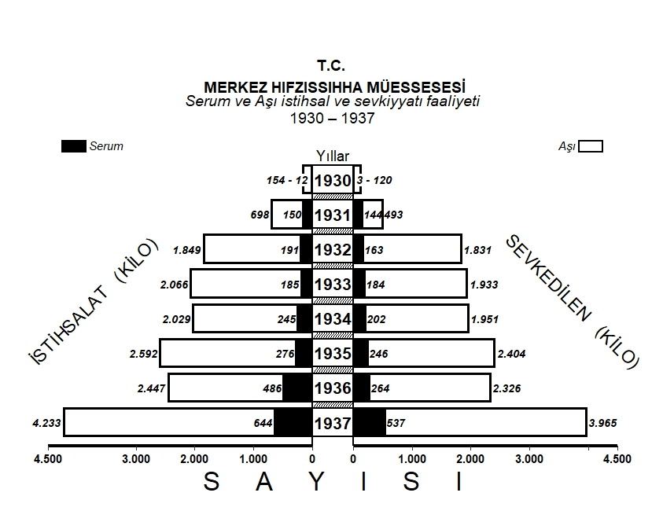{width="12cm" height="19cm" width="9cm"}

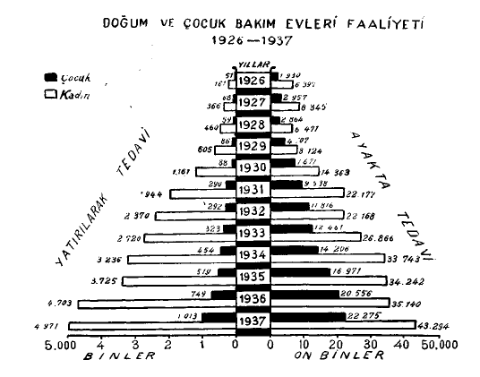{width="12cm" height="14cm"}

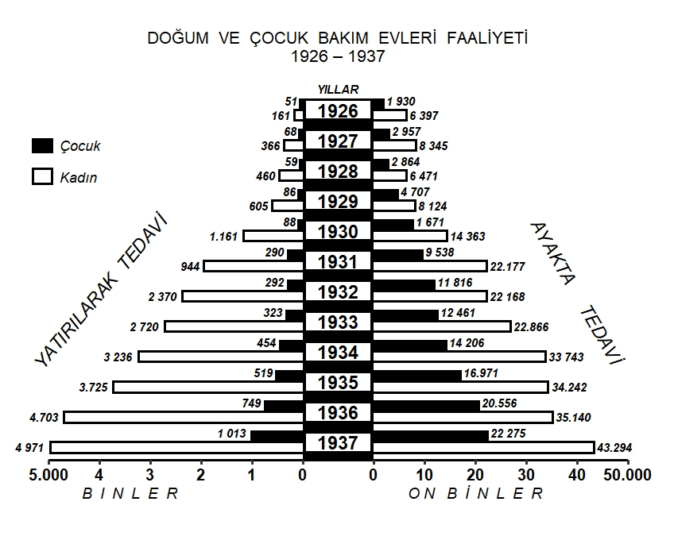{width="12cm" height="12cm"}

Due to high infant mortality rates in the early years of the country,
special effort was devetod the health care of mother and child.
Figure [\[fig:mylabelf14org\]](#fig:mylabelf14org){reference-type="ref"
reference="fig:mylabelf14org"} shows the service of birth and childcare
houses for women and children between the period $1926$ and $1937$. As
in
Figure [\[fig:mylabelf13org\]](#fig:mylabelf13org){reference-type="ref"
reference="fig:mylabelf13org"}, the vertical axis breaks down the data
into two panels as inpatient services (left-panel) and outpatient
services (right-panel). Then for each panel, the data set for child and
woman are displayed over the years $1926$ and $1937$ as side-by-side
column bars in black and white colors, respectively. As in
Figure [\[fig:mylabelf13org\]](#fig:mylabelf13org){reference-type="ref"
reference="fig:mylabelf13org"}, the vertical axis at the center denotes
years by "Yillar" starting from $1937$ and descending to $1926$. The
tick marks on horizontal axis show the respective frequencies with
linear increments. The tick mark labels at left side of the horizontal
axis represents the numbers in terms of "Thousands", going from $0$,
then to $1$, $2$, $3$, $4$, and $5000$. Similarly, tick mark labels at
the right side of the horizontal axis represents the numbers in terms of
"Ten Thousands", going from $0$, then to $10$, $20$, $30$, $40$, and
$50,000$. Due to space limitation on the horizontal axis, the last three
digits of the numbers are not used, except the last numbers ($5,000$ at
the left and $50,000$ at the right). This looks like a promising example
for information design of displaying very large numbers on graphics when
there is no space to integrate all the text into the plotting area.
Integration of these tick mark labels is done via labels argument of
scale_y\_continuous() layer in ggplot2. The paired bar graphs in the
Figures [\[fig:mylabelf13\]](#fig:mylabelf13){reference-type="ref"
reference="fig:mylabelf13"} and
[\[fig:mylabelf14\]](#fig:mylabelf14){reference-type="ref"
reference="fig:mylabelf14"} can be plotted via using multiple geom_col()
layers with some extra aesthetic work in ggplot2 package. Here we should
note that to be able to assign a pyramid look to the graph, the data is
visualized with an illusion since height of the left-panel bars are
actually pretty much smaller than the ones at right-panel. Lastly, we
can say that the country was also succesful at taking care of childs and
mothers with an increasing number of inpatient and outpatient services
over the years.

# Redesign of historical bar graphics in modern era {#sec:redesign}

The historical graphics given above enable us to investigate the trends
of several numerical variables over time and make comparisons between
these numerical variables through column bar graphics. We can also
re-visualize these graphics with the help of modern data visualization
principles and software technology to increase the readibility and
effectiveness of the graphs through increasing the data-ink ratio given
below:

$$\label{key}
\nonumber
\text{Data-ink ratio} = 	\frac{\text{Ink used to describe the data}}{\text{Ink used to visualize graph}} .$$

The higher the ratio, the better the visualization comes out. Since the
nature of the data in the historical graphics given in this paper is
time series, line grahs can also be alternatively used to visualize the
same data with a higher data-ink ratio. For example, as we discussed in
Figure [\[fig:mylabelf4org\]](#fig:mylabelf4org){reference-type="ref"
reference="fig:mylabelf4org"}, the pattern of the number of inpatient
treatments and the number of outpatient treatments over time cannot be
detected easily and requires some cognitive effort due to the data
structure and overlapping column bar design. In
Figure [\[fig:mylabelf4reinter\]](#fig:mylabelf4reinter){reference-type="ref"
reference="fig:mylabelf4reinter"}, we used a multi-line plot to display
the number of patients treatments and that of outpatient treatments
between 1924 and 1937 with geom_line() layer. A regular line is now used
to represent the number of inpatient treatments, whereas a dashed line
is preferred for the number of outpatient treatments. Color is not
assigned to lines so that the graphic is visually more accessible.
Unlike
Figure [\[fig:mylabelf4org\]](#fig:mylabelf4org){reference-type="ref"
reference="fig:mylabelf4org"}, a vertical axis along with axis labels
with linear increments from 0 to 5000 is used to quantify the
frequencies. The last data values of two data group are placed on the
figure only. The legend is removed from the figure and data group
categories are annotated next to the line of interest to decrease the
ink used to identify non-data values. Unlike
Figure [\[fig:mylabelf4org\]](#fig:mylabelf4org){reference-type="ref"
reference="fig:mylabelf4org"}, in
Figure [\[fig:mylabelf4reinter\]](#fig:mylabelf4reinter){reference-type="ref"
reference="fig:mylabelf4reinter"}, it is now more clearly seen that the
number of outpatient services is not available in the year 1924, both
data groups have an increasing trend over the years, and the difference
between quantities of the number of inpatient treatments and that of
outpatient treatments is non-negative until the year 1932, then it is
negative onwards. Furthermore, reducing the overall ink used to draw the
graphic also results in a decrease in computational burden to implement
this graphic. The amount of lines required to implement new figure
decreased from 48 lines (2297 characters) to 26 lines (1091 characters)
(please have a look at the R codes in the Supplementary to implement
Figures [\[fig:mylabelf4\]](#fig:mylabelf4){reference-type="ref"
reference="fig:mylabelf4"} and
[\[fig:mylabelf4reinter\]](#fig:mylabelf4reinter){reference-type="ref"
reference="fig:mylabelf4reinter"}).

With the [plotly](https://CRAN.R-project.org/package=plotly) package,
Figure [\[fig:mylabelf4reinter\]](#fig:mylabelf4reinter){reference-type="ref"
reference="fig:mylabelf4reinter"} can be further turned into an
interactive graphic for web-based publications, where the data values
and other components of the graphic are interacted with mouse-over and
can be removed and added back with mouse clicks. However, interactive
graphs cannot be feasible for hard-copy prints.

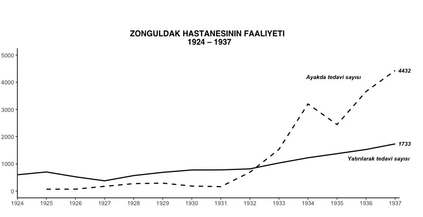{width="12cm" height="15cm"}

Another example can be the
Figure [\[fig:mylabelf12org\]](#fig:mylabelf12org){reference-type="ref"
reference="fig:mylabelf12org"}, where the amount of four different
drugs, namely, Arsenobenzol, Bizmopen, Mercury, and Iodine, sent by the
Department of Control of Syphilis to cities for treatment is displayed.
In
Figure [\[fig:mylabelf12org\]](#fig:mylabelf12org){reference-type="ref"
reference="fig:mylabelf12org"}, it is easy to compare the amount of four
different drugs to each other for a given year. This design choice
eliminates the ability to investigate trends in the amount of a specific
drug supplied over the years. To investigate the relationship between
and within the drug categories, we can prefer displaying the amount of
each drug over the years separately through faceting with facet_wrap()
layer.

Figure [\[fig:mylabelf12reinter\]](#fig:mylabelf12reinter){reference-type="ref"
reference="fig:mylabelf12reinter"} gives the amount of Arsenobenzol,
Bizmopen, Mercury, and Iodine, sent by the Department of Control of
Syphilis as a facet line plot, where each sub-panel refers to an
individual drug category. We can differentiate the drug categories via
stripe titles. Each sub-panel now sits on a common horizontal axis,
that's years from 1925 to 1937, and a common vertical axis changing from
to 0 to the largest possible value in the overall data. Hence, we can
clearly and fairly investigate the trend of each drug over the years,
and compare drug amounts for a given year. Faceting also enables us to
avoid hatching and using legends, resulting in a decrease in the
computational burden to implement this figure such that the amount of
lines required to code new figure decreased from 101 lines (4520
characters) to 34 lines (1441 characters) (please have a look at the R
codes in the Supplementary material to implement
Figures [\[fig:mylabelf12\]](#fig:mylabelf12){reference-type="ref"
reference="fig:mylabelf12"} and
[\[fig:mylabelf12reinter\]](#fig:mylabelf12reinter){reference-type="ref"
reference="fig:mylabelf12reinter"}).

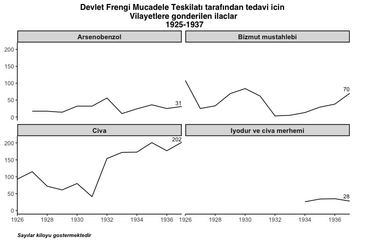{width="12cm" height="12cm"}

Lastly,
Figure [\[fig:mylabelf14org\]](#fig:mylabelf14org){reference-type="ref"
reference="fig:mylabelf14org"} shows the service of birth and childcare
houses between the years 1926 and 1937. The inpatient and the outpatient
services are further divided into two categories: Child and Woman. The
original design of the graph resembles a population pyramid with the
help of creating an illusion that the left-panel (for inpatient
services) and the right-panel (for outpatient services) are symmetric to
each other over the vertical axis, when they are not. Indeed, while the
left horizontal axis spans from 0 to 5000, the right horizontal axis
from 0 to 50000 with linear increments. Eliminating 0 strings from
horizontal axis labels also contributes this confusion. In the end, as
we discussed earlier, this perceptional illusion results in an
aesthetically pleasing, but misleading graph. On the other hand, since
left and right panels do not share a common horizontal axis, faceting
will not result in a fair comparison between panels as done in
Figure [\[fig:mylabelf12reinter\]](#fig:mylabelf12reinter){reference-type="ref"
reference="fig:mylabelf12reinter"}. Alternatively,
Figure [\[fig:mylabelf14org\]](#fig:mylabelf14org){reference-type="ref"
reference="fig:mylabelf14org"} can be split into two sub-line plots with
the same horizontal axis, that's the years from 1926 to 1937, and with
different vertical axis giving the relative frequencies for inpatient
services and outpatient services, respectively. This leads to the
Figure [\[fig:mylabelf14reinter\]](#fig:mylabelf14reinter){reference-type="ref"
reference="fig:mylabelf14reinter"} which gives more realistic comparison
between child and women in terms of inpatient and outpatient services
received. Lastly, the amount of lines required to code new figure
decreased from 80 lines (3578 characters) to 55 lines (2150 characters)
(please have a look at the R codes in the supplementary material to
implement
Figures [\[fig:mylabelf14\]](#fig:mylabelf14){reference-type="ref"
reference="fig:mylabelf14"} and
[\[fig:mylabelf14reinter\]](#fig:mylabelf14reinter){reference-type="ref"
reference="fig:mylabelf14reinter"}).

For a detailed discussion on effectiveness of graphics, chart design,
perception and cognition, we kindly invite readers to read
[@cleveland1986experiment] and [@vanderplas2020testing].

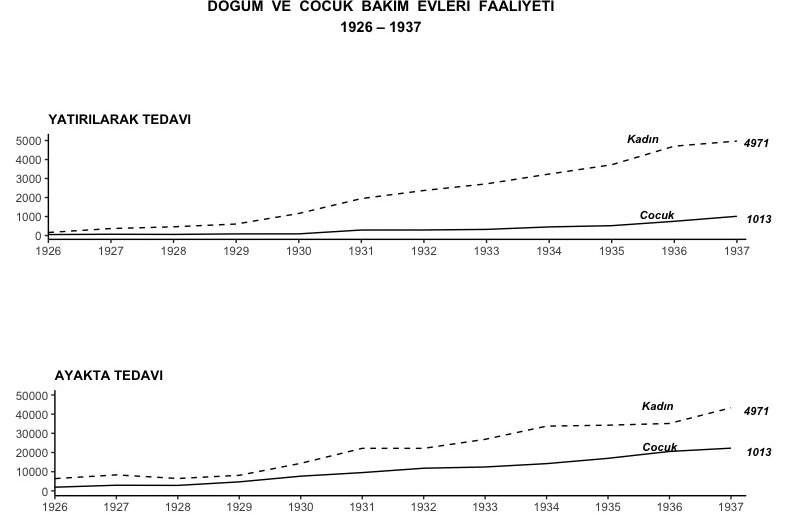{width="12cm" height="25cm"}

# Conclusion {#sec:conc}

In this study, our aim was two-fold: first understanding the information
design behind the historical column bar graphics drawn with hand and
published in late $1930$'s, and then, if possible, reproducing these
graphics with the help of the advances in data visualization
technologies in our era, namely, through ggplot2 package.

While we were dealing with these historical graphics to reproduce them
in ggplot2 package, we were mostly challanged with i) multi-line titles
with different font styles, ii) textured patterns, and iii) data groups
where the difference of the frequencies is not monotonic over the years.

In a multi-line title or any multi-line text within a figure plotting
area such as tick mark labels, data labels, legends, and so on, if
interest is on changing font face i.e., making text bold or italic, then
simple Markdown syntax would be integrated into text and rendered with
the help of element_markdown() layer in the
[ggtext](https://CRAN.R-project.org/package=ggtext) package [@ggtext].
However, if more aesthetic changes such as font family type, size, or
color are needed in the text, then the text can be manipulated
appropriately with the corresponding HTML tags, and rendered with
element_textbox() layer in the ggtext package. We also provided R codes
to produce the multi-lines in the
Figure [\[fig:mylabelf1org\]](#fig:mylabelf1org){reference-type="ref"
reference="fig:mylabelf1org"} and
 [\[fig:mylabelf12org\]](#fig:mylabelf12org){reference-type="ref"
reference="fig:mylabelf12org"} in the supplementary material.

On the other hand,
[ggpattern](https://CRAN.R-project.org/package=ggpattern) package
[@pattern] provides geometric based patterns such as stripe, crosshatch,
or circle to ggplot2 objects with geom_col_pattern() layer. If a
specific pattern is required in bars, then geom_pattern_manual() layer
enables to assign the desired pattern to a specific bar. This order is
reflected into the legend keys as well. For comparison, we reproduced
the Figure [\[fig:mylabelf12\]](#fig:mylabelf12){reference-type="ref"
reference="fig:mylabelf12"} with ggpattern and presented it in
Figure [\[fig:mylabelf12pat\]](#fig:mylabelf12pat){reference-type="ref"
reference="fig:mylabelf12pat"}. The amount of lines to produce
Figure [\[fig:mylabelf12pat\]](#fig:mylabelf12pat){reference-type="ref"
reference="fig:mylabelf12pat"} is now 51 (2171 characters), where R
codes are available in the supplementary material.

Unfortunately, the last challenge requires more work which can be
considered as a future study.

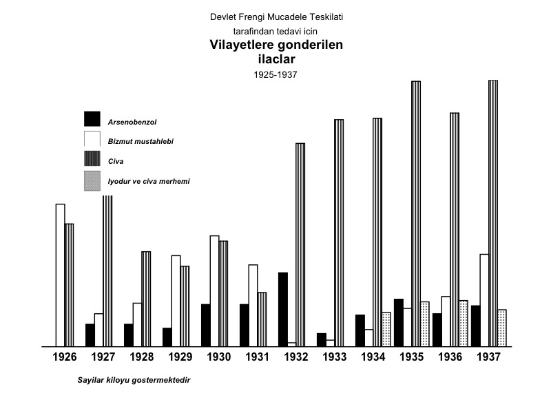{width="13cm" height="18cm"}

In today's Covid-19 pandemic, we also saw that data visualization helped
us to better understand the Covid-19 related statistics, i.e., the
number of confirmed cases, the number of recovered cases, the number of
active cases, and the number of deaths. It can be said that John
Burn-Murdoch's Financial Times charts played a leading role in the
visualization of Covid-19 related statistics through line charts. With
the help of today's technological advances in data visualization, many
other media outlets such as New York Times and the Guardian take
advantage of zoomable and scrollable graphics for visually attractive
story telling. Furthermore, unlike the past, GIS-based interactive data
visualization examples such as CNN health's Covid-19 tracker [@CNN] came
into play for spatially investigating the progress of the disease and/or
vaccination. Nevertheless, understanding all these visualizations from
the viewer's side requires data literacy.

What we experienced during the Covid-19 pandemic also enabled us to
better understand the historical graphics used in our study. When we
were dealing with these graphics back in late $2019$, it was our limited
understanding of how important the workload and capacity of hospitals
was during an epidemic or a pandemic and how important the services of
government, private, and mobile hospitals were for carrying the workload
in the fight against the infectious diseases in order to "flatten the
curve". Furthermore, we also learned that, as in the
Figure [\[fig:mylabelf7\]](#fig:mylabelf7){reference-type="ref"
reference="fig:mylabelf7"}, while epidemics take a very long time to be
diminished from the world and even if the ratio of "the number of blood
tests" to "the number of positive test results" is getting larger over
the years, increasing the test capacity was also an old school approach
yielding the idea "The more tests the better prevention is".

Lastly, we can conclude that neither pandemics, nor the data
visualization is new to our world. As in the past and today, statistical
graphics and data visualization play a vital bridge role between the
authorities and the public during global issues such as health.

# Acknowledgment {#acknowledgment .unnumbered}

We would like to thank Assoc. Prof. Dr. Eminalp Malkoc from Department
of History at Istanbul Technical University for providing us the
original statistical graphics used in this paper. We would also like to
thank the reviewer whose comments improved the quality of the paper.
