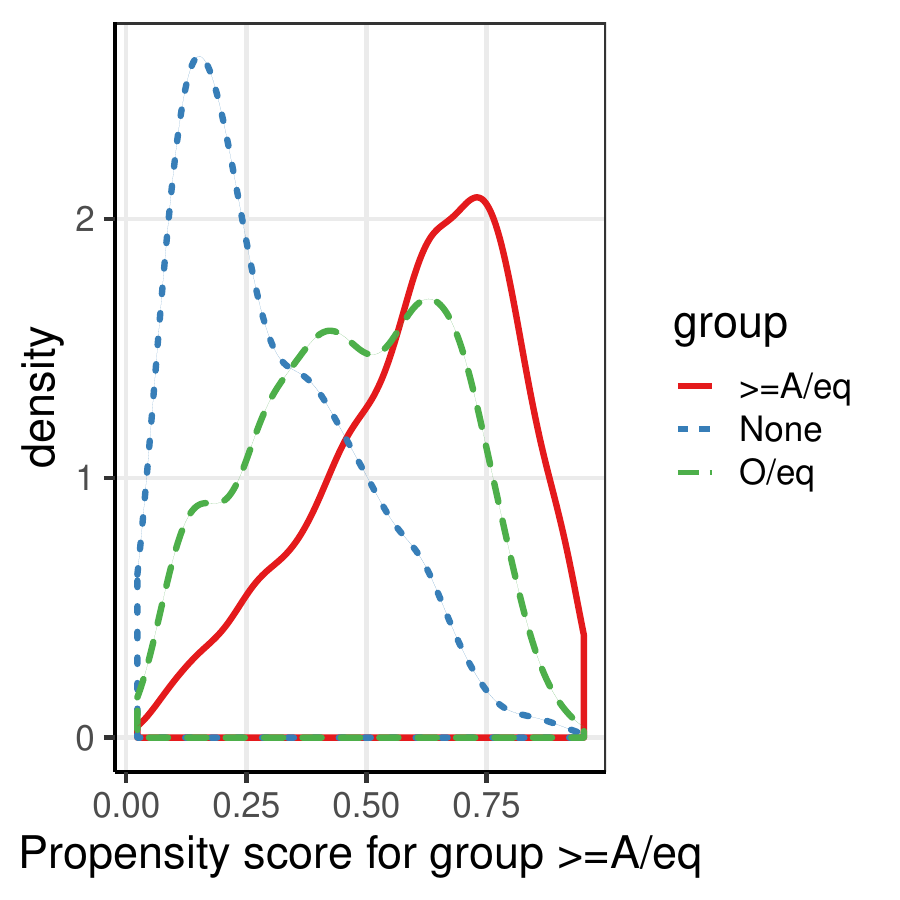
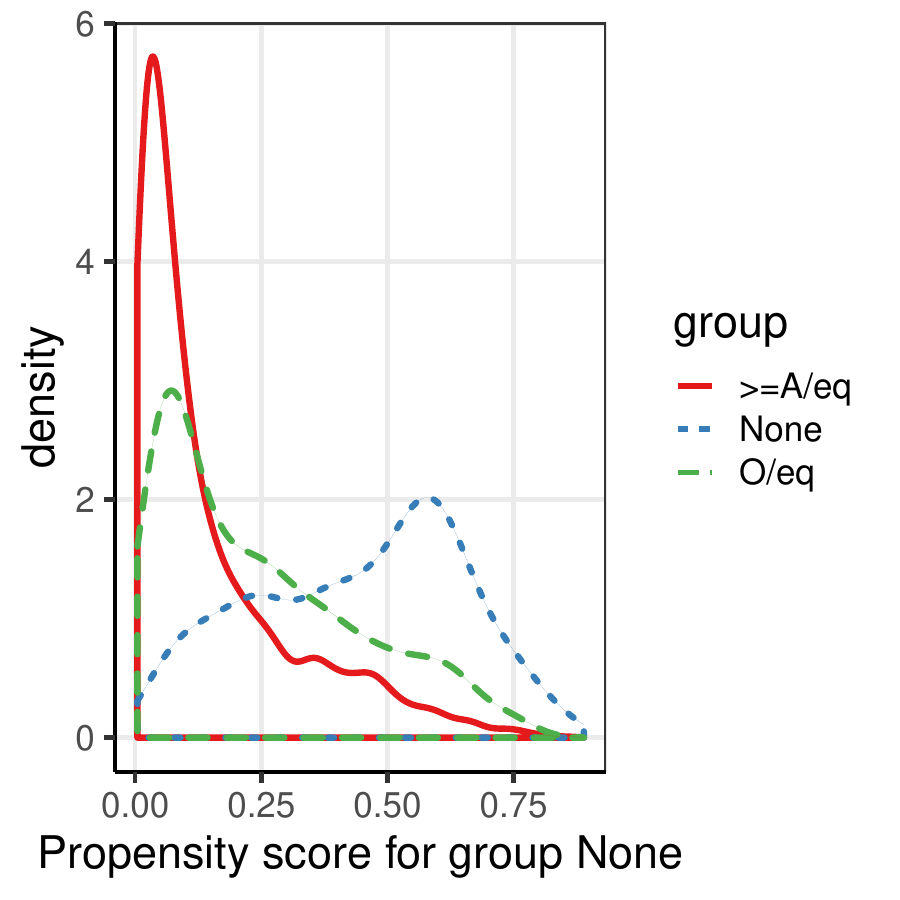
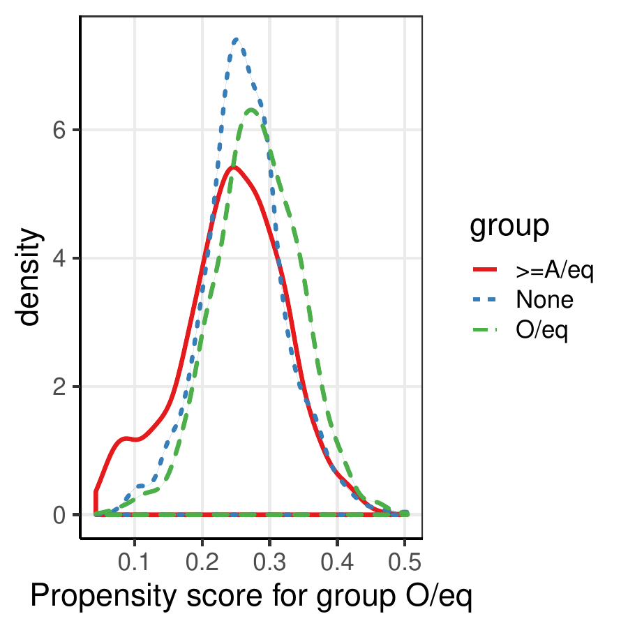

::: article
# Introduction {#sec:intro}

Propensity score is one of the most widely used causal inference methods
for observational studies [@Rosenbaum1983]. Propensity score methods
include weighting, matching, stratification, regression, and mixed
methods such as the augmented weighting estimators. The
[*PSweight*](https://CRAN.R-project.org/package=PSweight) package
provides a design and analysis pipeline for causal inference with
propensity score weighting
[@Robins1994; @Hirano2003; @Lunceford2004; @LiMorganZaslavsky2018].
There are a number of existing R packages on propensity score weighting
(see Table [1](#tb:summary)). Comparing to those, *PSweight* offers
three major advantages: it incorporates (i) visualization and diagnostic
tools of checking covariate overlap and balance, (ii) a general class of
balancing weights, including overlap weights and inverse probability of
treatment weights, and (iii) multiple treatments. More importantly,
*PSweight* comprises a wide range of functionalities, whereas each of
the competing packages only supports a subset of these functionalities.
As such, *PSweight* is currently the most comprehensive platform for
causal inference with propensity score weighting, offering analysts a
one-stop shop for the design and analysis. Table [1](#tb:summary)
summarizes the key functionalities of *PSweight* in comparison to
related existing R packages. We elaborate the main features of
*PSweight* below.

*PSweight* facilitates better practices in the design stage of
observational studies, an aspect that has not been sufficiently
emphasized in related packages. Specifically, we provide a design module
that facilitates visualizing overlap (also known as the positivity
assumption) and evaluating covariate balance without access to the final
outcome [@austin2015moving]. When there is limited overlap, *PSweight*
allows for symmetric propensity score trimming
[@Crump2009; @Yoshida2019] and optimal trimming [@Crump2009; @Yang2016]
to improve the internal validity. We extend the class of balance metrics
suggested in @austin2015moving and @LiThomasLi2018 for binary
treatments, and those in @McCaffrey2013 and @li2019propensity for
multiple treatments. In addition, the design module helps describe the
weighted target population by providing the information required in the
standard "Table 1" of a clinical article.

In addition to the standard inverse probability of treatment weights
(IPW), *PSweight* implements the average treatment effect among the
treated (Treated) weights, overlap weights (OW), matching weights (MW)
and entropy weights (EW) for both binary
[@LiGreene13; @Mao2018; @LiMorganZaslavsky2018; @Zhou2020] and multiple
treatments [@Yoshida2017; @li2019propensity]. All weights are members of
the family of balancing weights [@LiMorganZaslavsky2018]; the last three
types of weights target at the subpopulation with improved overlap in
the covariates between (or across) treatment groups, similar to the
target population in randomized controlled trials
[@thomas2020overlap; @thomas2020using]. Among them, OW achieves optimal
balance and estimation efficiency
[@LiMorganZaslavsky2018; @LiThomasLi2018]. We also implement the
augmented weighting estimators corresponding to each of the above
weighting schemes [@Mao2018]. By default, *PSweight* employs parametric
regression models to estimate propensity scores and potential outcomes.
Nonetheless, it also allows for propensity scores to be estimated by
external machine learning methods including generalized boosted
regression models [@McCaffrey2013] and super learner [@van2007super], or
importing any other propensity or outcome model estimates of interest.

::: {#tb:summary}
  ------------------------------------------------------------------- -------------- -------------- -------------- -------------- -------------- -------------- -------------- --------------
                                                                         Multiple       Balance        IPW/ATT        OW/other        Ratio        Augmented     Nuisance-adj     Optimal

                                                                        treatments    diagnostics      weights        weights       estimands      weighting       variance       trimming

  *PSweight*                                                           $\checkmark$   $\checkmark$   $\checkmark$   $\checkmark$   $\checkmark$   $\checkmark$   $\checkmark$   $\checkmark$

  [*twang*](https://CRAN.R-project.org/package=twang)                  $\checkmark$   $\checkmark$   $\checkmark$     $\times$       $\times$       $\times$       $\times$       $\times$

  [*CBPS*](https://CRAN.R-project.org/package=CBPS)                    $\checkmark$   $\checkmark$   $\checkmark$     $\times$       $\times$     $\checkmark$   $\checkmark$     $\times$

  [*PSW*](https://CRAN.R-project.org/package=PSW)                        $\times$     $\checkmark$   $\checkmark$   $\checkmark$   $\checkmark$   $\checkmark$   $\checkmark$     $\times$

  [*optweight*](https://CRAN.R-project.org/package=optweight)          $\checkmark$     $\times$     $\checkmark$     $\times$       $\times$       $\times$       $\times$       $\times$

  [*ATE*](https://CRAN.R-project.org/package=ATE)                      $\checkmark$   $\checkmark$   $\checkmark$     $\times$       $\times$       $\times$     $\checkmark$     $\times$

  [*WeightIt*](https://CRAN.R-project.org/package=WeightIt)            $\checkmark$     $\times$     $\checkmark$   $\checkmark$     $\times$       $\times$       $\times$       $\times$

  [*causalweight*](https://CRAN.R-project.org/package=causalweight)    $\checkmark$     $\times$     $\checkmark$     $\times$       $\times$     $\checkmark$     $\times$       $\times$

  [*sbw*](https://CRAN.R-project.org/package=sbw)                        $\times$     $\checkmark$   $\checkmark$     $\times$       $\times$       $\times$       $\times$       $\times$
  ------------------------------------------------------------------- -------------- -------------- -------------- -------------- -------------- -------------- -------------- --------------

  : Table 1: Comparisons of existing R packages that implement
  propensity score weighting with discrete treatments. Binary treatments
  and additive estimands are implemented in all packages, and therefore
  those two columns are omitted.
:::

::: tablenotes
$\checkmark$ indicates that the functionality is currently implemented
in the package; $\times$ indicates otherwise.

References: *twang* (Version 1.6): @twang; *CBPS* (Version 0.21): @CBPS;
*PSW* (Version 1.1-3): @PSW; *optweight* (Version 0.2.5): @optweight;
*ATE* (Version 0.2.0): @ATE; *WeightIt* (Version 0.10.2): @WeightIt;
*causalweight* (Version 0.2.1): @causalweight; *sbw* (Version 1.1.1):
@sbw.
:::

To our knowledge, *PSweight* is the first R package to accommodate a
variety of balancing weighting schemes with multiple treatments.
Existing R packages such as *twang* [@twang], *CBPS* [@CBPS],
*optweight* [@optweight] have also implemented weighting-based
estimation with multiple treatments, but focus on IPW. The *PSW* R
package [@PSW] implements both OW and MW and allows for
nuisance-adjusted variance estimation, but it is only for binary
treatments. To better assist applied researchers to perform propensity
score weighting analysis, this article provides a full introduction of
the *PSweight* package. In what follows, we explain the methodological
foundation of *PSweight* and outline the main functions and their
arguments. We further illustrate the use of these functions with a data
example that studies the causal effect of educational attainment on
income, and finally conclude with a short discussion.

# Overview of propensity score weighting {#sec:models}

Before diving into the implementation details of *PSweight*, we briefly
introduce the basics of the propensity score weighting framework.

## Binary treatments {#sec:binary}

Assume we have an observational study with $N$ units. Each unit $i$
($i=1,2,\ldots,N$) has a binary treatment indicator $Z_{i}$ ($Z_{i}=0$
for control and $Z_{i}=1$ for treated), a vector of $p$ covariates
$\mathbf{X}_{i}=(X_{1i},\cdots, X_{pi})$. For each unit $i$, we assume a
pair of potential outcomes $\{Y_{i}(1),Y_{i}(0)\}$ mapped to the
treatment and control status, of which only the one corresponding to the
observed treatment is observed, denoted by
$Y_i=Z_{i}Y_{i}(1)+(1-Z_{i})Y_{i}(0)$; the other potential outcome is
counterfactual.

Causal effects are contrasts of the potential outcomes of the same units
in a *target population*, which usually is the population of a
scientific interest [@thomas2020using]. *PSweight* incorporates a
general class of weighted average treatment effect (WATE) estimands.
Specifically, assume the observed sample is drawn from a probability
density $f(\mathbf{x})$, and let $g(\mathbf{x})$ denote the covariate
density of the target population. The ratio
$h(\mathbf{x})\propto g(\mathbf{x})/f(\mathbf{x})$ is called the
*tilting function*, which adjusts the distribution of the observed
sample to represent the target population. Denote the conditional
expectation of the potential outcome by
$m_z(\mathbf{x})=\mathop{\mathrm{\mathbb E}}[Y(z)|\mathbf{X}=\mathbf{x}]$
for $z=0,1$. Then, we can represent the average treatment effect over
the target population by a WATE estimand:
$$\label{eq:estimand1}
\tau^h=\mathop{\mathrm{\mathbb E}}_g[Y(1)-Y(0)]=\frac{\mathop{\mathrm{\mathbb E}}\{h(\mathbf{x})(m_1(\mathbf{x})-m_0(\mathbf{x}))\}}{\mathop{\mathrm{\mathbb E}}\{h(\mathbf{x})\}}.   (\#eq:estimand1)$$
To estimate \@ref(eq:estimand1), *PSweight* maintains two standard
assumptions: (1) *unconfoundedness*:
$\{Y(1),Y(0)\} \perp Z \mid \mathbf{X}$; (2) *overlap*:
$0<P(Z=1|\mathbf{X})<1$. The propensity score is the probability of a
unit being assigned to the treatment group given the covariates
[@Rosenbaum1983]: $e(\mathbf{x})=P(Z=1|\mathbf{X}=\mathbf{x})$. While
assumption (1) is generally untestable and critically depends on
substantive knowledge, assumption (2) can be checked visually from data
by comparing the distribution of propensity scores between treatment and
control groups.

For a given tilting function $h(\mathbf{x})$ (and correspondingly a WATE
estimand $\tau^h$), we can define the *balancing weights* $(w_1,w_0)$
for the treated and control units:
$w_1(\mathbf{x}) \propto h(\mathbf{x})/{e(\mathbf{x})}$ and
$w_0(\mathbf{x}) 
\propto h(\mathbf{x})/\{1-e(\mathbf{x})\}$. These weights balance the
covariate distributions between the treated and control groups towards
the target population [@LiMorganZaslavsky2018]. *PSweight* implements
the following Hájek estimator for WATE:
$$\label{eq:sampleWATE}
\hat{\tau}^h=\hat{\mu}^h_1-\hat{\mu}^h_0=\frac{\sum_{i=1}^Nw_1(\mathbf{x}_i)Z_i Y_i}{\sum_{i=1}^Nw_1(\mathbf{x}_i)Z_i} -
              \frac{\sum_{i=1}^Nw_0(\mathbf{x}_i)(1-Z_i) Y_i}{\sum_{i=1}^Nw_0(\mathbf{x}_i)(1-Z_i)},   (\#eq:sampleWATE)$$
where the weights are calculated based on the propensity scores
estimated from the data. Clearly, specification of $h(\mathbf{x})$
defines the target population and estimands. *PSweight* primarily
implements the following three types of balancing weights (see Table
[2](#tab:weights_binary) for a summary):

-   *Inverse probability of treatment weights* (IPW), whose target
    population is the combined treatment and control group represented
    by the observed sample, and the target estimand is the average
    treatment effect among the combined population (ATE).
-   *Treated weights*, whose target population is the treated group, and
    target estimand is the average treatment effect for the treated
    population (ATT). Treated weights can be viewed as a special case of
    IPW because it inversely weights the control group.
-   *Overlap weights* (OW) [@LiMorganZaslavsky2018; @li2019propensity],
    whose target population is the subpopulation with the most overlap
    in the observed covariates between treatment and control groups . In
    medicine this is known as the population in clinical equipoise and
    is the population eligible to be enrolled in randomized clinical
    trials. The target estimand of OW is the average treatment effect
    for the overlap population (ATO).

IPW has been the dominant weighting method in the literature, but has a
well-known shortcoming of being sensitive to extreme propensity scores,
which induces bias and large variance in estimating treatment effects.
OW addresses the conceptual and operational problems of IPW. Among all
balancing weights, OW leads to the smallest asymptotic (and often
finite-sample) variance of the weighting estimator \@ref(eq:sampleWATE).
[@LiMorganZaslavsky2018; @LiThomasLi2018]. Recent simulations also show
that OW provides more stable causal estimates under limited overlap
[@LiThomasLi2018; @Mao2018; @Yoshida2017; @Yoshida2019], and is more
robust to misspecification of the propensity score model [@Zhou2020].

*PSweight* implements two additional types of balancing weights:
matching weights (MW) [@LiGreene13], and entropy weights (EW)
[@Zhou2020]. Similar to OW, MW and EW focus on target populations with
substantial overlap between treatment groups. Though having similar
operating characteristics, MW and EW do not possess the same theoretical
optimality as OW, and are less used in practice. Therefore, we will not
separately describe MW and EW hereafter.

::: {#tab:weights_binary}
  -------------------------------------------------------------------------------------------------------------------------------------------------------------------------
  Target population    Tilting function $h(\mathbf{x})$   Estimand                                      Balancing weights $(w_1, w_0)$
  ------------------- ---------------------------------- ---------- -------------------------------------------------------------------------------------------------------
  Combined                            1                     ATE                        $\left(\frac{1}{e(\mathbf{x})}, \frac{1}{1-e(\mathbf{x})}\right)$

  Treated                      $e(\mathbf{x})$              ATT                             $\left(1, \frac{e(\mathbf{x})}{1-e(\mathbf{x})}\right)$

  Overlap              $e(\mathbf{x})(1-e(\mathbf{x}))$     ATO                                       $(1-e(\mathbf{x}), e(\mathbf{x}))$

  Matching                   $\xi_1(\mathbf{x})$            ATM      $\left(  \frac{\xi_1(\mathbf{x})}{e(\mathbf{x})}, \frac{\xi_1(\mathbf{x})}{1-e(\mathbf{x})} \right)$

  Entropy                    $\xi_2(\mathbf{x})$            ATEN     $\left( \frac{ \xi_2(\mathbf{x})}{e(\mathbf{x})}, \frac{ \xi_2(\mathbf{x})}{1-e(\mathbf{x})} \right)$
  -------------------------------------------------------------------------------------------------------------------------------------------------------------------------

  : Table 2: Target populations, tilting functions, estimands and the
  corresponding balancing weights for binary treatments in *PSweight*.
:::

::: tablenotes
Notes: $\xi_1(\mathbf{x}) = \min \{e(\mathbf{x}),1-e(\mathbf{x})\}$ and
$\xi_2(\mathbf{x})=-\{e(\mathbf{x})\log(e(\mathbf{x}))+(1-e(\mathbf{x}))\log(1-e(\mathbf{x}))\}$.
:::

In observational studies, propensity scores are generally unknown and
need to be estimated. Therefore, propensity score analysis usually
involves two steps: (1) estimating the propensity scores, and (2)
estimating the causal effects based on the estimated propensity scores.
In *PSweight*, the default model for estimating propensity scores with
binary treatments is a logistic regression model. Spline or polynomial
models can be easily incorporated by adding `bs()`, `ns()` or `poly()`
terms into the model formula. *PSweight* also allows for importing
propensity scores estimated from external routines, such as boosted
models or super learner.

Goodness-of-fit of the propensity score model is usually assessed based
on the resulting covariate balance. In the context of propensity score
weighting, this is measured based on either the absolute standardized
difference (ASD):
$$\label{eq:ASD1}
\text{ASD} = \left| {\frac{\sum_{i=1}^N  w_1(\mathbf{x}_i)Z_iX_{pi} }{\sum_{i=1}^N w_1(\mathbf{x}_i)Z_i } - \frac{\sum_{i=1}^N  w_0(\mathbf{x}_i)(1- Z_i)X_{pi} }{\sum_{i=1}^N w_0(\mathbf{x}_i)(1-Z_i) }}\right|
\Bigg /{\sqrt{\frac{s_{1}^2 + s_{0}^2}{2}}},   (\#eq:ASD1)$$
or the target population standardized difference (PSD),
$\max\{\text{PSD}_0,\text{PSD}_1\}$, where
$$\label{eq:PSD1}
\text{PSD}_z =
\left|{\frac{\sum_{i=1}^N  w_z(\mathbf{x}_i)\mathbb{1}\{Z_i=z\}X_{pi} }{\sum_{i=1}^N w_z(\mathbf{x}_i)\mathbb{1}\{Z_i=z\} } - \frac{\sum_{i=1}^N h(\mathbf{x}_i)X_{pi} }{\sum_{i=1}^N h(\mathbf{x}_i)}}\right|\Bigg /{\sqrt{\frac{s_{1}^2 + s_{0}^2}{2}}}.   (\#eq:PSD1)$$
In \@ref(eq:ASD1) and \@ref(eq:PSD1), $s_z^2$ is the variance (either
unweighted or weighted, depending on user specification) of the $p$th
covariate in group $z$, and $(w_0,w_1)$ are the specified balancing
weights. Setting $w_0=w_1=1$ corresponds to the unweighted mean
differences. ASD and PSD are often displayed as column in the baseline
characteristics table (known as the "Table 1") and visualized via a Love
plot (also known as a forest plot) [@Greifer]. A rule of thumb for
determining adequate balance is when ASD of all covariates is controlled
within $0.1$ [@austin2015moving].

## Multiple treatments {#sec:multiple}

[@li2019propensity] extend the framework of balancing weights to
multiple treatments. Assume that we have $J$ $(J\geq 3)$ treatment
groups, and let $Z_i$ stand for the treatment received by unit $i$,
$Z_i\in \{1,\ldots,J\}$. We further define $D_{ij}=\mathbb{1}\{Z_i=j\}$
as a set of multinomial indicator, satisfying $\sum_{i=1}^J D_{ij}=1$
for all $j$. Denote the potential outcome for unit $i$ under treatment
$j$ as $Y_{i}(j)$, of which only the one corresponding to the received
treatment, $Y_i=Y_i(Z_i)$, is observed. The generalized propensity score
is the probability of receiving a potential treatment $j$ given
$\mathbf{X}$ [@Imbens2000]:
$e_j(\mathbf{x})=P(Z=j|\mathbf{X}=\mathbf{x})$, with the constraint that
$\sum_{j=1}^J e_j(\mathbf{x})=1$.

To define the target estimand, let
$m_j(\mathbf{x})=\mathop{\mathrm{\mathbb E}}[Y(j)|\mathbf{X}=\mathbf{x}]$
be the conditional expectation of the potential outcome in group $j$.
For specified tilting function $h(\mathbf{x})$ and target density
$g(\mathbf{x})\propto f(\mathbf{x})h(\mathbf{x})$, the $j$th average
potential outcome among the target population is
$$\label{eq:meanpo}
\mu_j^h=\mathop{\mathrm{\mathbb E}}_g[Y(j)]=\frac{\mathop{\mathrm{\mathbb E}}\{h(\mathbf{x})m_j(\mathbf{x})\}}{\mathop{\mathrm{\mathbb E}}\{h(\mathbf{x})\}}.   (\#eq:meanpo)$$
Causal estimands can then be constructed in a general manner as
contrasts based on $\mu_j^h$. For example, the most commonly seen
estimands in multiple treatments are the pairwise average treatment
effects between groups $j$ and $j'$: $\tau_{j,j'}^h=\mu_j^h-\mu_{j'}^h$.
This definition can be generalized to arbitrary linear contrasts. Denote
$\pmb{a}=(a_{i},\cdots, a_{J})$ as a contrast vector of length $J$. A
general class of additive estimands is
$$\label{eq:meantau}
\tau^h(\pmb{a})=\sum\limits_{j=1}^{J}a_j\mu_j^h.   (\#eq:meantau)$$
Specific choices for $\mathbf{a}$ with nominal and ordinal treatments
can be found in @li2019propensity. Similar to before, propensity score
weighting analysis with multiple treatments rests on two assumptions:
(1) *weak unconfoundedness*: $Y(j)\perp \mathbb{1}\{Z=j\} |\mathbf{X},$
for all $j$, and (2) *Overlap*: the generalized propensity score is
bounded away from 0 and 1: $0<e_j(\mathbf{x})<1$, for all $j$.

With multiple treatments, the tilting function $h(\mathbf{x})$ specifies
the target population, estimand, and balancing weights. For a given
$h(\mathbf{x})$, the balancing weights for the $j$th treatment group
$w_j(\mathbf{x})\propto {h(\mathbf{x})}/{e_j(\mathbf{x})}$. Then the
Hájek estimator for $\mu_j^h$ is
$$\begin{aligned}
\label{eq:simplemean}
\hat{\mu}^h_j=\frac{\sum_{i=1}^N w_j(\mathbf{x}_i)D_{ij}Y_i  }{\sum_{i=1}^N w_j(\mathbf{x}_i)D_{ij}}.
\end{aligned}   (\#eq:simplemean)$$
Contrasts based on $\hat{\mu}^h_j$ can be obtained for any $\mathbf{a}$
to estimate the additive causal estimand $\tau^h(\mathbf{a})$. Of note,
we only consider types of estimands that are transitive, and therefore
the ATT estimands introduced in @lechner2001 is not implemented. In
parallel to binary treatments *PSweight* implements five types of
balancing weights with multiple treatments: IPW, treated weights, OW,
MW, and EW, and the corresponding target estimand of each weighting
scheme is its pairwise (between each pair of treatments) counterpart in
binary treatments.

Among all the weights, OW minimizes the total asymptotic variances of
all pairwise comparisons, and has been shown to have the best
finite-sample efficiency in estimating pairwise WATEs
[@li2019propensity]. Table [3](#tab:weight_multi) summarizes the target
population, tilting function and balancing weight for multiple
treatments that are available in *PSweight*.

::: {#tab:weight_multi}
  ---------------------------------------------------------------------------------------------------------------------------------------------------------------------------
  Target population                    Tilting function $h(\mathbf{x})$                         Balancing weights $\left\{w_j(\mathbf{x}),~j=1,\ldots,J\right\}$
  ------------------------ -------------------------------------------------------- -----------------------------------------------------------------------------------------
  Combined                                            1                                                        $\left\{1/e_j(\mathbf{x})\right\}$

  Treated ($j'$th group)                     $e_{j'}(\mathbf{x})$                                      $\left\{e_{j'}(\mathbf{x})/e_j(\mathbf{x})\right\}$

  Overlap                          $\{\sum_{k=1}^J1/e_k(\mathbf{x})\}^{-1}$                  $\left\{\{\sum_{k=1}^J1/e_k(\mathbf{x})\}^{-1}/e_j(\mathbf{x})\right\}$

  Matching                               $\min_k \{e_k(\mathbf{x})\}$                             $\left\{ \min_k \{e_k(\mathbf{x})\}/e_j(\mathbf{x}) \right\}$

  Entropy                   $-\sum_{k=1}^J e_k(\mathbf{x})\log\{e_k(\mathbf{x})\}$   $\left\{-\sum_{k=1}^J e_k(\mathbf{x})\log\{e_k(\mathbf{x})\}/ e_j(\mathbf{x}) \right\}$
  ---------------------------------------------------------------------------------------------------------------------------------------------------------------------------

  : Table 3: Target populations, tilting functions, and the
  corresponding balancing weights for multiple treatments in *PSweight*.
:::

To estimate the generalized propensity scores for multiple treatments,
the default model in *PSweight* is a multinomial logistic model.
*PSweight* also allows for externally estimated generalized propensity
scores. Goodness-of-fit of the generalized propensity score model is
assessed by the resulting covariate balance, which is measured by the
pairwise versions of the ASD and PSD. The detailed formula of these
metrics can be found in [@li2019propensity]. A common threshold for
balance is that the maximum pairwise ASD or maximum PSD is below 0.1.

## Propensity score trimming

Propensity score trimming excludes units with estimated (generalized)
propensity scores close to zero (or one). It is a popular approach to
address the extreme weights problem of IPW. *PSweight* implements the
symmetric trimming rules in @Crump2009 and @Yoshida2019. Operationally,
we allow users to specify a single cutoff $\delta$ on the estimated
generalized propensity scores, and only includes units for analysis if
$\min_j\{e_{j}(\mathbf{x})\}\in[\delta,1]$. With binary treatments, the
symmetric trimming rule reduces to $e(\mathbf{x})\in[\delta,1-\delta]$.
The natural restriction $\delta<1/J$ must be satisfied due to the
constraint $\sum_{j=1}^J e_j(\mathbf{x})=1$. To avoid specifying an
arbitrary trimming threshold $\delta$, *PSweight* also implements the
optimal trimming rules of @Crump2009 and @Yang2016, which minimizes the
(total) asymptotic variance(s) for estimating the (pairwise) ATE among
the class of all trimming rules. OW can be viewed as a continuous
version of trimming because it smoothly down-weigh the units with
propensity scores close to 0 or 1, and thus avoids specifying a
threshold.

## Augmented weighting estimators {#sec:augest}

*PSweight* also implements augmented weighting estimators, which augment
a weighting estimator by an outcome regression and improves the
efficiency. With IPW, the augmented weighting estimator is known as the
doubly-robust estimator
[@Lunceford2004; @bang2005doubly; @funk2011doubly]. With binary
treatments, the augmented estimator with general balancing weights are
discussed @Hirano2003 and @Mao2018. Below, we briefly outline the form
of this estimator with multiple treatments. Recall the conditional mean
of $Y_i(j)$ given $\mathbf{X}_i$ and treatment $Z_i=j$ as
$m_{j}(\mathbf{x}_i)=\mathop{\mathrm{\mathbb E}}[Y_i(j)|\mathbf{X}_i=\mathbf{x}_i]=\mathop{\mathrm{\mathbb E}}[Y_i|\mathbf{X}_i=\mathbf{x}_i,Z_{i}=j]$.
This conditional mean can be estimated by generalized linear models,
kernel estimators, or machine learning models. *PSweight* by default
employs the generalized linear models, but also allows estimated values
from other routines. When $m_{j}(\mathbf{x}_i)$ is estimated by
generalized linear models, *PSweight* currently accommodates three types
of outcomes: continuous, binary and count outcomes (with or without an
offset), using the canoncal link function.

With a pre-specified tilting function, the augmented weighting estimator
for group $j$ is
$$\begin{aligned}
\label{eq:augest}
\hat{\mu}^{h,\tiny{aug}}_j=\frac{\sum_{i=1}^N w_j(\mathbf{x}_i)D_{ij}\{Y_i-m_{j}(\mathbf{x}_i)\}  }{\sum_{i=1}^N w_j(\mathbf{x}_i)D_{ij}}+\frac{\sum_{i=1}^N h(\mathbf{x}_i)m_{j}(\mathbf{x}_i)  }{\sum_{i=1}^N h(\mathbf{x}_i)}.
\end{aligned}   (\#eq:augest)$$
The first term of (\@ref(eq:augest)) is the Hájek estimator of the
regression residuals, and the second term is the standardized average
potential outcome (a $g$-formula estimator). With IPW,
(\@ref(eq:augest)) is consistent to $\mathop{\mathrm{\mathbb E}}[Y(j)]$
when either the propensity score model or the outcome model is correctly
specified, but not necessarily both. For other balancing weights,
(\@ref(eq:augest)) is consistent to the WATE when the propensity model
is correctly specified, regardless of outcome model specification. When
both models are correctly specified, (\@ref(eq:augest)) achieves the
lower bound of the variance for regular and asymptotic linear estimators
[@Robins1994; @Hirano2003; @Mao2018].

## Ratio causal estimands {#sec:ratioest}

With binary and count outcomes, ratio causal estimands are often of
interest. Using notation from the multiple treatments as an example,
once we use weighting to obtain estimates for the set of average
potential outcomes $\{\mu_j^h,j=1,\ldots,J\}$, we can directly estimate
the causal relative risk (RR) and causal odds ratio (OR), defined as
$$\label{eq:RROR}
\tau^{h,\tiny{RR}}_{j,j^{\prime}}=\frac{\mu_{j}^h}{\mu_{j^{\prime}}^h},~~~~~~\tau^{h,\tiny{OR}}_{j,j^{\prime}}=\frac{\mu_{j}^h/(1-\mu_{j}^h)}{\mu_{j^{\prime}}^h/(1-\mu_{j^{\prime}}^h)}.   (\#eq:RROR)$$
Here the additive estimand
$\tau^{h,\tiny{RD}}_{j,j^{\prime}}=\mu_{j}^h-\mu_{j^{\prime}}^h$ is the
causal risk difference (RD). *PSweight* supports a class of ratio
estimands for any given contrasts $\mathbf{a}$. Specifically, we define
the log-RR type parameters by
$$\label{eq:meanRR}
\lambda^{h,\tiny{RR}}(\pmb{a})=\sum\limits_{j=1}^{J}a_j\log\left(\mu_j^h\right),   (\#eq:meanRR)$$
and the log-OR type parameters by
$$\label{eq:meanOR}
\lambda^{h,\tiny{OR}}(\pmb{a})=\sum\limits_{j=1}^{J}a_j\left\{\log\left(\mu_j^h\right)-\log\left(1-\mu_j^h\right)\right\}.   (\#eq:meanOR)$$
With nominal treatments, the contrast vector $\mathbf{a}$ can be
specified to encode pairwise comparisons in the log scale (as in
\@ref(eq:meanRR)) or in the log odds scale (as in \@ref(eq:meanOR)), in
which case $\exp\{\lambda^{h,\tiny{RR}}(\pmb{a})\}$ and
$\exp\{\lambda^{h,\tiny{OR}}(\pmb{a})\}$ become the causal RR and causal
OR in \@ref(eq:RROR). User-specified contrasts $\mathbf{a}$ can provide
a variety of nonlinear estimands. For example, when $J=3$, with
$\mathbf{a}=(1,-2,1)^T$ one can use *PSweight* to assess the equality of
two consecutive causal RR: $H_0: \mu_3^h/\mu_2^h=\mu_2^h/\mu_1^h$.

## Variance and interval estimation {#sec:variance}

*PSweight* by default implements the empirical sandwich variance for
propensity score weighting estimators
[@Lunceford2004; @LiThomasLi2018; @Mao2018] based on the M-estimation
theory [@Stefanski2002]. The variance adjusted for the uncertainty in
estimating the propensity score and outcome models, and are sometime
referred to as the nuisance-adjusted sandwich variance. Below we
illustrate the main steps with multiple treatments and general balancing
weights. Write
$\mathbf{\theta}=\left(\nu_1,\ldots,\nu_J,\eta_1,\ldots,\eta_J,\mathbf{\beta}^T,\mathbf{\alpha}^T\right)^T$
as the collection of parameters to be estimated. Then
$\left\{\hat{\mu}^{h,\tiny{aug}}_j=\hat{\nu}_j+\hat{\eta}_j:j=1,\ldots,J\right\}$
jointly solve
$$\begin{aligned}
\sum_{i=1}^{N}\Psi_{i}(\mathbf{\theta})=\sum_{i=1}^{N}
\left(
\begin{array}{c}
 w_1(\mathbf{x}_i)D_{i1}\{Y_{i}-m_{1}(\mathbf{x}_{i};\mathbf{\alpha})-\nu_1\}\\
\vdots\\ 
w_J(\mathbf{x}_i)D_{iJ}\{Y_{i}-m_{J}(\mathbf{x}_{i};\mathbf{\alpha})-\nu_J\}\\
h(\mathbf{x}_i)\{m_{1}(\mathbf{x}_{i};\mathbf{\alpha})-\eta_1\}\\
\vdots\\ 
h(\mathbf{x}_i)\{m_{J}(\mathbf{x}_{i};\mathbf{\alpha})-\eta_J\}\\
S_{\mathbf{\beta}}(Z_i,\mathbf{x}_{i};\mathbf{\beta})\\ 
S_{\mathbf{\alpha}}(Y_i,Z_i,\mathbf{x}_{i};\mathbf{\alpha})
\end{array}
\right)=\mathbf{0},
\end{aligned}$$
where $S_{\mathbf{\beta}}(Z_i,\mathbf{x}_{i};\mathbf{\beta})$ and
$S_{\mathbf{\alpha}}(Y_i,Z_i,\mathbf{x}_{i};\mathbf{\alpha})$ are the
score functions of the propensity score model and the outcome model. The
empirical sandwich variance estimator is
$$\begin{aligned}
\widehat{\mathop{\mathrm{\mathbb V}}}(\hat{\mathbf{\theta}})=\left\{\sum_{i=1}^{N}
\frac{\partial}{\partial\mathbf{\theta}^T}\Psi_{i}(\hat{\mathbf{\theta}})\right\}^{-1} \left\{\sum_{i=1}^{N}\Psi_{i}(\hat{\mathbf{\theta}})
\Psi_{i}^{T}(\hat{\mathbf{\theta}})\right\}
\left\{\sum_{i=1}^{N}
\frac{\partial}{\partial\mathbf{\theta}}\Psi_{i}^T(\hat{\mathbf{\theta}})\right\}^{-1}.
\end{aligned}$$
Because $\hat{\mu}^{h,\tiny{aug}}_j=\hat{\nu}_j+\hat{\eta}_j$, the
variance of arbitrary linear contrasts based on the average potential
outcomes can be easily computed by applying the Delta method to the
joint variance
$\widehat{\mathop{\mathrm{\mathbb V}}}(\hat{\mathbf{\theta}})$. For the
Hájek weighting estimators, variance is estimated by removing
$S_{\mathbf{\alpha}}(Y_i,Z_i,\mathbf{x}_{i};\mathbf{\alpha})$ as well as
the components involving $m_j(\mathbf{x}_i;\mathbf{\alpha})$ in
$\Psi_{i}(\mathbf{\theta})$. Finally, when propensity scores and
potential outcomes are not estimated through the generalized linear
model or are supplied externally, or MW are used (since the tilting
function is not everywhere differentiable), *PSweight* ignores the
uncertainty in estimating $\mathbf{\beta}$ and $\mathbf{\alpha}$ and
removes $S_{\mathbf{\beta}}(Z_i,\mathbf{x}_{i};\mathbf{\beta})$ and
$S_{\mathbf{\alpha}}(Y_i,Z_i,\mathbf{x}_{i};\mathbf{\alpha})$ in
$\Psi_{i}(\mathbf{\theta})$ in the calculation of the empirical sandwich
variance. Based on the estimated variance, *PSweight* computes the
associated symmetric confidence intervals and p-values via the normal
approximation.

For ratio causal estimands, *PSweight* applies the logarithm
transformation to improve the accuracy of the normal approximation
[@agresti2003categorical]. For estimating the variance of causal RR, we
first obtain the joint variance of
$\left(\log\left(\hat{\mu}^{h,\tiny{aug}}_1\right),\ldots \log\left(\hat{\mu}^{h,\tiny{aug}}_J\right)\right)^T$
using the Delta method, and then estimate the variance of
$\lambda^{h,\tiny{RR}}(\pmb{a})$. Once the symmetric confidence
intervals are obtained for $\lambda^{h,\tiny{RR}}(\pmb{a})$ using the
normal approximation, we can exponentiate the upper and lower confidence
limits to derive the asymmetric confidence intervals for the causal RR.
Confidence intervals for the causal OR are computed similarly.

*PSweight* also allows using bootstrap to estimate variances, which can
be much more computationally intensive than the closed-form sandwich
estimator but sometimes give better finite-sample performance in small
samples. By default, *PSweight* resamples $R=50$ bootstrap replicates
with replacement. For each replicate, the weighting estimator
(\@ref(eq:simplemean)) or the augmented weighting estimtor
(\@ref(eq:augest)) is implemented, providing $R$ estimates of the $J$
average potential outcomes (an $R\times J$ matrix). Then for any
contrast vector $\pmb{a}=(a_{1},\cdots, a_{J})^T$, *PSweight* obtains
$R$ bootstrap estimates:
$$\hat{\mathbb{T}}^h(\pmb{a})_{bootstrap}=  \left\{\hat{\tau}^h(\pmb{a})_1=\sum_{j=1}^{J} a_{j} \hat{\mu}^h_{j,1},~\ldots~, \hat{\tau}^h(\pmb{a})_R=\sum_{j=1}^{J} a_{j} \hat{\mu}^h_{j,R} \right\}.$$
The sample variance of $\hat{\mathbb{T}}^h(\pmb{a})_{bootstrap}$ is
reported by *PSweight* as the bootstrap variance; the lower and upper
$2.5\%$ quantiles of $\hat{\mathbb{T}}^h(\pmb{a})_{bootstrap}$ form the
$95\%$ bootstrap interval estimate

# Overview of package {#sec:overview}

The *PSweight* package includes two modules tailored for design and
analysis of observational studies. The design module provides
diagnostics to assess the adequacy of the propensity score model and the
weighted target population, prior to the use of outcome data. The
analysis module provides functions to estimate the causal estimands. We
briefly describe the two modules below.

## Design module

*PSweight* offers the `SumStat()` function to visualize the distribution
of the estimated propensity scores, to assess the balance of covariates
under different weighting schemes, and to characterize the weighted
target population. It uses the following code snippet:

``` r
SumStat(ps.formula, ps.estimate = NULL, trtgrp = NULL, Z = NULL, covM = NULL, 
    zname = NULL,  xname = NULL, data = NULL,weight = "overlap", delta = 0,
    method = "glm", ps.control = list())
```

By default, the (generalized) propensity scores are estimated by the
(multinomial) logistic regression, through the argument `ps.formula`.
Alternatively, `gbm()` functions in the *gbm* package [@gbmpkg] or the
`SuperLearner()` function in the *SuperLearner* package [@slpkg] can
also be called by using `method = "gbm"` or `method = "SuperLearner"`.
Additional parameters of those functions can be supplied through the
`ps.control` argument. The argument `ps.estimate` supports estimated
propensity scores from external routines. `SumStat()` produces a
`SumStat` object, with estimated propensity scores, unweighted and
weighted covariate means for each treatment group, balance diagnostics,
and effective sample sizes (defined in [@li2019propensity]). We then
provide a `summary.SumStat()` function, which takes the `SumStat` object
and summarizes weighted covariate means by treatment groups and the
between-group differences in either ASD or PSD. The default options in
`weighted.var = TRUE` and `metric = "ASD"` yield ASD based on weighted
standard deviations in [@austin2015moving]. The weighted covariate means
can be used to build a baseline characteristics "Table 1" to illustrate
the target population where trimming or balancing weights are applied.

``` r
summary(object, weighted.var = TRUE, metric = "ASD")
```

::: {#tab:design}
  ---------------------------------------------------------------------------------------------------------------------------------------------------------------------------------
  Function              Description
  --------------------- -----------------------------------------------------------------------------------------------------------------------------------------------------------
  `SumStat()`           Generate a `SumStat` object with information of propensity scores and weighted covariate balance

  `summary.SumStat()`   Summarize the `SumStat` object and return weighted covariate means by treatment groups and weighted or unweighted between-group differences in ASD or PSD

  `plot.SumStat()`      Plot the distribution of propensity scores or weighted covariate balance metrics from the `SumStat` object

  `PStrim()`            Trim the data set based on estimated propensity scores
  ---------------------------------------------------------------------------------------------------------------------------------------------------------------------------------

  : Table 4: Functions in the design module of *PSweight*.
:::

Diagnostics of propensity score models can be visualized with the
`plot.SumStat()` function. It takes the `SumStat` object and produces a
balance plot (`type = "balance"`) based on the ASD and PSD. A vertical
dashed line can be set by the `threshold` argument, with a default value
equal to $0.1$. The `plot.SumStat()` function can also supply density
plot (`type = "density"`), or histogram (`type = "hist"`) of the
estimated propensity scores. The histogram, however, is only available
for the binary treatment case. The plot function is implemented as
follows:

``` r
plot(x, type = "balance", weighted.var = TRUE, threshold = 0.1, metric = "ASD")
```

In the design stage, propensity score trimming can be carried out with
the `PStrim()` function. The trimming threshold `delta` is set to 0 by
default. `PStrim()` also enables optimal trimming rules
(`optimal = TRUE`) that give the most statistically efficient (pairwise)
subpopulation ATE, among all possible trimming rules. A trimmed data set
along with a summary of trimmed cases will be returned by `PStrim()`.
This function is given below:

``` r
PStrim(data, ps.formula = NULL, zname = NULL, ps.estimate = NULL, delta = 0, 
    optimal = FALSE, method = "glm", ps.control = list())
```

Alternatively, trimming is also anchored in the `SumStat()` function
with the `delta` argument. All functions in the design module are
summarized in Table [4](#tab:design).

## Analysis module

The analysis module of *PSweight* includes two functions: `PSweight()`
and `summary.PSweight()`. The `PSweight()` function estimates the
average potential outcomes in the target population,
$\{\mu_{j}^{h},j=1,\ldots,J\}$, and the associated variance-covariance
matrix. By default, the empirical sandwich variance is implemented, but
bootstrap variance can be obtained with the argument
`bootstrap = TRUE)`. The `weight` argument can take `"IPW"`,
`"treated"`, `"overlap"`, `"matching"` or `"entropy"`, corresponding to
the weights introduced in Tables [2](#tab:weights_binary) and
[3](#tab:weight_multi). More detailed descriptions of each input
argument in the `PSweight()` function can be found in Table
[5](#tab:est). A typical `PSweight()` code snippet looks like

``` r
PSweight(ps.formula, ps.estimate, trtgrp, zname, yname, data, weight = "overlap", 
    delta = 0, augmentation = FALSE, bootstrap = FALSE, R = 50, out.formula = NULL,
    out.estimate = NULL, family = "gaussian", ps.method = "glm", ps.control = list(),
    out.method = "glm", out.control = list())
```

::: {#tab:est}
  ------------------------------------------------------------------------------------------------------------------------------------------------------------------------------------------------------------------------------------------------------------------------------------------
  Argument         Description                                                                                                                                                                                                                              Default
  ---------------- ---------------------------------------------------------------------------------------------------------------------------------------------------------------------------------------------------------------------------------------- --------------------------------
  `ps.formula`     A symbolic description of the propensity score model.                                                                                                                                                                                    --

  `ps.estimate`    An optional matrix or data frame with externally estimated (generalized) propensity scores for each observation; can also be a vector with binary treatments.                                                                            `NULL`

  `trtgrp`         An optional character defining the *treated* population for estimating (pairwise) ATT. It can also be used to specify the treatment level when only a vector of values are supplied for `ps.estimate` in the binary treatment setting.   Last value in alphabetic order

  `zname`          An optional character specifying the name of the treatment variable when `ps.formula` is not provided.                                                                                                                                   `NULL`

  `yname`          A character specifying name of the outcome variable in `data`.                                                                                                                                                                           

  `weight`         A character specifying the type of weights to be used.                                                                                                                                                                                   `"overlap"`

  `delta`          Trimming threshold for (generalized) propensity scores.                                                                                                                                                                                  0

  `augmentation`   Logical value of whether augmented weighting estimators should be used.                                                                                                                                                                  `FALSE`

  `bootstrap`      Logical value of whether bootstrap is used to estimate the standard error                                                                                                                                                                `FALSE`

  `R`              Number of bootstrap replicates if `bootstrap = TRUE`                                                                                                                                                                                     50

  `out.formula`    A symbolic description of the outcome model to be estimated when `augmentation = TRUE`                                                                                                                                                   

  `out.estimate`   An optional matrix or data frame containing externally estimated potential outcomes for each observation under each treatment level.                                                                                                     `NULL`

  `family`         A description of the error distribution and canonical link function to be used in the outcome model if `out.formula` is provided                                                                                                         `"gaussian"`

  `ps.method`      a character to specify the method for propensity model.                                                                                                                                                                                  `"glm"`

  `ps.control`     A list to specify additional options when `method` is set to `"gbm"` or `"SuperLearner"`.                                                                                                                                                `list()`

  `out.method`     A character to specify the method for outcome model.                                                                                                                                                                                     `"glm"`

  `out.control`    A list to specify additional options when `methodout` is set to `"gbm"` or `"SuperLearner"`.                                                                                                                                             `list()`
  ------------------------------------------------------------------------------------------------------------------------------------------------------------------------------------------------------------------------------------------------------------------------------------------

  : Table 5: Arguments for function `PSweight()` in the analysis module
  of *PSweight*.
:::

Similar to the design module, the `summary.PSweight()` function
synthesizes information from the `PSweight` object for statistical
inference. A typical code snippet looks like

``` r
summary(object, contrast, type = "DIF", CI = TRUE)
```

In the `summary.PSweight()` function, the argument `type` corresponds to
the three types estimands: `type = "DIF"` is the default argument that
specifies the additive causal contrasts; `type = "RR"` specifies the
contrast on the log scale as in equation \@ref(eq:meanRR); `type = "OR"`
specifies the contrast on the log odds scale as in equation
\@ref(eq:meanOR). Confidence intervals and p-values are obtained using
normal approximation and reported by the `summary.PSweight()` function.
The argument `contrast` represents a contrast vector $\pmb{a}$ or matrix
with multiple contrast row vectors. If `contrast` is not specified,
`summary.PSweight()` provides all pairwise comparisons of the average
potential outcomes. By default, confidence interval is printed
(`CI = TRUE`); alternatively, one can print the test statistics and
p-values by `CI = FALSE`.

# Case study with the NCDS data {#sec:illustrations}

We demonstrate *PSweight* in a case study that estimates the causal
effect of educational attainment on hourly wage, based on the National
Child Development Survey (NCDS) data. The National Child Development
Survey (NCDS) is a longitudinal study on children born in the United
Kingdom (UK) in $1958$ [^1]. NCDS collected information such as
educational attainment, familial backgrounds, and socioeconomic and
health well being on $17,415$ individuals. We followed
@battistin2011misclassified to pre-process the data and obtain a subset
of 3,642 males employed in 1991 with complete educational attainment and
wage information for analysis. For illustration, we use the Multiple
Imputation by Chained Equations in [@buuren2010mice] to impute missing
covariates and obtain a single imputed data set for all subsequent
analysis.[^2] The outcome variable `wage` is log of the gross hourly
wage in Pound. The treatment variable is educational attainment. For the
multiple treatment case, To start with, we created `Dmult` as a
treatment variable with three levels: `">=A/eq"`, `"O/eq"` and `"None"`,
representing advanced qualification ($1,806$ individuals), intermediate
qualification ($941$ individuals) and no qualification ($895$
individuals). We consider twelve pre-treatment covariates or potential
confounders. The variable `white` indicates whether an individual
identified himself as white race; `scht` indicates the school type they
attended at age $16$; `qmab` and `qmab2` are math test scores at age $7$
and $11$; `qvab` and `qvab2` are two reading test scores at age $7$ and
$11$; `sib`$\_$`u` stands for the number of siblings; `agepa` and
`agema` are the ages of parents in year 1,974; in the same year, the
employment status of mother `maemp` was also collected; `paed`$\_$`u`
and `maed`$\_$`u` are the years of education for parents. For
simplicity, we will focus on IPW and the three types of weights that
improve covariate overlap: OW, MW and EW.

### Estimating generalized propensity scores and balance assessment

We use `Dmult`, the three-level variable, as the treatment of interest.
About one half of the population attained advanced academic
qualification, there are approximately equal numbers of individuals with
intermediate academic qualification or no academic qualification. To
illustrate the estimation and inference for ratio estimands, we also
introduce a binary outcome of wage, `wagebin`. The dichotomized wage was
obtained with the cutoff of the average hourly wage of actively employed
British male aged $30$-$39$ in $1991$[^3]. The averaged hourly wage is
$8.23$, and we take $\log(8.23)\approx 2.10$ as the cutoff. Among the
study participants, we observe $1610$ and $2032$ individuals above and
below the average, and we are interested in estimating the pairwise
(weighted) average treatment effect of the academic qualification for
obtaining above-average hourly wage.

We specify a multinominal regression model, `ps.mult`, to estimate the
generalized propensity scores.

``` r
ps.mult <- Dmult ~ white + maemp + as.factor(scht) + as.factor(qmab)
    as.factor(qmab2) + as.factor(qvab) + as.factor(qvab2) + paed_u + maed_u + 
    agepa + agema + sib_u + paed_u * agepa + maed_u * agema
```

Then we obtain the propensity score estimates and assess weighted
covariate balance with the `SumStat()` function.

``` r
bal.mult <-  SumStat(ps.formula = ps.mult,  
    weight = c("IPW", "overlap", "matching", "entropy"), data = NCDS)
plot(bal.mult, type = "density")
```

<figure id="fig:propdmult">
<p>  </p>
<figcaption>Figure 1: Density plots of estimated generalized propensity
scores with respect to the three-level treatment variable
<code>Dmult</code> generated by <code>plot.SumStat()</code> function in
the <em>PSweight</em> package.</figcaption>
</figure>

The distributions of generalized propensity scores are given in Figure
[1](#fig:propdmult) (in alphabetic order of the names of treatment
groups). For the generalized propensity score to receive the advanced
qualification (`">=A/eq"`) or no qualification (`"None"`), there is a
mild lack of overlap due to separation of the group-specific
distribution. Since `bal.mult` includes four weighting schemes, we plot
the maximum pairwise ASD and assess the (weighted) covariate balance in
a single Love plot.

``` r
plot(bal.mult, metric = "ASD")
```

The covariates are imbalanced across the three groups prior to any
weighting. Although IPW can generally improve covariate balance, the
maximum pairwise ASD still ocassionally exceeds the threshold $0.1$ due
to lack of overlap. In contrast, OW, MW and EW all emphasize the
subpopulation with improved overlap and provide better balance across
all covariates.

{#fig:multasd
width="100%" alt="graphic without alt text"}

### Generalized propensity score trimming

The *PSweight* package can perform trimming based on (generalized)
propensity scores. As IPW does not adequately balance the covariates
across the three groups in Figure [2](#fig:multasd), we explore trimming
as a way to improve balance for IPW. There are two types of trimming
performed by the *PSweight* package: (1) symmetric trimming that removes
units with extreme (generalized propensity scores)
[@Crump2009; @Yoshida2019] and (2) optimal trimming that provides the
most efficient IPW estimator for estimating (pairwise) ATE
[@Crump2009; @Yang2016]. Specifically, the symmetric trimming is
supported by both the `SumStat()` and `PSweight()` functions through the
`delta` argument. Both functions refit the (generalized) propensity
score model after trimming following the recommendations in
@LiThomasLi2018. We also provide a stand-alone `PStrim` function that
performs both symmetric trimming and optimal trimming. Following
@Yoshida2019, with three treatment groups, we exclude all individuals
with the estimated generalized propensity scores less than
$\delta=0.067$. This threshold removes a substantial amount of
individuals in the advanced qualification group (information can be
pulled from the `trim` element in the `SumStat` object). As discussed in
@Yoshida2019, propensity trimming could improve the estimation of ATE
and ATT, but barely have any effect for estimation of ATO and ATM.
Evidently, Figure [3](#fig:mult4) indicates that IPW controls all
pairwise ASD within $10\%$ in the trimmed sample. Trimming had nearly no
effect on the weighted balance for OW, MW and EW.

``` r
bal.mult.trim <- SumStat(ps.formula = ps.mult, weight = c("IPW", "overlap", "matching", 
    "entropy"), data = NCDS, delta = 0.067)

bal.mult.trim
```

``` r
1050 cases trimmed,  2592 cases remained 

trimmed result by trt group: 
         >=A/eq None O/eq
trimmed     778   71  201
remained   1028  824  740

weights estimated for:  IPW overlap matching entropy    
```

``` r
plot(bal.mult.trim,metric = "ASD")
```

{#fig:mult4 width="100%"
alt="graphic without alt text"}

Alternatively, if one does not specify the trimming threshold, the
`PStrim` function supports the optimal trimming procedure that
identifies the optimal threshold based on data. Example syntax is given
as follows. By pulling out the summary statistics for trimming, we can
see that optimal trimming excludes $27\%$, $9\%$ and $2\%$ of the
individuals among those with advanced qualification, intermediate
qualification and no qualification, respectively. The exclusion is more
conservative compared to symmetric trimming with $\delta=0.067$.
However, the resulting covariate balance after optimal trimming is
similar to Figure [3](#fig:mult4) and omitted.

``` r
PStrim(ps.formula = ps.mult, data = NCDS, optimal = TRUE)
```

``` r
         >=A/eq None O/eq
trimmed     479   21   82
remained   1327  874  859
```

### Estimation and inference of pairwise (weighted) average treatment effects

For illustration, we estimate the ratio estimands using the binary
outcome `wagebin`. For illustration, we will only estimate the causal
effects based on the data without trimming, and the analysis with the
trimmed data follows the exact same steps. Based on the multinomial
logistic propensity score model, we obtain the pairwise causal RR among
the combined population via IPW.

``` r
ate.mult <- PSweight(ps.formula = ps.mult, yname = "wagebin", data = NCDS,
    weight = "IPW")}
contrasts.mult <- rbind(c(1,-1, 0), c(1, 0,-1), c(0, -1, 1))
sum.ate.mult.rr <- summary(ate.mult, type = "RR", contrast = contrasts.mult)
sum.ate.mult.rr
```

``` r
Closed-form inference: 

Inference in log scale: 
Original group value:  >=A/eq, None, O/eq 

Contrast: 
          >=A/eq None O/eq
Contrast 1      1   -1    0
Contrast 2      1    0   -1
Contrast 3      0   -1    1

            Estimate Std.Error       lwr     upr  Pr(>|z|)    
Contrast 1  0.607027  0.115771  0.380120 0.83393 1.577e-07 ***
Contrast 2  0.459261  0.052294  0.356767 0.56176 < 2.2e-16 ***
Contrast 3  0.147766  0.121692 -0.090746 0.38628    0.2246    
---
Signif. codes:  0 ‘***’ 0.001 ‘**’ 0.01 ‘*’ 0.05 ‘.’ 0.1 ‘ ’ 1
```

By providing the appropriate contrast matrix, we obtain all pairwise
comparisons of the average potential outcomes on the log scale with the
`summary.PSweight()` function, and estimate
$\lambda^{h,\tiny{RR}}(\pmb{a})$ for contrast vector $\pmb{a}$. The
p-values provides statistical evidence against the weak causal null
$H_0:\lambda^{h,\tiny{RR}}(\pmb{a})=0$. It is found that, among the
combined population, the proportion that receives an above-average
hourly wage when everyone attains advanced qualification is
$\exp(0.607)=1.83$ times that when everyone attains no academic
qualification. Further, the proportion that receives an above-average
hourly wage when everyone attains advanced qualification is
$\exp(0.459)=1.58$ times that when everyone attains intermediate
qualification. Both effects are significant at the $0.05$ levels and
provides strong evidence against the corresponding causal null (p-value
$<0.001$). However, if everyone attains intermediate qualification, the
proportion that receives an above-average hourly wage is only slightly
higher compared to without qualification, with a p-value exceeding
$0.05$. To directly report the causal RR and its confidence intervals,
we can simply exponentiate the point estimate and confidence limits
provided by the `summary.PSweight()` function.

``` r
exp(sum.ate.mult.rr$estimates[,c(1,4,5)])
```

``` r
          Estimate       lwr      upr
Contrast 1 1.834968 1.4624601 2.302358
Contrast 2 1.582904 1.4287028 1.753749
Contrast 3 1.159241 0.9132496 1.471493
```

Focusing on the target population that has the most overlap in the
observed covariates, we further use the OW to estimate the pairwise
causal RR. OW theoretically provides the best internal validity for
pairwise comparisons; Figure [3](#fig:mult4) also indicates that OW
achieves better covariate balance among the overlap population.
Exponentiating the results provided by the `summary.PSweight()`
function, we observe each pairwise causal RR has a larger effect size
among the overlap weighted population. Interestingly, among the overlap
population, the proportion that receives an above-average hourly wage
when everyone attains intermediate qualification becomes approximately
$1.55$ times that when everyone attains no academic qualification, and
the associated $95\%$ CI excludes the null. Moreover, the standard
errors for the pairwise comparisons are smaller when using OW versus
IPW, implying that OW analysis generally corresponds to increased power
by focusing on a population with equipoise. We repeat the analysis using
both MW and EW; the results are similar to OW for this analysis and
therefore omitted for brevity.

``` r
ato.mult <- PSweight(ps.formula = ps.mult, yname = "wagebin", data = NCDS, 
    weight = "overlap")
sum.ato.mult.rr <- summary(ato.mult, type = "RR", contrast = contrasts.mult)
exp(sum.ato.mult.rr$estimates[,c(1,4,5)])
```

``` r
          Estimate      lwr      upr
Contrast 1 2.299609 1.947140 2.715882
Contrast 2 1.527931 1.363092 1.712705
Contrast 3 1.505048 1.257180 1.801785
```

The above output suggests that among the overlap population, the causal
RR for comparing advanced qualification to intermediate qualification is
similar in magnitude to that for comparing intermediate qualification to
no qualification. We can formally test for the equality of two
consecutive causal RR based on the null hypothesis
$H_0: \mu_3^h/\mu_2^h=\mu_2^h/\mu_1^h$. Operationally, we need to
specify the corresponding contrast vector `contrast = c(1, 1, -2)`. The
p-value for testing this null is $0.91$ (output omitted for brevity),
and suggests a lack of evidence against the equality of consecutive
causal RR at the $0.05$ level.

``` r
summary(ato.mult, type = "RR", contrast = c(1, 1, -2), CI = FALSE)
```

With the binary outcome `wagebin`, we can also estimate the pairwise
causal OR among a specific target population. For example, using OW, the
causal conclusions regarding the effectiveness due to attaining academic
qualification do not change, because all three $95\%$ confidence
intervals exclude null. However, the pairwise causal OR appear larger
than the pairwise causal RR. This is expected because our outcome of
interest is not uncommon [@nurminen1995use]. For rare outcomes, causal
OR approximates causal RR.

``` r
sum.ato.mult.or <- summary(ato.mult, type = "OR", contrast = contrasts.mult)
exp(sum.ato.mult.or$estimates[,c(1,4,5)])
```

``` r
          Estimate      lwr      upr
Contrast 1 3.586050 2.841383 4.525879
Contrast 2 2.050513 1.696916 2.477791
Contrast 3 1.748855 1.375483 2.223578
```

As a final step, we illustrate how to combine OW with outcome regression
and estimate the pairwise causal RR among the overlap population. We use
the same set of covariates in the binary outcome regression model.

``` r
 out.wagebin <- wagebin ~ white + maemp + as.factor(scht) + as.factor(qmab) +
    as.factor(qmab2) + as.factor(qvab) + as.factor(qvab2) + paed_u + maed_u +
    agepa + agema + sib_u + paed_u * agepa + maed_u * agema
```

Loading this outcome regression formula into the `PSweight()` function,
and specifying `family = "binomial"` to indicate the type of outcome, we
obtain the augmented overlap weighting estimates on the log RR scale.
Exponentiating the point estimates and confidence limits, one reports
the pairwise causal RR. The pairwise causal RR reported by the augmented
OW estimator is similar to that reported by the simple OW estimator;
further, the width of the confidence interval is also comparable before
and after outcome augmentation, and the causal conclusions based on
pairwise RR remain the same. The similarity between simple and augmented
OW estimators implies that OW itself may already be efficient.

``` r
ato.mult.aug <- PSweight(ps.formula = ps.mult, yname = "wagebin", data = NCDS,
    augmentation = TRUE, out.formula = out.wagebin, family = "binomial")
sum.ato.mult.aug.rr <- summary(ato.mult.aug, type = "RR", contrast = contrasts.mult)
exp(sum.ato.mult.aug.rr$estimates[,c(1,4,5)])
```

``` r
          Estimate      lwr      upr
Contrast 1 2.310628 1.957754 2.727105
Contrast 2 1.540176 1.375066 1.725111
Contrast 3 1.500237 1.253646 1.795331
```

## Using machine learning to estimate propensity scores and potential outcomes {#sec:impillu}

As an alternative to the default generalized linear models, we can use
more advanced machine learning models to estimate propensity scores and
potential outcomes. Flexible propensity score and outcome estimation has
been demonstrated to reduce bias due to model misspecification, and
potentially improve covariate balance
[@lee2010improving; @hill2011bayesian; @McCaffrey2013]. This can be
achieved in *PSweight* for both balance check and constructing weighted
estimator by specifying the method as the generalized boosted model
(GBM) or the super learner methods. Additional model specifications for
these methods can be supplied through `ps.control` and `out.control`.
Machine learning models that are included in neither `gbm` nor
`SuperLearner` could be estimated externally and then imported through
the `ps.estimate` and `out.estimate` arguments. These two arguments
broaden the utility of *PSweight* where any externally generated
estimates of propensity scores and potential outcomes models can be
easily incorporated.

We now illustrate the use of GBM as an alternative of the default
generalized linear models. For simplicity, this illustration is based on
binary education. Specifically, we created `Dany` to indicate whether
one had attained any academic qualification. There are 2,399 individuals
that attained academic qualification, and 1,243 individuals without any.
GBM is a family of non-parametric tree-based regressions that allow for
flexible non-linear relationships between predictors and outcomes
[@Friedman2000]. The following propensity model formula is specified;
the formula does not include interactions terms because boosted
regression is already capable of capturing non-linear effects and
interactions [@McCaffrey2004]. In this illustration, we use the AdaBoost
[@freund1997decision] algorithm to fit the propensity model through the
control setting, `ps.control=list(distribution = "adaboost")`. We use
the default values for other model parameters such as the number of
trees (`n.trees = 100`), interaction depth (`interaction.depth = 1`),
the minimum number of observations in the terminal nodes
(`n.minobsinnode = 1`), shrinkage reduction (`shrinkage = 0.1`), and
bagging fraction (`shrinkage = 0.5`). Alternative values for these
parameters could also be passed through `ps.control`.

``` r
ps.any.gbm <- Dany ~ white + maemp + as.factor(scht) + as.factor(qmab) + 
    as.factor(qmab2) + as.factor(qvab) + as.factor(qvab2) + paed_u +  maed_u+ 
    agepa + agema + sib_u
bal.any.gbm <-SumStat(ps.formula = ps.any.gbm, data= NCDS,  weight = "overlap",
    method = "gbm", ps.control = list(distribution = "adaboost"))
```

The balance check through `plot.SumStat()` suggests substantial
improvement in covariate balance with SMD of all covariates below 0.1
after weighting. After assessing balance and confirming the adequacy of
the propensity score model, we further fit the outcome model using GBM
with the default logistic regression and parameters. In the `PSweight()`
function, we can specify both `ps.method = "gbm"` and
`out.method = "gbm"` and leave the `out.control` argument as default.
The detailed code and summary of the output is in below. Here we
redefine the propensity score model without interaction terms because
GBM considers interactions between covariates by default. The results
using GBM, in this example, are very similar to those using generalized
linear models (results omitted).

``` r
out.wage.gbm <- wage ~ white + maemp + as.factor(scht) + as.factor(qmab) +
    as.factor(qmab2) + as.factor(qvab) + as.factor(qvab2) + paed_u + 
    maed_u + agepa + agema + sib_u
ato.any.aug.gbm <- PSweight(ps.formula = ps.any.gbm, yname = "wagebin",
    data = NCDS,  augmentation = TRUE, out.formula = out.wage.gbm, 
    ps.method = "gbm", ps.control = list(distribution = "adaboost"), 
    out.method = "gbm")
summary(ato.any.aug.gbm, CI = FALSE)
```

``` r
Closed-form inference: 

Original group value:  0, 1 

Contrast: 
            0 1
Contrast 1 -1 1

          Estimate Std.Error z value  Pr(>|z|)    
Contrast 1 0.186908  0.018609  10.044 < 2.2e-16 ***
---
Signif. codes:  0 ‘***’ 0.001 ‘**’ 0.01 ‘*’ 0.05 ‘.’ 0.1 ‘ ’ 1
```

# Summary {#sec:summary}

Propensity score weighting is an important tool for causal inference and
comparative effectiveness research. This paper introduces the *PSweight*
package and demonstrates its functionality with the NCDS data example in
the context of binary and multiple treatment groups. In addition to
providing easy-to-read balance statistics and plots to aid the design of
observational studies, the *PSweight* offers point and variance
estimation with a variety of weighting schemes for the (weighted)
average treatment effects on both the additive and ratio scales. These
weighting schemes include the optimal overlap weights recently
introduced in @LiMorganZaslavsky2018 and @li2019propensity, and could
help generate valid causal comparative effectiveness evidence among the
population at equipoise.

Although propensity score weighting has been largely developed in
observational studies, it is also an important tool for covariate
adjustment in randomized controlled trials (RCTs).
@williamson2014variance showed that IPW can reduce the variance of the
unadjusted difference-in-means treatment effect estimator in RCTs, and
@shen2014inverse proved that the IPW estimator is semiparametric
efficient and asymptotically equivalent to the analysis of covariance
(ANCOVA) estimator [@tsiatis2008covariate]. @zeng2020RCT generalized
these results of IPW to the family of balancing weights. Operationally,
there is no difference in implementing propensity score weighting
between RCTs and observational studies. Therefore, *PSweight* is
directly applicable to perform covariate-adjusted analysis in RCTs.

The *PSweight* package is under continuing development to include other
useful components for propensity score weighting analysis. Specifically,
future versions of *PSweight* will include components to enable
pre-specified subgroup analysis with balancing weights and flexible
variable selection tools [@yang2020propensity]. We are also studying
overlap weighting estimators with time-to-event outcomes and complex
survey designs. Those new features are being actively developed
concurrently with our extensions to the methodology.

# Acknowledgement

Tianhui Zhou and Guangyu Tong contributed equally to this work and are
considered co-first authors. The authors would like to acknowledge the
support of the Patient-Centered Outcomes Research Institute (PCORI)
contract ME-2018C2-13289, and the NCDS replication data published on
Harvard Dataverse (<https://dataverse.harvard.edu/>) [@DVNEPCYUL2012],
which provides a coded data set for our illustrative analysis.
:::

[^1]: https://cls.ucl.ac.uk/cls-studies/1958-national-child-development-study/

[^2]: Ten out of twelve pre-treatment covariates we considered have
    missingness. The smallest missingness proportion is $4.9\%$ and the
    largest missingness proportion is $17.2\%$. We considered one
    imputed complete data set for illustrative purposes, but note that a
    more rigorous analysis could proceed by combining analyses from
    multiple imputed data sets via the Rubin's rule.

[^3]: https://www.ons.gov.uk/employmentandlabourmarket/peopleinwork/earningsandworkinghours/
