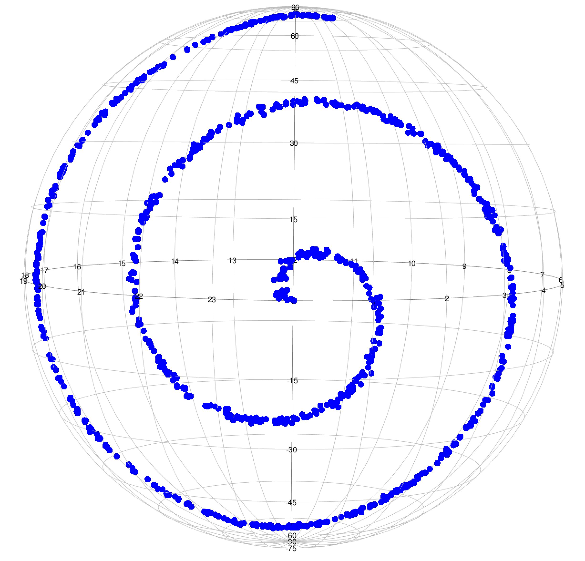
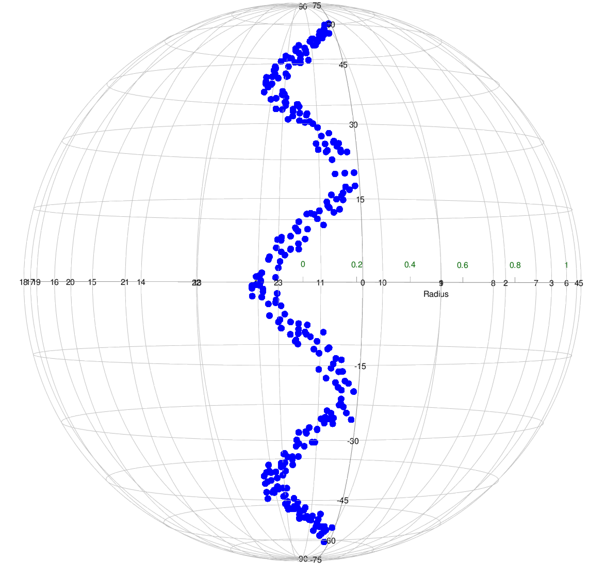
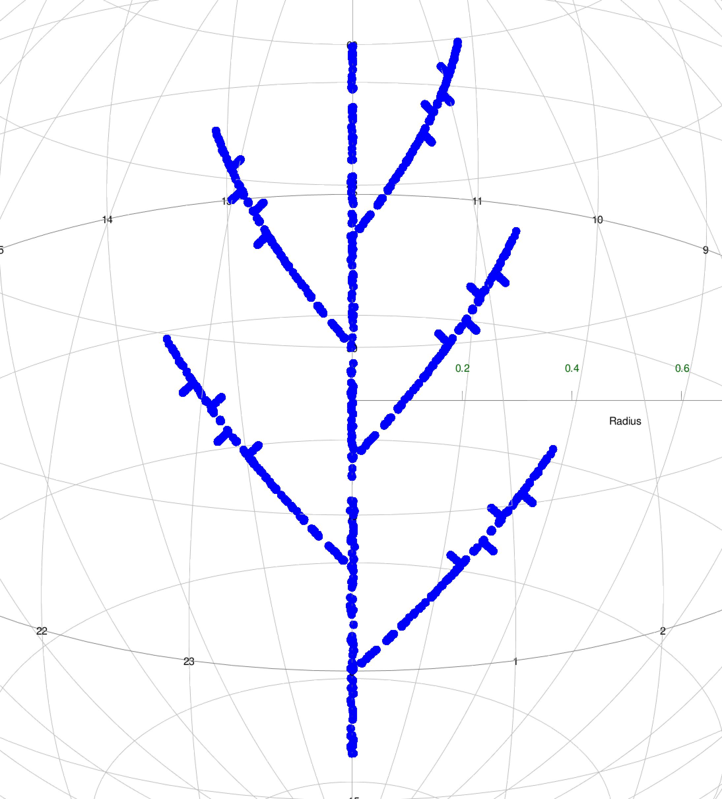

# Introduction

This paper aims to introduce an R package
[spherepc](https://CRAN.R-project.org/package=spherepc) that considers
several dimension reduction techniques on a sphere, which encompass
recently developed approaches such as SPC and LPG as well as some
existing methods, and discuss how to implement these methods through
[spherepc](https://CRAN.R-project.org/package=spherepc).

Dimension reduction methods are widely used in various fields, including
statistics and machine learning, by efficiently compressing data and
removing noise [@Benner2005]. As one of the dimension reduction methods,
the principal curves of @Hastie1989 are suitable for fitting a curve or
a surface of data in Euclidean space, which go through the middle of the
data. @Hauberg2016 proposed an algorithm to find the principal curves in
Riemannian manifolds based on the concept of the original principal
curves. However, the principal curves proposed by @Hauberg2016 no longer
represent the data continuously because of the approximation of the
projection step required to fit the curves.

Recently, @Lee2021 proposed a new method, termed spherical principal
curves (SPC), that constructs principal curves, ensuring a stationary
property on spheres. SPC is useful for representing circular or waveform
data with smaller reconstruction errors than conventional methods,
including principal geodesic analysis [@Fletcher2004], exact principal
circle [@Lee2021], and principal curves proposed by @Hauberg2016.
However, SPC has the disadvantage of being sensitive to initialization.
As a result, there are some data structures that SPC does not apply to,
for example, data with spirals, zigzags, or branches like tree-shape. A
localized version of SPC called local principal geodesics (LPG) is being
developed to resolve such a problem. A function for LPG is also provided
in the package [spherepc](https://CRAN.R-project.org/package=spherepc).
Research on the LPG is underway in progress.

To the best of our knowledge, no available R packages offer the methods
of dimension reduction and principal curves on a sphere. The existing R
packages providing principal curves, such as
[princurve](https://CRAN.R-project.org/package=princurve) [@princurve]
and [LPCM](https://CRAN.R-project.org/package=LPCM) [@LPCM], are
available only on Euclidean space, not on a sphere or (Riemannian)
manifold. In addition, most dimension reduction methods on manifolds
[@Huckemann2010intrinsic; @Panaretos2014; @Liu2017level] involve
somewhat complex optimizations. The proposed package
[spherepc](https://CRAN.R-project.org/package=spherepc) for R provides
the state-of-the-art principal curve technique on the sphere [@Lee2021]
and comprehensively collects and implements the existing methods
[@Fletcher2004; @Hauberg2016].

The rest of this paper is organized as follows. The following section
introduces the existing methods for dimension reduction on the sphere
and relevant functions covered in the package
[spherepc](https://CRAN.R-project.org/package=spherepc), which is
available on CRAN. Furthermore, their usages are discussed with examples
in detail. Then, the spherical principal curves proposed by [@Lee2021]
and principal curves of [@Hauberg2016] are briefly described. In
addition, implementations of the SPC() and SPC.Hauberg() functions in
the [spherepc](https://CRAN.R-project.org/package=spherepc) are
presented. The subsequent section discusses the local principal
geodesics (LPG) with the implementation of various simulated data,
demonstrating its promising usability. In the application session, all
the mentioned methods are performed to analyze real seismological data.
Finally, conclusions are given in the last section.

# Existing methods {#sec:method}

## Principal geodesic analysis

Principal geodesic analysis (PGA) proposed by @Fletcher2004 can be
regarded as a generalization of principal component analysis (PCA) to
Riemannian manifolds. In particular, @Fletcher2004 performed dimension
reduction of data on the Cartesian product space of the manifolds. In
detail, the data are projected onto the tangent spaces at the intrinsic
means of each component of the manifolds; thus, the given data are
approximated as points on Euclidean vector space, and subsequently, PCA
is applied to the points. As a result, the dimension reduction can be
performed through the inverse of the tangent projections.

The principal geodesic analysis can be implemented by the PGA() function
available in the
[spherepc](https://CRAN.R-project.org/package=spherepc). The detailed
usage of the PGA() function is described as follows.

::: example
PGA(data, col1 = \"blue\", col2 = \"red\")
:::

Before using the PGA() function, it requires loading the packages
[rgl](https://CRAN.R-project.org/package=rgl) [@Adler2020],
[sphereplot](https://CRAN.R-project.org/package=sphereplot)
[@Robotham2013], and
[geosphere](https://CRAN.R-project.org/package=geosphere)
[@Hijmans2017]. The following codes yield an implementation of the PGA()
function.

::: example
\#### for all simulated datasets, longitude and latitude are expressed
in degrees \#### example 1: half-great circle data \> circle \<-
GenerateCircle(c(150, 60), radius = pi/2, T = 1000) \> sigma \<- 2 \#
noise level \> half.circle \<- circle\[circle\[, 1\] \< 0, , drop =
FALSE\] \> half.circle \<- half.circle + sigma \*
rnorm(nrow(half.circle)) \> PGA(half.circle)

\#### example 2: S-shaped data \# the dataset consists of two parts: lon
  Uniform\[0, 20\], \# lat = sqrt(20 \* lon - lon\^2) + N(0, sigma\^2),
\# lon   Uniform\[-20, 0\], lat = -sqrt(-20 \* lon - lon\^2) + N(0,
sigma\^2) \> n \<- 500 \> sigma \<- 1 \# noise level \> lon \<- 60 \*
runif(n) \> lat \<- (60 \* lon - lon\^2)\^(1/2) + sigma \* rnorm(n) \>
simul.S1 \<- cbind(lon, lat) \> lon2 \<- -60 \* runif(n) \> lat2 \<-
-(-60 \* lon2 - lon2\^2)\^(1/2) + sigma \* rnorm(n) \> simul.S2 \<-
cbind(lon2, lat2) \> simul.S \<- rbind(simul.S1, simul.S2) \>
PGA(simul.S)
:::

Because a principal geodesic is always a great circle, the PGA()
function is suitable for identifying the global data trend. The
implementations of half-circle and S-shaped data are displayed in
Figure [\[fig:PGA\]](#fig:PGA){reference-type="ref"
reference="fig:PGA"}, where the principal geodesic properly extracts the
global trends in the half-great circle and S-shaped data, while it
cannot identify the circular variations in the S-shaped case. In
addition, the arguments and outputs of the PGA() function are described
in Tables [1](#table:PGA){reference-type="ref" reference="table:PGA"}
and [2](#table:PGAout){reference-type="ref" reference="table:PGAout"}.

.png) .png)

::: {#table:PGA}
  Argument   Description
  ---------- -----------------------------------------------------------------------------------------------------------------------------------------
  data       matrix or data frame consisting of spatial locations with two columns. Each row represents longitude and latitude (denoted by degrees).
  col1       color of data. The default is blue.
  col2       color of the principal geodesic line. The default is red.

  : Arguments of the PGA().
:::

::: {#table:PGAout}
  Output   Description
  -------- -------------------------------------------------------------------------------------------------
  plot     plotting of the result in 3D graphics.
  line     spatial locations (longitude and latitude by degrees) of points in the principal geodesic line.

  : Outputs of the PGA().
:::

## Principal circle

In a spherical surface, as shown in
Figure [\[fig:PGA\]](#fig:PGA){reference-type="ref"
reference="fig:PGA"}, the principal geodesic analysis always results in
a great circle, which cannot be sufficient to identify the non-geodesic
structure of data. The circle on a sphere that minimizes a
reconstruction error is called a principal circle, where the
reconstruction error is defined as the total sum of squares of geodesic
distances between the circle and data points. However, the existing
method for generating the principal circle is still based on the tangent
space approximation and its inverse process, thereby leading to
numerical errors. @Lee2021 have proposed an exact principal circle in an
intrinsic way and its practical algorithm based on gradient descent. The
details are described in Section 3 of @Kim2020 and Appendix B of
@Lee2021spherical:supp. The
[spherepc](https://CRAN.R-project.org/package=spherepc) package provides
the PrincipalCircle() function to implement the intrinsic principal
circle. Its usage is followed by

::: example
PrincipalCircle(data, step.size = 1e-3, thres = 1e-5, maxit = 10000).
:::

::: {#table:PrincipalCircle}
  Argument    Description
  ----------- --------------------------------------------------------------------------------------------------------------------------------------------
  data        matrix or data frame consisting of spatial locations (longitude and latitude denoted by degrees) with two columns.
  step.size   step size of gradient descent algorithm. For convergence of the algorithm, step.size is recommended to be below 0.01. The default is 1e-3.
  thres       threshold of the stopping condition. The default is 1e-5.
  maxit       maximum number of iterations. The default is 10000.

  : Arguments of the PrincipalCircle().
:::

The arguments of the PrincipalCircle() are described in
Table [3](#table:PrincipalCircle){reference-type="ref"
reference="table:PrincipalCircle"}, and its output is a
three-dimensional vector, where the first and second components are
longitude and latitude (represented by degrees), respectively. The last
one is the radius of the principal circle. To display the circle, the
GenerateCircle() function should be implemented. Its usage is followed
by

::: example
GenerateCircle(center, radius, T = 1000).
:::

The output of the GenerateCircle() function is a matrix consisting of
spatial locations (longitude and latitude by degrees) with two columns,
which can be plotted by the sphereplot::rgl.sphgrid() and
sphereplot::rgl.sphpoints() functions from the
[sphereplot](https://CRAN.R-project.org/package=sphereplot) package
[@Robotham2013]. Note that the
[sphereplot](https://CRAN.R-project.org/package=sphereplot) package
depends on the [rgl](https://CRAN.R-project.org/package=rgl) package
[@Adler2020]. The detailed arguments of the GenerateCircle() function
are described in Table [4](#table:GenerateCircle){reference-type="ref"
reference="table:GenerateCircle"}.

::: {#table:GenerateCircle}
  Argument   Description
  ---------- -------------------------------------------------------------------------------------------------------------
  center     center of circle with spatial locations (longitude and latitude denoted by degrees).
  radius     radius of circle. It should be range from 0 to $\pi$.
  T          the number of points that make up a circle. The points in a circle are equally spaced. The default is 1000.

  : Arguments of the GenerateCircle().
:::

The following codes implement principal circles by the PrincipalCircle()
and GenerateCircle() functions.

::: example
\## for all the following examples, longitude and latitude are denoted
by degrees \#### example 1: half-great circle data \> circle \<-
GenerateCircle(c(150, 60), radius = pi/2, T = 1000) \> half.great.circle
\<- circle\[circle\[, 1\] \< 0, , drop = FALSE\] \> sigma \<- 2 \# noise
level \> half.great.circle \<- half.great.circle + sigma \*
rnorm(nrow(half.great.circle)) \## find a principal circle \> PC \<-
PrincipalCircle(half.great.circle) \> result \<-
GenerateCircle(PC\[1:2\], PC\[3\], T = 1000) \## plot the half-great
circle data and principal circle \> sphereplot::rgl.sphgrid(col.lat =
\"black\", col.long = \"black\") \>
sphereplot::rgl.sphpoints(half.great.circle, radius = 1, col = \"blue\",
size = 9) \> sphereplot::rgl.sphpoints(result, radius = 1, col =
\"red\", size = 6)

\#### example 2: circular data \> n \<- 700 \# the number of samples \>
sigma \<- 5 \# noise level \> x \<- seq(-180, 180, length.out = n) \> y
\<- 45 + sigma \* rnorm(n) \> simul.circle \<- cbind(x, y) \## find a
principal circle \> PC \<- PrincipalCircle(simul.circle) \> result \<-
GenerateCircle(PC\[1:2\], PC\[3\], T = 1000) \## plot the circular data
and principal circle \> sphereplot::rgl.sphgrid(col.lat = \"black\",
col.long = \"black\") \> sphereplot::rgl.sphpoints(simul.circle, radius
= 1, col = \"blue\", size = 9) \> sphereplot::rgl.sphpoints(result,
radius = 1, col = \"red\", size = 6)
:::

The results of the principal circle are shown in
Figure [\[fig:PC\]](#fig:PC){reference-type="ref" reference="fig:PC"}.
As one can see, the principal circle identifies the circular patterns of
the noisy half-great circle and circular dataset well.

.png) .png)

# Spherical principal curves

Principal curves proposed by @Hastie1989 can be considered as a
nonlinear generalization of the principal component analysis in the
sense that the principal curves pass through the middle of given data
and reserve a stationary property. The curve is a smooth function from a
one-dimensional closed interval to a given space; then, a curve $f$ is
said to be a principal curve of $X$ or self-consistent if the curve
satisfies
$$f(\lambda) = \mathbb{E}\big(X \ | \ \lambda_{f}(X)=\lambda\big),$$
where $f(\lambda_f(x))$ is the closest (projection) point in the curve
$f$ from the point $x$.

@Hauberg2016 provided an algorithm for principal curves on Riemannian
manifolds. However, @Hauberg2016 used approximations for finding the
closest point of each data point, which may lead to numerical errors.
Recently, @Lee2021 presented theoretical results of principal curves on
spheres and a practical algorithm for constructing principal curves
without any approximations, called spherical principal curves (SPC),
thereby causing the given data to be represented more precisely and
smoothly compared to principal curves of @Hauberg2016. In the both ways
of extrinsic and intrinsic approaches, the method of SPC updates curves
on the spherical surfaces to represent the given data and fits curves
that satisfy the stationary conditions. For more details, refer to
@Kim2020 or @Lee2021.

The package [spherepc](https://CRAN.R-project.org/package=spherepc)
provides the SPC() function for implementing spherical principal curves
and the SPC.Hauberg() function for principal curves of @Hauberg2016. The
usage of the SPC() function is as follows.

::: example
SPC(data, q = 0.05, T = nrow(data), step.size = 1e-3, maxit = 30, type =
\"Intrinsic\", thres = 1e-2, deletePoints = FALSE, plot.proj = FALSE,
kernel = \"quartic\", col1 = \"blue\", col2 = \"green\", col3 =
\"red\").
:::

The usage of the SPC.Hauberg() function is the same as that of the SPC()
function. Before implementing the SPC() and SPC.Hauberg() functions, it
requires loading the [rgl](https://CRAN.R-project.org/package=rgl)
[@Adler2020],
[sphereplot](https://CRAN.R-project.org/package=sphereplot)
[@Robotham2013], and
[geosphere](https://CRAN.R-project.org/package=geosphere) [@Hijmans2017]
packages. To implement the SPC() and SPC.Hauberg() functions, we
consider the waveform data used in @Liu2017level, @Kim2020, and
@Lee2021. The generating equation of waveform is
$$\phi = \alpha\cdot \sin(f \theta\cdot \pi/180) + 10,$$ where $\phi$,
$\theta$, $\alpha$, and $f$ denote the longitude, latitude in degrees,
amplitude and frequency of the waveform, respectively. $\theta$ is
uniformly sampled from the interval $[-180,\, 180]$ and a Gaussian
random noise from $N(0,\, \sigma^2)$ is added on each $\phi$ where
$\sigma = 2,\, 10$. The generating waveform data and implementations of
the SPC() and SPC.Hauberg() functions are as follows.

::: example
\#### longitude and latitude are expressed in degrees \#### example:
waveform data \> n \<- 200 \> alpha \<- 1/3; freq \<- 4 \# amplitude and
frequency of wave \> sigma1 \<- 2; sigma2 \<- 10 \# noise levels \> lon
\<- seq(-180, 180, length.out = n) \# uniformly sampled longitude \> lat
\<- alpha \* 180/pi \* sin(freq \* lon \* pi/180) + 10 \# latitude
vector \## add Gaussian noises on the latitude vector \> lat1 \<- lat +
sigma1 \* rnorm(length(lon)) \> lat2 \<- lat + sigma2 \*
rnorm(length(lon)) \> wave1 \<- cbind(lon, lat1); wave2 \<- cbind(lon,
lat2) \## implement Hauberg's principal curves to the waveform data \>
SPC.Hauberg(wave1, q = 0.05) \## implement SPC to the (noisy) waveform
data \> SPC(wave1, q = 0.05) \> SPC(wave2, q = 0.05)
:::

The above codes generate the results in
Figure [\[SPC:wave\]](#SPC:wave){reference-type="ref"
reference="SPC:wave"}. As one can see, the SPC() and SPC.Hauberg()
functions identify the waveform pattern of the simulated data.
Especially, the SPC() generates a smoother curve. The detailed arguments
and outputs of the SPC() are described in Tables 
[5](#table:SPC){reference-type="ref" reference="table:SPC"} and
[6](#table:SPCout){reference-type="ref" reference="table:SPCout"},
respectively, which are the same for the SPC.Hauberg().

.png) .png)
.png)

::: {#table:SPC}
  Argument       Description
  -------------- --------------------------------------------------------------------------------------------------------------------------------------------------------------------------------------------------------------------------------------------------------------------------------------------------------------------------------------------------------------------------------------------------------------------------------------------------------------------------------------------------------------------------------------------------------
  data           matrix or data frame consisting of spatial locations with two columns. Each row represents longitude and latitude (denoted by degrees).
  q              numeric value of the smoothing parameter. The parameter plays the same role, as the bandwidth does in kernel regression, in the SPC function. The value should be a numeric value between 0.01 and 0.5. The default is 0.1.
  T              the number of points making up the resulting curve. The default is 1000.
  step.size      step size of the PrincipalCircle function. The default is 0.001. The resulting principal circle is used as an initialization of the SPC function.
  maxit          maximum number of iterations. The default is 30.
  type           type of mean on the sphere. The default is \"Intrinsic\" and the other choice is \"Extrinsic\".
  thres          threshold of the stopping condition. The default is 0.01.
  deletePoints   logical value. The argument is an option of whether to delete points or not. If deletePoints is FALSE, this function leaves the points in curves that do not have adjacent data for each expectation step. As a result, the function usually returns a closed curve, *i.e.* a curve without endpoints. If deletePoints is TRUE, this function deletes the points in curves that do not have adjacent data for each expectation step. As a result, The SPC function usually returns an open curve, *i.e.* a curve with endpoints. The default is FALSE.
  plot.proj      logical value. If the argument is TRUE, the projection line for each data point is plotted. The default is FALSE.
  kernel         kind of kernel function. The default is the quartic kernel, and the alternative is indicator or Gaussian.
  col1           color of data. The default is blue.
  col2           color of points in principal curves. The default is green.
  col3           color of resulting principal curves. The default is red.

  : Arguments of the SPC().
:::

::: {#table:SPCout}
  Output        Description
  ------------- -------------------------------------------------------------------------------------
  plot          plotting of the result in 3D graphics.
  prin.curves   spatial locations (denoted by degrees) of points in the resulting principal curves.
  line          connecting lines between points in prin.curves.
  converged     whether or not the algorithm converged.
  iteration     the number of iterations of the algorithm.
  recon.error   sum of squared distances between the data and their projections.
  num.dist.pt   the number of distinct projections.

  : Outputs of the SPC().
:::

## Options for spherical principal curves

There are some options for the SPC() and SPC.Hauberg() functions. In
particular, we implement using the arguments plot.proj and deletePoints,
described in Table [5](#table:SPC){reference-type="ref"
reference="table:SPC"}. If plot.proj = TRUE is used, then the projection
line for each data point is plotted. If the argument deletePoints = TRUE
is performed, the SPC() function deletes the points in curves that do
not have adjacent data for each expectation step required to fit the
principal curves, returning an open curve, *i.e.*, a curve with
endpoints. As a result, the principal curves are more parsimonious since
a redundant part of the resulting curves is removed. The SPC.Hauberg()
function also contains the same options. For implementing these two
arguments, the following codes are performed through real earthquake
data.

::: example
\> data(Earthquake) \# collect spatial locations (longitude and latitude
denoted by degrees) of data \> earthquake \<-
cbind(Earthquake$longitude, Earthquake$latitude)

\#### example 1: plot the projection lines (option of plot.proj) \>
SPC(earthquake, q = 0.1, plot.proj = TRUE)

\#### example 2: open principal curves (option of deletePoints) \>
SPC(earthquake, q = 0.04, deletePoints = TRUE)
:::

The results are illustrated in
Figure [\[fig:SPCoption\]](#fig:SPCoption){reference-type="ref"
reference="fig:SPCoption"}. The left panel shows a closed principal
curve (red) with projection lines (black) of each data point onto the
curve, and the right panel displays an open principal curve due to the
option deletePoints = TRUE. It is a parsimonious result because the
redundant part on the upper right side of the sphere is removed.

.png})
.png})

# Local principal geodesics {#lpg}

Suppose that observations have a non-geodesic structure. Then the PGA
may not be beneficial to represent such data because PGA always results
in a geodesic line. To overcome this problem, we consider performing PGA
locally and repeatedly to detect the non-geodesic and complex structures
of data, which can be interpreted as a localized version of the PGA and
SPC. The newly proposed method is called local principal geodesics
(LPG). The main idea behind the LPG is that non-geodesic structures can
be regarded as a part of geodesic when viewed locally. Although there is
no reference to the LPG because research on LPG is underway, there is a
localized principal curve method on Euclidean space [@Einbeck2005local],
which is similar to LPG and may share some motivation with the LPG. For
more details, refer to [@Einbeck2005local].

The package [spherepc](https://CRAN.R-project.org/package=spherepc)
offers the LPG() function to recognize various data structures, such as
spirals, zigzag, and tree data. The usage of the function is

::: example
LPG(data, scale = 0.04, tau = scale/3, nu = 0, maxpt = 500, seed = NULL,
kernel = \"indicator\", thres = 1e-4, col1 = \"blue\", col2 = \"green\",
col3 = \"red\").
:::

Like the previous functions, before the LPG() function is implemented,
it requires to load the [rgl](https://CRAN.R-project.org/package=rgl)
[@Adler2020],
[sphereplot](https://CRAN.R-project.org/package=sphereplot)
[@Robotham2013], and
[geosphere](https://CRAN.R-project.org/package=geosphere) [@Hijmans2017]
packages. The detailed arguments and outputs of this function are
described in Tables [7](#table:LPG){reference-type="ref"
reference="table:LPG"} and [8](#table:LPGout){reference-type="ref"
reference="table:LPGout"}. We implement the following code to apply the
LPG() function to the spiral, zigzag, and tree simulated data
illustrated in Figures
 [\[fig:spiral\]](#fig:spiral){reference-type="ref"
reference="fig:spiral"},
[\[fig:zigzag\]](#fig:zigzag){reference-type="ref"
reference="fig:zigzag"}, and
[\[fig:tree\]](#fig:tree){reference-type="ref" reference="fig:tree"}.

::: example
\## longitude and latitude are expressed in degrees \#### example 1:
spiral data \> set.seed(40) \> n \<- 900 \# the number of samples \>
sigma1 \<- 1; sigma2 \<- 2.5; \# noise levels \> radius \<- 73; slope
\<- pi/16 \# radius and slope of the spiral \## polar coordinate of
(longitude, latitude) \> r \<- runif(n)\^(2/3) \* radius; theta \<-
-slope \* r + 3 \## transform to (longitude, latitude) \> correction \<-
(0.5 \* r/radius + 0.3) \# correction of noise level \> lon1 \<- r \*
cos(theta) + correction \* sigma1 \* rnorm(n) \> lat1 \<- r \*
sin(theta) + correction \* sigma1 \* rnorm(n) \> lon2 \<- r \*
cos(theta) + correction \* sigma2 \* rnorm(n) \> lat2 \<- r \*
sin(theta) + correction \* sigma2 \* rnorm(n) \> spiral1 \<- cbind(lon1,
lat1); spiral2 \<- cbind(lon2, lat2) \## plot the spiral data \>
rgl.sphgrid(col.lat = 'black', col.long = 'black') \>
rgl.sphpoints(spiral1, radius = 1, col = 'blue', size = 12) \##
implement the LPG to (noisy) spiral data \> LPG(spiral1, scale = 0.06,
nu = 0.1, seed = 100) \> LPG(spiral2, scale = 0.12, nu = 0.1, seed =
100)
:::

 .png)
.png)

::: example
\#### example 2: zigzag data \> set.seed(10) \> n \<- 50 \# the number
of samples is 6 \* n = 300 \> sigma1 \<- 2; sigma2 \<- 5 \# noise levels
\> x1 \<- x2 \<- x3 \<- x4 \<- x5 \<- x6 \<- runif(n) \* 20 - 20 \> y1
\<- x1 + 20 + sigma1 \* rnorm(n); y2 \<- -x2 + 20 + sigma1 \* rnorm(n)
\> y3 \<- x3 + 60 + sigma1 \* rnorm(n); y4 \<- -x4 - 20 + sigma1 \*
rnorm(n) \> y5 \<- x5 - 20 + sigma1 \* rnorm(n); y6 \<- -x6 - 60 +
sigma1 \* rnorm(n) \> x \<- c(x1, x2, x3, x4, x5, x6); y \<- c(y1, y2,
y3, y4, y5, y6) \> simul.zigzag1 \<- cbind(x, y) \## plot the zigzag
data \> sphereplot::rgl.sphgrid(col.lat = 'black', col.long = 'black')
\> sphereplot::rgl.sphpoints(simul.zigzag1, radius = 1, col = 'blue',
size = 12) \## implement the LPG to the zigzag data \>
LPG(simul.zigzag1, scale = 0.1, nu = 0.1, maxpt = 45, seed = 50)

\## noisy zigzag data \> set.seed(10) \> z1 \<- z2 \<- z3 \<- z4 \<- z5
\<- z6 \<- runif(n) \* 20 - 20 \> w1 \<- z1 + 20 + sigma2 \* rnorm(n);
w2 \<- -z2 + 20 + sigma2 \* rnorm(n) \> w3 \<- z3 + 60 + sigma2 \*
rnorm(n); w4 \<- -z4 - 20 + sigma2 \* rnorm(n) \> w5 \<- z5 - 20 +
sigma2 \* rnorm(n); w6 \<- -z6 - 60 + sigma2 \* rnorm(n) \> z \<- c(z1,
z2, z3, z4, z5, z6); w \<- c(w1, w2, w3, w4, w5, w6) \> simul.zigzag2
\<- cbind(z, w) \## implement the LPG to the noisy zigzag data \>
LPG(simul.zigzag2, scale = 0.2, nu = 0.1, maxpt = 18, seed = 20)
:::

 .png)
.png)

Note that the LPG() function may return several curves. We now implement
the function in a complex simulation dataset composed of several curves.
As shown in the left panel of
Figure [\[fig:tree\]](#fig:tree){reference-type="ref"
reference="fig:tree"}, the tree object has twenty-six geodesic (linear)
structures consisting of one stem, five branches, and twenty
subbranches. It is not informative to show the generating formula for
the tree dataset. Instead, we provide its generating code with
explanatory notes as follows.

::: example
\#### example 3: tree dataset \## the tree dataset consists of stem,
branches and subbranches \## generate stem \> set.seed(10) \> n1 \<-
200; n2 \<- 100; n3 \<- 15 \# the number of samples in \# a stem, a
branch, and a subbrach \> sigma1 \<- 0.1; sigma2 \<- 0.05; sigma3 \<-
0.01 \# noise levels \> noise1 \<- sigma1 \* rnorm(n1); noise2 \<-
sigma2 \* rnorm(n2) \> noise3 \<- sigma3 \* rnorm(n3) \> l1 \<- 70; l2
\<- 20; l3 \<- 1 \# length of stem, branches, and subbranches \> rep1
\<- l1 \* runif(n1) \# repeated part of stem \> stem \<- cbind(0 +
noise1, rep1 - 10) \## generate branch \> rep2 \<- l2 \* runif(n2) \#
repeated part of branch \> branch1 \<- cbind(-rep2, rep2 + 10 + noise2);
branch2 \<- cbind(rep2, rep2 + noise2) \> branch3 \<- cbind(rep2, rep2 +
20 + noise2) \> branch4 \<- cbind(rep2, rep2 + 40 + noise2) \> branch5
\<- cbind(-rep2, rep2 + 30 + noise2) \> branch \<- rbind(branch1,
branch2, branch3, branch4, branch5) \## generate subbranches \> rep3 \<-
l3 \* runif(n3) \# repeated part in subbranches \> branches1 \<-
cbind(rep3 - 10, rep3 + 20 + noise3) \> branches2 \<- cbind(-rep3 + 10,
rep3 + 10 + noise3) \> branches3 \<- cbind(rep3 - 14, rep3 + 24 +
noise3) \> branches4 \<- cbind(-rep3 + 14, rep3 + 14 + noise3) \>
branches5 \<- cbind(-rep3 - 12, -rep3 + 22 + noise3) \> branches6 \<-
cbind(rep3 + 12, -rep3 + 12 + noise3) \> branches7 \<- cbind(-rep3 - 16,
-rep3 + 26 + noise3) \> branches8 \<- cbind(rep3 + 16, -rep3 + 16 +
noise3) \> branches9 \<- cbind(rep3 + 10, -rep3 + 50 + noise3) \>
branches10 \<- cbind(-rep3 - 10, -rep3 + 40 + noise3) \> branches11 \<-
cbind(-rep3 + 12, rep3 + 52 + noise3) \> branches12 \<- cbind(rep3 - 12,
rep3 + 42 + noise3) \> branches13 \<- cbind(rep3 + 14, -rep3 + 54 +
noise3) \> branches14 \<- cbind(-rep3 - 14, -rep3 + 44 + noise3) \>
branches15 \<- cbind(-rep3 + 16, rep3 + 56 + noise3) \> branches16 \<-
cbind(rep3 - 16, rep3 + 46 + noise3) \> branches17 \<- cbind(-rep3 + 10,
rep3 + 30 + noise3) \> branches18 \<- cbind(-rep3 + 14, rep3 + 34 +
noise3) \> branches19 \<- cbind(rep3 + 16, -rep3 + 36 + noise3) \>
branches20 \<- cbind(rep3 + 12, -rep3 + 32 + noise3) \> sub.branches \<-
rbind(branches1, branches2, branches3, branches4, branches5, +
branches6, branches7, branches8, branches9, branches10, branches11,
branches12, + branches13, branches14, branches15, branches16,
branches17, branches18, + branches19, branches20) \## tree dataset
consists of stem, branch, and subbranches \> tree \<- rbind(stem,
branch, sub.branches) \## plot the tree dataset \>
sphereplot::rgl.sphgrid(col.lat = 'black', col.long = 'black') \>
sphereplot::rgl.sphpoints(tree, radius = 1, col = 'blue', size = 12) \##
implement the LPG function to the tree dataset \> LPG(tree, scale =
0.03, nu = 0.2, seed = 10)
:::

 .png)

As displayed in
Figures [\[fig:spiral\]](#fig:spiral){reference-type="ref"
reference="fig:spiral"},
[\[fig:zigzag\]](#fig:zigzag){reference-type="ref"
reference="fig:zigzag"}, and
[\[fig:tree\]](#fig:tree){reference-type="ref" reference="fig:tree"},
the LPG() function identifies the non-geodesic or complex patterns of
the simulated datasets well as long as the parameters of
$\mbox{scale}~\mbox{and}~\mbox{nu}$ are properly chosen. The arguments
and outputs of the function are respectively described in
Tables [7](#table:LPG){reference-type="ref" reference="table:LPG"} and
[8](#table:LPGout){reference-type="ref" reference="table:LPGout"}.

::: {#table:LPG}
  Argument   Description
  ---------- -------------------------------------------------------------------------------------------------------------------------------------------------------------------------------------------------------------------------------------------------------------------------------------------------------------
  data       matrix or data frame consisting of spatial locations with two columns. Each row represents longitude and latitude (denoted by degrees).
  scale      scale parameter for this function. The argument is the degree to which the LPG function expresses data locally; thus, as the scale grows, the result of the LPG becomes similar to that of the PGA function. The default is 0.4.
  tau        forwarding or backwarding distance of each step. It is empirically recommended to choose a third of scale, which is the default of this argument.
  nu         parameter to alleviate bias of resulting curves. nu represents the viscosity of the given data and it should be selected in $[0,\, 1)$. The default is zero. When nu is close to 1, the curve usually swirls similarly to the motion of a large viscous fluid. The argument maxpt can control the swirling.
  maxpt      maximum number of points in each curve. The default is 500.
  seed       random seed number.
  kernel     kind of kernel function. The default is the indicator kernel, and the alternative is quartic or Gaussian.
  thres      threshold of the stopping condition for the IntrinsicMean function in the process of the LPG function. The default is 1e-4.
  col1       color of data. The default is blue.
  col2       color of points in the resulting principal curves. The default is green.
  col3       color of the resulting curves. The default is red.

  : Arguments of the LPG().
:::

::: {#table:LPGout}
  Output        Description
  ------------- -------------------------------------------------------------------------------
  plot          plotting of the result in 3D graphics.
  num.curves    the number of resulting curves.
  prin.curves   spatial locations (represented by degrees) of points in the resulting curves.
  line          connecting lines between points in prin.curves.

  : Outputs of the LPG().
:::

# Application

 

We use earthquake data from the U.S. Geological Survey, which has
collected significant earthquakes (8+ Mb magnitude) around the Pacific
Ocean since 1900. As shown in
Figure [\[fig:earthquake\]](#fig:earthquake){reference-type="ref"
reference="fig:earthquake"}, the data contain 77 observations
distributed in the borders between the Eurasian, Pacific, North
American, and Nazca tectonic plates. The data have three features: the
observations are distributed globally, scattered, and form non-geodesic
structures. Because the tectonic plates are constantly moving in
different directions, identifying the hidden patterns of borders is
useful in geostatistics and seismology, as noted in
[@Biau; @Mardia2014]. It can be possible to identify the borders of
plates by applying dimension reduction methods to the earthquake data.

To apply the aforementioned dimension reduction methods to the
earthquake data, we use the following code.

::: example
\> data(Earthquake) \#### collect spatial locations (longitude and
latitude by degrees) of data \> earthquake \<-
cbind(Earthquake$longitude, Earthquake$latitude)

\#### example 1: principal geodesic analysis (PGA) \> PGA(earthquake)

\#### example 2: principal circle \## get center and radius of principal
circle \> circle \<- PrincipalCircle(earthquake) \## generate the
principal circle \> PC \<- GenerateCircle(circle\[1:2\], circle\[3\], T
= 1000) \## plot the principal circle \>
sphereplot::rgl.sphgrid(col.long = \"black\", col.lat = \"black\") \>
sphereplot::rgl.sphpoints(earthquake, radius = 1, col = \"blue\", size =
12) \> sphereplot::rgl.sphpoints(PC, radius = 1, col = \"red\", size =
9)
:::

Examples 1 and 2 implement the principal geodesic and the principal
circle, respectively. As illustrated in
Figure [\[fig:PGAPC\]](#fig:PGAPC){reference-type="ref"
reference="fig:PGAPC"}, the principal geodesic (left) fails to identify
the variations of the earthquake data. The principal circle (right)
captures the global trend of the data, whereas the circle could not
extract the local variations of the data.

.png)
.png)

.png)
.png)

::: example
\#### example 3: spherical principal curves and principal curves of
Hauberg \> SPC.Hauberg(earthquake, q = 0.1) \# principal curves of
Hauberg \> SPC(earthquake, q = 0.1) \# spherical principal curves
:::

Example 3 fits the spherical principal curve and Hauberg's principal
curve with $q=0.1$. As shown in
Figure [\[fig:SPC\]](#fig:SPC){reference-type="ref"
reference="fig:SPC"}, both methods identify the curved feature of the
earthquake data. The spherical principal curve particularly tends to be
more continuous than Hauberg's principal curve.

::: example
\#### example 4: spherical principal curves with q = 0.15, 0.1, 0.03,
and 0.02 \> SPC(earthquake, q = 0.15) \> SPC(earthquake, q = 0.1) \>
SPC(earthquake, q = 0.03) \> SPC(earthquake, q = 0.02)
:::

Example 4 applies the spherical principal curve to the earthquake data
with varying $q=0.15,\, 0.1,\, 0.03,\, 0.02$. The parameter $q$ plays a
role in the bandwidth of the SPC() function. As shown in
Figure [\[fig:SPC:change\]](#fig:SPC:change){reference-type="ref"
reference="fig:SPC:change"}, the smaller $q$ is, the rougher the curve
is. On the contrary, the larger $q$ is, the smoother the curve is.

q=015.png)
q=01.png)
q=003.png)
q=002.png)

::: example
\#### example 5: local principal geodesics (LPG) \> LPG(earthquake,
scale = 0.5, nu = 0.2, maxpt = 20, seed = 50) \> LPG(earthquake, scale =
0.4, nu = 0.3, maxpt = 22, seed = 50)
:::

Lastly, example 5 implements the LPG() function with different scale and
nu. As shown in Figure [\[fig:LPG\]](#fig:LPG){reference-type="ref"
reference="fig:LPG"}, the function represents the curved pattern of the
data, illustrating the slightly different features.

.png)
2.png)

# Conclusions

In this paper, the R package
[spherepc](https://CRAN.R-project.org/package=spherepc) has implemented
various dimension reduction methods on a sphere. It includes not only
principal geodesic analysis (PGA), principal circle, and principal
curves of @Hauberg2016 as existing methods but also spherical principal
curves (SPC) and local principal geodesics (LPG) as new approaches. The
[spherepc](https://CRAN.R-project.org/package=spherepc) package has
demonstrated its usefulness by applying the functions to several
simulation examples and real earthquake data. We believe that the
[spherepc](https://CRAN.R-project.org/package=spherepc) is helpful for
applications in various fields, ranging from statistics to engineering,
such as geostatistics, image analysis, pattern recognition, and machine
learning.

# Acknowledgments

This research was supported by the National Research Foundation of Korea
(NRF) funded by the Korea government (2020R1A4A1018207;
2021R1A2C1091357).
