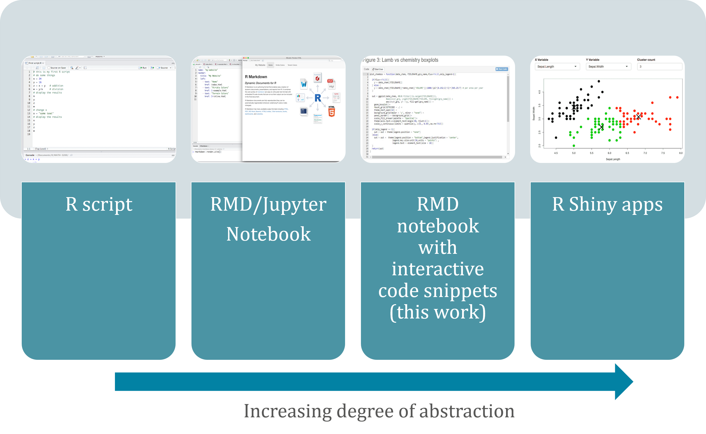

```{r include=FALSE}
knitr::opts_chunk$set(out.width = "\\textwidth")

```

## Introduction


There has been considerable recognition of the need to promote open and reproducible science in the past decade. The FAIR principles [@Wilkinson2016a; @Stall2019] (https://www.go-fair.org/fair-principles/) of reproducible research are now known to most scientists. While significant advances has been made through the adoption of various best practices and policies (e.g. requirements from funders and publishers to archive data and source code, metadata standards), there remains considerable barriers to further advance open science and meet reproducible science needs. One of such issues the availability of various levels of abstraction of the same underlying analysis and code base to collaborate and engage with different stakeholders of diverse needs [@Blair2019; @Hollaway2020]. For complex analysis or analysis that utilize a more advanced computing environment, it is essential to provide the capability to allow users to interact with the analysis at a higher level.

Existing approach to reproducible research focuses on either documenting an entire analysis or allows user-friendly interaction. Within the R ecosystem, R scripts and notebooks allow researchers to work together and to view the entire workflow, while R Shiny apps [@shiny] allows rapid showcase of methods and research outcomes to users with less experience. R Shiny has been widely adopted to share research output and engage stakeholders since its conception in 2013. A recent review [@Kasprzak] shows that bioinformatics is the subject with the most Shiny apps published in journals while earth and environmental science ranks second. Shiny apps are especially helpful to create reproducible analysis [e.g. examples in @Hollaway2020] and explore different scenarios [e.g. @Whateley2015; @Mose2018]. Finally, the interactivity of Shiny apps makes it an excellent tool for teaching [e.g. @Williams2017; @adventr]. However, not all users fit nicely into this dichotomy. Some users may only want to adopt a small fraction of an analysis for their work, while others may simply want to modify a few parts of the analysis in order to test alternative hypothesis. Current use of notebooks do not seem to support such diverse needs as notebook output \textit{elements} (e.g. figures and tables) are not easily reproducible. This issue essentially applies to all coding languages.

One potential way to address the problem described above is to allow
users to experiment with the code in protected computing environment.
This is not limited to creating instances for users to re-run the entire
code. Rather, this can also be done by exposing specific parts of a
notebook as editable and executable code boxes, as seen in many
interactive tutorial web pages for various coding languages. Recently,
while discussing next steps for fostering reproducible research in
artificial intelligence, @Carter2019 lists creating a protected
computing environment ('data enclave' or 'sandbox') for reviewers to log
in and explore as one of the solutions. In software engineering, a
sandbox is a testing environment that isolates untested code changes and
outright experimentation from the production environment or repository,
in the context of software development including Web development and
revision control. Making a sandbox environment available for users to
test and explore various changes to the code that leads to research
outputs is a great step to further open science. Current practice of
open science largely requires users to assemble the notebooks, scripts
and data files provided in their own computing environment, which
requires significant amount of time and effort. A sandbox environment
can greatly reduce such barriers and if such sandboxes are available as
a web service, users can explore and interact with the code that
generates the research outputs at the convenience of their own web browser
on demand.

In this paper, we describe a rapid approach to create and publish
'interactive sandboxes' R Shiny apps from R Markdown documents using
the \pkg{learnr} package, with the aim to bridge the gap between
typical R Markdown notebook and typical Shiny apps in terms of levels of
abstraction. While code and markdown documents gives full details of the
code, standard R Shiny apps has too much limitations on users to
interact with the code and users often cannot see the underlying code.
Our approach allows users to interact with selected parts of the code in
an isolated manner, by specifying certain code chunks in a R Markdown
document as executable code boxes.


## The *learnr* R package

\pkg{learnr} [@learnr] is an R package developed by RStudio to
rapidly create interactive tutorials. It follows the general \textit{R
  Markdown} (the file has .Rmd extensions,
             https://rmarkdown.rstudio.com/index.html) architecture and
essentially creates a pre-rendered Shiny document similar to the way
Shiny user interface (UI) components can be added to any R Markdown documents.
Pre-rendered Shiny documents
(https://rmarkdown.rstudio.com/authoring_shiny_prerendered.HTML)
is a key enabling technology for the \pkg{learnr} package since it
allows users to specify the execution context in each code chunk of a R
Markdown document that is used to render a R Shiny web app. Its use
circumvents the need of a full document render for each end user browser
session so that this type of R Shiny apps can load quickly. To create a
\pkg{learnr} tutorial in RStudio after \pkg{learnr} is
installed, the user chooses a \pkg{learnr} R Markdown template from
a list after clicking the "create new R Markdown document" button. This
template is not different from other .Rmd files, except it requires
additional chunk arguments to control the sandbox appearances. The two
main features of the \pkg{learnr} package are the "exercise" and
"quiz" options. The former allows users to directly type in code,
execute it, and see its results to test their knowledge while the latter
allows other question types such as multiple choice. Both of these
options include auto-graders, hints, and instructor feedback options.
Additional overall options include setting time limits and an option to
forbid users to skip sections. Like any Shiny apps, \pkg{learnr}
apps can be easily embedded to other web pages, as seen in @rmrwr.

Although the \pkg{learnr} package has existed for a few years now,
it is relatively not well known to scientists as a potential use of R
Shiny Apps and it has mostly been used for simple tutorial apps designed
for R beginners. We propose a novel application of the \pkg{learnr}
package to advance reproducible research, which we outline in the next
section.


## Approach: Using *learnr* for reproducible research 'sandboxes'
\pkg{learnr} allows users to create executable code boxes. Our
approach is to publish R notebooks and serve parts of the notebooks as
interactive sandboxes to allow users to re-create certain elements of a
published notebook containing research outputs. We do not use the
auto-graders or any quiz-like functionality of \pkg{learnr} while
keeping the sandboxes. Notebook authors can go through their notebook
and select the code chunks that they would allow users to experiment,
while the others are rendered as static code snippets.

Recognizing \pkg{learnr} documents are themselves R Shiny web apps,
our approach essentially allows the publication of notebooks in the form
of web apps. However, unlike a typical R Shiny web app, users do not
need to prepare a separate UI (i.e. user interface) layout. Advanced
users can modify the site appearance by supplying custom design in .css
files.

Here, we first show the skeleton of a R Markdown (.Rmd) file for a
\pkg{learnr} document (Figure 1). Notice that it is very similar to
a typical .Rmd file where there is a mixture of narratives written in
markdown and R code chunks, in addition to a YAML header. However,
there are a couple of important exceptions, namely the use of the
"exercise" chunk option (i.e. editable and executable code boxes)
and different output type in the YAML header.

Next, we outline the steps an author needs to take to publish notebooks (i.e. R Markdown documents) as interactive sandboxes:
  
1. All research output is included in the form of a well-documented R Markdown document.
2. Open a new \pkg{learnr} R Markdown template. Copy the content of the original notebook.
3. For the code chunks that you would like to become sandboxes, add `exercise=TRUE`. Make sure it has a unique chunk name. It may look something like this: 
  ````markdown
`r ''````{r fig2, warning=FALSE, exercise=TRUE, exercise.lines=30,fig.fullwidth=TRUE}
````


4. Before any interactive code chunks, call the first code chunk 'setup'.
This will pre-load everything that will be used later.
5. Check whether you would like to link any of the interactive code
snippets (by default each of them are independent, and only depends on
          the output of the 'setup' chunk) You may want to modify your code
chunks accordingly.
6. Done! Knit the notebook to view outputs as an interactive web page.
Publish it just like a Shiny app.

The entire process took us a few hours of effort and can be incorporated
to the proof-reading of an R Markdown document. However, we note that as
in any preparation of research output or web development several
iterations are often needed and the time required increases accordingly
as the complexity of the analysis increases.

```{r fig-skeleton, echo=FALSE, fig.cap='A comparison of minimal examples of a typical .Rmd document and a .Rmd document for an interactive sandbox app.', fig.subcap=c('A typical .Rmd file', 'A sandbox app .Rmd file'), fig.ncol = 2, fig.align='center', out.width='.49\\linewidth'}
knitr::include_graphics(c('skeleton-md.png','skeleton.png'))
```

In our implementation in DataLabs
(https://datalab.datalabs.ceh.ac.uk/), the environment and folder
to create the research is made available to the Shiny app in a read-only
fashion. Therefore, the authors do not have to worry about versions of
packages of data or a different software setup. Using DataLabs
straightforward visual tools to publish R Shiny apps, we can publish an
R Markdown notebook with interactive code snippets to reproduce certain
parts of research readily in a few clicks.

## Deployment
In general, \pkg{learnr} tutorial apps can be published the same way
as R Shiny web apps in Shiny servers, such as the ones provided by cloud
service providers or https://shinyapps.io. The \pkg{learnr}
package vignettes provide additional help on deployment.

We also describe our deployment of these apps in DataLabs, a UK NERC
virtual research environment that is being developed. DataLabs is a
collaborative virtual research environment [@Hollaway2020] (https://datalab.datalabs.ceh.ac.uk/) for environmental scientist
to work together where data, software, and methods are all centrally
located in projects. DataLabs provide a space for scientists from
different domains (data science, statisticians, environmental science
                   and computer science) to work together and draw on each other's
expertise. It includes an easy-to-use user interface where users can
publish R Shiny apps with a few clicks, and this applies to these
notebooks with interactive code chunks as well. Importantly, when
provisioning a instance of R Shiny, this is deployed in a Docker
container with read-only access to the project data store being used for
analysis. This allows an unprecedented level of transparency as parts of
the analysis are readily exposed for users to experiment from the exact
environments, datasets (can be large and includes many files), and
versions of software that created the analysis. The use of Docker
deployed onto a Kubernetes infrastructure allows strict limits to be
placed on what visitors can do through the use of resource constraints
and tools such as \CRANpkg{RAppArmor} [@RAppArmor]. While access to
project files is read-only, some author discretion is still advised to
ensure that visitors should not be able to view or list any private code
or data. We also note that future releases of \pkg{learnr} will
contain external exercise evaluators, so that the code sandboxes can be
executed by an independent engine (such as Google Cloud) and give the
benefit of not having to rely on \pkg{RAppArmor}.


## Example: GB rainfall paper


To demonstrate our concept, we have turned an R Markdown notebook for one of our recent papers [@Tso2022] into a \pkg{learnr} site
(https://cptecn-sandboxdemo.datalabs.ceh.ac.uk/) using the
procedures described in the previous sections. The paper investigates
the effect of weather and rainfall types on rainfall chemistry in the
UK. As can be seen in Figure 2, the code chunks to generate certain
parts of the paper is exposed. But unlike a static notebook site, the
code chunk is not only available for copy and paste but allows users to
modify and run on-demand. This makes it very straightforward for user to
experiment with various changes of the original analysis, thereby
promoting transparency and trust.

Since \pkg{learnr} apps are R Markdown documents, Shiny UI elements
can be easily added. We repeat one of the examples by replacing the
interactive code box by a simple selector, with minimal modification of
the code itself. This approach to publish Shiny apps requires
significantly less work than typical R Shiny web apps since no UI design
is needed and researchers can rapidly turn an R Markdown document to an R
Shiny web app. For some cases, the use of certain datasets may require a
license, as in this example. A pop-up box is shown when the site is
loaded and visitors are required to check the boxes to acknowledge the
use of the appropriate data licenses (an alternative is to require
users to register and load a token file) before they can proceed.


```{r fig2, echo=FALSE, fig.cap='A screenshot of the GB rainfall interactive notebook site. The main feature is the code box. When the site loads, the code that generates the published version of the figure is in the box and the published version of the figure is below it. Users can make edits and re-run the code in the code box and the figure will update accordingly. Users can use the "Start Over" button to see the published version of the code at any point without refreshing the entire site.'}
if(knitr::is_latex_output()==FALSE){
  knitr::include_graphics('GB_notebook_screenshot.png')
}
```
```{=latex}
\begin{Schunk}
\begin{widefigure}
\includegraphics[width=\textwidth]{GB_notebook_screenshot} \caption[A screenshot of the GB rainfall interactive notebook site]{A screenshot of the GB rainfall interactive notebook site. The main feature is the code box. When the site loads, the code that generates published version of the figure is in the box and published version of the figure is below it. Users can make edits and re-run the code in the code box and the figure will update accordingly. Users can use the "Start Over" button to see the published version of the code at any point without refreshing the entire site.}\label{fig:fig2}
\end{widefigure}
\end{Schunk}
```

## Evaluation

The main strength of our approach is that it fills nicely the gap of
existing approaches in terms of levels of abstraction. While code and
markdown documents gives full details of the code, standard R Shiny apps
has too much limitations on users to interact with the code (Figure 3)
and users often cannot see the underlying code. Recently, it has become
popular to publish 'live' Jupyter notebooks on Binder and Google Colab.
While this is a great contribution to open science, users are still
required to run and go through the entire notebook step-by-step and
it can be easy to break it if users change something in between. Our
approach allows users to interact with portions of the code in a guided
and isolated manner, without the need to understand all the other parts
of a notebook or the fear to break it (Table 1). We emphasize that R
scripts/notebooks and R Shiny apps work well for their intended uses,
but our approach adds an additional level of accessibility to users.

The openness and ease-to-access our approach provides can benefit many
different stakeholders (Table 2). Researchers can more rapidly reproduce
\textit{parts} of the analysis of their choice without studying the entire
notebook or installing software or downloading all the data. They can
quickly test alternative hypothesis and stimulate scientific
discussions. For funders, encouraging the use of this approach means
less time is needed for future projects to pick up results from previous
work. And since this is based on \pkg{learnr} which is originally
designed as a tutorial tool, this approach will no doubt speed up the
process to train other users to use similar methods. Overall, it
promotes open science and make a better value of public funds.

An obvious limitation of our approach is that it does not work well for
ideal conditions where other R file formats are designed for. For
instance, R scripts and R notebooks are much better suited for more
complex analysis for users to adopt to their own problems. Meanwhile, R
Shiny web apps provides a much richer user experience and is most suited
when the exposed code is generally not useful to stakeholders.
Nevertheless, as discussed above, our approach is designed for users to
reproduce \textit{elements} of an analysis. The user should evaluate these
options carefully, paying special attention to the needs of intended
users.

Serving notebooks as a web service will inevitably face provenance
issues. It is surely beneficial if the author's institution can host
these interactive notebooks for a few years after its publication (and
                                                                   that of its related publications). In the future, publishers and data
centres may consider providing services to provide longer term
provenance of serving these interactive notebooks online. As for any web
apps, funding for the computation servers can be a potential issue. This
work uses DataLabs computation time which is part of the UK research
funding that develops it. However, a more rigorous funding model may be
needed in the future to ensure provenance of these notebooks.

Our approach focuses on improving reproducibility by exposing parts of R
script for users to run them live on an R Shiny web app, leveraging the
option to render R Markdown documents as R Shiny web apps and the
\pkg{learnr} package. It focuses on the R scripts and R Markdown
documents. Users, however, may want to improve reproducibility from the
opposite direction, namely to allow outputs from an R Shiny web app to
be reproducible outside of the Shiny context. For such a requirement, we
recommend the use of the \pkg{shinymeta} \citep{shinymeta} package,
which allows users to capture the underlying code of selected output
elements and allows users to download it as well as the underlying data
to re-create the output in their own R instance. The \pkg{shinymeta}
approach can be more involved and requires more effort than
\pkg{learnr} so we think it is more suitable for users that are
focusing their effort on the R Shiny app (particularly the UI). In
summary, these two approaches complements each other and we recommend
users to consider them to improve reproducibility of their work.


```{r fig1, echo=FALSE, fig.cap='The various levels of abstraction of various types of R documents. Our approach fills nicely the gap between R Markdown or Jupyter notebooks and Shiny apps.'}

```


```{r tb1,  echo=FALSE, warning=FALSE, message=FALSE, results='hide'}
library(dplyr)
library(kableExtra)
table1 = tibble(Stakeholders= c("Authors", "Authors", "Authors", 
                                "Other researchers (those wanting to try or compare the method)", "Other researchers (those wanting to try or compare the method)", "Other researchers (those wanting to try or compare the method)",
                                "Other researchers (those curious about the results)", "Other researchers (those curious about the results)", "Other researchers (those curious about the results)", 
                                "Data Centres",
                                "Funders", "Funders",
                                "Wider research community and general public"),
                Advantages = c("Very little extra work required in additional to writing R markdown document.",
                               "No experience to generate web interfaces required.", 
                               "Much greater impact in research output.",
                               "A much more enriched experience to try methods and data and to test alternative hypothesis and scenarios.",
                               "No need to download data and scripts/notebooks and install packages to try a method.", 
                               "More efficient to learn the new method.", 
                               "Try running different scenarios quickly than the published ones without the hassle of full knowledge of the code, downloading the code and data, and setting up the software environment.",
                               "Quickly reset to the published version of code snippet.", 
                               "No need to worry about breaking the code.", 
                               "A new avenue to demonstrate impact to funders if end users try methods or datasets hosted by them in sandboxes.", 
                               "Better value of investment if even small parts of a research is readily reproducible.",
                               "Time saving to fund related work that builds on research documented this way.",
                               "Promotes trust and confidence in research through transparency.")) 


```


```{r tb1-latex, eval = knitr::is_latex_output(), echo=FALSE}
table1$Advantages <-  paste0("• ", table1$Advantages)

table1[,1]=""
colnames(table1)[1] = ""
kbl(table1, format = "latex", caption = "Advantages of the proposed approach to various stakeholders", booktabs = T)%>%
  kable_styling(full_width = F) %>%
  kableExtra::pack_rows(index=c("Authors"=3, "Other researchers (those wanting to try or compare the method)"=3, "Other researchers (those curious about the results)"=3, "Data Centres"=1, "Funders"=2, "Wider research community and general public"=1)) %>%
  column_spec(1, width = "0.1em" ) %>%
  column_spec(2, width = "40em" ) %>%
  row_spec(c(3,6,9,10,12),hline_after=TRUE)


```

```{r tb1-html, eval = knitr::is_html_output(), echo=FALSE}
knitr::kable(table1[,2], format = "html", caption = "Advantages of the proposed approach to various stakeholders") %>% 
  kableExtra::pack_rows(index=c("Authors"=3, "Other researchers (those wanting to try or compare the method)"=3, "Other researchers (those curious about the results)"=3, "Data Centres"=1, "Funders"=2, "Wider research community and general public"=1)) 
```

## Summary and outlook

We have proposed and demonstrated a rapid approach to publish R Markdown
notebooks as interactive sandboxes to allow users to experiment with
changes with various elements of a research output. It provides an
additional level of abstraction for users to interact with research
outputs and the codes that generates down. Since it can be linked to the
environment and data that generated the published output and has
independent document object identifiers (DOI), it is a suitable
candidate to preserve research workflow while exposing parts of it to
allow rapid experimentation by users. Our work is a demonstration on how
we may publish a notebook from virtual research environments such as
DataLabs, with data, packages, and workflow pre-loaded in a coding
environment, accompanied by rich narratives. While this paper outlines
the approach using R, the same approach can benefit other coding
languages such as Python. In fact, this can already be achieved as
\pkg{learnr} can run Python chunks (as well as other execution
engines \CRANpkg{knitr} supports such as SAS and mySQL) as long as the
users generate and host the document using R. This paper contributes to
the vision towards publishing interactive notebooks as standalone
research outputs and the advancement of open science practices.


## Data availability and acknowledgements
The GB rainfall example notebook is accessible via this URL
(https://cptecn-sandboxdemo.datalabs.ceh.ac.uk/) and the R
Markdown file is deposited in the NERC Environmental Information Data
Centre (EIDC) [@EIDC]. The DataLab code stack is available at
https://github.com/NERC-CEH/datalab. We thank the DataLabs
developers team (especially Iain Walmsley, UKCEH) for the assistance to
deploy interactive R Markdown documents on DataLabs. This work is
supported by NERC Grant NE/T006102/1, Methodologically Enhanced Virtual
Labs for Early Warning of Significant or Catastrophic Change in
Ecosystems: Changepoints for a Changing Planet, funded under the
Constructing a Digital Environment Strategic Priority Fund. Additional
support is provided by the UK Status, Change and Projections of the
Environment (UK-SCAPE) programme started in 2018 and is funded by the
Natural Environment Research Council (NERC) as National Capability
(award number NE/R016429/1). The initial development work of DataLabs
was supported by a NERC Capital bid as part of the Environmental Data
Services (EDS).


```{r tb2,  echo=FALSE, warning=FALSE, message=FALSE, results='hide'}
table2 = tibble( Technology= c("R script","Static notebooks",rep("Web apps (e.g. Shiny)",3),rep("Binder/Google Colab",2)),
                 `Potential Issues` = c(
                   'Limited narrative. Needs to run all the scripts.',
                   'Needs to download the code, data and package to try it out.',
                   'While web apps helpful to some stakeholders, it can be too high-level to some.',
                   'Lots of extra work to create web interface.',
                   'Does not expose the code to generate results.',
                   'Users change the entire notebook.',
                  'Users need to run all cells about the section they are interested in.'),
                 `How our approach can help?` = c(
                 'Much richer narrative and interactive experience.',
                 'Can instantly try out the code in a controlled manner, using the published data/packages/software environment.',
                 'Users can interact with the code within the code snippet sandboxes themselves.',
                 'The published version of the code is shown to users.',
                 'Users can run the code snippets live.',
                 'A much more enriched and guided experience.',
                 'Users can choose to only run the sandboxes they are interested in.')) 


```


```{r tb2-latex, eval = knitr::is_latex_output(), echo=FALSE}
table2[,1]=""
colnames(table2)[1] = ""
table2$`Potential Issues` <-  paste0("• ", table2$`Potential Issues`)
table2$`How our approach can help?` <-  paste0("• ", table2$`How our approach can help?`)
kbl(table2, format = "latex", caption = "Advantages of the proposed approach over existing approaches", booktabs = T)%>%
  kable_styling(full_width = F) %>%
  kableExtra::pack_rows(index=c("R script"=1,"Static notebooks"=1,"Web apps (e.g. Shiny)"=3,"Binder/Google Colab"=2)) %>%
  column_spec(1, width = "0.1em" ) %>%
  column_spec(2, width = "18em" ) %>%
  column_spec(3, width = "18em" ) %>%
  row_spec(c(1,2,5),hline_after=TRUE)


```

```{r tb2-html, eval = knitr::is_html_output(), echo=FALSE}
knitr::kable(table2[,2:3], format = "html", caption = "Advantages of the proposed approach over existing approaches") %>%
  kable_styling(full_width = T) %>% 
  kableExtra::pack_rows(index=c("R script"=1,"Static notebooks"=1,"Web apps (e.g. Shiny)"=3,"Binder/Google Colab"=2))%>%
  column_spec(1, width = "50%" ) %>%
  column_spec(2, width = "50%" ) 
```
