::: article
# Introduction {#intro}

The relevance of regression models in applied research has already been
well pointed out, for example, by @karabatsos_menu-driven_2015:

> "Regression modeling is ubiquitous in empirical areas of scientific
> research. This is because most research questions can be asked in
> terms of how a dependent variable changes as a function of one or more
> covariates (predictors)."

Conducting regression analyses in a Bayesian framework has a lot of
advantages. Introductory texts on Bayesian statistics (in general) are,
e.g., @mcelreath_statistical_2020, @albert_probability_2019,
@reich_bayesian_2019, @statacorp_introduction_2019,
@gelman_regression_2020, and @johnson_bayes_2022. For readers with
little background in Bayesian statistics, we recommend reading one of
these textbooks first. A more detailed introduction may be found, e.g.,
in @gelman_bayesian_2014. In particular, Bayesian statistics has the
following advantages [for further advantages, see, e.g.,
@gelman_bayesian_2014; @statacorp_introduction_2019]:

1.  Bayesian methods allow for incorporation of prior knowledge.
    Generally, inclusion of prior knowledge is desirable: The flat prior
    implied by the frequentist maximum likelihood (ML) method may lead
    to nonsensical inferences [@gelman_prior_2017]. Even if the
    inclusion of informative prior knowledge is not desired, weakly
    informative priors have the advantage (compared to so-called
    "noninformative" priors[^1]) to downweight unreasonable parameter
    values and to introduce a certain regularization or penalization,
    helping against overfitting
    [@gelman_prior_2006; @gelman_weakly_2008; @gelman_bayesian_2014; @gelman_prior_2017].
    Hereafter, we follow conventional notation in Bayesian statistics
    and denote the prior for the parameter vector $\boldsymbol{\theta}$
    by $p(\boldsymbol{\theta})$.

2.  Similarly, the prior distribution may be used to impose parameter
    constraints in an easy and natural way. There is no need for
    *ad-hoc* solutions to cut off parameter estimates. For example, many
    frequentist between-study variance estimators in the random-effects
    meta-analysis model are cut off at zero.

3.  It is usually possible to infer the posterior exactly (apart from
    minor approximations such as those arising from the Monte Carlo
    error). In that case, Bayesian statistics does not need to resort to
    large-sample approximations such as the asymptotic normal
    distribution of the ML estimator often used in frequentist
    statistics.

4.  For most practical cases, Markov chain Monte Carlo (MCMC) sampling
    (see section [2.1](#algos-mcmc)) constitutes a generic Bayesian
    inference method. In frequentist statistics, generic methods such as
    the asymptotic normal distribution of the ML estimator can be
    unsatisfactory, e.g., for small sample sizes. This is why in
    frequentist statistics, different inferential methods have often
    evolved for the same task or model. This complicates frequentist
    analyses for users, especially for those with little background in
    statistics.

5.  The quantities derived from the posterior have a more intuitive
    interpretation than their frequentist counterparts which are based
    on the sampling distribution of the estimator. In particular,
    Bayesian posterior intervals (credible intervals, CrIs) have the
    interpretation that is often incorrectly attributed to frequentist
    confidence intervals (CIs) [@mcelreath_statistical_2020] and
    posterior tail-area probabilities have the interpretation that is
    often incorrectly attributed to frequentist $p$-values.

6.  In Bayesian statistics, uncertainty in nuisance parameters is
    easily---and naturally---taken into account by integrating them out
    from the posterior:
    $$p(\boldsymbol{\psi} | \boldsymbol{\mathcal{D}}) =
      \int p(\boldsymbol{\psi}, \boldsymbol{\phi} | \boldsymbol{\mathcal{D}})
      \; \text{d}\boldsymbol{\phi}
        \label{eqn:nuisance}   (\#eq:eqnnuisance)$$
    with $\boldsymbol{\mathcal{D}}$ denoting the data,
    $\boldsymbol{\psi}$ the parameter vector of interest, and
    $\boldsymbol{\phi}$ the nuisance parameter vector (so that
    $(\boldsymbol{\psi}^{\scriptscriptstyle \mathsf{T}}, \boldsymbol{\phi}^{\scriptscriptstyle \mathsf{T}})^{\scriptscriptstyle \mathsf{T}}= \boldsymbol{\theta}$)[^2].
    Taking uncertainty in nuisance parameters into account helps against
    overfitting (like the penalization mentioned in enumeration point
    number 1 above), but in general, this is not that easy in
    frequentist statistics, as can be seen in random-effects
    meta-analyses [@weber_interval_2021].

7.  When combined with probabilistic programming (as done, e.g., by the
    various sampling methods introduced in section [2](#algos)), a
    Bayesian analysis naturally propagates the posterior uncertainty
    into derived quantities [@gelman_regression_2020].

8.  Often, frequentist analyses result in the typical null-hypothesis
    significance testing which is being criticized to an increasing
    degree
    [@amrhein_remove_2018; @amrhein_scientists_2019; @mcshane_abandon_2019].
    Null-hypothesis significance testing is especially problematic for
    null hypotheses consisting of only a point in parameter space. Of
    course, Bayesian analyses may also result in null-hypothesis
    significance testing or similar hypothesis-testing procedures, but
    in our experience, this is not as common as in frequentist analyses.
    We designed our software presented here in a way that does not
    encourage null-hypothesis significance testing.

9.  Posterior predictive checks (PPCs)---which should be part of a
    Bayesian workflow [@gelman_bayesian_2020]---are an easy and
    intuitive way of performing model diagnostics in a Bayesian
    framework, even though the choice and interpretation of the PPCs
    require some experience [@gelman_bayesian_2020]. In a frequentist
    framework, model diagnostics are often not that easy to perform, at
    least if the uncertainty from parameter estimation should be taken
    into account.

These advantages will be illustrated in the context of the example from
section [5](#exmpl), by comparing our Bayesian analysis to a frequentist
one (see section "Frequentist analysis of the example" in the online
Supplement file `Supplement_sections.pdf`).

Despite the aforementioned advantages, Bayesian methods---and Bayesian
regression models (BRMs) in particular---are still not as common as
their frequentist counterparts. In 2005, @woodward_bugsxla_2005 supposed
one reason to be the lack of a "good user interface" which would allow
applied researchers to fit BRMs as conveniently as other statistical
methods for which a graphical user interface (GUI) already exists. In
the meantime, several GUIs have emerged (see section [3](#GUIs)), but to
our knowledge, until the first release of our R package *shinybrms*
[@weber_shinybrms_2021], there was no GUI which used Stan
[@carpenter_stan:_2017; @stan_development_team_stan_2022] for inferring
the posterior in BRMs. Stan has several advantages compared to other
methods for inferring the posterior. In particular, it is highly
flexible with respect to modeling choices and very efficient. Details
will be given in section [2](#algos).

Our *shinybrms* package is noncommercial and available at the
Comprehensive R Archive Network (CRAN). While *shinybrms*'s frontend is
a *shiny* [@chang_shiny_2021] app, *shinybrms*'s backend completely
relies on *brms* [@burkner_brms:_2017; @burkner_advanced_2018] which
itself relies on Stan. Both of *brms*'s backends (i.e., interfaces to
Stan), namely [*rstan*](https://CRAN.R-project.org/package=rstan)
[@stan_development_team_rstan_2020] and *cmdstanr*
[@gabry_cmdstanr_2020], are supported by *shinybrms*. For the inspection
of the Stan output, the
[*shinystan*](https://CRAN.R-project.org/package=shinystan)
[@gabry_shinystan_2018] app may be launched from within *shinybrms*.

To explain the particular advantages of Stan in detail, we have to take
a closer look at different ways for inferring the posterior. This is the
purpose of section [2](#algos). In section [3](#GUIs), we summarize
existing GUIs for BRMs. That section is partly influenced by
@ramirez-hassan_guided_2021. In section [4](#feat), we present the
features of *shinybrms*. The usage of the *shinybrms* app is illustrated
by the help of a real-world example in section [5](#exmpl). Finally, we
discuss our work in section [6](#disc).

# Algorithms for inferring the posterior {#algos}

As mentioned above, in Bayesian statistics, uncertainty arising from the
estimation of nuisance parameters is taken into account by integrating
them out from the posterior. This is not the only integration occurring
in posterior inference: Basically every quantity derived from the
posterior is somehow connected to an integration over the posterior.
However, it is the integration which also causes a lot of complications.
While it is most desirable to perform posterior inference by exact
calculation of the desired integrals (using analytic expressions), this
approach is often infeasible and even if it is feasible, it has the
downside of being not as flexible as other approaches since it needs to
be tailored to the statistical model at hand. Numerical integration
(e.g., by quadrature) may seem like a remedy, but is often only feasible
up to a limited dimensionality of the parameter space. Depending on the
algorithm, numerical integration may also introduce tuning quantities,
hindering its "out-of-the-box" usage. Integration by simple Monte Carlo
(MC) sampling may seem like an alternative, but this is only possible
for distributions one may directly sample from (e.g., a Gaussian
distribution).

## Markov chain Monte Carlo {#algos-mcmc}

With the advent of Markov chain Monte Carlo (MCMC) methods, Bayesian
inference has changed a lot [@woodward_bugsxla_2005; @lunn_bugs_2009].
The first MCMC algorithm was the Metropolis algorithm
[@metropolis_equation_1953] which starts from an initial point in
parameter space and iteratively samples a proposal[^3] from a
symmetric[^4] jumping distribution and accepts the proposal with a
certain acceptance probability which depends on the ratio of the target
(here, the posterior) density at the current position and at the
proposal. The Metropolis-Hastings (MH) algorithm
[@metropolis_equation_1953; @hastings_monte_1970] generalizes the
Metropolis algorithm to asymmetric jumping distributions. Gibbs sampling
[@geman_stochastic_1984; @gelfand_sampling-based_1990] consists of
alternately sampling from the full conditional posterior distributions
and is a special MH algorithm in which the proposal is always accepted
[@gelman_bayesian_2014]. Combinations of the aforementioned algorithms
are also widely used, e.g., MH-within-Gibbs. All MCMC algorithms
(including those mentioned hereafter) require a careful examination of
the convergence of the Markov chains. The MCMC diagnostics used for this
purpose in *shinybrms* are outlined in section [4.4.2](#tab-MCMC).

Hamiltonian Monte Carlo (HMC) [initial work and major contributions by
@duane_hybrid_1987; @neal_probabilistic_1993; @mackay_information_2003; @neal_mcmc_2011]
is a special MCMC algorithm which is often more efficient than other
MCMC algorithms, especially in case of a high-dimensional posterior
distribution and correlated parameters
[@hoffman_no-u-turn_2014; @betancourt_conceptual_2018]. The efficiency
of HMC is due to the fact that it takes advantage of the gradient of the
(log) posterior density [@stan_development_team_reference_2022], making
it a combination of stochastic and deterministic procedures (which
explains why HMC is also known as hybrid Monte Carlo)
[@gelman_bayesian_2014]. HMC provides helpful diagnostics, such as
divergent transitions which can (but must not necessarily) indicate
areas of the posterior which are hard to explore by the HMC sampler
[@betancourt_conceptual_2018; @gabry_visualization_2019]. Compared to
Gibbs sampling, HMC also has the advantage that nonconjugate priors may
be used easily. For the original HMC algorithm, three tuning quantities
need to be specified by hand in advance: the mass
matrix $\boldsymbol{M}$ (which is the covariance matrix of the auxiliary
momentum vector), the number $L$ of leapfrog steps, and the
size $\epsilon$ of the leapfrog steps
[@gelman_bayesian_2014; @stan_development_team_reference_2022].

Because of the fixed choice of $L$, the original HMC algorithm is a
static HMC algorithm [@betancourt_conceptual_2018]. In contrast, the
no-U-turn sampler (NUTS) [@hoffman_no-u-turn_2014] is a dynamic HMC
algorithm since it automatically chooses a (possibly) new value of $L$
in each iteration of each Markov chain. @hoffman_no-u-turn_2014 also
proposed a new dual averaging technique for determining $\epsilon$
automatically, too. Apart from these automations, the NUTS has the
advantage that in terms of efficiency, it was shown to perform as well
as---or even better than---a well-tuned static HMC algorithm
[@hoffman_no-u-turn_2014]. A modified [@betancourt_conceptual_2018] NUTS
is implemented in Stan. Stan's NUTS also includes an automatic
adaptation of the mass matrix $\boldsymbol{M}$ during the warmup phase
[@stan_development_team_reference_2022]. A complete presentation of
Stan's NUTS is out of the scope of this article. A good starting point
for a detailed description is @stan_development_team_reference_2022 as
well as @betancourt_conceptual_2018. Note that Stan also includes other
algorithms for inferring or approximating the posterior. In this paper
however, we only refer to Stan's NUTS when referring to Stan.

# Existing GUIs {#GUIs}

Table [1](#tab:GUIs) summarizes existing GUIs for BRMs. Details are
provided in Supplement section "Existing GUIs". Table [1](#tab:GUIs)
makes it clear that none of the existing GUIs relies *entirely* on Stan
or the NUTS.

::: {#tab:GUIs}
  --------------------------------------------------------------------------------- --------------------------------- ----------------------------------------- ---------------------------- ---------------------------- ---------------------------- ---------------------------- ---------------------------- ---------------------------- ----------------------------
                                                                                                                      Algorithm (for inferring the posterior)                                                                                                                                                                                 

                                                                                                                      Non-MCMC                                                                                                                         MCMC                                                                                   

  GUI name                                                                          Commercial                        Analytic                                  Numerical                    MC                           BB                           Non-HMC                      Static HMC                   NUTS                         Algorithm choice

  WinBUGS [@lunn_winbugs_2000]                                                      [no]{style="color: slate"}        [no]{style="color: slate"}                [no]{style="color: slate"}   [no]{style="color: slate"}   [no]{style="color: slate"}   yes                          [no]{style="color: slate"}   [no]{style="color: slate"}   [no]{style="color: slate"}

  OpenBUGS [@spiegelhalter_openbugs_2014]                                           [no]{style="color: slate"}        [no]{style="color: slate"}                [no]{style="color: slate"}   [no]{style="color: slate"}   [no]{style="color: slate"}   yes                          yes                          [no]{style="color: slate"}   [no]{style="color: slate"}

  BugsXLA [@woodward_bayesian_2011]                                                 [no]{style="color: slate"}        [no]{style="color: slate"}                [no]{style="color: slate"}   [no]{style="color: slate"}   [no]{style="color: slate"}   yes                          yes                          [no]{style="color: slate"}   [no]{style="color: slate"}

  IBM SPSS Amos [@arbuckle_amos_2020]                                               yes                               [no]{style="color: slate"}                [no]{style="color: slate"}   [no]{style="color: slate"}   [no]{style="color: slate"}   yes                          yes                          [no]{style="color: slate"}   yes

  TEET [@qian_toolkit_2011]                                                         [no^(i)^]{style="color: slate"}   yes                                       yes                          yes                          [no]{style="color: slate"}   yes                          [no]{style="color: slate"}   [no]{style="color: slate"}   [no]{style="color: slate"}

  JASP [@jasp_team_jasp_2020]                                                       [no]{style="color: slate"}        yes                                       yes                          yes                          [no]{style="color: slate"}   yes                          [no]{style="color: slate"}   yes^(ii)^                    [no]{style="color: slate"}

  BRNPM [@karabatsos_menu-driven_2015; @karabatsos_menu-driven_2017]                [no]{style="color: slate"}        [no]{style="color: slate"}                [no]{style="color: slate"}   [no]{style="color: slate"}   [no]{style="color: slate"}   yes                          [no]{style="color: slate"}   [no]{style="color: slate"}   [no]{style="color: slate"}

  Stata [@statacorp_stata_2019]                                                     yes                               [no]{style="color: slate"}                [no]{style="color: slate"}   [no]{style="color: slate"}   [no]{style="color: slate"}   yes                          [no]{style="color: slate"}   [no]{style="color: slate"}   yes

  BayES [@emvalomatis_bayes_2020]                                                   [no]{style="color: slate"}        [no]{style="color: slate"}                [no]{style="color: slate"}   [no]{style="color: slate"}   [no]{style="color: slate"}   yes                          [no]{style="color: slate"}   [no]{style="color: slate"}   [no]{style="color: slate"}

  IBM SPSS [@ibm_corp_ibm_2020]                                                     yes                               yes                                       yes                          yes                          [no]{style="color: slate"}   [no]{style="color: slate"}   [no]{style="color: slate"}   [no]{style="color: slate"}   [no]{style="color: slate"}

  BEsmarter ([@besmarter_team_besmarter_2020; @besmarter_team_besmartergui_2020];   [no]{style="color: slate"}        [no]{style="color: slate"}                [no]{style="color: slate"}   [no]{style="color: slate"}   yes                          yes                          [no]{style="color: slate"}   [no]{style="color: slate"}   yes^(iii)^

  [@ramirez-hassan_guided_2021])                                                                                                                                                                                                                                                                                                              
  --------------------------------------------------------------------------------- --------------------------------- ----------------------------------------- ---------------------------- ---------------------------- ---------------------------- ---------------------------- ---------------------------- ---------------------------- ----------------------------

  : Table 1: Existing GUIs for BRMs. Algorithmic details for the GUIs
  may be found in Supplement section "Existing GUIs". "BB" stands for
  "Bayesian bootstrap". Here, the term "NUTS" includes Stan's NUTS. The
  column "Algorithm choice" specifies if given a model, the user may
  choose an algorithm (at least for some types of models). Notes: (i)
  The TEET package is noncommercial, but MATLAB is commercial; (ii) JASP
  uses (Stan's) NUTS for Bayesian meta-analyses and mixed BRMs; (iii)
  For linear regression models, BEsmarter offers a choice between MCMC
  and the Bayesian bootstrap.
:::

JASP does use Stan for some analyses, but JASP's concept is quite
different from *shinybrms*'s concept: While JASP offers a plenty of
different statistical methods (including non-regression analyses),
*shinybrms* is designed to be as concise as possible. While JASP's
approach of using Stan for only some analyses certainly has a few
advantages (especially in terms of runtime), *shinybrms*'s approach of
completely relying on Stan (and *brms* in particular) has the advantage
of a better maintainability: *shinybrms* only provides a lightweight GUI
and only needs to perform few computations on its own. This is due to
*brms* which is very flexible by allowing to fit a variety of regression
models within a single R package. This division of work between
*shinybrms*, *shiny*, *brms*, *rstan*, Stan, and *shinystan* reduces the
amount of maintenance necessary for *shinybrms*, resulting in a faster
integration of new features, a faster elimination of bugs, and a longer
life cycle. Furthermore, it allows the authors of each component to
focus on their strengths.

# Features of shinybrms {#feat}

The following general presentation of *shinybrms*'s features will be in
written form, but with links to the corresponding screenshots from the
example in section [5](#exmpl). In this article, not all aspects of the
*shinybrms* app are shown in screenshots. For more screenshots, see the
*shinybrms* website [@weber_shinybrms_2021].

Note that the mathematical formulation of the models which may be fit
with *shinybrms* has already been given elsewhere
[@burkner_brms:_2017; @burkner_advanced_2018], so we will keep it short
here.

## Overview

The *shinybrms* app has three main pages which are accessible from a
navigation bar at the top (Figure [1](#fig:navbar-tree)): "Likelihood",
"Prior", and "Posterior".

<figure id="fig:navbar-tree">
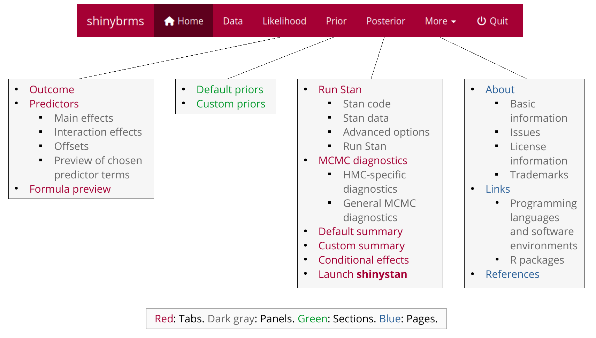
<figcaption>Figure 1: The navigation bar in <em>shinybrms</em>. In this
figure, we have expanded the navigation bar itself by the structure of
the three main pages (“Likelihood”, “Prior”, and “Posterior”) as well as
of the drop-down menu “More”.</figcaption>
</figure>

This structure follows Bayes' theorem, simplified to the proportionality
of the posterior density to the product of prior density and likelihood:
$$p(\boldsymbol{\theta} | \boldsymbol{\mathcal{D}}) \propto
p(\boldsymbol{\theta}) \cdot
p(\boldsymbol{\dot{\mathcal{D}}} | \boldsymbol{\theta}, \boldsymbol{\ddot{\mathcal{D}}})
  \label{eqn:bayes}   (\#eq:eqnbayes)$$
where we have split up the data $\boldsymbol{\mathcal{D}}$ into
$\boldsymbol{\mathcal{D}} = \begin{bmatrix}\boldsymbol{\dot{\mathcal{D}}}
\;\; \boldsymbol{\ddot{\mathcal{D}}}\end{bmatrix}$ because in BRMs, the
distribution in the likelihood typically conditions on the predictor
part $\boldsymbol{\ddot{\mathcal{D}}}$ of the data (see
section [4.2.2](#tab-pred) below). In the following sections, these
three main pages will be described in detail.

There are also some auxiliary pages, the first two having direct links
in the navigation bar, the last three being accessible from the
drop-down menu "More" at the end of the navigation bar:

-   The starting page "Home" gives a short overview of *shinybrms*'s
    objective and structure. Thus, it only contains informational text
    and no interactive elements.
-   On page "Data", the user uploads his or her custom dataset which
    shall be used for the regression analysis. For testing purposes,
    page "Data" also offers example datasets. The chosen dataset (no
    matter if it was uploaded or chosen from the list of example
    datasets) is automatically shown in a preview consisting of the
    dataset's first six rows (there is an option to show the full
    dataset, though). It is also possible to show the output of R's
    `str()` function applied to the chosen dataset, which gives some
    basic information about the dataset and its variables for users
    familiar with R.
-   Page "About" contains basic information about *shinybrms* (e.g.,
    version and corresponding date) as well as some legal information.
-   Page "Links" gives links to software relevant for the *shinybrms*
    app.
-   Page "References" contains the references for literature cited
    throughout the app.

## Page "Likelihood" {#page-lik}

Page "Likelihood" has three tabs: "Outcome", "Predictors", and "Formula
preview". These tabs will now be described in turn.

### Tab "Outcome" {#tab-outc}

On tab "Outcome" (Figure [2](#fig:outcome)), the user specifies the
outcome variable
$\boldsymbol{y} = (y_1, \dotsc, y_N)^{\scriptscriptstyle \mathsf{T}}\in \mathbb{R}^N$
(by choosing it from a drop-down list of the variables present in the
dataset) as well as its distributional family, i.e., the basic form of
the
likelihood $p(\boldsymbol{\dot{\mathcal{D}}} | \boldsymbol{\theta}, \boldsymbol{\ddot{\mathcal{D}}})$,
now with $\boldsymbol{\dot{\mathcal{D}}} = \boldsymbol{y}$. For the
distributional family, there is a drop-down menu and a checkbox called
"Show advanced distributional families". By default, this checkbox is
unchecked which means that the drop-down menu offers three general
distributional families of broad practical relevance: the Gaussian
family (with the identity link function), the Bernoulli family with the
logit link function, and the negative binomial family with the log link
function. This is intended to be a limited selection: By reducing the
choices as much as possible, we want to avoid overwhelming the user with
a variety of special distributions. For example, the Poisson family is
intentionally left out, in favor of the more general negative binomial
distribution. However, by checking the "Show advanced distributional
families" checkbox, the drop-down menu is extended so that a variety of
other distributional families can be selected as well (see Supplement
section "Advanced distributional families").

### Tab "Predictors" {#tab-pred}

If desired, the user may specify predictors on tab "Predictors"
(Figure [3](#fig:predictors)). We use the term "predictor" for a column
in the model matrix. In contrast, we use the term "predictor variable"
for a column in the input dataset. Thus, a predictor may also denote an
interaction and a predictor variable with $K$ categories leads to
$K - 1$ predictors (due to dummy coding).

The *shinybrms* app supports population-level effects as well as
group-level effects[^5]. The inclusion of group-level effects yields a
multilevel model (also known as hierarchical or mixed-effects model).
Here, we denote the vector of population-level effects
by $\boldsymbol{\beta}$ and the corresponding model matrix
by $\boldsymbol{X}$. Likewise, we denote the vector of group-level
effects by $\boldsymbol{u}$ and the corresponding model matrix
by $\boldsymbol{Z}$. The hyperparameters for the group-level effects
(i.e., their standard deviations and correlations) will be collected in
a vector $\boldsymbol{\tau}$. If the model does not contain group-level
effects, we define here (for the mathematical description, not for the
software) $\boldsymbol{u} = 0$,
$\boldsymbol{Z} = (0, \dotsc, 0)^{\scriptscriptstyle \mathsf{T}}\in \mathbb{R}^N$
(for example; the exact values in $\boldsymbol{Z}$ do not matter if
$\boldsymbol{u} = 0$), and $\boldsymbol{\tau} = 0$ (for example). With
$\boldsymbol{X}$ and $\boldsymbol{Z}$, we now have
$\boldsymbol{\ddot{\mathcal{D}}} = \begin{bmatrix}\boldsymbol{X} \;\; \boldsymbol{Z}\end{bmatrix}$.
We denote the vector of linear predictors by $\boldsymbol{\eta} =
\boldsymbol{X} \boldsymbol{\beta} + \boldsymbol{Z} \boldsymbol{u} \in \mathbb{R}^N$
(written out as
$\boldsymbol{\eta} = (\eta_1, \dotsc, \eta_N)^{\scriptscriptstyle \mathsf{T}}$).

Note that here as well as in *shinybrms*, the term "interaction" is also
used for interactions involving predictor variables with group-level
main effects (yielding group-level interaction effects). This broad
definition of "interaction" simplifies the GUI and emphasizes the key
concept of interactions, namely that an effect depends on another
predictor (or on other predictors).

To avoid common mistakes, *shinybrms* imposes some restrictions:
Firstly, an overall (population-level) intercept is always included.
Secondly, including an interaction causes all corresponding lower-order
interactions to be automatically included, too. The latter restriction
also implies that interactions may only involve predictor variables for
which main effects have already been added.

### Tab "Formula preview" {#tab-formula}

The tab "Formula preview" simply combines the chosen outcome and the
chosen predictors into *brms*'s formula syntax. This is mainly intended
for checking the correct specification of the model formula (for users
familiar with the syntax). However, it also provides a concise and
standardized way to communicate this central part of the model because
together with the distributional family, this model formula determines
the likelihood
$p(\boldsymbol{\dot{\mathcal{D}}} | \boldsymbol{\theta}, \boldsymbol{\ddot{\mathcal{D}}})
= p(\boldsymbol{y} | \boldsymbol{\theta}, \boldsymbol{X}, \boldsymbol{Z})$:
In case of the Gaussian family (with the identity link function), we
have
$$p(\boldsymbol{y} | \boldsymbol{\theta}, \boldsymbol{X}, \boldsymbol{Z}) =
\prod_{i = 1}^{N} \frac{1}{\sqrt{2 \pi} \cdot \sigma}
\,\exp\!\left(-\frac{1}{2} \cdot \left(\frac{y_i - \mu_i}{\sigma}\right)^2\right)
  \label{eqn:gauss}   (\#eq:eqngauss)$$
with $\mu_i = \eta_i$ (see $\boldsymbol{\eta}$ from
section [4.2.2](#tab-pred)), $\sigma \in (0, \infty)$, and
$\boldsymbol{\theta} = (\boldsymbol{\beta}^{\scriptscriptstyle \mathsf{T}}, \boldsymbol{u}^{\scriptscriptstyle \mathsf{T}},
\boldsymbol{\tau}^{\scriptscriptstyle \mathsf{T}}, \sigma)^{\scriptscriptstyle \mathsf{T}}$.
Note that the dependence on $\boldsymbol{X}$ and $\boldsymbol{Z}$ as
well as on most elements of $\boldsymbol{\theta}$ is an indirect
dependence *via* $\mu_1, \dotsc, \mu_N$. In case of the Bernoulli family
with the logit link function, we have $\boldsymbol{y} \in \{0, 1\}^N$
and
$$p(\boldsymbol{y} | \boldsymbol{\theta}, \boldsymbol{X}, \boldsymbol{Z}) =
\prod_{i = 1}^{N} \mu_i^{y_i} (1 - \mu_i)^{(1 - y_i)}
  \label{eqn:bernoulli}   (\#eq:eqnbernoulli)$$
with $\mu_i = \frac{1}{1 + \exp(-\eta_i)}$ and $\boldsymbol{\theta} =
(\boldsymbol{\beta}^{\scriptscriptstyle \mathsf{T}}, \boldsymbol{u}^{\scriptscriptstyle \mathsf{T}}, \boldsymbol{\tau}^{\scriptscriptstyle \mathsf{T}})^{\scriptscriptstyle \mathsf{T}}$.
In case of the negative binomial family with the log link function, we
have $\boldsymbol{y} \in \left(\{0\} \cup \mathbb{N}\right)^N$ and
$$p(\boldsymbol{y} | \boldsymbol{\theta}, \boldsymbol{X}, \boldsymbol{Z}) =
\prod_{i = 1}^{N} \binom{y_i + \zeta - 1}{y_i}
\left(\frac{\mu_i}{\mu_i + \zeta}\right)^{y_i}
\left(\frac{\zeta}{\mu_i + \zeta}\right)^{\zeta}
  \label{eqn:negbinom}   (\#eq:eqnnegbinom)$$
with $\mu_i = \exp(\eta_i)$, $\zeta \in (0, \infty)$, and
$\boldsymbol{\theta} = (\boldsymbol{\beta}^{\scriptscriptstyle \mathsf{T}},
\boldsymbol{u}^{\scriptscriptstyle \mathsf{T}}, \boldsymbol{\tau}^{\scriptscriptstyle \mathsf{T}}, \zeta)^{\scriptscriptstyle \mathsf{T}}$.
The mathematical details of the "advanced" distributional families (see
section [4.2.1](#tab-outc) above) may be found in the *brms* vignette
"Parameterization of Response Distributions in brms".

## Page "Prior"

At the top of page "Prior", the user obtains a preview of the default
priors taken from *brms* (Figure [4](#fig:prior-def)). At the bottom,
the user may specify custom priors (Figure [5](#fig:prior-cust)). Both,
the default and the custom priors, refer to the parameters of the
currently specified likelihood. Custom priors may be specified as
follows:

-   *via* a Stan function,
-   *via* one of the special *brms* (pseudo-)functions designed for this
    purpose, e.g., for the Lewandowski-Kurowicka-Joe (LKJ) prior
    [@lewandowski_generating_2009],
-   *via* an empty input field to specify a flat prior over the whole
    support of the corresponding parameter(s).

The first two possibilities always lead to a proper prior. The flat
prior is only proper if the support is bounded on both sides. Otherwise
(which is the more common case), the flat prior is improper.

The user's selections on page "Prior" ultimately lead to the
specification of $p(\boldsymbol{\theta})$. Together with the likelihood,
this completes the model specification. Note that for multilevel models,
$p(\boldsymbol{\theta})$ here[^6] includes the distributions of the
group-level effects $\boldsymbol{u}$ as well, even though they do not
need to be specified on page "Prior".

## Page "Posterior"

Page "Posterior" has six tabs: "Run Stan", "MCMC diagnostics", "Default
summary", "Custom summary", "Conditional effects", and "Launch
*shinystan*". These will now be described in turn. The output shown on
these tabs may also be downloaded (with the file format depending on the
specific type of output).

### Tab "Run Stan" {#tab-run}

At the top of tab "Run Stan", the user may inspect and download the Stan
code and the so-called Stan data. The Stan data basically consists of
the pre-processed part of the chosen dataset which is needed for the
Stan model, extended by some internal objects. Apart from checking or
documentation purposes, the Stan code and the Stan data are needed if
the user wants to customize the Stan code and then run Stan outside of
*shinybrms*.

Further down on tab "Run Stan", the user may set advanced options for
the Stan run (Figure [6](#fig:post-run-advOpts)). These options have
sensible defaults, but sometimes they need to be changed. Probably the
most important option is the seed for the pseudorandom number generator.

The final panel on tab "Run Stan" is the central one
(Figure [7](#fig:post-run-run)): By a click on the "Run Stan" button,
Stan translates the Stan code written by *brms* to C++ code, compiles
this C++ code, and then starts sampling. By default, Stan writes its
sampling progress to an HTML file which is automatically opened up by
*shinybrms*. The user then only needs to refresh this HTML file to see
the current sampling progress. An example for Stan's runtime will be
given in section [5](#exmpl).

When Stan has finished sampling, the panel "Run Stan" automatically
refreshes, in particular to show the result from an overall check of the
MCMC diagnostics (see section [4.4.2](#tab-MCMC) for details). The user
also has the possibility to download different output objects which can
be analyzed outside of *shinybrms* or---in case of the fitted model
object of class `"brmsfit"`---uploaded in a new *shinybrms* session (to
avoid re-running Stan).

### Tab "MCMC diagnostics" {#tab-MCMC}

On tab "MCMC diagnostics" (Figure [8](#fig:post-MCMC)), the user obtains
detailed information concerning the following MCMC diagnostics:

-   HMC-specific diagnostics:
    -   the number of iterations ending with a divergence,
    -   the number of iterations hitting the maximum tree depth,
    -   the Bayesian fraction of missing information for the energy
        transitions (E-BFMI);
-   some general MCMC diagnostics (which are computed for each parameter
    as well as for the accumulated log posterior density):
    -   the modified potential scale reduction factor $\widehat{R}$
        proposed by @vehtari_rank-normalization_2021 (here simply called
        *the* $\widehat{R}$ instead of *the modified*
        $\widehat{R}$)[^7],
    -   the effective sample size (ESS) in the bulk of the corresponding
        marginal posterior [@vehtari_rank-normalization_2021],
    -   the ESS in the tails of the corresponding marginal posterior
        [@vehtari_rank-normalization_2021].

As a full description of these MCMC diagnostics is out of the scope of
this article, we refer the interested reader to
@stan_development_team_runtime_2022, @betancourt_conceptual_2018, and
@vehtari_rank-normalization_2021. The most important basic guidelines
for deciding whether these MCMC diagnostics are worrying are explained
in the *shinybrms* GUI and also checked automatically by *shinybrms*.
For the general MCMC diagnostics, it is also possible to show a detailed
table with the diagnostics for each parameter (as well as for the
accumulated log posterior density).

### Tab "Default summary" {#tab-summary}

Tab "Default summary" (Figure [9](#fig:post-smmry)) shows *brms*'s
standard robust summary of the posterior inference, e.g., the medians
and the central $95\,\%$ intervals of the marginal posteriors (the
$95\,\%$ CrIs) of the most important parameters. This tab is only
intended for a quick inspection. A much more comprehensive analysis of
the Stan output is offered by the *shinystan* app (see
section [4.4.6](#tab-shinystan)).

### Tab "Custom summary" {#tab-custsmmry}

On tab "Custom summary" (Figure [10](#fig:post-custsmmry)), the user may
calculate posterior summary quantities for a custom mathematical (or
logical) expression involving at least one parameter. Such an expression
may be, e.g., a sum of two parameters (as shown in
Figure [10](#fig:post-custsmmry)) or the event that a parameter exceeds
a certain threshold.

### Tab "Conditional effects" {#tab-ceff}

On tab "Conditional effects" (Figure [11](#fig:post-ceff)), *shinybrms*
offers conditional-effects plots (created by
`brms::conditional_effects()`). A conditional-effects plot shows the
estimated effect of a predictor variable on the outcome. An interaction
effect involving at most two predictor variables may also be visualized
by showing the estimated effect of the first predictor variable
separately for appropriate values of the second predictor variable.

As described in more detail in the *shinybrms* GUI, a
conditional-effects plot *conditions* on specific values of those
predictor variables which are not involved in the plot. Likewise,
group-level effects which are not involved in the plot are (usually) set
to zero.

### Tab "Launch *shinystan*" {#tab-shinystan}

The *shinystan* app [@gabry_shinystan_2018] offers an interactive
inspection of Stan (and other MCMC-generated) results, in particular
with respect to:

-   MCMC diagnostics (including several additional diagnostics not
    covered by *shinybrms*'s tab "MCMC diagnostics"),
-   PPCs,
-   summary quantities of univariate marginal posteriors,
-   plots of univariate, bivariate, and trivariate marginal posteriors.

Before launching the *shinystan* app from within the *shinybrms* app by
clicking the corresponding button on tab "Launch *shinystan*", the user
may set a seed to ensure the reproducibility of the PPCs.

At this point, the *shinybrms* workflow ends and passes over to the
*shinystan* workflow. We will illustrate the *shinystan* workflow in
section [5](#exmpl).

# Example {#exmpl}

We illustrate *shinybrms*'s features following the workflow implied by
Figure [1](#fig:navbar-tree) and using a real-world dermatological
dataset from @welzen_response_2021. This dataset is available in the
Supplement (file `CAP.csv`). In Supplement section "Frequentist analysis
of the example", we compare the Bayesian analysis presented here with a
frequentist one, referring to the list of advantages of Bayesian
statistics from section [1](#intro).

@welzen_response_2021 conducted a prospective pilot study investigating
the efficacy and safety of a novel cold atmospheric plasma (CAP) wound
dressing for the healing of split-skin graft donor sites. The only
outcome we focus on here is the tissue water index (TWI), measured by a
hyperspectral imaging camera and having values between 0 and 100, with
lower TWI values being associated with an improved wound healing.
Briefly, the study design was as follows: For each of $P = 10$ patients,
the TWI was measured under $T = 3$ different treatment conditions
(standard-treated wound, CAP-treated wound, and healthy skin). Each
treatment condition was investigated in its own skin area with $R = 3$
measurements across that area. This procedure of measuring was repeated
on each of $D = 4$ days (day 1, 3, 5, and 7, with day 1 being the day of
the split-skin graft donation where the TWI was measured *after* the
split-skin graft donation but *before* the first wound dressing). Thus,
the dataset consists of $N = P \cdot T \cdot R
\cdot D = 360$ observations (rows). The dataset's columns are:

-   `patID` (for "patient ID"; coded as `"pat1"`, ..., `"pat10"`),
-   `age` (in years),
-   `anticoagulation` (indicating whether the patient received an
    anticoagulation therapy before and during the study; coded as `"no"`
    and `"yes"`),
-   `diabetes` (indicating whether the patient is diabetic; coded as
    `"no"` and `"yes"`),
-   `day` (coded as `"d1"`, `"d3"`, `"d5"`, and `"d7"`),
-   `trt` (coded as `"0_standard"`, `"CAP"`, and `"healthy"` to make
    `"0_standard"` the reference level),
-   `TWI` (integers in the interval $[0, 100]$).

The primary research question is whether the CAP treatment leads to a
decreased[^8] TWI compared to the standard treatment (polyhexanide wound
gel with fatty gauze). The healthy skin area serves as an *experimental*
control (albeit not as a control *treatment* since this is the role of
the standard-treated wound area) and is not part of the primary research
question.

## *shinybrms* {#exmpl-shinybrms}

After launching the *shinybrms* app in R *via*

``` r
> library("shinybrms")
> launch_shinybrms(launch.browser = TRUE)
```

(with `launch.browser` set to `TRUE` to ensure that the app is opened up
in the default web browser), we switch to page "Data" where we upload
the dataset (not shown here).

Next, we head over to page "Likelihood". On tab "Outcome"
(Figure [2](#fig:outcome)), we choose the outcome variable `TWI` and the
Gaussian family as the distributional family for this outcome. Clearly,
the TWI values cannot follow an unmodified Gaussian distribution since
they are bounded by $0$ and $100$, with the minimum of the observed TWI
values being indeed as low as $9$ (the maximum being $67$). Thus, a
truncated Gaussian distribution might be more appropriate here. We will
come back to this later in section [6](#disc).

<figure id="fig:outcome">
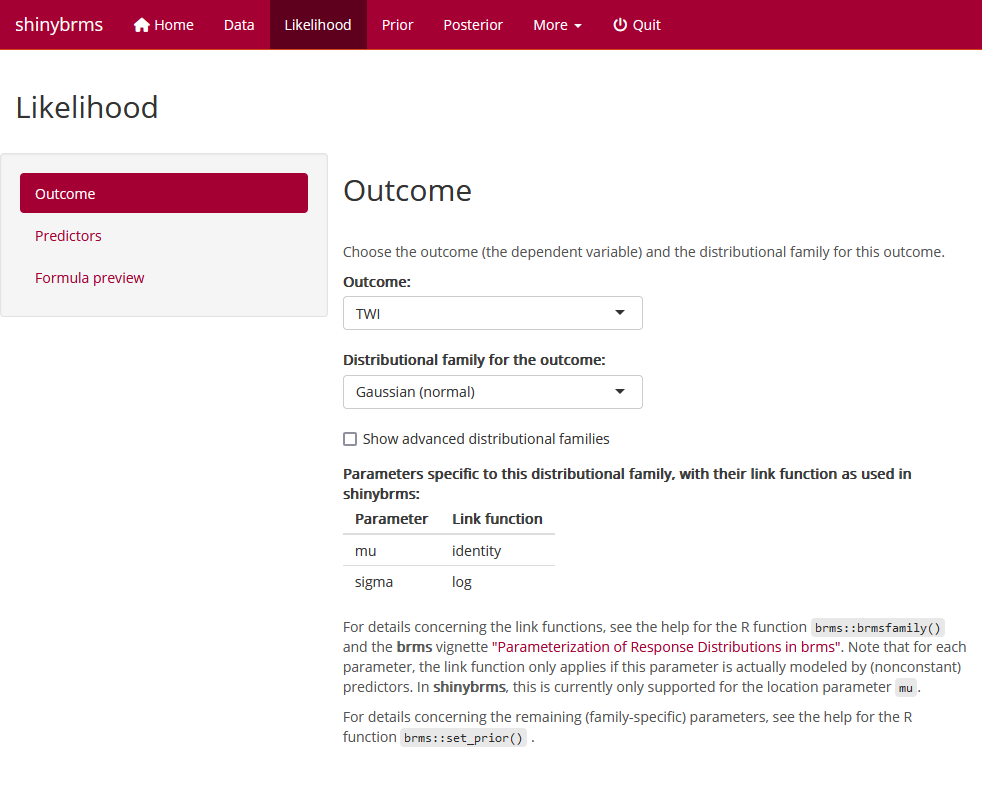
<figcaption>Figure 2: Tab “Outcome” on page “Likelihood”. In the example
presented here, we select <code>TWI</code> as the outcome variable and
the Gaussian family as the distributional family for this outcome. Tab
“Outcome” and tab “Predictors” (Figure ) are the two main components of
page “Likelihood”.</figcaption>
</figure>

On tab "Predictors" (Figure [3](#fig:predictors)), we choose `age`,
`anticoagulation`, `diabetes`, `day`, and `trt` to have population-level
main effects and `patID` to have group-level main effects ("random
intercepts"). Further down on tab "Predictors", we add an interaction
between `day` and `trt` (not shown here). This interaction is included
because the TWI is supposed to show a stronger time-dependence in the
two wound areas than in the healthy skin area. Additionally, the TWI
difference (in means) between the standard and the CAP treatment might
change over time.

<figure id="fig:predictors">
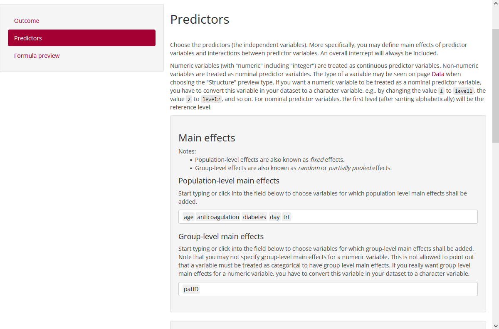
<figcaption>Figure 3: Tab “Predictors” on page “Likelihood”. Here, the
main effects of the predictors need to be defined first (in the example
presented here: variables <code>age</code>,
<code>anticoagulation</code>, <code>diabetes</code>, <code>day</code>,
<code>trt</code>, and <code>patID</code>). Then, further down on this
tab (not visible here), interactions can be specified (in the example
presented here: an interaction between variables <code>day</code> and
<code>trt</code>). In principle, offsets may also be specified further
down on this tab (not visible here), but our example does not feature
offsets. For the main effects, the user may choose between
population-level and group-level effects. For interaction effects, this
choice will be performed automatically based on the involved main
effects.</figcaption>
</figure>

Now the likelihood is set up, so we can proceed with the prior. The
default priors (Figure [4](#fig:prior-def)) are reasonable, but suppose
we wanted a weakly informative Student-$t$ prior with $3$ degrees of
freedom, a location parameter of $0$, and a scale parameter of $30$ for
all regression coefficients. To add this custom prior, we choose
parameter class `b` from the corresponding drop-down list shown in
Figure [5](#fig:prior-cust), enter `student_t(3, 0, 30)` into the input
field entitled "Prior distribution", and click the "Add prior" button.
After doing so, our Student-$t$ prior is added to the preview table
(Figure [5](#fig:prior-cust), right-hand side). For all remaining
parameters for which we do not specify a custom prior, the corresponding
default prior will be used.

<figure id="fig:prior-def">
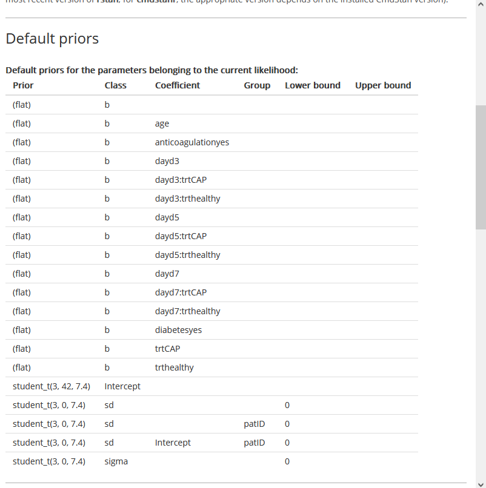
<figcaption>Figure 4: Section “Default priors” on page “Prior”. The
default priors are taken from <em>brms</em> and depend on the currently
specified likelihood. They can be overridden by custom priors
(Figure ).</figcaption>
</figure>

<figure id="fig:prior-cust">
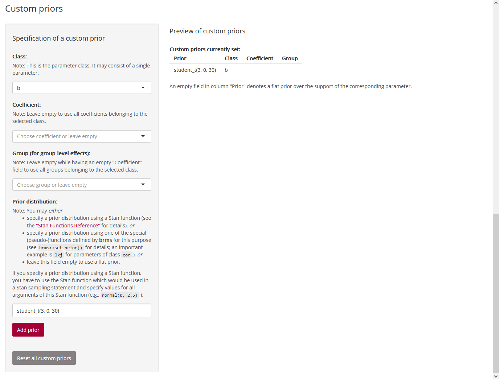
<figcaption>Figure 5: Section “Custom priors” on page “Prior”. Here, we
specify a Student-<span class="math inline"><em>t</em></span> prior with
<span class="math inline">3</span> degrees of freedom, a location
parameter of <span class="math inline">0</span>, and a scale parameter
of <span class="math inline">30</span> for all regression coefficients
(parameter class <code>b</code>). This overrides the default flat prior
for these parameters (Figure ).</figcaption>
</figure>

Now the model is fully set up, so we can start inferring the posterior.
To do this, we switch to page "Posterior" where we scroll down to the
advanced options on tab "Run Stan" (Figure [6](#fig:post-run-advOpts)).
There, we set a seed for reproducibility. Afterwards, we scroll further
down to panel "Run Stan" where we click the button for starting the Stan
run (Figure [7](#fig:post-run-run)). For this example, the Stan run as a
whole (including the compilation of the C++ code) takes about 50 seconds
on a standard desktop machine.

<figure id="fig:post-run-advOpts">
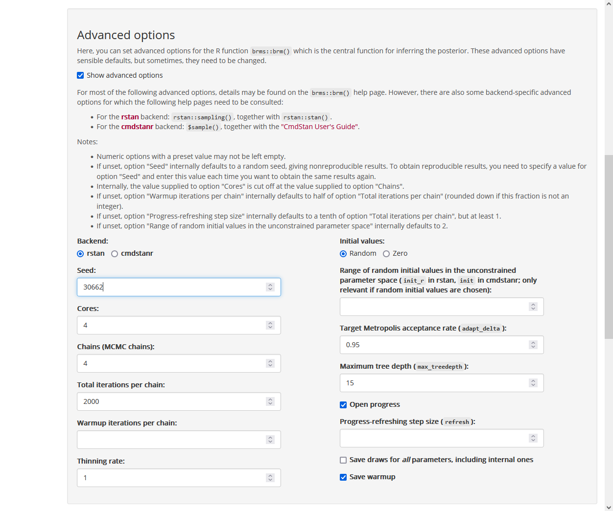
<figcaption>Figure 6: Panel “Advanced options” on tab “Run Stan” of page
“Posterior”. The defaults for these advanced options should be fine for
most practical situations. In the example presented here, we only set a
specific seed so that results are reproducible.</figcaption>
</figure>

<figure id="fig:post-run-run">
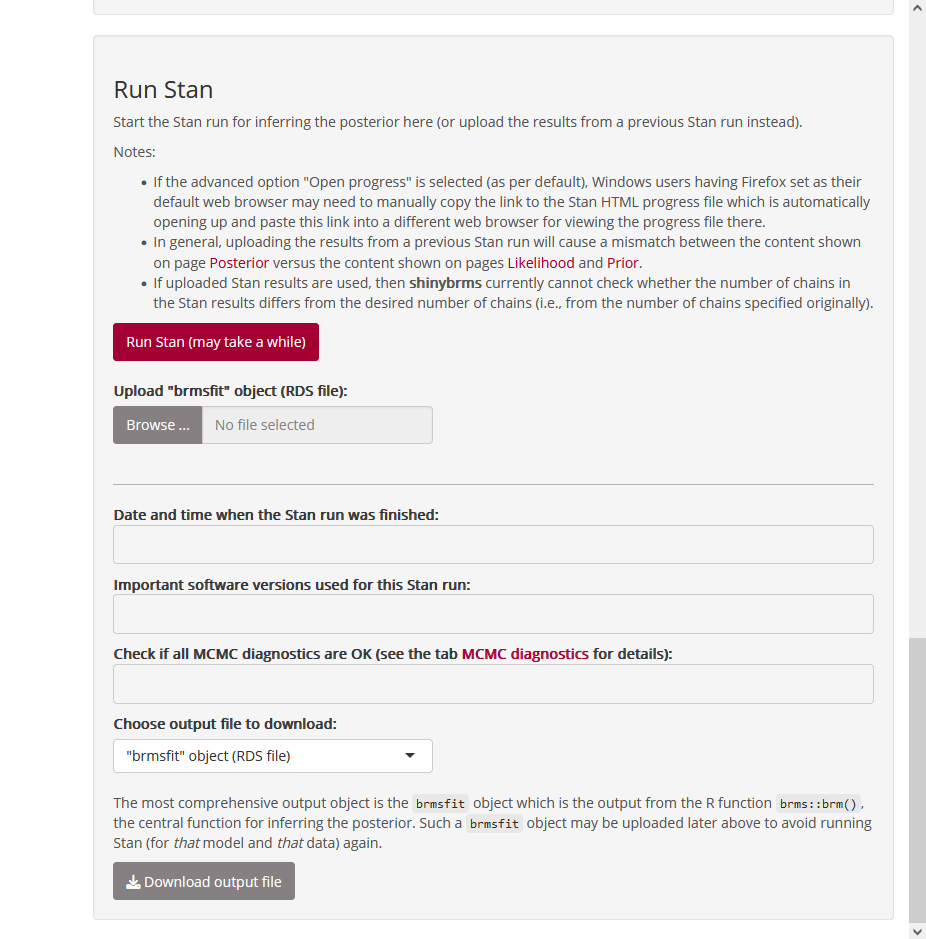
<figcaption>Figure 7: Panel “Run Stan” on tab “Run Stan” of page
“Posterior”. This is the central UI element: By clicking the red button,
the Stan run is started, which first involves several preparation steps
(including the compilation of the C++ code) and then the MCMC sampling
itself.</figcaption>
</figure>

After Stan has finished sampling, we receive a pop-up notification (not
shown here) whether all MCMC diagnostics have passed their checks. Here,
this is the case as we may also see on tab "MCMC diagnostics"
(Figure [8](#fig:post-MCMC)).

<figure id="fig:post-MCMC">
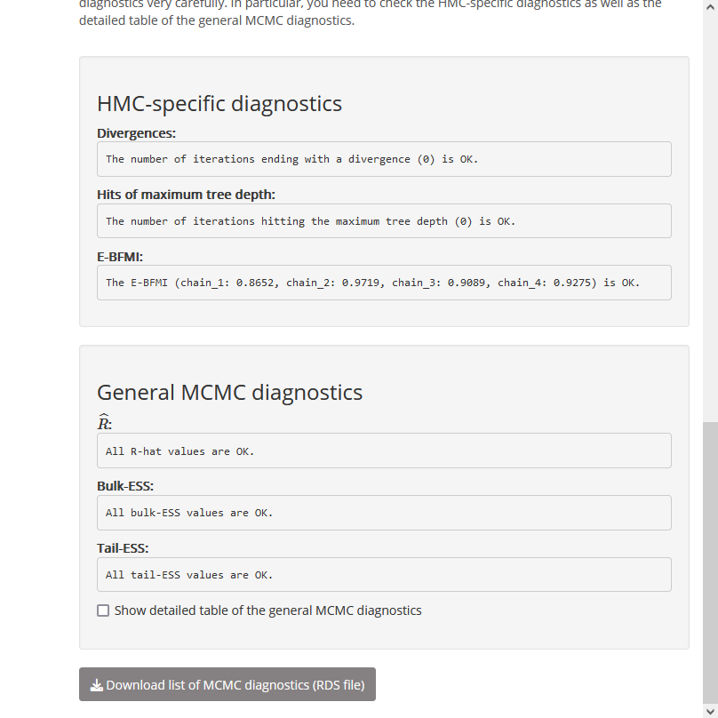
<figcaption>Figure 8: Tab “MCMC diagnostics” on page “Posterior”. This
tab presents the diagnostics from section , applied to the user’s Stan
run (for the exact values of the general MCMC diagnostics, the checkbox
“Show detailed table of the general MCMC diagnostics” needs to be
checked). The purpose of this tab is to obtain details about problematic
MCMC diagnostics in case there are such (after the Stan run, the user
always receives a notification stating if there are problematic MCMC
diagnostics or not).</figcaption>
</figure>

Since *shinybrms* reports all MCMC diagnostics as being OK, we may start
interpreting the posterior. On tab "Default summary"
(Figure [9](#fig:post-smmry)), it is mainly the summary of the
population-level effects which is of interest here: With each additional
year of `age`, the TWI is estimated to increase by ca. $0.10$ with a
$95\,\%$ CrI of ca. $(-0.28, 0.48)$. An `anticoagulation` therapy is
estimated to increase the TWI by ca. $-1.12$ with a $95\,\%$ CrI of ca.
$(-7.53, 5.69)$. A `diabetes` disease is estimated to increase the TWI
by ca. $-0.56$ with a $95\,\%$ CrI of ca. $(-6.51, 5.66)$. As may be
seen from these three CrIs, the statistical uncertainty is quite big
which is probably due to the small $P = 10$.

<figure id="fig:post-smmry">
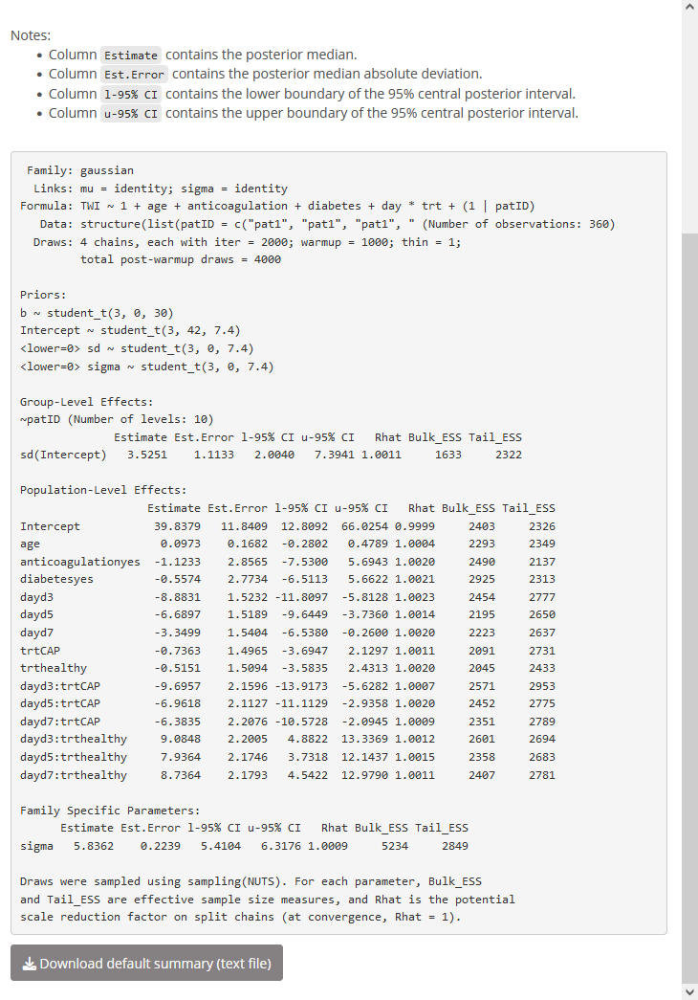
<figcaption>Figure 9: Tab “Default summary” on page “Posterior”.
Presented is the output of method <code>brms:::summary.brmsfit()</code>
with arguments <code>priors</code> and <code>robust</code> set to
<code>TRUE</code> (causing the priors to be shown, too, and the more
robust summary quantities median and median absolute deviation to be
used instead of the less robust quantities mean and standard deviation).
This tab is only intended for a quick inspection (the <em>shinystan</em>
app offers a more comprehensive output).</figcaption>
</figure>

Since we included an interaction between `day` and `trt`, the
coefficients for these two variables are most conveniently interpreted
by the help of a custom summary (Figure [10](#fig:post-custsmmry)) and a
conditional-effects plot (Figure [11](#fig:post-ceff)). On tab "Custom
summary" (Figure [10](#fig:post-custsmmry)), we may calculate the
estimated TWI difference (in means) between the CAP and the standard
treatment separately for each `day` by entering the corresponding sum
expressions (and the expression `‘b_trtCAP‘` for day 1) in turn. The
resulting table is included in Figure [10](#fig:post-custsmmry): On day
1 (where the two wound areas had not been treated yet), the standard
treatment and the CAP treatment lead to a quite similar TWI (the
posterior median of their TWI difference being ca. $-0.74$ with a
$95\,\%$ CrI of ca. $(-3.69, 2.13)$). In contrast, on days 3, 5, and 7,
the CAP treatment clearly leads to a *lower* TWI than the standard
treatment (posterior medians of ca. $-10.45$, $-7.66$, and $-7.10$,
respectively, and $95\,\%$ CrIs of ca. $(-13.43, -7.36)$,
$(-10.63, -4.84)$, and $(-10.11, -4.03)$, respectively). This answers
the primary research question: The CAP treatment indeed leads to a
decreased TWI and therefore an improved wound healing compared to the
standard treatment. This is also well illustrated by the
conditional-effects plot (Figure [11](#fig:post-ceff)). The
conditional-effects plot also confirms that the TWI in the healthy skin
area does not change as heavily over time as in the two wound areas.

<figure id="fig:post-custsmmry">
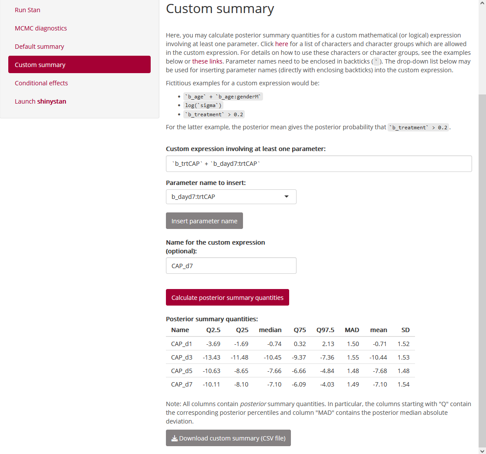
<figcaption>Figure 10: Tab “Custom summary” on page “Posterior”. In
contrast to tab “Default summary” (Figure ), users can request their own
summary quantities here. In the example presented here, we calculate the
<code>day</code>-specific <code>CAP</code> effects. These show that
apart from day 1 (where the wound areas had not been treated yet), the
CAP treatment leads to a lower (i.e., better) TWI compared to the
standard treatment (which is the reference category), with the posterior
median ranging from ca. <span class="math inline"> − 10.45</span> to
ca. <span class="math inline"> − 7.10</span> on days 3, 5, and
7.</figcaption>
</figure>

<figure id="fig:post-ceff">
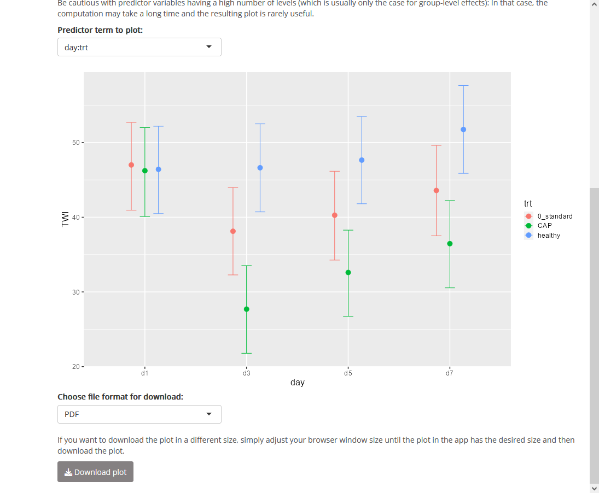
<figcaption>Figure 11: Tab “Conditional effects” on page “Posterior”.
This tab shows the conditional-effects plots produced by
<code>brms::conditional_effects()</code>. In the example presented here,
we select the conditional-effects plot for the <code>day:trt</code>
interaction. Similarly to Figure , this demonstrates that apart from day
1, the CAP treatment leads to a lower TWI compared to the standard
treatment. This plot also illustrates that in the healthy skin area, the
TWI is roughly constant over time, with a slight increase on day
7.</figcaption>
</figure>

Finally, we switch to tab "Launch *shinystan*", enter a seed for the
reproducibility of the PPCs (here, `63438`), and click on the button for
launching *shinystan*.

## *shinystan* {#exmpl-shinystan}

Within *shinystan*, we may inspect some PPC plots, e.g., a kernel
density estimate for the observed TWI values, overlaid by kernel density
estimates for replicated TWI values
(Figure [12](#fig:shinystan-ppc-overlay)). This overlaid density plot
suggests that the model is appropriate, being able to generate outcome
values similar to the observed ones after having estimated the unknown
parameters by the help of the observed dataset (as well as the prior).
Nevertheless, the model may still be improved, as illustrated by the PPC
plots shown in Figure [13](#fig:shinystan-ppc-stat) (lower two
histograms): The minimum of the observed TWI values is systematically
smaller than the replicated minimums, the opposite holding---even if not
that extremely---for the maximum. However, we consider the current model
to be appropriate for the primary research question.

With respect to the parameter estimates, *shinystan* offers, e.g., a
visualization of the posterior medians, together with $50\,\%$ and
$95\,\%$ CrIs (Figure [14](#fig:shinystan-intvls)). The *shinystan* app
also offers kernel density estimates for the univariate marginal
posteriors (not shown).

<figure id="fig:shinystan-ppc-overlay">
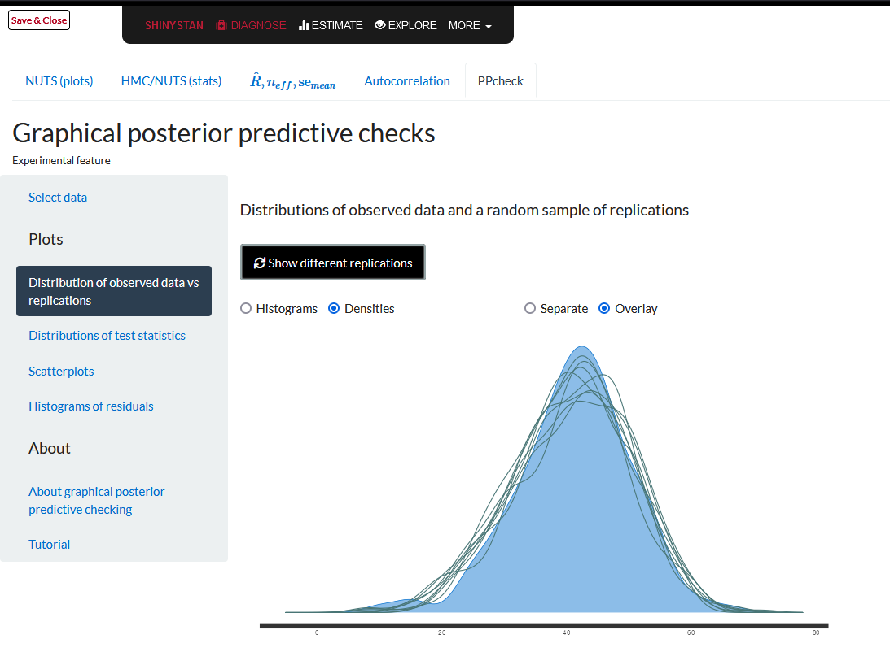
<figcaption>Figure 12: <em>shinystan</em>: PPC <em>via</em> overlaid
kernel density estimates. The shaded blue density corresponds to the
observed outcome values whereas each of the 8 overlaid green density
lines corresponds to one randomly chosen post-warmup MCMC iteration.
Here, the distributions of the model’s predictions (which are based on
the posterior, i.e., on the joint parameter distribution inferred from
the data and the prior) are similar to the distribution of the observed
outcome values, showing that at least in this regard, the model is a
reasonable one.</figcaption>
</figure>

<figure id="fig:shinystan-ppc-stat">
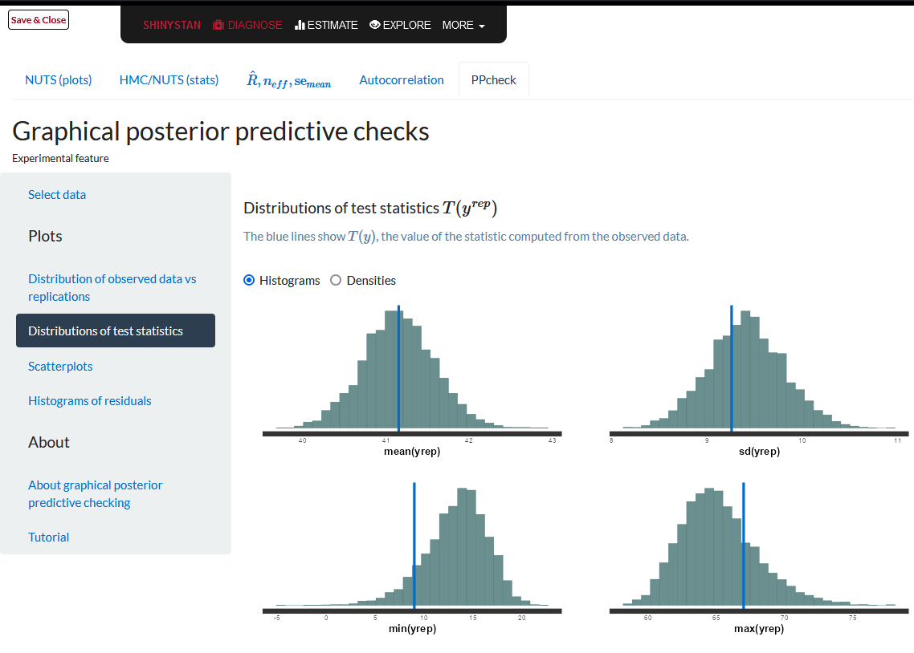
<figcaption>Figure 13: <em>shinystan</em>: PPCs <em>via</em> summary
statistics. In contrast to the PPC from Figure , these PPCs here are
based on <em>all</em> posterior draws which is possible by aggregating
across the observations. The aggregation statistics are the mean (top
left), the standard deviation (top right), the minimum (bottom left),
and the maximum (bottom right). Here, these aggregated predictions show
some room for model improvement: The minimum is overestimated—or rather
“overpredicted”—by the model, the maximum is underestimated. Thus, the
range of the replicated outcome values is narrower than the observed
one. In contrast, the mean TWI is replicated reliably. The standard
deviation shows a slight overestimation by the model. In summary, the
Gaussian family seems to be a suboptimal outcome family, but we consider
it to be sufficient for answering the primary research question (the
comparison of CAP and standard treatment in terms of the central
tendency of TWI values).</figcaption>
</figure>

<figure id="fig:shinystan-intvls">
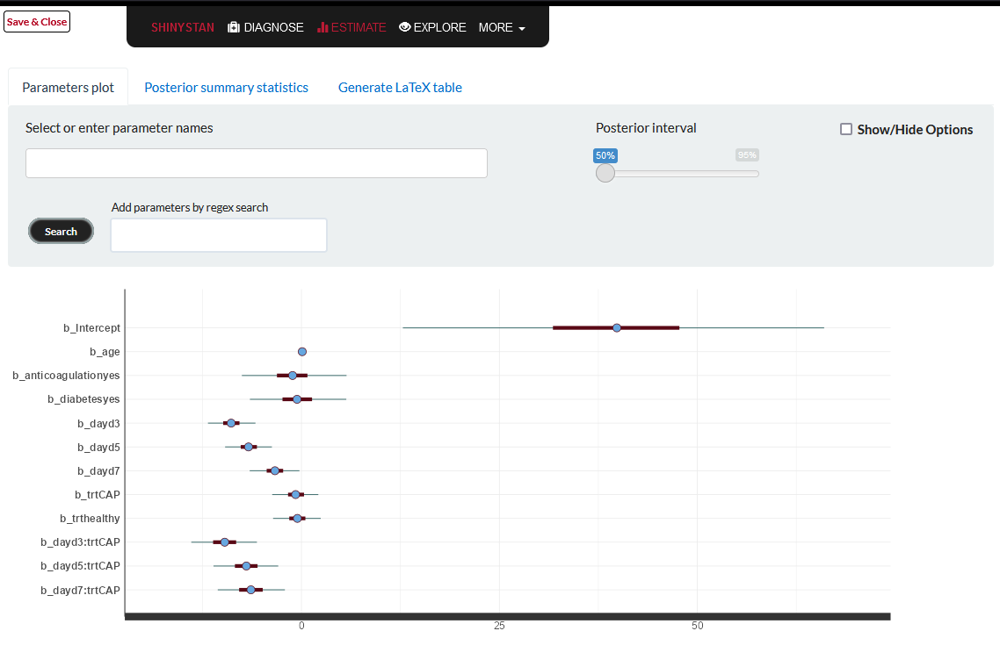
<figcaption>Figure 14: <em>shinystan</em>: Posterior intervals (credible
intervals, CrIs). The default plot shown here is restricted to the first
12 parameters. More parameters may be selected in the two input fields
above the plot. The different scales of the parameters (in particular,
the intercept and the regression coefficient for <code>age</code> are on
strikingly different scales) illustrate that in interactive use, it
often makes sense to customize the selection of parameters.</figcaption>
</figure>

# Discussion {#disc}

We have presented our *shiny* app called *shinybrms*, distributed as an
R package. With the *shinybrms* GUI, we hope to make Bayesian regression
modeling more accessible for people without any knowledge of R's syntax.
Currently, the user still needs to execute some R code for setting up
*shinybrms*'s backend and for launching the *shinybrms* app, even if he
or she is using a GUI for installing R packages. We tried to make this
as easy as possible by providing step-by-step instructions in the
`README` file of the *shinybrms* package. More importantly however, the
*shinybrms* app may be hosted on a server and accessed through a web
browser, just like any other *shiny* app. In that case, the user does
not need to install the *shinybrms* package or any other additional
software. With the server-sided hosting, the *shinybrms* app may even be
accessed from a mobile device where it is usually impossible to install
any software designed for personal computers. Of course, setting up the
server-sided hosting is a lot more complex than following the
instructions from our `README` file for running *shinybrms* on a local
computer, but the idea is that IT departments of bigger institutions
could establish the server-sided hosting (potentially adding an access
control on top) and then members of that institution could access the
*shinybrms* app through their web browsers.

Note that JASP offers an alternative host-client service by relying on
rollApp [@rollapp_inc_rollapp_2020; @rollapp_inc_jasp_2020].

Apart from application in practice, *shinybrms* may also be valuable for
teaching Bayesian regression models, e.g., to undergraduate students.

Of course, *shinybrms* may still be extended. As may be seen from our
real-world example in section [5](#exmpl), truncated outcome families
would be a useful feature. Apart from this, our future plans also
include further outcome families supported by *brms* (e.g., ordinal and
time-to-event regression), model selection features (e.g., using the
package [*projpred*](https://CRAN.R-project.org/package=projpred) by
[@piironen_projpred_2020]), and support for special *brms* features such
as smoothed effects and known measurement error in the outcome variable
(needed for meta-analyses). When implementing new features, the
challenge will be to keep the GUI as simple as possible: In our opinion,
a GUI such as *shinybrms* should support the user by automizing steps
wherever this is appropriate and thus focus the attention to steps which
may not be automized (in particular those related to the original
research question).

# Supplementary Material

This article comes with an online Supplement which consists of the
following files:

-   file `Supplement_sections.pdf` which is a document with the
    following sections:
    -   "Existing GUIs",
    -   "Advanced distributional families",
    -   "Frequentist analysis of the example";
-   file `CAP.csv` which contains the dataset for section [5](#exmpl);
-   file `weber_shinybrms.R` which contains the R code for
    section [5](#exmpl);
-   file `weber_shinybrms_sessionInfo.txt` which contains the original
    computing environment information for section [5](#exmpl). Note that
    the reproducibility of Stan results depends on the machine's
    hardware, so in general, our results from section [5](#exmpl) will
    not be perfectly reproducible on other machines.
:::

[^1]: We added quotation marks here since noninformative priors might be
    more informative than intended [@gelman_prior_2017].

[^2]: Here, we are slightly abusing the notation by employing a single
    integral symbol for a possibly multiple integral.

[^3]: Here, the term "proposal" refers to a proposed parameter vector.

[^4]: Here, the term "symmetric" refers to the preservation of the
    distribution when reverting the jump, not to the symmetry in the
    shape of a distribution.

[^5]: Population-level effects are also known as fixed effects
    [@burkner_brms:_2017; @burkner_advanced_2018]. Group-level effects
    are also known as random or partially pooled effects
    [@burkner_brms:_2017; @burkner_advanced_2018; @goodrich_rstanarm_2022].
    The terms "fixed" and "random" effects are not really appropriate in
    a Bayesian context: In a Bayesian model, all parameters have a prior
    distribution and may therefore be considered as random
    [@marchenko_spotlight_2015].

[^6]: In multilevel models, drawing the line between prior and
    likelihood can be done in multiple ways, so our mathematical
    formulation is just one of several possibilities.

[^7]: The term "potential scale reduction factor" is not always
    appropriate [@vehtari_rank-normalization_2021 section 2], but
    because of its widespread use, we employ it here nonetheless.

[^8]: For this demonstration here, we won't discuss whether this
    decrease is clinically relevant.
