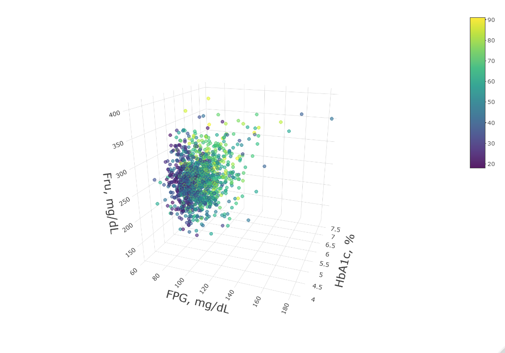
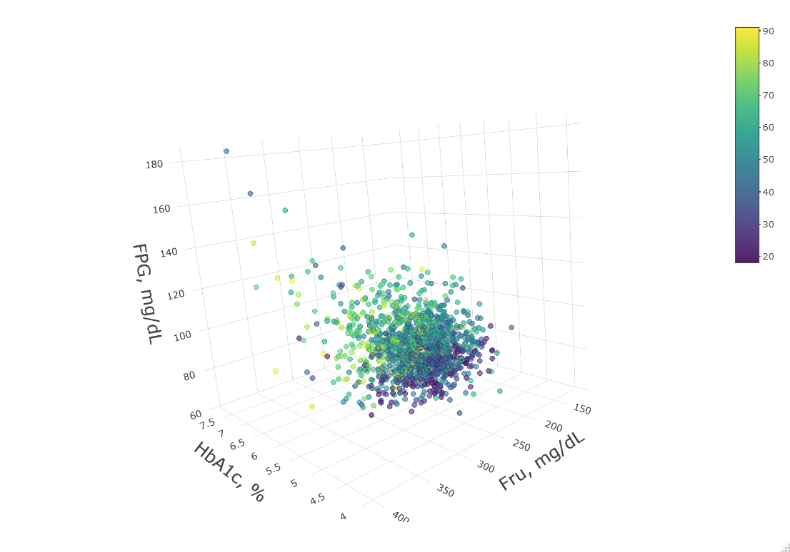
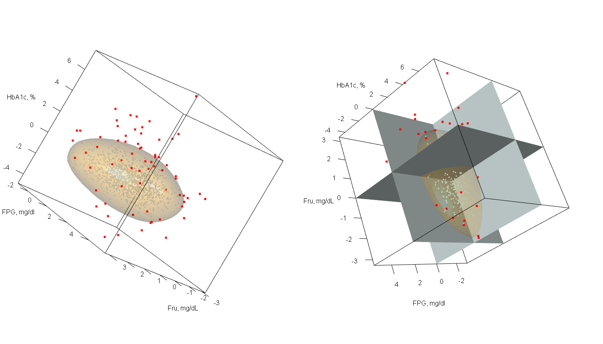
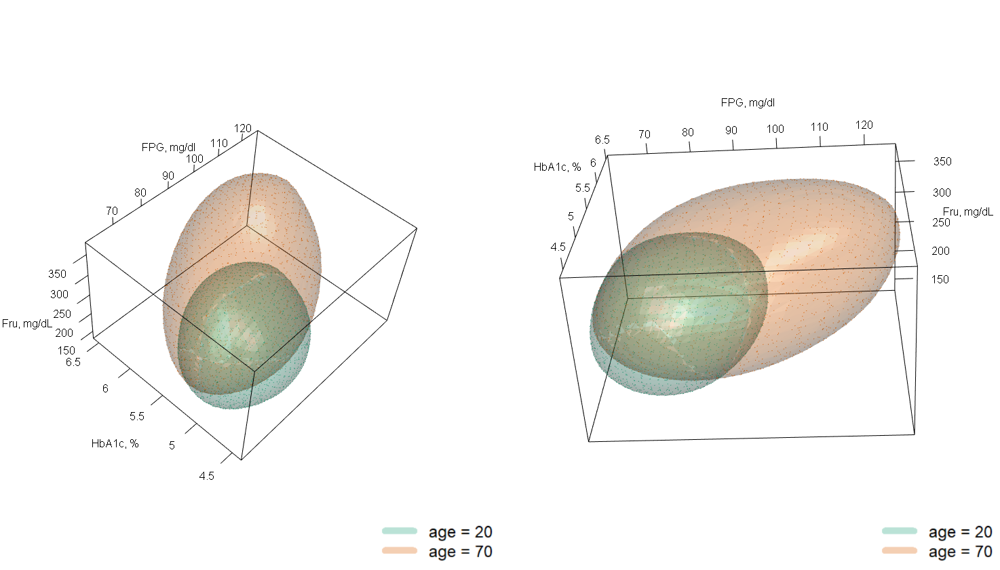

# Introduction

In clinical practice, many medical decisions are based on continuous
diagnostic tests [@hallworth201170] -- i.e., tests that provide results
along a continuous, quantitative scale. The interpretation of such
continuous tests requires the comparison of the obtained value with a
pre-defined reference interval, so that a result could be classified as
positive or negative (ie, disease present or absent) based on this
comparator value. A reference interval is an interval containing most
healthy subjects' results. For a single test they are usually estimated
from the 2.5 and 97.5 empirical percentiles of the distribution for the
healthy population; thus, 95% of healthy patients are located within the
interval limits [@wright1999calculating]. Those patients falling outside
the reference interval, are likely to have an undiagnosed disease. If
the test results are influenced by some patient characteristics
independent of the disease (e.g., age and gender), reference intervals
for specific patient groups must be obtained. These covariate-dependent
reference intervals, usually termed reference curves, are estimated
using quantile regression [@koenker1978regression] or location-scale
models [@cole1992smoothing; @stasinopoulos2017flexible]. Several R
packages for estimating reference intervals and reference curves already
exist, including the R package
[referenceIntervals](https://CRAN.R-project.org/package=referenceIntervals),
which comprises a collection of tools, the R package
[gamlss](https://CRAN.R-project.org/package=gamlss)
[@stasinopoulos2007generalized], which provides a general tool for
deriving reference curves in clinical practice [@who_gamlss], and
software *RefCurv* [@winkler2019refcurv], recently proposed to
facilitate clinicians' use of
[gamlss](https://CRAN.R-project.org/package=gamlss). However, all these
packages were produced to provide reference intervals for single tests;
they cannot address diseases for which diagnosis and control are based
on multiple tests.

When the results of several tests are available for the same patient,
obtaining separate reference intervals for each one provides an
incomplete picture of disease status, particularly when these results
are strongly correlated [@boyd2004reference]. Although each reference
interval would leave only 5% of healthy patients out, their combined use
can result in a higher percentage of false positives. Moreover, a
patient falling within each univariate reference interval might, in
fact, show an abnormal multivariate result. Thus, a multivariate
reference region (MVRs) would provide a better means of interpreting the
results of multiple tests [@winkel1972normal]. MVRs are a
straightforward extension of the univariate reference interval to the
multidimensional setting, i.e., a region that contains 95% of the
healthy patients' results. However, despite being proposed more than 40
years ago, MVRs are rarely used in clinical practice. This might be
explained by the multivariate Gaussian assumption of MVRs, which is
quite restrictive when interpreting diagnostic test results. Further,
the multivariate distribution of test results is usually affected by
patient characteristics, independent of their health status. For
example, [@espasandin2019assessing] showed that the correlation between
two diagnostic tests for diabetes was influenced by patient age and red
blood cell turnover, independent of glycemia status. A conditional MVR
is therefore desirable, but the statistical literature is not rich in
such proposals (see, e.g., [@wei2008approach]).

Very few statistical software routines have been proposed for estimating
the region containing a specific percentage of multivariate data points.
The function mvtol.region in the R package
[tolerance](https://CRAN.R-project.org/package=tolerance)
[@young2010tolerance] obtains a region containing a high percentage of a
bivariate Gaussian distribution in the context of quality control
studies, and non-parametric probabilistic regions can be obtained using
the R packages [r2d2](https://CRAN.R-project.org/package=r2d2) [@r2d2],
[hdrcde](https://CRAN.R-project.org/package=hdrcde) [@hdrcde] and
[distfree.cr](https://CRAN.R-project.org/package=distfree.cr)
[@distfree]. However, these all suffer the major limitation of not being
able to estimate the effects of covariates on the region's shape. The R
package [modQR](https://CRAN.R-project.org/package=modQR) can estimate
conditional multivariate quantiles, but the quantile level $\tau$ is not
linked to the probability content of the sample [@siman]. Thus, it is
not clear how to derive a reference region from these bivariate
quantiles.

The present paper introduces refreg, an implementation in R of a new
statistical methodology for estimating bivariate reference regions able
to classify subjects as having normal or abnormal values based on the
results of two continuous diagnostic tests. The main advantages of the
presented method are; i) the absence of parametric restrictions for
describing bivariate distributions for continuous tests, and ii) the
possibility of estimating the effects of covariates on the shape of the
reference region via flexible additive predictors. To illustrate this
statistical methodology, and how to use the package, an age-specific
reference region for two diabetes diagnostic tests was estimated. The
estimated reference region offers new insights into the diagnosis and
prognosis of diabetes, enabling physicians to identify different
patients' profiles. The proposed method can, however, be applied to any
disease in which two continuous diagnostic tests are available, and can
even be used in non-medical fields. Indeed, an application is discussed
in which the conditional region is used in the joint forecasting of the
concentrations of two air pollutants. Moreover, the current
implementation can be easily extended to three dimensions.

The statistical model that enables conditional reference regions to be
determined is presented in the next section. The main functions
contained in the refreg package are then described, with a brief
introduction to the main functions. The use of the package is shown in
analyses of real medical and environmental data problems. The paper
closes with some comments, and some notes on future research directions.

# Statistical methodology

In this section the main features of our statistical method is
presented. In a nutshell, our proposal is based on a bivariate location
scale model, where the response means, and their variance-covariance
matrix, are related to covariates using flexible additive predictors.
The probabilistic region covering a specific percentage of the data is
firstly estimated using the model standardized residuals. Then, it is
generalized for each covariate value based on the aforementioned
bivariate location-scale model fit. This statistical model was already
presented and evaluated in [@roca2020nonparametric].

## Conditional reference region

Given a bivariate continuous random variable of interest
${\bf Y} = (Y_1, Y_2)$, and a vector of covariates
$\bf{X}=(X_1, \ldots, X_p)$ we consider the following structure:
$$\left( {
	\begin{tabular} {c}
	$Y_1$ \\
	$Y_2$\
	\end{tabular}
}\right) = \left( {
	\begin{tabular} {c}
	$\mu_1(\textbf{X})$ \\
	$\mu_2(\textbf{X})$\
	\end{tabular}
}\right)
+  \boldsymbol{\Sigma}^{1/2} (\textbf{X})
\left( {
	\begin{tabular} {c}
	$\varepsilon_1$ \\
	$\varepsilon_2$\\
	\end{tabular}
}\right)
\label{modelo}$$

where $\mu_1(\textbf{X})$ and $\mu_2(\textbf{X})$ represents the
conditional means of both responses and
$\boldsymbol{\Sigma}^{1/2} (\textbf{X})$ the Cholesky decomposition of
the variance-covariance matrix
$$\boldsymbol{\Sigma} (\textbf{X})=\left({
	\begin{tabular} {cc}
	$\sigma_1^2 (\textbf{X})$  &  $ \sigma_{12} (\textbf{X})$\\
	$\sigma_{12} (\textbf{X})$ & $\sigma_2^2 (\textbf{X})$  \\
	\end{tabular}}\right)
\label{mod1}$$ so that
$\text{Var} (\bf Y|\textbf{X})=\boldsymbol{\Sigma} (\textbf{X})=
\boldsymbol{\Sigma}^{1/2} (\textbf{X})\left({\boldsymbol{\Sigma}^{1/2} (\textbf{X})}\right)^T$.
In order to guarantee the model identification
([\[modelo\]](#modelo){reference-type="ref" reference="modelo"}), the
bivariate residuals $(\varepsilon_1,\varepsilon_2)$ are assumed to be
independent of the covariates, with zero mean, unit variance, and zero
correlation.

We consider additive structures for the mean functions $\mu_j({\bf X})$,
variance functions $\sigma_j^2({\bf X})$ ($j=1,2$) and the correlation
function $\rho({\bf X})$ -- note that
$\sigma_{12} (\textbf{X})= \hat \sigma_1(\textbf{X}) \hat \sigma_{2} (\textbf{X}) \hat \rho (\textbf{X})$.
These structures are given, respectively, by
$$\mu_r({\bf X})=\alpha_r + \sum_{j=1}^p{f_{jr}(X_j)}, \quad
\sigma_r^2({\bf X})=H_\sigma\left({\beta_r+ \sum_{j=1}^p{g_{jr}(X_j)}}\right) \quad \text{for } r=1,2$$
and
$$\rho({\bf X}) =H_\rho \left({\gamma+ \sum_{j=1}^p{m_{j}(X_j)}}\right)$$
where $\alpha$, $\beta$ and $\gamma$ are parametric coefficients and
$f_{jr}$, $g_{jr}$ and $m_j$ for $j = 1,\cdots,p$ and $r=1,2$ are smooth
and unknown functions. $H_\sigma (\cdot)=\exp(\cdot)$ and
$H_\rho(\cdot)=\tanh(\cdot)$ are link functions used in the variance and
correlation structures, respectively, to ensure that the restrictions on
the parameter spaces ($\sigma_r^2({\bf X}) \geq 0$ and
$0\leq \rho({\bf X}) \leq 1)$ are maintained.

Based on the model presented in equation
([\[modelo\]](#modelo){reference-type="ref" reference="modelo"}), for a
given $\textbf{X}$ the conditional $\tau^{th}$- reference region for
$(Y_1, Y_2)$ is given by: $$R_{\tau}(\textbf{X})
=
\left( {
	\begin{tabular} {c}
	$\mu_1(\textbf{X})$ \\
	$\mu_2(\textbf{X})$\
	\end{tabular}
}\right)
+ 
\boldsymbol{\Sigma}^{1/2} (\textbf{X}) \varepsilon_{\tau}
\label{rexion_x}$$ where $\varepsilon_{\tau}$ is the unconditionally
probabilistic region for the errors $(\varepsilon_1,\varepsilon_2)$ as
$$\varepsilon_{\tau} (k) = \{(\varepsilon_1,\varepsilon_2) \in{R}^2 | f(\varepsilon_1,\varepsilon_2) \leq k\}
\label{rexion1}$$ $f$ being the density function of the bivariate
residuals $(\varepsilon_1,\varepsilon_2)$ and $k$ is the $\tau-$quantile
of $f(\varepsilon_1,\varepsilon_2)$.

## Estimation algorithm

In this section, we present the estimation procedure of the conditioned
bivariate uncertainty region given in equation
([\[rexion_x\]](#rexion_x){reference-type="ref" reference="rexion_x"}).
Our approach is based on the estimation of the covariate effects on the
response means using an additive model, and then on the
variance-covariance matrix using the squared residuals of the former
models. Finally, the bivariate region $R_{\tau}(\textbf{X})$ is obtained
with a bivariate kernel estimation of the standardized bivariate
residuals.

The steps of the proposed estimation algorithm are the following:

**Step 1:** For $r=1,2$ fit an additive model to the sample
$\{{\bf X}_i, {\bf Y}_{ir}\}_{i=1}^n$ and obtain the estimates
$$\hat \mu_{r}({ \bf X}_i)=\hat \alpha+ \sum_{j=1}^p \hat f_{jr}(X_{ij}) 
\label{am1}$$ Then, estimate $\sigma_{r}^2(\textbf{X})$ from the sample
$\{{\bf X_i}, ({\bf Y}_{ir} - \hat \mu_r({\bf X}_i))^2\}_{i=1}^n$ as
$$\hat \sigma_{r}^2(\textbf{X}_i)= \hat \beta_r + \sum_{j=1}^p \hat g_{jr}(X_{ij})
\label{am2}$$ **Step 2:** Compute the correlation $\rho (\textbf{X})$,
using the sample $\{{\bf X}_i, \hat{\delta}_i\}_{i=1}^n$, as
$$\hat \rho (\textbf{X}_i)= \tanh \left( {\hat \gamma + \sum_{j=1}^p \hat m_{jr}(X_{ij})}\right)$$
where $$\hat{\delta}_i = 
\frac{\left(
	Y_{i1}-\hat{\mu}_1(\textbf{X}_i)\right)\left(Y_{i2}-\hat{\mu}_2(\textbf{X}_i)
	\right)}{\hat{\sigma}_1(\textbf{X}_i)\hat{\sigma}_2(\textbf{X}_i)}$$
**Step 3:** Compute the standardized residuals $$\left({
	\begin{tabular} {c}
	$\hat{\varepsilon}_{i1}$ \\
	$\hat{\varepsilon}_{i2}$\\
	\end{tabular}
}\right)
=
\hat{\Sigma}^{-1/2}(\textbf{X}_i)
\left({
	\begin{tabular} {c}
	$Y_{i1} - \hat{\mu}_1(\textbf{X}_i)$\\
	$Y_{i2} - \hat{\mu}_2(\textbf{X}_i)$  \\
	\end{tabular}}\right)
\quad i=1,\ldots,n$$ and obtain the kernel estimation of the bivariate
density $\hat{f}(\varepsilon_1,\varepsilon_2)$ given by
$$\hat{f}((\varepsilon_{1},\varepsilon_{2}),\textbf{H}) = \frac{1}{n}\sum_{i=1}^{n}K_{\textbf{H}}
\left({
	\begin{tabular} {c}
	$\varepsilon_1 - \hat{\varepsilon}_{i1}$ \\
	$\varepsilon_2 - \hat{\varepsilon}_{i2}$\\
	\end{tabular}
}\right)$$ where $K(\cdot)$ is the kernel which is a symmetric
probability density function and $\textbf{H}$ is a $2 \times 2$ positive
definite matrix. Then, obtain the $\tau^{th}$ unconditional bivariate
uncertainty region on the residual scale as
$$\hat{\varepsilon}_{\tau} = \{(\varepsilon_{1},\varepsilon_{2})) \in \mathbb{R}^2 | \hat{f}(\varepsilon_{1},\varepsilon_{2}))\leq\hat{k}\} 
\label{step4}$$ $\hat k$ being the empirical $\tau$ quantile of the
values
$\hat f(\varepsilon_{11},\varepsilon_{12}), \ldots,  \hat f(\varepsilon_{n1},\varepsilon_{n2})$.

Finally, for a given $\bf X$, the conditional bivariate uncertainty
region ${R}_{\tau}(\textbf{X})$ is estimated by
$$\hat{R}_{\tau}(\textbf{X}) = 
\left({
	\begin{tabular} {c}
	$\hat{\mu}_1(\textbf{X})$ \\
	$\hat{\mu}_2(\textbf{X})$\
	\end{tabular}
}\right)
+ 
\boldsymbol{ \hat \Sigma}^{1/2}(\textbf{X}) \hat{\varepsilon}_{\tau}
\label{step5}$$

## Flexible additive models estimation and inference

The continuous covariates smooth effects ($f_{jr}$, $g_{jr}$ and $m_j$
for $j = 1,\cdots,p$) may be estimated using several non-parametric
regression techniques. In previous works we applied polynomial kernel
smoothers [@roca2020nonparametric]. However, for sake of usage
simplicity and computational cost, in the final package implementation
we used a penalized spline basis representation following
[@wood2017generalized]. Thus, given an unknown smooth effect (e.g.
$f(x)$) is estimated as: $$f(x) = \sum_{k = 1}^{K} \beta_k b_k (x)$$
Confidence intervals for the estimated effects may be obtained using a
bootstrap procedure. Given a specific vector of covariates
$\textbf{X}_0$, for the components (means, variances and correlation).
The steps for construction of the bootstrap confidence intervals are:

**Step 1**. From the sample data $\{(Y_{i1},Y_{i2}),{\bf X}_i\}_{i=1}^n$
obtain the estimates $\hat{\mu}_r({\bf X}_0)$,
$\hat{\sigma}_{r}({\bf X}_0)$ $(r=1,2)$ and $\hat{\rho}({\bf X}_0)$.

**Step 2**. For $b=1,\ldots,B$ generate bootstrap samples
$\{(Y_{i1}^\bullet,Y_{i2}^\bullet),{\bf X}_i\}_{i=1}^n$ with $$\left( {
	\begin{tabular} {c}
	$Y_{i1}^\bullet$ \\
	$Y_{i2}^\bullet$ \\
	\end{tabular}}\right) = \left( {
	\begin{tabular} {c}
	$\hat \mu_1(\textbf{X}_i)$ \\
	$\hat \mu_2(\textbf{X}_i)$\
	\end{tabular}
}\right)
+  \boldsymbol{\hat \Sigma}^{1/2} (\textbf{X}_i)
\left( {
	\begin{tabular} {c}
	$\hat \varepsilon_{i1}^\bullet$ \\
	$\hat \varepsilon_{i2}^\bullet$\\
	\end{tabular}
}\right)
\label{boot}$$ where
$\left \{ {(\hat{\varepsilon}_{i1}^\bullet,\hat{\varepsilon}_{i2}^\bullet)}\right\}_{i=1}^n$
is a sample of size $n$ from the residuals
$\left \{ {(\hat{\varepsilon}_{i1},\hat{\varepsilon}_{i2})}\right\}_{i=1}^n$
with replacement, and compute $\hat{\mu}_r^{\bullet b}({\bf X}_0)$,
$\hat{\sigma}_{r}^{\bullet b}({\bf X}_0)$ and
$\hat{\rho}^{\bullet b}({\bf X}_0)$ as in Step 1.

The limits for the $100(1-\alpha)\%$ confidence intervals of the true
components ${\mu}_r(\bf X_0)$, ${\sigma}_r(\bf X_0)$ and $\rho(\bf X_0)$
are given respectively by
$\left({\hat {\mu}^{\alpha/2}_r( \textbf{X}_0), \hat {\mu}^{1-\alpha/2}_r(\textbf{X}_0)}\right)$,
$\left({\hat {\sigma}^{\alpha/2}_r(\textbf{X}_0), \hat {\sigma}^{1-\alpha/2}_r(\textbf{X}_0)}\right)$
and
$\left({\hat {\rho}^{\alpha/2}(\textbf{X}_0), \hat {\rho}^{1-\alpha/2}(\textbf{X}_0)}\right)$,
where $\hat {\mu}_r^p(\textbf{X}_0)$ represents the $p$-percentile of
$\hat{\mu}_r^{\bullet 1}(\textbf{X}_0), \ldots, \hat{\mu}_r^{\bullet B}(\textbf{X}_0)$,
$\hat {\sigma}_r^p(\textbf{X}_0)$ represents the $p$-percentile of
$\hat{\sigma}_r^{\bullet 1}(\textbf{X}_0), \ldots, \hat{\sigma}_r^{\bullet B}(\textbf{X}_0)$,
and $\hat {\rho}^p(\textbf{X}_0)$ is the $p$-percentile of
$\hat{\rho}^{\bullet 1}(\textbf{X}_0), \ldots, \hat{\rho}^{\bullet B}(\textbf{X}_0)$.

## Bivariate residuals density estimation

The estimation of the unconditionally probabilistic region for the
bivariate errors $(\varepsilon_1,\varepsilon_2)$ is based on a kernel
density estimator. This estimator is given by:
$$\hat{f}((\varepsilon_{1},\varepsilon_{2}),\textbf{H}) = \frac{1}{n}\sum_{i=1}^{n}K_{\textbf{H}}
\left({
	\begin{tabular} {c}
	$\varepsilon_1 - \hat{\varepsilon}_{i1}$ \\
	$\varepsilon_2 - \hat{\varepsilon}_{i2}$\\
	\end{tabular}
}\right)$$ where **H** is a matrix defining the kernel bandwidth
$$\textbf{H} = \begin{pmatrix} h_{11} & h_{12} \\ h_{12} & h_{22} \end{pmatrix}$$

{#H width="90%"}

The selection of $\bf H$ is crucial to obtain a good estimation of
$\varepsilon_{\tau}$. A natural option is to use a plug-in or
cross-validation bandwidth estimator, as in a density estimation problem
$$\ \underset{\textbf{H} \in \mathcal{H}}{%
  \mathop{\operator@font arg\min}\nolimits } \textsf{E}(\iint \left(\hat{f}_\textbf{H}(\varepsilon_{1},\varepsilon_{2}) - f_\textbf{H}(\varepsilon_{1},\varepsilon_{2})^{(-i)} \right)^2 d\varepsilon_{1}d\varepsilon_{2} 
\label{CV}$$ where
$\hat{f}_\textbf{H}(\varepsilon_{1},\varepsilon_{2})^{-i}$ is the
estimated bivariate density function without the i-th observation.
However, as we seek for a probabilistic region (i.e. a region which
contains a given percentage of the multivariate data), the following
selection criteria based on the region coverage is proposed
$$\hat{\lambda} = \underset{\lambda}{%
  \mathop{\operator@font arg\min}\nolimits } \left|\left(n^{-1}\sum_{i=1}^n I \{(Y_{i1},Y_{i2})\in R^{(-i)}(\textbf{X}_i)\}\right) - \tau\right|
\label{CV1}$$ where $\tau$ is the desired coverage and
$\hat{R}_{\tau}^{(-i)}(X_i)$ is the estimated bivariate region without
the i-th observation. Using this criteria the estimated region show a
smoother contour and a coverage of the data points closer to the desired
one $\tau$ (see Figure [1](#H){reference-type="ref" reference="H"}).
Given the high computational cost of the regular proposed method in
([\[CV\]](#CV){reference-type="ref" reference="CV"}), a k-fold
cross-validation scheme could be used instead. Moreover we simplify the
minimization problem by considering $h_{11}=h_{22}$ and $h_{12}=0$.

# Overview of the package

The [refreg](https://CRAN.R-project.org/package=refreg) package contains
a set of functions for estimating a conditional reference, or
uncertainty, region. Its working framework was designed so that people
without a strong statistical background can use it. Indeed, only two
functions need to be taken into account by the user: 1) the effects of
the predictor variables on responses need to be estimated using the
bivRegr function, a step that requires the user choose which variables
may influence the region; 2) bivRegion needs to be applied to a bivRegr
object so that the reference region can be estimated.

The bivRegr() function has the following structure:

::: center
bivRegr(f = formulas, data = data)
:::

The f argument contains a list of five R formulae corresponding to the
additive predictors for the means, variances and correlation models
shown in equation (1). Since bivRegr() uses mgcv::gam() internally, the
user can estimate covariate linear and non-linear effects using s()
operator. For instance:

::: example
mu1 \<- y1   s(x1) mu2 \<- y2   s(x1) var1 \<-   x2 var2 \<-   x2 rho
\<-   s(x3)

formula = list(mu1,mu2,var1,var2,rho)
:::

assumes a smooth effect of x1 on the response means, a parametric effect
of x2 on their variances, and a smooth effect of x3 on the response
correlation.

The bivRegion() function is designed for non-parametrically estimating a
bivariate reference region:

::: center
bivRegion(object, tau = 0.95, bandwidth = \"plug-in\")
:::

The object may be a set of bivariate data points, or a bivRegr object,
while tau defines the desired coverage(s) for the reference region,
which might be a single value or a vector. Finally, "bandwidth"
specifies the kernel bandwidth selection method. The user can chose
between the plug-in, cross-validation, or the best coverage method (see
equation (13)).

Additionally, we defined S3 methods for these two main functions.
Specifically, associated with bivRegr we have

-   predict.bivRegr and plot.bivRegr: to predict and depict additive
    models results for responses' means, variances, and their
    correlation.

-   summary_boot.bivRegr: a function implementing the bootstrap
    inference for flexible additive models (see
    [\[boot\]](#boot){reference-type="eqref" reference="boot"}). This
    function results can be depicted by applying plot.summary_boot.

On the other hand, we defined the following S3 methods associated to
bivRegion:

-   summary.bivRegion: this function evaluates the region performance on
    the healthy patients' sample.

-   predict.bivRegion and plot.bivRegion: these functions offer a
    prediction or a plot of conditional regions for a new dataset. If
    the argument cond=FALSE it evaluates the response values in the
    standardized scale.

In addition, we define the functions trivRegr, trivRegion and
plot.trivRegion as an extension of the aforementioned method for a
trivariate response variable. Finally, our package also contains some
inner functions as ace (for estimating variance, and correlation
models), Hcv (it implements equation
[\[CV1\]](#CV1){reference-type="eqref" reference="CV1"} method), and
refcurve (it implements an univariate location-scale model).

# Refreg in practice

This section outlines the implemented functions of the proposed package
in detail, and illustrates their use with real datasets. The first
illustration is related to diabetes research, in which a reference
region for the joint interpretation of two glycemia tests is calculated.
In the second illustration,
[refreg](https://CRAN.R-project.org/package=refreg) methodology is used
to predict the concentrations of two air pollutants during a pollution
episode. Finally, the extension of the method to higher dimensions is
shown using real data.

## Case 1: Glycemic tests for diabetes diagnosis

Diabetes is a chronic disease, the diagnosis of which is based on two
glycemia tests: the fasting plasma glucose (FPG) and glycated hemoglobin
(HbA1c)[@american20192] tests. The multivariate interpretation of FPG
and HbA1c results is desirable for two reasons: i) the results of both
tests are correlated in healthy patients [@aleyassine1980glycosylated],
ii) a miss-match between them may be indicative of a poorer prognosis
[@kim2018hemoglobin]. Finally, it is well known that both test results
are influenced by patient age [@davidson1979effect; @pani2008effect].

The age-dependent reference region for the FPG and HbA1c tests was
estimated using a sample of healthy subjects derived from the A-Estrada
Glycation and Inflammation Study (AEGIS) (see [@gude2017glycemic]). A
subset of this dataset is available in the package under the name
"AEGIS".

This dataset comprised 1516 subjects and 7 variables:

-   id: an anonymous identifier for each subject.

-   gender: a factor variable that indicates the subject's gender with
    levels "male", and "female".

-   age: the subject's age.

-   dm: a factor variable indicating a previous diabetes mellitus
    diagnosis with levels "no", and "yes".

-   fpg: fasting plasma glucose concentration in mg/dL.

-   hba1c: the percentage of glycated hemoglobin.

-   fru: fructosamine plasma concentration.

Applying the summary() routine to the aegis dataset indicated 55% of the
subjects to be female, the mean age of all 1516 subjects to be 52 years
(range 18-91), and that 187 subjects (12%) had been previously diagnosed
with diabetes.

::: example
R\> summary(aegis) id gender age dm fpg Min. : 1.0 female:838 Min.
:18.00 no :1329 Min. : 63.00 1st Qu.: 379.8 male :678 1st Qu.:39.00 yes:
187 1st Qu.: 82.00 Median : 758.5 Median :52.00 Median : 89.00 Mean :
758.5 Mean :52.58 Mean : 94.51 3rd Qu.:1137.2 3rd Qu.:67.00 3rd
Qu.:100.00 Max. :1516.0 Max. :91.00 Max. :274.00

hba1c fru Min. : 3.900 Min. :119.0 1st Qu.: 5.200 1st Qu.:225.0 Median :
5.400 Median :254.0 Mean : 5.608 Mean :262.2 3rd Qu.: 5.700 3rd
Qu.:284.0 Max. :10.200 Max. :700.0
:::

To estimate the reference region, a subset of the patients not
previously diagnosed with diabetes was define as dm_no. This subset
sample was deemed the healthy patient sample.

::: example
R\> dm_no = subset(aegis,aegis$dm == "no")
R> dm_yes = subset(aegis,aegis$dm == \"yes\")
:::

To estimate the effect of age on the final region shape, the bivRegr()
function was used. This function implements the estimation process of
the bivariate location-scale:

::: example
R\> mu1 = fpg   s(age) R\> mu2 = hba1c   s(age) R\> var1 =   s(age) R\>
var2 =   s(age) R\> rho =   s(age) R\> formula =
list(mu1,mu2,var1,var2,rho)
:::

The first and second formulae define the additive models for the mean
values of both glycemia tests. The third and fourth define the additive
models for test result variability. The last formula represents the
additive model that comprises the effect of age on the correlation
between the results of both glycemia tests. In addition to the model
formulae list, a dataset including both the test results and subject's
age must be supplied to bivRegr() as:

::: example
R\> fit = bivRegr(formula,data=dm_no)
:::

{#effects width="\\textwidth"}

By applying the S3 method plot() to a bivRegr object, the estimated
effects of covariates can be shown for each submodel. The argument eq=
controls the model component to be represented (1 = FPG mean, 2 = HbA1c
mean, 3 = FPG variance, 4 = HbA1c variance, and 5 = \[FPG -- HbA1c\]
correlation). Moreover, the function summary_boot() may be applied to a
bivRegr object to obtain the 95% pointwise confidence interval for the
estimated effects via bootstrapping:

::: example
R\> fit_boot = summary_boot(fit, B=250, parallel = TRUE ) R\>
plot(fit_boot,eq=1) R\> plot(fit_boot,eq=2) R\> plot(fit_boot,eq=3) R\>
plot(fit_boot,eq=4) R\> plot(fit_boot,eq=5)
:::

Since bootstrap resampling (introduced in equation
([\[boot\]](#boot){reference-type="ref" reference="boot"})) is time
consuming, the user can fix parallel = TRUE and run a parallelized
computation. The parallel backend is registered using
[doParallel](https://CRAN.R-project.org/package=doParallel)
[@doparallel], and the parallel computation is performed by
[foreach](https://CRAN.R-project.org/package=foreach) [@foreach].

Figure [2](#effects){reference-type="ref" reference="effects"} shows
that the mean values of both glycemia markers increase almost linearly
with age. FPG variance increases from 20 to 40 years, while the HbA1c
variance increases linearly with age. Finally, the correlation between
the FPG and HbA1c concentration seems to be stronger for older patients.

{#bivregion width="\\textwidth"}

Applying the function bivRegion() to a bivRegr object provides a
bivariate region containing 100$\tau$% of the model standardized
residuals. This region is based on a bivariate kernel density estimator.
The kernel bandwidth selection method may be chosen with the H_choice
argument. Here, the 90%, 95% and 97.5% regions are obtained with the
best coverage bandwidth selector (see equation
[\[CV\]](#CV){reference-type="eqref" reference="CV"}):

::: example
R\> region = bivRegion(fit,tau=c(0.90,0.95,0.975),H_choice = \"Hcov\")
:::

This region facilitates a multivariate interpretation of the glycemia
test results. A patient whose results are "normal", for his/her age
would see them fall inside this reference region, while a subject with
"abnormal" results for his/her age would not. This interpretation is
possible because the model residuals are centered around zero, show unit
variance, no correlation, and they are independent of age. The user can
check test results located outside the reference region using the
bivRegion S3 method plot:

::: example
R\> par(mfrow = c(1, 2)) R\> plot(region, xlab = \"FPG, mg/dL\", ylab =
\"HbA1c, %\",cond=T, newdata = data.frame (age =
c(20,30,40,50,60,70)),tau=0.95,reg.lwd=2, pch=\"\*\",col=\"grey\")

R\> plot(region,xlab = \"FPG, mg/dL\", ylab = \"HbA1c, data.frame(age =
c(20,60)),tau=c(0.50,0.95), reg.lwd=2, pch=\"\*\", col=\"grey\")
:::

Figure [3](#bivregion){reference-type="ref" reference="bivregion"} shows
the unconditional reference region for $\tau = 0.90, 0.95$ and $0.975$
for healthy patients, and those previously diagnosed with diabetes. Note
that the plot() function argument 'newdata' allows the glycemia test
values to be observed in the standardized residuals scale of the dataset
for the patients with diabetes. As is clearly seen, most of healthy
patients' results are located inside the reference region, while those
recorded for diabetic patients are located outside.

A major advantage of this representation is that it allows clinicians
new insights into the subject's glycemia status. Indeed, those patients
located outside the reference region may be classified into four groups:
(I) individuals with high values for both tests (first quadrant); (II)
those with discordant results, with high HbA1c concentrations and
low/medium FPG (second quadrant); (III) individuals with low values for
both tests (third quadrant); and (IV) individuals with low/medium HbA1c
concentrations and high FPG values (fourth quadrant). This distinction
might be useful for physicians. For instance, discordant results are
probably due to an altered bloodstream protein glycation rate, a
condition associated with a poorer prognosis. Patients located outside
the standardized region may be also checked applying summary() to a
bivRegion object:

::: example
R\> summary(region,tau = 0.95)
:::

This R output presents patients located outside the standardized
bivariate region for $\tau = 0.95$. Note that, in the full sample,
patients with different ages were located outside the reference region.
The glycemia tests results located outside the reference region are
interesting from a clinical point of view. For example, the following
were seen: a possible case of undiagnosed diabetes in a 20 year old
patient (FPG = 99, HbA1c = 6.3); a 47 year old patient showing a high
HbA1c value for his corresponding FPG result (FPG = 86, HbA1c =6); and a
patient of 85 years in the opposite situation (FPG = 120, HbA1c = 5.7).

{width="\\textwidth"}

The use of this region in combination with the results of the bivariate
location-scale model allow the conditional reference regions to be
obtained. The user can visualize these regions using the bivRegion S3
method plot(), setting cond = TRUE as follows:

::: example
R\> plot(region, xlab = \"FPG, mg/dL\", ylab = \"HbA1c,
c(20,30,40,50,60,70)),tau=0.95,reg.lwd=2, pch=\"\*\",col=\"grey\")

R\> plot(region,xlab = \"FPG, mg/dL\", ylab = \"HbA1c,
c(20,60)),tau=c(0.50,0.95),reg.lwd=2, pch=\"\*\",col=\"grey\")
:::

In addition, the region may be represented in a pre-existing plot if the
plot function argument add is equal to TRUE as in the following code:

::: example
R\>
plot(dm_no\[dm_no$age==40,"fpg"],dm_no[dm_no$age==40,\"hba1c\"\],main=\"40
years\", xlim=c(50,140), ylim=c(4.2,7.5),xlab = \"FPG, mg/dL\", ylab =
\"HbA1c, R\> plot(region,cond=T,newdata = data.frame(age =
40),add=T,legend=F, tau=c(0.50,0.95), reg.lty=c(1,2))

R\>
plot(dm_no\[dm_no$age==60,"fpg"],dm_no[dm_no$age==60,\"hba1c\"\],main=\"60
years\", xlim=c(50,140), ylim=c(4.2,7.5),xlab = \"FPG, mg/dL\", ylab =
\"HbA1c, R\> plot(region,cond=T,newdata = data.frame(age =
60),add=T,legend=F, tau=c(0.50,0.95), reg.lty=c(1,2))
:::

In Figure 4, the bivariate reference region is shown for several ages.
Note that the regions shift towards the upper right corner and expand as
age increase. This agrees with the non-linear effect of age on the
expected means and variability of both markers. The conditional region
coverage and the performance of the methodology have already been
assessed [@statmed].

### Extension of case 1, conditional reference region for a trivariate response

This section provides an example of how the method proposed in equation
(3) might be extended to more than two dimensions. This section is
intended to provide a proof of concept rather than a formal statistical
proposal. For a trivariate variable ($Y_1, Y_2, Y_3$) the following
model can be assumed: $$\left( {
		\begin{tabular} {c}
			$Y_1$ \\
			$Y_2$\\
			$Y_3$\
		\end{tabular}
	}\right) = \left( {
		\begin{tabular} {c}
			$\mu_1(\textbf{X})$ \\
			$\mu_2(\textbf{X})$\\
			$\mu_3(\textbf{X})$\
		\end{tabular}
	}\right)
	+  \boldsymbol{\Sigma}^{1/2} (\textbf{X})
	\left( {
		\begin{tabular} {c}
			$\varepsilon_1$ \\
			$\varepsilon_2$\\
			$\varepsilon_3$\\
		\end{tabular}
	}\right)
	\label{mod3}$$ where $\{\mu_r(\textbf{X})\}_{r=1}^3$ represents the
conditional means of each response, and
$\boldsymbol{\Sigma}^{1/2} (\textbf{X})$ the Cholesky decomposition of
the variance-covariance matrix
$$\boldsymbol{\Sigma} (\textbf{X})=\left({
		\begin{tabular} {ccc}
			$\sigma_1^2 (\textbf{X})$  &  $ \sigma_{21} (\textbf{X})$&  $ \sigma_{31} (\textbf{X})$\\
			$\sigma_{12} (\textbf{X})$ & $\sigma_2^2 (\textbf{X})$&  $ \sigma_{23} (\textbf{X})$  \\
			$\sigma_{13} (\textbf{X})$ & $\sigma_{32} (\textbf{X})$ &  $ \sigma_3^2 (\textbf{X})$ \\
	\end{tabular}}\right)$$ In the trivariate case, the estimated
variance-covariance matrix can be non-positive-definite. Thus,
$\hat{\boldsymbol{\Sigma}}$ is modified by applying the unweighted
bending method of [@schaeffer2014making] as implemented in the
[mbend](https://CRAN.R-project.org/package=mbend) R package
[@nilforooshan2020mbend].

Following equation ([\[mod3\]](#mod3){reference-type="ref"
reference="mod3"}), a trivariate reference region may be estimated as:
$$R_{\tau}(\textbf{X})
	=
	\left( {
		\begin{tabular} {c}
			$\mu_1(\textbf{X})$ \\
			$\mu_2(\textbf{X})$ \\
			$\mu_3(\textbf{X})$ 
			\
		\end{tabular}
	}\right)
	+ 
	\boldsymbol{\Sigma}^{1/2} (\textbf{X}) \varepsilon_{\tau}$$ where
$\varepsilon_{\tau}$ is the unconditionally probabilistic region for the
errors $(\varepsilon_1,\varepsilon_2,\varepsilon_{3})$ as
$$\varepsilon_{\tau} (k) = \{(\varepsilon_1,\varepsilon_2,\varepsilon_{3}) \in{\mathbb{R}}^3 | f(\varepsilon_1,\varepsilon_2,\varepsilon_{3}) \leq k\}
	\label{rexion_3}$$ $f$ being the density function of the trivariate
residuals $(\varepsilon_1,\varepsilon_2,\varepsilon_3)$ and $k$ is the
$\tau-$quantile of $f(\varepsilon_1,\varepsilon_2,\varepsilon_3)$.

Using this model, the application of the methodology for diabetes
diagnosis can be extended by incorporating an additional glycemia test.
This extension is justified since other glycated proteins are routinely
monitored in diabetes control besides FPG and HbA1c. For instance, in
conditions that determine alterations in hemoglobin metabolism (e.g.,
anemia or kidney disease), fructosamine (Fr) is frequently used as an
additional marker. Nevertheless, the translation of Fr into average
glucose levels is not as clear as for HbA1c, and discordances are often
encountered between the Fr and HbA1c results. In addition, agreement
among these glycemia markers can be affected by factors such as patient
age.

{width="49%"} {width="49%"}

{width="80%"} {width="80%"}

Figure [\[3d\]](#3d){reference-type="ref" reference="3d"} show the FPG,
HbA1c and Fr results for the AEGIS sample. As can be seen, the values
recorded for these tests correlate with one another, showing a complex
multivariate distribution. Moreover, it can be appreciated how their
multivariate distribution changes with age. To estimate a trivariate
reference region for these markers, taking into account patient age, the
trivRegr() function was used. This function is an extension of bivRegr()
to the trivariate setting. The usage of both functions is similar, but
additional additive predictors must be defined for the means vector and
variance-covariance matrix.

As in the bivariate estimation, the trivRegion function is applied to a
trivRegr object. Here, the method was implemented only for a single
$\tau$ (the kernel density bandwidth selection was not formally tested).
The plot() method implemented for the trivRegion object can be used to
interactively check the trivariate standardized and conditional
reference regions:

::: example
R\> region = trivRegion(fit,tau=0.95)

R\> plot(region,planes = F,size=5, col=\"red\", incol =
\"grey\",xlab=\"FPG, mg/dl\", ylab=\"HbA1c, %\", zlab=\"Fru, mg/dL\")
R\> plot(region,planes = T,size=5,col=\"red\",incol =
\"grey\",xlab=\"FPG, mg/dl\", ylab=\"HbA1c, %\", zlab=\"Fru, mg/dL\")
R\> plot(region,cond=T,newdata=data.frame(age=c(20,70)), xlab=\"FPG,
mg/dl\", ylab=\"HbA1c, %\", zlab=\"Fru, mg/dL\", legend=T)
:::

In Figure [\[triv_res\]](#triv_res){reference-type="ref"
reference="triv_res"} the trivariate standardized and conditional
reference regions are shown for different angles. The model residuals
are centered around zero, with variance zero, and zero linear
correlation. The region contains the 94.96% of the patients. In the
trivariate setting, a patient may be located outside the region for
different reasons. Indeed, if plot() argument panels=T, eight reasons
exist for why a patient is located outside the reference region
(explaining each situation goes beyond the scope of the present work).
The conditional reference region may be produced for different ages by
setting the cond = T, and providing new age values in newdata.

## Case 2: beyond the medical research -- Joint prediction of SO2 and NOx pollutants

This section illustrates how
[refreg](https://CRAN.R-project.org/package=refreg) methodology can be
used in fields other than laboratory medicine. It is here shown how an
uncertainty region useful for the joint forecasting of the concentration
of two air pollutants ($SO_2$ and $NO_x$) can be derived using the
bivRegr and bivRegion functions. The following example estimates which
joint $SO_2$ and $NO_x$ values are more likely in the course of a
pollution episode. The data, which are contained in the package, were
obtained from the surroundings of the a coal-fire power station in the
northern Spain. Current Spanish legislation places a limit on the mean
of 24 successive determinations of pollution concentration taken at 5
minute intervals in the neighborhood of potential point sources of
pollution. Thus, access was available to historical concentrations of
both air pollutants over a year, as well as several records of pollution
episodes.

Given the historical concentrations of both pollutants (contained in the
pollution dataset), we aimed to predict the $SO_2$ and $NO_x$
concentrations during a specific pollution episode (contained in the
pollution_episode dataset) 30 minutes in advance. As can be seen in the
following R output, both datasets have a similar structure, SO2 and Nox
are the current concentrations of both pollutants, while the remaining
columns represent their concentrations in the previous 30, 45, and 60
minutes.

{#episode width="85%"}

::: example
R \> head(pollution\[,1:9\]) Date So2 Nox So2_0 Nox_0 So2_1 Nox_1 So2_2
Nox_2 316 2003-02-07 16:15:00 38.38 2.38 73.50 3.21 76.79 3.38 81.92
3.54 1865 2003-05-07 03:10:00 3.00 3.67 3.00 3.33 3.00 3.33 3.00 3.33
1383 2003-04-04 01:35:00 256.50 11.17 293.71 8.96 294.54 8.33 285.29
7.71 3262 2003-07-09 14:35:00 225.29 17.04 104.67 7.67 84.33 6.29 64.67
4.67 1191 2003-03-30 13:55:00 42.33 4.12 80.21 4.96 84.38 5.00 88.33
5.00 3065 2003-07-04 11:50:00 145.83 8.58 99.12 5.71 83.83 5.25 70.92
4.83

R \> head(pollution_episode\[,1:9\]) Date So2 Nox So2_0 Nox_0 So2_1
Nox_1 So2_2 Nox_2 1 2003-05-09 00:00:00 3.08 4.12 3.08 4.50 3.08 4.46
3.08 4.38 2 2003-05-09 00:05:00 3.08 4.12 3.08 4.46 3.08 4.50 3.08 4.46
3 2003-05-09 00:10:00 3.08 4.12 3.08 4.38 3.08 4.46 3.08 4.50 4
2003-05-09 00:15:00 3.08 4.12 3.08 4.29 3.08 4.38 3.08 4.46 5 2003-05-09
00:20:00 3.08 4.12 3.08 4.21 3.08 4.29 3.08 4.38 6 2003-05-09 00:25:00
3.08 4.12 3.08 4.12 3.08 4.21 3.08 4.29
:::

{#pred_pol width="\\textwidth"}

Figure [4](#episode){reference-type="ref" reference="episode"} shows the
course of the pollution episode under prediction. In the left plot the
$SO_2$ and $NO_x$ concentrations over time are represented by solid and
open circles, respectively. Each point in the right plot of this figure
shows the concentration of both pollutants at a specific instant in
time. It can be can seen how, during a pollution episode, the
concentration of both pollutants increases to a peak, and then returns
slowly back to lower values. $NO_x$ increases in a manner similar to the
$SO_2$, but its decrease is slower. Both representations show an evident
correlation between the concentration of these air pollutants. To
monitor this pollution episode, the historical records from the power
plant were used, and $NO_x$ levels made dependent on their previous
values (30, and 60, minutes before; $NO_{x_0}$, and $NO_{x_2}$).
Similarly, the $SO_2$ concentration was made dependent on its prior
concentration ($So2_0$, $So2_2$). Finally, the correlation between both
was made dependent on the previous observation for both air pollutants
($Nox_0$, $So2_0$):

::: example
R\> mu1 = Nox s(Nox_0)+s(Nox_2) R\> mu2 = So2 s(So2_0)+s(So2_2) R\> var1
=  s(Nox_0)+s(Nox_2) R\> var2 =  s(So2_0)+s(So2_2) R\> rho =
 s(Nox_0)+s(So2_0) R\> f = list(mu1,mu2,var1,var2,rho)

R\> fit = bivRegr(f,data=pollution) R\> region =
bivRegion(fit,tau=c(0.950,0.975),shape=10)
:::

In the previous code example, the reference region was estimated for
$\tau=0.95, 0.975$ for the model-standardized residuals. A pollution
episode can then be forecasted by predicting the uncertainty regions
based on the values provided by the pollution_episode dataset. Note,
that one dataset is used to fit the model, and another when making
predictions. The observed $SO_2$ and $NO_x$ concentrations during the
pollution episode are shown in Figure
[5](#pred_pol){reference-type="ref" reference="pred_pol"} along with the
predicted probabilistic regions. Each plot corresponds to a different
instant in time, and to different pollution episode states. The upper
right-hand side shows the beginning of the pollution episode, the bottom
left plot shows its ending. The region's shape changes over time,
anticipating reasonably well the evolution of the pollution episode. The
size of the region becomes larger as the pollution peak is approached,
and then gradually becomes smaller. This is to be expected since the
maximum corresponds to a transition between the increase and decrease of
the concentrations of both pollutants, a situation that involves more
uncertainty. Moreover, at the end of the pollution episode, the region
is higher on the X axis, which corresponds to greater uncertainty for
the Nox prediction. As commented above, this might be explained in that
the $NO_x$ concentration decreases more slowly than the $SO_2$
concentration.

::: example
par(mfrow=c(3,3)) for(k in c(150, 160, 165, 175, 180, 185, 190,
200,210))
plot(pollution_episode\[,3:2\],type=\"l\",lty=2,ylim=c(0,600),xlim=c(0,45),
main=pollution_episode\[k,1\])
points(pollution_episode\[k,3:2\],col=\"black\",pch=19) plot(region,
cond = T, newdata = pollution_episode\[k,\], add = T, tau=c(0.95,
0.975),legend=F)
:::

# Concluding remarks

This paper discusses the R implementation of a newly developed method
for estimating conditional reference regions. The method was originally
designed for bivariate responses to provide a joint interpretation of
two glycemia markers. However, as shown with real data, the proposed
package can be used in other fields, and its extension to three
dimensions is feasible. The proposed package is useful in the definition
of conditional reference regions for continuous diagnostic tests. Few
MVRs applications are used in practice, yet they have been shown
clinically valuable in the treatment of patients with cancer
[@mattsson2008multidimensional], cardiovascular disease
[@selmeryd2018derivation] and endocrine problems
[@hoermann2016derivation]. Given the simplicity with which
[refreg](https://CRAN.R-project.org/package=refreg) can be used, and its
having no parametric restrictions, it is hoped it might enhance the use
of MVRs.

The definition of a region characterizing the central part of a
multivariate distribution may be of great interest in other fields. For
instance, in quality control studies, multivariate control charts are
commonly used when two or more attributes of a product, or process,
require evaluation [@fuchs1998multivariate]. Analogously to medical
MVRs, this multivariate analysis is currently performed assuming a
Gaussian distribution. Thus, the
[refreg](https://CRAN.R-project.org/package=refreg) R package may help
provide for better quality surveillance of medical conditions,
environmental problems and even industrial processes that are monitored
by the measurement of more than one variable.

Future versions of our package will look forward to extending our model
for continuous responses of dimension higher than three. Such reference
region would require a kernel density estimator for high dimension
applications [@kdevine]. To the best of our knowledge, the estimated
region is not easy to visualize for scales larger than three. Although,
we might identify and visualize the multivariate values located inside
or outside the region using parallel coordinate plots, or the
interactive visualization methods as the implemented in the
[tourr](https://CRAN.R-project.org/package=tourr) package
[@wickham2011tourr].

# Acknowledgements

Óscar Lado-Baleato is funded by a pre-doctoral grant (ED481A-2018) from
the Galician Government (Plan I2C)-Xunta de Galicia. This study was also
supported by grants from the Carlos III Institute of Health (Instituto
de Salud Carlos III-ISCIII/PI20/01069/Co-funded by European Union), the
Network for Research on Chronicity, Primary Care, and Health Promotion
(Instituto de Salud Carlos III-ISCIII/RD21/0016/0022/Co-funded by
European Union), and the Galician Innovation Agency-Competitive
Benchmark Groups (GAIN-GRC/IN607A/2021/02/Xunta de Galicia). This
article was developed under the project MTM2017-83513-R, cofinanced by
the Ministry of Economy and Competitiveness (SPAIN) and by the European
Regional Development Fund (FEDER). The work was also supported by the
project ED431C 2020/20, approved within the framework of the Competitive
Research Unit Consolidation Programme (2020), Xunta de Galicia. Work
supported by the Grant PID2020-118101GB-I00, Ministerio de Ciencia e
Innovación (MCIN/ AEI /10.13039/501100011033).
