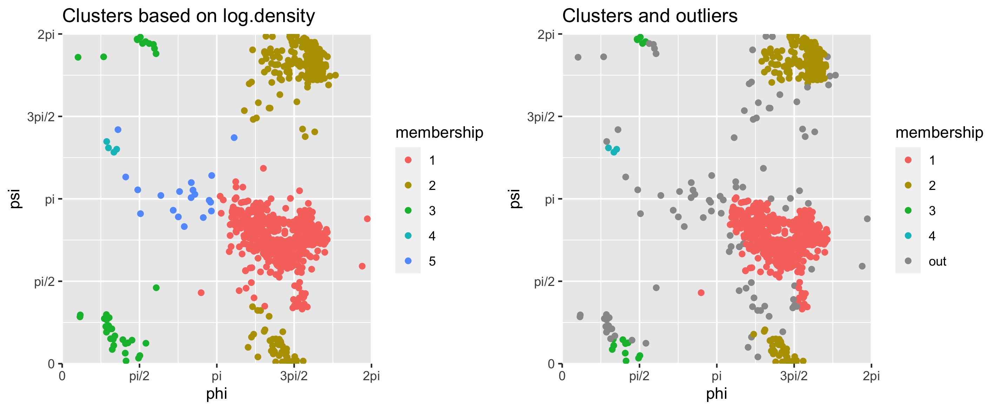

# Introduction

Multivariate angular or circular data have found applications in some
research domains including geology (e.g., paleomagnetic directions) and
bioinformatics (e.g., protein dihedral angles). Due to the cyclic nature
of angles, usual vector-based statistical methods are not directly
applicable to such data. A $p$-variate angle
$\theta = (\theta_1,\cdots,\theta_p)^T$ lies on the $p$-dimensional
torus $\mathbb{T}^p = [0,2\pi)^p$ in which the angles $0$ and $2\pi$ are
identified as the same point. Likewise, angles $\theta$ and
$\theta\pm 2\pi$ are the same data point on the torus. Thus, statistical
models and predictions on the torus should reflect this geometric
constraint.

A prominent example in which multivariate angular data appear is the
analysis of protein structures. As described in @protein, the functional
properties of proteins are determined by the ordered sequences of amino
acids and their spatial structures. These structures are determined by
several dihedral angles, and thus, protein structures are commonly
described on multidimensional tori. The $p$-dimensional torus
$\mathbb{T}^p$ is the sample space we consider in this paper.
Especially, for the 2-dimensional case, the backbone chain angles
$\phi,\psi$ of a protein are commonly visualized by the Ramachandran
plot, a scatter plot of dihedral angles in a 2-dimensional flattened
torus $\mathbb{T}^2$ [@lovell2003structure; @oberholser2010proteopedia].
In Figure [1](#fig:covid){reference-type="ref" reference="fig:covid"},
several clustering results are visualized on the Ramachandran plot for
the protein angles of SARS-CoV-2 virus, which caused the 2020-2021
pandemic [@Coronaviridae:2020]. Since the structures in protein angles
are related to functions of the protein, it is of interest to analyze
the scatter of the angles through, for example, density estimation and
clustering. Note that the protein structure data are routinely collected
and publicly available at Protein Data Bank [@pdb] and importing such
data into R is made easy by the package
[bio3d](https://CRAN.R-project.org/package=bio3d) [@Grant:2006; @bio3d].

,
mixtools::mvnormalmixEM (bottom left), in which the number of components
3 is prespecified, and mclust::Mclust (bottom right), in which the
number of components is chosen by BIC. Gray points in the top-left panel
are "outliers\", automatically assigned by
clus.torus.](covid19.png){#fig:covid}

We introduce the R package
[ClusTorus](https://CRAN.R-project.org/package=ClusTorus) [@ClusTorus]
which provides various tools for handling and clustering multivariate
angular data on the torus. The package provides angular adaptations of
usual clustering methods such as the $k$-means clustering and pairwise
angular distances, which can be used as an input for distance-based
clustering algorithms, and implements a novel clustering method based on
conformal prediction framework [@Vovk]. Also implemented in the package
are the EM algorithms and an elliptical $k$-means algorithm for fitting
mixture models on the torus, and a kernel density estimation. We will
introduce various clustering tools implemented in the package,
explaining choices in conformal prediction using two sets of example
data. We also present the theoretical and technical background, and
demonstrate these tools with R codes.

For data on the torus, there are a few previous works for mixture
modeling and clustering. @Mardia:2007 proposed a mixture of bivariate
von Mises distributions for data on $\mathbb{T}^2$, with an application
to modeling protein backbone chain angles. @Mardia:2012 proposed a
density estimation on the torus, based on a mixture of approximated von
Mises sine distributions, for higher dimensional cases, but the proposed
EM algorithm tends to be unstable when sample sizes are limited. The R
package [BAMBI](https://CRAN.R-project.org/package=BAMBI)
[@Chakraborty:2019; @BAMBI] provides routines to fit such von Mises
mixture models using MCMC, but is only applicable to bivariate (and
univariate) angles in $\mathbb{T}^2$. We have implemented EM algorithms
(for $p=2$) and the elliptical $k$-means algorithm (for any $p$),
originally proposed for vector-valued data
[@Sung:1998; @Bishop; @Shin:2019], for fitting mixture models on the
torus. To the best of authors' knowledge, ClusTorus is the first
implementation of methods for fitting mixture models on multidimensional
tori of any dimension.

Algorithmic clustering for data on the torus has also been proposed. For
example, @Gao:2018 used an extrinsic $k$-means algorithm for clustering
protein angles. While this algorithm is not always satisfactory, it is
implemented in ClusTorus for a quick-and-dirty analysis. The top right
panel of Figure [1](#fig:covid){reference-type="ref"
reference="fig:covid"} depicts the result of applying this algorithm
with $k = 3$. Note that the popular R packages
[mixtools](https://CRAN.R-project.org/package=mixtools) [@mixtools] and
[mclust](https://CRAN.R-project.org/package=mclust) [@mclust] provide
misleading clustering results, when applied to data on the torus. As we
illustrate in Figure [1](#fig:covid){reference-type="ref"
reference="fig:covid"}, these tools do not take into account the cyclic
nature of the angular data.

The main contribution of ClusTorus is an implementation of the
predictive clustering approaches of @Jung:2021 and @Shin:2019. For this,
the conformal prediction framework of @Vovk is extended for multivariate
angular data. The conformal prediction is a distribution-free method of
constructing prediction sets, and our implementation uses kernel density
estimates and mixture models, both based on the multivariate von Mises
distribution [@Mardia:2012]. Furthermore, by using Gaussian-like
approximations of the von Mises distributions and a graph-theoretic
approach, flexible clusters, composed of unions of ellipsoids on
$\mathbb{T}^p$, can be identified. The proposed predictive clustering
can be obtained by simply using clus.torus as follows.

::: example
library(ClusTorus) set.seed(2021) ex \<- clus.torus(SARS_CoV_2) plot(ex)
:::

The result of the predictive clustering is visualized in the top left
panel of Figure [1](#fig:covid){reference-type="ref"
reference="fig:covid"}, which is generated by plot(ex). The dataset
SARS_CoV_2, included in ClusTorus, collects the dihedral angles
$\phi,\psi$ in the backbone chain B of SARS-CoV-2 spike glycoprotein.
The raw coronavirus protein data are available at Protein Data Back with
id 6VXX [@Walls:2020], and can be retrieved by using R package bio3d.
The function clus.torus performs three core procedures---conformal
prediction, hyperparameter selection and cluster assignment---for
predictive clustering.

The rest of this article focuses on introducing the three core
procedures: (i) the conformal prediction framework, including our
choices of the conformity scores, (ii) hyperparameter selection and
(iii) cluster assignment. After demonstrating how the package ClusTorus
can be used for clustering of $\mathbb{T}^2$- and $\mathbb{T}^4$-valued
data, we describe how the main function clus.torus and other clustering
algorithms such as $k$-means and hierarchical clustering can be used to
analyze data on the torus. In the Appendix, we provide technical details
and options in fitting mixture models on the torus, and a list of S3
classes defined in ClusTorus.

# Conformal prediction

The conformal prediction framework [@Vovk] is one of the main
ingredients of our development. Based on the work of @Vovk and @Lei:2013
[@Lei:2015], we briefly introduce the basic concepts and properties of
conformal prediction. Suppose that we observe a sample of size $n$,
$X_i\sim F$ where $X_i\in \mathbb{T}^p$ for each $i$ and that the
sequence $\mathbb{X}_n =\left\{X_1,\cdots,X_n\right\}$ is
*exchangeable*. Then, for a new $X_{n+1}\sim F$, the prediction set
$C_n = C_n\left(\mathbb{X}_n\right)$ is said to be valid at level
$1-\alpha$ if: $$\begin{aligned}
\label{eq:1}
    P\left(X_{n+1}\in C_n\right)\ge 1-\alpha,\quad \alpha\in \left(0,1\right),\end{aligned}$$
where $P$ is the corresponding probability measure for
$\mathbb{X}_{n+1}=\mathbb{X}_n\cup\left\{X_{n+1}\right\}$.

For a given $x\in \mathbb{T}^p$, write
$\mathbb{X}_{n}(x)=\mathbb{X}_n\cup\left\{x\right\}$. Consider the null
hypothesis $H_0: X_{n+1}=x$, where $X_{n+1}\sim F$. To test the
hypothesis, the conformal prediction framework uses *conformity scores*
$\sigma_i$ defined as follows: $$\begin{aligned}
    \sigma_i\left(x\right) &:= g\left(X_i, \mathbb{X}_{n}\left(x\right)\right),~ \forall i=1,\cdots,n+1,\\
    \sigma\left(x\right) &:=g\left(x, \mathbb{X}_{n}\left(x\right)\right) = \sigma_{n+1}\left(x\right),\end{aligned}$$
for some real valued function $g$, which measures the conformity or
similarity of a point to the given set. If
$X_{\left(1\right)},\cdots,X_{\left(n+1\right)}$ are ordered to satisfy
$\sigma_{\left(1\right)}\le\cdots\le\sigma_{\left(n+1\right)}$ for
$\sigma_{\left(i\right)} = g\left(X_{\left(i\right)}, \mathbb{X}_{n+1}\right)$,
then we may say that $X_{\left(n+1\right)}$ is the most similar point to
$\mathbb{X}_{n+1}$.

Consider the following quantity: $$\begin{aligned}
    \pi\left(x\right) = \frac{1}{n+1}\sum_{i=1}^{n+1}I\left(\sigma_i\left(x\right)\le\sigma_{n+1}\left(x\right)\right),\quad I(A) = \begin{cases}
    1,\quad A\text{ is true,}\\ 0,\quad \text{otherwise,}
    \end{cases}\end{aligned}$$ which can be understood as a p-value for
the null hypothesis $H_0$. The *conformal prediction set* of level
$1-\alpha$ is constructed as $$\begin{aligned}
    C^{\alpha}_n=\left\{x:\pi\left(x\right)>\alpha\right\}.\end{aligned}$$
Because the sequence $\mathbb{X}_n(x)$ is exchangeable under $H_0$,
$\pi\left(x\right)$ is uniformly distributed on
$\left\{\frac{1}{n+1},\cdots,1\right\}$. With this property, it can be
shown that the conformal prediction set is valid for finite samples,
i.e., [\[eq:1\]](#eq:1){reference-type="eqref" reference="eq:1"} holds
with $C_n$ replaced by $C_n^{\alpha}$ for any $F$, that is, the
prediction set is distribution-free [@Lei:2013]. The performance of the
conformal prediction highly depends on the choice of conformity score
$\sigma$. In some previous works on conformal prediction
[@Lei:2013; @Lei:2015; @Shin:2019; @Jung:2021], the quality of
prediction sets using density based conformity scores has been
satisfactory.

We demonstrate a construction of the conformal prediction set with a
kernel density estimate-based conformity score, defined later in
[\[eq:6\]](#eq:6){reference-type="eqref" reference="eq:6"}, for the data
shown in Figure [1](#fig:covid){reference-type="ref"
reference="fig:covid"}. With the conformity score given by
[\[eq:6\]](#eq:6){reference-type="eqref" reference="eq:6"}, cp.torus.kde
computes the conformal prediction set $C_n^\alpha$ at a given level
$1-\alpha$ ($\alpha=0.1$ below), by performing the kernel density
estimation. The function tests the inclusion in $C_n^\alpha$ of each
point $(\phi,\psi)$ over a fine grid of $\mathbb{T}^2$, and the result
of the testing is shown as the boolean indices in the column Cn of the
output below. The columns Lminus and Lplus provide approximated
prediction sets, defined in @Jung:2021.

::: example
cp.kde \<- cp.torus.kde(SARS_CoV_2) cp.kde

Conformal prediction sets (Lminus, Cn, Lplus) based on kde with
concentration 25

Testing inclusion to the conformal prediction set with level = 0.1 :
------------- phi psi Lminus Cn Lplus level 1 0.00000000 0 FALSE FALSE
FALSE 0.1 2 0.06346652 0 FALSE FALSE FALSE 0.1 3 0.12693304 0 FALSE
FALSE FALSE 0.1 4 0.19039955 0 FALSE FALSE FALSE 0.1 5 0.25386607 0
FALSE FALSE FALSE 0.1 6 0.31733259 0 FALSE FALSE FALSE 0.1 7 0.38079911
0 FALSE FALSE FALSE 0.1 8 0.44426563 0 FALSE FALSE FALSE 0.1 9
0.50773215 0 FALSE FALSE FALSE 0.1 10 0.57119866 0 FALSE FALSE FALSE 0.1

9990 rows are omitted.
:::

The concentration parameter $\kappa$ of the kernel density estimation
and the level(s) of the prediction set can be designated by providing
arguments concentration and level. By default, these values are set as
concentration = 25 and level = 0.1.

The output cp.kde is an S3 object with class cp.torus.kde, for which a
generic method plot is available. The conformal prediction set for
SARS_CoV_2 data can be displayed on the Ramachandran plot, as follows.
The result is shown in Figure [2](#fig:cpkde){reference-type="ref"
reference="fig:cpkde"}.

::: example
plot(cp.kde)
:::

![The Ramachandran plot for SARS-CoV-2, with boundaries of the conformal
prediction set, whose conformity score is
[\[eq:6\]](#eq:6){reference-type="eqref" reference="eq:6"} with
$\kappa = 25$ for level $1-\alpha = 0.9$. ](cpkde.png){#fig:cpkde}

## Inductive conformal prediction

If the sample size $n$ and the number $N$ of grid points over
$\mathbb{T}^p$ are large, evaluating $n + N$ conformity scores may take
a long time. That is, constructing the conformal prediction set suffers
from high computational costs. A workaround for this inefficiency is
*inductive conformal prediction*, which enjoys significantly lower
computational cost. The inductive conformal prediction framework is
based on splitting the data into two sets. The algorithm for inductive
conformal prediction is given in Algorithm
[\[inductive conformal prediction\]](#inductive conformal prediction){reference-type="ref"
reference="inductive conformal prediction"}.

::: algorithm
::: algorithmic
Split the data randomly into
$\mathbb{X}_1=\left\{X_1,\cdots, X_{n_1}\right\}$,
$\mathbb{X}_2=\left\{X_{n_1+1},\cdots, X_{n}\right\}$. Construct
$\sigma$ with $\sigma\left(x\right) = g\left(x,\mathbb{X}_1\right)$ for
some function $g$. Put $\sigma_i = g\left(X_{n_1+i},\mathbb{X}_1\right)$
and order as
$\sigma_{\left(1\right)}\le\cdots\le\sigma_{\left(n_2\right)}$, where
$n_2=n-n_1$. Construct
$\hat{C}^{\alpha}_n = \left\{x:\sigma(x)\ge\sigma_{\left(i_{n_2,\alpha}\right)}\right\}$
where $i_{n,\alpha} = \lfloor\left(n+1\right)\alpha\rfloor$.
:::
:::

While the sizes $n_1$ and $n_2$ of two split data sets can be of any
size, they are typically set as equal sizes. It is well-known that the
output $\hat{C}^\alpha_n$ of the algorithm also satisfies the
distribution-free finite-sample validity [@Vovk; @Lei:2015]. For fast
computation, the inductive conformal prediction is primarily used in
constructing prediction sets and clustering, in our implementation of
ClusTorus. Specifically, icp.torus implements Algorithm
[\[inductive conformal prediction\]](#inductive conformal prediction){reference-type="ref"
reference="inductive conformal prediction"} for several prespecified
conformity scores. As already mentioned, we need to choose the
conformity score $\sigma$ carefully for better clustering performances.

Before we discuss our choices of the conformity scores, we first
illustrate how the functions in ClusTorus are used to produce inductive
conformal prediction sets. The following codes show a calculation of the
inductive conformal prediction set for the data SARS_CoV_2. The
conformal prediction set with the conformity score given by kernel
density estimates [\[eq:6\]](#eq:6){reference-type="eqref"
reference="eq:6"} can be constructed by icp.torus and icp.torus.eval.
The function icp.torus computes $\sigma_i$'s in line 4 of Algorithm
[\[inductive conformal prediction\]](#inductive conformal prediction){reference-type="ref"
reference="inductive conformal prediction"} and icp.torus.eval tests
whether pre-specified evaluation points are included in
$\hat{C}_n^\alpha$. If these evaluation points are not supplied, then
icp.torus.eval creates a grid of size $100 \times 100$ (for $p = 2$).

::: example
set.seed(2021) icp.torus.kde \<- icp.torus(SARS_CoV_2, model = \"kde\",
concentration = 25) icp.kde \<- icp.torus.eval(icp.torus.kde, level =
0.1) icp.kde

Conformal prediction set (Chat_kde)

Testing inclusion to the conformal prediction set with level = 0.1:
------------- X1 X2 inclusion 1 0.00000000 0 FALSE 2 0.06346652 0 FALSE
3 0.12693304 0 FALSE 4 0.19039955 0 FALSE 5 0.25386607 0 FALSE 6
0.31733259 0 FALSE 7 0.38079911 0 FALSE 8 0.44426563 0 FALSE 9
0.50773215 0 FALSE 10 0.57119866 0 FALSE

9990 rows are omitted.
:::

In the codes above, the data splitting for icp.torus is done internally,
and can be inspected by icp.torus.kde\$split.id.

We now introduce our choices for the conformity score $\sigma$ in the
next two subsections.

## Conformity score from kernel density estimates

For the 2-dimensional case, @Jung:2021 proposed to use the kernel
density estimate based on the von Mises kernel [@Marzio:2011] for the
conformity score. A natural extension to the $p$-dimensional tori, for
$p\ge 2$, is $$\begin{aligned}
\label{eq:6}
    g\left(u, \mathbb{X}_{n}\left(x\right)\right) = \frac{1}{n+1}\sum_{i=1}^{n+1}K_\kappa\left(u-X_i\right),\quad K_\kappa\left(v\right) = \prod_{i=1}^p\frac{e^{\kappa\cos\left(v_i\right)}}{2\pi I_0\left(\kappa\right)},\quad v = \left(v_1,\cdots,v_p\right)^T\in\mathbb{T}^p\end{aligned}$$
where $I_0$ is the modified Bessel function of the first kind of order
0, and $\kappa$ is a prespecified concentration parameter. The function
kde.torus provides the multivariate von Mises kernel density estimation.
For conformal prediction, we take
$\sigma\left(x_i\right) = g\left(x_i,\mathbb{X}_n\left(x\right)\right)$,
and for inductive conformal prediction, we take
$\sigma\left(x\right) = g\left(x,\mathbb{X}_1\right)$.

## Conformity scores from mixtures of multivariate von Mises

Our next choices of conformity scores are based on mixture models. Since
the multivariate normal distributions are not defined on $\mathbb{T}^p$,
we instead use the multivariate von Mises distribution [@Mardia:2008],
whose density on $\mathbb{T}^p$ is $$\begin{aligned}
\label{eq:7}
f\left(y;\mu,\kappa, \Lambda\right) = C\left(\kappa,\Lambda\right)\exp\left\{-\frac{1}{2}\left[\kappa^T\left(2 - 2c\left(y,\mu\right)\right)+s\left(y,\mu\right)^T\Lambda s\left(y,\mu\right)\right]\right\}\end{aligned}$$
where $y = \left(y_1,\cdots,y_p\right)^T  \in\mathbb{T}^p$,
$\mu = \left(\mu_1,\cdots,\mu_p\right)^T \in\mathbb{T}^p$,
${\kappa} = (\kappa_1,\ldots,\kappa_p)^T \in (0,\infty)^p$,
$\Lambda = (\lambda_{j,l})$ for $1\le j,l \le p$,
$-\infty < \lambda_{jl} < \infty$, $$\begin{aligned}
    c\left(y,\mu\right) &= \left(\cos\left(y_1-\mu_1\right),\cdots, \cos\left(y_p-\mu_p\right)\right)^T,\\
    s\left(y,\mu\right) &= \left(\sin\left(y_1-\mu_1\right),\cdots, \sin\left(y_p-\mu_p\right)\right)^T,\\
    \left(\Lambda\right)_{jl}&=\lambda_{jl}=\lambda_{lj},~j\ne l,\quad \left(\Lambda\right)_{jj}=\lambda_{jj}=0,\end{aligned}$$
and for some normalizing constant $C\left(\kappa,\Lambda\right)>0$. We
write $f\left(y;\theta\right) = f\left(y;\mu,\kappa,\Lambda\right)$ for
$\theta = (\mu,\kappa,\Lambda)$.

For any positive integer $J$ and a mixing probability
$\boldsymbol{\pi} = \left(\pi_1,\cdots,\pi_J\right)$, consider a
$J$-mixture model: $$\begin{aligned}
\label{eq:8}
    p\left(u;\boldsymbol{\pi},\boldsymbol{\theta}\right) = \sum_{j=1}^J\pi_jf\left(u;\theta_j\right)\end{aligned}$$
where $\boldsymbol{\theta} = \left(\theta_1,\cdots,\theta_J\right)$,
$\theta_j = (\mu_{j}, \kappa_{j}, \Lambda_j)$ for $j=1,\cdots,J$. Let
$\left(\hat{\boldsymbol{\pi}}, \hat{\boldsymbol{\theta}}\right)$ be
appropriate estimators of
$\left(\boldsymbol{\pi}, \boldsymbol{\theta}\right)$ based on
$\mathbb{X}_1$. The plug-in density estimate based on
[\[eq:8\]](#eq:8){reference-type="eqref" reference="eq:8"} is then
$$\begin{aligned}
\label{eq:9}
    p\left(\cdot;\hat{\boldsymbol{\pi}},\hat{\boldsymbol{\theta}}\right) = \sum_{j=1}^J\hat{\pi}_jf\left(\cdot;\hat{\theta}_j\right),\end{aligned}$$
which can be used as a conformity score by setting
$g\left(\cdot,\mathbb{X}_1\right)=\hat{p}\left(\cdot\right)$. Assuming
high concentrations, an alternative conformity score can be set as
$g\left(\cdot,\mathbb{X}_1\right)=p^{max}\left(\cdot,\hat{\boldsymbol{\pi}},\hat{\boldsymbol{\theta}}\right)$
where $$\begin{aligned}
\label{eq:10}
     p^{max}\left(u;\hat{\boldsymbol{\pi}},\hat{\boldsymbol{\theta}}\right):=\max_{j=1,\cdots,J}\left(\hat{\pi}_jf\left(u;\hat{\theta}_j\right)\right)\approx p\left(u;\hat{\boldsymbol{\pi}},\hat{\boldsymbol{\theta}}\right).\end{aligned}$$

On the other hand, @Mardia:2012 introduced an approximated density
function $f^*$ for the $p$-variate von Mises sine distribution
[\[eq:7\]](#eq:7){reference-type="eqref" reference="eq:7"} for
sufficiently high concentrations and when $\Sigma\succ0$:
$$\begin{aligned}
\notag
f^*\left(y;,\mu,\Sigma\right) = \left(2\pi\right)^{-p/2}\left|\Sigma\right|^{-1/2}\exp\left\{-\frac{1}{2}\left[\kappa^T\left(2 - 2c\left(y,\mu\right)\right)+s\left(y,\mu\right)^T\Lambda s\left(y,\mu\right)\right]\right\}\end{aligned}$$
where
$\left(\Sigma^{-1}\right)_{jl} = \lambda_{jl}, \left(\Sigma^{-1}\right)_{jj} = \kappa_j, ~j\ne l$.
By further approximating via $\theta \approx \sin\theta$,
$1-\frac{\theta^2}{2}\approx\cos\theta$, we write $$\begin{aligned}
    f^*\left(y;,\mu,\Sigma\right) \approx \left(2\pi\right)^{-p/2}\left|\Sigma\right|^{-1/2}\exp\left\{-\frac{1}{2}\left[\left(y\ominus\mu\right)^T\Sigma^{-1}\left(y\ominus\mu\right)\right]\right\},\label{eq:11}\end{aligned}$$
where the angular subtraction $\ominus$ stands for $$\begin{aligned}
\notag
X\ominus Y := \left(\arg\left(e^{i\left(\phi_{x1} - \phi_{y1}\right)}\right), \cdots, \arg\left(e^{i\left(\phi_{xp} - \phi_{yp}\right)}\right)\right)^T,\end{aligned}$$
for $X = \left(\phi_{x1},\cdots,\phi_{xp}\right)^T\in\mathbb{T}^p$ and
$Y = \left(\phi_{y1},\cdots,\phi_{yp}\right)^T\in\mathbb{T}^p$ as
defined in @Jung:2021 for $p = 2$. By replacing the von Mises density
$f$ in [\[eq:10\]](#eq:10){reference-type="eqref" reference="eq:10"}
with the approximate normal density
[\[eq:11\]](#eq:11){reference-type="eqref" reference="eq:11"},
$\log\left(p^{max}\left(\cdot;\boldsymbol{\pi},\boldsymbol{\theta}\right)\right)$
is approximated by $$\begin{aligned}
    \log\left(p^{max}\left(u;\boldsymbol{\pi},\boldsymbol{\theta}\right)\right) &\approx \frac{1}{2}\max_j e\left(u;\pi_j,\theta_j\right) + c, \nonumber\\
    e\left(u;\pi_j,\theta_j\right)&=-\left(u\ominus\mu_j\right)^T\Sigma_j^{-1}\left(u\ominus\mu_j\right) +2\log\pi_j-\log\left|\Sigma_j\right| \label{eq:ehatj}\end{aligned}$$
where $\theta_j=(\mu_{j},\Sigma_j)$,
$\mu_j = (\mu_{1j},\cdots,\mu_{pj})^T\in\mathbb{T}^p$,
$\Sigma_j\in\mathbb{R}^{p\times p}$ and a constant $c\in\mathbb{R}$. Our
last choice of the conformity score is $$\begin{aligned}
\label{eq:12}
g\left(\cdot,\mathbb{X}_{1}\right)=\max_je\left(\cdot,\hat{\pi}_j,\hat{\theta}_j\right).\end{aligned}$$
Note that with this choice of conformity score, the conformal prediction
set can be expressed as the union of ellipsoids on the torus. That is,
the following equalities are satisfied [@Shin:2019; @Jung:2021]: Let
$C_n^e$ be the level $1-\alpha$ prediction set using
[\[eq:12\]](#eq:12){reference-type="eqref" reference="eq:12"}. Then
$$\begin{aligned}
\notag
    C^e_n&:=\left\{x\in\mathbb{T}^p:g\left(x,\mathbb{X}_{1}\right)\ge g\left(X_{\left(i_{n_2,\alpha}\right)},\mathbb{X}_{1}\right)\right\}\\\label{eq:14}
    &=\bigcup_{j=1}^J\hat{E}_j\left(\sigma_{\left(i_{n_2,\alpha}\right)}\right)\end{aligned}$$
where
$\hat{E}_j\left(t\right)=\left\{x\in\mathbb{T}^p:\left(x\ominus\hat{\mu}_j\right)^T\hat{\Sigma}_j^{-1}\left(x\ominus\hat{\mu}_j\right)\le 2\log\hat{\pi}_j-\log\left|\hat{\Sigma}_j\right| - t\right\}$
for $t\in\mathbb{R}$. Note that $\hat{E}_j\left(t\right)$ is
automatically vanished if
$t\ge 2\log\hat{\pi}_j-\log\left|\hat{\Sigma}_j\right|$.

## Implementation

We have implemented four conformity scores, described in the previous
section. These are based on

1.  kernel density estimate [\[eq:6\]](#eq:6){reference-type="eqref"
    reference="eq:6"},

2.  mixture model [\[eq:9\]](#eq:9){reference-type="eqref"
    reference="eq:9"},

3.  max-mixture model [\[eq:10\]](#eq:10){reference-type="eqref"
    reference="eq:10"}, and

4.  ellipsoids obtained by approximating the max-mixture
    [\[eq:12\]](#eq:12){reference-type="eqref" reference="eq:12"}.

The function icp.torus in ClusTorus computes these conformity scores
using the inductive conformal prediction framework, and returns
icp.torus object(s). Table
[1](#table:icp.torus.score){reference-type="ref"
reference="table:icp.torus.score"} illustrates several important
arguments of the function icp.torus.

::: {#table:icp.torus.score}
  Arguments       Descriptions
  --------------- --------------------------------------------------------------------------------------------------------------------------------------------------------------------------------------------------------------------------------------------------------------------------------------------------------------------------------------------------------------------------------------------------------------------------------------------------------------------------------------------------------------------------------------------------------------------------------------------------------------------------------------------------------------------------------------------------------------------------------------------------------
  data            $n \times d$ matrix of toroidal data on $[0, 2\pi)^d$ or $[-\pi, \pi)^d$
  model           A string. One of \"kde\", \"mixture\", and \"kmeans\" which determines the model or estimation methods. If \"kde\", the model is based on the kernel density estimates. It supports the kde-based conformity score only. If \"mixture\", the model is based on the von Mises mixture, fitted with an EM algorithm. It supports the von Mises mixture and its variants based conformity scores. If \"kmeans\", the model is also based on the von Mises mixture, but the parameter estimation is implemented with the elliptical k-means algorithm illustrated in Appendix. It supports the log-max-mixture based conformity score only. If the dimension of data space is greater than 2, only \"kmeans\" is supported. Default is model = \"kmeans\".
  J               A scalar or numeric vector for the number(s) of components for model = c(\"mixture\", \"kmeans\"). Default is J = 4.
  concentration   A scalar or numeric vector for the concentration parameter(s) for model = \"kde\". Default is concentration = 25.

  : Key arguments and descriptions for the function icp.torus
:::

The argument model of the function icp.torus indicates which conformity
score is used. By setting model = \"kde\", the kde-based conformity
score [\[eq:6\]](#eq:6){reference-type="eqref" reference="eq:6"} is
used. By setting model = \"mixture\" the mixture model
[\[eq:9\]](#eq:9){reference-type="eqref" reference="eq:9"} is estimated
by an EM algorithm, and conformity scores based on
[\[eq:9\]](#eq:9){reference-type="eqref" reference="eq:9"},
[\[eq:10\]](#eq:10){reference-type="eqref" reference="eq:10"},
[\[eq:12\]](#eq:12){reference-type="eqref" reference="eq:12"} are all
provided. Setting model = \"kmeans\" provides a mixture model fit by the
elliptical $k$-means algorithm and conformity score based on
[\[eq:12\]](#eq:12){reference-type="eqref" reference="eq:12"}.

The arguments J and concentration specify the model fitting
hyperparameters. To compute conformity scores based on kernel density
estimate [\[eq:6\]](#eq:6){reference-type="eqref" reference="eq:6"}, one
needs to specify the concentration parameter $\kappa$. Likewise, the
number of mixtures, $J$, needs to be specified in order to fit the
mixture model [\[eq:9\]](#eq:9){reference-type="eqref" reference="eq:9"}
and the variants [\[eq:10\]](#eq:10){reference-type="eqref"
reference="eq:10"} and [\[eq:12\]](#eq:12){reference-type="eqref"
reference="eq:12"}. The function icp.torus takes either a single value
(e.g., J = 4 is the default), or a vector (e.g., J = 4:30 or
concentration = c(25,50)) for arguments J and concentration. If J (or
concentration) is a scalar, then icp.torus returns an icp.torus object.

On the other hand, if J (or concentration) is a numeric vector
containing at least two values, then icp.torus returns a list of
icp.torus objects, one for each value in J (or concentration,
respectively). Typically, the hyperparameter $J$ (or $\kappa$) is not
predetermined, and one needs to choose among a set of candidates. A list
of icp.torus objects, evaluated for each candidate in vector-valued J
(or concentration) is required for our hyperparameter selection
procedure, discussed in a later section.

Let us present an R code example for creating an icp.torus object,
fitted with model = \"kmeans\" (the default value for argument model)
and J = 12.

::: example
set.seed(2021) icp.torus.12 \<- icp.torus(SARS_CoV_2, J = 12)
plot(icp.torus.12, level = 0.1111)
:::

![The Ramachandran plot for SARS-CoV-2, with conformal prediction set
whose conformity score is [\[eq:12\]](#eq:12){reference-type="eqref"
reference="eq:12"} with $J = 12$ for level $\alpha = 0.1111$. The plot
demonstrates the union of ellipses as
[\[eq:14\]](#eq:14){reference-type="eqref"
reference="eq:14"}.](Ellipses.png){#fig:ellipse}

The icp.torus object has an S3 method plot, and the R code
plot(icp.torus.12, level = 0.1111) plots the ellipses in
[\[eq:14\]](#eq:14){reference-type="eqref" reference="eq:14"} with
$\alpha$ specified by argument level = 0.1111. The union of these
ellipses is in fact the inductive conformal prediction set of level
$1-\alpha$. The boundaries of the inductive conformal prediction set can
be displayed by specifying ellipse = FALSE, as follows.

::: example
plot(icp.torus.12, ellipse = FALSE)
:::

The resulting graphic is omitted.

Conformity scores based on mixture model and its variants need
appropriate estimators of the parameters, $\boldsymbol{\pi}$ and
$\boldsymbol{\theta}$. If the parameters are poorly estimated, the
conformal prediction sets will be constructed trivially and thus become
useless. We have implemented two methods of estimation: EM algorithms
and the elliptical $k$-means algorithm, also known as the generalized
Lloyd's algorithm [@Sung:1998; @Bishop; @Shin:2019]. EM algorithms for
the mixture model [\[eq:9\]](#eq:9){reference-type="eqref"
reference="eq:9"} are described in @Jung:2021, for the 2-dimensional
case. Since the EM estimates require long computation time and large
sample sizes, extensions to higher-dimensional tori do not seem to apt.
The EM estimates of the mixture model parameters can be naturally used
for the case of max-mixture [\[eq:10\]](#eq:10){reference-type="eqref"
reference="eq:10"} and ellipsoids
[\[eq:12\]](#eq:12){reference-type="eqref" reference="eq:12"} as well.
The argument model = \"mixture\" of icp.torus works only for the
2-dimensional case. On the other hand, the elliptical $k$-means
algorithm converges much faster even for moderately high-dimensional
tori. The elliptical $k$-means algorithm is used for estimating
parameters in the approximated normal density
[\[eq:11\]](#eq:11){reference-type="eqref" reference="eq:11"}, and for
computation of the conformity score of ellipsoids
[\[eq:12\]](#eq:12){reference-type="eqref" reference="eq:12"}. The
elliptical $k$-means algorithms for data on the torus are further
discussed in the Appendix.

Table [2](#conformity score){reference-type="ref"
reference="conformity score"} summarizes the four choices of conformity
scores in terms of model-fitting methods, dimensionality of the data
space, and whether clustering is available. Our predictive clustering is
implemented only based on the \"ellipsoids\" conformity score
[\[eq:12\]](#eq:12){reference-type="eqref" reference="eq:12"}. The
rational for this choice is due to the relatively simple form of
prediction sets (a union of ellipsoids
[\[eq:14\]](#eq:14){reference-type="eqref" reference="eq:14"}).

::: center
::: {#conformity score}
                                                                                                                                          Conformity Scores                                                                                                                                          EM   k-means   dim = 2   dim \> 2   Clustering
  ------------------------------------------------------------------------------------------------------------------------------------------------------------------------------------------------------------------------------------------------------------------------------------------------- ---- --------- --------- ---------- ------------
   Kernel density ([\[eq:6\]](#eq:6){reference-type="ref" reference="eq:6"}) Mixture ([\[eq:9\]](#eq:9){reference-type="ref" reference="eq:9"}) Max-mixture ([\[eq:10\]](#eq:10){reference-type="ref" reference="eq:10"}) Ellipsoids ([\[eq:12\]](#eq:12){reference-type="ref" reference="eq:12"})                                      
                                                                                                                                                                                                                                                                                                                                        
                                                                                                                                                                                                                                                                                                                                        
                                                                                                                                                                                                                                                                                                                                        

  : Conformity scores against available fitting methods, dimensions of
  the torus, and whether cluster assignment is available.
:::
:::

# Clustering by conformal prediction

We now describe our clustering strategies using the conformal prediction
sets. Suppose for now that the level $\alpha$ and the hyperparameter $J$
of the prediction set are given. The basic idea of clustering is to take
each connected component of the prediction set as a cluster. For this,
we need an algorithm identifying connected components from any
prediction set. Since the prediction sets are in general of irregular
shapes, such an identification is a quite difficult task. However, as
shown in @Jung:2021, if the conformal prediction set is of the form
[\[eq:14\]](#eq:14){reference-type="eqref" reference="eq:14"}, clusters
are identified by testing the intersection of ellipsoids. Suppose
$C_n^e = \cup_{j=1}^J \hat{E}_j$ where each $\hat{E}_j$ is an ellipsoid.
Let the $(i,j)$th entry of a square matrix $A$ be 0 if
$\hat{E}_i\cap \hat{E}_j=\varnothing$, 1 otherwise. Then, $A$ is the
adjacent matrix of a graph whose nodes and edges represent the
ellipsoids and intersections, respectively. The adjacent matrix $A$
gives a partition $I_1,\cdots,I_K\subseteq \{1,\cdots,J\}$ satisfying
$$\begin{aligned}
    \hat{E}_{i_k}\cap \hat{E}_{i_{k^\prime}} = \varnothing,\quad k\ne k^\prime\end{aligned}$$
where $1\le k,k^\prime\le K, i_k\in I_k, i_{k^\prime}\in I_{k^\prime}$.
This implies that the union of ellipsoids,
$U_k=\cup_{i\in I_k}\hat{E}_i$, whose indices are in a connected
component $I_k$ for some $k$, can be regarded as a cluster. That is,
$U_1,\cdots,U_K$ are the disjoint clusters. With this, the conformal
prediction set naturally generates $K$ clusters. Note that testing the
intersection of ellipsoids can be done efficiently (which is a
univariate root finding problem [@Gilitschenski:2012]), while testing
the intersection of arbitrarily shaped sets is not feasible in general.
This is the reason why we only use the conformity score of the form
[\[eq:12\]](#eq:12){reference-type="eqref" reference="eq:12"}, the
prediction set from which is exactly the union of ellipsoids.

We now describe how the cluster labels are assigned to data points. Each
data point included in the prediction set is automatically assigned to
the cluster which contains the point. For the data points which are not
included in the conformal prediction set, we have implemented two
different types for cluster assignment, as defined in @Jung:2021. The
first is to assign the *closest* cluster label. The notion of closest
cluster can be defined either by the Mahalanobis distance
$(x\ominus\hat\mu_j)^T\hat\Sigma_j^{-1}(x\ominus\hat\mu_j)$, the
approximate log-density ([\[eq:ehatj\]](#eq:ehatj){reference-type="ref"
reference="eq:ehatj"}), or the largest posterior probability
$\hat{P}(Y = k | X = x)$. For example, for $x\not\in C^e_n$, let $E_i$
be the set with the largest approximate log-density $\hat{e}_i(x)$. If
$i\in I_k$, then $x$ is assigned to the cluster $k$. These provide three
choices of cluster assignment, depending on the definition of
"closeness.\" The last choice is to regard the excluded points as
outliers. That is, if $x\not\in C^e_n$, then the point $x$ is labeled as
"outlier.\" This outlier-disposing clustering may be more appropriate
for the cases where some of data points are truely outliers. Figure
[4](#fig:mahal){reference-type="ref" reference="fig:mahal"} compares the
two different types of clustering assignment.

{#fig:mahal}

The function cluster.assign.torus, which takes as input an icp.torus
object and level $\alpha$, generates the clusters as we described above.
The output of the function is an S3 object with class cluter.obj, and
includes the cluster memberships of all data points, for each and every
cluster assignment method we discussed above. The output of
cluster.assign.torus includes the number of clusters detected, the
cluster assignment results for the first 10 observations, and cluster
sizes, as shown in the code example below.

::: example
c \<- cluster.assign.torus(icp.torus.12, level = 0.1111) c

Number of clusters: 5 ------------- Clustering results by log density:
\[1\] 1 1 1 1 2 4 2 1 3 1 cluster sizes: 538 372 39 4 19

Clustering results by posterior: \[1\] 5 5 5 5 2 4 3 5 3 5 cluster
sizes: 6 310 104 4 548

Clustering results by representing outliers: \[1\] 1 1 1 1 2 6 2 1 6 1
cluster sizes: 508 343 15 3 0 103

Note: cluster id = 6 represents outliers.

Clustering results by Mahalanobis distance: \[1\] 1 1 1 1 2 4 2 1 3 1
cluster sizes: 533 372 39 4 24

962 clustering results are omitted.
:::

The clustering results contained in the object c can be visualized as
follows.

::: example
plot(c, assignment = \"log.density\") plot(c, assignment = \"outlier\")
:::

The results are displayed in Figure [4](#fig:mahal){reference-type="ref"
reference="fig:mahal"}. When the argument assignment is not specified,
the outlier disposing assignment is chosen by default.

# Hyperparameter selection

Poor choices of conformity score result in too wide prediction sets.
Thus, we need to choose the hyperparameters elaborately for a better
conformal prediction set and for a better clustering performance. The
hyperparameters are the concentration parameter $\kappa$ (for the case
[\[eq:6\]](#eq:6){reference-type="eqref" reference="eq:6"}) or the
number of mixture components $J$ (for the cases
[\[eq:9\]](#eq:9){reference-type="eqref" reference="eq:9"},
[\[eq:10\]](#eq:10){reference-type="eqref" reference="eq:10"},
[\[eq:12\]](#eq:12){reference-type="eqref" reference="eq:12"}), as well
as the level $\alpha$ for all cases. There have been some efforts to
select the optimal hyperparameters by introducing adequate criteria.
@Lei:2013 and @Jung:2021 each proposed criteria based on the minimum
volume of the conformal prediction set. However, as we shall see, these
approaches become computationally infeasible for higher dimensions.

We briefly review the criterion used in @Jung:2021. Assume for now that
mixture models are used; that is, $(J, \alpha)$ are the hyperparameters
of interest. For a set $C\subseteq\mathbb{T}^p$, let $\mu(C)$ be the
volume of $C$. Without loss of generality, we can assume that
$\mu\left(\mathbb{T}^p\right)=1$. For a given level $\alpha$, the
optimal choice of hyperparameter $J$ minimizes
$\mu\left(C_n(\alpha,J)\right)$ of conformal prediction set
$C_n\left(\alpha, J\right)$. To choose $\alpha$ and $J$ altogether,
@Jung:2021 proposed to use the following criterion: $$\begin{aligned}
\label{eq:16}
\left(\hat{\alpha},\hat{J}\right) = \arg\min_{\alpha, J}\alpha + \mu\left(C_n\left(\alpha, J\right)\right).\end{aligned}$$
Note that if $(\kappa, \alpha)$ are the hyperparameters, then $J$ and
$\hat{J}$ in [\[eq:16\]](#eq:16){reference-type="eqref"
reference="eq:16"} are replaced by $\kappa$ and $\hat\kappa$.

To evaluate [\[eq:16\]](#eq:16){reference-type="eqref"
reference="eq:16"}, one needs to have a set of candidates for $J$ (or
$\kappa$), and conformal prediction sets corresponding to each choice of
$J$ (or $\kappa$, respectively). For this purpose, the function
icp.torus is designed to take as input a set of hyperparameter
candidates. As an example, the following code evaluates the inductive
conformal prediction sets for data SARS_CoV_2, fitted by mixture models
with the number of components given by each $J = 3,4,\ldots, 35$.

::: example
set.seed(2021) icp.torus.objects \<- icp.torus(SARS_CoV_2, J = 3:35)
:::

The result, icp.torus.objects, is a list of 33 icp.torus objects.
Evaluating @Jung:2021's criterion
[\[eq:16\]](#eq:16){reference-type="eqref" reference="eq:16"} is
implemented in the function hyperparam.torus. There, the criterion
[\[eq:16\]](#eq:16){reference-type="eqref" reference="eq:16"} is termed
\"elbow\", since the minimizer $(\hat\alpha,\hat{J})$ is typically found
at an elbow of the graph of the objective function.

::: example
hyperparam.out \<- hyperparam.torus(icp.torus.objects) hyperparam.out

Type of conformity score: kmeans general Optimizing method: elbow
------------- Optimally chosen parameters. Number of components = 12 ,
alpha = 0.1111111 Results based on criterion elbow : J alpha mu
criterion 2241 12 0.1111111 0.1215 0.2326111 2244 12 0.1172840 0.1169
0.2341840 2242 12 0.1131687 0.1211 0.2342687 2243 12 0.1152263 0.1198
0.2350263 2001 11 0.1172840 0.1179 0.2351840 2240 12 0.1090535 0.1265
0.2355535 2245 12 0.1193416 0.1169 0.2362416 2002 11 0.1193416 0.1175
0.2368416 2494 13 0.1316872 0.1053 0.2369872 2004 11 0.1234568 0.1136
0.2370568 2246 12 0.1213992 0.1161 0.2374992 2003 11 0.1213992 0.1163
0.2376992 2005 11 0.1255144 0.1123 0.2378144 1999 11 0.1131687 0.1248
0.2379687 2239 12 0.1069959 0.1310 0.2379959

8004 rows are omitted.

Available components: \[1\] \"model\" \"option\" \"results\"
\"icp.torus\" \"Jhat\" \"alphahat\"
:::

It can be checked that the choice of $J=12$ and $\alpha = 0.1111$ in the
previous examples was indeed given by the option \"elbow\".

In computing the criterion [\[eq:16\]](#eq:16){reference-type="eqref"
reference="eq:16"}, the volume
$\mu\left(C_n\left(\alpha, J\right)\right)$ is numerically approximated.
This is feasible for data on $\mathbb{T}^2=[0,2\pi)^2$ by inspecting the
inclusion of each point of a fine grid. However, for high dimensional
cases, for example $\mathbb{T}^4$, evaluating the volume becomes
computationally infeasible. In fact, as the dimension increases, the
number of required inspections grows exponentially. Furthermore, the
function $(\alpha,J)\rightarrow \alpha + \mu\left(C_n(\alpha,J)\right)$
is typically not a convex function and has multiple local minima. Thus,
the choice of $\left(\hat{\alpha},\hat{J}\right)$ by
[\[eq:16\]](#eq:16){reference-type="eqref" reference="eq:16"} tends to
be unstable, resulting in high variability of the clustering results.
Therefore, evaluating [\[eq:16\]](#eq:16){reference-type="eqref"
reference="eq:16"} is not practical for high-dimensional data.

To this end, we have developed and implemented a computationally more
efficient procedure for hyperparameter selection, which also provides
more stable clustering results. This procedure is a two-step procedure,
first choosing the model parameter $J$, then choosing the level
$\alpha$. The two-step procedure is implemented for choosing $J$ and
$\alpha$, but not for $\kappa$ and $\alpha$. Our approach is in contrast
to the approaches in @Lei:2013 and @Shin:2019 in which they only choose
the model parameter for a prespecified level $\alpha$.

The first step of the procedure is to choose $J$, without making any
reference to the level $\alpha$. Choosing $J$ can be regarded as
selecting an appropriate mixture model. The model selection is based on
either the (prediction) risk, Akaike information criterion
[@Akaike:1974], or Bayesian information criterion [@Schwarz:1978]. Since
the mixture model-based conformity scores
[\[eq:9\]](#eq:9){reference-type="eqref" reference="eq:9"},
[\[eq:10\]](#eq:10){reference-type="eqref" reference="eq:10"} and
[\[eq:12\]](#eq:12){reference-type="eqref" reference="eq:12"} are
actually the density or the approximated log-density of the mixture
model, we use the conformity scores in place of the likelihood. For
example, the sum of the conformity scores
[\[eq:12\]](#eq:12){reference-type="eqref" reference="eq:12"} over the
given data is exactly the fitted log-likelihood. Specifically, let
$\mathbb{X}_1,\mathbb{X}_2$ be the splitted datasets given by Algorithm
[\[inductive conformal prediction\]](#inductive conformal prediction){reference-type="ref"
reference="inductive conformal prediction"} and
$\mathbb{X} = \mathbb{X}_1\cup\mathbb{X}_2$. Let
$\sigma(\cdot) = \log g\left(\cdot;\mathbb{X}_1\right)$ if $g$ is given
by [\[eq:9\]](#eq:9){reference-type="eqref" reference="eq:9"} and
[\[eq:10\]](#eq:10){reference-type="eqref" reference="eq:10"} or
$\sigma(\cdot) = g\left(\cdot;\mathbb{X}_1\right)$ if $g$ is given by
[\[eq:12\]](#eq:12){reference-type="eqref" reference="eq:12"}. Recall
that $g$ is the conformity score, and it depends on the estimated model
$\hat{p}$. Then, the function $\sigma$ we defined above also depends on
the model $\hat{p}$, and the criterion $R$ can be defined as follows:
$$\begin{aligned}
\notag
R\left(\mathbb{X},\hat{p}\right) =
\begin{cases}
-2\sum_{x\in\mathbb{X}_2}\sigma(x) & \mbox{if the criterion is the risk,} \\
-2\sum_{x\in\mathbb{X}_1}\sigma(x) + 2k & \mbox{if the criterion is AIC,}\\
-2\sum_{x\in\mathbb{X}_1}\sigma(x) + k\log n_1 & \mbox{if the criterion is BIC,}
\end{cases}\end{aligned}$$ where $k$ is the number of model parameters
and $n_1$ is the cardinality of $\mathbb{X}_1$. The function
hyperparam.J computes the minimizer $\hat{J}$ of the criterion, as
summarized in Algorithm
[\[hyperparam.J\]](#hyperparam.J){reference-type="ref"
reference="hyperparam.J"}.

::: algorithm
::: algorithmic
Evaluate $R_j = R\left(\mathbb{X},\hat{p}_j\right)$ for
$j = j_1,\cdots, j_n$. Evaluate
$\hat{J} = \arg\min_{j\in \{j_1,\cdots,j_n\}}R_j$. Output
$\hat{J},\hat{p}_{\hat{J}}$.
:::
:::

The fitted models $\hat{p}_{j_1},\cdots,\hat{p}_{j_n}$ of Algorithm
[\[hyperparam.J\]](#hyperparam.J){reference-type="ref"
reference="hyperparam.J"} are exactly the outputs of icp.torus for
various $J=j_1,\cdots,j_n$. Which criterion to use is specified by
setting the argument option of hyperparam.J. The argument option =
\"risk\", \"AIC\", or \"BIC\" is for the risk, AIC, or BIC,
respectively. By choosing $\hat{J}$, we also fix the model
$\hat{p}_{\hat{J}}$ for the next step.

The second step is to choose the level $\alpha\in (0,1)$ for the chosen
$\hat{J}$ and $\hat{p}_{\hat{J}}$, so that the clustering result is
stable over perturbations of $\alpha$. If the number of clusters does
not change by varying the level $\alpha\in I$ for some interval $I$, we
regard that the clustering result is stable on $I$. If $I$ is
sufficiently wide, it is reasonable to choose an $\alpha\in I$. Thus,
our strategy is to find the most wide interval
$I = [a,b]\subseteq (0,1)$ whose elements construct the same number of
clusters, and to set $\hat{\alpha}$ as the midpoint of the interval,
i.e. $\hat\alpha = (a+b)/2$. However, choosing $\alpha$ large, e.g.
$\alpha>0.5$, results in a too small coverage $1-\alpha$ of the
prediction set. Thus, we restrict the searching area as $[0, M]$ for
$M\in (0,1)$ which is close to $0$, and find the desirable $I$ in the
restricted area $[0,M]$ rather than the whole interval $[0,1]$. This
strategy is implemented in hyperparam.alpha, and the algorithm is
described in Algorithm
[\[hyperparam.alpha\]](#hyperparam.alpha){reference-type="ref"
reference="hyperparam.alpha"}.

::: algorithm
::: algorithmic
Evaluate the number of clusters $c_{\alpha_j}$ for $\alpha_j = j/n_{2}$,
$j=1,\cdots,\lfloor n_{2} M\rfloor$. Set
$A = \{j: c_{\alpha_{j-1}}\ne c_{\alpha_j},\quad j=2,\cdots,\lfloor n_{2}M\rfloor\}$.
For $A=\{\alpha_{j_1},\cdots,\alpha_{j_N}\}$ find
$i=\arg\max_{k\in\{1,\cdots, N-1\}}\alpha_{j_{k+1}} - \alpha_{j_k}$.
Output $\hat{\alpha} = \left(\alpha_{j_{i+1}} + \alpha_{j_i}\right)/2$
:::
:::

Note that we could alternatively input an array of levels, for the
argument alphavec of hyperparam.alpha, if there is a prespecified
searching area. In our experience, setting $M = 0.15$ gives generally
satisfying results. By setting $M = 0.15$, at most 15% of the data
points are not included in the prediction set, and at most 15% of the
data can be regarded as the outliers. The default value for argument
alpha.lim of hyperparam.alpha, which is $M$ in Algorithm
[\[hyperparam.alpha\]](#hyperparam.alpha){reference-type="ref"
reference="hyperparam.alpha"}, is 0.15. We may interpret this level
selecting procedure as finding the representative modes for the given
mixture model; the chosen level is the cutoff value for which the most
stable modes are not vanished.

In summary, we first choose the number of model components $J$ in view
of model selection, and then find the most stable level $\hat{\alpha}$
in the sense of invariability of the number of clusters. The function
hyperparam.torus combines and implements Algorithms
[\[hyperparam.J\]](#hyperparam.J){reference-type="ref"
reference="hyperparam.J"} and
[\[hyperparam.alpha\]](#hyperparam.alpha){reference-type="ref"
reference="hyperparam.alpha"} sequentially and thus chooses $J$ and
$\alpha$. This two-step hyperparameter selection procedure is used when
mixture models are used to produce the conformal prediction sets, and
can be invoked when the argument option of hyperparam.torus is set as
option = \"risk\", \"AIC\", or \"BIC\". If option = \"elbow\" (the
default value, if the dimension of data is $p  = 2$), then the \"elbow\"
criterion [\[eq:16\]](#eq:16){reference-type="eqref" reference="eq:16"}
is used to choose either $(J, \alpha)$ or $(\kappa, \alpha)$. The
function hyperparam.torus returns the chosen hyperparameters
$(\hat{J}, \hat\alpha)$ (or $(\hat\kappa, \hat\alpha)$), as well as the
corresponding model as an icp.torus object.

As an example, the following code applies the two-step procedure with
option = \"risk\" to icp.torus.objects we evaluated earlier.

::: example
hyperparam.risk.out \<- hyperparam.torus(icp.torus.objects, option =
\"risk\") hyperparam.risk.out

Type of conformity score: kmeans general Optimizing method: risk
------------- Optimally chosen parameters. Number of components = 12 ,
alpha = 0.132716 Results based on criterion risk : J criterion 1 3
2016.575 2 4 1990.566 3 5 1907.887 4 6 1922.430 5 7 1924.768 \...
(omitted)
:::

With the option \"risk,\" $(\hat{J}, \hat\alpha) = (12, 0.0.1327)$.
Recall that with option \"elbow\", we have chosen
$(\hat{J}, \hat\alpha) = (12, 0.1111)$. The hyperparameter selection
procedures can be visualized by plot(hyperparam.out) and
plot(hyperparam.risk.out). (The resulting graphic is omitted.)

In the next section, the two-step procedures for hyperparameter
selection are used in a cluster analysis of data on $\mathbb{T}^4$.

# Clustering data on $\mathbb{T}^4$

In this section, we give an example of clustering ILE data in
$\mathbb{T}^4$. ILE is a dataset included in ClusTorus, which represents
the structure of the isoleucine. This dataset is obtained by collecting
several different '[.pdb]{.sans-serif}' files in the Protein Data Bank
[@pdb]. We used PISCES [@pisces] to select high-quality protein data, by
using several benchmarks---resolution is 1.6Å$~$or better, R-factor is
$0.22$ or better, sequence percentage identity is equal to or less than
$25$---as described in @Tim:2010 and @Mardia:2012. The ILE data consist
of $n = 8080$ instances of four angles
$(\phi, \psi, \chi_1,\chi_2) \in \mathbb{T}^4$, and is displayed in
Figure [5](#fig:ile){reference-type="ref" reference="fig:ile"}.

{#fig:ile}

For predictive clustering of ILE data, the conformal prediction sets and
scores are built from mixture models, fitted with the elliptical
$k$-means algorithm (i.e., model = \"kmeans\"). Other choices of models
such as \"kde\" and \"mixture\" are not applicable for this data set
with $p > 2$. The number $J$ of components in the mixture model needs to
be tuned, and we set the candidates for $J$ as $\{10,\ldots, 40\}$. In
the code example below, conformal prediction sets from mixture models
are constructed by the function icp.torus, with J = 10:40 indicating the
candidates of $J$.

::: example
set.seed(2021) icp.torus.objects \<- icp.torus(ILE, J = 10:40)
:::

Next step is to select the hyperparameter $J$, and the level $\alpha$ of
the prediction set, using the function hyperparam.torus. As discussed in
the previous section, for this data set with $p = 4$, evaluating the
\"elbow\" criterion is computationally infeasible, and is not supported
in hyperparam.torus, if $p > 2$. For $p > 2$, hyperparam.torus uses the
two-step procedure, discussed in the previous section, with option =
\"risk\" as the default choice for the criterion. In the code example
below, we use the two-step procedure, but apply all three available
criteria ( option = \"risk\", \"AIC\", and \"BIC\") in choosing
$\hat{J}$.

::: example
output_list \<- sapply( c(\"risk\", \"AIC\", \"BIC\"), function(opt)
hyperparam.torus(icp.torus.objects, option = opt), simplify = FALSE,
USE.NAMES = TRUE)
:::

The result output_list is a list of length 3, consisting of outputs of
the function hyperparam.torus. The details of hyperparameter selection
can be visualized, and are shown in Figure
[6](#fig:criterion){reference-type="ref" reference="fig:criterion"}. The
first row of the figure is created by plot(output_list\$risk), and shows
that the evaluated prediction risk is the smallest at $\hat{J} = 29$. On
the right panel, it can be seen that the longest streak of the number of
clusters over varying level $\alpha$ occurs at 16, which is given by a
range of levels around $\hat\alpha = 0.1093$. The second and third rows
are similarly generated, and they show the results of AIC- and BIC-based
hyperparameter selection. While the results of hyperparameter selection
from the three criteria do not always agree with each other, we observe
that using BIC tends to choose parsimonious models than others, for this
and many other data sets we tested.

{#fig:criterion}

The number of clusters, given by the conformal prediction set
$C_n(\hat\alpha,\hat{J})$, can be seen in the right panels of Figure
[6](#fig:criterion){reference-type="ref" reference="fig:criterion"}. For
example, in the top right panel, with $\hat{J} = 29$ and
$\hat\alpha = 0.1093$, the number of clusters is 16 (the vertical
position of the blue-colored longest streak). For the subsequent
analysis, we use the risk criterion, thus choosing
$(\hat{J}, \hat\alpha) = (29, 0.1093)$.

::: example
hyperparam.risk.out \<- output_list$risk
\end{example}

Finally, the function \texorpdfstring%
{{\normalfont\ttfamily\hyphenchar\font=-1 cluster.assign.torus}}%
{cluster.assign.torus} is used for cluster membership assignment for each data point in \texorpdfstring%
{{\normalfont\ttfamily\hyphenchar\font=-1 ILE}}%
{ILE}. In the code below, the function \texorpdfstring%
{{\normalfont\ttfamily\hyphenchar\font=-1 cluster.assign.torus}}%
{cluster.assign.torus} takes as input \texorpdfstring%
{{\normalfont\ttfamily\hyphenchar\font=-1 hyperparam.risk.out}}%
{hyperparam.risk.out}, an output of \texorpdfstring%
{{\normalfont\ttfamily\hyphenchar\font=-1 hyperparam.torus}}%
{hyperparam.torus}, and we have not specified any level. 
Since the object \texorpdfstring%
{{\normalfont\ttfamily\hyphenchar\font=-1 hyperparam.risk.out}}%
{hyperparam.risk.out} contains the chosen level$$(in its value \texorpdfstring%
{{\normalfont\ttfamily\hyphenchar\font=-1 alphahat}}%
{alphahat}), the level of the conformal prediction set is, by default, set as \texorpdfstring%
{{\normalfont\ttfamily\hyphenchar\font=-1 hyperparam.risk.out\$alphahat}}%
{hyperparam.risk.out\$alphahat}.

\begin{example}
cluster.out <- cluster.assign.torus(hyperparam.risk.out)
\end{example}

The output \texorpdfstring%
{{\normalfont\ttfamily\hyphenchar\font=-1 cluster.out}}%
{cluster.out} contains the membership assignment results as well as the number of clusters, which can be retrieved by \texorpdfstring%
{{\normalfont\ttfamily\hyphenchar\font=-1 cluster.out\$ncluster}}%
{cluster.out\$ncluster} or by simply printing the output \texorpdfstring%
{{\normalfont\ttfamily\hyphenchar\font=-1 cluster.out}}%
{cluster.out}. 
The assigned cluster memberships can be displayed on the pairwise scatter plots of the four angles. We demonstrate the outlier-disposing membership assignment (the default behavior for S3 method \texorpdfstring%
{{\normalfont\ttfamily\hyphenchar\font=-1 plot}}%
{plot}), as well as the membership assignment based on the maximum of log-densities. Figure \ref{fig:cluster_ile} displays the scatter plots generated by the codes:  

\begin{figure}[p]
     \centering
     \includegraphics[scale = 0.165]{cluster_ile.png}
     \caption{The pairwise scatter plots of \texorpdfstring%
{{\normalfont\ttfamily\hyphenchar\font=-1 ILE}}%
{ILE} data with cluster assignments. (Top) \texorpdfstring%
{{\normalfont\ttfamily\hyphenchar\font=-1 assignment = "outlier"}}%
{assignment = "outlier"}. (Bottom) \texorpdfstring%
{{\normalfont\ttfamily\hyphenchar\font=-1 assignment = "log.density"}}%
{assignment = "log.density"}.}
     \label{fig:cluster_ile}
\end{figure}

\begin{example}
plot(cluster.out, assignment = "outlier")     # Top panel of Figure 7
plot(cluster.out, assignment = "log.density") # Bottom panel of Figure 7
\end{example}

Note that these cluster assignments are based on the conformal prediction set$C_n(,)$. The information to construct$C_n(,
)$(for any$(0,1)$) is contained in the object \texorpdfstring%
{{\normalfont\ttfamily\hyphenchar\font=-1 hyperparam.risk.out}}%
{hyperparam.risk.out} as value \texorpdfstring%
{{\normalfont\ttfamily\hyphenchar\font=-1 icp.torus}}%
{icp.torus}. Since the conformal prediction set is a union of 4-dimensional toroidal ellipsoids, projections of such ellipsoids onto coordinate planes are plotted by the following code, and is shown in Figure \ref{fig:circ_ile}.
 
\begin{figure}[t]
     \centering
     \includegraphics[scale = 0.6]{circ_ile.png} % 0.148
     \caption{The pairwise scatter plots of \texorpdfstring%
{{\normalfont\ttfamily\hyphenchar\font=-1 ILE}}%
{ILE} data, overlaid with the (projected) ellipsoids that constitute  the conformal prediction set $C_n(\hat\alpha,\hat{J})$.}
     \label{fig:circ_ile}
\end{figure}

\begin{example}
set.seed(2021)
plot(hyperparam.risk.out$icp.torus, data =
ILE\[sample(1:nrow(ILE),500),\], level = hyperparam.risk.out$alphahat) 
\end{example} 

Scatter plots of$n =
8080$observations are typically too busy, especially when other information (such as the ellipses) is overlaid. In the code example above, we use the argument \texorpdfstring%
{{\normalfont\ttfamily\hyphenchar\font=-1 data = ILE[sample(1:nrow(ILE),500),]}}%
{data = ILE[sample(1:nrow(ILE),500),]}  to plot randomly selected observations. 

%Because the data is on the four-dimensional torus, it seems difficult to evaluate the performance of clustering with the colored scatter plots visually. Nevertheless, considering Figure \ref{fig:circ_ile}, it seems that the performance of clustering is satisfactory.

%In the codes above, 16 clusters are identified and cluster labels are assigned by \code{cluster.assign.torus}. The result is illustrated in Figure \ref{fig:cluster_ile} and Figure \ref{fig:circ_ile}. Figure \ref{fig:cluster_ile} displays the cluster assignment with colors, and Figure \ref{fig:circ_ile} visualizes the projection of the generated conformal prediction set to each coordinate plane. Because the data is on the 4 dimensional torus, it seems difficult to check the performance of clustering with the colored scatter plots visually. Nevertheless, considering Figure \ref{fig:circ_ile}, it seems that the performance of clustering is satisfactory. Note that clustering plot as Figure \ref{fig:cluster_ile} and ellipsoid plot \ref{fig:circ_ile} are generated with the following codes respectively:

%{\color{blue} Since the data are in $\mathbb{T}^4$, it is computationally infeasible to use the criterion \eqref{eq:16} for selecting optimal hyperparameters, because of extremely many grid points.} Rather than using \code{option="elbow"}, the following codes use \code{option="risk"},  \code{"AIC"}, and \code{"BIC"} of \code{hyperparam.torus}. To find the optimal $J$, we vary $J$ from {\color{red}10} to 40 and fit the models with the elliptical $k$-means algorithm. The codes also exhibit the two different ways of cluster assignments.
 

%Figure \ref{fig:criterion} illustrates the hyperparameter selection procedure and choice of $J$ and $\alpha$ for each criterion.
%The choices are $\hat{J}=26$ and $\hat{\alpha}=0.079$ for \code{option="risk"}, $\hat{J}=28$ and $\hat{\alpha}=0.082$ for \code{option="AIC"}, and $\hat{J}=20$ and $\hat{\alpha}=0.076$ for \code{option="BIC"}.
%{\color{red}The codes above also suggest that the number of clusters is 16 for \code{option="risk"}, 25 for \code{option="AIC"}, and 14 for \code{option="BIC"}.} The right column of the figure plots the number of clusters over varying level. Setting \code{option="BIC"} tends to choose a simple model compared to the others.
%Options \code{"risk"} and \code{"AIC"} provide similar {\color{red}reformation of graph}; the lengths of the stable intervals and {jumping behaviors} are similar. This may implies that the estimated models for $J=29$ and $J=38$ share some modes and thus the two models are almost the same.
%{\color{red}We choose $J = 29$ and level $\alpha = 0.1093$ given by \code{option="risk"}, for the clustering.}

%In the codes above, 16 clusters are identified and cluster labels are assigned by \code{cluster.assign.torus}. The result is illustrated in Figure \ref{fig:cluster_ile} and Figure \ref{fig:circ_ile}. Figure \ref{fig:cluster_ile} displays the cluster assignment with colors, and Figure \ref{fig:circ_ile} visualizes the projection of the generated conformal prediction set to each coordinate plane. Because the data is on the 4 dimensional torus, it seems difficult to check the performance of clustering with the colored scatter plots visually. Nevertheless, considering Figure \ref{fig:circ_ile}, it seems that the performance of clustering is satisfactory. {\color{red}Note that clustering plot as Figure \ref{fig:cluster_ile} and ellipsoid plot \ref{fig:circ_ile} are generated with the following codes respectively:
 
%\begin{figure}
%     \centering
%     \includegraphics[scale = 0.148]{circ_ile.png}
%     \caption{The pairwise scatter plot for ILE data with conformal preidction set whose conformity score is \eqref{eq:12} under the \code{kmeansfitmethod = "general"} condition in \code{cluster.assign.torus}, with $J = 29$ for level $\alpha = 0.1093$. Each panel shows 2-dimensional projection of the conformal prediction set for the selected two coordinates with the corresponding scatter plot.}
%     \label{fig:circ_ile}
%\end{figure}

\section{All-in-one function: \texorpdfstring%
{{\normalfont\ttfamily\hyphenchar\font=-1 clus.torus}}%
{clus.torus}}

The predictive clustering for data on the torus is obtained by sequentially applying functions \texorpdfstring%
{{\normalfont\ttfamily\hyphenchar\font=-1 icp.torus}}%
{icp.torus}, \texorpdfstring%
{{\normalfont\ttfamily\hyphenchar\font=-1 hyperparam.torus}}%
{hyperparam.torus} and \texorpdfstring%
{{\normalfont\ttfamily\hyphenchar\font=-1 cluster.assign.torus}}%
{cluster.assign.torus}, as demonstrated for \texorpdfstring%
{{\normalfont\ttfamily\hyphenchar\font=-1 ILE}}%
{ILE} data in the previous section. The function \texorpdfstring%
{{\normalfont\ttfamily\hyphenchar\font=-1 clus.torus}}%
{clus.torus} is a user-friendly all-in-one function, which performs the predictive clustering by sequentially calling the three core functions. 

Using \texorpdfstring%
{{\normalfont\ttfamily\hyphenchar\font=-1 clus.torus}}%
{clus.torus} can be as simple as \texorpdfstring%
{{\normalfont\ttfamily\hyphenchar\font=-1 clus.torus(data)}}%
{clus.torus(data)}, as shown in the first code example, resulting in Figure~\ref{fig:covid}, in Introduction. In this case, the three functions are called sequentially with default choices for their arguments. On the other hand, users can specify which models and fitting methods are used, whether hyperparameter tuning is required, and, if so, which criterion is used for \texorpdfstring%
{{\normalfont\ttfamily\hyphenchar\font=-1 hyperparam.torus}}%
{hyperparam.torus}, and so on. 
%
Key arguments of \texorpdfstring%
{{\normalfont\ttfamily\hyphenchar\font=-1 clus.torus}}%
{clus.torus} are summarized in Table~\ref{table:clus.torus}. 
The argument \texorpdfstring%
{{\normalfont\ttfamily\hyphenchar\font=-1 model}}%
{model} only takes \texorpdfstring%
{{\normalfont\ttfamily\hyphenchar\font=-1 "kmeans"}}%
{"kmeans"} and  \texorpdfstring%
{{\normalfont\ttfamily\hyphenchar\font=-1 "mixture"}}%
{"mixture"} as input, which is passed to \texorpdfstring%
{{\normalfont\ttfamily\hyphenchar\font=-1 icp.torus}}%
{icp.torus} inside the function. Since the function concerns clustering, conformal prediction sets consisting of ellipsoids \eqref{eq:12} are needed, and such prediction sets are given by both \texorpdfstring%
{{\normalfont\ttfamily\hyphenchar\font=-1 model = "kmeans"}}%
{model = "kmeans"} and  \texorpdfstring%
{{\normalfont\ttfamily\hyphenchar\font=-1 "mixture"}}%
{"mixture"}. 
Next, the values of the arguments \texorpdfstring%
{{\normalfont\ttfamily\hyphenchar\font=-1 J}}%
{J} and \texorpdfstring%
{{\normalfont\ttfamily\hyphenchar\font=-1 level}}%
{level} determine whether tuning is needed for hyperparameters$J$and$$. If both are not specified, i.e., \texorpdfstring%
{{\normalfont\ttfamily\hyphenchar\font=-1 J = NULL}}%
{J = NULL} and \texorpdfstring%
{{\normalfont\ttfamily\hyphenchar\font=-1 level = NULL}}%
{level = NULL}, then \texorpdfstring%
{{\normalfont\ttfamily\hyphenchar\font=-1 hyperparam.torus}}%
{hyperparam.torus} is used to select both parameters, with argument \texorpdfstring%
{{\normalfont\ttfamily\hyphenchar\font=-1 option}}%
{option} (see  Table~\ref{table:clus.torus}). If either \texorpdfstring%
{{\normalfont\ttfamily\hyphenchar\font=-1 J}}%
{J} or \texorpdfstring%
{{\normalfont\ttfamily\hyphenchar\font=-1 level}}%
{level} is specified as a scalar, then the function simply uses the given value for constructing the conformal prediction sets and for clustering. Other arguments available for \texorpdfstring%
{{\normalfont\ttfamily\hyphenchar\font=-1 icp.torus}}%
{icp.torus} and \texorpdfstring%
{{\normalfont\ttfamily\hyphenchar\font=-1 hyperparam.torus}}%
{hyperparam.torus} can be specified, and the function passes those arguments to corresponding functions, if applicable.

%On the other hand, there are a number of arguments available. Most of these arguments are passed to either \code{icp.torus} or \code{hyperparam.torus}. We summarize 

\renewcommand{1.1}{1.1}
\begin{table}[hbt!]
\small
\begin{tabularx}{\textwidth}{lX}
\toprule
Arguments       &  Descriptions \\\hline
\texorpdfstring%
{{\normalfont\ttfamily\hyphenchar\font=-1 data}}%
{data}     &$n d$matrix of toroidal data on$\[0, 2)\^d$or$\[-,
)\^d$\\ \hline
\texorpdfstring%
{{\normalfont\ttfamily\hyphenchar\font=-1 model}}%
{model}   &  
A string. One of \texorpdfstring%
{{\normalfont\ttfamily\hyphenchar\font=-1 "kmeans"}}%
{"kmeans"} and  \texorpdfstring%
{{\normalfont\ttfamily\hyphenchar\font=-1 "mixture"}}%
{"mixture"} which
  determines the model or estimation methods. If \texorpdfstring%
{{\normalfont\ttfamily\hyphenchar\font=-1 "mixture"}}%
{"mixture"}, the model is the von Mises mixture, fitted
  with an EM algorithm.  If \texorpdfstring%
{{\normalfont\ttfamily\hyphenchar\font=-1 "kmeans"}}%
{"kmeans"}, the model is also the von
   Mises mixture, fitted by the elliptical k-means algorithm. If the
   dimension of data space is greater than 2, only \texorpdfstring%
{{\normalfont\ttfamily\hyphenchar\font=-1 "kmeans"}}%
{"kmeans"} is supported.
   Default is \texorpdfstring%
{{\normalfont\ttfamily\hyphenchar\font=-1 model = "kmeans"}}%
{model = "kmeans"}.\\ 
\hline
\texorpdfstring%
{{\normalfont\ttfamily\hyphenchar\font=-1 J}}%
{J}       &  A scalar or numeric vector. If \texorpdfstring%
{{\normalfont\ttfamily\hyphenchar\font=-1 J}}%
{J} is scalar, the number of components$J$is set as \texorpdfstring%
{{\normalfont\ttfamily\hyphenchar\font=-1 J}}%
{J}. If \texorpdfstring%
{{\normalfont\ttfamily\hyphenchar\font=-1 J}}%
{J} is a vector,
       then \texorpdfstring%
{{\normalfont\ttfamily\hyphenchar\font=-1 hyperparam.torus}}%
{hyperparam.torus} or \texorpdfstring%
{{\normalfont\ttfamily\hyphenchar\font=-1 hyperparam.J}}%
{hyperparam.J} is used to select$$. Default is 
       \texorpdfstring%
{{\normalfont\ttfamily\hyphenchar\font=-1 J = NULL}}%
{J = NULL}, in which case \texorpdfstring%
{{\normalfont\ttfamily\hyphenchar\font=-1 J = 4:30}}%
{J = 4:30} is used. \\ \hline
\texorpdfstring%
{{\normalfont\ttfamily\hyphenchar\font=-1 level}}%
{level}   & A scalar in$\[0,1\]$. The level of the conformal prediction set
  used for clustering. Default is \texorpdfstring%
{{\normalfont\ttfamily\hyphenchar\font=-1 level = NULL}}%
{level = NULL}, in which case \texorpdfstring%
{{\normalfont\ttfamily\hyphenchar\font=-1 hyperparam.alpha}}%
{hyperparam.alpha} is
  used to choose optimal \texorpdfstring%
{{\normalfont\ttfamily\hyphenchar\font=-1 level}}%
{level}$$.  \\ \hline
\texorpdfstring%
{{\normalfont\ttfamily\hyphenchar\font=-1 option}}%
{option}  &     A string. One of \texorpdfstring%
{{\normalfont\ttfamily\hyphenchar\font=-1 "elbow"}}%
{"elbow"}, \texorpdfstring%
{{\normalfont\ttfamily\hyphenchar\font=-1 "risk"}}%
{"risk"}, \texorpdfstring%
{{\normalfont\ttfamily\hyphenchar\font=-1 "AIC"}}%
{"AIC"}, or \texorpdfstring%
{{\normalfont\ttfamily\hyphenchar\font=-1 "BIC"}}%
{"BIC"}, determining the criterion used for \texorpdfstring%
{{\normalfont\ttfamily\hyphenchar\font=-1 hyperparam.torus}}%
{hyperparam.torus} andr \texorpdfstring%
{{\normalfont\ttfamily\hyphenchar\font=-1 hyperparam.J}}%
{hyperparam.J}. Default is \texorpdfstring%
{{\normalfont\ttfamily\hyphenchar\font=-1 option = "elbow"}}%
{option = "elbow"} if$d = 2$, and \texorpdfstring%
{{\normalfont\ttfamily\hyphenchar\font=-1 option = "risk"}}%
{option = "risk"} if$d \> 2$.\\ \hline
\bottomrule
\end{tabularx}
\caption{Key arguments and descriptions of the function \texorpdfstring%
{{\normalfont\ttfamily\hyphenchar\font=-1 clus.torus}}%
{clus.torus}}
\label{table:clus.torus}
\end{table}

%As a summary of our implementation, we introduce the function \code{clus.torus}, which was demonstrated for Figure 1 in Introduction. The function \code{clus.torus} uses arguments \code{model}, \code{kmeansfitmethod}, \code{mixturefitmethod}, and \code{J} of the function \code{icp.torus}. With these arguments, \code{clus.torus} evaluates model parameters and conformity scores. Note that the argument \code{model} only takes one of \code{model = "kmeans"} or \code{model = "mixture"}. That is, \code{clus.torus} does not support the model based on kernel density estimation. Next, with arguments \code{level} and \code{option}, as \code{hyperparam.torus}, \code{clus.torus} selects $\hat{J}$ and level $\hat{\alpha}$ under criterion \code{option}. Finally, with  $\hat{J}$ and $\hat{\alpha}$, as \code{cluster.assign.torus}, it generates clusters by varying clustering rules. In other words, the function \code{clus.torus} is a combination of \code{icp.torus}, \code{hyperparam.torus}, and \code{cluster.assign.torus}, and returns \code{clus.torus} object which consists of the outputs of these 3 functions.

The output of the function is a list of three objects, with S3 class \texorpdfstring%
{{\normalfont\ttfamily\hyphenchar\font=-1 clus.torus}}%
{clus.torus}. The three objects in the output are 
\begin{enumerate}
    \item a \texorpdfstring%
{{\normalfont\ttfamily\hyphenchar\font=-1 cluster.obj}}%
{cluster.obj} object, containing the results of cluster membership assignments,
    \item an \texorpdfstring%
{{\normalfont\ttfamily\hyphenchar\font=-1 icp.torus}}%
{icp.torus} object, corresponding to the model with$$(or the specified \texorpdfstring%
{{\normalfont\ttfamily\hyphenchar\font=-1 J}}%
{J}), and
    \item if applicable, a \texorpdfstring%
{{\normalfont\ttfamily\hyphenchar\font=-1 hyperparam.torus}}%
{hyperparam.torus}, \texorpdfstring%
{{\normalfont\ttfamily\hyphenchar\font=-1 hyperparam.J}}%
{hyperparam.J} or \texorpdfstring%
{{\normalfont\ttfamily\hyphenchar\font=-1 hyperparam.alpha}}%
{hyperparam.alpha} object.
\end{enumerate}
Each of these objects can be plotted via \texorpdfstring%
{{\normalfont\ttfamily\hyphenchar\font=-1 plot}}%
{plot}, defined for S3 class \texorpdfstring%
{{\normalfont\ttfamily\hyphenchar\font=-1 clus.torus}}%
{clus.torus}. 
For example, recall that \texorpdfstring%
{{\normalfont\ttfamily\hyphenchar\font=-1 ex}}%
{ex} is a \texorpdfstring%
{{\normalfont\ttfamily\hyphenchar\font=-1 clus.torus}}%
{clus.torus} object we created in Introduction. By setting the argument \texorpdfstring%
{{\normalfont\ttfamily\hyphenchar\font=-1 panel}}%
{panel} of the method \texorpdfstring%
{{\normalfont\ttfamily\hyphenchar\font=-1 plot}}%
{plot} as \texorpdfstring%
{{\normalfont\ttfamily\hyphenchar\font=-1 panel = 1}}%
{panel = 1}, the \texorpdfstring%
{{\normalfont\ttfamily\hyphenchar\font=-1 cluster.obj}}%
{cluster.obj} object is plotted. 

\begin{example}
plot(ex, panel = 1) # equivalent to plot(ex)
\end{example}

The result is shown in Figure \ref{fig:covid} (top left). If the data dimension is$p
\>
2$, then figures similar to  Figure \ref{fig:cluster_ile} will be created. If \texorpdfstring%
{{\normalfont\ttfamily\hyphenchar\font=-1 panel = 2}}%
{panel = 2}, the \texorpdfstring%
{{\normalfont\ttfamily\hyphenchar\font=-1 icp.torus}}%
{icp.torus} object is plotted, similar to Figures \ref{fig:ellipse} and \ref{fig:circ_ile}.  Finally, if \texorpdfstring%
{{\normalfont\ttfamily\hyphenchar\font=-1 panel = 3}}%
{panel = 3},  the graphics relevant to hyperparameter selection are created, similar to Figure \ref{fig:criterion}.

 
% If \code{panel = 1}, then it plots its \code{cluster.obj} output as Figure \ref{fig:cluster_ile} and upper-left panel of Figure \ref{fig:covid}. If \code{panel = 2}, it plots \code{icp.torus} output as Figure \ref{fig:ellipse} and \ref{fig:circ_ile}. If \code{panel = 3}, it plots \code{hyperparam.torus} output as Figure \ref{fig:criterion}. Hence, we can get almost all outputs we have shown with this function.

%On the other hand, \code{clus.torus} has a S3 plot method, with argument \code{panel}. This argument takes a value one of 1,2 and 3. If \code{panel = 1}, then it plots its \code{cluster.obj} output as Figure \ref{fig:cluster_ile} and upper-left panel of Figure \ref{fig:covid}. If \code{panel = 2}, it plots \code{icp.torus} output as Figure \ref{fig:ellipse} and \ref{fig:circ_ile}. If \code{panel = 3}, it plots \code{hyperparam.torus} output as Figure \ref{fig:criterion}. Hence, we can get almost all outputs we have shown with this function.

\section{Other methods of clustering on the torus}

\citet{Gao:2018} and \citet{Jung:2021} used the {\normalfont\textsl{extrinsic $k$-means}}, which uses Euclidean embedding and enjoys fast computation of the vanilla$k$-means algorithm. That is, consider the mapping$f:\^p\^2p$as$$f\left(\phi_1,\cdots,\phi_p\right) = \left(\cos{\phi_1},\cdots,\cos{\phi_p},\sin{\phi_1},\cdots,\sin{\phi_p}\right)$$which is the simple Euclidean embedding and is injective. Since$\^2p$is a Euclidean space, the$k$-means clustering for vector-valued data can be used. The function \texorpdfstring%
{{\normalfont\ttfamily\hyphenchar\font=-1 kmeans.torus}}%
{kmeans.torus} implements the extrinsic$k$-means clustering. In the simple code example below, the number of cluster is set to$k
=
3$,  and the result shows the membership assignment by the extrinsic$k$-means algorithm. 
\begin{example}
set.seed(2021)
exkmeans <- kmeans.torus(SARS_CoV_2, centers = 3, nstart = 30)
head(exkmeans$membership)

27.B.ALA 28.B.TYR 29.B.THR 30.B.ASN 31.B.SER 32.B.PHE 1 1 1 1 2 3
:::

Distance-based clustering methods, such as hierarchical clustering, only
requires a pairwise distances of the data points. The function ang.pdist
generates the distance matrix for the input data in which the angular
distance between the two points on $\mathbb{T}^p$ is measured. Combined
with hclust, the pairwise angular distances are used to provide a
hierarchical clustering using, e.g., the complete linkage, as done in
the following example.

::: example
distmat \<- ang.pdist(SARS_CoV_2) hc \<- hclust(distmat, method =
\"complete\") hc.result \<- cutree(hc, k = 3) head(hc.result)

\[1\] 1 1 1 1 2 3
:::

Figure [7](#fig:others){reference-type="ref" reference="fig:others"}
shows the results for the two clustering algorithms, discussed above.
The left panel shows that the Euclidean embedding reflects the
rotational nature of angular data. The right panel shows that the
distance-based clustering methods is well-applied with ang.pdist. Note
that both the extrinsic $k$-means and the hierarchical clustering
results are invariant to different representations of angles. That is,
the cluster assignments do not change if $\mathbf{X}_n$ is replaced by
$\mathbf{X}_n - \pi$. However, these methods are inadequate when true
clusters are irregularly shaped and when there are outliers
[@Jung:2021]. In addition, the number of clusters needs to be
predetermined for both methods. In contrast, these weaknesses are mostly
resolved by using the predictive clustering.

{#fig:others}

# Summary and discussion

In this paper, we introduced the package ClusTorus which contains
various tools and routines for multivariate angular data, including
kernel density estimates and mixture model estimates. ClusTorus performs
clustering based on conformal prediction sets. We demonstrated our
implementation with data on $\mathbb{T}^4$. The clustering by ClusTorus
can result in cluster assignment either with or without an outlier
class. A reviewer pointed out that the package
[MoEClust](https://CRAN.R-project.org/package=MoEClust)
[@murphy2020gaussian; @murphy2021package] can also dispose some points
as outliers. However, MoEClust only works on Euclidean space, not on
$\mathbb{T}^p$.

There are some possible future developments for ClusTorus. First, EM
algorithms for von Mises mixture models on high dimensional tori (e.g.,
$\mathbb{T}^4$) can be implemented assuming independence of angles in
each component. Using closed-form approximations of maximum likelihood
estimators for univariate von Mises-Fisher distributions
[@Banerjee2005; @Hornik2014], fitting mixtures of product components can
be done efficiently [@grim2017approximation]. Another direction is
obtained by viewing clustering based on
[\[eq:14\]](#eq:14){reference-type="eqref" reference="eq:14"} by varying
$\alpha$ as surveying birth and death of connected components. This can
be dealt with a persistence diagram, a concept of topological data
analysis. Hence, instead of using Algorithm
[\[hyperparam.alpha\]](#hyperparam.alpha){reference-type="ref"
reference="hyperparam.alpha"}, one may choose desirable $\alpha$ using
persistence diagram.

# Appendix

## Elliptical $k$-means algorithm

In this appendix, we outline the elliptical $k$-means algorithm for the
data on the torus, implemented in the function ellip.kmeans.torus. The
algorithm is used to estimate the parameters of the mixture model
[\[eq:8\]](#eq:8){reference-type="eqref" reference="eq:8"}, approximated
as in [\[eq:11\]](#eq:11){reference-type="eqref" reference="eq:11"}.
Note that the EM algorithm can be used for parameter estimation for
mixture models in low dimensions. The EM algorithms of @Jung:2021 is
implemented in the function EMsinvMmix, but works for $p=2$ only. For
$p>3$, EM algorithms suffer from high computational costs
[@Mardia:2012]. To circumvent this problem, we estimate the parameters
by modifying the generalized Lloyd's algorithm [@Shin:2019], also known
as the elliptical $k$-means algorithm [@Sung:1998; @Bishop]. For
vector-valued data, @Shin:2019 showed that the elliptical $k$-means
algorithm estimates the parameters sufficiently well for the max-mixture
density case as [\[eq:10\]](#eq:10){reference-type="eqref"
reference="eq:10"}.

Suppose $y_1,\cdots,y_n\in\mathbb{T}^p$ are an independent and
identically distributed sample. Using the approximated density
[\[eq:11\]](#eq:11){reference-type="eqref" reference="eq:11"}, the
approximated likelihood, $L^\prime$, is $$\begin{aligned}
L^\prime\left(\mu, \Sigma\right) = \left(2\pi\right)^{-np/2}\left|\Sigma\right|^{-n/2}\exp\left[-\frac{n}{2}tr\left( S\Sigma^{-1}\right)\right]\end{aligned}$$
where
$S=\frac{1}{n}\sum_{i=1}^n \left(y_i\ominus\mu\right)\left(y_i\ominus\mu\right)^T$.
Thus, if $\mu$ is known, $\hat{\Sigma} = S$ maximizes $L^\prime$.
Following @Mardia:2012, the mean $\mu$ is estimated as follows. Let
$\bar{U}_j = \sum_{i=1}^n \cos\left(y_{ij}\right)/n$ and
$\bar{V}_j = \sum_{i=1}^n \sin\left(y_{ij}\right)/n$ for $j=1,\cdots,p$.
Then, $\hat{\mu} = \left(\hat{\mu}_1,\cdots,\hat{\mu}_p\right)^T$,
$$\begin{aligned}
\label{eq:19}
\hat{\mu}_j = \arctan{\frac{\bar{V}_j}{\bar{U_j}}},\quad j=1,\cdots,p\end{aligned}$$
which is the maximum likelihood estimator of mean direction of von
Mises-Fisher distribution [@Mardia].

With these approximated maximum likelihood estimators, the elliptical
$k$-means algorithm, described in Algorithm
[\[GLA\]](#GLA){reference-type="ref" reference="GLA"}, maximizes the
likelihood corresponding to the max-mixture model
[\[eq:10\]](#eq:10){reference-type="eqref" reference="eq:10"}. The
algorithm is implemented in the function ellip.kmeans.torus.

::: algorithm
::: algorithmic
Initialize $\pi_j, \theta_j = \left(\mu_j,\Sigma_j\right)$,
$j=1,\cdots,J$ set $$\begin{aligned}
    w_{i,j}&=
\begin{cases}
1, & \mbox{if }j=\arg\max_l\left[-\left(X_i\ominus \mu_l\right)^T\Sigma_l^{-1}\left(X_i\ominus \mu_l\right)-\log\left|\Sigma_l\right|+2\log\pi_l\right] \\
0, & \mbox{otherwise}
\end{cases}\\I_j &= \left\{i\in\left\{1,\cdots,n\right\}|w_{i,j}=1\right\}\end{aligned}$$
Update $\mu_j$ as [\[eq:19\]](#eq:19){reference-type="eqref"
reference="eq:19"} with $\left\{X_i\right\}_{i\in I_j}$ for
$j=1,\cdots, J$ Update
$\Sigma_j=\frac{1}{\sum_{i=1}^nw_{i,j}}\sum_{i=1}^nw_{i,j}\left(X_i\ominus \mu_j\right)\left(X_i\ominus \mu_j\right)^T$
for $j=1,\cdots, J$ Update $\pi_j = \frac{1}{n}\sum_{i=1}^nw_{i,j}$ for
$j=1,\cdots, J$ Repeat step 3-6 until converge
:::
:::

Note that the initial values require an initial clustering. For this, we
use other clustering algorithms such as the extrinsic $k$-means or the
hierarchical clustering algorithms, and can be specified by argument
init of ellip.kmeans.torus and icp.torus. One may specify arguments for
either hlcust or kmeans in icp.torus. For example, one may specify the
choice of initial values as follows.

::: example
icp.torus(data = SARS_CoV_2, J = 4, init = \"kmeans\", nstart = 30)
icp.torus(data = SARS_CoV_2, J = 4, init = \"hierarchical\", method =
\"complete\")
:::

By default, the hierarchical clustering with complete linkage is used.
Data analysis in this article using icp.torus or clus.torus was
performed with the default initialization.

## Constraints for mixture models

The protein structure data we aim to analyze typically consist of
hundreds of angles (observations). Fitting the mixture with a large
number of components may give inefficient estimators. Thus, we have
implemented options for reducing the number of model parameters, by
constraining the shape of the ellipsoids, or the covariance matrices.
Applying the constraints lead much faster convergence for estimating
parameters [@grim2017approximation]. We list three types of constraints
for covariance matrices $\Sigma_j$. These constraints are specified by
setting the arguments mixturefitmethod and kmeansfitmethod (for
icp.torus) and type (for EMsinvMmix and ellip.kmeans.torus). We explain
in terms of the arguments for the function icp.torus.

-   $\Sigma_j=\sigma^2_jI_p$ for some $\sigma^2_j>0$ for all $j$, and
    the prediction set will be the union of spheres. mixturefitmethod =
    \"circular\" and kmeansfitmethod = \"heterogeneous-circular\"
    represents this constraint. Furthermore, if
    $\sigma^2_1 = \cdots = \sigma^2_J$ and $\pi_j = 1/J$ for all $j$,
    then all the spheres have the same radii and this constraint can be
    designated with kmeansfitmethod = \"homogeneous-circular\".

-   $\Sigma_j = diag\left(\sigma^2_{jk}\right)_{k=1,\cdots,p}$ for
    $\sigma^2_{jk}>0$, and the fitted ellipsoids $\hat{E}_j$
    $(j=1,\cdots,J)$ are the axis-aligned ellipsoids. mixturefitmethod =
    \"axis-aligned\" represents this constraint.

-   No constraint for $\Sigma_j$, and $\hat{E}_j$ $(j=1,\cdots,J)$ are
    any ellipsoids. This option can be designated by mixturefitmethod =
    \"general\" and kmeansfitmethod = \"general\".

The default values for icp.torus are kmeansfitmethod = \"general\" and
mixturefitmethod = \"axis-aligned\".

## List of S3 classes defined in ClusTorus

Several S3 classes are defined in the packages ClusTorus. A list of the
S3 classes is given in Table [3](#tab:listS3){reference-type="ref"
reference="tab:listS3"}.

::: {#tab:listS3}
        S3 class              functions                        methods
  -------------------- ------------------------ --------------------------------------
     `cp.torus.kde`         `cp.torus.kde`                 `print`, `plot`
      `icp.torus`            `icp.torus`         `print`, `plot`, `LogLik`, `predict`
    `icp.torus.eval`       `icp.torus.eval`                    `print`
     `cluster.obj`      `cluster.assign.torus`             `print`, `plot`
     `kmeans.torus`         `kmeans.torus`                `print`, `predict`
   `hyperparam.torus`     `hyperparam.torus`               `print`, `plot`
     `hyperparam.J`         `hyperparam.J`                 `print`, `plot`
   `hyperparam.alpha`     `hyperparam.alpha`               `print`, `plot`
      `clus.torus`           `clus.torus`                  `print`, `plot`

  : List of S3 classes, the functions returning a list with
  corresponding S3 class, and available methods for the S3 class.
:::

# Acknowledgments

This work was supported by the National Research Foundation of Korea
(NRF) grant funded by the Korea government (MSIT) (No.
2019R1A2C2002256).
