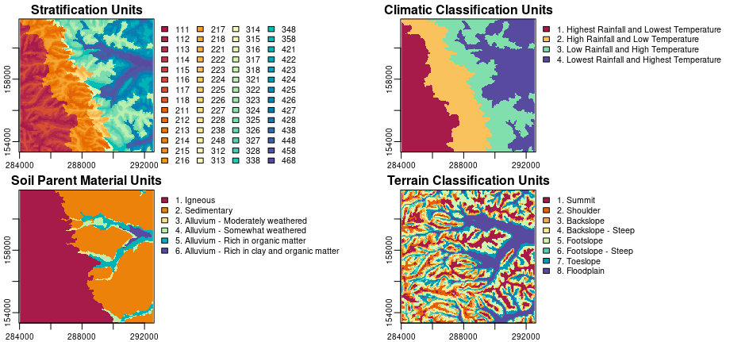
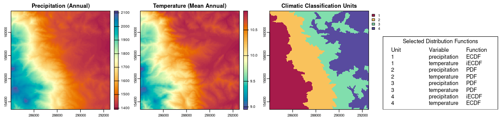
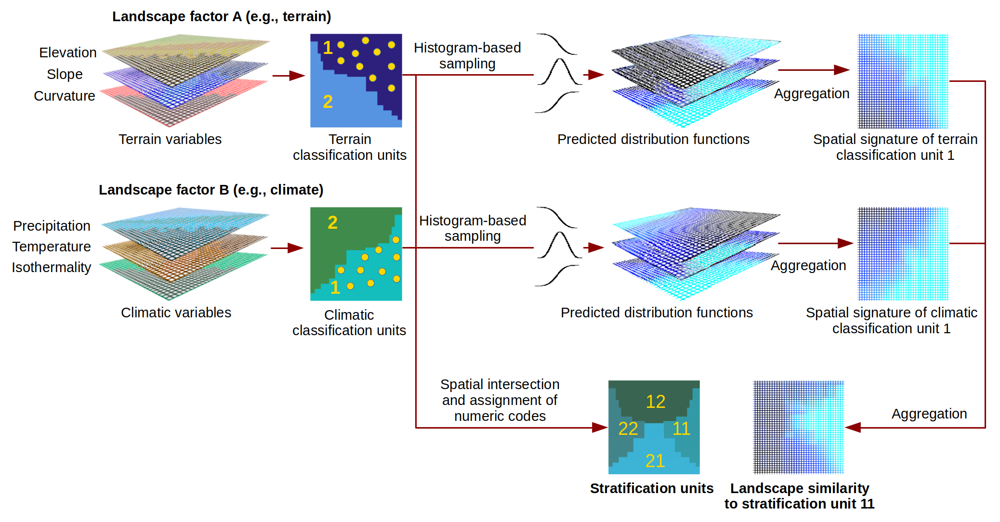

# Introduction

The application of robust, quantitative approaches for the spatial modeling of
environmental phenomena has increased in the past few decades mainly due to an
increase in computational power, advances in statistical modeling, and the
availability of geospatial layers of environmental information [@Scull2003;
@Elith2009]. Most of these approaches aim at building explicit quantitative
relationships between environmental controls and response phenomena through
statistical learning. Examples of these approaches include digital soil mapping
(DSM) [@McBratney2003], species distribution modeling (SDM) [@Guisan2000], land
use/land cover classification [@Ham2005], and forest fire modeling
[@Chuvieco2010]. Despite the extensively documented success of these approaches,
there are still some challenges that limit their application. For instance, poor
statistical performance is often reported in studies where input data is too
limited to accurately represent control-response relationships [@Araujo2006].
Moreover, model parsimony and interpretation of results can be compromised when
using ‘black-box’ algorithms [@Arrouays2020]. Similarly, including *a priori*
knowledge about natural processes in purely statistical approaches can be
challenging to achieve [@Heuvelink2001].

Several studies have suggested embedding spatial stratification routines within
approaches such as DSM, SDM, land use/cover mapping, forest fire modeling, and
others to overcome the challenges limiting their application. In such studies,
the spatial stratification of landscapes creates units with reduced spatial
variability of environmental phenomena as compared to the overall variability
across a landscape. The use of these units allows the researcher to (a) obtain
balanced representations of control-response relationships [@Guisan2000;
@West2016]; (b) include expert knowledge of physical processes for improving
modeling with limited data [@Zhu2008]; (c) improve the performance of
parameterization of mechanistic models [@Park2004; @Baldwin2017]; and, (d)
facilitate the interpretation of environmental conditions and their influence on
the spatiotemporal variability of processes of interest [@Rodrigues2019].

In general, landscape stratification routines follow fundamental ecological
concepts that explain the hierarchical and multi-scale nature of relationships
between environmental phenomena across space [@Allen1982]. Therefore, landscape
stratification methods have been applied in many studies that use geospatial
information for environmental modeling, such as those previously cited. However,
few packages exist in the R environment with functions strictly aimed at
landscape stratification routines using geospatial data. Although one could
implement custom stratification algorithms using multiple all-purpose geospatial
analysis packages such as \CRANpkg{terra} [@Hijmans2021] and \CRANpkg{sf}
[@Pebesma2018], the ease of use, reproducibility, and replicability of analysis
is often enhanced when algorithms are implemented as part of a dedicated
package. The \CRANpkg{motif} package [@Nowosad2021] is the only example the
authors could find of a package that is fully dedicated to landscape
stratification in R using geospatial data. Although the methods offered by
\pkg{motif} are effective for large-scale studies [@Jasiewicz2015;
@Nowosad2021], their application is currently limited to rasters of categorical
data. Thus, \pkg{motif} is not practical for the modeling of spatially
continuous environmental phenomena, which is often a goal of landscape
stratification routines.

This work presents the \CRANpkg{rassta} package as a collection of algorithms
for the spatial stratification of landscapes, sampling, and modeling of
environmental phenomena. The \pkg{rassta} package is not intended as a drop-in
replacement for statistically-robust environmental modeling approaches. Rather,
it is intended to serve as a generalized framework to derive geospatial
information that can be used to improve inference with these statistical
approaches.

# Conceptual overview and functionality

The algorithms in the \pkg{rassta} package assist in the analysis of
environmental information related to the spatial variability of natural
phenomena across landscapes. These functions focus on integrating standard
geospatial techniques and quantitative analysis in a generalized framework for
landscape stratification, sampling, and modeling. All of the functions in the
\pkg{rassta} package take geospatial data in raster format as input. In the
context of geographic information systems (GIS), the raster format can be
considered a graphical representation of a matrix that is organized in rows and
columns, and which may be stacked in multiple layers (e.g., multi-band satellite
imagery). Each cell (pixel) in the raster contains a value representing a
spatially-varying phenomenon, such as elevation or precipitation. A few
functions in \pkg{rassta} also produce geospatial data in vector format. Vector
data represents geometric entities in the form of points, lines, and polygons.
The \pkg{rassta} package uses the highly efficient \pkg{terra} package as the
backbone for handling raster and vector data. Most of the geospatial data
manipulation with \pkg{terra} is performed in C++ and is based on two main R
data types (classes): `SpatRaster` and `SpatVector`. Note that \pkg{terra}
imports the \CRANpkg{Rcpp} package [@Eddelbuettel2011] since \pkg{terra} uses
C++ (including external pointers) to manipulate these classes.

Most of the functions implemented in \pkg{rassta} are interrelated in the sense
that the outputs from some functions can be used as the inputs for others. This
functional interrelation allows for a generalized framework to conduct spatial
stratification, sampling, and modeling in a single package following a
project-oriented approach. In general, the functions of \pkg{rassta} can be
grouped into five categories: (a) landscape stratification; (b) landscape
correspondence metrics; (c) stratified sampling; (d) spatial modeling; and (e)
miscellaneous (Figure \@ref(fig:f1)). Each category and its corresponding
functions (except for miscellaneous) are theoretically founded on several
studies focused on understanding spatially-varying natural phenomena across
landscapes. In the next sections, the rationale behind each category and its
functions is described. This description is complemented with references to
corresponding scientific literature and includes code examples showing the
application of each function with extensive use of plotting functions (for
visualization purposes only). Most of the plotting functions are derived from
the \pkg{terra} package using the `SpatRaster` and `SpatVector` classes. [Note:
To reduce the extension of code examples, all the map and graph plotting
functions were consolidated in the function `figure()`].

```{r f1, echo = FALSE, out.height = "35%", out.width = "100%", fig.cap = "Functions of the rassta package. Connectors relate the inputs and outputs of the functions. The functions can be grouped in five categories: landscape stratification, landscape correspondence metrics, stratified sampling, predictive modeling, and miscellaneous.", fig.align = "center", fig.pos = 'H'}
knitr::include_graphics("figures/figure_1.png")
```

## Landscape stratification

Several studies have suggested the need to account for the hierarchical and
multi-scale nature of landscape processes. @Allen1982 suggested that landscape
processes can be explained through hierarchical multivariate structures given
their multiple spatial and temporal scales. Based on Dokuchaeiv’s theory of soil
formation [@Glinka1927] and the soil-landscape paradigm [@Hudson1992],
@McSweeney1994 proposed a nested model of soil-landscape processes at the 
physiographic, geomorphometric, and within-soil domains. @Fluegel1995 suggested
that the regionalization of hydrology-related processes should consider the
multi-scale landscape heterogeneity in terms of soil, topography, geology,
climate, and vegetation. These ideas have led these and other authors to
formulate frameworks for the creation of spatial entities that stratify the
landscape. The general purpose of these entities has been to define
spatially-explicit domains that represent distinctive landscape processes and/or
interactions [@McSweeney1994]. Accordingly, spatial stratification using
\pkg{rassta} focuses on the creation of such domains (hereafter referred to as
units).

The landscape stratification process with \pkg{rassta} follows a hierarchical
approach similar to @Austin1989, who individually classified gradients of
precipitation and elevation into intervals that were intersected with geologic
classes for sampling purposes. Similarly, in \pkg{rassta}, a set of first-level
units is created separately for each landscape factor under analysis. Then,
multiple sets of first-level units are integrated into a single set of
second-level units. The first-level units, called *classification units*, can be
created outside of \pkg{rassta} via multicriteria analysis, statistical
learning, or other methods. Moreover, the classification units can be formally
defined through classification schemes, such as those based on taxonomic keys.
The second-level units, called *stratification units*, result from the spatial
intersection of multiple sets of classification units. Note that both
classification and stratification units represent a spatial stratification for a
given landscape. Figure \@ref(fig:f2) shows an example of a simple landscape
stratification process based on two landscape factors, each with three raster
layers representing continuous variables.

```{r f2, echo = FALSE, out.height = "25%", out.width = "80%", fig.cap = "Schematic of a landscape stratification process. Raster layers of variables related to landscape factors are the inputs. The outputs are raster layers representing classification and stratification units.", fig.align = "center", fig.pos = 'H'}
knitr::include_graphics("figures/figure_2.png")
```

There are three important aspects of the stratification approach used within
\pkg{rassta} that must be considered. (a) One can simply create stratification
units by incorporating variables from multiple landscape factors in a single
classification process. However, the interpretation of results is often
compromised when using a large number of variables in "all-in-the-bag"
statistically driven classification schemes. (b) Multiple sets of classification
units can belong to a single landscape factor, and each set can be created from
variables at a distinct spatial scale. Presumably, this can account for the
multi-scale nature of landscape factors in the stratification process. (c) A
landscape factor can be represented by a single categorical variable, as in the
case of geologic units or soil parent material. In this case, the landscape
factor/variable is already in the form of classification units. Figure
\@ref(fig:f3) shows a landscape stratification scenario like that addressed in
(b) and (c).

```{r f3, echo = FALSE, out.height = "25%", out.width = "90%", fig.cap = "Schematic of a multi-scale landscape stratification process including a categorical variable. The stratification is based on three landscape factors: local scale terrain, regional scale terrain, and geology. Each terrain landscape factor is represented by raster layers of variables (local scale: slope and convergence index and regional scale: aspect and regional terrain). Geology is represented by a single categorical raster layer. Three sets of classification units (CU), one each for local terrain, regional terrain, and geology, are intersected to produce one set of stratification units (SU).", fig.align = "center", fig.pos = 'H'}
knitr::include_graphics("figures/figure_3.png")
```

### Classification units

A set of *n* classification units represents *n* distinct landscape
configurations related to a single landscape factor. Note that the term
*landscape configuration* is used here as a generic term for a particular
pattern in the spatial variability of one or multiple variables belonging to a
landscape factor. Currently, \pkg{rassta} allows the creation of classification
units via unsupervised learning thanks to its functions `som_gap()` and
`som_pam()`. The function `som_gap()` performs dimension reduction based on the
self-organizing map (SOM) proposed by @Kohonen1990. The R package
\CRANpkg{kohonen} [@Wehrens2018] is called internally by `som_gap()` to produce
the SOM. The function `som_gap()` also performs cluster analysis on the SOM
codes based on the partitioning around medoids (PAM) [@Kaufman1990], with
estimation of the optimum number of clusters (*k*) through the gap statistic
[@Tibshirani2001]. It is important to mention that the output SOM object
returned by `som_gap()` can be used as input for any other clustering algorithm
(e.g., hierarchical, spectral, etc.) or statistical analysis outside of
\pkg{rassta}.

The code below shows how `som_gap()` reduces the feature space and selects *k*
clusters from four terrain variables. Note that the processing time of
`som_gap()` is significant (around 162 seconds on a 4-cores Intel processor at
3.2 GHz for the following example). The processing time increases as the number
of cells/layers in the argument `var.rast` increases, and/or as the argument
`K.max` increases.

```{r code1, echo = TRUE, results = 'hide', message = FALSE, warning = FALSE, fig.show = 'hide'}
# Load the rassta and terra packages
library(rassta)
library(terra)
# Note that terra imports Rcpp, but if Rcpp is not automatically loaded then:
library(Rcpp)
# Get the data required to run the examples from rassta’s installation folder
wasoil <- system.file("exdat/wasoil.zip", package = "rassta")
# Copy data to current working directory and extract files
file.copy(from = wasoil, to = getwd())
unzip("wasoil.zip")

# Set seed
set.seed(963)
# Multi-layer SpatRaster with 4 terrain variables
terr.var <- rast(c("height.tif", "midslope.tif", "slope.tif", "wetness.tif"))
# Scale variables to mean = 0 and standard deviation = 1
terr.varscale <- scale(terr.var)
# Dimensionality reduction and estimation of optimum k (max k to evaluate: 12)
terr.som <- som_gap(terr.varscale, xdim = 10, ydim = 10, K.max = 12)
# Plot results
figure(4, d = list(terr.var, terr.som))
```
```{r f4, echo = FALSE, out.height = "20%", out.width = "100%", fig.cap = "Dimension reduction and selection of number of clusters (k). The top row shows four terrain variables (height, midslope, slope, and wetness) that are used to generate the self-organizing map (SOM). The bottom row shows the reduced feature space of each variable and the Gap statistic that is used to select k for the construction of classification units.", fig.align = "center", fig.pos = 'H'}
knitr::include_graphics("figures/figure_4.png")
```

The function `som_pam()` creates raster versions from the outputs of
`som_gap()`. The code below shows how `som_pam()` creates raster versions of the
SOM grid and PAM clustering computed in the previous example.

```{r code2, echo = TRUE, fig.show = 'hide'}
# Rasterization of terrain SOM grid and terrain PAM clustering
terr.sompam <- som_pam(ref.rast = terr.var[[1]], kohsom = terr.som$SOM,
                       k = terr.som$Kopt)
# Plot results
figure(5, d = list(terr.sompam, terr.var))
```
```{r f5, echo = FALSE, out.height = "25%", out.width = "100%", fig.cap = "SOM grid and PAM clustering. Rasterized versions of the terrain SOM grid (left) and the terrain PAM clustering (right) are produced. The resulting clusters represent the classification units for the terrain landscape factor.", fig.align = "center", fig.pos = 'H'}
knitr::include_graphics("figures/figure_5.png")
```

Note that the approach for creating classification units should not be limited
to that offered by `som_gap()` and `som_pam()`. There are many other approaches
outside of \pkg{rassta} that can be followed, such as supervised classification
based on statistical learning, or GIS-based multicriteria analysis. The best
approach may depend on the research question(s) being addressed. Therefore, the
selection of the proper approach and the optional use of other R packages and/or
GIS software is left to the user. Also, note that classification units created
outside of \pkg{rassta} are completely compatible with \pkg{rassta} objects and
methods if the units are represented through the `SpatRaster` class from
\pkg{terra}.

### Stratification units

A set of *n* stratification units represents *n* distinct landscape
configurations related to multiple landscape factors. Note that the term
*landscape configuration* is used here as a generic term for a particular
pattern in the spatial variability of multiple variables belonging to multiple
landscape factors, or to the same factor represented at multiple spatial scales.
The function `strata()` allows the spatial intersection of multiple sets of
classification units into a single set of stratification units. This function
also assigns a unique numeric code to each stratification unit. The numeric code
makes it possible to trace back each classification unit composing a given
stratification unit. The code below shows the construction of stratification
units with `strata()` using classification units from three landscape factors
(climate, soil parent material, and terrain).

```{r code3, echo = TRUE, fig.show = 'hide'}
# Multi-layer SpatRaster with 3 sets of classification units
all.cu <- rast(c("climate.tif", "material.tif", "terrain.tif"))
# Stratification units
su <- strata(cu.rast = all.cu)
# Plot results
figure(6, d = list(su, all.cu))
```
```{r f6, echo = FALSE, out.height = "25%", out.width = "100%", fig.cap = "Creation of stratification units from sets of classification units. A set of classification units is produced for each of three landscape factors: climate, soil parent material, and terrain. The spatial intersection of these sets results in the stratification units for the landscape (upper left map).", fig.align = "center", fig.pos = 'H'}

```

## Metrics of landscape correspondence

There are two metrics of landscape correspondence that can be calculated with
\pkg{rassta}: (a) the spatial signature of classification units, and (b) the
landscape similarity to stratification units. These metrics quantify the
relative correspondence between any location across geographic space and
landscape configurations represented by classification and stratification units.
Several studies have applied similar concepts related to continuous
correspondence between landscape configurations for the modeling of
spatially-varying phenomena. Early examples include studies using multivariate
distance metrics in the feature space for SDM [@Carpenter1993] and studies
applying the fuzzy set theory [@Zadeh1965] for multicriteria evaluation
[@Burrough1989], DSM [@Zhu1994] and landform classification [@MacMillan2000].

### Spatial signature of classification units

The spatial patterns of the degree of correspondence between any landscape
configuration and the configuration represented by a given classification unit
are defined as the *spatial signature*. The spatial signature is represented by
a raster layer of continuous values that results from the cell-wise aggregation
of empirical distribution functions mapped over geographic space. Each
distribution function corresponds to one variable and relates the classification
unit to “typical” values of the variable within the classification unit. The
concept of spatial signature is based on the work of @Pike1975 and @Pike1988.
These authors used the term *geometric signature* to describe a set of sample
statistics (e.g., mean, standard deviation) of terrain variables (e.g., slope,
curvature) used to distinguish “geomorphically disparate landscapes”
[@Pike1988].

The spatial signature in \pkg{rassta} replaces the geometric signature’s
measurements of central tendency and dispersion statistics with statistical
distribution functions generated across geographic space. The statistical
distribution functions used in \pkg{rassta} are: (a) the probability density
function (PDF) based on the kernel density estimation, (b) the empirical
cumulative distribution function (ECDF), and (c) an inverted version of the ECDF
(iECDF). Note that the spatial signature concept is somewhat similar to the
virtual ecological niche [@Hirzel2001] and the multivariate environmental
similarity surface [@Elith2010], which are implemented in R through the packages
\CRANpkg{virtualspecies} [@Leroy2016] and \CRANpkg{dismo} [@Hijmans2020],
respectively. Figure \@ref(fig:f7) and Figure \@ref(fig:f8) show an illustration
and a pseudocode of the process to calculate the spatial signature of a
classification unit, respectively. Note that the function `FUNSIG()` in the
pseudocode is just a placeholder to encompass the three functions from
\pkg{rassta} that are required to calculate spatial signatures. These functions
are `select_functions()`, `predict_functions()`, and `signature()`, each will be
further discussed next.

```{r f7, echo = FALSE, out.height = "25%", out.width = "95%", fig.cap = "Schematic of the calculation process for spatial signatures. A set of classification units is produced using three variables. A distribution function is calculated for each variable within classification unit 1, and then predicted across geographic space. The predicted functions for unit 1 are aggregated, which results in the spatial signature of that unit.", fig.align = "center", fig.pos = 'H'}
knitr::include_graphics("figures/figure_7.png")
```

```{r f8, echo = FALSE, out.width = "95%", fig.cap = "Pseudocode of the calculation process for spatial signatures. The calculation process involves the selection, prediction, and aggregation of distribution functions. The spatial signature is calculated for each classification unit in a set.", fig.align = "center", fig.pos = 'H'}
knitr::include_graphics("figures/algorithm_1.png")
```

An important assumption is made when using the PDF, ECDF, and iECDF to
characterize the typical values of a given variable within a given
classification unit. The position of a value within the distribution function is
an indicator of how typical the value is in terms of the variable’s distribution
within the classification unit. For instance, values closer to, or at the peak
of the PDF are assumed to be the most typical values of the variable within the
classification unit. Contrarily, values at the tails of the PDF are the less
typical. Although one could simply use the PDF as a generalized function to
denote typical values, this function assigns the same weight to values at the
tails of the distribution regardless of the tail’s location (left or right). In
some cases, *a priori* knowledge can dictate that typical values of a variable
within a given classification unit are those approaching $+\infty$, or those
approaching $-\infty$. The use of the ECDF and the iECDF is intended for those
cases. More specifically, if a classification unit is known to be associated
with a variable’s extreme values toward $+\infty$, then the ECDF can be used to
represent this association. Conversely, if the classification unit is associated
with those variable’s extreme values toward $-\infty$, then the iECDF can be
used.

The function `select_functions()` allows the user to select the statistical
distribution function used to represent the typical values for a given variable
within a specific classification unit. Both automatic and interactive selection
modes are supported, with the latter based on a \CRANpkg{shiny} app
[@Chang2021]. The automatic selection of distribution functions is based on
within-unit statistics, also referred to as *zonal statistics* in the GIS
literature, and it follows the criteria described next:

- PDF = when the mean (or median) of the variable’s values within the
classification unit is neither the maximum nor the minimum of all the mean (or
median) values across all the units.
- ECDF = when the mean (or median) of the variable’s values within the
classification unit is the maximum of all the mean (or median) values across all
the units.
- iECDF = when the mean (or median) of the variable’s values within the
classification unit is the minimum of all the mean (or median) values across all
the units.

The code below shows the automatic selection of statistical distribution
functions for four climatic classification units and two variables with
`select_functions()`.

```{r code4, echo = TRUE, results = 'hide', message = FALSE, fig.show = 'hide'}
# Multi-layer SpatRaster with 2 climatic variables
clim.var <- rast(c("precipitation.tif", "temperature.tif"))
# Single-layer SpatRaster with 4 climatic classification units
clim.cu <- rast("climate.tif")
# Automatic selection of statistical distribution functions
clim.difun <- select_functions(cu.rast = clim.cu,
                               var.rast = clim.var,
                               mode = "auto")
# Plot results
figure(8, d = list(clim.difun, clim.cu, clim.var))
```
```{r f9, echo = FALSE, out.height = "13%", out.width = "100%", fig.cap = "Selection of distribution functions. A set of four climatic classification units are produced using two variables: precipitation and temperature. A distribution function is selected for each variable within each classification unit.", fig.align = "center", fig.pos = 'H'}

```

The selected distribution functions can be used to generate predictions of
distribution function values over geographic space with the function
`predict_functions()` as shown in the code below. The predictions are generated
by fitting a locally estimated scatterplot smoothing (LOESS) regression with the
within-unit distribution function's values (*y*) and the within-unit variable's
values (*x*). The fitted LOESS and the raster layer of the variable are then 
used to predict new distribution function values across geographic space.

```{r code5, echo = TRUE, fig.show = 'hide'}
# Multi-layer SpatRaster of climatic variables and classification units
clim.all <- c(clim.var, clim.cu)
# Ouput table from select_functions()
df <-  clim.difun$distfun
# Predicted distribution functions for climatic variables
clim.pdif <- predict_functions(cuvar.rast = clim.all,
                               cu.ind = 3,
                               cu = df$Class.Unit,
                               vars = df$Variable,
                               dif = df$Dist.Func)
# Plot results
figure(9, d = list(clim.pdif, clim.cu))
```
```{r f10, echo = FALSE, out.height = "35%", out.width = "100%", fig.cap = "Prediction of distribution functions. A selected distribution function for each variable is predicted across geographic space. The predicted distribution function relates the landscape to a classification unit with regard to a variable.", fig.align = "center", fig.pos = 'H'}
knitr::include_graphics("figures/figure_9.png")
```

The function `signature()` calculates the spatial signature of a given
classification unit by aggregating all of the predicted distribution functions
associated with the unit. The code below shows the calculation of spatial
signatures with `signature()`. Note that the arguments `inprex` and `outname`
allow the user to identify the raster layers representing the predicted
distribution functions associated with each classification unit in a set, and to
assign a unique name to each resulting raster layer of spatial signature,
respectively.

```{r code6, echo = TRUE, fig.show = 'hide'}
# Spatial signatures from distribution functions predicted for climatic variables
clim.sig <- signature(pdif.rast = clim.pdif,
                      inprex = paste(seq(1, 4), "_", sep = ""),
                      outname = paste("climate_", seq(1, 4), sep = ""))
# Plot results
figure(10, d = list(clim.sig, clim.cu))
```
```{r f11, echo = FALSE, out.height = "10%", out.width = "100%", fig.cap = "Calculation of spatial signatures. For each climatic classification unit (1 thru 4), the distribution functions (see Figure 10) are aggregated (e.g., mean pixel value) to produce the spatial signature of the unit. The spatial signature relates each position in the landscape to the landscape configuration represented by a classification unit.", fig.align = "center", fig.pos = 'H'}
knitr::include_graphics("figures/figure_10.png")
```

### Landscape similarity to stratification units

The spatial patterns of the degree of correspondence between any landscape
configuration and the landscape configuration represented by a given
stratification unit are defined as the *landscape similarity*. The landscape
similarity is represented by a raster layer of continuous values, which results
from the cell-wise aggregation of the spatial signatures of multiple
classification units. This aggregation is possible because any given
stratification unit is the result of the spatial intersection of multiple
classification units, commonly one per landscape factor or factor scale (see
Figure \@ref(fig:f2) and \@ref(fig:f3)). Moreover, each classification unit has
one spatial signature associated with it. Therefore, any given stratification
unit will be associated with multiple spatial signatures, which can be cell-wise
aggregated to calculate the landscape similarity. Figure \@ref(fig:f12) shows an
example of the calculation process for a layer of landscape similarity to 
stratification unit.

```{r f12, echo = FALSE, out.height = "30%", out.width = "100%", fig.cap = "Schematic of the calculation process for landscape similarities. Sets of variables for each landscape factor (terrain and climate) are combined to produce sets of classification units (two each for terrain and climate), which are further combined to produce stratification units (12, 11, 21, and 22). Thus, each stratification unit has two classification units associated with it. Moreover, each classification unit has a spatial signature associated with it. Aggregating the spatial signatures of classification unit 1 for climate and unit 1 for terrain, both associated with stratification unit 11, results in the landscape similarity to that stratification unit.", fig.align = "center", fig.pos = 'H'}

```

The function `similarity()` calculates the landscape similarity layer for each
stratification units in a given set (with the set being represented by a
single-layer `SpatRaster` object), as shown in the following example. The
argument `su.code` indicates the name of the landscape factors/factor scales
used to create the stratification units, and the digit position (start, end) of
the classification units' ID in the stratification unit's numeric code.

```{r code7, echo = TRUE, fig.show = 'hide'}
# Multi-layer SpatRaster with spatial signatures of classification units
clim.sig <- rast(list.files(pattern = "climate_")) # For climatic units
mat.sig <- rast(list.files(pattern = "material_")) # For soil parent material units
terr.sig <- rast(list.files(pattern = "terrain_")) # For terrain units
# Single-layer SpatRaster of stratification units
su <- rast("su.tif")
# Landscape similarity to stratification units
su.ls <- similarity(su.rast = su, sig.rast = c(clim.sig, mat.sig, terr.sig),
                    su.code = list(climate = c(1, 1), material = c(2, 2),
                                   terrain = c(3, 3)))
# Plot results
figure(12, d = list(su.ls, su, clim.sig, mat.sig, terr.sig))
```
```{r f13, echo = FALSE, out.height = "23%", out.width = "100%", fig.cap = "Metrics of landscape correspondence. Landscape similarity (extreme left) and spatial signatures for climate, parent material (material), and terrain associated with stratification units (SU) 111 (top row) and 468 (bottom row). The red polygons indicate the boundaries of the corresponding SU defined through the aggregation (i.e., mean pixel value) of the set of spatial signatures for that SU.", fig.align = "center", fig.pos = 'H'}
knitr::include_graphics("figures/figure_12.png")
```

## Stratified non-probability sampling

Stratified sampling is an efficient technique for achieving an adequate
representation of environmental variability, reducing cost of field work, and
improving modeling with limited observations [@Austin1989; @Wessels1998;
@Guisan2000; @Zhu2008; @West2016]. Accordingly, sampling with \pkg{rassta} to
select observations/sampling locations is performed in a stratified fashion
using stratification units. Additionally, the raster layers of landscape
similarity to stratification units can be included in the sampling process.
Including the landscape similarity layers results in a non-probability sample.
For each stratification unit, the sampling process selects the
observation(s)/sampling location(s) at the raster cell where the highest
landscape similarity value occurs, resulting in a stratified, non-probability
sample that is biased towards maximizing the representativeness of landscape
configurations. This idea of biased, stratified sampling is based on the work of
@Gillison1983; @Gillison1985, @Austin1989, and @Zhu2008. These authors have
suggested that bias related to landscape configurations is relevant for the
maximization of environmental representativeness, detection of maximum
diversity, and representation of non-stochastic control-response relationships.

The function `observation()` performs the automatic selection of the
representative response observation for each stratification unit in a given set.
Given a stratification unit, the unit’s representative response observation is
that whose value best reflects the influence that the unit’s landscape
configuration exerts on the response. This function requires a set of
observations/samples already collected for a set of stratification units.
Currently, `observation()` selects observations based on the following methods:
(a) *mls*: select the observation at the raster cell with the maximum landscape
similarity value; (b) *mrv*: select the observation whose response value is the
median of all the values; and (c) *random*: select an observation at random.
Note that the latter represents a case of stratified random sampling.

The code below shows the selection of representative soil organic carbon (SOC)
observations based on the maximum landscape similarity method. Note that the
arguments `su.rast` and `ls.rast` require the stratification units and landscape
similarity layers previously created with `strata()` and `similarity()`,
respectively.

```{r code8, echo = TRUE, fig.show = 'hide'}
# SpatVector with SOC observations for stratification units
soc.obs <- vect("soc.shp")
# Representative SOC observation for each stratification unit
su.obs <- observation(su.rast = su, obs = soc.obs, col.id = 1, col.resp = 2,
                      method = "mls", ls.rast = su.ls$landsim)
# Plot results
figure(13, d = list(su.obs, soc.obs, su))
```
```{r f14, echo = FALSE, out.height = "21%", out.width = "100%", fig.cap = "Selection of representative observations. Green points in the map represent the complete set of observations. Blue points represent the representative observation for each stratification unit.", fig.align = "center", fig.pos = 'H'}
knitr::include_graphics("figures/figure_13.png")
```

The function `locations()` performs the automatic selection of the
representative sampling location(s) for each stratification unit in a given set,
where the representative sampling location is the raster cell where the highest
landscape similarity value occurs. Currently, `locations()` implements two
selection methods: (a) *buffer*: select sampling locations within areas with
landscape similarity values above a certain threshold; and (b) *absolute*:
select sampling locations with the highest landscape similarity values. The code
below shows the use of `locations()` based on the buffer method.

```{r code9, echo = TRUE, fig.show = 'hide'}
# Representative sampling location and its buffer area for each stratification unit
su.samp <- locations(ls.rast = su.ls$landsim, su.rast = su, method = "buffer")
# Plot results
figure(14, d = list(su.samp, su))
```
```{r f15, echo = FALSE, out.height = "20%", out.width = "100%", fig.cap = "Selection of representative sampling locations. Green points in the map represent the sampling location for each stratification unit. Green polygons represent the buffer area for each sampling location.", fig.align = "center", fig.pos = 'H'}
knitr::include_graphics("figures/figure_14.png")
```

## Predictive modeling

Predictive modeling with \pkg{rassta} is based on the assumption that each
stratification unit represents a distinct landscape configuration and that this
configuration influences a natural phenomenon in a distinctive manner. It is
assumed that the influence that a stratification unit's landscape configuration
has on response phenomena at a specific location (i.e, raster cell) is
proportional to the unit’s landscape similarity value at that raster cell.
Therefore, given a stratification unit *x*, the corresponding raster layer of
landscape similarity *ls*, the response *y*, and a raster cell *c*, the greater
the value of *ls* at *c*, the more similar *y* at *c* will be to the typical *y*
for *x*. The typical (i.e., representative) value of a response phenomenon for a
given stratification unit can be defined in several ways. For instance, if a
response phenomenon was sampled/measured multiple times within a given
stratification unit, the typical response value could be that from the
sample/measurement at the raster cell with the highest landscape similarity
value (see `observation()`).

Several studies have used landscape similarity layers to model the spatial
variability of natural phenomena. These studies argue that the use of similarity
layers is appropriate in cases when (a) available observations for modeling are
limited [@Zhu2008]; (b) initial spatial distribution patterns are needed for
survey design [@Carpenter1993]; (c) expert-driven selection of informative
variables is possible [@Knick1997]; (d) *a priori* knowledge of response-control
relationships in the form of conceptual models is available [@Zhu2010;
@Schmidt2005]; and (e) discriminating between (ecologically) positive and
negative deviations from reference environments is required [@Watrous2006].
Accordingly, `engine()` allows the modeling of environmental phenomena with a
number of training observations as few as the number of landscape similarity
layers [cases (a) and (b)]; training observations and landscape similarity
layers as outcomes of expert-driven landscape stratification [cases (c) and
(d)]; and landscape similarity layers derived from spatial signatures that
discriminate between the tails of distribution functions [case (e)].

Modeling with \pkg{rassta} is performed using the function `engine()`. For
continuous responses, `engine()` performs a weighted average involving
representative response values and landscape similarity layers. For a raster
cell *c*, the modeled response value is equal to the weighted average of the
representative values for those stratification units with the highest landscape
similarity values at *c*. The stratification units with the highest landscape
similarity values at *c* can be considered as the *nearest neighbors* (in
feature space) of the landscape configuration at *c*. These nearest neighbors
are called *winning stratification units*, and the weight of their corresponding
representative value is proportional to the winning unit’s landscape similarity
value at *c*. For categorical responses, the modal response value of the winning
stratification units replaces the weighted average. Figure \@ref(fig:f16) shows
an example of the modeling process for continuous responses with \pkg{rassta}.

```{r f16, echo = FALSE, out.width = "75%", fig.cap = "Schematic of the modeling process with rassta. The modeling process is performed in a cell-wise fashion. The inputs required are the raster layers of landscape similarity and the representative observations for each stratification unit.", fig.align = "center", fig.pos = 'H'}
knitr::include_graphics("figures/figure_15.png")
```

Note that the weighted average for modeling phenomena across geographic space
has been widely applied in GIS-based multicriteria decision analysis (GIS-MCDA).
In GIS-MCDA, attributes (i.e., variables) in the form of raster layers are
weighted according to expert criteria. The weighted variables are then combined
through (cell-wise) overlay operators such as multiplication, addition and
(ordered) averaging. The resulting value at each cell represents the relative
suitability for a certain condition/decision [@Malczewski2006]. The function
`engine()` generalizes the weighted overlay process of GIS-MCDA by allowing the
use of sampled/measured data of a response phenomenon in conjunction with the
landscape similarity layers acting as weighted variables. This generalization
allows the modeling of real-valued phenomena in continuous or categorical form.
The modeling approach of `engine()` is almost the same as that proposed by 
@Zhu1997 to model landscape attributes across geographic space. The difference
between `engine()` and the approach of @Zhu1997 is that `engine()` allows
the selection of the number of landscape similarity layers for the weighted
average calculation. Presumably, restricting the number of layers will reduce
the shortening (‘shrinking’) effect that weighted averaging has on the range of
modeled continuous response values [@Nolan2019].

The code below demonstrates the use of `engine()` for the predictive modeling of
soil organic carbon. Note that the representative response values (argument
`su.repobs`) are those previously selected with `observation()`, and that the
layers of landscape similarity (argument `ls.rast`) are those previously created
with `similarity()`.

```{r code10, echo = TRUE, fig.show = 'hide'}
# Table with the numeric code of stratification units and representative SOC values
su.soc <- su.obs$su_repobs[, c("SU", "soc")]
# engine() requires a (tiled) SpatVector with the boundaries of the area of interest
aoi <- vect("aoi.shp")
# engine() writes results directly on disk
if (dir.exists("soc") == FALSE) {dir.create("soc")}  # Create directory
# Spatial modeling of SOC across the landscape based on 3 winning stratification units
soc <- engine(ls.rast = su.ls$landsim, n.win = 3, su.repobs = su.soc,
              tiles = aoi, outdir = "soc", overwrite = TRUE)
figure(16, d = list(soc, "soc_valid.shp")) # Plot results
```
```{r f17, echo = FALSE, out.height = "23%", out.width = "100%", fig.cap = "Modeled soil organic carbon (SOC) content (percent). The map shows the modeled SOC values across the landscape. The plot shows the the modeled (y) versus the measured (x) SOC values based on 62 independent observations.", fig.align = "center", fig.pos = 'H'}
knitr::include_graphics("figures/figure_16.png")
```

## Miscellaneous

The spatial signature only applies to classification units created from
continuous variables. Thus, spatial signatures cannot be calculated for
classification units that represent categorical variables, such as land use/land
cover. In such cases, a one-hot encoding can be applied to produce binary layers
for the units. These layers are considered the spatial signatures of the
classification units. The code below shows the creation of binary layers for
soil parent material units with `dummies()`.

```{r code11, echo = TRUE, fig.show = 'hide'}
# Multi-layer SpatRaster of soil parent material units
mat.cu <- rast("material.tif")
# Binary layers for each soil parent material unit and their maps
mat.sig <- dummies(mat.cu, preval = 100, absval = 0)
figure(17, d = mat.sig) # Plot results
```
```{r f18, echo = FALSE, out.height = "10%", out.width = "100%", fig.cap = "Construction of binary layers. Binary layers act as the spatial signatures for categorical variables. In this example, soil parent material acts as both landscape factor and classification units.", fig.align = "center", fig.pos = 'H'}
knitr::include_graphics("figures/figure_17.png")
```

The function `plot3D()` produces interactive maps showing the 3-dimensional
(*XYZ*) variability in raster layers representing continuous variables. The
*XYZ* reference positions are obtained from a user-supplied elevation layer. For
large raster layers (large spatial coverage and/or high spatial resolution),
this function allows the option to decrease resolution and subset the data. The
code below shows how `plot3D()` creates `r ifelse(knitr::is_html_output(), 'an interactive', 'a')` 
3D map for SOC, as modeled with `engine()`.

```{r code12, echo = TRUE, fig.cap = "Interactive 3D map of SOC (percent). The Z dimension is obtained from a reference terrain model. The interactive aspect of the map is achieved thanks to the R package plotly.", fig.alt = "A map showing the spatial variability of soil organic carbon across a landscape. The map has three axis: X, Y, and Z. Axis X and Y represent relative geographic coordinates, axis Z represents real elevation values.", fig.width = 100, include = knitr::is_html_output(), eval = knitr::is_html_output()}
# Single-layer SpatRaster of terrain elevation
elev <- rast("elevation.tif")
# Interactive 3D map
soc3D <- plot3D(c(elev, soc), z = 1, ex = 0.2, pals = "Fall", rev = TRUE)
soc3D$soc
```

```{r code13, echo = TRUE, include = knitr::is_latex_output(), eval = FALSE}
# Single-layer SpatRaster of terrain elevation and the 3D SOC map
elev <- rast("elevation.tif")
plot3D(c(elev, soc), z = 1, ex = 0.2, pals = "Fall", rev = TRUE) # 3D map
```
```{r f19, echo = FALSE, out.height = "25%", out.width = "95%", fig.cap = "3D map of SOC (percent). The Z dimension is obtained from a reference terrain model. Visit the online article to access the interactive version of the map.", fig.align = "center", fig.pos = 'H', eval = knitr::is_latex_output()}
knitr::include_graphics("figures/figure_18.png")
```

# Future versioning and summary

This work presented the \pkg{rassta} package for spatial stratification,
sampling, and modeling of environmental phenomena within the R environment.
Future versioning of the \pkg{rassta} package will focus on developing new
approaches for spatial stratification. Stratification based on spatial
intersection may not be feasible to implement in highly complex landscapes
because these landscapes may require many (sets of) classification units to
accurately represent the spatial variability of landscape factors, leading to
over-stratification, and thus, greater demand for samples/observations to
conduct predictive modeling based on landscape similarity. One plausible
solution is the application of the stratification methods presented by
@Jasiewicz2015, @Jasiewicz2018, @Nowosad2021, and @Nowosad2021a.
However, these methods have been purposely designed for studies with
continental/global applications. Therefore, these methods should be adapted for
\pkg{rassta} to tailor their application at local scales to allow for more
precise representations of natural phenomena and their spatial variability.
Another focus of versioning can be new functions to visualize the variability of
response phenomena relative to the hierarchical structure represented by the
stratification units. Lastly, future versioning of \pkg{rassta} should also
consider the user’s experiences to ensure its general applicability.

The core ideas implemented in the \pkg{rassta} package include the multi-scale,
hierarchical landscape stratification based on spatial intersection, the
application of non-parametric distribution estimators to define the typical
landscape configuration of stratification units, and the use of spatially
explicit landscape correspondence metrics for non-probability sampling and
predictive modeling. Some of these ideas have previously been implemented in R
through a few packages dedicated to the analysis of geospatial data.
Nevertheless, \pkg{rassta} offers a unified, generalized framework to conduct
multiple landscape stratification routines through a dedicated set of
algorithms. Moreover, spatially-explicit information created with \pkg{rassta},
like stratification units, landscape similarity layers, and representative
observations, can be embedded into statistically robust modeling approaches to
optimize the analysis of environmental phenomena.
