::: article
# Introduction {#intro}

The ability to estimate a probability distribution from a single data
sample is critical across diverse fields of science and finance
[@pdf1; @pdf2; @pdf3; @pdf4]. Estimating the parameters of the
underlying density function becomes increasingly difficult when there is
no prior information about the number of parameters, as the shape and
complexity must also be inferred from that data. Although there are many
nonparametric methods, kernel density estimation (KDE) is among the most
popular.

Variants of KDE differ based on how they implement the selections of the
bandwidth and the kernel function, which are nontrivial decisions that
can have a significant impact on the quality and performance of the
estimate. Most KDE implementations allow the user to manipulate some
parameters manually, allowing for an experienced user to fine-tune the
default behavior for improved results. Unfortunately, user directives
introduce unavoidable subjectivity to the estimate. More advanced
implementations include intelligent and adaptive bandwidth selection
optimized according to the characteristics of the data
[@KDEtutorial; @KDEdiffusion]. However, there is inevitably a trade-off
between computational performance and accuracy [@KDEcomp]. There are
many R packages available that can estimate density nonparametrically,
typically based on KDE
[@kdeR1; @kdeR2; @kdeR3; @kdeR4; @kdeR5; @kernsmooth; @densEstBayes; @kde1d].
The core R function `density` implements a straightforward kernel
density method.

Presented in this article is the package
[*PDFEstimator*](https://CRAN.R-project.org/package=PDFEstimator) for
nonparametric density estimation and analysis [@PDFe1]. The features of
*PDFEstimator* can be separated into two categories. The first is a
novel estimation method based on the principle of maximum entropy,
available through the `estimatePDF` function. A primary advantage of
`estimatePDF` is the automated interface, requiring nothing from the
user other than a data sample. Range, multi-scale resolution, outliers,
and boundaries are determined within the algorithm to achieve optimized
data-driven estimates appropriate to the given sample. Although these
defaults can be overridden by a sophisticated user, overrides generally
do not improve the results. Additionally, multiple acceptable solutions
can be returned, which is particularly useful in the case of low sample
sizes where there is more statistical uncertainty.

The second category of features included in *PDFEstimator* is a unique
set of assessment utilities for evaluating the accuracy of the solution
and highlighting areas of uncertainty within a density estimate.
Furthermore, a user-defined threshold can be specified to identify data
points that fall outside of an expected confidence level. These
diagnostics tools are visualized through a variety of customized
plotting options, thus aiding in the evaluation of difficult
distributions. Most importantly, all of these features can be applied
towards any estimation function, such as `density`, as they are
universal measurements independent of the method used, allowing for an
integrated comparison between alternative models.

The remainder of this paper is organized as follows.  [2](#sec:usage)
describes the functions available in this package, including their usage
and underlying methods.  [3](#sec:examples) provides additional and
advanced examples for identifying and troubleshooting problems with any
density estimation method.  [4](#sec:comparison) compares `estimatePDF`
with three popular kernel-based estimation packages using a diverse set
of known distributions. Finally,  [5](#sec:stamps) demonstrates the use
of *PDFEstimator* for a well-known real data set from a rare stamp
collection.

# Available functions and usage {#sec:usage}

An overview of the functions included in *PDFEstimator* is listed in
Table [1](#tab:functions). A critical component of the tools in
*PDFEstimator* is a `PDFe` object, which encapsulates all information
necessary for plotting and assessing the quality of any density
estimate. The member variables for the `PDFe` class definition are
listed in Table [2](#tab:pdfe). The methods for calculating the
necessary components of the `PDFe` and how they are employed in each of
the functions in Table [1](#tab:functions) are described in this
section.

::: {#tab:functions}
  ---------------------------------------------------------------------------------------------------------------------------
  Function            Description
  ------------------- -------------------------------------------------------------------------------------------------------
  getTarget           Returns upper and lower limits of SQR for a given target level

  plotBeta            Plots a shaded region outlining expected range of SQR values by position

  estimatePDF         Estimates a density from a data sample. Returns a `PDFe` estimation object.

  convertToPDFe       Converts any PDF to a `PDFe` estimation object for diagnostic purposes.

  approximatePoints   Returns approximated PDF for an existing `PDFe` estimation object at a given set of data points.

  plot                Main plotting function for `PDFe` estimation objects.

  lines               Plots the density for a `PDFe` estimation object as a connecting line segment to an existing plot.

  summary             Prints a summary of the `PDFe` object.

  print               Prints the probability density and cumulative density for each estimation point in the `PDFe` object.
  ---------------------------------------------------------------------------------------------------------------------------

  : Table 1: Overview of functions in the *PDFEstimator* package.
:::

## The PDFe class {#subsec:pdfe}

The first four member variables listed in Table [2](#tab:pdfe) are
commonly understood values for an estimated density, beginning with the
random data sample that is the basis for the estimate. The probability
density function (PDF) is estimated for the range of points defined in
`x`. Similarly, the cumulative distribution function (CDF) can be
calculated representing the cumulative probability of the PDF for each
`x`. *PDFEstimator* defines additional descriptions for an estimate that
measure the quality of its fit to the sample data. Central to the
quality of these estimates is a scoring mechanism to rate the overall
fit of an estimate to the sample. A single average score is calculated,
as well as individual confidence levels for each data point within the
sample. These scores are based on order statistics [@order].

If the CDF, defined on the range (0 1), is an accurate representation of
the data, then $CDF(x)$ will represent uniform random data. The general
problem then becomes assessing if $r_k=CDF(x_k)$ represents uniform data
for a given sample. Although there are many methods to test for uniform
data [@PDFe2], *PDFEstimator* employs an average quadratic z-score,
defined as
$$\label{eq:zscore}
z^2=\frac{-1}{N} \sum_{k=1}^{N}\frac{\left(r_k-\mu_k\right)^2}{\sigma_k^2},   (\#eq:zscore)$$
where $k$ is the sort ordered position in a sample size $N$, and $\mu_k$
and $\sigma_k$ are the mean and standard deviation from single order
statistics known to be $\mu_k=-\frac{k}{N+1}$ and
$\sigma_k=\frac{\mu_k\left(\mu_k-1\right)}{\sqrt{N+2}}$. Perfectly
uniform data would yield a score of exactly zero.

To study typical z-scores for uniform random data, extensive numerical
experiments were generated with a random number generator on the range
(0, 1) for many different sample sizes. The typical distribution of
scores according to Equation \@ref(eq:zscore) is represented in the left
plot for Figure [1](#fig:scores). The peak density of the PDF
corresponds to the most likely z-score and occurs at a value of
approximately -0.5, with a sharp drop-off in the density as scores
approach zero. The `threshold` value of the `PDFe` object reports the
empirical cumulative probability for the z-score, as a percentage, shown
on the right-hand plot of Figure [1](#fig:scores). The cumulative
probability for the peak z-score is calculated to be a little over 0.7,
thus a threshold value near or greater than 70% can be considered a
highly probable fit. A threshold of less than 5%, by contrast, is low
probability and therefore likely an underfit for the data. In this
event, the `PDFe` member variable `failedSolution` is set to `TRUE`. A
score with a threshold of 95%, however, is similarly unlikely and can be
interpreted as overfitting the data. The software does not rigidly
enforce a particular score upon an accepted solution, but rather uses
the numerically calculated density shown in Figure [1](#fig:scores) as a
guide to iteratively move towards increasingly probable solutions.

The threshold provides an average score for the estimate, but to assess
the estimate per position and identify the locations of potential
errors, a scaled quantile residual (SQR) is defined as
$$\label{eq:sqr}
SQR_k=\sqrt{N+2} \left(r_k-\mu_k\right).   (\#eq:sqr)$$
The scaling factor of $\sqrt{N+2}$ creates a sample-size-invariant
metric for each position $k$. The `sqr` member variable of the `PDFe`
class contains a vector of SQR values according to
Equation \@ref(eq:sqr) and their ability to diagnose problems in a
density estimate will be demonstrated with the `plot` function. Note
that the `PDFe` object will also report the size of `sqr`, which will be
the number of samples less the number of any outliers detected.

## getTarget and plotBeta {#beta}

It has been shown that, when plotted against position, $SQR_k$ for
uniform random data falls approximately within an oval shaped region
[@PDFe2]. The reason for this can be understood by examining the beta
distributions that govern order statistics for sort ordered random
uniform data [@order]. The probability of $u$ for position $k$ in
uniform random data with $N$ samples is as follows.
$$\label{eq:beta}
p_k(u)=\frac{N!}{\left(k-1\right)!\left(N-k\right)!}u^{k-1}\left(1-u\right)^{N-k}   (\#eq:beta)$$
By integrating Equation \@ref(eq:beta) for each position $k$, confidence
levels for SQR values of sample size $N$ are calculated in the
`getTarget` function. Figure [2](#fig:sqr) demonstrates confidence
levels for three different target percentages, plotted as contour lines.
The background shading in grey represents typical ranges of SQR values,
with darker shading corresponding to higher probability areas. This
shading is independent of sample size, and is calculated according to
Equations \@ref(eq:sqr) and  \@ref(eq:beta) in the `plotBeta` function.

::: {#tab:pdfe}
  -------------------------------------------------------------------------------------------------------------------
  Member Variable   Description
  ----------------- -------------------------------------------------------------------------------------------------
  sample            Sample data used to estimate the density.

  x                 Points where the density is estimated.

  pdf               Estimated density values for `x`.

  cdf               Cumulative density values for `x`.

  threshold         Threshold score, expressed as a percentage, measuring the uniformity of the CDF of sample data.

  failedSolution    If true, indicates that the estimate returned does not meet at least a 5% threshold.

  sqr               Scaled quantile residual values for sample data points.

  sqrSize           Size of sqr.
  -------------------------------------------------------------------------------------------------------------------

  : Table 2: Member variables of the `PDFe` class.
:::

<figure id="fig:scores">
<table>
<caption> </caption>
<tbody>
<tr class="odd">
<td style="text-align: left;">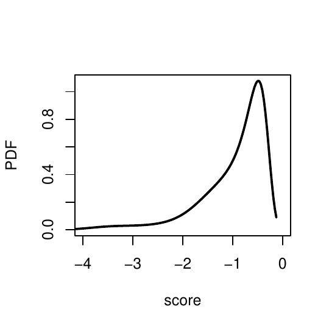</td>
<td style="text-align: left;">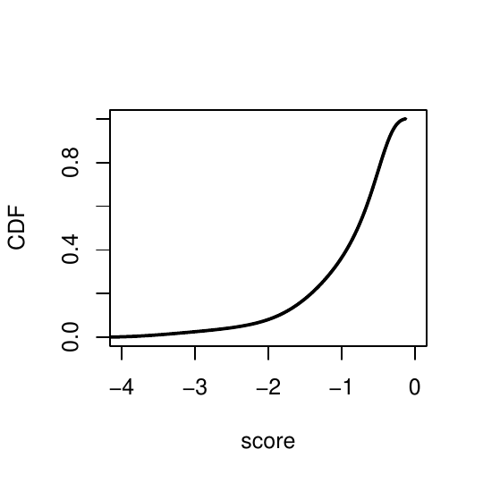</td>
</tr>
</tbody>
</table>
<figcaption>Figure 1: These plots demonstrate the distribution of scores
as defined by Equation  and are used to assess the probability of a
trial solution. The density was estimated empirically by generating 1000
trials of 10,000 uniform random data samples. The probability density
function is shown on the left and the cumulative density function is on
the right. </figcaption>
</figure>

<figure id="fig:sqr">
<table>
<caption> </caption>
<tbody>
<tr class="odd">
<td style="text-align: left;">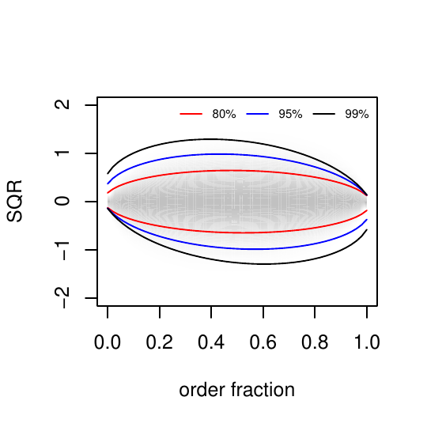</td>
<td style="text-align: left;">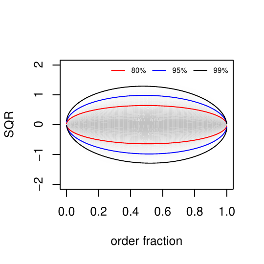</td>
</tr>
</tbody>
</table>
<figcaption>Figure 2: Confidence levels by position for a scaled
quantile residual plot based on beta distribution probabilities
according to single order statistics for a sample size of 50 (left) and
1000 (right). The colored contour lines define regions within an oval
shape that give target levels for observing data points deviating away
from perfect uniform spacing as expected for true uniform random data.
Note that the skewness in the contour lines are noticeable for small
sample sizes compared to large sample sizes.</figcaption>
</figure>

## estimatePDF {#estimatePDF}

`estimatePDF` provides an R interface for nonparametric density
estimation based on a novel method providing an alternative to
traditional KDE implementations. Details of this approach, based on the
principle of maximum entropy [@mem1], were published previously and have
been shown to produce more accurate estimates than KDE in most cases
[@PDFe1; @PDFe2; @kdeR6; @matlab]. For optimal performance and
flexibility with other applications, this functionality is performed
within a set of C++ classes and is not the focus of this paper, but a
brief summary is provided for insight into the `estimatePDF` interface.

In a traditional maximum entropy method, moments for a set of
characteristic functions are introduced, and the coefficients to these
functions are optimized to match the predicted moments with the
empirical moments. As a particular choice of moments that exist for any
probability density, and to form a systematic truncated expansion over a
complete set of orthogonal functions, the analytical form for the
density function from a data sample is expressed as
$$\label{eq:entropy}
p(\nu)=\sum_{j=1}^{D}\exp\left(\lambda_jg_j(\nu)\right),   (\#eq:entropy)$$
where $g_j(\nu)$ are bounded level functions and $\lambda_j$ are
Lagrange coefficients controlling the shape of the density function
[@mem2]. For a fixed number of coefficients, $D$, this method is
parametric in form. Although solving for the coefficients analytically
is increasingly impractical for high dimensionality, a random search
method is employed that provides very efficient numerical optimization.
An expansion of orthogonal functions is constructed in the form of
Equation \@ref(eq:entropy), without specifying D in advance, where
higher mode orthogonal functions are successively added as needed. The
algorithm iteratively explores possible density functions by perturbing
the Lagrange coefficients that are currently present, while D is slowly
increased, testing each possibility according to the scoring function in
Equation \@ref(eq:zscore) to converge towards an accurate estimate.

The arguments for `estimatePDF` are listed in
Table [3](#tab:arguments1). If no other parameters are specified, the
range of the returned estimate is calculated automatically. By default,
left and right boundaries are presumed theoretically infinite and
allowed to extend beyond the range of the data sample. The finite
numerical bounds are calculated according to the density near the tails,
with longer tails receiving more padding than shorter tails. Similarly,
extreme outliers are detected and removed from the sample as appropriate
according to the `outlierCutoff` argument. Alternatively, the
`lowerBound`, `upperBound`, and `outlierCutoff` parameters can be
independently specified to provide the user complete control over the
range of the estimate. Setting `outlierCutoff` to zero turns off outlier
detection and includes all the data.

::: {#tab:arguments1}
  -------------------------------------------------------------------------------------------------------------------------------------------------------------------------------------------------------------------------------------------------------------------------------------
  Arguments          Description
  ------------------ ------------------------------------------------------------------------------------------------------------------------------------------------------------------------------------------------------------------------------------------------------------------
  sample             A vector containing the data sample to estimate.

  pdfLength          Specifies the desired length of the estimate returned. By default, this length is calculated based on the length of the sample.

  estimationPoints   An optional vector containing specific points to estimate.

  lowerBound         Sets the finite lower bound for the sample, if it exists.

  upperBound         Sets the finite upper bound for the sample, if it exists.

  lagrangeMin        Specifies the minimum allowed dimension, $D$, in Equation \@ref(eq:entropy).

  lagrangeMax        Specifies the maximum allowed dimension, $D$, in Equation \@ref(eq:entropy).

  debug              If TRUE, detailed progress will be printed to the console.

  outlierCutoff      If greater than 0, specifies the range of included sample data, according to the formula \[(Q1 - outlierCutoff x IQR), (Q3 + outlierCutoff x IQR)\], where Q1, Q3, and IQR represent the first quartile, third quartile, and inter-quartile range, respectively.

  target             Sets a target percentage threshold between 0 and 100. The default is 70, the minimum accepted is 5.

  smooth             If TRUE (default), preference is given towards smooth density estimates.
  -------------------------------------------------------------------------------------------------------------------------------------------------------------------------------------------------------------------------------------------------------------------------------------

  : Table 3: Overview of arguments in the `estimatePDF` function.
:::

The number of expansions in Equation \@ref(eq:entropy) begins at
`lagrangeMin` and is capped at `lagrangeMax`, with default values of 1
and 200, respectively. The maximum of 200 provides a generous realistic
upper limit to the complexity of the estimate and the computational time
required but can be altered to either increase accuracy or decrease
compute time. Another reason to override these limits is to create a
semi-parametric estimate by narrowing the range between minimum and
maximum. A strictly parametric approach can be achieved by setting the
two limits to the same value. For example, setting both `langrangeMin`
and `lagrangeMax` to 1 forces a uniform fit. Similarly, setting them
both to either 2 or 3 respectively yields exponential and Gaussian
distributions.

The `target` argument refers to the cumulative probability of the
z-score, as previously discussed. Note that `target` is a user-defined
argument, whereas `threshold` in the `PDFe` class is the actual
threshold achieved. These values may be different for several reasons.
For example, the search for the target threshold may abort prematurely
if the `lagrangeMax` has been exceeded or if progress has been stalled.
Additionally, a small penalty is added to the score if the estimate
becomes exceptionally noisy in areas of low density where sharp features
are not justified. Therefore, a smoother curve may be favored over a
higher score. The smoothing penalty is constructed according to a Taylor
expansion error estimate as described previously [@mem2]. The original
model calculated a second order expansion, but a first order
approximation was found to be sufficient and implemented in this
version. This behavior can be circumvented when intentionally searching
for small peaks by setting the `smooth` argument to FALSE.

## convertToPDFe and approximatePoints {#convert}

The `estimatePDF` function performs the density estimation based on the
input parameters in Table [3](#tab:arguments1) and returns a `PDFe`
object for plotting and additional analysis. Alternatively, the
`convertToPDFe` function will create a `PDFe` object for an estimate
calculated using any other method for a given data sample.
`convertToPDFe` requires a data sample and the `(x, y)` values for the
estimate, and calculates the score, threshold, and SQR values for each
point in the sample.

The `approximatePoints` function operates on a `PDFe` object to
approximate the PDF for additional data points after the estimate has
already been calculated using either `estimatePDF` or `convertToPDFe`.
This functionality is similar to specifying `estimationPoints` in the
`estimatePDF` function, but is provided for the convenience of
approximating different points without having to recalculate the
estimate. The following example will create a `PDFe` object for a KDE
estimate of a random sample from a standard normal distribution, and
then return additional density approximations at points -3, 0, and 1.

``` r
    sample = rnorm(1000)
    kde = density(sample)
    pdfe = convertToPDFe(sample, kde$x, kde$y)
    approximatePoints(pdfe, c(-3, 0, 1))
```

## plot {#plotfunction}

The `PDFEstimator::plot.PDFe` function extends the generic `plot`
function in R supporting all existing graphical parameters, with
additional options summarized in Table [4](#tab:arguments2). The first
argument listed in the table is the `PDFe` object returned by
`estimatePDF` or `convertToPDFe` and is required for all plots. The
`plotPDF` and `plotSQR` arguments can be independently set to TRUE or
FALSE and collectively control the plot type. The `plotShading` and
`showOutlierPercent` values invoke the `plotBeta` and `getTarget`
functions from Table [1](#tab:functions) and provide optional
diagnostics to highlight specified uncertainties within the estimate
through the use of the SQR plot. The remaining arguments listed in
Table [4](#tab:arguments2) control minor graphical features for
customized aesthetics. The following examples will demonstrate the
variety of plots that can be created with combinations of these options.

::: {#tab:arguments2}
  -----------------------------------------------------------------------------------------------------------------------------------------------------------------------------------------------------------------------------------------------------------------
  Arguments            Description
  -------------------- --------------------------------------------------------------------------------------------------------------------------------------------------------------------------------------------------------------------------------------------
  x                    A `PDFe` estimation object. Returned from `estimatePDF`.

  plotPDF              Plots the probability density for x if TRUE.

  plotSQR              Plots the scaled quantile residual (SQR) for x if TRUE. If plotPDF is also TRUE, the SQR will be scaled to the range of the density.

  plotShading          Plots gray background shading indicating approximate confidence levels for the SQR, where darker shades indicate higher confidence. Setting this to TRUE only has meaning when plotSQR = TRUE.

  shadeResolution      Specifies the number of data points plotted in the background shading when plotShading = TRUE. Increasing this resolution will create sharper and more accurate approximations for the confidence levels, but will take more time to plot.

  showOutlierPercent   Specifies the threshold to define outliers for SQR. Must be a number between 1 and 100.

  outlierColor         Specifies the color for outliers when showOutlierPercent is defined.

  sqrPlotThreshold     Magnitude of y-axis for SQR plot.

  sqrColor             Specifies the SQR color for non-outliers

  type                 Specifies the line type of the density curve if plotPDF = TRUE. If plotPDF = FALSE and plotSQR = TRUE, the SQR plot uses this type. The default is lines type.

  lwd                  Specifies the line width of the density curve if plotPDF = TRUE. If plotPDF = FALSE and plotSQR = true, the SQR plot uses this width. The default is 2.

  xlab                 x-axis label for pdf. If plotPDF = FALSE and plotSQR = TRUE, then the sqr plot uses this label.

  ylab                 y-axis label for pdf. If plotPDF = FALSE and plotSQR = TRUE, then the sqr plot uses this label.

  legendcex            expansion factor for legend point size with sqr plot type, for plotPDF = FALSE and plotSQR = TRUE.

  \...                 Inherits all other plotting arguments from `plot` function
  -----------------------------------------------------------------------------------------------------------------------------------------------------------------------------------------------------------------------------------------------------------------

  : Table 4: Overview of arguments in the `plot` function.
:::

# Examples and illustrations {#sec:examples}

## Plotting estimates {#plot}

Figure [3](#fig:example1) contains two separate examples of the Maxwell
distribution. The left panel demonstrates the plot function using all
the default parameters and simply `plots` the density estimate. On the
right, the `plotSQR` parameter creates the SQR plot, as described in
Equation \@ref(eq:sqr), overlaying the density. A shaded background,
scaled according to the data sample, is plotted with the addition of the
`plotShading` parameter set to TRUE, providing a visual approximation of
the most probable range of scaled quantile residual values. Finally, the
`showOutlierPercent` parameter flags scaled quantile residual values
that are outside of the 99% target interval. By default, these outliers
are plotted in red.

<figure id="fig:example1">
<table>
<caption> </caption>
<tbody>
<tr class="odd">
<td style="text-align: left;">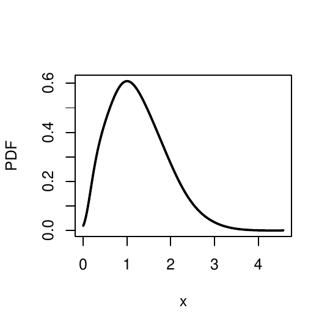</td>
<td style="text-align: left;">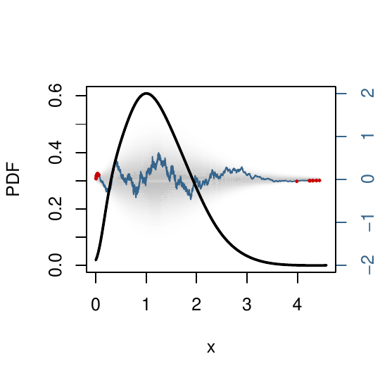</td>
</tr>
</tbody>
</table>
<figcaption>Figure 3: (left) Density estimates for the Maxwell
distribution with 100,000 samples using default parameters. (right) In
addition to the density estimate, the scaled quantile residual mapped to
the original variable x is shown along with a shaded region indicating
99% target. The scaled quantile residuals outside of the 99% target
interval are highlighted in red.</figcaption>
</figure>

Figure  [4](#fig:example2) contains additional examples for visual
assessment of estimates. Each of these plots is based on the sawtooth
distribution, defined by ten identical isosceles triangles at equal
intervals. The sawtooth distribution is designed to be challenging to
estimate due to these extremely sharp peaks. The exact distribution is
plotted in gray in the top left panel of Figure [4](#fig:example2), with
the `estimatePDF` estimate for 100,000 samples shown in black. The
estimate captures the high peaks well but falls short of reaching the
lowest points of each triangle. The top right plot demonstrates how the
`showOutlierPercent` parameter can identify specific areas of lower
confidence in the estimate when the exact distribution is not known. In
this example, the estimate is plotted in gray with green highlighting
the sample points outside of an 80% target level. Although the estimate
closely approximates the distribution, the low peaks are identified as
less accurate.

<figure id="fig:example2">
<table>
<caption> </caption>
<tbody>
<tr class="odd">
<td style="text-align: left;">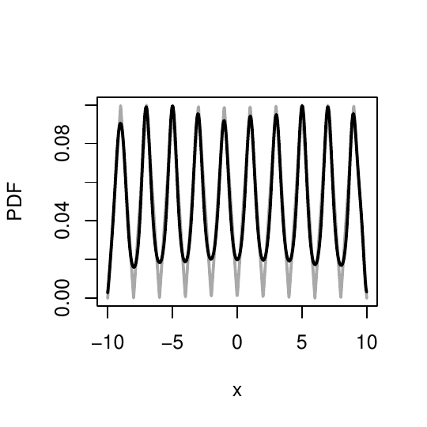</td>
<td style="text-align: left;">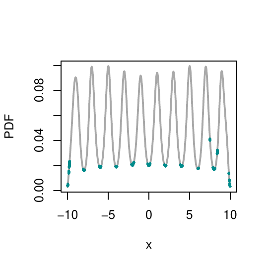</td>
</tr>
<tr class="even">
<td style="text-align: left;">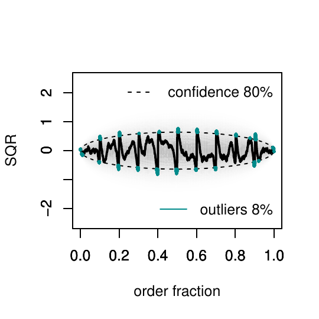</td>
<td style="text-align: left;">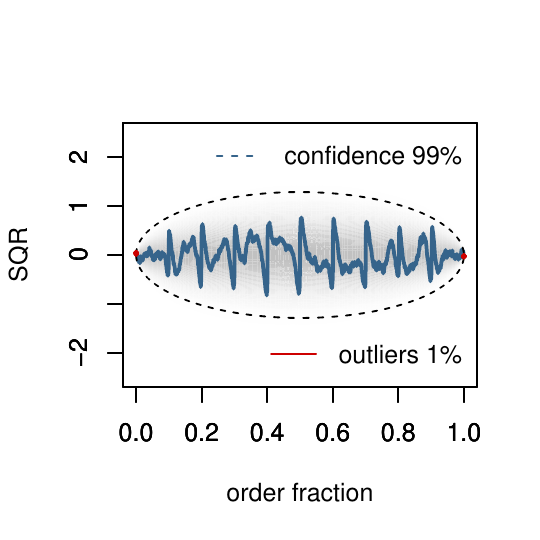</td>
</tr>
</tbody>
</table>
<figcaption>Figure 4: Density estimates for the sawtooth distribution
with 100,000 samples. The top left plot shows the exact known
distribution in gray and the estimate in black. The top right plot shows
the estimate in gray, with green highlights indicating areas outside of
the 80% target threshold. The bottom row demonstrates scaled quantile
residual plots for the same estimate, for 80% and 99% target
levels.</figcaption>
</figure>

The bottom row of figure [4](#fig:example2) shows an alternative
diagnostic visualization of the same estimate. These plots do not
include the density estimate, but show only the SQR plot. Note that when
the SQR is plotted alone, each sample point is spaced equally according
to sort ordered position. Additionally, dotted lines represent the
confidence interval, if `showOutlierPercent` is specified, and the
calculated percentage of points lying outside this threshold are printed
on the bottom right. These examples show targeted thresholds of 80% and
99% with outliers representing 8% and 1% of the points, respectively. If
the sum of the threshold and outlier percentages fall far below or above
100%, this indicates a poor estimate. The figures in this section
collectively demonstrate a wide range of visual assessment and color
choices available with this customized `plot` function.

## Advanced diagnostics {#diagnostics}

The results returned from `estimatePDF` provide additional information
for further analysis when needed. For example, the first plot in
Figure [5](#fig:normalcubed1) is the SQR result for 10,000 data samples
generated from a normal-cubed distribution. In this case, the
`failedSolution` return value is TRUE, indicating that the estimate does
not meet the required threshold for the scoring function. Rather than
return a NULL solution in the event of an unacceptable score, the best
scoring estimate is always returned. However, in addition to the poor
average score, the SQR plot also shows large variations outside of a 99%
threshold.

The second plot in Figure [5](#fig:normalcubed1) shows the SQR result
for the same sample data estimated with the core R function `density`.
The `density` estimate is first converted to a `PDFe` object via the
`convertToPDFe` function. The `failedSolution` return variable indicates
this estimate also does not meet an acceptable fit, but the SQR plot
further suggests an extreme underfit of the estimate near the midpoint
of the sample. This is a common weakness of KDE estimates for data with
sharp peaks and long tails. In fact, the normal-cubed distribution is
undefined at zero and diverges as it approaches this singularity from
both directions, presenting a challenge for any density estimator. In
either method, however, the information available in `PDFe` alerts the
user of problems that may require intervention.

A manual inspection of the sample data, perhaps in the form of a
quantile or histogram plot, confirms an approximately symmetric
distribution of data with an extreme variation in density near the
center. A reasonable course of action in this event is to attempt to fit
the low-density tails separately from the high-density peak.
Figure [6](#fig:normalcubed2) demonstrates this approach, modeling the
distribution with three separate calls to `estimatePDF` (top) and
`density` (bottom) for ranges delineated by -0.01 and 0.01 around the
peak. The tails are bounded according to the range returned from the
respective original estimates for each method.

For `estimatePDF`, this produces individual estimates mostly within the
99% target range shown in the three SQR plots in
Figure [6](#fig:normalcubed2). This example suggests a general divide
and conquer method for addressing extreme distributions that is part of
an automated procedure (to be published elsewhere). For `density`,
however, the estimates remain poor in comparison even when fitting the
regions separately. This is due, in part, because KDE methods do not
incorporate automatic outlier detection. Additionally, KDE tends to
perform poorly at boundaries, causing them to be less amenable to
piecing together estimates in this way.

<figure id="fig:normalcubed1">
<table>
<caption> </caption>
<tbody>
<tr class="odd">
<td style="text-align: left;">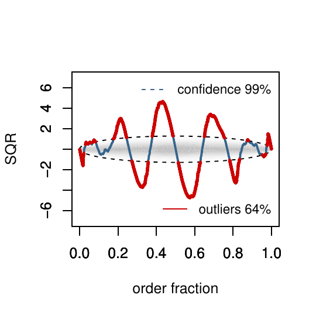</td>
<td style="text-align: left;">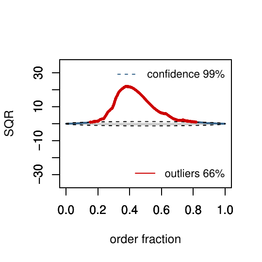</td>
</tr>
</tbody>
</table>
<figcaption>Figure 5: Scaled quantile residual plots for estimates of
the normal-cubed distribution with 10,000 samples using
<code>estimatePDF</code> (left) and <code>density</code>
(right).</figcaption>
</figure>

<figure id="fig:normalcubed2">
<table>
<caption> </caption>
<tbody>
<tr class="odd">
<td style="text-align: left;">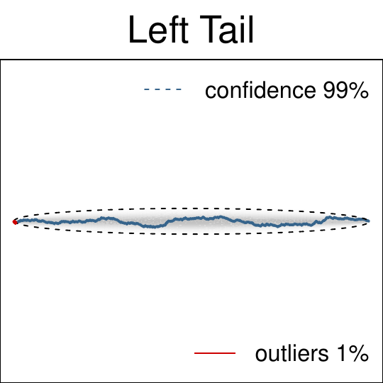</td>
<td style="text-align: left;">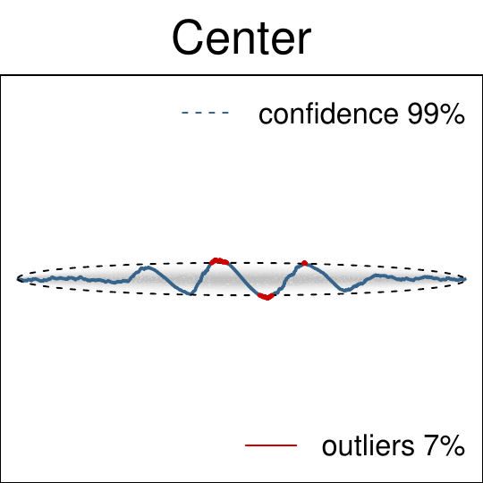</td>
<td style="text-align: left;">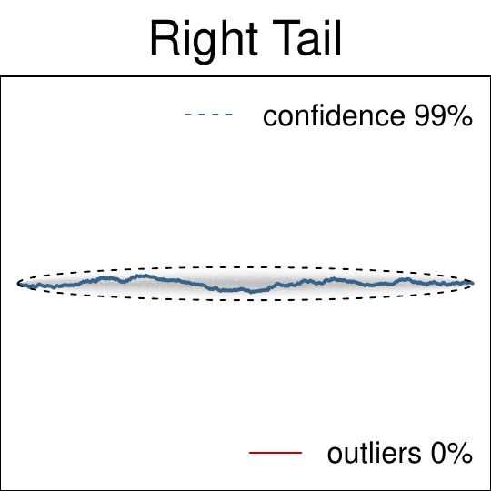</td>
</tr>
<tr class="even">
<td style="text-align: left;">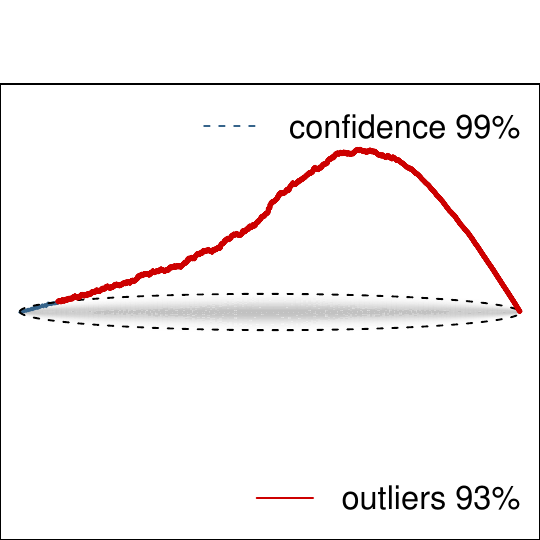</td>
<td style="text-align: left;">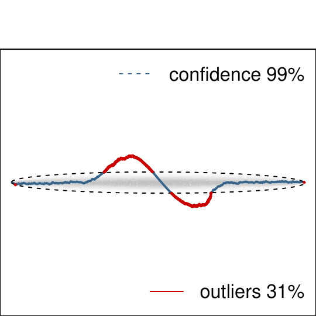</td>
<td style="text-align: left;">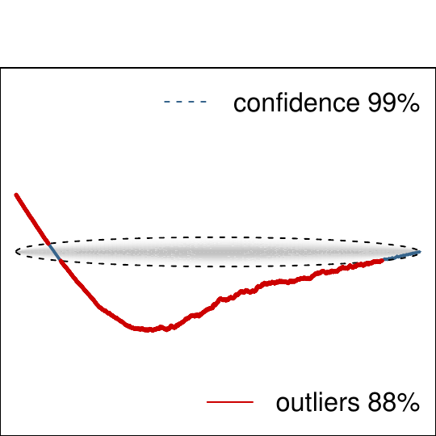</td>
</tr>
</tbody>
</table>
<figcaption>Figure 6: Scaled quantile residual plots for estimates of
the normal-cubed distribution with 10,000 samples separated by left
tail, middle, and right tail for <code>estimatePDF</code> (top row) and
<code>density</code> (bottom row)</figcaption>
</figure>

# Comparison to kernel-based estimators {#sec:comparison}

Conducting a fair comparison between nonparametric methods can be
challenging due to the unrestrained nature of the input data. It is
inevitable that different methods will do well estimating certain types
of distributions while performing poorly on others. The
[*benchden*](https://CRAN.R-project.org/package=benchden) R package was
implemented specifically to address this concern and facilitate an
unbiased comparison between nonparametric methods [@benchden].
*Benchden* includes detailed information about a collection of 28
diverse known distributions, deliberately chosen to challenge estimation
methods in a variety of ways, including long tails, discontinuities, and
sharp or infinite peaks. This data set is used to collect statistics on
the accuracy, computational performance, and usability of `estimatorPDF`
compared to several kernel-based methods.

Usability is admittedly somewhat subjective and difficult to measure. An
advanced user with in-depth knowledge of the data and experience with a
particular method may choose to set parameters that differ from default
values. To control for expert user biases, default settings are used
across all methods. Comparison functions were selected, in part, with
the criteria that the only required user input is a data sample.
However, all methods included in this comparison also allow optional
parameters to specify finite boundary support for a distribution when
provided by the *benchden* package. Although many kernel-based functions
were evaluated and tested, three representative methods were selected
for the results in this section. The first is `density`, the core R
function. The other two are `npudens` and `bkde`, from the
[*np*](https://CRAN.R-project.org/package=np) [@kdeR2] and
[*KernSmooth*](https://CRAN.R-project.org/package=KernSmooth)
[@kernsmooth] packages, respectively. These packages were also chosen to
demonstrate specific advantages and features.

Computational performance and accuracy comparisons are relatively
straightforward to measure. The R package
[*philentropy*](https://CRAN.R-project.org/package=philentropy)
[@philentropy] implements 46 measurements designed specifically for
comparing two distributions. *Philentropy* was used together with
*benchden* to generate random samples for each distribution and compare
estimates for these samples against the known density. For each of the
four selected nonparametric methods, 100 random samples from each
distribution available in *benchden* were estimated, timed, and averaged
for sample sizes ranging from 10 to $10^6$ for all 46 accuracy measures
in *philentropy*. All measurements were averaged first over 100
randomizations and then over all 28 distributions. Comparative results
were qualitatively consistent between the 46 measures, particularly when
averaged over a range of distributions, therefore, for simplicity, a
single measure was selected for the plots in this section. A symmetric
version of the chi-squared family was selected for the divergence,
defined as
$$\label{eq:chi}
d=\sum_{i=1}^{n}\frac{\left(P_i - Q_i\right)^2}{P_i + Q_i}.   (\#eq:chi)$$
Representative results for ten trials of each of the 28 distributions
for select sample sizes are shown in the left plot of
Figure [7](#fig:compareDistributions1).

For functions `density`, `bkde`, and `estimatePDF`, the chi-squared
error decreases with sample size while computational time, shown in the
right plot of Figure [7](#fig:compareDistributions1), increases, as
expected. The relative comparison between these three methods shows that
`estimatePDF`, on average, produces more accurate estimates at the
expense of increased computational time. These trends generally agree
with more comprehensive comparisons between `estimatePDF` and other
nonparametric methods [@kdeR6]. `density` and `bkde` are very similar to
one another, with `density` marginally slower and more accurate on
average over `bkde`. The performance of `npudens` is less consistent.
The *np* package allows for an adaptive bandwidth selection that is the
default method for `npudens`. Although this functionality produces
results with greater accuracy than `density` and `bkde`, it becomes
computationally intractable as sample size increases. The authors
recommend against using the adaptive bandwidth option for sample sizes
beyond 1000. Simulations (not shown) were pushed to 50,000 samples at
100 trials, and 500,000 samples for a single trial, confirming the
prediction of $O(n^2)$ time complexity for this method [@kdeR2].

<figure id="fig:compareDistributions1">
<table>
<caption> </caption>
<tbody>
<tr class="odd">
<td style="text-align: left;">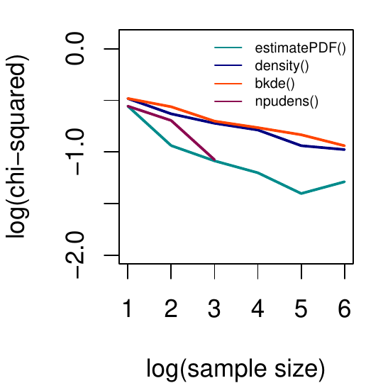</td>
<td style="text-align: left;">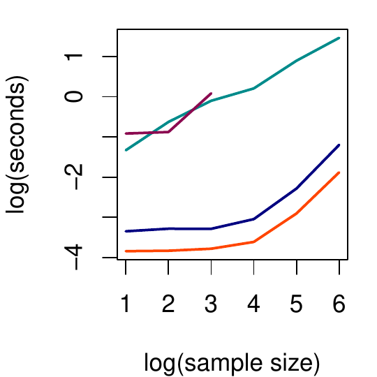</td>
</tr>
</tbody>
</table>
<figcaption>Figure 7: Comparison between four nonparametric estimators
as a function of sample size according to accuracy (left) and
performance (right). All quantities are averaged over 28 distributions
for sample sizes in powers of 10.</figcaption>
</figure>

<figure id="fig:compareDistributions2">
<table>
<caption> </caption>
<tbody>
<tr class="odd">
<td style="text-align: left;">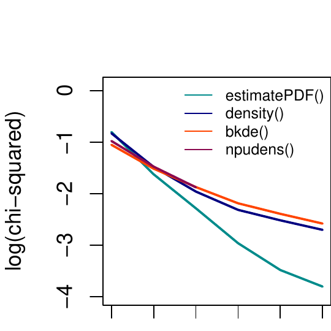</td>
<td style="text-align: left;">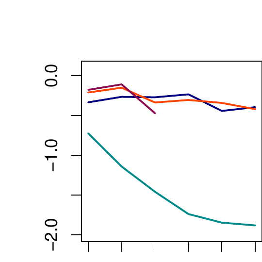</td>
</tr>
<tr class="even">
<td style="text-align: left;">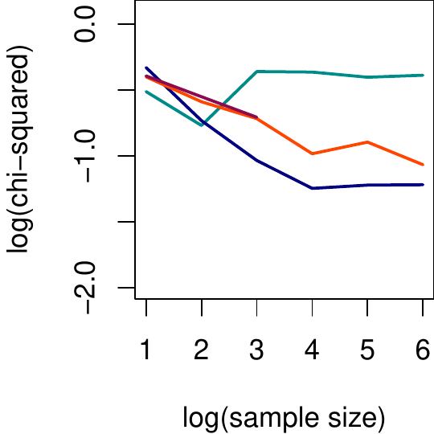</td>
<td style="text-align: left;">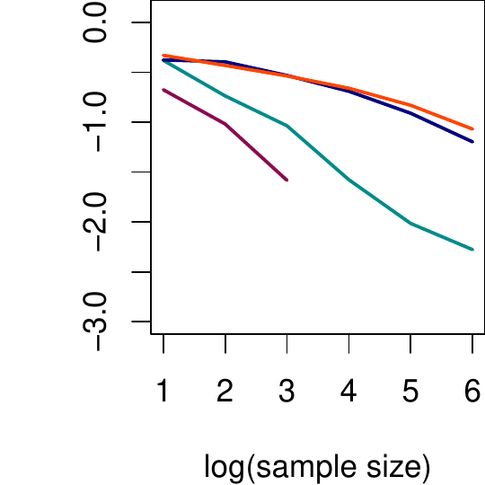</td>
</tr>
</tbody>
</table>
<figcaption>Figure 8: Accuracy comparison between four nonparametric
estimators as a function of sample size averaged over subsets of
distributions. Top left: distributions with high accuracy; top right:
long tailed distributions; bottom left: Matterhorn and normal cubed
distributions; bottom right: distributions with multiple
peaks.</figcaption>
</figure>

Although the plots in Figure [7](#fig:compareDistributions1) provide an
excellent snapshot of overall trends for comparison, a more detailed
analysis per distribution is necessary for practical insight into the
strengths and weaknesses of `estimatePDF` compared to the kernel-based
estimates. When viewing accuracy for each distribution separately, 12 of
the 28 showed no significant differences between methods. When averaged
over many trials, the magnitude of error empirically converges toward
zero by approximately $n^{-0.56}$. The average chi-squared measures as a
function of sample size for these 12 distributions are shown in the top
left plot in Figure [8](#fig:compareDistributions2). Simple,
well-behaved distributions are easy to estimate for all methods
considered in this work.

The remaining plots in Figure [8](#fig:compareDistributions2) illustrate
more interesting cases where `estimatePDF` and kernel-based methods show
their differences. The top right plot, for example, is the accuracy
averaged over four distributions (Cauchy, Pareto, symmetric Pareto, and
inverse exponential) with extremely long tails. Error remains high and
somewhat erratic for all KDE methods, and visual inspection of the
density plots reveal that they will often miss the location and density
of the peak in favor of attempting to capture the low density in the
tails. The automatic boundary and outlier detection in the default
behavior of `estimatePDF` correctly identifies the tails with near-zero
density and removes them from consideration, thus fitting the peak
extremely well with very little overall error in the estimate.

The bottom left plot in Figure [8](#fig:compareDistributions2), by
contrast, shows the average accuracy of the two distributions
(Matterhorn and normal-cubed) where `estimatePDF` performs poorly
compared to the KDE methods. Although these distributions have quite
different definitions, the common characteristics are that they are
symmetrically distributed and are neither in $L_2$ nor $L_\infty$, with
infinite peaks approaching zero from both directions. This particular
set of features is unique among the 28 distributions in *benchden*, and
poses an exceptional challenge to `estimatePDF`. The Matterhorn
distribution, by far the worst performer of the two, additionally
suffers from known machine-precision errors in the random number
generator in *benchden*, occasionally producing samples equal to zero
where the distribution is undefined [@benchden]. Illustrative results
from `estimatePDF` for the normal-cubed distribution were previously
shown in Figure [5](#fig:normalcubed1), along with a demonstration of
how a knowledgeable user can fit together segments of the data and
combine the solutions to obtain a good estimate.

The bottom right plot in Figure [8](#fig:compareDistributions2)
highlights four distributions (sawtooth, smooth comb, Marronite, and
claw) with multiple sharp peaks. The adaptive bandwidth for `npudens`
provides a clear advantage in accurately estimating these distributions
over other KDE functions. For small sample sizes, `npudens` also
maintains an advantage over `estimatePDF`. An example of this advantage
is shown in the left panel of Figure [9](#fig:sawtooth), comparing
`npudens` and `estimatePDF` for 1000 samples of the sawtooth
distribution. The right panel for Figure [9](#fig:sawtooth) shows the
estimates for this distribution at one million samples for
`estimatePDF`, `density`, and `bkde`. The two kernel-based estimates,
processing in under 1 second, are quite poor. The estimate for
`estimatePDF`, taking about 1 minute, is notably improved and likely
would be considered worth the additional computational investment to a
user. The `npudens` estimate, however, is projected to require 10-12
days to compute for 1 million samples, assuming the continuation of
$O(n^2)$ time increase. Any marginal increase in accuracy is unlikely to
be worth the wait.

<figure id="fig:sawtooth">
<table>
<caption> </caption>
<tbody>
<tr class="odd">
<td style="text-align: left;">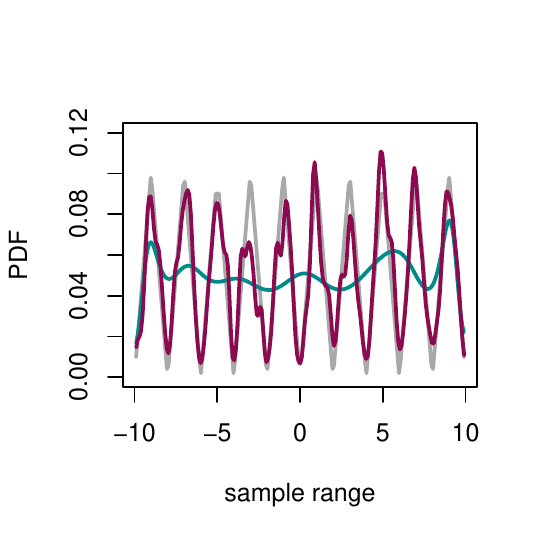</td>
<td style="text-align: left;">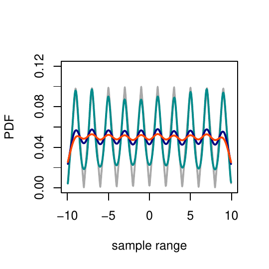</td>
</tr>
</tbody>
</table>
<figcaption>Figure 9: Left: Density estimates for the sawtooth
distribution with 1000 samples for <code>estimatePDF</code> (green) and
<code>npudens</code> (red). Right: Density estimates for the sawtooth
distribution with 1 million samples for <code>estimatePDF</code>
(green), <code>density</code> (blue), and <code>bkde</code>
(orange).</figcaption>
</figure>

# The 1872 Hidalgo stamp issue of Mexico {#sec:stamps}

In 1988, Izenman and Sommer published a detailed statistical study and
historical account describing a postage stamp collection issued in
Mexico in 1872 [@stamp3]. This particular collection consists of only
485 stamps preserved from the millions originally issued that year,
providing a very small and rare sampling of the data. At this time in
history, stamps were printed on a variety of paper types, with poor
documentation and quality control on the thicknesses used for printing.
Therefore, it is unknown how many paper types were used for this stamp
issue in 1872, but those citing historical evidence and statistical
analysis have estimated anywhere from 3 to 8 plausibly distinct
thicknesses [@stamp1; @stamp2; @stamp3; @stamp4].

A straightforward default estimate using the `density` function, shown
in blue on the left plot of Figure [10](#fig:stamp), yields only two
modes, with a bandwidth of 0.00391. Converting this estimate to a `PDFe`
object calculates a threshold of only 0.27% , indicating a very poor
fit. By contrast, the `npudens` variable bandwidth estimate, shown in
red, calculates a much smaller bandwidth at 0.00104 and includes at
least 10 major and minor modes. Converting this estimate to a `PDFe`
object yields a much more probable threshold of 56.4%. More
sophisticated parametric methods, such as mixed normal mode analysis,
suggest that 7 modes is optimal [@stamp1; @stamp3].

The inherent difficulty in estimating real world data from such a small
sample size is in distinguishing true characteristics of the data from
random fluctuations of the sample. A unique advantage of `estimatePDF`
is the ability to produce multiple viable solutions to fit the sample
data. Since `estimatePDF` employs a random process for optimizing its
parameters, starting with different seeds can result in a range of
unique possible solutions consistent with the sampled data. When sample
sizes become large, multiple solutions generally will converge to one
single solution, but estimates for small sample sizes will generally
have more variation. This application, where small features are of
critical interest, provides an example of when the user may wish to
deactivate the `smooth` functionality. Removing this penalty from the
score will prioritize the most likely fit to the data with no regard to
spurious noise in low-density areas.

This effect is demonstrated in the right plot of
Figure [10](#fig:stamp). The results of 20 calls to `estimatePDF` are
plotted in gray, and the average density over these 20 estimates is
plotted in black. The average shows 7 smooth, distinct modes,
corresponding to the 7 paper types proposed by Izenman and Sommer based
on historical evidence. However, even with smoothing disabled, the two
peaks in the right tail are very small and account for some amount of
variation from one estimate to the next. There is some support, both
historical and statistical, that these two modes are not justifiable,
with some argument that there are only 5 modes [@stamp2; @stamp4]. By
contrast, the small mode between the largest two peaks on the left, seen
in the `npudens` estimate and in some of the `estimatePDF` estimates, is
generally agreed to be a random fluctuation of the sample set.
`estimatePDF` demonstrates that these fluctuations are all possible fits
to the data.

<figure id="fig:stamp">
<table>
<caption> </caption>
<tbody>
<tr class="odd">
<td style="text-align: left;">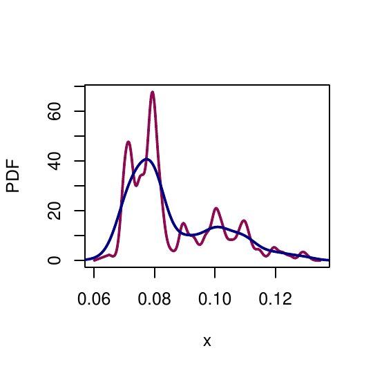</td>
<td style="text-align: left;">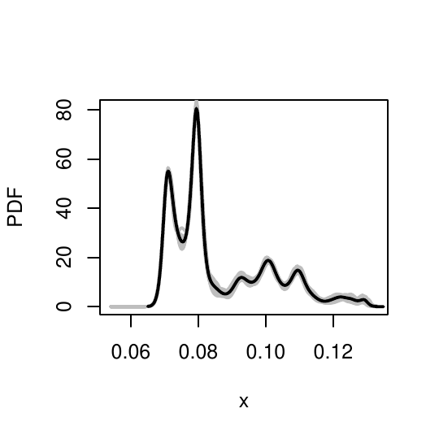</td>
</tr>
</tbody>
</table>
<figcaption>Figure 10: Estimates for the 1872 Hidalgo stamp issue of
Mexico. (left) Default KDE estimate for <code>density</code> in blue,
variable KDE estimate for <code>npudens</code> in red. (right) Multiple
estimates for <code>estimatePDF</code> shown in gray, average in
black.</figcaption>
</figure>

# Summary {#sec:summary}

*PDFEstimator* is a probability density estimation package that
introduces an R implementation of a novel nonparametric method,
`estimatePDF`, based on maximum entropy. Any computational method must
strike a reasonable balance between usability, computational time, and
practical functionality. For comparison, `estimatePDF` was tested across
a large range of random samples for 28 known distributions and compared
to other popular R packages that implement nonparametric estimation
through kernel density methods. Although specific results are
problem-dependent, `estimatePDF` generally computes estimates much more
quickly than those with competitive accuracy. Included in *PDFEstimator*
is a collection of scoring assessments and plotting functions for
displaying results and identifying problem areas in the estimate. These
advanced plotting and analysis functions are independent of distribution
type and estimation method and can be applied towards any density
estimator in R.
:::
