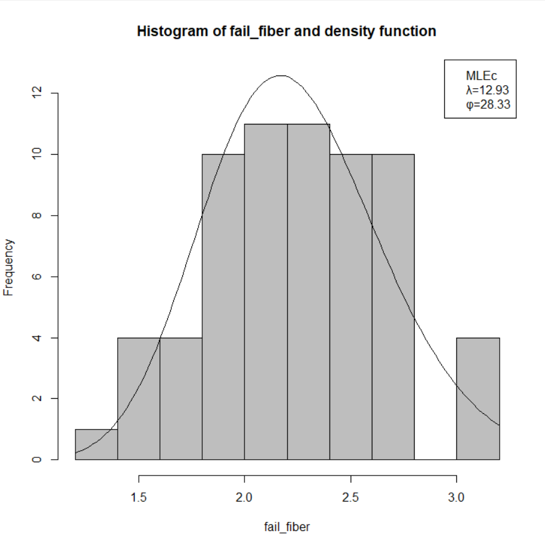
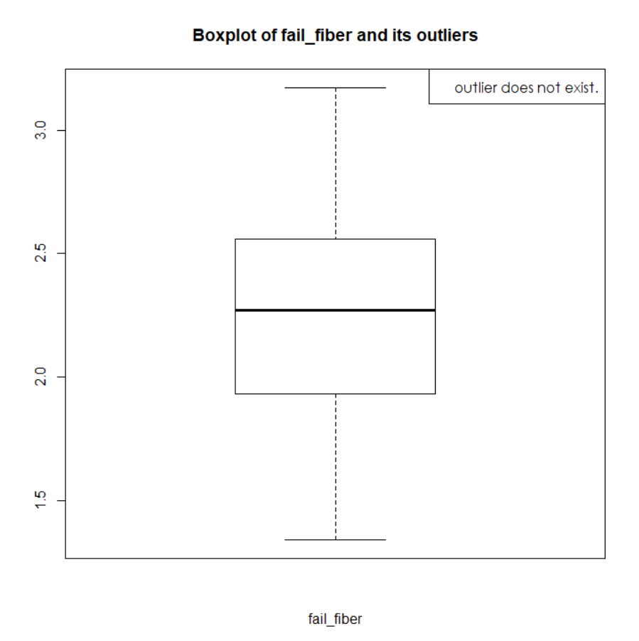
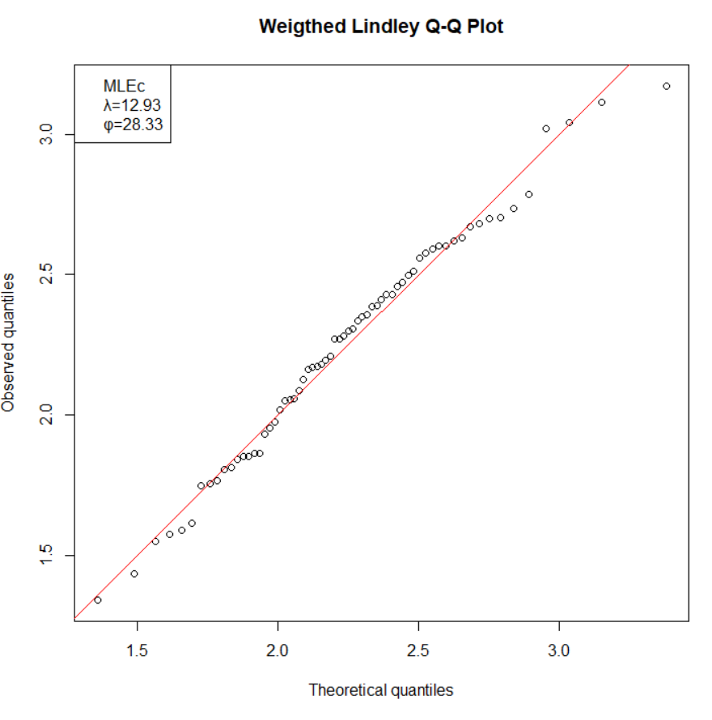
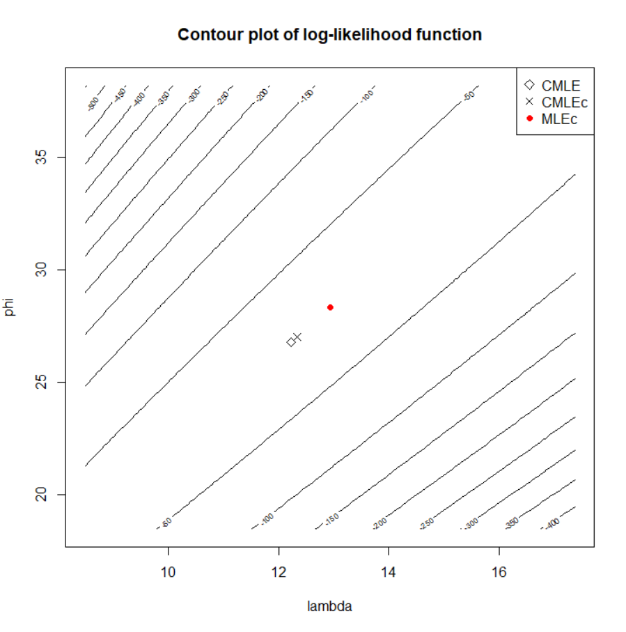

::: article
# Introduction

Weighted Lindley (WL) distribution has recently received considerable
attention since it provides a more flexible fit to data from various
fields than traditional widely-used distributions such as exponential,
log normal, and gamma distributions [@ghitany:2011; @mazucheli:2013].
The probability density function (pdf) of WL distribution is given by
$$f(x) = \frac{\lambda^{\phi+1}}{(\lambda+\phi)\Gamma(\phi)}{x}^{\phi-1}(1+{x})\exp(-\lambda {x}),
x>0,\lambda>0,\phi>0,$$
which can be interpreted as a mixture of two gamma distributions
$$\begin{aligned}
&f(x) = \frac{\lambda}{\lambda+\phi}f_{1}(x)+\frac{\phi}{\lambda+\phi}f_{2}(x),\quad x>0,\lambda>0,\phi>0,
\end{aligned}$$
where
$$\begin{aligned}
&f_{i}(x) = \frac{\lambda^{\phi+i-1}}{\Gamma(\phi+i-1)}x^{\phi+i-2} \exp (-\lambda x),\quad x>0,\lambda>0,\phi>0,\quad i=1,2.
\end{aligned}$$
Due to its nature as a gamma mixture, however, statistical inference for
WL distribution, such as parameter estimation, bias correction, interval
estimation, and statistical test, is overall more cumbersome and tedious
than those of the aforementioned distributions.

Despite this difficulty, there is no existing R package that implements
this comprehensive process for WL distribution. To the best of our
knowledge, [*mle.tools*](https://CRAN.R-project.org/package=mle.tools)
[@mtools:2017] is the only R package that enables one to obtain maximum
likelihood (ML) estimates for WL distribution with asymptotic variance
and bias correction. However, they are just limited to ML estimates. An
R package
[*fitdistrplus*](https://CRAN.R-project.org/package=fitdistrplus)
[@fitdistrplus:2015] which fits certain univariate distributions to data
sets is not applicable to WL distribution, while
[*LindleyR*](https://CRAN.R-project.org/package=LindleyR) package
[@lindleyr] is exclusively for the use of pdf, cumulative distribution
function (cdf), quantile, and random number generation, not statistical
inference itself.

Based on this motivation, we present an R package
[*WLinfer*](https://CRAN.R-project.org/package=WLinfer) by providing
various estimation methods in addition to maximum likelihood estimator
(MLE), such as method of moment estimator (MME), modified method of
moment estimator (MME$_m$), and closed form MLE-like estimator
(MLE$_c$). For bias correction, *WLinfer* encompasses Firth's method and
the bootstrap method which were not considered in *mle.tools*, as well
as Cox and Snell's method. Furthermore, *WLinfer* provides the goodness
of fit and likelihood ratio tests.

The remainder of this paper is organized as follows. First, we briefly
review the theoretical results for each inferential step ranging from
the goodness of fit test to the likelihood ratio test, while introducing
relevant arguments of the `WL` function. We then provide an example to
illustrate the whole output of `WL` function and how to use `WL`
function which implements the whole statistical inference at once.
Finally, we conclude with summarizing remarks.

The *WLinfer* package is available from the Comprehensive R Archive
Network (CRAN) at <https://CRAN.R-project.org/package=WLinfer>. R code
for the examples demonstrated herein has been provided as supplementary
material. The supplementary code has been tested with *WLinfer* version
1.0.0, and results presented herein have been produced with this
version.

# Goodness of fit test

The first step in fitting a distribution to data is to check whether the
data can be assumed as generated from the distribution. For this
purpose, many goodness of fit tests have been developed. Among them,
*WLinfer* includes three popular tests: the Kolmogorov-Smirnov test, the
Anderson-Darling test, and the Cramér-von Mises test. Uncertainty that
could occur from using estimates instead of true values are not
considered here. The argument `dist`$\_$`test` of `WL` function is
specified by one of either `"ks"`, `"cvm"`, `"ad"`, or `"all"`. The
default is `dist`$\_$`test="ks"` while `dist`$\_$`test=all"` returns the
results of all three tests.

# Point estimation

*WLinfer* package considers four estimators: MLE, MLE$_{c}$, MME and
MME$_{m}$. To the best of our knowledge, these are the only estimators
of which asymptotic distribution has been analytically proven. In this
study, we only review the estimation formulas. Please refer to
[@kim:2020; @ghitany:2017; @mazucheli:2013] for more specific
theoretical results.

-   MLE of WL distribution is obtained by
    $$\widehat{\lambda}_{MLE}=\frac{-\widehat{\phi}_{MLE}(\overline{X}-1)+\sqrt{\left[\widehat{\phi}_{MLE}(\overline{X}-1)\right]^{2}+4 \widehat{\phi}_{MLE}\left(\widehat{\phi}_{MLE}+1\right) \overline{X}}}{2 \overline{X}}$$
    where $\widehat{\phi}_{MLE}$ is the solution of the nonlinear
    equation
    $$\psi\left(\widehat{\phi}_{MLE}\right)+\frac{1}{\widehat{\lambda}_{MLE}+\widehat{\phi}_{MLE}}- \log \left( \widehat{\lambda}_{MLE} \right) - \frac{1}{n} \sum_{i=1}^{n} \log \left(x_{i}\right)=0,$$
    with $\psi(x)= \cfrac{\mathrm{d}\log\ ( \Gamma(x))}{\mathrm{d} x}$.\
-   MLE$_{c}$\
    $\begin{array}{l}
    	\widehat{\lambda}_{MLE_c}=    \cfrac{d +\sqrt{d^2 +  \frac{4(1+a_1)\cdot a_0 (a_0 - 1)  }{\left(\sum X_{i} / n\right)-a_1}}}{2(a_1+1)},     \label{eq:ClosedFormLambda} \quad\quad
    	\end{array}$$\begin{array}{l}
    	\widehat{\phi}_{MLE_c}= a_1 \widehat{\lambda}- a_0,\label{eq:ClosedFormPhi}
    	\end{array}$\
    where $\begin{array}{l}
    	d = a_0 +\frac{(1+a_1 )(1-a_0 )-1}{\sum X_{i}/n-a_1 }, \quad
    	a_1 = \cfrac{\sum\limits_{i}^{n} X_{i} \log (X_{i})}{\sum\limits_{i}^{n} \log (X_{i})}~ \text{and}~ 
    	a_0 = \cfrac{\sum\limits_{i}^{n} \frac{X_{i} \log (X_{i})}{1+X_{i}}+n }{\sum\limits_{i}^{n} \log (X_{i})}.
    	\end{array}$\
-   MME\
    $\begin{array}{l}
    	\widehat{\lambda}_{MME}=\cfrac{-\widehat{\phi}_{MME}(\overline{X}-1)+\sqrt{\left[\widehat{\phi}_{MME}(\overline{X}-1)\right]^{2}+4 \overline{X} \widehat{\phi}_{MME}\left(\widehat{\phi}_{MME}+1\right)}}{2 \overline{X}}, \\
    	\\
    	\widehat{\phi}_{MME}=\cfrac{- g \left(\overline{X}, S^{2}\right)+\sqrt{\left[g \left(\overline{X}, S^{2}\right)\right]^{2}+16 S^{2}\left[S^{2}+(\overline{X}+1)^{2}\right] \overline{X}^{3}}}{2 S^{2}\left[S^{2}+(\overline{X}+1)^{2}\right]},\\
    	\text{where } g \left(\overline{X}, S^{2}\right)=S^{4}-\overline{X}\left(\overline{X}^{3}+2 \overline{X}^{2}+\overline{X}-4 S^{2}\right),\quad S^{2}=\frac{1}{n} \sum_{i=1}^{n}\left(X_{i}-\overline{X}\right)^{2}.
    	\end{array}$\
-   MME$_{m}$\
    $\begin{array}{l}
    	\widehat{\lambda}_{MME_{m}}=\cfrac{\overline{X^*}(1-\overline{X^{*}})}{\overline{X}\cdot \overline{X^{*}}-(1-\overline{X^{*}})}, \\ \widehat{\phi}_{MME_{m}}=\cfrac{(1-\overline{X^{*}})^{2}}{\overline{X}\cdot \overline{X^{*}}-(1-\overline{X^{*}})},\quad\text{where } X^{*}=\cfrac{1}{1+X}.
    	\end{array}$

Each estimation method can be implemented by choosing `est`$\_$`method`
of `WL` function, among `"MLE"`, `"MLEc"`, `"MME"`, and `"MMEm"`. The
default refers to `est`$\_$`method = "MLEc"`. If point estimation is
solely of interest, one can separately obtain point estimates with the
following codes:

``` r
	data(fail_fiber)  # fail_fiber is included in WLinfer package.
	
	MLEc_WL(fail_fiber)  # Closed form MLE-like estimator
	MME_WL(fail_fiber)  # Method of moment estimator
	MMEm_WL(fail_fiber)  # Modified method of moment estimator
	MLE_WL(fail_fiber,init =1)  # Initial value for phi is required.
```

We use `fail`$\_$`fiber` data set [@bader:1982] which is included in the
*WLinfer* package. This data set consists of 65 observations of the
strength measurement of carbon fiber.

# Bias correction

Unless sample size is sufficient for achieving consistency, bias
correction is highly recommended since all the aforementioned estimators
are upwardly biased in the case of small samples
[@kim:2020; @mazucheli:2013; @wang:2017]. To this end, the *WLinfer*
package provides three bias correction methods: Cox and Snell's method
[@cox:1968; @cordeir:1994] for MLE and MLE$_c$, Firth's method
[@firth:1993] for MLE, and the bootstrap method
[@efron:1979; @efron:1986] for MLE$_c$. After a series of tedious
calculations, correction formulas are given as follows:

-   Cox and Snell's method\
    $\widehat{\boldsymbol\theta}_{CMLE}=\widehat{\boldsymbol{\theta}}_{M L E}-\left(\begin{array}{c}
    	\delta(\widehat{\lambda}) \\
    	\delta(\widehat{\phi})
    	\end{array}\right),$\
    $\widehat{\boldsymbol\theta}_{CMLE_{c}}=\widehat{\boldsymbol{\theta}}_{M L E_{c}}-\left(\begin{array}{c}
    	\delta(\widehat{\lambda}) \\
    	\delta(\widehat{\phi})
    	\end{array}\right),$\
    where
    $\delta(\widehat{\lambda}) =  \cfrac{1}{n}\cdot \frac{ N_{1} \big\rvert_{\boldsymbol\theta=\widehat{\boldsymbol\theta}_{MLE_{c}s}}}{D \big\rvert_{\boldsymbol\theta=\widehat{\boldsymbol\theta}_{MLE_{c}s}}} ~\text{and}~
    	\delta(\widehat{\phi}) = \cfrac{1}{n}\cdot \frac{ N_{2} \big\rvert_{\boldsymbol\theta=\widehat{\boldsymbol\theta}_{MLE_{c}s}} }{D \big\rvert_{\boldsymbol\theta=\widehat{\boldsymbol\theta}_{MLE_{c}s}}}$
    with\
    $\begin{aligned}
    	D =& \left[ \left( \psi^{\prime} (\phi) - \frac{1}{(\lambda+ \phi)^2} \right)  \left( \frac{\phi+1}{\lambda^2} - \frac{1}{(\lambda+\phi)^2}  \right) - \left( \frac{1}{(\lambda+\phi)^2} + \frac{1}{\lambda}  \right)^2 \right]^2,\\
    	\end{aligned}$
    $\begin{aligned}
    	N_{1} =& \left( \frac{1}{(\lambda+\phi)^2} - \psi' (\phi)  \right) \left[ \left( \frac{1}{(\lambda+\phi)^2} - \psi' (\phi)  \right) \left(  \frac{\phi + 1}{\lambda^3} - \frac{1}{(\lambda+ \phi)^3} \right) + \left( \frac{1}{\lambda} + \frac{1}{(\lambda + \phi)^2} \right) \left( \frac{1}{2 \lambda^2} + \frac{1}{(\lambda+\phi)^3} \right) \right]\\
    	&+ 2 \left( \frac{1}{\lambda} + \frac{1}{(\lambda+\phi)^2} \right) \left[ \left( \frac{1}{(\lambda+\phi)^2} - \psi' (\phi) \right) \left( \frac{1}{2 \lambda^2} + \frac{1}{(\lambda + \phi)^3}   \right)  - \left( \frac{1}{\lambda} + \frac{1}{(\lambda + \phi)^2} \right) \frac{1}{(\lambda + \phi)^3} \right] \\
    	&+ \left( \frac{1}{(\lambda + \phi)^2} - \frac{\phi + 1}{\lambda^2} \right) \left[ \left( \psi' (\phi) - \frac{1}{(\lambda+\phi)^2} \right) \frac{1}{(\lambda + \phi)^3} + \left( \frac{1}{\lambda} + \frac{1}{(\lambda + \phi)^2}  \right) \left( \frac{1}{(\lambda + \phi)^3} +\frac{\psi'' (\phi)}{2} \right)  \right],\\
    	\end{aligned}$

    $\begin{aligned}
    	N_{2} =&  \left( \frac{1}{(\lambda + \phi)^2} - \psi' (\phi) \right) \left[ \left(   \frac{\phi+1}{\lambda^2} - \frac{1}{(\lambda + \phi)^2} \right) \left( \frac{1}{2 \lambda^2} + \frac{1}{(\lambda + \phi)^3}  \right) + \left( \frac{1}{\lambda} + \frac{1}{(\lambda + \phi)^2} \right)  \left( \frac{1}{(\lambda + \phi)^3} - \frac{\phi+1}{\lambda^3}  \right) \right] \\
    	&- 2 \left( \frac{1}{\lambda} + \frac{1}{(\lambda + \phi)^2}  \right) \left[ \left( \frac{1}{\lambda} + \frac{1}{(\lambda + \phi)^2} \right) \left( \frac{1}{2 \lambda^2} + \frac{1}{( \lambda + \phi)^3} \right) + \left( \frac{\phi+1}{\lambda^2} - \frac{1}{(\lambda + \phi)^2} \right) \frac{1}{(\lambda + \phi)^3}  \right]\\
    	&+ \left( \frac{\phi+1}{\lambda^2} - \frac{1}{(\lambda+ \phi)^2}  \right) \left[ \left( \frac{1}{(\lambda +\phi)^2} - \frac{\phi+1}{\lambda^2} \right)  \left( \frac{1}{(\lambda + \phi)^3} + \frac{\psi'' (\phi)}{2} \right)  - \left( \frac{1}{\lambda} + \frac{1}{(\lambda+\phi)^2} \right) \frac{1}{(\lambda + \phi)^3} \right].
    	\end{aligned}$\
-   Firth's method\
    The estimator corrected by Firth's method is obtained by solving
    modified likelihood equations given by
    $$\left(\begin{array}{l}
    	\partial l / \partial \lambda \\
    	\partial l / \partial \phi
    	\end{array}\right)-A \operatorname{vec}\left(K^{-1}\right)=\boldsymbol{0},$$
    where\
    $\begin{aligned}
    	A &= n\left[\begin{array}{cccc}
    	\frac{\phi+1}{\lambda^{3}}-\frac{1}{(\lambda+\phi)^{3}}\quad&-\frac{1}{2 \lambda^{2}}-\frac{1}{(\lambda+\phi)^{3}} & \quad-\frac{1}{2 \lambda^{2}}-\frac{1}{(\lambda+\phi)^{3}} & -\frac{1}{(\lambda+\phi)^{3}}\quad\quad\\
    	-\frac{1}{2 \lambda^{2}}-\frac{1}{(\lambda+\phi)^{3}} & -\frac{1}{(\lambda+\phi)^{3}} & -\frac{1}{(\lambda+\phi)^{3}} & -\frac{1}{(\lambda+\phi)^{3}}-\frac{1}{2} \psi^{\prime \prime}(\phi)
    	\end{array}\right],\\
    	K &= n\left[\begin{array}{cc}
    	\frac{\phi+1}{\lambda^{2}}-\frac{1}{(\lambda+\phi)^{2}} & -\frac{1}{\lambda}-\frac{1}{(\lambda+\phi)^{2}} \\
    	-\frac{1}{\lambda}-\frac{1}{(\lambda+\phi)^{2}} & -\frac{1}{(\lambda+\phi)^{2}}+\psi^{\prime}(\phi)
    	\end{array}\right]. \end{aligned}$
-   Bootstrap method
    $$\widehat{\boldsymbol{\theta}}_{B O O T}=\widehat{\boldsymbol{\theta}}-\widehat{\text {Bias}}=2 \widehat{\boldsymbol{\theta}}-\frac{1}{B} \sum_{b}^{B} \widehat{\boldsymbol{\theta}}^{* b},$$
    where $\widehat{\boldsymbol{\theta}}^{* b}$s are bootstrap
    replications.

For bias correction, the '`bias`$\_$`cor`' argument should be specified
since the default is `bias`$\_$`cor=NULL`. Note, unlike Cox and Snell's
method that works with both MLE and MLE$_c$, Firth's method and the
bootstrap method are only applicable to MLE and MLE$_c$, respectively.
If other estimators are chosen with these correction methods, a default
setting would be automatically adopted. The number of bootstrap
iterations can be specified with `boot_iter`, while the default is 1000.

``` r
	WL(fail_fiber, est_method = "MLE",bias_cor = "firth")   # Firth's method
```

``` r
	WL(fail_fiber, est_method = "MLEc",bias_cor = "coxsnell") # Cox and Snell's method
```

``` r
	WL(fail_fiber, est_method = "MLEc",bias_cor = "boots") # The bootstrap method
```

# Interval estimation

### Asymptotic confidence intervals

MLE, MLE$_{c}$, MME, and MME$_{m}$ for the parameters of WL distribution
achieve consistency and asymptotic normality. Thus, if the sample size
is large enough, confidence intervals can be straightforwardly obtained
with estimated asymptotic variances.
$$\widehat{\lambda}\pm z_{\alpha/2}\cdot \frac{\widehat{\sigma_{1}}}{\sqrt{n}}\quad\text{and}\quad\widehat{\phi}\pm z_{\alpha/2}\cdot \frac{\widehat{\sigma_{2}}}{\sqrt{n}}$$

One problem is that the lower bound of estimated intervals can be
negative. A confidence interval with negative lower bound may not be
useful since the parameters for WL distribution must be positive.
Therefore, in case of negative lower bounds, confidence intervals for
$\log (\boldsymbol{\theta})$ are first obtained by the delta method and
then scaled back. That is,
$$\widehat{\lambda}\cdot\operatorname{exp}\left(\pm z_{\alpha/2}\cdot\frac{\widehat{\sigma_{1}}}{\sqrt{n}\cdot\widehat{\lambda}}\right)\quad\text{and} \quad \widehat{\phi}\cdot\operatorname{exp}\left(\pm z_{\alpha/2}\cdot\frac{\widehat{\sigma_{2}}}{\sqrt{n}\cdot\widehat{\phi}}\right).$$

### Bootstrap confidence intervals

When asymptotic distribution is not available or the sample size is
insufficient, the bootstrap confidence interval can be a good
alternative. The basic bootstrap confidence interval is simply given by
$$\left(2\widehat{\lambda}-\widehat{\lambda}^{*}_{(1-\alpha/2)}\quad,\quad 2\widehat{\lambda}-\widehat{\lambda}^{*}_{(\alpha/2)}\right)\quad \text{and} \quad \left(2\widehat{\phi}-\widehat{\phi}^{*}_{(1-\alpha/2)}\quad,\quad 2\widehat{\phi}-\widehat{\phi}^{*}_{(\alpha/2)}\right),$$
where $\hat{\theta}^{*}_{(p)}$ denotes $\left(100\cdot p\right)\%$
percentile of bootstrap realizations. Readers are referred to Chapter 5
of [@Davison:1997] for more details. As in the asymptotic case, if the
lower confidence limit is negative, confidence interval for
$\log (\boldsymbol{\theta})$ is first computed and scaled back.

The default arguments of `WL` function for interval estimation are
`CI`$\_$`method="asymp"`, `CI`$\_$`scale="normal"`,
`CI`$\_$`side="two"`, and `CI`$\_$`alpha=0.05`. If any bias correction
method is used, `CI`$\_$`method="boot"` is automatically chosen.
`CI`$\_$`scale="exp"` is recommended in the case of a negative lower
confidence limit and one-sided intervals can be obtained by choosing
`CI`$\_$`side="one"`.\

``` r
	WL(fail_fiber,est_method="MLEc")$CI_list  #asymptotic CI for MLEc
	WL(fail_fiber,est_method="MLE")$CI_list  #asymptotic CI for MLE
	
	# Bootstrap CI for MLEc corrected by Cox and Snell's method
	WL(fail_fiber,est_method = "MLEc", bias_cor = "coxsnell")$CI_list
```

# Likelihood ratio test (LRT)

Let $X_{1}, \cdots, X_{n}$ be a random sample from
$f(x \mid \theta), \boldsymbol{\theta} \in \Theta,$ where
$\boldsymbol{\theta}=\left(\lambda,\phi\right)^{t}$,
$\Theta \subset \mathbb{R}^{+}\times\mathbb{R}^{+}$ and
$f(\boldsymbol{x}\mid\theta)$ is the pdf of WL distribution. To test
$H_{0}: \boldsymbol{\theta} \in \Theta_{0}$ vs.
$H_{1}: \boldsymbol{\theta} \in \Theta_{0}^{c},$ we reject $H_{0}$ if
$$2 \log (R_{n}) =2 \log \left( \frac{\sup _{\Theta} l_{n}(\boldsymbol{\theta} \mid \boldsymbol{x})}{\sup _{\Theta_{0}} l_{n}(\boldsymbol{\theta} \mid \boldsymbol{x})} \right) > \chi_{\alpha}^{2}(2),\text{ where } l_{n}(\boldsymbol{\theta} \mid \boldsymbol{x}) = \prod\limits_{i} f(x_{i}\mid\boldsymbol{\theta}).$$
The LRT is automatically implemented in the `WL` function unless
`wilks`$\_$`test="FALSE"` is selected. The significance level and types
of null hypotheses are set by `wilks`$\_$`alpha` and `wilks`$\_$`side`.
The default setting is `wilks`$\_$`alpha=0.05` and
`wilks`$\_$`side="two"`.

The LRT can be separately conducted with the `wilks.test` function apart
from other inferences. This function is especially useful when testing
several possible values or regions. By specifying arguments `estimator`
and `side`, both simple and composite null hypotheses can be tested.

-   H$_{0}$: ($\lambda,\phi$) = ($\lambda_{0},\phi_{0}$) vs H$_{1}$: not
    H$_{0}$.
    ``` r
    wilks.test(fail_fiber,estimator = MME_WL(fail_fiber),side = "two")
    	
    ```
-   H$_{0}$: $\lambda\geq \lambda_{0}$ and $\phi\geq\phi_{0}$ vsH$_{1}$:
    not H$_{0}$.
    ``` r
    wilks.test(fail_fiber,estimator=c(1,1),side="less")
    	
    ```

# Illustration - `WL` function

In this section, we provide an example for illustrating how to conduct
the aforementioned steps of statistical inference from the beginning
using the `WL` function. The `WL` function returns an S3 object of class
'WL' which is assigned to `fiber` in this example. For this object of
class 'WL', `summary` and `plot` functions are provided.

``` r
	> data("fail_fiber")
	> fiber = WL(fail_fiber,dist_test = "ks", est_method ="MLEc",
	             wilks_alpha=0.05, wilks_side="two")
	> summary(fiber)
	
	Data: fail_fiber 
	
	Data summary:
	Mean: 2.244, Variance: 0.1728 
	Min    1st Qu Median 3rd Qu Max
	1.339  1.931  2.272  2.558  3.174
	
	Kolmogorov-Smirnov test for alpha=0.05 
	D = 0.0723, p-value: 0.8864
	>> This data follows the weighted Lindley distribution with estimated parameters.
	
	Estimation method (bias correction): MLEc(None) 
	lambda: 12.9318, phi: 28.3329 
	
	Variance of lambda & phi:
	Var(lambda)= 5.1126, Var(phi)= 25.2938 
	
	Two-sided confidence interval for 95% 
	(Asymptotic method & Normal scaled ) 
	CI for lambda: (8.5001, 17.3635) 
	CI for phi: (18.4757, 38.1902) 
	
	Two-sided Wilks' theorem test for estimated parameters 
	X = 0.0024, p-value: 0.9988
	>>The null hypothesis cannot be rejected.
```

The simple descriptive statistic is provided by `summary(fiber)`,
followed by the result of the goodness of fit test. This data set can be
assumed to originate from WL distribution since the null hypothesis of
the KS test is not rejected. We chose MLE$_c$ without bias correction
since the sample size of 65 is moderate, which allows us to use
asymptotic variance to construct the confidence interval.
`Variance of lambda & phi` in the output means estimated asymptotic
variances obtained by replacing $\left(\lambda,\phi\right)$ with
$\left(\widehat{\lambda},\widehat{\phi}\right)$ in the variance
formulas. Finally, the result of LRT with
$H_{0}:\text{ }\lambda = \widehat{\lambda}_{MLE_{c}}\text{ and }\phi = \widehat{\phi}_{MLE_{c}}$
is given.

<figure id="fig:histogram">
<p></p>
<p></p>
<figcaption>Figure 1: Histogram with estimated density function, boxplot
for detecting outliers, weighted Lindley QQ plot, and contour plot of
log-likelihood function with point estimates for a real data
fail_fiber.</figcaption>
</figure>

To obtain some helpful plots, we use `plot` function. Four plots are
returned by `plot(fiber)` as per Figure [1](#fig:histogram): the
histogram with estimated density function, the boxplot for detecting
outliers, QQ plot, and contour plot with point estimates. The first
three plots provide insight on how much WL distribution is suitable for
the given data, along with the goodness of fit tests. The last contour
plot provides the surface of log likelihood near point estimates. Note
that the density function in the histogram and the quantiles for the QQ
plot are calculated based on estimated parameters.

# Summary

We presented an R package *WLinfer* that implements a goodness of fit
test, several types of point estimation, bias correction, interval
estimation, and the likelihood ratio test, and provide some useful
plots. We supply a set of simple codes and an illustrative example of
how to apply this package in practice. This package could practically
assist practitioners, removing the need to make codes from scratch.

# Acknowledgments

The corresponding author's research was supported by the Basic Science
Research Program through the National Research Foundation of Korea (NRF)
funded by the Ministry of Education(2018R1D1A1B07045603) and a National
Research Foundation of Korea (NRF) grant funded by the Korean government
(MSIT) (2021R1A4A5032622).
:::
