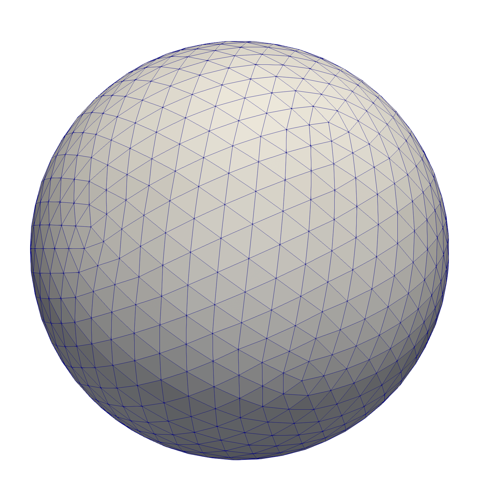
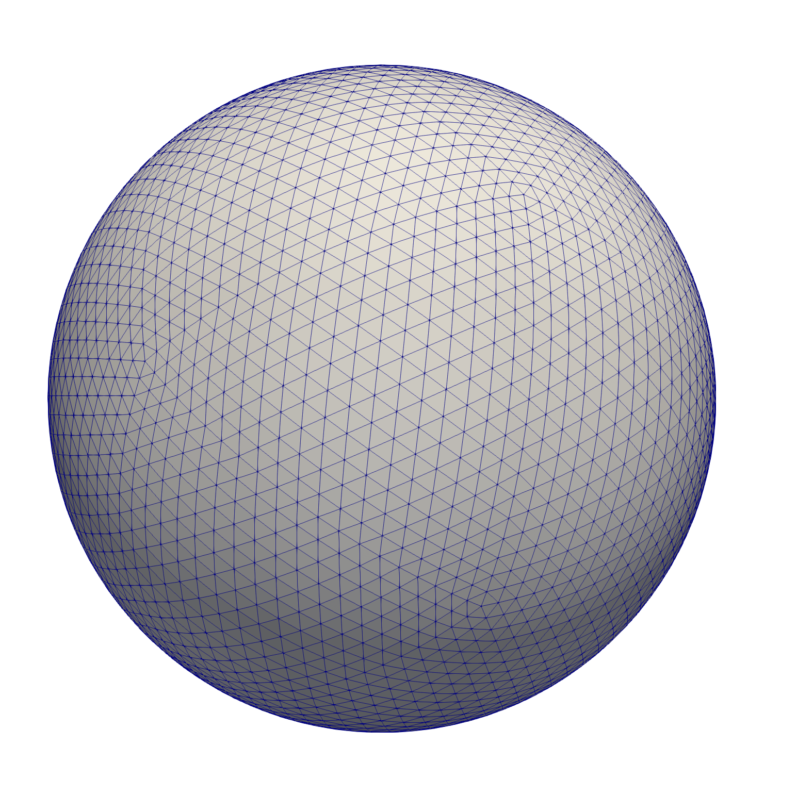
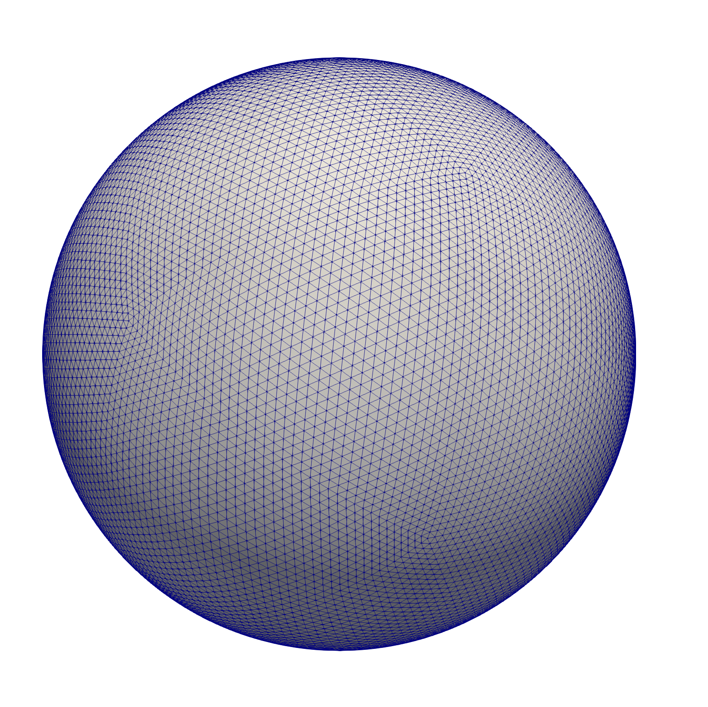
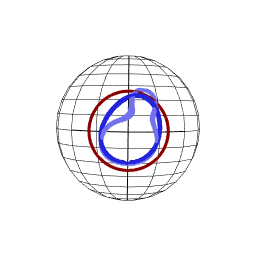
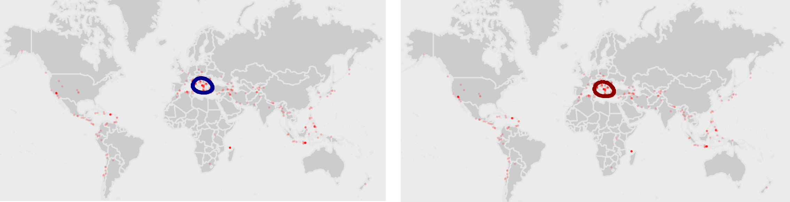

# An overview on directional general level sets and highest density regions

When analyzing a data distribution, it is often the case that for a
deeper understanding of the modelling problem, it is interesting to
determine regions on the density support exceeding a certain threshold
on the density function values. These regions are known as density level
sets and, if the density is unknown, such a task can be accomplished
from a set estimation perspective. Set estimation deals with the problem
of reconstructing a set (or estimating any of its features such as its
boundary or its volume) from a random sample of points intimately
related to it. Since [@hartigan1975clustering] establishes the notion of
clusters as connected components of a density level set, the
reconstruction of this particular type of sets has been widely
considered in the literature (mainly for densities supported on an
Euclidean space). There are only very few contributions where density
level set theory has been extended to more general domains such as the
unit sphere or manifolds. [@cuevas2006plug] consider the estimation of
level sets for general functions (not necessarily a density) such as
regression curves, providing some consistency theoretical results and
showing a density level set on the sphere for illustration. More
recently, the reconstruction of density level sets on manifolds is
studied in [@cholaquidis2020level], who also presents some simulations
illustrating the performance of their approach on the torus and on the
sphere.

Let $X$ be a random vector taking values on a $d-$dimensional unit
sphere $S^{d-1}$ with density $f$ and $t>0$, the goal of (directional)
density level set estimation is to reconstruct the set $$\label{G(t)}
G_f(t)=\{x\in S^{d-1}:f(x)\geq t\}.$$ from a random sample of points
$\mathcal{X}_n= \{X_1,\cdots,X_n\}$ of $X$ when $f$ is unknown. As an
illustration, some (theoretical) level sets are shown in Figure
[\[ltau\]](#ltau){reference-type="ref" reference="ltau"} by representing
$G_f(t)$ for a circular (left) and a spherical density (right) when
three different values of the level $t$ are chosen. The threshold $t$ is
represented through a dotted line for the circular case. Note that, if
large values of $t$ are considered, $G_f(t)$ coincides with the greatest
modes of the circular/spherical distribution. However, for small values
of $t$, the level set $G_f(t)$ is practically equal to the support of
the distribution. Therefore, cluster definition via connected components
in [@hartigan1975clustering] is clearly related to the notion of mode.
Note also that the computation of the number of modes considering the
values of a density over a certain range of values for the level $t$,
would enable the construction of a directional cluster tree.
[@azzalini2007clustering] already present this statistical tool for
Euclidean data. Moreover, the association between clusters and modes is
the basis of modal clustering methodology (see [@menardi2016review] for
a review on this topic). Most modal clustering algorithms are based on
the application of a mode-seeking numerical method to the sample points
and assigning the same cluster to those data that are iteratively
shifted to the same limit value. Examples of such procedures include the
mean shift algorithm that has been already studied in $S^{d-1}$ (see,
for instance, [@chang2010mean] and [@yang2014mean]).

::: picture
(-200,470) (-25,263){width="60%"}
(210,325){width="31%"}
(120,247)
(-48,247)
:::

Despite a practitioner may be interested in determining this type of
regions, the value of the level $t$ could be (in principle) unknown in
real situations. In practice, it is quite common to assume that the set
in ([\[G(t)\]](#G(t)){reference-type="ref" reference="G(t)"}) must
satisfy a probability content previously established. Following
[@box1973bayesian], [@hyndman1996computing] and, more recently,
[@azzalini2007clustering], [@saavedra2020nonparametric] generalize the
definition of HDRs from the Euclidean to the directional setting,
providing a plug-in estimation method. Specifically, HDRs are a kind of
density level sets where the set probability content is fixed instead of
the level $t$. The estimation of HDRs involves further complexities
given that the threshold must be computed from the previously fixed
probability content. Formally, given $\tau\in(0,1)$, the
$100(1 - \tau)$% HDR is the subset $$\label{conjuntonivel2}
L(f_\tau)=\{x\in S^{d-1}:f(x)\geq f_\tau\},$$where $f_\tau$ can be seen
as the largest constant such that
$$\mathbb{P}(X\in L(f_\tau))\geq 1-\tau,$$with respect to the
distribution induced by $f$. Figure
[\[ltau\]](#ltau){reference-type="ref" reference="ltau"} also shows the
HDR $L(f_\tau)$ for a circular and a spherical densities with three
different values of $\tau$. Note that, if large values of $\tau$ are
considered, $L(f_\tau)$ is equal to the greatest modes and the most
distinct clusters can be easily identified. However, for small values of
$\tau$, $L(f_\tau)$ is almost equal to the support of the distribution.

To sum up, given a value of $t$, the computation of the level set
established in ([\[G(t)\]](#G(t)){reference-type="ref"
reference="G(t)"}) (and of its connected components) is a quite simple
mathematical task when $f$ is known. Under this assumption and taking a
fixed $\tau\in (0,1)$, determining the HDR introduced in
([\[conjuntonivel2\]](#conjuntonivel2){reference-type="ref"
reference="conjuntonivel2"}) presents a similar complexity but, in this
case, it is additionally necessary to determine the threshold $f_\tau$.
In particular, numerical integration methods can be applied to solve
that problem. However, when the density $f$ is assumed to be unknown and
a random sample $\mathcal{X}_n\in S^{d-1}$ generated from $f$ is the
only available information to reconstruct the set, nonparametric set
estimation techniques such as plug-in methods must be considered in
order to reconstruct the connected components of the set. Perhaps due to
its practical importance, Euclidean HDRs plug-in algorithms based on
kernel smoothing have been widely studied even solving the problem of
selecting an appropriate smoothing parameter specifically devised for
the HDR reconstruction (see [@baillo2006parametric],
[@samworth2010asymptotics] or [@casa2020modal]). In the directional
setting, given that a proper definition of the HDR $L(f_\tau)$ was not
available, no work on this area had been carried out until the recent
contribution by [@saavedra2020nonparametric].

The contents of this paper, describing the contributions in
[HDiR](https://CRAN.R-project.org/package=HDiR), mainly focus on
computation and plug-in estimation of highest density regions (HDRs) and
density level sets in the circle and the sphere. Although general level
sets can be also analysed using HDiR, we will not formally detail
aspects on their computation and on their plug-in reconstruction given
that they can be seen as a direct generalisation of those introduced for
density level sets by replacing the density by the general function
under study. Therefore, with the objective of showing the capabilities
of the HDiR package for exact computation of directional HDRs and
density level sets when $f$ is known and for plug-in estimation
otherwise, this paper is organized as follows. First, a basic overview
on nonparametric plug-in estimation methods is given. Initially, the
classical directional kernel density estimator is briefly introduced, as
it is the key tool for plug-in reconstruction and exploratory methods.
Then, the problems of threshold estimation (with known and unknown
density) and specific bandwidth selection for HDRs are considered.
Circular confidence regions for HDRs are also established. Next, the
reader will find a guided tour across HDiR package, illustrating its use
with simulated examples first and with two real data examples later.
Following the perspective in [@cuevas2006plug], HDiR also allows the
computation and plug-in estimation of general level sets. A
reconstruction example of a (circular) regression level set is detailed.
Moreover, distances between sets and circular/spherical scatterplots are
also described as exploratory tools. Finally, some discussion is
provided, considering on the possible extensions of the package.

# Plug-in estimation methods {#sec:2}

This section provides a brief background on the design of plug-in tools
included in HDiR for directional (circular and spherical) HDR and
density level set estimation. Following [@cuevas2006plug], if a
nonparametric estimator is available for a general function, this
methodology may be directly extended for reconstructing the
corresponding level sets.

## Plug-in estimation methods for HDRs and level sets {#HDRsplugin}

Although there are other nonparametric alternative routes for level set
estimation, the plug-in approach has received considerable attention in
the Euclidean literature (see [@tsybakov1997nonparametric],
[@baillo2003total], [@mason2009asymptotic], [@rigollet2009optimal],
[@mammen2013confidence] or [@chen2017density]). This is with no doubt a
natural methodology, which can be generalized to the directional setting
as in [@saavedra2020nonparametric]. Given that level set estimation is a
simpler problem than HDR reconstruction, we will restrict to this last
setting in what follows. Given a random sample
$\mathcal{X}_n\in S^{d-1}$ of the unknown directional density $f$,
plug-in methods reconstruct the $100(1 - \tau)$% HDR namely $L(f_\tau)$
in ([\[conjuntonivel2\]](#conjuntonivel2){reference-type="ref"
reference="conjuntonivel2"}) as $$\label{Ltauest}
\hat{L}(\hat{f}_\tau)=\{x\in S^{d-1}:f_n(x)\geq \hat{f}_\tau\},$$where
$\hat{f}_\tau$ is an estimator of the threshold $f_\tau$ and $f_n$
denotes a nonparametric directional density estimator. Package HDiR
implements the kernel density estimator provided in [@bai1989kernel]
($d>2$). From $\mathcal{X}_n$, it is defined at a point $x\in S^{d-1}$
as $$\label{estimacionnucleo}
f_n(x)= \frac{1}{n}  \sum_{i=1}^n K_{vM}(x;X_i;1/h^2),$$where $K_{vM}$
denotes the von Mises-Fisher kernel density and $1/h^2 > 0$ is the
concentration parameter.

Following [@bai1989kernel], package HDiR also enables to use any kernel
function (not necessarily the von Mises-Fisher density implemented by
default). An example where an uniform kernel is considered will be
presented later. Even more generally, HDiR would allow the user to
define different density estimators that the one introduced in
([\[estimacionnucleo\]](#estimacionnucleo){reference-type="ref"
reference="estimacionnucleo"}). See, for instance,
[@pelletier2005kernel].

As for the concentration parameter $1/h^2$, it plays an analogous role
to the bandwidth in the Euclidean case. For small values of $1/h^2$, the
density estimator is oversmoothed. The opposite effect is obtained as
$1/h^2$ increases. Hence, the choice of $h$ is a crucial issue. For
simplicity, in what follows, we refer to $h$ as bandwidth parameter.
Many approaches for selecting $h$ in practice, in circular and even
directional settings, have been proposed in the literature (see
[@taylor2008automatic], [@oliveira2012plug], [@hall1987kernel],
[@di2011kernel] or [@garcia2013exact]). All these existing proposals
designed for density estimation are implemented in the package NPCirc
and their aim is to minimize some error criterion on the target density.
However, such a bandwidth selector may not be adequate for HDRs or level
set estimation. As far as we know, such a tool was not available in the
directional setting until the selector by [@saavedra2020nonparametric].
It is also available in package HDiR. Different plug-in estimators for
HDRs emerge from the consideration of all these bandwith selectors.

For the circular and the spherical densities shown in Figure
[\[ltau\]](#ltau){reference-type="ref" reference="ltau"}, now Figure
[\[ltauest2\]](#ltauest2){reference-type="ref" reference="ltauest2"}
contains the HDR plug-in estimators (bluish colours) for $\tau=0.5$
computed using cross-validation bandwidths and samples of sizes $n=100$
and $n=500$, respectively. Although the theoretical circular HDR is
composed by three connected components (see Figure
[\[ltau\]](#ltau){reference-type="ref" reference="ltau"}), the plug-in
estimator is able to detect only the two biggest clusters when $n=100$.
In order to assess the agreement of a given estimate with the
theoretical target, distances between sets are the usual tools to
measure the discrepancies between the theoretical sets and the
corresponding empirical reconstructions. One of the most common
distances in the Euclidean setting is the Hausdorff distance between the
boundaries of both sets.

::: picture
(-200,390) (-20,185){width=".7\\textwidth"}
(135,185){width=".7\\textwidth"}

(82,153){width="25%"}
(231,153){width="27%"}
:::

If the target is the reconstruction of a HDR or a density level set, the
Hausdorff metric is a suitable error criterion in the directional
setting (see [@cuevas2006plug] and [@cholaquidis2020level]). If $A$ and
$B$ are non-empty compact sets in the $d-$dimensional Euclidean space,
the Hausdorff distance between $A$ and $B$ is defined as follows
$$d_H(A,B)=\max\left\{\sup_{x\in A}d_E\left(\{x\},B\right),\sup_{y\in B}d_E\left(\{y\},A\right)\right\},$$where
$d_E(\{x\},B)=\inf_{y\in B}\{d_E(x,y)\}$ being $d_E(x,y)$ the Euclidean
distance between two points. However, this metric $d_H$ is not
completely successful in detecting shape-related differences. For
instance, two sets can be very close in Hausdorff distance and still
show quite different shapes. This typically happens where the boundaries
$\partial A$ and $\partial B$ are far apart, no matter the proximity of
$A$ and $B$. So, a natural way to reinforce the notion of visual
proximity between two sets provided by Hausdorff distance is to account
also for the proximity of their respective boundaries. In particular,
Hausdorff distance between the boundaries of the theoretical HDR and its
plug-in reconstruction is a measure of the estimation error. HDiR allows
to compute Euclidean and Hausdorff distances between the frontiers of
two arbitrary sets on the circle and on the sphere.

### Threshold estimation and confidence regions for HDRs {#threshold}

For a given $\tau\in (0,1)$, determining the set $L(f_\tau)$ in
([\[conjuntonivel2\]](#conjuntonivel2){reference-type="ref"
reference="conjuntonivel2"}) and its plug-in estimator
$\hat{L}(\hat{f}_{\tau})$ in
([\[Ltauest\]](#Ltauest){reference-type="ref" reference="Ltauest"})
involve the exact computation and the estimation of the threshold
$f_\tau$, respectively. As in the Euclidean setting, both tasks require
the use of numerical integration methods. Specifically, HDiR uses the
classical trapezoidal rule in the circular setting. However, for the
spherical case, the computational cost becomes a major issue due to the
complexity of the numerical integration algorithms considered on high
dimensional spaces. It should be noted that package
[SphericalCubature](https://CRAN.R-project.org/package=SphericalCubature)
includes some functions for solving numerical integration over spheres.
However, it does not provide sufficiently accurate solutions for our
problem.

An alternative approach is implemented in the internal function
sphere.integration of HDiR. Specifically, the proposed numerical
integration procedure on the sphere requires the definition of a
triangular mesh, such as the ones depicted in
Figure [\[mesh\]](#mesh){reference-type="ref" reference="mesh"},
obtained from the projection over the sphere of triangular meshes on an
embedded icosaedrum. This type of mesh guarantees that there is not a
prevailing direction. For computing the corresponding spherical
integral, the Cartesian coordinates of the mesh vertices are transformed
into spherical coordinates and standard quadrature formulae are applied
in each triangle over the plane formed by the azimuthal and polar angles
(see [@strang73]).

{width=".3\\textwidth"}{width=".3\\textwidth"}{width=".3\\textwidth"}\

Package HDiR additionally includes a computationally feasible approach
for estimating $f_{\tau}$ in the circular and spherical context. As
before, let $X$ be a random vector with directional density $f$ and let
$Y=f(X)$ be the random vector obtained by transforming $X$ by its own
density function. Since $\mathbb{P}(f(X)\geq f_\tau)=1-\tau$, $f_{\tau}$
is exactly the $\tau-$ quantile of $Y$. [@saavedra2020nonparametric]
establish that $f_{\tau}$ can be estimated as a sample quantile from a
set of independent and identically distributed random vectors with the
same distribution as $Y$. In particular, if
$\mathcal X_n=\{X_1,\cdots,X_{n}\}$ denotes a set of independent
observations in $S^{d-1}$ from a density $f$,
$\{f(X_1), \cdots, f(X_n)\}$ is a set of independent observations from
the distribution of $Y$. Let $f_{(j)}$ be the $j-$th largest value of
$\{f(X_i)\}_{i=1}^n$ so that $f_{(j)}$ is the $(j/n)$ sample quantile of
$Y$. We shall use $f_{(j)}$ as an estimate of $f_\tau$. Specifically, we
choose $\hat{f}_\tau=f_{(j)}$ where $j=\lfloor \tau n\rfloor$. Threshold
values in Figure [\[ltauest2\]](#ltauest2){reference-type="ref"
reference="ltauest2"} were estimated following this approach.

This estimation method presents a lower computational complexity than
numerical integration algorithms. Furthermore, it involves a statistical
approximation. Therefore, it is possible to establish confidence
intervals in order to quantify uncertainty in estimates of $f_{\tau}$
and, as direct consequence, to establish confidence regions for HDR's.
Following [@hyndman1996computing], the simplest case where $X$ is a
circular random variable is considered by [@saavedra2020nonparametric].
Standard asymptotic results for a sample in [@cox1979theoretical] ensure
that $\hat{f}_{\tau}$ is asymptotically normally distributed with mean
$f_{\tau}$ and variance $\tau (1 - \tau)/(n[g(f_\tau)]^2$) where
$$g(y)=y\sum_{i=1}^{n(y)}|f^{'}(z_i)|^{-1},$$and $\{z_i\}$ denote those
points in the sample space of $X$ such that $f(z_i)=y$,
$i=1, 2,\cdots,n(y)$. Figure
[\[ltauest2\]](#ltauest2){reference-type="ref" reference="ltauest2"}
(first row, right) depicts the confidence regions obtained with package
HDiR (in dark red colour) for the circular model presented in Figure
[\[ltau\]](#ltau){reference-type="ref" reference="ltau"}.

### Suitable bandwidth selection for HDRs estimation {#h1}

The plug-in reconstruction of the directional HDRs in
([\[Ltauest\]](#Ltauest){reference-type="ref" reference="Ltauest"}) also
involves the calculation of the kernel density estimator in
([\[estimacionnucleo\]](#estimacionnucleo){reference-type="ref"
reference="estimacionnucleo"}) that is known to be heavily dependent on
the selection of $h$. Package HDiR implements the proposal in
[@saavedra2020nonparametric] where the first selector of $h$
specifically designed for HDRs reconstruction is presented. The idea is
to use an error criterion that quantifies the differences between the
theoretical region and its plug-in reconstruction. In the real-valued
setting, [@samworth2010asymptotics] use a similar idea in order to
propose one of the first bandwidth selectors for HDRs estimation.

The closed expression of the Hausdorff distance between the boundaries
of the HDR and its plug-in reconstruction,
$d_H(\partial L(f_\tau),\partial\hat{L}(\hat{f}_\tau))$, is not known in
the directional case. However, such a distance could be approximated
through a bootstrap procedure. With this view in mind,
[@saavedra2020nonparametric] consider a new bandwidth selector as
follows:
$$h_{*}=\arg \min_{h>0}\mathbb{E}_B\left[d_H(\partial L^{*}(\hat{f}_\tau^*),\partial \hat{L}(\hat{f}_\tau))\right],
\label{eq:h1}$$ where $\mathbb{E}_B$ denotes the bootstrap expectation
with respect to random samples of points
$\mathcal X_n=\{X_1^*,\cdots,X_n^*\}$ generated from the directional
kernel $f_n$ that, of course, requires a pilot bandwidth chosen for
computing $\hat{L}(\hat{f}_\tau)$.

# Using HDiR {#sec:3}

This section presents an overview of the structure of the package. HDiR
([@HDiR]) is an easy-to-use toolbox that R practitioners can use for
computation or plug-in estimation of directional highest density regions
and general level sets defined on the circle and sphere. The methods
included in the package facilitate both data exploration and
nonparametric estimation of the target regions. Functions in this
library automatize the required operations for the computation of this
kind of sets. First, we will describe the real data sets included in the
package. Then, the functions available in HDiR are detailed. Of course,
there exist several libraries in the CRAN repository of R dealing with
plug-in estimation of Euclidean level sets and HDRs. In particular, the
library [pdfCluster](https://CRAN.R-project.org/package=pdfCluster)
([@azzalini2014package]) provides a routine to estimate the probability
density function by kernel methods from a set of linear data with
arbitrary dimension. The main focus is on cluster analysis via kernel
density estimation according to the approach by
[@hartigan1975clustering]. For modal clustering, package
[LPCM](https://CRAN.R-project.org/package=LPCM) ([@einbeck46lpcm])
implements the mean-shift algorithm and
[Modalclust](https://CRAN.R-project.org/package=Modalclust)
([@cheng2014parallel]) performs the method for mode seeking introduced
in [@li2007nonparametric]. There are also other packages that do not
solve the task of estimate HDRs directly, but they usually allow to
compute the linear kernel density estimator and, therefore, address HDRs
graphical representation (not necessarily with an appropriate estimate).
A brief summary of the capabilities of these libraries are provided
below.

-   [denpro](https://CRAN.R-project.org/package=denpro)
    ([@klemela2005algorithms], [@klemela2006visualization],
    [@klemela2008mode], [@klemela2009smoothing],
    [@holmstrom2017estimation] and [@klepackage]): This library allows
    to visualize multivariate densities and density estimates with level
    set trees and also to represent level sets with shape trees in
    moderate dimensional cases. Furthermore, the kernel estimator
    implemented by default could be replaced by other density estimates.

-   [hdrcde](https://CRAN.R-project.org/package=hdrcde)
    ([@hyndman2018package]): This package computes Euclidean HDRs in one
    and two dimensions. The specific HDR bandwidth selector proposed in
    [@samworth2010asymptotics] is also implemented. Confidence regions
    for one-dimensional HDRs and bivariate HDRs scatterplots (colouring
    sample points according to the region in which they fall) are also
    available.

-   [lsbs](https://CRAN.R-project.org/package=lsbs)
    ([@doss2018bandwidth]): This package implements the bandwidth
    selector for two-dimensional Euclidean level sets and HDRs proposed
    in [@doss2018bandwidth]. A plug-in strategy to estimate the
    asymptotic risk function and minimize to get the optimal bandwidth
    matrix is applied.

Other packages such as [sm](https://CRAN.R-project.org/package=sm)
([@sm]) and [ks](https://CRAN.R-project.org/package=ks) ([@duong2007ks])
also include tools for kernel density estimation allowing for graphical
displays of density contours in the two- and three-dimensional Euclidean
spaces. Moreover, there are many libraries in the CRAN repository for
directional data analysis but, as far as we know, none of them solves
the problem of level set or HDR reconstruction. In this section, we
would like to highlight those packages including tools for kernel
density estimation, both for circular and directional data:

-   [circular](https://CRAN.R-project.org/package=circular)
    ([@agostinelli2013r]): It is an extension of the
    [CircStats](https://CRAN.R-project.org/package=CircStats) package.
    It provides functions for the statistical analysis (descriptive
    statistics, circular models, hypothesis tests), graphical
    representation and some classical circular datasets.

-   [Directional](https://CRAN.R-project.org/package=Directional)
    ([@tsagris2017package]): A collection of functions for directional
    data analysis are implemented in this library. Apart from hypothesis
    testing, discriminant and regression analysis, it allows to compute
    the kernel density estimation for hyper-spherical data using a von
    Mises-Fisher kernel.

-   [DirStats](https://CRAN.R-project.org/package=DirStats) ([@dd]):
    This library also allows to compute a kernel density estimator and,
    additionally, it implements the cross-validation and plug-in
    bandwidth selectors in [@hall1987kernel] and [@garcia2013exact],
    respectively.

-   [NPCirc](https://CRAN.R-project.org/package=NPCirc) ([@oli2014]):
    Nonparametric density and regression estimation methods for circular
    data are included in this package. Specifically, a circular kernel
    density estimation procedure is provided, jointly with different
    alternatives for choosing the smoothing parameter. Based on the
    kernel density estimator, a SiZer technique (CircSiZer) is developed
    for circular data. The package also includes functions for
    nonparametric circular regression.

Note also that there are other packages including tools for
circular/directional data analysis. For instance, CircStats
([@lundcircstats]) is a companion to [@jammalamadaka2001topics],
although functions implemented in this package are also available in
circular. [CircNNTSR](https://CRAN.R-project.org/package=CircNNTSR)
([@fernandez2013circnntsr]) provides an alternative estimation method
for circular distributions based on nonnegative trigonometric sums.
[isocir](https://CRAN.R-project.org/package=isocir)
([@barragan2013isocir]) implements some routines for analyzing angular
data subjected to order constraints on a unit circle. Finally,
[movMF](https://CRAN.R-project.org/package=movMF) ([@hornik2014movmf])
is focused on mixtures of von Mises distributions, allowing to draw
random samples from these models and to proceed with parameter
estimation, by using an expectation-maximization algorithm.

Specifically, the goal of HDiR package is to provide tools for
directional (circular and spherical) general level sets and HDRs exact
computation also including their plug-in estimation. This library
implements the first specific bandwidth selector devised for directional
HDRs proposed in [@saavedra2020nonparametric], but it also allows
directly user-defined bandwidth selection and to use the existing
directional bandwidth selection methods devised for kernel density
estimation. Additionally, two alternative methods for estimating the
threshold $f_\tau$ (based on the proposal in [@hyndman1996computing] and
numerical integration methods, respectively) are developed. Moreover,
confidence regions for circular HDR are also available and can be
depicted for illustration. Two exploratory tools are also implemented.
The first one is a scatterplot computed from HDRs plug-in
reconstructions. Sample points are coloured according to the directional
HDRs in which they fall. Finally, Euclidean and Hausdorff distances
between sets can be also computed. Their roles are crucial to measure
the distances between directional clusters or, for instance, to quantify
the estimation error between the theoretical HDRs and the corresponding
plug-in estimators.

::: {#tab:1}
  Dataset              Description
  -------------------- -------------------------------------------------------------------
  earthquakes          Geographical coordinates (latitude and longitude) of earthquakes
                       of magnitude greater than or equal to 2.5 degrees between Octo-
                       ber 2004 and April 2020
  sandhoppers          Orientation of two sandhoppers species, Talitrus saltator and Ta-
                       lorchestia brito under different natural conditions
  Function             Description
  circ.boot.bw         Circular bootstrap bandwidth for HDRs estimation
  circ.distances       Euclidean and Hausdorff distances between two sets of points on
                       the unit circle
  circ.hdr             Computation of HDRs and general level sets for a given circular
                       real-valued function
  circ.plugin.hdr      Circular plug-in estimation of HDRs and level sets and confiden-
                       ce regions
  circ.scatterplot     Circular scatterplot for plug-in HDRs
  dspheremix           Density functions for mixtures of spherical von Mises-Fisher
  rspheremix           Random generation functions for mixtures of spherical von Mises-
                       Fisher
  sphere.boot.bw       Spherical bootstrap bandwidth for HDRs estimation
  sphere.distances     Euclidean and Hausdorff distances between two sets of points on
                       the unit sphere
  sphere.hdr           Computation of HDRs and general level sets for a given spherical
                       real-valued density
  sphere.plugin.hdr    Spherical plug-in estimation of HDRs and level sets
  sphere.scatterplot   Spherical scatterplot for plug-in HDRs

  : []{#tab:overview label="tab:overview"}Summary of HDiR package
  contents.
:::

A complete description of the HDiR package capabilities is provided in
this section. The complete list of functions, illustrative density
models (density functions and random sample generation) and the two
novel datasets available in HDiR, with a brief description, can be seen
in Table [1](#tab:1){reference-type="ref" reference="tab:1"}.

## Data description

The package HDiR includes a circular and a spherical datasets, used for
the illustration of the different functions. The first dataset,
sandhoppers, contains the orientation angles (in radians between $0$ and
$2\pi$) of two species of sandhoppers, Talitrus saltator and
Talorchestia brito. Orientation was measured under natural conditions on
the exposed nontidal sand of Zouara beach located in the Tunisian
northwestern coast. Additionally, other variables of interest for
analyzing the behavioral plasticity of both species were also
registered. For instance, information on the month, the time of the day,
the temperature, the air relative humidity or the sex of each animal is
also available. This dataset was already analyzed in
[@scapini2002multiple] and [@marchetti2003use]. Specifically, the
behavior of these two species is compared through regresion procedures.
[@scapini2002multiple] conclude that Talitrus saltator showed more
differentiated orientations, depending on the time of day, period of the
year and sex, with respect to Talorchestia brito. As an illustration,
[@saavedra2020nonparametric] also study the behavior of these two
species of sandhoppers under the HDR estimation approach.

The second dataset, earthquakes, contains the geographical coordinates
(latitude and longitude) of earthquakes of magnitude greater than or
equal to 2.5 degrees on the Richter scale registered on Earth between
1st October 2004 and 9th April 2020. It can be downloaded from the
website of the European-Mediterranean Seismological Centre (EMSC)[^1].
The planar points included in the dataset correspond to spherical
coordinates on Earth. Due to the important damages that earthquakes of a
certain intensity may cause, cluster detection of HDRs could be also
useful to identify, from a real dataset, where earthquakes are specially
likely. This information is crucial for decision-making, for example, to
update construction codes guaranteeing a better building
seismic-resistance. [@saavedra2020nonparametric] also analyze the recent
world earthquakes distribution through HDRs estimation from this
dataset. Results shows that the greatest mode of sample distribution is
identified in the Southeast of Europe. Countries such as Italy, Greece
or Turkey (located within this cluster) are, as expected, the most
affected areas in the analyzed period. The second dataset, earthquakes,
contains the geographical coordinates (latitude and longitude) of
earthquakes of magnitude greater than or equal to 2.5 degrees on the
Richter scale registered on Earth between 1st October 2004 and 9th April
2020. It can be downloaded from the website of the
European-Mediterranean Seismological Centre (EMSC)[^2]. The planar
points included in the dataset correspond to spherical coordinates on
Earth. Due to the important damages that earthquakes of a certain
intensity may cause, cluster detection of HDRs could be also useful to
identify, from a real dataset, where earthquakes are specially likely.
This information is crucial for decision-making, for example, to update
construction codes guaranteeing a better building seismic-resistance.
[@saavedra2020nonparametric] also analyze the recent world earthquakes
distribution through HDRs estimation from this dataset. Results shows
that the greatest mode of sample distribution is identified in the
Southeast of Europe. Countries such as Italy, Greece or Turkey (located
within this cluster) are, as expected, the most affected areas in the
analyzed period.

## Spherical density models

Functions dspheremix and rspheremix allow to compute density functions
and to generate data from the spherical distributions introduced in
[@saavedra2020nonparametric]. These densities represent a variety of
complex structures showing multimodality and/or asymetry. Any user of
package HDiR could use them for simulations or even for illustration
purposes.

Function dspheremix computes the density function of 9 different
spherical distributions that can be written as finite mixtures of
spherical von Mises-Fisher. Function rspheremix is designed for random
data generation from these 9 spherical models. Both functions have an
argument called model which allows to specify a model (a number between
$1$ and $9$) among the ones considered in [@saavedra2020nonparametric].
The other inputs of dspheremix and rspheremix are x and n, respectively.
x represents a matrix whose rows collect to points on the unit sphere
(in Cartesian coordinates) and n denotes the number of observations to
be randomly generated.

Specifically, model number 9 corresponds to the spherical density shown
in Figure [\[ltau\]](#ltau){reference-type="ref" reference="ltau"}. For
instance, the evaluation of this density on the north pole $(0,0,1)$ and
the south pole $(0,0,-1)$ can be easily obtained by:

::: example
\> data \<- rbind(c(1, 0, 0), c(0, 0, 1)) \> dspheremix(x = data, model
= 9) \[1\] 0.0009079986 7.0233299246
:::

Output of this example with dspheremix is a numeric vector containing
the density values on both poles. Additionally, $100$ random deviates
from the same model can be obtained, fixing set.seed(1) as in the rest
of examples throughout this work, by:

::: example
\> rspheremix(n = 100, model = 9) \[,1\] \[,2\] \[,3\] \[1,\]
0.254793394 -0.186993591 0.948743233 \[2,\] 0.227755936 0.896600223
0.379783194 \[3,\] -0.227024808 0.516581111 0.825592934 \[4,\]
0.125075316 0.960536966 -0.248444967
:::

Output of function rspheremix is a matrix of dimension $n\times 3$ where
each row corresponds to the Cartesian coordinates of a point generated
on the unit sphere. For this example, the output is partially shown
(only four of one hundred sample points are printed).

## Computation of HDRs and general level sets with HDiR

Functions circ.hdr and sphere.hdr must be considered when the objective
is to compute theoretical density level sets or HDRs from a fully known
circular and spherical density $f$, respectively. However, they could be
also used for exact computation or plug-in estimation of general level
sets when $f$ is any (circular or spherical) real-valued function. In
particular, level sets of a theoretical regression curve could be
determined.

The basic arguments of function circ.hdr that the user must provide are
the circular (not necessarily a density) function f and, depending on
the set to be computed (a level set or a HDR), level or tau must be
indicated. It is worth to mention that level represents the value of $t$
in ([\[G(t)\]](#G(t)){reference-type="ref" reference="G(t)"}) and 1-tau,
the probability coverage required for HDR computation in
([\[conjuntonivel2\]](#conjuntonivel2){reference-type="ref"
reference="conjuntonivel2"}). Note that tau must be specified only when
f is a density. Otherwise, fixing the probability content of the level
set makes no sense. Additionally, a graphical display is generated with
different plot arguments ( col, lty, shrink, $\cdots$). If no graphical
representation is required, it is enough to consider plot.hdr=FALSE (by
default plot.hdr=TRUE).

If level is specified, the output is a list with two components:
levelset, a matrix where each row contains the boundaries (in radians)
of each connected component of the level set and level, the input level
or a character indicating if the level set is equal to the empty set or
the support distribution. If tau is provided, the output is also a list
with the next components: hdr, a matrix where each row contains the
boundaries (in radians) of each connected component of the HDR;
prob.content, probability coverage 1-tau and level, threshold of the HDR
computed by numerical integration methods.

An example with the code lines in order to computing a level set (second
code line) and a HDR (third code line) for the circular density
represented in Figure [\[ltau\]](#ltau){reference-type="ref"
reference="ltau"} is given below. This circular density is the model 13
implemented in the package NPCirc. Therefore, it is necessary to install
this library before executing the following code.

::: example
\> f \<- function(x)return(dcircmix(x, 13)) \> circ.hdr(f, level = 0.35)
$levelset
          [,1]      [,2]
[1,] 0.3301974 0.6698291
[2,] 2.8271189 3.1730400
[3,] 4.9089351 5.0913298$level \[1\] 0.35 \> circ.hdr(f, tau = 0.5) $hdr
          [,1]      [,2]
[1,] 0.2232764 0.7767501
[2,] 2.7201978 3.2799611
[3,] 4.8523298 5.1479351$prob.content \[1\] 0.5 $level
[1] 0.3024789
\end{example}
From the outputs obtained, some conclusions on the number of connected components can be extracted. HDR computed when$$has exactly three connected components with boundaries fully detailed in the element \texorpdfstring%
{{\normalfont\ttfamily\hyphenchar\font=-1 hdr}}%
{hdr} of the obtained list. Density level set with threshold$`<!-- -->`{=html}0.35$is slightly different but the information in \texorpdfstring%
{{\normalfont\ttfamily\hyphenchar\font=-1 levelset}}%
{levelset} also shows the existence of three connected components.
 
As for function \texorpdfstring%
{{\normalfont\ttfamily\hyphenchar\font=-1 sphere.hdr}}%
{sphere.hdr}, argument \texorpdfstring%
{{\normalfont\ttfamily\hyphenchar\font=-1 f}}%
{f} is now a spherical real-valued function. Again, \texorpdfstring%
{{\normalfont\ttfamily\hyphenchar\font=-1 f}}%
{f} may not be a density. The other basic arguments \texorpdfstring%
{{\normalfont\ttfamily\hyphenchar\font=-1 level}}%
{level}, \texorpdfstring%
{{\normalfont\ttfamily\hyphenchar\font=-1 tau}}%
{tau} and \texorpdfstring%
{{\normalfont\ttfamily\hyphenchar\font=-1 plot.hdr}}%
{plot.hdr} coincide with the usage description for function \texorpdfstring%
{{\normalfont\ttfamily\hyphenchar\font=-1 circ.hdr}}%
{circ.hdr}. Additionally, the user can specify two parameters related to the estimated boundary or to the numerical integration possibilities on the unit sphere to calculate the HDRs threshold. In particular, \texorpdfstring%
{{\normalfont\ttfamily\hyphenchar\font=-1 nborder}}%
{nborder} indicates the maximum number of boundary points to be represented and \texorpdfstring%
{{\normalfont\ttfamily\hyphenchar\font=-1 tol}}%
{tol}, the tolerance parameter used to determinate the boundary. Two extra parameters control the numerical integration procedure, when required. Argument \texorpdfstring%
{{\normalfont\ttfamily\hyphenchar\font=-1 mesh}}%
{mesh} indicates the number of vertices on each edge of the embedded icosaedrum (reproducing the meshes in Figure~\ref{mesh}). Possible values of this argument are 10, 20 and 40, corresponding with 2000, 8000 and 32000 triangular cells on the sphere, respectively. Quadrature formulae on the triangles are possible with different degrees, controlled by \texorpdfstring%
{{\normalfont\ttfamily\hyphenchar\font=-1 deg}}%
{deg}, with values ranging from 0 up to 6.

An example with the code lines in order to compute a level set (second line) and a HDR (third line) for the spherical density represented in Figure \ref{ltau} is presented in what follows:
\begin{example}
> f <- function(x){return(dspheremix(x, model = 9))} 
> sphere.hdr(f, level = 0.1, mesh = 10, deg = 3)
> sphere.hdr(f, tau = 0.5, mesh = 10, deg = 3) 
\end{example}
Outputs are similar to those presented for function \texorpdfstring%
{{\normalfont\ttfamily\hyphenchar\font=-1 circ.hdr}}%
{circ.hdr}. Again, \texorpdfstring%
{{\normalfont\ttfamily\hyphenchar\font=-1 levelset}}%
{levelset} and \texorpdfstring%
{{\normalfont\ttfamily\hyphenchar\font=-1 hdr}}%
{hdr} are matrices of rows of points (in Cartesian coordinates) on the level set and HDR boundaries, respectively. Moreover, it is worth to mention that execution time of \texorpdfstring%
{{\normalfont\ttfamily\hyphenchar\font=-1 sphere.hdr}}%
{sphere.hdr} is considerably higher when \texorpdfstring%
{{\normalfont\ttfamily\hyphenchar\font=-1 tau}}%
{tau} is set instead \texorpdfstring%
{{\normalfont\ttfamily\hyphenchar\font=-1 level}}%
{level} because, in this case, threshold estimation via numerical integration methods is required.

\subsection{Plug-in estimation of HDRs and general level sets with \texorpdfstring%
{{\normalfont\fontseries{b}\selectfont HDiR}}%
{HDiR}}

The \texorpdfstring%
{{\normalfont\fontseries{b}\selectfont HDiR}}%
{HDiR} package contains the implementation of density plug-in methods in order to estimate HDRs. Furthermore, it also enables plug-in estimation of general level sets. 

\subsubsection{Basic plug-in estimation of HDRs and density level sets}
Function \texorpdfstring%
{{\normalfont\ttfamily\hyphenchar\font=-1 circ.plugin.hdr}}%
{circ.plugin.hdr} allows to reconstruct density level sets or HDRs from the kernel estimator described in (\ref{estimacionnucleo}). The arguments \texorpdfstring%
{{\normalfont\ttfamily\hyphenchar\font=-1 tau}}%
{tau}, \texorpdfstring%
{{\normalfont\ttfamily\hyphenchar\font=-1 level}}%
{level} and \texorpdfstring%
{{\normalfont\ttfamily\hyphenchar\font=-1 plot.hdr}}%
{plot.hdr} have basically the same description for function \texorpdfstring%
{{\normalfont\ttfamily\hyphenchar\font=-1 circ.hdr}}%
{circ.hdr}. The argument \texorpdfstring%
{{\normalfont\ttfamily\hyphenchar\font=-1 sample}}%
{sample} denotes a numeric vector of angles (in radians) corresponding to the sample of points$\_n$. The smoothing parameter to be used for kernel density estimation is denoted through \texorpdfstring%
{{\normalfont\ttfamily\hyphenchar\font=-1 bw}}%
{bw}. Its value could be directly established by the user. Following \cite{oli2014}, it could be also chosen by using the classical functions \texorpdfstring%
{{\normalfont\ttfamily\hyphenchar\font=-1 bw.rt}}%
{bw.rt}, \texorpdfstring%
{{\normalfont\ttfamily\hyphenchar\font=-1 bw.CV}}%
{bw.CV}, \texorpdfstring%
{{\normalfont\ttfamily\hyphenchar\font=-1 bw.pi}}%
{bw.pi} or \texorpdfstring%
{{\normalfont\ttfamily\hyphenchar\font=-1 bw.boot}}%
{bw.boot} in \texorpdfstring%
{{\normalfont\fontseries{b}\selectfont NPCirc}}%
{NPCirc} (by default \texorpdfstring%
{{\normalfont\ttfamily\hyphenchar\font=-1 bw=bw.CV(circular(sample))}}%
{bw=bw.CV(circular(sample))} providing a cross-validation bandwidth). The previous options are designed for density estimation. An appropriate bandwidth for HDR estimation can be obtained using \texorpdfstring%
{{\normalfont\ttfamily\hyphenchar\font=-1 circ.boot.bw}}%
{circ.boot.bw}. The argument \texorpdfstring%
{{\normalfont\ttfamily\hyphenchar\font=-1 tau.method}}%
{tau.method} is a character value selecting the rule to estimate the HDRs threshold. This must be one of \texorpdfstring%
{{\normalfont\ttfamily\hyphenchar\font=-1 "quantile"}}%
{"quantile"} or \texorpdfstring%
{{\normalfont\ttfamily\hyphenchar\font=-1 "trapezoidal"}}%
{"trapezoidal"}. The default option estimates the threshold using the quantile method proposed in \cite{hyndman1996computing}; the second one, using the trapezoidal rule for numerical integration. The confidence for limits on HDR are established from \texorpdfstring%
{{\normalfont\ttfamily\hyphenchar\font=-1 conf}}%
{conf} that is a numeric probability that takes the value \texorpdfstring%
{{\normalfont\ttfamily\hyphenchar\font=-1 conf=0.95}}%
{conf=0.95} by default. Finally, \texorpdfstring%
{{\normalfont\ttfamily\hyphenchar\font=-1 plot.hdrconf}}%
{plot.hdrconf} is a logical string. If \texorpdfstring%
{{\normalfont\ttfamily\hyphenchar\font=-1 plot.hdr=TRUE}}%
{plot.hdr=TRUE} and \texorpdfstring%
{{\normalfont\ttfamily\hyphenchar\font=-1 plot.hdrconf=TRUE}}%
{plot.hdrconf=TRUE} (default options), the confidence region for the estimated HDR is added to the estimation graphical representation. The argument \texorpdfstring%
{{\normalfont\ttfamily\hyphenchar\font=-1 boot}}%
{boot} is a logical string. If \texorpdfstring%
{{\normalfont\ttfamily\hyphenchar\font=-1 TRUE}}%
{TRUE}, confidence regions are not computed. Its name is due to this option is only used by function \texorpdfstring%
{{\normalfont\ttfamily\hyphenchar\font=-1 circ.boot.bw}}%
{circ.boot.bw} for reducing the execution time. Default \texorpdfstring%
{{\normalfont\ttfamily\hyphenchar\font=-1 boot=FALSE}}%
{boot=FALSE}.

If \texorpdfstring%
{{\normalfont\ttfamily\hyphenchar\font=-1 level}}%
{level} is specified, the output is a list with four components: \texorpdfstring%
{{\normalfont\ttfamily\hyphenchar\font=-1 levelset}}%
{levelset}, a matrix where each row contains the boundary (in radians) of a connected component of the level set or a character indicating if the HDR is equal to the empty set or the support distribution; \texorpdfstring%
{{\normalfont\ttfamily\hyphenchar\font=-1 prob.content}}%
{prob.content}, the empirical probability coverage of the set; \texorpdfstring%
{{\normalfont\ttfamily\hyphenchar\font=-1 level}}%
{level} indicates the level of the level set and \texorpdfstring%
{{\normalfont\ttfamily\hyphenchar\font=-1 bw}}%
{bw}, the value of the smoothing parameter. If \texorpdfstring%
{{\normalfont\ttfamily\hyphenchar\font=-1 tau}}%
{tau} is provided, the output is a list with the next components: \texorpdfstring%
{{\normalfont\ttfamily\hyphenchar\font=-1 hdr}}%
{hdr}, a matrix where each row contains the boundary (in radians) of a connected component of the level set; \texorpdfstring%
{{\normalfont\ttfamily\hyphenchar\font=-1 prob.content}}%
{prob.content}, the probability coverage \texorpdfstring%
{{\normalfont\ttfamily\hyphenchar\font=-1 1-tau}}%
{1-tau}; \texorpdfstring%
{{\normalfont\ttfamily\hyphenchar\font=-1 level}}%
{level}, the estimated threshold; \texorpdfstring%
{{\normalfont\ttfamily\hyphenchar\font=-1 bw}}%
{bw}, the numeric value of the smoothing parameter used; \texorpdfstring%
{{\normalfont\ttfamily\hyphenchar\font=-1 hdr.lo}}%
{hdr.lo} and \texorpdfstring%
{{\normalfont\ttfamily\hyphenchar\font=-1 hdr.hi}}%
{hdr.hi}, HDRs corresponding to lower and upper confidence limits, respectively; \texorpdfstring%
{{\normalfont\ttfamily\hyphenchar\font=-1 threshold.lo}}%
{threshold.lo} and \texorpdfstring%
{{\normalfont\ttfamily\hyphenchar\font=-1 threshold.hi}}%
{threshold.hi} the corresponding thresholds. 

For example, the circular confidence regions in Figure \ref{ltauest2} can be obtained from the next code lines: 
\begin{example}
> sample <- rcircmix(500, 13)
> circ.plugin.hdr(sample, tau = 0.5, plot.hdrconf = TRUE, k = 2, col = "blue")$hdr
\[,1\] \[,2\] \[1,\] 0.1478027 0.6761185 \[2,\] 2.6761715 3.2736716
\[3,\] 4.9403824 5.1542246 $prob.content
[1] 0.5$level 50 0.2952482 $bw
[1] 64.62809$hdr.lo \[,1\] \[,2\] \[1,\] 0.1226448 0.7327238 \[2,\]
2.6447241 3.3114085 \[3,\] 4.9089351 5.1793825 $level.lo
      50% 
0.2762859$hdr.hi \[,1\] \[,2\] \[1,\] 0.179250 0.6320922 \[2,\] 2.713908
3.2422243
:::

::: picture
(-200,430)
(-20,285){width=".4\\textwidth"}
(120,285){width=".4\\textwidth"}
(260,285){width=".4\\textwidth"}
:::

::: example
4.984409 5.1164877 $level.hi
      50% 
0.3142105 
\end{example}
Specifically, \texorpdfstring%
{{\normalfont\ttfamily\hyphenchar\font=-1 hdr.lo}}%
{hdr.lo} and \texorpdfstring%
{{\normalfont\ttfamily\hyphenchar\font=-1 hdr.hi}}%
{hdr.hi} in the output list contain the matrices whose rows correspond to the boundaries (in radians) of the connected components of lower and upper confidence regions, respectively. For this example, both regions have three connected components. Additionally, \texorpdfstring%
{{\normalfont\ttfamily\hyphenchar\font=-1 level.lo}}%
{level.lo} and \texorpdfstring%
{{\normalfont\ttfamily\hyphenchar\font=-1 level.hi}}%
{level.hi} contain the thresholds of both confidence sets.

The specific bandwidth for circular HDRs estimation described in \cite{saavedra2020nonparametric} can be computed from function \texorpdfstring%
{{\normalfont\ttfamily\hyphenchar\font=-1 circ.boot.bw}}%
{circ.boot.bw}. As in the previous circular functions described, the argument \texorpdfstring%
{{\normalfont\ttfamily\hyphenchar\font=-1 sample}}%
{sample} is a numeric vector of angles (in radians) representing$\_n$and \texorpdfstring%
{{\normalfont\ttfamily\hyphenchar\font=-1 tau}}%
{tau} corresponds to the probability coverage \texorpdfstring%
{{\normalfont\ttfamily\hyphenchar\font=-1 1-tau}}%
{1-tau} of the HDR to be reconstructed. The pilot smoothing parameter used is \texorpdfstring%
{{\normalfont\ttfamily\hyphenchar\font=-1 bw}}%
{bw}. Default \texorpdfstring%
{{\normalfont\ttfamily\hyphenchar\font=-1 bw=bw.CV(circular(sample), upper = 100)}}%
{bw=bw.CV(circular(sample), upper = 100)}. As before, its value could be chosen by using the classical functions \texorpdfstring%
{{\normalfont\ttfamily\hyphenchar\font=-1 bw.rt}}%
{bw.rt}, \texorpdfstring%
{{\normalfont\ttfamily\hyphenchar\font=-1 bw.CV}}%
{bw.CV}, \texorpdfstring%
{{\normalfont\ttfamily\hyphenchar\font=-1 bw.pi}}%
{bw.pi} or \texorpdfstring%
{{\normalfont\ttfamily\hyphenchar\font=-1 bw.boot}}%
{bw.boot} in \texorpdfstring%
{{\normalfont\fontseries{b}\selectfont NPCirc}}%
{NPCirc}. The number of bootstrap resamples is denoted by \texorpdfstring%
{{\normalfont\ttfamily\hyphenchar\font=-1 B}}%
{B} (by default \texorpdfstring%
{{\normalfont\ttfamily\hyphenchar\font=-1 B=50}}%
{B=50}) and \texorpdfstring%
{{\normalfont\ttfamily\hyphenchar\font=-1 upper}}%
{upper} is the numerical upper value for bounding the optimization procedure (by default \texorpdfstring%
{{\normalfont\ttfamily\hyphenchar\font=-1 1.5bw}}%
{1.5bw}). The output of this function is a single numeric value corresponding to the selected smoothing parameter.

 The following code lines show how to determine both bandwidths for the circular sample previously generated. Output shows that cross-validation selector takes a larger value than the proposal in \cite{saavedra2020nonparametric}.	
\begin{example}
> bw.CV(sample, upper = 100); circ.boot.bw(sample, tau = 0.8, B = 2)
[1] 64.62809
[1] 37.06194
\end{example}

Function \texorpdfstring%
{{\normalfont\ttfamily\hyphenchar\font=-1 sphere.plugin.hdr}}%
{sphere.plugin.hdr} is designed to estimate spherical HDRs or density level sets from the kernel estimator described in (\ref{estimacionnucleo}). The arguments \texorpdfstring%
{{\normalfont\ttfamily\hyphenchar\font=-1 tau}}%
{tau}, \texorpdfstring%
{{\normalfont\ttfamily\hyphenchar\font=-1 level}}%
{level}, \texorpdfstring%
{{\normalfont\ttfamily\hyphenchar\font=-1 plot.hdr}}%
{plot.hdr}, \texorpdfstring%
{{\normalfont\ttfamily\hyphenchar\font=-1 nborder}}%
{nborder}, \texorpdfstring%
{{\normalfont\ttfamily\hyphenchar\font=-1 tol}}%
{tol}, \texorpdfstring%
{{\normalfont\ttfamily\hyphenchar\font=-1 mesh}}%
{mesh} and \texorpdfstring%
{{\normalfont\ttfamily\hyphenchar\font=-1 deg}}%
{deg} have the same description as for function \texorpdfstring%
{{\normalfont\ttfamily\hyphenchar\font=-1 sphere.hdr}}%
{sphere.hdr}. The pilot smoothing parameter used is \texorpdfstring%
{{\normalfont\ttfamily\hyphenchar\font=-1 bw}}%
{bw} that, by default, is \texorpdfstring%
{{\normalfont\ttfamily\hyphenchar\font=-1 bw="none"}}%
{bw="none"} selecting a cross-validation bandwidth. Although other options are possible. For instance, \texorpdfstring%
{{\normalfont\ttfamily\hyphenchar\font=-1 bw}}%
{bw} can be a numeric value o also \texorpdfstring%
{{\normalfont\ttfamily\hyphenchar\font=-1 bw="rot"}}%
{bw="rot"} allows to consider the rule of thumb suggested by \cite{garcia2013exact}. The value of \texorpdfstring%
{{\normalfont\ttfamily\hyphenchar\font=-1 bw}}%
{bw} could be also selected directly by the user. The argument \texorpdfstring%
{{\normalfont\ttfamily\hyphenchar\font=-1 ngrid}}%
{ngrid} sets the resolution of the density calculation (by default \texorpdfstring%
{{\normalfont\ttfamily\hyphenchar\font=-1 ngrid=500}}%
{ngrid=500}).

If \texorpdfstring%
{{\normalfont\ttfamily\hyphenchar\font=-1 level}}%
{level} is provided, the output is also a list with four components: \texorpdfstring%
{{\normalfont\ttfamily\hyphenchar\font=-1 levelset}}%
{levelset}, a matrix of rows of points ( on the HDR boundary; \texorpdfstring%
{{\normalfont\ttfamily\hyphenchar\font=-1 prob.content}}%
{prob.content}, the empirical probability coverage of the set \texorpdfstring%
{{\normalfont\ttfamily\hyphenchar\font=-1 1-tau}}%
{1-tau}; \texorpdfstring%
{{\normalfont\ttfamily\hyphenchar\font=-1 level}}%
{level}, the level of the HDR and \texorpdfstring%
{{\normalfont\ttfamily\hyphenchar\font=-1 bw}}%
{bw}, the value of the smoothing parameter. If \texorpdfstring%
{{\normalfont\ttfamily\hyphenchar\font=-1 tau}}%
{tau} is an input, the output of \texorpdfstring%
{{\normalfont\ttfamily\hyphenchar\font=-1 sphere.plugin.hdr}}%
{sphere.plugin.hdr} is a list with the following components:
\texorpdfstring%
{{\normalfont\ttfamily\hyphenchar\font=-1 hdr}}%
{hdr}, a matrix of rows of points on the HDR boundary; \texorpdfstring%
{{\normalfont\ttfamily\hyphenchar\font=-1 prob.content}}%
{prob.content}, probability coverage \texorpdfstring%
{{\normalfont\ttfamily\hyphenchar\font=-1 1-tau}}%
{1-tau} and \texorpdfstring%
{{\normalfont\ttfamily\hyphenchar\font=-1 level}}%
{level}, threshold or level associated to the probability content \texorpdfstring%
{{\normalfont\ttfamily\hyphenchar\font=-1 1-tau}}%
{1-tau}. The threshold$f\_$is computed through the algorithm proposed in \cite{hyndman1996computing}. Numerical integration is not considered here in order to reduce the computation time. 

The spherical HDRs estimators in Figure \ref{ltauest2} can be reproduced through the next code lines: 
\begin{example}
> sample <- rspheremix(500, model = 9)
> sphere.plugin.hdr(sample, tau = 0.5, nborder = 2000)
\end{example} 
 
The first specific bandwidth for spherical HDRs estimation described in \cite{saavedra2020nonparametric} can be computed from function \texorpdfstring%
{{\normalfont\ttfamily\hyphenchar\font=-1 sphere.boot.bw}}%
{sphere.boot.bw}. As in the previous spherical functions described, the argument \texorpdfstring%
{{\normalfont\ttfamily\hyphenchar\font=-1 sample}}%
{sample} is a matrix whose rows represent points on the unit sphere (in Cartesian coordinates) and \texorpdfstring%
{{\normalfont\ttfamily\hyphenchar\font=-1 tau}}%
{tau} corresponds to the probability coverage \texorpdfstring%
{{\normalfont\ttfamily\hyphenchar\font=-1 1-tau}}%
{1-tau} of the HDR to be reconstructed. The pilot smoothing parameter \texorpdfstring%
{{\normalfont\ttfamily\hyphenchar\font=-1 bw}}%
{bw} (default \texorpdfstring%
{{\normalfont\ttfamily\hyphenchar\font=-1 bw="none"}}%
{bw="none"}) is chosen using cross-validation, although it may be set to a numeric value or \texorpdfstring%
{{\normalfont\ttfamily\hyphenchar\font=-1 bw="rot"}}%
{bw="rot"}, allowing to select the rule of thumb suggested by \cite{garcia2013exact}. The argument \texorpdfstring%
{{\normalfont\ttfamily\hyphenchar\font=-1 B}}%
{B} denotes again the number of bootstrap resamples that (default \texorpdfstring%
{{\normalfont\ttfamily\hyphenchar\font=-1 B=50}}%
{B=50}) and \texorpdfstring%
{{\normalfont\ttfamily\hyphenchar\font=-1 upper}}%
{upper} is the numerical upper value for bounding the optimization procedure (default \texorpdfstring%
{{\normalfont\ttfamily\hyphenchar\font=-1 1.5bw}}%
{1.5bw}). The output of this function is a single numeric value corresponding to the selected smoothing parameter.

The following code lines contain a simulated example where the cross-validation bandwidth and the proposal in \cite{saavedra2020nonparametric} provide HDR estimations which look quite different for the spherical model$`<!-- -->`{=html}8$in \texorpdfstring%
{{\normalfont\fontseries{b}\selectfont HDiR}}%
{HDiR}. Figure \ref{difbw} shows the graphical representations of the theoretical HDR to be estimated when$$(dark red colour) and the corresponding reconstructions (bluish colours) obtained from a random sample of size$`<!-- -->`{=html}500$. In this case, the specific bandwidth for spherical HDRs reconstruction takes the value$`<!-- -->`{=html}0.28$while the cross-validation bandwidth is equal to$`<!-- -->`{=html}0.20$.  
\begin{example}
> sample <- rspheremix(500, model = 8) 
> bw.boot <- sphere.boot.bw(sample, bw = "rot", tau = 0.8, B = 2) 
> sphere.plugin.hdr(sample, bw = bw.boot, tau = 0.8) 
> sphere.plugin.hdr(sample, bw = "none", tau = 0.8)
\end{example}
Finally, it is important to note that function \texorpdfstring%
{{\normalfont\ttfamily\hyphenchar\font=-1 sphere.plugin.hdr}}%
{sphere.plugin.hdr} for reconstructing spherical HDR's calls \texorpdfstring%
{{\normalfont\ttfamily\hyphenchar\font=-1 vmf.kerncontour}}%
{vmf.kerncontour} in package \texorpdfstring%
{{\normalfont\fontseries{b}\selectfont Directional}}%
{Directional} to compute the density on a grid on the sphere. Most of the computational work in this function is in estimating the density using \texorpdfstring%
{{\normalfont\ttfamily\hyphenchar\font=-1 vmf.kerncontour}}%
{vmf.kerncontour}. Hence, the speed of this function depends largely on the speed of \texorpdfstring%
{{\normalfont\ttfamily\hyphenchar\font=-1 vmf.kerncontour}}%
{vmf.kerncontour}. A similar situation occurs for function \texorpdfstring%
{{\normalfont\ttfamily\hyphenchar\font=-1 sphere.boot.bw}}%
{sphere.boot.bw} where function \texorpdfstring%
{{\normalfont\ttfamily\hyphenchar\font=-1 sphere.plugin.hdr}}%
{sphere.plugin.hdr} is called$(B+1)$times where$B$indicates the number of bootstrap resamples.

\subsubsection{Plug-in estimation of HDRs and density level sets from an arbitrary density estimator}

Density estimators different from the one introduced in  (\ref{estimacionnucleo}) could be naturally considered for plug-in estimation of HDRs or level sets. Functions \texorpdfstring%
{{\normalfont\ttfamily\hyphenchar\font=-1 circ.hdr}}%
{circ.hdr} and \texorpdfstring%
{{\normalfont\ttfamily\hyphenchar\font=-1 sphere.hdr}}%
{sphere.hdr} in package \texorpdfstring%
{{\normalfont\fontseries{b}\selectfont HDiR}}%
{HDiR} allow to consider this option in the circular and spherical settings, respectively.  

Next, an example with the code lines in order to determine a spherical HDR plug-in reconstruction (sixth line) from the kernel density estimator in \cite{bai1989kernel} with uniform kernel is shown.

\begin{example}
> f <- function(x){
    sample <- rspheremix(500, model = 3)
    return(kde_dir(x, data = sample, h = 0.4,
     L = function(x) dunif(x)))
    }
> sphere.hdr(f, level = 0.3)$levelset \[,1\] \[,2\] \[,3\] \[1,\]
0.3587511132 -0.159961736 0.9196249 \[2,\] -0.4523490796 0.077542650
0.8884635 \[3,\] -0.4588831000 0.060463844 0.8864369 \[4,\] 0.2455354599
-0.291602658 0.9244892 $level
[1] 0.3
\end{example}
An spherical density estimator with uniform kernel is available in package \texorpdfstring%
{{\normalfont\fontseries{b}\selectfont DirStats}}%
{DirStats}. Before level set plug-in estimation, it is necessary to install this library in order to define the kernel estimator, in this example, from a sample of size$`<!-- -->`{=html}500$of model 3 in \texorpdfstring%
{{\normalfont\fontseries{b}\selectfont HDiR}}%
{HDiR} (lines from 1 to 5).  The output contains a matrix of points on the boundary of the plug-in estimator in \texorpdfstring%
{{\normalfont\ttfamily\hyphenchar\font=-1 levelset}}%
{levelset}. Note that only the first four points are printed in the example. The value of the threshold$`<!-- -->`{=html}0.3$considered for reconstruction is also shown in \texorpdfstring%
{{\normalfont\ttfamily\hyphenchar\font=-1 level}}%
{level}.

Furthermore, if the considered density estimator for plug-in estimation is also a density function, argument \texorpdfstring%
{{\normalfont\ttfamily\hyphenchar\font=-1 tau}}%
{tau} in \texorpdfstring%
{{\normalfont\ttfamily\hyphenchar\font=-1 circ.hdr}}%
{circ.hdr} and \texorpdfstring%
{{\normalfont\ttfamily\hyphenchar\font=-1 sphere.hdr}}%
{sphere.hdr} could be used.

\subsubsection{Plug-in estimation of general level sets}

A generalisation of the approach in \cite{cuevas2006plug}, for general level sets, to the directional setting can be performed in practice with \texorpdfstring%
{{\normalfont\fontseries{b}\selectfont HDiR}}%
{HDiR}. Again, functions \texorpdfstring%
{{\normalfont\ttfamily\hyphenchar\font=-1 circ.hdr}}%
{circ.hdr} and \texorpdfstring%
{{\normalfont\ttfamily\hyphenchar\font=-1 sphere.hdr}}%
{sphere.hdr} address this problem for circular and sperical data, respectively.

Next, an example with the code lines in order to obtain the plug-in estimator of a regression curve (eighth line) with circular explanatory (\texorpdfstring%
{{\normalfont\ttfamily\hyphenchar\font=-1 x}}%
{x}) variable and linear response (\texorpdfstring%
{{\normalfont\ttfamily\hyphenchar\font=-1 y}}%
{y}). In this case, the regression curve is estimated through the Nadaraya-Watson estimator implemented in \texorpdfstring%
{{\normalfont\fontseries{b}\selectfont NPCirc}}%
{NPCirc}. Here, it is computed from a sample of size$`<!-- -->`{=html}100$of variables \texorpdfstring%
{{\normalfont\ttfamily\hyphenchar\font=-1 x}}%
{x} and \texorpdfstring%
{{\normalfont\ttfamily\hyphenchar\font=-1 y}}%
{y} (lines from 1 to 7). 
 

\begin{example}
> f <- function(t){
    n <- 100
    x <- runif(n, 0, 2*pi)
    y <- sin(x)+0.5*rnorm(n)
    return(kern.reg.circ.lin(circular(x), y, t, bw = 10, method = "NW")$y)
    }
> circ.hdr(f, level = 0.5, plot.hdr = FALSE)$levelset \[,1\] \[,2\]
\[1,\] 0.4748553 2.757935 $level
[1] 0.5
\end{example}
Output in \texorpdfstring%
{{\normalfont\ttfamily\hyphenchar\font=-1 levelset}}%
{levelset} contains the boundary (in radians) of the only connected component for the reconstructed regression level set. 
 
\subsection{Exploring data with \texorpdfstring%
{{\normalfont\fontseries{b}\selectfont HDiR}}%
{HDiR}}\label{exploratory}

This section introduces a brief background on the design of two exploratory tools included in \texorpdfstring%
{{\normalfont\fontseries{b}\selectfont HDiR}}%
{HDiR}: distances between sets and circular/spherical scatterplots.  

\begin{figure}%\vspace{.4cm}
	\begin{picture}(-200,370)
	\put(195,165){\includegraphics[scale=0.53]{modelo13HDR_legend25.pdf}}
	%\put(120,210){\includegraphics[width=.34\textwidth]{scatter_circ.png}}
	\put(120,208){\includegraphics[width=.35\textwidth]{scatter_circ222.pdf}}
	\put(-64,160){\includegraphics[width=.54\textwidth]{hauscirc1.pdf}}
%	\put(270,216){\includegraphics[width=.28\textwidth]{scatter_esf.png}}
		\put(270,216){\includegraphics[width=.28\textwidth]{esfersc2.png}}
	\end{picture}  \vspace{-7.4cm}
	\caption{In the first column, the black dotted line represents the Hausdorff distance between $\partial L(f_\tau)$ (blue colour) and $\partial \hat{L}(\hat{f}_{\tau})$ (red colour) for the circular density shown in Figure \ref{ltau} when $\tau=0.5$. In the second and third columns, scatterplots showing $\hat{L}(\hat{f}_{\tau_i})$ ($i=1,2,3$) for the circular and spherical densities contained in Figure \ref{ltau} when $\tau_1=0.2$, $\tau_2=0.5$ and $\tau_3=0.8$. The circular scatterplot was computed from $\mathcal{X}_{100}$ and the spherical scatterplot from $\mathcal{X}_{1000}$. }\label{scaterplot}
\end{figure}
  
  Distances between sets are a useful tool when the target is the reconstruction of a set. In particular, the Hausdorff distance can be seen as a suitable error criterion also in the directional setting. Additionally, it could be also used for measuring the distances between modes or clusters of two different populations. Figure \ref{scaterplot} (first column) represents, through a black dashed line, the Hausdorff distance between$L(f\_)$(blue colour) and$(\_)$(red colour) for the circular density shown in Figure \ref{ltau} when$$. Note that the maximum value of this error criterion is$`<!-- -->`{=html}2$, the diameter of the unit circle. In this example, the Hausdorff estimation error that is equal to$`<!-- -->`{=html}1.38$is remarkably high.  

%
%
%
%\begin{figure}[h!]%\vspace{.4cm}
%	\begin{picture}(-200,370)
%	\put(135,80){\includegraphics[scale=0.45]{modelo13HDR_legend2.pdf}}
%	\put(133,204){\includegraphics[width=.39\textwidth]{scatter_circ.png}}
%		\put(-76,145){\includegraphics[width=.6\textwidth]{hauscirc1.pdf}}
%	 	\put(304,210){\includegraphics[width=.3\textwidth]{scatter_esf.png}}
%	\end{picture}  \vspace{-7.7cm}
%		\caption{In the first column, the black dotted line represents the Hausdorff distance between $\partial L(f_\tau)$ (blue colour) and $\partial \hat{L}(\hat{f}_{\tau})$ (red colour) for the circular density shown in Figure \ref{ltau} when $\tau=0.5$. In the second and third columns, scatterplots for the circular and spherical densities shown in Figure \ref{ltau} when $\tau_1=0.2$, $\tau_2=0.5$ and $\tau_3=0.8$. The circular scatterplot was computed from $\mathcal{X}_{100}$ and the spherical scatterplot from $\mathcal{X}_{500}$. }\label{scaterplot}
%\end{figure}

Function \texorpdfstring%
{{\normalfont\ttfamily\hyphenchar\font=-1 circ.distances}}%
{circ.distances} computes the Euclidean and Hausdorff distances between two sets of points in$S\^1$. Its inputs are \texorpdfstring%
{{\normalfont\ttfamily\hyphenchar\font=-1 x}}%
{x} and \texorpdfstring%
{{\normalfont\ttfamily\hyphenchar\font=-1 y}}%
{y}, two numeric vectors of angles (in radians) determining both sets of points. The output is a list with two components: \texorpdfstring%
{{\normalfont\ttfamily\hyphenchar\font=-1 dE}}%
{dE}, a numeric value corresponding to the Euclidean distance, and \texorpdfstring%
{{\normalfont\ttfamily\hyphenchar\font=-1 dH}}%
{dH}, another numeric value corresponding to the Hausdorff distance. 

Specifically, if \texorpdfstring%
{{\normalfont\ttfamily\hyphenchar\font=-1 x}}%
{x} and \texorpdfstring%
{{\normalfont\ttfamily\hyphenchar\font=-1 y}}%
{y} correspond to two HDRs boundaries, this function returns the distances between the circular HDRs frontiers. In particular, for the example in Figure \ref{scaterplot} (left), the distances between$L()$and$(\_)$can be computed from the next code lines: 
\begin{example}
> sample <- rcircmix(100, 13)	
> f <- function(x){return(dcircmix(x, 13))}
> circ.distances(as.numeric(circ.hdr(f, tau = 0.5)$hdr), +
as.numeric(circ.plugin.hdr(sample, tau = 0.5)$hdr))$dE \[1\] 0.04402277
$dH
[1] 1.37933
\end{example}
The results obtained show that the Euclidean distance is considerably smaller than the Hausdorff distance that, as we mention before, takes the value$`<!-- -->`{=html}1.38$.

Function \texorpdfstring%
{{\normalfont\ttfamily\hyphenchar\font=-1 sphere.distances}}%
{sphere.distances} also determines the Euclidean and Hausdorff distances but, in this case, between two sets of points on$S\^2$. Now, the inputs \texorpdfstring%
{{\normalfont\ttfamily\hyphenchar\font=-1 x}}%
{x} and \texorpdfstring%
{{\normalfont\ttfamily\hyphenchar\font=-1 y}}%
{y} are two matrices whose rows represent points on the unit sphere (in Cartesian coordinates). The output of this function has the same organization as the output of \texorpdfstring%
{{\normalfont\ttfamily\hyphenchar\font=-1 circ.distances}}%
{circ.distances} and it also allows to compute distances between spherical HDRs frontiers.

Distances between$(\_\_2)$and$(\_\_3)$represented in Figure \ref{scaterplot} (right) can be computed from the next code lines: 
\begin{example}
> sample = rspheremix(1000, model = 9)
> x <- sphere.plugin.hdr(sample, tau = 0.8, plot.hdr = FALSE)$hdr \> y
\<- sphere.plugin.hdr(sample, tau = 0.5, plot.hdr = FALSE)$hdr
> sphere.distances(x, y)$dE \[1\] 0.08600028 $dH
[1] 0.258705
\end{example}

The performance of the specific bandwidth for HDR estimation introduced in \cite{saavedra2020nonparametric} can be also illustrated through the consideration of the Hausdorff distance in the example shown in  Figure \ref{difbw}. Specifically, the value of the Hausdorff distance between the theoretical HDR and the reconstruction computed from the bandwidth proposed in \cite{saavedra2020nonparametric} is$`<!-- -->`{=html}0.20$. However, the Hausdorff distance increases considerably, taking the value$`<!-- -->`{=html}0.36$, when it measures the discrepancies between the theoretical HDR and the corresponding estimator obtained from a cross-validation approach. 

Additionally, scatterplots are useful to identify the estimated directional HDRs in which sample points fall. This graphical tool is computed as follows. Given several values$\_1,,\_k(0,1)$($k$) and a random sample of points$\_n$, the estimated HDRs$(\_\_1),,(\_\_k)$are represented using different colours jointly with the subset of sample points belonging to each of them. Figure \ref{scaterplot} (second and third columns) displays the scatterplots for$\_1=0.2$,$\_2=0.5$and$\_3=0.8$for the circular and the spherical densities shown in Figure \ref{ltau}. They were calculated from random samples of sizes$n=100$and$n=1000$, respectively.

Function \texorpdfstring%
{{\normalfont\ttfamily\hyphenchar\font=-1 circ.scatterplot}}%
{circ.scatterplot} produces a circular scatterplot with points coloured according to the HDRs in which they fall. Apart from the argument \texorpdfstring%
{{\normalfont\ttfamily\hyphenchar\font=-1 tau}}%
{tau} that represents a numeric vector of probabilities and \texorpdfstring%
{{\normalfont\ttfamily\hyphenchar\font=-1 plot.density}}%
{plot.density} that is a logical string indicating if the kernel density estimator is added to the scatterplot (default \texorpdfstring%
{{\normalfont\ttfamily\hyphenchar\font=-1 plot.density=TRUE}}%
{plot.density=TRUE}), the other inputs (\texorpdfstring%
{{\normalfont\ttfamily\hyphenchar\font=-1 sample}}%
{sample}, \texorpdfstring%
{{\normalfont\ttfamily\hyphenchar\font=-1 bw}}%
{bw} and \texorpdfstring%
{{\normalfont\ttfamily\hyphenchar\font=-1 tau.method}}%
{tau.method}) have the same description for circular functions. The output is a scatterplot and also a list where the number of components is equal to the number of estimated HDR or, equivalently, to the length of \texorpdfstring%
{{\normalfont\ttfamily\hyphenchar\font=-1 tau}}%
{tau} vector. Each component contains the sample points in each HDR from the smallest value of \texorpdfstring%
{{\normalfont\ttfamily\hyphenchar\font=-1 tau}}%
{tau} to the largest one.

Next code lines allow to obtain a circular scatterplot computed from a circular sample of size$`<!-- -->`{=html}100$as the shown in Figure \ref{scaterplot} (second column).
\begin{example}
> sample<- rcircmix(100, model = 13)
> circ.scatterplot(sample, tau = c(0.2, 0.5, 0.8))
\end{example}

Spherical scatterplots can be represented from function \texorpdfstring%
{{\normalfont\ttfamily\hyphenchar\font=-1 sphere.scatterplot}}%
{sphere.scatterplot}. Again, apart from \texorpdfstring%
{{\normalfont\ttfamily\hyphenchar\font=-1 tau}}%
{tau} that is a vector of probabilities, the description of the remaining parameters coincides with the rest of spherical functions. The output provides a scatterplot  and, as in the circular case, a list where the number of components is equal to the number of estimated HDR containing the corresponding sample points from the smallest value of \texorpdfstring%
{{\normalfont\ttfamily\hyphenchar\font=-1 tau}}%
{tau} to the biggest one.

As an illustration, the spherical scatterplot shown in Figure \ref{scaterplot} (third column) could be computed from the next code lines: 
\begin{example}
> sample <- rspheremix(1000, model = 9) 
> sphere.scatterplot(sample, tau = c(0.2, 0.5, 0.8))
\end{example}

\subsection{Real data analysis with \texorpdfstring%
{{\normalfont\fontseries{b}\selectfont HDiR}}%
{HDiR}}\label{exploratorydatasets}

Datasets \texorpdfstring%
{{\normalfont\ttfamily\hyphenchar\font=-1 sandhoppers}}%
{sandhoppers} and \texorpdfstring%
{{\normalfont\ttfamily\hyphenchar\font=-1 earthquakes}}%
{earthquakes} included in \texorpdfstring%
{{\normalfont\fontseries{b}\selectfont HDiR}}%
{HDiR} are used next to illustrate briefly the usage of the set of functions previously described in the circular and spherical settings, respectively.

Figure \ref{hdrsand} shows the estimated HDRs established in (\ref{Ltauest}), when$$, for female (left) and male sandhoppers (right) of the species Talorchestia Brito when the orientation is registered in the morning during October. The largest modes of both distributions are located in completely different directions, indicating that variable sex is a factor with influence on the sandhoppers behavior. The code lines used are presented: 
\begin{example}
> data(sandhoppers)
> attach(sandhoppers)
> britoF <- angle[(species == "brito")&(time == "morning")&(sex == "F")
	+ &(month == "October")]
> circ.plugin.hdr(sample = britoF, tau = 0.8, plot.hdrconf = FALSE) 
> britoM <- angle[(species == "brito")&(time == "morning")&(sex == "M")
    + &(month == "October")]
> circ.plugin.hdr(sample = britoM, tau = 0.8, plot.hdrconf = FALSE)
\end{example}
According to Figure \ref{hdrsand}, no remarkable differences exist between the HDRs reconstructions for males using a cross-validation bandwidth (center) and the proposal$h\_\*$in \cite{saavedra2020nonparametric} (right). However, these smoothing parameters are quite different, taking values$`<!-- -->`{=html}33.86$and$`<!-- -->`{=html}19.47$, respectively. For the subset of females, differences between smoothing parameters are smaller ($`<!-- -->`{=html}5.78$and$`<!-- -->`{=html}3.39$, respectively). Next, code lines show how to determine both bandwidths for the group of males (fist line) and females (second line).	
\begin{example}
> bw.CV(britoM); circ.boot.bw(britoM, tau = 0.8)
> bw.CV(britoF); circ.boot.bw(britoF, tau = 0.8)
\end{example}

\begin{figure}%\vspace{.4cm}
	\begin{picture}(-200,428)
	\put(-90,225){\includegraphics[scale=.68]{britomorningFOctober.pdf}}	
	\put(47,225){\includegraphics[scale=0.68]{britomorningMOctober.pdf}}
	\put(187,225){\includegraphics[scale=0.68]{britomorningMOctober_boot.pdf}}
	
	\end{picture}  \vspace{-11cm}
	\caption{Plug-in estimations of HDRs (gray colour) with cross-validation bandwidth, when $\tau=0.8$, for females (left) and males (center) of the species Talorchestia Brito when the orientation is registered in morning during October. Plug-in estimation of HDR (gray colour) with specific bandwidth $h_*$, when $\tau=0.8$, for males (right) of the species Talorchestia Brito when the orientation is registered in morning during October.}\label{hdrsand}
\end{figure} 

As an example with the dataset \texorpdfstring%
{{\normalfont\ttfamily\hyphenchar\font=-1 earthquakes}}%
{earthquakes} in Figure \ref{earth}, we show the estimated HDR defined in (\ref{Ltauest}) for$$. The largest mode of the earthquakes distribution is located in Southeast Europe. Note that it is necessary to install the packages \texorpdfstring%
{{\normalfont\fontseries{b}\selectfont Directional}}%
{Directional}, \href{https://CRAN.R-project.org/package=ggplot2}{\texorpdfstring%
{{\normalfont\fontseries{b}\selectfont ggplot2}}%
{ggplot2}}, \href{https://CRAN.R-project.org/package=maps}{\texorpdfstring%
{{\normalfont\fontseries{b}\selectfont maps}}%
{maps}} and \href{https://CRAN.R-project.org/package=mapproj}{\texorpdfstring%
{{\normalfont\fontseries{b}\selectfont mapproj}}%
{mapproj}} previously to obtain this figure.
\begin{example}
> data(earthquakes)
> hdr <- as.data.frame(euclid.inv(sphere.plugin.hdr(euclid(earthquakes), tau = 0.8, 
	+ plot.hdr = FALSE)$hdr)) \> world \<- map_data(\"world\") \>
g.earthquakes \<- ggplot()+ \> geom_map(data = world, map = world,
mapping = aes(map_id = region), + color = \"grey90\", fill =
\"grey80\")+ \> geom_point(data = earthquakes, mapping = aes(x =
Longitude, + y = Latitude), color = \"red\", alpha = 0.2, size = 0.75,
stroke = 0)+ \> geom_point(data = hdr, mapping = aes(x = Long, y =
Lat), + color = \"darkblue\", size = 1)+ \> scale_y\_continuous(breaks =
NULL, limits = c(-90, 90))+ \> scale_x\_continuous(breaks = NULL, limits
= c(-180, 180))+ \> coord_map(\"mercator\") \> g.earthquakes
:::

The value of the bandwidth proposed in [@saavedra2020nonparametric] for
earthquakes dataset with tau=0.8 and B=5 bootstrap resamples is $0.09$
and it can be obtained from the next code line. In this particular case,
Figure [\[earth\]](#earth){reference-type="ref" reference="earth"} shows
that there is not a large differences between the HDRs reconstructed
from cross-validation bandwidth (left) and the proposal in
[@saavedra2020nonparametric] (right).

::: example
\> sphere.boot.bw(euclid(earthquakes), tau = 0.8, B = 5)
:::

Once the HDRs estimation has been performed for different values of
$\tau$, Euclidean and Hausdorff distances between the blue and red
contours in Figure [\[earth\]](#earth){reference-type="ref"
reference="earth"} are useful to analyse differences between them. For
the previous example, distances can be computed from the following code
lines. Note that the value of the bandwidth in
[@saavedra2020nonparametric] has been directly inserted as an argument
in the fourth line. Values obtained for Euclidean and Hausdorff
distances are $0$ and $0.02$, respectively.

::: example
\> hdr1 \<- sphere.plugin.hdr(euclid(earthquakes), tau = 0.8, plot.hdr =
FALSE)$hdr
> hdr2 <- sphere.plugin.hdr(euclid(earthquakes), bw = 0.09, tau = 0.8,
	+ plot.hdr = FALSE)$hdr \> sphere.distances(hdr1, hdr2)
:::

::: picture
(0,315) (-15,195){width="110%"}
:::

Apart from distances between HDRs, scatterplots are another powerful
exploratory tool implemented in HDiR. For the sandhoppers dataset,
Figure [\[scatter2\]](#scatter2){reference-type="ref"
reference="scatter2"} shows the circular scatterplots for $\tau=0.2$,
$0.5$ and $0.8$ for females (left) and males (center) of the species
Talorchestia Brito when the orientation is registered in the morning
during October when $\tau=0.2$, $0.5$ and $0.8$. They can be obtained
from the following code:

::: example
\> circ.scatterplot(britoF, tau = c(0.2, 0.5, 0.8)) \>
circ.scatterplot(britoM, tau = c(0.2, 0.5, 0.8))
:::

Spherical scatterplots for earthquakes dataset when $\tau=0.2$,
$\tau=0.5$ and $\tau=0.8$ can be computed from the following code line.
The function euclid allows to transforms the data to geographical
coordinates (longitude and latitude) on Cartesian coordinates. Remark
that the smoothing parameter is selected by using the rule of thumb
proposed in [@garcia2013exact].

::: example
\> sphere.scatterplot(euclid(earthquakes), tau = c(0.2, 0.5, 0.8), bw =
\"rot\", + nborder = 1500)
:::

{width=".5\\textwidth"}$\hspace{-1.1cm}${width="50%"}\

# Discussion {#sec:4}

HDiR has been mainly developed for facilitating the reconstruction of
directional (circular and spherical) HDRs and density level sets,
following a nonparametric plug-in approach. However, it also allows to
solve the computation and the plug-in estimation of level sets for
general real-valued functions, such as a regression curve. As
consequence, plug-in reconstruction of HDRs could be performed by
considering a different density estimator than the one implemented by
default in HDiR.

The implemented tools are accessible for the scientific community,
enabling their usage in practical problems such as the exploration of
modes or the approximation of the distribution *effective support*. As
previously noted, level set computation is also useful for determining
distribution clusters, a task that can be accomplished by the
identification of the connected components from a plug-in level set
estimator.

Up to the authors' knowledge, HDiR is the only statistical package that
allows to estimate (circular and spherical) HDRs and general level sets.
For HDRs reconstruction, HDiR also implements the first specific
selector for HDRs estimation in this context, proposed in
[@saavedra2020nonparametric]. Additionally, it offers graphical
exploratory tools such as HDRs scatterplots that allow to visualize HDRs
of a distribution taking into account different probability contents.
Similarities or discrepancies between them could be measured through the
Hausdorff distance also implemented in HDiR.

Future extensions of the HDiR package could include the estimation of
level sets and HDRs in other supports, involving a circular or a
spherical component, such as the torus or the cylinder. In addition, new
specific bandwidths for HDR estimation could be implemented. A variety
of bandwidths selectors emerge from the consideration of different
distances in ([\[eq:h1\]](#eq:h1){reference-type="ref"
reference="eq:h1"}). Finally, cluster definition in
[@hartigan1975clustering] deserves to be exploited in the directional
setting, for instance, by implementing cluster trees for hyperspherical
data.

# Acknowledgments

P. Saavedra-Nieves and R.M. Crujeiras acknowledge the financial support
of Ministerio de Ciencia e Innovación of the Spanish government under
grants PID2020-118101GB-I00 and PID2020-116587GB-I00 and ERDF. Authors
also thank Prof. Felicita Scapini for providing the sandhoppers data
(collected under the support of the European Project ERB
ICI8-CT98-0270), Prof. Andrés Prieto for his help with spherical
numerical integration. The authors also acknowlege the constructive
comments of the AE and the reviewer, which have improved the contents of
the paper and the package.

[^1]: European-Mediterranean Seismological Centre:
    [www.emsc-csem.org](www.emsc-csem.org){.uri}.

[^2]: European-Mediterranean Seismological Centre:
    [www.emsc-csem.org](www.emsc-csem.org){.uri}.
