# Introduction

A functional variable is that whose values depend on a continuous
magnitude such as time. They are functional in the sense that they can
be evaluated at any time point of the domain, instead of the discrete
way, in which they were originally measured or observed (see for example
[@Ramsay05]). Different approaches have been used for the study of
functional data, among others, the nonparametric methods proposed by
[@Muller05] and [@FerratyVieu] or the basis expansion methods considered
in [@Ramsay05]. Most multivariate statistical techniques have been
extended for functional data, whose basic theory and inferential aspects
are collected in recent books by [@Horvath], [@Zhang2014] and
[@Kokoszka2018]. The basic tools to reduce the dimension of the
functional space to which the curves belong, are Functional Principal
and Independent Component Analysis (FPCA) ([@Ramsay05]; [@Acal20];
[@Vidal2021]) and Functional Partial Least Squares (FPLS) ([@Preda2005];
[@Aguilera2010]; [@Aguilera2016]).

In the last decade of the XXth century and the first decade of XXIth
century, where functional data methods began to be developed, there was
no adequate software available for using and fitting functional data
methods. In fact, nowadays classical statistical software like SPSS,
STATA,\... do not have a toolbox for functional data analysis. The
development of object-oriented software like R, Matlab or S-plus and the
great activity of scientific community in this field has made possible
to emerge different packages mainly in R for using functional data
analysis (FDA) methods. Every package is designed from the point of view
followed by its developer and the method used to fit functional data
methods. For example [@Febrero2012] used nonparametric methods in their
[fda.usc](https://CRAN.R-project.org/package=fda.usc) package,
[@Ramsay09] designed their [fda](https://CRAN.R-project.org/package=fda)
package under basis expansion philosophy, Principal Analysis by
Conditional Estimation (PACE) algorithm (see [@Zhu2014]) was used for
curves alignment, PCA and regression in the
[fdasrvf](https://CRAN.R-project.org/package=fdasrvf) package (see
<https://cran.r-project.org/web/packages/fdasrvf/index.html>). Recently
Fabian Scheipl has summarized the available R packages for FDA (see
<https://cran.r-project.org/web/views/FunctionalData.html>).

This paper is devoted to
[logitFD](https://CRAN.R-project.org/package=logitFD) an R package for
fitting the different functional principal component logit regression
approaches proposed by [@Escabias04]. Functional logit regression is a
functional method for modeling a scalar binary response variable in
different situations: firstly, from one single functional variable as
predictor; secondly, from several functional variables as predictors;
and thirdly, from several functional and nonfunctional variables as
predictors which is the most general case. There exist some R functions
with this objective as the fregre.glm function of
[fda.usc](https://CRAN.R-project.org/package=fda.usc) package (see
<https://rpubs.com/moviedo/fda_usc_regression>). Different to the former
the methods proposed by [@Escabias04], and developed in
[logitFD](https://CRAN.R-project.org/package=logitFD), are basis
expansion based methods what makes the logit model suffer from
multicollinearity. The proposed solutions were based on different
functional principal components analysis: ordinary FPCA and filtered
FPCA (see [@Escabias2014]). These models have been successfully applied
to solve environmental problems ([@Aguilera20083187]; [@Escabias200595];
[@Escabias2013]) and classification problems in food industry
([@AguileraLisboa]). Extensions for the case of sparse and correlated
data or generalized models have been also studied ([@James2002];
[@Muller05]; [@AguileraMorillo2012]; [@Mousavi2018]; [@Tapia2019];
[@Bianco2021]).

This package adopts [fda](https://CRAN.R-project.org/package=fda)'s
package philosophy of basis expansion methods of [@Ramsay09] and it is
designed to use objects inherited from the ones defined in
[fda](https://CRAN.R-project.org/package=fda) package. For this reason
[fda](https://CRAN.R-project.org/package=fda) package is required for
[logitFD](https://CRAN.R-project.org/package=logitFD). The package
consists of four functions that fit a functional principal component
logit regression model in four different situations

-   Filtered functional principal components of functional predictors,
    included in the model according to their variability explained
    power.

-   Filtered functional principal components of functional predictors,
    included in the model automatically according to their prediction
    ability by stepwise methods.

-   Ordinary functional principal components of functional predictors,
    included in the model according to their variability explained
    power.

-   Ordinary functional principal components of functional predictors,
    included in the model automatically according to their prediction
    ability by stepwise methods.

The designed functions of our package use as input the fd objects given
by [fda](https://CRAN.R-project.org/package=fda) package and also
provide as output fd objects among others elements.

This paper is structured as follows: after this introduction, the second
section shows the generalities of the package with the needed
definitions and objects of functional data analysis, functional logit
regression and extended functional logit regression, third and fourth
sections board ordinary and filtered functional principal component
logit regression, respectively. In fifth section ordinary and filtered
functional principal components logit regression is addressed by
including functional principal components according prediction ability
by stepwise methods. In every section a summary of the theoretical
aspects of the involved models is shown with a practical application
with functional data contained in
[fda.usc](https://CRAN.R-project.org/package=fda.usc) package
([@Febrero2012]).

# [logitFD](https://CRAN.R-project.org/package=logitFD) package: general statements

## Functional data analysis

A functional data set is a set of curves
$\left\{ x_1(t),\ldots, x_n (t) \right\},$ with $t$ in a real interval
$T$ ($t \in T$). Each curve can be observed at different time points of
its argument $t$ as
$x_{i}=\left( x_{i}\left( t_{0}\right),\ldots ,x_{i}\left(t_{m_{i}}\right) \right)^{\prime}$
for the set of times $t_{0},\ldots,t_{m_{i}},\;i=1,\ldots ,n$ and these
are not necessarily the same for each curve.

Basis expansion methods assume that the curves belong to a finite
dimensional space generated by a basis of functions
$\left\{ \phi _{1}\left( t\right) ,\ldots ,\phi_{p}\left( t\right) \right\}$
and so they can be expressed as
$$x_{i}\left( t\right) =\sum_{j=1}^{p}a_{ij}\phi _{j}\left( t\right), \;
i=1,\ldots,n.
\label{BasisExpan}$$ The functional form of the curves is determined
when the basis coefficients
$a_i=\left(a_{i1},\ldots,a_{ip}\right)^{\prime}$ are known. These can be
obtained from the discrete observations either by least squares or by
interpolation methods (see, for example, [@Escabias200595] and
[@Escabias2006]).

Depending on the characteristics of the curves and the observations,
various types of basis can be used (see, for example, [@Ramsay05]). In
practice, those most commonly used are, on the one had, the basis of
trigonometric functions for regular, periodic, continuous and
differentiable curves, and on the other hand, the basis of B-spline
functions, which provides a better local behavior (see [@DeBoor2001]).
In [fda](https://CRAN.R-project.org/package=fda) package the type of
basis used are B-spline basis, constant basis, exponential basis,
Fourier basis, monomial basis, polygonal basis and power basis
([@Ramsay09]). Due to
[logitFD](https://CRAN.R-project.org/package=logitFD) package use fd
objects from [fda](https://CRAN.R-project.org/package=fda) package, the
same types of basis can be used.

In order to illustrate the use of
[logitFD](https://CRAN.R-project.org/package=logitFD) package we are
going to use aemet data included in
[fda.usc](https://CRAN.R-project.org/package=fda.usc) package of
[@Febrero2012]. As can be read in the package manual, aemet data consist
of meteorological data of 73 Spanish weather stations. This data set
contains functional and nonfunctional variables observed in all the 73
weather stations. The information we are going to use to illustrate the
use of our [logitFD](https://CRAN.R-project.org/package=logitFD) package
is the following:

-   aemet\$temp: matrix with 73 rows and 365 columns with the average
    daily temperature for the period 1980-2009 in Celsius degrees for
    each weather station.

-   aemet\$logprec: matrix with 73 rows and 365 columns with the average
    logarithm of precipitation for the period 1980-2009 for each weather
    station. We are going to use the proper precipitation, that is,
    exp(aemet\$logprec)

-   aemet\$wind.speed: matrix with 73 rows and 365 columns with the
    average wind speed for the period 1980-2009 for each weather
    station.

-   aemet\$df\[,c(\"ind\",\"altitude\",\"longitude\",\"latitude\")\]:
    data frame with 73 rows and 4 columns with the identifications code
    of each weather station, the altitude in meters over sea level and
    longitude and latitude of each weather station.

The problem with daily data is that they are too wiggly so if we need
smooth curves with few basis functions, the loose of information is big.
So, in order to illustrate the use of
[logitFD](https://CRAN.R-project.org/package=logitFD) package we are
going to use mean monthly data. So for each one of the previously
defined matrices we consider mean monthly data. On the other hand,
logprec is also a very wiggly data set, so we considered their
exponential. So the final data sets considered were the following:

-   TempMonth: matrix with 73 rows and 12 columns with the mean monthly
    temperature of aemet\$temp.

-   PrecMonth: matrix with 73 rows and 12 columns with the mean monthly
    exponential of aemet\$logprec.

-   WindMonth: matrix with 73 rows and 12 columns with the mean monthly
    wind speed of aemet\$wind.speed.

We are going to consider as binary response variable that variable with
values: $1$ if a weather station is located in the north of Spain (above
Madrid, the capital of Spain, and located in the geographic center of
the country) and $0$ otherwise (stations of the south). Our objective
will be to model the location of weather stations (north/south) from
their meteorological information. This is a really artificial problem
trying to explain the climate characteristics of Spanish weather
stations classified according to their geographical location. Let us
observe that only latitude is enough to determine the location of a
weather station in the sense we are defining. In fact, latitude allows
complete separation that makes the estimation of the logit model
impossible (see for example [@Hosmer13]).

The steps for reading data would be

    library(fda.usc)
    data(aemet)
    Temp <- aemet$temp$data
    Prec <- exp(aemet$logprec$data)
    Wind <- aemet$wind.speed$data
    StationsVars <- aemet$df[,c("ind","altitude","longitude","latitude")]
    StationsVars$North <- c(1,1,1,1,0,0,0,0,1,1,0,0,0,0,0,1,1,1,0,0,1,0,0,0,0,1,0,0,1,1,1,1,1,
    0,0,0,1,1,1,1,1,1,1,1,1,0,0,0,0,1,1,1,1,1,0,0,0,0,0,0,0,0,1,1,1,0,0,1,1,1,1,1,1)

and the transformations to consider mean monthly data from daily data
only for Temperature

     TempMonth <- matrix(0,73,12)
    for (i in 1:nrow(TempMonth)){
      TempMonth[i,1] <- mean(Temp[i,1:31])
      TempMonth[i,2] <- mean(Temp[i,32:59])
      TempMonth[i,3] <- mean(Temp[i,60:90])
      TempMonth[i,4] <- mean(Temp[i,91:120])
      TempMonth[i,5] <- mean(Temp[i,121:151])
      TempMonth[i,6] <- mean(Temp[i,152:181])
      TempMonth[i,7] <- mean(Temp[i,182:212])
      TempMonth[i,8] <- mean(Temp[i,213:243])
      TempMonth[i,9] <- mean(Temp[i,244:273])
      TempMonth[i,10] <- mean(Temp[i,274:304])
      TempMonth[i,11] <- mean(Temp[i,305:334])
      TempMonth[i,12] <- mean(Temp[i,335:365])
      }

The rest of matrices ( PrecMonth and WindMonth) were obtained in the
same way.

[logitFD](https://CRAN.R-project.org/package=logitFD) is an R package
for fitting functional principal component logit regression based on
ordinary and filtered functional principal components described in
previous sections. As was stated in the introduction, this package uses
[fda](https://CRAN.R-project.org/package=fda)'s package philosophy of
basis expansion methods and it is designed to use objects inherited from
the ones defined in [fda](https://CRAN.R-project.org/package=fda)
package. For this reason [fda](https://CRAN.R-project.org/package=fda)
package is required for
[logitFD](https://CRAN.R-project.org/package=logitFD). The R functions
designed in our package use as input the fd objects given by
[fda](https://CRAN.R-project.org/package=fda) package and also provide
as output fd objects among others elements. In order to use our package
it is assumed that the reader manage with
[fda](https://CRAN.R-project.org/package=fda) package, its objects and
functions.

Let us begin with a brief explanation of the
[fda](https://CRAN.R-project.org/package=fda) objects required in our
proposal. [fda](https://CRAN.R-project.org/package=fda) package builds,
from discrete observations of curves, an fd object (named fdobj) that
will be used by [logitFD](https://CRAN.R-project.org/package=logitFD)
for its methods. So, let
$X_{n\times m}=(x_i(t_k)),\; i=1,\ldots,n;\; k=1,\ldots,m$ be the matrix
of discrete observations of curves
$x_{1}\left( t\right) ,x_{2}\left( t\right) ,\ldots ,x_{n}\left( t\right)$
at the same time points $t_{1},t_{2},\ldots ,t_{m}$. An fd object is an
R list with elements:

-   coefs: the matrix of basis coefficients.

-   basis: an object of type basis with the information needed to build
    the functional form of curves based on basis expansion methods
    explained before. Depending on the selected basis the list of
    objects that contains the basis object can be different (see
    [fda](https://CRAN.R-project.org/package=fda) reference manual).

-   fdnames: a list containing names for the arguments, function values
    and variables. This argument is not necessary.

The matrix of basis coefficients
$A_{n \times p}=(a_{ij}), \; i=1,\ldots,n;\; j=1,\ldots,p$ ( coefs) of
all curves are obtained by least squares as
$A^{T}=\left( \Phi ^{T}\Phi \right) ^{-1}\Phi ^{T}X^{T}$ where
$\Phi_{m \times p} = (\phi _{j}\left( t_{k}\right)),\; j=1,\ldots,p; \; k=1,\ldots,m$
is the matrix of basis functions evaluated at sampling points.

The basis object allows the basis expansion
([\[BasisExpan\]](#BasisExpan){reference-type="ref"
reference="BasisExpan"}) of curves. We consider for aemet data these two
basis:

-   $7$-length Fourier basis for Temperature.

-   $8$-length cubic B-spline basis for Precipitation and Wind

The R parameters needed to define the basis object depend on the type of
basis used (see fda R reference manual). Fourier basis only needs the
interval where basis functions are defined and the dimension of the
basis. B-spline basis needs also the degree of polynomials that define
the basis functions. The default degree is 3.

The code to create the used basis have been

    FourierBasis <- create.fourier.basis(rangeval = c(1,12),nbasis=7)
    BsplineBasis <- create.bspline.basis(rangeval = c(1,12),nbasis=8)

The main function of [fda](https://CRAN.R-project.org/package=fda)
package that provides the fdobj object from discrete data in a matrix is
Data2fd function (see [fda](https://CRAN.R-project.org/package=fda)
reference manual). Our fdobj were obtained with the code

    TempMonth.fd <- Data2fd(argvals = c(1:12), y=t(TempMonth),basisobj = FourierBasis)
    PrecMonth.fd <- Data2fd(argvals = c(1:12), y=t(PrecMonth),basisobj = BsplineBasis)
    WindMonth.fd <- Data2fd(argvals = c(1:12), y=t(WindMonth),basisobj = BsplineBasis)

An fdobj allows plotting all curves by using the R plot() command. The
functional data so obtained can be seen in Figure
[\[FDCurves\]](#FDCurves){reference-type="ref" reference="FDCurves"}.

::: center
  ------------------------------------------ ------------------------------------------ ------------------------------------------
   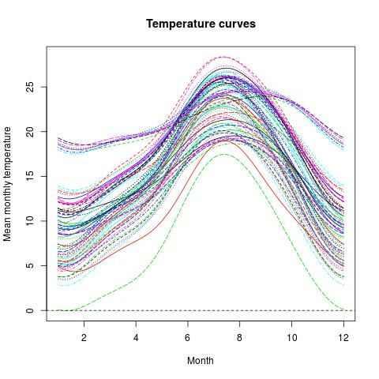{width="33%"}   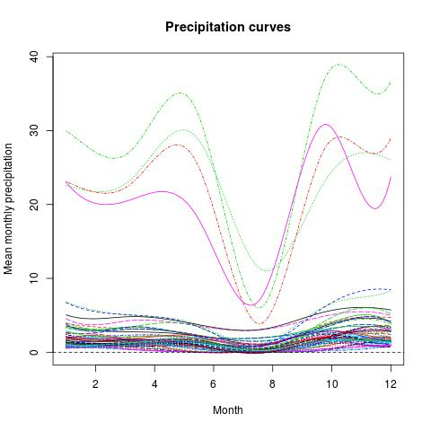{width="33%"}   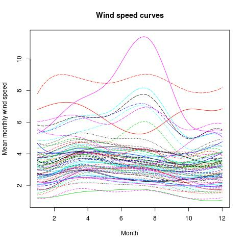{width="33%"}
  ------------------------------------------ ------------------------------------------ ------------------------------------------
:::

## Functional logit regression model

In order to understand how the functions of the
[logitFD](https://CRAN.R-project.org/package=logitFD) work, let
summarize the theoretical aspects of the models involved.

Let $Y$ be a binary response random variable and let
$\left\{ X_1\left( t\right),X_2\left( t\right),\ldots,X_R\left( t\right) :t\in T\right\}$
be a set of functional covariates related to $Y.$ Let
$x_{11}\left( t\right) ,\ldots ,x_{n1}\left( t\right),\ldots,x_{1R}\left( t\right) ,\ldots ,x_{nR}\left( t\right)$
be $R$ samples of curves of the functional predictors that can be
summarized by columns in a matrix of curves $$\left( 
\begin{array}{cccc}
x_{11}\left( t\right) & x_{12}\left( t\right) & \cdots & x_{1R}\left(
t\right) \\ 
x_{21}\left( t\right) & x_{22}\left( t\right) & \cdots & x_{2R}\left(
t\right) \\ 
\cdots & \cdots & \cdots & \cdots \\ 
x_{n1}\left( t\right) & x_{n2}\left( t\right) & \cdots & x_{nR}\left(
t\right).
\end{array}
\right) \label{PredictorsMatrix}$$ Let $y_{1},\ldots,y_{n}$ be a sample
of the binary response associated with the curves ($y_i \in \{0,1\}$),
then the functional logit model in terms of the functional predictors is
formulated as
$$y_{i}=\pi _{i}+\varepsilon _{i}=\pi \left( x_{i1}\left( t\right),\ldots,x_{iR}\left( t\right) \right)
+\varepsilon _{i} \Leftrightarrow \pi _{i}=\dfrac{\exp \left\{ l_i \right\} }{1+\exp \left\{ l_i\right\} },\;i=1,\ldots ,n,  \label{probfun}$$
where $\boldsymbol{\varepsilon} =\left( \varepsilon _{1},\ldots
,\varepsilon _{n}\right)
^{\prime}$ is the vector of independent centered random errors, with
unequal variances and Bernoulli distribution, and $l_i$ (known as logit
transformations) are modelized from functional predictors as
$$\begin{aligned}
l_{i}&=&\ln \left[ \dfrac{\pi _{i}}{1-\pi _{i}}\right] =\alpha
+\int_{T}x_{i1}\left( t\right) \beta_1 \left( t\right) dt+\int_{T}x_{i2}\left( t\right) \beta_2 \left( t\right) dt+\cdots+\int_{T}x_{iR}\left( t\right) \beta_R \left( t\right) dt.
\end{aligned}$$ This model has $R$ functional parameters to be estimated
$\beta_1 \left( t\right),\ldots,\beta_R \left( t\right).$ If we consider
that the curves of each functional predictor belong to a finite space
generated by a basis of functions as in
([\[BasisExpan\]](#BasisExpan){reference-type="ref"
reference="BasisExpan"}) and that the corresponding functional parameter
belongs to the same space (same basis for each pair
$(X_r(t),\beta_r(t)), \; r=1,\ldots,R$) $$\begin{aligned}
\beta_r\left( t\right) =\sum_{l=1}^{p_r }\beta_{rl} \phi _{rl}\left( t\right), \; r=1,\ldots,R,
\label{ParamFunBasis}
\end{aligned}$$ the functional logit model in terms of the logit
transformations is expressed in matrix form as $$\begin{aligned}
L&=& \mathbf{1}\alpha + A_1 \Psi_1 \beta_1 + A_2 \Psi_2 \beta_2 + \cdots + A_R \Psi_R \beta_R,
\end{aligned}$$ where

-   $L=\left( l_{1},\ldots ,l_{n}\right) ^{\prime }$ is the vector of
    logit transformations.

-   $\left( \mathbf{1}\;|\;A_1\Psi_1\;|\;A_2\Psi_2\;| \cdots |\;A_R\Psi_R \right)$
    is the design matrix, and $|$ indicating the separation between the
    boxes of the matrix.

-   $\mathbf{1}=\left( 1,\ldots ,1\right) ^{\prime }$ is a $n-$length
    vector of ones.

-   $\Psi_r=(\psi_{jkr}),\; r=1,\ldots,R$ is the matrix whose entries
    are the inner products between basis functions of the space where
    curves belong to $$\begin{aligned}
    \psi_{jkr}=<\phi_{jr}(t),\phi_{kr}(t)>=\int_T \phi_{jr}(t)\phi_{kr}(t)dt, \; j,k=1,\ldots,p_r; \; r=1,\ldots,R.
    \label{inprod}
    \end{aligned}$$

-   $A_r,\; r=1,\ldots,R$ is the matrix of basis coefficients as rows of
    sample curves of the space where curves belong to.

-   $\beta_r =\left( \beta_{r1},\ldots ,\beta_{rp_r}\right)^{\prime },\; r=1,\ldots,R$
    are the basis coefficients of the functional parameter
    $\beta_r(t),\; r=1,\ldots,R$.

Let us observe that each functional predictor (and functional parameter)
can be expressed in terms of a different type of basis and different
number of basis functions.

This functional logit model provides severe multicollinearity problems
as was stated in [@Escabias04] for the case of a single functional
predictor that was the original formulation of the model.

## Extended functional logit model: several functional and nonfunctional predictors

We can finally formulate the functional logit model in terms of more
than one functional predictor and non-functional ones. So let $Y$ be a
binary response variable and let
$\left\{X_1\left( t\right),X_2\left( t\right),\ldots,X_R\left( t\right): t\in T\right\}$
be a set of functional covariates related to $Y$ and
$U_1,U_2,\ldots,U_S$ a set of non-functional predictors. Let us consider
the sample of curves
([\[PredictorsMatrix\]](#PredictorsMatrix){reference-type="ref"
reference="PredictorsMatrix"}) and $$\left( 
\begin{array}{cccc}
u_{11} & u_{12} & \cdots & u_{1S} \\ 
u_{21} & u_{22} & \cdots & u_{2S} \\ 
\cdots & \cdots & \cdots & \cdots \\ 
u_{n1} & u_{n2} & \cdots & u_{nS}
\end{array}
\right),$$ the sample of observations of nonfunctional predictors. Let
$y_{1},\ldots,y_{n}$ be a sample of the response associated with the
curves. Then the model is expressed in terms of logit transformations as
$$\begin{aligned}
l_i =\alpha
+\int_{T}x_{i1}\left( t\right) \beta_1 \left( t\right) dt+\cdots+\int_{T}x_{iR}\left( t\right) \beta_R \left( t\right) dt + u_{i1} \delta_1+\cdots+u_{iS} \delta_S,\; i=1,\ldots ,n.
\label{pclogitfun2}
\end{aligned}$$ Now the model has $R$ functional parameters to estimate
$\beta_1\left( t\right),\ldots,\beta_R \left( t\right)$ and $S$
nonfunctional parameters $\delta_1,\ldots,\delta_S.$ As in the previous
case, each functional predictor and functional parameter can be
expressed in terms of a different type of basis and different number of
basis functions as in
([\[BasisExpan\]](#BasisExpan){reference-type="ref"
reference="BasisExpan"}) and
([\[ParamFunBasis\]](#ParamFunBasis){reference-type="ref"
reference="ParamFunBasis"}). We consider again the same basis for each
pair $(X_r(t),\beta_r(t)), \; r=1,\ldots,R.$ The functional logit model
in terms of the logit transformations is expressed in matrix form as
$$\begin{aligned}
L&=& \mathbf{1}\alpha + A_1 \Psi_1 \beta_1 + A_2 \Psi_2 \beta_2 + \cdots + A_R \Psi_R \beta_R+U_1 \delta_1+\cdots+U_S \delta_S.
\end{aligned}$$ This model has as only difference with respect the
previous one the design matrix of the model
$\left( \mathbf{1}\;|\;A_1\Psi_1\;|\;A_2\Psi_2\;| \cdots |\;A_R\Psi_R \;| U_1 | \cdots | U_S \right),$
where $U_1,\ldots,U_S$ represent the columns of observations of the
nonfunctional predictors, and a set of scalar parameters
$\delta_1,\ldots,\delta_S.$ As in the previous case, this model has
multicollinearity problems.

# Ordinary functional principal components logit regression

The proposed solution to solve the multicollinearity problems in
[@Escabias04] for the single model (only one functional predictor) was
to use as predictors a set of functional principal components. Let us
briefly remember the functional principal component analysis principles.

Let $x_{1}\left( t\right) ,\ldots ,x_{n}\left( t\right)$ be a set of
curves with mean curve and covariance surface respectively
$$\overline{x}\left( t\right) =\dfrac{1}{n}\sum_{i=1}^{n}x_{i}\left( t\right), \; C\left( s,t\right) =\dfrac{1}{n-1}\sum_{i=1}^{n}\left( x_{i}\left(
s\right) -\overline{x}\left( s\right) \right) \left( x_{i}\left( t\right) -%
\overline{x}\left( t\right) \right).$$ Functional principal components
are defined as
$$\xi _{ij}=\int_{T}\left(x_{i}\left( t\right)-\overline{x}\left( t\right) \right) f_j\left( t\right) dt, \; f_{j}\left( t\right) =\sum_{k=1}^{p}F_{jk}\phi _{k}\left( t\right), \;  j=1,\ldots,p; \; i=1,\ldots,n.$$
In this formulation it is assumed that curves are expressed as in
([\[BasisExpan\]](#BasisExpan){reference-type="ref"
reference="BasisExpan"}), and, as a consequence, the eigenfunctions
$f_j(t),$ that define the functional principal components, are also
basis expansion expressed, being the basis coefficients $F_j$ the
eigenvectors of $A\Psi^{1/2}$ matrix (see [@Ocana2007]). For a more
general and detailed situation see [@Ramsay05]. The original curves can
be expressed in terms of the functional principal components as
$$x_{i}\left( t\right) =\overline{x}(t)+\sum_{j=1}^{p }\xi _{ij}f_{j}\left( t\right)=\overline{x}(t)+\sum_{j=1}^{p } \sum_{k=1}^{p} \xi _{ij} F_{jk}\phi _{k}\left( t\right),\;i=1,\ldots ,n.$$
If a reduced set of functional principal components is considered, the
original curves can be approximated by
$$x_{i}\left( t\right) \simeq \overline{x}(t) + \sum_{j=1}^{q<p }\xi _{ij}f_{j}\left( t\right)=\overline{x}(t)+\sum_{j=1}^{q<p } \sum_{k=1}^{p} \xi _{ij} F_{jk}\phi _{k}\left( t\right),\;i=1,\ldots ,n \label{FPCA}$$
The quality of this approximation will depend on the percentage of
explained variability that acumulates the first $q$ functional principal
components, given by
$$\dfrac{\sum_{j=1}^q \lambda_j}{\sum_{j=1}^p \lambda_j}.$$

The ordinary functional principal components logit regression solution
to solve the multicollinearity problems of the functional logistic
regression model consists of considering a functional principal
component expansion of each sample curve for each functional predictor
and turning the functional model into a multivariate one whose
covariates are the considered functional principal components. The
number of principal components required can be different in each
functional predictor, but the same for all curves of a specific
functional predictor.

In order to get an estimation of the functional parameter for the case
of a single functional covariate, by considering the principal component
expansion of curves, the logit model adopts the following expression
$$\begin{aligned}
l_{i}&=&\alpha +\int_{T} \left(\overline{x}(t) + \sum_{j=1}^{p }\xi _{ij}f_{j}\left( t\right) \right)  \beta \left( t\right)dt
=\alpha
+\int_{T} \overline{x}(t) \beta \left( t\right)dt + \sum_{j=1}^{p }\xi _{ij} \int_{T} f_{j}\left( t\right) \beta \left( t\right)dt, \\
&=&\gamma_0+\sum_{j=1}^{p }\xi _{ij} \gamma_j,\;i=1,\ldots ,n.
\end{aligned}$$ These expressions enables to express the basis
coefficients of the functional parameter and the intercept parameter of
the logit model in terms of the parameters estimated from the functional
principal components of the curves. $$\begin{aligned}
\alpha &=& \gamma_0 - \int_{T} \overline{x}(t) \beta \left( t\right)dt = \alpha +(\overline{a}_1,\ldots,\overline{a}_p) \Psi (\beta_1,\ldots\beta_p)^{\prime}, \label{Intercept} \\
(\beta_1,\ldots,\beta_p)^{\prime} &=& \Psi F (\gamma_1,\ldots, \gamma_p)^{\prime}
\label{pclogitfun}
\end{aligned}$$ with $\Psi=\left(\psi _{jk}\right)$ being the inner
products between the basis functions (as in
([\[inprod\]](#inprod){reference-type="ref" reference="inprod"})) and
$F$ the orthogonal matrix of basis coefficients of principal component
curves shown in ([\[FPCA\]](#FPCA){reference-type="ref"
reference="FPCA"}).

If we consider the principal component expansion of curves in terms of a
reduced set of functional principal components we can get an estimation
of the basis coefficients of the functional parameter whose accuracy
depends on the accumulated variability of the selected principal
components (see [@Escabias04]).

So, if we denote by $\Gamma_1,\Gamma_2,\ldots,\Gamma_R$ the ordinary
functional principal components matrices of the sample curves associated
with the functional predictors
$\left\{ X_1\left( t\right),X_2\left( t\right),\ldots,X_R\left( t\right) :t\in T\right\},$
respectively, the functional principal component logit model in terms of
the logit transformations is expressed in matrix form as
$$\begin{aligned}
L&=& \mathbf{1}\alpha + \Gamma_1 \gamma_1 + \Gamma_2 \gamma_2 + \cdots + \Gamma_R \gamma_R+U_1 \delta_1+\cdots+U_S \delta_S,
\end{aligned}$$ where
$\left( \mathbf{1}\;|\;\Gamma_1\;|\;\Gamma_2\;| \cdots |\;\Gamma_R \right|U_1 | \cdots |U_S )$
is the design matrix in terms of ordinary functional principal
components,
$\gamma_r =\left( \gamma_{r1},\ldots ,\gamma_{rp_r}\right)^{\prime }$
are the coefficients of the multiple model associated to the
corresponding functional principal components and
$\left( \delta_{1},\ldots ,\delta_{s}\right)^{\prime }$ the scalar
parameters associated to non-functional variables. By using a reduced
set of $q_1,q_2,\ldots,q_R$ functional principal components, being the
scores matrix denoted as
$\Gamma_{1(q_1)},\Gamma_{2(q_2)},\ldots,\Gamma_{R(q_R)},$ respectively,
the model is then expressed as $$\begin{aligned}
L&=& \mathbf{1}\alpha + \Gamma_{1(q_1)} \gamma_1 + \Gamma_{2(q_2)} \gamma_2 + \cdots + \Gamma_{R(q_R)} \gamma_R +U_1 \delta_1+\cdots+U_S \delta_S.
\end{aligned}$$

Basis coefficients for each functional parameter are then obtained by
formula ([\[pclogitfun\]](#pclogitfun){reference-type="ref"
reference="pclogitfun"}) from their corresponding $\gamma$ parameter and
the intercept $\alpha$ by formula
([\[Intercept\]](#Intercept){reference-type="ref"
reference="Intercept"}).

logitFD.pc is the function from
[logitFD](https://CRAN.R-project.org/package=logitFD) package that fits
the ordinary functional principal component logit regression model. The
declaration of the function has this form:

::: center
logitFD.pc(Response, FDobj=list(), ncomp=c(), nonFDvars=NULL),
:::

and the function arguments are the following:

-   Response: vector of responses $y_{1},\ldots ,y_{n}.$

-   FDobj: list of the different functional objects ( fdobj) to use from
    the fd package. Theoretically $x_1(t),\ldots,x_R(t).$

-   ncomp: vector with the number of functional principal components $q$
    to use in the model for each functional predictor. The length of the
    vector must be equal to the length of the FDobj list. The first
    element of the vector corresponds with the number of functional
    principal components of the first functional predictor (columns of
    $\Gamma_1$), the second with the columns of $\Gamma_2$, $\ldots$,
    the $R$th with the columns of $\Gamma_R.$

-   nonFDvars: data frame with the observations of the scalar predictor
    variables, that is, with columns $U_1\ldots,U_S.$ Let us observe
    that the number of rows of this data frame must be the same as the
    length of the response vector. Likewise, the number of functions in
    each functional object must be the same for all functional objects.

In order to illustrate the performance of the function, let us consider
StationsVar\$North as a binary response variable, TempMonth and
PrecMonth as functional predictors, and StationsVar\[,c( \"altitude\",
\"longitude\")\] as scalar predictor variables. We are going to consider
the first 3 and 4 functional principal components of TempMonth and
PrecMonth respectively.

Our fit is obtained as

    Fit1 <- logitFD.pc(Response=StationsVars$North,FDobj=list(TempMonth.fd,PrecMonth.fd),
    ncomp = c(3,4),nonFDvars = StationsVars[,c("altitude","longitude")])

The output of the function is an R list with objects: glm.fit,
Intercept, betalist, PC.variance and ROC.curve. These elements are
explained next.

####  glm.fit object of Fit1:

Object of class inherited from \"glm\". This object contains details
about the fit of the multiple logit model to explain the binary response
from the selected functional principal components and the scalar
variables. This output allows to use different R functions as summary()
function to obtain or print a summary of the fit, or anova() function to
produce an analysis of variance table, and to extract various useful
features of the values returned by \"glm\" as *coefficients*, *effects*,
*fitted.values* or *residuals* (see R help). In our example the summary
of the fit can be seen on page (). Let us observe that the package
assigns the names A.1, A.2 and A.3 and B.1, B.2, B.3 and B.3 to the
first 3 and 4 functional principal components of the functional
covariates. From this object it would easily be able to make an analysis
of residuals, with residuals() function, or fitted values, with
fitted.values() function, testing goodness of fit, etc. A classical
goodness of fit measure is the correct classification rate (CCR) from
the classification table. In our example both elements can be easily
obtained through these sentences
table(StationsVars\$North,round(predict(Fit1\$glm.fit, type =
\"response\"))) and 100\*sum(diag(table(StationsVars\$North,
round(predict(Fit1\$glm.fit, type =
\"response\")))))/nrow(StationsVars). From the results we can conclude
that if we want to model the weather stations location from the temporal
evolution of temperatures and precipitation and from altitude and
longitude variables, we classify correctly 94.5% of stations.

####  Intercept object of Fit1:

The $\alpha$ (intercept) estimated parameter through expression
([\[Intercept\]](#Intercept){reference-type="ref"
reference="Intercept"}) is given in the object Fit1\$Intercept.

####  betalist object of Fit1:

A list of functional objects. Each element of the list contains the
functional parameter corresponding to the associated functional
predictor variable located in the same position of FDobj parameter that
appears in the function. In our case, firsty temperature curves where
introduced, and precipitation curves were added in second place. Then
the first two elements of betalist, that is, \[\[1\]\] and \[\[2\]\]
will be the functional parameters associated with temperature and
precipitation curves respectively. If we use more functional data,
\[\[3\]\], \[\[4\]\],\... provide the corresponding functional
parameters. Let us remember that as fdobj, its elements are coefs: the
matrix (vector in this case) of basis coefficients, basis: the same
basis used in FDobj object and the rest elements as fdnames. Besides,
multiple functions from fd package can be used such as the plot()
function, used here as plot(Fit1\$betalist\[\[1\]\]) and
plot(Fit1\$betalist\[\[2\]\]) for the parameter functions associated to
Temperature and Precipitation curves respectively. The plots that
generate these sentences can be seen in Figure
[\[Fit1\]](#Fit1){reference-type="ref" reference="Fit1"}. We could also
evaluate these functions in a grid with the function eval.fd(), for
example in the observed months-time, we could obtain the values on page
().

####  PC.variance object of Fit1:

A list of *data.frames* with explained variability of functional
principal components. Each element of the list contains the cumulative
variance matrix corresponding to the associated functional variable in
the same position. In our case, the first input curves were temperature
curves and the second ones, the precipitation curves. In this point, the
first element \[\[1\]\] of PC.variance will be the matrix of explained
variability of functional principal components associated with
temperature curves whereas the second element \[\[2\]\] of the
PC.variance will be the matrix of explained variability of principal
components associated with precipitation curves as with betalist. If we
use more functional data \[\[3\]\], \[\[4\]\],\... the function provides
the corresponding explained variability matrices. The output got in
PC.variance list is on page (). We can observe that the first two
functional principal component of temperature and precipitation
accumulate 99.4% and 99.1% of the total variability respectively, so
that the selection of 3 components for temperature and 4 for
precipitation are enough for a good representation of the curves.

####  ROC.curve object of Fit1:

an object of the roc() function from
[pROC](https://CRAN.R-project.org/package=pROC) package whose mission is
to test the prediction ability of the model. This function builds a ROC
curve and returns a roc object, i.e. a list of class roc. This object
can be printed, plotted, or passed to many other functions (see
reference manual). As default this element returns the area under the
ROC curve with the object Fit1\$ROC. The plot of the ROC curve with
sentence plot(Fit1\$ROC) can be seen in Figure
[\[Fit1\]](#Fit1){reference-type="ref" reference="Fit1"}. As it was
stated from the correct classification rate, the ROC curve and its graph
allows us to observe that the fit is accurate for this modeling.

::: center
  ------------------------------------------------- ------------------------------------------------- -------------------------------------------
   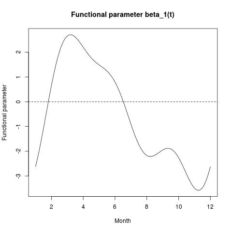{width="33%"}   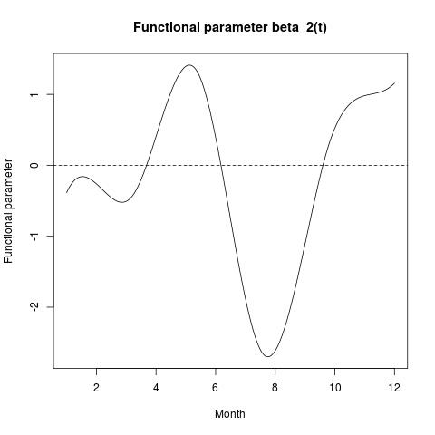{width="33%"}   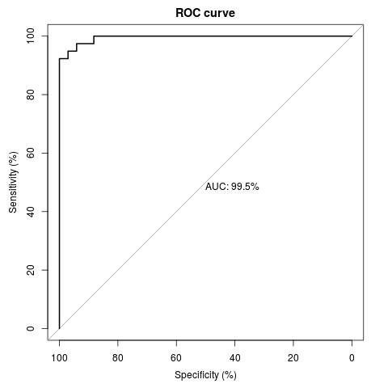{width="33%"}
                 $\hat{\beta}_1(t)$                                $\hat{\beta}_2(t)$                                  ROC curve
  ------------------------------------------------- ------------------------------------------------- -------------------------------------------
:::

# Filtered functional principal components included in the model according to their explained variability

Alternatively to ordinary functional principal component logit
regression, [@Escabias2014] discussed a different approach based on
equivalences proved by [@Ocana2007] and [@Ocana1999] between different
functional principal component analysis. These equivalences stated that
given $x_{1}\left( t\right) ,\ldots ,x_{n}\left( t\right)$ a set of
curves, the functional principal component analysis of the transformed
curves $L(x_1(t)),\ldots,L(x_n(t))$ defined by
$L(x_i(t))=\sum_{j=1}^p a_{ij}^{\ast} \phi_j(t),$ being
$(a_{i1}^{\ast},\ldots,a_{ip}^{\ast})^{\prime}=\Psi^{1/2} (a_{i1},\ldots,a_{ip})^{\prime},$
is equivalent to multivariate PCA of the design matrix $A\Psi$
associated with the functional logit model. In this expansion, the
principal component curves $f_{j}^{\ast}\left( t\right)$ are expressed
in terms of the basis functions as
$$f_{j}^{\ast}\left( t\right) =\sum_{k=1}^{p}F_{jk}^{\ast}\phi _{k}\left( t\right), \;
j=1,\ldots,p,$$ where basis coefficients in matrix form are obtained as
$F^{\ast}=\Psi^{-1/2}V,$ being $V$ the eigenvectors of the covariance
matrix of $A\Psi.$

The original curves can be also approximated
$$L(x_{i}\left( t\right)) =L(\overline{x}(t))+\sum_{j=1}^{p }\xi_{ij}^{\ast}f_{j}^{\ast}\left( t\right),\;i=1,\ldots ,n,$$
where $\xi_{ij}^{\ast}$ are the functional principal components scores
of the transformed curves $L(x_1(t)),\ldots,L(x_n(t)).$

Now again the original curves can be approximated by using a reduced set
of these functional principal components
$$L(x_{i}\left( t\right)) \simeq L(\overline{x}(t)) + \sum_{j=1}^{q<p }\xi_{ij}^{\ast}f_{j}^{\ast}\left( t\right),\;i=1,\ldots ,n.$$

In order to avoid multicollinearity in functional logit model an
alternative is to use filtered principal components (see [@Escabias04]).
So let $x_{1}\left( t\right) ,\ldots ,x_{n}\left( t\right)$ be a set of
curves with mean curve $\overline{x}\left( t\right)$ and
$y_{1},\ldots,y_{n}$ the response associated observations. Let
$\Gamma^{\ast}=(\xi_{ij}^{\ast})$ be the $n \times p$ matrix of
functional principal components, and
$f_1^{\ast}(t),\ldots,f_p^{\ast}(t)$ the principal component curves. The
filtered functional principal component logit regression can be
expressed $$\begin{aligned}
l_{i}&=&\alpha +\int_{T} \left(\overline{x}(t) + \sum_{j=1}^{p }\xi_{ij}^{\ast}f_{j}^{\ast}\left( t\right) \right)  \beta \left( t\right)dt
=\alpha
+\int_{T} \overline{x}(t) \beta \left( t\right)dt + \sum_{j=1}^{p }\xi_{ij}^{\ast} \int_{T} f_{j}^{\ast}\left( t\right) \beta \left( t\right)dt, \\
&=&\gamma_0^{\ast}+\sum_{j=1}^{p }\xi_{ij}^{\ast} \gamma_j^{\ast},\;i=1,\ldots ,n.
\end{aligned}$$ This expression also allows expressing the basis
coefficients of the functional parameter and the intercept parameter of
the logit model alternatively in terms of the parameters estimated from
the filtered functional principal components of the curves equivalently
to ([\[pclogitfun\]](#pclogitfun){reference-type="ref"
reference="pclogitfun"}) and
([\[Intercept\]](#Intercept){reference-type="ref"
reference="Intercept"}) respectively: $$\begin{aligned}
\alpha &=& \gamma_0^{\ast} - \int_{T} \overline{x}(t) \beta \left( t\right)dt = \alpha +(\overline{a}_1,\ldots,\overline{a}_p) \Psi (\beta_1,\ldots\beta_p)^{\prime}, \\
(\beta_1,\ldots,\beta_p)^{\prime} &=& \Psi F^{\ast} (\gamma_1^{\ast},\ldots, \gamma_p^{\ast})^{\prime},
\label{filteredPCA}
\end{aligned}$$ due to $F^{\ast}$ and $\Psi$ matrices are orthogonal and
$\Psi$ is also a symmetric matrix.

If we consider a principal component expansion of curves in terms of a
reduced set of filtered functional principal components we can get an
estimation of the basis coefficients of the functional parameter whose
accuracy depends of the accumulated variability of the selected
principal components (see [@Escabias04]).

So, if we denote by
$\Gamma_1^{\ast},\Gamma_2^{\ast},\ldots,\Gamma_R^{\ast}$ the matrices of
filtered functional principal components of the sample curves of the
functional predictors
$\left\{ X_1\left( t\right),X_2\left( t\right),\ldots,X_R\left( t\right) :t\in T\right\}$
respectively, the functional principal component logit model in terms of
the logit transformations is expressed in matrix form as
$$\begin{aligned}
L&=& \mathbf{1}\alpha + \Gamma_1^{\ast} \gamma_1^{\ast} + \Gamma_2^{\ast} \gamma_2^{\ast} + \cdots + \Gamma_R^{\ast} \gamma_R^{\ast}+U_1 \delta_1+\cdots+U_S \delta_S,
\end{aligned}$$ where
$\left( \mathbf{1}\;|\;\Gamma_1^{\ast}\;|\;\Gamma_2^{\ast}\;| \cdots |\;\Gamma_R^{\ast} \right|U_1 | \cdots |U_S )$
is the design matrix in terms of ordinary functional principal
components,
$\gamma_r^{\ast} =\left( \gamma_{r1}^{\ast},\ldots ,\gamma_{rp_r}^{\ast}\right)^{\prime }$
are the coefficients of the multiple model associated to the
corresponding filtered functional principal components and
$\left( \delta_{1},\ldots ,\delta_{s}\right)^{\prime }$ the scalar
parameters associated to non-functional variables. By using a reduced
set of $q_1,q_2,\ldots,q_R$ filtered functional principal components
$\Gamma_{1(q_1)}^{\ast},\Gamma_{2(q_2)}^{\ast},\ldots,\Gamma_{R(q_R)}^{\ast},$
respectively, the model is then expressed as $$\begin{aligned}
L&=& \mathbf{1}\alpha + \Gamma_{1(q_1)}^{\ast} \gamma_1^{\ast} + \Gamma_{2(q_2)}^{\ast} \gamma_2^{\ast} + \cdots + \Gamma_{R(q_R)}^{\ast} \gamma_R^{\ast} +U_1 \delta_1+\cdots+U_S \delta_S.
\end{aligned}$$

Basis coefficients for each functional parameter are then obtained by
formula ([\[pclogitfun\]](#pclogitfun){reference-type="ref"
reference="pclogitfun"}) from their corresponding $\gamma^{\ast}$
parameters and the Intercept $\alpha^{\ast}$ by formula
([\[Intercept\]](#Intercept){reference-type="ref"
reference="Intercept"}).

The function of the logitFD package that allows fitting the filtered
functional principal components logit regression model is logitFD.fpc.
The performance of the function is the same as the logitFD.pc function.

In order to illustrate the performance of the functions, let us again
consider StationsVar\$North as binary response variable, TempMonth and
PrecMonth as functional predictors, and as scalar predictor variables
StationsVar\[,c(\"altitude\",\"longitude\")\]. We are going to consider
the first 3 and 4 functional principal components of TempMonth and
PrecMonth, respectively.

Our fit is obtained as

    Fit2 <- logitFD.fpc(Response=StationsVars$North,FDobj=list(TempMonth.fd,PrecMonth.fd),
    ncomp = c(3,4),nonFDvars = StationsVars[,c("altitude","longitude")])

The output of this function is an R list with the same elements that
were explained in the previous section. Next, the results of the fit are
shown.

####  glm.fit object of Fit2:

explained in the previous section, its results can be seen next to the
ones obtained for Fit1

    -----------------------------------------------------
    summary(Fit1$glm.fit)

    Call:
    glm(formula = design, family = binomial)

    Deviance Residuals: 
         Min        1Q    Median        3Q       Max  
    -1.77059  -0.01185   0.00000   0.01309   2.02115  

    Coefficients:
                Estimate Std. Error z value Pr(>|z|)  
    (Intercept) 15.10398    8.80373   1.716   0.0862 .
    A.1         -1.94776    1.05278  -1.850   0.0643 .
    A.2         -0.19686    0.58414  -0.337   0.7361  
    A.3         -6.69297    3.49893  -1.913   0.0558 .
    B.1          0.41633    0.78514   0.530   0.5959  
    B.2          0.51503    6.42736   0.080   0.9361  
    B.3         -3.11044    3.06542  -1.015   0.3103  
    B.4         -2.44083    5.69108  -0.429   0.6680  
    altitude    -0.02846    0.01576  -1.806   0.0709 .
    longitude    1.40203    0.85922   1.632   0.1027  
    ---
    (Dispersion parameter for binomial family taken to be 1)

        Null deviance: 100.857  on 72  degrees of freedom
    Residual deviance:  14.785  on 63  degrees of freedom
    AIC: 34.785

    Number of Fisher Scoring iterations: 15
    ------------------------------------------------------

    ------------------------------------------------------
    summary(Fit2$glm.fit)

    Call:
    glm(formula = design, family = binomial)

    Deviance Residuals: 
           Min          1Q      Median          3Q         Max  
    -2.671e-04  -2.100e-08   2.100e-08   2.100e-08   2.939e-04  

    Coefficients:
                  Estimate Std. Error z value Pr(>|z|)
    (Intercept)    598.163  75918.975   0.008    0.994
    A.1            -99.485  11468.867  -0.009    0.993
    A.2            -13.281  10608.315  -0.001    0.999
    A.3           -264.950  45230.675  -0.006    0.995
    B.1             26.123   7055.585   0.004    0.997
    B.2            174.667  31244.941   0.006    0.996
    B.3            318.127  79802.859   0.004    0.997
    B.4           -828.247 233825.008  -0.004    0.997
    altitude        -1.251    142.820  -0.009    0.993
    longitude       50.865   7090.131   0.007    0.994
    ---
    (Dispersion parameter for binomial family taken to be 1)

        Null deviance: 1.0086e+02  on 72  degrees of freedom
    Residual deviance: 2.2821e-07  on 63  degrees of freedom
    AIC: 20

    Number of Fisher Scoring iterations: 25
    ------------------------------------------------------

[]{#glmsummary label="glmsummary"}

#### Classification table of Fit2:

obtained as explained for Fit1, we can observe that the filtered
functional principal components provide a better fit with CCR of 100% in
spite a less accurate estimation of parameters due to the high standard
error of coefficients estimation. This fact was observed and stated in
[@Aguilera2008151] for example.

####  Intercept object of Fit2:

provides the same result seen in the Fit1 case.

####  betalist object of Fit2:

The functional parameters obtained by this fit can be seen in Figure
[\[Fit2\]](#Fit2){reference-type="ref" reference="Fit2"}. We can observe
the great similarity of the functional parameters form provided by the
fit in terms of ordinary functional principal components and in terms of
filtered functional principal components. The evaluation of these
functions in the observed months-time, appears next with the ones
obtained for Fit1:

    Fit1
    --------------------------------
       Months      Beta1      Beta2
    1     Jan -2.6186728 -0.3861178
    2     Feb  0.6541213 -0.2615488
    3     Mar  2.6530440 -0.5074478
    4     Apr  2.2007300  0.4053187
    5     May  1.4871676  1.3946294
    6     Jun  0.7918409  0.3944050
    7     Jul -0.9034488 -1.8776571
    8     Aug -2.1700722 -2.6123256
    9     Sep -1.9520934 -1.1094367
    10    Oct -2.2614869  0.5243271
    11    Nov -3.4888495  0.9816193
    12    Dec -2.6186728  1.1577407
    --------------------------------

    Fit2
    --------------------------------
       Months      Beta1      Beta2
    1     Jan -114.45858 -208.85221
    2     Feb   16.52657 -295.08973
    3     Mar   97.13723 -142.07106
    4     Apr   80.32782   29.22866
    5     May   54.09383   91.48928
    6     Jun   29.28698  -28.35074
    7     Jul  -36.52664 -219.37744
    8     Aug  -87.77921 -234.26248
    9     Sep  -81.81846  -18.66271
    10    Oct  -97.27569  226.44071
    11    Nov -148.43166  303.70498
    12    Dec -114.45858   61.99109
    --------------------------------

[]{#BasisEval label="BasisEval"}

The code used for generating these results is data.frame(\"Months\" =
names(monthLetters), \"Beta1\" = eval.fd(c(1:12),
Fit1\$betalist\[\[1\]\]), \"Beta2\" = eval.fd(c(1:12),
Fit1\$betalist\[\[2\]\])) for the left-hand side and changing Fit1 by
Fit2 for the right-hand side.

####  PC.variance object of Fit2:

it can be observed that there are several differences in the dynamic of
variance accumulation between ordinary and filtered functional principal
component analysis.

    ----------------------------------
    Fit1$PC.variance
    [[1]]
      Comp. % Prop.Var % Cum.Prop.Var
    1   A.1       85.9           85.9
    2   A.2       13.5           99.4
    3   A.3        0.4           99.8
    4   A.4        0.1           99.9
    5   A.5        0.0           99.9
    6   A.6        0.0           99.9
    7   A.7        0.0           99.9
    [[2]]
      Comp. % Prop.Var % Cum.Prop.Var
    1   B.1       98.2           98.2
    2   B.2        0.9           99.1
    3   B.3        0.6           99.7
    4   B.4        0.3          100.0
    5   B.5        0.1          100.1
    6   B.6        0.0          100.1
    7   B.7        0.0          100.1
    8   B.8        0.0          100.1
    ----------------------------------

    ----------------------------------
    Fit2$PC.variance
    [[1]]
      Comp. % Prop.Var % Cum.Prop.Var
    1   A.1     85.888         85.888
    2   A.2     13.479         99.367
    3   A.3      0.440         99.807
    4   A.4      0.132         99.939
    5   A.5      0.034         99.973
    6   A.6      0.016         99.989
    7   A.7      0.010         99.999
    [[2]]
      Comp. % Prop.Var % Cum.Prop.Var
    1   B.1     99.070         99.070
    2   B.2      0.536         99.606
    3   B.3      0.311         99.917
    4   B.4      0.049         99.966
    5   B.5      0.031         99.997
    6   B.6      0.002         99.999
    7   B.7      0.000         99.999
    8   B.8      0.000         99.999
    ----------------------------------

[]{#VarAcum label="VarAcum"}

####  ROC.curve object of Fit2:

explained in the previous Section, the plot of the ROC curve appears
Figure [\[Fit2\]](#Fit2){reference-type="ref" reference="Fit2"}. This
graph and the area under the ROC curve (100%) show an improvement of the
prediction ability of the fit with filtered functional principal
components in comparison with ordinary functional principal components.

::: center
  ------------------------------------------------- ------------------------------------------------- -------------------------------------------
   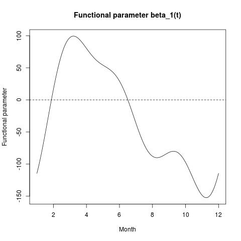{width="33%"}   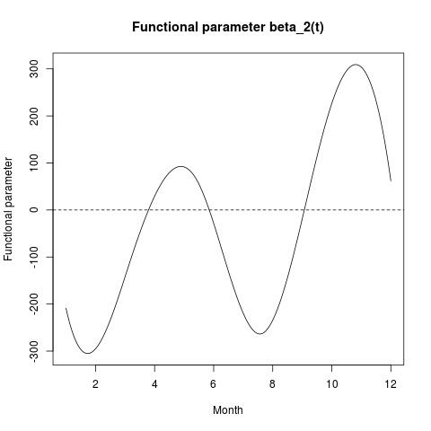{width="33%"}   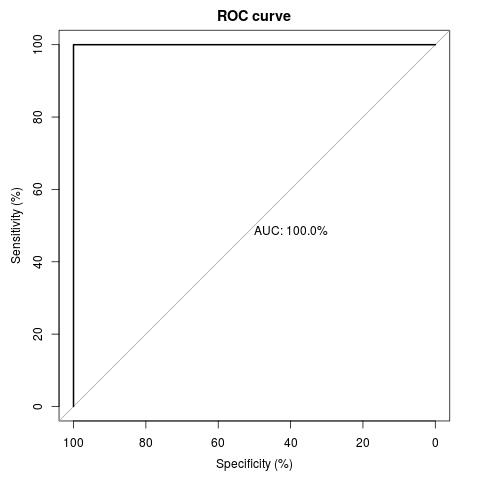{width="33%"}
  ------------------------------------------------- ------------------------------------------------- -------------------------------------------
:::

# Ordinary and filtered functional principal components included in the model according to their prediction ability (stepwise method)

[@Escabias04] proposed two alternative methods to include functional
principal components in the logit model for both FPCA types: ordinary or
filtered. On the one hand, functional principal components would be able
to be included in the model in the order given by their explained
variability. In that case the user should decide the number of
functional principal components to include in the model for getting an
accurate estimation of the functional parameter or for getting good
prediction ability for the response. On the other hand, an automatic
selection method of functional principal components could be used by a
stepwise method. In this case the prediction ability of functional
principal components would be the criterium to select the functional
principal components and data would be the responsible of the model fit
and prediction.

[logitFD](https://CRAN.R-project.org/package=logitFD) package contains
two functions to fit the functional logit model after a stepwise
selection procedure of functional principal components (ordinary and
filtered) and nonfunctional variables. The fits obtained by these
stepwise procedures are shown next.

    Fit3 <- logitFD.pc.step(Response=StationsVars$North,FDobj=list(TempMonth.fd,PrecMonth.fd),
    nonFDvars = StationsVars[,c("altitude","longitude")])
    Fit4 <- logitFD.fpc.step(Response=StationsVars$North,FDobj=list(TempMonth.fd,PrecMonth.fd),
    nonFDvars = StationsVars[,c("altitude","longitude")])

Let us observe that for these functions it is not necessary to use a
number of components parameter in the functions. We call Fit3 for
ordinary functional principal component analysis and Fit4 for filtered
functional principal component analysis.

The output of these function are R lists with the same elements as the
ones seen in Fit1 and Fit2. We only show and explain here some of the
results.

####  glm.fit objects of Fit3 and Fit4:

We can observe from these results that stepwise method selected three
functional principal components for Temperature and only one for
Precipitation. Regarding scalar predictors, the method selected the
altitude variable. Note that stepwise selection included the same
components for both approaches, although the values of their parameters
and standard errors are different. The classification ability of these
fits is 100% of correct classification rate and can be obtained by using
the same code shown fof Fit1 and Fit2.

    -------------------------------------------------------
    summary(Fit3$glm.fit)

    Call:
    glm(formula = Response ~ A.1 + altitude + A.7 + A.3 + B.5,
    family = binomial, data = design)

    Deviance Residuals: 
           Min          1Q      Median          3Q         Max  
    -3.677e-04  -2.000e-08   2.000e-08   2.000e-08   2.960e-04  

    Coefficients:
                  Estimate Std. Error z value Pr(>|z|)
    (Intercept)    936.784  71065.432   0.013    0.989
    A.1           -223.554  16658.601  -0.013    0.989
    altitude        -2.543    191.207  -0.013    0.989
    A.7           4016.721 300525.378   0.013    0.989
    A.3           -972.450  73148.168  -0.013    0.989
    B.5            308.717  23326.153   0.013    0.989

    (Dispersion parameter for binomial family taken to be 1)

        Null deviance: 1.0086e+02  on 72  degrees of freedom
    Residual deviance: 4.7820e-07  on 67  degrees of freedom
    AIC: 12

    Number of Fisher Scoring iterations: 25
    ------------------------------------------------------

    ------------------------------------------------------
    summary(Fit4$glm.fit)

    Call:
    glm(formula = Response ~ A.1 + altitude + A.7 + A.3 + B.5,
    family = binomial, data = design)

    Deviance Residuals: 
           Min          1Q      Median          3Q         Max  
    -6.974e-04  -2.000e-08   2.000e-08   2.000e-08   5.753e-04  

    Coefficients:
                  Estimate Std. Error z value Pr(>|z|)
    (Intercept)  1.938e+03  3.312e+05   0.006    0.995
    A.1         -3.899e+02  3.754e+04  -0.010    0.992
    altitude    -4.731e+00  6.218e+02  -0.008    0.994
    A.7          6.724e+03  1.132e+06   0.006    0.995
    A.3         -1.557e+03  8.121e+04  -0.019    0.985
    B.5          6.409e+02  6.659e+04   0.010    0.992

    (Dispersion parameter for binomial family taken to be 1)

        Null deviance: 1.0086e+02  on 72  degrees of freedom
    Residual deviance: 1.1402e-06  on 67  degrees of freedom
    AIC: 12

    Number of Fisher Scoring iterations: 25
    ------------------------------------------------------

####  betalist objects of Fit3 and Fit4:

The graphs of estimated functional parameters are shown in Figure
[\[Fit34\]](#Fit34){reference-type="ref" reference="Fit34"}. It can be
seen the similarity in the forms of the functional parameters, in spite
of the evaluation values are different as can be seen next:

::: center
    -----------------------------------------------------
       Months  Fit3.Beta1 Fit3.Beta2 Fit4.Beta1 Fit4.Beta2 
    1     Jan   693.10831  -63.47274  1172.6949  -24.28034
    2     Feb   -98.76707 -157.45404  -186.0346 -144.18907
    3     Mar  -229.11217 -122.61836  -423.5395 -199.28285
    4     Apr  1711.91853  -70.18329  2831.9461 -170.88030
    5     May  1152.29655  -24.62758  1904.3853  -76.25583
    6     Jun -1640.56224   26.48668 -2761.1827   49.39343
    7     Jul -1066.07148   66.45460 -1780.0473  143.75270
    8     Aug  1580.73125   57.60667  2663.1874  126.59096
    9     Sep   543.54551   24.31157   921.5509   29.89969
    10    Oct -2086.28319   71.63066 -3481.0951   31.57623
    11    Nov -1163.57269  171.95001 -1925.9015  198.33040
    12    Dec   693.10831  -10.48963  1172.6949  326.95671
    -----------------------------------------------------
:::

The code used for thsese evaluations was similar as the one shown for
Fit 1 and Fit 2: data.frame(\"Months\" = names(monthLetters),
\"Fit3.Beta1\" = eval.fd(c(1:12), Fit3\$betalist\[\[1\]\]),
\"Fit3.Beta2\" = eval.fd(c(1:12), Fit3\$betalist\[\[2\]\]),
\"Fit4.Beta1\" = eval.fd(c(1:12), Fit4\$betalist\[\[1\]\]), \"Fit4.
Beta2\" = eval.fd(c(1:12), Fit4\$betalist\[\[2\]\]))

####  PC.variance objects of Fit3 and Fit4:

The objects of variance accumulation of the different functional
principal components analysis do not change from the ones shown in
previous sections. We do not show them here, the reader can check these
equalities through the objects Fit3\$PC.variance and Fit4\$PC.variance.

####  ROC.curve objects of Fit3 and Fit4:

Roc objects with Roc areas provide an area under the roc curve of 100%
in each case. The plot of the ROC curves showing the good performance of
the fits can be seen in Figure [\[Fit34\]](#Fit34){reference-type="ref"
reference="Fit34"}.

::: center
  ------------------------------------------------- ------------------------------------------------- -------------------------------------------
   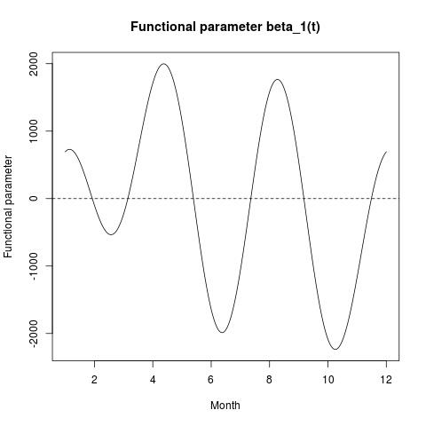{width="33%"}   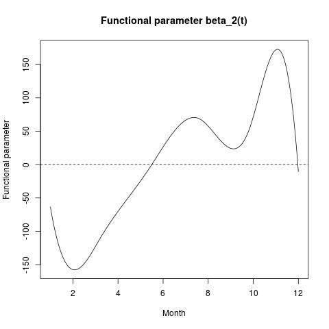{width="33%"}   {width="33%"}
          Ordinary FCPA and stepwise order                                                            
   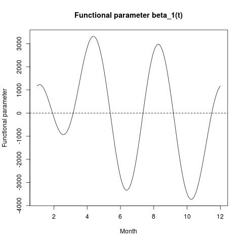{width="33%"}   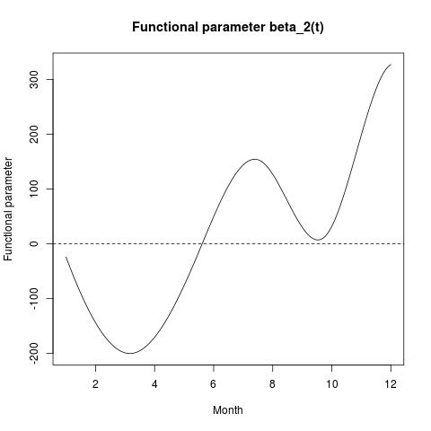{width="33%"}   {width="33%"}
          Filtered FCPA and stepwise order                                                            
  ------------------------------------------------- ------------------------------------------------- -------------------------------------------
:::

# Conclusions

In this work the functions of the
[logitFD](https://CRAN.R-project.org/package=logitFD) package have been
shown for fitting an extended functional principal components logistic
regression model. The package provides two alternative solutions
(ordinary and filtered FPCA) for the multicollinearity problem that
arises when the functional predictors and the parameter functions are
assumed to belong to the same finite dimensional space generated by a
basis of functions. The dimension of the basis can be different in each
functional variable in the model. Likewise, for each of the proposed
solutions, two ways of choosing the functional principal components are
provided: on the one hand, the users must manually choice the adequate
number of components to be included in the model in order of
variability, i.e., the first $q$ principal components that overcome a
certain variability percentage; on the other hand in the automatic order
provided by the stepwise method, that is, according to predictive
ability of principal components and non-functional variables.

The illustration of the use of the package's functionalities has been
carried out using a set of functional and non-functional data, included
in the [fda.usc](https://CRAN.R-project.org/package=fda.usc) package. In
particular, weather functional variables observed in 73 Spanish weather
stations, such as the mean monthly evolution of temperatures and
rainfall, and non-functional as the spatial location of the weather
stations in the Spanish territory are considered throughout the current
manuscript.

The conclusions we have reached after the fits can be summarized in that
the variables that best describe the North-South location of the
meteorological stations are the mean monthly precipitation and
temperature (through their first, third and seventh principal components
for temperature and fifth for rainfall) and the own altitude of the
weather stations. All the models provide good predictive ability, with
the solutions based on ordinary and filtering FPCA by stepwise selection
being the best (100 % CCR) due to their balance between reduced
dimension and predictive ability. Likewise, the filtered FPCA solution
including the components in order of variability provides results
equally good to the previous ones but with more variables. The ordinary
FPCA-based solution including the components in order of variability
provides results similar to those previously described.

As was stated in the Introduction section, the fregre.glm function of
the [fda.usc](https://CRAN.R-project.org/package=fda.usc) package aim to
achieve the same goal as the functions included in
[logitFD](https://CRAN.R-project.org/package=logitFD) package, but
through different point of view: fregre.glm use a discrete based
methodology of functional data and
[logitFD](https://CRAN.R-project.org/package=logitFD) functions use a
purely functional approach using fd objects from the
[fda](https://CRAN.R-project.org/package=fda) package. This approach
makes the functional models of scalar response to suffer of
multicollinearity problems with the inaccurate estimation of the
functional parameters as a consequence (see [@Escabias04]). Two
solutions based on functional PCA are implemented in
[logitFD](https://CRAN.R-project.org/package=logitFD) package: (1)
classic functional PCA and (2) filtered functional PCA. Each of PCA
methods have been revealed to be useful in a different aspect: the first
allow a lower estimation error of the basic coefficients of the
functional parameters, while the second allow a lower estimation error
of the proper curve, in terms of mean integrated quadratic error (see
[@Escabias04]). Moreover the literature has also shown for methods
involving principal components, that sometimes principal components with
low variability explanation can be good predictors of the response, so a
stepwise selection method of functional principal components has been
included. So the main difference among
[logitFD](https://CRAN.R-project.org/package=logitFD) functions and
fregre.glm is that all the mentioned issues are addressed in the
[logitFD](https://CRAN.R-project.org/package=logitFD) package and solved
in a fast and transparent way and they are not taken into account in
fregre.glm. Finally it is important to point out that the output of the
functional elements of the
[logitFD](https://CRAN.R-project.org/package=logitFD) functions (as the
functional parameters) are also fd objects and therefore all the
functions of the [fda](https://CRAN.R-project.org/package=fda) package
could be used with them for plotting, evaluating, etc.

In short, logitFD package provides its users with the possibilities to
deal with the functional logit regression model from basis expansion
methodology of sample curves and solving in a fast and transparent way,
the problems that arise through functional principal component analysis.
In our opinion, if we wanted to solve the same problems by using
alternative R functions with similar goal, it would be necessary give
many steps that would make the process to be highly tedious. For this
reason, and due to logit regression is highly considered in real
problems, we think that the current manuscript can be very interesting
for the readers given that they could use it as reference manual in
their analysis

Figure [\[Diag\]](#Diag){reference-type="ref" reference="Diag"} give a
schematic diagram that summarize the steps of the methodology followed
along the paper

::: center
  ------------------------------------------- -- --
   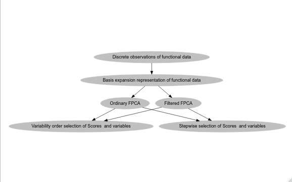{width="85%"}     
  ------------------------------------------- -- --
:::

# Acknowledgment

This paper is partially supported by the project FQM-307 of the
Government of Andalusia (Spain) and by the project PID2020-113961GB-I00
of the Spanish Ministry of Science and Innovation (also supported by the
FEDER programme). They also acknowledge the financial support of the
Consejería de Conocimiento, Investigación y Universidad, Junta de
Andalucía (Spain) and the FEDER programme for project A-FQM-66-UGR20.
Additionally, the authors acknowledge financial support by the
IMAG--María de Maeztu grant CEX2020-001105-M/AEI/10.13039/501100011033.
