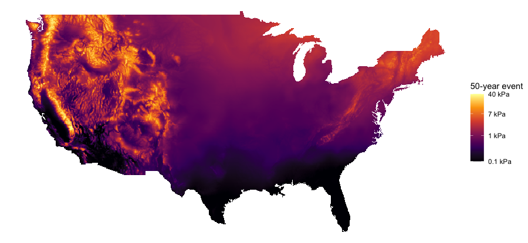

# Introduction

When observations exhibit spatial autocorrelation, geographic location
can be leveraged to improve predictions of the response variable by
considering responses in nearby observations. Typical spatial
statistical models assume that the covariance between two observations
can be modeled as a function of location difference, i.e., the
relationship needs to be second-order stationary. For sufficiently large
distances, the stationarity assumption often fails. Even when external
drift or secondary variables are used, continental scale models may
still not be second-order stationary.

The simplest way to use traditional spatial modeling with nonstationary
data is to partition the global region into smaller sub-regions that are
locally stationary and create separate models for each region. The naïve
implementation of this approach leads to noncontinuous predictions at
the borders of each region. Previous attempts to smooth out
discontinuities at region boundaries often involved taking weighted
averages of local regional model output where the weights of each local
model prediction or covariance structure are a function of the distance
between a new observation and the centers of each region
[@fuentes_high_2001; @fuentes_new_2001; @gosoniu_bayesian_2006; @gosoniu_mapping_2009; @konomi_adaptive_2014].
While the center based approach may be appropriate for symmetrical
regions, it is likely not appropriate for oddly shaped or disjoint
regions not well represented by their centers. In some cases, a region
may not even contain its center. The center-based approach also fails to
respect major geographic features that can cause sharp changes in
response variables over very short distances.

The regional border smoothing approach described in this article is a
novel method that uses a weighted average of predictions from local
models, but gives weight to regional models based on the nearest
distance to the *border* of each region rather than distance to the
center of each region. With this method, regions may be chosen that more
naturally reflect local climate and topography with smoothing only
occurring near the borders of each region. Figure
[1](#fig:example){reference-type="ref" reference="fig:example"} is an
example of the regional border smoothing approach applied to three
regions with different spatial models.

{#fig:example
width="\\textwidth"}

The R package [remap](https://CRAN.R-project.org/package=remap) is a
General Public License implementation of this regional border smoothing
method that scales well to large problems [@remap]. Using remap,
regional border smoothing is applied to two different modeling problems.
The first problem is a national set of 50-year ground snow loads and the
second problem is modeling April 1st snow water content for Utah. Mapped
values from both projects show improvement in model accuracy using the
regional border smoothing approach over global models for a variety of
spatial modeling approaches.

The body of this article will proceed with a description of the regional
border smoothing approach. This will be followed by an illustration of
the available functions and tools in remap as well as two demonstrations
of the software on a state and national-level data set. These examples
show the utility of remap in producing smooth estimates when applied to
spatial modeling problems over large geographical areas with irregularly
shaped partitions.

## Background

There are many proposed methods to model nonstationary data using
locally stationary models. @haas_lognormal_1990 [@haas_kriging_1990]
describes a moving window approach where only data within a
pre-specified bounding box are used to fit a local dependence structure
and then make predictions. This process is computationally intensive and
may not result in continuous predictions.

@fuentes_high_2001 and @fuentes_new_2001 propose a method for
nonstationary problems where a global covariance structure that changes
continuously as a function of location is used in a Gaussian process
model. The data are first partitioned into locally stationary regions
and a global covariance structure is calculated by taking a weighted
average of regional covariance structures. Weights are based on the
distance from the prediction location to a point in each region, usually
the center. Regions are either given *a priori* or by using subgrids
chosen using the Bayesian information criterion.

Applications of local partition modeling approaches include
@kim_analyzing_2005, who describe a method to deal with sudden changes
in spatial covariance structure that occur between layers of rock
strata. The spatial domain is partitioned into independent regions using
Voronoi Tessellations [@green1978], with each region fit using an
independent Gaussian model. The resulting global model has sharp changes
at the borders of each region, which was desirable given the context of
the problem. @konomi_adaptive_2014 illustrate a decision tree based
method for partitioning the spatial domain when modeling global Ozone
levels. @heaton_nonstationary_2017 use a hierarchical clustering method
to partition the spatial domain for temperature data in Houston, TX. The
hierarchical clustering method has the benefit of creating a partition
that more naturally follows changes in the covariance structure rather
than partitioning the space into symmetrical blocks or spheres.

@gosoniu_bayesian_2006 [@gosoniu_mapping_2009] provide an additional
application of local partitioning models mapping malaria risk using *a
priori* partitions of West Africa. The 2006 study uses three large
rectangular regions and the 2009 study uses agro-ecological regions to
partition the spatial domain. In these studies, spatial random effects
are modeled as a weighted sum of regional stationary effects based on
the distance to region centroids. The authors note problems with sudden
changes at region borders as a result of using region centroids for the
weighted sum of effects.

Most of the methods discussed so far create a global covariance
structure from local covariance structures of Gaussian process models
[@fuentes_high_2001; @fuentes_new_2001; @kim_analyzing_2005; @konomi_adaptive_2014; @heaton_nonstationary_2017].
Each method has a different way of smoothing regional transitions that
are specifically tied to their methodology. Many of the methods use a
Bayesian framework that requires computationally expensive Markov chain
Monte Carlo simulations
[@kim_analyzing_2005; @konomi_adaptive_2014; @heaton_nonstationary_2017; @gosoniu_bayesian_2006; @gosoniu_mapping_2009].
Many of the techniques are only applied to purely spatial data rather
than multivariate data
[@kim_analyzing_2005; @konomi_adaptive_2014; @heaton_nonstationary_2017].
There is a lack of methodology that allow for smooth transitions between
partitions and works for multiple modeling techniques.

The regional border smoothing method described in this article can be
thought of as stitching together images to form a larger image with no
sharp changes. The approach is similar to those used to combine black
and white images from microscopes into a larger image
[@thevenaz_user-friendly_2007]. Individual microscope images are aligned
and the overlapping regions are smoothed by taking a weighted average of
the overlapping pixel brightness. The weights are based on the distance
from the pixel to the outer edge of each image with more weight being
applied to pixels closer to the center of an image.

The process described in this article provides a simple way of combining
regional model predictions to form a continuous global prediction
surface. The method can be applied to problems that are not strictly
spatial. For example, @osborne_should_2002 show that building models for
partitioned space can improve the accuracy of large scale species
distribution models. The regional border smoothing method works for any
model that produces continuous predictions.

## Computer code availability and competing interests

The [remap](https://CRAN.R-project.org/package=remap) package is
available on the Comprehensive R Archive Network (see
<https://cran.r-project.org/web/packages/remap/index.html>) with the
most current version available at
<https://github.com/jadonwagstaff/remap>. The code and data used to
generate the results in this article are available as supplementary
materials.

The figures and tables in this article are made using the R programming
language. Figures are created with the
[tidyverse](https://CRAN.R-project.org/package=tidyverse)
[@wickham2019],
[gridExtra](https://CRAN.R-project.org/package=gridExtra) [@auguie2017],
[cowplot](https://CRAN.R-project.org/package=cowplot) [@wilke2020], and
[maps](https://CRAN.R-project.org/package=maps) [@becker2018] packages.
The [sf](https://CRAN.R-project.org/package=sf) [@pebesma2018],
[nngeo](https://CRAN.R-project.org/package=nngeo) [@dorman2020], and
[raster](https://CRAN.R-project.org/package=raster) [@hijmans2020]
packages are used to manipulate spatial data. Kriging models are built
with [automap](https://CRAN.R-project.org/package=automap)
[@hiemstra2009] and [gstat](https://CRAN.R-project.org/package=gstat)
[@pebesma2004; @graler2016] and generalized additive models are built
with [mgcv](https://CRAN.R-project.org/package=mgcv) [@wood2011]. A
docker container with these packages installed and all code is available
at <https://hub.docker.com/r/jadonwagstaff/remap_manuscript_code>.

This research was funded by the American Society of Civil Engineers and
the Structural Engineering Institute (award number 202827). The authors
have no affiliation with any organization with a direct or indirect
financial interest in the subject matter discussed in the manuscript.
This article is based on the first author's master's thesis [@jwthesis].

# The regional border smoothing approach

Regional border smoothing is the process of using regional models to
make predictions that are globally continuous. Regional border smoothing
may be used on any spatially referenced data ($\pmb{X}$) in conjunction
with a modeling approach and a finite set of regions $\mathcal{R}_p$
where each $\mathcal{R}_{p_i} \in \mathcal{R}_p$, $i = 1 \dots m$, is a
closed set of points contained in the region of interest $\mathcal{R}$.
The intention is that $\mathcal{R}_p$ is a set of non-overlapping
polygons with shared borders and
$\bigcup\limits_{i=1}^m \mathcal{R}_{p_i} = \mathcal{R}$, but these are
not necessary conditions. While $\mathcal{R}_p$ does not meet the strict
definition of a partition, $\mathcal{R}_p$ will be referred to as a
partition throughout this article.

The border smoothing approach described in this article was originally
designed for regression-based models, but can be used with any modeling
approach that produces a continuous response. This technically includes
classification techniques that make continuous probability predictions
prior to classifying based on probability threshold, such as logistic
regression. Presumably, the predictions from a chosen modeling approach
will result in continuous predictions as a function of location.

Modeling regions are defined by the borders of $\mathcal{R}_p$. The data
contained by a modeling region $\mathcal{R}_{p_i}$ are used to inform a
distinct regression model ($f_{p_i}(\pmb{X})$) for that region. In some
cases it may be desirable to include observations near each
$\mathcal{R}_{p_i}$ when building regional regression models. In these
cases, data within $\mathcal{R}_{p_i}$ and within a buffer zone around
each modeling region are used to build each $f_{p_i}(\pmb{X})$ (Figure
[2](#fig:buffer_example){reference-type="ref"
reference="fig:buffer_example"}). Using points within a buffer zone that
extends beyond the region boundaries avoids edge extrapolation when
using a regional model for interpolation in the smoothing zones of
neighboring regions.

![Example showing how observations are selected within a region's buffer
zone. Seven arbitrary regions represented as polygons contain 169
observations represented as points. During the regional modeling
process, a model is built for each of the seven regions. For this
example, all points within 50km of a region are used to build each
model. For the highlighted region, all observations within a 50km buffer
zone (dashed line) are used to build that region's model. Highlighted
points are observations used to build the highlighted region's
model.](figures/buffer_example.png){#fig:buffer_example
width=".7\\textwidth"}

Simply making predictions within each $\mathcal{R}_{p_i}$ using each
corresponding $f_{p_i}(\pmb{X})$ results in noncontinuous predictions at
region boundaries. Regional border smoothing results in continuous
predictions for the entire space by taking a weighted average of the
predictions provided by each $f_{p_i}(\pmb{X})$. The smoothed global
prediction surface is continuous, but not necessarily differentiable.

## Smoothing at borders

Let $\hat{y}_{1}, \hat{y}_{2}, ..., \hat{y}_{m}$ represent predictions
from regional models
$f_{p_1}(\pmb{x}^*), f_{p_2}(\pmb{x}^*), ..., f_{p_m}(\pmb{x}^*)$ for
location of interest $\pmb{x}^*$ where $\pmb{x}^*$ represents both
spatial and non-spatial information. A final prediction $\hat{y}'$ is
calculated by the weighted average of each $\hat{y}$, i.e.,

$$\hat{y}' = \frac{\sum_{i=1}^m w(d_i|S)\hat{y}_{i}}{\sum_{i=1}^m w(d_i|S)}.
    \label{eq:smooth}$$

The weights are calculated based on the smallest great-circle distances
($d_{1}, d_{2}, ..., d_{m}$) between the location of $\pmb{x}^*$ and the
boundaries of
$\mathcal{R}_{p_1}, \mathcal{R}_{p_2}, ..., \mathcal{R}_{p_m}$. If
$\pmb{x}^*$ is located within a region, the distance between $\pmb{x}^*$
and that region is $0$. The weight $w(d_i|S)$ given to $\hat{y}_{i}$ is
non-zero when $d_{i}$ is within some threshold $S$, i.e.,

$$w(d_i | S) = 
    \begin{cases} 
        \left( \frac{S - d_{i}}{S} \right)^2 & d_{i} \leq S\\ 
        0 & d_{i} > S.
    \end{cases}
    \label{eq:weight}$$

Consider now the special case when a prediction is made in region $j$
and $d_{i\ne j} > S$, then $w(d_{i \ne j}|S) = 0$ and Equation
[\[eq:smooth\]](#eq:smooth){reference-type="ref" reference="eq:smooth"}
reduces to $\hat{y}' = \hat{y}_{j}$. As prediction location in region
$j$ approach $\mathcal{R}_{p_k}$, then the weight of $\hat{y}_{k}$
increases gradually and
$\hat{y}' = \frac{ \hat{y}_{j} + \left(\left(S - d_{k}\right)/S\right)^2 \hat{y}_{k}}{1 + \left(\left(S - d_{k}\right)/s\right)^2}$.
At the border of regions $j$ and $k$,
$\hat{y} = \left(\hat{y}_{j} + \hat{y}_{k}\right) / 2$. Finally, as
prediction locations progress into $\mathcal{R}_{p_k}$, weights for
$y_{i_j}$ decrease gradually to zero and
$\hat{y}' = \frac{\left(\left(S - d_{j}\right)/S\right)^2 \hat{y}_{j} + \hat{y}_{k}}{\left(\left(S - d_{j}\right)/S\right)^2 + 1}$.
All locations within $S$ of a region are referred to as the smoothing
zone for that region.

## Standard error approximations

The smoothing approach described in this paper represents a spatially
weighted ensemble of model predictions along region boundaries, with
each model (possibly) estimating prediction standard error (SE) or
variance. There is no consensus in the literature on how SE should be
calculated for ensemble model predictions. The methods for SE
calculation that do exist tend to be specific to model type (e.g.
[@wager2014confidence]) or averaging approach (e.g.
[@hoeting1999bayesian]). For this reason, the method for estimating SE
in remap relies on the general properties of variance for the summation
of random variables.

Suppose that each $\hat{y}_i$ is an unbiased estimate from of
$f_{p_i}(\pmb{x}^*)$ with the SE of $\hat{y}_i$ represented as
$\hat{\sigma}_i$. Then the combined model SE for $\hat{y}'$ can be
represented as
$$\hat{\sigma}' = \sqrt{\frac{\sum_{i=1}^m w(d_i|S)^2\hat{\sigma}_{i}^2 + \sum_{i=1}^m\sum_{j<i} 2w(d_i|S)w(d_j|S)\rho_{ij}\hat{\sigma}_{i}\hat{\sigma}_{j}}{\left(\sum_i w(d_i|S)\right)^2}},$$
where $\rho_{ij}$ represents the correlation between predictions for
model $i$ and $j$. One primary difficulty with estimating
$\hat{\sigma}'$ in the smoothing zones is a lack of information
regarding $\rho_{ij}$. It is highly likely that SE estimates are
correlated for models in adjacent regions. In the absence of a
computationally efficient and theoretically robust estimate for
$\rho_{ij}$ the Cauchy--Schwarz inequality can be used to provide an
upper bound on $\hat{\sigma}'$ given as
$$\hat{\sigma}' \le \sqrt{\frac{\sum_{i=1}^m w(d_i|S)^2\hat{\sigma}_{i}^2 + \sum_{i=1}^m\sum_{j<i} 2w(d_i|S)w(d_j|S)\hat{\sigma}_{i}\hat{\sigma}_{j}}{\left(\sum_i w(d_i|S)\right)^2}},
     \label{eq:cs_in}$$ where $\rho_{ij}$ has been replaced with a
constant value of one.

The remap package provides a method for estimating the upper bound of
the prediction SE using the inequality specified in
([\[eq:cs_in\]](#eq:cs_in){reference-type="ref" reference="eq:cs_in"}).
It is important to note that it may not always be appropriate to combine
model SE estimates in this way. This is particularly true for models
that ignore spatial autocorrelation. It is also important to remember
that the primary focus of remap is to provide a practical approach for
smoothing model predictions, and not to preserve the theoretical
integrity of the SE estimates. It is up to the end user to determine
that the SE calculations are valid and appropriate for their modeling
purposes.

## A note on smoothing

The "smoothing" described throughout this article refers to smoothing in
the colloquial sense. A continuous prediction surface is created with a
steady transition between regions. The prediction surface is not always
differentiable. If a region is not convex, the rate of change in the
distance to a region can shift suddenly at locations that are
equidistant to different parts of the region. Figure
[3](#fig:nondiff){reference-type="ref" reference="fig:nondiff"} shows an
example of a prediction surface near a non-convex region where the
prediction surface is not differentiably smooth.

{#fig:nondiff
width="\\textwidth"}

Since each region is a closed set of points, $d_i$ is continuous. It
therefore follows that the weight function $w(d_i|S)$ described in
Equation [\[eq:weight\]](#eq:weight){reference-type="ref"
reference="eq:weight"} is continuous as
$\lim_{x\to0^{+}} w(x|S) = w(0|S) = 1$ and
$\lim_{x\to S^{-}} w(x|S) = w(S|S) = 0$ for $x \in [0, \infty)$ and
$S > 0$. Since the right side of Equation
[\[eq:smooth\]](#eq:smooth){reference-type="ref" reference="eq:smooth"}
is the multiplication and addition of continuous functions, it is
guaranteed to have $\max\left(w(d_i|S)\right) > 0$ as long as
$\pmb{x}^*_s$ is within $S$ units of any $\mathcal{R}_p$ and it follows
that Equation $\hat{y}'$ is also continuous. Given continuous
predictions as a function of location for each region, the regional
border smoothing method is guaranteed to be continuous for any location
within the smoothing zone of at least one region. Once all $d_i > S$,
then the denominator of $y'$ is equal to zero, which means $y'$ is no
longer well-defined. As long as all of the data $\pmb{X}$ are located
within $\mathcal{R}_p$, any prediction location outside of
$\mathcal{R}_p$ is spatial extrapolation that is generally discouraged.

# remap

The R package remap is an implementation of the regional border
smoothing approach to spatial modeling. The function remap creates a set
of regionalized models given:

-   A set of observations as spatially projected or geographic points.

-   A set of regions as spatially projected or geographic polygons.

-   A desired buffer zone distance.

-   A modeling function to apply to observations in each region.

Predictions can be made on new observations given a regionalized model
and the smoothing parameter smooth used for weighted averages in
smoothing zones (variable $S$ in Equation
[\[eq:weight\]](#eq:weight){reference-type="ref"
reference="eq:weight"}). Detailed descriptions of function parameters
can be found in the package documentation. Some working examples using
the remap package are provided via the vignette which accompanies the
package. The development version of the code for remap can be found at
<https://github.com/jadonwagstaff/remap>.

## Calculating distances

The weights for regional predictions require the distances from all
observations to the boundary of each region. The modeling process of the
remap function also requires the distances from all observations to each
region to assign the correct observations to each regional model. The
process of fine-tuning a model can result in recalculating these
distances many times. To avoid recalculating distances, the function
redist is included in the remap package to pre-compute the distances
from a given set of observations to a given set of regions. These
pre-computed distances can be supplied as a parameter to the remap
function to reduce computational time while fine-tuning models.

Calculating distances in the remap package takes advantage of tools
already available for spatial analysis in the R package sf
[@pebesma2018]. The function sf::st_distance is used to find either
Euclidean or great-circle distances depending on the spatial projection
of the locations and regions. The sf::st_distance function uses the S2
geometry library [@google2020] when calculating great-circle distances.
The S2 geometry library is designed specifically to efficiently compute
distances between nearby objects given large sets of geographic data.
Regardless, calculating distances can still take a lot of computational
time if the regions are complex and/or there are a lot of observations.

The naïve approach to regional border smoothing is to find all distances
between each location and each region. This approach may be necessary
during the modeling process if any region does not contain a required
minimum number of observations (detailed in the implementation
considerations section). If predictions are being made using new
observations, then distances do not need to be calculated between every
observation and every region.

Because the weight for predictions in different regions is zero when the
distance to those regions is greater than the smoothing parameter
(Equation [\[eq:weight\]](#eq:weight){reference-type="ref"
reference="eq:weight"}), distances do not need to be calculated between
*every* region and *every* prediction location. To determine which
observations require distance calculations, an approximate polygon is
constructed that encompasses the original region plus the smoothing zone
around the region. The function sf::st_within is used to determine which
observations are within the new polygon and equivalently, which
observations are within the smoothing zone of the original region.
Observations in the approximate polygon become candidates for precise
distance calculations.

An approximate polygon that contains a region and the region's smoothing
zone is created using the sf::st_buffer function. For geographic
coordinates, sf::st_buffer requires a buffer value in degrees. Since the
great-circle distance between a unit degree of longitude changes with
latitude, Equation
[\[eq:km_per_degree\]](#eq:km_per_degree){reference-type="ref"
reference="eq:km_per_degree"} is used to find $c$: the shortest distance
(measured in kilometers) required to move one degree longitude at the
observation in the data set that is nearest to a geographical pole. The
set $\pmb{\lambda}$ is the set of Latitude values of the observations
and 6380 km is the radius of the earth at a pole (rounded down). A
sufficient buffer value in degrees for sf::st_buffer is calculated by
dividing the smoothing zone length in km by $c$. The resulting buffered
polygon contains all of the observations within the smoothing zone of
the original polygon,

$$c = \frac{\pi * 6350}{180} * cos\left(\frac{\pi * \max\left(|\pmb{\lambda}|\right)}{180}\right).
    \label{eq:km_per_degree}$$

Assuming each region contains a sufficient number of observations to fit
each regional model, the same process used for reducing the number of
distance calculations for model predictions can be used to reduce the
number of distance calculations required for model training. The
function redist is able to restrict distance calculations to only
observations within a certain buffer zone or smoothing zone of each
region using the max_dist parameter. This eliminates the need to
calculate distances to points with a known weight of zero when
smoothing.

## Practical implementation considerations

Reliable regression results depend upon sufficient sample sizes, which
differ based on the variability of the response and dimensionality of
the inputs. A strict (and obvious) minimum sample size for the remap
function is one observation per region, though this threshold will
rarely, if ever, ensure reasonable results. An additional parameter
min_n is included in the remap function to specify a minimum number of
observations be used to build each model. If a region and the buffer
around that region do not contain the minimum number of observations
specified, the min_n observations closest to the boundaries of the
region are used to train that region's model.

The remap package has the ability to make predictions outside of all
modeling regions. If the prediction location is within the smoothing
zone of a region, then Equation
[\[eq:smooth\]](#eq:smooth){reference-type="ref" reference="eq:smooth"}
applies and the nearest region will have the most weight. If the
prediction location is outside the smoothing zone of all regions, then
the model from the closest region is used to make a prediction. This may
result in non-continuous transitions in predictions when the closest
region changes across geographic space, but this is only possible at
locations outside of the smoothing zone of all regions. As a general
rule, extrapolation of predictions to a location beyond those
represented in the input data is not recommended. See Figure
[4](#fig:gap){reference-type="ref" reference="fig:gap"} for a visual
depiction of how predictions behave outside of all modeling regions.

{#fig:gap
width="\\textwidth"}

The ability to predict outside of all regions means that the remap
package can make smooth predictions across small gaps at polygon
borders, provided the gaps are no larger than two times the smoothing
zone distance. This encourages the use of rgeos::gSimplify [@rgeos2020]
or sf::st_simplify [@pebesma2018] to simplify complex polygons and ease
the computational burden associated with distance calculations, even if
those simplifications slightly compromise the topology of the original
geometry.

# Applications

## Design snow loads

Snow loads are obtained from weather stations throughout the United
States in the National Oceanic and Atmospheric Administration's (NOAA)
Global Historical Climatology Network [@menne2012]. Snow loads are
either measured directly, or estimated from measured snow depth using a
depth to load conversion model. Engineers have historically used
estimates of 50-year ground snow loads when designing structures. The
50-year snow load is traditionally obtained by fitting a probability
distribution to yearly maximum snow load measurements and extracting the
98^th^ percentile. A recent effort by the American Society of Civil
Engineers has resulted in a new set of 50-year ground snow loads at 7964
measurement locations [@bean2021-report].

## Building a geospatial snow load model with remap

Building design requirements call for continuous maps that estimate
design loads between measurement locations. This has historically been
accomplished using various mapping techniques
[@Tobiasson2002; @Liel2017; @Bean2019]. The problem is that the
relationship between predictor variables and snow load can change
drastically on a continental scale. For example, the typical loads at
1500 meter elevation in the Rocky Mountains of Montana are much lower
than loads at 1500 meters in the Cascade Mountains of Washington State
(Figure [5](#fig:elevation){reference-type="ref"
reference="fig:elevation"}). Commonly used geospatial models for mapping
are not well suited for the nonstationary nature of this problem.

{#fig:elevation
width=".8\\textwidth"}

Snow loads are typically assumed to share a log-linear relationship with
elevation. This relationship can be modeled directly using ordinary
least squares (OLS), which ignores any potential spatial dependencies
among the observations. A generalized additive model (GAM) built with
the mgcv R package [@wood2011] characterizes the log of 50-year loads as
a function of elevation and a spatial smoother called splines on the
sphere [@Wood2003]. Universal kriging interpolates values using a
Gaussian process model after accounting for the log-linear trend in
elevation. Variograms are individually fit within each region using the
automap R package [@hiemstra2009].

Geographic regions defined by the US Environmental Protection Agency
(EPA) define regions with similar ecology and climate called eco-regions
[@cec1997]. The eco-regions provide a natural partition of the
conterminous United States and give no regard to political boundaries.
Snow load can be modeled using observations within each eco-region where
the relationship between predictor variables and the response are more
consistent on a local level. The remap package facilitates modeling in
separate eco-regions and creates a smooth model on the national scale.
There are 86 eco-regions that fall within the conterminous United
States, so 86 separate models are built using the remap function with a
buffer zone of 50 km and a min_n of 150 observations. The regional
models are smoothed to a single continuous model using a smooth
parameter of 25 km.

The following code demonstrates how remap is used to build these models.
The script and data for the following examples are provided as
supplementary materials with this article. The example data include
three \"sf\" objects: a spatial points data frame with 50-year snow
loads at locations within the US and Canada ( loads), a spatial polygons
data frame of eco-regions ( eco3), a spatial polygon of the conterminous
United States ( cont_us), and a \"raster\" object with elevations
comprising a 0.8 km grid over the conterminous United States ( grd).

::: example
library(tidyverse) library(sf) library(raster) library(mgcv)
library(automap) library(gstat) library(remap)
load(\"wagstaff-bean.RData\")
:::

The eco-regions have more complex borders than is necessary for this
problem, so they can be simplified to the same extent as shown in Figure
[6](#fig:simplification){reference-type="ref"
reference="fig:simplification"}.

::: example
eco3_simp \<- eco3 sf::st_simplify(dTolerance = 10000)
dplyr::filter(!sf::st_is_empty(.)) sf::st_cast(\"MULTIPOLYGON\")
:::

{#fig:simplification
width="\\textwidth"}

Since multiple models are built with the same set of measurement
locations, pre-calculating the distances from measurement location to
region boundaries can save some computational time.

::: example
eco3_dist \<- redist(loads, regions = eco3_simp, region_id = ECO3)
:::

Linear models and GAMs are easiest to build with remap. The remap
function accepts additional arguments for a selected model function but
passes the spatial data to the function as an unnamed parameter. Since
the data parameter is the second parameter of the stats::lm function, we
need to formally specify the first argument of the function (i.e. the
formula parameter) to pass along to stats::lm, rather than relying on
the stats::lm function defaults. Otherwise the data for each sub-region
will be sent as the wrong parameter.

::: example
lmod \<- remap(loads, regions = eco3_simp, region_id = ECO3, buffer =
50, min_n = 150, distances = eco3_dist, model_function = stats::lm,
formula = log(EVENT50)   ELEVATION)

lmod #\> remap model with 86 regional models
:::

The lmod object has class \"remap\" and contains a models object and a
regions object. The models object is a list of gam models where the
model names correspond to each modeling region ID. The regions object is
an \"sf\" multipolygon object with one row per region and the first
column is the region IDs.

::: example
head(names(lmod$models), 3)
#> [1] "10.1.2" "10.1.3" "10.1.4"

class(lmod$models\[\[1\]\]) #\> \[1\] \"lm\"

head(lmod$regions, 3)
#> Simple feature collection with 3 features and 1 field
#> Geometry type: MULTIPOLYGON
#> Dimension:     XY
#> Bounding box:  xmin: -121.3721 ymin: 40.15434 xmax: -105.4847 ymax: 49.39082
#> Geodetic CRS:  WGS 84
#>     ECO3                           geom
#> 1 10.1.2 MULTIPOLYGON (((-115.8435 4...
#> 2 10.1.3 MULTIPOLYGON (((-120.5262 4...
#> 3 10.1.4 MULTIPOLYGON (((-108.8632 4...
\end{example}

Similar to the \texorpdfstring%
{{\normalfont\ttfamily\hyphenchar\font=-1 stats::lm}}%
{stats::lm} function, the \texorpdfstring%
{{\normalfont\ttfamily\hyphenchar\font=-1 mgcv::gam}}%
{mgcv::gam} function needs a \texorpdfstring%
{{\normalfont\ttfamily\hyphenchar\font=-1 formula}}%
{formula} parameter and a \texorpdfstring%
{{\normalfont\ttfamily\hyphenchar\font=-1 family}}%
{family} parameter passed to the \texorpdfstring%
{{\normalfont\ttfamily\hyphenchar\font=-1 remap}}%
{remap} function since \texorpdfstring%
{{\normalfont\ttfamily\hyphenchar\font=-1 data}}%
{data} is the third parameter of \texorpdfstring%
{{\normalfont\ttfamily\hyphenchar\font=-1 mgcv::gam}}%
{mgcv::gam}. In this example a wrapper function for \texorpdfstring%
{{\normalfont\ttfamily\hyphenchar\font=-1 mgcv::gam}}%
{mgcv::gam} is written to allow a custom predict function which either return predicted values (\texorpdfstring%
{{\normalfont\ttfamily\hyphenchar\font=-1 se.fit = FALSE}}%
{se.fit = FALSE}) or standard errors (\texorpdfstring%
{{\normalfont\ttfamily\hyphenchar\font=-1 se.fit = TRUE}}%
{se.fit = TRUE}). 

\begin{example}
gam_wrap <- function(data, ...) {
  model <- mgcv::gam(data, ...)
  class(model) <- "gam_wrap"
  return(model)
}

predict.gam_wrap <- function(object, data, se.fit = FALSE) {
  class(object) <- "gam"
  if (se.fit) { # return standard errors
    return(predict(object, data, se.fit = TRUE)$se.fit)
  } else { # return predictions
    return(predict(object, data))
  }
}

gm <- remap(loads, 
            regions = eco3_simp, region_id = ECO3,
            buffer = 50, min_n = 150,
            distances = eco3_dist,
            model_function = gam_wrap,
            formula = log(EVENT50) ~ s(ELEVATION, k = 15) +
              s(LATITUDE, LONGITUDE, bs = 'sos', k = 75),
            family = stats::gaussian)

predict(gm, loads[1:3, ], smooth = 25)
#> [1] -0.003297382  0.132882034 -0.170530457

predict(gm, loads[1:3, ], smooth = 25, se = TRUE, se.fit = TRUE)
#> Upper bound for standard error calculated at each location. 
#> Reminder: make sure that the predict function outputs a vector of standard
#> error values for each regional model in your remap object.
#> [1] 0.3177003 0.3383906 0.2142151

\end{example}

The kriging example requires a bit more work to implement in \texorpdfstring%
{{\normalfont\fontseries{b}\selectfont remap}}%
{remap} since the \texorpdfstring%
{{\normalfont\ttfamily\hyphenchar\font=-1 automap::autoKrige}}%
{automap::autoKrige} and \texorpdfstring%
{{\normalfont\ttfamily\hyphenchar\font=-1 gstat::krige}}%
{gstat::krige} functions do not accept data as an \texorpdfstring%
{{\normalfont\ttfamily\hyphenchar\font=-1 "sf"}}%
{"sf"} object. A custom modeling function can be written to pass to \texorpdfstring%
{{\normalfont\fontseries{b}\selectfont remap}}%
{remap} and a custom predict function can be written for \texorpdfstring%
{{\normalfont\fontseries{b}\selectfont remap}}%
{remap} to use for predictions.

\begin{example}
projection <- sf::st_crs("+proj=laea +x_0=0 +y_0=0 +lon_0=-100 +lat_0=45")

krig <- function(data, formula) {
  data <- data %>%
    sf::st_transform(projection) %>%
    sf::as_Spatial()
  
  out <- list(data = data, formula = formula)
  class(out) <- "krig"
  
  return(out)
}

predict.krig <- function(object, data) {
  if (nrow(data) == 0) return(NULL)
    data <- data %>%
      sf::st_transform(projection) %>%
      sf::as_Spatial()
    
    variogram_object <- automap::autofitVariogram(
      formula = object$formula, 
      input_data = object$data,
      model = "Sph")
    
    k <- gstat::krige(formula = object$formula, 
                      locations = object$data,
                      newdata = data, 
                      model = variogram_object$var_model,
                      debug.level = 0)
    
    return(k$var1.pred)
}

kg <- remap(loads, 
            regions = eco3_simp, region_id = ECO3,
            buffer = 50, min_n = 150,
            distances = eco3_dist,
            model_function = krig,
            formula = log(EVENT50) ~ ELEVATION)
\end{example}

Since the buffer distance is greater than the smoothing distance, the resulting \texorpdfstring%
{{\normalfont\ttfamily\hyphenchar\font=-1 "remap"}}%
{"remap"} object can be used to interpolate the same way that a global kriging model interpolates between points.

\begin{example}
loads_us <- sf::st_filter(loads, cont_us)

kg_preds <- exp(predict(kg, loads_us, smooth = 25))

all(dplyr::near(kg_preds, loads_us$EVENT50)) #\> \[1\] TRUE
:::

Snow load modeling methods are compared in Table
[1](#tab:standard_cv_50){reference-type="ref"
reference="tab:standard_cv_50"} using national scale models and models
built with the remap package on EPA Level III Eco-Regions [@cec1997].
Table [1](#tab:standard_cv_50){reference-type="ref"
reference="tab:standard_cv_50"} shows that the remap package framework
improves the cross validated accuracy of every spatial modeling method.
This demonstrates that the remap package has the ability to generally
improve modeling results, as improvements are not isolated to a single
spatial modeling case. Even though the regional models are made up of 86
different regional models, the estimated 50-year loads are smooth across
the prediction surface.

::: {#tab:standard_cv_50}
  Model       MSE $\times10^2$              Improvement
  --------- ------------------ ---------- -------------
                      National   Regional 
  GAM                      8.1        5.5           32%
  Kriging                  7.2        5.9           18%
  OLS                     89.3       17.8           80%

  : Ten fold cross-validation results from modeling the log of 50-year
  snow loads. Mean squared error (MSE) is multiplied by $10^2$ for
  readability. Improvement is (national - regional) / national.
:::

## Computational challenges

National snow load maps require a sufficiently fine resolution to be
feasibly used to design buildings in topographically complex areas. To
accomplish this, snow load maps are created that match the resolution of
PRISM climate output [@prism2020], which maps at a 0.8 km resolution for
the conterminous United States. This means that predicted snow loads are
calculated at 12,113,556 locations using a model created by the remap
package with 86 different regions. Elevation values for the grid are
obtained from the United States Geological Survey [@USGS2020].

Since the remap package uses the distances between prediction locations
and regions to make a smooth model, calculating these distances is a
potential bottleneck in the prediction process. Also, since the
prediction area is so large, geographic coordinates rather than
projected coordinates must be used to find distances. Prior to sf
version 1.0.0 [@pebesma2018], the S2 geometry library [@google2020] had
not been implemented. Without the S2 geometry library, simply
calculating all geographic distances would have taken nearly half a year
to run on a typical personal computer, as illustrated in Table
[2](#tab:runtime){reference-type="ref" reference="tab:runtime"}. The
test computer used for Table [2](#tab:runtime){reference-type="ref"
reference="tab:runtime"} has 16 GB of RAM and an Intel Core I7-7820HQ
CPU which runs at 2.9 GHz. Maps for the national design snow loads were
developed before S2 had been integrated into sf, so the steps described
later in this section had previously been necessary to use remap to
build these maps.

::: {#tab:runtime}
  Remedial steps                    Run time in hours                   
  ------------------------------- ------------------- ----------------- -----------
                                           Geographic   Geographic (S2)   Projected
  None                                       4200$^*$           8.1$^*$   100.0$^*$
  Simplify polygons                            14$^*$           2.3$^*$         1.0
  \+ set max_dist to 25 km                        1.1               0.3         0.8
  \+ run in parallel on 4 cores                   0.8               0.3         0.8

  : Run times for redist to calculate geographic and projected distances
  from 0.8 km grid points to 86 different eco-regions (polygons) in the
  conterminous US. Remedial steps are additive, i.e., each row in the
  table includes all previous remedial steps. $^*$ Approximate run time
  based on random sample of 10,000 grid points.
:::

The first step to reduce the run time for distance calculations is to
simplify the polygons as discussed in the implementation considerations.
Using a tolerance of 10000 with the function sf::st_simplify, the size
of the polygons are reduced from 21 MB to 0.2 MB. The results of polygon
simplification are visualized in Figure
[6](#fig:simplification){reference-type="ref"
reference="fig:simplification"}. When making predictions, the smooth
parameter is set to 25 km; therefore, the max_dist parameter of redist
can be set to 25 km to further reduce run time. The distances may also
be calculated in parallel; however, on the test computer the
improvements are marginal. The relevant distances may be calculated for
all points using great circle distance in as fast as 20 minutes (Table
[2](#tab:runtime){reference-type="ref" reference="tab:runtime"}). This
tremendous computational speed-up is made possible by the ability of the
remap package to smoothly fill in the gaps that occur in aggressively
simplified polygons.

Here is an example of the code used to find distances from grid points
to eco-regions. Due to space and time constraints, the 0.8 km prediction
grid is aggregated to a 7.2 km grid ( grd) over the conterminous United
States. The grid is also converted to an \"sf\" spatial points data
frame for use with remap.

::: example
ag_grd \<- grd raster::aggregate(9) raster::rasterToPoints()
as.data.frame() mutate(LONGITUDE = x, LATITUDE = y) sf::st_as_sf(coords
= c(\"x\", \"y\"), crs = 4326) filter(sf::st_intersects(., cont_us,
sparse = FALSE)\[,1\])

grd_dist \<- redist(ag_grd, regions = eco3_simp, region_id = ECO3,
max_dist = 25)
:::

Smoothed regional predictions are made automatically by using the
generic predict function on a \"remap\" object and setting the smooth
parameter to value greater than zero. Below is an example of predicting
values on the grid points using the 50-year load regionalized GAM model.
Since we already calculated distances from grd to eco3_simp, the
grd_dist object can be passed to the distances parameter of the predict
function. The distance matrix is optional and remap will calculate
distances internally if not provided with a distance matrix. Predictions
are smoothed to 25 km on either side of each border. Note that
predictions from gm are on the log scale.

::: example
gm_preds \<- predict(gm, ag_grd, smooth = 25, distances = grd_dist)
gm_preds \<- exp(gm_preds)
:::

Here, the predictions from the regionalized GAM reveal some
extrapolation issues when making predictions at elevations outside of
the range of available data within each sub-region. To get a better
visualization of the predictions, the predicted values can be truncated
to the range observed in the input data.

The smooth predictions from the gm model are visualized in Figure
[\[fig:snowload_map\]](#fig:snowload_map){reference-type="ref"
reference="fig:snowload_map"} with the following code.

::: example
ggplot(cont_us) + geom_tile(data = ag_grd aes(x = LONGITUDE, y =
LATITUDE, fill = EVENT50)) + geom_sf(fill = NA, color = NA) +
scale_fill_viridis_c(option = \"inferno\", trans = \"log10\", breaks =
c(0.1, 1, 7, 40), labels = c(\"0.1 kPa\", \"1 kPa\", \"7 kPa\", \"40
kPa\"), name = \"50-year event\") + theme_void()
:::

::: widefigure
{width="\\textwidth"}
:::

## Utah snowpack

The state of Utah assesses snow water content or snowpack every April
1^st^ to plan for yearly water resource availability. These measurements
are much more variable than the 50-year snow loads since the values are
based on a single measurement at each location instead of the 98^th^
percentile of a distribution fit to annual maximum values at each
location. This example uses direct measurements of the water content
made via Snowpack Telemetry (SNOTEL) stations included in NOAA's Global
Historical Climatology Network [@menne2012]. In addition to SNOTEL
station data, Snow Course data collected by the National Water and
Climate Center are also included in the data set [@NRCS2017]. SNOTEL and
Snow Course data measure the water equivalent of snow depth (WESD) and
are located in the mountainous areas of Utah above 1777 m elevation.
This negates the need to estimate water content from snow depth, which
is typically the case when measuring snow at non-mountainous locations
in the state.

SNOTEL stations and Snow Course data within 100 km of the border of Utah
are included in the data set. There are 3511 April 1^st^ WESD
observations available for modeling which range from 0 to 1746 mm of
water. The observations have 178 unique locations and span 30 years
(1986-2015). Each year is modeled separately with no regard for any
temporal correlations and each year has at least 97 observations.

Models for GAM, kriging, and OLS are created using the same model
structure as the national snow load example, but a different response
variable. Since there are 142 zero values for WESD within the data, the
log of (WESD + 1) is used as the response variable for the April 1^st^
snowpack. Predictions are also constrained to be between \[1,
max(WESD)\] to avoid excessive extrapolation. The regions used for
regional modeling are watershed boundaries defined by the USGS
[@USGS2020_2]. Watersheds are defined by a hierarchy of hydrologic unit
codes (HUC) with a two-digit designation for continental scale
watersheds (HUC2) and a four-digit designation that partitions each HUC2
region (HUC4). There are four HUC2 regions and 12 HUC4 regions within
the boundaries of the state of Utah (see Figure
[7](#fig:utah_regions){reference-type="ref"
reference="fig:utah_regions"}). A buffer zone of 20 km, a smoothing
parameter of 10 km, and a min_n of 30 observations are used when
modeling over both HUC2 and HUC4 regions with the remap function.

{#fig:utah_regions
width=".46\\textwidth"}

The following code shows how remap models are built for the 2011
snowpack values using HUC2 watershed regions. Included in the supplied
example data are an sf points data frame with snowpack Utah snowpack
values ( utapr1, and an sf polygons data frame of HUC2 and HUC4
watersheds within Utah ( utws). Note that the maximum number of knots (
k) in the GAM formula are reduced to accommodate a smaller min_n in the
remap function.

::: example
utsp2011 \<- utapr1 dplyr::filter(YEAR == 2011) dplyr::mutate(WESD =
WESD + 1)

utlmod \<- remap(utsp2011, regions = utws, region_id = HUC2, buffer =
20, min_n = 30, model_function = stats::lm, formula = log(WESD)  
ELEVATION)

utgm \<- remap(utsp2011, regions = utws, region_id = HUC2, buffer = 20,
min_n = 30, model_function = mgcv::gam, formula = log(WESD)  
s(ELEVATION, k = 5) + s(LATITUDE, LONGITUDE, bs = 'sos', k = 20), family
= gaussian)

utkg \<- remap(utsp2011, regions = utws, region_id = HUC2, buffer = 20,
min_n = 30, model_function = krig, formula = log(WESD)   ELEVATION)
:::

Table [3](#tab:standard_cv_apr1){reference-type="ref"
reference="tab:standard_cv_apr1"} shows that the gains in accuracy are
more modest in this application than in the national example shown
previously. This is expected as the partitions are on the state level
instead of the national level. Nevertheless, the consistent improvement
in accuracy at various scales using different polygons and different
input data highlight the general ability of the remap package to improve
predictive accuracy without sacrificing continuity.

::: {#tab:standard_cv_apr1}
  Model       MSE $\times10^2$                       
  --------- ------------------ ------ ------- ------ -------
                         State   HUC2           HUC4 
  GAM                       88     75   (15%)     78   (11%)
  Kriging                   90     87    (3%)     83    (8%)
  OLS                      140    111   (21%)     89   (36%)

  : Ten fold cross-validation mean squared error from modeling
  log(WESD + 1) for Utah snowpack. Mean squared error (MSE) is
  multiplied by $10^2$ for readability. Improvement in parentheses is
  calculated with (state - HUC) / state.
:::

# Conclusions

Partitioning a space for geospatial modeling is a practical approach for
handling nonstationary data; however, smooth transitions in mapped
values are a desirable constraint of many projects, such as the design
snow load requirements set forth by the American Society of Engineers.
The remap R package provides a ready-to-use framework for regional
models with smooth transitions at region borders that overcomes the
computational difficulties of naïve implementations.

The remap package creates continuous prediction surfaces by weighting
regional predictions based on the proximity to region borders. Smoothing
at region borders makes the package particularly equipped to handle
irregularly shaped regions not well represented by their geographic
centers. Because the remap package has the ability to smooth over small
gaps formed when simplifying polygons, computation times can be
drastically reduced without sacrificing the continuity of the
predictions. Methods that automatically subset the number of required
distance calculations further reduce computational times. This article
has demonstrated accuracy improvements using the remap package on two
separate data sets with two sets of polygon inputs. These examples
highlight the feasibility of applying the remap framework to large
spatial regression modeling problems.\

# Acknowledgements

The development of remap was funded in part by the American Society of
Civil Engineers (ASCE) and the Structural Engineering Institute in
partnership with several organizations including (in alphabetical
order): Factory Mutual, Metal Building Manufacturer's Association,
National Council of Structural Engineering Associations, Nucor, Simpson
Gumpertz and Heger, the State of Montana, the Steel Deck Institute, the
Steel Joist Institute, Structural Engineers Association of Montana, Wiss
Janney and Elstner Associates. Further, the authors would like to thank
Dr. Kevin Moon of Utah State University for his insight on the ensemble
SE estimation problem.
