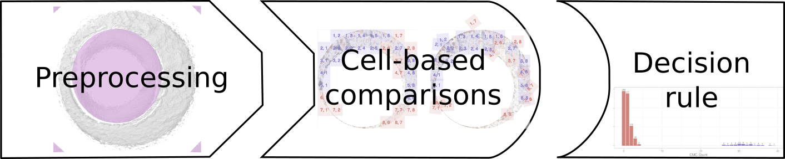
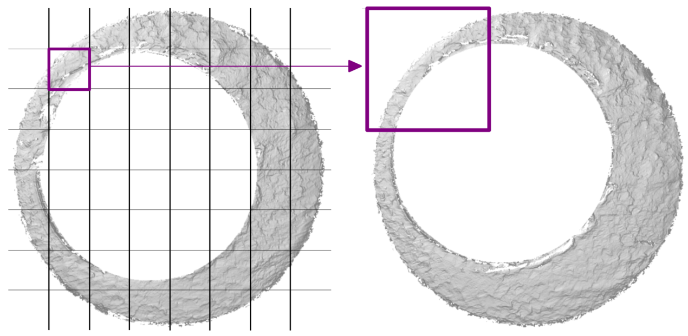

```{r ,localDataDir, include=FALSE}
if (!dir.exists("data")){
  dir.create("data")
}
if (!dir.exists("figures")){
  dir.create("figures")
}
if (!file.exists("data/fadul1-1.x3p")){
  library(dplyr) # pipe not defined yet
  download.file("https://tsapps.nist.gov/NRBTD/Studies/CartridgeMeasurement/DownloadMeasurement/2d9cc51f-6f66-40a0-973a-a9292dbee36d", destfile = "data/fadul1-1.x3p", mode = "wb")
}
if (!file.exists("data/fadul1-2.x3p")){
  download.file("https://tsapps.nist.gov/NRBTD/Studies/CartridgeMeasurement/DownloadMeasurement/cb296c98-39f5-46eb-abff-320a2f5568e8", destfile = "data/fadul1-2.x3p", mode = "wb")
}
if (!file.exists("data/fadul2-1.x3p")){
  download.file("https://tsapps.nist.gov/NRBTD/Studies/CartridgeMeasurement/DownloadMeasurement/8ae0b86d-210a-41fd-ad75-8212f9522f96", destfile = "data/fadul2-1.x3p", mode = "wb")
}
```

```{r setup,echo=FALSE,message=FALSE,warning=FALSE}
knitr::opts_chunk$set(cache = T, dpi = 300, fig.width = 8, fig.height = 4, out.width = "\\textwidth", dpi = 300, fig.path = 'figures/cmcr-')
library(cmcR) # remotes::install_github("CSAFE-ISU/cmcR")
library(tidyverse)
library(x3ptools) # remotes::install_github("heike/x3ptools")
library(rgl)
```

# Introduction {#intro}

Forensic examinations are intended to provide an objective assessment of the probative value of a piece of evidence.
Typically, this assessment of probative value is performed by a forensic examiner who visually inspects the evidence to determine whether it matches evidence found on a suspect.
The process by which an examiner arrives at their evidentiary conclusion is largely opaque and has been criticized [@pcast] because its subjectivity does not allow for an estimation of error rates.
In response, @council_strengthening_2009 pushed to augment subjective decisions made by forensic examiners with automatic algorithms that objectively assess evidence and can be explained during court testimony.
In addition to the objectivity of these algorithms, there is an additional benefit: we expect that an algorithm with the same random seed run on the same data multiple times will produce the same answer; that is, that the results are repeatable.
This is extremely beneficial because it allows the prosecution and defense to come to the same conclusion given objective evidence or data.

## Repeatability and reproducibility

Repeatability in forensic labs is enforced primarily using standard operating procedures (SOPs), which specify the steps taken for any given evaluation, along with the concentrations of any chemicals used, the range of acceptable machine settings, and any calibration procedures required to be completed before the evidence is evaluated.
When labs use computational procedures, this SOP is augmented with specific algorithms, which are themselves SOPs intended for use by man and machine.
Algorithms are generally described on two levels: we need both the conceptual description (intended for the human using the algorithm) and the procedural definition (which provides the computer hardware with a precise set of instructions).
For scientific and forensic repeatability and reproducibility, it is essential to have both pieces: the algorithm description is critical for establishing human understanding and justifying the method's use in court, but no less important is the computer code which provides the higher degree of precision necessary to ensure the results obtained are similar no matter who evaluates the evidence.
As with SOPs in lab settings, the code parameters function like specific chemical concentrations; without those details, the SOP would be incomplete and the results produced would be too variable to be accepted in court.

The @nas_2019 defines *reproducibility* as "obtaining consistent computational results using the same input data, computational steps, methods, code, and conditions of analysis." This form of reproducibility requires that the input data, code, method, and computational environment are all described and made available to the community.
In many situations, this level of reproducibility is not provided -- not just in forensics but in many other applied disciplines.
In forensics in particular, it is easier to list the exceptions: reproducible algorithms have been proposed in sub-disciplines including DNA [@Tvedebrink2020; @osiris; @openForSciR], glass [@Curran2000; @Park2019], handwriting [@crawford_handwriting_2020], shoe prints [@park_algorithm_2020], and ballistic evidence [@hare_automatic_2016; @tai_fully_2018].

We find it useful to instead consider a more inclusive hierarchy of reproducibility.
Algorithms at higher tiers of the hierarchy are more easily reproducible in the sense that fewer resources are required to (re)-implement the algorithm.

**Definition 1** *Hierarchy of Reproducibility*

> **Conceptual description** *The algorithm is described and demonstrated in a scientific publication.*

> **Pseudocode** *The algorithm is described at a high level of detail with pseudocode implementation provided, and results are demonstrated in a scientific publication.*

> **Reproducible data** *The algorithm is described and demonstrated in a scientific publication, and input data are available in supplementary material.*

> **Comparable results** *The algorithm is described and demonstrated in a scientific publication, and input data and numerical results are provided in supplementary material.*

> **Full reproducibility** *The algorithm is described and demonstrated in a scientific publication, and the input data, source code, parameter settings, and numerical results are provided in supplementary material.*

To aid in comprehension of an algorithm, it is useful to supplement conceptual descriptions with pseudocode.
However, a conceptual description and pseudocode alone do not contain sufficient detail (e.g., parameter settings) to ensure computational reproducibility.
Implementing algorithms based on conceptual descriptions or pseudocode requires enumerating and testing possible parameter choices which, depending on their complexity, can be a lengthy and expensive process.
In contrast, implementing fully reproducible algorithms requires only as much time as it takes to emulate the original development environment.
Commonly identified reasons for unreproducible results include (1) ambiguity in how procedures were implemented, (2) missing or incomplete data, and (3) missing or incomplete computer code to replicate all statistical analyses [@leek_is_2017].
In particular, for statistical algorithms which depend on input data, we find that full reproducibility depends on the provision of both original data and any manual pre-processing applied to said data, as this manual process is not reproducible by itself.
In combination with the code, the algorithm description, and the numerical results presented in the paper, it should be possible to fully reproduce the results of a paper.

In this paper, we demonstrate the importance of higher levels of reproducibility by examining the Congruent Matching Cells (CMC) algorithm for cartridge case comparisons and developing an open-source, fully reproducible version for general use in the forensics community.

## The Congruent Matching Cells algorithm

A *cartridge case* is the portion of firearm ammunition that encases a projectile (e.g., bullet, shots, or slug) along with the explosive used to propel the projectile through the firearm.
When a firearm is discharged, the projectile is propelled down the barrel of the firearm, while the cartridge case is forced towards the back of the barrel.
It strikes the back wall, known as the *breech face*, of the barrel with considerable force, thereby imprinting any markings on the breech face onto the cartridge case and creating the so-called *breech face impressions*.
These markings are used in forensic examinations to determine whether two cartridge cases have been fired by the same firearm.
During a forensic examination, two pieces of ballistic evidence are placed under a *comparison microscope*.
Comparison microscopes allow for a side-by-side comparison of two objects within the same viewfinder, as seen in Figure \@ref(fig:ccPair).
A pair of breech face images is aligned along the thin black line in the middle of the images.
The degree to which these breech face markings can be aligned is used to determine whether the two cartridge cases came from the same source; i.e., were fired from the same firearm.
These breech face impressions are considered analogous to a firearm's "fingerprint" left on a cartridge case [@firearm_id_thompson].

```{r ccPair,echo=FALSE,fig.cap='A cartridge case pair with visible breech face impressions under a microscope.  A thin line can be seen separating the two views. The degree to which the markings coincide is used to conclude whether the pair comes from the same source.',fig.pos='htbp',fig.fullwidth=TRUE, fig.alt="Photos of the bottoms of two matching cartridge cases separated by a vertical line. The cartridge case photos have been aligned such that it appears as if the markings from cartridge case continue across the vertical line onto the other cartridge case. This emphasizes the similar markings on the two cases."}
knitr::include_graphics("images/cartridgeCasePair_comparison_with_line.PNG")
```

The Congruent Matching Cells (CMC) pipeline is a collection of algorithms to process and compare cartridge case evidence [@song_proposed_2013].
Since its introduction, the pipeline and its extensions [@tong_improved_2015; @chen_convergence_2017; @song_estimating_2018] have shown promise in being able to differentiate between matching and non-matching cartridge cases.
However, so far the CMC pipelines have only been introduced in the form of conceptual descriptions.
Further, the cartridge case scans used to validate the pipelines are only available in their raw, unprocessed forms on the NIST Ballistics Toolmark Research Database [@nbtrd].
While it is clear that the creators of the CMC pipeline have a working implementation, the wider forensic science community only has access to conceptual descriptions of the pipeline and summary statistics describing its performance.
In our hierarchy of reproducibility, this puts the CMC algorithm somewhere between the conceptual description and reproducible data stage: the steps are described but no code is available, and the raw data are available but manual pre-processing steps make this raw data insufficient to replicate the pipeline even with newly written code.

The development of the CMC algorithm seems to be representative of how many forensic algorithms are developed: after an algorithm is introduced, researchers build upon the foundation laid by the original algorithm in subsequent papers.
These changes are often incremental in nature and reflect a growing understanding of the algorithm's behavior.
While this cycle of scientific progress certainly is not unique to forensic algorithms, given the gravity of the application it is imperative that these incremental improvements not be unnecessarily delayed.
As such, we believe that the forensic community at-large would benefit greatly by establishing an open-source foundation for their algorithms upon which additional improvements can be developed.
Using open-source algorithms are cheaper to use than writing one's own code, enables the process of peer review by providing an accessible benchmark, and helps other research groups or companies stay on the leading edge of technology development [@linux].

Here, we describe the process of implementing the CMC pipeline for the comparison of marks on spent cartridge cases, using the descriptions from two published papers, @song_3d_2014 and @tong_improved_2015.
Our R package, \CRANpkg{cmcR}, provides an open-source implementation of the CMC pipeline.
We use \CRANpkg{cmcR} to illustrate how ambiguities in the textual description of an algorithm can lead to highly divergent results.
In particular, our implementation highlights an extreme sensitivity to processing and parameter decisions that has not been discussed previously.
Additionally, we argue that our implementation can be used as a template for future implementations of forensic pattern-matching algorithms to not only ensure transparency and auditability, but also to facilitate incremental improvements in forensic algorithms.

In the remainder of this paper, we describe a general, reproducible, and open-source CMC pipeline which encompasses those discussed in @song_proposed_2013, @song_3d_2014, and @tong_improved_2015.
@song_proposed_2013 lays out the conceptual framework for the original CMC pipeline later implemented in @song_3d_2014 and @tong_fired_2014.
An improvement of the pipeline presented in @tong_improved_2015 and used in subsequent papers is referred to as the "High CMC" method [@chen_convergence_2017]. However, it should be noted that what the authors refer to as the original and High CMC decision rules are variations of one step of a larger CMC pipeline.

The \CRANpkg{cmcR} package contains implementations designed for use with 3D topographical scans of the original decision rule described in @song_proposed_2013 and @song_3d_2014 and the High CMC decision rule described in @tong_improved_2015.
The source code to the full \CRANpkg{cmcR} package is accessible at <https://github.com/CSAFE-ISU/cmcR>.

# The CMC pipeline {#cmcMethod}

In this section, we examine the process of implementing the CMC pipeline for automatic comparisons of 3D cartridge case scans.
At each step, we will discuss how we filled in the gaps of the original description during the creation of \CRANpkg{cmcR}.

All of the CMC pipelines can be broken down into three broad stages: (1) pre-processing, (2) cell-based similarity feature extraction, and (3) application of a decision rule as illustrated in \autoref{fig:overview-flow}.
In the following sections we break each of these stages further into a set of modular steps.
One advantage of modularizing these algorithms is that we can implement an algorithm as a set of sequential procedures.
This allows us to test new variations against the old implementation in a coherent, unified framework.

```{r overview-flow,echo=FALSE,fig.cap='The stages of CMC pipelines. In the pre-processing stage, each scan is prepared for analysis, removing extraneous information and noise. Then, each scan is broken up into cells, which are numerically compared to cells in the other scan to determine an optimal alignment. Finally, each of the scores arising from the cells in the second stage are compared to a reference distribution to determine whether the scans originate from the same source or from different sources.',fig.pos='htbp',fig.fullwidth=TRUE, fig.alt="A diagram of three puzzle pieces arranged horizontally that represent the three stages of the CMC pipeline. The pre-processing puzzle piece shows a raw cartridge case scan with regions highlighted to be removed. The cell-based comparisons piece shows two cartridge case scans with blue and red cells overlaid. The decision rule piece shows a histogram plot of CMC counts for non-matching and matching cartridge case pairs in red and blue, respectively. The matching CMC count distribution is located at higher CMC values than the non-match distribution. "}

```

The primary difference between the two pipelines presented here, using the original and High CMC decision rules, lies in how the decision rules are utilized to separate matching vs. non-matching cartridge case pairs.
In addition, there are also several small differences in the parameters used in the pre-processing and comparison procedures.

## Initial data {#initialData}

Digital microscopy is capable of precision measurements of surface topology at high resolutions.
Using a 3D microscope, we can obtain scans of breech face impressions at the micron level ($1 \mu m = 10^{-3} mm = 10^{-6} m$).
These 3D topological scans are used as input to automated comparison algorithms, such as the CMC pipeline originally proposed in @song_proposed_2013.
We will use the same data set referenced in @song_3d_2014 and @tong_improved_2015 to illustrate usage of the \CRANpkg{cmcR} package.
These 3D scans of cartridge cases are available from the NIST Ballistics Toolmark Research Database [@nbtrd].
The strings defined below refer to three cartridge case scans available on the NBTRD from @fadul_empirical_2011 and will be used throughout the remainder of this paper.

```{r eval=FALSE,echo=FALSE}
# SVP comment: Should do this in a tidy way with less code if possible...
library(cmcR)

fadul1.1_id <- "DownloadMeasurement/2d9cc51f-6f66-40a0-973a-a9292dbee36d"
# Same source comparison
fadul1.2_id <- "DownloadMeasurement/cb296c98-39f5-46eb-abff-320a2f5568e8"
# Different source comparison
fadul2.1_id <- "DownloadMeasurement/8ae0b86d-210a-41fd-ad75-8212f9522f96"

#Code to download breech face impressions:

# Aside: while the URL says "NRBTD", it's
#actually the NIST Ballistics Toolmark Research Database (so their URL
#is mistaken)

nbtrd_url <- "https://tsapps.nist.gov/NRBTD/Studies/CartridgeMeasurement"
download.file(
  file.path(nbtrd_url , fadul1.1_id), destfile = "data/fadul1-1.x3p", mode = "wb")
download.file(
  file.path(nbtrd_url , fadul1.2_id), destfile = "data/fadul1-2.x3p", mode = "wb")
download.file(
  file.path(nbtrd_url, fadul2.1_id), destfile = "data/fadul2-1.x3p", mode = "wb")
```

```{r eval=FALSE,echo=TRUE}
library(cmcR)

nbtrd_url <- "https://tsapps.nist.gov/NRBTD/Studies/CartridgeMeasurement"

x3p_ids <- c("DownloadMeasurement/2d9cc51f-6f66-40a0-973a-a9292dbee36d",
             "DownloadMeasurement/cb296c98-39f5-46eb-abff-320a2f5568e8",
             "DownloadMeasurement/8ae0b86d-210a-41fd-ad75-8212f9522f96")

file_names <- c("fadul1-1.x3p","fadul1-2.x3p","fadul2-1.x3p")

purrr::walk2(.x = x3p_ids,
             .y = file_names,
             .f = function(x3p_id,file_name){
               download.file(url = file.path(nbtrd_url, x3p_id),
                             destfile = paste0("data/",file_name),mode = "wb")
             })
```

Cartridge case scans are commonly stored in the ISO standard x3p file format [@ISO25178-72].
x3p is a container format which consists of a single surface matrix representing the height value of the breech face surface and metadata concerning the parameters under which the scan was taken (size, resolution, creator, microscope, microscopy software versions, etc.).
The \CRANpkg{x3ptools} package provides functionality to work with the format in R [@x3ptools].

Figure `r knitr::asis_output(ifelse(knitr::is_html_output(), '\\@ref(fig:cartridgeCasePair-html)', '\\@ref(fig:cartridgeCasePair-latex)'))` shows the surface matrices of a known match (KM) pair of cartridge cases from a study by @fadul_empirical_2011.
In this study, a total of 40 cartridge cases were scanned with a lateral resolution of 6.25 microns (micrometers) per pixel.
The surface matrices are approximately $1200 \times 1200$ pixels in size corresponding to an area of about $3.8 \times 3.8$ mm$^2$.

```{r, fadul1-1Screenshot,include=FALSE}
fadul1.1 <- x3ptools::x3p_read("data/fadul1-1.x3p")

#apply low-pass filter to reduce noise in scan:
surface1 <- fadul1.1 %>%
  cmcR::preProcess_gaussFilter(wavelength = 16,filtertype = "lp")

surface1 <- surface1$surface.matrix

params <- rgl::r3dDefaults

zoom <- .7
size <- c(300,300)

params$windowRect <- c(40, 125, 40 + size[1], 125 + size[2])
params$userMatrix <- diag(c(1, 1, 1, 1))
params$zoom <- zoom

#for some reason the first rgl device opened doesn't plot anything, but
#subsequent devices do...
open3d(params = params)
close3d()

#opens blank "canvas" upon which we can add lights, surfaces, etc.
open3d(params = params)

#removes any previously declared lights in scene
rgl.pop("lights")

#set-up two lights for scene -- a lot of experimentation possible here
light3d(x = -1,y = 1,z = 2,viewpoint.rel = TRUE,ambient = "white",diffuse = "white",specular = "white")
light3d(x = 0,y = 0,z = 10,ambient = "grey60",diffuse = "grey50",specular = "grey60",viewpoint.rel = TRUE)

#setup surface visualization
multiply <- 1 #x3ptools::image_x3p default to exaggerate relief
z <- multiply * surface1 # Exaggerate the relief
yidx <- ncol(z):1
y <- fadul1.1$header.info$incrementY * yidx
x <- fadul1.1$header.info$incrementX * (1:nrow(z))

# emission, specular, ambient affect how the surface interacts with lights --
# again, a lot of possible experimentation
surface3d(x, y, z, back = "filled",emission = "grey30",specular = "grey50",ambient = "grey10")

x3ptools::x3p_snapshot(file = "figures/fadul1-1.png")

close3d()
```

```{r ,fadul1-2Screenshot,include=FALSE}
fadul1.2 <- x3ptools::x3p_read("data/fadul1-2.x3p")

surface2 <- fadul1.2 %>%
  cmcR::preProcess_gaussFilter(wavelength = 16,filtertype = "lp")
#opens blank "canvas" upon which we can add lights, surfaces, etc.
open3d(params = params)

surface2 <- surface2$surface.matrix

#removes any previously declared lights in scene
rgl.pop("lights")

#set-up two lights for scene -- a lot of experimentation possible here
light3d(x = -1,y = 1,z = 2,viewpoint.rel = TRUE,ambient = "white",diffuse = "white",specular = "white")
light3d(x = 0,y = 0,z = 10,ambient = "grey60",diffuse = "grey50",specular = "grey60",viewpoint.rel = TRUE)

#setup surface visualization
multiply <- 1 #x3ptools::image_x3p default to exaggerate relief
z <- multiply * surface2 # Exaggerate the relief
yidx <- ncol(z):1
y <- fadul1.2$header.info$incrementY * yidx
x <- fadul1.2$header.info$incrementX * (1:nrow(z))

# emission, specular, ambient affect how the surface interacts with lights --
# again, a lot of possible experimentation
surface3d(x, y, z, back = "filled",emission = "grey30",specular = "grey50",ambient = "grey10")

x3ptools::x3p_snapshot(file = "figures/fadul1-2.png")

close3d()
```

```{r cartridgeCasePair-html,eval=knitr::is_html_output(),echo=FALSE,fig.cap='Unprocessed surface matrices of the known-match Fadul 1-1 and Fadul 1-2 Fadul et al. \\(2011\\). The observations in the corners of these surface matrices are artifacts of the staging area in which these scans were taken. The holes on the interior of the primer surfaces are caused by the firing pin striking the primer during the firing process. The region of the primer around this hole does not come into uniform contact with the breech face of the firearm.', fig.subcap=c('',''),fig.align='center',fig.pos='htbp',out.width=".49\\linewidth",out.height=".49\\linewidth",fig.alt="A visualization of two unprocessed cartridge case scans where the surface height values are mapped to a gray color gradient. It is difficult to assess the similarity between the unprocessed scans, which motivates the need for the pre-processing stage of the CMC pipeline."}
knitr::include_graphics(c("figures/fadul1-1.png","figures/fadul1-2.png"))
```

```{r cartridgeCasePair-latex,eval=knitr::is_latex_output(),echo=FALSE,fig.cap='Unprocessed surface matrices of the known-match Fadul 1-1 and Fadul 1-2 Fadul et al. \\(2011\\). The observations in the corners of these surface matrices are artifacts of the staging area in which these scans were taken. The holes on the interior of the primer surfaces are caused by the firing pin striking the primer during the firing process. The region of the primer around this hole does not come into uniform contact with the breech face of the firearm.',fig.alt="A visualization of two unprocessed cartridge case scans where the surface height values are mapped to a gray color gradient. It is difficult to assess the similarity between the unprocessed scans, which motivates the need for the pre-processing stage of the CMC pipeline.", fig.subcap=c('',''),fig.align='center',fig.pos='htbp',out.width=".49\\linewidth",out.height=".49\\linewidth"}
knitr::include_graphics(c("figures/fadul1-1.png","figures/fadul1-2.png"))
```

Only certain regions of a cartridge case contain identifying breech face impression markings.
@song_proposed_2013 defines "valid correlation regions" as regions where "the individual characteristics of the ballistics signature are found that can be used effectively for ballistics identification." Prior to applying the CMC comparison procedure, cartridge scans must undergo some pre-processing to isolate the valid correlation regions.

```{r load-data, include = F, cache = T}

fadul1.1 <- x3ptools::x3p_read("data/fadul1-1.x3p") %>%
  cmcR::preProcess_crop(region = "exterior",
                        offset = -30) %>%
  cmcR::preProcess_crop(region = "interior",
                        offset = 200) %>%
  cmcR::preProcess_removeTrend(statistic = "quantile",
                               tau = .5,
                               method = "fn") %>%
  cmcR::preProcess_gaussFilter() %>%
  x3ptools::sample_x3p()

fadul1.2 <- x3ptools::x3p_read("data/fadul1-2.x3p") %>%
  cmcR::preProcess_crop(region = "exterior",
                        offset = -30) %>%
  cmcR::preProcess_crop(region = "interior",
                        offset = 200) %>%
  cmcR::preProcess_removeTrend(statistic = "quantile",
                               tau = .5,
                               method = "fn") %>%
  cmcR::preProcess_gaussFilter() %>%
  x3ptools::sample_x3p()
```

```{r cmc-ccf, include = F, cache = T}
reference_11 <- purrr::partial(.f = comparison_allTogether,
                               reference = fadul1.1, target = fadul1.2,
                               numCells = c(8,8), maxMissingProp = .85,returnX3Ps = TRUE)
reference_12 <- purrr::partial(.f = comparison_allTogether,
                               reference = fadul1.2, target = fadul1.1,
                               numCells = c(8,8), maxMissingProp = .85,returnX3Ps = TRUE)

kmComparisonFeatures <- purrr::map_dfr(seq(-30,30,by = 3),
                                       ~reference_11(theta = .)) %>%
  mutate(originalMethodClassif = decision_CMC(cellIndex = cellIndex,
                                              x = x,
                                              y = y,
                                              theta = theta,
                                              corr = pairwiseCompCor,
                                              xThresh = 20,
                                              thetaThresh = 6,
                                              corrThresh = .5),
         highCMCClassif = decision_CMC(cellIndex = cellIndex,
                                       x = x,
                                       y = y,
                                       theta = theta,
                                       corr = pairwiseCompCor,
                                       xThresh = 20,
                                       thetaThresh = 6,
                                       corrThresh = .5,
                                       tau = 1))

kmComparisonFeatures_rev <- purrr::map_dfr(seq(-30,30,by = 3),
                                           ~reference_12(theta = .)) %>%
  mutate(originalMethodClassif = decision_CMC(cellIndex = cellIndex,
                                              x = x,
                                              y = y,
                                              theta = theta,
                                              corr = pairwiseCompCor,
                                              xThresh = 20,
                                              thetaThresh = 6,
                                              corrThresh = .5),
         highCMCClassif = decision_CMC(cellIndex = cellIndex,
                                       x = x,
                                       y = y,
                                       theta = theta,
                                       corr = pairwiseCompCor,
                                       xThresh = 20,
                                       thetaThresh = 6,
                                       corrThresh = .5,
                                       tau = 1))
```

## Pre-processing procedures {#preProcessing}

During the pre-processing stage, we apply sequential steps to prepare each cartridge case for analysis.
The goal of this process is to remove the edges and center of the scan which did not come into contact with the breech face, as well as any artifacts of the scan and microscope staging which do not accurately represent the breech face surface.
The various iterations of the CMC algorithm describe different variations of these steps.
A summary of these steps is shown in Figure \@ref(fig:pre-processing-schematic).

```{r pre-processing-schematic,echo=FALSE,fig.cap="Overview of the set of pre-processing steps used in the CMC algorithms. Where a procedure step is not discussed or explicitly not applied in the paper, the path traverses empty space.",fig.align="center",fig.fullwidth=TRUE,fig.alt="A flow diagram showing the various pre-processing procedures used across CMC papers. These steps are shown as horizontally-arranged puzzle pieces and include type of input, the amount of downsampling performed on the scans, any resizing performed after downsampling, whether the breech face impression regions were isolated manually or automatically, and the type of Gaussian filter applied. Traversing these puzzle pieces is a curve for each CMC paper. The diagram is intended to show how different the pre-processing procedures are across papers, which makes it difficult to compare results if the underlying data/code aren't avaiable."}
knitr::include_graphics("images/preprocessing_flow.png")
```

Translating the pre-processing steps in Figure \@ref(fig:pre-processing-schematic) into an implementation requires the implementer to decide between potentially many implicit parameter choices.
For example, Table `r knitr::asis_output(ifelse(knitr::is_html_output(), '\\@ref(tab:pre-processTable-html)', '\\@ref(tab:pre-processTable)'))` compares the pre-processing procedures as described in @song_3d_2014 to considerations that need to be made when implementing the procedures.
Depending on one's interpretation of the description, there are many possible implementations that satisfy the described procedure - in contrast, there was only one implementation that led to the original results.
While not explicitly mentioned in @song_3d_2014, @song_estimating_2018 indicates that the "trimming" of the unwanted regions of the scan is performed manually.
It is difficult to replicate manual steps as part of a reproducible pipeline; the best solution is for the authors to provide intermediate data after the manual steps have been completed.

\renewcommand{\arraystretch}{2}

```{r pre-processTable,echo=FALSE,eval=knitr::is_latex_output()}
data.frame("Description from Song et al. (2014)" = 
             c('"Trim off the inside firing pin surface and other areas outside the breech face mark, so that only breech face impression data remain for correlation."',
               '"Identify and remove dropouts or outliers."',
               '"Apply a band-pass Gaussian regression filter with 40 $\\mu$m short cut-off length and 400 $\\mu$m long cut-off length to remove low frequency components, including surface curvature, form error, waviness and high frequency components which mainly arise from the instrument noise."'),
           "Implementation Considerations" = 
             c("Removal of firing pin hole, primer exterior, global trend, and primer roll-off",
               'Definition of outliers, what "removal" of dropouts or outliers means',
               "Wavelength cut-off parameters, specific implementation of the filter")) %>%
  knitr::kable(format = "latex",escape = FALSE,
               col.names = c("Description from Song et al. (2014)",
                             "Implementation Considerations"),
               caption = "Description of pre-processing procedures from Song et al. \\(2014\\) vs. considerations that need to be made when implementing these procedures. Each of these considerations requires the implementer to decide between potentially many choices.",
               linesep = "",booktabs = TRUE) %>%
  kableExtra::kable_styling(full_width = TRUE) %>%
  kableExtra::row_spec(row = 0,bold = TRUE)
```


```{r pre-processTable-html,echo=FALSE,eval=knitr::is_html_output()}
data.frame("Description from Song et al. (2014)" = 
             c('"Trim off the inside firing pin surface and other areas outside the breech face mark, so that only breech face impression data remain for correlation."',
               '"Identify and remove dropouts or outliers."',
               '"Apply a band-pass Gaussian regression filter with 40 $\\mu$m short cut-off length and 400 $\\mu$m long cut-off length to remove low frequency components, including surface curvature, form error, waviness and high frequency components which mainly arise from the instrument noise."'),
           "Implementation Considerations" = 
             c("Removal of firing pin hole and primer exterior<br>Removal of global trend<br>Removal of primer roll-off",
               'Definition of outliers<br>What "removal" of dropouts or outliers means',
               "Wavelength cut-off parameters<br>Specific implementation of the filter")) %>%
  knitr::kable(col.names = c("Description from Song et al. (2014)",
                             "Implementation Considerations"),
               caption = "Description of pre-processing procedures from Song et al. \\(2014\\) vs. considerations that need to be made when implementing these procedures. Each of these considerations requires the implementer to decide between potentially many choices.",
               format = "html",escape = FALSE)
```

The pre-processing procedures are implemented via modularized functions of the form `preProcess_*`.
Modularizing the steps of the pre-processing procedures makes the overall process easier to understand and allows for experimentation.
Figure \@ref(fig:processingPipeline) shows an overview of the pre-processing framework for the Fadul 1-1 breech face from reading the scan (left) to an analysis-ready region (right).
For each scan in Figure  \@ref(fig:processingPipeline), eleven height value percentiles: the Minimum (0th), 1st, 2.5th, 10th, 25th, Median (50th), 75th, 90th, 97.5th, 99th, and Maximum (100th) are mapped to a purple-to-orange color gradient.
This mapping is chosen to highlight the extreme values in each scan.

```{r cache=FALSE, include=F}
fadul1.1_original <- x3ptools::x3p_read("data/fadul1-1.x3p")

fadul1.1_croppedExt <- cmcR::preProcess_crop(fadul1.1_original,
                                             region = "exterior",
                                             offset = -30)

fadul1.1_croppedInt <- cmcR::preProcess_crop(fadul1.1_croppedExt,
                                             region = "interior",
                                             offset = 200)

fadul1.1_medRemoved <-   cmcR::preProcess_removeTrend(fadul1.1_croppedInt,
                                                      statistic = "quantile",
                                                      tau = .5,
                                                      method = "fn")


fadul1.1_downsampled <- x3ptools::sample_x3p(fadul1.1_medRemoved,
                                             m = 2)

fadul1.1_bpFiltered <- cmcR::preProcess_gaussFilter(x3p = fadul1.1_downsampled,
                                                    wavelength = c(16,500),
                                                    filtertype = "bp")
```

```{r processingPipeline_code, echo = F,warning = F,message = F,cache = F,include=FALSE}

fadul1.1_original$surface.matrix <- fadul1.1_original$surface.matrix*1e6
fadul1.1_croppedInt$surface.matrix <- fadul1.1_croppedInt$surface.matrix*1e6
fadul1.1_medRemoved$surface.matrix <- fadul1.1_medRemoved$surface.matrix*1e6
fadul1.1_bpFiltered$surface.matrix <- fadul1.1_bpFiltered$surface.matrix*1e6

preProcessingPlot <- cmcR::x3pListPlot(list(fadul1.1_original,
                                            fadul1.1_croppedInt,
                                            fadul1.1_medRemoved,
                                            fadul1.1_bpFiltered) %>%
                                         set_names(c("(1) Original \n x3p_read()",
                                                     "(2) Crop exterior/interior \n preProcess_crop()",
                                                     "(3) Level surface \n preProcess_removeTrend()",
                                                     "(4) Band-pass filter \n preProcess_gaussFilter()")),
                                       type = "list",
                                       legend.quantiles = c(0,.5,1)) %>%
  map2(.x = .,
       .y = list(element_text(),element_blank(),element_blank(),element_blank()),
       .f = ~ .x + theme(legend.position = "bottom",
                         legend.title = .y) +
         ggplot2::guides(fill = ggplot2::guide_colourbar(barheight = grid::unit(.3,"in"),
                                                         barwidth = grid::unit(1.5,"in"),
                                                         label.theme = ggplot2::element_text(size = 7),
                                                         title.theme = ggplot2::element_text(size = 10),
                                                         title.position = "top",
                                                         frame.colour = "black",
                                                         ticks.colour = "black"),
                         colour = FALSE) +
         scale_fill_gradientn(colours = rev(c('#7f3b08','#b35806','#e08214','#fdb863','#fee0b6','#f7f7f7','#d8daeb','#b2abd2','#8073ac','#542788','#2d004b')),
                              values = scales::rescale(quantile(.x[[1]]$value,c(0,.01,.025,.1,.25,.5,.75,0.9,.975,.99,1),na.rm = TRUE)),
                              breaks = c(round(min(.x[[1]]$value,na.rm = TRUE),2),
                                         0,
                                         round(max(.x[[1]]$value,na.rm=TRUE),2)),
                              limits = c(1.01*min(.x[[1]]$value,na.rm = TRUE),
                                         1.01*max(.x[[1]]$value,na.rm=TRUE)),
                              na.value = "gray80") +
         ggplot2::labs(fill = expression("Height ["*mu*"m]")))

plt <- gridExtra::grid.arrange(preProcessingPlot$`(1) Original`,
                               preProcessingPlot$`(2) Crop exterior/interior`,
                               preProcessingPlot$`(3) Level surface`,
                               preProcessingPlot$`(4) Band-pass filter`,
                               widths = unit(c(1,1,1,1),units = "null"))

ggsave(plt,file = "figures/preProcessPipeline.png")
```

```{r processingPipeline, echo = F,warning = F,message = F,cache = T,fig.cap='Illustration of the sequential application of pre-processing steps implemented in \\CRANpkg{cmcR}. We map the cartridge case surface height values to a divergent purple-white-orange color scale to emphasize deviations from the median height value (represented here as 0 micrometers). At each stage, the variability in height across the scan decreases as we emphasize the regions containing breech face impressions.',fig.align='center',fig.pos='htbp',fig.fullwidth = TRUE,fig.alt="A diagram of a cartridge case scan undergoing four pre-processing steps: reading, cropping, de-trending, and filtering. The final result is a cartridge case scan with emphasized breech face impressions."}

knitr::include_graphics("figures/preProcessPipeline.png")

```


We demonstrate usage of the `preProcess_*` functions on the Fadul 1-1 scan.
Each code chunk is followed up with an explanation of the functions used.

```{r, echo=TRUE,eval=FALSE}
# Step (1)
fadul1.1 <- x3ptools::x3p_read("data/fadul1-1.x3p")
```

We begin with a 3D scan.
Typically, we downsample scans to about 25% of their size by only retaining every other row and column in the surface matrix.
The breech faces in @fadul_empirical_2011 were initially scanned at a resolution of 3.125 $\mu$m per pixel.
Downsampling reduces the resolution to 6.25 $\mu$m per pixel.
Step (1) in Figure \@ref(fig:processingPipeline) shows an unprocessed breech face scan.

```{r, echo=TRUE,eval=FALSE}
# Step (2)
fadul1.1_cropped <- fadul1.1 %>%
  cmcR::preProcess_crop(region = "exterior") %>%
  cmcR::preProcess_crop(region = "interior")
```

We then use a labeling algorithm to identify three major regions of the scan: the exterior of the cartridge case primer, the breech face impression region of interest, and the firing pin impression region in the center of the scan [@hesselink_concurrent_2001; @imager].
We remove observations outside of the breech face impression region (i.e., replaced with `NA`).
The resulting breech face scan, like the one shown in step (2) of Figure  \@ref(fig:processingPipeline), is reproducible assuming the same parameters are used.
The `preProcess_crop` function removes the exterior and firing pin impression region on the interior based on the `region` argument.

```{r, echo=TRUE,eval=FALSE}
# Step (3)
fadul1.1_deTrended <- fadul1.1_cropped %>%
  preProcess_removeTrend(statistic = "quantile", tau = .5, method = "fn")
```

In step (3), we remove the southwest-to-northeast trend observable in steps (1) and (2) of Figure \@ref(fig:processingPipeline) by subtracting the estimated conditional median height value.
The result of the `preProcess_removeTrend` function the median-leveled breech face scan in step (3) of Figure  \@ref(fig:processingPipeline).

```{r, echo=TRUE,eval=FALSE}
# Step (4)
fadul1.1_processed <- fadul1.1_deTrended %>%
  preProcess_gaussFilter(filtertype = "bp", wavelength = c(16,500)) %>%
  x3ptools::x3p_sample(m = 2)
```

Finally, we apply a band-pass Gaussian filter to the surface values to attenuate noise and unwanted large-scale structure.
Step (4) of Figure  \@ref(fig:processingPipeline) shows the effect of the `preProcess_gaussFilter` function.
There is currently no determination or removal of outliers in the \CRANpkg{cmcR} package's pre-processing procedures.
Instead, we rely on the low-pass portion of the Gaussian filter to reduce the effects of any high-frequency noise.

Figure \@ref(fig:processedScans) displays the processed Fadul 1-1 and Fadul 1-2 scans; the second matrix is processed using the same parameters.
Next, similarity features are extracted from a processed cartridge case pair in the cell-based comparison procedure.

```{r processedScans,echo=FALSE,cache = T,fig.cap='Fadul 1-1 and Fadul 1-2 after pre-processing. Similar striated markings are now easier to visually identify on both surfaces. It is now clearer that one of the scans needs to be rotated to align better with the other.',fig.align='center',fig.pos='htbp',fig.fullwidth=TRUE, message = F, warning = F,fig.alt="A visualization of two pre-processed, matching cartridge case scans. The height values are mapped to a divergent purple to orange color scale to emphasize values lower or higher than the median height value, respectively. Compared to the raw cartridge case scan visualization, it is easier to see the similar markings on the pre-processed cartridge case surfaces."}

fadul1.1_scaled <- fadul1.1
fadul1.1_scaled$surface.matrix <- fadul1.1_scaled$surface.matrix*1e6
fadul1.2_scaled <- fadul1.2
fadul1.2_scaled$surface.matrix <- fadul1.2_scaled$surface.matrix*1e6

cmcR::x3pListPlot(x3pList = list("Fadul 1-1" = fadul1.1,
                                 "Fadul 1-2" = fadul1.2),
                  # x3pList = list("Fadul 1-1" = fadul1.1$x3p,
                  #"Fadul 1-2" = fadul1.2$x3p),
                  type = "faceted",
                  legend.quantiles = c(0,.01,.2,.5,.8,.99,1)) +
  guides(fill = guide_colourbar(barheight = grid::unit(2.6,"inches"),
                                label.theme = element_text(size = 7),
                                title.theme = ggplot2::element_text(size = 9),
                                frame.colour = "black",
                                ticks.colour = "black")) +
  theme(legend.position = c(1.11,.551),plot.margin = ggplot2::margin(c(0,3,.2,0),unit = "cm"))
```

## "Correlation cell" comparison procedure {#comparisonProcedure}

As described in @song_proposed_2013, breech face markings are not uniformly impressed upon a cartridge case during the firing process.
As such, only certain sections of the cartridge case are used in a comparison.
In the CMC pipeline as proposed by @song_proposed_2013 two scans are compared by partitioning one breech face scan into a grid of so-called "correlation cells".
These cells are compared individually to their best-matching counterpart on the other scan.
If a large proportion of these correlation cells are highly similar to their counterparts on the other breech face scan, this is considered as evidence that the markings on the two cartridge cases were made by the same source.
The number of highly similar cells is defined as the *CMC count* $C$ [@song_proposed_2013] of the breech-face comparison.
The CMC count is considered to be a more robust measure of similarity than the correlation calculated between two full scans.

```{r cmc-illustration, echo=FALSE,fig.cap='Illustration of comparing a cell in the reference cartridge case scan (left) to a larger region in a questioned cartridge case scan (right). Every one of the cells in the reference cartridge case is similarly paired with a region in the questioned cartridge case.  To determine the rotation at which the two cartridge cases align, the cell-region pairs are compared for various rotations of the questioned cartridge case.',fig.align='center',fig.pos='htbp',out.width='.75\\textwidth',fig.alt="A diagram of two cartridge cases scans undergoing the cell-based comparison procedure. One scan, called the 'reference,' is shown partitioned into a grid of cells. One of the cells is highlighted with an arrow connecting it to a square region in the other cartridge case scan, referred to as the 'target.' This is to illustrate how each cell in the reference scan finds its translational and rotational alignment in the target scan."}


```

Figure \@ref(fig:cmc-illustration) illustrates the cell-based comparison procedure between two cartridge case scans.
The scan on the left serves as the reference; it is divided into a grid of $8 \times 8$ cells.

```{r cmc-schematic,echo=FALSE,fig.cap="Each CMC implementation uses a slightly different procedure to obtain a similarity score between two cartridge cases. Steps which are implemented with additional user-specified parameters are shaded purple; steps which are described but without sufficient detail are shaded grey.",fig.fullwidth=TRUE,fig.alt="A flow diagram that is similar in structure to the pre-processing flow diagram, yet shows the various steps in the cell-based comparison procedure. Each step is represented as a puzzle piece while the procedures used in individual CMC papers are represented as curves that traverse these puzzle pieces. This is again intended to show the variability in the comparison procedures used across CMC papers. Most notable in the comparison stage are the large number of implicit parameter choices that need to be made by an implementer."}
knitr::include_graphics("images/cmc_flow.png")
```

Figure \@ref(fig:cmc-schematic) shows the steps of the correlation cell comparison process in each of the papers as well as the \CRANpkg{cmcR} implementation.
Each cell is paired with an associated larger region in the other scan.
The absolute location of each cell and region in their respective surface matrices remain constant.
However, the scan on the right is rotated to determine the rotation at which the two scans are the most "similar," as quantified by the *cross-correlation function* (CCF).

For real-valued matrices $A$ and $B$ of dimension $M \times N$ and $P \times Q$, respectively, the cross-correlation function, denoted $(A \star B)$ is defined as 
$$
(A \star B)[m,n] = \sum_{i=1}^M \sum_{j=1}^N A[i,j] B[(i + m), (j + n)],
$$ where $1 \leq m \leq M + P - 1$ and $1 \leq n \leq N + Q - 1$.
By this definition, the $[m,n]$th element of the resulting $M + P - 1 \times N + Q - 1$ CCF matrix quantifies the similarity between matrices $A$ and $B$ for a translation of matrix $B$ by $m$ pixels horizontally and $n$ pixel vertically.
The index at which the CCF attains a maximum represents the optimal translation needed to align $B$ with $A$.
The CCF as defined need not be bounded between $-1$ and $1$.
However, it is common to normalize the CCF for interpretability, and this is the convention adopted in the \CRANpkg{cmcR} package.

Prior to calculating the CCF, the matrices $A$ and $B$ are standardized through subtraction of their respective means and division by their respective standard deviations.
This is referred to as the *Areal Cross-Correlation Function* (ACCF) in some CMC papers [@ott_applying_2017].
A direct calculation of the CCF for breech face scans based on the definition above is prohibitively slow.
While computationally feasible alternatives exist, @song_proposed_2013 and other CMC papers do not specify the algorithm used to calculate the CCF.

Published descriptions of the CMC algorithm do not detail how the CCF is calculated.
In image processing, it is common to use an implementation based on the Fast Fourier Transform [@Brown92asurvey].
This implementation leverages the Cross-Correlation Theorem, which states that for matrices $A$ and $B$, the CCF can be expressed in terms of a frequency-domain pointwise product: 
$$
(A \star B )[m,n]= \mathcal{F}^{-1}\left(\overline{\mathcal{F}(A)} \odot \mathcal{F}(B)\right)[m,n],
$$ 
where $\mathcal{F}$ and $\mathcal{F}^{-1}$ denote the discrete Fourier and inverse discrete Fourier transforms, respectively, and $\overline{\mathcal{F}(A)}$ denotes the complex conjugate [@fft_brigham].
Because the product on the right-hand side is calculated pointwise, we trade the moving sum computations from the definition of the CCF for two forward Fourier transformations, a pointwise product, and an inverse Fourier transformation.
The Fast Fourier Transform (FFT) algorithm can be used to reduce the computational load considerably.
Our implementation of this FFT-based CCF calculation is adapted from the \pkg{cartridges3D} package [@cartridges3D].

No computational shortcut comes without some trade-offs, though, and this FFT-based CCF calculation is no different.
The FFT does not tolerate missing values, and breech faces are not continuous surfaces -- all of the white regions in Figure \@ref(fig:cmc-illustration) correspond to missing values.
While it is unclear how the CCF is implemented in the CMC papers, the \CRANpkg{cmcR} package adopts the following conventions:

- Only cells with a minimum proportion of non-missing pixels are assessed. This minimum threshold differs across CMC papers (15% in @chen_convergence_2017 vs. 10% in @song_estimating_2018, as shown in Figure \@ref(fig:cmc-schematic)), and is referenced but not specified in several other papers [@tong_fired_2014; @song_3d_2014; @chu_validation_2013]. The `comparison_calcPropMissing` function computes the proportion of a matrix that is missing (`NA`-valued).

- Missing values are replaced with the overall mean value when the FFT-based CCF is computed (using function `comparison_replaceMissing`).

- The optimal translation is determined using the FFT-based CCF (using `comparison_fft_ccf`).

- Based on the optimal translation determined from the FFT-based CCF, we compute the pairwise complete CCF directly, avoiding any distortion of the CCF computation based on compensation for missing values (using function `comparison_cor`).

All of the steps dealing with cell-based comparisons are implemented as functions of the form `comparison_*`.
Similar to the `preProcess_*` functions, the `comparison_*` functions can be chained together through a sequence of pipes.
Below, we use the `comparison_allTogether` function to perform the entire cell-based comparison procedure in one call.
The comparison procedure is performed twice: once with Fadul 1-1 considered the "reference" scan divided into cells that are compared to the "target" scan Fadul 1-2 and again with the roles reversed.

```{r echo=TRUE,eval=FALSE}
# Fill in most of the arguments first
comp_w_pars <- purrr::partial(.f = comparison_allTogether,
                              numCells = c(8,8), maxMissingProp = .85)

# Then, map the remaining values to theta
kmComparisonFeatures <- purrr::map_dfr(
  seq(-30,30,by = 3),
  ~comp_w_pars(reference = fadul1.1, target = fadul1.2, theta = .))

kmComparisonFeatures_rev <- purrr::map_dfr(
  seq(-30,30,by = 3),
  ~comp_w_pars(reference = fadul1.2, target = fadul1.1, theta = .))
```

The `comparison_allTogether` function consists of the following steps wrapped into a single convenience function:

- `comparison_cellDivision`: Divide the reference scan into cells
- `comparison_getTargetRegions`: Extract regions associated with each reference cell from the target scan
- `comparison_calcPropMissing`: Compute missing proportions and filter out cells with a proportion of missing values above the threshold.
- `comparison_standardizeHeights`: Standardize height values
- `comparison_replaceMissing`: Replace missing values
- `comparison_fft_ccf`: Compute CCF and estimated translations using FFT
- `comparison_alignedTargetCell`: Extract a matrix from the target scan corresponding to the region of the target scan to which the reference cell aligns
- `cor`: Calculate the pairwise-complete correlation between each cell pair

The `comparison_allTogether` is called repeatedly while rotating the target scan by a set of rotation angles.
When implementing the High CMC decision rule [@tong_improved_2015], both combinations of reference and target scan are examined (e.g. A-B and B-A).

Table `r knitr::asis_output(ifelse(knitr::is_html_output(), '\\@ref(tab:cellCCF-html)', '\\@ref(tab:cellCCF-latex)'))` shows several rows of the data frame output of the `comparison_allTogether` function for the comparison of Fadul 1-1 vs. Fadul 1-2 considering Fadul 1-1 as the reference scan.
Although we used a grid of $8 \times 8$ cells, there were only 26 cell-region pairs that contained a sufficient proportion of non-missing values (15% in this example).
The features derived from the correlation cell procedure (CCF$_{max}$, $\Delta x$, $\Delta y$, $\theta$) are then used to measure the similarity between scans.

```{r cellCCF-latex, echo=FALSE,warning=F,message=F,eval=knitr::is_latex_output(),cache = F,fig.align='center'}
kmComparisonFeatures %>%
  mutate(`Cell index` = cellIndex,
         `Pairwise-complete corr.` = round(pairwiseCompCor,3),
         `FFT-based corr.` = round(fft_ccf,3)) %>%
  select(c(`Cell index`,`Pairwise-complete corr.`,`FFT-based corr.`,x,y,theta)) %>%
  filter(theta == -24) %>%
  arrange(`Cell index`) %>%
  head(5) %>%
  knitr::kable(format = "latex",escape = FALSE,
               col.names = c("Cell Index",
                             "Pairwise-comp. corr.",
                             "FFT-based corr.",
                             "$\\Delta$x",
                             "$\\Delta$y",
                             "$\\theta$"),
               caption = "Example of output from correlation cell comparison procedure between Fadul 1-1 and Fadul 1-2 rotated by -24 degrees. Due to the large proportion of missing values that are replaced to compute the FFT-based correlation, the pairwise-complete correlation is most often greater than the FFT-based correlation.",
               linesep = "",booktabs = TRUE) %>%
  kableExtra::kable_styling(full_width = TRUE) %>%
  kableExtra::row_spec(row = 0,bold = TRUE)
```


```{r cellCCF-html,echo=FALSE,warning=F,message=F,eval=knitr::is_html_output(),cache = F,fig.align='center'}
kmComparisonFeatures %>%
  mutate(`Cell index` = cellIndex,
         `Pairwise-complete corr.` = round(pairwiseCompCor,3),
         `FFT-based corr.` = round(fft_ccf,3)) %>%
  select(c(`Cell index`,`Pairwise-complete corr.`,`FFT-based corr.`,x,y,theta)) %>%
  filter(theta == -24) %>%
  arrange(`Cell index`) %>%
  head(5) %>%
  knitr::kable(
    caption = "Example of output from correlation cell comparison procedure between Fadul 1-1 and Fadul 1-2 rotated by -24 degrees. Due to the large proportion of missing values that are replaced to compute the FFT-based correlation, the pairwise-complete correlation is most often greater than the FFT-based correlation.",
    col.names = c("Cell Index",
              "Pairwise-comp. corr.",
              "FFT-based corr.",
              "$\\Delta$x",
              "$\\Delta$y",
              "$\\theta$"),
    format = "html",escape = FALSE)
```


## Decision rule

For each cell on the reference scan, we calculate the translation $(\Delta x, \Delta y)$ and cross-correlation across rotations by a set of angles $\theta$ of the target scan.
The task is to determine whether multiple cells come to a "consensus" on a particular translation and rotation.
If such a consensus is reached, then there is evidence that a true aligning translation and rotation exists and the cartridge cases match.
The CMC decision rules principally differ in how they identify consensus among the $\Delta x, \Delta y, \theta$ values.
Here, we describe the two pipelines implemented in the \CRANpkg{cmcR} package: using the original decision rule described in @song_3d_2014 and the High CMC decision rule proposed in @tong_improved_2015.

### The Original CMC decision rule {#originalMethod}

This section briefly describes the decision rule used in the first CMC paper [@song_proposed_2013].
For a thorough explanation of the procedure, refer to the [CMC Decision Rule Description](https://csafe-isu.github.io/cmcR/articles/decisionRuleDescription.html) vignette of the \CRANpkg{cmcR} package.

Let $x_i, y_i, \theta_i$ denote the translation and rotation parameters which produce the highest CCF for the alignment of cell-region pair $i$, $i = 1,...,n$ where $n$ is the total number of cell-region pairs containing a sufficient proportion of non-missing values.
@song_proposed_2013 propose the median as a consensus $(x_{\text{ref}}, y_{\text{ref}}, \theta_{\text{ref}})$ across the cell-region pairs.
Then, the distance between each $(x_i, y_i, \theta_i)$ and $(x_{\text{ref}}, y_{\text{ref}}, \theta_{\text{ref}})$ is compared to thresholds $T_{x}, T_{y}, T_\theta, T_{\text{CCF}}$.
A cell-region pair $i$ is declared a "match" if all of the following conditions hold:

\begin{eqnarray}
|x_i - x_{\text{ref}}| &\leq& T_{x}, \\ \nonumber
|y_i - y_{\text{ref}}| &\leq& T_{y}, \\ \nonumber
|\theta_i - \theta_{\text{ref}}| &\leq& T_{\theta}, \\ \nonumber
\text{CCF}_{\max,i} &\geq& T_{\text{CCF}}.
(\#eq:original)
\end{eqnarray}

The number of matching cell-region pairs, the "CMC count," is used as a measure of similarity between the two cartridge cases.
@song_3d_2014 indicate that the thresholds $T_{x}, T_{y}, T_\theta, T_{\text{CCF}}$ need to be determined experimentally.
Table `r knitr::asis_output(ifelse(knitr::is_html_output(), '\\@ref(tab:thresholdTable-html)', '\\@ref(tab:thresholdTable-latex)'))` summarizes the thresholds used in various CMC papers.

```{r thresholdTable-latex,echo=FALSE,eval=knitr::is_latex_output(),fig.align='center'}
data.frame("Paper" = 
             c("Song et al. (2014)","Tong et al. (2014)","Tong et al. (2015)",
               "Chen et al. (2017)","Song et al. (2018)"),
           "Translation $T_x, T_y$ (in pixels)" = c(20,30,15,20,20),
           "Rotation $\\theta$ (in degrees)" = c(6,3,3,3,6),
           "$CCF_{\\max}$" = c(.60,.25,.55,.40,.50)) %>%
  knitr::kable(format = "latex",escape = FALSE,
               col.names = c("Paper","Translation $T_x, T_y$ (in pixels)",
                             "Rotation $\\theta$ (in degrees)","$CCF_{\\max}$"),
               caption = "Different thresholds for translation, rotation, and CCF$_{\\max}$ are used across different papers. The range in CCF$_{\\max}$ is particularly notable.",
               linesep = "",booktabs = TRUE) %>%
  kableExtra::kable_styling(full_width = TRUE) %>%
  kableExtra::row_spec(row = 0,bold = TRUE)
```


```{r thresholdTable-html,echo=FALSE,eval=knitr::is_html_output(),fig.align='center'}
data.frame("Paper" = 
             c("Song et al. (2014)","Tong et al. (2014)","Tong et al. (2015)",
               "Chen et al. (2017)","Song et al. (2018)"),
           "Translation $T_x, T_y$ (in pixels)" = c(20,30,15,20,20),
           "Rotation $\\theta$ (in degrees)" = c(6,3,3,3,6),
           "$CCF_{\\max}$" = c(.60,.25,.55,.40,.50)) %>%
  knitr::kable(col.names = c("Paper","Translation $T_x, T_y$ (in pixels)",
                             "Rotation $\\theta$ (in degrees)","$CCF_{\\max}$"),
               caption = "Different thresholds for translation, rotation, and CCF$_{\\max}$ are used across different papers. The range in CCF$_{\\max}$ is particularly notable.",
               format = "html",escape = FALSE)
```

Unlike the original CMC pipeline, the High CMC decision rule considers multiple rotations for each cell-region pair.

### The High CMC decision rule {#highCMCMethod}

For the High CMC decision rule, two scans are compared in both directions - i.e., each scan takes on the role of the reference scan that is partitioned into a grid of cells.
@tong_improved_2015 claim that some matching cell-region pairs "may be mistakenly excluded from the CMC count" under the original decision rule because they attain the largest CCF at a rotation outside the range allowed by $T_\theta$ "by chance."

@tong_improved_2015 introduce consensus values across all cell-region pairs for each rotation angle $\theta$ and calculate a $\theta$-dependent CMC count as the sum of matches observed.
Under the High CMC rule, a cell-region pair $i$ is defined as a match conditional on a particular rotation $\theta$ if it satisfies the following three conditions:

\begin{eqnarray}
|x_{i,\theta} - x_{ref,\theta}| &\leq& T_x \\ \nonumber
|y_{i,\theta} - y_{ref,\theta}| &\leq& T_y \\ \nonumber
\text{CCF}_{i,\theta} &\geq& T_{\text{CCF}}.
(\#eq:highCMC)
\end{eqnarray}

The $\theta$-dependent CMC count, CMC$_\theta$, is defined as the sum of matching cell-region pairs.

@tong_improved_2015 assert that for a truly matching cartridge case pair, the relationship between $\theta$ and CMC$_\theta$ should exhibit a "prominent peak" near the true rotation value.
That is, CMC$_{\theta}$ should be largest when the scans are close to being correctly aligned.
Further, non-matching pairs should exhibit a "relatively flat and random [...] pattern" across the CMC$_{\theta}$ values.

To determine whether a "prominent peak" exists in the relationship between $\theta$ and CMC$_\theta$, @tong_improved_2015 consider an interval of rotation angles with large associated CMC$_\theta$ values.
Let $CMC_{\text{max}} = \max_{\theta} CMC_{\theta}$ be the maximum CMC$_\theta$ count across all rotation angles.
For $\tau > 0$, define $S(\tau) = \{\theta : CMC_\theta > (CMC_{\max} - \tau)\}$ as the set of rotations with "large" CMC$_\theta$ values.
@tong_improved_2015 consider the "angular range" as $R(\tau) = |\max_{\theta} S(\tau) - \min_\theta S(\tau)|$.
If $R(\tau)$ is small, then there is evidence that many cells agree on a single rotation and that the scans match.
To arrive at a CMC count similarity score, @tong_improved_2015 suggest a value for $\tau$ of 1 and determine:

> If the angular range of the "high CMCs" is within the range $T_\theta$, identify the CMCs for each rotation angle in this range and combine them to give the number of CMCs for this comparison in place of the original CMC number.

If the angular range is larger than $T_\theta$, we say that the cartridge case pair "fails" the High CMC criteria and the original CMC number is used.
The High CMC decision rule returns a CMC count at least as large as the original decision rule.


### Implementation of decision rules {#decisionRuleImplementation}

In this section, we implement the decision rules in \CRANpkg{cmcR} for both the original and High CMC decision rules.
For illustrative purposes, we consider a set of thresholds: $T_x = T_y = 20$, $T_{\theta} = 6$, and $T_{\text{CCF}} = 0.5$.

Decision rules in \CRANpkg{cmcR} are implemented as functions of the form `decision_*`.
In particular, the `decision_CMC` function applies both the original and High CMC decision rules depending on if the parameter $\tau$ is set.
The code below demonstrates the use of `decision_CMC` on the features `kmComparisonFeatures`, extracted from the comparison of scans Fadul 1-1 vs. Fadul 1-2.
Convserely, `kmComparisonFeatures_rev` contains the features from a comparison of Fadul 1-2 vs. Fadul 1-1.
For comparison, we also compute the CMCs under both decision rules for the comparison between the non-match pair Fadul 1-1 and Fadul 2-1 (not shown to avoid redundancy).

```{r,echo=FALSE,cache = T}
fadul2.1 <- x3ptools::x3p_read("data/fadul2-1.x3p") %>%
  cmcR::preProcess_crop(region = "exterior",
                        offset = -30) %>%
  cmcR::preProcess_crop(region = "interior",
                        offset = 200) %>%
  preProcess_removeTrend(statistic = "quantile",
                         tau = .5,
                         method = "fn") %>%
  cmcR::preProcess_gaussFilter() %>%
  x3ptools::sample_x3p()

knmComparisonFeatures <- purrr::map_dfr(seq(-30,30,by = 3),
                                        ~ comparison_allTogether(reference = fadul1.1,
                                                                 target = fadul2.1,
                                                                 numCells = c(8,8),
                                                                 maxMissingProp = .85,
                                                                 returnX3Ps = TRUE,
                                                                 theta = .)) %>%
  mutate(originalMethodClassif = decision_CMC(cellIndex = cellIndex,
                                              x = x,
                                              y = y,
                                              theta = theta,
                                              corr = pairwiseCompCor,
                                              xThresh = 20,
                                              thetaThresh = 6,
                                              corrThresh = .5),
         highCMCClassif = decision_CMC(cellIndex = cellIndex,
                                       x = x,
                                       y = y,
                                       theta = theta,
                                       corr = pairwiseCompCor,
                                       xThresh = 20,
                                       thetaThresh = 6,
                                       corrThresh = .5,
                                       tau = 1))

knmComparisonFeatures_rev <- purrr::map_dfr(seq(-30,30,by = 3),
                                            ~ comparison_allTogether(reference = fadul2.1,
                                                                     target = fadul1.1,
                                                                     numCells = c(8,8),
                                                                     maxMissingProp = .85,
                                                                     returnX3Ps = TRUE,
                                                                     theta = .)) %>%
  mutate(originalMethodClassif = decision_CMC(cellIndex = cellIndex,
                                              x = x,
                                              y = y,
                                              theta = theta,
                                              corr = pairwiseCompCor,
                                              xThresh = 20,
                                              thetaThresh = 6,
                                              corrThresh = .5),
         highCMCClassif = decision_CMC(cellIndex = cellIndex,
                                       x = x,
                                       y = y,
                                       theta = theta,
                                       corr = pairwiseCompCor,
                                       xThresh = 20,
                                       thetaThresh = 6,
                                       corrThresh = .5,
                                       tau = 1))
```

```{r echo=TRUE,eval=FALSE}
kmComparison_cmcs <- kmComparisonFeatures %>% mutate(
  originalMethodClassif =
    decision_CMC(cellIndex = cellIndex, x = x, y = y, theta = theta,
                 corr = pairwiseCompCor, xThresh = 20, thetaThresh = 6,
                 corrThresh = .5),
  highCMCClassif =
    decision_CMC(cellIndex = cellIndex, x = x, y = y, theta = theta,
                 corr = pairwiseCompCor, xThresh = 20, thetaThresh = 6,
                 corrThresh = .5, tau = 1))
```

We use the `cmcPlot` function to visualize congruent matching cells (CMCs) and non-congruent matching cells (non-CMCs).
Figure \@ref(fig:topVoteCMCPlot) shows the CMCs and non-CMCs in blue and red, respectively, based on the original decision rule.
The (red) non-CMC patches are shown in the position where the maximum CCF value in the target scan is attained.
The top row shows 18 CMCs in blue and 8 non-CMCs in red when Fadul 1-1 is treated as the reference and Fadul 1-2 the target.
The bottom row shows the 17 CMCs and 13 non-CMCs when the roles are reversed.
There is no discussion in @song_proposed_2013 about combining the results from these two comparison directions, but @tong_improved_2015 propose using the minimum of the two CMC counts (17 in this example).

```{r topVoteCMCPlot-code,echo=FALSE,warning=FALSE,message=FALSE,cache = F}

library(patchwork)

kmCMCPlot <- cmcR::cmcPlot(reference = fadul1.1,
                           target = fadul1.2,
                           cmcClassifs = kmComparisonFeatures %>%
                             group_by(cellIndex) %>%
                             filter(pairwiseCompCor == max(pairwiseCompCor)) %>%
                             ungroup(),
                           type = "list",
                           cmcCol = "originalMethodClassif",
                           corrCol = "pairwiseCompCor")

kmCMCPlot2 <- cmcR::cmcPlot(reference = fadul1.2,
                           target = fadul1.1,
                           cmcClassifs = kmComparisonFeatures_rev %>%
                             group_by(cellIndex) %>%
                             filter(pairwiseCompCor == max(pairwiseCompCor)) %>%
                             ungroup(),
                           type = "list",
                           cmcCol = "originalMethodClassif",
                           corrCol = "pairwiseCompCor")


topLeft <- kmCMCPlot[[1]] +
  theme(strip.text = element_blank(),
        plot.title = element_text(hjust = .5,vjust = -35)) +
  labs(title = "Fadul 1-1\n(Reference)")

topRight <- kmCMCPlot[[2]] +
  theme(strip.text = element_blank(),
        plot.title = element_text(hjust = .5,vjust = -35)) +
  labs(title = "Fadul 1-2\n(Target)")

bottomLeft <- kmCMCPlot2[[2]] +
  theme(strip.text = element_blank(),
        plot.title = element_text(hjust = .5,vjust = -35)) +
  labs(title = "Fadul 1-1\n(Target)")

bottomRight <- kmCMCPlot2[[1]] +
  theme(strip.text = element_blank(),
        plot.title = element_text(hjust = .5,vjust = -35)) +
  labs(title = "Fadul 1-2\n(Reference)")

plt <- (((topLeft + topRight) / (bottomLeft + bottomRight)) / kmCMCPlot[[3]]) +
  patchwork::plot_layout(heights = c(1,1,.05))

ggsave(filename = "figures/kmOriginalMethod.png",plot = plt,width = 7,height = 7)

invisible(knitr::plot_crop("figures/kmOriginalMethod.png",quiet = TRUE))
```

```{r topVoteCMCPlot,echo=FALSE,warning=FALSE,message=FALSE,cache = F,fig.align='center',fig.pos='htbp',fig.fullwidth=TRUE,fig.cap='CMC results for the comparison between Fadul 1-1 and Fadul 1-2 using the original decision rule. The two plots in the top row show the 18 CMCs when Fadul 1-1 is treated as the "reference" cartridge case to which Fadul 1-2 (the "target") is compared. The second row shows the 17 CMCs when the roles are reversed. Red cells indicate where cells not identified as congruent achieve the maximum pairwise-complete correlation across all rotations of the target scan.',fig.alt="Visualization of two matching cartridge case scans with overlaid Congruent Matching cells shown in blue and Non-Congruent Matching cells shown in red as determined using the original decision rule from Song et al. (2013)."}
knitr::include_graphics(path = "figures/kmOriginalMethod.png")
```


Similarly, CMCs and non-CMCs determined under the High CMC decision rule are shown in Figure \@ref(fig:highCMCPlot).
Treating Fadul 1-1 and Fadul 1-2 as the reference scan yields 20 and 18 CMCs, respectively.
Combining the results as described above, the final High CMC count is 24.

```{r highCMCPlot,echo=FALSE,warning=FALSE,message=FALSE,cache = F, fig.align='center', fig.pos='htbp', fig.fullwidth=TRUE, fig.cap='Applying the High CMC decision rule to the comparison of Fadul 1-1 and Fadul 1-2 results in 20 CMCs when Fadul 1-1 is treated as the reference (top) and 18 CMCs when Fadul 1-2 is treated as the reference (bottom). Although the individual comparisons do not yield considerably more CMCs than under the original CMC pipeline, Tong et al. (2015) indicate that the High CMCs from both comparisons are combined as the final High CMC count (each cell is counted at most once). Combining the results means that the High CMC decision rule tends to produce higher CMC counts than the original CMC pipeline. In this example, the combined High CMC count is 24 CMCs.' ,fig.alt="Visualization of two matching cartridge case scans with overlaid Congruent Matching cells shown in blue and Non-Congruent Matching cells shown in red as determined using the High CMC decision rule from Tong et al. (2015)."}

highCMCs <- kmComparisonFeatures %>%
  filter(highCMCClassif == "CMC")

nonHighCMCs <- kmComparisonFeatures %>%
  filter(!(cellIndex %in% highCMCs$cellIndex)) %>%
  group_by(cellIndex) %>%
  filter(pairwiseCompCor == max(pairwiseCompCor)) %>%
  ungroup()

kmCMCPlot <- cmcR::cmcPlot(reference = fadul1.1,
                           target = fadul1.2,
                           cmcClassifs = bind_rows(highCMCs,nonHighCMCs),
                           type = "list",
                           cmcCol = "highCMCClassif",
                           corrCol = "pairwiseCompCor")

highCMCs_rev <- kmComparisonFeatures_rev %>%
  filter(highCMCClassif == "CMC")

nonHighCMCs_rev <- kmComparisonFeatures_rev %>%
  filter(!(cellIndex %in% highCMCs_rev$cellIndex)) %>%
  group_by(cellIndex) %>%
  filter(pairwiseCompCor == max(pairwiseCompCor)) %>%
  ungroup()

kmCMCPlot2 <- cmcR::cmcPlot(reference = fadul1.2,
                           target = fadul1.1,
                           cmcClassifs = bind_rows(highCMCs_rev,nonHighCMCs_rev),
                           type = "list",
                           cmcCol = "highCMCClassif",
                           corrCol = "pairwiseCompCor")


topLeft <- kmCMCPlot[[1]] +
  theme(strip.text = element_blank(),
        plot.title = element_text(hjust = .5,vjust = -35)) +
  labs(title = "Fadul 1-1\n(Reference)")

topRight <- kmCMCPlot[[2]] +
  theme(strip.text = element_blank(),
        plot.title = element_text(hjust = .5,vjust = -35)) +
  labs(title = "Fadul 1-2\n(Target)")

bottomLeft <- kmCMCPlot2[[2]] +
  theme(strip.text = element_blank(),
        plot.title = element_text(hjust = .5,vjust = -35)) +
  labs(title = "Fadul 1-1\n(Target)")

bottomRight <- kmCMCPlot2[[1]] +
  theme(strip.text = element_blank(),
        plot.title = element_text(hjust = .5,vjust = -35)) +
  labs(title = "Fadul 1-2\n(Reference)")

plt <- (((topLeft + topRight) / (bottomLeft + bottomRight)) / kmCMCPlot[[3]]) +
  patchwork::plot_layout(heights = c(1,1,.05))

ggsave(filename = "figures/kmHighCMC.png",plot = plt,width = 7,height = 7)

ggsave(filename = "figures/kmHighCMC.png",plot = plt,width = 7,height = 7)

invisible(knitr::plot_crop("figures/kmHighCMC.png"))

knitr::include_graphics(path = "figures/kmHighCMC.png")
```

In contrast, Figure \@ref(fig:knmCMCPlot) shows the CMC results for a comparison between Fadul 1-1 and a known non-match scan, Fadul 2-1, under the exact same processing conditions.
Only two cells are classified as congruent matching cells under the original decision rule when Fadul 1-1 is the reference scan.
No cells are classified as CMCs in the other direction.
While not shown, this pair fails the High CMC criteria and thus was assigned 0 CMCs under the High CMC decision rule.

```{r knmCMCPlot,echo=FALSE,warning=FALSE,message=FALSE,cache = F, fig.align='center',fig.pos='htbp',fig.fullwidth=TRUE, fig.cap='Applying both decision rules to the comparison between the non-match pair Fadul 1-1 and Fadul 2-1 results in 2 CMCs under the original decision rule (shown above) and 0 CMCs under the High CMC decision rule (not shown). The seemingly random behavior of the red cells exemplifies the assumption that cells in a non-match comparison do not exhibit an observable pattern. Random chance should be the prevailing factor in classifying non-match cells as CMCs.',fig.alt="Visualization of two non-matching cartridge case scans with overlaid Congruent Matching cells shown in blue and Non-Congruent Matching cells shown in red as determined using the original decision rule from Song et al. (2013)."}

knmCMCPlot <- cmcR::cmcPlot(reference = fadul1.1,
                           target = fadul2.1,
                           cmcClassifs = knmComparisonFeatures %>%
                             group_by(cellIndex) %>%
                             filter(pairwiseCompCor == max(pairwiseCompCor)) %>%
                             ungroup(),
                           type = "list",
                           cmcCol = "originalMethodClassif",
                           corrCol = "pairwiseCompCor")

knmCMCPlot2 <- cmcR::cmcPlot(reference = fadul2.1,
                           target = fadul1.1,
                           cmcClassifs = knmComparisonFeatures_rev %>%
                             group_by(cellIndex) %>%
                             filter(pairwiseCompCor == max(pairwiseCompCor)) %>%
                             ungroup(),
                           type = "list",
                           cmcCol = "originalMethodClassif",
                           corrCol = "pairwiseCompCor")


topLeft <- knmCMCPlot[[1]] +
  theme(strip.text = element_blank(),
        plot.title = element_text(hjust = .5,vjust = -35)) +
  labs(title = "Fadul 1-1\n(Reference)")

topRight <- knmCMCPlot[[2]] +
  theme(strip.text = element_blank(),
        plot.title = element_text(hjust = .5,vjust = -35)) +
  labs(title = "Fadul 2-1\n(Target)")

bottomLeft <- knmCMCPlot2[[2]] +
  theme(strip.text = element_blank(),
        plot.title = element_text(hjust = .5,vjust = -35)) +
  labs(title = "Fadul 1-1\n(Target)") +
  scale_fill_manual(values = c("#a50026"))

bottomRight <- knmCMCPlot2[[1]] +
  theme(strip.text = element_blank(),
        plot.title = element_text(hjust = .5,vjust = -35)) +
  labs(title = "Fadul 2-1\n(Reference)") +
  scale_fill_manual(values = c("#a50026"))

plt <- (((topLeft + topRight) / (bottomLeft + bottomRight)) / kmCMCPlot[[3]]) +
  patchwork::plot_layout(heights = c(1,1,.05))

ggsave(filename = "figures/knmOriginalMethod.png",plot = plt,width = 7,height = 7)

ggsave(filename = "figures/knmOriginalMethod.png",plot = plt,width = 7,height = 7)

invisible(knitr::plot_crop("figures/knmOriginalMethod.png",quiet = TRUE))

knitr::include_graphics(path = "figures/knmOriginalMethod.png")
```

# Discussion

## Ambiguity in algorithmic descriptions {#ambiguities}

During the implementation process we encountered ambiguous descriptions of the various CMC pipelines.
We include the pre-processing and cell-based comparison procedures in the description of CMC methodology to emphasize how sensitive the final results are to decisions made in these first two steps.
The pre-processing and cell-based comparison procedures are discussed only briefly, if at all, in @song_3d_2014, @tong_fired_2014, @tong_improved_2015, or @chen_convergence_2017.
However, the results reported often indicate a sensitivity to these procedures.
Ambiguities range from minor implicit parameter choices (e.g., the convergence criteria for the robust Gaussian regression filter [@brinkman_bodschwinna_2003]) to procedures that are fundamental to feature calculation (e.g., how the cross-correlation is calculated).
We bring up these ambiguities to demonstrate the difficulties that we faced when translating the conceptual description of the CMC pipeline into an actual pipeline.
While many of these choices are unlikely to affect the results dramatically, we believe that any amount of variability that exists solely because of uncertainty in how the method was intended to be implemented is both unnecessary and dangerous in this application.

The only solution to such ambiguity is to enumerate, implement, and pare-down the possible choices that could have been made to arrive to published results.
Unsurprisingly, this process takes a considerable amount of time and resources that would be better spent furthering the state of the field.
During the creation of the \CRANpkg{cmcR} package, the process of re-implementing the comparison and decision steps of the pipeline was fairly straightforward.
Emulating the pre-processing procedures used, on the other hand, took months of trial and error.
Even after this effort, we still have no assurances that our implementation would match the results of the original implementation if applied to other data sets.

In the next section, we describe the process of resolving these ambiguities in the CMC pipeline descriptions.
In doing so, we abstract a set of principles by which pipelines and results can be rendered both computationally reproducible and more thoroughly understood.

## CMC pattern matching pipeline {#investigation}

As described in the [initial data](#initialData) section, the set of cartridge case scans from @fadul_empirical_2011 is commonly used to compare the performance of various classification methods [@song_3d_2014; @tong_improved_2015; @chen_convergence_2017].
This set consists of 40 cartridge cases and 780 total comparisons: 63 known match comparisons and 717 known non-match comparisons.
Scans of each breech face impression were taken with a Nanofocus Confocal Light Microscope at 10 fold magnification for a nominal lateral resolution of 3.125 microns per pixel and published to the NBTRD [@nbtrd].
We also use the @weller_2012 data set of 95 cartridge cases for comparison.
For the @weller_2012 dataset, we manually isolated the breech face impression regions using the FiX3P software (accessible here: <https://github.com/talenfisher/fix3p>).
We compare results from the \CRANpkg{cmcR} package to published results using processed scans available through the Iowa State University DataShare repository [@cartridgeCaseDataSet].
Our goal is to show that results obtained from \CRANpkg{cmcR} are similar, at least qualitatively, to previously published results.
However, justification for any differences will ultimately involve educated guesses due to the closed-source nature of the original implementations.


For each cartridge case pair, we calculate CMC counts under both the original and High CMC decision rules.
In practice, we classify a cartridge case pair as "matching" if its CMC count surpasses some threshold; 6 CMCs being the generally accepted threshold in many papers [@tong_improved_2015; @song_estimating_2018; @song_proposed_2013].
However, this threshold has been shown to not generalize well to all proposed methods and cartridge case data sets [@chen_convergence_2017].
We instead use an optimization criterion to select parameters.
In doing so, we will demonstrate the sensitivity of the pipeline to parameter choice.
Additionally, we introduce a set of principles designed to reduce the need for brute-force searches across parameter settings when re-implementing algorithms without accompanying code.
Adherence to these principles yields not only computationally reproducible results, but also improves a reader's understanding of a proposed pipeline.

## Processing condition sensitivity

Choosing threshold values $T_x, T_y, T_\theta, T_{\text{CCF}}$ for translation, rotation, and maximum cross-correlation is crucial in declaring a particular cell-region pair "congruent."
However, many combinations of these thresholds yield perfect separation between the matching and non-matching CMC count distributions.
Therefore, choosing parameters based on maximizing classification accuracy does not lead to an obvious, single set of parameters.
We instead consider the ratio of between- and within-group variability to measure separation between match and non-match CMC counts.

Let C$_{ij}$ denote the CMC count assigned to the $j$th cartridge case pair, $j = 1,...,n_i$ from the $i$th group, $i = 1,2$ representing matches and non-matches, respectively.
For each set of thresholds we calculate the **Variance Ratio** $r$ as:
$$
r = r\left(T_x, T_y, T_\theta, T_{\text{CCF}}\right) = \frac{\sum_{i=1}^2 \left(\overline{C}_{i.} - \overline{C}_{..}\right)^2}{\sum_{i=1}^2 \frac{1}{n_i - 1}\sum_{j=1}^{n_i} \left(C_{ij} - \overline{C}_{i.}\right)^2},
$$
where $\overline{C}_{i.}$ denotes the within-group CMC count average and $\overline{C}_{..}$ denotes the grand CMC count average.
Greater separation between and less variability within the match and non-match CMC count distributions yields larger $r$ values.

For example, Figure \@ref(fig:decisionRuleSensitivity-comparison) shows results for the original decision rule and the High CMC decision rule for parameters $T_x = 20 = T_y$ pixels, $T_{\text{CCF}} = 0.5$, and $T_{\theta} = 6$.
Despite both decision rules resulting in separation between the matching and non-matching CMC count distributions, the High CMC decision rule yields greater separation as evidenced by the larger $r$ value.

```{r decisionRuleSensitivity-comparison, echo=FALSE,fig.cap='CMC count relative frequencies under the original decision rule and the High CMC decision rule for $T_{\\Delta x} = 20 = T_{\\Delta y}$ pixels, $T_{\\text{CCF}} = 0.5$, and $T_{\\theta} = 6$ degrees. An AUC $= 1$ corresponds to perfect separation of the match and non-match CMC count distributions. We can see that, for this set of processing parameters, the High CMC decision rule yields higher CMC counts for known matches that the original decision rule while known non-matches have the same distribution under both methods.', fig.align='center',fig.pos='htbp',fig.fullwidth=TRUE,fig.alt="A histogram visualiation of the CMC count distribution of matching and non-matching cartridge pairs from the Fadul et al. (2011) data set. There are two facets to this plot: one showing the CMC counts as determined using the original decision rule of Song et al. (2013) and another as using the High CMC method of Tong et al. (2015). There is perfect separation between the non-matching and matching distributions, indicating a perfect classification rule, although the separation between the distributions is much larger for the High CMC counts. Overlaid on each facet is text that shows the variance ratio values of these distributions: 7.75 for the original decision rule results vs. 33.57 for the High CMC results."}

calcVarianceRatio <- function(cmcData,similarityCol = "cmcCount"){
  grand_similarityColAverage <- mean(unlist(cmcData[,similarityCol]))

  withinGroup_similarityCol <- cmcData %>%
    group_by(type) %>%
    summarise(similarityColAverage = mean(!!as.name(similarityCol)),
              similarityColVar = var(!!as.name(similarityCol)),
              .groups = "drop")

  betweenGroupVariability <- withinGroup_similarityCol %>%
    mutate(similarityColSS = (similarityColAverage - grand_similarityColAverage)^2) %>%
    pull(similarityColSS) %>%
    sum()

  withinGroupVariability <- withinGroup_similarityCol %>%
    pull(similarityColVar) %>%
    sum()

  cmcData <- cmcData %>%
    mutate(varRatio = betweenGroupVariability/withinGroupVariability)

  return(cmcData)
}

load("data/cmcCountData.RData")

plt <- cmcCountData %>%
  ungroup() %>%
  filter(thetaThresh == 6 &
           corThresh == .5 &
           transThresh == 20 &
           trendRemoved == TRUE) %>%
  group_by(thetaThresh,corThresh,transThresh,type) %>%
  mutate(n = n/sum(n),
         decisionRule = factor(decisionRule,levels = c("originalMethodCMCs","highCMCs"))) %>%
  ungroup() %>%
  rename(`Trans. Thresh` = transThresh,
         `CCF Thresh` = corThresh) %>%
  mutate(label = sprintf("AUC: %.2f\nVar. Ratio: %.2f", round(AUC), varRatio)) %>%
  ggplot() +
  geom_bar(aes(x = cmcCount,
               y = n,
               fill = type),
           stat = "identity",
           alpha = .7) +
  geom_label(aes(x = 15,
                 y = .25,
                 label = label),
             size = 4) +
  facet_grid(rows = vars(decisionRule),
             labeller = labeller(decisionRule = c("High CMC","Original") %>% set_names(c("highCMCs","originalMethodCMCs")))) +
  scale_fill_manual(values = c("#40B0A6","#E1BE6A")) +
  guides(fill = guide_legend(title = "Type",
                             override.aes = list(alpha = 1))) +
  theme_bw() +
  theme(legend.position = "bottom",
        strip.text = element_text(size = 7)) +
  xlab("CMC Count") +
  ylab("Relative Frequency")

ggsave(filename = "figures/cmcDistributionExample.png",plot = plt,width = 7,height = 3)

invisible(knitr::plot_crop("figures/cmcDistributionExample.png",quiet = TRUE))

knitr::include_graphics(path = "figures/cmcDistributionExample.png")
```

To explore the pipeline's sensitivity, we consider five dimensions that have a demonstrable impact on CMC counts:

- the decision rule (original or High CMC) used,

- whether the global trend is removed during pre-processing, and

- choice of congruency thresholds: translation $T_x, T_y$, rotation $T_\theta$, and cross-correlation $T_{\text{CCF}}$.

Choosing a single parameter setting that results in perfect identification is not enough to generally understand the algorithm.
Instead, we use the variance ratio $r$ to identify promising ranges of parameters.
Figure \@ref(fig:cmc-sensitivityScatter) shows the value of the variance ratio under different parameter settings.
We see that the High CMC decision rule yields better separation than the original decision rule under any parameter setting.
The largest variance ratio values are achieved for thresholds $T_x, T_y \in [10,20]$, $T_\theta = 6$, and $T_{\text{CCF}} \in [0.4,0.5]$.
Interestingly, considering Table `r knitr::asis_output(ifelse(knitr::is_html_output(), '\\@ref(tab:thresholdTable-html)', '\\@ref(tab:thresholdTable-latex)'))`, only the parameters used in @song_estimating_2018 fall into these ranges.

```{r cmc-sensitivityScatter,echo=FALSE, fig.cap='Variance ratio values are plotted for different parameter settings. High variance ratios are indicative of a a good separation between CMC counts for known matching pairs and known-non matching pairs. The High CMC decision rule generally performs better than the original decision rule. Removing the trend during pre-processing has a major impact on the effectiveness of the CMC pipeline. In this setting, translation thresholds $T_x, T_y \\in [15,20]$, a rotation threshold $T_\\theta = 6$, and a CCF threshold $T_{\\text{CCF}} \\in [0.4,0.5]$ lead to a separation of results. ',fig.align='center',fig.pos='htbp',fig.fullwidth=TRUE,fig.alt="A scatterplot visualization of variance ratio values under various parameter settings of the CMC method. Each point represents a particular combination of parameter choices. The translation threshold used, ranging from 5 to 30 pixels, is mapped to the horizontal axis. The variance ratio value is mapped to the vertical axis. The points are colored based on the value of the cross-correlation function threshold used, ranging from 0.35 to 0.6. There are eight facets representing three binary parameter choices: whether the original or High CMC decision rules were used, whether the global trend was removed from the scans during pre-processing, and whether a rotation threshold of 3 or 6 degrees were used. Using such a plot, we can assess how sensitive the CMC algorithm is to various parameter choices and identify which combination of parameter settings yields the best results."}
load("data/cmcCountData.RData")

plt <- cmcCountData %>%
  mutate(trendRemoved = factor(trendRemoved)) %>%
  ggplot(aes(x = transThresh,
             y = varRatio,
             colour = corThresh)) +
  geom_point() +
  scale_colour_gradient(low = "#a1d99b",
                        high = "#00441b",
                        breaks = seq(.35,.6,by = .05)) +
  facet_grid(thetaThresh ~ decisionRule + trendRemoved,
             labeller = labeller(decisionRule = c("High CMC","Original") %>% set_names(c("highCMCs","originalMethodCMCs")),
                                 thetaThresh = c("Theta Thresh.: 3","Theta Thresh.: 6") %>% setNames(c(3,6)),
                                 trendRemoved = c("Trend Removed: TRUE","Trend Removed: FALSE") %>% setNames(c(TRUE,FALSE)))) +
  xlab("Translation Threshold") +
  ylab("Variance Ratio") +
  theme_bw() +
  theme(legend.position = "bottom") +
  guides(colour = guide_colorbar(title = "CCF Threshold",
                                 barwidth =  8,
                                 title.hjust = -1,
                                 title.vjust = .825,
                                 frame.colour = "black",
                                 ticks.colour = "black"))

ggsave(filename = "figures/varianceRatioPlt.png",plot = plt,width = 8,height = 4)

invisible(knitr::plot_crop("figures/varianceRatioPlt.png",quiet = TRUE))

knitr::include_graphics(path = "figures/varianceRatioPlt.png")
```

As shown in Figure \@ref(fig:cmc-sensitivityScatter), de-trending breech-scans in the pre-processing stage emerges as a critical step to achieve good algorithmic results.
This step is not explicitly mentioned in the written-word descriptions of the algorithm in @song_proposed_2013, @tong_fired_2014, @tong_improved_2015, @chen_convergence_2017, or @song_estimating_2018, though it appears from their examples that it was used in the process.
Figure \@ref(fig:cmc-sensitivityScatter) also illustrates how breaking a pipeline up into modularized steps eases experimentation.
We will expand upon this idea in the next section.

We compare the best results from \CRANpkg{cmcR} to results presented in previous papers.
In particular, we have calculated variance ratio statistics shown in Figure \@ref(fig:cmc-varRatioComparison) based on CMC counts reported in @song_proposed_2013, @tong_fired_2014, @tong_improved_2015, @chen_convergence_2017, and @song_estimating_2018.
The last row in each facet shows the variance ratio values obtained from \CRANpkg{cmcR}.
We see that the implementation provided in \CRANpkg{cmcR} yields comparable results to previous CMC papers.

```{r cmc-varRatioComparison,echo=FALSE, fig.cap='Variance ratios based on results reported in various CMC papers. The High CMC decision rule tends to outperform the original decision rule. However, it should be emphasized that each paper uses very different processing and parameter settings meaning the results are difficult to compare. The values labeled "cmcR" show the largest variance ratio values for the original and High CMC decision rules based on a limited grid search. These results indicate that the CMC pipeline implementation provided in \\CRANpkg{cmcR} yields comparable results to previous CMC papers.',fig.align='center',fig.pos='htbp',fig.fullwidth=TRUE,fig.alt="A dot plot that shows the variance ratio values associated with various CMC papers. A reference to each paper is mapped to a discretization of the vertical axis while the associated variance ratio value is mapped to the horizontal axis. The plot is faceted based on whether the original or High CMC decision rule was used in the paper. This plot allows us to compare the variance ratio values across papers and highlight that the implementation provided in the cmcR package yields similar results to other papers."}

plt <- data.frame(study = factor(c("Tong et al. (2014)",
                            "Song et al. (2014)",
                            "Tong et al. (2015)","Tong et al. (2015)",
                            "Chen et al. (2017) Fig. 6(a)","Chen et al. (2017) Fig. 6(b)",
                            "Song et al. (2018) Fig. 6",
                            "Song et al. (2018) Fig. 11",
                            "cmcR","cmcR",
                            #Weller data results
                            "Chen et al. (2017) Fig. 7(a)","Chen et al. (2017) Fig. 7(b)",
                            "Song et al. (2018) Fig. 15",
                            "cmcR","cmcR"),
                          levels = rev(c("Tong et al. (2014)",
                                         "Song et al. (2014)","Tong et al. (2015)",
                                         "Chen et al. (2017) Fig. 6(a)","Chen et al. (2017) Fig. 6(b)",
                                         "Chen et al. (2017) Fig. 7(a)","Chen et al. (2017) Fig. 7(b)",
                                         "Song et al. (2018) Fig. 6",
                                         "Song et al. (2018) Fig. 11",
                                         "Song et al. (2018) Fig. 15",
                                         "cmcR"))),
           data = c(rep("fadul",times = 10),
                    rep("weller",times = 5)),
           decisionRule = factor(c("Original",
                                   "Original",
                                   "Original","High CMC",
                                   "Original","High CMC",
                                   "Original",
                                   "Original",
                                   "Original","High CMC",
                                   "Original","High CMC",
                                   "Original",
                                   "Original","High CMC"),
                                 levels = c("Original","High CMC")),
           varRatio = c(
             # original method results from Tong et al. (2014)
             data.frame(cmcCount = c(rep(c(0:5),times = c(341,247,88,29,9,3)),
                                     rep(c(6:7,9:21,26,28),times = c(2,4,2,2,6,5,3,4,4,5,5,7,3,5,3,2,1)))) %>%
               mutate(type = ifelse(cmcCount <= 6,"non-match","match")) %>%
               calcVarianceRatio() %>%
               pull(varRatio) %>%
               unique(),
             # original method results from Song et al. (2014)
             data.frame(cmcCount = c(rep(c(0:2),times = c(639,70,8)),
                                     rep(c(7,9:12,14:29),times = c(2,1,1,3,1,1,4,6,5,5,6,3,2,8,2,2,4,4,1,1,1)))) %>%
               mutate(type = ifelse(cmcCount <= 6,"non-match","match")) %>%
               calcVarianceRatio() %>%
               pull(varRatio) %>%
               unique(),
             # original method results from Tong et al. (2015)
             data.frame(cmcCount = c(rep(c(0:3),times = c(525,147,36,9)),
                                     rep(c(8,10:22,24:26,28),times = c(1,3,2,7,5,6,2,7,4,4,3,5,2,3,3,4,1,1)))) %>%
               mutate(type = ifelse(cmcCount <= 6,"non-match","match")) %>%
               calcVarianceRatio() %>%
               pull(varRatio) %>%
               unique(),
             # high CMC method results from Tong et al. (2015)
             data.frame(cmcCount = c(rep(c(0:2),times = c(653,54,8)),
                                     rep(c(12:16,18:29),times = c(1,2,3,3,4,4,3,11,2,8,2,1,7,5,5,1,1)))) %>%
               mutate(type = ifelse(cmcCount <= 6,"non-match","match")) %>%
               calcVarianceRatio() %>%
               pull(varRatio) %>%
               unique(),
             # original method results from Chen (2017)
             data.frame(cmcCount = c(rep(c(0:3),times = c(508,164,37,8)),
                                     rep(c(6,13:31),times = c(1,1,1,2,1,2,5,5,4,3,11,2,5,4,2,6,1,4,1,2)))) %>%
               mutate(type = ifelse(cmcCount <= 6,"non-match","match")) %>%
               calcVarianceRatio() %>%
               pull(varRatio) %>%
               unique(),
             # High CMC results from Chen (2017)
             data.frame(cmcCount = c(rep(c(0:4,6),times = c(504,169,34,7,1,2)),
                                     rep(c(15:28,30:32),times = c(2,2,1,2,3,3,6,3,4,7,8,4,3,6,3,3,3)))) %>%
               mutate(type = ifelse(cmcCount <= 6,"non-match","match")) %>%
               calcVarianceRatio() %>%
               pull(varRatio) %>%
               unique(),
             # Original method results from Song et al. (2018) Fig. 6
             data.frame(cmcCount = c(rep(c(0:2),times = c(651,61,5)),
                                     rep(c(9,11:26),times = c(1,5,2,2,1,3,1,4,2,5,8,7,6,5,4,5,1)))) %>%
               mutate(type = ifelse(cmcCount <= 6,"non-match","match")) %>%
               calcVarianceRatio() %>%
               pull(varRatio) %>%
               unique(),
             # Original method results from Song et al. (2018) Fig. 11
             data.frame(cmcCount = c(rep(c(0:2),times = c(662,52,3)),
                                     rep(c(18:32),times = c(1,1,2,3,1,4,5,3,3,2,10,5,6,7,10)))) %>%
               mutate(type = ifelse(cmcCount <= 6,"non-match","match")) %>%
               calcVarianceRatio() %>%
               pull(varRatio) %>%
               unique(),
             8.781472,
             33.567344,
             #Original method results from Chen et al. (2017) applied to Weller data
             data.frame(cmcCount = c(rep(0:3,times = c(3816,257,20,2)),
                                     rep(c(15,17:18,20:45),times = c(1,1,1,3,2,6,8,5,13,17,11,22,35,23,21,21,21,14,12,24,28,21,13,15,16,8,5,2,1)))) %>%
               mutate(type = ifelse(cmcCount <= 6,"non-match","match")) %>%
               calcVarianceRatio() %>%
               pull(varRatio) %>%
               unique(),
             #High CMC results from Chen et al. (2017) applied to Weller data
             data.frame(cmcCount = c(rep(0:5,times = c(3814,256,19,2,2,2)),
                                     rep(c(15,17:18,20,22:46),times = c(1,1,1,2,6,7,4,4,17,10,18,31,19,25,21,21,16,18,18,14,20,20,21,15,19,10,7,3,1)))) %>%
               mutate(type = ifelse(cmcCount <= 6,"non-match","match")) %>%
               calcVarianceRatio() %>%
               pull(varRatio) %>%
               unique(),
             # Original results from Song et al. (2018) applied to Weller data
             data.frame(cmcCount = c(rep(0:2,times = c(3909,181,5)),
                                     rep(c(21,23:25,27:47),times = c(1,1,2,3,7,5,2,14,5,15,15,20,33,26,38,37,29,33,34,24,16,6,2,1,1)))) %>%
               mutate(type = ifelse(cmcCount <= 6,"non-match","match")) %>%
               calcVarianceRatio() %>%
               pull(varRatio) %>%
               unique(),
             36.34387,63.50664
           )) %>%
  ggplot(aes(x = varRatio,
             y = study)) +
  geom_point(size = 2) +
  geom_segment(aes(xend = 0,yend = study),
               linewidth = .2,
               alpha = .5) +
  scale_colour_gradient(low = "#a1d99b",
                        high = "#00441b",
                        breaks = seq(.2,.6,by = .1)) +
  facet_grid(rows = vars(data,decisionRule),
             space = "free",scales = "free",
             labeller = labeller(decisionRule = c("High\nCMC","Original") %>% set_names(c("High CMC","Original")),
                                 thetaThresh = c("Theta Thresh.: 3","Theta Thresh.: 6") %>% setNames(c(3,6)),
                                 trendRemoved = c("Trend Removed: TRUE","Trend Removed: FALSE") %>% setNames(c(TRUE,FALSE)),
                                 data = c("Fadul","Weller") %>% setNames(c("fadul","weller")),.multi_line = TRUE)) +
  xlab("Variance Ratio") +
  scale_x_continuous(limits = c(0,65),
                     expand = expansion(0)) +
  theme_bw() +
  theme(legend.position = "bottom",
        axis.title.y = element_blank(),
        panel.grid.major.y = element_blank(),
        strip.text.y = element_text(size = 8)) +
  guides(colour = guide_colorbar(title = "CCF Threshold",
                                 barwidth =  8,
                                 title.hjust = -1,
                                 title.vjust = .825,
                                 frame.colour = "black",
                                 ticks.colour = "black"))

ggsave(filename = "figures/varianceRatio_paperComparisons.png",plot = plt,width = 7,height = 4)

invisible(knitr::plot_crop("figures/varianceRatio_paperComparisons.png",quiet = TRUE))

knitr::include_graphics(path = "figures/varianceRatio_paperComparisons.png")
```

# Conclusion {#conclusion}

Reproducibility is an indispensable component of scientific validity [@goodman_what_2016].
In this paper, we demonstrate at least three ways reproducibility can go awry: ambiguity in procedural implementation, missing or incomplete data, and missing or incomplete code.
In forensics, many matching algorithms are commonly presented in the form of conceptual descriptions with accompanying results.
There is sound reasoning to this; conceptual descriptions are more easily understood by humans compared to computer code.
However, using the CMC pipelines as an example we have observed the gaps that can exist when translating a conceptual description of an algorithm to a genuine implementation.
This is largely due to the fact that conceptual descriptions rarely detail implicit parameter choices required to run an algorithm.
Consequently, there are multiple choices that are compatible with the description of an algorithm in a publication.
This is dangerous in a forensics context because if many parameter settings are valid but only a narrow range lead to the same conclusion, it is entirely possible that witnesses for the prosecution and defense comef to different conclusions.
In order to prevent such misunderstandings, it is not enough to have guidelines for parameter settings and/or a sensitivity study -- it is also necessary to standardize the specific computer code.
The parameter values are only useful within the context of a single software package or pipeline.

These principles of open, accessible, interoperable code are also critical for a fair (in the legal sense) justice system: the defense has access to the code to understand the evidence against them, lawyers and examiners can assess the utility of the analysis method, and judges can determine whether a method is admissible in court.
Transparent and intuitive open-source algorithms, such as \CRANpkg{cmcR}, should be considered the gold standard in allowing the forensic science community to validate a pipeline.

Our contribution to the CMC literature is the open-source implementation, which fills the gaps in the human-friendly descriptions in the original papers.
In addition, because we have structured the \CRANpkg{cmcR} implementation as a modular pipeline, it is easier to improve upon the CMC method and document the effects of specific changes to the algorithm compared to previous versions.
The modularization creates an explicit framework to assess the utility and effectiveness of each piece of the algorithm, and allows us to independently manipulate each step while monitoring the downstream impact on the results.
Additionally, it allows future collaborators to improve on pieces of the pipeline, adding new options and improving the method without having to re-invent the wheel.
Indeed, re-implementing steps of the pipeline is at best a useful academic exercise and at worst a waste of time and resources that could be spent actually improving the pipeline.
Even after many months of trial and error, although we have succeeded in obtaining qualitatively similar results on two data sets, it is difficult to know whether our implementation will behave the same as previous implementations on external data sets.
Generalizability is an important assessment for any computational algorithm [@vanderplasComparisonThreeSimilarity2020].

Our application is far from unique: some journals have adopted policies encouraging or requiring that authors provide code and data sufficient to reproduce the statistical analyses, with the goal of building a "culture of reproducibility" in their respective fields [@peng_reproducible_2009; @peng_reproducible_2011; @stodden_toward_2013].
Peer-review and scientific progress in the truest sense requires that \emph{all} pre-processed data, code, and results be made openly available [@kwongAlgorithmSaysYou2017; @desaiTrustVerifyGuide2017].
Our experience with the CMC algorithm suggests that these standards should be adopted by the forensic science community, leveraging open-source ecosystems like R and software sharing platforms such as Github.
We firmly believe that the forensic community should not go only halfway, trading a subjective, human black box for objective, proprietary algorithms that are similarly opaque and unauditable.
Open, fully reproducible packages like \CRANpkg{cmcR} allow research groups to make incremental changes, compare different approaches, and accelerate the pace of research and development.

# Acknowledgement

This work was partially funded by the Center for Statistics and Applications in Forensic Evidence (CSAFE) through Cooperative Agreement 70NANB20H019 between NIST and Iowa State University, which includes activities carried out at Carnegie Mellon University, Duke University, University of California Irvine, University of Virginia, West Virginia University, University of Pennsylvania, Swarthmore College and University of Nebraska, Lincoln.

We greatly appreciate the constructive feedback from the two anonymous reviewers.
Special thanks also to all the developers and open-source contributors of R, knitr [@knitr1; @knitr2], rticles [@rticles], and the tidyverse [@tidyverse], without whom this project would not have been possible.

# Computational details

```{r}
sessionInfo()
```
