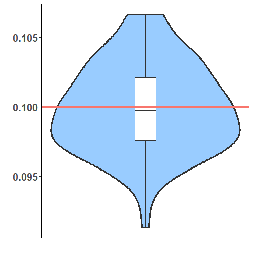
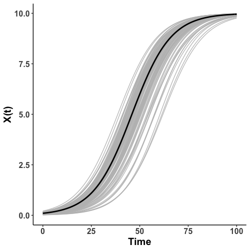

# Introduction {#sec:introduction}

The evolution of a dynamic system in time can be represented by ordinary
differential equations (ODE) models consisting of a set of state
variables and their derivatives. For example, the state variables can be
the population of multiple species in an ecological system, the
velocities, and locations of particles in a physics system, the
concentration of chemicals in a reactor, or the energy of objects in a
heating process. Usually, an ODE model is defined as a set of
differential equations in the following form
$$\dot{\mathbf{x}}(t) = \mathbf{f}(\mathbf{x},\mathbf{u},t|\mathbf{\theta}),
\label{eq:generalode}   (\#eq:generalode)$$
where $\mathbf{x}(t)$ denotes the fully or partially observed states of
the system at time $t$. The ODE model links the first derivative, the
temporal change, of the states with $\mathbf{x}$ itself and other
influential components $\mathbf{u}$ through some function $\mathbf{f}$
defined by the parameter vector $\mathbf{\theta}$.

Conventionally, parameter estimation of an ODE model combines
numerically solving the system and updating the ODE parameters given the
solution. The updating step complies with the nonlinear regression
framework as suggested in [@nonlinearestBARD] and
[@nonlinearparameterestimation]. That is, the optimal $\mathbf{\theta}$
minimizes the sum of squared errors between the observations and the
solutions of ODE models. It is not very typical for an ODE model to have
analytical solutions unless the dynamic system is simple and linear. In
more realistic situations where analytical solutions are not available,
the ODE solutions must be numerically obtained prior to any estimations
of the ODE parameters. The initial condition, which are values of state
variables at the initial time, dictates the unique solution obtained by
the numeric solver. However, the initial condition is often unavailable
in real practices and must be estimated before obtaining the ODE
solutions. If the initial conditions are unknown, then they are
augmented to the parameter vector and estimated simultaneously with the
ODE parameters. As a result, the complexity of optimization dramatically
increases due to the fact that the solution is sensitive to ODE
parameters and initial conditions. Also, the augmentation increases the
dimension and complexity of the optimization surface hence hindering the
convergence of optimization algorithms.

Being an improvement in the stability of estimation, the multiple
shooting methods, presented in [@BOCKmultiple], [@peifermultiple], and
[@nonlineardynamic], expands the dimension of optimization surface by
introducing additional initial conditions. The extra initial conditions
are a result of partitioning the original time interval into multiple
subintervals, and numeric solutions are obtained within each
subinterval. Ideally, the introduction of these initial conditions will
facilitate the optimization process for $\mathbf{\theta}$ to avoid local
minima in the optimization surface and provide a faster convergence
rate. Additionally, [@Huang_bayesian] and [@Gelman_bayesian] present
Bayesian frameworks of estimating ODE parameters with a hierarchical
model.

The aforementioned strategies depend on the numeric solutions of ODE
models and can be burdened with significant computational challenges
given complex dynamic systems. That is, the system has to be numerically
solved given each update or candidate of ODE parameters. To overcome
these challenges, [@Varah] proposes a two-step procedure to use
nonparametric techniques for interpolating the time derivatives of state
variables. Subsequently, the parameters are estimated through a
nonlinear regression framework by treating the time derivatives as the
response. This methodology is further developed in
[@wu_localestimation], [@ramsayFDA] , and [@brunel2008]. Replacing
numeric solutions with nonparametric estimations drastically reduces the
computational cost, but estimation errors are introduced in the process
of interpolating the time derivatives. The errors are due to the fact
that there are no direct observations of the derivatives. Furthermore,
[@varyingODE] shows that the estimation errors of derivatives will lead
to bias in the estimation of ODE parameters.

As contrary to the two-step procedure, [@parcascade] presents a new
approximation strategy, called the parameter cascade method, in the
family of collocation methods. The parameter cascade method integrates
data smoothing and estimation of ODE parameters into a single estimation
scheme. The parameter cascades method provides a much more efficient way
of approximating the ODE solution without numerically solving the
system. Additionally, it ensures that the ODE parameters are more
accurately estimated than the two-step approach [@varyingODE]. Various
well-known ODE models are examined in [@parcascade]. [@qi2010] has
discussed the asymptotic properties of the parameter cascades estimates
for both ODE parameters and basis coefficients. The methodology has also
been validated with many applications. [@selectionofODE] investigates
the model selection problem in ODE models based on parameters estimated
from the cascading procedure. When the system is measured with
replications, mixed effects need to be incorporated into the model. This
mixed-effect ODE model is explored in [@ODEmixedeffect].

The cascading estimation strategy is further promoted as in the R
package *CollocInfer* by [@CollocInfer]. *CollocInfer* offers a variety
of functions regarding the estimation of ODE models. It has included the
implementation of the parameter cascade method, the tuning criterion of
smoothing parameter, and the sample variance of parameter estimates
through the Newey-West method in [@neweywest]. However, one bottleneck
of using *CollocInfer* is the requirement of manually providing all the
partial derivatives for constructing the Jacobian and Hessian matrices
in the optimization process. For complex ODE models, the calculation and
coding of those derivatives can be tedious and easy to make mistakes. As
an improvement to the *CollocInfer* package, we propose a new package,
named *pCODE*, which offers more user-friendly functions for estimating
ODE models without specifying any derivatives. That is, an analytic
Jacobian and Hessian matrix is required for the optimization routine in
*CollocInfer*, whereas *pCODE* automatically calculates the numeric
approximations to both matrices. Furthermore, *pCODE* also adds a
bootstrap variance estimator besides the variance estimator obtained by
the Delta method in [@parcascade] and *CollocInfer*. *pCODE* uses the
k-fold cross-validation for finding the optimal smoothing parameter
while *CollocInfer* selects the smoothing parameters based on the
forward prediction errors. We have also developed an online Shiny app at
<https://pcode.shinyapps.io/pcode/>.

The remainder of this paper is organized as follows. Next section will
introduce the parameter cascade methodology for simultaneous estimation
of both ODE solutions $\mathbf{x}(t)$ and parameters $\mathbf{\theta}$.
The third section explains the core functions of the package *pCODE*
along with their usages and syntaxes. Subsequently, The fourth section
illustrates the application of *pCODE* on several datasets with
simulations for assessing the performance. At last, The fifth section
gives a conclusion of the paper.

# The parameter cascade method {#seq:method}

An ODE model is build upon a set of differential equations
$\dot{x}_{i}(t) = f_{i}(\mathbf{x},t|\mathbf{\theta})$ for
$i = 1,..., I,$ corresponding to the index of state variables. Each
differential equation represents how the time derivative of one state
variable depends on $\mathbf{x} = (x_{1},..., x_{I})$. Furthermore,
$f_{i}(\mathbf{x},t|\mathbf{\theta})$'s are assumed to be parametrized
by a vector of parameters $\mathbf{\theta}$. Let
$y_{ij} = x_{i}(t_{ij}) +  e_{ij}$ be the $j$-th noisy observation of
$i$-th state variable at time $t_{ij}$, where $e_{ij}$ is the
measurement error or noise, $j = 1, ..., n_{i}$. We assume the vector of
random errors $\mathbf{e}_{i} = (e_{i1},...,e_{in_{i}})$ has a
distribution function $g(\mathbf{e}_{i})$ with the distribution
parameter $\mathbf{\sigma}_{i}$. Our goal is to estimate
$\mathbf{\theta}$ from the noisy observations from the system.

The lower stream estimation of the parameter cascade method is to
provide smooth interpolations of the observations. As suggested in
[@parcascade], the data interpolation part is done by the smoothing
splines. The goal of smoothing is to diminish the random errors in the
observations of all dimensions, hence the underlying solutions
$x_{i}(t)$'s can be recovered from the noisy observations. That is, each
$x_{i}(t)$ is expressed as a linear combination of B-spline basis
functions
$$x_{i}(t) = \sum_{i}^{K_{i}} c_{ik} \phi_{ik}(t) = \mathbf{c}^{\prime}_{i}\mathbf{\phi}_{i}(t),$$
where $K_{i}$ is the number of basis functions, and
$\mathbf{\phi}_{i}(t)$ is the vector of basis functions evaluated at a
time point $t$. Data smoothing is then equivalent to the estimation of
these basis coefficients $\mathbf{c}_{i}$'s.

To comply the lower level estimation, a simple objective function
$J(\mathbf{c})$, following the smoothing spline routine, is considered
for obtaining basis coefficients
$\mathbf{c} = (\mathbf{c}^{\prime}_1,\ldots,\mathbf{c}^{\prime}_I)^{\prime}$.
That is, the negative log-likelihood function is chosen for non-normal
errors, whereas the least square criterion is naturally suitable for
i.i.d. normal errors $e_{ij} \sim \text{N}(0,\sigma_{i})$. The summation
$J(\mathbf{c}|\mathbf{\sigma}) = \sum_{i} J(\mathbf{c}_{i}|\mathbf{\sigma}_{i})$
of individual fitting criterion over $i$ defines a composite objective
function for all $I$ dimensions. The data interpolation will use a
saturated number of basis functions which requires a penalty term in the
objective function to prevent overfitting problems. [@ramsayFDA]
suggests to use a linear differential operator for introducing a
smoothness penalty in the objective functions. Subsequently,
[@Poyton2006] utilizes the smoothness penalty in estimating parameters
and solutions of ODE models. Following the same technique, the
smoothness penalty is defined based on the discrepancy between the time
derivatives and the ODE model, i.e.,
$$\int (\dot{x}_{i}(t) - f_{i}(\mathbf{x},t|\mathbf{\theta}))^{2}dt,$$
for each state variable $x_{i}$. Multiplying the penalty with a
smoothing parameter $\lambda_{i}$ and combining the penalties over all
dimensions, the complete objective function is defined to be
$$J(\mathbf{c}|\mathbf{\theta}) = \sum_{i=1}^{I} \big[ - \ln g(\mathbf{e}_{i}) + \lambda_{i}\int (\dot{x}_{i}(t) - f(\mathbf{x},t|\mathbf{\theta}))^{2}dt\big].
  \label{eq:innerobj}   (\#eq:innerobj)$$
For each given set of ODE parameters $\mathbf{\theta}$, the basis
coefficients $\mathbf{c}$ is estimated by minimizing
$J(\mathbf{c}|\mathbf{\theta})$. Hence, the estimate for the basis
coefficients $\mathbf{c}$ become an implicit function of the ODE
parameters $\mathbf{\theta}$ as $\mathbf{c}(\mathbf{\theta})$. The
objective function (\@ref(eq:innerobj)), referred to as the inner
objective function, needs to be optimized for estimating $\mathbf{c}$
whenever $\mathbf{\theta}$ is updated.

To clearly distinguish two sets of parameters $\mathbf{c}$ and
$\mathbf{\theta}$, $\mathbf{c}$ will be referred to as the nuisance
parameters since they are not essential for estimating the ODE model
rather interpolate the observations. On the other hand,
$\mathbf{\theta}$ is responsible for defining the structure of the ODE
model and will be denoted as structural parameters. Often,
$\mathbf{\theta}$ will be the primary concern given any ODE models.

The upper stream estimation of the parameter cascade method focuses on
the structural parameter $\mathbf{\theta}$. To comply this estimation,
the objective function $H(\mathbf{\theta})$, referred to as the outer
objective function, is optimized with respect only to the structural
parameters $\mathbf{\theta}$. It is usually defined to be the negative
log-likelihood function or the sum of squared errors given the
distributions of random errors, that is,
$$H(\mathbf{\theta}) = -\sum_{i=1}^{I}\text{ln }g(\widehat{\mathbf{e}}_{i}|\mathbf{\theta}),
\label{eq:outterobj}   (\#eq:outterobj)$$
where
$$\widehat{\mathbf{e}}_{i} = \mathbf{y}_{i} - \hat{x}_i(\mathbf{t}_{i}|\mathbf{\theta}).$$
Here
$\hat{x}_i(\mathbf{t}_{i}|\mathbf{\theta}) = \hat{\mathbf{c}}^{\prime}_{i}(\mathbf{\theta})\mathbf{\phi}_{i}(\mathbf{t}_{i})$,
where $\hat{\mathbf{c}}^{\prime}_{i}(\mathbf{\theta})$ is the optimizer
of $J(\mathbf{c}|\mathbf{\theta})$ given current $\mathbf{\theta}$.

The parameter cascade method nests the estimation of basis coefficients
in that of the structural parameters, where both estimations depend on
the choice of smoothing parameters $\mathbf{\lambda}$. As a result, the
interpolation of data points is not separated from estimating ODE
parameters. The stream of dependencies defined a parameter cascade which
offers great accuracy and efficiency in estimating ODE models. To take
full advantage of the parameter cascade method, the *pCODE* package
provides several R functions that are able to apply the aforementioned
methodology for estimating ODE models.

# Main functions in the pCODE package  {#seq:functions}

## Parameter estimation: `pcode`

The main function to perform the parameter cascade method is `pcode` in
the package. This is a generic wrapper function for handling several
scenarios given different objective functions, normal or non-normal
errors, and missing state variables.

First, we focus on the situation when we have the normal random errors
for all dimensions where $e_{ij}\sim\text{N}(0,\sigma^{2}_{i})$. In
fact, both the inner optimization function (\@ref(eq:innerobj)) and the
outer optimization function (\@ref(eq:outterobj)) are calculated based
on a vector of residuals. The first part of (\@ref(eq:innerobj)) is
easily recognized as the residuals from fitting the observation with
basic functions. If the second part, the integral, is approximated by
the composite Simpson's rule, then the approximation can be written in a
quadratic form based on a vector of residual-like quantities. Stringing
the aforementioned two vectors into one, and the concatenation of these
vectors from all dimensions will produce a single vector of residuals.
Hence, the optimization of the inner objective function adheres to the
non-linear least square (NLS) framework. As a result, we can use the
popular Levenberg-Marquart (LM) algorithm to obtain an estimate
$\hat{\mathbf{c}}^{\prime}_{i}(\mathbf{\theta})$. Our package `pcode`
employs the function `lsqnonlin` from the package *PRACMA* [@pracma] for
applying the LM algorithm.

The optimization of the outer objective function appears to be exactly
an NLS problem. However, the parameter cascade strategy appends an extra
layer of optimization to each update of the outer estimation, which
characterizes a nested optimization problem. It is applicable to apply
the Levenberg-Marquart algorithm again to the outer objective, however,
the computational effort is much greater than that of inner
optimization. The reason is that a Jacobian matrix needs to be
calculated for each iteration of the update on the structural
parameters, and each entry of the Jacobian for the outer objective
involves a complete optimization of the inner one. This occurs to be the
major delay in computation time.

Most commonly, the random errors $e_{ij}$'s are i.i.d from the normal
distribution. However, some dynamic systems may produce non-normal
errors which make the NLS approach not applicable. One solution is to
perform a transformation on the observations and state variables, which
forces the errors of transformed variables to have a normal
distribution. As an alternative, `pcode` allows one to input a
likelihood (or log-likelihood) function as a fitting criterion for both
inner and outer objectives. In such a case, `optim` will be used for
both levels of objective functions.

The following demonstrates the syntax of `pcode` with its argument list:

``` r
pcode(
  data, time, ode.model, par.names, state.names, likelihood.fun,
  par.initial, basis.list, lambda, controls
)
```

where `data`, a matrix, contains the observations of state variables as
columns. The names of state variables are stored in `state.names` as a
vector. `time` includes the observation time points in a vector. The ODE
model to be estimated is provided to `pcode` as `ode.model` and defined
in a similar way as that in package *deSolve* [@deSolve]:

``` r
ode.model <- function(t, state, parameters) \{
  with(as.list(c(state, parameters)), \{
    dV <- c * (V - (V^3) / 3 + R)
    dR <- -(1 / c) * (V - a + b * R)
    return(list(c(dV, dR)))
  \})
\}
```

For this example, the state names are passed to the function `PCODE` as
a vector `c(’V’,’R’)`, and the structural parameter names
`c(’a’,’b’,’c’)` are given to `par.names` argument of the function.
Optimization for the structural parameters requires a initial value
input as `par.initial`, and there is no need for an input of
`likelihood.fun` when the error distributions are Normal. `basis.list`
contains the list of basis objects defined by the package *fda*, and the
default `basis` has 9 interior knots with B-spline basis functions of
order of 4. `lambda` corresponds to the penalty parameter
$\mathbf{\lambda}$ which controls the fitness of estimated state
variables to the differential equations. A scalar input of `lambda`
means that all dimensions will subject to the same penalty, or a vector
input differentiates the penalty calculated for each dimension.
`controls` contains addition parameters to adjust optimizations for both
inner and outer objective functions and obtain initial value for basis
coefficients $\mathbf{c}$. Two scenarios are discussed depending on the
different distribution of errors. All the mentioned scenarios will be
demonstrated in the fourth section with examples.

### The bootstrap variance estimator: `bootsvar`

All the functions of this package are derivative-free, hence the
variance of structural parameters is numerically approximated. The first
option is to use the bootstrap variance estimator. Given the estimation
of both parameters $\mathbf{\theta}$ and $\mathbf{c}$, we are able to
solve the ODE directly with estimated initial value
$\hat{\mathbf{x}}(t_{0})$. Hence, we can simulate bootstrap samples of
the ODE model based on the estimated distributions of errors
$\mathbf{e}_{i}$ for all $I$ dimensions. The detailed algorithm for
obtaining a bootstrap variance estimate of $\mathbf{\theta}$ is as
follows

<hr/>
#### Algorithm 1: Bootstrap variance estimator {#alg:bootsvar}

**Initialization:**\

-   $\mathbf{\theta}_{0}$: initial value for structural parameters
-   $B$: the number of bootstrap samples
-   $\mathbf{y}$: observations

\
**Function** `Bootsvar`($\mathbf{\theta}_{0}, B, \mathbf{y}...$)\
$~~~~~~~~~~~$$\mathbf{\theta}_{\star},\mathbf{c}_{\star}$ \<- results from  
$~~~~~~~~~~~$`pcode(`$\mathbf{\theta}_{0},\mathbf{y}...$`)`   
$~~~~~~~~~~~$ $~~~~~~~~~~~$Comment: Estimation from the original data  
$~~~~~~~~~~~$$\sigma_{i}^{2}$ $\gets$ var($\mathbf{y}_{i} - \mathbf{x}_i$)    
$~~~~~~~~~~~$$~~~~~~~~~~~$Comment: Estimate the variance of observation errors  
$~~~~~~~~~~~$$\mathbf{x}_{\star}$ $\gets$ Solution to the ODE given  
$~~~~~~~~~~~$$\mathbf{\theta}_{\star}$ and $\mathbf{x}_{\star}(t_{0})$  
$~~~~~~~~~~~$**for** $b \gets 1 \textrm{ to } B$  
$~~~~~~~~~~~$$~~~~~~~~~~~$Obtain $\mathbf{z}_{i}^{(b)}$ =  
$~~~~~~~~~~~$$~~~~~~~~~~~$$\mathbf{x}_{i,\star}+\mathbf{\epsilon}_{i}^{(b)}$.  
$~~~~~~~~~~~$$~~~~~~~~~~~$$~~~~~~~~~~~$Comment: $\mathbf{\epsilon}_{i}^{(b)} \sim N(0,\sigma_{i}^{2})$  

$~~~~~~~~~~~$$~~~~~~~~~~~$($\mathbf{\theta}_{\star}^{(b)},\mathbf{c}_{\star}^{(b)}$) $\gets$  
$~~~~~~~~~~~$$~~~~~~~~~~~$results from  
$~~~~~~~~~~~$$~~~~~~~~~~~$`pcode(`$\mathbf{\theta}_{\star},\mathbf{z}_{i}^{(b)}...$`)`  
$~~~~~~~~~~~$**end for**  
**return** $Var(\mathbf{\theta}_{\star}^{(b)}),Var(\mathbf{c}_{\star}^{(b)})$  
**end function**  

<hr/>


The syntax of `bootsvar` is illustrated as the following

``` r
bootsvar(
  data, time, ode.model, par.names, state.names, par.initial,
  lambda, basis.list, bootsrep, controls
)
```

Most of the arguments are the same as the function `pcode` with only one
addition of argument `bootsrep` which indicates the number of bootstrap
samples to be taken for obtaining the variance estimator.

### The Delta variance estimator: `deltavar`

As an alternative to the bootstrap variance estimator, the package
*PCODE* also offers another numeric estimator for the variance of
structural parameters. [@parcascade] has developed the approximation to
$Var(\mathbf{\hat{\theta}}(\mathbf{y}))$ via the delta-method. The
resulting approximation is of the form
$$Var(\hat{\mathbf{\theta}}(\mathbf{y})) \approx \bigg[ \frac{d\mathbf{\hat{\theta}}}{d\mathbf{y}} \bigg] \mathbf{\Sigma}  \bigg[ \frac{d\mathbf{\hat{\theta}}}{d\mathbf{y}} \bigg]^{\prime}$$
where $\frac{d\mathbf{\hat{\theta}}}{d\mathbf{y}}$ is obtained as
$$\label{eq:dtheta_dy}
 \frac{d\mathbf{\hat{\theta}}}{d\mathbf{y}} = - \bigg[\frac{\partial^{2}H}{\partial\mathbf{\theta}^2}\bigg\vert_{\mathbf{\hat{\theta}}(\mathbf{y})} \bigg]^{-1} \bigg[  \frac{\partial^{2}H}{\partial\mathbf{\theta}\partial\mathbf{y}}\bigg\vert_{\mathbf{\hat{\theta}}(\mathbf{y})} \bigg]   (\#eq:dtheta-dy)$$
and $\mathbf{\Sigma}$ is a $N \times N$ variance-covariance matrix for
observations put into a vector. $N$ is the total number of observation
summing over all dimensions of $\mathbf{y}$ . Then the estimation of
variance relies on the computation of (\@ref(eq:dtheta-dy)). The partial
derivatives are approximated by the finite difference method, i.e.,
$$\bigg[\frac{\partial^{2}H}{\partial\mathbf{\theta}_{u}^2}\bigg\vert_{\mathbf{\hat{\theta}}(\mathbf{y})} \bigg] \approx \frac{H(\hat{\mathbf{\theta}}_{u+}(\mathbf{y})|\mathbf{\lambda}) - 2H(\hat{\mathbf{\theta}}(\mathbf{y})|\mathbf{\lambda}) + H(\hat{\mathbf{\theta}}_{u-}(\mathbf{y})|\mathbf{\lambda})}{\Delta^{2}},$$
where $\hat{\mathbf{\theta}}_{u+}(\mathbf{y})$ and
$\hat{\mathbf{\theta}}_{u-}(\mathbf{y})$ indicate the addition and
subtraction of stepsize $\Delta$ to the u-th structural parameter
estimate $\hat{\mathbf{\theta}}(\mathbf{y})$. The mixed partial
derivatives are approximated as the following
$$\bigg[\frac{\partial^{2}H}{\partial\mathbf{\theta}_{u}\partial\mathbf{\theta}_{v}}\bigg\vert_{\mathbf{\hat{\theta}}(\mathbf{y})} \bigg] \approx \frac{H(\hat{\mathbf{\theta}}_{u+,v+}(\mathbf{y})) - H(\hat{\mathbf{\theta}}_{u-,v+}(\mathbf{y})) - H(\hat{\mathbf{\theta}}_{u+,v-}(\mathbf{y})) +H(\hat{\mathbf{\theta}}_{u-,v-}(\mathbf{y}))}{4\Delta^{2}}.$$
Given any fixed argument $\mathbf{\theta}$ for the outer objective
function $H(\mathbf{\theta},\mathbf{\sigma}|\mathbf{\lambda})$, its
evaluation involves the profiled estimation of
$\mathbf{c}(\mathbf{\theta},\mathbf{\sigma};|\mathbf{\lambda})$ and
returns solely the likelihood or the sum of squared errors. Hence,
individual evaluations of
$H(\mathbf{\theta},\mathbf{\sigma}|\mathbf{\lambda})$ used in numeric
approximation is obtained in the following steps:

-   Step 1: Optimize $J(\mathbf{c}|\mathbf{\theta},\mathbf{\lambda})$
    given $\mathbf{\theta}$.
-   Step 2: Obtain $\hat{\mathbf{x}}(\mathbf{t})$ based on the estimated
    $\hat{\mathbf{c}}$.
-   Step 3: Return
    $\sum_{i \in I} ||\mathbf{y}_{i} - \hat{x}_{i}(\mathbf{t}_i)||^{2}$
    or
    $-\sum_{i \in I}g(\mathbf{y}_{i} - \hat{x}_{i}(\mathbf{t}_i)|\mathbf{\theta},\mathbf{\lambda})$.

Approximation to the second term
$\frac{\partial^{2}H}{\partial\mathbf{\theta}\partial\mathbf{y}}\bigg\vert_{\mathbf{\hat{\theta}}(\mathbf{y})}$
utilizes the finite difference method as well. After evaluating
$H(\mathbf{\theta},\mathbf{\sigma}|\mathbf{\lambda})$ given
$\mathbf{\theta}$, the mixed partial derivative is calculated by moving
the particular observation up or down by some stepsize $\Delta_{y}$.
That is,
$$\bigg[\frac{\partial^{2}H}{\partial\mathbf{\theta}_{u}\partial y_{v}}\bigg\vert_{\mathbf{\hat{\theta}}(\mathbf{y})} \bigg] \approx \frac{H(\hat{\mathbf{\theta}}_{u+},\mathbf{y}_{v+}) - H(\hat{\mathbf{\theta}}_{u+},\mathbf{y}_{v-}) - H(\hat{\mathbf{\theta}}_{u-},\mathbf{y}_{v+}) +H(\hat{\mathbf{\theta}}_{u-},\mathbf{y}_{v-})}{4\Delta\Delta_{y}},$$
where $\mathbf{y}_{v+}$ and $\mathbf{y}_{v-}$ represent moving up and
down v-th observation by stepsize $\Delta_{y}$ in the last step of
evaluating $H(\mathbf{\theta},\mathbf{\sigma}|\mathbf{\lambda})$. The
syntax of `numericvar` is based on that of `pcode`

``` r
numericvar(
  data, time, ode.model, par.names, state.names,
  par.initial, lambda, basis.list, stepsize, y_stepsize, controls
)
```

with addition of `stepsize` and `y_stepsize`. `stepsize` can be
specified by a single number for which finite difference method will use
it for all parameters or a vector where derivative of each parameter is
estimated based on its own stepsize. `y_stepsize` allows an input of a
vector where each element indicates the stepsize for each dimension of
the ODE model.

# Illustrations {#sec:illustrations}

## A simple ODE model {#ssec:simpleode}

A simple illustration uses an one-dimensional ODE model
$$\label{eq:simpleode}
\dot{X} = \theta X (1-\frac{X}{10}).   (\#eq:simpleode)$$
The following code defines the aforementioned model that will be
provided for `pcode` for estimating parameters:

``` r
model <- function(t, state, parameters) \{
  with(as.list(c(state, parameters)), \{
    dX <- theta * X * (1 - X / 10)
    return(list(dX))
  \})
\}
```

Given an observation period of $[0,100]$, random noise errors are added
to the ODE solution with a Normal distribution $\text{N}(0,0.5^{2})$.
Observations of the system are generated as follows:

``` r
times  <- seq(0, 100, length.out = 101)
mod    <- ode(y = state, times = times, func = ode.model, parms = model.par)
nobs   <- length(times)
scale  <- 0.5
noise  <- scale * rnorm(n = nobs, mean = 0, sd = 1)
observ <- mod[, 2] + noise
```

Subsequently, we can visualize the observations along the true solution
of this simple ODE model in Figure [1](#fig:simpledata).

{#fig:simpledata width="100%"
alt="graphic without alt text"}

First, a basis object needs to be defined by `create.bspline.basis` from
*fda* package

``` r
knots  <- seq(0, 100, length.out = 21)
norder <- 4
nbasis <- length(knots) + norder - 2
basis  <- create.bspline.basis(c(0, 100), nbasis, norder, breaks = knots)
```

A B-spline basis is created given 21 konts including both interior and
boundary knots acorss observation interval $(0,100)$. The order of basis
functions is 4, so there is a total of 23 basis functions. To perform
the parameter cascade method for estimating both structural and nuisance
parameters, one can use `pcode` in the following way

``` r
pcode.result <- pcode(
  data = observ, time = times, ode.model = model,
  par.initial = 0.3, par.names = "theta", state.names = "X",
  basis.list = basis, lambda = 1e2
)
pcode.result["structural.par"]
theta
0.09995229
```

To validate the methodology of this function, data simulation and
parameter estimation are repeated for 100 times.

<figure id="fig:simpleresult">
<table>
<caption> </caption>
<tbody>
<tr class="odd">
<td style="text-align: center;"></td>
<td style="text-align: center;"></td>
</tr>
<tr class="even">
<td style="text-align: center;">(a) <span>The violin and boxplot of the
estimated <span class="math inline"><em>θ</em></span> over 100
replications.</span></td>
<td style="text-align: center;">(b) <span>Solution of the ODE model with
<span class="math inline"><em>θ̂</em></span> and <span
class="math inline"><em>X̂</em>(0)</span>.</span></td>
</tr>
</tbody>
</table>
<figcaption>Figure 2: The violin plot demonstrates the reliability of
the estimation procedure. It summarizes the estimates of parameters over
100 replications. Each replication generates a entirely new set of noisy
observations and gives a parameter estimate of the simple ODE model ().
The true parameter is indicated by the redline as <span
class="math inline"><em>θ</em> = 0.1</span>. The right plot shows the
estimation of the solution from the simple ODE model over 100
replications. Each grey line is obtained from solving the ODE system
after obtaining the parameter estimate from one replication. The black
curve is the ODE solution with the true value of <span
class="math inline"><em>θ</em></span>. </figcaption>
</figure>

Given that $\theta = 0.1$ is used for generating data, the parameter
cascade method performs impressively well. The violin plot in
Figure [2](#fig:simpleresult) shows that the distribution of estimates
of $\theta$ covers 0.1 (indicated by the red horizontal line) and does
not fall far away from the true value. Also, the state variable `X` (the
bold black curve of the plot on the right) is well predicted by solving
the ODE model with estimated initial value $\hat{x}(0)$ and structural
parameters $\hat{\theta}$.

The true variance for data generating parameter $\theta$ is
$1.003 \times 10^{-5}$. We can compare the performance of two functions
`bootsvar` and `deltavar` for estimating $\text{var}(\theta)$.

``` r
bootsvar(
  data = observation, time = times, ode.model = ode.model,
  par.initial = 0.3, par.names = "theta", state.names = "X",
  basis.list = basis, lambda = 1e2, bootsrep = 20
)
theta
1.042763e-05

deltavar(
  data = observation, time = times, ode.model = ode.model,
  par.initial = 0.3, par.names = "theta", state.names = "X",
  basis.list = basis, lambda = 1e2,
  stepsize = 1e-5, y_stepsize = 1e-5
)
theta
9.923318e-06
```

Both variance estimator give excellent estimates of the true variance of
structural parameter. Subsequently, the consistency and reliability of
those estimator can be inspected by simulation. In 100 simulation
replicates, the results of two variance estimators are summarized in
Figure [3](#fig:sipmleode_varestimate).

{#fig:sipmleode_varestimate
width="100%" alt="graphic without alt text"}

The bootstrap variance estimator has a smaller variation but at the cost
of higher computational effort in comparison with the Delta variance
estimator. On the other hand, the Delta variance estimator is faster but
sensitive to the choice of the step size in estimating all the
derivatives and the subsequent $\text{var}(\theta)$.

## The FitzHugh-Nagumo ODE model

The FitzHugh-Nagumo ODE model is well known for capturing the dynamic
system of neuronal firings based on the membrane potential V and
recovery variable R. This two-dimensional ODE contains 3 positive
parameters $\mathbf{\theta} = (a,b,c)$, and it can be defined as
$$\begin{aligned}
\dot{V} &= c(V - \frac{V^{3}}{3} + R),  \\
\dot{R} &= -\frac{1}{c}(V - a + bR).
\end{aligned}$$
The parameters are assigned with values $(a,b,c) = (0.2,0.2,3)$ the same
as in [@parcascade]. The state variables V and R should behave as the
black solid line plotted in Figure [4](#fig:FHN_2d). Following the
routine of specifying an ODE model, the FitzHugh-Nagumo model is defined
in the following function with simulated observations

``` r
ode.model <- function(t, state, parameters) \{
  with(as.list(c(state, parameters)), \{
    dV <- c * (V - (V^3) / 3 + R)
    dR <- -(1 / c) * (V - a + b * R)
    return(list(c(dV, dR)))
  \})
\}
model.par   <- c(a = 0.2, b = 0.2, c = 3)
desolve.mod <- ode(y = state, times = times, func = ode.model, parms = c(0.2, 0.2, 3))
nobs    <- length(times)
scale   <- 0.1
noise_v <- scale * rnorm(n = nobs, mean = 0, sd = 1)
noise_r <- scale * rnorm(n = nobs, mean = 0, sd = 1)
observ  <- matrix(NA, nrow = length(times), ncol = 3)
observ[, 1] <- times
observ[, 2] <- desolve.mod[, 2] + noise_v
observ[, 3] <- desolve.mod[, 3] + noise_r
```

The data generating functions and simulated data are illustrated in
Figure [4](#fig:FHN_2d).

{#fig:FHN_2d width="100%"
alt="graphic without alt text"}

First step of estimating parameters is to declare basis object for each
state variable. For observation period from time 0 to time 20, the basis
is defined on 101 knots with B-spline basis function of order of 4. The
total number of nuisance parameters is 103. For this example, the same
basis will be used for both dimensions $V$ and $R$:

``` r
knots  <- seq(0, 20, length.out = 101)
norder <- 4
nbasis <- length(knots) + norder - 2
basis  <- create.bspline.basis(c(0, 20), nbasis, norder, breaks = knots)
basis.list <- list(basis, basis)
```

Then, `pcode` can be executed as follows:

``` r
pcode.result <- pcode(
  data = observ[, 2:3], time = times, ode.model = Dmodel,
  par.names = c("a", "b", "c"), state.names = c("V", "R"),
  par.initial = rnorm(3), lambda = 1e2,
  basis.list = basis.list
)

pcode.result['structural.par']
0.1953324 0.2203495 2.9269980
```

In addition, we can also compare the estimation performance of the
proposed package *pCODE* with the existing package *CollocInfer*.
Figure [5](#fig:comparison) summarizes the comparison between two
packages on the parameter estimation of the Fitz-Hugh Nagumo model.

![Figure 5: We have repeated the data generation and parameter
estimation for 100 times given the FitzHugh-Nagumo model. The parameter
estimates of $(a,b,c)$ are summarized in the violin plots ordered from
left to right. Within each replication, we also use the `CollocInfer`
package for parameters estimation. In each plot, the blue violion plot
contains estimates from `pCODE` whereas the red one contains those from
`CollocInfer`. The black horizontal lines correspond to the true model
parameters used for simulating data
sets.](comparisonbetweentwopackages.png){#fig:comparison width="100%"
alt="graphic without alt text"}

Package *CollocInfer* requires the Jacobian and Hessian matrices for
estimating the parameters of the ODE models, whereas the proposed
*pCODE* package is a derivative-free method. Both packages are
estimating parameters a and b with satisfaction, and the estimates from
both methods cover the true values. However, we can see that *pCODE*
produced better estimations for the third parameter c in the model. Our
package does not depend on users to provide tedious details but still
performs equally well in parameter estimations.

As a part of the estimation routine, we can use two methods for
estimating the variance of structural parameters. First, the usage of
bootstrap variance estimator is

``` r
bootsvar.res <- bootsvar(
  data = data, time = observ[, 1], ode.model = ode.model,
  par.names = c("a", "b", "c"), state.names = c("V", "R"),
  par.initial = c(0.15, 0.25, 5), lambda = 1e2, basis.list = basis.list,
  controls = list(smooth.lambda = 10, verbal = 1, maxeval = 20), bootsrep = 20
)
```

based on a bootstrap sample with size of 20. Delta variance estimator is
much faster in approximating the variance through the following
execution

``` r
deltavar.res <- deltavar(
  data = observ[, 2:3], time = observ[, 1], ode.model = Dmodel,
  par.names = c("a", "b", "c"), state.names = c("V", "R"), par.initial = c(0.1, 0.3, 4),
  lambda = 1e2, basis.list = basis.list,
  stepsize = 0.001, y_stepsize = 0.001
)
```

## Non-normal errors

The previous examples assume that the random errors are following Normal
distributions, hence the optimization utilizes the routines of NLS
problems. In some cases, if the state variables are bounded or the
errors have a non-normal distribution, a likelihood (or log-likelihood)
function can be passed to the function `pcode` in order to evaluate the
objective functions. Subsequently, the function `pcode` will be using
`optim` for optimizations of both inner and outter objective functions.

The first example would reuse the simple ODE model, i.e.,
$$\dot{X} = \theta X (1-\frac{X}{10}).$$
In this case, the observations are simulated where log-normal errors are
added to the solution of the ODE model in the following way:
$$log(y_{i}) = log(x_{i}) + \epsilon_{i}$$
where $\epsilon_{i} \sim N(0,\sigma^{2})$. One simulated data is
illustrated in the following Figure [6](#fig:lognormal):

{#fig:lognormal
width="100%" alt="graphic without alt text"}

While keeping all the original settings for `pcode`, a log-likelihood
function, as $g(\mathbf{e}_{i}|\cdot)$ in both \@ref(eq:innerobj)
and \@ref(eq:outterobj), is additionally specified as follows

``` r
likfun <- function(x) \{
  res <- lapply(x, function(t) {
    dnorm(t,
      mean = 0,
      sd = 0.1, log = TRUE
    )
  })
  return(sum(unlist(res)))
\}
```

Instead of defining the likelihood only as a function of residuals,
`pcode` allows full flexibility in constructing a likelihood as long as
it returns the evaluation. Then, the likelihood function can be passed
to `pcode` through the argument `likelihood.fun` with specification of a
basis object for interpolation

``` r
knots <- seq(0, 100, length.out = 21)
norder <- 4
nbasis <- length(knots) + norder - 2
basis <- create.bspline.basis(c(0, 100), nbasis, norder, breaks = knots)
lkh.result <- pcode(
  data = observ, time = times, likelihood.fun = likfun,
  par.initial = 0.1, ode.model = ode.model,
  basis.list = basis, par.names = "theta", state.names = "X", lambda = 1e2
)
lkh.result["structural.par"]
0.105                  
```

# Summary {#sec:summary}

In this article, we have reviewed the parameter cascade method for
estimating ordinary differential equations and introduced the new
package *pCODE* for implementing this method. *pCODE* offers a
derivative-free procedure to estimate any ODE models where its functions
are easily understood and to apply. Several examples of ODE models are
considered for assessing the performance of functions from *pCODE*
involving estimating parameters, producing variability measures, and
tuning hyper-parameters. Subsequently, we can observe that the
implemented functions provide satisfactory results presented with
details in the fourth section. Type of examples differs in both model
complexity and error distribution. Furthermore, a special case of
predator-prey model is studied when some state variables are completely
missing from observations. The package is able to simplifies the
application procedure and reproduce the estimation results as in
[@Jiguo].

One of the future works is to expand the flexibility of this package.
Even though *pCODE* can provide satisfactory parameter estimates,
current functions do not allow users to input the Jacobian and Hessian
matrices to speed up the optimization process. In future package
developments, we will implement the functionality to allow the input of
these matrices. One limitation of the package is the time performance of
procedures, especially for the calculation of the bootstrap variance
estimator. For that matter, we are implementing this function with
parallel computation ability to speed up the calculation. Moreover, we
plan to expand the functionalities of the package to include data
visualizations and generations of diagnostic plots and summaries.

