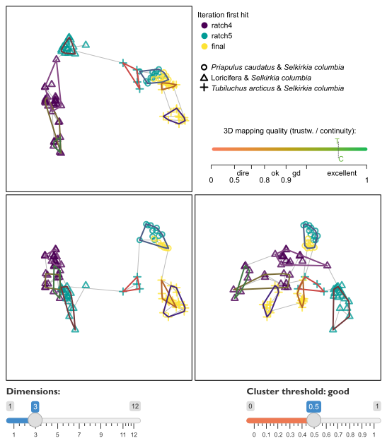
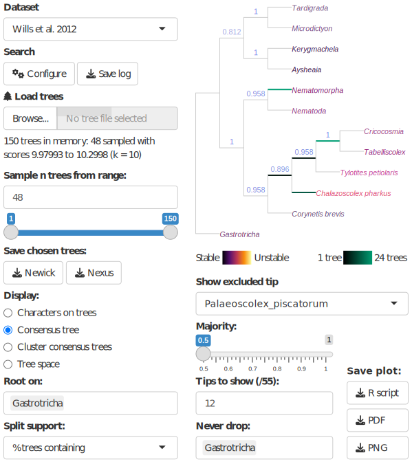

```{r init, echo = FALSE}
set.seed(0)
```

# Introduction

Even in the phylogenomic era, morphological data make an important contribution
to phylogenetic questions. Discrete phenotypic data improve the accuracy and
resolution of phylogenetic reconstruction even when outnumbered by molecular
characters, and are the only way to incorporate the unique perspective on
historical events that fossil taxa provide [@Wiens2004; @Wortley2006; @Koch2020;
@Asher2021].

One challenge with morphological analysis is the treatment of inapplicable
character states: for example, 'tail colour' cannot logically be ascribed either
of the states 'red' or 'blue' in a taxon that lacks a tail [@Maddison1993]. This
situation can profoundly mislead phylogenetic analysis, and is not handled
appropriately by any standard Markov model or parsimony method.

Solutions to this issue have recently been proposed [@DeLaet2005; @Brazeau2019;
@Tarasov2019; @Tarasov2022; @Goloboff2021; @Hopkins2021]. Where a single
'principal' character (e.g. 'tail') exhibits $n$ 'contingent' characters (e.g.
'tail colour', 'tail covering'), 'exact' solutions [@Tarasov2019; @Tarasov2022;
@Goloboff2021] require the construction of multi-state hierarchies containing
$O(2^n)$ entries, meaning that analysis is only computationally tractable for
simple hierarchies with few contingent characters. Moreover, these approaches
cannot accommodate characters that are contingent on more than one principal
character: for example, characters describing appendages on a differentiated
head may be contingent on the presence of the two characters 'appendages' and
'differentiated head'.

Such situations can be approached using the flexible parsimony approximation
proposed by @Brazeau2019. \pkg{TreeSearch} scores trees using the "Morphy" C
implementation of this algorithm [@Brazeau2017]. Morphy implements tree search
under equal step weights. TreeSearch additionally implements implied step
weighting [@Goloboff1993], a method which consistently finds more accurate and
precise trees than equal weights parsimony [@Goloboff2008; @Goloboff2018;
@Smith2019].

There has been lively discussion as to whether, with the rise of probabilistic
approaches, parsimony remains a useful tool for morphological phylogenetics
[e.g. @OReilly2016; @Puttick2017; @Sansom2018; @Goloboff2018b; @Brown2017].
Notwithstanding scenarios that go beyond the limits of parsimony, such as the
simultaneous incorporation of stratigraphic data and other prior knowledge [e.g.
@Guenser2021], neither parsimony nor probabilistic methods consistently recover
'better' trees when gains in accuracy are balanced against losses in precision
[@Smith2019]. Even if probabilistic methods may eventually be improved through
the creation of more sophisticated models that better reflect the nature of
morphological data [@Goloboff2018; @Tarasov2019; @Tarasov2022], parsimony
analysis remains a useful tool -- not only because treatments of inapplicable
character states are presently available, but also because it facilitates a
deeper understanding of the underpinning data by emphasizing the reciprocal
relationship between a tree and the synapomorphies that it implies.

Whatever method is used to find phylogenetic trees, a single consensus tree may
fail to convey all the signal in a set of phylogenetic results [@Wilkinson1994;
@Wilkinson1996; @Wilkinson2003]. A set of optimal trees can be better
interpreted by examining consensus trees generated from clusters of similar
trees [@Stockham2002]; by exploring tree space [@Wright2020; @SmithSpace] and by
automatically identifying, annotating and removing 'wildcard' taxa [@SmithRogue]
whose 'rogue' behaviour may reflect underlying character conflict or ambiguity
[@Kearney2002]. These methods are not always easy to integrate into phylogenetic
workflows, so are not routinely included in empirical studies.

```{r flowchart, out.width = "60%", fig.cap = "Flow charts summarizing key functions available in TreeSearch.", fig.align="center", echo = FALSE}
ifelse(knitr::is_html_output(), "Flow.svg", "Flow.pdf") |>
  knitr::include_graphics()
```

TreeSearch provides functions that allow researchers to engage with the three
main aspects of morphological phylogenetic analysis: dataset construction and
validation; phylogenetic search (including with inapplicable data); and the
interrogation of optimal tree sets (Fig. \@ref(fig:flowchart)). These functions
can be accessed via the R command-line, as documented within the package and at
[ms609.github.io/TreeSearch](https://ms609.github.io/TreeSearch/), or through a
graphical user interface (GUI). The GUI includes options to export a log of
executed commands as a fully reproducible R script, and to save outputs in
graphical, Nexus or Newick formats.

# Implementation

## Tree scoring

\pkg{TreeSearch} can score trees using equal weights, implied weighting
[@Goloboff1993], or profile parsimony [@Faith2001]. The function `TreeLength()`
calculates tree score using the "Morphy" phylogenetic library [@Brazeau2017],
which implements the @Fitch1971 and @Brazeau2019 algorithms. Morphy returns the
equal weights parsimony score of a tree against a given dataset. Implied weights
and profile parsimony scores are computed by first making a separate call to
Morphy for each character in turn, passed as a single-character dataset; then
passing this value to the appropriate weighting formula and summing the total
score over all characters.

Implied weighting [@Goloboff1993] is an approximate method that treats each
additional step (i.e. transition between tokens) in a character as less
surprising -- and thus requiring less penalty -- than the previous step. Each
additional step demonstrates that a character is less reliable for phylogenetic
inference, and thus more likely to contain additional homoplasy. The score of a
tree under implied weighting is $\sum{\frac{e_i}{e_i+k}}$, where $e_i$ denotes
the number of extra steps observed in character $i$, and is derived by
subtracting the minimum score that the character can obtain on any tree from the
score observed on the tree in question [@Goloboff1993]. The minimum length of a
tree is one less than the number of unique tokens (excluding the inapplicable
token '`-`') that must be present.

Profile parsimony [@Faith2001] represents an alternative formulation of how
surprising each additional step in a character is [@Arias2004]: the penalty
associated with each additional step in a character is a function of the
probability that a character will fit at least as well as is observed on a
uniformly selected tree. On this view, an additional step is less surprising if
observed in a character where there are more opportunities to observe homoplasy,
whether because a character contains fewer ambiguous codings (a motivation for
the 'extended' implied weighting of @Goloboff2014) or because states are
distributed more evenly in a character, whose higher phylogenetic information
content [@Thorley1998] corresponds to a lower proportion of trees in which no
additional steps are observed.

TreeSearch calculates the profile parsimony score by computing the logarithm of
the number of trees onto which a character can be mapped using $m$ steps, using
theorem 1 of @Carter1990. As computation for higher numbers of states
[@Maddison1991] is more computationally complex, the present implementation is
restricted to characters that contain two informative applicable states, and
uses the @Fitch1971 algorithm.

## Tree search

The TreeSearch GUI uses the routine `MaximizeParsimony()` to search for optimal
trees using tree bisection and reconnection (TBR) searches and the parsimony
ratchet [@Nixon1999]. This goes beyond the heuristic tree search implementation
in the R package \CRANpkg{phangorn} [@Schliep2011] by using compiled C++ code to
rearrange trees, dramatically accelerating computation, and thus increasing the
scale of dataset that can be analysed in reasonable time; and in supporting TBR
rearrangements, which explore larger neighbourhoods of tree space: TBR evaluates
more trees than nearest-neighbour interchanges or subtree pruning and
regrafting, leading to additional computational expense that is offset by a
decreased likelihood that search will become trapped in a local optimum
[@Goeffon2008; @Whelan2010].

By default, search begins from a greedy addition tree generated by function
`AdditionTree()`, which queues taxa in a random order, then attaches each taxon
in turn to the growing tree at the most parsimonious location. Search may also
be started from neighbour-joining trees, or the results of a previous search.

Search commences by conducting TBR rearrangements -- a hill-climbing approach
that locates a locally optimal tree from which no tree accessible by a single
TBR rearrangement has a better score. A TBR iteration breaks a randomly selected
edge in the focal tree, and reconnects each possible pair of edges in the
resultant sub-trees to produce a list of candidate trees. Entries that are
inconsistent with user-specified topological constraints are removed; remaining
trees are inserted into a queue and scored in a random sequence. If the score of
a candidate tree is at least as good as the best yet encountered (within the
bounds of an optional tolerance parameter $\epsilon$, which allows the retention
of almost-optimal trees in order to improve accuracy -- see e.g. @Smith2019),
this tree is used as the starting point for a new TBR iteration. Otherwise, the
next tree in the list is considered. TBR search continues until the best score
is found a specified number of times; a specified number of TBR break points
have been evaluated without any improvement to tree score; or a set amount of
time has passed.

When TBR search is complete, iterations of the parsimony ratchet [@Nixon1999]
are conducted in order to search areas of tree space that are separated from the
best tree yet found by 'valleys' that cannot be traversed by TBR rearrangements
without passing through trees whose optimality score is below the threshold for
acceptance. Each ratchet iteration begins by resampling the original matrix. A
round of TBR search is conducted using this resampled matrix, and the tree thus
produced is used as a starting point for a new round of TBR search using the
original data. After a specified number of ratchet iterations, an optional final
round of TBR search allows a denser sampling of optimal trees from the final
region of tree space.

A simple example search can be conducted using a morphological dataset included
in the package, taken from @Vinther2008:

```{r simple-search, message = FALSE}
library("TreeSearch")
vinther <- inapplicable.phyData[["Vinther2008"]]
trees <- MaximizeParsimony(vinther, concavity = 10, tolerance = 0.05)
```

The `MaximizeParsimony()` command performs tree search under implied weights
with a concavity value of 10 (`concavity = Inf` would select equal weights),
retaining any tree whose score is within 0.05 of the best score.

The resulting trees can be summarised according to their scores (optionally,
against a different `dataset` or under a different weighting strategy, as
specified by `concavity`) and the iteration in which they were first hit:

```{r results}
TreeLength(trees, dataset = vinther, concavity = 10) |> 
  signif() |>         # truncate non-significant digits
  table()             # tabulate by score
attr(trees, "firstHit")
```

More flexible, if less computationally efficient, tree searches can be conducted
at the command line using the `TreeSearch()`, `Ratchet()` and `Bootstrap()`
commands, which support custom tree optimality criteria [e.g. @Hopkins2021].

## Visualization

The distribution of optimal trees, however obtained, can be visualized through
interactive mappings of tree space [@Hillis2005; @SmithSpace]. <!--
```{r map-results, fig.asp = 1, fig.cap="Mapping of trees found in simple search, coloured according to parsimony score under implied weights, with concavity constant of 10"}
distances <- TreeDist::ClusteringInfoDistance(trees)
map <- cmdscale(distances, k = 2) # A serious analysis would consider > 2 dims
scores <- vapply(trees, TreeLength, 1, vinther, concavity = 10)
scoreBins <- cut(scores, nBins <- 4)
cols <- hcl.colors(nBins, alpha = 0.8)
par(mai = rep(0, 4))
plot(map, col = cols[scoreBins], pch = 16, cex = 2,
     axes = FALSE, xlab = '', ylab = '', asp = 1)
TreeTools::MSTEdges(distances, plot = TRUE, map[, 1], map[, 2],
                    col = '#00000030', lty = 2)
legend("topright", attr(scoreBins, "levels"), col = cols, pch = 16,
       title = "Tree score", bty = "n")
```
--> The TreeSearch GUI supports the use of information theoretic distances
[@Smith2020]; the quartet distance [@Estabrook1985]; or the Robinson--Foulds
distance [@Robinson1981] to construct tree spaces, which are mapped into 2--12
dimensions using principal coordinates analysis [@Gower1966]. The degree to
which a mapping faithfully depicts original tree-to-tree distances is measured
using the product of the trustworthiness and continuity metrics [@Venna2001;
@Kaski2003; @SmithSpace], a composite score denoting the degree to which points
that are nearby when mapped are truly close neighbours (trustworthiness), and
the degree to which nearby points remain nearby when mapped (continuity).
Plotting the minimum spanning tree -- the shortest path that connects all trees
[@Gower1969] -- can highlight stress in a mapping (grey lines in Fig.
\@ref(fig:treespace-`r ifelse(knitr::is_html_output(), "html", "latex")`)): the spatial relationships of trees are distorted in
regions where the minimum spanning tree takes a circuitous route to connect
trees that are mapped close to one another [see fig. 1a--b in @SmithSpace].


```{r treespace-html, eval=knitr::is_html_output(), out.width = "100%", fig.cap = "Three-dimensional map visualizing progress in a tree search in the TreeSearch GUI. Optimal trees belong to three statistically distinct clusters with good support (silhouette coefficient $>$ 0.5), characterized by different relationships between certain taxa (plotting symbols). Although multiple ratchet iterations have visited each cluster, limited overlap between ratchet iterations suggests that a continuation of tree search may sample novel optimal trees. High trustworthiness and continuity values and a simple minimum spanning tree (grey) indicate that the mapping does not exhibit severe distortion. This figure depicts the tree space GUI display after loading the @Wills2012 dataset; clearing previous trees from memory (sample _n_ trees = 0); and starting a new search (Search&rarr;Configure) with equal step weighting and 10<sup>1.5</sup> max hits. 93 trees were sampled, coloured by \"When first found\", with plotting symbols depicting \"Relationships\" between the specified taxa.", fig.alt="TreeSpace GUI showing map of tree space with visualization of tree search progress", echo = FALSE}

```
```{r treespace-latex, eval=knitr::is_latex_output(), out.width = "100%", fig.cap = "(ref:treespace-caption)", fig.alt="TreeSpace GUI showing map of tree space with visualization of tree search progress", echo = FALSE}
knitr::include_graphics("TreeSpace.pdf")
```

`r if (knitr::is_latex_output()) "(ref:treespace-caption) Three-dimensional map visualizing progress in a tree search in the TreeSearch GUI. Optimal trees belong to three statistically distinct clusters with good support (silhouette coefficient $>$ 0.5), characterized by different relationships between certain taxa (plotting symbols). Although multiple ratchet iterations have visited each cluster, limited overlap between ratchet iterations suggests that a continuation of tree search may sample novel optimal trees. High trustworthiness and continuity values and a simple minimum spanning tree (grey) indicate that the mapping does not exhibit severe distortion. This figure depicts the tree space GUI display after loading the @Wills2012 dataset; clearing previous trees from memory (sample _n_ trees = 0); and starting a new search (Search&rarr;Configure) with equal step weighting and $10^{1.5}$ max hits. 93 trees were sampled, coloured by \"When first found\", with plotting symbols depicting \"Relationships\" between the specified taxa."`

To relate the geometry of tree space to the underlying trees, each point in tree
space may be annotated according to the optimality score of its corresponding
tree under a selected step weighting scheme; by the relationships between chosen
taxa that are inferred by that tree; and by the search iteration in which the
tree was first found by tree search (Fig. \@ref(fig:treespace-`r ifelse(knitr::is_html_output(), "html", "latex")`)).

Annotating trees by the iteration in which they were first found allows a user
to evaluate whether a continuation of tree search is likely to yield more
optimal trees. For example, if the retained trees were only recently found, the
search may not yet have located a global optimum. Alternatively, if certain
regions of tree space are visited only by a single ratchet iteration, it is
possible that further isolated 'islands' [@Bastert2002] remain to be found;
continuing tree search until subsequent ratchet iterations no longer locate new
clusters of trees will reduce the chance that optimal regions of tree space
remain unvisited.

As the identification of clusters from mappings of tree space can be misleading
[@SmithSpace], TreeSearch identifies clusters of trees from tree-to-tree
distances using K-means++ clustering, partitioning around medoids and
hierarchical clustering with minimax linkage [@Hartigan1979; @Arthur2007;
@Murtagh1983; @Bien2011; @Maechler2019]. Clusterings are evaluated using the
silhouette coefficient, a measure of the extent of overlap between clusters
[@Kaufman1990]. The clustering with the highest silhouette coefficient is
depicted if the silhouette coefficient exceeds a user-specified threshold; the
interpretation of the chosen threshold according to @Kaufman1990 is displayed to
the user. Plotting a separate consensus tree for each cluster often reveals
phylogenetic information that is concealed by polytomies in the single 'plenary'
consensus of all optimal trees [@Stockham2002].

Plenary consensus trees can also lack resolution because of wildcard or 'rogue'
taxa, in which conflict or ambiguity in their character codings leads to an
unsettled phylogenetic position [@Wilkinson1994; @Wilkinson2003; @Kearney2002].
TreeSearch detects rogue taxa using a heuristic approach [@SmithRogue] that
seeks to maximize the phylogenetic information content [*sensu* @Thorley1998] of
a consensus tree created after removing rogue taxa from input trees. The
position of an excluded taxon is portrayed by shading each edge or node of the
consensus according to the number of times the specified taxon occurs at that
position on an underlying tree 
[Fig. \@ref(fig:rogueplot-`r ifelse(knitr::is_html_output(), "html", "latex")`); after
@Klopfstein2019], equivalent to the 'branch attachment frequency' of Phyutility
[@Smith2008].

Identifying taxa with an unstable position, and splits with low support, can
help an investigator to critically re-examine character codings; to this end,
each edge of the resulting consensus can be annotated with the frequency of the
split amongst the tree set, or with a concordance factor [@Minh2020] denoting
the strength of support from the underlying dataset.

```{r rogueplot-latex, eval=knitr::is_latex_output(), out.width = "100%", fig.cap = "(ref:rogueplot-caption)", fig.alt="TreeSearch GUI display showing plot of reduced consensus, coloured by leaf stability", echo = FALSE}
knitr::include_graphics("WillsCons.pdf")
```

`r if (knitr::is_latex_output()) "(ref:rogueplot-caption) Reduced consensus of 48 cladograms generated by analysis of data from @Wills2012 under different parsimony methods by @Brazeau2019, as displayed in the TreeSearch graphical user interface. Removal of taxa reveals strong support for relationships that would otherwise be masked by rogues such as _Palaeoscolex_, whose position in optimal trees is marked by the highlighted edges. The GUI state can be reproduced by selecting the options displayed in the figure."`

```{r rogueplot-html, eval=knitr::is_html_output(), out.width = "100%", fig.cap = "Reduced consensus of 48 cladograms generated by analysis of data from @Wills2012 under different parsimony methods by @Brazeau2019, as displayed in the TreeSearch graphical user interface. Removal of taxa reveals strong support for relationships that would otherwise be masked by rogues such as _Palaeoscolex_, whose position in optimal trees is marked by the highlighted edges. The GUI state can be reproduced by selecting the options displayed in the figure.", fig.alt="TreeSearch GUI display showing plot of reduced consensus, coloured by leaf stability", echo = FALSE}

```

## Dataset review

Ultimately, the quality of a dataset plays a central role in determining the
reliability of phylogenetic results, with changes to a relatively small number
of character codings potentially exhibiting an outsized impact on reconstructed
topologies [@Goloboff2021a]. Nevertheless, dataset quality does not always
receive commensurate attention [@Simoes2017]. One step towards improving the
rigour of morphological datasets is to annotate each cell in a dataset with an
explicit justification for each taxon's coding [@Sereno2009], which can be
accomplished in Nexus-formatted data files [@Maddison1997] using software such
as [MorphoBank](https://morphobank.org) [@OLeary2011].

TreeSearch presents such annotations alongside a reconstruction of each
character's states on a specified tree, with inapplicable states mapped
according to the algorithm of @Brazeau2019. Neomorphic (presence/absence) and
transformational characters [@Sereno2007] are distinguished by reserving the
token `0` to solely denote the absence of a neomorphic character, with tokens
`1` ... `n` used to denote the $n$ states of a transformational character
[@Brazeau2019]. In order to identify character codings that contribute to taxon
instability, each leaf is coloured according to its mean contribution to tree
length for the visualized character [@Pol2009].

This visualization of reconstructed character transitions can help to identify
cases where the formulation of characters has unintended consequences
[@Wilkinson1995; @Brazeau2011]; where inapplicable states have been
inconsistently applied [@Brazeau2019]; where taphonomic absence is wrongly coded
as biological absence [@Donoghue2009]; where previous datasets are uncritically
recycled [@Jenner2001]; or where taxa are coded with more confidence than a
critical evaluation of available evidence can truly support. Insofar as the
optimal tree and the underlying characters are reciprocally illuminating
[@Mooi2016], successive cycles of phylogenetic analysis and character
re-formulation can improve the integrity of morphological datasets, and thus
increase their capacity to yield meaningful phylogenetic results [@Hennig1966].

# Availability

\CRANpkg{TreeSearch} can be installed through the Comprehensive R Archive
Network (CRAN) using`r if (knitr::is_latex_output()) "\\break"`
`install.packages("TreeSearch")`; the graphical user
interface is launched with the command`r if (knitr::is_latex_output()) "\\break"`
`TreeSearch::EasyTrees()`.
The package has been tested on Windows 10, Mac OS X 10 and Ubuntu 20, and 
requires only packages available from the CRAN repository.
Source code is available at <https://github.com/ms609/TreeSearch/>,
and is permanently archived at Zenodo 
(<https://dx.doi.org/10.5281/zenodo.1042590>). Online documentation is available
at <https://ms609.github.io/TreeSearch/>.

# Acknowledgements

I thank Alavya Dhungana and Joe Moysiuk for feedback on preliminary versions of
the software, and Martin Brazeau and anonymous referees for comments on the
manuscript. Functionality in TreeSearch employs the underlying R <!--[@R]-->
packages \CRANpkg{ape} [@Paradis2019], \CRANpkg{phangorn} [@Schliep2011],
\CRANpkg{Quartet} [@Sand2014; @SmithQuartet], \CRANpkg{Rogue} [@SmithRogue],
\CRANpkg{shiny} [@shiny], \CRANpkg{shinyjs} [@shinyjs], \CRANpkg{TreeDist}
[@TreeDist], and \CRANpkg{TreeTools} [@TreeTools]. Icons from R used under
GPL-3; Font Awesome, CC-BY-4.0.
