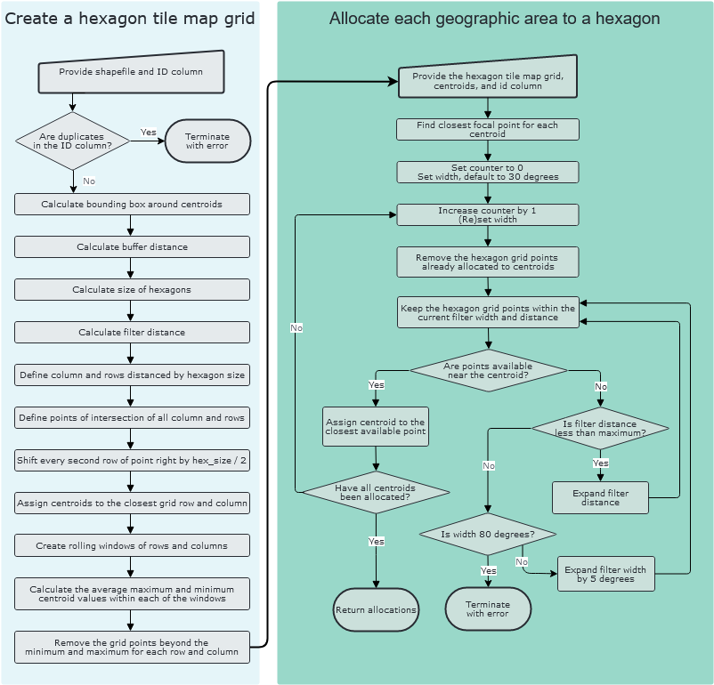

```{r defaults, echo=FALSE, message=FALSE, warning=FALSE, comment = FALSE}
knitr::opts_chunk$set(warning = FALSE, 
                      message = FALSE, 
                      comment = FALSE,
                      echo = FALSE,
                      eval = TRUE,
                      out.width = "95%",
                      retina = 3,
                      dev = "png",
                      dpi = 300)
```


```{r setup}
library(cartogram)
library(cowplot)
library(gridExtra)
library(ggthemes)
library(knitcitations)
library(kableExtra)
library(sp)
library(sf)
library(sugarbag)
library(tidyverse)

# Rda files sourced from: https://github.com/wfmackey/absmapsdata
load("data/sa22011.Rda")
load("data/state2011.Rda")

library(RefManageR)
options("citation_format" = "pandoc")
BibOptions(check.entries = FALSE, style = "markdown", bib.style = "alphabetic", cite.style = 'alphabetic')


invthm <- theme_map() + 
  theme(
    panel.background = element_rect(fill = "transparent", colour = NA), 
    plot.background = element_rect(fill = "transparent", colour = NA),
    legend.background = element_rect(fill = "transparent", colour = NA),
    legend.key = element_rect(fill = "transparent", colour = NA),
    text = element_text(colour = "white"),
    axis.text = element_text(colour = "white")
  )

# function to allocate colours to regions
aus_colours <- function(sir_p50){
  value <- case_when(
    sir_p50 <  0.74 ~ "#33809d",
    sir_p50 >= 0.74 & sir_p50 < 0.98 ~ "#aec6c7",
    sir_p50 >= 0.98 & sir_p50 < 1.05 ~ "#fff4bc",
    sir_p50 >= 1.05 & sir_p50 < 1.45 ~ "#ff9a64",
    sir_p50 >= 1.45 ~ "#ff3500",
    TRUE ~ "#FFFFFF")
  return(value)
}
```

## Introduction

<!-- Motivation to map -->

Many cancer atlases present geospatial cancer data on a choropleth map display. The Australian Cancer Atlas [@TACA] is a recent addition to the many cancer atlas maps worldwide. The ground-breaking atlas for Australia presents a central map that shows the landmass overlaid with administrative boundaries. This choropleth display can highlight the geographic patterns in geospatially related cancer statistics [@SAMGIS].

<!-- Issues with choropleth map displays... -->

Over time, the population density in major cities has increased as residents have gathered to live near urban areas [@ACTUC]. Populations tend to be distributed unevenly across geographic regions. When comparing sets of administrative geographic units such as states or electorates, area size is seldom proportional to the population size. In a choropleth map display, the geographic units are coloured to represent the value of the statistic for each unit [@EI]. This can cause some values to be emphasised over others, and allows choropleth map displays to misrepresent the spatial distributions of human related statistics due to area-size bias [@BCM]. 

The Australian Cancer Atlas is an online, interactive display of Australian cancer statistics in each of the Statistical Areas at Level 2 (SA2s), used by the @abs2011. The dataset of estimated standardised incidence ratios (SIRs) of thyroid cancer for females was downloaded from the publicly accessible Australian Cancer Atlas website and presented in Figure \@ref(fig:choro), a choropleth map that uses colour to display the distribution. The Australian choropleth map display draws attention to the expanse of dark and light blue areas across the rural communities in all states. The SA2s on the east coast around Brisbane and in northern New South Wales stand out as more orange and red. However, this display neglects the vast amount of Australian residents living in the densely populated capital cities.


```{r thyroiddata}
sa2 <- sa22011 %>% 
  filter(!st_is_empty(geometry)) %>% 
  filter(!state_name_2011 == "Other Territories") %>% 
  filter(!sa2_name_2011 == "Lord Howe Island")

SIR <- read_csv("data/SIR Downloadable Data.csv") %>% 
  filter(SA2_name %in% sa2$sa2_name_2011) %>% 
  dplyr::select(Cancer_name, SA2_name, Sex_name, p50) %>% 
  filter(Cancer_name == "Thyroid", Sex_name == "Females")
ERP <- read_csv("data/ERP.csv") %>%
  filter(REGIONTYPE == "SA2", Time == 2011, Region %in% SIR$SA2_name) %>% 
  dplyr::select(Region, Value)
# Alternative maps
# Join with sa2 sf object
sa2thyroid_ERP <- SIR %>% 
  left_join(sa2, ., by = c("sa2_name_2011" = "SA2_name")) %>%
  left_join(., ERP %>% 
              dplyr::select(Region, 
              Population = Value), by = c("sa2_name_2011"= "Region")) %>% 
  filter(!st_is_empty(geometry))
sa2thyroid_ERP <- sa2thyroid_ERP %>% 
  #filter(!is.na(Population)) %>% 
  filter(!sa2_name_2011 == "Lord Howe Island") %>% 
  mutate(SIR = map_chr(p50, aus_colours)) %>% 
  st_as_sf() 
```

```{r choro, fig.cap = "A choropleth map of thyroid incidence among females across the Statistical Areas of Australia at Level 2. Blue indicates lower than average and red indicates higher than average incidence. A cluster of high incidence is visible on the east coast."}
aus_ggchoro <- ggplot(sa2thyroid_ERP) + 
  geom_sf(aes(fill = SIR), size = 0.1) + 
  scale_fill_identity() + invthm
aus_ggchoro
```

<!-- solutions -->

The solutions to this visualisation problem begin with the geography. Alternative maps can be created to shift the focus from land area and shape to the value of the statistics [@ACCAC] in a cartogram display. Cartogram methods apply different transformations to the geographic areas, to highlight the values of the statistic of interest. Alternative maps can result in a distortion of the map space to represent features of the distribution across the areas [@ACCAC] as the statistic of interest is used to determine the cartogram layout.

Alternative mapping methods, like cartograms implemented in \CRANpkg{cartogram} [@cartogram] for R [@R], promote better understanding of the spatial distribution of a variable across the population, by representing the population in each administrative area fairly [@TAAM]. This acknowledges that the number of residents can be different and also recognises that each area, or person within it is equally important.

This paper contains a discussion of existing mapping practices, followed by details of the algorithm. The implementation section explains the algorithm available in the \CRANpkg{sugarbag} package. How to utilise animation with the hexagon map is described. The paper finishes with a summary and possible new directions for the algorithm.

## Existing mapping practices

<!-- choropleth -->
Typically, chloropleth maps are used to orient the users within the geographic context. However, the strong salience of the land mass can hide or downplay the features of the distribution in densely populated communities due to the small size on the display [@ACTUC]. The unique shapes of boundaries can be helpful for orienting users but may not contribute to their understanding of the spatial disease distribution as many of the communities are not visible in a choropleth display [@TVSSS]. 

Administrative areas are often used to aggregate census data and used to understand demographics within communities of the Australian population. Each SA2 [@abs2011] was designed to represent a community. This collection of communities presents an opportunity for explicit map transformations to improve communication of spatial distributions [@CBATCC]. In Figure \@ref(fig:tasdisplays) the choropleth map can be seen underneath each alternative map display to allow for comparisons to be made.

There are several established alternative visualisation methods. Rectangular cartograms [@ORC] and Dorling cartograms [@ACTUC] implemented in \pkg{cartogram} and tile maps implemented in \CRANpkg{tilemaps} [@tilemaps], all use one simple shape to represent each geographic unit. They all minimise the salience of the size or shape of geographic areas. These alternative map displays highlight the relationship between neighbours, preserve connections, and discard the unique shapes of the administrative boundaries. Figure \@ref(fig:tasdisplays) shows a collection of alternative map displays, this includes a) a contiguous cartogram, b) a non-contiguous cartogram, and c) a Dorling cartogram. 


```{r fullhexmap, fig.cap = "A hexagon tile map of Australia at SA2 level showing the reference undistorted maps (grey) and carotgrams (blue). The colours communicate the value of the estimated SIR of thyroid cancer for females, ranging from much lower than average (blue) to much higher than average (red)"}
if (!file.exists("data/aus_hexmap.rda")) {

## Check the projection uses long and lat
## Create centroids set
sa2centroids <- sa2 %>% 
  create_centroids(., "sa2_name_2011")
## Create hexagon grid
# For speed, consider if the buffer distance beyond the centroids is necessary
grid <- create_grid(centroids = sa2centroids,
                    hex_size = 0.1,
                    buffer_dist = 4, verbose = TRUE)
## Allocate polygon centroids to hexagon grid points
# This is a time consuming process for a large data set
aus_hexmap <- allocate(
  centroids = sa2centroids,
  hex_grid = grid,
  sf_id = "sa2_name_2011",
  ## same column used in create_centroids
  hex_size = 0.1,
  hex_filter = 8,
  focal_points = capital_cities,
  width = 25,
  verbose = TRUE)
save(aus_hexmap, file = "data/aus_hexmap.rda") 
}

load("data/aus_hexmap.rda")

## Prepare to plot
fort_hex <- fortify_hexagon(data = aus_hexmap,
                            sf_id = "sa2_name_2011",
                            hex_size = 0.2) %>% 
            left_join(sa2thyroid_ERP %>% select(sa2_name_2011, SIR, p50))
fort_aus <- sa2thyroid_ERP %>%
  fortify_sfc()
## Make a plot
aus_hexmap_plot <- ggplot() +
  geom_polygon(aes(x = long,  y = lat,  group = interaction(sa2_name_2011, polygon)),
               fill = "black",  colour = "darkgrey",  linewidth = 0.1, data = fort_aus) +
  geom_polygon(aes(x = long, y = lat, group = hex_id, fill = SIR), data = fort_hex) +
  scale_fill_identity() +
  invthm + coord_equal()
```


```{r contcart}
# Projected data 
sa2thyroid_ERP <- st_transform(sa2thyroid_ERP, crs = 3112) %>% 
  filter(state_name_2011 == "Tasmania")
sa2thyroid_ERP <- sa2thyroid_ERP %>% 
  mutate(sva = sqrt(as.numeric(Population)/as.numeric(areasqkm_2011)))

# Contiguous Cartograms
if (!file.exists("data/cont.rda")) {
  cont <- sa2thyroid_ERP %>% 
    mutate(Population = Population + 1) %>% 
    cartogram_cont(., weight = "Population", itermax = 20) %>%
    st_as_sf()
  save(cont, file = "data/cont.rda") 
}

load("data/cont.rda")

tas_ggcont <- ggplot(cont) + 
  geom_sf(fill = "#D3D3D3", colour = "white", data = sa2thyroid_ERP) +
  geom_sf(aes(fill = SIR), colour = "grey", size = 0.01) + 
  scale_fill_identity() + guides(fill = "none") +
  theme_map()
```


```{r ncontcart}
# Non - Contiguous Cartograms
if (!file.exists("data/ncont.rda")) {
  ncont <- cartogram_ncont(sa2thyroid_ERP, k = 1.5,
                         weight = "Population") %>% 
                          st_as_sf()
  save(ncont, file = "data/ncont.rda")
}

load("data/ncont.rda")

tas_ggncont <- ggplot(ncont %>% filter(state_name_2011 == "Tasmania")) + 
  geom_sf(fill = "#D3D3D3", colour = "white",  data = sa2thyroid_ERP) +
  geom_sf(aes(fill = SIR), colour = NA) + 
  scale_fill_identity() + 
  guides(fill = "none") +
  theme_map() 
```


```{r dorl}
# Non - Contiguous Dorling Cartograms
if (!file.exists("data/dorl.rda")) {
  dorl <- sa2thyroid_ERP %>% 
    filter(!is.na(Population)) %>% 
  # mutate(pop = (Population/max(Population))*10) %>% # helpful for all of Australia
    cartogram_dorling(., weight = "Population", k = 0.2, m_weight = 1) %>% st_as_sf()
  save(dorl, file = "data/dorl.rda")
}

load("data/dorl.rda")
d <- st_bbox(dorl)
tas_ggdorl <- ggplot(dorl) +
  geom_sf(fill = "#D3D3D3", colour = "white",  data = sa2thyroid_ERP) + 
  geom_sf(aes(fill = SIR), colour = "grey", size = 0.01) + 
  scale_fill_identity() +
  guides(fill = "none") +
  theme_map() #+ ggtitle("c")
```


```{r tasdisplays, out.width="100%", fig.width = 8, fig.height = 3, layout = "l-body", fig.cap = "The three displays show alternative maps of the Australian state of Tasmania at SA2 level: (a) contiguous cartogram, (b) non-contiguous cartogram and (c) Dorling cartogram of Tasmania. The contiguous cartogram looks like the state has an hourglass figure, while the non-contiguous cartogram shrinks areas into invisibility. The Dorling expands the metropolitan regions."}
cowplot::plot_grid(tas_ggcont, 
                   tas_ggncont, 
                   tas_ggdorl, ncol=3,
                   labels = c("a", "b", "c"))
```


When communicating information that is relevant to the population, each member of the population can be given equal representation by transforming the map [@TVSSS]. The connectedness of the units can be preserved by using transformations that maintain the connection between boundaries. The contiguous cartogram displayed in Figure \@ref(fig:tasdisplays)a draws attention to smaller geographic units when they are rescaled according to the population [@DMAHP]. These new shapes can now be coloured to represent a second variable. The algorithm uses the geographic shape of the areas and iterates toward sizing the areas to represent the population. This display can create twisted and unfamiliar shapes from the geographic units as the algorithms must satisfy the topology conditions, especially when there are communities located geographically far from their neighbours [@TVSSS]. 

<!-- non-contiguous -->

The non-contiguous cartogram in Figure \@ref(fig:tasdisplays)b also uses the population to rescale the geographic units. Unlike the contiguous cartogram, the SA2 areas maintain their geographic shape, but they may not retain the connection with their neighbours. The population of the SA2 areas is used to scale the geographic units in the non-contiguous cartogram [@NAC]. The amount of background space can be meaningful in non-contiguous cartograms [@ECGC]. However, the relative size of units in comparison to the reference unit can lead to scaling issues. The size disparity between rural areas and urban areas result in reasonable display within the south eastern city of Hobart, but these units are not visible in the context of the Tasmania state map. Depending on the difference between the population and geographic land size, the amount of white space can also prevent meaningful understanding of the distribution [@TVSSS].


<!-- Dorling -->

The Dorling cartogram presents each geographic unit as a circle, the size of the circle is scaled according to the population value of each area [@ACTUC]. Figure \@ref(fig:tasdisplays)c shows the Tasmania SA2 areas as an individual circle located as close as possible to the geographic centroid location. This map draws attention to the collection of coastal cities in Tasmania that were not apparent in Figure \@ref(fig:tasdisplays) a or b. This display also highlights the difference in the population of each unit, as there is some disparity in the sizes of the circles.

Another common practice is to use equal-sized polygons and treat all geographic units as equal. The Dorling algorithm can be induced to do this, to make equallly sized circles. @MDAC describes a group of alternative maps called "mosaic cartograms" for tile displays. Similarly, the geography of USA has been transformed into a square-binned tile map manually and made available in the R package \CRANpkg{statebins} [@statebins].The algorithm described below generates an automatic layout of hexagon tiles, where a continguity constraint is relaxed. This gives equal weight to each geographic area even if the population differs. 

The nature of Australian population boundaries means that there are many connecting neighbours of population areas. This solution was designed to visualise Australian population analysis, inspired by tile maps three sided triangles and four sided squares were considered, but this would not have allowed sufficient neighbours to connect. Hexagon tile maps utilise the tessellating features of hexagons to maximise the data ink and allow connectivity between six potential neighbours. Hexagons allow the alignment of geographic borders, this aides in comparison of colour values.

## Algorithm

The purpose of this algorithm is to create an alternative map display that highlights distributional features across wide ranges of geographical area size and population density. There has been an increasing need for displays that recognise the large number of people that live in dense urban environments. The algorithm intends to maintain the spatial relationships of a group of geographic units using the relationship between each unit and the closest focal point. The algorithm allocates geographic units to a representative hexagon, in order of their proximity to the closest focal point.


The algorithm is implemented in the \pkg{sugarbag} package for `R`, named after the common name for the *Trigona carbonaria* bee – a species which builds flat layers of hexagonal brood cells, spiralling out from a central point [@PH]. This unusual pattern also provided the inspiration for the algorithm, where the maps are constructed by building out from multiple focal points on the geographic map base in a spiral fashion.

The result of the algorithm applied to the same data represented in Figure \@ref(fig:choro) shows rates of thyroid cancer for females in each of the SA2 areas of Australia as hexagons in Figure \@ref(fig:hexmap).
The difference to the choropleth map in Figure \@ref(fig:choro) are clear. Now the higher thyroid cancer incidence in the densely populated areas in Sydney, Brisbane and Perth are visible. Interestingly, there is no clear divide between rural and urban SA2 areas, as many rural areas and the cities of Melbourne, Darwin, Adelaide and Hobart have low rates of thyroid incidence for females. The hexagon tile map display provides a more accurate representation of the spatial distribution of thyroid cancer incidence across Australia.


Figure \@ref(fig:hexmap) highlights the density of Australian capital cities, as it draws attention to the many communities in Sydney, Melbourne and Hobart. This display also highlights the disparity in the burden of thyroid cancer for females in the communities of these cities. There are several collections of red hexagons in Sydney that represent the communities with much higher rates of diagnosis than the Australian average. Brisbane also experiences higher than average rates of diagnosis, but has more orange than red. The females in the cities of Adelaide and Perth  show much lower rates of diagnosis.

Compared to the choropleth map display in Figure \@ref(fig:choro), the low rates in the rural Australian communities no longer dominate the display. While the corresponding hexagons are still visible against the black background, the lower rates in rural Australia are less prominent.

<!-- When the algorithm is applied to the complete set of all Australian Statistical Areas at Level 2 it results in the hexagon tile map display shown in Figure \ref{fig:hexmap}. This display highlights the density of Australian capital cities, as it draws attention to the many communities in Sydney, Melbourne and Hobart. This display also highlights the disparity in the burden of thyroid cancer for females in the communities of these cities. There are several collections of red hexagons in Sydney that represent the communities with much higher rates of diagnosis than the Australian average. Brisbane also experiences higher than average rates of diagnosis, but has more orange than red. The females in the cities of Adelaide and Perth  show much lower rates of diagnosis. -->


<!-- Compared to the choropleth map display, the low rates in the rural Australian communities are no longer dominating the display. While the representative hexagons are still visible against the black background, the much lower than average rates in the Northern Territory are less noticeable. -->

```{r hexmap, fig.cap = "A hexagon tile map of female thyroid cancer incidence in Australia, the same data as shown in the choropleth map in Figure 1. The high incidence in several of the metropolitan regions (Brisbane, Sydney and Perth) can now be seen, along with numerous isolated spots."}
aus_hexmap_plot
```


There are several key steps in the creation of the hexagon tile map as described in the flow chart in Figure \@ref(fig:sugarbagflow). First, derive the set of centroids from the polygons provided, then create the grid of hexagon locations. These two processes are described in the blue left column of the flow chart in figure \@ref(fig:sugarbagflow). Each centroid can then be allocated to an available hexagon location. The steps for the allocation process are detailed in the right column of Figure \@ref(fig:sugarbagflow). There are several filter steps to speed up the process of selecting an appropriate hexagon to represent each geographic unit. To make tessellated plots with the hexagon allocations, the point locations are converted into hexagon shapes.

```{r sugarbagflow, out.width = "100%", layout = "l-body-outset", fig.cap = "A flow diagram detailing the steps taken to create a hexagon tile map. There are two basic processes, one to make the grid, and the other to allocate centroids to grid points.", fig.alt="The steps of the algorithm to creating a hexagon grid with buffer, and the allocation of spatial polygon centroids to hexagon. This is the same information as provided in the text of the paper."}

```


## Implementation

<!-- Motivate the value of the the package and algorithm -->

Hexagon tile maps can be useful for visualising distributions across a collection of geographic areas. However, these maps are not easy to create manually, especially as the number of areas increases. This algorithm was developed to automate the process, and reduce the workload involved in creating and implementing alternative displays. This allows map makers and data communicators to spend their time choosing the most effective display.

The \pkg{sugarbag} package contains a set of functions that help R users to create a hexagon tile map. The algorithm presented in the \pkg{sugarbag} package operates on a set of simple feature geometry objects , known as \CRANpkg{sf} objects [@sf]. This package allows R users to create \pkg{sf} objects by importing polygons stored in various formats. Users should provide a set of polygons that define geographic units by their administrative boundaries. The functions arrange the geographic units in order of proximity to a set of locations provided, such as the centre of major cities. The centroid location of each geographic unit is used to measure the proximity. It emphasises the major cities as population hubs, rather than emphasizing the size of large, rural geographic units.

The user can tweak the parameters of the hexagon map using additional arguments to the \code{create\_hexmap} function, but these options may affect the speed of the algorithm. 
The hexagon size may need adjustments depending on the density of the population; users can provide an appropriate hexagon size and re-run the algorithm. The buffer distance may need to be increased if the coastal cities need to extend beyond the geographic land mass.

## Algorithm steps

The package can be installed from CRAN and the development version can be installed from the GitHub repository: https://github.com/srkobakian/sugarbag.

The following steps create the hexagon tile map for all the Statistical Areas at Level 2 in Tasmania. These steps can be executed by the main function, \code{create\_hexmap}, or can be run separately for more flexibility.

If a user would like to perform steps of the algorithm themselves, additional user input will be needed for the functions that perform each step. For example, if the user wishes to use a set of centroids, rather than polygons, the \code{allocate} function can be used directly.

The set of SA2 polygons for Tasmania, using the 2011 definition of SA2s, was accessed from the \pkg{absmapsdata} package [@absmapsdata]. A single column of the data set is used to identify the unique areas. In this case, the unique SA2 names for each SA2 have been used.

The Australian capital cities are used as focal points to allocate each geographic area around the closest capital city. Hobart will be the focal point for this example because only the state of Tasmania is being processed.

```{r capital_cities}
data(capital_cities)
```

The buffer distance, hexagon size, hexagon amount to filter and width of angle are parameters that will be determined within \code{create\_hexmap}, if they are not provided. They are created as they are needed throughout the following example.


The results from various steps in the process are illustrated in Figure \@ref(fig:filterprocess).

### Derive the set of centroid points

The set of polygons should be provided as an \pkg{sf} object, this is a data frame containing a \code{geometry} column. The \code{read\_shape} function can assist in creating this object for use in R.

The centroids can be derived from an \pkg{sf} object using the \code{create\_centroids} function:

```{r tas_centroids, fig.cap = "The Australian Cancer Atlas data has determined the colour of each Statistical Area of Australian at Level 2. A choropleth map (a) of Standardised Incidence Rates (SIRs) is paired with a hexagon tile map (b) to contrast the colours that are made obvious when every SA2 is equally represented."}
centroids <- create_centroids(
  shp_sf = sa2 %>% filter(state_name_2011 == "Tasmania"), 
  sf_id = "sa2_name_2011")
hex_size <- .2
buffer_dist <- 2
bbox <- tibble(min = c(min(centroids$longitude), min(centroids$latitude)),
  max = c(max(centroids$longitude), max(centroids$latitude)))
grid <- tibble::as_tibble(expand.grid(hex_long = seq(bbox$min[1] - buffer_dist,
  bbox$max[1] + buffer_dist,
  hex_size),
  hex_lat = seq(bbox$min[2] - buffer_dist,
    bbox$max[2] + buffer_dist,
    hex_size)))

fort_tas <- fort_aus %>% filter(state_name_2011 == "Tasmania")

tas_centroids <- ggplot() + 
  geom_polygon(aes(x = long, y = lat, group = interaction(sa2_name_2011, polygon)), data = fort_tas, fill = "#D3D3D3", colour = "white", size = 0.1) + 
  geom_point(aes(x=longitude, y = latitude), size = 2, shape = 19, colour = "white",
             data = centroids) +
  scale_colour_identity() +
  theme_void() + 
  coord_equal()

tas_hexmap <- ggplot() +
  geom_polygon(aes(x = long, y = lat, group = interaction(sa2_name_2011, polygon)), data = fort_tas, fill = "#D3D3D3", colour = "white", size = 0.1) + 
  geom_polygon(aes(x = long, y = lat, group = hex_id, fill = SIR),
               data = fort_hex %>% filter(sa2_name_2011 %in% fort_tas$sa2_name_2011)) +
  scale_fill_identity() +
  theme_void() + 
  coord_equal()
```

### Step 1: Create the hexagon grid points

A grid is created to allow tessellation of the hexagons that represent the geographic units. For a hexagon tile map, the grid of possible hexagon locations is made using the \code{create\_grid} function. It uses the centroids, the hexagon size and the buffer distance. Figure \@ref(fig:filterprocess) 1a shows the initial locations of grid points created for Tasmania.

```
centroids <- create_centroids(
  shp_sf = sa2 %>% filter(state_name_2011 == "Tasmania"), 
  sf_id = "sa2_name_2011")
```
#### (a) Creating a tessellated grid

A set of longitude columns, and latitude rows are created to define the locations of the hexagons. The distance between each row and column is the size specified by \code{hex\_size}. Equally spaced columns are created from the minimum longitude minus the buffer distance, up to the maximum longitude plus the buffer distance. Similarly, the rows are created from the latitude values and the buffer distance. A unique hexagon location is created from all intersections of the longitude columns and latitude rows. Figure \@ref(fig:filterprocess) 1a shows the hexagon grid after every second latitude row on the grid is shifted right, by half of the hexagon size.

```
grid <- create_grid(centroids = centroids, hex_size = 0.2, buffer_dist = 2)
```

```{r grid, fig.cap = "Complete set of grid points to create a tile map.", height = 4}
# Find every second latitude
shift_lat <- grid %>% dplyr::select(hex_lat) %>%
  dplyr::distinct() %>%
  dplyr::filter(dplyr::row_number() %% 2 == 1) %>% unlist()
# Shift the longitude of every second latitude to the right to make hex structure
grid <- grid %>%
  dplyr::mutate(hex_long = ifelse(hex_lat %in% shift_lat, hex_long,
    hex_long + (hex_size / 2))) %>%
  dplyr::mutate(id=1:NROW(.))  %>%
  dplyr::mutate(assigned=FALSE)
```

#### (b) Filtering the grid

Not all of the grid points will be used, especially if islands result in a large grid space. To filter the grid for appropriate hexagon locations for allocation, the \code{create\_grid} function will call the \code{create\_buffer} function. It finds the grid points needed to best capture the set of centroids on a hexagon tile map. Reducing the buffer size will decrease the amount of time that the algorithm needs to run for, as there will be less points over the water to consider for each centroid allocation.

For each centroid location, the closest latitude row and longitude column are found. Then rows and columns of centroids are divided into 20 groups. The number of rows in each latitude group and the number of columns in each longitude group are used as the width of rolling windows. The first rolling window step finds the minimum and maximum centroid values within each of the sliding window groups of longitude columns, and the groups of latitude rows. The second rolling window step finds the average of the rolling minimum and maximum centroid values, for the longitude columns and latitude rows.


The hexagon grid points are kept only if they fall within the rolling average of the minimum and maximum centroid values after accounting for the buffer distance, for each row and column of the grid. Figure \@ref(fig:filterprocess) 1b displays remaining hexagon grid points after applying the buffer filter. The sparsely populated South-West region of National Park has fewer points available in the water compared to the South-East region near the city of Hobart.


```{r filtergrid, fig.cap = "Each key step in the hexagon allocation process. The full hexagon grid in a) is created first. The buffer is applied and the remaining points are shown as larger, dark green circles, the potential hexagon points that were removed are shown as smaller, light green points. For each centroid in the set, c) shows the points left after the closest points are selected as potential locations. The relationship between Hobart (the cross) and the centroid (the yellow triangle is used to filter the potential locations within a wedge."}
g1 <- ggplot() + 
  geom_polygon(aes(x = long, y = lat, group = interaction(sa2_name_2011, polygon)), data = fort_tas, fill = "#D3D3D3", colour = "white", size = 0.1) + 
   theme_void() + 
  geom_point(aes(x = hex_long, y = hex_lat), colour = "#09661f", data = grid, size = 1) +
  coord_equal()

full_grid <- grid <- grid %>%
  mutate(hex_long_int = dense_rank(hex_long)-1,
    hex_lat_int = dense_rank(hex_lat)-1)
nlong <- length(unique(grid$hex_long))
nlat <- length(unique(grid$hex_lat))
  
# Add grid row and column values to centroids data set 
centroids <- centroids %>%
  mutate(
    # long int for integer value of longitude column
    long_int = round((longitude - min(grid$hex_long)) / 
                       (max(grid$hex_long) - min(grid$hex_long)) * nlong, 0),
    # lat int for integer value of latitude column
    lat_int = round((latitude - min(grid$hex_lat)) / 
                      (max(grid$hex_lat) - min(grid$hex_lat)) * nlat, 0)
  )
# Amount of lats and longs in each group of rows and columns
lat_size <- round(nlat / 20, 0)
long_size <- round(nlong / 20, 0)
# Make a list of the min and max of the groups
# Effectively creates manual sliding windows
nlat_list <- purrr::map2(seq(1:nlat), lat_size + seq(1:nlat), c)
nlong_list <- purrr::map2(seq(1:nlong), long_size + seq(1:nlong), c)
# LATITUDE ROWS FILTER


# Function to return the centroids that fall in the latitude window
lat_window <- function(bounds, cents = centroids, maximum = nlat) {
  
  max_int <- min(bounds[2], maximum)
  cents_in <- filter(cents, between(lat_int, bounds[1], max_int))
  return(cents_in)
}

# Function to return the centroids that fall in the longitude window
long_window <- function(bounds, cents = centroids, maximum = nlong) {
  
  max_int <- bounds[2]
  
  while (max_int > maximum) {
    max_int <- max_int - 1
  }
  cents_in <- filter(cents, between(long_int, bounds[1], max_int))
  return(cents_in)
}

# amount of latitude in sliding window
lat_windows <- purrr::map(.x = nlat_list, .f = lat_window, centroids, nlat)

# LONGITUDE COLS FILTER
long_windows <- purrr::map(.x = nlong_list, .f = long_window, centroids, nlong)

#########################################################
###                ROLLING MIN & MAX                  ###

# DEFINE FUNCTION
# find the min and max longitude for each latitude
range_rows <- purrr::map_dfr(
  .x = lat_windows,
  .f = function(data) {
    data %>%
      dplyr::summarise(
        long_min = ifelse(purrr::is_empty(long_int), NA, min(data$long_int)),
        long_max = ifelse(purrr::is_empty(long_int), NA, max(data$long_int))
      )
  }
)
# find the min and max longitude for each latitude
range_cols <- purrr::map_dfr(.x = long_windows, .f = function(data) {
  data %>%
    dplyr::summarise(
      lat_min = ifelse(purrr::is_empty(lat_int), NA, min(data$lat_int)),
      lat_max = ifelse(purrr::is_empty(lat_int), NA, max(data$lat_int))
    )
})

# find the min and max longitude for each latitude
range_rows <- purrr::map_dfr(.x = lat_windows, .f = function(data) {
    data %>%
      dplyr::summarise(
        long_min = ifelse(purrr::is_empty(long_int), NA, min(data$long_int)),
        long_max = ifelse(purrr::is_empty(long_int), NA, max(data$long_int))
      )
  }
)

# find the min and max longitude for each latitude
range_cols <- purrr::map_dfr(.x = long_windows, .f = function(data) {
  data %>%
    dplyr::summarise(
      lat_min = ifelse(purrr::is_empty(lat_int), NA, min(data$lat_int)),
      lat_max = ifelse(purrr::is_empty(lat_int), NA, max(data$lat_int))
    )
})


#########################################################
###                ROLLING AVERAGES                   ###


mean_range <- function(bounds, data) {
  data[bounds[1]:min(bounds[2], NROW(data)), ] %>%
    dplyr::summarise(across(ends_with("min"), 
                       ~mean(.x, na.rm = TRUE), .names = "mean_{col}"),
                     across(ends_with("max"), 
                            ~mean(.x, na.rm = TRUE), .names = "mean_{col}")) %>% 
    # in cases where all values are NA mean is Nan
    # make mean value of NaN be NA
    dplyr::summarise(across(starts_with("mean"), ~ifelse(.x == "NaN", NA, .x)))
}

# smooth the minimums
av_range_rows <- purrr::map_dfr(.x = nlat_list, mean_range, range_rows) %>%
  bind_cols(lat_id = c(seq(1:nlat) + lat_size), .)

# smooth the minimums
av_range_cols <- purrr::map_dfr(.x = nlong_list, mean_range, range_cols) %>%
  bind_cols(long_id = c(seq(1:nlong) + round(long_size / 2)), .)
# APPLY A BUFFER
# change buffer to amount of hexagons (ints) either side
hex_buffer <- floor(buffer_dist / hex_size)
  
grid <- grid %>%
    left_join(., av_range_rows, by = c("hex_lat_int" = "lat_id")) %>%
    left_join(., av_range_cols, by = c("hex_long_int" = "long_id")) %>%
    rowwise() %>%
    mutate(long_buffer = ifelse(between(
      hex_long_int, mean_long_min - hex_buffer,
      mean_long_max + hex_buffer), "in", "out")) %>%
    mutate(lat_buffer = ifelse(between(
      hex_lat_int, mean_lat_min - hex_buffer,
      mean_lat_max + hex_buffer), "in", "out")) %>%
    filter(lat_buffer == "in" | long_buffer == "in")

g2 <- ggplot() + 
   geom_polygon(aes(x = long, y = lat, group = interaction(sa2_name_2011, polygon)), data = fort_tas, fill = "#D3D3D3", colour = "white", size = 0.1) +  
  theme_void() + coord_equal() +
  geom_point(aes(x = hex_long, y = hex_lat), colour = "#55b56c", data = full_grid, size = 0.5) +
  geom_point(aes(x = hex_long, y = hex_lat), colour = "#09661f", data = grid, size = 1)

```

#### Centroid to focal point distance

The distance is calculated between each centroid in the set, and each of the focal points provided. The order for allocation is determined by the distance between the polygon centroid and it's closest focal point. For this example, this distance is only calculated for the capital city of Hobart, represented in Figure \@ref(fig:filterprocess) 2a and 2b as a white cross. 

### Step 2: Allocate each centroid to a hexagon grid point

To allocate all centroids the set of polygon centroids and the hexagon map grid are required. The polygon centroids are ordered from the centroid closest to the focal point(s), to the furthest. This preserves spatial relationships with the focal point, as the inner city areas are allocated first and placed closest to the capital, the areas that are further will then be accommodated. The following example considers the first of the Statistical Areas at Level 2. Within the algorithm, these steps are repeated for each polygon.

```
hex_allocated <- allocate(centroids = centroids,
                          sf_id = "SA2_NAME16",
                          hex_grid = grid,
                          hex_size = 0.2, # same size used in create_grid
                          hex_filter = 10,
                          use_neighbours = tas_sa2,
                          focal_points = capital_cities,
                          # same column used in create_centroids
                          width = 30, verbose = TRUE)
```

```{r centroids, eval = FALSE}
hexmap_allocation <- allocate(
  centroids = centroids %>% select(sa2_name_2011, longitude, latitude),
  sf_id = "sa2_name_2011",
  hex_grid = grid,
  hex_size = 0.2, ## same size used in create_grid
  hex_filter = 10,
  width = 35,
  focal_points = capital_cities,
  verbose = TRUE)
```


#### (a) Filter the grid for unassigned hexagon points

After each centroid is located, it is removed from the set of grid points, and is no longer considered in the next step. Keeping only the available hexagon points prevents multiple geographic units from being allocated to the same hexagon. This is demonstrated in Figure \@ref(fig:filterprocess) 2a and 2b by the black hexagons that represent the seven closest polygons to the capital city of Hobart. As the allocation process begins for the eighth closest centroid there are seven unavailable hexagon locations.

#### (b) Filter the grid points for those closest to the centroid

The algorithm creates a circle of points, by only keeping points within a certain radial distance around the original centroid location. Only the hexagons which are close to the centroid and have not been assigned are considered. The number of possible hexagon locations to consider for a centroid is determined by the hexagon filter. This is the maximum number of hexagons between the centroid and the furthest considered hexagon. It is used to subset possible grid points to only those surrounding the polygon centroid within an appropriate range. A smaller distance will increase speed, but can decrease accuracy when width of the angle increases.


```{r buffers, fig.cap = "Filter for grid points within a square, then circular, distance for those closest to the centroid.", echo = FALSE, out.width = "100%", height = 4}
centroids <- centroids %>%
        group_nest(sa2_name_2011) %>%
        mutate(closest = purrr::map(data, closest_focal_point, 
                                    focal_points = capital_cities)) %>%
        unnest(c("data", "closest")) %>%
        arrange(focal_distance) %>% 
        mutate(rownumber = row_number())


# Choose a centroid for allocation:
f_centroid <- centroids %>%
        filter(rownumber == 8)


# filter_grid_points
distance <- (((f_centroid$latitude - f_centroid$focal_latitude) ^ 2) + 
         ((f_centroid$longitude - f_centroid$focal_longitude) ^ 2)) ^ (1 / 2)
flong <- f_centroid$longitude
flat <- f_centroid$latitude
f_dist <- 10 * hex_size
angle_width <- 35
  
f_grid <- grid %>%
  ungroup() %>%
  filter((flat - f_dist) < hex_lat & hex_lat < (flat + f_dist)) %>%
  filter((flong - f_dist) < hex_long & hex_long < (flong + f_dist))


f_grid <- f_grid %>%
  group_by(id) %>%
  mutate(
    hex_lat_c = (hex_lat - flat),
    hex_long_c = (hex_long - flong)) %>%
  mutate(hyp = ((hex_lat_c^2) + (hex_long_c^2))^(1 / 2))
f_angle <- f_centroid %>%
      mutate(atan = atan2(latitude - focal_latitude, longitude - focal_longitude),
        angle = (atan * 180 / pi),
        pangle = ifelse(angle < 0, angle + 360, angle)) %>%
      pull(pangle)

f_grid <- f_grid %>%
  # create circle of radius: f_dist
  filter(hyp < f_dist) %>%
  mutate(
    # geosphere takes a long time
    angle = f_angle,
    angle_plus = (angle + angle_width) %% 360,
    angle_minus = (angle - angle_width) %% 360,
    atan = atan2(hex_lat_c, hex_long_c),
    hex_angle = (atan * 180 / pi),
    hex_angle = ifelse(hex_angle < 0, hex_angle + 360, hex_angle))

allocated_list <- aus_hexmap %>% 
                  filter(points == "Hobart") %>% 
                  slice_min(rownumber, n = 7)

fort_allocated <- allocated_list %>% 
  fortify_hexagon(., sf_id = "sa2_name_2011", hex_size = 0.2)


full_grid <- full_grid %>% filter(hex_long > bbox$min[1], hex_long < bbox$max[1],
                                  hex_lat > bbox$min[2], hex_lat < bbox$max[2])

allocated_list <- aus_hexmap %>% 
                  filter(points == "Hobart") %>% 
                  slice_min(rownumber, n = 7)

fort_allocated <- allocated_list %>% 
  fortify_hexagon(., sf_id = "sa2_name_2011", hex_size = 0.2)
  
# Check that there were available points within hyp distance
f_grid <- f_grid %>%
        # create slice of width *2 degrees from centroid
        filter(angle_minus < hex_angle & hex_angle < angle_plus)


f1 <- ggplot() + 
  geom_polygon(aes(x = long, y = lat, group = interaction(sa2_name_2011, polygon)), data = fort_tas, fill = "#D3D3D3", colour = "white", size = 0.1) +
  theme_void() + coord_equal(ylim = c(-45.1, -40.5), xlim = c(144.5, 149)) +
  geom_point(aes(x = hex_long, y = hex_lat), colour = "#55b56c", data = grid, size = 0.5) +
  geom_point(aes(x = hex_long, y = hex_lat), colour = "#09661f", data = f_grid, size = 1) +
  # allocated areas
    geom_polygon(aes(x = long, y = lat, group = interaction(sa2_name_2011)), data = fort_allocated, fill = "#353b38", colour = "black", size = 0.01, alpha = 0.7) +
  #Hobart
  geom_point(aes(x = focal_longitude, y = focal_latitude), data = f_centroid, colour = "#e9f2ed", size = 4, shape = 3) + 
  geom_point(aes(x=longitude, y = latitude), data = f_centroid, fill = "#beaed4", shape = 25) 

```

The \code{width} parameter is used to take a slice of the remaining points. The slice centres on the angle from the focal point to centroid location. This uses the angle from the closest capital city, to the current centroid as seen in Figure \@ref(fig:filterprocess) 2a. This allows the spatial relationship to be preserved, even when it is allocated to a hexagon that is further from the focal point then the original centroid location.

```{r filterprocess, fig.cap = "Illustration of key steps of the algorithm: (1a) full hexagon grid is created first; (1b) buffer is applied, shown as dark green circles, to accommodate irregularly shaped regions; (2a, 2b) allocation process, relative the center of Hobart, showing the 8th centroid to be allocated. The relationship between Hobart (the cross) and the centroid (the purple triangle) is used to filter the potential locations from the grid within a wedge. Hexagons already allocated are shown in black, and the purple circle indicates the hexagon to be assigned to the 8th centroid.", dpi = 600, echo = FALSE, height = 12}

hex <- f_grid %>%
        ungroup() %>%
        filter(hyp == min(hyp)) %>%
        select(hex_long, hex_lat, hex_id = id)

f2 <- ggplot() + 
  geom_polygon(aes(x = long, y = lat, group = interaction(sa2_name_2011, polygon)), data = fort_tas %>% filter(lat < -40.3), fill = "#D3D3D3", colour = "white", size = 0.1) +
  geom_polygon(aes(x = long, y = lat, group = interaction(sa2_name_2011)), data = fort_allocated, fill = "#353b38", colour = "black", size = 0.01, alpha = 0.7) +
  #Hobart
  geom_point(aes(x = focal_longitude, y = focal_latitude), data = f_centroid, colour = "#e9f2ed", size = 4, shape = 3) + 
  geom_point(aes(x=longitude, y = latitude), data = f_centroid, fill = "#beaed4", shape = 25, size = 2) + 
  theme_void() + coord_equal(xlim = c(146.9, 148), ylim = c(-43.6, -42.5)) +
  # possible choices to select
  geom_point(aes(x = hex_long, y = hex_lat), colour = "#09661f", data = f_grid, size = 2.5) +
  # selected hexagon
  geom_point(aes(x = hex_long, y = hex_lat), colour = "#09661f", fill = "#beaed4", data = hex, size = 3.5, shape = 21)
 
# gridExtra::grid.arrange(g1, g2,
#                         f1, f2)

cowplot::plot_grid(g1, g2,
                   f1, f2,
                   labels = c("1a", "1b", "2a", "2b"))
```


If no available hexagon grid point is found within the original filter distance and angle, the distance is expanded and only when a maximum distance is reached will the angle expand to accommodate more possible grid points.
By default the angle filter for the hexagon grid points create plus and minus 30 degree bounds of the angle from the focal point to the geographic centroid. This will increase if no points can be found within the \code{hex\_filter} distance. The default angle of 30 was chosen to allow the algorithm to find hexagons that best maintained the spatial relationship between the focal point and geographic centroid.

<!-- Tasmania example has been removed -->
<!-- A complete hexagon tile map of Australia is created by applying the algorithm steps to each centroid. The hexagon tile map is used to visualise the Australian Cancer Atlas data [@TACA]. Two views of the same data are produced by filling according to the thyroid Cancer Standardised Incidence Rates (SIRs) downloaded from the Australian Cancer Atlas site. This small example in Figure \ref{fig:hexmap} shows the group of blue areas in the Hobart CBD more prominently in the hexagon tile map. The small red areas visible in the choropleth map (a) along the north coast are much larger in the hexagon tile maps. The hexagon tile map shows less yellow, this no longer overwhelms the map space with the information regarding the rural areas. -->

### User choices

<!-- The\code{create\_hexmap} function will -->

<!-- Derive the centroids of the geographic units to calculate a grid of possible hexagon locations, and allocate each geographic unit to a single hexagon. -->

Only two inputs are necessary to begin the algorithm; the shapefile, and the ID variable. The ID variable should uniquely identify each geographic unit in the shapefile.

The centroids are derived from the shapefile. The number of centroids within the geographic map is used to determine an appropriate hexagon size if one is not provided. The centroids are used to construct a grid. The grid initially covers the entire map, encompassing all the centroid locations and extending in all directions up to the buffer distance. This buffer distance can help to account for densely populated coastal areas, allowing the hexagon locations to spread beyond the coastline.

The centroid set and hexagon tile map grid are necessary for the allocation process. Additionally, a set of reference locations can be provided as focal points, typically compact and/or densely populated areas such as major cities. The algorithm will use the focal points to create the order of allocation, prioritising the closest centroid locations to the focal points. The user can also specify the variable that should be used to determine the order for the allocation.

When allocating representative hexagons, the width parameter can be used to determine the flexibility of positioning. Using the relationship with the nearest focal point, a larger width parameter will increase the amount of available hexagons nearer to the original centroid of the geographic unit. A smaller width will maintain the orientation from the focal point to the centroid when selecting the hexagon location. However, this could mean it is placed further away.

 

## Animation

Creating an animation connecting these two displays can allow users to grasp the meaning of the connected hexagons. It will also highlight the density of the communities using the rapid expansion of the inner-city areas, these hexagons will move the furthest and will move rapidly in the animation from their geographic locations. The rapid decrease in size of the large rural areas can show the large size of their collective landmass. The \CRANpkg{gganimate} [@gganimate] package can be used to make an animation. It connects the polygons for each area in the two displays using the \code{sf\_id} variable, the names of the statistical areas, and creates intermediate displays as they geographic areas shrink or expand to the chosen hexagon size.

## Discussion

The present work describes an algorithm called the hexagon tile map.
It also shows how this algorithm addresses the potential issues found with contiguous, non-contiguous and Dorling cartograms when applied to the geography of Australia. It achieves a display that effectively presents the density of the population in small geographic areas and de-emphasises the large rural geographic space between the densely populated capital cities. The hexagon tile map display acknowledges that the amount of residents can differ but each administrative area is equally important. This solution uses equally sized areas, and maintain neighbourhood boundary connections.

<!-- implementation -->

The hexagon tile map display acknowledges that the amount of residents can differ but each administrative area is equally important. This solution uses equally sized areas, and maintain neighbourhood boundary connections. The \pkg{sugarbag} package for R automates the creation of tessellated hexagon tile maps by providing an algorithm to design these displays. The Australian application preserves spatial relationships, and emphasises capital cities. 
However, similar to the choropleth map display, the tessellation does not allow the size of the hexagons to represent another variable. The algorithm is heavily dependent on the location and number of focal points used, as this determines the order of allocation. With careful consideration of the choropleth map, the small geographic inner city areas may not have been noticed by viewers, but the hexagon tile map display emphasises them. The communities in northern Tasmania and the Northern territory do not draw attention because of their size as in the choropleth, but their colour is still noticeably below average when contrasted with the hexagons in New South Wales.


<!-- limitations, where it might not work -->

Australia serves as a good use case for the algorithm as it represents an extremely sparse geography and small dense population areas which cannot be satisfactorily represented by existing cartogram-like algorithms. However, the algorithm is sufficiently general to apply to other geographic regions, and indeed has been applied to make hexagon maps of the UK, USA and France. 

There are many possible extensions to the algorithm that might prove valuable in the future. The buffer allows extension beyond the furthest centroids, but there is no mechanism to protect borders by forcing centroids to be located within the geographic borders of a set of regions (e.g. country or state). The algorithm is also currently limited to representing each geographic area with one hexagon only. In the filter step for final selection of a hexagon grid point for each centroid, a direct angle constraint is currently implemented, but it may narrowly miss potentially better hexagon allocation. Some other constraints, such as a logarithmic function may help to refine the final allocation to hexagons closer to the original centroid location. In a country like Australia, the vast empty interior produces a hexagon map with many small isolated hexagons, even when the city centres are hugely expanded. It could be useful to allow variable sized hexagons, primarily to increase the size of the isolated hexagons to improve their visibility.

This new algorithm provides an effective start point for automatically creating hexagon tile maps for any spatial polygon data, and contributes to an extensive body of work that encourages the use of alternative map displays for statistical displays of spatial data.

