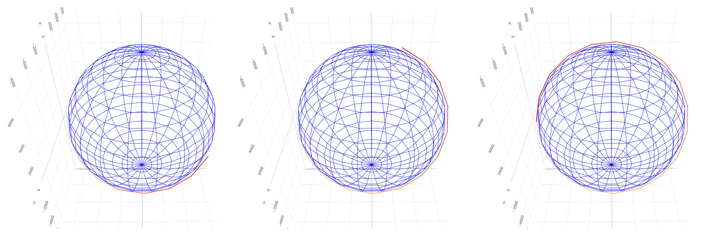

```{r setup, include=FALSE}
knitr::opts_chunk$set(echo = FALSE, warning = FALSE, message = FALSE, fig.pos = "H")
library(asteRisk)
library(plotly)
library(ggmap)
library(lazyeval)
library(dplyr)
library(kableExtra)
```

# Introduction

Since the launch of Sputnik 1 in 1957, the developments in space technology have enabled a fast growth of the amount of satellites placed in orbit around Earth. Such growth has become especially prominent in the last decade, as evidenced by the fact that over a third of the 11,697 satellite launches performed until September 2021 occurred over the last 5 years [@unoosaregister]. The number of organizations behind satellite launches has also considerably expanded, and currently includes not only government and military agencies, but also private entities. This is largely due to technological developments, such as miniaturized satellites, that have made the process of placing a satellite on orbit around Earth increasingly accessible [@toorian2008cubesat;@kirillin2015ssau;@bouwmeester2010survey].

Planning the launch, operation and orbital maneuvers of satellites requires predictions of the trajectory that a satellite will follow along time from a known state vector (a set of parameters that define the position, velocity and acceleration of the satellite at a given instant). Such methods are also useful for studying the simultaneous evolution of multiple satellites, with the aim to predict and avoid collisions. This is of special interest in the light of the increasing density of Earth-orbiting satellites, since uncontrolled collisions could lead to the onset of Kessler syndrome [@kessler1978collision;@kessler2010kessler], a positive-feedback scenario where the generated space debris impacts on other objects, producing further cascading collisions. This would eventually hinder space operations in some orbits for very long periods of time. For these reasons, multiple models have been developed to calculate the evolution (propagate) of the position of a satellite over time from a set of initial, known conditions.

We introduce \CRANpkg{asteRisk}, an R package that aims to provide a suite for astrodynamics analysis in R. To that extent, implementations of some of the most frequently applied orbital propagators are provided, including the SGP4 and SDP4 models [@dong2010accuracy], as well as a high-precision numerical orbital propagator. Additionally, utilities for reading file formats commonly used to distribute satellite positions (ephemeris) are provided. Satellite ephemerides are relatively scarce compared to other types of positional data (such as that available for standard aviation) [@schafer2014], due to the much higher technical complexity of the equipment required to obtain experimental observations that allow the calculation of the position of satellites, as well as to the sensitivity level of such information. As a consequence, only limited sources of data are available for most satellites, such as CelesTrak [@celestrak] and Space-Track [@spacetrack], with the notable exception of Global Navigation Satellite Systems (GNSS) and Planet Labs nanosatellites [@foster2015orbit]. In spite of the scarcity of the data, the provided orbital propagators can extend its scope by calculating future and past ephemeris from a given known state vector. The package also provides tools for the calculation of orbital parameters from the coordinates and velocity of a satellite and vice versa, as well as for the conversion of coordinates between different frames of reference. Some of the functionalities provided with \pkg{asteRisk} require large data tables. These are provided in the accessory data package \pkg{asteRiskData}, which is distributed through a \CRANpkg{drat} repository and can be installed by running \code{install.packages('asteRiskData', repos='https://rafael-ayala.github.io/drat/')}.

In the following sections, we describe the features of the package and provide examples of application to real data. Firstly, the supported file formats are described, together with examples of data sources, in Section [File formats and data sources]. Next, we introduce the different orbital propagators currently implemented in Section [Orbital propagators]. Finally, the different available frames of reference are presented, and conversion between them is demonstrated in Section [Frames of reference].

# File formats and data sources

As previously mentioned, positional information for satellites is relatively scarce compared to non-space aircraft. CelesTrak and Space-Track distribute data for nearly all well-known, non-classified, Earth-orbiting satellites in TLE format. Additionally, NASA provides information about GNSS satellites through the Crustal Dynamics Data Information System (CDDIS) [@noll2010crustal] in RINEX format. \pkg{asteRisk} provides functionalities for reading-in both types of files, which consist of plain text files structured according to the definitions provided by the organizations that implement each standard.

## TLE files

The TLE (Two/Three Line Element) format was originally implemented by the North American Aerospace Deffense Command (NORAD), and has become the standard format for distributing positional information about Earth-orbiting satellites.

The format consists of an initial optional line with up to 24 characters (title line) with the name of the satellite corresponding to the TLE file, followed by two 69-character lines that include the information required to calculate orbital elements (a set of parameters that describe the orbit of an object at a given time point), as well as some additional metadata about the satellite [@tleformat;@tlefaq]. It should be noted that a TLE file can contain multiple TLE data structures, which are concatenated in the same file with no additional separator.

TLE files can be read with the \code{readTLE} function, which receives the path to a file containing one or more TLEs. Both TLEs with and without the additional title line are supported, but all the TLEs in the file should be of the same type. Alternatively, the \code{parseTLElines} can be used to obtain the same information from a character vector where each element is a string representing a TLE (including the new-line characters).

It should be noted that TLE files were designed to be used in conjunction with the SGP4 or SDP4 orbital propagators (described in detail in Section [The SGP4 model]). This is because the values provided in TLEs are not osculating/Keplerian orbital elements of a satellite, but instead mean elements calculated to best fit multiple observations by the entity distributing the file. Therefore, as a general rule it is not recommended to use the information obtained from a TLE file as input to orbital propagators other than SGP4/SDP4. However, it is often the case that TLEs are the single available source of information for a given satellite. In such circumstances, if the application of other propagators is desired, it is advised to apply the SGP4/SDP4 model to propagate the orbit to the same instant corresponding to the values of orbital elements distributed in the TLE. This will generate position and velocity values in Cartesian coordinates that are better suited to be used as input for other algorithms, although unpredictable errors are still likely to be present [@janson2020nanosatellites].

In the following example, we read a file containing TLEs retrieved from CelesTrak for the International Space Station (ISS) and a Molniya satellite (a satellite model for military and communications purposes launched by the Soviet Union and later by the Russian Federation from 1965 to 2004):

```{r read-TLE, echo = TRUE, eval = TRUE, results = "hide"}
## In this example, we read a test TLE file containing 2 TLEs, one for the
## Zarya module of the International Space Station and another one for a
## Molniya satellite

test_TLEs <- readTLE("./data/testTLEs.tle")

## We can now check the mean orbital elements contained in each TLE. For 
## example, we can calculate the orbital period from the mean motion, provided 
## in revolutions/day

meanMotion_ISS <- test_TLEs[[1]]$meanMotion
1/meanMotion_ISS * 24 * 60

## An orbital period of around 93 minutes is obtained for the ISS, in accordance
## with expectations

## Let us check some characteristic parameters of the Molniya satellite

meanMotion_Molniya <- test_TLEs[[2]]$meanMotion
1/meanMotion_Molniya * 24 * 60
test_TLEs[[2]]$eccentricity

## The Molniya satellite has a period of around 715 minutes and an eccentricity
## of 0.74, in accordance with the elliptical Molniya orbits in which such
## satellites were placed
```

## RINEX navigation files

RINEX (Receiver INdependent EXchange) [@gurtner2007rinex] is a standard defining multiple formats to distribute satellite navigation systems data, including GNSS. The standard defines three types of files for navigation, observation and meteorological data. Among these, navigation data files provide positional information about satellites. 

RINEX defines multiple navigation file formats for different constellations of satellites: GPS, GLONASS, Galileo, BeiDou, IRNSS/NavIC and other regional satellite-based augmentation systems (SBAS). The current version of \pkg{asteRisk} supports GPS and GLONASS navigation files, which can be read respectively with functions \code{readGPSNavigationRINEX} and \code{readGLONASSNavigationRINEX}. Both functions receive as an argument the path to a RINEX navigation file, and return a list with the values for the elements contained in the file. In the case of GLONASS navigation files, these include directly Cartesian coordinates values for the position, velocity and acceleration of the satellite in the ITRF system of coordinates. On the other hand, GPS navigation files provide values for the osculating orbital elements of the satellite in the GCRF system of coordinates, which can be converted to Cartesian coordinates. Functions \code{readGPSNavigationRINEX} and \code{readGLONASSNavigationRINEX} automatically perform corrections of satellite time to obtain the corresponding accurate UTC times following the procedures described in the specifications of both GNSS [@gpsesp;@glonassesp]. In the case of GPS RINEX navigation files, conversion of orbital elements to Cartesian coordinates in the ITRF frame is also performed. Additionally, due to the small scale of some of the involved clock corrections (below microseconds), the corrected ephemeris times in UTC are returned as objects of class \code{"nanotime"} from the \CRANpkg{nanotime} package.

In the following example, a RINEX navigation file for a GPS satellite obtained from the CDDIS is read. A TLE file from CelesTrak for the same satellite at the same instant is also read, and the obtained orbital elements are compared:

```{r read-RINEX, echo = TRUE, eval = TRUE, results = "hide"}
## Let us read a GPS RINEX navigation file containing a single message

GPS_RINEX <- readGPSNavigationRINEX("./data/RINEX_GPS_1.rxn")

## The resulting list comprises 2 elements: "header" (which is common for all
## navigation messages present in the file) and "messages" (which is a list of
## lists, with one element per message in the top-level list and each of these
## containing elements for the different pieces of information provided in the
## navigation messages). Since there is only one message in the read file,
## "messages" is a list of length 1. We can retrieve orbital parameters from it.
## Note that the values for angle quantities are in radians, which we convert 
## to degrees here. The mean motion is in radians per second, which we convert
## to revolutions per day

length(GPS_RINEX$messages) # 1
GPS_RINEX$messages[[1]]$correctedMeanMotion * 86400/(2*pi) # 2.005735
GPS_RINEX$messages[[1]]$eccentricity # 0.002080154
GPS_RINEX$messages[[1]]$inclination * 180/pi # 55.58636
GPS_RINEX$messages[[1]]$meanAnomaly * 180/pi # -37.86007
GPS_RINEX$messages[[1]]$perigeeArgument * 180/pi # 175.6259
GPS_RINEX$messages[[1]]$ascension * 180/pi # -22.95967

## Let us now read a TLE for the same satellite at approximately the same time

GPS_TLE <- readTLE("./data/TLE_GPS.tle")

## We can verify that both the TLE and the RINEX file correspond to the same
## satellite by comparing the PRN codes, which is in both cases 18. A PRN code
## is an identifier unique to each satellite of the GPS constellation.

GPS_RINEX$messages[[1]]$satellitePRNCode
GPS_TLE$objectName

## We can now check the mean orbital elements provided the TLE file

GPS_TLE$meanMotion # 2.005681
GPS_TLE$eccentricity # 0.0020743
GPS_TLE$inclination # 55.5757
GPS_TLE$meanAnomaly # -46.0714
GPS_TLE$perigeeArgument # 181.977
GPS_TLE$ascension # 37.1706

## As we can see, mean motion, eccentricity, inclination and argument of perigee
## are very similar between the two files. The value for mean anomaly, a 
## measurement of where the satellite is along its orbital path, are also
## similar if we convert both of them to the [0, 2*pi) range. However, the 
## values for the longitude of the ascending node differ significantly. This
## is due to the fact that the orbital elements provided in the TLE file are
## defined in the TEME frame of reference, while the values in the RINEX file
## are defined in the ITRF frame of reference.
```

# Orbital propagators

An orbital propagator is a mathematical model for calculating the position of a satellite at future or past time points given a known state vector at a certain time. Multiple propagators have been developed, which differ in the underlying forces being considered and the extent to which assumptions are made to simplify the model. The different propagators therefore offer varying degrees of accuracy and computational costs, with the two often being inversely related.

Three main types of propagators exist: numerical, analytical and semi-analytical. Numerical propagators implement a formulation of a set of forces that act on the satellite, which leads to an expression for the acceleration of the satellite at a given instant [@flores2021method]. Numerical integrators are then used to solve the Ordinary Differential Equation (ODE) that defines acceleration as the second-order time derivative of position. While numerical propagators offer the highest accuracy provided that the relevant forces acting on the satellite are correctly modeled, they also have the highest computational costs (especially if implicit integration methods are applied).

Conversely, analytical propagators rely on a set of assumptions and simplifications to obtain closed-form solutions that can be directly evaluated at any given instant as a function of time, the initial known state vector and a set of model parameters. These offer the advantage of having much lower computational costs than numerical propagators, but at the expense of reduced accuracy, particularly for long-term predictions [@meeus1991astronomical;@lara2014delaunay;@deprit1981elimination].

Semi-analytical methods are an intermediate approach, whereby short-period motions are modeled analytically, and long-term secular effects are solved with numerical integrators [@lara2016semi;@levy2021storm;@morand2013semi].

In its current version (1.2.0), \pkg{asteRisk} provides implementation of two of the most widely applied analytical propagators, the SGP4 and SDP4 models, as well as a numerical high-precision orbital propagator (HPOP).

## The SGP4 model

The SGP4 (Simplified General Perturbation 4) model was developed by Ken Cranford in 1970 [@lane1979general], based on previous theoretical developments by Lane and Cranford [@lane1965development] whereby the Earth gravitational field is modeled with spherical harmonics up to degree 4 and atmospheric drag is modeled as being spherically symmetric, static, and with density following a power-law decay as altitude increases. The model is mainly designed to be applied to near-Earth satellites with an orbital period of 225 minutes or less, corresponding to an altitude of 5877.5 km if the orbit is assumed to be circular.

The native R implementation available in \pkg{asteRisk} is based on the C++ implementation by Vallado [@valladoimplementation], which includes minor corrections over the original FORTRAN implementation [@fortranimplementation]. The validity of the implementation has been verified by comparing the results obtained with previous implementations for a set of test cases ([Appendix: Test cases for SGP4/SDP4]). The propagator can be applied through the \code{sgp4} function. The function receives as input the following mean orbital elements of the satellite, typically obtained from TLE files: mean motion (in radians/min), mean eccentricity (dimensionless; ranging from 0, a perfectly circular orbit, to 1, a parabolic trajectory), mean orbital inclination (in radians), mean anomaly (in radians), mean argument of the perigee (in radians) and mean longitude of the ascending node (in radians).

```{r sgp4-args-table-definition, eval = TRUE, include = FALSE}
sgp4_orbital_elements_df <- data.frame(
    "Argument of sgp4 function"=c("n0", "e0", "i0", "M0", "omega0", "OMEGA0", 
                                  "Bstar", "initialDateTime", "targetTime",
                                  "keplerAccuracy", "maxKeplerIterations"),
    "Orbital parameter"=c("Mean motion", "Eccentricity", "Inclination",
                          "Mean anomaly", "Argument of perigee", "Longitude of the ascending node",
                          rep("--", 5)),
    "Units"=c("$radians/min$", "Dimensionless", "$radians$", "$radians$", "$radians$",
              "$radians$", "$Earth$ $radii^{-1}$", "UTC date-time string",
              "minutes or UTC date-time string", "Dimensionless", "Dimensionless"),
    "Description"=c("Angular speed of the satellite", "Value between 0 and 1 measuring
    how much the orbit deviates from a circular shape, with 0 indicating a 
    perfectly circular orbit and 1 an extreme case of parabolic trajectory", 
    "Angle between the orbital plane of the satellite and the equatorial plane",
    "Angle between the direction of the perigee and the hypothetical point where 
    the object would be if it was moving in a circular orbit with the same period 
    as its true orbit after the same amount of time since it last crossed the 
    perigee had ellapsed. Therefore, 0 denotes that the object is at the perigee",
    "Angle between the direction of the ascending node and the direction of the 
    perigee", "Angle between the direction of the ascending node (the point where 
    the satellite crosses the equatorial plane moving north) and the direction of 
    the First Point of Aries (which indicates the location of the vernal equinox)",
    "Drag coefficient of the satellite, which indicates how susceptible it is to 
    atmospheric drag", "Time corresponding to the provided state vector of the 
    satellite", "Time at which propagation should be performed, as a date-time
    string or in minutes from the initial time", "Accuracy to consider Kepler's 
    equation solved. If two consecutive solutions differ by a value lower than this 
    accuracy, integration is considered to have converged", "Maximum number of 
    iterations after which fixed-point integration of Kepler's equation will stop")
)
```

```{r sgp4-args-table, eval = TRUE, layout = "l-body-outset", echo=FALSE}
if(knitr::is_html_output()) {
    knitr::kable(sgp4_orbital_elements_df, format = "html", caption = "Description of
             the arguments taken as input by the SGP4 propagator.",
             col.names=gsub("[.]", " ", names(sgp4_orbital_elements_df)))
} else if(knitr::is_latex_output()) {
    kable_styling(row_spec(knitr::kable(sgp4_orbital_elements_df, format = "latex",
                                       caption = "Description of the arguments taken 
                                       as input by the SGP4 propagator.", 
                                       col.names=gsub("[.]", " ", names(sgp4_orbital_elements_df)),
                                       escape = FALSE), 0, bold=TRUE) %>%
                      column_spec(1, width="2.3cm") %>%
                      column_spec(2, width="2.3cm") %>%
                      column_spec(3, width="2.3cm") %>%
                      column_spec(4, width="5.5cm"),
                              font_size = 7, latex_options = "hold_position")
}

```

The function also receives as an argument $B^*$ in units of inverse Earth radii, a modified ballistic coefficient for the satellite which indicates how susceptible it is to atmospheric drag. The target times at which the position of the satellite should be calculated can be specified either as absolute date-time strings in UTC time, or as minutes from the time corresponding to the known state vector. The function outputs the position and velocity of the satellite at the target times in Cartesian coordinates in the TEME (True Equator, Mean Equinox) frame of reference (Section [TEME]).

In the following example, we demonstrate the application of the SGP4 model to propagate the orbit of the ISS from the previously read TLE:

```{r sgp4-ISS-definition, echo = TRUE, include=TRUE, eval=TRUE, results='hide', fig.show='hide'}
## We can use the mean orbital elements of the TLE of the ISS to propagate its
## position. It should be kept in mind that the mean motion must be input in 
## radians per minute, and the mean inclination, anomaly, argument of perigee
## and longitude of the ascending node must be provided in radians.
## Let us propagate the orbit of the ISS for 465 minutes, equivalent to 5
## orbital periods

ISS_TLE <- test_TLEs[[1]]

target_times_ISS <- seq(0, 465, by=5)

results_position_matrix_ISS <- matrix(nrow=length(target_times_ISS), ncol=3)
results_velocity_matrix_ISS <- matrix(nrow=length(target_times_ISS), ncol=3)

for(i in 1:length(target_times_ISS)) {
    new_result <- sgp4(n0=revDay2radMin(ISS_TLE$meanMotion),
                       e0=ISS_TLE$eccentricity,
                       i0=deg2rad(ISS_TLE$inclination),
                       M0=deg2rad(ISS_TLE$meanAnomaly),
                       omega0=deg2rad(ISS_TLE$perigeeArgument),
                       OMEGA0=deg2rad(ISS_TLE$ascension),
                       Bstar=ISS_TLE$Bstar,
                       initialDateTime=ISS_TLE$dateTime,
                       targetTime = target_times_ISS[i])
    results_position_matrix_ISS[i,] <- new_result[[1]]
    results_velocity_matrix_ISS[i,] <- new_result[[2]]
}

results_position_matrix_ISS = cbind(results_position_matrix_ISS, target_times_ISS)
colnames(results_position_matrix_ISS) <- c("x", "y", "z", "time")

## We can now visualize the resulting trajectory using a plotly animation
## In order to create the animation, we must first define a function to create
## the accumulated dataframe required for the animation, which indicates the 
## trajectory up to each frame. Frames are defined by propagation time

accumulate_by <- function(dat, var) {
    var <- f_eval(var, dat)
    lvls <- plotly:::getLevels(var)
    dats <- lapply(seq_along(lvls), function(x) {
        cbind(dat[var %in% lvls[seq(1, x)], ], frame = lvls[[x]])
    })
    bind_rows(dats)
}

accumulated_df_ISS <- accumulate_by(as.data.frame(results_position_matrix_ISS), ~time)

## We can then create a plotly animation

orbit_animation_ISS <- plot_ly(accumulated_df_ISS, x = ~x, y=~y, z=~z, type = "scatter3d",
                           mode="lines+marker", opacity=0.8, line=list(width = 6, 
                                                                 color = ~time, 
                                                                 reverscale = FALSE), 
                           frame= ~frame, showlegend=FALSE)

orbit_animation_ISS <- layout(orbit_animation_ISS, scene = list(
    xaxis=list(range=c(-7000, 7000)),
    yaxis=list(range=c(-7000, 7000)),
    zaxis=list(range=c(-7000, 7000))))

## We can also create an animation of a static spheric mesh to represent the
## Earth, and add it to the orbit animation
## First we generate Cartesian coordinates for a sphere of radius equal to
## the radius of Earth. Coordinates are generated along meridians and parallels
## that can be plotted as lines

sphere_theta <- seq(0, 2*pi, length.out=20)
sphere_phi <- seq(0, pi, length.out=20)
sphere_radius <- 6371
sphere_x <- sphere_y <- sphere_z <- numeric(0)

for(theta in sphere_theta) {
    for(phi in sphere_phi) {
        sphere_x <- c(sphere_x, sphere_radius * cos(theta) * sin(phi))
        sphere_y <- c(sphere_y, sphere_radius * sin(theta) * sin(phi))
        sphere_z <- c(sphere_z, sphere_radius * cos(phi))
    }
    sphere_x <- c(sphere_x, NULL)
    sphere_y <- c(sphere_y, NULL)
    sphere_z <- c(sphere_z, NULL)
}

for(phi in sphere_phi) {
    for(theta in sphere_theta) {
        sphere_x <- c(sphere_x, sphere_radius * cos(theta) * sin(phi))
        sphere_y <- c(sphere_y, sphere_radius * sin(theta) * sin(phi))
        sphere_z <- c(sphere_z, sphere_radius * cos(phi))
    }
    sphere_x <- c(sphere_x, NULL)
    sphere_y <- c(sphere_y, NULL)
    sphere_z <- c(sphere_z, NULL)
}

## Then, we generate an extended dataframe with repetitions of the coordinates
## for a number of times equal to the number of frames in the orbit animation.
## We include a frame column to specify the frame corresponding to each sphere,
## matching the frame numbers

sphere_df <- data.frame(x = sphere_x, y = sphere_y, z = sphere_z)
sphere_df_ext_ISS <- sphere_df[rep(seq_len(nrow(sphere_df)), 
                                   length(target_times_ISS)), ]
sphere_df_ext_ISS <- cbind(sphere_df_ext_ISS, 
                           rep(target_times_ISS, each=nrow(sphere_df)))
colnames(sphere_df_ext_ISS) <- c("x", "y", "z", "frame")

## We can then use the extended dataframe to create an animation of a static
## sphere

sphere_animated_ISS <- plot_ly(sphere_df_ext_ISS, x=~x, y=~y, z=~z, frame=~frame, 
                           type="scatter3d", mode="lines", 
                           line=list(color='rgb(0,0,255)'), hoverinfo="skip",
                           showlegend=FALSE)
sphere_animated_ISS <- layout(sphere_animated_ISS, scene = list(
    xaxis = list(showspikes=FALSE), 
    yaxis = list(showspikes=FALSE),
    zaxis = list(showspikes=FALSE)))

## The two animations can then be combined and used to visualize the orbit,
## which as we can see is relatively close to the surface of Earth. This is in
## accordance with the ISS being on a LEO (Low Earth Orbit)

combined_animation_ISS <- suppressWarnings(subplot(orbit_animation_ISS, 
                                                   sphere_animated_ISS))
combined_animation_ISS <- animation_opts(combined_animation_ISS, frame=50)
combined_animation_ISS <- layout(combined_animation_ISS, scene = list(
    aspectmode = "cube"))
combined_animation_ISS
```

```{r sgp4-ISS-figure-static, echo = FALSE, fig.cap="Trajectory of the International Space Station (ISS) calculated with the SGP4 propagator. The ISS is in a low Earth orbit, around 400 km above Earth's surface.", include=TRUE, eval=knitr::is_latex_output(), fig.align='center', fig.height = 7, out.width="99%"}

```
```{r sgp4-ISS-figure-interactive, echo = FALSE, fig.cap="Trajectory of the International Space Station (ISS) calculated with the SGP4 propagator. The ISS is in a low Earth orbit, around 400 km above Earth's surface.", include=TRUE, eval=knitr::is_html_output(), fig.align='center', fig.height = 7}
combined_animation_ISS
```

## The SDP4 model

The SDP4 (Simplified Deep-space Perturbation 4) model [@hujsak1979restricted] is an extension of the SGP4 model designed to be applied to deep-space satellites, which are considered to be those with an orbital period over 225 minutes. The model introduces corrections to account for the gravitational effects exerted by the Sun and the Moon, as well as Earth gravitational resonance effects for orbits with periods of 12 h or 24 h. However, it employs a simplified atmospheric drag model, and therefore SGP4 should still be the preferred choice for near-Earth satellites.

The SDP4 implementation provided with \pkg{asteRisk} is also based on the revised C++ implementation by Vallado [@valladoimplementation]. It can be accessed through the function \code{sdp4}, which takes the same arguments as input and returns an output in the same format as function \code{sgp4}. Alternatively, the function \code{sgdp4} can be used to automatically determine and apply the most appropriate model based on the orbital period of the satellite (SGP4 for orbital periods below 225 minutes, and SDP4 for larger ones). The validity of our implementation has also been verified with previously published test cases ([Appendix: Test cases for SGP4/SDP4]).

In the following example, we demonstrate the application of the SDP4 model to propagate the orbit of the Molniya satellite, which follows a highly elliptical orbit with a period of approximately 12 h:

```{r sdp4-Molniya-definition, echo = TRUE, include=TRUE, eval=TRUE, results='hide', fig.show='hide'}
## Let us now propagate the position of a Molniya satellite, which should follow
## a highly elliptical orbit and go to distances much farther from Earth than 
## the ISS. We will propagate the orbit for 715 minutes, one orbital period. In
## this case, we use the SDP4 propagator

molniya_TLE <- test_TLEs[[2]]

target_times_Molniya <- seq(0, 715, by=5)

results_position_matrix_Molniya <- matrix(nrow=length(target_times_Molniya), ncol=3)
results_velocity_matrix_Molniya <- matrix(nrow=length(target_times_Molniya), ncol=3)

for(i in 1:length(target_times_Molniya)) {
    new_result <- sdp4(n0=revDay2radMin(molniya_TLE$meanMotion),
                       e0=molniya_TLE$eccentricity,
                       i0=deg2rad(molniya_TLE$inclination),
                       M0=deg2rad(molniya_TLE$meanAnomaly),
                       omega0=deg2rad(molniya_TLE$perigeeArgument),
                       OMEGA0=deg2rad(molniya_TLE$ascension),
                       Bstar=molniya_TLE$Bstar,
                       initialDateTime=molniya_TLE$dateTime,
                       targetTime = target_times_Molniya[i])
    results_position_matrix_Molniya[i,] <- new_result[[1]]
    results_velocity_matrix_Molniya[i,] <- new_result[[2]]
}

results_position_matrix_Molniya = cbind(results_position_matrix_Molniya, 
                                        target_times_Molniya)
colnames(results_position_matrix_Molniya) <- c("x", "y", "z", "time")

## We can follow a similar procedure as for the ISS to generate an animation
## of the trajectory of the Molniya satellite

accumulated_df_Molniya <- accumulate_by(
    as.data.frame(results_position_matrix_Molniya), ~time)

## We can then create a plotly animation

orbit_animation_Molniya <- plot_ly(accumulated_df_Molniya, x = ~x, y=~y, z=~z, 
                                   type = "scatter3d", mode="lines+marker", 
                                   opacity=0.8, line=list(width = 6, 
                                                          color = ~time,
                                                          reverscale = FALSE), 
                                   frame= ~frame, showlegend=FALSE)

sphere_df_ext_Molniya <- sphere_df[rep(seq_len(nrow(sphere_df)),
                                       length(target_times_Molniya)), ]
sphere_df_ext_Molniya <- cbind(sphere_df_ext_Molniya,
                               rep(target_times_Molniya, each=nrow(sphere_df)))
colnames(sphere_df_ext_Molniya) <- c("x", "y", "z", "frame")

sphere_animated_Molniya <- plot_ly(sphere_df_ext_Molniya, x=~x, y=~y, z=~z,
                                   frame=~frame, type="scatter3d", mode="lines",
                                   line=list(color='rgb(0,0,255)'),
                                   hoverinfo="skip", showlegend=FALSE)
sphere_animated_Molniya <- layout(sphere_animated_Molniya,
                                  scene = list(xaxis = list(showspikes=FALSE), 
                                               yaxis = list(showspikes=FALSE),
                                               zaxis = list(showspikes=FALSE)))

combined_animation_Molniya <- suppressWarnings(subplot(sphere_animated_Molniya,
                                                       orbit_animation_Molniya))
combined_animation_Molniya <- animation_opts(combined_animation_Molniya, frame=15)
combined_animation_Molniya <- layout(combined_animation_Molniya, scene = list(
    aspectmode = "manual",
    aspectratio = list(x=1, y=(7000+24500)/(15000+21000), 
                       z=(41000 + 7000)/(15000+21000)),
    xaxis=list(range=c(-21000, 15000)),
    yaxis=list(range=c(-24500, 7000)),
    zaxis=list(range=c(-7000, 41000))))

## We can now verify that the satellite follows a highly elliptical orbit. It can
## also be seen that, as expected, the satellite moves faster at the perigee
## (when it is closest to Earth) and slower at the apogee (when it is the
## farthest from Earth)

combined_animation_Molniya
```

```{r sdp4-Molniya-figure-static, echo = FALSE, fig.cap="Trajectory of a Molniya satellite calculated with the SDP4 propagator. The satellite follows a highly elliptical orbit.", include=TRUE, eval=knitr::is_latex_output(), fig.align='center', fig.height = 7, out.width="99%"}
knitr::include_graphics("static/Molniya_static.png")
```
```{r sdp4-Molniya-figure-interactive, echo = FALSE, fig.cap="Trajectory of a Molniya satellite calculated with the SDP4 propagator. The satellite follows a highly elliptical orbit.", include=TRUE, eval=knitr::is_html_output(), fig.align='center', fig.height = 7}
combined_animation_Molniya
```

## Numerical high-precision orbital propagator

\pkg{asteRisk} also provides a numerical orbital propagator. The implemented high-precision orbital propagator relies on the following fundamental motion equation:

$$
\begin{aligned}
    \mathbf{a} = \frac{\partial^2 \mathbf{p}}{\partial t^2}
\end{aligned}
$$

Where $\mathbf{a}$ denotes the acceleration, $\mathbf{p}$ the position, and $t$ time. It can be simplified to a set of 6 first-order differential equations, where $p_x, p_y, p_z$, $v_x, v_y, v_z$ and $a_x, a_y, a_z$ denote, respectively, orthogonal components of the position, velocity and acceleration:

$$
\begin{aligned}
v_x = \frac{\partial p_x}{\partial t}, v_y = \frac{\partial p_y}{\partial t}, v_z = \frac{\partial p_z}{\partial t} \\
a_x = \frac{\partial v_x}{\partial t}, a_y = \frac{\partial v_y}{\partial t}, a_z = \frac{\partial v_z}{\partial t}
\end{aligned}
$$

In the current implementation, acceleration is calculated by considering the following forces known to play a significant role in orbital mechanics [@montenbruck2012satellite], comparable to the force field found in other HPOP implementations [@maisonobe2010orekit;@stk;@mlhpop]:

  * **Earth gravitational attraction.** The gravity field generated by Earth is calculated according to the GGM03S model [@tapley2007ggm03], using zonal, tesseral and sectoral spherical harmonics up to a degree and order of 180. The effects of ocean and solid Earth tides on the gravity field are also taken into account.
  * **Third-body gravitational attractions.** The gravitational attractions exerted by the Sun, the Moon, the other 7 main planets of the Solar System (Mercury, Venus, Mars, Jupiter, Saturn, Uranus and Neptune) and Pluto are considered. All of them are modelled as point masses, and their positions are calculated using Jet Propulsion Laboratory Development Ephemeris 436 [@folkner2014planetary].
  * **Solar radiation pressure.** This is the force generated by the impact of photons from solar radiation on the satellite. A double conical shadow model to account for the reduction in the apparent solar disk seen by a satellite due to the Earth and the Moon (both of which are assumed to be spherical) eclipses is implemented [@li2019shadow].
  * **Atmospheric drag.** The drag effect caused by the atmosphere of Earth is calculated using the NRLMSISE-00 [@picone2002nrlmsise] atmospheric model.

Additionally, a correction to the acceleration generated by the described forces to account for relativistic effects caused by the mass of the Earth is included [@montenbruck2012satellite]. In the current implementation, only the Schwarzschild effect [@sosnica2021general;@roh2016numerical] is considered.

The HPOP can be accessed through the \code{hpop} function, which receives as inputs the initial position and velocity of the satellite, the time to which these correspond, a set of target times at which the position and velocity of the satellite should be calculated, the mass of the satellite, the effective area of the surface of the satellite subjected to drag and radiation pressure, and drag and reflectivity coefficients, that describe respectively how much the satellite is affected by drag and radiation pressure forces [@knocke1988earth]. 

The system of differential equations is solved with the \CRANpkg{deSolve} package. By default, \code{hpop} uses the RADAU5 integrator, an implicit Runge-Kutta method of order 5 with adaptive step size [@wanner1996solving]. However, additional arguments accepted by the \code{ode} function of the \pkg{deSolve} package can be directly provided to \code{hpop} to modify the values of the parameters for the integrator or to specify a different integrator that will be used to solve the motion equations.

In the following example, we apply the HPOP to the GPS satellite for which we previously read a RINEX navigation file, and compare the results with the real final position obtained by reading another RINEX file:

```{r hpop-GPS-definition, echo = TRUE, include=TRUE, eval=TRUE, results='hide', fig.show='hide'}
## We will use the ephemeris broadcasted in the previously read RINEX file
## for GPS satellite with PRN code 18 to obtain initial conditions for
## propagation. It should be noted that the HPOP requires Earth orientation
## parameters and other space data, which are provided through the companion
## asteRiskData package. Therefore, we must first install it if it is not
## already available:

if (!requireNamespace("asteRiskData", quietly = TRUE)) {
    install.packages('asteRiskData', repos='https://rafael-ayala.github.io/drat/')
}

## The initial position and velocity obtained from the RINEX file are in the
## ITRF frame, and must first be converted to the GCRF frame (more details 
## about each frame are given in the following section). In order to perform
## such corrections, the latest Earth Orientation Parameters (which contain
## information about the precise location of the Earth rotation axis for every
## day) are required. These can be retrieved by running getLatestSpaceData(),
## after which they will be automatically used by all the functions that require
## them

GPS_RINEX_initialMessage <- GPS_RINEX$messages[[1]]

getLatestSpaceData()
initialEphemerisDateTime <- format(GPS_RINEX_initialMessage$ephemerisUTCTime, 
                                   "%Y-%m-%d %H:%M:%EXS")
initialStateGCRF <- ITRFtoGCRF(GPS_RINEX_initialMessage$position_ITRF, 
                               GPS_RINEX_initialMessage$velocity_ITRF,
                               initialEphemerisDateTime)

## Additionally, we also require some parameters describing the physical
## properties of the satellite. By November 2021, GPS satellite with PRN code
## 18 is USA-293, launched in August 2019 and belonging to GPS block III.
## Such satellites have an on-orbit mass of around 2600 kg. As an approximation,
## we can model GPS block III satellites as a central body with dimensions of
## 2.2 m x 1.8 m x 4.2 m with solar arrays of a total surface of 28.2 m2, as 
## described by Steigenberger et al., 2020.  The central body therefore has
## faces with areas of 9.24 m2, 7.56 m2 and 3.96 m2. Without considering a more
## complex attitude model, the mean cross-sectional area of the satellite can
## be calculated as the sum of all these 4 areas divided by 2. We will use this
## value as the effective area for drag (which will anyway be negligible at the
## altitude of a GPS orbit). For the effective area for radiation pressure, we
## will use the mean cross-sectional area of the central body plus the full
## area of the solar arrays, since GPS block III satellites are equipped with
## systems to maintain them oriented towards the Sun. Finally, we will use the
## commonly employed values of 2.2 and 1.2 for drag and radiation coefficients.
## We will propagate the orbit for 12 hours at every minute.

propagationTimes <- seq(0, 43200, by=60)

## It should be noted that the following can take a few minutes to run

hpop_results_GPS <- hpop(position=initialStateGCRF$position,
                         velocity=initialStateGCRF$velocity,
                         dateTime=initialEphemerisDateTime,
                         times=propagationTimes,
                         satelliteMass=2600,
                         dragArea=(9.24 + 7.56 + 3.96 + 28.2)/2,
                         radiationArea=(9.24 + 7.56 + 3.96)/2 + 28.2,
                         dragCoefficient=2.2,
                         radiationCoefficient=1.2)

## We can now read another RINEX navigation file for the same satellite with
## the position 12 hours later, and compare it with the calculated one

GPS_RINEX_2 <- readGPSNavigationRINEX("./data/RINEX_GPS_2.rxn")

GPS_RINEX_endMessage <- GPS_RINEX_2$messages[[1]]
endEphemerisDateTime <- format(GPS_RINEX_endMessage$ephemerisUTCTime, 
                               "%Y-%m-%d %H:%M:%EXS")
endStateGCRF <- ITRFtoGCRF(GPS_RINEX_endMessage$position_ITRF, 
                           GPS_RINEX_endMessage$velocity_ITRF,
                           endEphemerisDateTime)

distance <- sqrt(
    sum(
        (endStateGCRF$position - hpop_results_GPS[nrow(hpop_results_GPS), 2:4])^2))
print(distance) # 19.7806

## The calculated position is less than 20 m away from the real position, thanks
## To the high precision of the propagator. We can also visualize the trajectory
## as previously with a plotly animation. To keep consistency, we first convert
## the distance units to km and propagation times to minutes

propagated_positions_GPS <- cbind(hpop_results_GPS[, 2:4]/1000,
                                  hpop_results_GPS[, 1]/60)
colnames(propagated_positions_GPS) <- c("x", "y", "z", "time")

## We will sample the trajectory once every 10 minutes

propagated_positions_GPS <- propagated_positions_GPS[
    seq(1, nrow(propagated_positions_GPS), by=10), ]
accumulated_df_GPS <- accumulate_by(as.data.frame(propagated_positions_GPS), ~time)

orbit_animation_GPS <- plot_ly(accumulated_df_GPS, x = ~x, y=~y, z=~z,
                               type = "scatter3d", mode="lines+marker", 
                               opacity=0.8, line=list(width = 6,
                                                      color = ~time,
                                                      reverscale = FALSE),
                               frame= ~frame, showlegend=FALSE)

orbit_animation_GPS <- layout(orbit_animation_GPS, scene = list(
    xaxis=list(range=c(-27500, 27500)),
    yaxis=list(range=c(-27500, 27500)),
    zaxis=list(range=c(-27500, 27500))))

sphere_df_ext_GPS <- sphere_df[rep(seq_len(nrow(sphere_df)), 
                                   length(propagated_positions_GPS[, "time"])), ]
sphere_df_ext_GPS <- cbind(sphere_df_ext_GPS, 
                           rep(propagated_positions_GPS[, "time"],
                               each=nrow(sphere_df)))
colnames(sphere_df_ext_GPS) <- c("x", "y", "z", "frame")

sphere_animated_GPS <- plot_ly(sphere_df_ext_GPS, x=~x, y=~y, z=~z, frame=~frame, 
                               type="scatter3d", mode="lines", 
                               line=list(color='rgb(0,0,255)'), hoverinfo="skip",
                               showlegend=FALSE)
sphere_animated_GPS <- layout(sphere_animated_GPS,
                              scene = list(xaxis = list(showspikes=FALSE), 
                                           yaxis = list(showspikes=FALSE),
                                           zaxis = list(showspikes=FALSE)))

combined_animation_GPS <- suppressWarnings(subplot(sphere_animated_GPS,
                                                   orbit_animation_GPS))
combined_animation_GPS <- animation_opts(combined_animation_GPS, frame=15)
combined_animation_GPS <- layout(combined_animation_GPS, scene = list(
    aspectmode = "cube"))
combined_animation_GPS
```

```{r hpop-GPS-figure-static, echo = FALSE, fig.cap="Trajectory of a GPS satellite calculated with the high-precision numerical propagator. It follows an almost circular orbit at an altitude of approximately 20200 km, which allows it to cover a larger portion of Earth at any given time.", include=TRUE, eval=knitr::is_latex_output(), fig.align='center', fig.height = 7, out.width="99%"}
knitr::include_graphics("static/GPS_static.png")
```
```{r hpop-GPS-figure-interactive, echo = FALSE, fig.cap="Trajectory of a GPS satellite calculated with the high-precision numerical propagator. It follows an almost circular orbit at an altitude of approximately 20200 km, which allows it to cover a larger portion of Earth at any given time.", include=TRUE, eval=knitr::is_html_output(), fig.align='center', fig.height = 7}
combined_animation_GPS
```

# Frames of reference

There are multiple frames of reference available to describe the position of objects in space. These differ in the location of the origin of coordinates, the presence or absence of acceleration for the reference frame itself and the orientation of the planes defining the main axes. Inertial frames are those that do not experience any acceleration, while non-inertial frames exhibit some sort of acceleration, such as rotation. The different available frames offer advantages and disadvantages for different applications. For example, a non-inertial frame that rotates with Earth is useful when analyzing the ground-track projected by a satellite onto the surface of Earth along its orbit, while inertial frames make the description of the forces acting on a satellite simpler.

\pkg{asteRisk} provides functions to convert between the frames of reference most relevant for the determination of Earth-orbiting satellites: ITRF (International Terrestrial Reference Frame), GCRF (Geocentric Celestial Reference Frame), TEME (True Equator Mean Equinox) and geodetic coordinates (latitude, longitude and altitude). Additionally, functions to obtain the orbital parameters of a satellite with known position and velocity in these frames are provided.

## ITRF

The International Terrestrial Reference Frame (ITRF) [@itrf] is an Earth-Centered, Earth-Fixed (ECEF) frame of reference, i.e. a non-inertial Cartesian coordinate system that rotates with Earth. The origin of coordinates is placed at the center of mass of Earth, with the Z-axis extending along the true North as defined by the IERS reference pole (which differs slightly from the axis of rotation of Earth at a given instant due to its slight wobbling known as polar motion [@sandoval2010simple]). The X-axis extends towards the intersection between the equator and the Greenwich meridian at any time (the point with 0º latitude and 0º longitude), and the Y-axis is set such that a right-handed orthogonal coordinate system is completed. As a consequence of these features, the position of an object fixed with respect to the surface of the Earth does not change with time.

## GCRF

The Geocentric Celestial Reference Frame (GCRF) [@petit2010iers] is an inertial Cartesian coordinate system where the origin of coordinates is placed at the center of mass of the Earth and the axes are aligned with those of the International Celestial Reference System, which are defined based on the measurement of the position of extragalactic radio sources through very-long baseline interferometry. As a consequence, the axes are non-rotating, unlike in the ITRF frame. Even though GCRF, like any other body-centered frame of reference, is not a truly inertial frame of reference (given, for example, the fact that Earth itself is constantly orbiting around the Sun), it can be considered as such for Earth-orbiting satellites.

## TEME

The True Equator Mean Equinox (TEME) frame is another Earth-centered inertial frame of reference used mainly by the SGP4/SDP4 orbital propagators to output coordinates. The origin of coordinates is also placed at the center of mass of the Earth, and the Z-axis extends towards the position of the Celestial Ephemeris Pole (CEP). The location of the CEP matches the mean instantaneous axis of rotation averaged over a period of 2 days (which makes the CEP ignore the diurnal and quasi-diurnal polar motions) [@capitaine1985clarifications]. The X-axis extends towards the so-called uniform equinox, which is calculated by finding the intersection between the ecliptic (the plane defined by the orbit of the Earth around the Sun) and the mean equator (the plane containing Earth's equatorial line at a given time calculated by taking into consideration only precession, i.e., averaging over nutation effects), and then projecting this intersection (the mean equinox) over the true equator (the plane perpendicular to the previously defined Z-axis, which is therefore the equatorial plane at the same time calculated taking into consideration both precession and nutation) [@seago2000coordinate]. Due to the complexity of its definition, the TEME frame is not currently widely used, except in the context of the results of propagating TLE elements with the SGP4/SDP4 models. It can also be inferred from its definition that the axes of the frame will slightly rotate over time as a consequence of the precession and nutation of Earth, and therefore it is important to know which time is taken as the reference when setting up the frame. While an explicit definition has not been given by NORAD, it is generally accepted that the reference elements (CEP, true equator and mean equinox) for the TEME frame are taken to be those at the time for which orbital propagation is performed [@vallado2006revisiting;@seago2000coordinate].

## Orbital elements

Keplerian orbital elements are a set of six parameters used to describe the orbits of celestial objects, including satellites. While satellites do not follow a perfectly Keplerian orbit (i.e., a conic section that would be followed if only the point-like gravitational attraction between the satellite and the central body was considered), their state at any point can be defined by the orbital parameters that they would have if they were located at the same
position with the same velocity following a perfectly Keplerian orbit (i.e., if perturbations caused by other forces were absent). These are called osculating orbital elements. Different parametrizations exist, with one of the most frequent sets of parameters being analogous to the mean orbital elements used by TLE previously described (it should be kept in mind that mean motion, semi major axis and orbital period provide the same information). Additional, alternative parameters exist for edge cases where some of the conventional ones are not well defined or meaningful. These are:

  * **True anomaly**: unlike mean anomaly, true anomaly is the angle between the direction of the perigee and the actual position of the satellite.
  * **Argument of latitude**: the angle between the equator and the position of the satellite. It is useful to define the position of satellites in circular orbits, where the argument of perigee and true anomaly are not well defined.
  * **Longitude of perigee**: the angle between the vernal equinox and the perigee. It is useful for cases of orbits with 0 inclination, where the longitude of the ascending node and the argument of perigee are not well defined.
  * **True longitude**: the angle between the vernal equinox and the position of the satellite. It is useful for cases of circular orbits with 0 inclination, where the longitude of the ascending node, the argument of perigee and true anomaly are not well defined.

It should also be noted that orbital elements are defined with respect to a set of elements of reference, such as the equatorial plane, which are usually chosen to define an Earth-centered inertial frame of reference. Although the specific choice of these must be taken into account when interpreting the meaning of a given set of orbital parameters, a complete set of six Keplerian orbital elements defines unequivocally the position and velocity of the satellite at a given time in a frame of reference with elements of reference equivalent to those used for the orbital elements. Therefore, osculating orbital elements can be used to calculate a corresponding set of Cartesian coordinates. 

## Conversion between different coordinate systems

The following table summarizes the functions available in \pkg{asteRisk} to convert coordinates between the different frames of reference previously described:

```{r conversions-table-definition, eval = TRUE, include = FALSE}
conversions_df <- data.frame(
    "Origin system"=c(rep("ITRF", 2), rep("GCRF", 3), rep("TEME", 4),
                      rep("Geodetic", 2), rep("Orbital elements", 2)),
    "Target system"=c("GCRF", "Geodetic", "ITRF", "Geodetic", "Orbital elements",
                      "GCRF", "ITRF", "Geodetic", "Orbital elements", "GCRF", "ITRF",
                      "GCRF", "TEME"),
    "Function"=c("ITRFtoGCRF", "ITRFtoLATLON", "GCRFtoITRF",
                 "GCRFtoLATLON", "ECItoKOE", "TEMEtoGCRF",
                 "TEMEtoITRF", "TEMEtoLATLON", "ECItoKOE",
                 "LATLONtoGCRF", "LATLONtoITRF", "KOEtoECI",
                 "KOEtoECI") 
)
```

```{r conversions-table-latex, eval = knitr::is_latex_output(), echo=FALSE, layout = "l-body-outset"}
kable_styling(row_spec(knitr::kable(conversions_df, format = "latex",
                                    caption = "Available functions for conversions 
                                       between different systems of coordinates.", 
                                    col.names=gsub("[.]", " ", names(conversions_df))), 0, bold=TRUE),
              font_size = 7)
```
```{r conversions-table-html, eval = knitr::is_html_output(), echo=FALSE, layout = "l-body-outset"}
kable_styling(knitr::kable(conversions_df, format = "html", caption = "Available functions
                           for conversions between different systems of coordinates.",
                           col.names=gsub("[.]", " ", names(conversions_df))),
              position = "center")
```

It should be noted that, while a velocity value is not strictly required to perform conversions between systems of Cartesian coordinates, it is required to convert to or from orbital elements.

In the following example, we apply multiple coordinate transformations to obtain a projection of the trajectory of the Molniya satellite previously analyzed over the surface of Earth:

```{r groundtrack-Molniya, echo = TRUE, eval = TRUE, out.width = "100%", fig.cap="Ground track of a Molniya satellite. The satellite spent most of the time over regions of high latitude.", fig.show='hold'}
## We previously calculated the trajectory of a Molniya satellite using the SDP4
## propagator. The output coordinates are given in the TEME frame. Let us first
## convert the final position to the standard GCRF frame of reference. Note that
## we need to add the propagation time to the original epoch specified in the
## TLE to obtain the correct date and time for conversion of reference frame

endState_Molniya_GCRF <- TEMEtoGCRF(results_position_matrix_Molniya[144, 1:3]*1000,
                                    results_velocity_matrix_Molniya[144, 1:3]*1000,
                                    as.character(as.POSIXct(
                                        molniya_TLE$dateTime, tz="UTC") + 
                                            60*results_position_matrix_Molniya[144,4]))

print(endState_Molniya_GCRF$position)
print(results_position_matrix_Molniya[144, 1:3]*1000)

## The coordinates values are not wildly different, since differences are due to
## the precession and nutation of Earth's rotation axis.
## Let us know convert the coordinates to geodetic latitude and longitude to
## visualize a projection of the trajectory over the surface of Earth

geodetic_matrix_Molniya <- matrix(nrow=nrow(results_position_matrix_Molniya), ncol=4)

for(i in 1:nrow(geodetic_matrix_Molniya)) {
    new_dateTime <- as.character(as.POSIXct(molniya_TLE$dateTime, tz="UTC") + 
                                     60*target_times_Molniya[i])
    new_geodetic <- TEMEtoLATLON(results_position_matrix_Molniya[i, 1:3]*1000,
                                 new_dateTime)
    geodetic_matrix_Molniya[i, 1:3] <- new_geodetic
    geodetic_matrix_Molniya[i, 4] <- target_times_Molniya[i]
}

colnames(geodetic_matrix_Molniya) <- c("latitude", "longitude", "altitude", "time")

## We can now visualize the ground track of the satellite with ggmap

groundTrack_Molniya <- ggmap(get_map(c(left=-180, right=180, bottom=-80, top=80),
                                     source = "stamen")) +
    geom_segment(data=as.data.frame(geodetic_matrix_Molniya), 
                 aes(x=longitude, y=latitude, 
                     xend=c(tail(longitude, n=-1), NA), 
                     yend=c(tail(latitude, n=-1), NA)), 
                 na.rm=TRUE) +
    geom_point(data=as.data.frame(geodetic_matrix_Molniya), aes(x=longitude, y=latitude), 
               color="blue", size=0.3, alpha=0.8)

## As we can see, Molniya satellites spend most of the time over high latitudes,
## thanks to the fact that the apogee of their elliptical orbit is above such
## regions. This property made them useful for the Soviet Union.

groundTrack_Molniya
```

# Future work

While the described functionalities provide a solid core for astrodynamics analysis in R, additional features are expected to be frequently added to \pkg{asteRisk}. Some of these will include:

  * Expansion of the force model used by the HPOP to increase its accuracy. For example, by including albedo radiation pressure or considering the additional Lens-Thirring and De Sitter relativistic effects.
  * Addition of functionalities to model and calculate orbital maneuvers.
  * Support for more complex models for satellite orientation during propagation with the HPOP.
  * Adding support for the Orbit Data Messages standard formats [@datastd].
  * Addition of more reference frames, including non-Earth centered frames.

# Summary

Accurate calculation of the position of satellites at a given time is a key part of the design of successful space missions and continued operation and maintenance of satellites already in orbit. \pkg{asteRisk} provides tools to perform such astrodynamics analyses in R. These include well-documented orbital propagators and functions to parse the file formats most commonly used to distribute satellite positional data, as well as to convert coordinates between different coordinate frames. The provided toolbox should be specially useful in combination with the publicly available orbital data sources and the multiple statistical analysis and machine-learning functionalities already available in the R ecosystem, facilitating the development of novel orbital propagators with higher accuracy and lower computational costs.

# Appendix: Test cases for SGP4/SDP4

The following code will run SGP4/SDP4 propagators on a series of standard test frequently used to test the validity of implementations of these models [@vallado2006revisiting]. The results demonstrate that the implementation provided in \pkg{asteRisk} is in agreement up to at least tenths of millimeters with previous implementations.

```{r test-cases-sgdp4, echo = TRUE, eval = FALSE}
## First, we create a list with the target propagation times for each test case,
## in the same order as the TLEs are given

target_times_verification <- list(
    "5"=seq(0, 4320, by=360),
    "4632"=c(0, -5184, -5064, -4944, -4896),
    "6251"=seq(0, 2880, by=120),
    "8195"=seq(0, 2880, by=120),
    "9880"=seq(0, 2880, by=120),
    "9998"=c(0, seq(-1440, -720, by=60)),
    "11801"=seq(0, 1440, by=720),
    "14128"=seq(0, 2880, by=120),
    "16925"=seq(0, 1440, by=120),
    "20413"=c(0, seq(1440, 4320, by=120)),
    "21897"=seq(0, 2880, by=120),
    "22312"=c(0, seq(54.2028672, 474.2028672, by=20)),
    "22674"=seq(0, 2880, by=120),
    "23177"=seq(0, 1440, by=120),
    "23333"=c(seq(0, 1560, by=120), 1600),
    "23599"=seq(0, 720, by=20),
    "24208"=seq(0, 1440, by=120),
    "25954"=c(0, seq(-1440, 1440, by=120)),
    "26900"=c(0, 9300, 9360, 9400),
    "26975"=seq(0, 2880, by=120),
    "28057"=seq(0, 2880, by=120),
    "28129"=seq(0, 1440, by=120),
    "28350"=seq(0, 1440, by=120),
    "28623"=seq(0, 1440, by=120),
    "28626"=seq(0, 1440, by=120),
    "28872"=seq(0, 50, by=5),
    "29141"=seq(0, 420, by=20),
    "29238"=seq(0, 1440, by=120),
    "88888"=seq(0, 1440, by=120),
    "33333"=seq(0, 20, by=5),
    "33334"=0,
    "33335"=seq(0, 1440, by=20),
    "20413"=c(0, seq(1844000, 1844340, by=5))
)

## We can now read the TLE file with the TLEs for all verification cases and
## propagate them at the target times. We can store the results for each case
## as a matrix of 7 columns where each row corresponds to a propagation time,
## column 1 stores propagation times, columns 2 to 4 the propagated positions
## and columns 5 to 7 the propagated velocities

verification_TLEs <- readTLE("data/verificationTLEs.tle")
verification_results <- vector(mode="list", length=length(verification_TLEs))
names(verification_results) <- names(target_times_verification)

for(i in 1:length(verification_TLEs)) {
    verification_results[[i]] <- matrix(nrow=length(target_times_verification[[i]]),
                                        ncol=7)
    for(j in 1:length(target_times_verification[[i]])) {
        propagation <- sgdp4(n0=revDay2radMin(verification_TLEs[[i]]$meanMotion),
                             e0=verification_TLEs[[i]]$eccentricity,
                             i0=deg2rad(verification_TLEs[[i]]$inclination),
                             M0=deg2rad(verification_TLEs[[i]]$meanAnomaly),
                             omega0=deg2rad(verification_TLEs[[i]]$perigeeArgument),
                             OMEGA0=deg2rad(verification_TLEs[[i]]$ascension),
                             Bstar=verification_TLEs[[i]]$Bstar,
                             initialDateTime=verification_TLEs[[i]]$dateTime, 
                             targetTime=target_times_verification[[i]][j])
            verification_results[[i]][j, 1] <- target_times_verification[[i]][j]
            verification_results[[i]][j, 2:4] <- propagation$position
            verification_results[[i]][j, 5:7] <- propagation$velocity
    }
}
```

# Acknowledgements

The development of this work is supported by the following grants: a KAKENHI Grant-in-Aid for Research Activity Start-up Grant Number 21K20645 to Rafael Ayala, a JSPS Postdoctoral Fellowship for Research in Japan (Standard) Grant Number P20810 to Lara Sellés Vidal (Overseas researcher under Postdoctoral Fellowship of Japan Society for the Promotion of Science), and grants by the Spanish Ministry of Science and Innovation (grant code PID2019-105471RB-I00) and the Regional Government of Andalusia (grant code P18-RT-1060) to David Ruiz.
