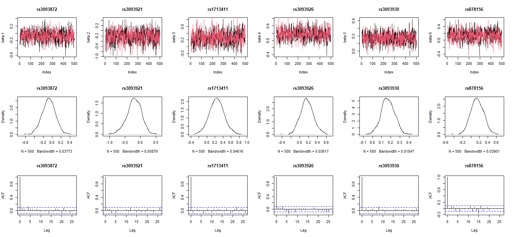
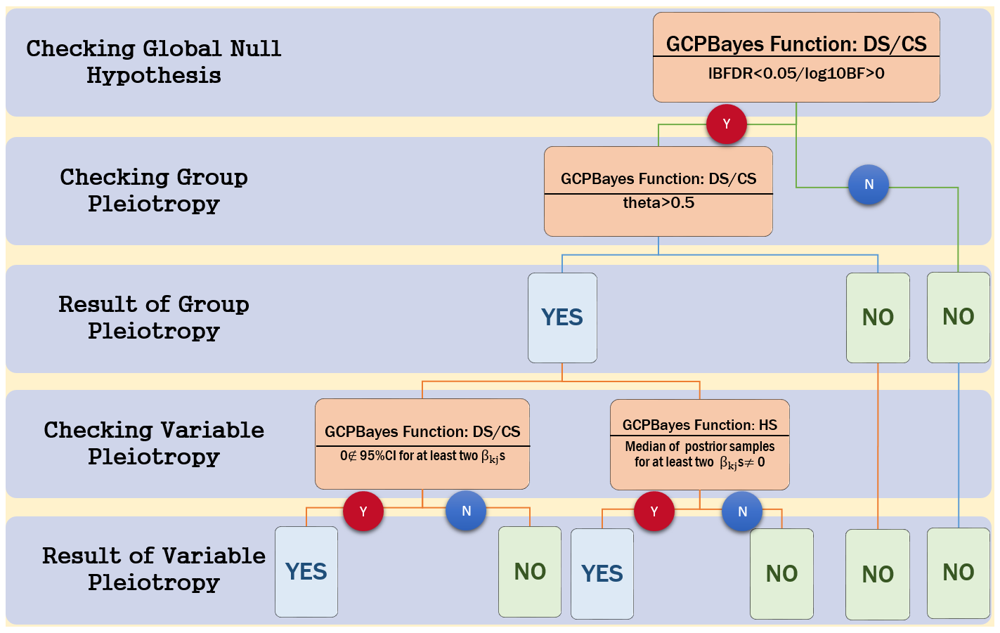

# Introduction

Many cross-phenotype associations have been identified in genome-wide association studies (GWAS), providing evidence that pleiotropy (the idea that a single genetic variant, usually a Single-Nucleotide
Polymorphism (SNP), is affecting multiple traits) is a common phenomenon in human complex traits [@Watanabe2019review]. As a result, pleiotropy has attracted a great deal of attention among genetic epidemiologists [see, @solovieff2013pleiotropy;@verma2016emerge;@hackinger2017statistical;@liu2018multiple;@majumdar2018efficient;@krapohl2018multi;@lu2017powerful;@trochet2019bayesian;@ray2020powerful;@baghfalaki2021bayesian;@broc2021penalized], and several R packages have been developed to perform meta-analysis methods adapted for cross-phenotype association detection based on summary statistics data from GWAS as input [i.e., estimated effect size, standard error, and p-value of the association between each SNP and a trait, @ray2020powerful]. It should be noted that pleiotropy is only one possible explanation of cross-phenotype association, but for simplicity, we will use the term pleiotropy for cross-phenotype association to describe any cross-phenotype association in this paper. Below is a list of the most common methods for detecting pleiotropy between multiple traits.

\BIOpkg{ASSET} [@bhattacharjee2012subset] is a frequentist method, which is an extension of standard fixed effects meta-analysis that considers the effects of a variable (such as a SNP) in each study (representing a phenotype) to be in either the same direction or opposite directions, allowing for detection of antagonistic pleiotropic effects. This approach uses summary statistics and does not take into account group structure. In the case of GWAS, the outputs of this approach are a p-value of the global association of each SNP with all studies (or phenotypes), and an optimal subset of non-null studies or phenotypes that are associated with each SNP.

\BIOpkg{GPA} [@chung2014gpa] implements a flexible statistical framework for the joint analysis of multiple GWAS and
its integration with various genetic and genomic data. It implements a flexible parametric mixture modeling approach for such integrative analysis and also provides hypothesis testing procedures for
pleiotropy and annotation enrichment.
\pkg{PLACO} is a recently created R package using GWAS summary statistics data to identify pleiotropic signals between two traits [@ray2020powerful]. The computed method derives a composite null hypothesis
that 'at most one trait is associated with the genetic variant' vs. the alternative that 'both traits are associated', based on the product of the Z-statistics of the genetic variants across two studies. \CRANpkg{CPBayes} [@majumdar2018efficient] is a Bayesian meta-analysis approach that uses univariate spike and slab prior and performs  the MCMC technique via a Gibbs sampler. \CRANpkg{CPBayes} uses the summary statistics data for a SNP across multiple traits. Two different measures are estimated for evaluating the overall pleiotropic association:
 the local false discovery rate and the Bayes factor. The optimal subset of associated traits underlying a pleiotropic signal is defined as the maximum a posteriori (MAP) estimate. The marginal trait-specific posterior probability of association (PPA), the direction of associations, and the credible interval of true genetic effects, are some examples of additional insights into pleiotropic signals that are provided by \CRANpkg{CPBayes}.

All packages developed for these summary statistics-based methods are only designed to test pleiotropy at the variable-level (SNP-level). Though the structure of the common mechanisms shared by multiple phenotypes can be more complex, for example, different variants in the same locus can be associated with multiple traits
and affect the same gene, and therefore can have an impact on the same trait.
Thus, extending \CRANpkg{CPBayes} to the gene or pathway level, which takes into account the group structure of the data, could provide additional power to detect pleiotropic signals between multiple diseases. By incorporating prior biological information in GWAS, such as group structure information (gene or pathway), our approaches could uncover new pleiotropic signals [@li2020dynamic;@baghfalaki2021bayesian].

In this paper, we present the \CRANpkg{GCPBayes} R package (Bayesian meta-analysis of pleiotropic effects using group structure) for studying pleiotropy between multiple phenotypes using GWAS data by considering group structure information from prior biological knowledge. This package is able to consider and detect pleiotropy at both the variable-level and group-level. The inputs to the developed functions are SNP-level summary statistics data
derived from GWAS by considering all the estimated regression coefficients of the variables (SNPs) in a group (a gene or a pathway) and its covariance matrix.

The methods that can be performed by the package offer a Bayesian paradigm using multivariate spike and slab priors for group-level pleiotropy using either continuous spike [CS,@george1993variable] or Dirac spike [DS,@mitchell1988bayesian] formulations. Also, a hierarchical sparsity prior [HS,@xu2015bayesian] using two levels of Dirac spike and slab components to achieve group and within-group selection can be applied. Both tests for the global null hypothesis of no association and for detecting pleiotropy are included in the package.
group-level and variable-level are considered.
The free RStudio interface is advised to be used with
 \CRANpkg{GCPBayes}. The \CRANpkg{GCPBayes} package can be installed by typing:

```{r,eval=FALSE}
  install.packages("GCPBayes")
```

To be used, the GCPBayes package has to be loaded each time R or RStudio are opened, via the following code:
```{r,echo=TRUE}
  library(GCPBayes)
```
The paper is organized as follows:
The next section ("Data structure") describes how a data should look in order to be used by functions of the \CRANpkg{GCPBayes} package.
The section "Usage" presents the different functions of \CRANpkg{GCPBayes}. Some details for using different case studies and a practical guideline for the detection of pleiotropic effects are provided.
The "Guidelines" section includes a statistical inference pipeline and recommendations for carrying out the various stages of a pleiotropy analysis with CRANpkg and Bayes.
The computational time of the functions of the \CRANpkg{GCPBayes} package is explored using real data in the "Computational time for GCPBayes" section. Finally, in the "Concluding remarks" section, we discuss some 
remarks about and limitations of \CRANpkg{GCPBayes}. Besides, future works for a newer version of the package are discussed at the end of the section. In addition, the paper includes two appendices.
The first is
"Material and method", where notations and models are described briefly.
The second one describes the design of the simulated data and their corresponding R codes, which are also embedded in the package.

 
# Data structure

\CRANpkg{GCPBayes} is intended to work with summary statistics data. Though summary statistics can be derived from individual-level data when available, this allows for taking into account correlations between variables to improve the accuracy of the method.

It should be noted that \CRANpkg{GCPBayes} is not restricted to a specific type of outcome. Summary statistics data can be estimated through various kinds of models (linear, logistic, Cox, etc.) and based on different types of phenotypes (categorical or continuous traits). Therefore, it is possible to use the \CRANpkg{GCPBayes} package for genetic studies, gene expression analyses, and other omics of studies.

In this paper, we will illustrate the use of our method in genetic studies of breast and thyroid cancers. We will explore the cross-phenotype association between these two traits and SNPs located in one gene in particular, _PARP2_. So, this section includes two different scenarios. The first part 
first part deals with summary statistics on the association between breast cancer risk or thyroid cancer risk and SNPs located in the _PARP2_ gene (Example 1). The second part considers the individual level data from which the summary statistics of Example 1 were derived as input
and then explores multicollinearity through the data (Example 2), and computes summary statistics and the covariance matrix from the individual-level data for _PARP2_ gene (Example 3).

We will consider the estimated regression coefficients and their covariance matrices from all studies: $${\hat{{\beta}}_k},~{\hat{{\Sigma}} _k} = {\mathop{\rm cov}} ({\hat{{ \beta}} _k}),~~k = 1, \cdots ,K.$$

where ${\hat{{\beta}}_k}$ is an $m-$dimensional vector containing the regression coefficients from the $k^{th}$ study for a given gene (or pathway) and ${\hat{{\Sigma}} _k}$ is the corresponding covariance matrix. If only summary statistics are available, the covariance matrix is replaced by a diagonal matrix with an estimated variance of the regression coefficients.

## Summary statistics level data
GWAS summary statistics data are available through various public databases such as GWAS Catalog. 
In most cases,  summary statistics  include effect size estimate (beta), standard error, and p-value for each SNP.
The \CRANpkg{GCPBayes} package accepts inputs related to betas and standard errors as lists: 
 specifically, a list of regression coefficients (betas) and a list of the matrices of the computed estimates of the variance of the regression coefficients.

#### Example 1: Inputs of GCPBayes using summary statistics from two case-control studies (on breast and thyroid cancers) for _PARP2_ gene

GWAS summary statistics are available through various public databases, such as the GWAS Catalog. In most cases, a summary of the statistical data includes the effect size estimate (beta), standard error, and p-value for each SNP:

```{r,echo=TRUE}
library(GCPBayes)
data(PARP2_summary)
Breast <- PARP2_summary$Breast
Thyroid <- PARP2_summary$Thyroid
genename <- "PARP2"
snpnames <- rownames(Breast)
Betah <- list(Breast$beta,Thyroid$beta)
Sigmah <- list(diag(Breast$se^2),diag(Thyroid$se^2))
print(Betah,digits=2)
print(Sigmah,digits=2)
```

This gene included six SNPs (rs3093872, rs3093921, rs1713411, rs3093926, rs3093930, and rs878156). So, the Betah list must include summary statistics for six elements for every study, and Sigmah list must contain a diagonal matrix of [$6\times 6$] for each study. A user can check the data using the "print" method.

## Individual level data
When individual level data are available,  summary statistics should be computed using external packages. Here, we explore the available approaches and R packages for computing the summary statistics.
Let ${Y}_1,\cdots,{Y}_K$ be the response variables of $K$ studies, and ${Y}_k=(Y_{k1},\cdots,Y_{kn_k})^\prime$ represent the $n_k$ phenotype observations, $k = 1, cdots, Y_K$. For study $k$, let the genetic information be organized into $G$ groups for research purposes. For example, this can be a set of SNPs belonging to a gene or a set of SNPs belonging to a set of genes acting together in the same biological pathway. We denote ${Z}_{kg}$ as a $n_k\times m_g-$ matrix of the $m_g$ covariates for group $g, ~g=1,2,\cdots,G$. As all inferences are performed gene by gene, we remove the index $g$ and consider $m$ as the number of variables in each specific group for simplicity. Considering one of the groups, we assume that a generalized linear model [GLM,@mccullagh2019generalized]
is fitted separately for each study as follows:
  \begin{eqnarray}\label{e1}
\eta \left({\rm{E}}\left( {{{{Y}}_k}{\rm{ }}} \right)\right) ={\alpha _{k}}{1}_{n_k} + {Z}_{k}{{\beta} _{k}},~~k = 1,\cdots,K,
\end{eqnarray}
where $\eta(\cdot)$ is a link function, $\alpha_{k}$ is the intercept of the model and  ${1}_{n_k}$ is a vector of $n_k$ ones. Here ${{\beta}}_{k}=({{\beta}}_{k1},\cdots,{{\beta}}_{km})^\prime$ denotes the $m$-dimensional regression coefficients for the  group and the $k^{th}$ study.

The "glm" function from R can be applied to fit generalized linear models and so get the summary statistics or parameter estimation of model 1 [@dunn2018generalized].
If the phenotype is binary, then 1 is the usual logistic or probit model [@agresti2018introduction].
If the phenotype is continuous, model 1 is reduced to multiple linear regression and can also be fitted by the "lm" function from R which will provide the same results as the "glm" function.
The "vcov" function can be applied to get the estimated covariance matrix of the regression coefficients, whereas the "glm" and "lm" functions calculate standard errors, which yield only the diagonal elements.

Another strategy should be considered in the case of multicollinearity. Multicollinearity is the presence of near-linear relationships among variables [@malo2008accommodating].
This phenomenon is widespread in genetic data, where non-random association of alleles at different loci in a given population is frequent, introducing large structures of correlation between SNPs. It is known as linkage disequilibrium (LD).
LD  can lead to inaccurate estimates of the regression coefficients, and also inflate the standard errors of the regression coefficients [@saleh2019theory].
Multicollinearity can be visualized by drawing pairwise scatter plots of variables
or by inspection of the correlation matrix.
The variance inflation factor (VIF) can be used to assess the presence of multicollinearity [@fox2018r]. It can be computed by the "vif" function from the \CRANpkg{car} package [@fox2012package]. Most research papers consider a VIF > 10 as an indicator of multicollinearity [@menard2002applied;@johnston2018confounding;@gareth2013introduction;@vittinghoff2011regression], but some choose a more conservative threshold of 5 [@gareth2013introduction] or even 2.5 [@johnston2018confounding].

#### Example 2: Exploring multicollinearity/linkage disequilibrium in _PARP2_ gene using individual level data

In this example, we show the existence of multicollinearity in the data. Here, we consider the individual-level data from which the summary statistics of Example 1 were derived. The summary statistics and the corresponding VIFs for both studies could be obtained using the usual "glm" function as follows:

```{r, fig.show='hide',echo=TRUE}
library(GCPBayes)
library(car)
data(PARP2)
Breast <- PARP2$Breast
Thyroid <- PARP2$Thyroid
Fit1 <- glm(y1~ ., family=binomial(link="logit"),data=Breast)
print(vif(Fit1))
Fit2 <- glm(y2~ ., family=binomial(link="logit"),data=Thyroid)
print(vif(Fit2))
```

A high VIF value (>5) for one SNP indicates multicollinearity in the data. Hence, the user should not use the "glm" function to obtain correct estimates of regression coefficients and their standard errors. Instead, the user could  perform Ridge regression [@hilt1977ridge]. Although many R packages are available to perform Ridge regression, only \CRANpkg{lrmest}, \CRANpkg{ridge} and \CRANpkg{lmridge} can estimate the standard errors of the regression coefficients. Only \CRANpkg{lmridge}, and only for the linear model, can compute their covariance matrix using the "vcov" or "vcov.lmridge" functions. 

Since a usual approach for obtaining the covariance matrix is to apply a very time-consuming Bootstrap method [@efron1992bootstrap], we recommend performing a Bayesian hierarchical GLM by using Gaussian priors to get summary statistics of each group (gene/pathway).
Thus, a user could apply the \CRANpkg{bayesreg} package [@makalic2016high] or the \CRANpkg{BhGLM} package [@yi2019bhglm] that provides fast and stable algorithms to estimate parameters for high-dimensional clinical and genomic data as well as highly correlated variables.

#### Example 3: Inputs of GCPBayes using individual level data  from two case-control studies (on breast and thyroid cancers) for _PARP2_ gene

We propose to estimate the regression coefficients and their covariance matrices using a Bayesian hierarchical logistic model, which would lead to more powerful inputs for \CRANpkg{GCPBayes} (as we mentioned earlier) than the inputs used in Example 1:
  
```{r,echo=TRUE,warning=FALSE}
library(GCPBayes)
data(PARP2)
Breast <- PARP2$Breast
Thyroid <- PARP2$Thyroid
Fit1 <- bayesreg::bayesreg(as.factor(y1)~ ., model = "logistic", prior = "ridge",data=Breast)
Betah1 <-  Fit1$mu.beta
Sigmah1 <- cov(t(Fit1$beta))
Fit2 <- bayesreg::bayesreg(as.factor(y2)~ ., model = "logistic", prior = "ridge",data=Thyroid)
Betah2 <-  Fit2$mu.beta
Sigmah2 <- cov(t(Fit2$beta))
Betah <- list(Betah1,Betah2)
Sigmah <- list(Sigmah1,Sigmah2)
#print(Betah,digits=1)
#print(Sigmah,digits=1)
```
By running the code above, we can estimate the regression coefficients and their covariance matrices, using the individual-level data from the two studies. The results can be checked using the last two "print" commands.

As a final note in this section, we demonstrated in a previous study [@baghfalaki2021bayesian] that running GCPBayes on summary statistics data could result in a loss of power because it requires consideration of a diagonal covariance matrix of the effects (without information on off-diagonal components). So, statistically speaking, when individual-level data are available, we recommend computing the covariance matrix of the effects and using it as inputs to GCPBayes in order to increase the power of the method.

# Usage

In this section, we describe how to use the \CRANpkg{GCPBayes} package that includes four functions: DS, CS, HS, and MCMCplot.
First, Examples 4-7 show the outputs of each of the four functions while applying GCPBayes to the summary statistics described in Example 1 to test whether the gene _PARP2_ is associated with both thyroid cancer and breast cancer risk. Then, in Example 8, we compared results obtained with the DS function applied to summary statistics of _PARP2_ gene with those obtained with individual-level data (as described in Examples 2-3) as input. Finally, in Example 9, we show an example of output for the gene _DNAJC1_ which was significantly associated with breast and thyroid cancers using the DS function. The inputs are summary statistics from two larger studies than those used in Example 1 and will be detailed below.
In addition to the real datasets described in Examples 1-3 and Example 9, three more simulated data are provided in Appendix B and are embedded in the \CRANpkg{GCPBayes} package, including summary statistics level data for $K=5$ studies with binary outcome,
individual level data for $K=3$ studies with continuous outcome and individual level data for $K=2$ studies for survival outcomes and gene expression data. All commands used for the examples considered in this section are available through the R documentation of the \CRANpkg{GCPBayes} package.


## DS function

DS runs a Gibbs sampler for a multivariate Bayesian sparse group selection model with a Dirac spike prior for the detection of pleiotropic effects on the traits. As we mentioned in the previous section, the DS function is designed to use estimated regression coefficients and their estimated covariance matrices from $K$ studies. The statistical details of the DS approach are given in Appendix A. Besides, more details can be found at [@baghfalaki2021bayesian].
The DS function and its parameters have the following format:
  
```{r,eval=FALSE}
  DS(Betah, Sigmah, kappa0, sigma20, m, K, niter = 2000, burnin = 1000, nthin = 2, 
      nchains = 2, a1 = 0.1, a2 = 0.1, d1 = 0.1, d2 = 0.1, snpnames, genename)
```

where

* Betah: A list containing $m$-dimensional vectors of the regression coefficients for $K$ studies.
* Sigmah: A list containing the $m \times m$-dimensional positive definite covariance matrices which are the estimated covariance matrices of K studies. If individual-level data are not available, it corresponds to the diagonal matrices with the estimated variance of the regression coefficients for the K studies.
* kappa0: Initial value for kappa such that its dimension is equal to the number of Markov chains (nchains).
Although, the best strategy for choosing the initial values are  previous studies, however, the domain for choosing any value is equal to the domain of the priors which is given in the hierarchical setup A.2 in Appendix A. 
Kappa0 can be in range from 0 to 1.
* sigma20: Initial value for sigma2 such that its dimension is equal to nchains. The domain for initial values of sigma2 is $\Re^+$.
* m: Number of variables in the group.
* K: Number of traits.
* niter: Number of iterations for the Gibbs sampler.
* burnin: Number of burn-in iterations. The burnin=1000 value is the default.
* nthin: The lag of the iterations used for the posterior analysis (or thinning rate). nthin=2 is the default value.
* nchains: Number of Markov chains. When nchains > 1, the function calculates the Gelman-Rubin convergence statistic [@brooks1998general;@gelman1992inference]. Default value is nchains=2.
* a1, a2: Hyperparameters of kappa. Default values are a1=0.1 and a2=0.1.
* d1, d2: Hyperparameters of sigma2. d1 = 0.1 and d2 = 0.1 are the default values.
* snpnames: Variable names for the group.
* genename: The group's name.


#### Example 4: Usage of the DS function to analyse pleiotropy between breast and thyroid cancers at _PARP2_ gene 

Here we consider the individual data for the  _PARP2_ gene from the two case-control studies on breast and thyroid cancer (Examples 2-3) as input. As we explained earlier, first we estimated the effect size of the six SNPs in _PARP2_ and the corresponding covariance matrix for both studies. Then, we applied the DS function to the results. 

```{r,echo=TRUE}
library(GCPBayes)
data(PARP2)
Breast <- PARP2$Breast
Thyroid <- PARP2$Thyroid
genename <- "PARP2"
snpnames <- names(PARP2$Breast)[-1]
Fit1 <- bayesreg::bayesreg(as.factor(y1)~ ., model = "logistic", prior = "ridge",data=Breast)
Betah1 <-  Fit1$mu.beta
Sigmah1 <- cov(t(Fit1$beta))
Fit2 <- bayesreg::bayesreg(as.factor(y2)~ ., model = "logistic", prior = "ridge",data=Thyroid)
Betah2 <-  Fit2$mu.beta
Sigmah2 <- cov(t(Fit2$beta))
Betah <- list(Betah1,Betah2)
Sigmah <- list(Sigmah1,Sigmah2)
```

To detect pleiotropic effects for this gene, two chains with 2,000 iterations and a burn-in period of 1,000 iterations were used. 


```{r,echo=TRUE}
set.seed(123)
RES1 <- DS(Betah, Sigmah, kappa0=c(0.2,0.5), sigma20=c(1,2),
           m=6, K=2, niter=2000, burnin=1000, nthin=2, nchains=2,
           a1=0.1, a2=0.1, d1=0.1, d2=0.1, snpnames, genename)
```
The result of the DS function was saved in the "RES1" list, which includes four lists (MCMCChain, Summary, Criteria, and Indicator).
The "MCMCChain" list contains posterior samples for the unknown parameters, while the "Summary" list includes summary statistics of the posterior samples for the unknown parameters including the name of the SNP, the posterior mean, the posterior standard deviation, the quantile 2.5$\%$, median, the quantile 97.5$\%$ and the Gelman-Rubin convergence statistic [BGR,@brooks1998general;@gelman1992inference].


Using a "print" command for the "Summary" list would result in two lists showing Bayesian estimation for all analyzed SNPs in both studies.


```{r,eval=FALSE}
print(RES1$Summary,digits=2)
```
In order to check if the chains converged to a stationary distribution or not, a user could look at the BGR column. In our example, as the values of BGR are not close to one for some of the variables, the chains do not converge to a stationary distribution. To check this criteria, we also repeat the DS function with $niter=20000$ and $burnin=10000$.

```{r,echo=TRUE,results='hide'}
set.seed(123)
RES1 <- DS(Betah, Sigmah, kappa0=c(0.2,0.5), sigma20=c(1,1.5),
           m=6, K=2, niter=20000, burnin=10000, nthin=2, nchains=2,
           a1=0.1, a2=0.1, d1=0.1, d2=0.1, snpnames, genename)
print(RES1$Summary,digits=2)
```
As it is clear, after running the DS function with new parameters, the values of the BGR column now confirm convergence to the stationary distribution.
Note that in the case of $nchain=1$, the BGR column can never be computed.

The two other output lists of the "RES1" ("Criteria" and "Indicator") contain information for checking group and variable pleiotropy, respectively.
For each SNP, the 'Criteria' list contains the name of the gene, name of the SNP, the posterior probability of association (PPA), the logarithm (to base 10) of
the Bayes factor (BF), the local false discovery rate (locFDR) and $\theta$ of equation (4) of the Guidelines section. A user could check it with the following command:

```{r,echo=TRUE}
print(RES1$Criteria,digits=2)
```

Based on the PPA1 and PPA2 values, the gene _PARP2_ isnot significantly associated with the traits in the  study.
This is also confirmed by the values of lBFDR and BF. One can conclude that the global null hypothesis of no association at the group level cannot be rejected. Now, we can check the results of the pleiotropic effect at the group level by considering the value of theta. By considering the threshold of $0.5$, it shows that there is no group-level pleiotropic effect for textit{PARP2} gene. 

Also, an "Indicator" list is given for checking variable pleiotropy using two different statistics: ($95\%$ credible interval and the median threshold. Each row of the lists includes the name of the SNP, a binary indicator for the significant regression coefficient of each study (0=no,1=yes) and the total number of significant regression coefficients in the studies. Finally, the last column indicates whether the test for pleiotropy at the variable level is significant or not.

```{r,echo=TRUE,results='hide'}
print(RES1$Indicator,digits=2)
```
In addition, _summaryDS_ is a generic function that generates DS function result summaries:
```{r,echo=TRUE}
summaryDS(RES1)
```
As can be seen, there is no variable-level pleiotropic effect for this gene, which means that none of its SNPs were significant in both studies.


## CS function

The CS runs a Gibbs sampler for a multivariate Bayesian sparse group selection model with a continuous spike prior for the detection of pleiotropic effects on K traits. CS uses the same inputs as the DS function.
The details of the approach are given in the material and methods section (Appendix A). More information can be found at [@baghfalaki2021bayesian].
The CS function has the following format in general:

```{r,eval=FALSE}
CS(Betah, Sigmah, kappa0, tau20, zeta0, m, K, niter = 1000, burnin = 500,
   nthin = 2, nchains = 2, a1 = a1, a2 = a2, c1 = c1, c2 = c2, sigma2 = 10^-3,
   snpnames = snpnames, genename = genename)
```
where Betah, Sigmah, kappa0, m, K, niter, burnin,
nthin, nchains, a1, a2, snpnames and genename are the same as those introduced for the DS function. For the other arguments we have


* zeta0: Initial value for zeta. For the elicitation of initial values of zeta, first the regression coefficients and their standard errors for each study are considered. After that, by adjusting their p-values, we can find the initial values of zeta, $k=1, cdots, and K$. As a result, if one group contains at least one non-null signal, the group is a non-null and zeta0$[k]=1$, otherwise zeta0$[k]=0$.

* c1, c2: Hyperparameters of tau2. Default values are c1=0.1 and c2=0.1.

* sigma2: The variance of the spike (multivariate normal distribution with a diagonal covariance matrix with small variance) represents the null effect distribution. The default setting is $10-3$.


#### Example 5: Using the CS method to analyze pleiotropy between breast and thyroid cancers at _PARP2_ gene

For this example, we consider the same data used for Example 4 as input. So, first, we estimated the regression coefficients for each SNP and corresponding covariance matrix for both studies (the same estimated regression coefficients and covariance matrices were computed in Example 4),
and then, we performed the CS function on the results.
To get the values for $xi(0)_k$, a user must first calculate the p-values and initial values of $xi_k$ for each regression coefficient using the code below (for more information, see [@baghfalaki2021bayesian]:

```{r,echo=TRUE} 
K <- 2
m <- 6
pvalue <- matrix(0,K,m)
for(k in 1:K){
 pvalue[k,] <- 2*pnorm(-abs(Betah[[k]]/sqrt(diag(Sigmah[[k]]))))
}
zinit <- rep(0,K)
for(j in 1:K){
 index <- 1:m
 PVALUE <- p.adjust(pvalue[j,])
 SIGNALS <- index[PVALUE<0.05]
 modelf1 <- rep(0,m)
 modelf1[SIGNALS] <- 1
 if(max(modelf1)==1)(zinit[j] <- 1)
}
```

The initial value is a two-dimensional vector (as K=2) of 0 or 1:

```{r,echo=TRUE}
print(zinit)
```

Now, we could use the CS function to look for a pleiotropic signal:

```{r}
set.seed(123)
RES1 <- CS(Betah, Sigmah, kappa0=c(0.2,0.5), tau20=c(1,2), zeta0=zinit,
      m=m, K=K, niter=2000, burnin=1000, nthin=2, nchains=2,
      a1=0.1, a2=0.1, c1=0.1, c2=0.1, sigma2=10^-3, snpnames, genename)
```

The output of CS (here RES1) is the same as DS and has similar interpretations, _summaryCS_ is a generic function used to produce result summaries of the CS function.

## HS function

The HS function runs a Gibbs sampler for a multivariate Bayesian sparse group selection model with hierarchical spike prior for the detection of pleiotropic effects associated with the traits at group-level and variable-level. As in the case of
CS and DS, this function is designed to use summary statistics as inputs, containing estimated regression coefficients and their estimated covariance matrices. The following is a general usage example of the HS function:
```{r,eval=FALSE}
HS(Betah, Sigmah, kappa0 = kappa0, kappastar0 = kappastar0, sigma20 = sigma20, s20 = s20,
    m, K, niter = 1000, burnin = 500, nthin = 2, nchains = 2, a1 = 0.1, a2 = 0.1,
    d1 = 0.1, d2 = 0.1, c1 = 1, c2 = 1, e2 = 1, snpnames, genename)
```


where Betah, Sigmah, kappa0, sigma20, m, K, niter, burnin,
nthin, nchains, a1, a2, d1, d2, snpnames, and genename have similar definitions as the DS function. For the other arguments we have

* kappastar0: Initial value for kappastar such that its dimension is equal to nchains. The domain for initial values of kappastar0 is $(0,1)$.

* s20: Initial value for s2 such that its dimension is equal to nchains such that the domain for initial values of s2 is $\Re^+$.

* c1, c2: Hyperparameters of the kappastar. Defaults are c1=0.1 and c2=0.1.

* e2: Initial value for doing the Monte Carlo EM algorithm to estimate the hyperparameter of s2.


#### Example 6: Use of the HS method to analyze pleiotropy between breast and thyroid cancers at _PARP2_ gene

The same data as in Example 4 is used as input. We used the same estimated regression coefficients and their covariance matrices.

```{r}
library(GCPBayes)
data(PARP2)
Breast <- PARP2$Breast
Thyroid <- PARP2$Thyroid
genename <- "PARP2"
snpnames <- names(PARP2$Breast)[-1]
Fit1 <- bayesreg::bayesreg(as.factor(y1)~ ., model = "logistic", prior = "ridge",data=Breast)
Betah1 <-  Fit1$mu.beta
Sigmah1 <- cov(t(Fit1$beta))
Fit2 <- bayesreg::bayesreg(as.factor(y2)~ ., model = "logistic", prior = "ridge",data=Thyroid)
Betah2 <-  Fit2$mu.beta
Sigmah2 <- cov(t(Fit2$beta))
Betah <- list(Betah1,Betah2)
Sigmah <- list(Sigmah1,Sigmah2)
```

```{r,echo=TRUE}
set.seed(123)
RES <- HS(Betah, Sigmah, kappa0=c(0.5,0.3), kappastar0=c(0.5,0.3), sigma20=c(2,1), s20=c(1,2),
     m=6, K=2, niter=2000, burnin=1000, nthin=2, nchains=2,
     a1=0.1, a2=0.1, d1=0.1, d2=0.1, c1=1, c2=1, e2=1, snpnames, genename)
```
     
In this example, the HS function is applied to detect group and variable pleiotropic signals. The outputs of the HS function based on median threshold are as follows: 

```{r,echo=TRUE,results='hide'}
 summaryHS(RES1)
```

The overall output of HS (RES1) is the same as that of DS and has similar interpretations.


## MCMCplot function

Monitoring the convergence of the MCMC statistic is important and the Gelman-Rubin statistic is not the only way to assess convergence. MCMCplot presents some visual plots, such as trace, auto-correlation function (ACF) and posterior density plots to check the convergence of the MCMC chains.
The trace plot is 
the plot of the generated values over the course of the iterations. If 
all values fall within a uniform bandwidth around the posterior mean and do not display any periodicity or non-stationary trends, we can assume convergence. The density plot represents the signal's estimated posterior distribution. Also, monitoring ACF plots is very useful since low or high values indicate fast or slow convergence, respectively. In fact, we need to monitor the ACF of the MCMC generated sample and select a sampling lag larger than 1 [=L]. Then, we can produce an independent sample by keeping the first generated values in every batch of L iterations, which is called the thinning rate.
In practice, the ACF should be close to zero for a sufficiently large number of lags.

The inputs of the MCMCplot function are the generated results by DS, CS, or HS function, the number of studies for drawing plots, the number of MCMC chains in the result, and
the names of favorable SNPs for drawing the plots. 
Up to 10 plots can be plotted simultaneously. In general, a usage for the MCMCplot function is as follows:

_MCMCplot(Result, k, nchains, whichsnps, betatype, acftype, dencol, denlty, denbg)_

where

* Result: All of the results produced by the DS, CS, and HS functions.

* k: The number of plotting studies, where k = 1, 2,..., K.

* nchains: The number of Markov chains that were run to produce Result.


* which SNPs: The SNPs' names

* betatype: The type of plot desired. The following values are possible: "p" for points, "l" for lines, "b" for both points and lines, "c" for empty points joined by lines, "o" for overplotted points and lines, "s" and "S" for stair steps, and "h" for histogram-like vertical lines. Finally, "n" does not produce any points or lines.

* acftype: String giving the type of ACF to be computed. Allowed values are "correlation" (the default), "covariance" or "partial" will be partially matched.

* dencol: The color used to fill out the density plot.

* denlty: The line type to be used in the density plot.

* denbg The color to be used for the background of the density plot.

#### Example 7: Using the MCMCplot function to check convergence of the DS method

For this example, the output of the DS function for _PARP2_ gene is used when drawing the  MCMCplot. We select this gene because it is a special case because it required more MCMC iterations to converge.
To run this example, a user needs to run the first fourteen lines of code in Example 4 (briefly, these commands compute regression coefficients and covariance matrices based on the individual-level data). 
Then the DS function needs to be run as follows:

```{r, fig.show='hide',echo=TRUE}
library(GCPBayes)
data(PARP2)
Breast <- PARP2$Breast
Thyroid <- PARP2$Thyroid
genename <- "PARP2"
snpnames <- names(PARP2$Breast)[-1]
Fit1 <- bayesreg::bayesreg(as.factor(y1)~ ., model = "logistic", prior = "ridge",data=Breast)
Betah1 <-  Fit1$mu.beta
Sigmah1 <- cov(t(Fit1$beta))
Fit2 <- bayesreg::bayesreg(as.factor(y2)~ ., model = "logistic", prior = "ridge",data=Thyroid)
Betah2 <-  Fit2$mu.beta
Sigmah2 <- cov(t(Fit2$beta))
Betah <- list(Betah1,Betah2)
Sigmah <- list(Sigmah1,Sigmah2)

set.seed(123)
RES1 <- DS(Betah, Sigmah, kappa0=c(0.2,0.5), sigma20=c(1,2),
           m=6, K=2, niter=200, burnin=100, nthin=1, nchains=2,
           a1=0.1, a2=0.1, d1=0.1, d2=0.1, snpnames, genename)
MCMCplot(Result = RES1, k = 2, nchains = 2, whichsnps = snpnames,
                     betatype = "l",
                     acftype = "correlation",
                     dencol = "white", denlty = 1, denbg = "white")

set.seed(123)
RES1 <- DS(Betah, Sigmah, kappa0=c(0.2,0.5), sigma20=c(1,2),
           m=6, K=2, niter=2000, burnin=1000, nthin=2, nchains=2,
           a1=0.1, a2=0.1, d1=0.1, d2=0.1, snpnames, genename)
MCMCplot(Result = RES1, k = 2, nchains = 2, whichsnps = snpnames,
                     betatype = "l",
                     acftype = "correlation",
                     dencol = "white", denlty = 1, denbg = "white")
```

The plots for the thyroid cancer study with 200 MCMC iterations and 100 burn-in are given in Figure 2.
The top row of the figure shows strong periodicities in the posterior samples for some SNPs, which are confirmed by their corresponding ACF plots (last row). As a result, more samples are needed to achieve convergence for the  _PARP2_ gene. In the second DS command, the number of iterations was increased to 2000; half of this number was considered burn-in, and the thinning rate was set to 2. The results are shown in Figure 3
and the resulting regularities in the plot implies that increasing the number of iterations has made the model converge successfully.


```{r, echo=FALSE,out.width = "100%", out.height = "30%", fig.cap = "Trace, density and ACF plot  for the posterior samples of the regression coefficients (niter=200, burnin=100, nthin=2) for thyroid study. Based on the top and last rows, the results do not show a convergence."}
knitr::include_graphics("p1.png")
```


```{r, echo=FALSE, out.width = "100%", out.height = "30%", fig.cap = "Trace, density and ACF plot  for the posterior samples of the regression coefficients (niter=2000, burnin=1000, nthin=5) for thyroid study. Based on the top and last rows, the results imply a convergence."}

```


## Comparing GCPBayes results using summary statistics level  versus individual level data as input

As we mentioned earlier, we showed that the performance of the \CRANpkg{GCPBayes} package is better when using non-diagonal
covariance matrices (individual-level data) compared to diagonal covariance matrices (summary level data, @baghfalaki2021bayesian). In this section, we show two examples to deal with such differences.

#### Example 8: Comparing DS function outputs using summary statistics level  versus individual-level data of _PARP2_ gene as inputs 

First, we consider summary statistics level data for _PARP2_ gene as an input of the \CRANpkg{GCPBayes} package and run the DS function for this data as follows:

```{r,echo=TRUE,results='hide'}
library(GCPBayes)
data(PARP2_summary)
Breast <- PARP2_summary$Breast
Thyroid <- PARP2_summary$Thyroid
genename <- "PARP2"
snpnames <- rownames(Breast)
Betah <- list(Breast$beta,Thyroid$beta)
Sigmah <- list(diag(Breast$se^2),diag(Thyroid$se^2))
print(Betah,digits=2)
print(Sigmah,digits=2)
set.seed(123)
RES_sum <- DS(Betah, Sigmah, kappa0=c(0.2,0.5), sigma20=c(1,2),
                            m=6, K=2, niter=2000, burnin=1000, nthin=2, nchains=2,
                            a1=0.1, a2=0.1, d1=0.1, d2=0.1, snpnames, genename)
print(RES_sum$Criteria,digits=2)
```

Now, we use individual data for the _PARP2_ gene,
then compute regression coefficients and covariance matrices based on the individual data and used it as the input to the \CRANpkg{GCPBayes} package. Finally, we run the DS function for this data as follows:

```{r,echo=TRUE,results='hide'}
library(GCPBayes)
data(PARP2)
Breast <- PARP2$Breast
Thyroid <- PARP2$Thyroid
genename <- "PARP2"
snpnames <- names(PARP2$Breast)[-1]
Fit1 <- bayesreg::bayesreg(as.factor(y1)~ ., model = "logistic", prior = "ridge",data=Breast)
Betah1 <-  Fit1$mu.beta
Sigmah1 <- cov(t(Fit1$beta))
Fit2 <- bayesreg::bayesreg(as.factor(y2)~ ., model = "logistic", prior = "ridge",data=Thyroid)
Betah2 <-  Fit2$mu.beta
Sigmah2 <- cov(t(Fit2$beta))
Betah <- list(Betah1,Betah2)
Sigmah <- list(Sigmah1,Sigmah2)
set.seed(123)
RES_ind <- DS(Betah, Sigmah, kappa0=c(0.2,0.5), sigma20=c(1,2),
                            m=6, K=2, niter=2000, burnin=1000, nthin=2, nchains=2,
                            a1=0.1, a2=0.1, d1=0.1, d2=0.1, snpnames, genename)
#print(RES_ind$Criteria,digits=2)
```

By comparing the results for these two scenarios, it is clear that using individual-level data, 
which includes more information about the SNP correlations,
would lead to less biased results and hence better signals at the end.


#### Example 9: Investigation of pleiotropic effect between breast cancer and thyroid cancer at _DNAJC1_ gene in large datasets

For the final example, we consider the summary statistics for the _DNAJC1_ protein-coding gene, specifically betas and standard errors, for fourteen SNPs from two studies (on breast and thyroid cancers), and try to investigate any potential pleiotropic signal at group and individual levels. The summary statistics of the breast and thyroid cancer studies were extracted from the Breast Cancer Association Consortium (BCAC) [@zhang2020genome] and the EPITHYR consortium [@truong2021multiethnic], respectively.
The data is embedded in the \CRANpkg{GCPBayes} package, and a user can run the DS function as follows:


```{r,echo=TRUE,results='hide'}
library(GCPBayes)
data(DNAJC1)
Breast <- DNAJC1$Breast
Thyroid <- DNAJC1$Thyroid
genename <- "DNAJC1"
snpnames <- Breast$snp
Betah <- list(Breast$beta,Thyroid$beta)
Sigmah <- list(diag(Breast$se^2),diag(Thyroid$se^2))
K <- 2
m <- 14
set.seed(123)
RES1 <- DS(Betah, Sigmah, kappa0=c(0.2,0.5), sigma20=c(1,2),
            m=m, K=K, niter=2000, burnin=1000, nthin=2, nchains=2,
            a1=0.1, a2=0.1, d1=0.1, d2=0.1, snpnames, genename)
```

Now, we run the following command for testing the  global null hypothesis:

```{r,echo=TRUE}
print(RES1$Criteria)
```

Based on the values of log10BF and lBFDR, the null hypothesis is rejected. Thus, we check the value of theta which is equal to 0.999, and conclude that the gene has a group pleiotropic effect.

A user should run the following command to test for variable pleiotropic effects:

```{r,echo=TRUE}
print(RES1$Indicator$`Significant studies and Pleiotropic effect based on CI`)
``` 

Based on the results, two SNPs are significantly associated with both traits (rs4747438, and rs2666762).

# Guidelines

In this section, we provide some guidelines for working with the \CRANpkg{GCPBayes} package and for extracting potential pleiotropic effects at group and variable-levels.
We first give some practical advice on which methods to consider and in what order, and then we provide a decision pipeline based on statistical inferences, firstly for a primary analysis by using DS (or CS), and secondly for a precision analysis by using HS.

## Practical hints

We do not recommend that 
a user do initial exploration by using the HS function because it may take a long time to compute when working with large datasets.


Besides, the HS function does not show better power in for detecting group pleiotropy compared to the other methods (DS and CS).
In addition, DS and CS methods have similar strategies, but we showed that DS performed better than CS during the simulations for all tested scenarios [@baghfalaki2021bayesian].
That is why we suggest the user first performs the
the pleiotropic analysis on all groups in the data by using the DS function (Figure 3).
Thus, in order to select groups with probable pleiotropic effects, we recommend performing a first batch of analyses by using the DS method, with a reasonable number of iterations
 such that most of the groups converge, using 2 chains to compute the BGR and test the convergence of the method.
We suggest performing the method with 2,000 iterations and 1,000 burn-in.
Then, if the BGR values for one or more SNPs in the group are significantly different
 from 1 (values between 0.9 and 1.1 are typically used as threshold for reasonable convergence),
the method should be run again for the group using higher number for iterations and burn-in.
We recommend to repeatedly double these values until the convergence threshold is reached.

## Statistical inference pipeline for primary analysis

We provide a diagram in Figure 3 that helps the  user detect group and variable pleiotropic effects using the \CRANpkg{GCPBayes} package.
The first step for detection of a pleiotropic signal is to test the global null hypothesis of no association against the global alternative hypothesis of association with at least one trait by considering DS (or CS).

Considering the CS method of the package (please refer to the corresponding equations in Appendix A), we define the following global null hypothesis of no association as follows:
 \begin{eqnarray}\label{testC}
 {\rm{H}_0}:{\xi_1} = {\xi_2} = \cdots = {\xi_K} = 0{\rm{~~~~~  }} \textrm{versus }
{\rm{H}_1}:{\rm{at~ least~ one ~}}{{\xi}_k} \ne 0,k = 1,\cdots,K.
 \end{eqnarray}

To perform this test, the package computes two quantities. Let et $P(\rm{H}_0|\cal{D})$ be the posterior probability of the null hypothesis, i.e. the probability of making a false discovery for a non-null effect, which [@efron2012large] refers to as the $\cal{D}$ local Bayesian false discovery rate (denoted by $lBFDR$). The phrase ``local" comes from a single point, $\{0\}$, as the domain of the null hypothesis tested [@efron2012large]. Note that small values of $lBFDR$ show strong evidence for the existence of a substantive effect.
We recommend using the usual value of 0.05 as a threshold to 
decide whether to reject the null hypothesis or not.
The Bayes factor (BF), which describes the evidence of $\rm{H}_1$ versus $\rm{H}_0$ could also be considered.
In contrast to the lBFDR, a high Bayes factor (BF) value indicates strong evidence in favor of $\rm{H}_1$. We recommend considering a value of 1 as a threshold (or log10BF > 0).

The marginal study-specific posterior probability of association (PPA) proposed by Majumdar et al. [@majumdar2018efficient] is also computed to quantify the relative contribution of a study underlying the signal.
This is defined for each study $k$ by ${PPA _k} = \frac{1}{M}\sum\limits_{r = 1}^M {\xi _k^{(r)}}$.
This corresponds to the probability that the study $k$ was drawn from the slab distribution, i.e. the probability that the group has a non-zero effect.

For checking any association by using DS, the global test is defined by:
\begin{eqnarray}\label{testD}
\begin{array}{l}
{\rm{H}_0}:{\beta _1} = \cdots = {\beta _K} = 0, \rm{versus~~}
{H_1}:{\rm{at~ least ~one~}}{\beta _k} \ne 0,{\rm{ ~}}k = 1,\cdots,K.
\end{array}
\end{eqnarray}
The existence of an association when using DS can be defined in the same way as for CS.


If there is no sufficient evidence for $H_1$ (i.e., a non-null effect in at least one study), then there is no need to further consider group pleiotropy or variable pleiotropy.
If there is evidence for $H_1$, the user can calculate the value of the DS function's $theta$. The strategy to detect group pleiotropic effects based on CS is to compute $\theta$ as follows:
\begin{eqnarray}\label{theta}
 \theta=P\left(\sum_{k=1}^{K} \xi_k\geq 2 | \hat{\beta}_k, \hat{\Sigma}_k,~k=1,\cdots,K\right).
\end{eqnarray}
Note that for computing $\theta$ for DS, we can follow the same strategy as for CS. Hence, $\theta$ represents the probability of having a non-zero effect in at least two studies.
Thus, it is reasonable to consider a threshold $t$ of 0.5 to statistically determine whether there is pleiotropy or not. However, a user wishing to generate many tentative hypotheses could choose a less stringent threshold (i.e., 0.1).
Conversely, a user could choose a very strict threshold (i.e., 0.9) to select only the most certain groups.
If $\theta \leq t$, no pleiotropic effect is detected at the group level, and thus no pleiotropy signal is present at the variable level.
However, if $\theta> t$, we can consider the group to have a pleiotropic effect.
It should be mentioned that when a pleiotropic effect is detected for a group, we can investigate the pleiotropy for each variable in the group.
In this case, as CS and DS are defined group by group, the use of Bayesian point estimations (the means of the posterior distributions) and $95\%$ credible intervals from the DS function can be used as criteria for variable selection.
The $j^{th}$ variable has a pleiotropic effect if at least two $\beta_{kj}$s are chosen. For example, assume that a pleiotropic effect is detected in an analysis of two studies.
The posterior estimates $\hat{\beta}_{1j}$ and $\hat{\beta}_{2j}$ can then be used as a pleiotropy decision tool for the $j^{th}$ variable $j=1,2,\cdots,m$.Hence, if $\beta_{1j}$ and $\beta_{2j}$ are two non-zero signals,
Then the $j^{th}$ variable is declared to have a pleiotropic effect; otherwise, the $j^{th}$ variable has no pleiotropic effect.


## Statistical inferences for analysis by using HS

Because HS has shown a higher power to detect pleiotropy at the variable-level in simulations, we recommend using the HS approach for the groups initially detected as pleiotropic via the DS function.
A user can move down the $\theta$ threshold in order to explore potential pleiotropic effects that could have been detected with a larger sample size (i.e. to consider $\theta \geq 0.1$ from DS).
Then, the user can compare the results at the variable-level for DS and HS (Figure 3).
Using this overall strategy, a user would have to run the HS method on a smaller number of groups and thus avoids dealing with long computational time of the HS function for all groups at once.

To detect a pleiotropic signal for the $j^{th}$ variable, the posterior estimates $\hat{\beta}_{kj}$, $j=1,2,\cdots,m$, $k=1,2,\cdots,K$, and $k=1,2,\cdots,K$ can be used.
We consider the variable $j$ to have pleiotropic effect if and only if there are at least two non-zero signals among the $K$ studies.
It should be noted that, in addition to a $95\%$ CI, the sparseness of the posterior median of the regression coefficient $\beta_{kj}, ~k=1,\cdots,K,~j=1,2,\cdots,m_g$ can be used for this purpose.


Pleiotropy should be considered at the variable level based on the posterior median: for example, the $j^{th}$ variable can be considered pleiotropic if the posterior median of a $\beta_{kj}$ is different from 0 for at least two studies $k$.
Finally, pleiotropy is considered at the group level if at least one pleiotropic variable is found within the group. Moreover, HS allows for the detection of pleiotropy at the group-level in other situations. Note that the pleiotropy effect can take on different shapes.
As presented in [@solovieff2013pleiotropy], biological pleiotropy at the gene level can occur when two different signals within the same gene are associated with two different phenotypes.
This can affect both phenotypes in a similar way.
Therefore, we also consider pleiotropy at the group-level when an association is detected (not necessarily detected as pleiotropic) for different variables within the group in at least two different studies.

# Computational time for \CRANpkg{GCPBayes}
In this section, the computational time of \CRANpkg{GCPBayes} package is explored 
by re-analysing  of the experimental data for nine groups (genes) described in [@baghfalaki2021bayesian].
The analysis has been conducted using a PC with a Core(TM) i5-4690K CPU $@$ 3.50 GHz processor and 8 GB of memory. For this purpose, we consider nine genes with different numbers of variables (SNPs). 
To fit the models, we used 2,000 MCMC iterations and discarded half as burn-in. Table 1 represents the results of computational times using the \CRANpkg{GCPBayes} package for analyzing the data. As expected, the computational time increases when the number of variables within a group increases. The computational time for the DS method is the shortest, and the more complex HS model HS has the longest computational time, as expected. Another exploration of computational time for the \CRANpkg{GCPBayes} package, based on simulation studies, see [@baghfalaki2021bayesian].

We have also applied GCPBayes on whole genome data of breast and ovarian cancers (summary statistics data). Running GCPBayes over all coding genes (number of genes: 18,244 and number of SNPs: 1 to 9,595) took about 17 days (on a PC with Intel $®$ Core(TM) i7-1165G7 $@$ 2.80 GHz, 32 GB RAM). However, 
the user takes advantage of parallelization (using "foreach" command), 
the computational time can be reduced. For instance, the computational time was about 40 hours using the same PC but running six genes in each loop (i.e., using six CPUs instead of one).

```{r, echo=FALSE, out.width = "100%", out.height = "30%", fig.cap = "A diagram for detecting group and variable pleiotropic effects using GCPBayes package. For more information see the text. "}

```
\begin{table}[hbt!]
 \centering
 \footnotesize
  \caption{\label{comptime} Computational time (in mins) of \CRANpkg{GCPBayes}. }
       \begin{tabular}{ccccc}
        \hline
Name of gene &\  Number of SNPs &\  CS &\  DS &\  HS \\\hline
ADH1A &\  2 &\  0.070 &\  0.030 &\  0.139 \\
ACE &\  5 &\  0.069 &\  0.036 &\  0.172 \\
ADH1B &\  10 &\  0.084 &\  0.049 &\  0.243 \\
RFC3 &\  14 &\  0.105 &\  0.066 &\  0.347 \\
AOX1 &\  24 &\  0.158 &\  0.127 &\  0.629 \\
ABCC8 &\  30 &\  0.220 &\  0.190 &\  0.966 \\
BCAT1 &\  50 &\  0.555 &\  0.539 &\  3.123 \\
EBF2 &\  60 &\  0.779 &\  0.775 &\  5.156 \\ 
EGFR &\  103 &\  2.697 &\  2.882 &\  30.794 \\
 \hline
  \end{tabular}
\end{table} 


# Concluding remarks
We have developed the R package \CRANpkg{GCPBayes} that implements several Bayesian meta-analysis methods for studying cross-phenotype genetic associations (pleiotropy), taking into account group structure from prior biological knowledge. \CRANpkg{GCPBayes} offers multivariate spike and slab priors for group-level pleiotropy, using either DS or CS formulations, and for pleiotropy at both group and variable-level using the hierarchical spike prior (HS) formulation. These approaches take into account 
the heterogeneity in size and direction of the genetic effects across traits. Although DS and CS are not designed for variable selection, these methods do allow us to
 investigate the pleiotropy for each variable in the group by using $95\%$ credible intervals and the median threshold as criteria for variable selection in groups for which a pleiotropic effect has been detected. On the other hand, the posterior estimates can be used to detect a pleiotropic signal for each variable using HS. Thus, a variable is considered to have a pleiotropic effect if and only if there are at least two non-zero signals among the studies. For this purpose, in addition to the $95\%$ credible intervals, the sparseness of the posterior median of the regression coefficients is reported. Also, it should be mentioned that \CRANpkg{GCPBayes} package provides marginal trait-specific posterior probability of association of each study (PPA), direction of associations for each variable, Bayes factor and local Bayesian false discovery rate of the global hypothesis, a statistical criterion for detection of group pleiotropic signal ($\theta$), credible interval and median of the variables, summary information of the variables, and the generated MCMC samples.
Besides, as we mentioned, HS allows us to consider the pleiotropy at the group-level if at least one pleiotropic variable is detected within the group. It also allows detection of pleiotropy at group-level without pleiotropy at variable-level if two or more different variables are significant in different studies [@baghfalaki2021bayesian].
This might happen if,
for example, the same gene (group) may have a similar effect on several phenotypes through different genetic markers [@solovieff2013pleiotropy].

We provided nine examples to demonstrate the different ways of working with the package using both simulated and real data. In addition, three more examples are provided in Appendix B to show the ability of the \CRANpkg{GCPBayes} package to deal with various types of input data. As we mentioned earlier, while the input of the package is summary statistics data, it is possible to use the package for investigating pleiotropy in various kinds of phenotypes. So, a user look for pleiotropic signals in different types of phenotypes, including categorical, continuous, mix categorical and continuous, survival data, without any limitation.

However, there are still some limitations that a user should consider while working with the package. For example, for more accurate detection of pleiotropic signals, a large enough sample size for the input data should be provided. This means having a larger sample size in the individual-level data 
(from which the summary statistics are calculated from) would lead to better accuracy of the method for detecting pleiotropic signals.
Besides, the \CRANpkg{GCPBayes} package is designed for uncorrelated studies (no overlapping samples between studies). So, an improvement of the package for correlated studies could be considered for the future.
Also, GCPBayes can deal with correlated samples in uncorrelated studies as it uses summary statistics. Though the user should exercise caution, the summary statistics has been calculated using methods which take into account such correlations between samples.
More user-friendly functions for preparing  the data, for pre-selecting,  and assigning key variables into groups before applying the \CRANpkg{GCPBayes} methods, are currently in development.
Furthermore, since the main focus of the package is on the detection of pleiotropic effects using GWAS data, we are currently developing guidelines to optimize
the package for use in real-world large-scale data by taking into account factors such as optimal
iterations of the MCMC step for convergence and the development of a general strategy for dealing with
genes with a large number of SNPs or large sizes.

### Acknowledgements
The authors acknowledge the calculus center MCIA (Mésocentre de Calcul Intensif Aquitain) for providing its facilities. The `Ligue contre le Cancer' is acknowledged as well for its support for the "Cross Cancer Genomic Investigation of Pleiotropy project". The INSERM and Aviesan ITMO cancer are acknowledged as well for their support for "Advanced Machine Learning Algorithms for leveraging Pleiotropy effect project". This project is also part of the INSERM cross-cutting project GOLD.

##
