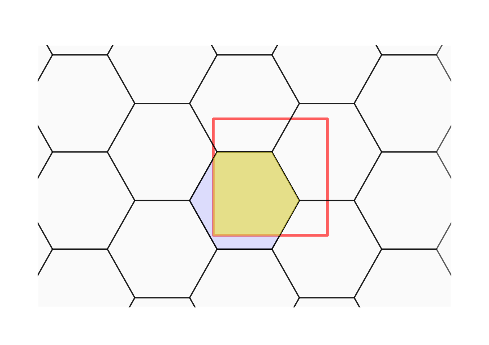
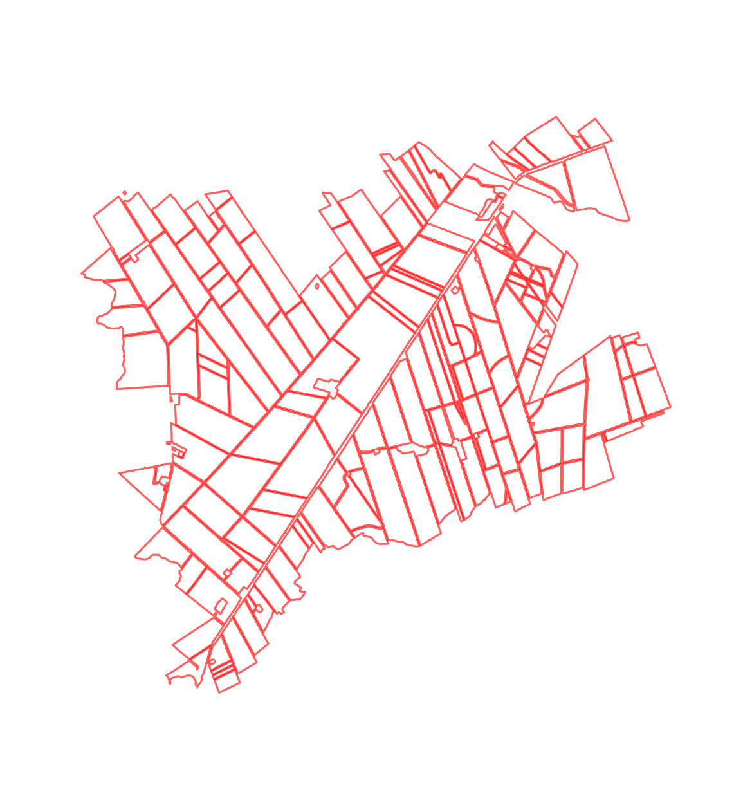
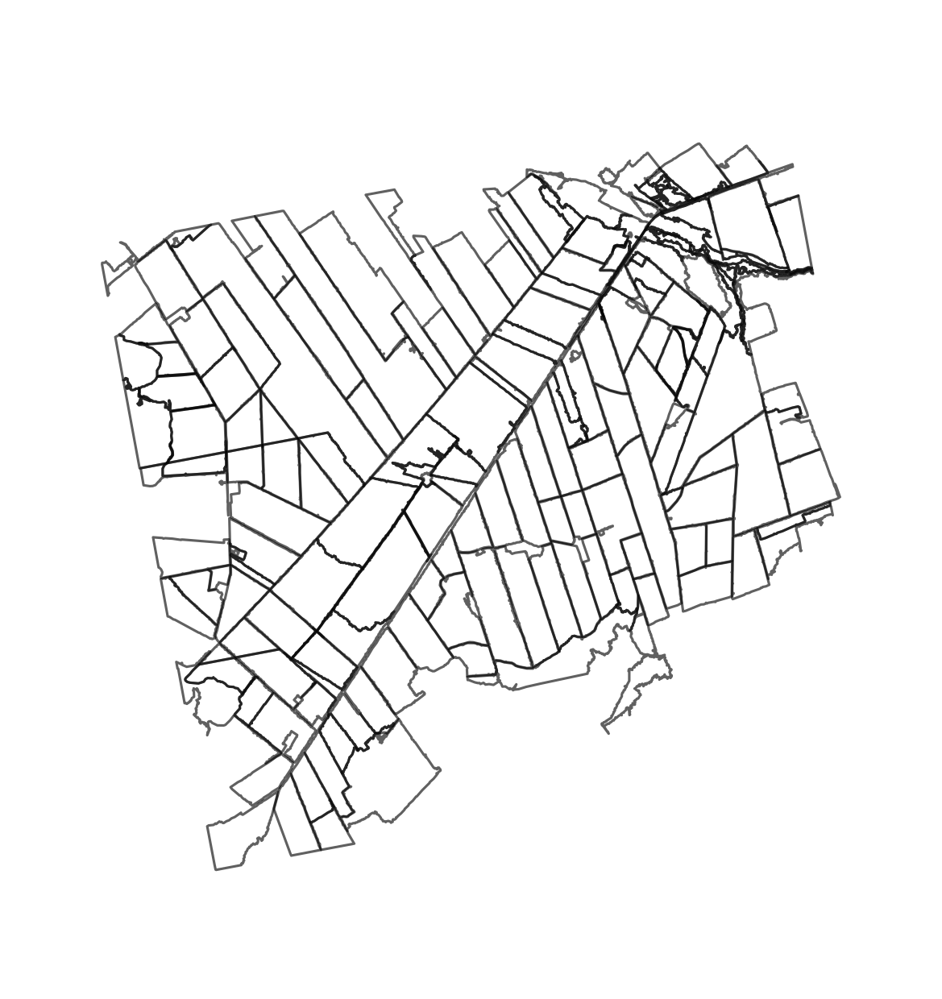
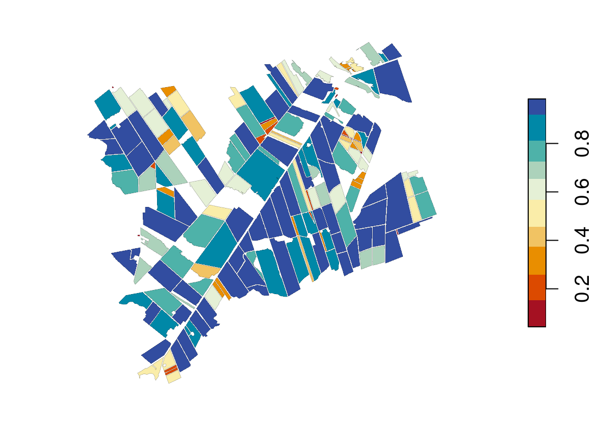

# Introduction

Earth Observation aims to collect data regarding the Earth's systems at
several spatio-temporal resolutions. These data allow scientists to
understand Earth's processes, such as greenhouse gas emissions and land
cover change. Segmentation is among the most used unsupervised
processing methods for extracting information from satellite
imagery [@Hossain2019]. Segmentation is the process by which objects are
extracted using image features. This process consists of delineating
groups of adjacent pixels with similar characteristics such as
intensity, color, and texture. Numerous segmentation algorithms are
available in the Remote Sensing scientific literature [see e.g.
@Kotaridis2021].

Assessing segmentation results is difficult due to under and
over-segmetation errors. Undersegmentation occurs when the segmentation
algorithm fails to separate a contiguous pixel group while
oversegmentation is the opposite, that is, the segmentation algorithm
unnecessarily splits a pixel group [@Costa2018]. Both under and
over-segmentation come with assessment metrics that target segments'
characteristics such as area, shape, and position. One way to assess
these errors is to use supervised quality metrics [@Costa2018].
Supervised metrics compare segments to reference data, measuring their
similarity or discrepancy in terms of under and
over-segmentation [@Clinton2010].

One significant challenge in the domain of Earth Observation data is the
scarcity of software tools specifically designed for segmentation
assessment. While several packages such as
[imageseg](https://CRAN.R-project.org/package=imageseg)
[@Niedballa2022],
[ExpImage](https://CRAN.R-project.org/package=ExpImage) [@Azevedo2022],
[SuperpixelImageSegmentation](https://CRAN.R-project.org/package=SuperpixelImageSegmentation)
[@Mouselimis2022],
[OpenImageR](https://CRAN.R-project.org/package=OpenImageR)
[@Mouselimis2022b], and
[image.Otsu](https://CRAN.R-project.org/package=image.Otsu)
[@Wijffels2020] enable users to segment images but, when provided, they
offer a limited set of facilities to assess the accuracy of the
segmentation and some of them are not tailored to the needs of Earth
Observation data or applications. This often requires users to adapt the
code from these packages for their own purposes, which can be
time-consuming and unrelated to their primary research goals.

In this paper, we introduce the
[segmetric](https://CRAN.R-project.org/package=segmetric) package, which
addresses the lack of R tools for assessing segmentation of Earth
Observation data and provides a coherent set of metrics that can be used
to compare and contrast different assessment methods for evaluating
segmentation. Additionally,
[segmetric](https://CRAN.R-project.org/package=segmetric) provides
innovative visualization tools to assist qualitative spatial analysis as
well as metrics that can be used to tune and assess segmentation
algorithms.

# Supervised segmentation metrics

Supervised metrics use reference data to assess segmentation accuracy.
These metrics are grouped into two categories: geometric, which use the
geometry of the objects (i.e. polygons) to determine the similarity
between the segments and the reference data; and thematic, which use
instead objects' attributes such as the land cover label associated with
each object  [@Costa2018]. The
[segmetric](https://CRAN.R-project.org/package=segmetric) package
focuses on geometric methods that require two sets of polygons as
inputs, one for the segments and other for the reference data.

The segments' polygons, denoted by $Y = \{y_j: j = 1, ..., m\}$, are
obtained from a segmentation method and the reference polygons, denoted
by $X = \{x_i: i = 1, ..., n\}$, are typically collected *in-situ* by
specialists. The quality metrics are defined considering different
subsets of $X$ and $Y$. The subsets of $Y$ used to compute metrics for
each reference $i$ are defined as follows [^1]:

-   $\tilde{Y}_{i} \subset{} Y$, where
    $\tilde{Y}_{i} = \{y_{j}: \rm{area}(x_{i} \cap y_{j}) \neq 0\}$

-   $Y'_{i} \subset{} Y$, where
    $Y'_{i} = \{y_{j}: max(\rm{area}(x_{i} \cap y_{j}))\}$

-   $Y\!a_{i} \subset{} \tilde{Y}_{i}$, where
    $Y\!a_{i} = \{y_{j}: \rm{centroid}(x_{i}) \:\rm{in}\: y_{j}\}$

-   $Y\!b_{i} \subset{} \tilde{Y}_{i}$, where
    $Y\!b_{i} = \{y_{j}: \rm{centroid}(y_{j}) \:\rm{in}\: x_{i}\}$

-   $Y\!c_{i} \subset{} \tilde{Y}_{i}$, where
    $Y\!c_{i} = \{y_{j}: \rm{area}(x_{i} \cap y_{j}) / \rm{area}(y_{j}) > 0.5\}$

-   $Y\!d_{i} \subset{} \tilde{Y}_{i}$, where
    $Y\!d_{i} = \{y_{j}: \rm{area}(x_{i} \cap y_{j}) / \rm{area}(x_{i}) > 0.5\}$

-   ${Y}^{*}_{i}$, where
    ${Y}^{*}_{i} = Y\!a_{i} \cup Y\!b_{i} \cup Y\!c_{i} \cup Y\!c_{i}$

-   $Y\!cd_{i}$, where $Y\!cd_{i} = Y\!c_{i} \cup Y\!d_{i}$

-   $Y\!e_{i} \subset{} \tilde{Y}_{i}$, where
    $Y\!e_{i} = \{y_{j}: \rm{area}(x_{i} \cap y_{j}) / \rm{area}(y_{j}) = 1\}$

-   $Y\!f_{i} \subset{} \tilde{Y}_{i}$, where
    $Y\!f_{i} = \{y_{j}: \rm{area}(x_{i} \cap y_{j}) / \rm{area}(y_{j}) > 0.55\}$

-   $Y\!g_{i} \subset{} \tilde{Y}_{i}$, where
    $Y\!g_{i} = \{y_{j}: \rm{area}(x_{i} \cap y_{j}) / \rm{area}(y_{j}) > 0.75\}$

Likewise, the subsets of $X$ used to compute metrics for each segment
$j$ are defined as:

-   $\tilde{X}_{j} \subset{} X$, where
    $\tilde{X}_{j} = \{x_{i}: \rm{area}(y_{j} \cap x_{i}) \neq 0\}$

-   $X'_{j} \subset{} X$, where
    $X'_{j} = \{x_{i}: max(\rm{area}(y_{j} \cap x_{i}))\}$

To illustrate these subsets definition, we depict some of them in
Figure [1](#fig:subsets){reference-type="ref" reference="fig:subsets"}.
Subsets contains all elements for which a metric value has to be
computed. To obtain a single metric value, a summary function can be
applied on all values, typically a mean or a weighted mean. The range of
possible values can differ from metric to metric. Also, the optimal
value varies for each metric.
Table [1](#tab:metrics){reference-type="ref" reference="tab:metrics"}
lists all implemented metrics in
[segmetric](https://CRAN.R-project.org/package=segmetric), their ranges
and optimal values. The corresponding subsets used to compute values are
shown in their formulas definition.

<figure id="fig:subsets">

[.33]  [.33]
 [.33]  
[.33]  [.33] 

<figcaption>Subsets are used to compute segmentation metrics. The red
squares and black hexagons represent reference and segmented polygons,
respectively. (a) <em>Ỹ</em> is made of
segmentation polygons overlapping any reference polygon. (b) <em>Y</em>′ is made of the segmentation
polygon overlapping the most of a reference polygon. (c) <em>Y</em>* is made of polygons in
the segmentation that either their centroids fall inside the reference,
or they cover or overlap more than half of the reference polygon, or the
reference polygon centroid falls inside them. (d) <em>X̃</em> is made of the reference polygons
overlapping any segmentation polygon. (e) <em>X</em>′ is made of the reference
polygons, which overlap the most with the segmentation polygons. Yellow
represents the intersection between the references and segments included
in a subset. The magenta areas are excluded from the
reference-segmentation intersection but included in the subset. Adapted
from .</figcaption>
</figure>

::: {#tab:metrics}
  Metric                                                                                                                                Range       Opt.  References
  -------------------------------------------------------------------------------------------------------------------------------- --------------- ------ -----------------
  $\rm{OS1}_{ij}=1-\frac{area(x_i\cap y_j)}{area(x_i)},\ y_j\in {Y^*}_i$                                                               $[0,1]$       0    @Clinton2010
  $\rm{OS2}_{ij}=1-\frac{area(x_i\cap y_j)}{area(x_i)},\ y_j\in {Y^{'}}_i$                                                             $[0,1]$       0    @Persello2010
  $\rm{OS3}_{ij}=1-\frac{area(x_i\cap y_j)}{area(x_i)},\ y_j\in {Ycd}_i$                                                               $[0,1]$       0    @Yang2014
  $\rm{US1}_{ij}=1-\frac{area(x_i\cap y_j)}{area(y_i)},\ y_j\in {Y^*}_i$                                                               $[0,1]$       0    @Clinton2010
  $\rm{US2}_{ij}=1-\frac{area(x_i\cap y_j)}{area(y_i)},\ y_j\in {Y^{'}}_i$                                                             $[0,1]$       0    @Persello2010
  $\rm{US3}_{ij}=1-\frac{area(x_i\cap y_j)}{area(y_i)},\ y_j\in {Ycd}_i$                                                               $[0,1]$       0    @Yang2014
  $\rm{AFI}_{ij}=\frac{area(x_i)-area(y_j)}{area(x_i)},\ y_j\in {Y^{'}}_i$                                                          $(-\infty,1]$    0    
  @Clinton2010                                                                                                                                            
  $\rm{QR}_{ij}=1-\frac{area(x_i\cap y_j)}{area(x_i\cup y_j)},\ y_j\in {Y^*}_i$                                                        $[0,1]$       0    
  @Clinton2010                                                                                                                                            
  $\rm{D}_{ij}=\sqrt{\frac{\rm{OS}_{ij}^2+\rm{US}_{ij}^2}{2}}$                                                                         $[0,1]$       0    
  @Clinton2010                                                                                                                                            
  $\rm{precision}_{ij}=\frac{area(x_i\cap y_j)}{area(y_i)},\ y_j\in {Y^{'}}_i$                                                         $[0,1]$       1    
  @Zhang2015                                                                                                                                              
  $\rm{recall}_{ij}=1-\frac{area(x_i\cap y_j)}{area(x_i)},\ y_j\in {Y^{'}}_i$                                                          $[0,1]$       1    
  @Zhang2015                                                                                                                                              
  $\rm{UMerging}_{ij}=\frac{area(x_i)-area(x_i\cap y_j)}{area(x_i)},\ y_j\in {Y^*}_i$                                                  $[0,1]$       0    
  @Clinton2010                                                                                                                                            
  $\rm{OMerging}_{ij}=\frac{area(y_j)-area(x_i\cap y_j)}{area(x_i)},\ y_j\in {Y^*}_i$                                               $[0,\infty)$     0    
  @Clinton2010                                                                                                                                            
  $\rm{M}_{ij}=\sqrt{\frac{area(x_i\cap y_j)^2}{area(x_i)area(y_j)}},\ y_j\in Y^{'}_i$                                                 $[0,1]$       1    
  @Feitosa2010                                                                                                                                            
  $\rm{E}_{ij}=\frac{area(y_j)-area(x_i\cap y_j)}{area(y_i)}\times 100,\ x_i\in {X^{'}}_j$                                            $[0,100]$      0    @Carleer2005
  $\rm{RAsub}_{ij}=\frac{area(x_i\cap y_j)}{area(x_i)},\ y_j\in \tilde{Y}_i$                                                           $[0,1]$       1    
  @Clinton2010                                                                                                                                            
  $\rm{RAsuper}_{ij}=\frac{area(x_i\cap y_j)}{area(y_i)},\ y_j\in \tilde{Y}_i$                                                         $[0,1]$       1    
  @Clinton2010                                                                                                                                            
  $\rm{PI}_{i}=\sum_{j=1}^{m}{\frac{area(x_i\cap y_j)^2}{area(x_i)area(y_i)}},\ y_j\in \tilde{Y}_i$                                    $[0,1]$       1    @VanCoillie2008
  $\rm{Fitness}_{ij}=\frac{area(x_i)+area(y_i) - 2 \: area(x_i\cap y_j)}{area(y_i)},\ x_i\in X^{'}_i$                               $[0,\infty)$     0    @Costa2008
  $\rm{ED3}_{ij}=\sqrt{\frac{OS3_{ij}^2+US3_{ij}^2)}{2}}$                                                                              $[0,1]$       0    @Yang2014
  $\rm{F{\text -}measure}_{ij}$\*=$\frac{1}{\frac{\alpha}{\rm{precision_{ij}}}+\frac{(1-\alpha)}{\rm{recall_{ij}}}}$                   $[0,1]$       1    
  @Zhang2015                                                                                                                                              
  $\rm{IoU}_{ij}=\frac{area(x_i\cap y_j)}{area(x_i\cup y_j)},\ y_j\in {Y^{'}}_i$                                                       $[0,1]$       1    
  @Rezatofighi2019                                                                                                                                        
  $\rm{SimSize}_{ij}=\frac{min(area(x_i),area(y_j))}{max(area(x_i),area(y_j))},\ y_j\in {Y^*}_i$                                       $[0,1]$       1    
  $\rm{qLoc}_{ij}=dist(centroid(x_i),centroid(y_j)),\ y_j\in {Y^*}_i$                                                               $[0,\infty)$     0    
  $\rm{RPsub}_{ij}=dist(centroid(x_i),centroid(y_j)),\ y_j\in {\tilde{Y}}_i$                                                        $[0,\infty)$     0    
  @Clinton2010                                                                                                                                            
  $\rm{RPsuper}_{ij}=\frac{dist(centroid(x_i),centroid(y_j))}{max_j(dist(centroid(x_i),centroid(y_j)))},\ y_j\in {Y^*}_i$              $[0,1]$       0    
  @Clinton2010                                                                                                                                            
  $\rm{OI2}_{i}=max_j\left(\frac{area(x_i\cap y_j)}{area(x_i)}\frac{area(x_i\cap y_j)}{area(y_j)}\right),\ y_j\in {\tilde{Y}}_i$       $[0,1]$       1    
  $\rm{Dice}_{ij}=\frac{2\:area(x_i\cap y_j)}{area(x_i)+area(y_j)},\ y_j\in {Y^{'}}_i$                                                 $[0,1]$       1    

  : Metrics implemented
:::

It takes the optional weight argument $\alpha\in[0,1]$ (the default is
0.5).

Metrics can be computed either from scratch using subsets or by
combining other metrics. Examples of metrics using subsets include:
Oversegmentation (OS), Undersegmentation (US), Area Fit Index (AFI),
Quality Rate (QR), Precision, Recall, Undermerging (UMerging),
Overmerging (OMerging), Match (M), Evaluation measure (E), Relative area
(RAsub and RAsuper), Purity Index (PI), and Fitness Function (Fitness).
The metrics computed by combining other metrics include: Index D (D),
Euclidean Distance (ED3), and F-measure (F_measure). Some of these
metrics are not intended to be summarized such as Relative position
(RPsub and RPsuper).

# The segmetric package

## Installation

The stable release of
[segmetric](https://CRAN.R-project.org/package=segmetric) package can be
installed from CRAN, using:

::: example
install.packages(\"segmetric\")
:::

## Computing metrics

[segmetric](https://CRAN.R-project.org/package=segmetric) depends on the
[sf](https://CRAN.R-project.org/package=sf) package [@Pebesma2018] to
open and manipulate geographic vector data sets.
[sf](https://CRAN.R-project.org/package=sf) is an implementation of a
standard issued by the Open Geospatial Consortium [@OGC2011], which was
further formalized in @ISO2004. This standard defines a common way to
store and access spatial data in the context of geographic information
systems.

To start with [segmetric](https://CRAN.R-project.org/package=segmetric),
users should create a segmetric object using sm_read(ref_sf, seg_sf)
passing to it a reference spatial data set and a segmentation spatial
data set. The parameters ref_sf and seg_sf should be either sf objects
or paths to a supported file vector format (e.g., `shapefile`).

::: example
library(segmetric)

\# load example data sets data(\"sample_ref_sf\", package =
\"segmetric\") data(\"sample_seg_sf\", package = \"segmetric\")

\# create a segmetric object m \<- sm_read(ref_sf = sample_ref_sf,
seg_sf = sample_seg_sf)
:::

To compute a metric, users should run the function sm_compute(m,
metric_id, \...), where m is a segmetric object and metric_id is the
identification of a metric in
[segmetric](https://CRAN.R-project.org/package=segmetric). Any extra
parameter necessary to compute metrics can be informed using the
ellipsis parameter. The list of available metrics can be obtained using
sm_list_metrics() which returns a character vector listing all
registered metrics.

The sm_compute() function can compute a set of metrics by passing a
vector of values to the metric_id parameter or making a sequence of
function calls using a pipe operator. The two examples below produce
equivalent results:

::: example
\# compute three metrics sm_compute(m, c(\"AFI\", \"OS1\", \"US1\"))

\# compute the same three metrics as above sm_compute(m, \"AFI\")
sm_compute(\"OS1\") sm_compute(\"US1\")
:::

Most metrics are computed by feature (i.e., by reference or segment). To
summarize the values of a set of metrics, users can run the function
summary(object, \...), which computes aggregated values for the metrics
returned by sm_compute().

::: example
\# compute three metrics sm_compute(m, c(\"AFI\", \"OS1\", \"US1\"))
summary()
:::

Once created, a segmetric object stores in the cache every computed
subset. Further subset requests are retrieved from the cache, speeding
up the computation.

## How to extend segmetric

The [segmetric](https://CRAN.R-project.org/package=segmetric) package is
extensible by providing functions to implement new metrics. To implement
a new metric, users can use sm_new_metric() to create a new metric
object and register it using sm_reg_metric() function. Users can type
?sm_reg_metric() to find more details on how new metrics can be
implemented. The following example implements the Jaccard
index [@Jaccard1912], also known as Intersection over Union
(*IoU*) [@Rezatofighi2019], which is defined between 0 and 1 (optimal):

::: example
\# register 'IoU' metric sm_reg_metric( metric_id = \"IoU\", entry =
sm_new_metric( fn = function(m, s, \...) \# m is the metric object, s is
the subset \# for IoU, s is equivalent to sm_yprime(m) sm_area(s) /
sm_area(sm_subset_union(s)) , fn_subset = sm_yprime, name =
\"Intersection over Union\", optimal = 1, description = \"Values from 0
to 1 (optimal)\", reference = \"Jaccard (1912); Rezatofighi et al.
(2019)\" ) )

\# describes the 'IoU' metric sm_desc_metric(\"IoU\") #\> \* IoU
(Intersection over Union) #\> Values from 0 to 1 (optimal) #\>
reference: Jaccard (1912); Rezatofighi et al. (2019)
:::

Contributions to the package are welcome at GitHub [^2] and more details
on how to contribute can be found in segmetric home-page at
<https://michellepicoli.github.io/segmetric>.

# Package segmetric in action

The specific steps involved in a segmentation workflow can vary
depending on researcher goals, characteristics of the input data, and
the task requirements. In general, a segmentation workflow typically
includes the steps in Figure [2](#fig:workflow){reference-type="ref"
reference="fig:workflow"}. First, researchers working with segmentation
data need to obtain satellite images and preprocess them via methods
such as radiometric and geometric corrections, image mosaicking, cloud
masking, indices computation, and texture extraction. Second, a
segmentation method is used to obtain the segments. Typically,
researchers can use supervised and unsupervised machine learning methods
such as convolutional neural network [@Fukushima1980],
U-Net [@Ronneberger2015], multi-resolution segmentation [@Baatz2000],
and watershed segmentation [@Beucher1992]. In this step, the segments
can be stored in a vector format. Finally, the accuracy of the
segmentation can be assessed by supervised quality metrics. Using
reference data, researchers compute metrics to evaluate the
segmentation. The last two steps may be repeatedly iterated until the
desired level of accuracy is reached.

{#fig:workflow
width="100%"}

In the following section, we demonstrate an application of the
[segmetric](https://CRAN.R-project.org/package=segmetric) package to
assess several segmentation parameters and guide users to select the
most accurate one.

## Data

In agriculture studies, mapping characteristics such as the size and
number of fields can provide information about productivity and other
important variables such as food security, socioeconomic status, and
environmental status. To demonstrate
[segmetric](https://CRAN.R-project.org/package=segmetric), we used data
on the Luís Eduardo Magalhães (LEM) municipality, west of Bahia state,
Brazil. This municipality belongs to the Brazilian agricultural frontier
known as MATOPIBA, which includes the states of Maranhão (MA), Tocantins
(TO), Piauí (PI), and Bahia (BA) (Figure
[3](#fig:studyarea){reference-type="ref" reference="fig:studyarea"}).

{#fig:studyarea width="100%"}

We used three PlanetScope images acquired on Feb 18, 2020, with a
3.7-meter resolution and four spectral bands (blue, green, red, and
near-infrared). Radiometric and geometric corrections were applied to
the image (level 3B) [@Planet2017]. The images were in the same
projection (UTM zone 23S) and we mosaicked them.

We segmented the image applying a multi-resolution segmentation
approach [@Baatz2000]. We tested four scale parameters (SP) to segment
the image: 200, 500, 800, and 1000; shape parameter: 0.9; and
compactness: 0.1. The resulting polygons were simplified using the
Douglas-Peucker algorithm [@Douglas1973] (distance parameter: 10 meters)
in QGIS software (version 3.22.2). The Self-intersections were removed
using SAGA's Polygon Self-Intersection tool (version 7.8.2). The final
segmentation set is composed of polygons intersecting the reference data
with an area-perimeter ratio above 25. The segmentation results are
provided as part of the
[segmetric](https://CRAN.R-project.org/package=segmetric) package.

The reference data set (ref_sf), provided by @Oldoni2020, was collected
in two fieldwork campaigns in March and August 2020. @Oldoni2020 draw
the field boundaries in-situ on top of images Sentinel-2, with a spatial
resolution of 10 meters.
[segmetric](https://CRAN.R-project.org/package=segmetric) includes only
a portion of this data set. The spatial data sets can be loaded into R
using [sf](https://CRAN.R-project.org/package=sf) objects. To create a
[segmetric](https://CRAN.R-project.org/package=segmetric) object, use
function sm_read():

::: example
library(segmetric)

\# load data sets data(\"ref_sf\", package = \"segmetric\")
data(\"seg200_sf\", package = \"segmetric\") data(\"seg500_sf\", package
= \"segmetric\") data(\"seg800_sf\", package = \"segmetric\")
data(\"seg1000_sf\", package = \"segmetric\")

\# create a segmetric object m200 \<- sm_read(ref_sf = ref_sf, seg_sf =
seg200_sf) m500 \<- sm_read(ref_sf = ref_sf, seg_sf = seg500_sf) m800
\<- sm_read(ref_sf = ref_sf, seg_sf = seg800_sf) m1000 \<-
sm_read(ref_sf = ref_sf, seg_sf = seg1000_sf)
:::

## Analysis

This analysis assesses four different segmentations with different Scale
Parameters (SP) to verify which one fits better with the reference
polygons. First, we visualize the reference polygons and the four
segmentations individually using the plot() function (Figure
[4](#fig:plot){reference-type="ref" reference="fig:plot"}).

::: example
\# plot layers plot(m200, layers = \"ref_sf\", plot_centroids = FALSE)
plot(m200, layers = \"seg_sf\", plot_centroids = FALSE) plot(m500,
layers = \"seg_sf\", plot_centroids = FALSE) plot(m800, layers =
\"seg_sf\", plot_centroids = FALSE) plot(m1000, layers = \"seg_sf\",
plot_centroids = FALSE)
:::

<figure id="fig:plot">

[.33]  [.33]
 [.33]  
[.33]  [.33] 

<figcaption>(a) reference polygons; (b) segmentation using SP = 200; (c)
segmentation using SP = 500; (d) segmentation using SP = 800; (e)
segmentation using SP = 1000.</figcaption>
</figure>

The metrics available in the package can be consulted using the function
sm_list_metrics(). In this example, the metrics chosen to evaluate the
accuracy of the segmentations and verify the best value of the scale
parameter were: Area Fit Index  [@Carleer2005], F-measure 
[@vanRijsbergen1979] [@Zhang2015], Quality Rate  [@Weidner2008]
[@Clinton2010], Oversegmentation  [@Clinton2010], and Undersegmentation
 [@Clinton2010].

::: example
\# compute all metrics metrics \<- c(\"QR\", \"F_measure\", \"IoU\",
\"M\", \"OS2\", \"US2\") m200 \<- sm_compute(m200, metrics) m500 \<-
sm_compute(m500, metrics) m800 \<- sm_compute(m800, metrics) m1000 \<-
sm_compute(m1000, metrics)

\# results summary(m200) #\> QR F_measure IoU M OS2 US2 #\> 0.7394817
0.6988555 0.4988198 0.6569973 0.2948025 0.2585708

summary(m500) #\> QR F_measure IoU M OS2 US2 #\> 0.50380348 0.80671198
0.56837519 0.70140431 0.07982693 0.37207120

summary(m800) #\> QR F_measure IoU M OS2 US2 #\> 0.47487615 0.78764418
0.54923433 0.68297970 0.04300207 0.43014287

summary(m1000) #\> QR F_measure IoU M OS2 US2 #\> 0.50311268 0.75742922
0.51745883 0.65548524 0.03679037 0.46524463
:::

The computed metrics are presented in Table
[2](#tab:result){reference-type="ref" reference="tab:result"}; the
optimal value of QR, OS2, and US2 is 0, and 1 for F-measure, M, and IoU.
These results indicate that segmentation using SP equal to 200 had the
highest oversegmentation while using SP equal to 1000 had the highest
undersegmentation. Observing the metrics F-measure, IoU, and M, we
conclude that the best SP is 500.

Users must pay attention to which metric better fits their goals of
accuracy assessment. For more information, we suggest the user consult
comparative studies dedicated to geometric metrics such as @Clinton2010,
@Rasanen2013, @Yang2015, @Costa2018, and @Jozdani2020.

::: {#tab:result}
             **QR**   **F_measure**   **IoU**   **M**   **OS2**   **US2**
  ---------- -------- --------------- --------- ------- --------- ---------
  seg 200    0.739    0.699           0.499     0.657   0.295     0.259
  seg 500    0.504    0.807           0.568     0.701   0.080     0.372
  seg 800    0.475    0.788           0.549     0.683   0.043     0.430
  seg 1000   0.503    0.757           0.517     0.655   0.037     0.465

  : Accuracy metrics of Quality Rate (QR), F-measure, Intersection over
  Union (IoU), Match (M), Oversegmentation (OS2), and Undersegmentation
  (US2) for four segmentations with different Scale Parameters (SP).
:::

[]{#tab:result label="tab:result"}

The [segmetric](https://CRAN.R-project.org/package=segmetric) package
allows users to visualize subsets used to compute metrics. The example
in Figure [5](#fig:ref_seg){reference-type="ref"
reference="fig:ref_seg"} shows the results of the function to plot the
subset Y_tilde over the reference and the segmentation polygons (SP =
500). This allows analyzing the overlap between the reference and
segmentation polygons visually.

::: example
plot( x = m500, type = \"subset\", subset_id = \"Y_tilde\",
plot_centroids = FALSE, plot_legend = TRUE, extent = sm_seg(m500) )
:::

{#fig:ref_seg width="70%"}

It is also possible to visualize the metrics for each segment in
choropleth maps using the function:

::: example
plot( x = m500, type = \"choropleth\", metric_id = c(\"QR\", \"IoU\",
\"M\", \"OS2\", \"US2\"), break_style = \"jenks\", choropleth_palette =
\"RdYlBu\", plot_centroids = FALSE )
:::

Legend bar of choropleth maps are generated automatically, and users can
further customize it with options such as the number of breaks and the
palette. The legend consistently uses the same color for the optimal
metric value (for example, in
Figure [6](#fig:plot_metrics){reference-type="ref"
reference="fig:plot_metrics"}, blue is better while red is worse),
except for those metrics in which the optimal value is in the middle of
the color scale (e.g., AFI). The size and number of intervals in each
color scale change accordingly to the metric values present in the data
set. Users can choose the method to compute the intervals. To check
available options use ?plot.segmetric and see break_style parameter.

<figure id="fig:plot_metrics">

[.49]  [.49]
 
[.49]  [.49]  
[.49] 

<figcaption>Spatial distribution of the metrics: (a) Quality Rate, (b)
Intersection over Union, (c) Match, (d) Oversegmentation, and (e)
Undersegmentation.</figcaption>
</figure>

Figure [6](#fig:plot_metrics){reference-type="ref"
reference="fig:plot_metrics"} presents the spatialized results of the
calculated metrics. The F-measure metric was not plotted because it is a
global metric with a single value for all objects. Figures
[6](#fig:plot_metrics){reference-type="ref"
reference="fig:plot_metrics"}a, d, and e show the similarity between the
QR, OS, and US metrics results, for which the ideal value is zero. In
the three plots of these metrics, it is noted that the objects with the
best results (close to zero) are located in the southeast part of the
study area. The IoU and M metric maps (Figure
[6](#fig:plot_metrics){reference-type="ref"
reference="fig:plot_metrics"}b and c), for which the ideal value is 1,
are also similar. We also observed that for these two metrics, the
objects located in the southwest part of the study area have values
close to 1. The figure shows differences in the number of objects
plotted in each of the metrics, as the subsets used to calculate each of
the metrics are different.

# Summary

The [segmetric](https://CRAN.R-project.org/package=segmetric) package
provides 28 metrics that can be used to evaluate and compare the results
of segmentation methods. The package also offers innovative
visualization options to assist qualitative spatial assessment, allowing
diagnostics of the quality, issues, and potential biases of the
segmentation. Plotting the segmented objects along their reference
polygons and spatially visualizing the metrics may help users to
evaluate and improve segmentation procedures, select segmentation
parameters, and decide on adequate validation metrics.

To the extent of our knowledge,
[segmetric](https://CRAN.R-project.org/package=segmetric) is the first
available package in R that provides several supervised metrics based on
reference polygons.
[segmetric](https://CRAN.R-project.org/package=segmetric) also enables
users to implement new metrics. In the future, we plan to add more
supervised metrics and other ways to visualize metrics, and to use
parallel processing to speed up computations.

# Acknowledgments {#acknowledgments .unnumbered}

This research was supported by the European Research Council (ERC) under
the European Union's Horizon 2020 research and innovation program (Grant
agreement No 677140 MIDLAND); the Amazon Fund through the financial
collaboration of the Brazilian Development Bank (BNDES) and the
Foundation for Science, Technology and Space Applications (FUNCATE)
(Process 17.2.0536.1); and Conselho Nacional de Desenvolvimento
Científico e Tecnológico (CNPq) (Process 350820/2022-8).

[^1]: We are following the notation used by @Clinton2010 and @Costa2018

[^2]: <https://github.com/michellepicoli/segmetric>
