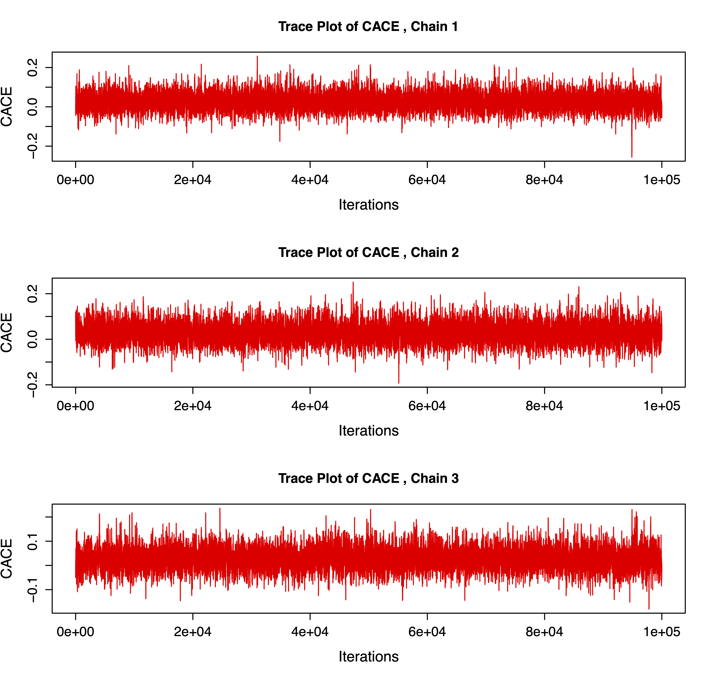
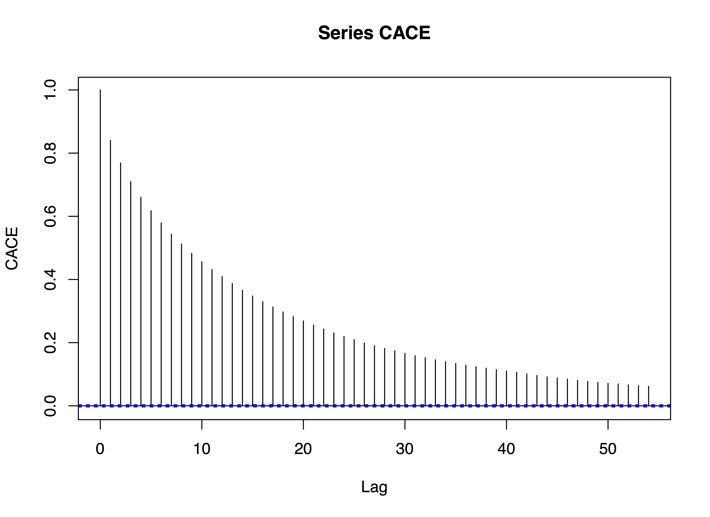

```{r setup, include=FALSE}
knitr::opts_chunk$set(echo = FALSE, warning = FALSE, message = FALSE)
```

# Introduction
## Noncompliance in randomized clinical trials and causal effect

Randomized clinical trials (RCTs) are often used to evaluate healthcare-related interventions. An RCT typically compares an experimental treatment to a standard treatment or to a placebo. A common problem in RCTs is that not all patients fully comply with the allocated treatments. Although RCT investigators control the randomization process, the actual treatments received by study participants may not follow the randomization allocation; this is called noncompliance. For example, in trials of a therapist-led intervention, noncompliance occurs when individuals randomized to the intervention fail to take the intervention (e.g., due to severe adverse events), or when some patients assigned to the control figure out a way to take the intervention. In some cases, investigators can collect outcome data on all of these patients, regardless of whether they followed interventions. When compliance status is incompletely observed, it is more complicated to evaluate the causal treatment effect.

Conventionally, researchers use the intention-to-treat (ITT) analysis, in which data are analyzed based on treatments originally allocated rather than treatments actually received. The ITT method estimates the effect of being offered the intervention, namely, the overall effect in the real world in which the intervention is made available. However, our interest may lie in a different question, namely the causal effect of actually receiving the treatment. When using ITT, the treatment effect tends to be diluted by including people who do not receive the treatment to which they were randomly allocated [@RN279].

To identify a treatment's causal effect, the principal stratification framework [@RN215] is proposed, which stratifies subjects on the joint potential post-randomization variables. This causal inference method is widely used in handling various intercurrent events (also called an intermediate variable) in areas like vaccine effect [@hudgens2006causal; @zhou2016bayesian], pain relief use [@baccini2017bayesian], surrogate endpoint evaluation [@gilbert2015surrogate],  noncompliance [@zhou2019bayesian], etc. An estimator called the "complier average causal effect" (CACE) has been proposed, in which patients are classified into different principal strata (compliers, never-takers, always-takers, and defiers) based on their *potential* behavior after assignment to both the treatment and control arms. *Compliers* are patients who receive the treatment as assigned; *never-takers* are those who do not receive treatment, regardless of treatment assignment; *always-takers* are those who receive treatment regardless of treatment assignment; and patients who always do the opposite of their treatment assignment are called *defiers*. The CACE is the causal effect of the intervention estimated from compliers. Because patients are assumed to be compliers (or not) before the randomization, the CACE retains the benefit of the randomization. Specifically, CACE is an unbiased estimate of the difference in outcomes for compliers in the intervention group compared to those in the control group, who would have engaged with treatment had they been randomized to the intervention group.

The biggest challenge in estimating the CACE is that we cannot actually identify which participants are compliers. Some of those receiving the treatment in the intervention group are compliers, but the rest are always-takers. Similarly, some of those not receiving the treatment in the control arm are compliers, but others are never-takers.
Several R packages are available to perform CACE analysis in a single study. For example, the \CRANpkg{noncomplyR} package [@noncomplyR] provides convenient functions for using Bayesian methods to perform inferences on the CACE. The package \CRANpkg{eefAnalytics} [@eefAnalytics] provides tools for exploratory CACE analysis of simple randomized trials, cluster randomized trials, and multi-site trials with a focus on education trials. Besides the CACE analysis, another method commonly used to account for noncompliance is the instrumental variable (IV) method estimating the treatment effect with two-staged least squares (2SLS) regression [@white1982instrumental];  the archived R package \pkg{ivpack} [@ivpack] performs this type of analysis.

## CACE in meta-analysis

All of the above methods are framed in a single study setting. However, for analyzing multiple trials in the presence of noncompliance, no software is available for causal effect analysis, specifically for meta-analysis. When noncompliance data are reported in each trial, one could intuitively implement a two-step approach by first estimating CACE for each study and then combining the study-specific estimates using a fixed-effect or random-effects model to estimate the population-averaged CACE. Recently, @zhou2019bayesian proposed a Bayesian hierarchical model to estimate the CACE in a meta-analysis of randomized trials where compliance may be heterogeneous between studies. It is also common that noncompliance data are not available for some trials. Simply excluding trials with incomplete noncompliance data from a meta-analysis can be inefficient and potentially biased. @zhou2021bayesian proposed an improved flexible Bayesian hierarchical CACE framework to account simultaneously for heterogeneous noncompliance and incomplete noncompliance data. More recently, @zhou2021noncompliance used a generalized linear latent and mixed model to estimate CACE, which accounts for between-study heterogeneity with random effects.
The package \CRANpkg{BayesCACE} focuses on providing user-friendly functions to estimate CACE in either a single study or meta-analysis using models based on @zhou2019bayesian, @baker2020cace, @zhou2020rejoinder and @zhou2021bayesian. 

This article introduces the R package \CRANpkg{BayesCACE}, which performs CACE analysis for binary outcomes in a single study, and meta-analysis with either complete or incomplete noncompliance information.
The package \CRANpkg{BayesCACE} is available from the Comprehensive R Archive Network (CRAN). 
It uses Markov chain Monte Carlo (MCMC) methods on the R platform through \textsf{JAGS}. \textsf{JAGS} is a program for analyzing Bayesian hierarchical models using MCMC simulation, which is available for diverse computer platforms including Windows and Mac OS X. Convergence of the MCMC routine can be assessed by the function outputs. The package also provides functions to generate posterior trace plots, density plots, and auto-correlation plots. For meta-analysis, the package provides a forest plot of study-specific CACE estimates with 95% credible intervals as well as the overall CACE estimate, to visually display the causal treatment effect comparisons. 

This article is organized as follows. The next section defines CACE in mathematical notation that will be used throughout the paper. We also describe the assumptions needed to make the CACE a valid causal effect estimator. Following that, we present an overview of the Bayesian hierarchical models for CACE implemented in the \CRANpkg{BayesCACE} package. Then, we illustrate use of the package with a case study example and discuss the output structures. Finally, we provide a brief discussion with potential future improvements. 

## Assumptions and definition of CACE

The CACE is a measure of the causal effect of a treatment or intervention on patients who received it as intended by the original group allocation. It is an unbiased causal effect estimate based on five standard assumptions commonly used in causal inference research. First, it assumes that potential outcomes for each participant are independent of the potential outcomes for other participants, known as the *Stable Unit Treatment Value Assumption (SUTVA)*. Second, it assumes that assignment to treatment is random, so that the proportion of compliers should be the same in the intervention and control groups, thus allowing the estimation of one of the core unobserved parameters needed to derive a CACE estimate. Third, it assumes that treatment assignment has an effect on the outcome only if it changes the actual treatment taken, 
an assumption known as *exclusion restriction*. For never-takers, for instance, it assumes that simply being assigned to treatment does not affect their outcomes, as they do not actually receive the treatment assigned to them. Fourth, it assumes that assigning the study treatment to participants in the intervention group induces at least some participants to receive the treatment, so the compliance rate is not zero. Finally, it assumes that there is a monotonic relationship between treatment assignment and treatment receipt, which implies that there are no individuals for whom assignment to treatment actually reduces the likelihood of receiving treatment (i.e., no defiers). This assumption reduces the number of compliance types for which estimates are derived, permitting a properly identified model.

We follow @zhou2019bayesian and introduce notation both on the individual level and on the study level. Suppose a meta-analysis reviews $I$ two-armed RCTs, and $N_i$ is the number of subjects in the $i$-th trial for $i \in \{1, \dots, I\}$. If the data include a single study only, then $I=1$ and we can remove the subscript $i$ from all notation. 

On the individual level, notation is defined as follows for subject $j$ in trial $i$. 

1. Let $R_{ij}=r$ index the randomization assignment with $r=0$ for those randomized to control and $r=1$ for those randomized to the intervention.
2. Let $T^{r}_{ij}=t \in \{0, 1\}$ be the indicator of whether the individual received the intervention. This is a *potential* outcome under the randomization assignment $r\in \{0, 1\}$, i.e., what the value of treatment $t$ would be for individual $(i,j)$ if $r=0$ or $r=1$, respectively.
3. Let $Y^{r, t}_{ij}=o \in \{0, 1\}$ be the *potential* binary outcome under randomization assignment $r$ and treatment received $t$. Note that the \textit{exclusion restriction} assumption allows us to define $Y^{t}_{ij}\equiv Y^{r, t}_{ij}$.
4. The sets of $\{Y^{r, t}_{ij}\}$ and $\{T^{r}_{ij}\}$ are the *potential* outcome and treatment-received status respectively under possible $r$ and $t$, but for each subject in a trial, only one of the possible values of each set can be observed. Therefore, we denote the observed response and received treatment variables as $Y_{ij}$ and $T_{ij}$.
5. We allow $T_{ij}=*$ if the actual received treatment is not recorded. Then let $M_{ij}=m$ be the missing indicator corresponding to whether subject $j$ has actual treatment received status on record ($m=0$) or missing ($m=1$).
6. Using these potential outcomes, we can define the compliers and the CACE. Let $C_{ij}$ be the latent compliance class of individual $j$ in trial $i$, defined as follows: 

 \[
   C_{ij}=
   \begin{cases}
     0, & \text{for never-taker with }\ (T^0_{ij}, T^1_{ij})=(0, 0) \\
     1, & \text{for complier with }\ (T^0_{ij}, T^1_{ij})=(0, 1) \\
     2, & \text{for always-taker with }\ (T^0_{ij}, T^1_{ij})=(1, 1) \\
     3, & \text{for defier with }\ (T^0_{ij}, T^1_{ij})=(1, 0)
   \end{cases}.
 \]

A subject's compliance status $C_{ij}$ is not observable because in a two-arm trial, only one of $T^1_{ij}$ and $T^0_{ij}$ can be observed. Based on the observed randomization group and actual treatment received, the compliance classes can be only partially identified.

Now, the complier average causal effect of the $i$-th trial is the average difference between potential outcomes for compliers. In this case, the CACE in study $i$ is $\theta^\text{CACE}_i=E(Y^1_{ij}-Y^0_{ij}|C_{ij}=1)$, where the patients for whom $C_{ij}=1$ are the compliers.  

On the study level, $n_{irto}$ denotes the observed number of individuals in study $i$, randomization group $r$, actual received treatment group $t$, and outcome $o$. If the compliance status of individual $j$ in trial $i$ is not on record, $T_{ij}=t=*$ so the corresponding count is $n_{ir*o}$, which is the sum of the two unobserved counts $n_{ir0o}$ and $n_{ir1o}$.

# Estimating CACE

This section briefly describes the Bayesian hierarchical models used to estimate CACE. These models form the basis of the framework proposed by @zhou2019bayesian and underlie the \CRANpkg{BayesCACE} package. In addition to the notation defined in the previous section, we define the following parameters for study $i$.

1. Let $\pi_{ia}$ and $\pi_{in}$ be the probabilities of being an always-taker and a never-taker, respectively. Because defiers are ruled out by the monotonicity assumption, each trial has at most only three compliance classes. Thus the probability of being a complier in study $i$ is $\pi_{ic}=1-\pi_{ia}-\pi_{in}$.
2. Define these response probabilities: $u_{i1}$ for a complier randomized to the treatment group; $v_{i1}$ for a complier randomized to the control/placebo group; $s_{i1}$ for a never-taker; and $b_{i1}$ for an always-taker. Thus for study $i$, the parameters included in the model are $\boldsymbol{\beta}_i=(\pi_{ia}$, $\pi_{in}$, $u_{i1}$, $v_{i1}$, $s_{i1}$, $b_{i1})$.

As the outcome is binary, the expected difference between outcomes from the two treatment groups among compliers is just the risk difference between $u_{i1}$ and $v_{i1}$. Therefore, the CACE can be written as $\theta^\text{CACE}_i=E(Y^1_{ij}-Y^0_{ij}|C_{ij}=1)=u_{i1}-v_{i1}$.

## CACE for a single trial with noncompliance
Consider first a single trial with noncompliance, i.e., $I = 1$, so all notation and parameters defined earlier are reduced to the version without subscript $i$. According to @zhou2019bayesian, each observed $n_{rto}$ has a corresponding probability that can be written in terms of parameters defined in $\boldsymbol{\beta}=(\pi_{a}$, $\pi_{n}$, $u_{1}$, $v_{1}$, $s_{1}$, $b_{1})$, thus the vector $(n_{000}, n_{001}, n_{010}, n_{011}, n_{100}, n_{101}, n_{110}, n_{111})$ follows a multinomial distribution. The likelihood is available in the Supplemental Materials.  
The CACE for a single study is $u_{1}-v_{1}$, so the posterior of $\theta^\text{CACE}$ is the posterior of $u_{1}-v_{1}$.


## CACE for a meta-analysis with complete compliance information
This section introduces two methods for performing a meta-analysis of the CACE when noncompliance data are reported in each trial. 

### The two-step approach
As described in the previous section, using the observed data $n_{irto}$, $\theta^\text{CACE}_i$ is identified for study~$i$. Therefore, to estimate the population-average CACE in a meta-analysis, we propose combining the study-specific estimates and standard errors using a standard meta-analysis method such as the fixed-effect [@laird1990some] or random-effects model [@hedges1998fixed; @hedges2014statistical]. We call this a "two-step" approach. As the CACE measure is a risk difference, a transformation may be necessary to ensure that the normal distribution assumption is approximately true.
Building upon the well-developed R package \CRANpkg{metafor}, various estimators suggested in the literature can be estimated to account for potential between-study heterogeneity in the CACE, e.g., the Hunter--Schmidt estimator, the Hedges estimator, the DerSimonian--Laird estimator, the maximum-likelihood or restricted maximum-likelihood estimator, or the empirical Bayes estimator [@viechtbauer2010conducting]. 


### The Bayesian hierarchical model

In a meta-analysis, the CACE can also be estimated using the joint likelihood from the Bayesian hierarchical model. This method is systematically introduced in @zhou2019bayesian. The log likelihood contribution of trial $i$ is denoted 
by adding a subscript $i$ to each parameter. Then the log likelihood for all trials in the meta-analysis is $\log\mathcal{L}(\boldsymbol{\beta})=\sum_i {\log L_i({\boldsymbol{\beta}}_{i})}$. 
Because the studies are probably not exactly identical in their eligibility criteria, measurement techniques, study quality, etc., differences in methods and sample characteristics may introduce heterogeneity to the meta-analysis. One way to model the heterogeneity is to use a random-effects model.

To guarantee the desired properties of study $i$'s latent compliance classes and to account for possible between-study heterogeneity in the compliance class and response probabilities, we use these transformations: 

1. $\pi_{in}=\frac{\exp(n_i)}{1+\exp(n_i)+\exp(a_i)}, \pi_{ia}=\frac{\exp(a_i)}{1+\exp(n_i)+\exp(a_i)}$, where  $n_i=\alpha_{n}+\delta_{in}, a_i=\alpha_{a}+\delta_{ia}$, and $\\ {(\delta_{in}, \delta_{ia})}^\top \sim N(0, \ {\mathbf{\Sigma}}_{ps})$, $\mathbf{\Sigma}_{ps}=\bigl(\begin{smallmatrix} {\sigma}^2_{n} & \rho {\sigma}_{n}{\sigma}_{a} \\ \rho {\sigma}_{n}{\sigma}_{a} & {\sigma}^2_{a} \end{smallmatrix} \bigr)$.
2. We also define random effect models on the transformed scale of each response probability $s_{i1}, b_{i1}, u_{i1}, v_{i1}$:
    $g(s_{i1})=\alpha_s+\delta_{is}, \ g(b_{i1})=\alpha_b+\delta_{ib}, \ g(u_{i1})=\alpha_u+\delta_{iu}, \ g(v_{i1})=\alpha_v+\delta_{iv}$, where $g(\cdot)$ is a link function such as the logit or probit, $\delta_{is} \sim N(0,{\sigma}_{s}^2)$, $\delta_{ib} \sim N(0,{\sigma}_{b}^2)$, $\delta_{iu} \sim N(0,{\sigma}^2_{u})$, $\delta_{iv} \sim N(0,{\sigma}^2_{v})$. 

Here we allow correlation between $n_i$ and $a_i$, and assign random effect variables to all parameters. However, if a parameter does not vary between trials, it can be modeled as a fixed effect. 
Let $f(\boldsymbol{\beta}_i | \boldsymbol{\beta}_0, \mathbf{\Sigma}_0)$ be the distributions described above of all parameters $\boldsymbol{\beta}_i=(\pi_{ia}$, $\pi_{in}$, $s_{i1}$, $b_{i1}$, $u_{i1}$, $v_{i1})$, where $\boldsymbol{\beta}_0$ is the vector of mean hyper-parameters $(\alpha_{n}$, $\alpha_{a}$, $\alpha_s$, $\alpha_b$, $\alpha_u$, $\alpha_v)$, and $\mathbf{\Sigma}_0$ is the diagonal covariance matrix containing ${\mathbf{\Sigma}}_{ps}$,  ${\sigma}^{2}_s$, ${\sigma}^{2}_b$, ${\sigma}^{2}_u$ and ${\sigma}^{2}_v$.  
If we specify $f({\boldsymbol{\beta}_0})$ and $f({\mathbf{\Sigma}_0})$ as the prior distributions for the hyper-parameters, then the joint posterior distribution is proportional to the likelihood multiplied by the priors, i.e., $\prod_i {L_i({\boldsymbol{\beta}}_{i})} f({\boldsymbol{\beta}}_{i} | \boldsymbol{\beta}_0, {\mathbf{\Sigma}}_0) f({\boldsymbol{\beta}}_0 ) f({\mathbf{\Sigma}}_0)$. 

As stated earlier, $\theta^\text{CACE}_i=u_{i1}-v_{i1}$ for study $i$, so for the meta-analysis, the overall CACE is  $\theta^\text{CACE}=E(\theta^\text{CACE}_i)=E(u_{i1})-E(v_{i1})$. When a random effect $\delta_{iu}$ or $\delta_{iv}$ is not assigned in the model, $E(u_{i1})=g^{-1}(\alpha_u)$ and $E(v_{i1})=g^{-1}(\alpha_v)$. Otherwise, $E(u_{i1})$ and $E(v_{i1})$ can be estimated by integrating out the random effects, e.g., $E(u_{i1})=\int^{+\infty }_{-\infty }{g^{-1}(\alpha_u+t)}\sigma^{-1}_u \phi (\frac{t}{\sigma_u})dt$, where $\phi(\cdot)$ is the standard Gaussian density. If the function $g(\cdot)$ is the probit link, this expectation has a closed form:  $E(u_{i1})= \Phi(\frac{\alpha_u}{\sqrt{1+{\sigma}^2_u}})$. If the link function $g(\cdot)$ is logit, a well-established approximation $E(u_{i1}) \approx \text{logit}^{-1}(\frac{\alpha_u}{\sqrt{1+{C^2\sigma}^2_u}})$ can be used, where $C=\frac{16\sqrt{3}}{15\pi}$ [@RN244]. The above formulas also apply to $E(v_{i1})$, the expected response rate of a complier in the control group.

The two-step approach, stated by @lin2010relative, can be viewed as asymptotically equivalent to the model using the joint likelihood. However, as the two-step approach requires the whole set of parameters to be estimated independently for each study, the total number of effective parameters tends to be larger than the Bayesian hierarchical model, so estimates using our method are likely to be more efficient.


## CACE for meta-analysis with incomplete compliance information

Another advantage of the Bayesian hierarchical model is that it can include trials with incomplete compliance data. 
Commonly, some trials do not report noncompliance data because study investigators do not collect actual received treatment status for some subjects or simply do not report compliance. 
The two-step approach needs counts for all of the groups defined by randomized assignment, treatment received, and outcome in order to estimate the study-specific $\theta^\text{CACE}_i$. Thus, by using this method, trials with incomplete compliance data are simply excluded, making estimation less efficient and potentially biased.

@zhou2021bayesian proposed a comprehensive framework to incorporate both heterogeneous and incomplete noncompliance data for estimating the CACE in a meta-analysis of RCTs. Here we present the data structure needed for binary outcomes.
For study $i$, randomization group $r \in \{0, 1\}$ and output $o \in \{0, 1\}$, if the compliance information is reported, then values of $n_{ir0o}$ and $n_{ir1o}$ are reported, so we assign the marginal count $n_{ir*o}=0$. Otherwise, we do not have data on outcomes for groups defined by actually received treatment, so only the marginal $n_{ir*o}$ is observed, where $n_{ir*o}$ is the number of patients randomized to treatment arm $r$ who had outcome $o$. In this situation, the two unobserved counts $n_{ir0o}$ and $n_{ir1o}$ are assigned as 0. 
In the Supplemental Materials, a table for the observed counts data with corresponding probabilities is presented. The log likelihood is also obtained from the multinomial distribution. 
The CACE for this meta-analysis incorporating incomplete compliance data is  $\theta^\text{CACE} = E(\theta^\text{CACE}_i) = E(u_{i1}) - E(v_{i1}) = \Phi(\frac{\alpha_u}{\sqrt{1+{\sigma}^2_u}}) - \Phi(\frac{\alpha_v}{\sqrt{1+{\sigma}^2_v}})$ if the probit link function is used for $u_{i1}$ and $v_{i1}$.


# Using the R package BayesCACE

The primary objective of the \CRANpkg{BayesCACE} package is to provide a user-friendly implementation of the Bayesian method for estimating the CACE. The package is now available to download and install via CRAN at \url{https://CRAN.R-project.org/package=BayesCACE}. It can be installed within R using the command `install.packages("BayesCACE")`. The latest version of the package is 1.2.3.

The \CRANpkg{BayesCACE} package depends on the R packages \CRANpkg{rjags} [@plummer2013rjags], \CRANpkg{coda} [@plummer2006coda], and \CRANpkg{forestplot} [@max2017forestplot]. Users need to install \textsf{JAGS} separately from its homepage \url{http://mcmc-jags.sourceforge.net} as the \CRANpkg{BayesCACE} package does not include a copy of the \textsf{JAGS} library. The current version of \textsf{JAGS} is 4.3.0, which is the version of the package that \CRANpkg{BayesCACE} requires;  earlier versions of \textsf{JAGS} may not guarantee exactly reproducible results. 

## Data structure for estimating the CACE
We introduce the data structures through the illustrative example included in the package \CRANpkg{BayesCACE}: `epidural_c` and `epidural_ic`. These two data sets were obtained from @RN240, who conducted an exploratory meta-analysis of the association between using epidural analgesia in labor and the risk of cesarean section. The dataset `epidural_c` contains 10 trials with full compliance information; each trial has 8 observed counts, denoted by $n_{irto}$ and presented in columns `nirto` for $i=1, \dots, 10$ and $r, t, o \in \{0, 1\}$. These data were re-analyzed by @zhou2019bayesian in a meta-analysis using their proposed Bayesian hierarchical model to estimate the CACE. The function `cace.meta.c()` performs this analysis. The column `study.id` contains IDs for the 10 studies, and `study.name` labels each study by its first author's surname and its publication year.

The data can be loaded and printed using these commands:

```{r import-and-load, echo = TRUE}
library("BayesCACE")
data("epidural_c", package = "BayesCACE")
epidural_c
```

The other dataset `epidural_ic` represents the situation in which not all trials report complete compliance data. It contains 27 studies, only 10 of which have full compliance information and are included in `epidural_c`. This dataset is also drawn from @RN240, and represents studies with incomplete compliance information when estimating the CACE. The function `cace.meta.ic()` performs this analysis.

Each study is represented by one row in the dataset; the columns `study.id` and `study.name` have the same meanings as in the dataset `epidural_c`. Each study's data are summarized in 12 numbers (columns) denoted by $n_{irto}$ and $n_{ir*o}$. For a particular randomization group $r \in \{0, 1\}$, the observed counts are presented either as $n_{irto}$ or $n_{ir*o}$ depending on whether the compliance information is available; values for other columns are denoted by 0.  The corresponding column names in the dataset are `nirto` and `nirso`, respectively. 

The first 6 rows of the dataset `epidural_ic` are printed below. 

```{r load-more-data, echo = TRUE}
data("epidural_ic", package = "BayesCACE")
head(epidural_ic)
```

\noindent Note that `NA` is not allowed in a dataset for the package \CRANpkg{BayesCACE}, but some trials may have 0 events or 0 noncompliance rates. 

## Plotting noncompliance rates
Before performing the CACE analysis, one might want a visual overview of study-specific noncompliance rates in both randomization arms. The function `plt.noncomp` provides a forest plot of noncompliance rates in an R plot window. The function can be simply called as 

```{r plt-noncomp, echo = TRUE, eval = FALSE}
plt.noncomp(data, overall = TRUE)
```

where `data` is a dataset with structure like `epidural_c` or `epidural_ic`. Specifically, the dataset should contain the following columns: \texttt{study.id}, \texttt{study.name}, and 8 or 12 columns of data represented by $n_{irto}$, or $n_{irto}$ and $n_{ir*o}$ (see previous section for more details). Each row corresponds to one study. Only studies with full compliance information are included in this plot because noncompliance rates cannot be calculated without compliance data. 
Figure \ref{fig:noncomp} shows the resulting plot, where the red dot with its horizontal line shows the study-specific noncompliance rate with its 95% exact confidence interval for the patients randomized to the treatment arm, and the blue square with its horizontal line represents that rate and interval for those in the control arm. 
The confidence intervals are calculated by the Clopper--Pearson exact method [@RN282], which is based on the cumulative distribution function of the binomial distribution. Using the default `overall = TRUE`, the figure also gives a summary estimate of the compliance rates per randomization group. This overall rate is estimated using a logit generalized linear mixed model. Otherwise, if the argument `overall` is `FALSE`, the plot shows only study-specific noncompliance rates. Any additional parameters passed to the function will be automatically used in the `forestplot` function from the \CRANpkg{forestplot} package.

```{r noncomp, out.width = "100%", out.height = "27%", fig.align="center", fig.cap = "Noncompliance rates plot generated by the function plt.noncomp(). The red dots and lines show the study-specific noncompliance rate with its 95\\% confidence interval randomized to the treatment arm, and the blue squares and lines refer to those in the control arm."}
knitr::include_graphics("noncomp.png")
```


## CACE analysis for a single study or in a meta-analysis
The major functions in \CRANpkg{BayesCACE} 
are `cace.study()`, `cace.meta.c()`, and `cace.meta.ic()`, which implement the models introduced earlier to perform Bayesian CACE analysis for different data structures. In particular, `cace.study()` performs CACE analysis for a single study. The function `cace.meta.c()` performs CACE analysis for a meta-analysis when each trial reports noncompliance information. Users can choose to do the analysis either by the two-step approach or using the Bayesian hierarchical model. When some trials do not report noncompliance data, the function `cace.meta.ic()` can be applied to perform a CACE meta-analysis using the likelihood provided in the Supplemental Materials. Each function may take 1--15 minutes to run. Generally the two-step approach using the function `cace.meta.c()` takes longer because MCMC chains are run on the studies one by one. The actual run time depends on the amount of data and the user's processor.

### Function `cace.study()` for a study-specific analysis or a two-step meta-analysis

For the default interface, the arguments of the function `cace.study()` are  

```{r cace-study-args, echo = TRUE, eval = FALSE}
cace.study(data, param = c("CACE", "u1", "v1", "s1", "b1", "pi.c", "pi.n", 
  "pi.a"), re.values = list(), model.code = '', digits = 3, n.adapt = 1000, 
  n.iter = 100000, n.burnin = floor(n.iter/2), n.chains = 3, n.thin =  
  max(1,floor((n.iter-n.burnin)/1e+05)), conv.diag = FALSE, mcmc.samples =
  FALSE, two.step = FALSE, method = "REML")
```

where users need to input `data` with the same structure as `epidural_c`, containing either one row of observations for a single study, or multiple rows referring to multiple studies in a meta-analysis. This function fits a model for a single study. If the data includes more than one study, the study-specific CACEs will be estimated by retrieving data row by row.

The argument `param` is a character string vector indicating the parameters to be tracked and estimated. By default all parameters are included: $\theta^\text{CACE}$ (`CACE`), $u_1$ (`u1`), $v_1$ (`v1`), $s_1$ (`s1`), $b_1$ (`b1`), $\pi_a$ (`pi.a`), $\pi_n$ (`pi.n`), and $\pi_c=1-\pi_a-\pi_n$ (`pi.c`). Users can modify the string vector to only include parameters of interest besides $\theta^\text{CACE}$. 
Users can specify the prior distributions (mean and standard deviation) of $n, a, \alpha_s, \alpha_b, \alpha_u, \alpha_v$ with the `re.values` parameter. By default, the `re.values` list is empty, and they are assigned to the transformed scale of the following parameters:
$\pi_{n}=\frac{\exp(n)}{1+\exp(n)+\exp(a)}$, $\pi_{a}=\frac{\exp(a)}{1+\exp(n)+\exp(a)}$, $\text{logit}(s_{1})=\alpha_s$, $\text{logit}(b_{1})=\alpha_b$, $\text{probit}(u_{1})=\alpha_u$, and $\text{probit}(v_{1})=\alpha_v$, where $n, a \sim N(0, 2.5^2)$ and $\alpha_s, \alpha_b, \alpha_u, \alpha_v \sim N(0, 2^2)$. With these settings, a 95% prior probability interval for any of the probabilities $\pi_{in}, \pi_{ia}$, and $\pi_{ic}$ ranges from about $0.001$ to $0.91$, and a 95% prior interval for the probabilities $s_1$, $b_1$, $u_1$, and $v_1$ ranges approximately from $0.01$ to $0.98$. 
The prior parameters are passed into the `model.study` function to get the model code, which first calls the `prior.study` to get the custom prior distribution. 
Here we give an example output of `prior.study` when assigning $N(0, 10^{-2})$ to every parameter:

```{r show-out-string, echo = T, results = 'hide'}
  out.string <-   
    "# priors
    n ~ dnorm(0, 0.01)
    a ~ dnorm(0, 0.01)
    alpha.s ~ dnorm(0, 0.01)
    alpha.b ~ dnorm(0, 0.01)
    alpha.u ~ dnorm(0, 0.01)
    alpha.v ~ dnorm(0, 0.01)
    "
```

To customize the model fully, the user can pass their complete model string to the `cace.study()` function with the parameter `model.code`. The arguments `n.adapt`, `n.iter`, `n.burnin`, `n.chains`, and `n.thin` control the MCMC algorithm run by the R package \CRANpkg{rjags} [@plummer2013rjags]. The argument `n.adapt` is the number of iterations for adaptation; it is used to maximize the sampling efficiency, and the default is set as 1,000. The argument `n.chains` determines the number of MCMC chains (the default is 3); `n.iter` is the number of iterations of each MCMC chain; `n.burnin` is the number of burn-in iterations to be discarded at the beginning of each chain; `n.thin` is the thinning rate for MCMC chains, which is used to avoid potential high auto-correlation and to save computer memory when `n.iter` is large. The default of `n.thin` is set as `1` or the largest integer not greater than `((n.iter - n.burnin)/1e+05))`, whichever is larger. 
The argument `conv.diag` specifies whether to compute the Gelman and Rubin convergence statistic ($\hat{R}$) of each parameter as a convergence diagnostic [@RN255; @RN256]. The chains are considered well-mixed and converged to the target distribution if $\hat{R}\ \mathrm{\le}\ \mathrm{1.1}$. If the argument `mcmc.samples = TRUE`, the function saves each chain's MCMC samples for all parameters, which can be used to produce trace, posterior density, and auto-correlation plots by calling the functions `plt.trace`, `plt.density`, and `plt.acf`. 

By default, the function `cace.study()` returns a list including posterior estimates (posterior mean, standard deviation, median, and a 95% credible interval with 2.5% and 97.5% quantiles as the lower and upper bounds), and the deviance information criterion (DIC) statistic [@RN252] for each study.
The argument `two.step` is a logical value indicating whether to conduct a two-step meta-analysis. If `two.step = TRUE`, the posterior mean and standard deviation of study-specific $\theta^\text{CACE}_i$ are used to perform a standard meta-analysis, using the R package \CRANpkg{metafor}. The default estimation method is the REML (restricted maximum-likelihood estimator) method for the random-effects model [@harville1977maximum]. Users can change the argument `method` to obtain different meta-analysis estimators from either a random-effects model or a fixed-effect model, e.g., 
`method = "DL"` refers to the DerSimonian--Laird estimator, `method = "HE"` returns the Hedges estimator, and `method = "HS"` gives the Hunter--Schmidt estimator.  More details are available from the documentation of the function `metafor::rma` [@viechtbauer2010conducting]. If the input data include only one study, the meta-analysis result is the same as the result from the single study. 

Here is an example to demonstrate the function's usage. We call the function `cace.study()` on the dataset `epidural_c` as follows:

```{r run-cace-study, echo = T, results = 'hide'}
data("epidural_c", package = "BayesCACE")
set.seed(123)
out.study <- cace.study(data = epidural_c, conv.diag = TRUE, 
                        mcmc.samples = TRUE, two.step = TRUE)
```

The following messages are output as the code runs:

```{r show-cace-study-output, eval=FALSE, echo=TRUE}
% NA is not allowed in the input data set;
% the rows containing NA are removed.
Compiling model graph
   Resolving undeclared variables
   Allocating nodes
Graph information:
   Observed stochastic nodes: 2
   Unobserved stochastic nodes: 6
   Total graph size: 44

Initializing model

  |++++++++++++++++++++++++++++++++++++++++++++++++++| 100%
  |**************************************************| 100%
  |**************************************************| 100%
MCMC convergence diagnostic statistics are calculated and saved in conv.out
```

If the dataset contains more than one study, e.g., the `epidural_c` dataset has 10 trials, then once the \textsf{JAGS} model compiles for the first study, it automatically continues to run on the next study's data. The results are saved in the object `out.study`, a list containing the model name, posterior information for each monitored parameter, and DIC of each study. 
We can use parameter names to display the corresponding estimates. 
The argument `digits` in the function `cace.study()` can be used to change the number of significant digits to the right of the decimal point. Here, we used the default setting `digits = 3`. 
For example, the estimates of $\theta^\text{CACE}$ for each single study (posterior mean and standard deviation, posterior median, 95% credible interval, and time-series standard error) can be displayed as:

```{r show-out-study-cace, echo = T}
out.study$CACE
```

If the argument `conv.diag` is specified as `TRUE`, the output list contains a sub-list `conv.out`, which outputs the point estimates of the "potential scale reduction factor" (the Gelman and Rubin convergence statistic, labeled `Point est.`) calculated for each parameter from each single study, and their upper confidence limits (labeled `Upper C.I.`).
Approximate convergence is diagnosed when the upper limit is close to 1 [@RN255; @RN256].
For example, the first sub-list from `conv.out` is:

```{r show-out-study-conv, echo = T}
out.study$conv.out[[1]]
```

In this example, we included `mcmc.samples = TRUE` in the argument, so the output list `out.study` includes each chain's MCMC samples for all parameters. They can be used with our plotting functions to generate the trace, posterior density, and auto-correlation plots for further model diagnostics. 

If the dataset used by the function `cace.study()` has more than one study, specifying the argument `two.step = TRUE` causes the two-step meta-analysis for $\theta^\text{CACE}$ to be done. The outcomes are saved as a sub-list object `meta`. Note that users can obtain different meta-analysis estimators by changing the `method` argument as described earlier. 

```{r show-out-study-meta, echo = T}
out.study$meta
```


### Function `cace.meta.c()` for meta-analysis with complete compliance data

The function `cace.meta.c()` performs the Bayesian hierarchical model method for meta-analysis when the dataset has complete compliance information for all studies. The function's default arguments are as shown:

```{r cace-meta-c-args, eval = FALSE, echo = TRUE}
cace.meta.c(data, param = c("CACE", "u1out", "v1out", "s1out", "b1out", 
  "pic", "pin", "pia"), random.effects = list(), re.values = list(), 
  model.code = '', digits = 3, n.adapt = 1000, n.iter = 100000,
  n.burnin = floor(n.iter/2), n.chains = 3, n.thin =
  max(1,floor((n.iter-n.burnin)/100000)), conv.diag = FALSE, 
  mcmc.samples = FALSE, study.specific = FALSE)
```

\noindent The arguments controlling the MCMC algorithm are mostly similar to those of `cace.study()`. One major difference is that users need to specify parameters that are modeled as random effects. Earlier, we showed how to specify random effects for each parameter on the transformed scales, namely $\delta_{in}$, $\delta_{ia}$, $\delta_{iu}$, $\delta_{iv}$, $\delta_{is}$, and $\delta_{ib}$, and allowed a non-zero correlation $\rho$ between $\delta_{in}$ and $\delta_{ia}$. The model with all of these random effects as well as the correlation $\rho$ is considered the full model. However, this function is flexible, allowing users to choose which random effects to include by specifying the `random.effects` argument. By default, the list is empty and all of the list values are set to `TRUE`. Users can customize that by setting `delta.n`, `delta.a`, `delta.u`, `delta.v`, `delta.s`, `delta.b`, and/or `cor` to `FALSE`. 
Note that $\rho$ (`cor`) can only be included when both $\delta_{in}$ (`delta.n`) and $\delta_{ia}$ (`delta.a`) are set to `TRUE`. Otherwise, a warning is shown and the model continues running by forcing `delta.n = TRUE` and `delta.a = TRUE`. 
The default parameters to be monitored depend on which parameters are modeled as random effects. For example, `u1out` refers to $E(u_{i1})$, where for the probit link, $E(u_{i1})=\Phi({\alpha_u})$ if $\delta_u$ is not specified in the model, and $E(u_{i1})=\Phi(\frac{\alpha_u}{\sqrt{1+{\sigma}^2_u}})$ when the random effect $\delta_u$ is included.

Users can use the `re.values` parameter to customize the prior distribution. Like the function `cace.study()`, by default, weakly informative priors ${\alpha}_{n}, {\alpha}_{a} \sim N(0, 2.5^2)$ and $\alpha_s$, $\alpha_b$, $\alpha_u$, $\alpha_v \sim N(0, 2^2)$ are assigned to the means of these transformed parameters: $\pi_{in}=\frac{\exp(n_i)}{1+\exp(n_i)+\exp(a_i)}$, $\pi_{ia}=\frac{\exp(a_i)}{1+\exp(n_i)+\exp(a_i)}$, where $n_i={\alpha}_{n}+{\delta}_{in}$, $a_i={\alpha}_{a}+{\delta}_{ia}$,  $\text{logit}(s_{i1})=\alpha_s + \delta_{is}$, 
$\text{logit}(b_{i1})=\alpha_b + \delta_{ib}$, $\text{probit}(u_{i1})=\alpha_u + \delta_{iu}$, and $\text{probit}(v_{i1})=\alpha_v + \delta_{iv}$.
For the random effects, we have ${\delta}_{is} \sim N(0,{\sigma}^2_{s})$, 
${\delta}_{ib} \sim N(0,{\sigma}^2_{b})$, 
${\delta}_{iu} \sim N(0,{\sigma}^2_{u})$, and 
${\delta}_{iv} \sim N(0,{\sigma}^2_{v})$,
as response rates are assumed to be independent between latent classes. 
A $Gamma(2, 2)$ hyper-prior distribution is assigned to the precision parameters ${\sigma}^{-2}_s$, ${\sigma}^{-2}_b$, ${\sigma}^{-2}_u$ and ${\sigma}^{-2}_v$, which corresponds to a 95% interval of $(0.6, 2.9)$ for the corresponding standard deviations, allowing moderate heterogeneity in the response rates. In a reduced model with one of $\delta_{in}$ or $\delta_{ia}$ set to 0, the prior of the other precision parameter is also assumed to be $Gamma\mathrm(2, 2)$, which gives moderate heterogeneity for latent compliance class probabilities, whereas for the full model, ${(\delta_{in}, \delta_{ia})}^\top \sim N(0, \ {\mathbf{\Sigma}}_{ps})$, 
the prior for the variance-covariance matrix ${\mathbf{\Sigma}}_{ps}$ is $InvWishart(\mathbf{I}, 3)$, where $\mathbf{I}$ is the identity matrix. 

Similar to `cace.study()`, to customize the model fully, the user can pass their complete model string with the parameter `model.code`. Because the function `cace.meta.c()` is more complicated depending on the choice of random effects, we show an example of the customized prior distributions when assigning `delta.n = TRUE`, `delta.a = TRUE`, `delta.u = TRUE`, `delta.v = FALSE`, `delta.s = TRUE`, `delta.b = TRUE`, and `cor = TRUE` while keeping default values for `re.values`.

```{r show-cace-meta-c-string, echo = T, results = 'hide'}
string <-   
"# priors
alpha.n ~  dnorm(0, 0.16)
alpha.a ~ dnorm(0, 0.16)    
alpha.s ~  dnorm(0, 0.25)
alpha.b ~  dnorm(0, 0.25)
alpha.u ~  dnorm(0, 0.25)
alpha.v ~  dnorm(0, 0.25) 

II[1,1] <- 1
II[2,2] <- 1
II[1,2] <- 0
II[2,1] <- 0

Omega.rho ~  dwish (II[,], 3)
Sigma.rho <- inverse(Omega.rho)
sigma.n <- Sigma.rho[1, 1]
sigma.a <- Sigma.rho[2, 2]
rho <- Sigma.rho[1, 2]
u1out <- phi(alpha.u/sqrt(1+sigma.u^2))
tau.u ~ dgamma(2, 2)
sigma.u <- 1/sqrt(tau.u)
v1out <- phi(alpha.v)
CACE <- u1out-v1out
s1out <- ilogit(alpha.s/sqrt(1 + (16^2*3/(15^2*pi^2))*sigma.s^2))
tau.s ~ dgamma(2, 2)
sigma.s <- 1/sqrt(tau.s)
b1out <- ilogit(alpha.b/sqrt(1 + (16^2*3/(15^2*pi^2))*sigma.b^2))
tau.b ~ dgamma(2, 2)
sigma.b <- 1/sqrt(tau.b)
"
```

\noindent The `epidural_c` dataset is used as a real-study example:

```{r run-cace-meta-c, echo = T, results = 'hide'}
data("epidural_c", package = "BayesCACE")
set.seed(123)
out.meta.c <- cace.meta.c(data = epidural_c, conv.diag = TRUE, 
                          mcmc.samples = TRUE, study.specific = TRUE)
```

The usage of arguments `conv.diag` and `mcmc.samples` is the same as for the function `cace.study`. 
When the argument `study.specific` is specified as `TRUE`, the model will first check the logical status of arguments `delta.u` and `delta.v`. If both are `FALSE`, meaning that neither response rate $u_{i1}$ or $v_{i1}$ is modeled with a random effect, then the study-specific $\theta^\text{CACE}_i$ is the same across studies. The function gives a warning and continues by making `study.specific = FALSE`. Otherwise, the study-specific $\theta^\text{CACE}_i$ are estimated and saved as the parameter `cacei`. 

In this example, by calling the object `smry` from the output list `out.meta.c`, posterior estimates (posterior mean, standard deviation, posterior median, 95% credible interval, and time-series standard error) are displayed. 

```{r out-meta-c-smry, echo = T}
out.meta.c$smry
```

\noindent The posterior estimates of $\theta^\text{CACE}_i$ can be used to make a forest plot by calling the function `plt.forest`. 

Users can manually do model selection procedures by including different random effects and comparing DIC from the outputs. DIC and its two components are saved as an object `DIC` in the output list. 

```{r out-meta-c-dic, echo = T}
out.meta.c$DIC
```

\noindent `DIC` is the penalized deviance, calculated as the sum of `D.bar` and `pD`, where `D.bar` is the posterior expectation of the deviance, reflecting the model fit, and `pD` reflects the effective number of parameters in the model. 
`D.bar` is usually lower when more parameters are included in the model, but complex models may lead to overfitting. Thus `DIC` balances the model's fit against the effective number of parameters. 
Generally a model with smaller DIC is preferred. However, it is difficult to conclude what constitutes an important improvement in DIC. Following @lunn2012bugs, we suggest that a reduction of less than 5 is not a substantial improvement. 
When fitting models to a particular dataset, it is usually uncertain which random effect variables should be included in the model. The function `cace.meta.c()` allows users to specify candidate models with different random effects, and thus to conduct a forward/backward/stepwise model selection procedure to choose the best fitting model. 

### Function `cace.meta.ic()` for meta-analysis with incomplete compliance information

Another major function in the package \CRANpkg{BayesCACE} is `cace.meta.ic()`. It also estimates $\theta^\text{CACE}$ using the Bayesian hierarchical model but can accommodate studies with incomplete compliance data. The arguments of this function are:

```{r cace-meta-ic-args, echo = TRUE, eval = FALSE}
cace.meta.ic(data, param = c("CACE", "u1out", "v1out", "s1out", "b1out", 
  "pic", "pin", "pia"), random.effects = list(), re.values = list(), 
  model.code = '', digits = 3, n.adapt = 1000, n.iter = 100000,
  n.burnin = floor(n.iter/2), n.chains = 3, n.thin = 
  max(1,floor((n.iter-n.burnin)/100000)), conv.diag = FALSE, 
  mcmc.samples = FALSE, study.specific = FALSE)
```
 
\noindent The arguments of `cace.meta.ic()` are mostly similar to those of `cace.meta.c()`, although the function `cace.meta.ic()` calls a different built-in model file from the package \CRANpkg{BayesCACE}. The major difference in using this function is that users need to create a dataset with the same structure as `epidural_ic`. As for `cace.meta.c()`, users can set their customized prior distributions. 
Here we use the `epidural_ic` dataset as an example:

```{r run-cace-meta-ic, echo = T, results = 'hide'}
data("epidural_ic", package = "BayesCACE")
set.seed(123)
out.meta.ic <- cace.meta.ic(data = epidural_ic, conv.diag = TRUE, 
                            mcmc.samples = TRUE, study.specific = TRUE)
```

\noindent The results are saved in the object `out.meta.ic`, a list containing posterior estimates for monitored parameters, DIC, convergence diagnostic statistics, and MCMC samples. 
In this example, the argument `study.specific` is `TRUE`, so the summary for each study-specific $\theta^\text{CACE}_i$ is displayed in the object `out.meta.ic$smry` 
together with other parameters. 

Note that when compiling the \textsf{JAGS} model, the warning "adaptation incomplete" may occasionally occur, indicating that the number of iterations for the adaptation process is not sufficient. The default value of `n.adapt` (the number of iterations for adaptation) is 1,000. This is an initial sampling phase during which the samplers adapt their behavior to maximize their efficiency (e.g., a Metropolis--Hastings random walk algorithm may change its step size) [@plummer2013rjags]. The "adaptation incomplete" warning indicates that the MCMC algorithm may not achieve maximum efficiency, but it generally has little impact on the posterior estimates of the treatment effects. To avoid this warning, users may increase `n.adapt`.


## Plotting the trace plot, posterior density, and auto-correlation

When compiling the \textsf{JAGS} models, it is helpful to assess the performance of the MCMC algorithm. The functions `plt.trace`, `plt.density`, and `plt.acf` provide diagnostic plots for the MCMC, namely trace plots, kernel density estimation plots, and auto-correlation plots. Both trace plots and auto-correlation plots can be used to examine whether the MCMC chains appear to be drawn from stationary distributions. A posterior density plot for a parameter visually shows the posterior distribution. 
Users can simply call this function on objects produced by `cace.study()`, `cace.meta.c()`, or `cace.meta.ic()`.

The arguments of this plot function are:

```{r plt-trace-den-acf-args, echo = TRUE, eval = FALSE}
plt.trace(obj, param = c("CACE"), trialnumber = 1, ...)
plt.density(obj, param = c("CACE"), trialnumber = 1, ...)
plt.acf(obj, param = c("CACE"), trialnumber = 1, ...)
```

\noindent We use the objects list obtained from fitting the Bayesian hierarchical model `cace.meta.ic()` as an example to generate the three plots. To avoid lengthy output we just illustrate how these plots are produced for $\theta^\text{CACE}$. The relevant code is: 

```{r plt-trace-den-acf, echo = TRUE, eval = FALSE}
plt.trace(obj = out.meta.ic)
plt.density(obj = out.meta.ic)
plt.acf(obj = out.meta.ic)
```

\noindent The produced plots are shown in Figures \ref{fig:trace}--\ref{fig:autocorr}. 
The trace plots in Figure \ref{fig:trace} show the parameter values sampled at each iteration versus the iteration number. Each chain is drawn as a separate trace plot to avoid overlay. 
Here we used the default `n.chains = 3`, so three trace plots are drawn. These plots show evidence that the posterior samples of $\theta^\text{CACE}$ are drawn from the stationary distribution.

```{r trace, out.width = "95%", out.height = "50%", fig.align='center', fig.cap = "Trace plots for $\\theta^\\text{CACE}$ from the epidural\\_ic dataset fit using cace.meta.ic() for a sample of 3 chains. Because there are no strong patterns and the variability is relatively constant, we can conclude that the posterior means are drawn from a stationary distribution."}

```

```{r density, out.width = "90%", out.height = "40%", fig.align='center', fig.cap = "The kernel smoothed density for $\\theta^{\\text{CACE}}$ from the function cace.meta.ic() applied to the epidural analgesia in labor meta-analysis. The posterior mean is close to 0, indicating that the complier average causal effect may not be significant in this case."}
knitr::include_graphics("posdens.png")
```

The density plot in Figure \ref{fig:density} is smoothed using the R function `density()`. It shows that the kernel-smoothed posterior of $\theta^\text{CACE}$ is almost symmetric. The posterior mean is not far from 0, indicating that the complier average causal effect of using epidural analgesia in labor on cesarean section is likely not significant. 

```{r autocorr, out.width = "90%", out.height = "40%", fig.align='center', fig.cap = "Auto-correlation plot of $\\theta^{\\text{CACE}}$ from the model cace.meta.ic() fit to the epidural\\_ic dataset. As the lag increases, the values become less correlated. Users can choose to address high auto-correlation with a longer chain or a larger n.thin."}

```

The auto-correlation plot in Figure \ref{fig:autocorr} is a bar plot displaying the auto-correlation for different lags. 
At lag 0, the value of the chain has perfect auto-correlation with itself. As the lag becomes greater, the values become less correlated. After a lag of about 50, the auto-correlation drops below 0.1. If the plot shows high auto-correlation, users can run the chain longer or can choose a larger `n.thin`, e.g., `n.thin = 10` would keep only 1 out of every 10 iterations, so that the thinned out chain is expected to have the auto-correlation drop quickly. Any additional parameters passed to the 3 plotting function will be automatically used in the `plot` function for `plt.trace` and `plt.density`, and in the `acf` function for `plt.acf`.


## Plotting the study-specific CACE in a forest plot

A graphical overview of the results can be obtained by creating a forest plot [@lewis2001forest]. The function `plt.forest()` draws a forest plot for $\theta^{\text{CACE}}$ estimated from the meta-analysis. 
Users can call this function for the objects from `cace.meta.c()` or `cace.meta.ic()`.
Here is an example using the object `out.meta.ic`:

```{r plt-forest, echo = TRUE, eval = FALSE}
plt.forest(data = epidural_ic, obj = out.meta.ic)
```

\noindent Note that in addition to the object `out.meta.ic`, users also need to specify the dataset used to compute that object, from which the `plt.forest()` function extracts the study names and publication years for the figure. 

```{r forest, out.width = "100%", out.height = "55%", fig.align="center", fig.cap = "Forest plot of study-specific $\\theta^{\\text{CACE}}$ from the model cace.meta.ic() with full random effects fit to the epidural\\_ic dataset. The summary estimate and confidence interval limits based on the model cace.meta.ic() are included in the figure, both in terms of written values and the squares and lines on the right. Overall, it shows that the study-specific $\\theta^{\\text{CACE}}_i$ vary from negative to positive in individual studies, while most of the 95\\% credible intervals cover zero."}
knitr::include_graphics("forest_ic.png")
```

Figure \ref{fig:forest} is a forest plot of $\theta^\text{CACE}_i$ for each study individually, using the Bayesian method with full random effects and default priors. 
The summary estimate based on the model `cace.meta.ic()` is automatically added to the figure, with the outer edges of the polygon indicating the confidence interval limits. 
The 95% credible interval of the summary $\theta^{\text{CACE}}$ covers zero, indicating a non-significant complier average causal effect estimate for using epidural analgesia in labor on the risk of cesarean section for the meta-analysis with 27 trials. 
For a study with incomplete data on compliance status, a dashed horizontal line in the forest plot is used to represent the posterior 95% credible interval of $\theta^\text{CACE}_i$ from the Bayesian hierarchical model fit. 
The study-specific $\theta^{\text{CACE}}_i$ vary from negative to positive in individual studies, while most of the 95% credible intervals cover zero. 
As the $\theta^\text{CACE}_i$ for a trial without complete compliance data is not estimable using only data from that single trial, dashed lines tend to have longer credible intervals than those with complete data (solid lines). 

# Discussion

This article provides an overview of the \CRANpkg{BayesCACE} package for conducting CACE analysis with R. Bayesian hierarchical models estimating the CACE in individual studies and in meta-analysis are introduced to demonstrate the underlying methods of the functions. Practical usage of various functions is illustrated using real meta-analysis datasets `epidural_c` and `epidural_ic`. The package provides several plots for model outputs and model diagnosis.

It is important to note that the two-step approach for meta-analysis is included in the package \CRANpkg{BayesCACE} because by using the full observed data from a single study $i$, $\theta^\text{CACE}_i$ is identifiable, making it possible to pool the estimated posterior means and standard deviations of the $\theta^\text{CACE}_i$ in a meta-analysis. However, the Bayesian hierarchical-model meta-analysis method for estimating the overall CACE is preferred for two reasons:  the conventional two-step approach requires the whole set of parameters to be estimated for each trial, giving a greater total number of parameters than the random effect model, so the estimate of the CACE can be less efficient. Also, when study $i$ does not report complete compliance data, it must be excluded from the two-step approach because $\theta^\text{CACE}_i$ is no longer directly estimable by simply using the incomplete data from this individual study, while the function `cace.meta.ic()` can use the incomplete information and thus help improve the efficacy in estimation.
 
The Gelman and Rubin convergence statistics, time-series standard errors, trace plots, and auto-correlation plots are provided by the package \CRANpkg{BayesCACE} to examine whether the MCMC chains are drawn from stationary distributions. However, in practice, any sample is finite, thus there is no guaranteed way to prove that the sampler has converged [@kass1998markov; @cowles1996markov].
Additional techniques may be required to determine the effective sample size for adequate convergence [@robert2013monte]. For example, the well-developed R package \CRANpkg{mcmcse} [@flegal2012mcmcse] can be used to assess whether MCMC has been run for enough iterations (sufficient chain lengths). To call the functions in \CRANpkg{mcmcse}, users can specify the argument `mcmc.samples = TRUE` in `cace.study()`, `cace.meta.c()`, and `cace.meta.ic()`, so the MCMC posterior samples of monitored parameters are saved in the output objects. 

The current version of \CRANpkg{BayesCACE} only applies to binary outcomes. 
However, the Bayesian hierarchical model can be extended to handle ordinal outcomes $o \in \{1, \dots, O\}$.   
By selecting weighting scores $\{W_1, W_2, \dots, W_O\}$ to reflect distances between outcome categories $\{1, \dots, O\}$, $\theta^\text{CACE}_i$ is defined as $E(Y^1_{ij}-Y^0_{ij}|C_{ij}=1)=\sum_o{(W_o\times u_{io})}-\sum_o{(W_o\times v_{io})}$ [@zhou2021bayesian; @zhou2019bayesian]. Equally spaced scores $\{1,2,...,O\}$, their linear transforms, and midranks are reasonable weight choices [@RN207]. 
Future work will add CACE meta-analysis functions for ordinal outcomes, and allow users to choose their preferred weights $\{W_1, W_2, \dots, W_O\}$. 
Note that ordinal outcomes lead to more complex correlation structures in the parameters related to response rates, so multivariate prior distributions are necessary to analyze such outcomes. 
