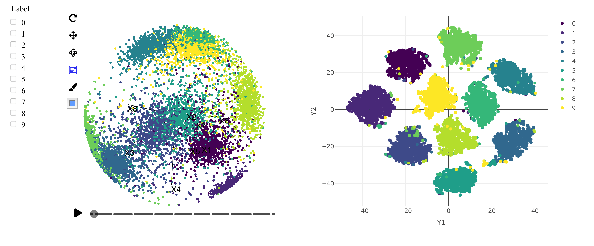
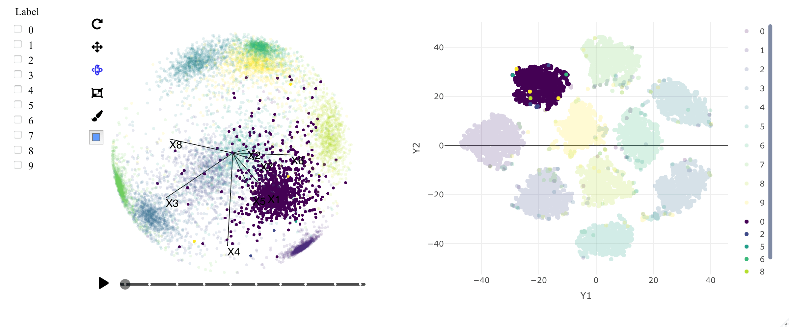
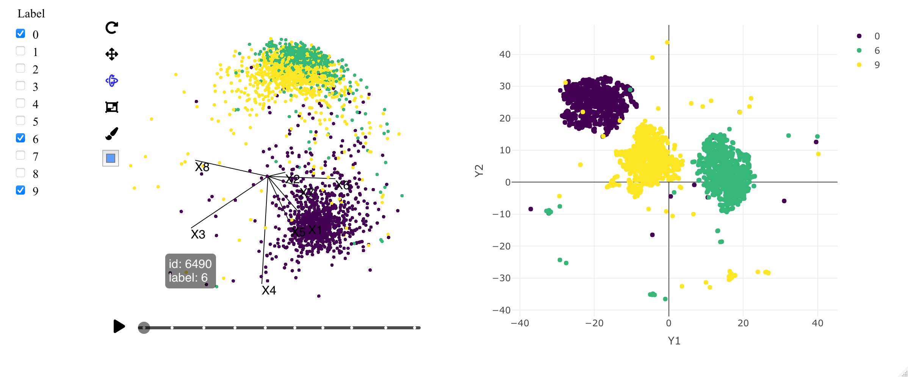

A common task when analysing wide or sparse data sets is to generate embeddings; finding a lower dimensional representation of high dimensional data, placing similar objects close together and dissimilar objects far apart in the embedding space. This is especially useful when dealing with text or image data.

An example of this is the algorithm used for facial recognition in FaceNet (@schroff2015facenet). A neural network is trained which maps a vector representation of images of faces to a lower dimensional space. The network minimises the distance between examples of the same class and maximises distances between examples from different classes in the output space. The result is that the euclidean distance between faces can be used as a metric for face similarity, so an unknown face can be classified as belonging to a specific individual if the distance between the unknown face and one or more known faces is small.

The datasets `mnist_embeddings_8d` and `mnist_embeddings_32d` in the \pkg{detourr} package are embeddings trained using a similar algorithm to FaceNet but using the MNIST (@lecun1998mnist) handwritten digits dataset. The training set consists of 60,000 28x28 pixel training images and in the following examples we visualise the test set containing 10,000 examples.

## Scatterplot display

```{r, eval=FALSE}
set.seed(123)
library(detourr)
data(mnist_embeddings_8d)
detour(mnist_embeddings_8d, tour_aes(
    projection = starts_with("X"), color = label,
    label = c(id, label)
)) |>
    tour_path(grand_tour(2)) |>
    show_scatter()
```

```{r mnist-8d-scatter, out.width="49%", fig.ncol=2, fig.show="hold", fig.align="center", fig.cap="Selected frames from the 8-dimensional MNIST embeddings data using show\\_scatter() as the display method. The colour corresponds to the handwritten digit 0, 1, ..., 9. Despite the large number of data points, the animation of the tour is smooth and interactions are responsive."}
knitr::include_graphics(
    c(
        "figures/mnist/mnist-8d-scatter-1.png",
        "figures/mnist/mnist-8d-scatter-2.png",
        "figures/mnist/mnist-8d-scatter-label.png",
        "figures/mnist/mnist-8d-scatter-timeline.png"
    )
)
```

Using the core `show_scatter()` function to display a `grand_tour()` tour path in Figure \@ref(fig:mnist-8d-scatter) we can see quite good separation between the clusters corresponding to each of the 10 digits. Despite the tour animation consisting of 10,000 data points, the animation runs smoothly at 30 FPS in Microsoft Edge on a Macbook Pro 2019. Running a performance profile of the animation indicates the CPU is idle 90% of the time while the animation is playing. The remaining time is divided between scripting (6%, including linear algebra operations), rendering (1.4%), painting (0.8%) and system (1.8%). When running the same tour on the `mnist_embeddings_32d` dataset, the animation is still quite smooth and CPU is 80% idle. 

In the lower left of Figure \@ref(fig:mnist-8d-scatter) is an example of the `label` aesthetic at work. This allows the user to identify which group a set of points belongs to, as well as the precise ID of any outliers that may require further investigation. 

## Sage and Slice display methods

```{r, eval=FALSE}
set.seed(123)
library(detourr)
data(mnist_embeddings_8d)
detour(mnist_embeddings_8d, tour_aes(
    projection = starts_with("X"), color = label,
    label = c(id, label)
)) |>
    tour_path(grand_tour(2)) |>
    show_sage()
```

```{r mnist-8d-sage, out.width="49%", fig.ncol=3, fig.show="hold", fig.align="center", fig.cap="Selected frames from the 8-dimensional MNIST embeddings data using show\\_sage() as the display method with a 2D grand tour path. The sage display shows the data points near the surface of the unit ball, which is due to the L2 normalisation of the original embeddings. This structure was not clear in the standard scatter display but is preserved with the sage display."}

knitr::include_graphics(
    c(
        "figures/mnist/mnist-8d-sage-1.png",
        "figures/mnist/mnist-8d-sage-2.png"
    )
)
```

```{r, eval=FALSE}
set.seed(123)
library(detourr)
data(mnist_embeddings_8d)
detour(mnist_embeddings_32d, tour_aes(
    projection = starts_with("X"), color = label,
    label = c(id, label)
)) |>
    tour_path(grand_tour(3), fps = 5, aps = 0.2) |>
    show_slice(slice_relative_volume = 0.02)
```

The `show_scatter()` display method gives the viewer a fairly good sense of the data set, but there is some structure that may not be obvious. The embeddings in the `mnist_embeddings_8d` and `mnist_embeddings_32d` datasets are L2 normalised, so the points sit on the surface of a unit ball in the high-dimensional space. To reveal this structure, we can use the _sage_ (@laa2021burning) or _slice_ (@laa2020slice) display methods, which are implemented as `show_sage()` and `show_slice()` respectively.

The _sage_ display scales points outwards based on their radius so that the relative volume of the circle or sphere in the projected space is the same as in the original space. In the example shown in Figure \@ref(fig:mnist-8d-sage), the `show_sage()` display method is used. The effect is that the projected points tend sit much closer to the surface of the unit circle, giving a much clearer view of the ball-like structure of the original data.

```{r eval=FALSE}
set.seed(123)
library(detourr)
data(mnist_embeddings_8d)
detour(mnist_embeddings_8d, tour_aes(
    projection = starts_with("X"), color = label,
    label = c(id, label)
)) |>
    tour_path(grand_tour(2)) |>
    show_slice()
```

```{r mnist-8d-slice, out.width="49%", fig.ncol=3, fig.show="hold", fig.align="center", fig.cap="Selected frames of the 8-dimensional MNIST embeddings data using show\\_slice() as the display method. The slice display makes the hollowness of this data apparent."}
knitr::include_graphics(
    c(
        "figures/mnist/mnist-8d-slice-1.png",
        "figures/mnist/mnist-8d-slice-2.png"
    )
)
```


The _slice_ display highlights points based on their proximity to the projection plane. Points that are close to the projection plane are highlighted and those further away are faded out by making them transparent. In the case of the MNIST embedding data in Figure \@ref(fig:mnist-8d-slice) the ball structure of the data manifests as a clear circular void in the middle of the plot, with points highlighted only towards the edges. 

## Linked selection

Plot interactions such as selection and filtering can be helpful for identifying and exploring outliers, clusters, and other interesting features in a dataset. These are enhanced even further when multiple visuals are linked, and selections and filters are applied to all linked visuals. In this example, we compare the tour animation with the result of a T-SNE (@van2008tsne) which was performed using the excellent \CRANpkg{Rtsne} R package (@van2015rtsne) and displayed using \pkg{plotly}. The visuals are linked using the R package \pkg{crosstalk} and a set of filter checkboxes is also added. 

```{r linked-tsne-full, out.width=ifelse(knitr::is_html_output(), "100%", "\\textwidth"), fig.cap="Linked visuals of the tour using detourr (left) compared to a T-SNE dimension reduction (right)"}

```

Figure \@ref(fig:linked-tsne-full) shows the linked visuals in their initial state with no filtering applied. We can then use the selection tool in either of the visuals to highlight points, and see the highlighting applied to both visuals as in Figure \@ref(fig:linked-tsne-selection).

```{r linked-tsne-selection, out.width=ifelse(knitr::is_html_output(), "100%", "\\textwidth"), fig.cap="Linked visuals with selection applied. Points can be selected in either visual via click-and-drag and the selection will be reflected in both."}

```

Figure \@ref(fig:linked-tsne-filter) shows the result of filtering the visuals using the filter checkboxes on the left. In the filtered visual, outlying points are much easier to see, and they can be easily investigated using tooltips. 

```{r linked-tsne-filter, out.width=ifelse(knitr::is_html_output(), "100%", "\\textwidth"), fig.cap="Linked visuals with filtering applied. Viewing each digit individually makes outlying points much more apparent, and those points can be identified using tooltips."}

```

\pagebreak

The code used to produce figures \@ref(fig:linked-tsne-full), \@ref(fig:linked-tsne-selection), and \@ref(fig:linked-tsne-filter) is shown below. Here each plot is created using a \pkg{crosstalk} `SharedData` object in place of a standard data frame, and linked together using the `bscols` function:

```{r, eval=FALSE, echo=TRUE}
library(crosstalk)
library(Rtsne)
library(plotly)

data(mnist_embeddings_8d)

ts <- select(mnist_embeddings_8d, starts_with("X")) |>
    Rtsne(num_threads = 4)
Y <- as_tibble(ts$Y)
names(Y) <- c("Y1", "Y2")

plot_df <- bind_cols(mnist_embeddings_8d, Y)
shared_mnist <- SharedData$new(plot_df)

detour_plot <- detour(shared_mnist, tour_aes(
    projection = starts_with("X"), color = label,
    label = c(id, label),
)) |>
    tour_path(grand_tour(2)) |>
    show_sage(width = "100%", height = "450px")

tsne_plot <- plot_ly(shared_mnist,
    x = ~Y1,
    y = ~Y2,
    text = paste0("Label: ", plot_df$label, "<br>", "ID: ", plot_df$id),
    color = ~label,
    height = 450,
    colors = viridisLite::viridis(10)
) |>
    highlight(on = "plotly_selected", off = "plotly_doubleclick") |>
    add_trace(type = "scatter", mode = "markers")

bscols(
    list(
        filter_checkbox("label", "Label", shared_mnist, ~label)
    ),
    detour_plot, tsne_plot,
    widths = c(1, 5, 6)
)
```