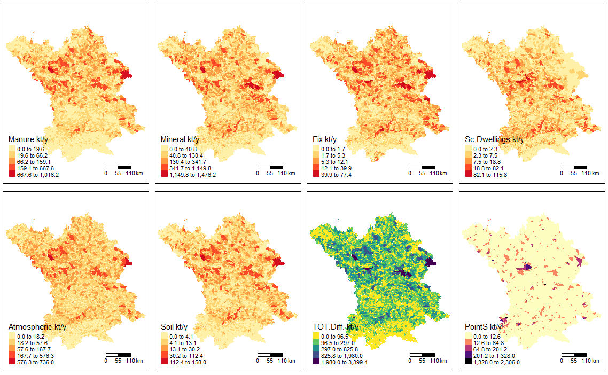
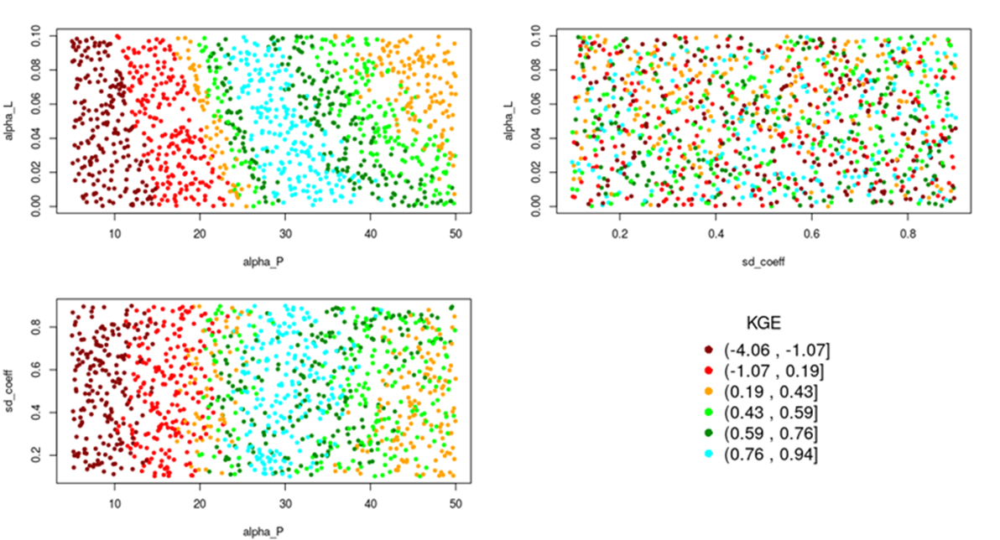
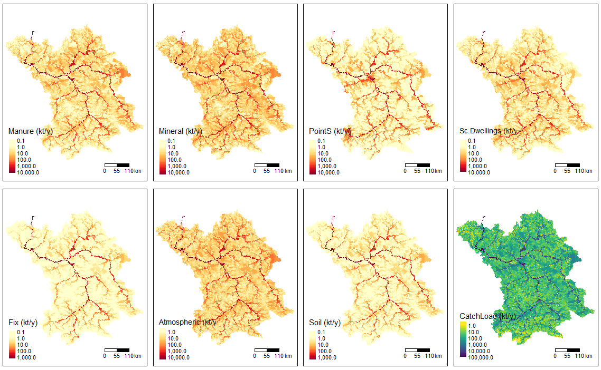

```{r setup, include=FALSE}
knitr::opts_chunk$set(echo = FALSE, warning = FALSE, message = FALSE, fig.pos = 'H')
library(GREENeR)
library(dplyr)
library(kableExtra)
```

# Introduction

Nitrogen and phosphorus are key nutrients that heavily impact aquatic ecosystems. Detecting primary sources of nutrient pollution and their downstream spread, alongside assessing achievable reductions through restoration policies, are crucial for effective natural resource management. They aid in identifying priority intervention areas and planning actions to restore the ecological balance of receiving waters.

Modelling tools can be useful to assess the impacts of future scenarios, policy measures, and climate changes at the regional and continental scale [@arheimer2012climate; @bartosova2019future; @BEUSEN2022102426; @bouraoui2014scenario; @ludwig2010water; @seitzinger2005sources], and to check the coherence of different policy targets, for instance between water and agricultural policies. The assessment of policy scenarios requires a flexible and spatially detailed analysis to account for climatic, hydrological, and socio-economic gradients [@grizzetti2021eu].

Several types of models can be applied to predict the transport of nutrients in river basins @fu2019review. Among them, statistical or conceptual models have the advantage of being readily applied in large watersheds. These model rely on calibration of few parameters for establishing links between emissions at sources and fate in the stream network. They take full advantage of nutrient emissions and concentrations data at monitoring stations, which are now accessible with increasing spatial and temporal resolution.

A classic example of river basin conceptual model is SPARROW [@smith1997regional; @schwarz2006sparrow], which is widely applied in the U.S. to assess water quality over large regions. SPARROW has inspired the Geospatial Regression Equation for European Nutrient (GREEN) losses model [@grizzetti2005statistical; @grizzetti2012changes; @grizzetti2021eu] which is adapted to European conditions. GREEN has been used for assessing the nutrient loads to the European seas [@grizzetti2012changes; @grizzetti2021eu], nitrogen retention in European freshwaters [@grizzetti2012changes; @la2017physical], and for policy scenario analysis [@la2017physical; @bouraoui2014scenario; @leip2015impacts; @malago2019modelling; @grizzetti2021eu]. Despite their usefulness, this type of river basin models are seldom compiled as dedicated R packages, for example SPARROW has some scripts available to process information for and analysis of models results in the R environment.

The GREEN model application comprises several key steps, including data extraction and organization, data harmonization and integration, examination and validation of input data sets, model calibration and parameter selection, model run, and result visualization. All of these features are now integrated into an R package (\CRANpkg{GREENeR}) that comprises functions to streamline the process, evaluate and visualize all the steps, thus strengthening the robustness of model application.

## About water surface nutrients estimation with GREEN

GREEN [@grizzetti2005statistical; @grizzetti2012changes; @grizzetti2008assessing; @grizzetti2021eu] is a conceptual model to assess total nitrogen TN and total phosphorous TP from a region of interest (usually a river basin), accounting for both diffuse and point sources. The package allows the analysis of different scenarios of nutrient input in the region of interest, where "scenario" indicates a combination of annual time-series of inputs, such as nitrogen or phosphorus and the topological structure of the region. The model comprises several nutrient sources and pathways:

1.  agricultural diffuse sources include nutrients from mineral fertilisers and manure application, nitrogen crop and soil fixation. These sources undergo retention in the land phase (basin retention that account for e.g. crop uptake and volatilization losses) before reaching the stream;
2.  other diffuse emissions, such as from scattered dwellings (i.e., isolated houses and small agglomerations that are not connected to sewerage systems), and atmospheric nitrogen deposition (for nitrogen module) or background losses (for phosphorus module), are also reduced, e.g. due to soil processes, before reaching the stream network;
3.  point sources consist of urban and industrial wastewater discharges that are discharged into surface waters directly.

\noindent Once in the river network, all nutrient loads are reduced by in-stream retention in rivers and lakes.

Basin retention of agriculture sources is a decay function proportional to the inverse of the total annual precipitation in the catchment. Conversely, river retention is a decay function proportional to the river length, considered as a proxy for water residence time. Finally, lake retention is simulated as a function of the lakes residence time and average depth.

The basin is divided into spatial subunits (called catchments), with a given area, a river reach, an inlet node, and an outlet node. The catchments are topologically connected from the headwaters to the outlet in a cascading sequence. The sequence of nutrient load accumulation through the stream network is defined by Shreve's order [@shreve1966statistical]. Nutrient input from the different sources, basin and river retention are simulated in each catchment and routed through the river network. For each catchment $i$ in the basin, the GREEN nutrient load $L_i$ is estimated by the general equation:

```{=tex}
\begin{equation}
  L_{i,y} = (1-Lret_i) \cdot (DSA_{i,y} \cdot (1-Bret_{i,y} )+ DSB_{i,y} + PS_{i,y} +U_{i,y} ) \cdot (1-Rret_i) 
(\#eq:green-nutrient-load)
\end{equation}
```
\noindent where $L_{i,y}$ is the nutrient load at the catchment outlet-node (ton/yr) in $y$ year; and the other variables represent different sources and sinks of nutrients.

Sources of nutrients are:

-   $DSA_{i,y}$. Annual nutrient diffuse sources on agricultural land in the catchment (ton/yr): mineral and manure fertilization, atmospheric nitrogen deposition, plant and soil fixation for TN; mineral and manure fertilization, and background losses for TP.

-   $DSB_{i,y}$. Annual nutrient diffuse sources in the catchment related with scatter dwellings and atmospheric nitrogen deposition on non-agricultural land for TN ($DSB_{i,y} = 0.38 \cdot FF_{i,y} \cdot AtmN_{i,y} + sd_{coeff} \cdot SdN_{i,y}$, where $FF_{i,y}$ is the fraction of non-agricultural land cover in the catchment, and $AtmN_{i,y}$ is the annual atmospheric nitrogen deposition on the catchment (ton/yr)); nutrient diffuse sources in the catchment related with scatter dwellings and background losses on non-agricultural areas for TP ($DSB_{i,y} = sd_{coeff} \cdot SdP_{i,y})$.

-   $PS_{i,y}$. Nutrient point sources in the catchment (ton/yr).

-   $U_{i,y}$. Nutrient load from upstream catchments (ton/yr).

\noindent Sinks of nutrients are:

-   $Lret_i$ denotes the lake retention (fraction) of the $i$ catchment. $Lret$ is currently defined according to @kronvang2004nutrient, but limited to a $10\%$ maximum reduction:

```{=tex}
\begin{equation}
    Lret = \max\left(0.1, 1 - \frac{1}{1 + (dref / z) \cdot RT}  \right)
    (\#eq:lake-retention)
  \end{equation}
```
\noindent where $z$ represents the average lake depth (m); $RT$ is the hydraulic residence time (yr); and $dref$ denotes a nutrient-related coefficient ($dref = 7.3$ for TN and $dref = 26$ for TP).

-   $Bret_{i,y}$ is the fraction of basin retention of the $i$ catchment in $y$ year:

```{=tex}
\begin{equation}
    Bret_{i,y} = 1 - \exp(-alpha_P \cdot NrmInvRain_{i,y})
    (\#eq:basin-retention)
  \end{equation}
```
\noindent where $NrmInvRain_{i,y}$ is the inverse of annual precipitation (mm) of the $i$ catchment in $y$ year, normalized by its maximum [@frank1994data]. To keep basin retention coefficients comparable across regions, the minimum precipitation $minPrec$ is set to $50$ mm/y, and thus $NrmInvRain_{i,y}$ is defined as

```{=tex}
\begin{equation*}
    NrmInvRain_{i,y} = \frac{1 / \max(50,  precipitation_{i,y})}{(1 / minPrec)} 
  \end{equation*}
```
-   $Rret_i$ is the fraction of river retention of the $i$ catchment:

```{=tex}
\begin{equation}
    Rret_i = 1 - \exp(-alpha_L \cdot NrmLengthKm_i) 
    (\#eq:river-retention)
  \end{equation}
```
\noindent where $NrmLengthKm_i$ is the length (km) of the catchment reach, normalized by the maximum in the dataset:

```{=tex}
\begin{equation*}
    NrmLengthKm_i = \frac{\textrm{catchment length } i \textrm{ reach, in km}}{\max(\textrm{Reach length in the region, in km})}
  \end{equation*}
```
\noindent Since the maximum reach length depends on the region and its subdivision of network reaches, the calibrated coefficient $alpha_L$ cannot be compared across regions that adopt different discretization. Note that basin retention varies from year to year according to annual precipitation, whereas the fraction of river and lake retention for a given catchment is constant in time.

Equation \@ref(eq:green-nutrient-load) is applied sequentially from the most upstream nodes to the basin outlet. The model parameters are:

1.  the basin retention coefficient ($alpha_P$), which together with annual precipitation regulates nutrient retention of diffuse agricultural sources (Equation \@ref(eq:basin-retention));
2.  the river retention coefficient ($alpha_L$: Equation \@ref(eq:river-retention)), which regulates the river retention per river km.
3.  the fraction of domestic diffuse sources that reaches the stream network ($sd_{coeff}$).

# About the \pkg{GREENeR} package

## Package organization

\noindent This work presents a new efficient and enhanced implementation of the model GREEN developed as an R package named \pkg{GREENeR}. \pkg{GREENeR} is developed in the R statistical software and provides tools and methods for applying GREEN to an area of interest and assessing annual time series of nutrient loads in a river network and at the basin outlet, plus contributions of nutrient sources to these loads. Some of the key features of the package comprise: a) functions for the creation of scenarios from data sources; b) computational efficiency; c) parallel-capable ; d) an extended suite of fine tuning options to control model calibration; e) built-in parameter sensitivity analysis; and f) functions to perform customised post-process analyses.

The functions of \pkg{GREENeR} package are arranged in three groups: i) functions to perform graphical summaries of model inputs; ii) functions to perform model parameters calibration and sensitivity analysis; iii) functions to compute, analyze and visualize through graphs and maps the model outputs, i.e. total loads and contributions by source. The package supports parallel processing, which helps reduce the computational load in handling large basins.

The time-series can represent either historic (current or past) conditions that can be associated to observations for model calibration, or hypothetical conditions foreseen under theoretical changes (e.g. to forecast results of nutrient management plans, or under climatic change).

A scenario contains:

1.  The geospatial geometry of the catchments of the region, which currently is defined according to the Catchment Characterisation and Modelling Database for European Rivers v2 (CCM2) [@de2007rivers].

2.  The annual time series (1990-2018) of nutrient inputs per catchment.

3.  Additional catchment information (annual precipitation, annual forest fraction, lake retention, reach length).

4.  Observed total load (TN or TP) from monitoring stations.

\noindent Two historical scenarios, one for TN and one for TP, of the Lay basin (France) are provided with the \pkg{GREENeR} package. The Lay basin has an area of $1971$ km$^2$, and is divided into $189$ CCM2 catchments. The mean catchment area is $10.4$ km$^2$. Nutrient observations comprised $22$ TN entries from six monitoring stations and $58$ TP data entries from eight monitoring stations (data from WISE Waterbase [@EEA_2019]).

Further, in this article we present examples drawn for the TN historic scenario of the transboundary Vistula (Wisla) river basin, one of the largest river basins of Europe. The Vistula scenario comprises $15465$ CCM2 catchments that compose the $193.894$ km$^2$ river basin, TN inputs for 1990-2018, as well as 1364 observed TN loads from 412 monitoring stations. The TN input dataset is part of the larger dataset created to assess nutrient concentration in the European freshwaters [@vigiak2023recent].

## Key functions in the GREENeR package

A brief overview of the package and its main functions is given in Figure \@ref(fig:schematic-diagram-GREENeR).

```{r schematic-diagram-GREENeR, out.width = "90%", out.height = "60%", fig.cap = "Schematic diagram of the procedure of GREENeR, including functions, data inputs and outputs, to estimate the nutrient loads. The green boxes represent data objects and the blue boxes represent the functions."}
knitr::include_graphics("figures/fig1.png")
```

The key functions included in the package are:

-   `read_geometry()`: imports the geospatial vector format (shapefile or ESRI shapefile) with the spatial information of the catchments in R.

-   `read_NSdata()`: imports the annual time series of nutrient inputs per catchment and type of nutrient source (manure, mineral fertilization, point sources, scatter dwellings), plus the forest fraction, and the observed annual nutrient loads from monitoring station data. The original data are stored in several comma-separated tables (CSV files).

-   `input_maps()`: creates a map showing the mean nutrient load input by source.

-   `input_plot()`: creates either a grouped barplot representing the average input load by source for the whole basin, or three density plots showing the distribution of nutrient sources.

-   `input_Tserie()`: creates a time series plot showing basin inputs by source.

-   `shreve()`: returns the Shreve order of the catchments, a useful indicator of stream size, discharge, and drainage area [@strahler1957quantitative] calculated based on the sum of the orders of up of upstream tributaries [@shreve1966statistical]. Commercial GIS software usually provides a Shreve calculation function, but in other software, it is harder to find. In GREEN, the Shreve's order defines the cascade of upstream-downstream catchments.

-   `calib_green()`: conducts sensitivity analysis of model calibration utilizing a Latin Hypercube Sampling (LHS) scheme [@manache2004sensitivity] for three model parameters. It evaluates model performance by calculating several "goodness-of-fit" (GoF) metrics [@refsgaard2004modelling] against available observations during the specified simulation period (years).

-   `select_params()`: extracts the best parameter set according to a selected GoF metric from the object generated by the calibration function, `calib_green()`.

-   `calib_boxplot()`: creates a figure of boxplots that show the relationships between the best parameter sets determined by the specific GoF metric in each boxplot title, and six other commonly used hydrological metrics [@althoff2021goodness; @zambrano2014hydrogof]. In the lower panel, the figure also highlights the distribution of model parameters; the value of the best parameter set is marked as a red dot in each boxplot.

-   `region_nut_balance()`: runs the GREEN model with the selected parameter set, and returns the mean annual mass balance of nutrient fluxes for the whole simulation period of the region. The results of this function can be visualized using a Sankey diagram via the `N4_sankey()` function.

-   `green()`: runs the GREEN model with the selected parameter set and returns nutrient load time series for the simulation period. It generates less information than the `green_shares()` function, but its execution is faster, so it is used as a function for calibration iterations and is embedded in the `calib_green()` function.

-   `green_shares()`: runs the GREEN model with the selected parameter set and returns time series of nutrient loads and the contributions of each nutrient source in the simulation period. The results of the model can be examined by `nutrient_tserie()` and `nutrient_maps()` functions.

-   `scatter_plot()`: generates dot plots correlating parameters realizations in the calibration data with GoF metric, visualizing the impact of each parameter on model outcomes. The plot vary based on selected GoF metric from `green_calib()` function.

-   `simobs_annual_plot()`: generates scatter plots comparing model load predictions (PredictLoad) with observations (ObsLoad) for each year of the stimulation period.

## Input data requirements

\pkg{GREENeR} requires information on the nutrient inputs, the topology, and the geospatial geometry of the region of interest. The spatio-temporal input data must include all nutrient source fields, and differs in the two nutrient scenarios (TN or TP). In the case of TN (e.g. Figure \@ref(fig:maps-TN)), fields are (Equation \@ref(eq:appendix1-1) in [Appendix 1]):

-   $Atmospheric$: Annual amount of atmospheric nitrogen deposition (ton/yr).

-   $Mineral$: Annual amount of nitrogen from mineral fertilisers (ton/yr).

-   $Manure$: Annual amount of nitrogen in manure fertilisers (ton/yr).

-   $Fix$: Annual amount of nitrogen fixation by leguminous crops and fodder (ton/yr).

-   $Soil$: Annual amount of nitrogen fixation in soils (ton/yr).

-   $Sc. Dwellings$: Nitrogen input from scattered dwellings (ton/yr).

-   $PointS$: Nitrogen input from point sources (ton/yr).

```{r maps-TN, out.width = "100%", out.height = "35%", fig.cap = "Maps showing the mean annual TN inputs in the Vistula river basin in 1990-2018. The figure was generated with GREENeR input\\_maps() function. TOT.Diff = sum of diffuse inputs.", fig.alt="Maps showing the average TN inputs in the Vistula river basin in 1990-2018. The figure was generated with GREENeR input\\_maps() function. Tot.Diff is the sum of diffuse inputs."}

```

\noindent In the case of TP, fields are (Equation \@ref(eq:appendix1-2) in [Appendix 1]):

-   $Background$: annual amount of phosphorus from background losses (ton/yr).

-   $Mineral$: annual amount of phosphorus from mineral fertilisers (ton/yr).

-   $Manure$: annual amount of phosphorus in manure fertilisers (ton/yr).

-   $Sc. Dwellings$: phosphorus input from scattered dwellings (ton/yr).

-   $PointS$: phosphorus input from point sources (ton/yr).

\noindent European datasets for 1990-2018 generated to assess historic and current nutrient fluxes [@vigiak2023recent] are available upon request. The model and the package are compatible with an external dataset and can be customized with local information as long as the data structure is respected.

In both nutrient cases, \pkg{GREENeR} needs additional annual catchment information:

-   $ForestFraction$: annual fraction (0-1) of non-agricultural land cover area in the catchment ($FF$ in Equations \@ref(eq:appendix1-1) and \@ref(eq:appendix1-2), in the [Appendix 1]).

-   $Rain$: annual precipitation (mm, Equation \@ref(eq:basin-retention)).

-   $LakeFrRet$: lake retention fraction (0-1) ($Lret$ in Equation \@ref(eq:green-nutrient-load), in the [Appendix 1]). Note, this differs for TN or TP scenarios (Equation \@ref(eq:lake-retention)). At European scale, average lake depth and hydraulic residence time can be obtained from HydroLAKES database (<https://www.hydrosheds.org/pages/hydrolakes>, @messager2016estimating).

-   Length: is the length (km) of the catchment reach (Equation \@ref(eq:river-retention)).

\noindent The catchment topology outlines the hydrological network configuration within the region. Each catchment must have a unique numerical identifier (HydroID)), to establish the network structure via a source HydroID and destination HydroID table. It is important to note that any outlet of the basin will be given as destination HydroID identifier "-1". Complementing the topology of the hydrologic network, the length of catchment reach should also be included (Equation \@ref(eq:river-retention)).

Finally, in order to calibrate the model, it is necessary to have some observed nutrient loads from monitoring stations associated to any catchment of the region. Ultimately, the quality, size, and spatial distribution of observed loads determine the robustness of the calibration process. In Europe, a large dataset of annual concentrations is publicly available [WISE Waterbase, @EEA_2019], but annual flow must be derived from other sources [@grizzetti2021eu; @vigiak2023recent].

## Performance and memory use

The \pkg{GREENeR} package performance and memory usage depends on the size of the region (number of catchments) and the number of years of the simulation. As a reference, the Danube basin (i.e. the largest European basin, with $138013$ catchments) TN dataset for 1990-2018 requires approximately $389$ Mb of memory to store the annual data. Table \@ref(tab:computational-requirements) shows the memory occupied by the scenarios for 6 European basins. In addition, it shows the computation times required in the execution of some key functions of the package. All executions were conducted on two computer configurations:

-   CPU1: Desktop running window 10 with one Intel(R) Core i5-8259U CPU (4 cores, two threads per core) CPU at 2.30 GHz and 16 GB of RAM memory

-   CPU2: Workstation running Linux with one AMD EPYC 7352 (24 cores, two threads per core) CPU at 2.3 GHz and 128 GB of RAM memory

\noindent The time required for the execution of the different functions increases linearly with the number of catchments (or Shreve order) of the region (Table \@ref(tab:computational-requirements)). The `calib_green()` function is the most computationally demanding. However, the parallel implementation of this function drastically reduces the time required for this process. Calibration can be carried out in about 6 hours for practical implementation in large basins.

```{=tex}
\begin{table}[htbp]\footnotesize
\caption{Computational requirements to run some \pkg{GREENeR} functions in six European basins scenarios of 29 years. The columns Shreve order, Area and Number of catchments characterize the size of each basin. Mem is the amount of memory occupied by the GREEN model scenario generated by \pkg{GREENeR} package. The \code{green()}, \code{green\_shares()} and \code{calib\_green()} columns show the computation time required to execute the corresponding \pkg{GREENeR} functions for each scenarios under CPU1 and CPU2 computer configurations. All runs of \code{calib\_green()} have been performed with 200 iterations. The reported times are the average of 5 runs of each process.}
\label{tab:computational-requirements}
\begin{tabular}{@{}lrrrrrrrrrr@{}}
\toprule
\begin{tabular}[c]{@{}l@{}}Basin\\ name\end{tabular} & \multicolumn{1}{l}{\begin{tabular}[c]{@{}l@{}}Shreve\\ order\end{tabular}} & \multicolumn{1}{l}{\begin{tabular}[c]{@{}l@{}}Area\\ ($\textrm{Km}^2$)\end{tabular}} & \multicolumn{1}{l}{\begin{tabular}[c]{@{}l@{}}Number of\\ catchments\end{tabular}} & \multicolumn{1}{l}{\begin{tabular}[c]{@{}l@{}}Mem\\ (MB)\end{tabular}} & \multicolumn{2}{c}{\begin{tabular}[c]{@{}c@{}}\code{green()}\\ (sec)\end{tabular}} & \multicolumn{2}{c}{\begin{tabular}[c]{@{}c@{}}\code{green\_shares()}\\ (sec)\end{tabular}} & \multicolumn{2}{c}{\begin{tabular}[c]{@{}c@{}}\code{calib\_green()}\\ (sec)\end{tabular}} \\ \midrule
                                                     & \multicolumn{1}{l}{}                                                       & \multicolumn{1}{l}{}                                                     & \multicolumn{1}{l}{}                                                               & \multicolumn{1}{l}{}                                                   & \multicolumn{1}{c}{CPU1}             & \multicolumn{1}{c}{CPU2}             & \multicolumn{1}{c}{CPU1}                 & \multicolumn{1}{c}{CPU2}                 & \multicolumn{1}{c}{CPU1}                 & \multicolumn{1}{c}{CPU2}                \\ \cmidrule(l){6-11} 
Lay                                                  & 95                                                                         & 1971                                                                     & 189                                                                                & 0.5                                                                    & 6                                    & 4                                    & 15                                       & 12                                       & 316                                      & 31                                      \\
Mi\~no                                                 & 2803                                                                       & 16985                                                                    & 5572                                                                               & 15.7                                                                   & 57                                   & 45                                   & 147                                      & 90                                       & 4110                                     & 394                                     \\
Seine                                                & 2902                                                                       & 75989                                                                    & 5793                                                                               & 16.3                                                                   & 77                                   & 55                                   & 177                                      & 106                                      & 6320                                     & 452                                     \\
Ebro                                                 & 9351                                                                       & 85611                                                                    & 18568                                                                              & 52.3                                                                   & 160                                  & 123                                  & 425                                      & 224                                      & 10876                                    & 995                                     \\
Vistula                                              & 7757                                                                       & 193894                                                                   & 15465                                                                              & 43.6                                                                   & 132                                  & 100                                  & 314                                      & 187                                      & 9004                                     & 814                                     \\
Danube                                               & 69505                                                                      & 802032                                                                   & 138013                                                                             & 388.6                                                                  & 1120                                 & 766                                  & 2855                                     & 1108                                     & 94682                                    & 5638                                    \\ \bottomrule
\end{tabular}
\end{table}
```
```{r computational-requirements, eval=knitr::is_html_output()}
  
knitr::opts_chunk$set(echo = FALSE, warning = FALSE, message = FALSE)
cr <- data.frame(
  basinName = c("Lay", "Miño", "Seine", "Ebro", "Vistula", "Danube"), 
  shereveOrder = c(95, 2803, 2902, 9351, 7757, 69505),
  area = c(1971, 16985, 75989, 85611, 193894, 802032),
  numerCatchments = c(189, 5572, 5793, 18568, 15465, 138013), 
  mem = c(0.5, 15.7, 16.3, 52.3, 43.6, 388.6), 
  greenCPU1 = c(6, 57, 77, 160, 132, 1120),
  greenCPU2 = c(4, 45, 55, 123, 100, 766), 
  greenSharesCPU1 = c(15, 147, 177, 425, 314, 2855),
  greenSharesCPU2 = c(12, 90, 106, 224, 187, 1108), 
  calibGreenCPU1 = c(316, 4110, 6320, 10876, 9004, 94682), 
  calibGreenCPU2 = c(31, 394, 452, 995, 814, 5638)
  )

cap = "Computational requirements to run some \\pkg{GREENeR} functions in six European basins scenarios of 29 years. The columns Shreve order, Area and Number of catchments characterize the size of each basin. Mem is the amount of memory occupied by the GREEN model scenario generated by \\pkg{GREENeR} package. The green(), green_shares() and calib_green() columns show the computation time required to execute the corresponding \\pkg{GREENeR} functions for each scenarios under two computer configurations, CPU1, CPU2 (explanation in the text). All runs of calib_green() have been performed with 200 iterations. The reported time are the average of 5 runs of each process."


kbl(cr, booktabs = T, format = "html",
    caption = cap,
    col.names = c("Basin\nname", "Shreve\norder", "Area\nkm$^2$", "Number of\ncatchments", "Mem\nMB",
                  "CPU1\nsec", "CPU2\nsec","CPU1\nsec", "CPU2\nsec","CPU1\nsec", "CPU2\nsec" )) %>%
  kable_styling() %>%
  add_header_above(c(" " = 5, "green()" = 2, "green_shares()" = 2, "calib_green()" = 2))
```

# Estimating nutrient loads using the \pkg{GREENeR} package

The entire procedure is summarized on Figure \@ref(fig:schematic-diagram-GREENeR). Once the input data have been uploaded, the region scenario (Nutrient data and Catch data) is generated. The `calib_green()` function explores the parameter set ranges with LHC scheme, calculating GoF of parameter sets. Sensitivity analysis of its results is conducted to determine the best parameter set. Finally, the `green_shares()` function is used to estimate the nutrient loads and source apportionment (i.e. contribution to loads by source), per year and per catchment.

## Scenario preparation

Assembling input data for running the GREEN model is time consuming. To facilitate the process, the `read_NSdata()` function assembles and organises annual information to generate a list of two objects: `Nutrient Time Series Data Object` and `Catch Data Object` of GREEN scenario. It needs four CSV files with specific data, namely:

-   Time-series of annual nutrient inputs per catchment.

-   Time-series of annual observed loads at monitoring stations.

-   Basin topology and lake properties.

-   Other: precipitation, forest fraction, reach length.

\noindent The spatial identifiers (HydroID) and temporal (year) units must be coherent in all the files. Besides organizing the input data, the `read_NSdata()` function also calculates the Shreve order of each catchment, normalises the precipitation (calculating $NrmInvRain_{i,y}$) and the reach length ($NrmLengthKm_i$).

```{r read-NSdata-function, eval=FALSE, warning=FALSE, message=FALSE, error=FALSE, echo=TRUE}
csv_path <- "data/csv/"
scen <- read_NSdata(csv_path,"nutrients.csv","monitoring.csv", "forestFr.csv",
                    "precipitation.csv","topology.csv", "lakeProperties.csv",
                    "length.csv")
nutrient <- scen[[1]]
catch    <- scen[[2]]
```

\noindent The `shreve()` function can calculate the Shreve order independently based on the topology of the basin:

```{r shreve-function, echo=TRUE, eval=FALSE}
shreve_order <- shreve(catch) 
```

\noindent Finally, the geospatial geometry of the catchments should be uploaded to enable the visualisation functionalities in map form. The `read_geometry()` function loads the geometry information file, i.e. a geospatial vector with the geometry of the catchment region:

```{r read_geometry-function, echo=TRUE, eval=FALSE}
geometry <- read_geometry(file = "data/shapes/Wisla.shp")
```

\noindent The geo-reference information, geometry and attributes of the spatial entities must be in a shapefile format (.shp), editable with ArcGIS or similar software. The identifiers of each catchment (HydroID) must be consistent with those in the CSV files of the scenario dataset.

Once the scenario has been generated, the library includes functions to examine the nutrient sources in a basin, and explore their distribution over time or in space. The `input_plot()` function provides annual average nutrient loads for the whole period and density plots of nutrient loads. The `input_Tserie()` function allows to examine the temporal evolution of the inputs, whereas the `input_maps()` function generates maps of nutrient inputs distribution in the basin (Figure \@ref(fig:maps-TN)).

```{r input_maps-function, echo=TRUE, eval=FALSE}
input_maps(nutient, catch, geometry, "Wisla", "gr1")
```

## Calibration procedure and sensitivity analysis

The calibration process is essential to find a suitable set of parameters for the model. In \pkg{GREENeR} package, the core function `calib_green()` enables to run a parameter sensitivity analysis and concurrently assessing the model performance according to several GoF metrics.

Sensitivity Analysis (SA) investigates how the variation in the output of a numerical model can be attributed to variations of its input factors. SA aims at identifying the most influential inputs or parameters, and quantifying how much they contribute to the variability/uncertainty of the model outputs. SA provides information on how much of the output variance is controlled by each parameter, or combination of parameters. SA is increasingly being used in environmental modelling for a variety of purposes, including uncertainty assessment, model calibration and diagnostic evaluation, dominant control analysis, and robust decision-making [@pianosi2016sensitivity; @saltelli2011; @butler2014identifying; @norton2015introduction; @mannina2018global]. This is achieved by running the model for many samples of the parameter space to determine their impact on the model outputs. SA allows identification of the parameters and input variables that strongly influence the model response (model output). Conversely, it may be of interest to the modeller to verify that although some model parameters may not be very well established they do not significantly contribute to output uncertainty. @saltelli2000sensitivity single out three main classes of SA methods: screening, local, and global methods. Local sensitivity analysis methods focus on assessing the impact of small variations in the input values of a model on the output results. Global sensitivity methods seek to understand how variations in the full range of input values affect the results. @puy2022sensobol provide a comprehensive overview of several R packages for performing global sensitivity analysis.

Screening methods are economical and qualitative methods. Only screening methods are included in this implementation of the library as they provide a quick assessment of the relative importance of variables. This is particularly useful in exploratory studies and in cases where an initial subset of relevant variables needs to be identified.

Adequate sampling of parameter space is very important in model calibration. Several studies of uncertainty analysis in water resources problems [@melching2001uncertainty] concluded that Monte Carlo simulation and Latin Hypercube Sampling (LHS) [@mckay1979acomparisonof; @carnell2012lhs] methods are very powerful, robust, and flexible. Other approaches are possible [@zambrano2014hydrogof], but the LHS has the advantage that it is easily parallelisable, it explores the full range of parameter sets, it does not direct the search depending on the values of previous iterations like other optimisation methods (gradients, genetic algorithms, etc.), and is therefore independent of the GoF metric. This allows performing a posteriori sensitivity analysis for several metrics without having to repeat the process.

The `calib_green()` function computes 15 GoF metrics [@althoff2021goodness; @zambrano2014hydrogof] (listed in [Appendix 2]), and returns an object with all parameter sets generated by the LHS and the corresponding GoF scores. Running `calib_green()` requires the following settings:

1.  The expected ranges for each parameter. The ranges are defined by two vectors of three values, one for the lower limits and one for the upper limits of the three parameters. The values correspond to each model parameter in sequence: $alpha_P$ (Equation \@ref(eq:basin-retention)), $alpha_L$ (Equation \@ref(eq:river-retention)), and $sd_{coeff}$ (Equations \@ref(eq:appendix1-1) and \@ref(eq:appendix1-2)).

2.  The number of iterations to be performed during the calibration process. The higher the number of iterations, the more likely it is to achieve good results, but the longer the computation time. Depending on the basin and parameter range width, it is recommended to run at least 200 iterations to have enough information to continue the calibration process.

3.  The years to be included in the calibration process.

```{r calib-green, echo=TRUE, eval=FALSE}
n_iter <- 2000  
low <- c(10, 0.000, 0.1)   
upp <- c(50, 0.1, 0.9)    
years <- c(1990:2018)

calibration <- calib_green(nutrient, catch, n_iter, low, upp, years)
```

\noindent The calibration process is automatically parallelised by the package and uses all computer cores except one. The computation time depends on the computer, the number of catchments in the basin, and the number of iterations (Table \@ref(tab:computational-requirements)). The `calib_green()` function returns a data frame with a row for each iteration with parameter values and the resulting 15 GoF metric scores. An example of four parameter sets is shown below (cut to the first five GoF metrics).

```{r exec-calib-green}
calibration = readRDS("data/wisla_calib.rds")
aux <- calibration[1:4,] %>% 
  select(alpha_P, alpha_L, sd_coeff, NSE, mNSE, rNSE, KGE, PBIAS..) %>%
  rename("PBIAS %" = PBIAS..)
rownames(aux) <- paste0("s", 1:4)
aux
```

\noindent The selection of the appropriate GoF metric(s) for calibration and evaluation of hydrological models can be challenging even for very experienced hydrologists. Choosing the right GoF metric for model calibration largely depends on the overall study scope, which defines the main interest (e.g. high or low load, upper or lower catchment area), and on the available observation dataset (size and quality) [@kumarasamy2018calibration]. Automated calibration typically relies, often exclusively, on a single GoF metric, with the Nash-Suttclife efficiency (NSE) been the most frequently used metric in hydrological models [@gupta2009decomposition; @westerberg2011calibration; @wohling2013evaluating]. As described in @singh2002mathematical, a single criterion is inherently predisposed to bias towards certain components of the data time series. Automated procedures may be improved by using more than one criteria as discussed by @gupta1998toward. Although automation can help the calibration process become more objective, efficient and practical, it is not a substitute for expert hydrologic intuition and understanding. Whether automated or manual calibration is used, a common approach is to adjust the parameters that display the highest sensitivity [@madsen2003parameter; @doherty2006advanced].

\pkg{GREENeR} includes several functions to assist in selecting the best parameter set. The `calib_boxplot()` function shows (Figure \@ref(fig:boxplot-vistula-river)) relationships between best parameter sets chosen according to one GoF parameter (title of each boxplot) in relation to six most frequently used metrics. Additionally, in the lower panel, the figure shows the distribution of model parameters in the most performing subset of parameter sets. The best parameter set according to each GoF metrics is marked as a red dot in each boxplot (Figure \@ref(fig:boxplot-vistula-river)).

```{r calib_boxplot-function, echo=TRUE, eval=FALSE}
calib_boxplot(calibration, rate_bs = 5)
```

```{r boxplot-vistula-river, out.width = "100%", out.height = "40%", fig.cap = "Calibration results for the Vistula river basin (TN Scenario). The figure displays the output of the calib\\_boxplot() function, and compare several GoF metrics (bR2, KGE, mNSE, NSE, PBIAS, R2, rNSE, VE) with each other and with the model parameters distributions. The top two rows show boxplots of each metric (specified in the title) with others (in the x labels). The lowest row shows the parameter value distributions for the top 5\\% (or another threshold indicated in rate\\_bs parameter of the function) parameter sets ranked according to the GoF metrics in the x label. The red dots represent the best parameter values for each boxplot."}
knitr::include_graphics("figures/fig3.png")
```

\noindent The `select_params()` function extracts the parameter set that scored the best GoF metric of choice from the calibration result object.

```{r select_params-function, echo=TRUE, eval=FALSE}
best_params <- select_params(calibration, param = "NSE")

alpha_P  <- best_params$alpha_P
alpha_L  <- best_params$alpha_L 
sd_coeff <- best_params$sd_coeff
```

\noindent It is not recommended to use the parameters extracted by the `select_params()` function without having performed an analysis of all the calibration results. Instead, alternative parameter sets (according to different GoF) should be compared before making the final selection.

Screening and SA of model parameters can be done via the `scatter_plot()` and `calib_dot()` functions of \pkg{GREENeR} package. The `scatter_plot()` function shows all parameter realizations in the LHS dataset against a selected GoF metric to visualize the influence of each parameter on the metric scores. The result depends on the GoF metric of choice (any metric calculated with `calib_green()` can be selected) (Figure \@ref(fig:scatter-plot-vistula-river)).

```{r scatter-exec, eval=FALSE, echo=TRUE}
scatter_plot(calibration, param = "R2")
```

```{r scatter-plot-vistula-river, out.width = "100%", out.height = "31%", fig.cap = "Scatter plots of model parameters against R2 metric generated by the scatter\\_plot() function for the Vistula river basin (TN).", fig.alt="Scatter plots of model parameters against R2 metric generated by the scatter\\_plot() function for the Vistula river basin (TN)."}
knitr::include_graphics("figures/fig4.png")
```

\noindent Figure \@ref(fig:scatter-plot-vistula-river) example shows that the highest R2 are achieved for values of the parameter $alpha_P$ around $33.3$ and for the parameter $alpha_L$ around $0.025$, whereas the model is insensitive to the $sd_{coef}$ parameter. Further, `scatter_plot()` function helps check if the parameter ranges defined in the search were suitable, or if the number of iterations was sufficient. In Figure \@ref(fig:scatter-plot-vistula-river), the best values of the parameters $alpha_P$ and $alpha_L$ are in the central part of the plots, thus the search parameter ranges were appropriate, and the distribution of dots is sufficient to visualize the effect of each parameter, indicating that the number of iterations was adequate.

The `calib_dot()` function shows the distribution of parameters in relation to each other for a chosen GoF metric, and highlights potential correlations between parameters (Figure \@ref(fig:dot-plot-vistula-river)).

```{r calibdot-exec, eval=FALSE, echo=TRUE}
calib_dot(calibration, param = "KGE") 
```

```{r dot-plot-vistula-river, out.width = "100%", out.height = "35%", fig.cap = "Dot plots of parameter pairs for the Kling-Gupta efficiency (KGE) generated by the calib\\_dot() function for the Vistula river basin (TN).", fig.alt="Dot plots of parameter pairs for the Kling-Gupta efficiency (KGE) generated by the calib\\_dot() function for the Vistula river basin (TN)."}

```

\noindent In Figure \@ref(fig:dot-plot-vistula-river), the Kling-Gupta Efficiency metric [KGE, @althoff2021goodness] shows interactions between $alpha_P$ and $alpha_L$, i.e. a higher $alpha_P$ should be associated to a lower $alpha_L$ for achieving similar KGE. The best $alpha_P$ values identified for both R2 and KGE metrics are similar, whereas $alpha_L$ values vary considerably (see also Figure \@ref(fig:boxplot-vistula-river)).

The \pkg{GREENeR} package includes two useful model calibration functions: `compare_calib()` and `simobs_annual_plot()`. `compare_calib()` shows a scatter plot that compares observed data points with corresponding values predicted by two parameter sets. Figure \@ref(fig:compare-calib-vistula-river) displays a plot generated by the `compare_calib()` for the Vistula (TN) basin scenario when using the best parameter sets based on NSE and rNSE metrics. The plot reveals that when rNSE parameter set result in an underestimation of loads in the upper range.

```{r compare-calib-exec, eval=FALSE, echo=TRUE}
metrics <- c("NSE","rNSE")
compare_calib(nutrient, catch, alpha_p1 = 31, alpha_l1 = 0.02, sd_coef1 = 0.6,
              alpha_p2 = 50, alpha_l2 = 0.01, sd_coef2 = 0.6, years = c(1990:2018), 
              name_basin = "Wisla", metrics)
```

```{r compare-calib-vistula-river, out.width = "100%", out.height = "45%", fig.cap = "Result of compare\\_calib() for the Vistula river basin (TN), comparing the best set of parameters selected according to the NSE and rNSE metrics."}
knitr::include_graphics("figures/fig6.png")
```

\noindent The `simobs_annual_plot()` function compares observed and predicted values over the years (Figure \@ref(fig:simobs-annual-plot-vistula-river)), which identifies erroneous model performance or data distribucion problems over time.

```{r simobs-exec, eval=FALSE, echo=TRUE}
year_range <-  c(1994, 1996:2001, 2006:2009, 2012)      
simobs_annual_plot(nutrient, catch, alpha_P, alpha_L, sd_coeff, year_range, 
                   name_basin = "Wisla", max_value = 10000)
```

```{r simobs-annual-plot-vistula-river, out.width = "100%", out.height = "30%", fig.cap = "Result of the simobs\\_annual\\_plot() for the Vistula river basin (TN), with the parameter set selected for highest NSE and limiting the plots to the interval between 0 and 10000", fig.alt="Result of the simobs\\_annual\\_plot() for the Vistula river basin (TN), with the parameter set selected for highest NSE and limiting the plots to the interval between 0 and 10000."}
knitr::include_graphics("figures/fig7.png")
```

## Estimation of catchment nutrient loads and contribution in the basin

Once the most appropriate parameter set has been selected, it is possible to run the model to estimate nutrient loads in the region. The `green_shares()` function runs GREEN with the selected parameter set and returns catchment nutrient loads and the contributions by source in the simulation period.

The `nutrient_tserie()` function shows the temporal evolution of the total load at the basin outlet in the simulation period with contributions by sources (Figure \@ref(fig:total-TN-vistula-river)). Other options of the function show nutrient loads in different zones of the basin (upper, central and lower part).

```{r nutr-exec, eval=FALSE, echo=TRUE}
nutrient_load <- green_shares(nutrient, catch, alpha_P, alpha_L, sd_coeff, years)
nutrient_tserie(nutrient_load, geometry, "Wisla basin", "gr3")
```

```{r total-TN-vistula-river, out.width = "90%", out.height = "25%", fig.cap = "TN load at the Vistula river basin outlet from 1990 to 2018. Colors indicate the contribution of different sources (Min = mineral, Man = manure, Atm = atmospheric deposition, Fix = crop fixation, Soil = soil fixation, Sd = scattered dwellings and Ps = point sources).", fig.alt="Total nitrogen load at the Vistula river basin outlet from 1990 to 2018. Colors indicate the contribution of different sources (Min = mineral, Man = manure, Atm = atmospheric deposition, Fix = crop fixation, Soil = soil fixation, Sd = scattered dwellings and Ps = point sources)."}
knitr::include_graphics("figures/fig8.png")
```

\noindent The `nutrient_maps()` function uses the object returned by `green_shares()` to generate maps of the distribution of nutrient loads by source for a given year or as the mean for several years (Figure \@ref(fig:maps-TN-vistula-river)). The results are shown in logarithmic scale to improve the visualization as nutrient loads in a region may vary over several orders of magnitude. Alternative options of the function show the total load at the outlets of the catchment or the specific loads (i.e. load per catchment area; in kt/km$^2$/y).

```{r nutr-maps-exec, eval=FALSE, echo=TRUE}
map_title <- "Output Loads for the Vistula basin"
nutrient_maps(nutrient_load, geometry, map_title, "gr1", legend_position = 1)
```

```{r maps-TN-vistula-river, out.width = "100%", out.height = "25%", fig.cap = "Maps of TN loads in the Vistula river basin by different sources and in total (the sum of all other maps, bottom right), in logarithm scale as generated with nutrient\\_maps() function.", fig.alt="Maps of TN loads in the Vistula river basin by different sources and in total (the sum of all other maps, bottom right), in logarithm scale as generated with nutrient\\_maps() function."}

```

## Estimation of nutrient fluxes and sources contribution in the basin

The `region_nut_balance()` function runs GREEN with the selected parameter set, and returns the nutrient mass balance and fluxes of the region (mean value for the simulation period). The results of this function can be visualized in a Sankey diagram with the function `N4_sankey()` (Figure \@ref(fig:sankey-vistula-river)) .

```{r sank-exec, eval=FALSE, echo=TRUE}
nut_bal <- region_nut_balance(nutrient, catch, alpha_P, alpha_L, sd_coeff, 
                              years)
sank <- N4_sankey(nut_bal)
```

```{r sankey-vistula-river, out.width = "100%", out.height = "35%", fig.cap = "Sankey plot for the Vistula river basin for TN scenario, average for period 1990-2018. The plot represents nitrogen input sources on the left (Min=mineral, Man=manure, Atm=atmospheric deposition, Fix=crop fixation, Soil=soil fixation, Sd=scattered dwellings and Ps=point sources), and nitrogen sinks (land, river and lake retention) and outlet discharge (load to outlet) on the right. The bars in the middle visualize nitrogen agricultural diffuse sources and loads to the stream network.", fig.alt="Sankey plot for the Vistula river basin for TN scenario, average for period 1990-2018. The plot represents nitrogen input sources on the left (Min=mineral, Man=manure, Atm=atmospheric deposition, Fix=crop fixation, Soil=soil fixation, Sd=scattered dwellings and Ps=point sources), and nitrogen sinks (land, river and lake retention) and outlet discharge (load to outlet) on the right. The bars in the middle visualize nitrogen agricultural diffuse sources and loads to the stream network."}
knitr::include_graphics("figures/fig10.png")
```

# Conclusion

The \pkg{GREENeR} package provides several functions to assess nutrient pressures in fresh and coastal waters based on the GREEN model [@grizzetti2012changes; @grizzetti2021eu]. It allows assessing annual nutrient loads and concentrations throughout the river network and at river outlets, as well as the contributions of diffuse and point sources to the total load. \pkg{GREENeR} includes functions to route nutrient sources in a region, considering different pathways and the hydrological structure of the river network. The package is enriched by functions that aid selecting the set of parameters that best suits the study scope. Several functions assist in the preparation of scenarios by assembling input data from the appropriate sources, and in visualising inputs and nutrient fluxes in space and time. The version of the GREEN model implemented in the package is computationally efficient and includes parallel running capabilities for the calibration process, greatly reducing the time required for large basins or regional applications, e.g. at continental scale as in [@vigiak2023recent].

# Acknowledgements

This work has been partially supported by grant XMIDAS, ref. PID2021-122640OB-I00, funded by the Spanish Ministry of Science and Innovation.

# Appendix

## Appendix 1

Diffuse and point sources are defined differently for each nutrient module, i.e. nitrogen or phosphorus. Equation \@ref(eq:appendix1-1) formulates the general GREEN function stated in equation \@ref(eq:green-nutrient-load) in the case of nitrogen. In GREEN nitrogen model, the total nitrogen load $L_i$ of catchment $i$ is estimated as:

```{=tex}
\begin{equation}
\begin{split}
   L_i = (1 - Lret_i) \cdot ((MinN_i + ManN_i + FixN_i + SoilN_i + (1 - FF_i) \cdot AtmN_i) \cdot \\ (1 - Bret_i) + 0.38 \cdot FF_i \cdot AtmN_i + sd_{coeff} \cdot SdN_i + PsN_i + U_i) \cdot (1 - Rret_i)  
\end{split}
(\#eq:appendix1-1)
\end{equation}
```
\noindent where $MinN_i$ is the annual amount of nitrogen from mineral fertilisers (ton/yr); $ManN_i$ is the annual amount of nitrogen in manure fertilisers (ton/yr); $FixN_i$ is the annual amount of nitrogen fixation by leguminous crops and fodder (ton/yr); $SoilN_i$ is the annual amount of nitrogen fixation by bacteria in soils (ton/yr); $AtmN_i$ is the annual nitrogen deposition from atmosphere (ton/yr); $FF_i$ is the non-agricultural land cover in the catchment (fraction); $SdN_i$ is the nitrogen input from scattered dwellings (ton/yr); $PsN_i$ is the nitrogen input from point sources (ton/yr); and, finally, $U_i$ is the nitrogen load from upstream catchments (ton/yr).

Note that nitrogen atmospheric deposition losses are split into two parts, i.e. inputs to agricultural land, which undergo the basin retention (such as crop uptake) that depends on annual precipitation, while in forest areas they are reduced by a fixed rate, before entering into the stream. The contribution of atmospheric nitrogen deposition in non-agricultural land is thus estimated as $0.38 \cdot FF \cdot AtmN$. For an atmospheric deposition of $10$ kgN/ha this corresponds to a background of $3.8$ kgN/ha (in line with the values reported by @helcom2003).

Phosphorous background losses are split into two parts, with the inputs to agricultural land undergoing basin retention, while in forest areas they are considered entering into the stream. Background losses for phosphorus are estimated at 0.15 kgP/ha (in line with the values reported by [@helcom2003].

In GREEN phosphorus model, the total annual phosphorus load $L_i$ of catchment $i$ the equation estimates:

```{=tex}
\begin{equation}
\begin{split}
  L_i = (1 - Lret_i) \cdot ((MinP_i + ManP_i + (1 - FF_i) \cdot BgP_i) \cdot (1 - Bret_i) + \\ 
  FF_i \cdot BgP_i + sd_{coeff} \cdot SdP_i + PsP_i + Ui_i) \cdot (1 - Rret_i) 
  \end{split}
(\#eq:appendix1-2)
\end{equation}
```
\noindent where $MinP_i$ is the annual amount of phosphorus mineral fertilisers (ton/yr); $ManP_i$ is the annual amount of phosphorus in manure fertilisers (ton/yr); $FF_i$ is the non-agricultural land cover in the catchment (fraction);$BgP_i$ is the annual amount of phosphorus background losses (ton/yr); $SdP_i$ is the phosphorus input from scattered dwellings (ton/yr); $PsP_i$ is the phosphorus input from point sources (ton/yr); and $Ui_i$ is the phosphorus load from upstream catchments (ton/yr).

## Appendix 2

The `calib_green()` function applies the following GoF metrics [@althoff2021goodness; @zambrano2014hydrogof] (NSE, rNSE, mNSE, R2, PBIAS), where:

-   NSE: Nash-Sutcliffe efficiency.

-   rNSE: Relative Nash-Sutcliffe efficiency.

-   mNSE: Modified Nash-Sutcliffe efficiency.

-   cp: Coefficient of Persistence.

-   VE: Volumetric Efficiency.

-   KGE : Kling-Gupta efficiency.

-   d : Index of Agreement.

-   md: Modified index of agreement.

-   rd: Relative Index of Agreement.

-   r: Linear correlation coefficient.

-   R2: Coefficient of determination.

-   PBIAS: Percent bias.

-   MAE: mean absolute error.

-   RMSE: Root mean square error.

-   ME: Mean error.

-   MSE: Mean square error.

-   NRMSE: Normalized Root Mean Square Error.

See [@papacharalampous2019comparison; @nash1970river; @kitanidis1980real; @yapo1996automatic; @krause2005comparison; @criss2008nash; @gupta1998toward; @zambrano2014hydrogof] for further details.
