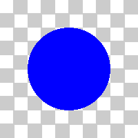
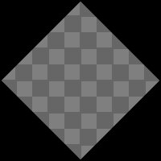
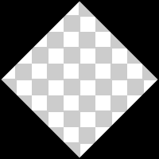
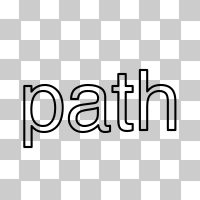
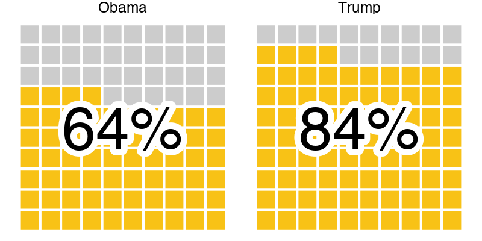
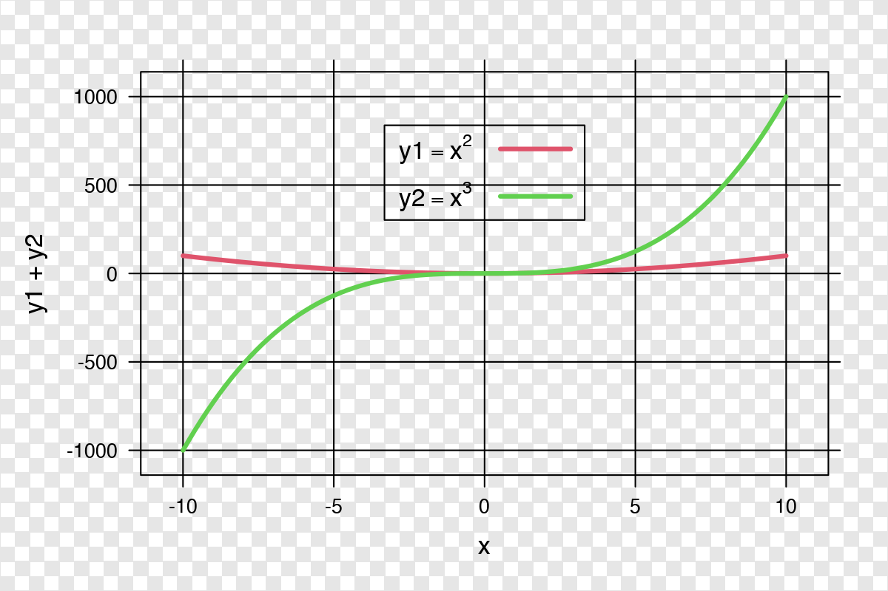

# Introduction

Figure \@ref(fig:diagram) shows a data visualization
with a subtle feature on each
circle.^[This image was inspired by a [post on stack overflow](https://stackoverflow.com/questions/69755844/is-it-possible-to-draw-the-following-diagram-in-r).]
The border of each circle in the visualization is 
semi-transparent and the border of each circle becomes
more transparent from left to right.  We could argue about whether
circles are the best representation of these values and whether the
semi-transparent gradient is particularly helpful, but for the 
purposes of this paper, this image
represents a specific example of a general problem:  does R graphics
allow us to produce the exact final image that we desire, or 
do the limitations of the R graphics engine 
force us to use external, manual software 
like Adobe Illustrator to perform additional
modifications?  Over the past few years, a number of capabilities
have been added to the R graphics engine with the aim of being
able to produce the exact final image that we desire entirely within
R code.  

<div class="layout-chunk" data-layout="l-body">


</div>


<div class="layout-chunk" data-layout="l-body">


</div>

<div class="layout-chunk" data-layout="l-body">


</div>


<div class="layout-chunk" data-layout="l-body">
<div class="figure">

<p class="caption">(\#fig:diagram)A diagram with a semi-transparent linear gradient on each circle border.</p>
</div>

</div>


For example, it is now possible to define a linear gradient in R.
The following code defines a horizontal linear gradient from a light gray
on the left 
to a very light gray on the right.

<div class="layout-chunk" data-layout="l-body">
<div class="sourceCode"><pre class="sourceCode r"><code class="sourceCode r"><span><span class='kw'><a href='https://rdrr.io/r/base/library.html'>library</a></span><span class='op'>(</span><span class='va'>grid</span><span class='op'>)</span></span>
<span><span class='va'>linearbg</span> <span class='op'>&lt;-</span> <span class='fu'><a href='https://rdrr.io/r/grid/patterns.html'>linearGradient</a></span><span class='op'>(</span><span class='fu'><a href='https://rdrr.io/r/grDevices/gray.html'>grey</a></span><span class='op'>(</span><span class='fu'><a href='https://rdrr.io/r/base/c.html'>c</a></span><span class='op'>(</span><span class='fl'>.8</span>, <span class='fl'>.99</span><span class='op'>)</span><span class='op'>)</span>, </span>
<span>                           x1<span class='op'>=</span><span class='fl'>0</span>, x2<span class='op'>=</span><span class='fl'>1</span>, y1<span class='op'>=</span><span class='fl'>.5</span>, y2<span class='op'>=</span><span class='fl'>.5</span><span class='op'>)</span></span></code></pre></div>

</div>


The following code uses the `linearbg` gradient defined above to
add a subtle linear gradient background to a \CRANpkg{ggplot2} plot
[@book:ggplot2] by setting
the `fill` in the `plot.background`
(see Figure&nbsp;\@ref(fig:ggplot2bg)).

<div class="layout-chunk" data-layout="l-body">
<div class="sourceCode"><pre class="sourceCode r"><code class="sourceCode r"><span><span class='kw'><a href='https://rdrr.io/r/base/library.html'>library</a></span><span class='op'>(</span><span class='va'><a href='https://ggplot2.tidyverse.org'>ggplot2</a></span><span class='op'>)</span></span>
<span><span class='fu'><a href='https://ggplot2.tidyverse.org/reference/ggplot.html'>ggplot</a></span><span class='op'>(</span><span class='va'>mtcars</span><span class='op'>)</span> <span class='op'>+</span></span>
<span>    <span class='fu'><a href='https://ggplot2.tidyverse.org/reference/geom_point.html'>geom_point</a></span><span class='op'>(</span><span class='fu'><a href='https://ggplot2.tidyverse.org/reference/aes.html'>aes</a></span><span class='op'>(</span><span class='va'>disp</span>, <span class='va'>mpg</span><span class='op'>)</span><span class='op'>)</span> <span class='op'>+</span></span>
<span>    <span class='fu'><a href='https://ggplot2.tidyverse.org/reference/theme.html'>theme</a></span><span class='op'>(</span>plot.background<span class='op'>=</span><span class='fu'><a href='https://ggplot2.tidyverse.org/reference/element.html'>element_rect</a></span><span class='op'>(</span>fill<span class='op'>=</span><span class='va'>linearbg</span>, colour<span class='op'>=</span><span class='cn'>NA</span><span class='op'>)</span>,</span>
<span>          plot.margin<span class='op'>=</span><span class='fu'><a href='https://rdrr.io/r/grid/unit.html'>unit</a></span><span class='op'>(</span><span class='fu'><a href='https://rdrr.io/r/base/c.html'>c</a></span><span class='op'>(</span><span class='fl'>1</span>, <span class='fl'>1</span>, <span class='fl'>.25</span>, <span class='fl'>.25</span><span class='op'>)</span>, <span class='st'>"cm"</span><span class='op'>)</span>,</span>
<span>          panel.background<span class='op'>=</span><span class='fu'><a href='https://ggplot2.tidyverse.org/reference/element.html'>element_rect</a></span><span class='op'>(</span>fill<span class='op'>=</span><span class='cn'>NA</span>, colour<span class='op'>=</span><span class='st'>"black"</span><span class='op'>)</span>,</span>
<span>          panel.grid<span class='op'>=</span><span class='fu'><a href='https://ggplot2.tidyverse.org/reference/element.html'>element_blank</a></span><span class='op'>(</span><span class='op'>)</span><span class='op'>)</span></span></code></pre></div>
<div class="figure">

<p class="caption">(\#fig:ggplot2bg)A ggplot2 plot with a subtle linear gradient background.</p>
</div>

</div>


Only some of the new graphics features are available at this stage
via high-level interfaces
like \CRANpkg{ggplot2}, as in the example above, so [Section 2](#new-features) 
will introduce the new features via a number of lower-level
examples using the \pkg{grid} package.
Section 2 will serve two purposes:  to explain what the new features
are and to show how they can be used (at least with \pkg{grid}).
[Section 3](#integration) will provide some examples of how to
integrate the lower-level \pkg{grid} usage with higher-level packages
like \CRANpkg{ggplot2}, \CRANpkg{lattice}, and base \pkg{graphics} plots.
[Section 4](#discussion) provides a discussion of important limitations
of the new features, how the new features relate to the capabilities
of existing R packages, and pointers to further readings.
For readers unfamiliar with the organization of R graphics systems,
for example, the relationship between \pkg{grid} and \CRANpkg{ggplot2},
[the Appendix](#rgraphics) provides a brief overview.

# The new graphics features{#new-features}

In this section, we introduce the new graphics features one by one.
The aim is to explain each feature, show what it can do, and show
how to use the feature with the \pkg{grid} package.
Since \pkg{grid} will not be familiar for many R users, 
the examples will be kept as simple as possible and will involve only drawing
basic shapes;  [Section 3](#integration) will provide some more
complicated examples involving complete plots.

<div class="layout-chunk" data-layout="l-body">


</div>

<div class="layout-chunk" data-layout="l-body">


</div>

<div class="layout-chunk" data-layout="l-body">


</div>


## Gradient fills

There are new functions in the `grid` package for 
defining gradient fills.  For example,
we can use the `linearGradient()` function to
define a linear gradient based on a start point, an end point,
and a set of colors to transition between (along the straight
line between the start and end point).  

In the following code, we use the `rgb()` function to
define two R colors, both blue, but one
almost opaque and one almost completely transparent.

<div class="layout-chunk" data-layout="l-body">
<div class="sourceCode"><pre class="sourceCode r"><code class="sourceCode r"><span><span class='va'>blues</span> <span class='op'>&lt;-</span> <span class='fu'><a href='https://rdrr.io/r/grDevices/rgb.html'>rgb</a></span><span class='op'>(</span><span class='fl'>0</span>, <span class='fl'>0</span>, <span class='fl'>1</span>, alpha<span class='op'>=</span><span class='fu'><a href='https://rdrr.io/r/base/c.html'>c</a></span><span class='op'>(</span><span class='fl'>.8</span>, <span class='fl'>.1</span><span class='op'>)</span><span class='op'>)</span></span>
<span><span class='va'>blues</span></span></code></pre></div>

```
[1] "#0000FFCC" "#0000FF1A"
```

</div>


Next we define a linear gradient that
transitions horizontally, left-to-right, between these two colors.
In \pkg{grid}, we can specify positions relative to a variety of
coordinate systems, but the default is a "normalized" system
where `0` means left/bottom and `1` means right/top (and `.5`
means the center).

<div class="layout-chunk" data-layout="l-body">
<div class="sourceCode"><pre class="sourceCode r"><code class="sourceCode r"><span><span class='va'>gradient</span> <span class='op'>&lt;-</span> <span class='fu'><a href='https://rdrr.io/r/grid/patterns.html'>linearGradient</a></span><span class='op'>(</span><span class='va'>blues</span>, x1<span class='op'>=</span><span class='fl'>0</span>, x2<span class='op'>=</span><span class='fl'>1</span>, y1<span class='op'>=</span><span class='fl'>.5</span>, y2<span class='op'>=</span><span class='fl'>.5</span><span class='op'>)</span></span></code></pre></div>

</div>


The code above does not draw anything;  it just defines a linear gradient.
In order to draw the gradient, we provide this object as the "fill color"
to a function that does draw something.
For example, 
as we saw in the introduction, we can pass that linear
gradient object as the `fill` argument to the `element_rect()` function so that
\CRANpkg{ggplot2} will fill a rectangle with the gradient.

In \pkg{grid}, we can draw a shape with a fill color by calling
a function like `grid.circle()` and specifying
the `fill` argument to the `gpar()` function.
For example, the following code draws a circle with a `"blue"` fill.
By default, the circle is drawn in the center of the image and
`r=.3` means that the radius of the circle is 30% of the width
of the image.
All of the images in this section will
have a light gray checkerboard pattern in the background 
so that we can properly see any semi-transparency
in what we draw.

<div class="layout-chunk" data-layout="l-body">
<div class="sourceCode"><pre class="sourceCode r"><code class="sourceCode r"><span><span class='fu'><a href='https://rdrr.io/r/grid/grid.circle.html'>grid.circle</a></span><span class='op'>(</span>r<span class='op'>=</span><span class='fl'>.3</span>, gp<span class='op'>=</span><span class='fu'><a href='https://rdrr.io/r/grid/gpar.html'>gpar</a></span><span class='op'>(</span>col<span class='op'>=</span><span class='cn'>NA</span>, fill<span class='op'>=</span><span class='st'>"blue"</span><span class='op'>)</span><span class='op'>)</span></span></code></pre></div>

</div>

<div class="layout-chunk" data-layout="l-body">


</div>


The following code draws a circle and uses the linear gradient that we
defined at the start of this section as the `fill`.
Notice that the location `x1=0` in the linear gradient definition
refers to the "left" *of the circle* and 
`x2=1` refers to the "right" *of the circle*.  In other 
words, the gradient is relative to the bounding box of the shape
that is being filled.  There are many other possibilities, including 
using the `unit()` function to specify the locations of the start
and end points of the gradient in absolute units like inches
(though still relative to the shape's bounding box) and we can also set
the `fill` on a `grid` viewport rather than on individual shapes.
The [Further reading](#further-reading) Section provides links
to several technical reports that demonstrate a wider range of 
examples.

<div class="layout-chunk" data-layout="l-body">
<div class="sourceCode"><pre class="sourceCode r"><code class="sourceCode r"><span><span class='fu'><a href='https://rdrr.io/r/grid/grid.circle.html'>grid.circle</a></span><span class='op'>(</span>r<span class='op'>=</span><span class='fl'>.3</span>, gp<span class='op'>=</span><span class='fu'><a href='https://rdrr.io/r/grid/gpar.html'>gpar</a></span><span class='op'>(</span>col<span class='op'>=</span><span class='cn'>NA</span>, fill<span class='op'>=</span><span class='va'>gradient</span><span class='op'>)</span><span class='op'>)</span></span></code></pre></div>

</div>

<div class="layout-chunk" data-layout="l-body">


</div>


There is also a `radialGradient()` function for defining a gradient
that is based on a start circle and an end circle and a set of colors
to transition between.  For example, the following code
defines a radial gradient that starts with radius `r1=.5` and ends with
radius `r2=0`, transitioning from an almost opaque blue 
to almost
fully transparent blue.  

<div class="layout-chunk" data-layout="l-body">
<div class="sourceCode"><pre class="sourceCode r"><code class="sourceCode r"><span><span class='va'>radial</span> <span class='op'>&lt;-</span> <span class='fu'><a href='https://rdrr.io/r/grid/patterns.html'>radialGradient</a></span><span class='op'>(</span><span class='va'>blues</span>, r1<span class='op'>=</span><span class='fl'>.5</span>, r2<span class='op'>=</span><span class='fl'>0</span><span class='op'>)</span></span></code></pre></div>

</div>


In the following code, the radial gradient is used to fill a circle.
The radii of the start and end circles of the gradient
are relative to the bounding box of the circle that is being filled,
so `r1=.5` corresponds to the circumference of the circle being filled
and `r2=0` corresponds to the center of the circle being filled.

<div class="layout-chunk" data-layout="l-body">
<div class="sourceCode"><pre class="sourceCode r"><code class="sourceCode r"><span><span class='fu'><a href='https://rdrr.io/r/grid/grid.circle.html'>grid.circle</a></span><span class='op'>(</span>r<span class='op'>=</span><span class='fl'>.3</span>, gp<span class='op'>=</span><span class='fu'><a href='https://rdrr.io/r/grid/gpar.html'>gpar</a></span><span class='op'>(</span>col<span class='op'>=</span><span class='cn'>NA</span>, fill<span class='op'>=</span><span class='va'>radial</span><span class='op'>)</span><span class='op'>)</span></span></code></pre></div>

</div>

<div class="layout-chunk" data-layout="l-body">


</div>


Any shape can be filled with either a linear or radial gradient.
For example, the following code fills a rectangle with the 
radial gradient defined above.

<div class="layout-chunk" data-layout="l-body">
<div class="sourceCode"><pre class="sourceCode r"><code class="sourceCode r"><span><span class='fu'><a href='https://rdrr.io/r/grid/grid.rect.html'>grid.rect</a></span><span class='op'>(</span>width<span class='op'>=</span><span class='fl'>.6</span>, height<span class='op'>=</span><span class='fl'>.6</span>, gp<span class='op'>=</span><span class='fu'><a href='https://rdrr.io/r/grid/gpar.html'>gpar</a></span><span class='op'>(</span>col<span class='op'>=</span><span class='cn'>NA</span>, fill<span class='op'>=</span><span class='va'>radial</span><span class='op'>)</span><span class='op'>)</span></span></code></pre></div>

</div>

<div class="layout-chunk" data-layout="l-body">


</div>


## Pattern fills

It is now also possible to
fill a shape with a pattern fill with the help of the 
`pattern()` function from the \pkg{grid} package.
The first argument to this function describes what to draw for the
pattern and subsequent arguments describe the size of the pattern - the
extent of the pattern *tile* - along with what happens outside of the
pattern tile.
As an example, we will look at the construction of the checkerboard pattern
that is being used as the background for the 
images in this section.

The first step is to describe the shape for the pattern.
In this case, we use a call to `rectGrob()` to describe
two rectangles, both .1 inches square and filled with light gray, 
with one rectangle just above and to the right
of center and one just below and to the left of center.
The \pkg{grid} function `unit()` is used to associate a value with
a coordinate system.  In the `"npc"` coordinate system, `0`
means left/bottom, `1` means right/top, and `.5` means the
center, and in the `"in"` coordinate system, values are in inches.
The image below the code shows what this shape looks like
drawn on its own.

<div class="layout-chunk" data-layout="l-body">
<div class="sourceCode"><pre class="sourceCode r"><code class="sourceCode r"><span><span class='va'>bgRect</span> <span class='op'>&lt;-</span> <span class='fu'><a href='https://rdrr.io/r/grid/grid.rect.html'>rectGrob</a></span><span class='op'>(</span>x<span class='op'>=</span><span class='fu'><a href='https://rdrr.io/r/grid/unit.html'>unit</a></span><span class='op'>(</span><span class='fl'>.5</span>, <span class='st'>"npc"</span><span class='op'>)</span> <span class='op'>+</span> <span class='fu'><a href='https://rdrr.io/r/grid/unit.html'>unit</a></span><span class='op'>(</span><span class='fu'><a href='https://rdrr.io/r/base/c.html'>c</a></span><span class='op'>(</span><span class='fl'>0</span>, <span class='op'>-</span><span class='fl'>.1</span><span class='op'>)</span>, <span class='st'>"in"</span><span class='op'>)</span>,</span>
<span>                   y<span class='op'>=</span><span class='fu'><a href='https://rdrr.io/r/grid/unit.html'>unit</a></span><span class='op'>(</span><span class='fl'>.5</span>, <span class='st'>"npc"</span><span class='op'>)</span> <span class='op'>+</span> <span class='fu'><a href='https://rdrr.io/r/grid/unit.html'>unit</a></span><span class='op'>(</span><span class='fu'><a href='https://rdrr.io/r/base/c.html'>c</a></span><span class='op'>(</span><span class='fl'>0</span>, <span class='op'>-</span><span class='fl'>.1</span><span class='op'>)</span>, <span class='st'>"in"</span><span class='op'>)</span>,</span>
<span>                   just<span class='op'>=</span><span class='fu'><a href='https://rdrr.io/r/base/c.html'>c</a></span><span class='op'>(</span><span class='st'>"left"</span>, <span class='st'>"bottom"</span><span class='op'>)</span>,</span>
<span>                   width<span class='op'>=</span><span class='fl'>.1</span>, height<span class='op'>=</span><span class='fl'>.1</span>, default.units<span class='op'>=</span><span class='st'>"in"</span>,</span>
<span>                   gp<span class='op'>=</span><span class='fu'><a href='https://rdrr.io/r/grid/gpar.html'>gpar</a></span><span class='op'>(</span>col<span class='op'>=</span><span class='st'>"gray80"</span>, fill<span class='op'>=</span><span class='st'>"gray80"</span><span class='op'>)</span><span class='op'>)</span></span></code></pre></div>

</div>

<div class="layout-chunk" data-layout="l-body">


</div>


The following code creates a pattern based on this shape.
The size of the tile is .2" square and the tile will be repeated
to fill a region
(`extend="repeat"`).
The image below the code shows the pattern tile (without repetition);
the extent of the tile is indicated by a red rectangle.

<div class="layout-chunk" data-layout="l-body">
<div class="sourceCode"><pre class="sourceCode r"><code class="sourceCode r"><span><span class='va'>bg</span> <span class='op'>&lt;-</span> <span class='fu'><a href='https://rdrr.io/r/grid/patterns.html'>pattern</a></span><span class='op'>(</span><span class='va'>bgRect</span>,</span>
<span>              width<span class='op'>=</span><span class='fu'><a href='https://rdrr.io/r/grid/unit.html'>unit</a></span><span class='op'>(</span><span class='fl'>.2</span>, <span class='st'>"in"</span><span class='op'>)</span>,</span>
<span>              height<span class='op'>=</span><span class='fu'><a href='https://rdrr.io/r/grid/unit.html'>unit</a></span><span class='op'>(</span><span class='fl'>.2</span>, <span class='st'>"in"</span><span class='op'>)</span>,</span>
<span>              extend<span class='op'>=</span><span class='st'>"repeat"</span><span class='op'>)</span></span></code></pre></div>

</div>

<div class="layout-chunk" data-layout="l-body">


</div>


As with the `linearGradient()` and `radialGradient()` functions, 
the result of a call to `pattern()` is just an object that describes a pattern;
nothing is drawn.  We supply this pattern object as the `fill` for a shape
that is to be drawn.

For example, the object that we created with a call
to `pattern()` can be used as the `fill` graphical parameter
in `grid` functions.  The following code draws a rectangle that is 
the size of the entire image and fills it with the `bg` pattern.
The pattern tile is drawn in the center of the rectangle and 
then repeated to fill the entire rectangle.

<div class="layout-chunk" data-layout="l-body">
<div class="sourceCode"><pre class="sourceCode r"><code class="sourceCode r"><span><span class='fu'><a href='https://rdrr.io/r/grid/grid.rect.html'>grid.rect</a></span><span class='op'>(</span>gp<span class='op'>=</span><span class='fu'><a href='https://rdrr.io/r/grid/gpar.html'>gpar</a></span><span class='op'>(</span>fill<span class='op'>=</span><span class='va'>bg</span><span class='op'>)</span><span class='op'>)</span>  </span></code></pre></div>


</div>

  
As with gradient fills, we can use the pattern to fill any shape.
For example, the following code fills a circle with the checkerboard
pattern.

<div class="layout-chunk" data-layout="l-body">
<div class="sourceCode"><pre class="sourceCode r"><code class="sourceCode r"><span><span class='fu'><a href='https://rdrr.io/r/grid/grid.circle.html'>grid.circle</a></span><span class='op'>(</span>gp<span class='op'>=</span><span class='fu'><a href='https://rdrr.io/r/grid/gpar.html'>gpar</a></span><span class='op'>(</span>fill<span class='op'>=</span><span class='va'>bg</span><span class='op'>)</span><span class='op'>)</span>  </span></code></pre></div>

</div>

<div class="layout-chunk" data-layout="l-body">


</div>


## Clipping paths

A clipping region describes an area within which drawing will be visible.
By default, everything that we draw within the limits of an image is
visible, but we can set a clipping region to limit what gets drawn.
*Rectangular* clipping regions have been available in R graphics
for a very long time.
For example, in scatter plots, the data symbols are usually
clipped to the (rectangular) plot region.  The code below 
produces a \CRANpkg{ggplot2} plot with
the x-axis scale set to
exactly the range of the `disp` variable so that the left-most and right-most
data symbols are centered on the left and right edge of the plot region.
The \CRANpkg{ggplot2} package clips the drawing of the data symbols to the
plot region so only
half of the left-most and right-most data symbols are drawn
(see Figure&nbsp;\@ref(fig:ggplot2clip)).

<div class="layout-chunk" data-layout="l-body">
<div class="sourceCode"><pre class="sourceCode r"><code class="sourceCode r"><span><span class='fu'><a href='https://ggplot2.tidyverse.org/reference/ggplot.html'>ggplot</a></span><span class='op'>(</span><span class='va'>mtcars</span><span class='op'>)</span> <span class='op'>+</span></span>
<span>    <span class='fu'><a href='https://ggplot2.tidyverse.org/reference/geom_point.html'>geom_point</a></span><span class='op'>(</span><span class='fu'><a href='https://ggplot2.tidyverse.org/reference/aes.html'>aes</a></span><span class='op'>(</span><span class='va'>disp</span>, <span class='va'>mpg</span><span class='op'>)</span>, size<span class='op'>=</span><span class='fl'>3</span><span class='op'>)</span> <span class='op'>+</span></span>
<span>    <span class='fu'><a href='https://ggplot2.tidyverse.org/reference/scale_continuous.html'>scale_x_continuous</a></span><span class='op'>(</span>expand<span class='op'>=</span><span class='fu'><a href='https://rdrr.io/r/base/c.html'>c</a></span><span class='op'>(</span><span class='fl'>0</span>, <span class='fl'>0</span><span class='op'>)</span><span class='op'>)</span> <span class='op'>+</span></span>
<span>    <span class='fu'><a href='https://ggplot2.tidyverse.org/reference/theme.html'>theme</a></span><span class='op'>(</span>plot.margin<span class='op'>=</span><span class='fu'><a href='https://rdrr.io/r/grid/unit.html'>unit</a></span><span class='op'>(</span><span class='fu'><a href='https://rdrr.io/r/base/c.html'>c</a></span><span class='op'>(</span><span class='fl'>1</span>, <span class='fl'>1</span>, <span class='fl'>.25</span>, <span class='fl'>.25</span><span class='op'>)</span>, <span class='st'>"cm"</span><span class='op'>)</span>,</span>
<span>          panel.background<span class='op'>=</span><span class='fu'><a href='https://ggplot2.tidyverse.org/reference/element.html'>element_rect</a></span><span class='op'>(</span>fill<span class='op'>=</span><span class='cn'>NA</span>, colour<span class='op'>=</span><span class='st'>"black"</span><span class='op'>)</span>,</span>
<span>          panel.grid<span class='op'>=</span><span class='fu'><a href='https://ggplot2.tidyverse.org/reference/element.html'>element_blank</a></span><span class='op'>(</span><span class='op'>)</span><span class='op'>)</span></span></code></pre></div>
<div class="figure">

<p class="caption">(\#fig:ggplot2clip)A ggplot2 plot with the left-most and right-most data symbols clipped to the edges of the plot region.</p>
</div>

</div>


In \pkg{grid}, a clipping region can be defined when we push a *viewport*.
A viewport is a rectangular region that defines a temporary coordinate 
system for drawing, plus some other parameters like the clipping region. 
For example, the plot region on a \CRANpkg{ggplot2} plot is a \pkg{grid}
viewport that provides coordinates for drawing data symbols, with
clipping turned on so that nothing is drawn outside the plot region.

The following code provides a simple demonstration of a viewport.
First, we describe two circles, one centered on the left edge of
the image and one centered on the right edge of the image.
The `circleGrob()` function is similar 
to the `grid.circle()` function, except that it just creates a 
description of a circle and does not draw anything.
The `grid.draw()` function draws the circles.
Because the circles are centered on the edges of the image, 
we can only see half of each circle.

<div class="layout-chunk" data-layout="l-body">
<div class="sourceCode"><pre class="sourceCode r"><code class="sourceCode r"><span><span class='va'>gradient2</span> <span class='op'>&lt;-</span> <span class='fu'><a href='https://rdrr.io/r/grid/patterns.html'>linearGradient</a></span><span class='op'>(</span><span class='va'>blues</span>, x1<span class='op'>=</span><span class='fl'>0</span>, x2<span class='op'>=</span><span class='fl'>1</span>, y1<span class='op'>=</span><span class='fl'>.5</span>, y2<span class='op'>=</span><span class='fl'>.5</span>,</span>
<span>                            group<span class='op'>=</span><span class='cn'>FALSE</span><span class='op'>)</span></span>
<span><span class='va'>circles</span> <span class='op'>&lt;-</span> <span class='fu'><a href='https://rdrr.io/r/grid/grid.circle.html'>circleGrob</a></span><span class='op'>(</span>x<span class='op'>=</span><span class='fl'>0</span><span class='op'>:</span><span class='fl'>1</span>, r<span class='op'>=</span><span class='fl'>.5</span>, gp<span class='op'>=</span><span class='fu'><a href='https://rdrr.io/r/grid/gpar.html'>gpar</a></span><span class='op'>(</span>col<span class='op'>=</span><span class='cn'>NA</span>, fill<span class='op'>=</span><span class='st'>"blue"</span><span class='op'>)</span><span class='op'>)</span></span>
<span><span class='fu'><a href='https://rdrr.io/r/grid/grid.draw.html'>grid.draw</a></span><span class='op'>(</span><span class='va'>circles</span><span class='op'>)</span></span></code></pre></div>

</div>

<div class="layout-chunk" data-layout="l-body">


</div>


In the following code, 
the `viewport()` function describes a viewport that is only 50%
of the width and 50% of the height of the image.  The 
`pushViewport()` function creates that viewport on the image.
We then call the `grid.draw()` function to draw the circles again, 
but now we are within the viewport, 
so the circles are drawn centered on the left and right edges
*of the viewport*.  Furthermore,
the radius of the circles (`.5`)
now means 50% of the width *of the viewport*, so the circles
are also drawn smaller than before.  Notice that the circles
extend beyond the edges of the viewport because, by default,
there is no clipping region.
The `popViewport()` function removes the viewport from the image
(so further drawing would be at full size).
In the image below, a red rectangle has been drawn just to show
the extent of the viewport, but normally nothing is drawn when
a viewport is created.

<div class="layout-chunk" data-layout="l-body">
<div class="sourceCode"><pre class="sourceCode r"><code class="sourceCode r"><span><span class='fu'><a href='https://rdrr.io/r/grid/viewports.html'>pushViewport</a></span><span class='op'>(</span><span class='fu'><a href='https://rdrr.io/r/grid/viewport.html'>viewport</a></span><span class='op'>(</span>width<span class='op'>=</span><span class='fl'>.5</span>, height<span class='op'>=</span><span class='fl'>.5</span><span class='op'>)</span><span class='op'>)</span></span>
<span><span class='fu'><a href='https://rdrr.io/r/grid/grid.draw.html'>grid.draw</a></span><span class='op'>(</span><span class='va'>circles</span><span class='op'>)</span></span>
<span><span class='fu'><a href='https://rdrr.io/r/grid/viewports.html'>popViewport</a></span><span class='op'>(</span><span class='op'>)</span></span></code></pre></div>

</div>

<div class="layout-chunk" data-layout="l-body">


</div>


The following code demonstrates the idea of clipping to a viewport.
We push a viewport again, but this time the viewport has clipping
turned on (`clip=TRUE`).  A purple rectangle
shows the extent of this viewport.  When we draw the circles within
this viewport, drawing
is limited to the extent of the viewport, so half of the 
left circle and half of the right circle are clipped.

<div class="layout-chunk" data-layout="l-body">
<div class="sourceCode"><pre class="sourceCode r"><code class="sourceCode r"><span><span class='fu'><a href='https://rdrr.io/r/grid/viewports.html'>pushViewport</a></span><span class='op'>(</span><span class='fu'><a href='https://rdrr.io/r/grid/viewport.html'>viewport</a></span><span class='op'>(</span>width<span class='op'>=</span><span class='fl'>.5</span>, height<span class='op'>=</span><span class='fl'>.5</span>, clip<span class='op'>=</span><span class='cn'>TRUE</span><span class='op'>)</span><span class='op'>)</span></span>
<span><span class='fu'><a href='https://rdrr.io/r/grid/grid.draw.html'>grid.draw</a></span><span class='op'>(</span><span class='va'>circles</span><span class='op'>)</span></span>
<span><span class='fu'><a href='https://rdrr.io/r/grid/viewports.html'>popViewport</a></span><span class='op'>(</span><span class='op'>)</span></span></code></pre></div>

</div>

<div class="layout-chunk" data-layout="l-body">


</div>


This idea of a clipping region has now been extended to a clipping *path*
so that we can limit drawing to a region that is any shape at all,
not just a rectangle.
For example, the following code describes a diamond shape 
that we will use as a clipping path.  This code does not draw anything,
but the shape is shown below the code anyway just so that we know what it looks
like. 

<div class="layout-chunk" data-layout="l-body">
<div class="sourceCode"><pre class="sourceCode r"><code class="sourceCode r"><span><span class='va'>diamondPath</span> <span class='op'>&lt;-</span> <span class='fu'><a href='https://rdrr.io/r/grid/grid.polygon.html'>polygonGrob</a></span><span class='op'>(</span><span class='fu'><a href='https://rdrr.io/r/base/c.html'>c</a></span><span class='op'>(</span><span class='fl'>0</span>, <span class='fl'>.5</span>, <span class='fl'>1</span>, <span class='fl'>.5</span><span class='op'>)</span>, <span class='fu'><a href='https://rdrr.io/r/base/c.html'>c</a></span><span class='op'>(</span><span class='fl'>.5</span>, <span class='fl'>1</span>, <span class='fl'>.5</span>, <span class='fl'>0</span><span class='op'>)</span><span class='op'>)</span></span></code></pre></div>

</div>

<div class="layout-chunk" data-layout="l-body">


</div>


The following code pushes a viewport again,
but this time sets the clipping region for the viewport
to be the diamond shape that we defined above.
Now, when we draw the two circles within this viewport,
only the parts of the circles that lie within the diamond-shaped
clipping path are visible.
Just as a guide, a red rectangle has been drawn to show the extent
of the viewport that we have pushed, and a purple diamond has been
drawn to show the extent of the clipping path.  Notice that the
location and size of the diamond path is relative to the viewport,
so `0` is the left/bottom *of the viewport* and `1` is the right/top *of
the viewport*.

<div class="layout-chunk" data-layout="l-body">
<div class="sourceCode"><pre class="sourceCode r"><code class="sourceCode r"><span><span class='fu'><a href='https://rdrr.io/r/grid/viewports.html'>pushViewport</a></span><span class='op'>(</span><span class='fu'><a href='https://rdrr.io/r/grid/viewport.html'>viewport</a></span><span class='op'>(</span>width<span class='op'>=</span><span class='fl'>.5</span>, height<span class='op'>=</span><span class='fl'>.5</span>, clip<span class='op'>=</span><span class='va'>diamondPath</span><span class='op'>)</span><span class='op'>)</span></span>
<span><span class='fu'><a href='https://rdrr.io/r/grid/grid.draw.html'>grid.draw</a></span><span class='op'>(</span><span class='va'>circles</span><span class='op'>)</span></span>
<span><span class='fu'><a href='https://rdrr.io/r/grid/viewports.html'>popViewport</a></span><span class='op'>(</span><span class='op'>)</span></span></code></pre></div>

</div>

<div class="layout-chunk" data-layout="l-body">


</div>


## Masks

Masks are similar to clipping paths in that they constrain what parts
of a shape are visible.  However, a mask provides greater flexibility
because it allows intermediate levels of semi-transparency;
a clipping path effectively only allows either fully opaque or 
fully semi-transparent masking.

A mask, like a clipping path, can be based on any shape.
For example, the following code describes a diamond shape 
(that is filled black).
This code does not draw anything, but the diamond is shown below
the code anyway so that we know what it looks like.

<div class="layout-chunk" data-layout="l-body">
<div class="sourceCode"><pre class="sourceCode r"><code class="sourceCode r"><span><span class='va'>diamondMask</span> <span class='op'>&lt;-</span> <span class='fu'><a href='https://rdrr.io/r/grid/grid.polygon.html'>polygonGrob</a></span><span class='op'>(</span><span class='fu'><a href='https://rdrr.io/r/base/c.html'>c</a></span><span class='op'>(</span><span class='fl'>0</span>, <span class='fl'>.5</span>, <span class='fl'>1</span>, <span class='fl'>.5</span><span class='op'>)</span>, <span class='fu'><a href='https://rdrr.io/r/base/c.html'>c</a></span><span class='op'>(</span><span class='fl'>.5</span>, <span class='fl'>1</span>, <span class='fl'>.5</span>, <span class='fl'>0</span><span class='op'>)</span>,</span>
<span>                           gp<span class='op'>=</span><span class='fu'><a href='https://rdrr.io/r/grid/gpar.html'>gpar</a></span><span class='op'>(</span>fill<span class='op'>=</span><span class='st'>"black"</span><span class='op'>)</span><span class='op'>)</span></span></code></pre></div>

</div>

<div class="layout-chunk" data-layout="l-body">


</div>


Also like clipping paths, we can enforce a mask when we push a viewport.
The following code pushes a viewport that is half the width and half the height
of the total image
and enforces the mask defined above and then draws the two blue circles.
The mask works by transferring its opacity to the circles.
Where the mask is opaque, the circles are drawn normally and 
where the mask is transparent, the circles are not drawn at all.
The effect of this mask is exactly the same as the clipping path
example from the previous section.

<div class="layout-chunk" data-layout="l-body">
<div class="sourceCode"><pre class="sourceCode r"><code class="sourceCode r"><span><span class='fu'><a href='https://rdrr.io/r/grid/viewports.html'>pushViewport</a></span><span class='op'>(</span><span class='fu'><a href='https://rdrr.io/r/grid/viewport.html'>viewport</a></span><span class='op'>(</span>width<span class='op'>=</span><span class='fl'>.5</span>, height<span class='op'>=</span><span class='fl'>.5</span>, mask<span class='op'>=</span><span class='va'>diamondMask</span><span class='op'>)</span><span class='op'>)</span></span>
<span><span class='fu'><a href='https://rdrr.io/r/grid/grid.draw.html'>grid.draw</a></span><span class='op'>(</span><span class='va'>circles</span><span class='op'>)</span></span>
<span><span class='fu'><a href='https://rdrr.io/r/grid/viewports.html'>popViewport</a></span><span class='op'>(</span><span class='op'>)</span></span></code></pre></div>

</div>

<div class="layout-chunk" data-layout="l-body">


</div>


The additional flexibility that is available with masks comes from
the fact that the mask may have fully opaque areas and fully 
transparent areas *and* areas of *semi-transparency*.
For example, the following code defines a more complex shape.
This shape is a square with opaque corners and a semitransparent
diamond in the middle (again, the shape is shown below the code
just for reference; the code does no actual drawing). 
In this code, the `grobTree()` function is used to describe a mask
that is made up from two shapes:
a `polygonGrob()` that describes the semitransparent diamond and
a `pathGrob()` that describes the opaque corners.

<div class="layout-chunk" data-layout="l-body">
<div class="sourceCode"><pre class="sourceCode r"><code class="sourceCode r"><span><span class='va'>alphaMask</span> <span class='op'>&lt;-</span> <span class='fu'><a href='https://rdrr.io/r/grid/grid.grob.html'>grobTree</a></span><span class='op'>(</span><span class='fu'><a href='https://rdrr.io/r/grid/grid.polygon.html'>polygonGrob</a></span><span class='op'>(</span><span class='fu'><a href='https://rdrr.io/r/base/c.html'>c</a></span><span class='op'>(</span><span class='fl'>0</span>, <span class='fl'>.5</span>, <span class='fl'>1</span>, <span class='fl'>.5</span><span class='op'>)</span>, <span class='fu'><a href='https://rdrr.io/r/base/c.html'>c</a></span><span class='op'>(</span><span class='fl'>.5</span>, <span class='fl'>1</span>, <span class='fl'>.5</span>, <span class='fl'>0</span><span class='op'>)</span>,</span>
<span>                                  gp<span class='op'>=</span><span class='fu'><a href='https://rdrr.io/r/grid/gpar.html'>gpar</a></span><span class='op'>(</span>fill<span class='op'>=</span><span class='fu'><a href='https://rdrr.io/r/grDevices/rgb.html'>rgb</a></span><span class='op'>(</span><span class='fl'>0</span>,<span class='fl'>0</span>,<span class='fl'>0</span>,<span class='fl'>.5</span><span class='op'>)</span><span class='op'>)</span><span class='op'>)</span>,</span>
<span>                      <span class='fu'><a href='https://rdrr.io/r/grid/grid.path.html'>pathGrob</a></span><span class='op'>(</span><span class='fu'><a href='https://rdrr.io/r/base/c.html'>c</a></span><span class='op'>(</span><span class='fl'>0</span>, <span class='fl'>0</span>, <span class='fl'>1</span>, <span class='fl'>1</span>, <span class='fl'>0</span>, <span class='fl'>.5</span>, <span class='fl'>1</span>, <span class='fl'>.5</span><span class='op'>)</span>,</span>
<span>                               <span class='fu'><a href='https://rdrr.io/r/base/c.html'>c</a></span><span class='op'>(</span><span class='fl'>0</span>, <span class='fl'>1</span>, <span class='fl'>1</span>, <span class='fl'>0</span>, <span class='fl'>.5</span>, <span class='fl'>1</span>, <span class='fl'>.5</span>, <span class='fl'>0</span><span class='op'>)</span>,</span>
<span>                               id<span class='op'>=</span><span class='fu'><a href='https://rdrr.io/r/base/rep.html'>rep</a></span><span class='op'>(</span><span class='fl'>1</span><span class='op'>:</span><span class='fl'>2</span>, each<span class='op'>=</span><span class='fl'>4</span><span class='op'>)</span>,</span>
<span>                               rule<span class='op'>=</span><span class='st'>"evenodd"</span>,</span>
<span>                               gp<span class='op'>=</span><span class='fu'><a href='https://rdrr.io/r/grid/gpar.html'>gpar</a></span><span class='op'>(</span>fill<span class='op'>=</span><span class='st'>"black"</span><span class='op'>)</span><span class='op'>)</span><span class='op'>)</span></span></code></pre></div>

</div>

<div class="layout-chunk" data-layout="l-body">


</div>


When we push a viewport with this mask, and draw the two circles,
the result is the original circles where the mask is opaque
and a semitransparent version of the circles where the mask is
semitransparent.

<div class="layout-chunk" data-layout="l-body">
<div class="sourceCode"><pre class="sourceCode r"><code class="sourceCode r"><span><span class='fu'><a href='https://rdrr.io/r/grid/viewports.html'>pushViewport</a></span><span class='op'>(</span><span class='fu'><a href='https://rdrr.io/r/grid/viewport.html'>viewport</a></span><span class='op'>(</span>width<span class='op'>=</span><span class='fl'>.5</span>, height<span class='op'>=</span><span class='fl'>.5</span>, mask<span class='op'>=</span><span class='va'>alphaMask</span><span class='op'>)</span><span class='op'>)</span></span>
<span><span class='fu'><a href='https://rdrr.io/r/grid/grid.draw.html'>grid.draw</a></span><span class='op'>(</span><span class='va'>circles</span><span class='op'>)</span></span>
<span><span class='fu'><a href='https://rdrr.io/r/grid/viewports.html'>popViewport</a></span><span class='op'>(</span><span class='op'>)</span></span></code></pre></div>

</div>

<div class="layout-chunk" data-layout="l-body">


</div>


The masks used above are examples of *alpha* masks.  They work by 
transferring the "alpha channel", or opacity, of the mask to the
shape that is being drawn.
It is also possible to define *luminance* masks.
With a luminance mask, areas of the mask that are white mean that
drawing will occur normally, areas that are black mean that
no drawing will occur, and areas that are gray produce semi-transparent
drawing.

## Stroked and filled paths

Another new feature in R graphics is the ability to stroke and/or fill
a *path*, where the path is defined by one or more other shapes.
As an example, we will look at producing the "square with opaque corners"
from the previous section on masks.

The code below is similar to the code used in the previous section
(and the shape that it draws is shown below the code).
This code uses the `grid.path()` function and it is relatively complex
because it has explicit `x` and `y` locations to describe the corners of
a square followed by the corners of a diamond and an `id` argument
to divide the `x` and `y` locations into separate shapes (square and diamond).
The `rule="evenodd"` argument means that the interior of the path
(that is filled with black) is inside the square, but not inside the diamond.

<div class="layout-chunk" data-layout="l-body">
<div class="sourceCode"><pre class="sourceCode r"><code class="sourceCode r"><span><span class='fu'><a href='https://rdrr.io/r/grid/grid.path.html'>grid.path</a></span><span class='op'>(</span><span class='fu'><a href='https://rdrr.io/r/base/c.html'>c</a></span><span class='op'>(</span><span class='fl'>0</span>, <span class='fl'>0</span>, <span class='fl'>1</span>, <span class='fl'>1</span>, <span class='fl'>0</span>, <span class='fl'>.5</span>, <span class='fl'>1</span>, <span class='fl'>.5</span><span class='op'>)</span>,</span>
<span>          <span class='fu'><a href='https://rdrr.io/r/base/c.html'>c</a></span><span class='op'>(</span><span class='fl'>0</span>, <span class='fl'>1</span>, <span class='fl'>1</span>, <span class='fl'>0</span>, <span class='fl'>.5</span>, <span class='fl'>1</span>, <span class='fl'>.5</span>, <span class='fl'>0</span><span class='op'>)</span>,</span>
<span>          id<span class='op'>=</span><span class='fu'><a href='https://rdrr.io/r/base/rep.html'>rep</a></span><span class='op'>(</span><span class='fl'>1</span><span class='op'>:</span><span class='fl'>2</span>, each<span class='op'>=</span><span class='fl'>4</span><span class='op'>)</span>,</span>
<span>          rule<span class='op'>=</span><span class='st'>"evenodd"</span>,</span>
<span>          gp<span class='op'>=</span><span class='fu'><a href='https://rdrr.io/r/grid/gpar.html'>gpar</a></span><span class='op'>(</span>fill<span class='op'>=</span><span class='st'>"black"</span><span class='op'>)</span><span class='op'>)</span></span></code></pre></div>

</div>

<div class="layout-chunk" data-layout="l-body">


</div>


The idea with stroked and filled paths is that we can describe more
complex shapes like this by combining simpler shapes instead 
of having to specify explicit `x` and `y` locations.
For example, the following code draws the same shape using
`grid.fillStroke()`, which allows us to describe the shape as a 
combination of a simple rectangle, with `rectGrob()`, 
and the `diamondPath` that we defined
earlier.

<div class="layout-chunk" data-layout="l-body">
<div class="sourceCode"><pre class="sourceCode r"><code class="sourceCode r"><span><span class='fu'><a href='https://rdrr.io/r/grid/grid.stroke.html'>grid.fillStroke</a></span><span class='op'>(</span><span class='fu'><a href='https://rdrr.io/r/grid/grid.grob.html'>grobTree</a></span><span class='op'>(</span><span class='fu'><a href='https://rdrr.io/r/grid/grid.rect.html'>rectGrob</a></span><span class='op'>(</span><span class='op'>)</span>, <span class='va'>diamondPath</span><span class='op'>)</span>,</span>
<span>                rule<span class='op'>=</span><span class='st'>"evenodd"</span>,</span>
<span>                gp<span class='op'>=</span><span class='fu'><a href='https://rdrr.io/r/grid/gpar.html'>gpar</a></span><span class='op'>(</span>fill<span class='op'>=</span><span class='st'>"black"</span><span class='op'>)</span><span class='op'>)</span></span></code></pre></div>

</div>

<div class="layout-chunk" data-layout="l-body">


</div>


The following code shows a similar example, this time creating a
square with rounded corners by combining a rectangle with a circle.
This shape would be much harder to describe using `pathGrob()` and
explicit `x` and `y` locations.

<div class="layout-chunk" data-layout="l-body">
<div class="sourceCode"><pre class="sourceCode r"><code class="sourceCode r"><span><span class='fu'><a href='https://rdrr.io/r/grid/grid.stroke.html'>grid.fillStroke</a></span><span class='op'>(</span><span class='fu'><a href='https://rdrr.io/r/grid/grid.grob.html'>grobTree</a></span><span class='op'>(</span><span class='fu'><a href='https://rdrr.io/r/grid/grid.rect.html'>rectGrob</a></span><span class='op'>(</span><span class='op'>)</span>, <span class='fu'><a href='https://rdrr.io/r/grid/grid.circle.html'>circleGrob</a></span><span class='op'>(</span><span class='op'>)</span><span class='op'>)</span>,</span>
<span>                rule<span class='op'>=</span><span class='st'>"evenodd"</span>,</span>
<span>                gp<span class='op'>=</span><span class='fu'><a href='https://rdrr.io/r/grid/gpar.html'>gpar</a></span><span class='op'>(</span>fill<span class='op'>=</span><span class='st'>"black"</span><span class='op'>)</span><span class='op'>)</span></span></code></pre></div>

</div>

<div class="layout-chunk" data-layout="l-body">


</div>


We can also use stroked and filled paths to stroke the outline
of text.  Normally, we can only draw filled text in R, but the new 
`grid.stroke()` function treats its first argument as just a path 
to draw the outline of.  For example, the following code strokes the
outline of the text "path".

<div class="layout-chunk" data-layout="l-body">
<div class="sourceCode"><pre class="sourceCode r"><code class="sourceCode r"><span><span class='fu'><a href='https://rdrr.io/r/grid/grid.stroke.html'>grid.stroke</a></span><span class='op'>(</span><span class='fu'><a href='https://rdrr.io/r/grid/grid.text.html'>textGrob</a></span><span class='op'>(</span><span class='st'>"path"</span>, gp<span class='op'>=</span><span class='fu'><a href='https://rdrr.io/r/grid/gpar.html'>gpar</a></span><span class='op'>(</span>cex<span class='op'>=</span><span class='fl'>2.5</span><span class='op'>)</span><span class='op'>)</span><span class='op'>)</span></span></code></pre></div>

</div>

<div class="layout-chunk" data-layout="l-body">


</div>


## Compositing operators

Normally when we draw two shapes in R, the second shape is drawn on
top of the first shape;  if the two shapes overlap, the second shape
will obscure the first shape. 
For example, the following code defines two concentric circles,
a larger one with a blue fill and a smaller one with a black fill.

<div class="layout-chunk" data-layout="l-body">
<div class="sourceCode"><pre class="sourceCode r"><code class="sourceCode r"><span><span class='va'>circle1</span> <span class='op'>&lt;-</span> <span class='fu'><a href='https://rdrr.io/r/grid/grid.circle.html'>circleGrob</a></span><span class='op'>(</span>r<span class='op'>=</span><span class='fl'>.35</span>, gp<span class='op'>=</span><span class='fu'><a href='https://rdrr.io/r/grid/gpar.html'>gpar</a></span><span class='op'>(</span>col<span class='op'>=</span><span class='cn'>NA</span>, fill<span class='op'>=</span><span class='st'>"blue"</span><span class='op'>)</span><span class='op'>)</span></span></code></pre></div>

</div>

<div class="layout-chunk" data-layout="l-body">


</div>

<div class="layout-chunk" data-layout="l-body">
<div class="sourceCode"><pre class="sourceCode r"><code class="sourceCode r"><span><span class='va'>circle2</span> <span class='op'>&lt;-</span> <span class='fu'><a href='https://rdrr.io/r/grid/grid.circle.html'>circleGrob</a></span><span class='op'>(</span>r<span class='op'>=</span><span class='fl'>.25</span>, gp<span class='op'>=</span><span class='fu'><a href='https://rdrr.io/r/grid/gpar.html'>gpar</a></span><span class='op'>(</span>col<span class='op'>=</span><span class='cn'>NA</span>, fill<span class='op'>=</span><span class='st'>"black"</span><span class='op'>)</span><span class='op'>)</span></span></code></pre></div>

</div>

<div class="layout-chunk" data-layout="l-body">


</div>


If we draw these circles, one after the other, the black circle
partially obscures the blue circle.
In technical terms, the black circle is *composited* with the
blue circle using an "over" operator.

<div class="layout-chunk" data-layout="l-body">
<div class="sourceCode"><pre class="sourceCode r"><code class="sourceCode r"><span><span class='fu'><a href='https://rdrr.io/r/grid/grid.draw.html'>grid.draw</a></span><span class='op'>(</span><span class='va'>circle1</span><span class='op'>)</span></span>
<span><span class='fu'><a href='https://rdrr.io/r/grid/grid.draw.html'>grid.draw</a></span><span class='op'>(</span><span class='va'>circle2</span><span class='op'>)</span></span></code></pre></div>

</div>

<div class="layout-chunk" data-layout="l-body">


</div>


The `grid.group()` function in R allows us to select a different
compositing operator.  For example, the following code 
draws the two circles again, but this time using a "dest.out" 
operator, which means that, instead of drawing the black circle
on top of the blue circle, the blue circle is removed where it
is overlapped by the black circle (and the black circle is not
drawn at all).

<div class="layout-chunk" data-layout="l-body">
<div class="sourceCode"><pre class="sourceCode r"><code class="sourceCode r"><span><span class='fu'><a href='https://rdrr.io/r/grid/grid.group.html'>grid.group</a></span><span class='op'>(</span><span class='va'>circle2</span>, <span class='st'>"dest.out"</span>, <span class='va'>circle1</span><span class='op'>)</span></span></code></pre></div>

</div>

<div class="layout-chunk" data-layout="l-body">


</div>


The ability to control the compositing operator provides us with
one way to draw a circle with a semi-transparent gradient border
that we saw in the very first example in the Introduction.
First, we define two circles, one with a semi-transparent gradient fill
and one with a black fill. 

<div class="layout-chunk" data-layout="l-body">
<div class="sourceCode"><pre class="sourceCode r"><code class="sourceCode r"><span><span class='va'>dst</span> <span class='op'>&lt;-</span> <span class='fu'><a href='https://rdrr.io/r/grid/grid.circle.html'>circleGrob</a></span><span class='op'>(</span>r<span class='op'>=</span><span class='fl'>.35</span>, gp<span class='op'>=</span><span class='fu'><a href='https://rdrr.io/r/grid/gpar.html'>gpar</a></span><span class='op'>(</span>col<span class='op'>=</span><span class='cn'>NA</span>, fill<span class='op'>=</span><span class='va'>gradient</span><span class='op'>)</span><span class='op'>)</span></span></code></pre></div>

</div>

<div class="layout-chunk" data-layout="l-body">


</div>


<div class="layout-chunk" data-layout="l-body">
<div class="sourceCode"><pre class="sourceCode r"><code class="sourceCode r"><span><span class='va'>src</span> <span class='op'>&lt;-</span> <span class='fu'><a href='https://rdrr.io/r/grid/grid.circle.html'>circleGrob</a></span><span class='op'>(</span>r<span class='op'>=</span><span class='fl'>.25</span>, gp<span class='op'>=</span><span class='fu'><a href='https://rdrr.io/r/grid/gpar.html'>gpar</a></span><span class='op'>(</span>col<span class='op'>=</span><span class='cn'>NA</span>, fill<span class='op'>=</span><span class='st'>"black"</span><span class='op'>)</span><span class='op'>)</span></span></code></pre></div>

</div>

<div class="layout-chunk" data-layout="l-body">


</div>


Then we composite the black circle with the semi-transparent circle,
using `"dest.out"`, which creates a hole in the semi-transparent circle.
The result is a circle with a semi-transparent 
gradient border.

<div class="layout-chunk" data-layout="l-body">
<div class="sourceCode"><pre class="sourceCode r"><code class="sourceCode r"><span><span class='fu'><a href='https://rdrr.io/r/grid/grid.group.html'>grid.group</a></span><span class='op'>(</span><span class='va'>src</span>, <span class='st'>"dest.out"</span>, <span class='va'>dst</span><span class='op'>)</span></span></code></pre></div>

</div>

<div class="layout-chunk" data-layout="l-body">


</div>


The full set of Porter-Duff compositing operators [@PorterDuff]
are available along with a set of "blend modes" from
the PDF language specification [@PDF].

# Integrating with higher-level interfaces{#integration}

In this section we look at several more complex 
examples to show how the new graphics features might be
used as part of a high-level plot.

Some features are already accessible via high-level interfaces like
\CRANpkg{ggplot2} and its extension packages.  We saw one example of
adding a background linear gradient to a \CRANpkg{ggplot2} plot
in Figure&nbsp;\@ref(fig:ggplot2bg).
Furthermore, the following code demonstrates that some \CRANpkg{ggplot2} extension
packages also already make use of the new graphics features.  In this case, 
we are using the `stat_gradientinterval()` function from the 
\CRANpkg{ggdist} package [@pkg:ggdist]
to draw linear gradients that represent within-group variability
(see Figure&nbsp;\@ref(fig:ggdist)).
^[Code that generates the data, in this case `TGsummary`, will not be
shown in this section, but it is available as part of the supplementary
materials for this article.]
In theory, any package that extends \CRANpkg{ggplot2} can potentially 
make use of the
new features because extending \CRANpkg{ggplot2} involves writing
\pkg{grid} code.

<div class="layout-chunk" data-layout="l-body">


</div>


<div class="layout-chunk" data-layout="l-body">
<div class="sourceCode"><pre class="sourceCode r"><code class="sourceCode r"><span><span class='kw'><a href='https://rdrr.io/r/base/library.html'>library</a></span><span class='op'>(</span><span class='va'><a href='https://mjskay.github.io/ggdist/'>ggdist</a></span><span class='op'>)</span></span>
<span><span class='kw'><a href='https://rdrr.io/r/base/library.html'>library</a></span><span class='op'>(</span><span class='va'><a href='https://pkg.mitchelloharawild.com/distributional/'>distributional</a></span><span class='op'>)</span></span>
<span><span class='fu'><a href='https://ggplot2.tidyverse.org/reference/ggplot.html'>ggplot</a></span><span class='op'>(</span><span class='va'>TGsummary</span><span class='op'>)</span> <span class='op'>+</span></span>
<span>    <span class='fu'><a href='http://mjskay.github.io/ggdist/reference/stat_gradientinterval.html'>stat_gradientinterval</a></span><span class='op'>(</span><span class='fu'><a href='https://ggplot2.tidyverse.org/reference/aes.html'>aes</a></span><span class='op'>(</span>x<span class='op'>=</span><span class='va'>dose</span>, ydist<span class='op'>=</span><span class='fu'><a href='https://pkg.mitchelloharawild.com/distributional/reference/dist_normal.html'>dist_normal</a></span><span class='op'>(</span><span class='va'>len.mean</span>, <span class='va'>len.sd</span><span class='op'>)</span><span class='op'>)</span><span class='op'>)</span> <span class='op'>+</span></span>
<span>    <span class='fu'><a href='https://ggplot2.tidyverse.org/reference/facet_wrap.html'>facet_wrap</a></span><span class='op'>(</span><span class='st'>"supp"</span><span class='op'>)</span></span></code></pre></div>
<div class="figure">

<p class="caption">(\#fig:ggdist)A ggdist plot that uses linear gradients to represent variability within groups.</p>
</div>

</div>


## Integrating with ggplot2

Where there is no interface yet for new graphics features 
in \CRANpkg{ggplot2} or its extension packages, 
it is possible to access the new graphics features using the
\CRANpkg{gggrid} package [@pkg:gggrid].
For example, the following example uses \CRANpkg{gggrid} to access
the new feature for drawing stroked paths in order to draw outlined text
within a \CRANpkg{ggplot2} plot.

The first step is to write a function that generates a description of
something to draw.  The following code first creates a `textGrob()`
and then creates a `strokeGrob()` that will draw the outline of the text
with a thick white line.
The function returns a `grobTree()` that will draw the original
text on top of the thick white outline.

<div class="layout-chunk" data-layout="l-body">
<div class="sourceCode"><pre class="sourceCode r"><code class="sourceCode r"><span><span class='kw'><a href='https://rdrr.io/r/base/library.html'>library</a></span><span class='op'>(</span><span class='va'><a href='https://github.com/pmur002/gggrid'>gggrid</a></span><span class='op'>)</span></span>
<span><span class='va'>outlineLabel</span> <span class='op'>&lt;-</span> <span class='kw'>function</span><span class='op'>(</span><span class='va'>data</span>, <span class='va'>coords</span><span class='op'>)</span> <span class='op'>{</span></span>
<span>    <span class='va'>text</span> <span class='op'>&lt;-</span> <span class='fu'><a href='https://rdrr.io/r/grid/grid.text.html'>textGrob</a></span><span class='op'>(</span><span class='fu'><a href='https://rdrr.io/r/base/paste.html'>paste0</a></span><span class='op'>(</span><span class='va'>data</span><span class='op'>$</span><span class='va'>percent</span><span class='op'>[</span><span class='fl'>2</span><span class='op'>]</span>, <span class='st'>"%"</span><span class='op'>)</span>, gp<span class='op'>=</span><span class='fu'><a href='https://rdrr.io/r/grid/gpar.html'>gpar</a></span><span class='op'>(</span>cex<span class='op'>=</span><span class='fl'>3</span><span class='op'>)</span><span class='op'>)</span></span>
<span>    <span class='fu'><a href='https://rdrr.io/r/grid/grid.grob.html'>grobTree</a></span><span class='op'>(</span><span class='fu'><a href='https://rdrr.io/r/grid/grid.stroke.html'>strokeGrob</a></span><span class='op'>(</span><span class='va'>text</span>, gp<span class='op'>=</span><span class='fu'><a href='https://rdrr.io/r/grid/gpar.html'>gpar</a></span><span class='op'>(</span>col<span class='op'>=</span><span class='st'>"white"</span>, lwd<span class='op'>=</span><span class='fl'>10</span><span class='op'>)</span><span class='op'>)</span>,</span>
<span>             <span class='va'>text</span><span class='op'>)</span></span>
<span><span class='op'>}</span></span></code></pre></div>

</div>


The following code draws a faceted \CRANpkg{ggplot2} plot, where each panel
consists of an array
of yellow and gray tiles.^[This example is based on a 
[stackoverflow post](https://stackoverflow.com/questions/70529987/outlined-letters-in-text-ggplot2-538-style), which itself is based on a 
[post on fivethirtyeight.com](https://fivethirtyeight.com/features/trump-made-the-federal-courts-whiter-and-more-conservative-and-that-will-be-tough-for-biden-to-reverse/)]
The call to `grid_panel()` means that the `outlineLabel()` 
function that we defined above
is called for each panel of the plot, which
adds the outlined text to each panel (see Figure&nbsp;\@ref(fig:gggrid)).

<div class="layout-chunk" data-layout="l-body">


</div>

<div class="layout-chunk" data-layout="l-body">
<div class="sourceCode"><pre class="sourceCode r"><code class="sourceCode r"><span><span class='fu'><a href='https://ggplot2.tidyverse.org/reference/ggplot.html'>ggplot</a></span><span class='op'>(</span><span class='va'>judges</span><span class='op'>)</span> <span class='op'>+</span></span>
<span>    <span class='fu'><a href='https://ggplot2.tidyverse.org/reference/geom_tile.html'>geom_tile</a></span><span class='op'>(</span><span class='fu'><a href='https://ggplot2.tidyverse.org/reference/aes.html'>aes</a></span><span class='op'>(</span><span class='va'>x</span>, <span class='va'>y</span>, fill<span class='op'>=</span><span class='va'>race</span><span class='op'>)</span>, color<span class='op'>=</span><span class='st'>"white"</span>, lwd<span class='op'>=</span><span class='fl'>.7</span><span class='op'>)</span> <span class='op'>+</span></span>
<span>    <span class='fu'><a href='https://rdrr.io/pkg/gggrid/man/grid_panel.html'>grid_panel</a></span><span class='op'>(</span><span class='va'>outlineLabel</span>, <span class='fu'><a href='https://ggplot2.tidyverse.org/reference/aes.html'>aes</a></span><span class='op'>(</span>percent<span class='op'>=</span><span class='va'>Freq</span><span class='op'>)</span>, data<span class='op'>=</span><span class='va'>judgeCounts</span><span class='op'>)</span> <span class='op'>+</span></span>
<span>    <span class='fu'><a href='https://ggplot2.tidyverse.org/reference/facet_wrap.html'>facet_wrap</a></span><span class='op'>(</span><span class='st'>"president"</span><span class='op'>)</span> <span class='op'>+</span></span>
<span>    <span class='fu'><a href='https://ggplot2.tidyverse.org/reference/scale_manual.html'>scale_fill_manual</a></span><span class='op'>(</span>values<span class='op'>=</span><span class='fu'><a href='https://rdrr.io/r/base/c.html'>c</a></span><span class='op'>(</span>white<span class='op'>=</span><span class='st'>"#F8C216"</span>, other<span class='op'>=</span><span class='st'>"grey80"</span><span class='op'>)</span><span class='op'>)</span> <span class='op'>+</span></span>
<span>    <span class='fu'><a href='https://ggplot2.tidyverse.org/reference/ggtheme.html'>theme_void</a></span><span class='op'>(</span><span class='op'>)</span> <span class='op'>+</span></span>
<span>    <span class='fu'><a href='https://ggplot2.tidyverse.org/reference/theme.html'>theme</a></span><span class='op'>(</span>aspect.ratio<span class='op'>=</span><span class='fl'>1</span>,</span>
<span>          legend.position<span class='op'>=</span><span class='st'>"none"</span><span class='op'>)</span></span></code></pre></div>
<div class="figure">

<p class="caption">(\#fig:gggrid)Outlined text on a ggplot2 plot produced with the gggrid package and stroked paths.</p>
</div>

</div>


This particular result (outlined text) can also be produced using 
the \CRANpkg{shadowtext} package [@pkg:shadowtext].  However, that
package currently produces outlined text by drawing
17 different copies of the text (slightly offset from each other)
to get the final result.  This is an example
where an existing package may be able to gain some efficiencies by 
adopting some of the new graphics features.

## Integrating with lattice

The \CRANpkg{lattice} package [@pkg:lattice] provides an alternative
high-level plotting system.  For example, the following code
uses \CRANpkg{lattice} to draw a line plot representing two mathematical functions.
The plot has a transparent background and heavy grid lines, which
creates a problem where the legend overlaps with the grid lines
(see Figure&nbsp;\@ref(fig:lattice)).

<div class="layout-chunk" data-layout="l-body">


</div>


<div class="layout-chunk" data-layout="l-body">
<div class="sourceCode"><pre class="sourceCode r"><code class="sourceCode r"><span><span class='kw'><a href='https://rdrr.io/r/base/library.html'>library</a></span><span class='op'>(</span><span class='va'><a href='https://lattice.r-forge.r-project.org/'>lattice</a></span><span class='op'>)</span></span>
<span><span class='va'>key</span> <span class='op'>&lt;-</span> <span class='fu'><a href='https://rdrr.io/r/base/list.html'>list</a></span><span class='op'>(</span>text<span class='op'>=</span><span class='fu'><a href='https://rdrr.io/r/base/list.html'>list</a></span><span class='op'>(</span><span class='fu'><a href='https://rdrr.io/r/base/expression.html'>expression</a></span><span class='op'>(</span><span class='va'>y1</span> <span class='op'>==</span> <span class='va'>x</span><span class='op'>^</span><span class='fl'>2</span>, <span class='va'>y2</span> <span class='op'>==</span> <span class='va'>x</span><span class='op'>^</span><span class='fl'>3</span><span class='op'>)</span><span class='op'>)</span>,</span>
<span>                      lines<span class='op'>=</span><span class='fu'><a href='https://rdrr.io/r/base/list.html'>list</a></span><span class='op'>(</span>col<span class='op'>=</span><span class='fl'>2</span><span class='op'>:</span><span class='fl'>3</span>, lwd<span class='op'>=</span><span class='fl'>3</span><span class='op'>)</span>,</span>
<span>                      padding.text<span class='op'>=</span><span class='fl'>3</span>,</span>
<span>                      border<span class='op'>=</span><span class='cn'>TRUE</span>,</span>
<span>                      x<span class='op'>=</span><span class='fl'>.5</span>, y<span class='op'>=</span><span class='fl'>.75</span>, corner<span class='op'>=</span><span class='fu'><a href='https://rdrr.io/r/base/c.html'>c</a></span><span class='op'>(</span><span class='fl'>.5</span>, <span class='fl'>.5</span><span class='op'>)</span><span class='op'>)</span></span></code></pre></div>

</div>


<div class="layout-chunk" data-layout="l-body">
<div class="sourceCode"><pre class="sourceCode r"><code class="sourceCode r"><span><span class='fu'><a href='https://rdrr.io/pkg/lattice/man/xyplot.html'>xyplot</a></span><span class='op'>(</span><span class='va'>y1</span> <span class='op'>+</span> <span class='va'>y2</span> <span class='op'>~</span> <span class='va'>x</span>, type<span class='op'>=</span><span class='st'>"l"</span>, lwd<span class='op'>=</span><span class='fl'>3</span>, col<span class='op'>=</span><span class='fl'>2</span><span class='op'>:</span><span class='fl'>3</span>,</span>
<span>       panel<span class='op'>=</span><span class='kw'>function</span><span class='op'>(</span><span class='va'>...</span><span class='op'>)</span> <span class='op'>{</span> </span>
<span>                 <span class='fu'><a href='https://rdrr.io/pkg/lattice/man/panel.functions.html'>panel.grid</a></span><span class='op'>(</span>h<span class='op'>=</span><span class='op'>-</span><span class='fl'>1</span>, v<span class='op'>=</span><span class='op'>-</span><span class='fl'>1</span>, col<span class='op'>=</span><span class='st'>"black"</span><span class='op'>)</span></span>
<span>                 <span class='fu'><a href='https://rdrr.io/pkg/lattice/man/panel.xyplot.html'>panel.xyplot</a></span><span class='op'>(</span><span class='va'>...</span><span class='op'>)</span></span>
<span>       <span class='op'>}</span>,</span>
<span>       key<span class='op'>=</span><span class='va'>key</span><span class='op'>)</span></span></code></pre></div>

</div>


<div class="layout-chunk" data-layout="l-body">
<div class="figure">

<p class="caption">(\#fig:lattice)A plot of two mathematical functions drawn with the lattice package.  The checkerboard pattern is there to show that the plot itself has a transparent background.</p>
</div>

</div>


The \CRANpkg{lattice} package, like \CRANpkg{ggplot2}, 
is based on \pkg{grid}, and we can easily access the \pkg{grid}
interface to new graphics features by calling \pkg{grid} functions
from within the `panel` function in the `xyplot()` call.
We will use this to access the new masking feature so that the
drawing of the grid lines
does not overlap with the legend.

The first step is to use the `draw.key()` function from \CRANpkg{lattice},
which gives us a \pkg{grid} object that describes the legend that \CRANpkg{lattice}
will draw.

<div class="layout-chunk" data-layout="l-body">
<div class="sourceCode"><pre class="sourceCode r"><code class="sourceCode r"><span><span class='va'>keygrob</span> <span class='op'>&lt;-</span> <span class='fu'><a href='https://rdrr.io/pkg/lattice/man/draw.key.html'>draw.key</a></span><span class='op'>(</span>key<span class='op'>=</span><span class='va'>key</span>, vp<span class='op'>=</span><span class='fu'><a href='https://rdrr.io/r/grid/viewport.html'>viewport</a></span><span class='op'>(</span>x<span class='op'>=</span><span class='fl'>.5</span>, y<span class='op'>=</span><span class='fl'>.75</span><span class='op'>)</span><span class='op'>)</span></span></code></pre></div>

</div>


The following code defines a mask, based on that `keygrob`, 
that is a black rectangle with a hole
where the legend will be drawn.  This uses a filled path that is
based on a much larger rectangle with the `keygrob` inside it to create
the hole.

<div class="layout-chunk" data-layout="l-body">
<div class="sourceCode"><pre class="sourceCode r"><code class="sourceCode r"><span><span class='va'>keyMask</span> <span class='op'>&lt;-</span> <span class='fu'><a href='https://rdrr.io/r/grid/grid.stroke.html'>fillGrob</a></span><span class='op'>(</span><span class='fu'><a href='https://rdrr.io/r/grid/grid.stroke.html'>as.path</a></span><span class='op'>(</span><span class='fu'><a href='https://rdrr.io/r/grid/grid.grob.html'>grobTree</a></span><span class='op'>(</span><span class='fu'><a href='https://rdrr.io/r/grid/grid.rect.html'>rectGrob</a></span><span class='op'>(</span>width<span class='op'>=</span><span class='fl'>2</span>, height<span class='op'>=</span><span class='fl'>2</span><span class='op'>)</span>,</span>
<span>                                     <span class='va'>keygrob</span><span class='op'>)</span>,</span>
<span>                            rule<span class='op'>=</span><span class='st'>"evenodd"</span>,</span>
<span>                            gp<span class='op'>=</span><span class='fu'><a href='https://rdrr.io/r/grid/gpar.html'>gpar</a></span><span class='op'>(</span>fill<span class='op'>=</span><span class='st'>"black"</span><span class='op'>)</span><span class='op'>)</span><span class='op'>)</span></span></code></pre></div>

</div>


Now we can draw the \CRANpkg{lattice} plot again, but this time we push
a \pkg{grid} viewport that enforces the `keyMask` and draw
the grid lines within that viewport.  This means that
the grid lines are not drawn where they overlap with the legend
(see Figure&nbsp;\@ref(fig:legend)).

<div class="layout-chunk" data-layout="l-body">
<div class="sourceCode"><pre class="sourceCode r"><code class="sourceCode r"><span><span class='fu'><a href='https://rdrr.io/pkg/lattice/man/xyplot.html'>xyplot</a></span><span class='op'>(</span><span class='va'>y1</span> <span class='op'>+</span> <span class='va'>y2</span> <span class='op'>~</span> <span class='va'>x</span>, type<span class='op'>=</span><span class='st'>"l"</span>, lwd<span class='op'>=</span><span class='fl'>3</span>, col<span class='op'>=</span><span class='fl'>2</span><span class='op'>:</span><span class='fl'>3</span>,</span>
<span>       panel<span class='op'>=</span><span class='kw'>function</span><span class='op'>(</span><span class='va'>...</span><span class='op'>)</span> <span class='op'>{</span> </span>
<span>                 <span class='va'>limits</span> <span class='op'>&lt;-</span> <span class='fu'><a href='https://rdrr.io/pkg/lattice/man/panel.axis.html'>current.panel.limits</a></span><span class='op'>(</span><span class='op'>)</span></span>
<span>                 <span class='fu'><a href='https://rdrr.io/r/grid/viewports.html'>pushViewport</a></span><span class='op'>(</span><span class='fu'><a href='https://rdrr.io/r/grid/viewport.html'>viewport</a></span><span class='op'>(</span>mask<span class='op'>=</span><span class='va'>keyMask</span>, </span>
<span>                                       xscale<span class='op'>=</span><span class='va'>limits</span><span class='op'>$</span><span class='va'>xlim</span>, </span>
<span>                                       yscale<span class='op'>=</span><span class='va'>limits</span><span class='op'>$</span><span class='va'>ylim</span><span class='op'>)</span><span class='op'>)</span></span>
<span>                 <span class='fu'><a href='https://rdrr.io/pkg/lattice/man/panel.functions.html'>panel.grid</a></span><span class='op'>(</span>h<span class='op'>=</span><span class='op'>-</span><span class='fl'>1</span>, v<span class='op'>=</span><span class='op'>-</span><span class='fl'>1</span>, col<span class='op'>=</span><span class='st'>"black"</span><span class='op'>)</span></span>
<span>                 <span class='fu'><a href='https://rdrr.io/r/grid/viewports.html'>popViewport</a></span><span class='op'>(</span><span class='op'>)</span></span>
<span>                 <span class='fu'><a href='https://rdrr.io/pkg/lattice/man/panel.xyplot.html'>panel.xyplot</a></span><span class='op'>(</span><span class='va'>...</span><span class='op'>)</span></span>
<span>       <span class='op'>}</span>,</span>
<span>       key<span class='op'>=</span><span class='va'>key</span><span class='op'>)</span></span></code></pre></div>

</div>


<div class="layout-chunk" data-layout="l-body">
<div class="figure">

<p class="caption">(\#fig:legend)A lattice plot with a mask used to only draw the grid lines where they do not overlap with the legend. The checkerboard pattern is there to show that the plot itself has a transparent background.</p>
</div>

</div>


## Integrating with base graphics

There is no interface to the new graphics features for
the base graphics system (the \pkg{graphics} package) or packages
that build on it.  However, the 
\CRANpkg{gridGraphics} package [@pkg:gridGraphics]
can be used to convert base graphics to \pkg{grid}
and then the \pkg{grid} interface can be used to access the
new graphics features.

For example, the following code uses base graphics to draw a map 
with a set of contour regions overlaid
(see the map on the left in Figure&nbsp;\@ref(fig:map)).

<div class="layout-chunk" data-layout="l-body">


</div>


<div class="layout-chunk" data-layout="l-body">


</div>


<div class="layout-chunk" data-layout="l-body">
<div class="sourceCode"><pre class="sourceCode r"><code class="sourceCode r"><span><span class='kw'><a href='https://rdrr.io/r/base/library.html'>library</a></span><span class='op'>(</span><span class='va'>maps</span><span class='op'>)</span></span>
<span><span class='fu'><a href='https://rdrr.io/r/graphics/par.html'>par</a></span><span class='op'>(</span>mar<span class='op'>=</span><span class='fu'><a href='https://rdrr.io/r/base/rep.html'>rep</a></span><span class='op'>(</span><span class='fl'>2</span>, <span class='fl'>4</span><span class='op'>)</span><span class='op'>)</span></span>
<span><span class='fu'><a href='https://rdrr.io/pkg/maps/man/map.html'>map</a></span><span class='op'>(</span><span class='st'>"nz"</span><span class='op'>)</span></span>
<span><span class='fu'><a href='https://rdrr.io/r/base/invisible.html'>invisible</a></span><span class='op'>(</span><span class='fu'><a href='https://rdrr.io/r/base/mapply.html'>mapply</a></span><span class='op'>(</span><span class='kw'>function</span><span class='op'>(</span><span class='va'>c</span>, <span class='va'>col</span>, <span class='va'>fill</span><span class='op'>)</span> <span class='op'>{</span></span>
<span>                     <span class='fu'><a href='https://rdrr.io/r/graphics/polygon.html'>polygon</a></span><span class='op'>(</span><span class='va'>c</span><span class='op'>$</span><span class='va'>x</span>, <span class='va'>c</span><span class='op'>$</span><span class='va'>y</span>, default.units<span class='op'>=</span><span class='st'>"native"</span>, </span>
<span>                             border<span class='op'>=</span><span class='va'>col</span>, col<span class='op'>=</span><span class='va'>fill</span><span class='op'>)</span></span>
<span>                 <span class='op'>}</span>,</span>
<span>                 <span class='va'>contours</span>, <span class='va'>colours</span>, <span class='va'>fills</span><span class='op'>)</span><span class='op'>)</span></span></code></pre></div>

</div>


<div class="layout-chunk" data-layout="l-body">


</div>


<div class="layout-chunk" data-layout="l-body">


</div>


<div class="layout-chunk" data-layout="l-body">


</div>


<div class="layout-chunk" data-layout="l-body">
<div class="figure">

<p class="caption">(\#fig:map)Left:  A set of contours drawn on top of a map using base graphics;  Right: The same map, converted to grid graphics using the gridGraphics package, with the contours clipped by using the boundary of the map as the clipping path.</p>
</div>

</div>


The following code redraws the map, but
uses the new clipping paths feature to clip the 
contour regions with the map boundary as the clipping path.
The first step is to draw the map as before, but this time we also
record the coordinates of the map outline and use them to create
a clipping path.
Next, we use the `grid.echo()` function from the \CRANpkg{gridGraphics} package
to convert the map into a \pkg{grid} drawing, which includes a set
of \pkg{grid} viewports.
We navigate to the viewport where the map was drawn 
(`"graphics-window-1-0A"`) so that we have the correct coordinate
system and then we push a viewport with the clipping path.
Finally, we draw the contour regions, which are clipped
to the outline of the map (see the map on the right of 
Figure&nbsp;\@ref(fig:map)).

<div class="layout-chunk" data-layout="l-body">
<div class="sourceCode"><pre class="sourceCode r"><code class="sourceCode r"><span><span class='fu'><a href='https://rdrr.io/r/graphics/par.html'>par</a></span><span class='op'>(</span>mar<span class='op'>=</span><span class='fu'><a href='https://rdrr.io/r/base/rep.html'>rep</a></span><span class='op'>(</span><span class='fl'>2</span>, <span class='fl'>4</span><span class='op'>)</span><span class='op'>)</span></span>
<span><span class='va'>outline</span> <span class='op'>&lt;-</span> <span class='fu'><a href='https://rdrr.io/pkg/maps/man/map.html'>map</a></span><span class='op'>(</span><span class='st'>"nz"</span><span class='op'>)</span></span>
<span><span class='va'>clipPath</span> <span class='op'>&lt;-</span> <span class='fu'><a href='https://rdrr.io/r/grid/grid.lines.html'>polylineGrob</a></span><span class='op'>(</span><span class='va'>outline</span><span class='op'>$</span><span class='va'>x</span>, <span class='va'>outline</span><span class='op'>$</span><span class='va'>y</span>, default.units<span class='op'>=</span><span class='st'>"native"</span><span class='op'>)</span></span>
<span><span class='kw'><a href='https://rdrr.io/r/base/library.html'>library</a></span><span class='op'>(</span><span class='va'><a href='https://github.com/pmur002/gridgraphics'>gridGraphics</a></span><span class='op'>)</span></span>
<span><span class='fu'><a href='https://rdrr.io/pkg/gridGraphics/man/grid.echo.html'>grid.echo</a></span><span class='op'>(</span><span class='op'>)</span></span>
<span><span class='fu'><a href='https://rdrr.io/r/grid/viewports.html'>downViewport</a></span><span class='op'>(</span><span class='st'>"graphics-window-1-0A"</span><span class='op'>)</span></span>
<span><span class='va'>cvp</span> <span class='op'>&lt;-</span> <span class='fu'><a href='https://rdrr.io/r/grid/current.viewport.html'>current.viewport</a></span><span class='op'>(</span><span class='op'>)</span></span>
<span><span class='fu'><a href='https://rdrr.io/r/grid/viewports.html'>pushViewport</a></span><span class='op'>(</span><span class='fu'><a href='https://rdrr.io/r/grid/viewport.html'>viewport</a></span><span class='op'>(</span>xscale<span class='op'>=</span><span class='va'>cvp</span><span class='op'>$</span><span class='va'>xscale</span>, yscale<span class='op'>=</span><span class='va'>cvp</span><span class='op'>$</span><span class='va'>yscale</span>,</span>
<span>                      clip<span class='op'>=</span><span class='va'>clipPath</span><span class='op'>)</span><span class='op'>)</span>                      </span>
<span><span class='fu'><a href='https://rdrr.io/r/base/invisible.html'>invisible</a></span><span class='op'>(</span><span class='fu'><a href='https://rdrr.io/r/base/mapply.html'>mapply</a></span><span class='op'>(</span><span class='kw'>function</span><span class='op'>(</span><span class='va'>c</span>, <span class='va'>col</span>, <span class='va'>fill</span><span class='op'>)</span> <span class='op'>{</span></span>
<span>                     <span class='fu'><a href='https://rdrr.io/r/grid/grid.polygon.html'>grid.polygon</a></span><span class='op'>(</span><span class='va'>c</span><span class='op'>$</span><span class='va'>x</span>, <span class='va'>c</span><span class='op'>$</span><span class='va'>y</span>, default.units<span class='op'>=</span><span class='st'>"native"</span>, </span>
<span>                                  gp<span class='op'>=</span><span class='fu'><a href='https://rdrr.io/r/grid/gpar.html'>gpar</a></span><span class='op'>(</span>col<span class='op'>=</span><span class='va'>col</span>, fill<span class='op'>=</span><span class='va'>fill</span><span class='op'>)</span><span class='op'>)</span></span>
<span>                 <span class='op'>}</span>,</span>
<span>                 <span class='va'>contours</span>, <span class='va'>colours</span>, <span class='va'>fills</span><span class='op'>)</span><span class='op'>)</span></span>
<span><span class='fu'><a href='https://rdrr.io/r/grid/grid.draw.html'>grid.draw</a></span><span class='op'>(</span><span class='va'>clipPath</span><span class='op'>)</span></span>
<span><span class='fu'><a href='https://rdrr.io/r/grid/viewports.html'>popViewport</a></span><span class='op'>(</span><span class='op'>)</span></span></code></pre></div>

</div>


## Drawing with grid

In some cases, it can be easier to produce a complete plot
just using \pkg{grid}, rather than using a high-level system
like \CRANpkg{lattice} or \CRANpkg{ggplot2}.
With this approach, all of the new graphics features
are available.  For example, the following code draws the original example
from Figure&nbsp;\@ref(fig:diagram) (reproduced again in
Figure&nbsp;\@ref(fig:gridfig)).

First, we define a linear gradient (gray that becomes more transparent from
left to right) and then we define a function that draws a circle
with that linear gradient as its border (as described in the section
on compositing operators).

<div class="layout-chunk" data-layout="l-body">
<div class="sourceCode"><pre class="sourceCode r"><code class="sourceCode r"><span><span class='kw'><a href='https://rdrr.io/r/base/library.html'>library</a></span><span class='op'>(</span><span class='va'>grid</span><span class='op'>)</span></span>
<span><span class='va'>grad</span> <span class='op'>&lt;-</span> <span class='fu'><a href='https://rdrr.io/r/grid/patterns.html'>linearGradient</a></span><span class='op'>(</span><span class='fu'><a href='https://rdrr.io/r/grDevices/rgb.html'>rgb</a></span><span class='op'>(</span><span class='fl'>0</span>, <span class='fl'>0</span>, <span class='fl'>0</span>, <span class='fu'><a href='https://rdrr.io/r/base/c.html'>c</a></span><span class='op'>(</span><span class='fl'>.5</span>, <span class='fl'>.1</span><span class='op'>)</span><span class='op'>)</span>,</span>
<span>                       y1<span class='op'>=</span><span class='fl'>.5</span>, y2<span class='op'>=</span><span class='fl'>.5</span><span class='op'>)</span></span>
<span><span class='va'>gradientCircle</span> <span class='op'>&lt;-</span> <span class='kw'>function</span><span class='op'>(</span><span class='va'>y</span>, <span class='va'>r</span><span class='op'>)</span> <span class='op'>{</span></span>
<span>    <span class='va'>circle1</span> <span class='op'>&lt;-</span> <span class='fu'><a href='https://rdrr.io/r/grid/grid.circle.html'>circleGrob</a></span><span class='op'>(</span>y<span class='op'>=</span><span class='fu'><a href='https://rdrr.io/r/grid/unit.html'>unit</a></span><span class='op'>(</span><span class='va'>y</span>, <span class='st'>"native"</span><span class='op'>)</span>,</span>
<span>                          r<span class='op'>=</span><span class='fu'><a href='https://rdrr.io/r/grid/unit.html'>unit</a></span><span class='op'>(</span><span class='va'>r</span>, <span class='st'>"native"</span><span class='op'>)</span> <span class='op'>+</span> <span class='fu'><a href='https://rdrr.io/r/grid/unit.html'>unit</a></span><span class='op'>(</span><span class='fl'>1.5</span>, <span class='st'>"mm"</span><span class='op'>)</span>, </span>
<span>                          gp<span class='op'>=</span><span class='fu'><a href='https://rdrr.io/r/grid/gpar.html'>gpar</a></span><span class='op'>(</span>col<span class='op'>=</span><span class='cn'>NA</span>, fill<span class='op'>=</span><span class='va'>grad</span><span class='op'>)</span><span class='op'>)</span></span>
<span>    <span class='va'>circle2</span> <span class='op'>&lt;-</span> <span class='fu'><a href='https://rdrr.io/r/grid/grid.circle.html'>circleGrob</a></span><span class='op'>(</span>y<span class='op'>=</span><span class='fu'><a href='https://rdrr.io/r/grid/unit.html'>unit</a></span><span class='op'>(</span><span class='va'>y</span>, <span class='st'>"native"</span><span class='op'>)</span>,</span>
<span>                          r<span class='op'>=</span><span class='fu'><a href='https://rdrr.io/r/grid/unit.html'>unit</a></span><span class='op'>(</span><span class='va'>r</span>, <span class='st'>"native"</span><span class='op'>)</span> <span class='op'>-</span> <span class='fu'><a href='https://rdrr.io/r/grid/unit.html'>unit</a></span><span class='op'>(</span><span class='fl'>1.5</span>, <span class='st'>"mm"</span><span class='op'>)</span>, </span>
<span>                          gp<span class='op'>=</span><span class='fu'><a href='https://rdrr.io/r/grid/gpar.html'>gpar</a></span><span class='op'>(</span>fill<span class='op'>=</span><span class='st'>"white"</span><span class='op'>)</span><span class='op'>)</span></span>
<span>    <span class='fu'><a href='https://rdrr.io/r/grid/grid.group.html'>grid.group</a></span><span class='op'>(</span><span class='va'>circle2</span>, <span class='st'>"dest.out"</span>, <span class='va'>circle1</span><span class='op'>)</span></span>
<span><span class='op'>}</span></span></code></pre></div>

</div>


The main plot is drawn by dividing up the image into columns, using
a `grid.layout()`, with each
column the correct width for one of the circles.
We then run a loop and, for each circle, we push a viewport into 
one of the layout columns, call the `gradientCircle()` function to
draw a circle, add a text label at the
center of the circle, add another label above the circle, and
draw a line segment that starts just above the first label and ends just below
the second label (see Figure&nbsp;\@ref(fig:gridfig)).

<div class="layout-chunk" data-layout="l-body">
<div class="sourceCode"><pre class="sourceCode r"><code class="sourceCode r"><span><span class='fu'><a href='https://rdrr.io/r/grid/grid.rect.html'>grid.rect</a></span><span class='op'>(</span>gp<span class='op'>=</span><span class='fu'><a href='https://rdrr.io/r/grid/gpar.html'>gpar</a></span><span class='op'>(</span>col<span class='op'>=</span><span class='cn'>NA</span>, fill<span class='op'>=</span><span class='st'>"grey95"</span><span class='op'>)</span><span class='op'>)</span></span>
<span><span class='fu'><a href='https://rdrr.io/r/grid/viewports.html'>pushViewport</a></span><span class='op'>(</span><span class='fu'><a href='https://rdrr.io/r/grid/viewport.html'>viewport</a></span><span class='op'>(</span>width<span class='op'>=</span><span class='fu'><a href='https://rdrr.io/r/grid/unit.html'>unit</a></span><span class='op'>(</span><span class='fl'>1</span>, <span class='st'>"npc"</span><span class='op'>)</span> <span class='op'>-</span> <span class='fu'><a href='https://rdrr.io/r/grid/unit.html'>unit</a></span><span class='op'>(</span><span class='fl'>3</span>, <span class='st'>"mm"</span><span class='op'>)</span>,</span>
<span>                      y<span class='op'>=</span><span class='fu'><a href='https://rdrr.io/r/grid/unit.html'>unit</a></span><span class='op'>(</span><span class='fl'>1.5</span>, <span class='st'>"mm"</span><span class='op'>)</span>, just<span class='op'>=</span><span class='st'>"bottom"</span>,</span>
<span>                      layout<span class='op'>=</span><span class='fu'><a href='https://rdrr.io/r/grid/grid.layout.html'>grid.layout</a></span><span class='op'>(</span><span class='fl'>1</span>, <span class='va'>numCircles</span>,</span>
<span>                                         widths<span class='op'>=</span><span class='va'>circleWidths</span>, heights<span class='op'>=</span><span class='va'>h</span>, </span>
<span>                                         respect<span class='op'>=</span><span class='cn'>TRUE</span><span class='op'>)</span><span class='op'>)</span><span class='op'>)</span></span>
<span><span class='kw'>for</span> <span class='op'>(</span><span class='va'>i</span> <span class='kw'>in</span> <span class='fl'>1</span><span class='op'>:</span><span class='va'>numCircles</span><span class='op'>)</span> <span class='op'>{</span></span>
<span>    <span class='fu'><a href='https://rdrr.io/r/grid/viewports.html'>pushViewport</a></span><span class='op'>(</span><span class='fu'><a href='https://rdrr.io/r/grid/viewport.html'>viewport</a></span><span class='op'>(</span>layout.pos.col<span class='op'>=</span><span class='va'>i</span>, yscale<span class='op'>=</span><span class='fu'><a href='https://rdrr.io/r/base/c.html'>c</a></span><span class='op'>(</span><span class='fl'>0</span>, <span class='va'>h</span><span class='op'>)</span><span class='op'>)</span><span class='op'>)</span></span>
<span>    <span class='fu'>gradientCircle</span><span class='op'>(</span><span class='va'>circleRadii</span><span class='op'>[</span><span class='va'>i</span><span class='op'>]</span>, <span class='va'>circleRadii</span><span class='op'>[</span><span class='va'>i</span><span class='op'>]</span><span class='op'>)</span></span>
<span>    <span class='va'>amountGrob</span> <span class='op'>&lt;-</span> <span class='fu'><a href='https://rdrr.io/r/grid/grid.text.html'>textGrob</a></span><span class='op'>(</span><span class='fu'><a href='https://rdrr.io/r/base/paste.html'>paste0</a></span><span class='op'>(</span><span class='va'>amount</span><span class='op'>[</span><span class='va'>i</span><span class='op'>]</span>, <span class='st'>"%"</span><span class='op'>)</span>,</span>
<span>                           <span class='fu'><a href='https://rdrr.io/r/grid/unit.html'>unit</a></span><span class='op'>(</span><span class='fl'>.5</span>, <span class='st'>"npc"</span><span class='op'>)</span>, </span>
<span>                           <span class='fu'><a href='https://rdrr.io/r/grid/unit.html'>unit</a></span><span class='op'>(</span><span class='va'>circleRadii</span><span class='op'>[</span><span class='va'>i</span><span class='op'>]</span>, <span class='st'>"native"</span><span class='op'>)</span>,</span>
<span>                           gp<span class='op'>=</span><span class='fu'><a href='https://rdrr.io/r/grid/gpar.html'>gpar</a></span><span class='op'>(</span>col<span class='op'>=</span><span class='va'>purple</span>,</span>
<span>                                   fontface<span class='op'>=</span><span class='st'>"bold"</span>,</span>
<span>                                   cex<span class='op'>=</span><span class='fl'>1</span> <span class='op'>+</span> <span class='va'>amount</span><span class='op'>[</span><span class='va'>i</span><span class='op'>]</span><span class='op'>/</span><span class='fu'><a href='https://rdrr.io/r/base/Extremes.html'>max</a></span><span class='op'>(</span><span class='va'>amount</span><span class='op'>)</span><span class='op'>)</span><span class='op'>)</span></span>
<span>    <span class='va'>labelGrob</span> <span class='op'>&lt;-</span> <span class='fu'><a href='https://rdrr.io/r/grid/grid.text.html'>textGrob</a></span><span class='op'>(</span><span class='fu'><a href='https://rdrr.io/r/base/chartr.html'>toupper</a></span><span class='op'>(</span><span class='va'>label</span><span class='op'>[</span><span class='va'>i</span><span class='op'>]</span><span class='op'>)</span>,</span>
<span>                          <span class='fl'>.5</span>, <span class='fl'>.7</span>,</span>
<span>                          just<span class='op'>=</span><span class='st'>"bottom"</span>,</span>
<span>                          gp<span class='op'>=</span><span class='fu'><a href='https://rdrr.io/r/grid/gpar.html'>gpar</a></span><span class='op'>(</span>fontface<span class='op'>=</span><span class='st'>"bold"</span>, cex<span class='op'>=</span><span class='fl'>.7</span>, lineheight<span class='op'>=</span><span class='fl'>1</span><span class='op'>)</span><span class='op'>)</span></span>
<span>    <span class='fu'><a href='https://rdrr.io/r/grid/grid.draw.html'>grid.draw</a></span><span class='op'>(</span><span class='va'>amountGrob</span><span class='op'>)</span></span>
<span>    <span class='fu'><a href='https://rdrr.io/r/grid/grid.draw.html'>grid.draw</a></span><span class='op'>(</span><span class='va'>labelGrob</span><span class='op'>)</span></span>
<span>    <span class='fu'><a href='https://rdrr.io/r/grid/grid.segments.html'>grid.segments</a></span><span class='op'>(</span><span class='fl'>.5</span>,</span>
<span>                  <span class='fu'><a href='https://rdrr.io/r/grid/grobX.html'>grobY</a></span><span class='op'>(</span><span class='va'>amountGrob</span>, <span class='fl'>90</span><span class='op'>)</span> <span class='op'>+</span> <span class='fu'><a href='https://rdrr.io/r/grid/unit.html'>unit</a></span><span class='op'>(</span><span class='fl'>2</span>, <span class='st'>"mm"</span><span class='op'>)</span>,</span>
<span>                  <span class='fl'>.5</span>,</span>
<span>                  <span class='fu'><a href='https://rdrr.io/r/grid/grobX.html'>grobY</a></span><span class='op'>(</span><span class='va'>labelGrob</span>, <span class='fl'>270</span><span class='op'>)</span> <span class='op'>-</span> <span class='fu'><a href='https://rdrr.io/r/grid/unit.html'>unit</a></span><span class='op'>(</span><span class='fl'>2</span>, <span class='st'>"mm"</span><span class='op'>)</span>,</span>
<span>                  gp<span class='op'>=</span><span class='fu'><a href='https://rdrr.io/r/grid/gpar.html'>gpar</a></span><span class='op'>(</span>col<span class='op'>=</span><span class='va'>purple</span>, lwd<span class='op'>=</span><span class='fl'>2</span><span class='op'>)</span><span class='op'>)</span></span>
<span>    <span class='fu'><a href='https://rdrr.io/r/grid/viewports.html'>popViewport</a></span><span class='op'>(</span><span class='op'>)</span></span>
<span><span class='op'>}</span></span></code></pre></div>
<div class="figure">

<p class="caption">(\#fig:gridfig)A diagram with a semi-transparent linear gradient on each circle border.  This is a reproduction of the original image from the Introduction.</p>
</div>

</div>


# Discussion

Since R 4.1.0, support for a number of new graphics features has been 
added to the R graphics engine.  These features are available via 
functions in the \pkg{grid} package, with some higher-level interfaces
also appearing, for example in the \CRANpkg{ggplot2} package and its
extensions.

A small number of
examples have been provided to show how the new graphics features
might be useful within the context of a statistical plot, but
it is hopefully clear that a very large
range of other graphical images could be generated with gradients,
patterns, clipping paths, masks, compositing operators, 
and stroked/filled paths.

The trick to solving a particular graphical problem
is being able to express the problem in terms of the graphical
tools at our disposal.
If we just want to draw a blue circle,
we only have to know how to draw a circle
and how to specify the color blue.

<div class="layout-chunk" data-layout="l-body">
<div class="sourceCode"><pre class="sourceCode r"><code class="sourceCode r"><span><span class='fu'><a href='https://rdrr.io/r/grid/grid.circle.html'>grid.circle</a></span><span class='op'>(</span>r<span class='op'>=</span><span class='fl'>.3</span>, gp<span class='op'>=</span><span class='fu'><a href='https://rdrr.io/r/grid/gpar.html'>gpar</a></span><span class='op'>(</span>col<span class='op'>=</span><span class='st'>"blue"</span>, fill<span class='op'>=</span><span class='st'>"blue"</span><span class='op'>)</span><span class='op'>)</span></span></code></pre></div>

</div>


<div class="layout-chunk" data-layout="l-body">


</div>


However, if we want to draw a circle with a thick semi-transparent gradient
border, we cannot express a solution in terms of circles and the color
blue.  We need additional tools, like knowing how to describe a
linear gradient and knowing what the `"dest.out"` compositing operator does, 
and how to define a group with a specific compositing operator.

<div class="layout-chunk" data-layout="l-body">
<div class="sourceCode"><pre class="sourceCode r"><code class="sourceCode r"><span><span class='fu'><a href='https://rdrr.io/r/grid/grid.group.html'>grid.group</a></span><span class='op'>(</span><span class='va'>src</span>, <span class='st'>"dest.out"</span>, <span class='va'>dst</span><span class='op'>)</span></span></code></pre></div>

</div>

<div class="layout-chunk" data-layout="l-body">


</div>


By adding more graphical tools, we increase our ability to express 
problems in terms of our graphical tools and we 
give ourselves a better chance of finding solutions to 
graphical problems. 
As argued at the very beginning of this document, the ability to produce more 
complex and fine-detailed images, entirely in code, means that we can
avoid costly and inefficient manual 
fine-tuning of our final images.

## Limitations

It is important to note that not all of the new features 
in the R graphics engine are supported
on all graphics devices.
Most features are fully supported on Cairo-based graphics devices, e.g.,
`png(type="cairo")` and `svg()`, though these devices do not support
luminance masks.
Most features are also supported on the 
`pdf()` device, including luminance masks, but
the Porter-Duff compositing operators are not supported.
Most features are supported by the `quartz()` device (on macOS)
from R version 4.3.0, though not alpha masks and not paths based on text.
The `grDevices::dev.capabilities()` function can be used to report on
the level of support in the current graphics device.

Several R packages that provide graphics devices have also added at least
some support for these features.  For example, the \CRANpkg{ragg} package
[@pkg:ragg]
and the \CRANpkg{svglite} package [@pkg:svglite]
have support for gradients, patterns, clipping paths, and masks at least.

It is also important to note that
some PDF viewers do not render features like masks correctly,
so it may appear that the `pdf()` device is not working when in fact
it is a problem with the viewing software.

## Related and prior work

Although support for gradients, patterns, clipping paths, and masks
has only been added to the R graphics engine (and supported
in some graphics devices, with a user interface in `grid`) since 
R version 4.1.0,
at least some of these capabilities have been available in 
some form via CRAN packages, in some cases for many years.
This section, acknowledges some of these packages and discusses
the advantages and disadvantages of having the capabilities
available in the R graphics engine.

The \CRANpkg{gridSVG} package [@pkg:gridSVG] has
provided an interface to many graphical features of the SVG language
(including gradients, patterns, clipping paths, and masks)
since 2011. 
Some advantages of this package are that it provides access to
features that are still not available in the R graphics engine, 
including filter effects (such as "blur") and animation.
The downsides to this package include the fact that 
it can only generate SVG output and it
can only work with graphics drawn by `grid`, although the
\CRANpkg{gridGraphics} package can help with that.  

The \CRANpkg{gridpattern} and 
the \CRANpkg{ggpattern} packages both provide ways to fill regions
with a pattern.  These packages make use of the
new features in the R graphics engine, e.g., to limit a pattern fill
to a region by setting a clipping path or mask.  In other words, they 
build upon the new features that are available in R itself.
Some of the advantages of these packages include:
a set of predefined patterns and, in the case of \CRANpkg{ggpattern},
a higher-level interface to pattern fills that is compatible with
`ggplot2`.

The \CRANpkg{ggfx} package [@pkg:ggfx] provides filter effects
at both the `grid` and `ggplot2` level.
On one hand, this package complements the new features in the R graphics
engine by adding filter effects.
However, there is also a considerable overlap because several filters
provide results similar or identical to the graphics engine features.
For example, 
`ggfx::with_mask()` provides masking and `ggfx::with_blend()` provides 
compositing operators.
The advantages of this package include filter effects that are
not available in R itself (such as "blur") and a high-level interface
that is integrated with `ggplot2`.
On the other hand, this package works only with raster images,
whereas the graphics engine is vector-based 
so it can produce better quality scalable images, at least on
some devices.

The \CRANpkg{magick} package [@pkg:magick] is not entirely unlike 
\CRANpkg{ggfx} in that it provides access to raster-based image
operations that include, for example, 
`magick::image_flatten()` for compositing
operators, `magick::image_composite()`, which can perform masking,
and `magick::image_blur()` for a blur filter effect.
A major difference is that `magick` works on entire
images whereas `ggfx` can isolate its effects to only specific
elements of an image.  A combination of `magick`
and the \CRANpkg{rasterize} package [@pkg:rasterize] could be used
to limit the effects to just elements of an image, but `ggfx`
provides a more convenient and higher-level interface.

The \CRANpkg{gridGeometry} package [@pkg:gridGeometry] overlaps
with some of the new masking, compositing, and path-drawing features 
of the new graphics engine because
it can combine several paths to produce a single new path.
For example, `gridGeometry::grid.polyclip()` can be used to
punch a hole in one shape using another shape.
The advantage of this package is that, for the features that it
supports, it works entirely with
vector images, including returning vector results.

## Further reading

The graphical features introduced in this document are explained in much greater
detail in the series of technical reports listed below.
Maintainers of R packages that provide third-party graphics devices
will find information about the graphics device interface to the new
graphics features in these reports.
  
* ["Catching Up with R Graphics: Gradients, Patterns, Clipping Paths, and Masks"](https://stattech.blogs.auckland.ac.nz/2020/07/14/2020-04-catching-up-with-r-graphics/) [@murrell-definitions-2020]

* ["Becoming an R Graphics Groupie: Groups, Compositing Operators, and Affine Transformations in R Graphics"](https://stattech.blogs.auckland.ac.nz/2021/11/15/2021-02-groups-compositing-operators-and-affine-transformations-in-r-graphics) [@murrell-groups-2021]

* ["The Path to Path Enlightenment: Stroking and Filling Paths in R Graphics"](https://stattech.blogs.auckland.ac.nz/2021/11/16/2021-03-stroking-and-filling-paths-in-r-graphics) [@murrell-paths-2021]

* ["Luminance Masks in R Graphics"](https://stattech.blogs.auckland.ac.nz/2021/12/01/2021-04-luminance-masks-in-r-graphics) [@murrell-masks-2021]

* ["Vectorised Pattern Fills in R Graphics"](https://stattech.wordpress.fos.auckland.ac.nz/2022/06/01/2022-01-vectorised-pattern-fills-in-r-graphics/) [@murrell-vecpat-2022]

* ["Porter-Duff Compositing Operators in R Graphics"](https://stattech.wordpress.fos.auckland.ac.nz/2023/05/22/2023-02-porter-duff-compositing-operators-in-r-graphics/) [@murrell-pedersen-skintzos-compositing-2023]

# Appendix:  The structure of R graphics{#rgraphics}

This appendix gives a brief introduction to how the (static, 2D) 
graphics systems
in R are organized (see Figure&nbsp;\@ref(fig:structure)).

<div class="layout-chunk" data-layout="l-body">
<div class="figure" style="text-align: center">

<p class="caption">(\#fig:structure)The structure of R graphics.  The features described in this paper involved changes to the grid and grDevices packages, plus some of the graphics devices that are provided with R. Some of the features are becoming available via higher-level packages like ggplot2 and some of the features are supported in external graphics devices like those provided by the ragg package.</p>
</div>

</div>


R has two low-level graphics systems, which are provided by the 
\pkg{graphics} ("base graphics") and \pkg{grid} packages.
These provide functions for drawing basic shapes and text.
They both rely on a "graphics engine", roughly corresponding to
the \pkg{grDevices} package, which provides facilities for specifying
things like colors and fonts.

The \pkg{graphics} package can also draw some high-level plots,
such as scatter plots and bar plots, and many other packages build 
on it to offer a much wider range of high-level plots.
Similarly, several packages build on top of \pkg{grid} to provide
high-level plots, notably, \CRANpkg{ggplot2} and \CRANpkg{lattice}.

Graphical output is generated by a set of "graphics devices",
some of which are provided with R, with others provided by 
packages like \CRANpkg{ragg}.

Typically, an R user will call functions from a package like \CRANpkg{ggplot2}
or \pkg{graphics} 
to draw a high-level plot.  
Those packages will call lower-level functions, in \pkg{graphics}
or \pkg{grid}, which in turn call functions in the graphics engine.
Finally, the graphics engine send instructions to a graphics device to 
do the actual drawing.

The new graphics features described in this document have mostly involved
changes to the graphics engine and \pkg{grid} and some
graphics devices, which means that users may have to call \pkg{grid} 
functions to access the new features and the new features will only
work on some graphics devices 
(as indicated by the gray nodes in Figure&nbsp;\@ref(fig:structure)).
However, some of the new features are accessible from \CRANpkg{ggplot2} 
and its extensions and some packages that provide graphics devices
have added support (as indicated by the nodes with gray gradients 
in Figure&nbsp;\@ref(fig:structure)).


```{.r .distill-force-highlighting-css}
```


## CRAN packages used {.appendix}

[ggplot2](https://cran.r-project.org/package=ggplot2), [lattice](https://cran.r-project.org/package=lattice), [ggdist](https://cran.r-project.org/package=ggdist), [gggrid](https://cran.r-project.org/package=gggrid), [shadowtext](https://cran.r-project.org/package=shadowtext), [gridGraphics](https://cran.r-project.org/package=gridGraphics), [ragg](https://cran.r-project.org/package=ragg), [svglite](https://cran.r-project.org/package=svglite), [gridSVG](https://cran.r-project.org/package=gridSVG), [gridpattern](https://cran.r-project.org/package=gridpattern), [ggpattern](https://cran.r-project.org/package=ggpattern), [ggfx](https://cran.r-project.org/package=ggfx), [magick](https://cran.r-project.org/package=magick), [rasterize](https://cran.r-project.org/package=rasterize), [gridGeometry](https://cran.r-project.org/package=gridGeometry)

## CRAN Task Views implied by cited packages {.appendix}

[Phylogenetics](https://cran.r-project.org/view=Phylogenetics), [Spatial](https://cran.r-project.org/view=Spatial), [TeachingStatistics](https://cran.r-project.org/view=TeachingStatistics)


