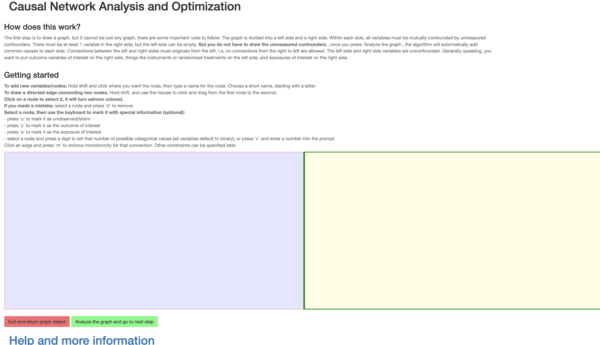
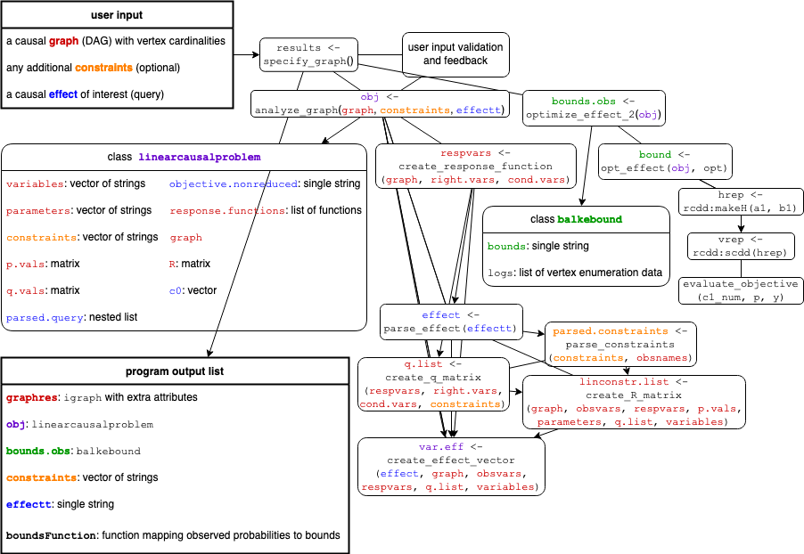

```{r setup, include=FALSE}
knitr::opts_chunk$set(echo = FALSE, warning = FALSE, message = FALSE)
library(causaloptim)
library(shiny)
library(kableExtra)

latex <- function(html = TRUE) {
  
  if(html) {
    ('LaTeX')
  } else {
    ('\\LaTeX')
  } 
  
}
```

# Introduction

A common goal in many different areas of scientific research is to determine causal relationships between one or more exposure variables and an outcome. Prior to any computation or inference, we must clearly state all assumptions made, i.e., all subject matter knowledge available, regarding the causal relationships between the involved variables as well as any additional variables, called confounders, that may not be measured but influence at least two other variables of interest. A popular tool in applied research for encoding these causal assumptions is a directed acyclic graph (DAG), in which directed edges represent direct causal influences [@greenland1999causal]. Such a DAG not only clearly states the assumptions made by the researcher, but also comes with a sound methodology for causal inference, in the form of identification results (theorems on when an estimand is estimable) as well as derivation of expressions of causal estimands in terms of observable quantities [@pearl2009causality].

Unfortunately, point identification of a desired causal effect typically requires an assumption of no unmeasured confounders, in some form. When there are unmeasured confounders, it is sometimes still possible to derive bounds on the effect, i.e., a range of possible values for the causal effect in terms of the observed data distribution. Symbolic bounds are algebraic expressions for the bounds on the causal effect written in terms of probabilities that can be estimated using observed data. Alexander Balke and Judea Pearl first used linear programming to derive tight symbolic bounds in a simple binary instrumental variable (IV) setting [@balke1997bounds]. Balke wrote a program in `C++` to take a linear programming problem as text file input, perform variable reduction, conversion of equality constraints into inequality constraints, and perform the vertex enumeration algorithm of @mattheiss1973algorithm. This program has since been used by researchers in the field of causal inference [@balke1997bounds; @cai2008bounds; @sjolander2009bounds; @sjolander2014bounds] but it is not particularly accessible because of the technical challenge of translating the DAG plus causal query into the constrained optimization problem and determining whether it is linear. Moreover, the program is not optimized and hence does not scale well to more complex problems. Since they only cover a simple instrumental variable setting, it has also not been clear to what extent their techniques extend to more general settings, nor how to apply them to more complex queries. Thus, applications of this approach have been limited to a small number of settings and few attempts to generalize the method to more widely applicable settings have been made.

Recent developments have expanded the applicability by generalizing the techniques and the causal DAGs and effects to which they apply [@generalcausalbounds]. These new methods have been applied in novel observational and experimental settings [@gabriel2020causal; @gabriel2021nonparametric; @gabriel2022sharp]. Moreover, through the `R` package \CRANpkg{causaloptim} [@causaloptim], these computations are now accessible. With \CRANpkg{causaloptim}, the user needs only to give input in a way they would usually express their causal assumptions and state their target causal estimand; through a DAG and counterfactual expression. Providing DAGs through textual input is an awkward experience for most users, as DAGs are generally communicated pictorially. Our package \CRANpkg{causaloptim} provides a user-friendly graphical interface (GUI) through a web browser, where the user can draw their DAG in a way that is familiar to them. The methodology that underpins \CRANpkg{causaloptim} is not universal however; some restrictions on the DAG and query are imposed. These are validated and communicated to the user through the graphical interface, which guides the user through providing the DAG and query, adding any extra conditions beyond those encoded in the DAG, computing, interpreting and exporting the bounds for various further analyses. 

There exist few other `R`-packages related to causal bounds and none to our knowledge for computation of symbolic bounds. \CRANpkg{bpbounds} [@bpbounds-package] provides a text-based interface to compute numeric bounds for the original single instrumental variable example of Balke and Pearl and extends this by being able to compute bounds given different types of data input including a ternary rather than binary instrument. There is also a standalone program written in `Java` by the `TETRAD Project` (https://github.com/cmu-phil/tetrad) that includes a GUI and has a wrapper for `R`. Its focus, however, is on causal discovery in a given sample data set, and although it can also compute bounds, it can do so only numerically for the given data set.

In this paper we describe our `R` package \CRANpkg{causaloptim}, first focusing on the graphical and programmatic user interfaces in the next 2 sections. Then we highlight some of our interesting functions and data structures that may be useful in other contexts. We provide a summary of the theoretical background and methods, while referring to the companion paper @generalcausalbounds for the details. We illustrate the use of the package with some numeric examples and close with a discussion and summary. 

# Graphical user interface

In the following, we will work through the binary instrumental variable example, where we have 3 observed binary variables $X$, $Y$, $Z$, and we want to determine the average causal effect of $X$ on $Y$ given by the total causal risk difference, in the presence of unmeasured confounding by $U_R$ and an instrumental variable $Z$. Our causal DAG is given by $Z\to X\to Y$ and $X\leftarrow U_R\to Y$ and our causal query is $P(Y(X=1)=1)-P(Y(X=0)=1)$, where we use $Y(X = x)$ to denote the counterfactual outcome $Y$ if $X$ were intervened upon to have value $x$. The package can handle more variables and complex settings including multiple exposures, outcomes and nested counterfactuals (although only a single exposure and outcome may be set by clicking vertices in the GUI, the query may easily be modified to a more complex one), but this classic example will serve to showcase its functionality.

\CRANpkg{causaloptim} includes a GUI implemented in \CRANpkg{shiny} [@shiny]. The interface is launched in the user's default web browser by calling `specify_graph()`. 
Once the \CRANpkg{shiny} app is launched, the user is presented with an interactive display as shown in Figure \@ref(fig:InterfaceStart), in which they can draw their causal DAG. This display is divided into a left side $\mathcal{L}$ and right side $\mathcal{R}$ to classify the vertices according to the class of DAGs that the method covers. This division signifies the following: Existence of unmeasured confounding is assumed *within each* of these sides, but *not between* them, and any causal influence between the two sides *must originate* in $\mathcal{L}$. Generally speaking, the outcome variables of interest will typically be on the right side, things like instruments or randomized treatments will be on the left side, and confounded exposures of interest on the right side. Thus, for the example, we would want to put the instrumental variable on the left side, but the exposure and outcome on the right side. In the web version of this article an interactive version of this interface is shown at the end of this section. 

```{r InterfaceStart, out.width = "100%", fig.cap = "The Shiny web interface at launch", fig.alt = "A picture of the causaloptim Shiny app web interface.", fig.align = 'center', fig.show = 'hold'}

```

The DAG that we aim to construct is depicted in Figure \@ref(fig:iv-fig).

```{r iv-fig, engine = 'tikz', out.width = "100%", fig.cap = "Causal DAG for the IV example.", fig.alt = "A picture of the instrumental variable DAG", fig.align = 'center', fig.show = 'hold', fig.height=3}
\begin{tikzpicture}
\definecolor{rightcol}{HTML}{FFFF00}
\definecolor{leftcol}{HTML}{0000FF}
\draw[fill=rightcol, opacity=0.1, very thick] (3,-1) -- (3,3) -- (7,3) -- (7,-1) -- (3,-1);
\draw[fill=leftcol, opacity=0.1, very thick] (-1,-1) -- (3,-1) -- (3,3) -- (-1,3) -- (-1,-1);
\draw[opacity=0.9, thick] (-1,-1) -- (3,-1) -- (3,3) -- (-1,3) -- (-1,-1);
\draw[opacity=0.9, very thick] (3,-1) -- (3,3) -- (7,3) -- (7,-1) -- (3,-1);
\node[draw, circle] at (1, 0) (Z) {$Z$};
\node[draw, circle] at (4, 0) (X) {$X$};
\node[draw, circle] at (6, 0) (Y) {$Y$};
\node[draw, circle, dashed] at (5, 2) (Ur) {$U_r$};
\draw [->] (Z) to (X);
\draw [->] (X) to (Y);
\draw [->] (Ur) to (X);
\draw [->] (Ur) to (Y);
\end{tikzpicture}
```

## Specifying the setting by drawing a causal diagram and adding attributes

```{r DAG, echo=FALSE, fig.align='default', out.width = '50%', fig.show='hold', fig.cap="Constructing the DAG", fig.subcap=c("Adding and naming variables", "Adding directed edges")}
knitr::include_graphics(c("figures/InterfaceAddNode2.png", "figures/InterfaceAddedArcs2.png"))
```

The DAG is drawn using a point-and-click device (e.g., a mouse) to add vertices representing variables (by Shift-click) and name them (using any valid variable name in `R` without underscores), and to draw edges representing direct causal influences (Shift+drag) between them. The vertices may also be moved around, renamed and deleted (as can the edges) as also described in an instruction text preceding the DAG interface. As shown in Figure \@ref(fig:DAG), for the example we add a vertex $Z$ on the left side, and vertices $X$ and $Y$ on the right side. Then the $Z \to X$ and $X \to Y$ edges are added by Shift+clicking on a parent vertex and dragging to the child vertex. There is no need to add the unmeasured confounder variable $U_R$ as it is assumed and added automatically. The same would have applied to $U_L$, but a confounder is added to a side only if it contains at least two variables.

Importantly, the nodes may be selected and assigned additional information. In $\mathcal{R}$, a variable may be assigned as unobserved (click+'u'). All observed variables are assumed categorical and their cardinality (i.e., number of levels) may be set (click+'c' brings up a prompt for this this number; alternatively a short-cut click+'any digit' is provided), with the default being binary. Although the causal query (i.e., the causal effect of interest) is entered subsequently, the DAG interface provides a convenient short-cut; a node $X$ may be assigned as an exposure (click+'e') and another $Y$ as outcome (click+'y'), whereupon the default query is the total causal risk difference $P(Y(X=1)=1)-P(Y(X=0)=1)$. Finally, an edge may be assigned as representing an assumed monotonic influence (click+'m'), i.e., that increasing the value of the exposure can not decrease the value of the outcome, e.g, $X(Z=0)\le X(Z=1)$. The nodes and edges change appearance according to their assigned characteristics (Figure \@ref(fig:Cardinality)) and violations to the restrictions characterizing the class of DAGs are detected and communicated to the user.

```{r Cardinality, echo=FALSE, fig.align='default', out.width = '33%', fig.show='hold', fig.cap="Setting attributes", fig.subcap=c("Setting the number of categories", "Confirmation message", "Setting exposure and outcome")}
knitr::include_graphics(c("figures/InterfaceSetCard2.png", "figures/InterfaceCardSet2.png", "figures/InterfaceAttribSet2.png"))
```

Once the DAG has been drawn, the user may click the button "Analyze the graph", upon which the DAG is interpreted and converted into an annotated \CRANpkg{igraph}-object [@igraph] as described in the implementation details below, and the results are displayed in graphical form to the user (Figure \@ref(fig:causalDAG)). The addition of $U_R$, the common unmeasured cause of $X$ and $Y$, is added and displayed in this static plot. 

```{r causalDAG, echo=FALSE, fig.align='default', out.width = '50%', fig.show='hold', fig.cap="The causal DAG and bounds", fig.subcap=c("Graphical summary of the DAG with added confounding", "Computing the bounds")}
knitr::include_graphics(c("figures/InterfaceQuery2a.png", "figures/InterfaceBounds2a.png"))
```

```{r, include = knitr::is_html_output()}
fluidPage(
    headerPanel("Interactive content: Drawing the DAG"), 
    fluidRow(id = "helptext", 
             column(12, helpText("The graph is divided into a left side and a right side. There is no confounding allowed between the left and right sides. All variables on the right side are confounded. Connections between the left and right sides must originate from the left. I.e, no connections from the right to left are allowed. On the left side, arbitrary connections are allowed and the model assumes that all nodes are observed and connected. On the right side, unmeasured variables are allowed, and the procedure assumes unmeasured confounding between all nodes. Once you press 'Analyze the graph', the algorithm will automatically add common causes to each side. ")), 
             column(12, helpText("Shift+click to add nodes. Shift+drag to connect nodes. Click to select nodes/edges and press 'd' to remove. Click a node to select and then press 'u' to mark it as unobserved/latent or press 'y' to mark it as the outcome of interest, or press 'e' to mark it as the exposure of interest. Select a node and press a digit to set that number of possible categorical values (all variables default to binary), or press 'c' and enter a number into the prompt. Click an edge and press 'm' to enforce monotonicity for that connection. Other constraints can be specified later. "))
             ),
    fluidRow(id = "graphrow",
        column(12, 
               tagList(tags$div(id="nvalsModal", class="modal fade", role="dialog", 
                                tags$div(class="modal-dialog modal-dialog-centered", role="document", 
                                         tags$div(class="modal-content shadow", 
                                                  tags$div(class="modal-header", 
                                                           tags$h5(class="modal-title", "Enter number of values: ")
                                                           ), 
                                                  tags$div(class="modal-body", 
                                                           tags$input(id="nvalsInput", type="number", class="form-control", value=2, min=2)
                                                           ), 
                                                  tags$div(class="modal-footer", 
                                                           tags$button(type="button", class="btn btn-default", `data-dismiss`="modal", "Cancel"), 
                                                           tags$button(id="nvalsSubmit", type="button", class="btn btn-primary", `data-toggle`="modal", `data-target`="#nvalsModal", "Ok")))))), 
               tagList(tags$div(id="toast")), 
               tagList(tags$div(id="graph", style="height:480px"), 
                          tags$br()))
    ), 
    #verbatimTextOutput("outcode"), # for debugging
    actionButton("endbtn", "Exit and return graph object", style="background-color: #fb6970"),
    actionButton("analyze", "Analyze the graph", style="background-color: #69fb82"), 
    
    tags$script(src = "d3.v3.min.js"),
    tags$script(src = "jquery.js"),
    tags$script(src = "shiny.js"),
    tags$script(src = "graph-creator.js")
)
```

## Specifying the causal query

Next, the user is asked to specify the causal query, i.e., causal effect of interest. 
If no outcome variable has been assigned in the DAG then the input field for the causal query is left blank and a query needs to be specified. In our example, since we have assigned an exposure and outcome using the DAG interface, the total causal risk difference $P(Y(X=1)=1)-P(Y(X=0)=1)$ is suggested. 

## Specifying optional additional constraints

The user is also given the option to provide additional constraints besides those imposed by the DAG. This may be considered an optional advanced feature where, e.g., monotonicity of a certain direct influence of $Z$ on $X$ may be assumed by entering $X(Z=1)\ge X(Z=0)$, with any such extra constraints separated by line breaks. If this feature is used, the input is followed by clicking the button "Parse", which identifies and fixes them. 

## Computing the symbolic tight bounds on the query under the given constraints

As the final step, the button "Compute the bounds" is clicked, whereupon the constraints and objective are compiled into an optimization problem which is then solved for tight causal bounds on the query symbolically in terms of observational quantities (conditional probabilities of the observed variables in the DAG) and the expressions are displayed alongside information on how the parameters are to be interpreted in terms of the given variable names (Figure \@ref(fig:causalDAG)). During computation, a progress indicator is shown, and the user should be aware that complex and/or high-dimensional problems may take significant time. The interface also provides a feature to subsequently convert the bounds to `r latex(knitr::is_html_output())`-code using standard probabilistic notation for publication purposes. 

Once done, clicking "Exit and return objects to R" stops the \CRANpkg{shiny} app and returns all information about the DAG, query and computed bounds to the `R`-session. 
This information is bundled in a list containing the graph, query, parameters and their interpretation, the symbolic tight bounds as expressions as well as implementations as `R`-functions and further log information about the formulation and optimization procedures. 

# Programmatic user interface

Interaction may also be done entirely programmatically as we illustrate with the same binary instrumental variable example. First we create the `igraph` object using the `graph_from_literal` function. Once the basic graph is created, the necessary vertex and edge attributes are added. The risk difference is defined as a character object. The `analyze_graph` function is the workhorse of \CRANpkg{causaloptim}; it translates the causal graph, constraints, and causal effect of interest into a linear programming problem. This linear programming object, stored in `obj` in the code below, gets passed to `optimize_effect_2` which performs vertex enumeration to obtain the bounds as symbolic expressions in terms of observable probabilities. Note that when we textually enter the DAG, we also manually add the unmeasured confounding. Although the unmeasured confounder is designated as binary in the code, this is *not* assumed in the the computations where it is treated as possibly continuous, e.g.

```{r, echo = TRUE, collapse = TRUE}
graph <- igraph::graph_from_literal(Z -+ X, X -+ Y, 
                                    Ur -+ X, Ur -+ Y)
V(graph)$leftside <- c(1, 0, 0, 0)
V(graph)$latent   <- c(0, 0, 0, 1)
V(graph)$nvals    <- c(2, 2, 2, 2)
E(graph)$rlconnect     <- c(0, 0, 0, 0)
E(graph)$edge.monotone <- c(0, 0, 0, 0)

riskdiff <- "p{Y(X = 1) = 1} - p{Y(X = 0) = 1}"
obj <- analyze_graph(graph, constraints = NULL, effectt = riskdiff)
bounds <- optimize_effect_2(obj)
bounds
```

The resulting `bounds` object contains character strings representing the bounds and logs containing detailed information from the vertex enumeration algorithm. The bounds are printed to the console but more features are available to facilitate their use. The `interpret_bounds` function takes the bounds and parameter names as input and returns an `R` function implementing vectorized forms of the symbolic expressions for the bounds. 

```{r, echo = TRUE}
bounds_function <- interpret_bounds(bounds$bounds, obj$parameters)
str(bounds_function)
```

The results can also be used for numerical simulation using `simulate_bounds`. This function randomly generates counterfactuals and probability distributions that satisfy the constraints implied by the DAG and optional constraints. It then computes and returns the bounds as well as the true causal effect.

If one wants to bound a different effect using the same causal graph, the `update_effect` function can be used to save some computation time. It takes the object returned by `analyze_graph` and the new effect string and returns an object of class `linearcausalproblem` that can be optimized:  
`obj2 <- update_effect(obj, "p{Y(X = 1) = 1}")`. 

Finally, `r latex(knitr::is_html_output())`-code may also be generated using the function `latex_bounds` as in  
`latex_bounds(bounds$bounds, obj$parameters)` yielding 
\tiny
\begin{align*}
 \mbox{Lower bound} &= \mbox{max} \left. \begin{cases}   P(X = 0, Y = 0 | Z = 0) - P(X = 0, Y = 0 | Z = 1) - P(X = 1, Y = 0 | Z = 1) - P(X = 0, Y = 1 | Z = 1),\\ 
   P(X = 0, Y = 0 | Z = 0) - P(X = 0, Y = 0 | Z = 1) - P(X = 1, Y = 0 | Z = 0) - P(X = 1, Y = 0 | Z = 1) - P(X = 0, Y = 1 | Z = 0),\\ 
   P(X = 0, Y = 0 | Z = 0) - P(X = 0, Y = 0 | Z = 1) + P(X = 1, Y = 0 | Z = 0) - 2P(X = 1, Y = 0 | Z = 1) - 2P(X = 0, Y = 1 | Z = 1),\\ 
   -P(X = 1, Y = 0 | Z = 1) - P(X = 0, Y = 1 | Z = 1),\\ 
   -P(X = 1, Y = 0 | Z = 0) - P(X = 0, Y = 1 | Z = 0),\\ 
   -P(X = 0, Y = 0 | Z = 0) + P(X = 0, Y = 0 | Z = 1) - 2P(X = 1, Y = 0 | Z = 0) + P(X = 1, Y = 0 | Z = 1) - 2P(X = 0, Y = 1 | Z = 0),\\ 
   -P(X = 0, Y = 0 | Z = 0) + P(X = 0, Y = 0 | Z = 1) - P(X = 1, Y = 0 | Z = 0) - P(X = 1, Y = 0 | Z = 1) - P(X = 0, Y = 1 | Z = 1),\\ 
   -P(X = 0, Y = 0 | Z = 0) + P(X = 0, Y = 0 | Z = 1) - P(X = 1, Y = 0 | Z = 0) - P(X = 0, Y = 1 | Z = 0) \end{cases} \right\} \\
 \mbox{Upper bound} &= \mbox{min} \left. \begin{cases}   1 - P(X = 1, Y = 0 | Z = 1) - P(X = 0, Y = 1 | Z = 0),\\ 
   1 + P(X = 0, Y = 0 | Z = 0) + P(X = 1, Y = 0 | Z = 0) - 2P(X = 1, Y = 0 | Z = 1) - P(X = 0, Y = 1 | Z = 1),\\ 
   2 - P(X = 0, Y = 0 | Z = 1) - P(X = 1, Y = 0 | Z = 0) - P(X = 1, Y = 0 | Z = 1) - 2P(X = 0, Y = 1 | Z = 0),\\ 
   1 - P(X = 1, Y = 0 | Z = 1) - P(X = 0, Y = 1 | Z = 1),\\ 
   1 - P(X = 1, Y = 0 | Z = 0) - P(X = 0, Y = 1 | Z = 0),\\ 
   1 + P(X = 0, Y = 0 | Z = 1) - 2P(X = 1, Y = 0 | Z = 0) + P(X = 1, Y = 0 | Z = 1) - P(X = 0, Y = 1 | Z = 0),\\ 
   2 - P(X = 0, Y = 0 | Z = 0) - P(X = 1, Y = 0 | Z = 0) - P(X = 1, Y = 0 | Z = 1) - 2P(X = 0, Y = 1 | Z = 1),\\ 
   1 - P(X = 1, Y = 0 | Z = 0) - P(X = 0, Y = 1 | Z = 1) \end{cases} \right\}.
 \end{align*} 
 \normalsize

# Implementation and program overview

An overview of the main functions and their relations is depicted as a flow chart in Figure \@ref(fig:Overview). All functions may be called individually by the user in the `R`-console and all input, output and interaction available through the \CRANpkg{shiny} app is available through the `R`-console as well. 

@generalcausalbounds define the following class of problems for which the query in general is not identifiable, but for which a methodology to derive symbolic tight bounds on the query is provided. 
The causal DAG consists of a finite set $\mathcal{W}=\{W_1,\dots,W_n\}=\mathcal{W}_\mathcal{L}\cup\mathcal{W}_\mathcal{R}$ of categorical variables with $\mathcal{W}_\mathcal{L}\cap\mathcal{W}_\mathcal{R}=\varnothing$, no edges going from $\mathcal{W}_\mathcal{R}$ to $\mathcal{W}_\mathcal{L}$ and no external common parent between $\mathcal{W}_\mathcal{L}$ and $\mathcal{W}_\mathcal{R}$, but *importantly* external common parents $\mathcal{U}_\mathcal{L}$ and $\mathcal{U}_\mathcal{R}$ of variables within $\mathcal{W}_\mathcal{R}$ and $\mathcal{W}_\mathcal{R}$ may not be ruled out. Nothing is assumed about any characteristics of these confounding variables $\mathcal{U}_\mathcal{L}$ and $\mathcal{U}_\mathcal{R}$.

The causal query may in principle be any linear combination (although \CRANpkg{causaloptim} version 0.9.8 implements contrasts with unit coefficients only) of joint probabilities of factual and counterfactual outcomes expressed in terms of the variables in $\mathcal{W}$ and may always be expressed as a sum of probabilities of response function variables of the DAG. It is subject to the restriction that each outcome variable is in $\mathcal{W}_\mathcal{R}$ and if $\mathcal{W}_\mathcal{L}\ne\varnothing$ it is also subject to a few regularity conditions as detailed in @generalcausalbounds. Tight bounds on the query may then be derived symbolically in terms of conditional probabilities of the observable variables $\mathcal{W}$.

Algorithms 1 and 2 in @generalcausalbounds construct the constraint space and causal query in terms of the joint probabilities of the response function variables and in \CRANpkg{causaloptim} are implemented in the functions `create_R_matrix` and `create_effect_vector` respectively. Both are called as sub-procedures of the function `analyze_graph` to translate the causal problem to that of optimizing an objective function over a constraint space. The implementation of Algorithm 1 involves constructing the response functions themselves as actual `R`-functions. Evaluating these correspond to evaluating the structural equations of the causal DAG.

The conditions on the DAG suffice to ensure that the causal query will depend only on the response functions corresponding to the variables in $\mathcal{W}_\mathcal{R}$ and that the exhaustive set of constraints on their probabilities are linear in a subset of conditional probabilities of observable variables (Proposition 2 in @generalcausalbounds), and the conditions on the query in turn ensure that it may be expressed as a linear combination of joint probabilities of the response functions of the variables in $\mathcal{W}_\mathcal{R}$ (Proposition 3 in @generalcausalbounds). 
Once this formulation of the causal problem as a linear program has been set up, a vertex enumeration method is employed to compute the extrema symbolically in terms of conditional probabilities of the observable variables. 

The main and interesting functions will be described in some detail below. We begin however with an overview of how they are tied together by the \CRANpkg{shiny} app.

```{r include=FALSE}
colorize <- function(x, color) {
  if (knitr::is_latex_output()) {
    sprintf("\\textcolor[HTML]{%s}{%s}", color, x)
  } else if (knitr::is_html_output()) {
    sprintf("<span style='color: #%s;'>%s</span>", color,
      x)
  } else x
}
```

(ref:figcap) A function overview flow chart, listing user input, program output and overall structure. The function `specify_graph` launches the GUI. Undirected edges correspond to function calls and arrow heads to direct input. Objects are color coded according to their sources of information, with `r colorize("red", "CC0000")` corresponding to the `r colorize("DAG", "CC0000")`, `r colorize("blue", "0000FF")` to the `r colorize("query", "0000FF")` and `r colorize("purple", "6600CC")` to a mixture of them, as in the optimization `r colorize("problem", "6600CC")` of class `linearcausalproblem`. Finally, `r colorize("green", "009900")` corresponds to the subsequent optimization process producing the `r colorize("bounds", "009900")` of class `balkebound`.

```{r Overview, echo=FALSE, fig.align='center', out.width = '100%', fig.show='hold', fig.cap="(ref:figcap)"}

```

### `specify_graph`

The graphical interface is launched by `specify_graph()`, or preferably  
`results <- specify_graph()`. Once the \CRANpkg{shiny} app is stopped, the input, output and other useful information is returned by the function, so we recommend assigning it to a variable so they are saved in the `R`-session and may easily be further analyzed and processed. All further function calls will take place automatically as the user interacts with the web interface. Thus, from a basic user perspective, `specify_graph` is the main function. The core functionality however is implemented in the functions `analyze_graph`, `optimize_effect_2` and their subroutines. 

The `JavaScript` that handles the communication between the \CRANpkg{shiny} server and the input as the user draws a DAG through the web interface uses on the project  
`directed-graph-creator`, an interactive tool for creating directed graphs, created using `d3.js` and hosted at https://github.com/cjrd/directed-graph-creator, which has been modified for the purpose of causal diagrams. The modification binds the user inputs as they interact with the graph to \CRANpkg{shiny} so that the directed graph and its attributes set by the user are reactively converted into an `igraph`-object for further processing. Since directed graphs are common in many computational and statistical problems, this \CRANpkg{shiny} interface may also be valuable to many other `R`-package authors and maintainers who may wish to provide their users with an accessible and intuitive way to interact with their software.

The server listens to a reactive function that, as the user draws the DAG, collects information about the current edges, collects and annotates vertices, adds left- and right-side confounding, and returns an annotated `igraph`-object, comprising information about the connectivity along with some additional attributes; for each variable, its name, cardinality, latency-indicator and side-indicator, and for each edge, a monotonicity-indicator and (to detect and communicate violations on direction) a right-to-left-indicator. The server meanwhile also monitors the DAG for any violation of the restriction that each edge between $\mathcal{L}$ and $\mathcal{R}$ must go *from* $\mathcal{L}$ *to* $\mathcal{R}$, and if detected directly communicates this to the user through a text message in the \CRANpkg{shiny} app. The app makes use \CRANpkg{shiny} modules which makes testing the interface easier, and  \CRANpkg{causaloptim} includes many automated tests to make sure that the GUI functionality works as intended.

### `analyze_graph`

The function `analyze_graph` takes a DAG (in the form of an `igraph` object), optional constraints, and a string representing the causal effect of interest and proceeds to construct and return a linear optimization problem (a `linearcausalproblem`-object) from these inputs. 

First, some basic data structures are created to keep track of the observed variables, their possible values, the latent variables, and whether they are in $\mathcal{L}$ or $\mathcal{R}$. Once these basic data-structures have been created, the first task of the algorithm is to create the response function variables (for each variable, observed or not, except $U_\mathcal{L}$ and $U_\mathcal{R}$). Probabilities of these will be the entities $\mathbf{q}$ in which the objective function (representing the target causal effect) is expressed and will constitute the points in the space it is optimized over, where this space itself is constrained by the the relationships between them and observed conditional probabilities $\mathbf{p}$. 

### `create_response_function`

The function `create_response_function` returns a list `respvars` that has a named entry for each observed variable, containing its response function variable and response function. If $X$ is an observed variable with $n$ response functions, then they are enumerated by $\{0,\dots,n-1\}$. Its entry `respvars$X` contains the response function variable $R_X$ of $X$, and is a list with two entries. The first, `respvars$X$index`, is a vector containing all the possible values of $R_X$, i.e., the integers $(0,\dots,n-1)$. The second, `respvars$X$values` is itself a list with $n$ entries; each containing the particular response function of $X$ corresponding to its index. Each such response function is an actual `R`-function and may be evaluated by passing it any possible values of the parents of $X$ as arguments. 

Next, the response function variables are used in the creation of a matrix of unobserved probabilities. Specifically the joint probabilities $P(\mathbf{R}_\mathcal{R}=\mathbf{r}_\mathcal{R})$ for each possible value-combination $\mathbf{r}_\mathcal{R}$ of the response function variables $\mathbf{R}_\mathcal{R}$ of the right-side-variables $\mathbf{W}_\mathcal{R}$. In @generalcausalbounds, the possible value-combinations $\mathbf{r}_\mathcal{R}$ are enumerated by $\gamma\in\{1,\dots,\aleph_\mathcal{R}\}$ with corresponding probabilities $q_\gamma:=P(\mathbf{R}_\mathcal{R}=\mathbf{r}_\gamma)$ being components of the vector $\mathbf{q}\in[0,1]^{\aleph_\mathcal{R}}$. 

### `create_R_matrix`

The constraints that the DAG and observed conditional probabilities $\mathbf{p}$ (in `p.vals`) impose on the unobserved probabilities $\mathbf{q}$ (represented by `variables`) are linear. 
Specifically, there exists a matrix whose entries are the coefficients relating `p.vals` to `variables`. This matrix is called $P$ in @generalcausalbounds, where its existence is guaranteed by Proposition 2 and its construction is detailed in Algorithm 1, which is implemented in the function `create_R_matrix`. This function returns back a list with two entries; a vector of strings representing the linear constraints on the unobserved $\mathbf{q}\in[0,1]^{\aleph_\mathcal{R}}$ imposed by and in terms of the observed $\mathbf{p}\in[0,1]^B$ and the numeric matrix $R\in\{0,1\}^{(B+1)\times\aleph_\mathcal{R}}$ of coefficients corresponding to these constraints as well as the probabilistic ones and given by $R=\begin{pmatrix}\mathbf{1}\\P\end{pmatrix}$ where $P\in\{0,1\}^{B\times\aleph_\mathcal{R}}:\mathbf{p}=P\mathbf{q}$, so $R\mathbf{q}=\begin{pmatrix}1\\\mathbf{p}\end{pmatrix}$. 

This determines the constraint space as a compact convex polytope in $\mathbf{q}$-space, i.e., in $\mathbb{R}^{\aleph_\mathcal{R}}$. To create the matrix, we define a recursive function `gee_r` that takes two arguments; a positive integer `i` being the index $i\in\{1,\dots,n\}$ of a variable $W_i\in\mathcal{W}$ (i.e. the $i^{th}$ component of $\mathbf{W}$ or, equivalently, the `i`th entry of `obsvars`) and a vector `r` being a value $\mathbf{r}\in\nu(\mathbf{R})$ in the set $\nu(\mathbf{R})$ of all possible value-vectors of the joint response function variable $\mathbf{R}$. 
This recursive function is called for each variable in `obsvars` and for each possible value of the response function variable vector. 
The base case is reached if the variable has no parents, in which case the list corresponding to the response function variable $R_{W_i}$ of $W_i$ is extracted from `respvars`. From this list, the entry whose index matches the `i`th index of `r` (i.e. the one corresponding to the response function variable value $r_i=$`r[i]`) is extracted and finally its value, i.e., the corresponding response function itself, is extracted and is evaluated on an empty list of arguments, since it is a constant function and determined only by the value $r_i$. 

The recursive case is encountered when `parents` is non-empty. If so, then for each parent in `parents`, its index in `obsvars` is determined and `gee_r` is recursively called with the same vector `r` as first argument but now with this particular index (i.e. that of the current parent) as second argument. The numeric values returned by these recursive calls are then sequentially stored in a vector `lookin`, whose entries are named by those in `parents`. Just as in the base case, the response function corresponding to the particular value $r_i$ of the response function variable $R_{W_i}$ (i.e. the response function of the variable `obsvars[i]` that has the index `r[i]`) is extracted from `respvars` and is now evaluated with arguments given by the list `lookin`. 
Note that `gee_r(r, i)` corresponds to the value $w_i=g^*_{W_i}(\mathbf{r})$ in @generalcausalbounds.

Then the values that match the observed probabilities are recorded, the corresponding entries in the current row of the matrix `R` are set to 1 and a string representing the corresponding equation is constructed and added to the vector of constraints. 

### `parse_effect`

Now that the constraint space has been determined, the objective function representing the causal query needs to be specified as a linear function of the components of $\mathbf{q}$, i.e., `variables`. First, the causal query that has been provided by the user as a text-string in `effectt` is passed to the function `parse_effect`, which identifies its components including nested counterfactuals and creates a data structure representing the causal query. This structure includes nested lists which represent all interventional paths to each outcome variable in the query. 

Once the nested list `effect` is returned back to `analyze_graph`, it checks that the requirements (see Proposition 3 in @generalcausalbounds) on the query are fulfilled before creating the linear objective function. Despite these regularity conditions, a large set of possible queries may be entered using standard counterfactual notation, using syntax described in the accompanying instruction text along with examples such as $P(Y(M(X = 0), X = 1) = 1) - P(Y(M(X = 0), X = 0) = 1)$; the natural direct effect [@pearl2001direct] of a binary exposure $X$ at level $M=0$ on a binary outcome $Y$ *not* going through the mediator $M$, in the presence of unmeasured confounding between $M$ and $Y$ [@sjolander2009bounds].

### `create_effect_vector`

Now that the required characteristics of the query have been established, the corresponding objective function will be constructed by the function `create_effect_vector` which returns a list `var.eff` of string-vectors; one for each term in the query. Each such vector contains the names (strings in `variables`) of the response function variables of the right-side (i.e. the components of $\mathbf{q}$) whose sum corresponds the that particular term. 
The function `create_effect_vector` implements Algorithm 2 of @generalcausalbounds with the additional feature that
if the user has entered a query that is incomplete in the sense that there are omitted mediating variables on paths from base/intervention variables to the outcome variable, then this is interpreted as the user intending the effects of the base/intervention variables to be propagated through the mediators, so that they are set to their "natural" values under this intervention. These mediators are detected and their values are set accordingly. 

We define a recursive function `gee_rA` that takes three arguments; a positive integer `i` (the index $i$ of a variable $W_i\in\mathcal{W}=$`obsvars`), a vector `r` (a value $\mathbf{r}\in\nu(\mathbf{R})$ in the set $\nu(\mathbf{R})$ of all possible value-vectors of the joint response function variable $\mathbf{R}$) and a string `path` that represents an interventional path and is of the form "X -> ... -> Y" if not `NULL`. The base case is reached either if `path` is non-`NULL` and corresponds to a path to the intervention set or if `parents` is empty. 
In the former case, the corresponding numeric intervention-value is returned, and in the latter case, the value of the corresponding response function called on the empty list of arguments is returned just as in the base case of `gee_r`. 
The recursive case is encountered when `path` is `NULL` and `parents` is non-empty. 
This recursion proceeds just as in `gee_r`, but now rather with a recursive call to `gee_rA`, whose third argument is now `path = paste(gu, "->", path)` where the string in `gu` is the name of the parent variable in `parents` whose index `i` in `obsvars` is the second argument of this recursive call. This construction traces the full path taken from the outcome of interest to the variable being intervened upon. Note that `gee_rA(r, i, path)` corresponds to the value $w_i=h^{A_i}_{W_i}(\mathbf{r},W_i)$ in @generalcausalbounds.
A matrix is now created just as in the observational case, but this time using `gee_rA` instead of `gee_r` . 

### `optimize_effect_2`

Once the constraints on $\mathbf{q}$ as well as the effect of interest in terms of $\mathbf{q}$ have been established, it remains only to optimize this expression over the constraint space. Here, $\mathbf{c}$ denotes the constant gradient vector of the linear objective function and $P$ denotes the coefficient matrix of the linear restrictions on $\mathbf{q}$ in terms of $\mathbf{p}$ imposed by the causal DAG. By adding the probabilistic constraints on $\mathbf{q}$ we have arrived at e.g. the following linear program giving a tight lower bound on the average causal effect $\theta_\mathbf{q} = P\{Y(X = 1) = 1\} - P\{Y(X = 0) = 1\}$ in the simple instrumental variable problem of the introductory section:

\begin{align*}
\min_\mathbf{q} \theta_\mathbf{q}
&=\min\{\mathbf{c}^\top\mathbf{q}\mid \mathbf{q}\in\mathbb{R}^{16},\mathbf{q}\geq\mathbf{0}_{16\times1},\mathbf{1}_{1\times 16} \mathbf{q}=1,P\mathbf{q}=\mathbf{q}\}\\
&=\max\{\begin{pmatrix}1&\mathbf{q}^\top\end{pmatrix}\mathbf{y}\mid\mathbf{y}\in\mathbb{R}^{9},\mathbf{y}\geq \mathbf{0}_{9\times 1},\begin{pmatrix}\mathbf{1}_{16\times 1}&P^\top\end{pmatrix}\leq\mathbf{c}\}\\
&=\max\{\begin{pmatrix}1&\mathbf{q}^\top\end{pmatrix}\bar{\mathbf{y}}\mid\bar{\mathbf{y}}\text{ is a vertex of }\{\mathbf{y}\in\mathbb{R}^{9}\mid \mathbf{y}\geq\mathbf{0}_{9\times 1},R^\top\leq\mathbf{c}\}\}
\end{align*}

Since we allow the user to provide additional linear inequality constraints (e.g. it may be quite reasonable to assume the proportion of "defiers" in the study population of our example to be quite low), the actual primal and dual linear programs may look slightly more complicated, but this small example still captures the essentials.  
In general, given the matrix of linear constraints on the observable probabilities implied by the DAG and an optional user-provided matrix inequality, we construct the coefficient matrix and right hand side vector of the dual polytope.

The optimization via vertex enumeration step in \CRANpkg{causaloptim} is implemented in the function `optimize_effect_2` which uses the double description method for vertex enumeration, as implemented in the \CRANpkg{rcdd} package [@rcdd]. This step of vertex enumeration has previously been the major computational bottleneck. The approach is now based on `cddlib` (https://people.inf.ethz.ch/fukudak/cdd_home/), which has an implementation of the Double Description Method (dd). 
Any convex polytope can be dually described as either an intersection of half-planes (which is the form we get our dual constraint space in) or as a minimal set of vertices of which it is the convex hull (which is the form we want it in) and the dd algorithm efficiently converts between these two descriptions. `cddlib` also uses exact rational arithmetic, so there is no need to worry about any numerical instability issues. 
The vertices of the dual polytope are obtained and stored as rows of a matrix with `hrep <- rcdd::makeH(a1, b1);` `vrep <- rcdd::scdd(hrep);` `vertices <- vrep$output[vrep$output[, 1] == 0 & vrep$output[, 2] == 1, -c(1, 2), drop=FALSE]`. 

The rest is simply a matter of plugging them into the dual objective function, evaluating the expression and presenting the results. The first part of this is done by `apply(vertices, 1, function(y) evaluate_objective(c1_num, p, y))` (here `(c1_num,p)`$=(\begin{pmatrix}b_{\ell}^\top&1\end{pmatrix},p)$ separates the dual objective gradient into its numeric and symbolic parts).

\CRANpkg{causaloptim} also contains a precursor to to `optimize_effect_2`, called `optimize_effect`. This legacy function uses the original optimization procedure written in `C++` by Alexander Balke and involves linear program formulation followed by the vertex enumeration algorithm of @mattheiss1973algorithm. This has worked well for very simple settings but has been found to struggle on more complex problems and thus been insufficient for the ambitions of \CRANpkg{causaloptim}. The efficiency gains of `optimize_effect_2` over the legacy code have reduced the computation time for several setting from hours to milliseconds.

# Numeric examples

We illustrate with a couple of applications. Although the problem formulations are entered via the textual interface below, they may of course just as well be entered via the graphical interface prior to numeric evaluation. This is done by launching the GUI and assigning its results to a variable as in `results <- specify_graph()`, following steps similar to the initial example in the section "Graphical User Interface" and clicking “Exit and return objects to R”, whereupon all information about the DAG, query and bounds are accessible via `results`. Regardless if drawn via the GUI or entered via code, the DAG may be subsequently visualized using the `plot` function.

## A Mediation Analysis

In @sjolandernaturaldirecteffects, the author derives bounds on natural direct effects in the presence of confounded intermediate variables and applies them to data from the Lipid Research Clinics Coronary Primary Prevention Trial [@freedmandata], where subjects were randomized to cholestyramine treatment and presence of coronary heart disease events as well as levels of cholesterol were recorded after a 1-year follow-up period.
We let $X$ be a binary treatment indicator, with $X=0$ indicating actual cholestyramine treatment and $X=1$ indicating placebo. We further let $Y$ be an indicator of the occurrence of coronary heart disease events within follow-up, with $Y=0$ indicating event-free follow-up and $Y=1$ indicating an event. We finally let $M$ be a dichotomized (cut-off at $280\ mg/dl$) cholesterol level indicator, with $M=0$ indicating levels $<280\ mg/dl$ and $M=1$ indicating levels $\ge280\ mg/dl$.
The causal assumptions are summarized in the DAG shown in Figure \@ref(fig:mediation-fig), where $U_r$ is unmeasured and confounds the effect of $M$ on $Y$.

```{r mediation-fig, engine = 'tikz', out.width = "100%", fig.cap = "Causal DAG for mediation example", fig.alt = "A picture of the mediation DAG", fig.align = 'center', fig.show = 'hold', fig.height=3}
\begin{tikzpicture}
\definecolor{rightcol}{HTML}{FFFF00}
\definecolor{leftcol}{HTML}{0000FF}
\draw[fill=rightcol, opacity=0.1, very thick] (3,-1) -- (3,3) -- (7,3) -- (7,-1) -- (3,-1);
\draw[fill=leftcol, opacity=0.1, very thick] (-1,-1) -- (3,-1) -- (3,3) -- (-1,3) -- (-1,-1);
\draw[opacity=0.9, thick] (-1,-1) -- (3,-1) -- (3,3) -- (-1,3) -- (-1,-1);
\draw[opacity=0.9, very thick] (3,-1) -- (3,3) -- (7,3) -- (7,-1) -- (3,-1);
\node[draw, circle] at (1, 0) (X) {$X$};
\node[draw, circle] at (4, 1) (M) {$M$};
\node[draw, circle] at (6, 0) (Y) {$Y$};
\node[draw, circle, dashed] at (5, 2) (Ur) {$U_r$};
\draw [->] (X) to (M);
\draw [->] (X) to (Y);
\draw [->] (M) to (Y);
\draw [->] (Ur) to (M);
\draw [->] (Ur) to (Y);
\end{tikzpicture}
```

```{r mediation-dag, echo = TRUE}
b <- igraph::graph_from_literal(X -+ Y, X -+ M, M -+ Y, 
                                Ur -+ Y, Ur -+ M)
V(b)$leftside <- c(1, 0, 0, 0)
V(b)$latent   <- c(0, 0, 0, 1)
V(b)$nvals    <- c(2, 2, 2, 2)
E(b)$rlconnect     <- c(0, 0, 0, 0, 0)
E(b)$edge.monotone <- c(0, 0, 0, 0, 0)
```

Note that although the unmeasured confounder `Ur` appears to be designated as binary in this code, this is *not* assumed in the the computations, where nothing is assumed about its distribution.

Using the data from Table IV of @sjolandernaturaldirecteffects, we compute the observed conditional probabilities.

```{r mediation-data, echo = TRUE}
# parameters of the form pab_c, which represents 
# the probability P(Y = a, M = b | X = c)
p00_0 <- 1426/1888 # P(Y=0,M=0|X=0)
p10_0 <- 97/1888 # P(Y=1,M=0|X=0)
p01_0 <- 332/1888 # P(Y=0,M=1|X=0)
p11_0 <- 33/1888 # P(Y=1,M=1|X=0)
p00_1 <- 1081/1918 # P(Y=0,M=0|X=1)
p10_1 <- 86/1918 # P(Y=1,M=0|X=1)
p01_1 <- 669/1918 # P(Y=0,M=1|X=1)
p11_1 <- 82/1918 # P(Y=1,M=1|X=1)
```

We proceed to compute bounds on the controlled direct effect $CDE(0) = P(Y(M = 0, X = 1) = 1) - P(Y(M = 0, X = 0) = 1)$ of $X$ on $Y$ not passing through $M$ at level $M=0$, the controlled direct effect $CDE(1) = P(Y(M = 1, X = 1) = 1) - P(Y(M = 1, X = 0) = 1)$ at level $M=1$, the natural direct effect $NDE(0) = P(Y(M(X = 0), X = 1) = 1) - P(Y(M(X = 0), X = 0) = 1)$ of $X$ on $Y$ at level $X=0$ and the natural direct effect $NDE(1) = P(Y(M(X = 1), X = 1) = 1) - P(Y(M(X = 1), X = 0) = 1)$ at level $X=1$.

```{r mediation-computation, echo = TRUE}
CDE0_query <- "p{Y(M = 0, X = 1) = 1} - p{Y(M = 0, X = 0) = 1}"
CDE0_obj <- analyze_graph(b, constraints = NULL, effectt = CDE0_query)
CDE0_bounds <- optimize_effect_2(CDE0_obj)
CDE0_boundsfunction <- interpret_bounds(bounds = CDE0_bounds$bounds, 
                                        parameters = CDE0_obj$parameters)
CDE0_numericbounds <- CDE0_boundsfunction(p00_0 = p00_0, p00_1 = p00_1, 
                                          p10_0 = p10_0, p10_1 = p10_1, 
                                          p01_0 = p01_0, p01_1 = p01_1, 
                                          p11_0 = p11_0, p11_1 = p11_1)

CDE1_query <- "p{Y(M = 1, X = 1) = 1} - p{Y(M = 1, X = 0) = 1}"
CDE1_obj <- update_effect(CDE0_obj, effectt = CDE1_query)
CDE1_bounds <- optimize_effect_2(CDE1_obj)
CDE1_boundsfunction <- interpret_bounds(bounds = CDE1_bounds$bounds, 
                                        parameters = CDE1_obj$parameters)
CDE1_numericbounds <- CDE1_boundsfunction(p00_0 = p00_0, p00_1 = p00_1, 
                                          p10_0 = p10_0, p10_1 = p10_1, 
                                          p01_0 = p01_0, p01_1 = p01_1, 
                                          p11_0 = p11_0, p11_1 = p11_1)
NDE0_query <- "p{Y(M(X = 0), X = 1) = 1} - p{Y(M(X = 0), X = 0) = 1}"
NDE0_obj <- update_effect(CDE0_obj, effectt = NDE0_query)
NDE0_bounds <- optimize_effect_2(NDE0_obj)
NDE0_boundsfunction <- interpret_bounds(bounds = NDE0_bounds$bounds, 
                                        parameters = NDE0_obj$parameters)
NDE0_numericbounds <- NDE0_boundsfunction(p00_0 = p00_0, p00_1 = p00_1, 
                                          p10_0 = p10_0, p10_1 = p10_1, 
                                          p01_0 = p01_0, p01_1 = p01_1, 
                                          p11_0 = p11_0, p11_1 = p11_1)

NDE1_query <- "p{Y(M(X = 1), X = 1) = 1} - p{Y(M(X = 1), X = 0) = 1}"
NDE1_obj <- update_effect(CDE0_obj, effectt = NDE1_query)
NDE1_bounds <- optimize_effect_2(NDE1_obj)
NDE1_boundsfunction <- interpret_bounds(bounds = NDE1_bounds$bounds, 
                                        parameters = NDE1_obj$parameters)
NDE1_numericbounds <- NDE1_boundsfunction(p00_0 = p00_0, p00_1 = p00_1, 
                                          p10_0 = p10_0, p10_1 = p10_1, 
                                          p01_0 = p01_0, p01_1 = p01_1, 
                                          p11_0 = p11_0, p11_1 = p11_1)
```

We obtain the same symbolic bounds as @sjolandernaturaldirecteffects and the resulting numeric bounds are given in Table \@ref(tab:mediation-bounds) which of course agree with those of Table V in @sjolandernaturaldirecteffects.

```{r mediation-bounds}
# mediation effects
numeric_bounds <- rbind("CDE(0)" = CDE0_numericbounds, 
                        "CDE(1)" = CDE1_numericbounds, 
                        "NDE(0)" = NDE0_numericbounds, 
                        "NDE(1)" = NDE1_numericbounds)
knitr::kable(numeric_bounds, digits = 2, caption = "Bounds on the controlled and natural direct effects.")
```

## A Mendelian Randomization Study of the Effect of Homocysteine on Cardiovascular Disease

Mendelian randomization [@mendelian] assumes certain genotypes may serve as suitable instrumental variables for investigating the causal effect of an associated phenotype on some disease outcome. 

In @st0232, the authors investigate the effect of homocysteine on cardiovascular disease using the 677CT polymorphism (rs1801133) in the Methylenetetrahydrofolate Reductase gene as an instrument. They use observational data from @meleady_thermolabile_2003 in which the outcome is binary, the treatment has been made binary by a suitably chosen cut-off at $15\mu mol/L$, and the instrument is ternary (this polymorphism can take three possible genotype values). 

With $X$ denoting the treatment, $Y$ the outcome and $Z$ the instrument, the DAG is the one in Figure \@ref(fig:iv-fig) (although now with a ternary instrument) and the conditional probabilities are given as follows. 

```{r mendelian-data, echo = TRUE}
params <- list(p00_0 = 0.83, p00_1 = 0.88, p00_2 = 0.72, 
               p10_0 = 0.11, p10_1 = 0.05, p10_2 = 0.20, 
               p01_0 = 0.05, p01_1 = 0.06, p01_2 = 0.05, 
               p11_0 = 0.01, p11_1 = 0.01, p11_2 = 0.03)
```

The computation using \CRANpkg{causaloptim} is done using the following code.

```{r causaloptim-computation, echo = TRUE}
# Input causal DAG
b <- graph_from_literal(Z -+ X, X -+ Y, Ur -+ X, Ur -+ Y)
V(b)$leftside <- c(1, 0, 0, 0)
V(b)$latent <- c(0, 0, 0, 1)
V(b)$nvals <- c(3, 2, 2, 2)
E(b)$rlconnect <- c(0, 0,  0, 0)
E(b)$edge.monotone <- c(0, 0, 0, 0)
# Construct causal problem
obj <- analyze_graph(b, constraints = NULL, 
                     effectt = "p{Y(X = 1) = 1} - p{Y(X = 0) = 1}")
# Compute bounds on query
bounds <- optimize_effect_2(obj)
# Construct bounds as function of parameters
boundsfunction <- interpret_bounds(bounds = bounds$bounds, 
                                   parameters = obj$parameters)
# Insert observed conditional probabilities
numericbounds <- do.call(boundsfunction, as.list(params))
round(numericbounds, 2)
```

Our computed bounds agree with those computed using \CRANpkg{bpbounds} as well as those estimated using Theorem 2 of @richardson2014ace, who independently derived expressions for tight bounds that are applicable to this setting. 

# Summary and discussion

The methods and algorithms described in @generalcausalbounds to compute symbolic expressions for bounds on non-identifiable causal effects are implemented in the package \CRANpkg{causaloptim}. Our aim was to provide a user-friendly interface to these methods with a graphical interface to draw DAGs, specify causal effects with commonly used notation for counterfactuals, and take advantage of an efficient implementation of vertex enumeration to reduce computation times. These methods are applicable to a wide variety of causal inference problems which appear in biomedical research, economics, social sciences and more. Aside from the graphical interface, programming with the package is encouraged to promote reproducibility and advanced use. Our package includes automated unit tests and also tests for correctness by comparing the symbolic bounds derived using our program to independently derived bounds in particular settings. 

Our implementation uses a novel approach to draw DAGs using `JavaScript` in a web browser that can then be passed to `R` using \CRANpkg{shiny}. This graphical approach can be adapted and used in other settings where graphs need to be specified and computed on, such as other causal inference settings, networks, and multi-state models. Other algorithms and data structures that could be more broadly useful include the representation of structural equations as `R` functions, recursive evaluation of response functions, and parsing of string equations for causal effects and constraints. 


Note that \CRANpkg{causaloptim} computes bounds only in settings with tightness guarantees. Although the set of available causal queries is quite large, the set of admissible DAGs can appear restrictive. The usefulness of the methodology and implementation extends to a much larger class of problems however. Tight bounds for restricted settings can be used to derive potentially not tight but narrow valid bounds in less restrictive settings. In @kurokicai and @semipariv the authors make use of the tight Balke-Pearl bounds to derive narrow (but not necessarily tight) valid bounds on causal effects subject to causal DAGs that fall outside the scope for tightness guarantees using this methodology. We believe the tight bounds computed by \CRANpkg{causaloptim} hold great potential for such applications.
