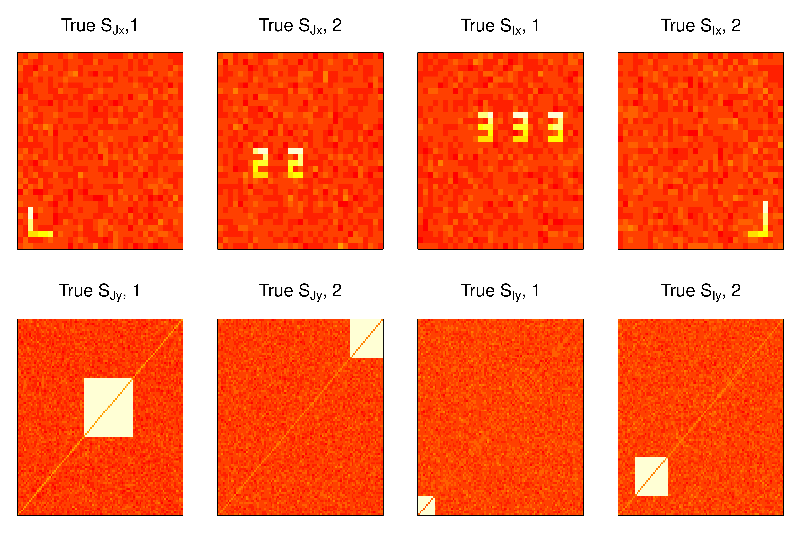
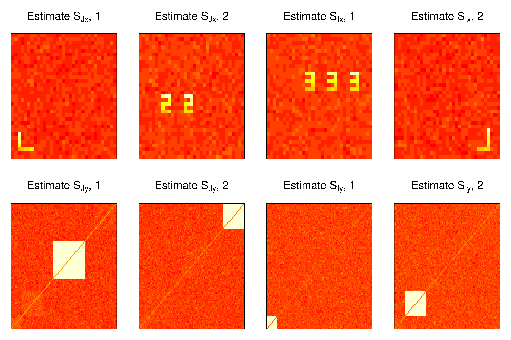
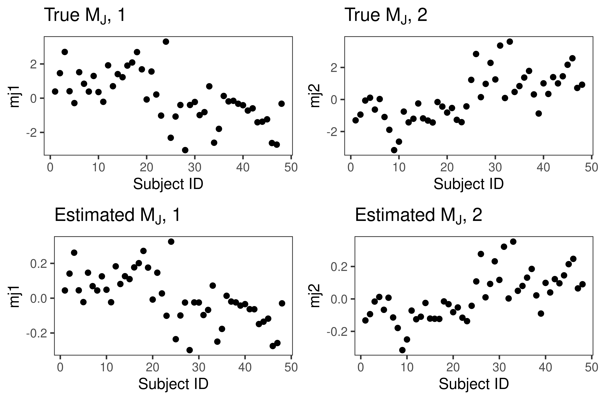

# Introduction


Combining information across different data sets collected on the same participants can improve our understanding of biology and diseases. In neuroimaging, combining information across different modalities, or types of imaging data, can lead to a more comprehensive picture of human brain activity. Commonly used modalities to investigate brain function include functional magnetic resonance imaging (fMRI), resting-state fMRI (rs-fMRI), diffusion MRI, structural images, electroencephalography, and positron emission tomography. Combining data from multiple modalities can result in a better understanding of the underlying biology than analyzing each modality separately [@RN176]. In previous studies, researchers use data fusion to define a set of joint components that are composed of subject scores (a vector in $\mathbb{R}^n$, where $n$ is the number of subjects) and loadings (a vector in $\mathbb{R}^{p_k}$, where $p_k$ is the number of variables in the $k$th dataset). For a particular component, the subject scores are equal or strongly correlated across datasets. The loadings represent the relative importance of a variable to each component. A higher subject score implies the vector of loadings is more important in that individual. 

Data integration approaches for neuroimaging should accommodate the distinct statistical properties of imaging data. Imaging features characterizing brain activation and intrinsic functional connectivity are substantially more non-Gaussian compared to noise. Methods employing principal component analysis (PCA) for dimension reduction and independent component analysis (ICA) have been widely used in neuroscience [@RN176;@RN179;@7373530]. ICA maximizes the non-Gaussianity of components, which is useful for extracting interesting features from imaging data. ICA is commonly used to estimate resting-state networks [@beckmann2005investigations], estimate task-activated components [@SUI2010123], and has been used to derive network structure in resting-state correlation matrices [@AMICO2017201].  @RN146 proposed simultaneous non-Gaussian component analysis (SING) for analyzing two datasets, which uses an objective function that maximizes the skewness and kurtosis of latent components with a penalty to enhance the similarity between subject scores. Unlike previous methods, SING does not use PCA for dimension reduction, but rather uses non-Gaussianity, which can improve feature extraction. 

Some useful software have been developed in this area. In multimodal analysis and multitask fMRI data fusion, **FIT** is a Matlab toolbox that implements jointICA, parallel ICA [@RN184], and multimodal/multiset CCA [@RN183]. **GIFT** provides functions for conducting group ICA on fMRI data from multiple subjects from a single modality [@RN180;@RN181;@RN182]. On the Comprehensive R Archive Network (CRAN), there are several R packages for ICA functions, including \CRANpkg{steadyICA} [@steadyICA], \CRANpkg{ica} [@ica], \CRANpkg{fastICA} [@fastICA], \CRANpkg{JADE} [@JADE], and \CRANpkg{templateICAr} [@templateICAr]. These R packages use different algorithms to extract non-Gaussian features but are designed for decomposing a single modality. For data integration, **r.jive** [@r.jive] and **ajive** [@ajivepackage;@feng2018angle] capture the joint variation, or variance shared between datasets, and individual variation, or variance unique to a dataset. JIVE methods use singular value decompositions, which are related to maximizing variance instead of non-Gaussianity. In this way, there exists a need for freely available software for extracting joint structure from multiple datasets using non-Gaussian measures of information. 

This paper develops \CRANpkg{singR}, an R package to implement @RN146. Similar to **r.jive**, the input data to SING are $n \times p_k$ data matrices, $k=1,2$, where each row is a vector of features from a subject. Unlike existing software, \CRANpkg{singR} uses non-Gaussianity for both dimension reduction and feature extraction. 

This paper is structured as follows. In Section [2], we review the Simultaneous non-Gaussian component analysis (SING) model. In Sections [3] and [4], we present the main functions in \CRANpkg{singR} package and show how to utilize it for joint components estimation in two example datasets. Finally, Section [5] summarizes our conclusions.


# Methods

## Linear non-Gaussian Component Analysis
 *Matrix decomposition for one dataset.* Based on linear non-Gaussian component analysis (LNGCA), we first summarize a matrix decomposition for a single dataset $X\in \mathbb{R} ^{n\times p_{x}}$ ($n$ subjects and $p_{x}$ features) into a non-Gaussian subspace and a Gaussian subspace.
Each row of $X$ is a vector of features from the $i$th subject. Let $X_{c}$ denote the double-centered data matrix such that $1^{T}X_{c}=0^{T}$ and $X_{c}1=0$ where $\mathbf{1}$ denotes the vector of ones of appropriate dimension, which has rank $n-1$ when $p_{x}>n$. Let $I_{r_{x}}$ denote the $r_{x}\times r_{x}$ identity matrix. Then define the matrix decomposition

\begin{equation}
X_{c}=M_{x}S_{x}+M_{N_{x}}N_{x}
(\#eq:decomp)
\end{equation}

where:  
1. $M_{x}\in \mathbb{R}^{n\times r_{x}}$ and $M_{N_{x}}\in \mathbb{R}^{n\times (n-r_{x}-1)}$. The columns of $M_{x}$ are called subject scores, and the matrix [$M_{x}$,$M_{N_{x}}$] is called the mixing matrix and has rank $n-1$.  
2. $S_{x} \in \mathbb{R}^{r \times p_{x}}$ and $N_{x} \in \mathbb{R}^{n-r_{x}-1 \times p_{x}}$. $S_{x}S_{x}^{T}=p_{x}I_{r_{x}}$,$N_{x}S_{x}^{T}=0_{(n-r_{x}-1)\times r_{x}}$. The rows of $S_{x}$ are the non-Gaussian components, and elements of $S_{x}$ are called variable loadings because $X_{c}S_{x}^{T}=M_{x}$. The rows of $N_{x}$ are the Gaussian components.  
3. The rows of $S_{x}$ have the largest non-Gaussianity, as described below.  

This decomposition may be meaningful in neuroimaging studies because: 1) vectorized components like brain activation maps and resting-state networks have highly non-Gaussian distributions, and 2) the decomposition is useful when $p_x \gg n$, e.g., the number subjects is smaller than the number of voxels or edges.

To achieve the matrix decomposition in \@ref(eq:decomp), we need to find a separating matrix $A_{x}$ that maximizes non-Gaussianity and satisfies the constraint $A_{x}X_{c}X_{c}^{T}A_{x}^{T}=S_{x}S_{x}^{T}=p_{x}I_{r_{x}}$. We utilize a prewhitening matrix and then reparameterize the model with a semiorthogonal separating matrix to enforce this constraint. Let $\widehat{\Sigma}_{x}=X_{c} X_{c}^{\top} / p_{x}$. Then define the eigenvalue decomposition $\widehat{\Sigma}_{x}=V_{x} \Lambda_{x} V_{x}^{\top}$ and the prewhitening matrix $\widehat{L}_{x}=V_{x} \Lambda_{x}^{-1 / 2} V_{x}^{\top}$. (For double-centered $X_c$, this is understood to be the square root of the generalized inverse from the non-zero eigenvalues.) Note $A_{x}=U_{x} \widehat{L}_{x}$, and it follows that $\hat{M}_x = \widehat{L}_x^{-}U_x^\top$, with $\widehat{L}_x^-$ denoting the generalized inverse. Let $f()$ be a measure of non-Gaussianity. Then \@ref(eq:decomp) is estimated using

\begin{equation}
\begin{split}
& \underset{U_{x}}{\text{minimize}}-\sum_{l=1}^{r_{x}} f\left(u_{x l}^{\top} \widehat{L}_{x} X_{c}\right),\\ 
& \text{subject to}\quad   U_{x} U_{x}^{\top}=I_{r_{x}},
\end{split}
(\#eq:minU)
\end{equation}

where $u_{x l}^{\top}$ is the $l$th row of the $r_{x}\times n$ matrix $U_{x}$.

We measure non-Gaussianity with the **Jarque-Bera (JB) statistic**, a combination of squared skewness and kurtosis. For a vector $s \in \mathbb{R} ^{p}$, the JB statistic is

\begin{equation}
f(s)=0.8\left(\frac{1}{p} \sum_{j} s_{j}^{3}\right)^{2}+0.2\left(\frac{1}{p} \sum_{j} s_{j}^{4}-3\right)^{2}.
(\#eq:jbstatistics)
\end{equation}

## Simultaneous non-Gaussian component analysis model

*Matrix decomposition for two datasets.* We now decompose $X \in \mathbb{R} ^{n \times p_{x}}$ and $Y \in \mathbb{R} ^{n \times p_{y}}$ into a joint non-Gaussian subspace defined by shared subject score directions, individual non-Gaussian subspaces, and Gaussian subspaces. Let $r_{j}$ denote the rank of the joint non-Gaussian subspace and $r_{x},\;r_{y}$ denote the rank of the non-Gaussian subspaces for $X$ and $Y$, respectively. Define the double-centered $X_{c}$ and $Y_{c}$, i.e., $\mathbf{1}^\top X_c = 0$ and $X_c \mathbf{1} = 0$. In data applications, we also recommend standardizing each feature to have unit variance, as common in PCA. The double centering with standardization requires an iterative algorithm that standardizes each feature (mean 0 variance 1 across subjects), then centers the features for a given subject (the mean of the features for a subject is 0), and repeats (typically $<10$ iterations on real data suffices). The function `standard` is described in Section [3].

The SING matrix decomposition is

\begin{equation}
\begin{split}
& X_{c}=M_{J}D_{x}S_{Jx}+M_{Ix}S_{Ix}+M_{Nx}N_{x},\\
& Y_{c}=M_{J}D_{y}S_{Jy}+M_{Iy}S_{Iy}+M_{Ny}N_{y},
\end{split}
(\#eq:two)
\end{equation}

where:  
1. $M_{J}\in \mathbb{R}^{n\times r_{J}}$, $M_{I_{x}}\in \mathbb{R}^{n\times (r_{x}-r_{J})}$, $M_{I_{y}}\in \mathbb{R}^{n\times (r_{y}-r_{J})}$, $M_{N_{x}}\in \mathbb{R}^{n\times (n-r_{x}-1)}$, and $M_{N_{y}}\in \mathbb{R}^{n\times (n-r_{y}-1)}$.   
2. $D_{x}$ and $D_{y}$ are diagonal and allow the size of $M_J$ to vary between datasets.   
3. $S_{Jx}$ are the joint non-Gaussian components, $S_{Ix}$ are the individual non-Gaussian components, and $N_{x}$ are the individual Gaussian components, respectively, for $X$, with constraints $S_{Jx}S_{Jx}^{T}=p_{x}I_{r_{J}}$, $S_{Ix}S_{Ix}^{T}=p_{x}I_{r_{x}-r_{J}}$, $S_{Jx}S_{Ix}^{T}=0_{r_J\times (r_{x}-r_J)}$, $N_{x}S_{Jx}^{T}=0_{(n-r_{x}-1)\times r_J}$, $N_{x}S_{Ix}^{T}=0_{(n-r_{x}-1)\times (r_{x}-r_J)}$, and similarly define the components of $Y$.

*Simultaneous non-Gaussian Component Analysis fitting and algorithm.* Recall the whitening matrix for $X_{c}$ is $\widehat{L}_{x}$, and define its generalized inverse $\widehat{L}_{x}^{-}=(X_{c}X_{c}^{T}/p_{x})^{1/2}=V_{x} \Lambda_{x}^{1/ 2} V_{x}^{\top}$. We will estimate a semiorthogonal unmixing matrix $\widehat{U}_x$ such that $\widehat{M}_{x} = \widehat{L}_{x}^{-}\widehat{U}_{x}^{T}$. Similarly define the whitening matrix $\widehat{L}_{y}$ and $\widehat{M}_{y}$ for $Y_{c}$. Let $f$ be the JB statistic, as defined in \@ref(eq:jbstatistics). We consider

\begin{equation}
\begin{split}
& \underset{U_{x}, U_{y}}{\text{minimize}}-\sum_{l=1}^{r_{x}} f(u_{x l}^{\top} \widehat{L}_{x}X_{c})-\sum_{l=1}^{r_{y}} f(u_{y l}^{\top} \widehat{L}_{y}Y_{c})+\rho \sum_{l=1}^{r_{J}} d(\widehat{L}_{x}^{-} u_{x l}, \widehat{L}_{y}^{-} u_{y l}) \\
& \text{subject to } \quad  U_{x} U_{x}^{\top}=I_{r_{x}},\; U_{y} U_{y}^{\top}=I_{r_{y}},
\end{split}
(\#eq:curvilinear)
\end{equation}

where $d(x,y)$ is the chosen distance metric between vectors $x$ and $y$, calculated using the chordal distance: $d(x, y)=\left\|\frac{x x^{\top}}{\|x\|_{2}^{2}}-\frac{y y^{\top}}{\|y\|_{2}^{2}}\right\|_{F}^{2}$. When columns are mean zero, the chordal distance between joint scores in the SING objective function is equal to zero when their correlation is equal to one. Larger values of the tuning parameter $\rho$ result in common $M_J$, but smaller values result in highly correlated joint structure and could also be considered. In our examples, we match components from the separate LNGCA, determine candidate joint components from a permutation test, and then set $\rho$ equal to the sum of the JB statistics of all candidate joint loadings divided by 10, which results in $\widehat{L}_{x}^{-} u_{x l} \approx \widehat{L}_{y}^{-} u_{y l}$, i.e., a shared $M_J$.

Let $\widehat{U}_{x}$ and $\widehat{U}_{y}$ be the estimated value of $U_{x}$ and $U_{y}$ in (5). The corresponding estimated non-Gaussian components are defined as $\widehat{S}_{x}=\widehat{U}_{x}X_{w}$ and $\widehat{S}_{y}=\widehat{U}_{x}Y_{w}$, where $X_{w}=\widehat{L}_{x}X_{c}$, and $Y_{w}=\widehat{L}_{y}Y_{c}$, respectively. Then the first $r_{J}$ columns of $\widehat{M}_{x}=\widehat{L}_{x}^{-}\widehat{U}_{x}^{\top}$, scaled to unit norm, define $\widehat{M}_{Jx}$. We can similarly define $\widehat{M}_{Jy}$. For sufficiently large $\rho$, $\widehat{M}_{Jx}=\widehat{M}_{Jy}=\widehat{M}_J$, and more generally, $\widehat{M}_J$ is defined from their average. Additionally, the first $r_{J}$ rows of $\widehat{S}_{x}$ correspond to $\widehat{S}_{Jx}$.

# Overview of singr functions

The R package \CRANpkg{singR} implements simultaneous non-Gaussian component analysis for data integration in neuroimaging. Highlighted below are key functions:

**lngca**: This function estimates non-Gaussian components for a single dataset. Non-Gaussian components can be estimated using the Jarque-Bera test statistic, which is the non-Gaussian measure used in SING, or using likelihood component analysis, which achieves dimension reduction while estimating the densities of non-Gaussian components [@risklngca]. It returns $\widehat{U}_{x}$ and $\widehat{S}_{x}$ from decomposing $X_{c}$ through (2). It also returns the non-gaussianity of each estimated component.

**standard**: This function is an iterative algorithm that standardizes each feature (mean 0 variance 1 across subjects), then centers the features for a given subject (the mean of the features for a subject is 0) for the original datasets ($\mathbb{R}^{n\times p}$), and repeats until the variance is approximately equal to 1 (typically $<10$ iterations on real data suffices). 

**est.M.ols**: This function returns $\widehat{M}_{x}$ with input $\widehat{S}_{x}$ and $X_{c}$ with the formula $\widehat{M}_{x}=X_{c}\widehat{S}_{x}^{\top}$.  

**greedymatch**: This function reorders the columns in $\widehat{U}_{x}$ to match the columns (subject scores) in $\widehat{U}_{y}$ based on the chordal distances between corresponding $\widehat{M}_{x}$ and $\widehat{M}_{y}$. 

**permTestJointRank**: This function tests whether the correlation between matched columns (subject scores) is significant and returns the family wise error rate corrected p-values.  

**%^%**: Calculates the matrix exponential. For example, `A%^%0.5` returns a matrix square root. Used during prewhitening. 

**calculateJB**: This function calculates the sum of the JB statistics across components and is useful for determining the size of the penalty parameter $\rho$ (sufficiently large $\rho$ results in the chordal distance between $M_{Jx}$ and $M_{Jy}$ equal to 0). Assumes the variance of each row of the input S is equal to 1 and mean of each row is equal to 0.

**curvilinear**: This function gives the final estimates of $\widehat{U}_{x}$ and $\widehat{U}_{y}$ using the curvilinear algorithm derived from (5). This is a pure R implementation but is slow. 

**curvilinear_c**: This implements the curvilinear algorithm in C++, which is faster.

**NG_number**: This is a wrapper function for `FOBIasymp` from \CRANpkg{ICtest} [@ICtest] that can be used to estimate the number of non-Gaussian components in a single dataset. 

**signchange**: This function makes the skewness of each row of $\widehat{S}_{x}$ positive, which is useful for visualizing non-Gaussian component loadings.

**singR**: This function integrates all the functions above. We can use this function to estimate joint scores and loadings from two datasets $X$ and $Y$ and optionally return the individual scores and loadings.

# Application
To illustrate the use of \CRANpkg{singR}, we provide two examples. 

## Example 1. The toy datasets decomposition

The tutorial dataset ``exampledata`` are included in the \CRANpkg{singR} package. We generate the SING model in \@ref(eq:two) as follows. We generate joint subject scores $M_{J}=[m_{J1},m_{J2}]\in \mathbb{R}^{n\times2}$ with $m_{J1}\sim N(\mu_{1},I_{n}),m_{J2}\sim N(\mu_{2},I_{n})$, $\mu_{1}=(1_{24}^{\top},-1_{24}^{\top})^{\top}$ and $\mu_{2}=(-1_{24}^{\top},1_{24}^{\top})^{\top}$. We set $D_{x}=I$ and $D_{y}=diag(-5,2)$ to have differences in both sign and scale between the two datasets. We generate $M_{Ix}$ and $M_{Iy}$ similar to $M_{J}$ using iid unit variance Gaussian entries with means equal to $\mu_{3y}=(-1_{6}^{\top},1_{6}^{\top},-1_{6}^{\top},1_{6}^{\top},-1_{6}^{\top},1_{6}^{\top}-1_{6}^{\top},-1_{6}^{\top})^{\top}$, $\mu_{4y}=(1_{24}^{\top},-1_{24}^{\top})^{\top}$, $\mu_{3x}=(-1_{12}^{\top},1_{12}^{\top},-1_{12}^{\top},1_{12}^{\top})^{\top}$, $\mu_{4x}=(1_{12}^{\top},-1_{12}^{\top},1_{12}^{\top},-1_{12}^{\top})^{\top}$. These means result in various degrees of correlation between the columns of the mixing matrices. For the Gaussian noise, we generate $M_{Nx}$, $M_{Ny}$, $N_{x}$ and $N_{y}$ using iid standard Gaussian mean zero entries. 

Each row of $S_{Jx}$ and $S_{Ix}$ is a vectorized image. We can reshape the loadings back to their image dimensions for visualization. The loadings $S_{Jx}$ are inspired by activation patterns found in functional MRI, and similar simulations were considered in [@risklngca]. The rows of $S_{Jy}$ and $S_{Iy}$ are formed from the lower diagonal of a symmetric matrix, which are inspired by ICA of correlation matrices [@AMICO2017201], and we can visualize the loadings by reshaping the vectors back to the symmetric matrix. The true loadings of latent non-Gaussian components are plotted in figure \@ref(fig:origin).


<div class="layout-chunk" data-layout="l-body">
<div class="sourceCode"><pre class="sourceCode r"><code class="sourceCode r"><span><span class='kw'><a href='https://rdrr.io/r/base/library.html'>library</a></span><span class='op'>(</span><span class='va'>singR</span><span class='op'>)</span></span>
<span><span class='fu'><a href='https://rdrr.io/r/utils/data.html'>data</a></span><span class='op'>(</span><span class='va'>exampledata</span><span class='op'>)</span></span>
<span><span class='va'>data</span> <span class='op'>&lt;-</span> <span class='va'>exampledata</span></span>
<span></span>
<span><span class='va'>lgrid</span> <span class='op'>=</span> <span class='fl'>33</span></span>
<span><span class='fu'><a href='https://rdrr.io/r/graphics/par.html'>par</a></span><span class='op'>(</span>mfrow <span class='op'>=</span> <span class='fu'><a href='https://rdrr.io/r/base/c.html'>c</a></span><span class='op'>(</span><span class='fl'>2</span>, <span class='fl'>4</span><span class='op'>)</span><span class='op'>)</span></span>
<span><span class='co'># Components for X</span></span>
<span><span class='fu'><a href='https://rdrr.io/r/graphics/image.html'>image</a></span><span class='op'>(</span><span class='fu'><a href='https://rdrr.io/r/base/matrix.html'>matrix</a></span><span class='op'>(</span><span class='va'>data</span><span class='op'>$</span><span class='va'>sjX</span><span class='op'>[</span><span class='fl'>1</span>, <span class='op'>]</span>, <span class='va'>lgrid</span>, <span class='va'>lgrid</span><span class='op'>)</span>, col <span class='op'>=</span> <span class='fu'><a href='https://rdrr.io/r/grDevices/palettes.html'>heat.colors</a></span><span class='op'>(</span><span class='fl'>12</span><span class='op'>)</span>, xaxt <span class='op'>=</span> <span class='st'>"n"</span>,</span>
<span>    yaxt <span class='op'>=</span> <span class='st'>"n"</span>, main <span class='op'>=</span> <span class='fu'><a href='https://rdrr.io/r/base/expression.html'>expression</a></span><span class='op'>(</span><span class='st'>"True S"</span><span class='op'>[</span><span class='st'>"Jx"</span><span class='op'>]</span> <span class='op'>*</span> <span class='st'>", 1"</span><span class='op'>)</span><span class='op'>)</span></span>
<span><span class='fu'><a href='https://rdrr.io/r/graphics/image.html'>image</a></span><span class='op'>(</span><span class='fu'><a href='https://rdrr.io/r/base/matrix.html'>matrix</a></span><span class='op'>(</span><span class='va'>data</span><span class='op'>$</span><span class='va'>sjX</span><span class='op'>[</span><span class='fl'>2</span>, <span class='op'>]</span>, <span class='va'>lgrid</span>, <span class='va'>lgrid</span><span class='op'>)</span>, col <span class='op'>=</span> <span class='fu'><a href='https://rdrr.io/r/grDevices/palettes.html'>heat.colors</a></span><span class='op'>(</span><span class='fl'>12</span><span class='op'>)</span>, xaxt <span class='op'>=</span> <span class='st'>"n"</span>,</span>
<span>    yaxt <span class='op'>=</span> <span class='st'>"n"</span>, main <span class='op'>=</span> <span class='fu'><a href='https://rdrr.io/r/base/expression.html'>expression</a></span><span class='op'>(</span><span class='st'>"True S"</span><span class='op'>[</span><span class='st'>"Jx"</span><span class='op'>]</span> <span class='op'>*</span> <span class='st'>", 2"</span><span class='op'>)</span><span class='op'>)</span></span>
<span><span class='fu'><a href='https://rdrr.io/r/graphics/image.html'>image</a></span><span class='op'>(</span><span class='fu'><a href='https://rdrr.io/r/base/matrix.html'>matrix</a></span><span class='op'>(</span><span class='va'>data</span><span class='op'>$</span><span class='va'>siX</span><span class='op'>[</span><span class='fl'>1</span>, <span class='op'>]</span>, <span class='va'>lgrid</span>, <span class='va'>lgrid</span><span class='op'>)</span>, col <span class='op'>=</span> <span class='fu'><a href='https://rdrr.io/r/grDevices/palettes.html'>heat.colors</a></span><span class='op'>(</span><span class='fl'>12</span><span class='op'>)</span>, xaxt <span class='op'>=</span> <span class='st'>"n"</span>,</span>
<span>    yaxt <span class='op'>=</span> <span class='st'>"n"</span>, main <span class='op'>=</span> <span class='fu'><a href='https://rdrr.io/r/base/expression.html'>expression</a></span><span class='op'>(</span><span class='st'>"True S"</span><span class='op'>[</span><span class='st'>"Ix"</span><span class='op'>]</span> <span class='op'>*</span> <span class='st'>", 1"</span><span class='op'>)</span><span class='op'>)</span></span>
<span><span class='fu'><a href='https://rdrr.io/r/graphics/image.html'>image</a></span><span class='op'>(</span><span class='fu'><a href='https://rdrr.io/r/base/matrix.html'>matrix</a></span><span class='op'>(</span><span class='va'>data</span><span class='op'>$</span><span class='va'>siX</span><span class='op'>[</span><span class='fl'>2</span>, <span class='op'>]</span>, <span class='va'>lgrid</span>, <span class='va'>lgrid</span><span class='op'>)</span>, col <span class='op'>=</span> <span class='fu'><a href='https://rdrr.io/r/grDevices/palettes.html'>heat.colors</a></span><span class='op'>(</span><span class='fl'>12</span><span class='op'>)</span>, xaxt <span class='op'>=</span> <span class='st'>"n"</span>,</span>
<span>    yaxt <span class='op'>=</span> <span class='st'>"n"</span>, main <span class='op'>=</span> <span class='fu'><a href='https://rdrr.io/r/base/expression.html'>expression</a></span><span class='op'>(</span><span class='st'>"True S"</span><span class='op'>[</span><span class='st'>"Ix"</span><span class='op'>]</span> <span class='op'>*</span> <span class='st'>", 2"</span><span class='op'>)</span><span class='op'>)</span></span>
<span></span>
<span><span class='co'># Components for Y</span></span>
<span><span class='fu'><a href='https://rdrr.io/r/graphics/image.html'>image</a></span><span class='op'>(</span><span class='fu'><a href='https://rdrr.io/pkg/singR/man/vec2net.html'>vec2net</a></span><span class='op'>(</span><span class='va'>data</span><span class='op'>$</span><span class='va'>sjY</span><span class='op'>[</span><span class='fl'>1</span>, <span class='op'>]</span><span class='op'>)</span>, col <span class='op'>=</span> <span class='fu'><a href='https://rdrr.io/r/grDevices/palettes.html'>heat.colors</a></span><span class='op'>(</span><span class='fl'>12</span><span class='op'>)</span>, xaxt <span class='op'>=</span> <span class='st'>"n"</span>, yaxt <span class='op'>=</span> <span class='st'>"n"</span>,</span>
<span>    main <span class='op'>=</span> <span class='fu'><a href='https://rdrr.io/r/base/expression.html'>expression</a></span><span class='op'>(</span><span class='st'>"True S"</span><span class='op'>[</span><span class='st'>"Jy"</span><span class='op'>]</span> <span class='op'>*</span> <span class='st'>", 1"</span><span class='op'>)</span><span class='op'>)</span></span>
<span><span class='fu'><a href='https://rdrr.io/r/graphics/image.html'>image</a></span><span class='op'>(</span><span class='fu'><a href='https://rdrr.io/pkg/singR/man/vec2net.html'>vec2net</a></span><span class='op'>(</span><span class='va'>data</span><span class='op'>$</span><span class='va'>sjY</span><span class='op'>[</span><span class='fl'>2</span>, <span class='op'>]</span><span class='op'>)</span>, col <span class='op'>=</span> <span class='fu'><a href='https://rdrr.io/r/grDevices/palettes.html'>heat.colors</a></span><span class='op'>(</span><span class='fl'>12</span><span class='op'>)</span>, xaxt <span class='op'>=</span> <span class='st'>"n"</span>, yaxt <span class='op'>=</span> <span class='st'>"n"</span>,</span>
<span>    main <span class='op'>=</span> <span class='fu'><a href='https://rdrr.io/r/base/expression.html'>expression</a></span><span class='op'>(</span><span class='st'>"True S"</span><span class='op'>[</span><span class='st'>"Jy"</span><span class='op'>]</span> <span class='op'>*</span> <span class='st'>", 2"</span><span class='op'>)</span><span class='op'>)</span></span>
<span><span class='fu'><a href='https://rdrr.io/r/graphics/image.html'>image</a></span><span class='op'>(</span><span class='fu'><a href='https://rdrr.io/pkg/singR/man/vec2net.html'>vec2net</a></span><span class='op'>(</span><span class='va'>data</span><span class='op'>$</span><span class='va'>siY</span><span class='op'>[</span><span class='fl'>1</span>, <span class='op'>]</span><span class='op'>)</span>, col <span class='op'>=</span> <span class='fu'><a href='https://rdrr.io/r/grDevices/palettes.html'>heat.colors</a></span><span class='op'>(</span><span class='fl'>12</span><span class='op'>)</span>, xaxt <span class='op'>=</span> <span class='st'>"n"</span>, yaxt <span class='op'>=</span> <span class='st'>"n"</span>,</span>
<span>    main <span class='op'>=</span> <span class='fu'><a href='https://rdrr.io/r/base/expression.html'>expression</a></span><span class='op'>(</span><span class='st'>"True S"</span><span class='op'>[</span><span class='st'>"Iy"</span><span class='op'>]</span> <span class='op'>*</span> <span class='st'>", 1"</span><span class='op'>)</span><span class='op'>)</span></span>
<span><span class='fu'><a href='https://rdrr.io/r/graphics/image.html'>image</a></span><span class='op'>(</span><span class='fu'><a href='https://rdrr.io/pkg/singR/man/vec2net.html'>vec2net</a></span><span class='op'>(</span><span class='va'>data</span><span class='op'>$</span><span class='va'>siY</span><span class='op'>[</span><span class='fl'>2</span>, <span class='op'>]</span><span class='op'>)</span>, col <span class='op'>=</span> <span class='fu'><a href='https://rdrr.io/r/grDevices/palettes.html'>heat.colors</a></span><span class='op'>(</span><span class='fl'>12</span><span class='op'>)</span>, xaxt <span class='op'>=</span> <span class='st'>"n"</span>, yaxt <span class='op'>=</span> <span class='st'>"n"</span>,</span>
<span>    main <span class='op'>=</span> <span class='fu'><a href='https://rdrr.io/r/base/expression.html'>expression</a></span><span class='op'>(</span><span class='st'>"True S"</span><span class='op'>[</span><span class='st'>"Iy"</span><span class='op'>]</span> <span class='op'>*</span> <span class='st'>", 2"</span><span class='op'>)</span><span class='op'>)</span></span></code></pre></div>

</div>


<div class="layout-chunk" data-layout="l-body">
<div class="figure">

<p class="caption">(\#fig:origin)True loadings in example 1.</p>
</div>

</div>


**Function singR performs all steps in the SING pipeline as a single function**

We first illustrate the use of the wrapper function `singR` using the default settings. We will describe optional arguments in more detail in example 2.

<div class="layout-chunk" data-layout="l-body">
<div class="sourceCode"><pre class="sourceCode r"><code class="sourceCode r"><span><span class='va'>example1</span> <span class='op'>=</span> <span class='fu'><a href='https://rdrr.io/pkg/singR/man/singR.html'>singR</a></span><span class='op'>(</span>dX <span class='op'>=</span> <span class='va'>data</span><span class='op'>$</span><span class='va'>dX</span>, dY <span class='op'>=</span> <span class='va'>data</span><span class='op'>$</span><span class='va'>dY</span>, individual <span class='op'>=</span> <span class='cn'>T</span><span class='op'>)</span></span></code></pre></div>

</div>


**Details of the SING pipeline**  

We next explain each of the steps involved in SING estimation. Using these individual functions in place of the high-level `singR` function allows additional fine-tuning and can be helpful for large datasets. 

Estimate the number of non-Gaussian components in datasets dX and dY using `FOBIasymp` from \CRANpkg{ICtest}:

<div class="layout-chunk" data-layout="l-body">
<div class="sourceCode"><pre class="sourceCode r"><code class="sourceCode r"><span><span class='va'>n.comp.X</span> <span class='op'>=</span> <span class='fu'><a href='https://rdrr.io/pkg/singR/man/NG_number.html'>NG_number</a></span><span class='op'>(</span><span class='va'>data</span><span class='op'>$</span><span class='va'>dX</span><span class='op'>)</span></span>
<span><span class='va'>n.comp.Y</span> <span class='op'>=</span> <span class='fu'><a href='https://rdrr.io/pkg/singR/man/NG_number.html'>NG_number</a></span><span class='op'>(</span><span class='va'>data</span><span class='op'>$</span><span class='va'>dY</span><span class='op'>)</span></span></code></pre></div>

</div>


Apply `lngca` separately to each dataset using the JB statistic as the measure of non-Gaussianity: 

<div class="layout-chunk" data-layout="l-body">
<div class="sourceCode"><pre class="sourceCode r"><code class="sourceCode r"><span><span class='co'># JB on X</span></span>
<span><span class='va'>estX_JB</span> <span class='op'>=</span> <span class='fu'><a href='https://rdrr.io/pkg/singR/man/lngca.html'>lngca</a></span><span class='op'>(</span>xData <span class='op'>=</span> <span class='va'>data</span><span class='op'>$</span><span class='va'>dX</span>, n.comp <span class='op'>=</span> <span class='va'>n.comp.X</span>, whiten <span class='op'>=</span> <span class='st'>"sqrtprec"</span>,</span>
<span>    restarts.pbyd <span class='op'>=</span> <span class='fl'>20</span>, distribution <span class='op'>=</span> <span class='st'>"JB"</span><span class='op'>)</span></span>
<span><span class='va'>Uxfull</span> <span class='op'>&lt;-</span> <span class='va'>estX_JB</span><span class='op'>$</span><span class='va'>U</span></span>
<span><span class='va'>Mx_JB</span> <span class='op'>=</span> <span class='fu'><a href='https://rdrr.io/pkg/singR/man/est.M.ols.html'>est.M.ols</a></span><span class='op'>(</span>sData <span class='op'>=</span> <span class='va'>estX_JB</span><span class='op'>$</span><span class='va'>S</span>, xData <span class='op'>=</span> <span class='va'>data</span><span class='op'>$</span><span class='va'>dX</span><span class='op'>)</span></span>
<span></span>
<span><span class='co'># JB on Y</span></span>
<span><span class='va'>estY_JB</span> <span class='op'>=</span> <span class='fu'><a href='https://rdrr.io/pkg/singR/man/lngca.html'>lngca</a></span><span class='op'>(</span>xData <span class='op'>=</span> <span class='va'>data</span><span class='op'>$</span><span class='va'>dY</span>, n.comp <span class='op'>=</span> <span class='va'>n.comp.Y</span>, whiten <span class='op'>=</span> <span class='st'>"sqrtprec"</span>,</span>
<span>    restarts.pbyd <span class='op'>=</span> <span class='fl'>20</span>, distribution <span class='op'>=</span> <span class='st'>"JB"</span><span class='op'>)</span></span>
<span><span class='va'>Uyfull</span> <span class='op'>&lt;-</span> <span class='va'>estY_JB</span><span class='op'>$</span><span class='va'>U</span></span>
<span><span class='va'>My_JB</span> <span class='op'>=</span> <span class='fu'><a href='https://rdrr.io/pkg/singR/man/est.M.ols.html'>est.M.ols</a></span><span class='op'>(</span>sData <span class='op'>=</span> <span class='va'>estY_JB</span><span class='op'>$</span><span class='va'>S</span>, xData <span class='op'>=</span> <span class='va'>data</span><span class='op'>$</span><span class='va'>dY</span><span class='op'>)</span></span></code></pre></div>

</div>


Use `greedymatch` to reorder $\widehat{U}_{x}$ and $\widehat{U}_{y}$ by descending matched correlations and use `permTestJointRank` to estimate the number of joint components:

<div class="layout-chunk" data-layout="l-body">
<div class="sourceCode"><pre class="sourceCode r"><code class="sourceCode r"><span><span class='va'>matchMxMy</span> <span class='op'>=</span> <span class='fu'><a href='https://rdrr.io/pkg/singR/man/greedymatch.html'>greedymatch</a></span><span class='op'>(</span><span class='fu'><a href='https://rdrr.io/r/base/scale.html'>scale</a></span><span class='op'>(</span><span class='va'>Mx_JB</span>, scale <span class='op'>=</span> <span class='cn'>F</span><span class='op'>)</span>, <span class='fu'><a href='https://rdrr.io/r/base/scale.html'>scale</a></span><span class='op'>(</span><span class='va'>My_JB</span>, scale <span class='op'>=</span> <span class='cn'>F</span><span class='op'>)</span>,</span>
<span>    Ux <span class='op'>=</span> <span class='va'>Uxfull</span>, Uy <span class='op'>=</span> <span class='va'>Uyfull</span><span class='op'>)</span></span>
<span><span class='va'>permJoint</span> <span class='op'>&lt;-</span> <span class='fu'><a href='https://rdrr.io/pkg/singR/man/permTestJointRank.html'>permTestJointRank</a></span><span class='op'>(</span><span class='va'>matchMxMy</span><span class='op'>$</span><span class='va'>Mx</span>, <span class='va'>matchMxMy</span><span class='op'>$</span><span class='va'>My</span><span class='op'>)</span></span>
<span><span class='va'>joint_rank</span> <span class='op'>=</span> <span class='va'>permJoint</span><span class='op'>$</span><span class='va'>rj</span></span></code></pre></div>

</div>


For preparing input to `curvilinear_c`, manually prewhiten dX and dY to get $\widehat{L}_{x}^{-1}$ and $\widehat{L}_{y}^{-1}$:

<div class="layout-chunk" data-layout="l-body">
<div class="sourceCode"><pre class="sourceCode r"><code class="sourceCode r"><span><span class='co'># Center X and Y</span></span>
<span><span class='va'>dX</span> <span class='op'>=</span> <span class='va'>data</span><span class='op'>$</span><span class='va'>dX</span></span>
<span><span class='va'>dY</span> <span class='op'>=</span> <span class='va'>data</span><span class='op'>$</span><span class='va'>dY</span></span>
<span><span class='va'>n</span> <span class='op'>=</span> <span class='fu'><a href='https://rdrr.io/r/base/nrow.html'>nrow</a></span><span class='op'>(</span><span class='va'>dX</span><span class='op'>)</span></span>
<span><span class='va'>pX</span> <span class='op'>=</span> <span class='fu'><a href='https://rdrr.io/r/base/nrow.html'>ncol</a></span><span class='op'>(</span><span class='va'>dX</span><span class='op'>)</span></span>
<span><span class='va'>pY</span> <span class='op'>=</span> <span class='fu'><a href='https://rdrr.io/r/base/nrow.html'>ncol</a></span><span class='op'>(</span><span class='va'>dY</span><span class='op'>)</span></span>
<span><span class='va'>dXcentered</span> <span class='op'>&lt;-</span> <span class='va'>dX</span> <span class='op'>-</span> <span class='fu'><a href='https://rdrr.io/r/base/matrix.html'>matrix</a></span><span class='op'>(</span><span class='fu'><a href='https://rdrr.io/r/base/colSums.html'>rowMeans</a></span><span class='op'>(</span><span class='va'>dX</span><span class='op'>)</span>, <span class='va'>n</span>, <span class='va'>pX</span>, byrow <span class='op'>=</span> <span class='cn'>F</span><span class='op'>)</span></span>
<span><span class='va'>dYcentered</span> <span class='op'>&lt;-</span> <span class='va'>dY</span> <span class='op'>-</span> <span class='fu'><a href='https://rdrr.io/r/base/matrix.html'>matrix</a></span><span class='op'>(</span><span class='fu'><a href='https://rdrr.io/r/base/colSums.html'>rowMeans</a></span><span class='op'>(</span><span class='va'>dY</span><span class='op'>)</span>, <span class='va'>n</span>, <span class='va'>pY</span>, byrow <span class='op'>=</span> <span class='cn'>F</span><span class='op'>)</span></span>
<span></span>
<span><span class='co'># For X Scale rowwise</span></span>
<span><span class='va'>est.sigmaXA</span> <span class='op'>=</span> <span class='fu'><a href='https://rdrr.io/r/base/crossprod.html'>tcrossprod</a></span><span class='op'>(</span><span class='va'>dXcentered</span><span class='op'>)</span><span class='op'>/</span><span class='op'>(</span><span class='va'>pX</span> <span class='op'>-</span> <span class='fl'>1</span><span class='op'>)</span></span>
<span><span class='va'>whitenerXA</span> <span class='op'>=</span> <span class='va'>est.sigmaXA</span> <span class='op'><a href='https://rdrr.io/pkg/singR/man/grapes-pow-grapes.html'>%^%</a></span> <span class='op'>(</span><span class='op'>-</span><span class='fl'>0.5</span><span class='op'>)</span></span>
<span><span class='va'>xDataA</span> <span class='op'>=</span> <span class='va'>whitenerXA</span> <span class='op'><a href='https://rdrr.io/r/base/matmult.html'>%*%</a></span> <span class='va'>dXcentered</span></span>
<span><span class='va'>invLx</span> <span class='op'>=</span> <span class='va'>est.sigmaXA</span> <span class='op'><a href='https://rdrr.io/pkg/singR/man/grapes-pow-grapes.html'>%^%</a></span> <span class='op'>(</span><span class='fl'>0.5</span><span class='op'>)</span></span>
<span></span>
<span><span class='co'># For Y Scale rowwise</span></span>
<span><span class='va'>est.sigmaYA</span> <span class='op'>=</span> <span class='fu'><a href='https://rdrr.io/r/base/crossprod.html'>tcrossprod</a></span><span class='op'>(</span><span class='va'>dYcentered</span><span class='op'>)</span><span class='op'>/</span><span class='op'>(</span><span class='va'>pY</span> <span class='op'>-</span> <span class='fl'>1</span><span class='op'>)</span></span>
<span><span class='va'>whitenerYA</span> <span class='op'>=</span> <span class='va'>est.sigmaYA</span> <span class='op'><a href='https://rdrr.io/pkg/singR/man/grapes-pow-grapes.html'>%^%</a></span> <span class='op'>(</span><span class='op'>-</span><span class='fl'>0.5</span><span class='op'>)</span></span>
<span><span class='va'>yDataA</span> <span class='op'>=</span> <span class='va'>whitenerYA</span> <span class='op'><a href='https://rdrr.io/r/base/matmult.html'>%*%</a></span> <span class='va'>dYcentered</span></span>
<span><span class='va'>invLy</span> <span class='op'>=</span> <span class='va'>est.sigmaYA</span> <span class='op'><a href='https://rdrr.io/pkg/singR/man/grapes-pow-grapes.html'>%^%</a></span> <span class='op'>(</span><span class='fl'>0.5</span><span class='op'>)</span></span></code></pre></div>

</div>


Obtain a reasonable value for the penalty $\rho$ by calculating the JB statistics for all the joint components:

<div class="layout-chunk" data-layout="l-body">
<div class="sourceCode"><pre class="sourceCode r"><code class="sourceCode r"><span><span class='co'># Calculate the Sx and Sy.</span></span>
<span><span class='va'>Sx</span> <span class='op'>=</span> <span class='va'>matchMxMy</span><span class='op'>$</span><span class='va'>Ux</span><span class='op'>[</span><span class='fl'>1</span><span class='op'>:</span><span class='va'>joint_rank</span>, <span class='op'>]</span> <span class='op'><a href='https://rdrr.io/r/base/matmult.html'>%*%</a></span> <span class='va'>xDataA</span></span>
<span><span class='va'>Sy</span> <span class='op'>=</span> <span class='va'>matchMxMy</span><span class='op'>$</span><span class='va'>Uy</span><span class='op'>[</span><span class='fl'>1</span><span class='op'>:</span><span class='va'>joint_rank</span>, <span class='op'>]</span> <span class='op'><a href='https://rdrr.io/r/base/matmult.html'>%*%</a></span> <span class='va'>yDataA</span></span>
<span></span>
<span><span class='co'># Calculate total JB</span></span>
<span><span class='va'>JBall</span> <span class='op'>=</span> <span class='fu'><a href='https://rdrr.io/pkg/singR/man/calculateJB.html'>calculateJB</a></span><span class='op'>(</span><span class='va'>Sx</span><span class='op'>)</span> <span class='op'>+</span> <span class='fu'><a href='https://rdrr.io/pkg/singR/man/calculateJB.html'>calculateJB</a></span><span class='op'>(</span><span class='va'>Sy</span><span class='op'>)</span></span>
<span></span>
<span><span class='co'># Penalty used in curvilinear algorithm:</span></span>
<span><span class='va'>rho</span> <span class='op'>=</span> <span class='va'>JBall</span><span class='op'>/</span><span class='fl'>10</span></span></code></pre></div>

</div>


Estimate $\widehat{U}_{x}$ and $\widehat{U}_{y}$ with `curvilinear_c`:

<div class="layout-chunk" data-layout="l-body">
<div class="sourceCode"><pre class="sourceCode r"><code class="sourceCode r"><span><span class='co'># alpha=0.8 corresponds to JB weighting of skewness and kurtosis (can</span></span>
<span><span class='co'># customize to use different weighting):</span></span>
<span><span class='va'>alpha</span> <span class='op'>=</span> <span class='fl'>0.8</span></span>
<span><span class='co'># tolerance:</span></span>
<span><span class='va'>tol</span> <span class='op'>=</span> <span class='fl'>1e-10</span></span>
<span></span>
<span><span class='va'>out</span> <span class='op'>&lt;-</span> <span class='fu'><a href='https://rdrr.io/pkg/singR/man/curvilinear_c.html'>curvilinear_c</a></span><span class='op'>(</span>invLx <span class='op'>=</span> <span class='va'>invLx</span>, invLy <span class='op'>=</span> <span class='va'>invLy</span>, xData <span class='op'>=</span> <span class='va'>xDataA</span>, yData <span class='op'>=</span> <span class='va'>yDataA</span>,</span>
<span>    Ux <span class='op'>=</span> <span class='va'>matchMxMy</span><span class='op'>$</span><span class='va'>Ux</span>, Uy <span class='op'>=</span> <span class='va'>matchMxMy</span><span class='op'>$</span><span class='va'>Uy</span>, rho <span class='op'>=</span> <span class='va'>rho</span>, tol <span class='op'>=</span> <span class='va'>tol</span>, alpha <span class='op'>=</span> <span class='va'>alpha</span>,</span>
<span>    maxiter <span class='op'>=</span> <span class='fl'>1500</span>, rj <span class='op'>=</span> <span class='va'>joint_rank</span><span class='op'>)</span></span></code></pre></div>

</div>


Obtain the final result:

<div class="layout-chunk" data-layout="l-body">
<div class="sourceCode"><pre class="sourceCode r"><code class="sourceCode r"><span><span class='co'># Estimate Sx and Sy and true S matrix using rotation matrices of Ux</span></span>
<span><span class='co'># and Uy</span></span>
<span><span class='va'>Sjx</span> <span class='op'>=</span> <span class='va'>out</span><span class='op'>$</span><span class='va'>Ux</span><span class='op'>[</span><span class='fl'>1</span><span class='op'>:</span><span class='va'>joint_rank</span>, <span class='op'>]</span> <span class='op'><a href='https://rdrr.io/r/base/matmult.html'>%*%</a></span> <span class='va'>xDataA</span></span>
<span><span class='va'>Six</span> <span class='op'>=</span> <span class='va'>out</span><span class='op'>$</span><span class='va'>Ux</span><span class='op'>[</span><span class='op'>(</span><span class='va'>joint_rank</span> <span class='op'>+</span> <span class='fl'>1</span><span class='op'>)</span><span class='op'>:</span><span class='va'>n.comp.X</span>, <span class='op'>]</span> <span class='op'><a href='https://rdrr.io/r/base/matmult.html'>%*%</a></span> <span class='va'>xDataA</span></span>
<span><span class='va'>Sjy</span> <span class='op'>=</span> <span class='va'>out</span><span class='op'>$</span><span class='va'>Uy</span><span class='op'>[</span><span class='fl'>1</span><span class='op'>:</span><span class='va'>joint_rank</span>, <span class='op'>]</span> <span class='op'><a href='https://rdrr.io/r/base/matmult.html'>%*%</a></span> <span class='va'>yDataA</span></span>
<span><span class='va'>Siy</span> <span class='op'>=</span> <span class='va'>out</span><span class='op'>$</span><span class='va'>Uy</span><span class='op'>[</span><span class='op'>(</span><span class='va'>joint_rank</span> <span class='op'>+</span> <span class='fl'>1</span><span class='op'>)</span><span class='op'>:</span><span class='va'>n.comp.Y</span>, <span class='op'>]</span> <span class='op'><a href='https://rdrr.io/r/base/matmult.html'>%*%</a></span> <span class='va'>yDataA</span></span>
<span></span>
<span><span class='co'># Estimate Mj and true Mj</span></span>
<span><span class='va'>Mxjoint</span> <span class='op'>=</span> <span class='fu'><a href='https://rdrr.io/r/base/crossprod.html'>tcrossprod</a></span><span class='op'>(</span><span class='va'>invLx</span>, <span class='va'>out</span><span class='op'>$</span><span class='va'>Ux</span><span class='op'>[</span><span class='fl'>1</span><span class='op'>:</span><span class='va'>joint_rank</span>, <span class='op'>]</span><span class='op'>)</span></span>
<span><span class='va'>Mxindiv</span> <span class='op'>=</span> <span class='fu'><a href='https://rdrr.io/r/base/crossprod.html'>tcrossprod</a></span><span class='op'>(</span><span class='va'>invLx</span>, <span class='va'>out</span><span class='op'>$</span><span class='va'>Ux</span><span class='op'>[</span><span class='op'>(</span><span class='va'>joint_rank</span> <span class='op'>+</span> <span class='fl'>1</span><span class='op'>)</span><span class='op'>:</span><span class='va'>n.comp.X</span>, <span class='op'>]</span><span class='op'>)</span></span>
<span><span class='va'>Myjoint</span> <span class='op'>=</span> <span class='fu'><a href='https://rdrr.io/r/base/crossprod.html'>tcrossprod</a></span><span class='op'>(</span><span class='va'>invLy</span>, <span class='va'>out</span><span class='op'>$</span><span class='va'>Uy</span><span class='op'>[</span><span class='fl'>1</span><span class='op'>:</span><span class='va'>joint_rank</span>, <span class='op'>]</span><span class='op'>)</span></span>
<span><span class='va'>Myindiv</span> <span class='op'>=</span> <span class='fu'><a href='https://rdrr.io/r/base/crossprod.html'>tcrossprod</a></span><span class='op'>(</span><span class='va'>invLy</span>, <span class='va'>out</span><span class='op'>$</span><span class='va'>Uy</span><span class='op'>[</span><span class='op'>(</span><span class='va'>joint_rank</span> <span class='op'>+</span> <span class='fl'>1</span><span class='op'>)</span><span class='op'>:</span><span class='va'>n.comp.Y</span>, <span class='op'>]</span><span class='op'>)</span></span>
<span></span>
<span><span class='co'># signchange to keep all the S and M skewness positive</span></span>
<span><span class='va'>Sjx_sign</span> <span class='op'>=</span> <span class='fu'><a href='https://rdrr.io/pkg/singR/man/signchange.html'>signchange</a></span><span class='op'>(</span><span class='va'>Sjx</span>, <span class='va'>Mxjoint</span><span class='op'>)</span></span>
<span><span class='va'>Sjy_sign</span> <span class='op'>=</span> <span class='fu'><a href='https://rdrr.io/pkg/singR/man/signchange.html'>signchange</a></span><span class='op'>(</span><span class='va'>Sjy</span>, <span class='va'>Myjoint</span><span class='op'>)</span></span>
<span><span class='va'>Six_sign</span> <span class='op'>=</span> <span class='fu'><a href='https://rdrr.io/pkg/singR/man/signchange.html'>signchange</a></span><span class='op'>(</span><span class='va'>Six</span>, <span class='va'>Mxindiv</span><span class='op'>)</span></span>
<span><span class='va'>Siy_sign</span> <span class='op'>=</span> <span class='fu'><a href='https://rdrr.io/pkg/singR/man/signchange.html'>signchange</a></span><span class='op'>(</span><span class='va'>Siy</span>, <span class='va'>Myindiv</span><span class='op'>)</span></span>
<span></span>
<span><span class='va'>Sjx</span> <span class='op'>=</span> <span class='va'>Sjx_sign</span><span class='op'>$</span><span class='va'>S</span></span>
<span><span class='va'>Sjy</span> <span class='op'>=</span> <span class='va'>Sjy_sign</span><span class='op'>$</span><span class='va'>S</span></span>
<span><span class='va'>Six</span> <span class='op'>=</span> <span class='va'>Six_sign</span><span class='op'>$</span><span class='va'>S</span></span>
<span><span class='va'>Siy</span> <span class='op'>=</span> <span class='va'>Siy_sign</span><span class='op'>$</span><span class='va'>S</span></span>
<span></span>
<span><span class='va'>Mxjoint</span> <span class='op'>=</span> <span class='va'>Sjx_sign</span><span class='op'>$</span><span class='va'>M</span></span>
<span><span class='va'>Myjoint</span> <span class='op'>=</span> <span class='va'>Sjy_sign</span><span class='op'>$</span><span class='va'>M</span></span>
<span><span class='va'>Mxindiv</span> <span class='op'>=</span> <span class='va'>Six_sign</span><span class='op'>$</span><span class='va'>M</span></span>
<span><span class='va'>Myindiv</span> <span class='op'>=</span> <span class='va'>Siy_sign</span><span class='op'>$</span><span class='va'>M</span></span>
<span></span>
<span><span class='va'>est.Mj</span> <span class='op'>=</span> <span class='fu'><a href='https://rdrr.io/pkg/singR/man/aveM.html'>aveM</a></span><span class='op'>(</span><span class='va'>Mxjoint</span>, <span class='va'>Myjoint</span><span class='op'>)</span></span>
<span></span>
<span><span class='va'>trueMj</span> <span class='op'>&lt;-</span> <span class='fu'><a href='https://rdrr.io/r/base/data.frame.html'>data.frame</a></span><span class='op'>(</span>mj1 <span class='op'>=</span> <span class='va'>data</span><span class='op'>$</span><span class='va'>mj</span><span class='op'>[</span>, <span class='fl'>1</span><span class='op'>]</span>, mj2 <span class='op'>=</span> <span class='va'>data</span><span class='op'>$</span><span class='va'>mj</span><span class='op'>[</span>, <span class='fl'>2</span><span class='op'>]</span>, number <span class='op'>=</span> <span class='fl'>1</span><span class='op'>:</span><span class='fl'>48</span><span class='op'>)</span></span>
<span><span class='va'>SINGMj</span> <span class='op'>&lt;-</span> <span class='fu'><a href='https://rdrr.io/r/base/data.frame.html'>data.frame</a></span><span class='op'>(</span>mj1 <span class='op'>=</span> <span class='va'>est.Mj</span><span class='op'>[</span>, <span class='fl'>1</span><span class='op'>]</span>, mj2 <span class='op'>=</span> <span class='va'>est.Mj</span><span class='op'>[</span>, <span class='fl'>2</span><span class='op'>]</span>, number <span class='op'>=</span> <span class='fl'>1</span><span class='op'>:</span><span class='fl'>48</span><span class='op'>)</span></span></code></pre></div>

</div>


Plot $\widehat{S}_{Jx}$, $\widehat{S}_{Jy}$, $\widehat{S}_{Ix}$, and $\widehat{S}_{Iy}$ in figure \@ref(fig:estiexample1).

<div class="layout-chunk" data-layout="l-body">


</div>

<div class="layout-chunk" data-layout="l-body">
<div class="figure">

<p class="caption">(\#fig:estiexample1)Estimated joint loadings in example 1.</p>
</div>

</div>


Plot $\widehat{M}_J$ in figure \@ref(fig:mjex1).

<div class="layout-chunk" data-layout="l-body">
<div class="sourceCode"><pre class="sourceCode r"><code class="sourceCode r"><span><span class='kw'><a href='https://rdrr.io/r/base/library.html'>library</a></span><span class='op'>(</span><span class='va'><a href='https://tidyverse.tidyverse.org'>tidyverse</a></span><span class='op'>)</span></span>
<span><span class='kw'><a href='https://rdrr.io/r/base/library.html'>library</a></span><span class='op'>(</span><span class='va'><a href='https://rpkgs.datanovia.com/ggpubr/'>ggpubr</a></span><span class='op'>)</span></span>
<span></span>
<span><span class='va'>t1</span> <span class='op'>&lt;-</span> <span class='fu'><a href='https://ggplot2.tidyverse.org/reference/ggplot.html'>ggplot</a></span><span class='op'>(</span>data <span class='op'>=</span> <span class='va'>trueMj</span><span class='op'>)</span> <span class='op'>+</span> <span class='fu'><a href='https://ggplot2.tidyverse.org/reference/geom_point.html'>geom_point</a></span><span class='op'>(</span>mapping <span class='op'>=</span> <span class='fu'><a href='https://ggplot2.tidyverse.org/reference/aes.html'>aes</a></span><span class='op'>(</span>y <span class='op'>=</span> <span class='va'>mj1</span>, x <span class='op'>=</span> <span class='va'>number</span><span class='op'>)</span><span class='op'>)</span> <span class='op'>+</span></span>
<span>    <span class='fu'><a href='https://ggplot2.tidyverse.org/reference/labs.html'>ggtitle</a></span><span class='op'>(</span><span class='fu'><a href='https://rdrr.io/r/base/expression.html'>expression</a></span><span class='op'>(</span><span class='st'>"True M"</span><span class='op'>[</span><span class='st'>"J"</span><span class='op'>]</span> <span class='op'>*</span> <span class='st'>", 1"</span><span class='op'>)</span><span class='op'>)</span> <span class='op'>+</span> <span class='fu'><a href='https://ggplot2.tidyverse.org/reference/ggtheme.html'>theme_bw</a></span><span class='op'>(</span><span class='op'>)</span> <span class='op'>+</span> <span class='fu'><a href='https://ggplot2.tidyverse.org/reference/theme.html'>theme</a></span><span class='op'>(</span>panel.grid <span class='op'>=</span> <span class='fu'><a href='https://ggplot2.tidyverse.org/reference/element.html'>element_blank</a></span><span class='op'>(</span><span class='op'>)</span><span class='op'>)</span></span>
<span></span>
<span><span class='va'>t2</span> <span class='op'>&lt;-</span> <span class='fu'><a href='https://ggplot2.tidyverse.org/reference/ggplot.html'>ggplot</a></span><span class='op'>(</span>data <span class='op'>=</span> <span class='va'>trueMj</span><span class='op'>)</span> <span class='op'>+</span> <span class='fu'><a href='https://ggplot2.tidyverse.org/reference/geom_point.html'>geom_point</a></span><span class='op'>(</span>mapping <span class='op'>=</span> <span class='fu'><a href='https://ggplot2.tidyverse.org/reference/aes.html'>aes</a></span><span class='op'>(</span>y <span class='op'>=</span> <span class='va'>mj2</span>, x <span class='op'>=</span> <span class='va'>number</span><span class='op'>)</span><span class='op'>)</span> <span class='op'>+</span></span>
<span>    <span class='fu'><a href='https://ggplot2.tidyverse.org/reference/labs.html'>ggtitle</a></span><span class='op'>(</span><span class='fu'><a href='https://rdrr.io/r/base/expression.html'>expression</a></span><span class='op'>(</span><span class='st'>"True M"</span><span class='op'>[</span><span class='st'>"J"</span><span class='op'>]</span> <span class='op'>*</span> <span class='st'>", 2"</span><span class='op'>)</span><span class='op'>)</span> <span class='op'>+</span> <span class='fu'><a href='https://ggplot2.tidyverse.org/reference/ggtheme.html'>theme_bw</a></span><span class='op'>(</span><span class='op'>)</span> <span class='op'>+</span> <span class='fu'><a href='https://ggplot2.tidyverse.org/reference/theme.html'>theme</a></span><span class='op'>(</span>panel.grid <span class='op'>=</span> <span class='fu'><a href='https://ggplot2.tidyverse.org/reference/element.html'>element_blank</a></span><span class='op'>(</span><span class='op'>)</span><span class='op'>)</span></span>
<span></span>
<span><span class='co'># SING mj</span></span>
<span></span>
<span><span class='va'>S1</span> <span class='op'>&lt;-</span> <span class='fu'><a href='https://ggplot2.tidyverse.org/reference/ggplot.html'>ggplot</a></span><span class='op'>(</span>data <span class='op'>=</span> <span class='va'>SINGMj</span><span class='op'>)</span> <span class='op'>+</span> <span class='fu'><a href='https://ggplot2.tidyverse.org/reference/geom_point.html'>geom_point</a></span><span class='op'>(</span>mapping <span class='op'>=</span> <span class='fu'><a href='https://ggplot2.tidyverse.org/reference/aes.html'>aes</a></span><span class='op'>(</span>y <span class='op'>=</span> <span class='va'>mj1</span>, x <span class='op'>=</span> <span class='va'>number</span><span class='op'>)</span><span class='op'>)</span> <span class='op'>+</span></span>
<span>    <span class='fu'><a href='https://ggplot2.tidyverse.org/reference/labs.html'>ggtitle</a></span><span class='op'>(</span><span class='fu'><a href='https://rdrr.io/r/base/expression.html'>expression</a></span><span class='op'>(</span><span class='st'>"Estimated M"</span><span class='op'>[</span><span class='st'>"J"</span><span class='op'>]</span> <span class='op'>*</span> <span class='st'>", 1"</span><span class='op'>)</span><span class='op'>)</span> <span class='op'>+</span> <span class='fu'><a href='https://ggplot2.tidyverse.org/reference/ggtheme.html'>theme_bw</a></span><span class='op'>(</span><span class='op'>)</span> <span class='op'>+</span> <span class='fu'><a href='https://ggplot2.tidyverse.org/reference/theme.html'>theme</a></span><span class='op'>(</span>panel.grid <span class='op'>=</span> <span class='fu'><a href='https://ggplot2.tidyverse.org/reference/element.html'>element_blank</a></span><span class='op'>(</span><span class='op'>)</span><span class='op'>)</span></span>
<span></span>
<span><span class='va'>S2</span> <span class='op'>&lt;-</span> <span class='fu'><a href='https://ggplot2.tidyverse.org/reference/ggplot.html'>ggplot</a></span><span class='op'>(</span>data <span class='op'>=</span> <span class='va'>SINGMj</span><span class='op'>)</span> <span class='op'>+</span> <span class='fu'><a href='https://ggplot2.tidyverse.org/reference/geom_point.html'>geom_point</a></span><span class='op'>(</span>mapping <span class='op'>=</span> <span class='fu'><a href='https://ggplot2.tidyverse.org/reference/aes.html'>aes</a></span><span class='op'>(</span>y <span class='op'>=</span> <span class='va'>mj2</span>, x <span class='op'>=</span> <span class='va'>number</span><span class='op'>)</span><span class='op'>)</span> <span class='op'>+</span></span>
<span>    <span class='fu'><a href='https://ggplot2.tidyverse.org/reference/labs.html'>ggtitle</a></span><span class='op'>(</span><span class='fu'><a href='https://rdrr.io/r/base/expression.html'>expression</a></span><span class='op'>(</span><span class='st'>"Estimated M"</span><span class='op'>[</span><span class='st'>"J"</span><span class='op'>]</span> <span class='op'>*</span> <span class='st'>", 2"</span><span class='op'>)</span><span class='op'>)</span> <span class='op'>+</span> <span class='fu'><a href='https://ggplot2.tidyverse.org/reference/ggtheme.html'>theme_bw</a></span><span class='op'>(</span><span class='op'>)</span> <span class='op'>+</span> <span class='fu'><a href='https://ggplot2.tidyverse.org/reference/theme.html'>theme</a></span><span class='op'>(</span>panel.grid <span class='op'>=</span> <span class='fu'><a href='https://ggplot2.tidyverse.org/reference/element.html'>element_blank</a></span><span class='op'>(</span><span class='op'>)</span><span class='op'>)</span></span>
<span></span>
<span><span class='fu'><a href='https://rpkgs.datanovia.com/ggpubr/reference/ggarrange.html'>ggarrange</a></span><span class='op'>(</span><span class='va'>t1</span>, <span class='va'>t2</span>, <span class='va'>S1</span>, <span class='va'>S2</span>, ncol <span class='op'>=</span> <span class='fl'>2</span>, nrow <span class='op'>=</span> <span class='fl'>2</span><span class='op'>)</span></span></code></pre></div>

</div>


<div class="layout-chunk" data-layout="l-body">
<div class="figure">

<p class="caption">(\#fig:mjex1)Estimated joint subject scores in example 1.</p>
</div>

</div>


## Example 2. MRI data simulation

This example is a simulation inspired by the real data analysis of the Human Connectome Project from @RN146. $X$ are generated from $\widehat{S}_X$ from working memory task maps and $Y$ are generated from $\widehat{S}_Y$ from resting-state correlations from a previous SING analysis of the Human Connectome Project. The working memory loadings are defined on the cortical surface, which is the highly folded ribbon of gray matter forming the outer layer of the brain containing billions of neurons. Large working memory loadings indicate locations in the brain that tend to work together during memory tasks. The resting-state correlation loadings are defined using a brain parcellation from [@glasser2016multi] and [@akiki2019determining]. Large resting-state loadings are related to large correlations between brain regions occurring when a participant is lying in a scanner performing no task. Additional details are in [@RN146]. For the purposes of this example, we lower the resolution of the working memory loadings and subset parts of the rs-correlation loadings to reduce computation time. The ``simdata`` can be found in the github repository [@singR_2022].


<div class="layout-chunk" data-layout="l-body">
<div class="sourceCode"><pre class="sourceCode r"><code class="sourceCode r"><span><span class='co'># Load the package</span></span>
<span><span class='kw'><a href='https://rdrr.io/r/base/library.html'>library</a></span><span class='op'>(</span><span class='va'>singR</span><span class='op'>)</span></span>
<span></span>
<span><span class='co'># Read and visualize data</span></span>
<span><span class='fu'><a href='https://rdrr.io/r/base/load.html'>load</a></span><span class='op'>(</span><span class='st'>"extdata/simdata.rda"</span><span class='op'>)</span></span>
<span></span>
<span><span class='co'># sign change makes the skewness positive, which makes the region of</span></span>
<span><span class='co'># 'activation' yellow in the plots that follow</span></span>
<span><span class='va'>Sxtrue</span> <span class='op'>=</span> <span class='fu'><a href='https://rdrr.io/pkg/singR/man/signchange.html'>signchange</a></span><span class='op'>(</span><span class='va'>simdata</span><span class='op'>$</span><span class='va'>sjx</span><span class='op'>)</span><span class='op'>$</span><span class='va'>S</span></span>
<span><span class='va'>Sytrue</span> <span class='op'>=</span> <span class='fu'><a href='https://rdrr.io/pkg/singR/man/signchange.html'>signchange</a></span><span class='op'>(</span><span class='va'>simdata</span><span class='op'>$</span><span class='va'>sjy</span><span class='op'>)</span><span class='op'>$</span><span class='va'>S</span></span></code></pre></div>

</div>


The ``simdata.rda`` have already been resampled from 32k to 2k resolution to reduce computation time. Next, we resample the background surface (i.e., template) to the same resolution, which will allow us to plot the loadings on the cortical surface. This step uses \CRANpkg{ciftiTools} [@pham2021ciftitools] and connectome workbench [@marcus2011informatics]. To run this code, one needs to install connectome workbench, as described in (https://github.com/mandymejia/ciftiTools). 


<div class="layout-chunk" data-layout="l-body">
<div class="sourceCode"><pre class="sourceCode r"><code class="sourceCode r"><span><span class='kw'><a href='https://rdrr.io/r/base/library.html'>library</a></span><span class='op'>(</span><span class='va'><a href='https://github.com/mandymejia/ciftiTools'>ciftiTools</a></span><span class='op'>)</span></span>
<span><span class='fu'><a href='https://rdrr.io/pkg/ciftiTools/man/ciftiTools.setOption.html'>ciftiTools.setOption</a></span><span class='op'>(</span><span class='st'>"wb_path"</span>, <span class='st'>"C:/Software/workbench"</span><span class='op'>)</span></span>
<span></span>
<span><span class='va'>xii_template</span> <span class='op'>&lt;-</span> <span class='fu'><a href='https://rdrr.io/pkg/ciftiTools/man/read_cifti.html'>read_cifti</a></span><span class='op'>(</span><span class='st'>"extdata/template.dtseries.nii"</span>, brainstructures <span class='op'>=</span> <span class='fu'><a href='https://rdrr.io/r/base/c.html'>c</a></span><span class='op'>(</span><span class='st'>"left"</span>,</span>
<span>    <span class='st'>"right"</span><span class='op'>)</span>, resamp_res <span class='op'>=</span> <span class='fl'>2000</span><span class='op'>)</span></span>
<span><span class='co'>## the template cifti file is built in the package, and resample to</span></span>
<span><span class='co'>## 2k resolution.</span></span>
<span></span>
<span><span class='va'>xii_new</span> <span class='op'>&lt;-</span> <span class='fu'><a href='https://rdrr.io/pkg/ciftiTools/man/newdata_xifti.html'>newdata_xifti</a></span><span class='op'>(</span><span class='va'>xii_template</span>, <span class='fu'><a href='https://rdrr.io/r/base/t.html'>t</a></span><span class='op'>(</span><span class='va'>Sxtrue</span><span class='op'>)</span><span class='op'>)</span></span>
<span><span class='fu'><a href='https://rdrr.io/pkg/ciftiTools/man/view_xifti_surface.html'>view_xifti_surface</a></span><span class='op'>(</span><span class='fu'><a href='https://rdrr.io/pkg/ciftiTools/man/select_xifti.html'>select_xifti</a></span><span class='op'>(</span><span class='va'>xii_new</span>, <span class='fl'>1</span><span class='op'>)</span>, zlim <span class='op'>=</span> <span class='fu'><a href='https://rdrr.io/r/base/c.html'>c</a></span><span class='op'>(</span><span class='op'>-</span><span class='fl'>2.43</span>, <span class='fl'>2.82</span><span class='op'>)</span><span class='op'>)</span>  <span class='co'>## true S_JX1</span></span>
<span><span class='fu'><a href='https://rdrr.io/pkg/ciftiTools/man/view_xifti_surface.html'>view_xifti_surface</a></span><span class='op'>(</span><span class='fu'><a href='https://rdrr.io/pkg/ciftiTools/man/select_xifti.html'>select_xifti</a></span><span class='op'>(</span><span class='va'>xii_new</span>, <span class='fl'>2</span><span class='op'>)</span>, zlim <span class='op'>=</span> <span class='fu'><a href='https://rdrr.io/r/base/c.html'>c</a></span><span class='op'>(</span><span class='op'>-</span><span class='fl'>2.43</span>, <span class='fl'>2.82</span><span class='op'>)</span><span class='op'>)</span>  <span class='co'>## true S_JX2</span></span></code></pre></div>

</div>


<div class="layout-chunk" data-layout="l-body">
<div class="figure">

<p class="caption">(\#fig:truex)True joint loadings in SJX</p>
</div>

</div>


In figure \@ref(fig:truex), the yellow regions indicate locations with large loadings. Similar plots can be created for the two individual components (not shown). When applied to fMRI activation maps, SING tends to identify small patches of cortex, similar to this figure. 

Next, we convert the rows of $S_{Jy}$ to symmetric matrices and create plots. The nodes are organized into communities (i.e., modules) to aid visualization. SING tends to identify a single node and the connections with this node, which result in a cross-like pattern in the matrix representation. The joint loadings are plotted in figure \@ref(fig:truey) with `plotNetwork_change`, which is defined below. Similar plots can be created for the loadings from the two individual components.

<div class="layout-chunk" data-layout="l-body">
<div class="sourceCode"><pre class="sourceCode r"><code class="sourceCode r"><span><span class='co'># define plotNetwork_change</span></span>
<span><span class='va'>plotNetwork_change</span> <span class='op'>=</span> <span class='kw'>function</span><span class='op'>(</span><span class='va'>component</span>, <span class='va'>title</span> <span class='op'>=</span> <span class='st'>""</span>, <span class='va'>qmin</span> <span class='op'>=</span> <span class='fl'>0.005</span>, <span class='va'>qmax</span> <span class='op'>=</span> <span class='fl'>0.995</span>,</span>
<span>    <span class='va'>path</span> <span class='op'>=</span> <span class='st'>"mmpplus.csv"</span>, <span class='va'>make.diag</span> <span class='op'>=</span> <span class='cn'>NA</span><span class='op'>)</span> <span class='op'>{</span></span>
<span>    <span class='co'># component: vectorized network of length choose(n,2)</span></span>
<span>    <span class='kw'><a href='https://rdrr.io/r/base/library.html'>require</a></span><span class='op'>(</span><span class='va'><a href='https://ggplot2.tidyverse.org'>ggplot2</a></span><span class='op'>)</span></span>
<span>    <span class='kw'><a href='https://rdrr.io/r/base/library.html'>require</a></span><span class='op'>(</span><span class='va'>grid</span><span class='op'>)</span></span>
<span>    <span class='kw'><a href='https://rdrr.io/r/base/library.html'>require</a></span><span class='op'>(</span><span class='va'><a href='https://scales.r-lib.org'>scales</a></span><span class='op'>)</span></span>
<span></span>
<span>    <span class='co'># load communities for plotting:</span></span>
<span>    <span class='va'>mmp_modules</span> <span class='op'>=</span> <span class='fu'><a href='https://rdrr.io/r/utils/read.table.html'>read.csv</a></span><span class='op'>(</span><span class='va'>path</span>, header <span class='op'>=</span> <span class='cn'>TRUE</span><span class='op'>)</span></span>
<span>    <span class='va'>mmp_order</span> <span class='op'>=</span> <span class='fu'><a href='https://rdrr.io/r/base/order.html'>order</a></span><span class='op'>(</span><span class='va'>mmp_modules</span><span class='op'>$</span><span class='va'>Community_Vector</span><span class='op'>)</span></span>
<span></span>
<span>    <span class='va'>zmin</span> <span class='op'>=</span> <span class='fu'><a href='https://rdrr.io/r/stats/quantile.html'>quantile</a></span><span class='op'>(</span><span class='va'>component</span>, <span class='va'>qmin</span><span class='op'>)</span></span>
<span>    <span class='va'>zmax</span> <span class='op'>=</span> <span class='fu'><a href='https://rdrr.io/r/stats/quantile.html'>quantile</a></span><span class='op'>(</span><span class='va'>component</span>, <span class='va'>qmax</span><span class='op'>)</span></span>
<span></span>
<span>    <span class='va'>netmat</span> <span class='op'>=</span> <span class='fu'><a href='https://rdrr.io/pkg/singR/man/vec2net.html'>vec2net</a></span><span class='op'>(</span><span class='va'>component</span>, <span class='va'>make.diag</span><span class='op'>)</span></span>
<span></span>
<span>    <span class='va'>meltsub</span> <span class='op'>=</span> <span class='fu'><a href='https://rdrr.io/pkg/singR/man/create.graph.long.html'>create.graph.long</a></span><span class='op'>(</span><span class='va'>netmat</span>, <span class='va'>mmp_order</span><span class='op'>)</span></span>
<span></span>
<span>    <span class='va'>g2</span> <span class='op'>=</span> <span class='fu'><a href='https://ggplot2.tidyverse.org/reference/ggplot.html'>ggplot</a></span><span class='op'>(</span><span class='va'>meltsub</span>, <span class='fu'><a href='https://ggplot2.tidyverse.org/reference/aes.html'>aes</a></span><span class='op'>(</span><span class='va'>X1</span>, <span class='va'>X2</span>, fill <span class='op'>=</span> <span class='va'>value</span><span class='op'>)</span><span class='op'>)</span> <span class='op'>+</span> <span class='fu'><a href='https://ggplot2.tidyverse.org/reference/geom_tile.html'>geom_tile</a></span><span class='op'>(</span><span class='op'>)</span> <span class='op'>+</span> <span class='fu'><a href='https://ggplot2.tidyverse.org/reference/scale_gradient.html'>scale_fill_gradient2</a></span><span class='op'>(</span>low <span class='op'>=</span> <span class='st'>"blue"</span>,</span>
<span>        high <span class='op'>=</span> <span class='st'>"red"</span>, limits <span class='op'>=</span> <span class='fu'><a href='https://rdrr.io/r/base/c.html'>c</a></span><span class='op'>(</span><span class='va'>zmin</span>, <span class='va'>zmax</span><span class='op'>)</span>, oob <span class='op'>=</span> <span class='va'>squish</span><span class='op'>)</span> <span class='op'>+</span> <span class='fu'><a href='https://ggplot2.tidyverse.org/reference/labs.html'>labs</a></span><span class='op'>(</span>title <span class='op'>=</span> <span class='va'>title</span>,</span>
<span>        x <span class='op'>=</span> <span class='st'>"Node 1"</span>, y <span class='op'>=</span> <span class='st'>"Node 2"</span><span class='op'>)</span> <span class='op'>+</span> <span class='fu'><a href='https://ggplot2.tidyverse.org/reference/coord_cartesian.html'>coord_cartesian</a></span><span class='op'>(</span>clip <span class='op'>=</span> <span class='st'>"off"</span>, xlim <span class='op'>=</span> <span class='fu'><a href='https://rdrr.io/r/base/c.html'>c</a></span><span class='op'>(</span><span class='op'>-</span><span class='fl'>0</span>,</span>
<span>        <span class='fl'>100</span><span class='op'>)</span><span class='op'>)</span></span>
<span></span>
<span>    <span class='va'>loadingsummary</span> <span class='op'>=</span> <span class='fu'><a href='https://rdrr.io/r/base/apply.html'>apply</a></span><span class='op'>(</span><span class='fu'><a href='https://rdrr.io/r/base/MathFun.html'>abs</a></span><span class='op'>(</span><span class='va'>netmat</span><span class='op'>)</span>, <span class='fl'>1</span>, <span class='va'>sum</span>, na.rm <span class='op'>=</span> <span class='cn'>TRUE</span><span class='op'>)</span></span>
<span>    <span class='va'>loadingsum2</span> <span class='op'>=</span> <span class='va'>loadingsummary</span><span class='op'>[</span><span class='va'>mmp_order</span><span class='op'>]</span></span>
<span></span>
<span>    <span class='va'>Community</span> <span class='op'>=</span> <span class='fu'><a href='https://rdrr.io/r/base/factor.html'>factor</a></span><span class='op'>(</span><span class='va'>mmp_modules</span><span class='op'>$</span><span class='va'>Community_Label</span><span class='op'>)</span><span class='op'>[</span><span class='va'>mmp_order</span><span class='op'>]</span></span>
<span></span>
<span>    <span class='va'>g3</span> <span class='op'>=</span> <span class='fu'><a href='https://ggplot2.tidyverse.org/reference/qplot.html'>qplot</a></span><span class='op'>(</span><span class='fu'><a href='https://rdrr.io/r/base/c.html'>c</a></span><span class='op'>(</span><span class='fl'>1</span><span class='op'>:</span><span class='fl'>100</span><span class='op'>)</span>, <span class='va'>loadingsum2</span>, col <span class='op'>=</span> <span class='va'>Community</span>, size <span class='op'>=</span> <span class='fu'><a href='https://rdrr.io/r/base/AsIs.html'>I</a></span><span class='op'>(</span><span class='fl'>3</span><span class='op'>)</span><span class='op'>)</span> <span class='op'>+</span> <span class='fu'><a href='https://ggplot2.tidyverse.org/reference/labs.html'>xlab</a></span><span class='op'>(</span><span class='st'>"MMP Index"</span><span class='op'>)</span> <span class='op'>+</span></span>
<span>        <span class='fu'><a href='https://ggplot2.tidyverse.org/reference/labs.html'>ylab</a></span><span class='op'>(</span><span class='st'>"L1 Norm of the Rows"</span><span class='op'>)</span></span>
<span></span>
<span>    <span class='kw'><a href='https://rdrr.io/r/base/function.html'>return</a></span><span class='op'>(</span><span class='fu'><a href='https://rdrr.io/r/base/list.html'>list</a></span><span class='op'>(</span>netmatfig <span class='op'>=</span> <span class='va'>g2</span>, loadingsfig <span class='op'>=</span> <span class='va'>g3</span>, netmat <span class='op'>=</span> <span class='va'>netmat</span>, loadingsummary <span class='op'>=</span> <span class='va'>loadingsummary</span><span class='op'>)</span><span class='op'>)</span></span>
<span><span class='op'>}</span></span></code></pre></div>

</div>


<div class="layout-chunk" data-layout="l-body">
<div class="sourceCode"><pre class="sourceCode r"><code class="sourceCode r"><span><span class='kw'><a href='https://rdrr.io/r/base/library.html'>library</a></span><span class='op'>(</span><span class='va'><a href='https://wilkelab.org/cowplot/'>cowplot</a></span><span class='op'>)</span></span>
<span><span class='co'># plot for the true component of Y</span></span>
<span><span class='va'>path</span> <span class='op'>=</span> <span class='st'>"extdata/new_mmp.csv"</span></span>
<span><span class='va'>out_true1</span> <span class='op'>=</span> <span class='fu'>plotNetwork_change</span><span class='op'>(</span><span class='va'>Sytrue</span><span class='op'>[</span><span class='fl'>1</span>, <span class='op'>]</span>, title <span class='op'>=</span> <span class='fu'><a href='https://rdrr.io/r/base/expression.html'>expression</a></span><span class='op'>(</span><span class='st'>"True S"</span><span class='op'>[</span><span class='st'>"Jx"</span><span class='op'>]</span> <span class='op'>*</span></span>
<span>    <span class='st'>", 1"</span><span class='op'>)</span>, qmin <span class='op'>=</span> <span class='fl'>0.005</span>, qmax <span class='op'>=</span> <span class='fl'>0.995</span>, path <span class='op'>=</span> <span class='va'>path</span><span class='op'>)</span></span>
<span><span class='va'>out_true2</span> <span class='op'>=</span> <span class='fu'>plotNetwork_change</span><span class='op'>(</span><span class='va'>Sytrue</span><span class='op'>[</span><span class='fl'>2</span>, <span class='op'>]</span>, title <span class='op'>=</span> <span class='fu'><a href='https://rdrr.io/r/base/expression.html'>expression</a></span><span class='op'>(</span><span class='st'>"True S"</span><span class='op'>[</span><span class='st'>"Jx"</span><span class='op'>]</span> <span class='op'>*</span></span>
<span>    <span class='st'>", 2"</span><span class='op'>)</span>, qmin <span class='op'>=</span> <span class='fl'>0.005</span>, qmax <span class='op'>=</span> <span class='fl'>0.995</span>, path <span class='op'>=</span> <span class='va'>path</span><span class='op'>)</span></span>
<span></span>
<span><span class='va'>p1</span> <span class='op'>=</span> <span class='va'>out_true1</span><span class='op'>$</span><span class='va'>netmatfig</span></span>
<span><span class='va'>p2</span> <span class='op'>=</span> <span class='va'>out_true1</span><span class='op'>$</span><span class='va'>loadingsfig</span></span>
<span><span class='va'>p3</span> <span class='op'>=</span> <span class='va'>out_true2</span><span class='op'>$</span><span class='va'>netmatfig</span></span>
<span><span class='va'>p4</span> <span class='op'>=</span> <span class='va'>out_true2</span><span class='op'>$</span><span class='va'>loadingsfig</span></span>
<span></span>
<span><span class='fu'><a href='https://wilkelab.org/cowplot/reference/plot_grid.html'>plot_grid</a></span><span class='op'>(</span><span class='va'>p1</span>, <span class='va'>p2</span>, <span class='va'>p3</span>, <span class='va'>p4</span>, nrow <span class='op'>=</span> <span class='fl'>2</span><span class='op'>)</span></span></code></pre></div>

</div>


<div class="layout-chunk" data-layout="l-body">
<div class="figure">

<p class="caption">(\#fig:truey)True joint loadings in SJY in example 2</p>
</div>

</div>


**Function singR performs all steps in the SING pipeline as a single function**

In example 1, we introduced the pipeline of the SING method. We will use example 2 to explain the `singR` function in detail. The default output of `singR` is a list of $\widehat{S}_{Jx}$, $\widehat{S}_{Jy}$, $\widehat{M}_{J}$, $\widehat{M}_{Jx}$, $\widehat{M}_{Jy}$. By default, it will center the data such that the mean of each row is equal to zero. In our simulated dataset, all variables are on the same scale, and consequently we do not perform standardization (`stand=FALSE`). When `stand=TRUE`, the data are additionally standardized to have the mean and variance of each column equal to zero, which is the standardization commonly used in PCA. If `n.comp.X` and `n.comp.Y` are not specified, `singR` will use `FOBIasymp` from \CRANpkg{ICtest} to estimate the number of non-Gaussian components in each dataset, which requires additional computational expense. (Other tests of the number of non-Gaussian components accounting for spatial smoothing/autocorrelation can be found in [@zhao2022group], which may be more effective for spatially correlated data but are generally slower.) 

When `individual = TRUE`, the `singR` will additionally output $\widehat{M}_{Ix}$, $\widehat{M}_{Iy}$, $\widehat{S}_{Ix}$, and $\widehat{S}_{Iy}$. When `distribution = "tiltedgaussian"`, non-Gaussian components will be estimated through `lngca` using likelihood component analysis, which is slower but can be more accurate. By default `distribution = "JB"`, and `lngca` will use the Jarque-Bera test statistic as the measure of non-Gaussianity of each component.

The `Cplus` argument determines whether to use `curvilinear_c` or `curvilinear` in `singR`. `curvilinear` is implemented with pure R but is slow while `curvilinear_c` uses C++. The parameter `rho_extent` can be one of `c("small", "medium" or "large")` or a number. This determines the penalty $\rho$ in `curvilinear` or `curvilinear_c` that results in equal or highly correlated $\widehat{M}_{Jx}$ and $\widehat{M}_{Jy}$. Additionally, we can use `pmse()` to evaluate the distance between two subject scores matrices. With larger $\rho$, the $pmse\left(\widehat{M}_{Jx}, \widehat{M}_{Jy}\right)$ value will be smaller. Usually, "small" $\rho$ is sufficient for approximately equal $\widehat{M}_{Jx}$ and $\widehat{M}_{Jy}$. We have observed that very large $\rho$ can adversely impact the accuracy of the loadings. Our recommendation is to use "small" $\rho$ and check if it results in equal scores, and if not, then try other settings. The code below took approximately 20 seconds to run on a 2.8 GHz processor, but may take longer depending on the processing speed.

<div class="layout-chunk" data-layout="l-body">
<div class="sourceCode"><pre class="sourceCode r"><code class="sourceCode r"><span><span class='va'>example2</span> <span class='op'>=</span> <span class='fu'><a href='https://rdrr.io/pkg/singR/man/singR.html'>singR</a></span><span class='op'>(</span>dX <span class='op'>=</span> <span class='va'>simdata</span><span class='op'>$</span><span class='va'>dX</span>, dY <span class='op'>=</span> <span class='va'>simdata</span><span class='op'>$</span><span class='va'>dY</span>, rho_extent <span class='op'>=</span> <span class='st'>"small"</span>,</span>
<span>    Cplus <span class='op'>=</span> <span class='cn'>TRUE</span>, stand <span class='op'>=</span> <span class='cn'>FALSE</span>, individual <span class='op'>=</span> <span class='cn'>TRUE</span>, distribution <span class='op'>=</span> <span class='st'>"JB"</span><span class='op'>)</span></span></code></pre></div>

</div>


The joint loadings $\widehat{S}_{JX}$ are depicted in figure \@ref(fig:estx2).

<div class="layout-chunk" data-layout="l-body">
<div class="sourceCode"><pre class="sourceCode r"><code class="sourceCode r"><span><span class='va'>xii_new</span> <span class='op'>&lt;-</span> <span class='fu'><a href='https://rdrr.io/pkg/ciftiTools/man/newdata_xifti.html'>newdata_xifti</a></span><span class='op'>(</span><span class='va'>xii_template</span>, <span class='fu'><a href='https://rdrr.io/r/base/t.html'>t</a></span><span class='op'>(</span><span class='va'>example2</span><span class='op'>$</span><span class='va'>Sjx</span><span class='op'>)</span><span class='op'>)</span></span>
<span></span>
<span><span class='fu'><a href='https://rdrr.io/pkg/ciftiTools/man/view_xifti_surface.html'>view_xifti_surface</a></span><span class='op'>(</span><span class='fu'><a href='https://rdrr.io/pkg/ciftiTools/man/select_xifti.html'>select_xifti</a></span><span class='op'>(</span><span class='va'>xii_new</span>, <span class='fl'>1</span><span class='op'>)</span>, zlim <span class='op'>=</span> <span class='fu'><a href='https://rdrr.io/r/base/c.html'>c</a></span><span class='op'>(</span><span class='op'>-</span><span class='fl'>2.43</span>, <span class='fl'>2.82</span><span class='op'>)</span><span class='op'>)</span>  <span class='co'>## component1 small rho</span></span>
<span><span class='fu'><a href='https://rdrr.io/pkg/ciftiTools/man/view_xifti_surface.html'>view_xifti_surface</a></span><span class='op'>(</span><span class='fu'><a href='https://rdrr.io/pkg/ciftiTools/man/select_xifti.html'>select_xifti</a></span><span class='op'>(</span><span class='va'>xii_new</span>, <span class='fl'>2</span><span class='op'>)</span>, zlim <span class='op'>=</span> <span class='fu'><a href='https://rdrr.io/r/base/c.html'>c</a></span><span class='op'>(</span><span class='op'>-</span><span class='fl'>2.43</span>, <span class='fl'>2.82</span><span class='op'>)</span><span class='op'>)</span>  <span class='co'>## component2 small rho</span></span></code></pre></div>

</div>


<div class="layout-chunk" data-layout="l-body">
<div class="figure">

<p class="caption">(\#fig:estx2)Estimated joint loadings in SJX in example 2.</p>
</div>

</div>


The joint loadings $\widehat{S}_{Jy}$ are depicted in figure \@ref(fig:esty2).

<div class="layout-chunk" data-layout="l-body">
<div class="sourceCode"><pre class="sourceCode r"><code class="sourceCode r"><span><span class='kw'><a href='https://rdrr.io/r/base/library.html'>library</a></span><span class='op'>(</span><span class='va'><a href='https://wilkelab.org/cowplot/'>cowplot</a></span><span class='op'>)</span></span>
<span><span class='va'>path</span> <span class='op'>=</span> <span class='st'>"extdata/new_mmp.csv"</span></span>
<span><span class='va'>out_rhoSmall1</span> <span class='op'>=</span> <span class='fu'>plotNetwork_change</span><span class='op'>(</span><span class='va'>example2</span><span class='op'>$</span><span class='va'>Sjy</span><span class='op'>[</span><span class='fl'>1</span>, <span class='op'>]</span>, title <span class='op'>=</span> <span class='fu'><a href='https://rdrr.io/r/base/expression.html'>expression</a></span><span class='op'>(</span><span class='st'>"Estimate S"</span><span class='op'>[</span><span class='st'>"Jy"</span><span class='op'>]</span> <span class='op'>*</span></span>
<span>    <span class='st'>", 1"</span><span class='op'>)</span>, qmin <span class='op'>=</span> <span class='fl'>0.005</span>, qmax <span class='op'>=</span> <span class='fl'>0.995</span>, path <span class='op'>=</span> <span class='va'>path</span><span class='op'>)</span></span>
<span><span class='va'>out_rhoSmall2</span> <span class='op'>=</span> <span class='fu'>plotNetwork_change</span><span class='op'>(</span><span class='va'>example2</span><span class='op'>$</span><span class='va'>Sjy</span><span class='op'>[</span><span class='fl'>2</span>, <span class='op'>]</span>, title <span class='op'>=</span> <span class='fu'><a href='https://rdrr.io/r/base/expression.html'>expression</a></span><span class='op'>(</span><span class='st'>"Estimate S"</span><span class='op'>[</span><span class='st'>"Jy"</span><span class='op'>]</span> <span class='op'>*</span></span>
<span>    <span class='st'>", 2"</span><span class='op'>)</span>, qmin <span class='op'>=</span> <span class='fl'>0.005</span>, qmax <span class='op'>=</span> <span class='fl'>0.995</span>, path <span class='op'>=</span> <span class='va'>path</span><span class='op'>)</span></span>
<span></span>
<span><span class='va'>p5</span> <span class='op'>=</span> <span class='va'>out_rhoSmall1</span><span class='op'>$</span><span class='va'>netmatfig</span></span>
<span><span class='va'>p6</span> <span class='op'>=</span> <span class='va'>out_rhoSmall1</span><span class='op'>$</span><span class='va'>loadingsfig</span></span>
<span><span class='va'>p7</span> <span class='op'>=</span> <span class='va'>out_rhoSmall2</span><span class='op'>$</span><span class='va'>netmatfig</span></span>
<span><span class='va'>p8</span> <span class='op'>=</span> <span class='va'>out_rhoSmall2</span><span class='op'>$</span><span class='va'>loadingsfig</span></span>
<span></span>
<span><span class='fu'><a href='https://wilkelab.org/cowplot/reference/plot_grid.html'>plot_grid</a></span><span class='op'>(</span><span class='va'>p5</span>, <span class='va'>p6</span>, <span class='va'>p7</span>, <span class='va'>p8</span>, nrow <span class='op'>=</span> <span class='fl'>2</span><span class='op'>)</span></span></code></pre></div>

</div>


<div class="layout-chunk" data-layout="l-body">
<div class="figure">

<p class="caption">(\#fig:esty2)Estimated joint loadings in SJY in example 2.</p>
</div>

</div>


# Summary

This paper introduces the \CRANpkg{singR} package and demonstrates how simultaneous non-Gaussian component analysis can be used to extract shared features from two datasets using R. The main contribution of the R package \CRANpkg{singR} is to provide easy code for data integration in neuroscience. We introduce the function `singR`, which combines the SING pipeline into one function that performs data standardization, estimates the number of non-Gaussian components and estimates the number of joint components. Previous analyses indicate the joint structure estimated by SING can improve upon other neuroimaging data integration methods. SING can reveal new insights by using non-Gaussianity for both dimension reduction and latent variable extraction, whereas ICA methods involve an initial PCA step that tends to aggregate features and can remove information.

# Acknowledgments

Research reported in this publication was supported by the National Institute of Mental Health of the National Institutes of Health under award number R01MH129855 to BBR. The research was also supported by the Division of Mathematical Sciences of the National Science Foundation under award number DMS-2044823 to IG. The content is solely the responsibility of the authors and does not necessarily represent the official views of the National Institutes of Health and National Science Foundation.

Simulated data were based on a previous analysis of data from the Human Connectome Project. These data were provided [in part] by the Human Connectome Project, WU-Minn Consortium (Principal Investigators: David Van Essen and Kamil Ugurbil; 1U54MH091657) funded by the 16 NIH Institutes and Centers that support the NIH Blueprint for Neuroscience Research; and by the McDonnell Center for Systems Neuroscience at Washington University.
```{.r .distill-force-highlighting-css}
```


## CRAN packages used {.appendix}

[steadyICA](https://cran.r-project.org/package=steadyICA), [ica](https://cran.r-project.org/package=ica), [fastICA](https://cran.r-project.org/package=fastICA), [JADE](https://cran.r-project.org/package=JADE), [templateICAr](https://cran.r-project.org/package=templateICAr), [singR](https://cran.r-project.org/package=singR), [ICtest](https://cran.r-project.org/package=ICtest), [ciftiTools](https://cran.r-project.org/package=ciftiTools)

## CRAN Task Views implied by cited packages {.appendix}

[ChemPhys](https://cran.r-project.org/view=ChemPhys), [Psychometrics](https://cran.r-project.org/view=Psychometrics)


