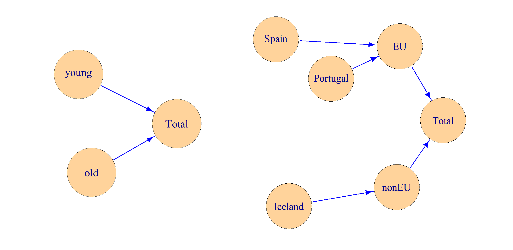
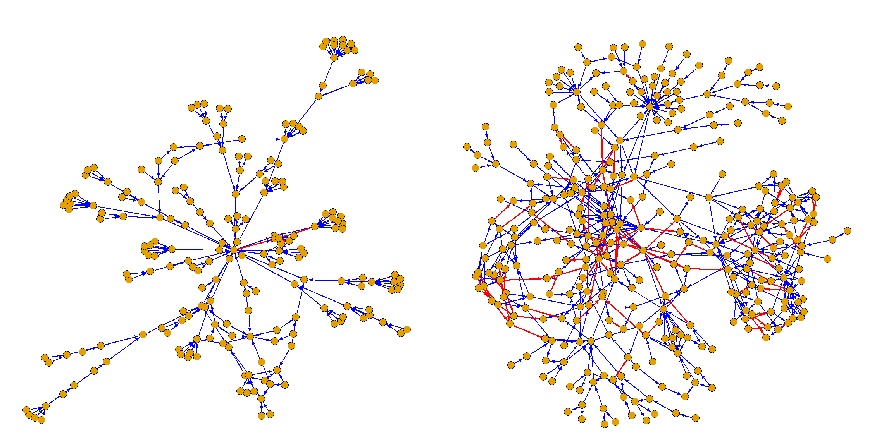

```{r setup, include=FALSE}
#knitr::opts_chunk$set(echo = FALSE, warning = FALSE, message = FALSE)
library(SSBtools)
library(Matrix)
library(kableExtra)
```


```{r include = FALSE}
x <- SSBtoolsData("sprt_emp_withEU")[,c(1,2,5,3,4)] 
names(x)[5] <- "value"
x$age[x$age == "Y15-29"] <- "young"
x$age[x$age == "Y30-64"] <- "old"
d <- x[x$year=="2014",-4]
d 
setMethod("show", signature = "sparseMatrix", function(object) printSpMatrix(object)) 
setMethod("show", signature = "denseMatrix", function(object) print(as.matrix(object)))

```


```{r include = FALSE}
milliseconds <- structure(list(f = c("FindHierarchies", "HierarchyCompute", "HierarchyCompute with colVar", 
"ModelMatrix from hierarchies", "ModelMatrix from formula", "sparse.model.matrix", 
"model.matrix", "FormulaSums", "median by model_aggregate"), `2` = c(10, 
17, 18, 14, 16, 26, 4, 21, 30), `3` = c(32, 27, 28, 26, 83, 173, 
24, 110, 208), `4` = c(392, 188, 86, 229, 1294, 11703, 3238, 
1417, 3353), `5` = c(7509, 4582, 863, 6557, 59640, 1596721, NA, 
42577, 74148), `6` = c(130730, 147113, 21773, 218071, 2921514, 
NA, NA, 1041023, 1403018)), startRow = c(f = 1L), row.names = c(NA, 
-9L), class = "data.frame")
k <- milliseconds
seconds <- k
for (i in 2:4) seconds[, i] <- sprintf("%0.3f", round(k[, i]/1000, 3))
for (i in 5:6) seconds[, i] <- sprintf("%0.0f", round(k[, i]/1000))
for (i in 2:6) seconds[!is.finite(milliseconds[[i]]), i] <- ""
colnames(seconds) <- c("function call", paste0("$i = ", 2:6, "$"))
```


```{r include = FALSE}
peak_MiB <- structure(list(f = c("FindHierarchies", "HierarchyCompute", "HierarchyCompute with colVar", 
"ModelMatrix from hierarchies", "ModelMatrix from formula", "sparse.model.matrix", 
"model.matrix", "FormulaSums", "median by model_aggregate"), `2` = c(0.9, 
3, 1.2, 1, 0.7, 2.4, 0.6, 1, 0.9), `3` = c(1.9, 3.8, 2.1, 4.3, 
16.8, 40, 42.1, 18.2, 15.2), `4` = c(12, 69, 20, 71, 71, 536, 
5864, 431, 230), `5` = c(57, 1074, 201, 1079, 919, 61654, NA, 
6884, 2257), `6` = c(610, 30792, 1273, 32246, 27809, NA, NA, 
1252, 63435)), startRow = c(f = 1L), row.names = c(NA, -9L), class = "data.frame")
k <- peak_MiB
peakMiB <- k
for (i in 2:3) peakMiB[, i] <- sprintf("%0.1f", k[, i])
for (i in 4:6) peakMiB[, i] <- sprintf("%0.0f", k[, i])
for (i in 2:6) peakMiB[!is.finite(k[[i]]), i] <- " "
colnames(peakMiB) <- c("function call", paste0("$i = ", 2:6, "$"))
```

```{r include = FALSE}
object_size <- structure(list(f = c("FindHierarchies", "HierarchyCompute", "HierarchyCompute with colVar", 
"ModelMatrix from hierarchies", "ModelMatrix from formula", "sparse.model.matrix", 
"model.matrix", "FormulaSums", "median by model_aggregate"), `2` = c(0.005, 
0.007, 0.007, 0.025, 0.026, 0.033, 0.171, 0.014, 0.007), `3` = c(0.008, 
0.087, 0.087, 0.51, 0.512, 0.581, 21.196, 0.21, 0.087), `4` = c(0.01, 
1.5, 1.5, 12.2, 12.2, 13.1, 2934.6, 3.1, 1.5), `5` = c(0.012, 
25, 25, 324, 324, 333, NA, 48, 25), `6` = c(0.015, 402, 402, 
9003, 9003, NA, NA, 689, 402)), startRow = c(f = 1L), row.names = c(NA, 
-9L), class = "data.frame")
k <- object_size
objectsize <- k
for (i in 2:3) objectsize[, i] <-  sprintf("(%0.3f)", k[, i])
for (i in 4  ) objectsize[, i] <-  sprintf("(%0.1f)", k[, i])
for (i in 4  ) objectsize[7, i] <- sprintf("(%0.0f)", k[7, i])
for (i in 5:6) objectsize[, i] <-  sprintf("(%0.0f)", k[, i])
for (i in 4:6) objectsize[1, i] <- sprintf("(%0.3f)", k[1, i])
for (i in 2:6) objectsize[!is.finite(k[[i]]), i] <- " "
colnames(objectsize) <- c("function call", paste("i =", 2:6))
```


```{r include = FALSE}
code <- c(
  "`d <- SSBtoolsData(paste0(\"power10to\", i))`", 
  "`hi <- FindHierarchies(d)`", 
  "`d$y <- as.numeric(1:nrow(d))`", 
  "`HierarchyCompute(d, hi, \"y\", inputInOutput = TRUE)`", 
  "[[1`HierarchyCompute(d, hi, \"y\", inputInOutput = TRUE,` \\newline `colVar = letters[1:(floor(i/2))])`]]", 
  "`ModelMatrix(d, hierarchies = hi)`", 
  "[[2`f <- as.formula(strtrim(` \\newline `\"y ~ (a+A)*(b+B)*(c+C)*(d+D)*(e+E)*(f+F)\", 3 + 6*i))`]]", 
  "`ModelMatrix(d, formula = f)`", 
  "`ModelMatrix(d, formula = f, viaOrdinary = TRUE)`", 
  "[[1`ModelMatrix(d, formula = f, viaOrdinary = TRUE,` \\newline `sparse = FALSE)`]]b", 
  "`FormulaSums(d, formula = f)`",
  '[[2`model_aggregate(d, hierarchies = hi,` \\newline `fun_vars = c(median = "y"))`]]')

codetxt <- c("Input data", "FindHierarchies", "Adding numeric variable","HierarchyCompute", 
             "HierarchyCompute with colVar", 
"ModelMatrix from hierarchies", "Formula","ModelMatrix from formula", "sparse.model.matrix", 
"model.matrix", "FormulaSums", "median by model_aggregate")
codeframe <- data.frame(codetxt, code)
colnames(codeframe) <- c("function call, etc.", "source code") 
```

# Introduction


In general, a vector of sum aggregates ($z$) can be calculated from a data vector ($y$) through a dummy matrix ($x$) by

\begin{equation} 
 z = x^{T}y 
   (\#eq:eq1)
\end{equation}

The matrix $x$ can be referred to as a model matrix. 
In package \CRANpkg{SSBtools} [@SSBtools_2023] there are several tools for creating such model matrices and for computing aggregates via such matrices. 
This article focuses on these tools, while there are additional tools included in the package that are not addressed herein.
Note that the package gathers functions that are used by other packages for specific purposes.
 
For some applications it is important to have access to the model matrix. 
In other applications, the interface or the computational efficiency is what is needed.
For efficiency, the aggregates may sometimes be computed by

\begin{equation} 
 z = x_{1}^{T}y x_{2}
   (\#eq:eq2)
\end{equation}

where $y$ is a matrix of input data that is appropriately reorganized into multiple columns and where $x_{1}$ and $x_{2}$ are two dummy matrices.

An important part of the model matrix framework within \CRANpkg{SSBtools} is the handling of hierarchical relationships.
That is, the categorical variables in the input data are hierarchically related. 
Or, alternatively, some codings of hierarchical relationships, such as parent-child, are supplied as separate input. 
We refer to these codings as hierarchies and these are not limited to being tree-shaped.
Hierarchies are used both in the process of constructing the model matrix and also to organize the categorical variables in the aggregated output data.

Model matrices are usually associated with regression models which can be expressed by model formulas and fitted by the `lm` function or by other more advanced functions. 
In this article, we will also use model formulas to specify model matrices. 
For this purpose, only the right-hand side of a model formula is needed. 
A formula consisting of the variables `a` and `b` including the interaction (`a:b`) can be written as `~a + b + a:b`, or equivalently as `~a * b`. 
By using model formulas, we can take advantage of the asterisk sign and other possibilities to write comprehensive models in compact ways (see `?formula` in an interactive R console). 
The intercept term, which is included by default, can be removed by subtracting a one (`~a * b - 1`). 
In the model matrix, the intercept term is a column of ones. 
In our context, we would rather refer to this model term as the overall total.

Most elements of the model matrices considered in this paper will be zero. 
When using regular dense matrices, as created by the base-R function `matrix`, an unnecessary amount of memory is used to store all the zeros. 
Instead, we use sparse matrices defined in the \CRANpkg{Matrix} package [@Matrix]. 
Then the matrices are stored in a compressed format, while ordinary matrix operations can still be performed. 
In many cases, the matrices will be so large that applications which do not utilize sparse matrices will be impossible in practice.
Please note that the functions discussed in this article do not create any new classes. 
The primary outputs of these functions include sparse matrices according to \CRANpkg{Matrix}, data frames, or a combination of both in the form of lists.


The rest of this paper is structured as follows.
First, we describe the function, `ModelMatrix`, for generating model matrices.
The following section takes a closer look at some underlying computations.
Then, a section is devoted to a more advanced function for two-way computation. Within this function, equation \@ref(eq:eq2) is applied.
The next section looks at aggregation beyond summation, such as median calculation.
Then, there is a section where various alternatives for creating model matrices and aggregates are compared in terms of both time and memory usage. 
In the penultimate section, we consider applications in other packages.
Finally, a short conclusion is given.


The theory in this paper is described using examples and R code.


# The function `ModelMatrix`

The base-R function `model.matrix` is a workhorse function for constructing model or design matrices used in regression modeling.
To create sparse matrices, the corresponding function `sparse.model.matrix` in the \CRANpkg{Matrix} package [@Matrix] can be used.
When all variables involved are categorical, the model matrices are dummy matrices of zeroes and ones.
The function `ModelMatrix` in package \CRANpkg{SSBtools} is an alternative function with a slightly different purpose.
The aim is to represent the transformation from input to output when producing various types of aggregated data.
As described below, the model matrix can be constructed with both a formula interface and a hierarchy interface.


## Model matrix from formula

In the examples below, `d` is a data frame.

```{r comment=NA, prompt = TRUE}
d
```
A model matrix can be specified with a formula.

```{r comment=NA, prompt = TRUE}
ModelMatrix(d, formula = ~age + geo)
```


In contrast to standard model matrices, all categories are included.
All variables are considered categorical. 
The column names correspond to rows in a data frame, called `crossTable`, which can be requested as output. 
Such a model matrix can be used to compute aggregates according to \@ref(eq:eq1), for example by:


```{r comment=NA, prompt = TRUE}
t(ModelMatrix(d, formula = ~age + geo)) %*% d$value
```

Exactly the same aggregates can be computed more directly using 
a related \CRANpkg{SSBtools} function: `FormulaSums(d, formula = value~age + geo)`.
With this function, the aggregates are computed somewhat faster when the data is large.
Internally, each model term triggers a call to the function `aggregate`.
Correspondingly, `ModelMatrix` calls the `Matrix` function `fac2sparse` repeatedly. 
Note that the formula interface within `aggregate` is different from our approach. 
The formula `~age + geo` interpreted by `aggregate` corresponds to `~age:geo - 1` interpreted by `ModelMatrix` or `FormulaSums`. 
So the formula interface in `aggregate` is less flexible. 
For example, 
`aggregate(value ~age + geo, d, sum)` and 
`aggregate(value ~age * geo, d, sum)` give the same results.

To illustrate hierarchical variables, we proceed with a more complicated formula:

```{r comment=NA, prompt = TRUE}
ModelMatrix(d, formula = ~age*eu + geo, crossTable = TRUE)
```

The column names suppressed from the `$modelMatrix` output can be seen in `$crossTable`.
Here there are two variables in `crossTable` even though there are three in the formula. This is because it has automatically been discovered that `geo` and `eu` are hierarchically related. Combining hierarchical variables in this way is often useful and this is common within official statistics. Automatic detection and handling of hierarchical relationships can be turned off with the `avoidHierarchical` parameter. The calculations made in the background are related to the automatic generation of hierarchies discussed below.

Note that `ModelMatrix` does not define any new classes. 
The dummy matrix will have a sparse matrix class according to \CRANpkg{Matrix}. 
Though, an attribute called `startCol` has been added to make locating individual model terms easy
and a related function, `FormulaSelection`, is available in \CRANpkg{SSBtools}.

## Model matrix from hierarchies

From the data we can generate hierarchies coded as trees:  

```{r comment=NA, prompt = TRUE}
dimLists <- FindDimLists(d[c("age", "geo", "eu")])
dimLists 
```

```{r fig1, fig.show="hold", out.width = "100%", fig.cap = "The hierarchies in the examples.", echo = FALSE}
 
```

The two hierarchies are illustrated in Figure \@ref(fig:fig1).
This way of coding hierarchies follows the standard used in the R package \CRANpkg{sdcTable} [@sdcTable], 
which is a tool for statistical disclosure control (SDC) [@SDCbook_2012]. 
A model matrix can be constructed from the data and the hierarchies.

```{r include = FALSE}
options(sparse.colnames = FALSE)
```

```{r comment=NA, prompt = TRUE}
ModelMatrix(d[-6, -3], hierarchies = dimLists, inputInOutput = c(TRUE, FALSE), 
            crossTable = TRUE)
```

By default, with hierarchy input, all possible combinations are made. 
Here, parameter `inputInOutput` is used to prevent columns being constructed from input codes for `geo` (country names).
The `eu` column (3rd) was removed from the input data to illustrate that this column is not being used.
Instead, the information about `EU` and `nonEU` is now given in the hierarchy.
The last row (6th) was also removed to illustrate that complete data is not required.
Either way, the rows in the output correspond to the rows in the input.

An alternative coding of the above hierarchies follow the standard used in the SDC program called $\tau$-Argus [@tauARGUS_2014]. Conversion to and from this standard is possible:

```{r comment=NA, prompt = TRUE}
hrc <- DimList2Hrc(dimLists)
hrc
```

However, the standard we use within the framework of `ModelMatrix` is more general and tree-shaped hierarchies are not required.
By the function `AutoHierarchies`, hierarchies coded in several ways are converted to our internal standard. 
As shown below, it is also possible to specify total codes.

```{r comment=NA, prompt = TRUE}
hi <- AutoHierarchies(hrc, total = c("All", "Europe"))
hi
```

The variable names `mapsFrom` and `mapsTo` were chosen because the starting point was to reprogram an application implemented in the 
Validation and Transformation Language (VTL) described in @VTL_2015. 
The level variable indicates the order in which the codes must be calculated. 
This variable can be computed automatically and is not needed in input. 
Sign, as coded in the `sign` column, can also be negative (`-1`), which means subtraction instead of addition.
The hierarchies can be very general (but not circular) and it is possible that the final model matrix consists of values beyond zeros and ones. A dummy matrix can be ensured by `unionComplement = TRUE`. 
Then, in accordance with VTL, `sign` is interpreted as union or complement instead of addition or subtraction.

Another possible coding that can be input to `AutoHierarchies` is formulas.
This should not be confused with model formulas in the section above.
Conversion to formulas from the internal standard is possible. 

```{r comment=NA, prompt = TRUE}
Hierarchies2Formulas(hi)
```

By using the parameter `select`, the columns in the model matrix, i.e. `crossTable`, can be specified in advance.
This can be much more efficient than making the selection afterwards.

```{r include = FALSE}
options(sparse.colnames = NULL)
```

```{r comment=NA, prompt = TRUE}
ModelMatrix(d, hierarchies = hi, select = data.frame(
            age = c("young", "young", "All", "All"), 
            geo = c("EU", "nonEU", "nonEU", "Europe")))
```

With few rows in input, many columns in the model matrix will only consist of zeros. As illustrated below, such columns can be omitted by the parameter, `removeEmpty`.

```{r comment=NA, prompt = TRUE}
ModelMatrix(d[c(1, 4), ], hierarchies = hi, removeEmpty = TRUE)
```
Due to `removeEmpty`, nine columns were omitted (`"All"`, `"old"` and `"young"` crossed with `"nonEU"`, `"Iceland"` and `"Portugal"`).
In large real data sets, the effect of `removeEmpty` can be enormous.

Two special possibilities are that the hierarchies can be encoded as a string or as an empty string. 
A string is considered a total code.  An empty string means that the variable is considered a pure categorical variable without a hierarchy.

```{r comment=NA, prompt = TRUE}
ModelMatrix(d[c(1,2,4), ], hierarchies = list(age = "", geo = "Europe"))
```

In this case only two countries are present in the input data. If `removeEmpty` had been `TRUE`, the `old:Iceland` column would have been omitted.

Note that both `ModelMatrix` parameters, `hierarchies` and `formula`, can be used simultaneously. 
How the hierarchies are to be crossed is then defined by the formula.


# Underlying computations 

## Hierarchies automatically from the data

To find hierarchies automatically from the data, a kind of correlation matrix is first computed by the function `FactorLevCorr`.
The function was named with factor variables and their levels in mind, but any variable type is possible.
To illustrate a little more complexity, we add `isSpain` as a logical variable.

```{r comment=NA, prompt = TRUE}
d$isSpain <- d$geo == "Spain"
fCorr <- FactorLevCorr(d[c("age", "geo", "eu", "isSpain")])
fCorr
```

The diagonal elements in this matrix are used to store the number of unique values of each variable ($n_i$).
To calculate our correlations, we first find the number of unique combinations ($m_{ij}$) of each pair of variables.
For this purpose, the function, `unique`, is repeatedly called with two-column data frames as input.
The absolute values of off-diagonal elements are 
$0$ when $m_{ij} = n_i*n_j$,
$1$ when $m_{ij} = \max(n_i, n_j)$ and otherwise computed as 
$(n_i*n_j-m_{ij})/(n_i*n_j-\max(n_i, n_j))$.
So $0$ means that all possible level combinations exist in the data and $1$ means that the two variables are hierarchically related. In our example the correlation between `eu` and `isSpain` isn’t zero since the combination (`nonEU`, `TRUE`) is missing in the data.
The signs of off-diagonal elements are set to be positive	when $n_i<n_j$ and negative	when $n_i>n_j$.
In cases where $n_i=n_j$, elements will be positive above the diagonal and negative below.
Values other than $0$, $-1$ and $1$  could be useful for detecting errors in the data. For example, values close to one may be suspicious.

In our application, to generate hierarchies, we only need to look for ones.
A one means that two hierarchically related variables are found. 
More generally, one can find trees by connecting relations when the variables are ordered according to the diagonal elements.
The function, `HierarchicalGroups`, does this repeatedly using a recursive algorithm so that all possible trees are found.
Below we run this function with `eachName = TRUE` so that names are included instead of indices.

```{r comment=NA, prompt = TRUE}
HierarchicalGroups(fCorr = fCorr, eachName = TRUE)
```

Here two groups were named `geo`. This means also that `FindDimLists` will result in two hierarchies named `geo`.
Each hierarchy is achieved by looking at sorted unique rows. 
For example, this hierarchy, 


```{r comment=NA, prompt = TRUE}
FindDimLists(d[c("age", "geo", "eu", "isSpain")])[[3]]
```

was constructed from this data frame: 

```{r comment=NA, prompt = TRUE}
SSBtools::SortRows(unique(d[c("isSpain", "geo")]))
```

The top level (`@`) is always the total code. The remaining levels correspond to the columns in the data as defined by the hierarchical groups. 
Here this means `"isSpain"` (`@@`) and `"geo"` (`@@@`). 


Note that the corresponding function `FindHierarchies` produces only a single `geo` hierarchy.

```{r comment=NA, prompt = TRUE}
FindHierarchies(d[c("age", "geo", "eu", "isSpain")])$geo
```

`FindHierarchies` wraps `FindDimLists` and `AutoHierarchies` into a single function.
By default, when multiple hierarchies exist for the same variable, `AutoHierarchies` combines them by generating a flattened hierarchy with a single level.
The output codes are the parents (`mapsTo`) and all childs (`mapsFrom`) are input codes.
Parent-child relationships corresponding to multilevel tree structures are not directly available, 
but the information needed to create model matrices is available. 
In fact, the hierarchies are combined via dummy matrices described below. 


## From hierarchies to dummy matrices

To produce model matrices, the hierarchies are converted to dummy matrices and the parameter `inputInOutput` is used.
Here we convert the hierarchies, `hi`, in the previous section:  

```{r comment=NA, prompt = TRUE}
hiM <- DummyHierarchies(hi, inputInOutput = c(TRUE, FALSE))
hiM
```

The first two rows of `hiM$age` are a perturbed identity matrix since `inputInOutput = TRUE` for this variable.
The first two rows of `hiM$geo` can be found directly from the level 1 rows of the hierarchy, `hi$geo`. 
The nonzero elements are taken from the `sign` variable and the corresponding rows and columns can be read from the variables `mapsFrom` and `mapsTo`, respectively.
A similar matrix can be constructed from level 2.  In our example this matrix is:

```{r comment=NA, prompt = TRUE}
geo2 <- Matrix(1, 1, 2, dimnames = list("Europe", c("EU", "nonEU")))
geo2
```

The last row of `hiM$geo` can now be found by the matrix multiplication:

```{r comment=NA, prompt = TRUE}
geo2 %*% hiM$geo[1:2, ]
```

In general, the dummy matrix is constructed successively by adding one level at a time. The new rows are found as a matrix constructed from the new level multiplied by the preliminary dummy matrix. The parameter `unionComplement` mentioned above is used within this process. 


The next step is to extend these matrices to match the data and this can be achieved by the function `DataDummyHierarchies`:


```{r comment=NA, prompt = TRUE}
hiD <- DataDummyHierarchies(d, hiM, colNamesFromData = TRUE)
hiD
```

For readability `colNamesFromData` was here set to `TRUE`.
This also means that the relationship to `hiM` is direct.
Now a transposed model matrix can be achieved by the function `KhatriRao` (column-wise Kronecker product) within the Matrix package. 

```{r comment=NA, prompt = TRUE}
Matrix::KhatriRao(hiD$geo, hiD$age, make.dimnames = TRUE)
```

Now the column names are misleading since only names from the first input matrix are used. However, the row names can be useful.
With more than two variables, `KhatriRao` is run several times by adding one variable at a time.

We now recall how a model matrix with pre-selected columns was created in the previous section using the `select` parameter to `ModelMatrix`.
When we look at dummy matrices here, this means pre-selected rows.
To produce such a matrix with pre-selected rows, one possibility is to first produce separate matrices for each variable. 

```{r comment=NA, prompt = TRUE}
hiD$age[c("young", "young", "All", "All"), ]
hiD$geo[c("EU", "nonEU", "nonEU", "Europe"), ]
```

The transposed model matrix is then obtained by multiplying these matrices together.
This is a fast way to obtain the model matrix.
A possible problem is, however, that the matrices to be multiplied are not as sparse as the final matrix. 
Therefore `KhatriRao` combined with reducing the matrices as much as possible first, can still be better.
The choice between the two methods is controlled by a parameter, called `selectionByMultiplicationLimit`.
The functionality of the parameter `removeEmpty` mentioned above, is implemented by `KhatriRao` combined with reducing the matrices.   


# Two-way computation

## The function `HierarchyCompute`

We recall that sum aggregates of a data vector ($y$) can be calculated by equation \@ref(eq:eq1) where the model matrix ($x$) can be produced by the function `ModelMatrix`. 
As mentioned above, with formula input an alternative function is `FormulaSums`. Then the aggregates are calculated without $x$ being created.
In the cases of hierarchies, a corresponding function is `HierarchyCompute`. 
Although this function makes aggregates via one or two dummy matrices, a model matrix that matches the input data is not necessarily made.
A special case of `HierarchyCompute` is to make such a model matrix and this matrix can also be requested as output.
Actually, `ModelMatrix` with hierarchy input make use of `HierarchyCompute`. 
The `HierarchyCompute` function does not take many hierarchy types as input, so `AutoHierarchies` may have to be run first.

In general, aggregates are computed by `HierarchyCompute` according to equation \@ref(eq:eq2). 
But the original version of the function, without the `colVar`  parameter, is limited to equation \@ref(eq:eq1).
However, $y$ may be a multi-column matrix containing a reorganized version of the input data vector. 
Then the columns represent a single categorical variable with no hierarchy.
To tell `HierarchyCompute` to treat a categorical variable in this way, 
this categorical variable is encoded as the string `"colFactor"` in the hierarchy input.
Other categorical variables are encoded as `"rowFactor"`.
The function `AutoHierarchies` re-encodes an empty string to `"rowFactor"`. 

To illustrate this function, we add an extra variable, `year`, to the data. Although, it is only a single year.

```{r comment=NA, prompt = TRUE}
HierarchyCompute(data = cbind(d, year = 2022), 
     hierarchies = list(age = "colFactor", geo = hi$geo, year = "rowFactor"), 
     valueVar = "value")
```

Except for column and row order, the output will be the same if `"rowFactor"` and `"colFactor"` are swapped or if both `age` and `year` are set to `"rowFactor"`.
If `output = "matrixComponents"` is included in the function call, the internal differences can be seen.  Then, in our example, output become: 


```{r comment=NA, prompt = TRUE}
hc <- HierarchyCompute(data = cbind(d, year = 2022), 
           hierarchies = list(age = "colFactor", geo = hi$geo, year = "rowFactor"), 
           valueVar = "value", output = "matrixComponents")
hc
```

The matrix, `valueMatrix` is a reorganized version of the value variable in the input data. 
If a variable is selected as `"colFactor"`, there is one column for each level of that variable.
Even without such a variable, there may be fewer rows in the `valueMatrix` than in the input data. 
This is because rows where the values are zero can be removed and because duplicated code combinations in the input can be aggregated.
This is controlled by parameters `"reduceData"` and `"handleDuplicated"`.
The data frame `fromCrossCode` contains variables that characterize the rows of `valueMatrix`.
The matrix `dataDummyHierarchy` is a transposed model matrix that matches `valueMatrix`.
This means that the aggregate output values can be calculated as `dataDummyHierarchy %*% valueMatrix`:


```{r comment=NA, prompt = TRUE}
hc$dataDummyHierarchy %*% hc$valueMatrix
```

The data frame `toCrossCode` contains variables that characterize the rows of this matrix.
Along with column names, this is the information needed to reorganize the aggregate result into a regular output data frame.

## `HierarchyCompute` with `colVar`

When the parameter `colVar` is applied, two (transposed) model matrices are made, 
one for rows and one for columns. 
Parameter `colVar` splits the hierarchy variables in two groups and this variable overrides the difference between `"rowFactor"` and `"colFactor"`.
Actually, there will be two runs of `HierarchyCompute`. 
With `output = "matrixComponents"`, output from the two runs are returned as a list with elements `hcRow` and `hcCol`.
Below we illustrate this by including the age hierarchy with `inputInOutput = TRUE`  (`FALSE` is default). 

```{r comment=NA, prompt = TRUE}
hc2 <- HierarchyCompute(data = cbind(d, year = 2022), 
            hierarchies = list(age = hi$age, geo = hi$geo, year = "rowFactor"), 
            colVar = "age", inputInOutput = c(TRUE, FALSE),
            valueVar = "value", output = "matrixComponents")
```

For rows, we obtain the same matrices as earlier. The aggregates in the previous subsection can now be computed as:  

```{r comment=NA, prompt = TRUE}
hc2$hcRow$dataDummyHierarchy %*% hc2$hcRow$valueMatrix
```

The model matrix for columns can be seen as: 

```{r comment=NA, prompt = TRUE}
t(hc2$hcCol$dataDummyHierarchy)
```

Finally, the aggregate output values can be calculated as:

```{r comment=NA, prompt = TRUE}
hc2$hcRow$dataDummyHierarchy %*% hc2$hcRow$valueMatrix %*% t(hc2$hcCol$dataDummyHierarchy)
```

Taking into account that the dummy matrices are transposed model matrices, equation \@ref(eq:eq2) is applied.
With ordinary output, these values are organized into a data frame and we do not see what is going on internally.

```{r comment=NA, prompt = TRUE}
HierarchyCompute(data = cbind(d, year = 2022), 
     hierarchies = list(age = hi$age, geo = hi$geo, year = "rowFactor"), 
     colVar = "age", inputInOutput = c(TRUE, FALSE),
     valueVar = "value")
```

We obtain the same results without specifying `colVar`. 
One reason to use `colVar` is to do the computations more efficiently.
Another reason may be that the internal matrices may be of interest.
Note that variable combinations for output can be specified by parameters 
`rowSelect`, `colSelect` and `select`.
Then `colVar` also matters.


# Aggregation beyond summation

The most recent functions in the \CRANpkg{SSBtools} package are about general aggregation beyond summation. 
With respect to future application packages, this is written in a different coding style (lower snake case).
The function `model_aggregate` combines the model specification capabilities of `ModelMatrix` with aggregation with general functions. Below is an example:

```{r include = FALSE}
model_aggregate <- function(...) SSBtools::model_aggregate(..., verbose = FALSE)
magg <- model_aggregate(d, formula = ~age + eu, 
          fun_vars = c(max = "value", median = "value", length = "geo"), 
          pre_return = TRUE, list_return = TRUE)
```

```{r comment=NA, prompt = TRUE}
model_aggregate(d, formula = ~age + eu, 
                fun_vars = c(max = "value", median = "value", length = "geo"))

```

The underlying computations make use of a model matrix. By default (`pre_aggregate = TRUE`), the number of rows in the input data frame is reduced before `ModelMatrix` is called. 
In practice, this pre-aggregation step is done by running `aggregate` with `FUN = function(x){x}` and `simplify = FALSE`.
The individual observations to be aggregated are then included as lists. In this example, the reduced input data is:

```{r comment=NA, echo = FALSE}
magg$pre_data

```
The corresponding model matrix is:

```{r comment=NA, echo = FALSE}
magg$x

```
The function `model_aggregate` has many possibilities for specifying the aggregation. 
Functions of several data variables are possible. Output variable names can be passed as input, even for functions with multiple outputs.
This is possible since `model_aggregate` calls `dummy_aggregate` (model matrix is input) which calls 
`aggregate_multiple_fun` which is an advanced wrapper to `aggregate`.
The implementation uses indexes to rows, which made it possible to call `aggregate` only once. 
Since matrix multiplication is a fast way to do sum aggregation, this is also included as a possibility in `model_aggregate` (parameter `sum_vars`).


# Comparisons with comments

To facilitate comparisons, we utilize hierarchical example data with $10^i$ rows obtained by crossing $i$ dimensions. 
For each dimension there is a child variable with 10 categories and a parent variable with 3 categories (2, 3 and 5 categories aggregated). 
The child and parent variables are named alphabetically by small and capital letters, respectively.
Below is an illustration of a `HierarchyCompute` call when $i = 4$, showing eight rows in both the input and output.

```{r comment=NA, prompt = TRUE}
d <- SSBtoolsData("power10to4")
d[c(1:4, 3715:3716, 9999:10000), ]
hi <- FindHierarchies(d)
d$y <- 1:nrow(d)
output <- HierarchyCompute(d, hi, "y", inputInOutput = TRUE)
output[c(1, 5473:5475, 37852:37854, 38416), ]
```
Here an `integer` $y$ is added to the input data. Either way, the variable becomes `numeric` in the output. 
In the comparisons below, the input class is also `numeric`. 
We use `inputInOutput = TRUE`, which is the default in `ModelMatrix`.
With 10 child categories, 3 parent categories, and the inclusion of a total code, this results in $14^i$ rows in the output.


```{r include = FALSE}
blank <- " " 
blank9 <- "         "

nblank <- objectsize
nblank[2:6] <- 0
for (j in 1:nrow(peakMiB)) for (i in 4:6) {
    peakMiB[j, i] <- paste(strtrim(blank9, 1 + 2 * (5 - nchar(peakMiB[j, i]))), peakMiB[j, i], " ", objectsize[j, i])
}
names(peakMiB)[4:6] <- paste(strtrim(blank9, 4), names(peakMiB)[4:6])
align2 <- rep("r", 6)
align2[4:6] <- "l"

```


```{r include = FALSE}
cap1 <- "User CPU time in seconds based on hierarchical input data with $10^i$ rows, resulting in $14^i$ output aggregates. Thus, the size of the model matrix is $10^i \\times 14^i$. The source code is given in Table 3."

cap2 <- "Peak RAM in MiB for the calculations described in Tables 1 and 3. For $i\\geq 4$, the size of the output object is provided within parentheses, denoted in MiB as well."

cap3 <- "The source code for the calculations underlying Tables 1 and 2. With $i$ defined, the code can be run directly from top to bottom. Be careful not to run `FindHierarchies(d)` with `y` included in `d`."

```


```{r tab1-html, eval = knitr::is_html_output(), echo = FALSE}
knitr::kable(seconds, format = "html", align = "r",   caption = cap1)
```

```{r tab1-pdf, eval = knitr::is_latex_output(), echo = FALSE}
q <- knitr::kable(seconds, format = "latex", align = "r",  caption = cap1)
q[1] <- gsub("\\begin{table}", "\\begin{table}[p]", q[1], fixed = TRUE)
q[1] <- gsub("\\end{table}", "\\vspace{20pt} \\end{table}", q[1], fixed = TRUE)
q[1] <- gsub("\\$i = 2\\$", "$i = 2$", q[1], fixed = TRUE) # escape = FALSE not working
q[1] <- gsub("\\$i = 3\\$", "$i = 3$", q[1], fixed = TRUE)
q[1] <- gsub("\\$i = 4\\$", "$i = 4$", q[1], fixed = TRUE)
q[1] <- gsub("\\$i = 5\\$", "$i = 5$", q[1], fixed = TRUE)
q[1] <- gsub("\\$i = 6\\$", "$i = 6$", q[1], fixed = TRUE)
q
``` 


```{r tab2-html, eval = knitr::is_html_output(), echo = FALSE}
knitr::kable(peakMiB, format = "html", align = align2,   caption = cap2)
```

```{r tab2-pdf, eval = knitr::is_latex_output(), echo = FALSE}
q <- knitr::kable(peakMiB, format = "latex", align = align2,  caption = cap2)
q[1] <- gsub("\\begin{table}", "\\begin{table}[p]", q[1], fixed = TRUE)
q[1] <- gsub("\\end{table}", "\\vspace{20pt} \\end{table}", q[1], fixed = TRUE)
q[1] <- gsub("\\$i = 2\\$", "$i = 2$", q[1], fixed = TRUE) # escape = FALSE not working
q[1] <- gsub("\\$i = 3\\$", "$i = 3$", q[1], fixed = TRUE)
q[1] <- gsub("\\$i = 4\\$", "$i = 4$", q[1], fixed = TRUE)
q[1] <- gsub("\\$i = 5\\$", "$i = 5$", q[1], fixed = TRUE)
q[1] <- gsub("\\$i = 6\\$", "$i = 6$", q[1], fixed = TRUE)
q
``` 


```{r tab3-html, eval = knitr::is_html_output(), echo = FALSE}
cf <- codeframe
cf[[2]] <- gsub("[[1", "", cf[[2]], fixed = TRUE)
cf[[2]] <- gsub("[[2", "", cf[[2]], fixed = TRUE)
cf[[2]] <- gsub("]]b", "", cf[[2]], fixed = TRUE)
cf[[2]] <- gsub("]]", "", cf[[2]], fixed = TRUE)
knitr::kable(cf, format = "pipe", align = c("r", "l"), caption = cap3)
``` 

```{r tab3-pdf, eval = knitr::is_latex_output(), echo = FALSE}
q <- knitr::kable(codeframe, format = "latex", align = c("r", "l"), caption = cap3)
q <- column_spec(q, 2, monospace = TRUE)
q <- kable_styling(q, full_width = FALSE)
q1 <- gsub("`FindHierarchies(d)`", "\\ttfamily{FindHierarchies(d)}", q[1], fixed = TRUE)
q1 <- gsub("`d`", "\\ttfamily{d}", q1, fixed = TRUE)
q1 <- gsub("`y`", "\\ttfamily{y}", q1, fixed = TRUE)
q1 <- gsub("`", "", q1, fixed = TRUE)
q1 <- gsub("\\textbackslash{}newline", "\\\\  \\phantom{AAA}", q1, fixed = TRUE)
q1 <- gsub("[[1", "\\shortstack[r]{", q1, fixed = TRUE)
q1 <- gsub("[[2", "\\shortstack[l]{", q1, fixed = TRUE)
q1 <- gsub("]]b", "\\phantom{AAAAAAAAAAAAAAAAAAAA} }", q1, fixed = TRUE)
q1 <- gsub("]]", "}", q1, fixed = TRUE)
q1 <- gsub("\\phantom{AAA} fun\\_vars", "\\phantom{AAAAAAAAAAAAAAA} fun\\_vars",  q1, fixed = TRUE)
#q1 <- gsub("HierarchyCompute with colVar", "\\shortstack[r]{HierarchyCompute \\\\ with colVar}", q1, fixed = TRUE)
q1 <- gsub("\\begin{table}", "\\begin{table}[p]", q1, fixed = TRUE)
q1 <- gsub("\\end{table}", "\\vspace{20pt} \\end{table}", q1, fixed = TRUE) 
q[1] <- q1
q
``` 


Table `r knitr::asis_output(ifelse(knitr::is_html_output(), '\\@ref(tab:tab1-html)', '\\@ref(tab:tab1-pdf)'))` 
displays the CPU times for different function calls. 
The measurements were made by `system.time` (first element). The median values from five runs are shown.
Table `r knitr::asis_output(ifelse(knitr::is_html_output(), '\\@ref(tab:tab2-html)', '\\@ref(tab:tab2-pdf)'))` 
displays the memory usage as peak RAM, measured using the \CRANpkg{peakRAM} package  [@peakRAM_2017]. 
The median values from five runs are shown. 
These runs were conducted separately from the CPU time measurements.
Table `r knitr::asis_output(ifelse(knitr::is_html_output(), '\\@ref(tab:tab2-html)', '\\@ref(tab:tab2-pdf)'))` 
also presents object sizes obtained using the `object.size` function.
The source code is shown in 
Table `r knitr::asis_output(ifelse(knitr::is_html_output(), '\\@ref(tab:tab3-html)', '\\@ref(tab:tab3-pdf)'))`.
These comparisons were made with R version 4.2.2 running on Linux. 
The server had about 500 GiB of RAM, and it appeared that less than 10% of it were occupied by other users.

Since some functions are based on hierarchy input that may need to be generated from data, `FindHierarchies` are also included in the tables.
Some functions produce aggregate results \linebreak (`HierarchyCompute`, `FormulaSums` and `model_aggregate`), while others produce a model matrix.
\linebreak However, the time required for calculating sum aggregates through matrix multiplication is almost negligible.
When $i=6$, `crossprod(x, d$y)` takes four seconds. Here `x` refers to the sparse model matrix.

Generation of the model matrix from hierarchies by `ModelMatrix` is done via `HierarchyCompute`. 
The transposed model matrix is outputted before the ordinary results are produced.
The main reason why `ModelMatrix` still takes longer, when $i \geq 4$, is a parameter setting that ensures that the column order is more similar to a usual model matrix (`reorder = TRUE`). 
Some time is also spent on matrix transposition.
Even if `ModelMatrix` is run with `crossTable = FALSE`, which is the default, this information is still internally generated in order to create column names.

If the desired output is sum aggregates, there is no doubt that `HierarchyCompute` with `colVar` is the most efficient option. 
In this case, equation \@ref(eq:eq2) is utilized, and instead of creating one large model matrix, two smaller matrices are generated. 
For example, when $i=5$, dimensions $a$ and $b$ are used for columns, while $c$, $d$, and $e$ are used for rows.

Even though the functions handle hierarchical relationships, the formula used in the input must be written appropriately in order to achieve the desired output.
To generate all combinations, the input formula to `ModelMatrix` at $i=4$ would be `~(a+A)*(b+B)*(c+C)*(d+D)`.
In Table `r knitr::asis_output(ifelse(knitr::is_html_output(), '\\@ref(tab:tab3-html)', '\\@ref(tab:tab3-pdf)'))`, 
a response term is included in the formula, but it is only necessary for the `FormulaSums` function.
The output from `FormulaSums` is a one-column matrix containing aggregates. 
However, the object size is larger compared to the data frame output of `HierarchyCompute`. 
This is because row names are a less efficient method of storing the information.
It is interesting to note that `FormulaSums` uses more memory at $i=5$ than $i=6$. 
This is probably because the `aggregate` function uses a different method for large data.

The initial implementation of `ModelMatrix` utilized the functions `sparse.model.matrix` and \linebreak  `model.matrix`. 
This option still remains available by setting `viaOrdinary = TRUE`.
Since these functions omit a factor level, the input variables are encoded as factors and an empty factor level is added.
In this way, the desired matrix is achieved, here a $10^i \times 14^i$ matrix.
With small data sets ($i \leq 3$), `model.matrix` is the fastest method, but with $i \geq 5$, there was not enough available memory. 
With $i=5$ and $i=6$, the size of the output object would be approximately 400 GiB and 55 TiB, respectively.
The results show, perhaps surprisingly, that `sparse.model.matrix` consumes significant time and memory. 
It was not feasible to run it at $i=6$. 
Profiling indicates that this is primarily due to interaction calculations. 
In contrast, in `ModelMatrix`, which only handles categorical variables, this process is simplified by combining multiple variables from the input before calling `fac2sparse`. 
The hierarchy interface to `ModelMatrix`, however, is significantly faster than the formula interface. 
This is because a few calls to the `KhatriRao` function are much faster than building the matrix with `cbind` based on numerous `fac2sparse` calls.
The object size of the output matrix is slightly larger when using `sparse.model.matrix` compared to the regular `ModelMatrix`. 
This is primarily because the output from `sparse.model.matrix` includes row names as well.

Here, `model_aggregate` is used to calculate median values instead of the sums calculated by `HierarchyCompute`. 
Output is similar, but the rows are sorted differently. 
Internally, `ModelMatrix` is called, and the formula interface is also possible. 
Instead of matrix multiplication, the `median` function is now called $14^i$ times. 
This is more resource-intensive, but still feasible when $i=6$.


# Applications in other R packages 
The first of the functions demonstrated above to be used in a specific purpose package was  `FindDimLists`.
Package \CRANpkg{easySdcTable} [@easySdcTable_2022] provides a simplifying interface to the 
statistical disclosure control (SDC) package \CRANpkg{sdcTable} [@sdcTable].
This is about protecting frequency tables by the suppression method. 
Automatic hierarchies by `FindDimLists` is an important part of the simplification.

The function `HierarchyCompute` was originally made for Statistics Norway’s modernized calculations 
of [municipal accounts](https://www.ssb.no/en/kommregnko/), which involve complicated hierarchies. 
The original intention was to do the computations by an implementation of VTL [@VTL_2015], but this approach proved to be too inefficient and R was chosen instead. 
The calculations are implemented in the package \pkg{Kostra} [@Kostra_2023] that is made for internal use in Statistics Norway.
The two complicated hierarchies involved are illustrated on Figure \@ref(fig:fig2). 
This figure as well as Figure \@ref(fig:fig1) is made using package \CRANpkg{igraph} [@igraph_2006].
Plotting could be achieved by converting the hierarchies produced by `AutoHierarchies` into igraph objects using the `graph_from_data_frame` function.


```{r fig2, fig.show="hold", out.width = "100%", fig.cap = "The function (left) and art (right) hierarchy involved in Statistics Norway’s municipal accounts calculations. Red arrow means negative sign.", echo = FALSE}
 
```

The hierarchy interface part of `ModelMatrix` was created as a spin-off from `HierarchyCompute`.
The first application was in the SDC package \CRANpkg{SmallCountRounding} [@SmallCountRounding_2022], 
which protects frequency tables data by the perturbation method described by @Langsrud_Heldal_2018.
The earliest versions of this package were limited to formula input and the package then contained the first version of `ModelMatrix`.
Two other SDC packages also use `ModelMatrix`.
The packages \pkg{SSBcellKey} [@SSBcellKey] and \CRANpkg{GaussSuppression} [@GaussSuppression] can be used to protect both frequency and magnitude tables 
by, respectively, perturbation [@CellKey] and suppression [@SDCbook_2012].

All the SDC packages mentioned above are about protection of tabular data. 
When `ModelMatrix` is used, the model matrix itself is important to the algorithm. 
The model matrix is therefore necessary for more than aggregating the data by a matrix multiplication. 
In the package \pkg{SSBcellKey}, however, use of the model matrix is limited to running the \CRANpkg{SSBtools} function `DummyApply`
which is a precursor to the `dummy_aggregate` function mentioned above.


# Conclusion

The \CRANpkg{SSBtools} package provides functionality to handle hierarchical relationships and to generate corresponding model matrices. 
This is useful in contexts where multidimensional aggregation and related computations are to be done.
This is applied by several R packages for statistical disclosure control, a field that is important for official statistics.


# Acknowledgements {-}

I would like to thank my colleagues Daniel Lupp and Johan Fosen at Statistics Norway, as well as an anonymous reviewer, for their valuable comments that led to improvements.

