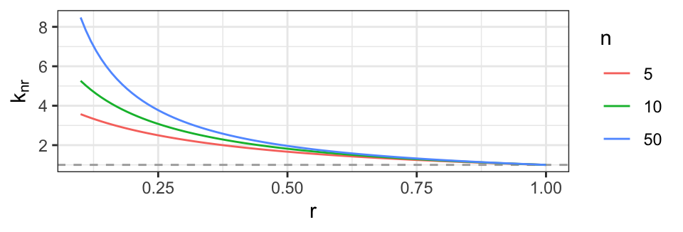

<div class="layout-chunk" data-layout="l-body">


</div>


# Introduction

The capability of R to do symbolic mathematics is enhanced by the
\CRANpkg{reticulate} [@reticulate] and \CRANpkg{caracas} [@caracas:21]
packages.  The `reticulate` package invokes functions from the Python
library SymPy, which is the workhorse behind symbolic mathematics in
this connection. The `reticulate` package requires some knowledge of
Python syntax whereas the `caracas` package provides an interface to
`reticulate` using R syntax. In short form, `caracas` provides the 
following:

(1) Mathematical tools like equation solving, summation,
limits, symbolic linear algebra, outputting in tex format etc. are
directly available from within R using R syntax

(2) The packages enable working
with the same language and in the same environment as the user does
for statistical analyses. 

(3) Access to free computer algebra.

(4) Symbolic mathematics can easily be
combined with data which is helpful in e.g. numerical optimization.


In this paper we will illustrate the use of the `caracas` package
(version 2.1.0) in connection with teaching mathematics and statistics
and how this can benefit from bridging computer algebra and data via
R.  Focus is on 1) treating statistical models symbolically, 2) on
bridging the gap between symbolic mathematics and numerical
computations and 3) on preparing teaching material in a reproducible
framework (provided by, e.g. \CRANpkg{rmarkdown} [@rmarkdown;
@RMarkdownDefinitiveGuide; @RMarkdownCookbook] and Quarto
[@Allaire_Quarto_2022]).

The `caracas` package is available from CRAN. 
Several vignettes illustrating `caracas` are provided with the package and they are
also available online together with the help pages, see <https://r-cas.github.io/caracas/>.
The open-source development version of
`caracas` is available at <https://github.com/r-cas/caracas>.

The paper is organized in the following sections: The section
[Introducing `caracas`] briefly introduces
the `caracas` package and its syntax, and 
relates `caracas` to SymPy via `reticulate`.
The section [Statistics examples] presents a sample of statistical models 
where we believe that a
symbolic treatment is a valuable supplement to a purely numerical computations.
In the section [Further topics] we 
demonstrate further aspects of `caracas`, including how `caracas` can be
used in connection with preparing texts, e.g. teaching material and 
working documents.
The section [Hands-on activities]
contains suggestions about hands-on activities, e.g. for students. 
The last section [Discussion] contains a discussion of the
paper.


## Installation 

The `caracas` package is available on CRAN and can be installed as usual with `install.packages('caracas')`.
Please ensure that you have SymPy installed, or else install it:

```r
if (!caracas::has_sympy()) {
  caracas::install_sympy()
}
```

The `caracas` package uses the `reticulate` package (to run Python code). 
Thus, if you wish to configure your Python environment, you need to 
first load `reticulate`, then configure the Python environment, and at 
last load `caracas`. 
The Python environment can be configured as 
in `reticulate`'s "Python Version Configuration" vignette. 
Again, configuring the Python environment needs to be done before 
loading `caracas`. 
Please find further details in `reticulate`'s documentation. 


# Introducing `caracas` 

Here we introduce key concepts and show functionality subsequently 
needed in the section [Statistics examples]. 
We will demonstrate both `caracas` and 
contrast this with using `reticulate` directly.


## Symbols

A `caracas` symbol is a list with a `pyobj` slot and the class
`caracas_symbol`.  The `pyobj` is a Python object (often a SymPy
object).  As such, a `caracas` symbol (in R) provides a handle to a
Python object.  In the design of `caracas` we have tried to make
this distinction something the user should not be concerned with, but
it is worthwhile being aware of the distinction. Whenever we refer to
a symbol we mean a `caracas` symbol.  Two functions that create
symbols are `def_sym()` and `as_sym()`; these and other functions that
create symbols will be illustrated below.


## Linear algebra

We create a symbolic matrix (a `caracas` symbol) from an R object and a symbolic
vector (a `caracas` symbol) directly. A vector is a one-column matrix which is printed as
its transpose to save space. Matrix products are computed using the
`%*%` operator:


<div class="layout-chunk" data-layout="l-body">
<div class="sourceCode"><pre class="sourceCode r"><code class="sourceCode r"><span><span class='va'>M0</span> <span class='op'>&lt;-</span> <span class='fu'><a href='https://rdrr.io/r/stats/toeplitz.html'>toeplitz</a></span><span class='op'>(</span><span class='fu'><a href='https://rdrr.io/r/base/c.html'>c</a></span><span class='op'>(</span><span class='st'>"a"</span>, <span class='st'>"b"</span><span class='op'>)</span><span class='op'>)</span>  <span class='co'># Character matrix</span></span>
<span><span class='va'>M</span>  <span class='op'>&lt;-</span> <span class='fu'><a href='https://rdrr.io/pkg/caracas/man/as_sym.html'>as_sym</a></span><span class='op'>(</span><span class='va'>M0</span><span class='op'>)</span>             <span class='co'># as_sym() converts to a caracas symbol</span></span>
<span><span class='va'>v</span>  <span class='op'>&lt;-</span> <span class='fu'><a href='https://rdrr.io/pkg/caracas/man/generic-matrices.html'>vector_sym</a></span><span class='op'>(</span><span class='fl'>2</span>, <span class='st'>"v"</span><span class='op'>)</span>     <span class='co'># vector_sym creates symbolic vector</span></span>
<span><span class='va'>y</span>  <span class='op'>&lt;-</span> <span class='va'>M</span> <span class='op'><a href='https://rdrr.io/pkg/caracas/man/matrix-products.html'>%*%</a></span> <span class='va'>v</span></span>
<span><span class='va'>Minv</span> <span class='op'>&lt;-</span> <span class='fu'><a href='https://rdrr.io/r/base/solve.html'>solve</a></span><span class='op'>(</span><span class='va'>M</span><span class='op'>)</span> </span>
<span><span class='va'>w</span> <span class='op'>&lt;-</span> <span class='va'>Minv</span> <span class='op'><a href='https://rdrr.io/pkg/caracas/man/matrix-products.html'>%*%</a></span> <span class='va'>y</span> <span class='op'>|&gt;</span> <span class='fu'><a href='https://rdrr.io/pkg/caracas/man/simplify.html'>simplify</a></span><span class='op'>(</span><span class='op'>)</span></span></code></pre></div>

</div>


Here we exploit that `caracas` is tightly integrated with `R` 
which has a `toeplitz()` function that can be used. 
Similarly, `caracas` offers `matrix_sym()` and 
`vector_sym()` for generating general matrix and vector objects.
The object `M` is

<div class="layout-chunk" data-layout="l-body">
<div class="sourceCode"><pre class="sourceCode r"><code class="sourceCode r"><span><span class='va'>M</span></span></code></pre></div>

```
c: [[a, b],
    [b, a]]
```

</div>


The LaTeX rendering using the `tex()` function of the symbols 
above are (refer to section [Further topics]):

\begin{equation}
M = \left[\begin{matrix}a & b\\b & a\end{matrix}\right]; \; 
v = \left[\begin{matrix}v_{1}\\v_{2}\end{matrix}\right]; \;
y = \left[\begin{matrix}a v_{1} + b v_{2}\\a v_{2} + b v_{1}\end{matrix}\right]; \;
M^{-1} = \left[\begin{matrix}\frac{a}{a^{2} - b^{2}} & - \frac{b}{a^{2} - b^{2}}\\- \frac{b}{a^{2} - b^{2}} & \frac{a}{a^{2} - b^{2}}\end{matrix}\right]; \;
w = \left[\begin{matrix}v_{1}\\v_{2}\end{matrix}\right] . 
\end{equation}


Symbols can be substituted with other symbols or with numerical values
using `subs()`. 

<div class="layout-chunk" data-layout="l-body">
<div class="sourceCode"><pre class="sourceCode r"><code class="sourceCode r"><span><span class='va'>M2</span> <span class='op'>&lt;-</span> <span class='fu'><a href='https://rdrr.io/pkg/caracas/man/subs.html'>subs</a></span><span class='op'>(</span><span class='va'>M</span>, <span class='st'>"b"</span>, <span class='st'>"a^2"</span><span class='op'>)</span></span>
<span><span class='va'>M3</span> <span class='op'>&lt;-</span> <span class='fu'><a href='https://rdrr.io/pkg/caracas/man/subs.html'>subs</a></span><span class='op'>(</span><span class='va'>M2</span>, <span class='st'>"a"</span>, <span class='fl'>2</span><span class='op'>)</span> </span></code></pre></div>

</div>


\begin{equation}
M2 = \left[\begin{matrix}a & a^{2}\\a^{2} & a\end{matrix}\right]; \quad
M3 = \left[\begin{matrix}2 & 4\\4 & 2\end{matrix}\right].
\end{equation}


## Linear algebra - using `reticulate`

The `reticulate` package already enables SymPy from within R, 
but does not use standard R syntax for many operations (e.g. matrix multiplication), 
and certain operations are more complicated than the R counterparts 
(e.g. replacing elements in a matrix and constructing R expressions).
As illustration, the previous linear algebra example can also be done using `reticulate`:

<div class="layout-chunk" data-layout="l-body">
<div class="sourceCode"><pre class="sourceCode r"><code class="sourceCode r"><span><span class='kw'><a href='https://rdrr.io/r/base/library.html'>library</a></span><span class='op'>(</span><span class='va'><a href='https://rstudio.github.io/reticulate/'>reticulate</a></span><span class='op'>)</span></span>
<span><span class='va'>sympy</span> <span class='op'>&lt;-</span> <span class='fu'><a href='https://rstudio.github.io/reticulate/reference/import.html'>import</a></span><span class='op'>(</span><span class='st'>"sympy"</span><span class='op'>)</span></span>
<span><span class='va'>M_</span> <span class='op'>&lt;-</span> <span class='va'>sympy</span><span class='op'>$</span><span class='fu'>Matrix</span><span class='op'>(</span><span class='fu'><a href='https://rdrr.io/r/base/list.html'>list</a></span><span class='op'>(</span><span class='fu'><a href='https://rdrr.io/r/base/c.html'>c</a></span><span class='op'>(</span><span class='st'>"a_"</span>, <span class='st'>"b_"</span><span class='op'>)</span>, <span class='fu'><a href='https://rdrr.io/r/base/c.html'>c</a></span><span class='op'>(</span><span class='st'>"b_"</span>, <span class='st'>"a_"</span><span class='op'>)</span><span class='op'>)</span><span class='op'>)</span></span>
<span><span class='va'>v_</span> <span class='op'>&lt;-</span> <span class='va'>sympy</span><span class='op'>$</span><span class='fu'>Matrix</span><span class='op'>(</span><span class='fu'><a href='https://rdrr.io/r/base/list.html'>list</a></span><span class='op'>(</span><span class='st'>"v1_"</span>, <span class='st'>"v2_"</span><span class='op'>)</span><span class='op'>)</span></span>
<span><span class='va'>y_</span> <span class='op'>&lt;-</span> <span class='va'>M_</span> <span class='op'>*</span> <span class='va'>v_</span></span>
<span><span class='va'>w_</span> <span class='op'>&lt;-</span> <span class='va'>M_</span><span class='op'>$</span><span class='fu'>inv</span><span class='op'>(</span><span class='op'>)</span> <span class='op'>*</span> <span class='va'>y_</span></span>
<span><span class='va'>sympy</span><span class='op'>$</span><span class='fu'>simplify</span><span class='op'>(</span><span class='va'>w_</span><span class='op'>)</span></span></code></pre></div>

```
Matrix([
[v1_],
[v2_]])
```

</div>


This shows that it is possible to do the same linear algebra example 
using only `reticulate`, 
but it requires using non-standard R syntax (for 
example, matrix multiplication `*` as opposed to `%*%` in R).


## Functionality and R syntax provided by `caracas`

In `caracas` we can exploit standard R syntax like:

<div class="layout-chunk" data-layout="l-body">
<div class="sourceCode"><pre class="sourceCode r"><code class="sourceCode r"><span><span class='fu'><a href='https://rdrr.io/r/base/cbind.html'>rbind</a></span><span class='op'>(</span><span class='va'>v</span>, <span class='va'>v</span><span class='op'>)</span></span>
<span><span class='fu'><a href='https://rdrr.io/r/base/cbind.html'>cbind</a></span><span class='op'>(</span><span class='va'>v</span>, <span class='va'>v</span><span class='op'>)</span></span>
<span><span class='fu'><a href='https://rdrr.io/r/base/c.html'>c</a></span><span class='op'>(</span><span class='va'>v</span>, <span class='va'>v</span><span class='op'>)</span></span>
<span><span class='va'>v</span><span class='op'>[</span><span class='fl'>3</span><span class='op'>]</span> <span class='op'>&lt;-</span> <span class='st'>"v3"</span> <span class='co'># Insert element</span></span>
<span><span class='va'>M</span><span class='op'>[</span>, <span class='fl'>2</span><span class='op'>]</span></span>
<span><span class='va'>M</span><span class='op'>[</span><span class='fl'>2</span><span class='op'>]</span></span></code></pre></div>

</div>


The code correspondence between `reticulate` and `caracas` shows
that the same can be achieved with `reticulate` but it can be argued that
the syntax is more involved, at least for users only familiar with R:

<div class="layout-chunk" data-layout="l-body">
<div class="sourceCode"><pre class="sourceCode r"><code class="sourceCode r"><span><span class='va'>v_</span><span class='op'>$</span><span class='fu'>row_join</span><span class='op'>(</span><span class='va'>v_</span><span class='op'>)</span>                                                <span class='co'># rbind(v, v)</span></span>
<span><span class='va'>v_</span><span class='op'>$</span><span class='cn'>T</span><span class='op'>$</span><span class='fu'>col_join</span><span class='op'>(</span><span class='va'>v_</span><span class='op'>$</span><span class='cn'>T</span><span class='op'>)</span>                                            <span class='co'># cbind(v, v)</span></span>
<span><span class='va'>sympy</span><span class='op'>$</span><span class='fu'>Matrix</span><span class='op'>(</span><span class='fu'><a href='https://rdrr.io/r/base/c.html'>c</a></span><span class='op'>(</span><span class='va'>v_</span><span class='op'>$</span><span class='fu'>tolist</span><span class='op'>(</span><span class='op'>)</span>, <span class='va'>v_</span><span class='op'>$</span><span class='fu'>tolist</span><span class='op'>(</span><span class='op'>)</span><span class='op'>)</span><span class='op'>)</span>                      <span class='co'># c(v, v)</span></span>
<span><span class='va'>sympy</span><span class='op'>$</span><span class='fu'>Matrix</span><span class='op'>(</span><span class='fu'><a href='https://rdrr.io/r/base/c.html'>c</a></span><span class='op'>(</span><span class='va'>v_</span><span class='op'>$</span><span class='fu'>tolist</span><span class='op'>(</span><span class='op'>)</span>, <span class='fu'><a href='https://rdrr.io/r/base/list.html'>list</a></span><span class='op'>(</span><span class='fu'><a href='https://rdrr.io/r/base/list.html'>list</a></span><span class='op'>(</span><span class='va'>sympy</span><span class='op'>$</span><span class='fu'>symbols</span><span class='op'>(</span><span class='st'>"v3_"</span><span class='op'>)</span><span class='op'>)</span><span class='op'>)</span><span class='op'>)</span><span class='op'>)</span> <span class='co'># v[3] &lt;- "v3"</span></span>
<span><span class='va'>M_</span><span class='op'>$</span><span class='fu'>col</span><span class='op'>(</span><span class='fl'>1L</span><span class='op'>)</span>                                                     <span class='co'># M[, 2]</span></span>
<span><span class='va'>M_</span><span class='op'>$</span><span class='fu'>row</span><span class='op'>(</span><span class='fl'>1L</span><span class='op'>)</span><span class='op'>$</span><span class='fu'>col</span><span class='op'>(</span><span class='fl'>0L</span><span class='op'>)</span>                                             <span class='co'># M[2]</span></span></code></pre></div>

</div>


Notice that SymPy uses 0-based indexing (as Python does), 
whereas `caracas` uses 1-based indexing (as R does). 
Furthermore, indexing is done by integers, so above we 
write `1L` (an integer) rather than simply `1` (a numeric).

We have already shown that `caracas` can coerce R matrices to symbols. Additionally, `caracas` provides various convenience functions:

<div class="layout-chunk" data-layout="l-body">
<div class="sourceCode"><pre class="sourceCode r"><code class="sourceCode r"><span><span class='va'>M</span> <span class='op'>&lt;-</span> <span class='fu'><a href='https://rdrr.io/pkg/caracas/man/generic-matrices.html'>matrix_sym</a></span><span class='op'>(</span><span class='fl'>2</span>, <span class='fl'>2</span>, entry <span class='op'>=</span> <span class='st'>"sigma"</span><span class='op'>)</span></span>
<span><span class='va'>D</span> <span class='op'>&lt;-</span> <span class='fu'><a href='https://rdrr.io/pkg/caracas/man/generic-matrices.html'>matrix_sym_diag</a></span><span class='op'>(</span><span class='fl'>2</span>, entry <span class='op'>=</span> <span class='st'>"d"</span><span class='op'>)</span></span>
<span><span class='va'>S</span> <span class='op'>&lt;-</span> <span class='fu'><a href='https://rdrr.io/pkg/caracas/man/generic-matrices.html'>matrix_sym_symmetric</a></span><span class='op'>(</span><span class='fl'>2</span>, entry <span class='op'>=</span> <span class='st'>"s"</span><span class='op'>)</span></span>
<span><span class='va'>E</span> <span class='op'>&lt;-</span> <span class='fu'><a href='https://rdrr.io/pkg/caracas/man/special_matrices.html'>eye_sym</a></span><span class='op'>(</span><span class='fl'>2</span>, <span class='fl'>2</span><span class='op'>)</span></span>
<span><span class='va'>J</span> <span class='op'>&lt;-</span> <span class='fu'><a href='https://rdrr.io/pkg/caracas/man/special_matrices.html'>ones_sym</a></span><span class='op'>(</span><span class='fl'>2</span>, <span class='fl'>2</span><span class='op'>)</span></span>
<span><span class='va'>b</span> <span class='op'>&lt;-</span> <span class='fu'><a href='https://rdrr.io/pkg/caracas/man/generic-matrices.html'>vector_sym</a></span><span class='op'>(</span><span class='fl'>2</span>, entry <span class='op'>=</span> <span class='st'>"b"</span><span class='op'>)</span></span></code></pre></div>

</div>


\begin{equation}
M = \left[\begin{matrix}\sigma_{11} & \sigma_{12}\\\sigma_{21} & \sigma_{22}\end{matrix}\right];
D = \left[\begin{matrix}d_{1} & 0\\0 & d_{2}\end{matrix}\right];
S = \left[\begin{matrix}s_{11} & s_{21}\\s_{21} & s_{22}\end{matrix}\right];
E = \left[\begin{matrix}1 & 0\\0 & 1\end{matrix}\right];
J = \left[\begin{matrix}1 & 1\\1 & 1\end{matrix}\right];
b = \left[\begin{matrix}b_{1}\\b_{2}\end{matrix}\right]
\end{equation}

A `caracas` symbol can be turned into an R function for subsequent
numerical evaluation using `as_func()` or an R expression using `as_expr()`, and the use of these functions will be illustrated later:

<div class="layout-chunk" data-layout="l-body">
<div class="sourceCode"><pre class="sourceCode r"><code class="sourceCode r"><span><span class='fu'><a href='https://rdrr.io/pkg/caracas/man/as_func.html'>as_func</a></span><span class='op'>(</span><span class='va'>M</span><span class='op'>)</span></span></code></pre></div>

```
function (sigma11, sigma12, sigma21, sigma22) 
{
    matrix(c(sigma11, sigma21, sigma12, sigma22), nrow = 2)
}
<environment: 0x144b3ed18>
```

<div class="sourceCode"><pre class="sourceCode r"><code class="sourceCode r"><span><span class='fu'><a href='https://rdrr.io/pkg/caracas/man/as_expr.html'>as_expr</a></span><span class='op'>(</span><span class='va'>M</span><span class='op'>)</span></span></code></pre></div>

```
expression(matrix(c(sigma11, sigma21, sigma12, sigma22), nrow = 2))
```

</div>


## Algebra and calculus

We can define a polynomial $p$ in the variable $x$. 
This is done by defining a `caracas` symbol `x` and
subsequently a `caracas` polynomial `p` in `x` (`p` becomes a symbol because `x` is):

<div class="layout-chunk" data-layout="l-body">
<div class="sourceCode"><pre class="sourceCode r"><code class="sourceCode r"><span><span class='fu'><a href='https://rdrr.io/pkg/caracas/man/def_sym.html'>def_sym</a></span><span class='op'>(</span><span class='va'>x</span><span class='op'>)</span></span>
<span><span class='va'>p</span> <span class='op'>&lt;-</span> <span class='fl'>1</span> <span class='op'>-</span> <span class='va'>x</span><span class='op'>^</span><span class='fl'>2</span> <span class='op'>+</span> <span class='va'>x</span><span class='op'>^</span><span class='fl'>3</span> <span class='op'>+</span> <span class='va'>x</span><span class='op'>^</span><span class='fl'>4</span><span class='op'>/</span><span class='fl'>4</span> <span class='op'>-</span> <span class='fl'>3</span> <span class='op'>*</span> <span class='va'>x</span><span class='op'>^</span><span class='fl'>5</span> <span class='op'>/</span> <span class='fl'>5</span> <span class='op'>+</span> <span class='va'>x</span><span class='op'>^</span><span class='fl'>6</span> <span class='op'>/</span> <span class='fl'>6</span></span></code></pre></div>

</div>


The function `def_sym()` creates the symbol `x`. 
Alternatively, `x <- as_sym("x")` can be used, 
but it has the drawback that you could also write `y <- as_sym("x")`. 


We investigate `p` further by finding the first and second derivatives of `p`, i.e.  the gradient and Hessian of
`p`. The gradient factors which shows that the stationary points are
$-1$, $0$, $1$ and $2$:

<div class="layout-chunk" data-layout="l-body">
<div class="sourceCode"><pre class="sourceCode r"><code class="sourceCode r"><span><span class='va'>g</span> <span class='op'>&lt;-</span> <span class='fu'><a href='https://rdrr.io/pkg/caracas/man/der.html'>der</a></span><span class='op'>(</span><span class='va'>p</span>, <span class='va'>x</span><span class='op'>)</span></span>
<span><span class='va'>g2</span> <span class='op'>&lt;-</span> <span class='fu'><a href='https://rdrr.io/pkg/caracas/man/factor_.html'>factor_</a></span><span class='op'>(</span><span class='va'>g</span><span class='op'>)</span></span>
<span><span class='va'>h</span> <span class='op'>&lt;-</span> <span class='fu'><a href='https://rdrr.io/pkg/caracas/man/der2.html'>der2</a></span><span class='op'>(</span><span class='va'>p</span>, <span class='va'>x</span><span class='op'>)</span></span></code></pre></div>

</div>


Notice here that some functions have a postfix underscore as a simple
way of distinguishing them from R functions with a different
meaning. 
Thus, here the function `factor_()` factorizes the polynomial so that

\begin{equation}
 \texttt{g}  = x^{5} - 3 x^{4} + x^{3} + 3 x^{2} - 2 x; \quad
 \texttt{g2}  = x \left(x - 2\right) \left(x - 1\right)^{2} \left(x + 1\right).
\end{equation}

In a more general setting we can find the stationary points by equating the gradient to zero:
The output `sol` is a list of solutions in which each solution is a list of `caracas` symbols.

<div class="layout-chunk" data-layout="l-body">
<div class="sourceCode"><pre class="sourceCode r"><code class="sourceCode r"><span><span class='va'>sol</span> <span class='op'>&lt;-</span> <span class='fu'><a href='https://rdrr.io/pkg/caracas/man/solve_sys.html'>solve_sys</a></span><span class='op'>(</span>lhs <span class='op'>=</span> <span class='va'>g</span>, rhs <span class='op'>=</span> <span class='fl'>0</span>, vars <span class='op'>=</span> <span class='va'>x</span><span class='op'>)</span></span>
<span><span class='va'>sol</span></span></code></pre></div>

```
x = -1
x = 0
x = 1
x = 2
```

</div>


Notice that `solve_sys` also works with complex solutions:

<div class="layout-chunk" data-layout="l-body">
<div class="sourceCode"><pre class="sourceCode r"><code class="sourceCode r"><span><span class='fu'><a href='https://rdrr.io/pkg/caracas/man/solve_sys.html'>solve_sys</a></span><span class='op'>(</span>lhs <span class='op'>=</span> <span class='va'>x</span><span class='op'>^</span><span class='fl'>2</span> <span class='op'>+</span> <span class='fl'>1</span>, rhs <span class='op'>=</span> <span class='fl'>0</span>, vars <span class='op'>=</span> <span class='va'>x</span><span class='op'>)</span></span></code></pre></div>

```
x = -1i
x = 1i
```

</div>


As noted before, a `caracas` symbol can be coerced to an R expression
using `as_expr()`. This can be used to get the roots of `g` 
(the stationary points) above as an R object. 
The sign of the second derivative in the stationary points can be obtained 
by coercing the second derivative symbol to a function:

<div class="layout-chunk" data-layout="l-body">
<div class="sourceCode"><pre class="sourceCode r"><code class="sourceCode r"><span><span class='co'>#sol_expr &lt;- sapply(sol, sapply, as_expr) |&gt; unname()</span></span>
<span><span class='va'>sol_expr</span> <span class='op'>&lt;-</span> <span class='fu'><a href='https://rdrr.io/pkg/caracas/man/as_expr.html'>as_expr</a></span><span class='op'>(</span><span class='va'>sol</span><span class='op'>)</span> <span class='op'>|&gt;</span> <span class='fu'><a href='https://rdrr.io/r/base/unlist.html'>unlist</a></span><span class='op'>(</span><span class='op'>)</span> <span class='op'>|&gt;</span> <span class='fu'><a href='https://rdrr.io/r/base/unname.html'>unname</a></span><span class='op'>(</span><span class='op'>)</span></span>
<span><span class='va'>sol_expr</span></span></code></pre></div>

```
[1] -1  0  1  2
```

<div class="sourceCode"><pre class="sourceCode r"><code class="sourceCode r"><span><span class='va'>h_fn</span> <span class='op'>&lt;-</span> <span class='fu'><a href='https://rdrr.io/pkg/caracas/man/as_func.html'>as_func</a></span><span class='op'>(</span><span class='va'>h</span><span class='op'>)</span></span>
<span><span class='fu'>h_fn</span><span class='op'>(</span><span class='va'>sol_expr</span><span class='op'>)</span></span></code></pre></div>

```
[1] 12 -2  0  6
```

</div>


The sign of the second derivative in the stationary points shows that $-1$ and
$2$ are local minima, $0$ is a local maximum and $1$ is an inflection
point. The polynomial, the first derivative and the second derivative are shown in 
Fig. \@ref(fig:calculus).
The stationary points, $-1, 0, 1, 2$, are indicated in the plots.


<div class="layout-chunk" data-layout="l-body">


</div>


<div class="layout-chunk" data-layout="l-body-outset">
<div class="figure">

<p class="caption">(\#fig:calculus)Left: A polynomial. Center: First derivative (the gradient). Right: Second derivative (the Hessian).</p>
</div>

</div>


# Statistics examples

In this section we examine larger statistical examples and 
demonstrate how `caracas` can help improve understanding of the models.

## Example: Linear models

While the matrix form of linear models is quite clear and concise, 
it can also be argued that matrix algebra
obscures what is being computed. Numerical examples are useful for
some aspects of the computations but not for other. In this respect
symbolic computations can be enlightening. 

Consider a two-way analysis of variance (ANOVA) with one observation
per group, see Table \@ref(tab:anova-two-way-table).

<div class="layout-chunk" data-layout="l-body">
<table class="table table-bordered" style="width: auto !important; margin-left: auto; margin-right: auto;">
<caption>(\#tab:anova-two-way-table)Two-by-two layout of data.</caption>
<tbody>
  <tr>
   <td style="text-align:left;border-left:1px solid;"> $y_{11}$ </td>
   <td style="text-align:left;border-right:1px solid;"> $y_{12}$ </td>
  </tr>
  <tr>
   <td style="text-align:left;border-left:1px solid;"> $y_{21}$ </td>
   <td style="text-align:left;border-right:1px solid;"> $y_{22}$ </td>
  </tr>
</tbody>
</table>

</div>


Previously, it was demonstrated that a symbolic 
vector could be defined with the `vector_sym()` function. 
Another way to specify a symbolic vector with explicit elements is 
by using `as_sym()`:

<div class="layout-chunk" data-layout="l-body">
<div class="sourceCode"><pre class="sourceCode r"><code class="sourceCode r"><span><span class='va'>y</span>  <span class='op'>&lt;-</span> <span class='fu'><a href='https://rdrr.io/pkg/caracas/man/as_sym.html'>as_sym</a></span><span class='op'>(</span><span class='fu'><a href='https://rdrr.io/r/base/c.html'>c</a></span><span class='op'>(</span><span class='st'>"y_11"</span>, <span class='st'>"y_21"</span>, <span class='st'>"y_12"</span>, <span class='st'>"y_22"</span><span class='op'>)</span><span class='op'>)</span></span>
<span><span class='va'>dat</span> <span class='op'>&lt;-</span> <span class='fu'><a href='https://rdrr.io/r/base/expand.grid.html'>expand.grid</a></span><span class='op'>(</span>r <span class='op'>=</span> <span class='fu'><a href='https://rdrr.io/r/base/factor.html'>factor</a></span><span class='op'>(</span><span class='fl'>1</span><span class='op'>:</span><span class='fl'>2</span><span class='op'>)</span>, s <span class='op'>=</span> <span class='fu'><a href='https://rdrr.io/r/base/factor.html'>factor</a></span><span class='op'>(</span><span class='fl'>1</span><span class='op'>:</span><span class='fl'>2</span><span class='op'>)</span><span class='op'>)</span></span>
<span><span class='va'>X</span> <span class='op'>&lt;-</span> <span class='fu'><a href='https://rdrr.io/r/stats/model.matrix.html'>model.matrix</a></span><span class='op'>(</span><span class='op'>~</span> <span class='va'>r</span> <span class='op'>+</span> <span class='va'>s</span>, data <span class='op'>=</span> <span class='va'>dat</span><span class='op'>)</span> <span class='op'>|&gt;</span> <span class='fu'><a href='https://rdrr.io/pkg/caracas/man/as_sym.html'>as_sym</a></span><span class='op'>(</span><span class='op'>)</span></span>
<span><span class='va'>b</span> <span class='op'>&lt;-</span> <span class='fu'><a href='https://rdrr.io/pkg/caracas/man/generic-matrices.html'>vector_sym</a></span><span class='op'>(</span><span class='fu'><a href='https://rdrr.io/r/base/nrow.html'>ncol</a></span><span class='op'>(</span><span class='va'>X</span><span class='op'>)</span>, <span class='st'>"b"</span><span class='op'>)</span></span>
<span><span class='va'>mu</span> <span class='op'>&lt;-</span> <span class='va'>X</span> <span class='op'><a href='https://rdrr.io/pkg/caracas/man/matrix-products.html'>%*%</a></span> <span class='va'>b</span></span></code></pre></div>

</div>


For the specific model we have random variables $y=(y_{ij})$. All
$y_{ij}$s are assumed independent and $y_{ij}\sim N(\mu_{ij}, v)$.
The corresponding mean vector $\mu$ has the form given below:

\begin{equation}
y = \left[\begin{matrix}y_{11}\\y_{21}\\y_{12}\\y_{22}\end{matrix}\right]; \quad X=\left[\begin{matrix}1 & . & .\\1 & 1 & .\\1 & . & 1\\1 & 1 & 1\end{matrix}\right]; \quad b=\left[\begin{matrix}b_{1}\\b_{2}\\b_{3}\end{matrix}\right]; \quad  \mu = X b = \left[\begin{matrix}b_{1}\\b_{1} + b_{2}\\b_{1} + b_{3}\\b_{1} + b_{2} + b_{3}\end{matrix}\right] .
\end{equation}

Above and elsewhere, dots represent zero. 
The least squares estimate of $b$ is the  vector $\hat{b}$ that minimizes $||y-X
b||^2$ which leads to the normal equations $(X^\top X)b =
X^\top y$ to be solved. If $X$ has full rank, the unique solution to the normal
equations is $\hat{b} = (X^\top X)^{-1} X^\top y$. Hence the
estimated mean vector is $\hat \mu = X\hat{b}=X(X^\top X)^{-1} X^\top
y$. Symbolic computations are
not needed for quantities involving only the model matrix $X$, but
when it comes to computations involving $y$, a symbolic treatment of
$y$ is useful:

<div class="layout-chunk" data-layout="l-body">
<div class="sourceCode"><pre class="sourceCode r"><code class="sourceCode r"><span><span class='va'>Xty</span> <span class='op'>&lt;-</span> <span class='fu'><a href='https://rdrr.io/r/base/t.html'>t</a></span><span class='op'>(</span><span class='va'>X</span><span class='op'>)</span> <span class='op'><a href='https://rdrr.io/pkg/caracas/man/matrix-products.html'>%*%</a></span> <span class='va'>y</span></span>
<span><span class='va'>b_hat</span> <span class='op'>&lt;-</span> <span class='fu'><a href='https://rdrr.io/r/base/solve.html'>solve</a></span><span class='op'>(</span><span class='fu'><a href='https://rdrr.io/r/base/t.html'>t</a></span><span class='op'>(</span><span class='va'>X</span><span class='op'>)</span> <span class='op'><a href='https://rdrr.io/pkg/caracas/man/matrix-products.html'>%*%</a></span> <span class='va'>X</span>, <span class='va'>Xty</span><span class='op'>)</span></span></code></pre></div>

</div>


\begin{align}
X^\top y &= \left[\begin{matrix}y_{11} + y_{12} + y_{21} + y_{22}\\y_{21} + y_{22}\\y_{12} + y_{22}\end{matrix}\right]; \quad 
\quad
\hat{b} = \frac{1}{2}  \left[\begin{matrix}\frac{3 y_{11}}{2} + \frac{y_{12}}{2} + \frac{y_{21}}{2} - \frac{y_{22}}{2}\\- y_{11} - y_{12} + y_{21} + y_{22}\\- y_{11} + y_{12} - y_{21} + y_{22}\end{matrix}\right].
\end{align}


Hence $X^\top y$ (a sufficient reduction of data if the variance is
known) consists of the sum of all observations, the sum of
observations in the second row and the sum of observations in the
second column. For $\hat{b}$, the second component is, apart from a
scaling, the sum of the second row minus the sum of the first
row. Likewise, the third component is the sum of the second column
minus the sum of the first column. Hence, for example the second
component of $\hat{b}$ is the difference in mean between the first and
second column in Table \@ref(tab:anova-two-way-table).


## Example: Logistic regression

In the following we go through details of a logistic regression model,
see e.g. @mccullagh for a classical description.

As an example, consider the `budworm` data from the \CRANpkg{doBy} package [@doBy].
The data shows the number of killed moth tobacco budworm
\emph{Heliothis virescens}.  Batches of 20 moths of each sex were
exposed for three days to the pyrethroid and the number in each batch
that were dead or knocked down was recorded. 
Below we focus only on male budworms and the mortality is illustrated
in Figure \@ref(fig:budworm) (produced with \CRANpkg{ggplot2} [@ggplot2]).  On the $y$-axis we have the empirical
logits, i.e. $\log((\texttt{ndead} + 0.5)/(\texttt{ntotal}-\texttt{ndead} +
0.5))$. The figure suggests that logit grows linearly with log dose.


<div class="layout-chunk" data-layout="l-body">
<div class="sourceCode"><pre class="sourceCode r"><code class="sourceCode r"><span><span class='fu'><a href='https://rdrr.io/r/utils/data.html'>data</a></span><span class='op'>(</span><span class='va'>budworm</span>, package <span class='op'>=</span> <span class='st'>"doBy"</span><span class='op'>)</span></span>
<span><span class='va'>bud</span> <span class='op'>&lt;-</span> <span class='fu'><a href='https://rdrr.io/r/base/subset.html'>subset</a></span><span class='op'>(</span><span class='va'>budworm</span>, <span class='va'>sex</span> <span class='op'>==</span> <span class='st'>"male"</span><span class='op'>)</span></span>
<span><span class='va'>bud</span></span></code></pre></div>

```
   sex dose ndead ntotal
1 male    1     1     20
2 male    2     4     20
3 male    4     9     20
4 male    8    13     20
5 male   16    18     20
6 male   32    20     20
```

</div>


<div class="layout-chunk" data-layout="l-body-outset">
<div class="figure">

<p class="caption">(\#fig:budworm)Insecticide mortality of the moth tobacco budworm.</p>
</div>

</div>


Observables are binomially distributed, $y_i \sim \text{bin}(p_i,
n_i)$. The probability $p_i$ is connected to a $q$-vector of
covariates $x_i=(x_{i1}, \dots, x_{iq})$ and a $q$-vector of
regression coefficients $b=(b_1, \dots, b_q)$ as follows: The term
$s_i = x_i \cdot b$ is denoted the \emph{linear predictor}. The
probability $p_i$ can be linked to $s_i$ in different ways, but the
most commonly employed is via the \emph{logit link function} which is
$\text{logit}(p_i) = \log(p_i/(1-p_i))$ so here $\text{logit}(p_i) =
s_i$.  Based on Figure \@ref(fig:budworm), we consider the specific
model with $s_i = b_1 + b_2 \log2(dose_i)$. For later use, we define the data matrix below:

<div class="layout-chunk" data-layout="l-body">
<div class="sourceCode"><pre class="sourceCode r"><code class="sourceCode r"><span><span class='va'>DM</span> <span class='op'>&lt;-</span> <span class='fu'><a href='https://rdrr.io/r/base/cbind.html'>cbind</a></span><span class='op'>(</span><span class='fu'><a href='https://rdrr.io/r/stats/model.matrix.html'>model.matrix</a></span><span class='op'>(</span><span class='op'>~</span><span class='fu'><a href='https://rdrr.io/r/base/Log.html'>log2</a></span><span class='op'>(</span><span class='va'>dose</span><span class='op'>)</span>, data<span class='op'>=</span><span class='va'>bud</span><span class='op'>)</span>,</span>
<span>            <span class='va'>bud</span><span class='op'>[</span>, <span class='fu'><a href='https://rdrr.io/r/base/c.html'>c</a></span><span class='op'>(</span><span class='st'>"ndead"</span>, <span class='st'>"ntotal"</span><span class='op'>)</span><span class='op'>]</span><span class='op'>)</span>  <span class='op'>|&gt;</span> <span class='fu'><a href='https://rdrr.io/r/base/matrix.html'>as.matrix</a></span><span class='op'>(</span><span class='op'>)</span></span>
<span><span class='va'>DM</span> <span class='op'>|&gt;</span> <span class='fu'><a href='https://rdrr.io/r/utils/head.html'>head</a></span><span class='op'>(</span><span class='fl'>3</span><span class='op'>)</span></span></code></pre></div>

```
  (Intercept) log2(dose) ndead ntotal
1           1          0     1     20
2           1          1     4     20
3           1          2     9     20
```

</div>


### Each component of the likelihood

The log-likelihood is $\log L=\sum_i y_i \log(p_i) + (n_i-y_i)
\log(1-p_i) = \sum_i \log L_i$, say. 
Consider the contribution to the total log-likelihood from the $i$th
observation which is $\log L_i = l_i = y_i \log(p_i) + (n_i-y_i) \log(1-p_i)$.
Since we are focusing on one observation only, we shall ignore the
subscript $i$ in this section. First notice that with 
$s = \log(p/(1-p))$ we can find $p$ as a function of $s$ as:

<div class="layout-chunk" data-layout="l-body">
<div class="sourceCode"><pre class="sourceCode r"><code class="sourceCode r"><span><span class='fu'><a href='https://rdrr.io/pkg/caracas/man/def_sym.html'>def_sym</a></span><span class='op'>(</span><span class='va'>s</span>, <span class='va'>p</span><span class='op'>)</span> <span class='co'># The previous polynomial p is removed by this new declaration</span></span>
<span><span class='va'>sol_</span> <span class='op'>&lt;-</span> <span class='fu'><a href='https://rdrr.io/pkg/caracas/man/solve_sys.html'>solve_sys</a></span><span class='op'>(</span>lhs <span class='op'>=</span> <span class='fu'><a href='https://rdrr.io/r/base/Log.html'>log</a></span><span class='op'>(</span><span class='va'>p</span> <span class='op'>/</span> <span class='op'>(</span><span class='fl'>1</span> <span class='op'>-</span> <span class='va'>p</span><span class='op'>)</span><span class='op'>)</span>, rhs <span class='op'>=</span> <span class='va'>s</span>, vars <span class='op'>=</span> <span class='va'>p</span><span class='op'>)</span></span>
<span><span class='va'>p_s</span> <span class='op'>&lt;-</span> <span class='va'>sol_</span><span class='op'>[[</span><span class='fl'>1</span><span class='op'>]</span><span class='op'>]</span><span class='op'>$</span><span class='va'>p</span></span></code></pre></div>

</div>


\begin{equation}
\texttt{p\_s} = \frac{e^{s}}{e^{s} + 1}
\end{equation}


Next, find the likelihood as a function of $p$, as a function of $s$
and as a function of $b$.  The underscore in `logLb_` and elsewhere
indicates that this expression is defined in terms of other
symbols. The log-likelihood can be maximized using e.g. Newton-Raphson
(see e.g. @nocedal) and in this connection we need the score function,
$S$, and the Hessian, $H$:


<div class="layout-chunk" data-layout="l-body">
<div class="sourceCode"><pre class="sourceCode r"><code class="sourceCode r"><span><span class='fu'><a href='https://rdrr.io/pkg/caracas/man/def_sym.html'>def_sym</a></span><span class='op'>(</span><span class='va'>y</span>, <span class='va'>n</span><span class='op'>)</span></span>
<span><span class='va'>b</span>  <span class='op'>&lt;-</span> <span class='fu'><a href='https://rdrr.io/pkg/caracas/man/generic-matrices.html'>vector_sym</a></span><span class='op'>(</span><span class='fl'>2</span>, <span class='st'>"b"</span><span class='op'>)</span></span>
<span><span class='va'>x</span>  <span class='op'>&lt;-</span> <span class='fu'><a href='https://rdrr.io/pkg/caracas/man/generic-matrices.html'>vector_sym</a></span><span class='op'>(</span><span class='fl'>2</span>, <span class='st'>"x"</span><span class='op'>)</span></span>
<span><span class='va'>logLp_</span> <span class='op'>&lt;-</span> <span class='va'>y</span> <span class='op'>*</span> <span class='fu'><a href='https://rdrr.io/r/base/Log.html'>log</a></span><span class='op'>(</span><span class='va'>p</span><span class='op'>)</span> <span class='op'>+</span> <span class='op'>(</span><span class='va'>n</span> <span class='op'>-</span> <span class='va'>y</span><span class='op'>)</span> <span class='op'>*</span> <span class='fu'><a href='https://rdrr.io/r/base/Log.html'>log</a></span><span class='op'>(</span><span class='fl'>1</span> <span class='op'>-</span> <span class='va'>p</span><span class='op'>)</span> <span class='co'># logL as fn of p</span></span>
<span><span class='va'>s_b</span> <span class='op'>&lt;-</span> <span class='fu'><a href='https://rdrr.io/r/base/sum.html'>sum</a></span><span class='op'>(</span><span class='va'>x</span> <span class='op'>*</span> <span class='va'>b</span><span class='op'>)</span>                           <span class='co'># s as fn of b</span></span>
<span><span class='va'>p_b</span> <span class='op'>&lt;-</span> <span class='fu'><a href='https://rdrr.io/pkg/caracas/man/subs.html'>subs</a></span><span class='op'>(</span><span class='va'>p_s</span>, <span class='va'>s</span>, <span class='va'>s_b</span><span class='op'>)</span>                    <span class='co'># p as fn of b</span></span>
<span><span class='va'>logLb_</span> <span class='op'>&lt;-</span> <span class='fu'><a href='https://rdrr.io/pkg/caracas/man/subs.html'>subs</a></span><span class='op'>(</span><span class='va'>logLp_</span>, <span class='va'>p</span>, <span class='va'>p_b</span><span class='op'>)</span>              <span class='co'># logL as fn of b</span></span>
<span><span class='va'>Sb_</span> <span class='op'>&lt;-</span> <span class='fu'><a href='https://rdrr.io/pkg/caracas/man/score_hessian.html'>score</a></span><span class='op'>(</span><span class='va'>logLb_</span>, <span class='va'>b</span><span class='op'>)</span> <span class='op'>|&gt;</span> <span class='fu'><a href='https://rdrr.io/pkg/caracas/man/simplify.html'>simplify</a></span><span class='op'>(</span><span class='op'>)</span></span>
<span><span class='va'>Hb_</span> <span class='op'>&lt;-</span> <span class='fu'><a href='https://rdrr.io/pkg/caracas/man/score_hessian.html'>hessian</a></span><span class='op'>(</span><span class='va'>logLb_</span>, <span class='va'>b</span><span class='op'>)</span> <span class='op'>|&gt;</span> <span class='fu'><a href='https://rdrr.io/pkg/caracas/man/simplify.html'>simplify</a></span><span class='op'>(</span><span class='op'>)</span></span></code></pre></div>

</div>


\begin{align}
\texttt{p\_b}   &= \frac{e^{b_{1} x_{1} + b_{2} x_{2}}}{e^{b_{1} x_{1} + b_{2} x_{2}} + 1}; \\
\texttt{logLb}\_ &= y \log{\left(\frac{e^{b_{1} x_{1} + b_{2} x_{2}}}{e^{b_{1} x_{1} + b_{2} x_{2}} + 1} \right)} + \left(n - y\right) \log{\left(1 - \frac{e^{b_{1} x_{1} + b_{2} x_{2}}}{e^{b_{1} x_{1} + b_{2} x_{2}} + 1} \right)}; \\
\texttt{Sb}\_    &= \left[\begin{matrix}\frac{x_{1} \left(- n e^{b_{1} x_{1} + b_{2} x_{2}} + y e^{b_{1} x_{1} + b_{2} x_{2}} + y\right)}{e^{b_{1} x_{1} + b_{2} x_{2}} + 1}\\\frac{x_{2} \left(- n e^{b_{1} x_{1} + b_{2} x_{2}} + y e^{b_{1} x_{1} + b_{2} x_{2}} + y\right)}{e^{b_{1} x_{1} + b_{2} x_{2}} + 1}\end{matrix}\right]; \\
\texttt{Hb}\_    &= \left[\begin{matrix}- \frac{n x_{1}^{2} e^{b_{1} x_{1} + b_{2} x_{2}}}{2 e^{b_{1} x_{1} + b_{2} x_{2}} + e^{2 b_{1} x_{1} + 2 b_{2} x_{2}} + 1} & - \frac{n x_{1} x_{2} e^{b_{1} x_{1} + b_{2} x_{2}}}{2 e^{b_{1} x_{1} + b_{2} x_{2}} + e^{2 b_{1} x_{1} + 2 b_{2} x_{2}} + 1}\\- \frac{n x_{1} x_{2} e^{b_{1} x_{1} + b_{2} x_{2}}}{2 e^{b_{1} x_{1} + b_{2} x_{2}} + e^{2 b_{1} x_{1} + 2 b_{2} x_{2}} + 1} & - \frac{n x_{2}^{2} e^{b_{1} x_{1} + b_{2} x_{2}}}{2 e^{b_{1} x_{1} + b_{2} x_{2}} + e^{2 b_{1} x_{1} + 2 b_{2} x_{2}} + 1}\end{matrix}\right] . 
\end{align}


There are some possible approaches before 
maximizing the total log likelihood. One is to insert data case by
case into the symbolic log likelihood:

<div class="layout-chunk" data-layout="l-body">
<div class="sourceCode"><pre class="sourceCode r"><code class="sourceCode r"><span><span class='va'>nms</span> <span class='op'>&lt;-</span> <span class='fu'><a href='https://rdrr.io/r/base/c.html'>c</a></span><span class='op'>(</span><span class='st'>"x1"</span>, <span class='st'>"x2"</span>, <span class='st'>"y"</span>, <span class='st'>"n"</span><span class='op'>)</span></span>
<span><span class='va'>DM_lst</span> <span class='op'>&lt;-</span> <span class='fu'>doBy</span><span class='fu'>::</span><span class='fu'><a href='https://rdrr.io/pkg/doBy/man/split_byrow_bycol.html'>split_byrow</a></span><span class='op'>(</span><span class='va'>DM</span><span class='op'>)</span></span>
<span><span class='va'>logLb_lst</span> <span class='op'>&lt;-</span> <span class='fu'><a href='https://rdrr.io/r/base/lapply.html'>lapply</a></span><span class='op'>(</span><span class='va'>DM_lst</span>, <span class='kw'>function</span><span class='op'>(</span><span class='va'>vls</span><span class='op'>)</span> <span class='op'>{</span></span>
<span>    <span class='fu'><a href='https://rdrr.io/pkg/caracas/man/subs.html'>subs</a></span><span class='op'>(</span><span class='va'>logLb_</span>, <span class='va'>nms</span>, <span class='va'>vls</span><span class='op'>)</span></span>
<span><span class='op'>}</span><span class='op'>)</span></span></code></pre></div>

</div>


For example, the contribution from the third observation to the total log likelihood is:

\begin{align}
\texttt{logLb\_lst[[3]]}  &= 9 \log{\left(\frac{e^{b_{1} + 2 b_{2}}}{e^{b_{1} + 2 b_{2}} + 1} \right)} + 11 \log{\left(1 - \frac{e^{b_{1} + 2 b_{2}}}{e^{b_{1} + 2 b_{2}} + 1} \right)}.
\end{align}

The full likelihood can be maximized either e.g. 
using SymPy (not pursued here) or by converting the sum to an R
function which can be maximized using one of R's internal
optimization procedures:

<div class="layout-chunk" data-layout="l-body">
<div class="sourceCode"><pre class="sourceCode r"><code class="sourceCode r"><span><span class='va'>logLb_tot</span> <span class='op'>&lt;-</span> <span class='fu'><a href='https://rdrr.io/r/base/funprog.html'>Reduce</a></span><span class='op'>(</span><span class='va'>`+`</span>, <span class='va'>logLb_lst</span><span class='op'>)</span> </span>
<span><span class='va'>logLb_fn</span>  <span class='op'>&lt;-</span> <span class='fu'><a href='https://rdrr.io/pkg/caracas/man/as_func.html'>as_func</a></span><span class='op'>(</span><span class='va'>logLb_tot</span>, vec_arg <span class='op'>=</span> <span class='cn'>TRUE</span><span class='op'>)</span></span>
<span><span class='va'>opt</span> <span class='op'>&lt;-</span> <span class='fu'><a href='https://rdrr.io/r/stats/optim.html'>optim</a></span><span class='op'>(</span><span class='fu'><a href='https://rdrr.io/r/base/c.html'>c</a></span><span class='op'>(</span>b1 <span class='op'>=</span> <span class='fl'>0</span>, b2 <span class='op'>=</span> <span class='fl'>0</span><span class='op'>)</span>, <span class='va'>logLb_fn</span>, </span>
<span>              control <span class='op'>=</span> <span class='fu'><a href='https://rdrr.io/r/base/list.html'>list</a></span><span class='op'>(</span>fnscale <span class='op'>=</span> <span class='op'>-</span><span class='fl'>1</span><span class='op'>)</span>, hessian <span class='op'>=</span> <span class='cn'>TRUE</span><span class='op'>)</span></span>
<span><span class='va'>opt</span><span class='op'>$</span><span class='va'>par</span></span></code></pre></div>

```
   b1    b2 
-2.82  1.26 
```

</div>


The same model can be fitted e.g. using R's `glm()` function as follows (output omitted):

<div class="layout-chunk" data-layout="l-body">
<div class="sourceCode"><pre class="sourceCode r"><code class="sourceCode r"><span><span class='va'>m</span> <span class='op'>&lt;-</span> <span class='fu'><a href='https://rdrr.io/r/stats/glm.html'>glm</a></span><span class='op'>(</span><span class='fu'><a href='https://rdrr.io/r/base/cbind.html'>cbind</a></span><span class='op'>(</span><span class='va'>ndead</span>, <span class='va'>ntotal</span> <span class='op'>-</span> <span class='va'>ndead</span><span class='op'>)</span> <span class='op'>~</span> <span class='fu'><a href='https://rdrr.io/r/base/Log.html'>log2</a></span><span class='op'>(</span><span class='va'>dose</span><span class='op'>)</span>, family<span class='op'>=</span><span class='fu'><a href='https://rdrr.io/r/stats/family.html'>binomial</a></span><span class='op'>(</span><span class='op'>)</span>, data<span class='op'>=</span><span class='va'>bud</span><span class='op'>)</span></span>
<span><span class='va'>m</span> <span class='op'>|&gt;</span> <span class='fu'><a href='https://rdrr.io/r/stats/coef.html'>coef</a></span><span class='op'>(</span><span class='op'>)</span></span></code></pre></div>

```
(Intercept)  log2(dose) 
      -2.82        1.26 
```

</div>


### The total likelihood symbolically

We conclude this section by illustrating that the log-likelihood for the entire dataset 
can be constructed in a few steps (output is omitted to save space):

<div class="layout-chunk" data-layout="l-body">
<div class="sourceCode"><pre class="sourceCode r"><code class="sourceCode r"><span><span class='va'>N</span> <span class='op'>&lt;-</span> <span class='fl'>6</span>; <span class='va'>q</span> <span class='op'>&lt;-</span> <span class='fl'>2</span></span>
<span><span class='va'>X</span> <span class='op'>&lt;-</span> <span class='fu'><a href='https://rdrr.io/pkg/caracas/man/generic-matrices.html'>matrix_sym</a></span><span class='op'>(</span><span class='va'>N</span>, <span class='va'>q</span>, <span class='st'>"x"</span><span class='op'>)</span></span>
<span><span class='va'>n</span> <span class='op'>&lt;-</span> <span class='fu'><a href='https://rdrr.io/pkg/caracas/man/generic-matrices.html'>vector_sym</a></span><span class='op'>(</span><span class='va'>N</span>, <span class='st'>"n"</span><span class='op'>)</span></span>
<span><span class='va'>y</span> <span class='op'>&lt;-</span> <span class='fu'><a href='https://rdrr.io/pkg/caracas/man/generic-matrices.html'>vector_sym</a></span><span class='op'>(</span><span class='va'>N</span>, <span class='st'>"y"</span><span class='op'>)</span></span>
<span><span class='va'>p</span> <span class='op'>&lt;-</span> <span class='fu'><a href='https://rdrr.io/pkg/caracas/man/generic-matrices.html'>vector_sym</a></span><span class='op'>(</span><span class='va'>N</span>, <span class='st'>"p"</span><span class='op'>)</span></span>
<span><span class='va'>s</span> <span class='op'>&lt;-</span> <span class='fu'><a href='https://rdrr.io/pkg/caracas/man/generic-matrices.html'>vector_sym</a></span><span class='op'>(</span><span class='va'>N</span>, <span class='st'>"s"</span><span class='op'>)</span></span>
<span><span class='va'>b</span> <span class='op'>&lt;-</span> <span class='fu'><a href='https://rdrr.io/pkg/caracas/man/generic-matrices.html'>vector_sym</a></span><span class='op'>(</span><span class='va'>q</span>, <span class='st'>"b"</span><span class='op'>)</span></span></code></pre></div>

</div>


\begin{equation}
 X=\left[\begin{matrix}x_{11} & x_{12}\\x_{21} & x_{22}\\x_{31} & x_{32}\\x_{41} & x_{42}\\x_{51} & x_{52}\\x_{61} & x_{62}\end{matrix}\right]; \quad
 n=\left[\begin{matrix}n_{1}\\n_{2}\\n_{3}\\n_{4}\\n_{5}\\n_{6}\end{matrix}\right]; \quad
 y=\left[\begin{matrix}y_{1}\\y_{2}\\y_{3}\\y_{4}\\y_{5}\\y_{6}\end{matrix}\right] .
\end{equation}


The symbolic computations are as follows: We express the linear predictor $s$ as function of the regression coefficients $b$ and express the probability $p$ as function of the linear predictor:

<div class="layout-chunk" data-layout="l-body">
<div class="sourceCode"><pre class="sourceCode r"><code class="sourceCode r"><span><span class='va'>logLp</span> <span class='op'>&lt;-</span> <span class='fu'><a href='https://rdrr.io/r/base/sum.html'>sum</a></span><span class='op'>(</span><span class='va'>y</span> <span class='op'>*</span> <span class='fu'><a href='https://rdrr.io/r/base/Log.html'>log</a></span><span class='op'>(</span><span class='va'>p</span><span class='op'>)</span> <span class='op'>+</span> <span class='op'>(</span><span class='va'>n</span> <span class='op'>-</span> <span class='va'>y</span><span class='op'>)</span> <span class='op'>*</span> <span class='fu'><a href='https://rdrr.io/r/base/Log.html'>log</a></span><span class='op'>(</span><span class='fl'>1</span> <span class='op'>-</span> <span class='va'>p</span><span class='op'>)</span><span class='op'>)</span> <span class='co'># logL as fn of p</span></span>
<span><span class='va'>p_s</span> <span class='op'>&lt;-</span> <span class='fu'><a href='https://rdrr.io/r/base/Log.html'>exp</a></span><span class='op'>(</span><span class='va'>s</span><span class='op'>)</span> <span class='op'>/</span> <span class='op'>(</span><span class='fu'><a href='https://rdrr.io/r/base/Log.html'>exp</a></span><span class='op'>(</span><span class='va'>s</span><span class='op'>)</span> <span class='op'>+</span> <span class='fl'>1</span><span class='op'>)</span>                    <span class='co'># p as fn of s</span></span>
<span><span class='va'>s_b</span> <span class='op'>&lt;-</span> <span class='va'>X</span> <span class='op'><a href='https://rdrr.io/pkg/caracas/man/matrix-products.html'>%*%</a></span> <span class='va'>b</span>                                  <span class='co'># s as fn of b</span></span>
<span><span class='va'>p_b</span> <span class='op'>&lt;-</span> <span class='fu'><a href='https://rdrr.io/pkg/caracas/man/subs.html'>subs</a></span><span class='op'>(</span><span class='va'>p_s</span>, <span class='va'>s</span>, <span class='va'>s_b</span><span class='op'>)</span>                        <span class='co'># p as fn of b</span></span>
<span><span class='va'>logLb_</span> <span class='op'>&lt;-</span> <span class='fu'><a href='https://rdrr.io/pkg/caracas/man/subs.html'>subs</a></span><span class='op'>(</span><span class='va'>logLp</span>, <span class='va'>p</span>, <span class='va'>p_b</span><span class='op'>)</span>                   <span class='co'># logL as fn of b</span></span></code></pre></div>

</div>


Next step could be to go from symbolic to numerical computations by
inserting numerical values. From here, one may proceed by computing
the score function and the Hessian matrix and solve the score
equation, using e.g. Newton-Raphson. Alternatively, one might create an
R function based on the log-likelihood, and maximize this function
using one of R's optimization methods (see the example in the
previous section):


<div class="layout-chunk" data-layout="l-body">
<div class="sourceCode"><pre class="sourceCode r"><code class="sourceCode r"><span><span class='va'>logLb</span> <span class='op'>&lt;-</span> <span class='fu'><a href='https://rdrr.io/pkg/caracas/man/subs.html'>subs</a></span><span class='op'>(</span><span class='va'>logLb_</span>, <span class='fu'><a href='https://rdrr.io/r/base/cbind.html'>cbind</a></span><span class='op'>(</span><span class='va'>X</span>, <span class='va'>y</span>, <span class='va'>n</span><span class='op'>)</span>, <span class='va'>DM</span><span class='op'>)</span></span>
<span><span class='va'>logLb_fn</span> <span class='op'>&lt;-</span> <span class='fu'><a href='https://rdrr.io/pkg/caracas/man/as_func.html'>as_func</a></span><span class='op'>(</span><span class='va'>logLb</span>, vec_arg <span class='op'>=</span> <span class='cn'>TRUE</span><span class='op'>)</span></span>
<span><span class='va'>opt</span> <span class='op'>&lt;-</span> <span class='fu'><a href='https://rdrr.io/r/stats/optim.html'>optim</a></span><span class='op'>(</span><span class='fu'><a href='https://rdrr.io/r/base/c.html'>c</a></span><span class='op'>(</span>b1 <span class='op'>=</span> <span class='fl'>0</span>, b2 <span class='op'>=</span> <span class='fl'>0</span><span class='op'>)</span>, <span class='va'>logLb_fn</span>, </span>
<span>              control <span class='op'>=</span> <span class='fu'><a href='https://rdrr.io/r/base/list.html'>list</a></span><span class='op'>(</span>fnscale <span class='op'>=</span> <span class='op'>-</span><span class='fl'>1</span><span class='op'>)</span>, hessian <span class='op'>=</span> <span class='cn'>TRUE</span><span class='op'>)</span></span>
<span><span class='va'>opt</span><span class='op'>$</span><span class='va'>par</span></span></code></pre></div>

```
   b1    b2 
-2.82  1.26 
```

</div>


## Example: Constrained maximum likelihood


In this section we illustrate constrained optimization using Lagrange multipliers. 
This is demonstrated for the independence model for a two-way contingency table.
Consider a $2 \times 2$ contingency table with cell 
counts $y_{ij}$ and cell probabilities $p_{ij}$ for $i=1,2$ and $j=1,2$, 
where $i$ refers to row and $j$ to column as 
illustrated in Table \@ref(tab:anova-two-way-table).

Under multinomial sampling, the log likelihood is

\begin{equation}
 l = \log L = \sum_{ij} y_{ij} \log(p_{ij}).
\end{equation}

Under the assumption of independence between rows and columns, the cell
probabilities have the form, (see e.g. @hojsgaard, p. 32)

\begin{equation}
p_{ij}=u \cdot r_i \cdot s_j.
\end{equation}

To make the parameters $(u, r_i, s_j)$ identifiable, constraints
must be imposed. One possibility is to require that $r_1=s_1=1$. The
task is then to estimate $u$, $r_2$, $s_2$ by maximizing the log likelihood
under the constraint that $\sum_{ij} p_{ij} = 1$.  These constraints
can be
imposed using a Lagrange multiplier where we  solve the
unconstrained optimization problem $\max_p Lag(p)$ where
\begin{align}
  Lag(p) &= -l(p) + \lambda g(p) \quad \text{under the constraint that} \\
  g(p) &= \sum_{ij} p_{ij} - 1 = 0 ,
\end{align}
where $\lambda$ is a Lagrange multiplier. 
The likelihood equations can be found in closed-form. 
In SymPy, `lambda` is a reserved symbol so it is denoted by an postfixed underscore below:

<div class="layout-chunk" data-layout="l-body">
<div class="sourceCode"><pre class="sourceCode r"><code class="sourceCode r"><span><span class='fu'><a href='https://rdrr.io/pkg/caracas/man/def_sym.html'>def_sym</a></span><span class='op'>(</span><span class='va'>u</span>, <span class='va'>r2</span>, <span class='va'>s2</span>, <span class='va'>lambda_</span><span class='op'>)</span></span>
<span><span class='va'>y</span>  <span class='op'>&lt;-</span> <span class='fu'><a href='https://rdrr.io/pkg/caracas/man/as_sym.html'>as_sym</a></span><span class='op'>(</span><span class='fu'><a href='https://rdrr.io/r/base/c.html'>c</a></span><span class='op'>(</span><span class='st'>"y_11"</span>, <span class='st'>"y_21"</span>, <span class='st'>"y_12"</span>, <span class='st'>"y_22"</span><span class='op'>)</span><span class='op'>)</span></span>
<span><span class='va'>p</span>  <span class='op'>&lt;-</span> <span class='fu'><a href='https://rdrr.io/pkg/caracas/man/as_sym.html'>as_sym</a></span><span class='op'>(</span><span class='fu'><a href='https://rdrr.io/r/base/c.html'>c</a></span><span class='op'>(</span><span class='st'>"u"</span>, <span class='st'>"u*r2"</span>, <span class='st'>"u*s2"</span>, <span class='st'>"u*r2*s2"</span><span class='op'>)</span><span class='op'>)</span></span>
<span><span class='va'>logL</span> <span class='op'>&lt;-</span> <span class='fu'><a href='https://rdrr.io/r/base/sum.html'>sum</a></span><span class='op'>(</span><span class='va'>y</span> <span class='op'>*</span> <span class='fu'><a href='https://rdrr.io/r/base/Log.html'>log</a></span><span class='op'>(</span><span class='va'>p</span><span class='op'>)</span><span class='op'>)</span></span>
<span><span class='va'>Lag</span>  <span class='op'>&lt;-</span> <span class='op'>-</span><span class='va'>logL</span> <span class='op'>+</span> <span class='va'>lambda_</span> <span class='op'>*</span> <span class='op'>(</span><span class='fu'><a href='https://rdrr.io/r/base/sum.html'>sum</a></span><span class='op'>(</span><span class='va'>p</span><span class='op'>)</span> <span class='op'>-</span> <span class='fl'>1</span><span class='op'>)</span> </span>
<span><span class='va'>vars</span> <span class='op'>&lt;-</span> <span class='fu'><a href='https://rdrr.io/r/base/list.html'>list</a></span><span class='op'>(</span><span class='va'>u</span>, <span class='va'>r2</span>, <span class='va'>s2</span>, <span class='va'>lambda_</span><span class='op'>)</span></span>
<span><span class='va'>gLag</span> <span class='op'>&lt;-</span> <span class='fu'><a href='https://rdrr.io/pkg/caracas/man/der.html'>der</a></span><span class='op'>(</span><span class='va'>Lag</span>, <span class='va'>vars</span><span class='op'>)</span></span>
<span><span class='va'>sol</span>  <span class='op'>&lt;-</span> <span class='fu'><a href='https://rdrr.io/pkg/caracas/man/solve_sys.html'>solve_sys</a></span><span class='op'>(</span><span class='va'>gLag</span>, <span class='va'>vars</span><span class='op'>)</span></span>
<span><span class='fu'><a href='https://rdrr.io/r/base/print.html'>print</a></span><span class='op'>(</span><span class='va'>sol</span>, method <span class='op'>=</span> <span class='st'>"ascii"</span><span class='op'>)</span></span></code></pre></div>

```
Solution 1:
  lambda_ =  y_11 + y_12 + y_21 + y_22 
  r2      =  (y_21 + y_22)/(y_11 + y_12) 
  s2      =  (y_12 + y_22)/(y_11 + y_21) 
  u       =  (y_11 + y_12)*(y_11 + y_21)/(y_11 + y_12 + y_21 + y_22)^2 
```

<div class="sourceCode"><pre class="sourceCode r"><code class="sourceCode r"><span><span class='va'>sol</span> <span class='op'>&lt;-</span> <span class='va'>sol</span><span class='op'>[[</span><span class='fl'>1</span><span class='op'>]</span><span class='op'>]</span></span></code></pre></div>

</div>


There is only one critical point. The fitted cell probabilities $\hat p_{ij}$ are:

<div class="layout-chunk" data-layout="l-body">
<div class="sourceCode"><pre class="sourceCode r"><code class="sourceCode r"><span><span class='va'>p11</span> <span class='op'>&lt;-</span> <span class='va'>sol</span><span class='op'>$</span><span class='va'>u</span></span>
<span><span class='va'>p21</span> <span class='op'>&lt;-</span> <span class='va'>sol</span><span class='op'>$</span><span class='va'>u</span> <span class='op'>*</span> <span class='va'>sol</span><span class='op'>$</span><span class='va'>r2</span></span>
<span><span class='va'>p12</span> <span class='op'>&lt;-</span> <span class='va'>sol</span><span class='op'>$</span><span class='va'>u</span> <span class='op'>*</span> <span class='va'>sol</span><span class='op'>$</span><span class='va'>s2</span></span>
<span><span class='va'>p22</span> <span class='op'>&lt;-</span> <span class='va'>sol</span><span class='op'>$</span><span class='va'>u</span> <span class='op'>*</span> <span class='va'>sol</span><span class='op'>$</span><span class='va'>r2</span> <span class='op'>*</span> <span class='va'>sol</span><span class='op'>$</span><span class='va'>s2</span></span>
<span><span class='va'>p.hat</span> <span class='op'>&lt;-</span> <span class='fu'><a href='https://rdrr.io/pkg/caracas/man/matrix_.html'>matrix_</a></span><span class='op'>(</span><span class='fu'><a href='https://rdrr.io/r/base/c.html'>c</a></span><span class='op'>(</span><span class='va'>p11</span>, <span class='va'>p21</span>, <span class='va'>p12</span>, <span class='va'>p22</span><span class='op'>)</span>, nrow <span class='op'>=</span> <span class='fl'>2</span><span class='op'>)</span></span></code></pre></div>

</div>


\begin{equation}
\hat p = \frac{1}{\left(y_{11} + y_{12} + y_{21} + y_{22}\right)^{2}}  \left[\begin{matrix}\left(y_{11} + y_{12}\right) \left(y_{11} + y_{21}\right) & \left(y_{11} + y_{12}\right) \left(y_{12} + y_{22}\right)\\\left(y_{11} + y_{21}\right) \left(y_{21} + y_{22}\right) & \left(y_{12} + y_{22}\right) \left(y_{21} + y_{22}\right)\end{matrix}\right]
\end{equation}

To verify that the maximum likelihood estimate has been found, we compute the Hessian matrix 
which is negative definite (the Hessian matrix is diagonal so the eigenvalues are the diagonal entries and these are all negative), output omitted:

<div class="layout-chunk" data-layout="l-body">
<div class="sourceCode"><pre class="sourceCode r"><code class="sourceCode r"><span><span class='va'>H</span> <span class='op'>&lt;-</span> <span class='fu'><a href='https://rdrr.io/pkg/caracas/man/score_hessian.html'>hessian</a></span><span class='op'>(</span><span class='va'>logL</span>, <span class='fu'><a href='https://rdrr.io/r/base/list.html'>list</a></span><span class='op'>(</span><span class='va'>u</span>, <span class='va'>r2</span>, <span class='va'>s2</span><span class='op'>)</span><span class='op'>)</span> <span class='op'>|&gt;</span> <span class='fu'><a href='https://rdrr.io/pkg/caracas/man/simplify.html'>simplify</a></span><span class='op'>(</span><span class='op'>)</span></span></code></pre></div>

</div>


<!--
FIXME: eval = FALSE for faster compilation
-->
<div class="layout-chunk" data-layout="l-body">


</div>


<!--
FIXME: eval = FALSE for faster compilation
-->
<div class="layout-chunk" data-layout="l-body">


</div>


## Example: An auto regression model 

### Symbolic computations

<div class="layout-chunk" data-layout="l-body">


</div>


<div class="layout-chunk" data-layout="l-body">


</div>


In this section we study the auto regressive model of order $1$ (an AR(1) model), see
e.g. @shumway:etal:16, p. 75 ff. for details: 
Consider random variables $x_1, x_2, \dots, x_n$ following a stationary zero mean AR(1) process: 

\begin{equation}
  x_i = a x_{i-1} + e_i; \quad i=2, \dots, n,
  (\#eq:ar1)
\end{equation}

where $e_i \sim N(0, v)$ and all independent and with constant variance $v$. 
The marginal distribution of $x_1$ is also assumed normal, and for the process to be stationary 
we must have that the variance $\mathbf{Var}(x_1) = v / (1-a^2)$. 
Hence we can write $x_1 = \frac 1 {\sqrt{1-a^2}} e_1$. 

<div class="layout-chunk" data-layout="l-body">


</div>


For simplicity of exposition, we set $n=4$ such that $e=(e_1, \dots,
e_4)$ and $x=(x_1, \dots x_4)$. Hence $e \sim N(0, v I)$.  Isolating
error terms in \@ref(eq:ar1) gives

\begin{equation}
  e= \left[\begin{matrix}e_{1}\\e_{2}\\e_{3}\\e_{4}\end{matrix}\right] = \left[\begin{matrix}\sqrt{1 - a^{2}} & . & . & .\\- a & 1 & . & .\\. & - a & 1 & .\\. & . & - a & 1\end{matrix}\right] \left[\begin{matrix}x_{1}\\x_{2}\\x_{3}\\x_{4}\end{matrix}\right] = L x  .
\end{equation}

Since
$\mathbf{Var}(e)=v I$ we have $\mathbf{Var}(e)=v I=L \mathbf{Var}(x)
L^\top$ so the covariance matrix of $x$ is $V=\mathbf{Var}(x) = v L^{-1}
\left (L^{-1} \right )^\top$ while the concentration matrix (the inverse covariance 
matrix) is $K=v^{-1}L^\top L$: 

<div class="layout-chunk" data-layout="l-body">
<div class="sourceCode"><pre class="sourceCode r"><code class="sourceCode r"><span><span class='fu'><a href='https://rdrr.io/pkg/caracas/man/def_sym.html'>def_sym</a></span><span class='op'>(</span><span class='va'>a</span>, <span class='va'>v</span><span class='op'>)</span></span>
<span><span class='va'>n</span> <span class='op'>&lt;-</span> <span class='fl'>4</span></span>
<span><span class='va'>L</span> <span class='op'>&lt;-</span> <span class='fu'><a href='https://rdrr.io/pkg/caracas/man/diff_mat.html'>diff_mat</a></span><span class='op'>(</span><span class='va'>n</span>, <span class='st'>"-a"</span><span class='op'>)</span> <span class='co'># The difference matrix, L, shown above</span></span>
<span><span class='va'>L</span><span class='op'>[</span><span class='fl'>1</span>, <span class='fl'>1</span><span class='op'>]</span> <span class='op'>&lt;-</span> <span class='fu'><a href='https://rdrr.io/r/base/MathFun.html'>sqrt</a></span><span class='op'>(</span><span class='fl'>1</span> <span class='op'>-</span> <span class='va'>a</span><span class='op'>^</span><span class='fl'>2</span><span class='op'>)</span></span>
<span><span class='va'>Linv</span> <span class='op'>&lt;-</span> <span class='fu'><a href='https://rdrr.io/r/base/solve.html'>solve</a></span><span class='op'>(</span><span class='va'>L</span><span class='op'>)</span></span>
<span><span class='va'>K</span> <span class='op'>&lt;-</span> <span class='fu'><a href='https://rdrr.io/pkg/caracas/man/matrix_cross_product.html'>crossprod_</a></span><span class='op'>(</span><span class='va'>L</span><span class='op'>)</span> <span class='op'>/</span> <span class='va'>v</span></span>
<span><span class='va'>V</span> <span class='op'>&lt;-</span> <span class='fu'><a href='https://rdrr.io/pkg/caracas/man/matrix_cross_product.html'>tcrossprod_</a></span><span class='op'>(</span><span class='va'>Linv</span><span class='op'>)</span> <span class='op'>*</span> <span class='va'>v</span></span></code></pre></div>

</div>


<div class="layout-chunk" data-layout="l-body">
\begin{align} 
    L^{-1} &= \left[\begin{matrix}\frac{1}{\sqrt{1 - a^{2}}} & . & . & .\\\frac{a}{\sqrt{1 - a^{2}}} & 1 & . & .\\\frac{a^{2}}{\sqrt{1 - a^{2}}} & a & 1 & .\\\frac{a^{3}}{\sqrt{1 - a^{2}}} & a^{2} & a & 1\end{matrix}\right] ; \\ 
    K &= \frac{1}{v}  \left[\begin{matrix}1 & - a & 0 & 0\\- a & a^{2} + 1 & - a & 0\\0 & - a & a^{2} + 1 & - a\\0 & 0 & - a & 1\end{matrix}\right] ; \\ 
    V &= \frac{v}{a^{2} - 1}  \left[\begin{matrix}-1 & - a & - a^{2} & - a^{3}\\- a & -1 & - a & - a^{2}\\- a^{2} & - a & -1 & - a\\- a^{3} & - a^{2} & - a & -1\end{matrix}\right]  .
  \end{align}

</div>


The zeros in the concentration matrix $K$ implies a conditional
independence restriction: If the $ij$th element of a concentration
matrix is zero then $x_i$ and $x_j$ are conditionally independent
given all other variables, see e.g. @hojsgaard, p. 84 for
details.

Next, we take the step from symbolic computations to numerical
evaluations.  The joint distribution of $x$ is multivariate normal
distribution, $x\sim N(0, K^{-1})$. Let $W=x x^\top$ denote the
matrix of (cross) products.  The log-likelihood is therefore (ignoring
additive constants)

\begin{equation}
\log L = \frac n 2 (\log \mathbf{det}(K) - x^\top K x) = \frac n 2 (\log \mathbf{det}(K) - \mathbf{tr}(K W)), 
\end{equation}

where we note that $\mathbf{tr}(KW)$ is the
sum of the elementwise products of $K$ and $W$ since both matrices are
symmetric. Ignoring the constant $\frac n 2$, 
this can be written symbolically to obtain the expression in 
this particular case:

<div class="layout-chunk" data-layout="l-body">
<div class="sourceCode"><pre class="sourceCode r"><code class="sourceCode r"><span><span class='va'>x</span> <span class='op'>&lt;-</span> <span class='fu'><a href='https://rdrr.io/pkg/caracas/man/generic-matrices.html'>vector_sym</a></span><span class='op'>(</span><span class='va'>n</span>, <span class='st'>"x"</span><span class='op'>)</span></span>
<span><span class='va'>logL</span> <span class='op'>&lt;-</span> <span class='fu'><a href='https://rdrr.io/r/base/Log.html'>log</a></span><span class='op'>(</span><span class='fu'><a href='https://rdrr.io/pkg/caracas/man/linalg.html'>det</a></span><span class='op'>(</span><span class='va'>K</span><span class='op'>)</span><span class='op'>)</span> <span class='op'>-</span> <span class='fu'><a href='https://rdrr.io/r/base/sum.html'>sum</a></span><span class='op'>(</span><span class='va'>K</span> <span class='op'>*</span> <span class='op'>(</span><span class='va'>x</span> <span class='op'><a href='https://rdrr.io/pkg/caracas/man/matrix-products.html'>%*%</a></span> <span class='fu'><a href='https://rdrr.io/r/base/t.html'>t</a></span><span class='op'>(</span><span class='va'>x</span><span class='op'>)</span><span class='op'>)</span><span class='op'>)</span> <span class='op'>|&gt;</span> <span class='fu'><a href='https://rdrr.io/pkg/caracas/man/simplify.html'>simplify</a></span><span class='op'>(</span><span class='op'>)</span></span></code></pre></div>

</div>


\begin{equation}
\log L = \log{\left(- \frac{a^{2}}{v^{4}} + \frac{1}{v^{4}} \right)} - \frac{- 2 a x_{1} x_{2} - 2 a x_{2} x_{3} - 2 a x_{3} x_{4} + x_{1}^{2} + x_{2}^{2} \left(a^{2} + 1\right) + x_{3}^{2} \left(a^{2} + 1\right) + x_{4}^{2}}{v} .
\end{equation}


### Numerical evaluation 

Next we illustrate how bridge the gap from symbolic computations to numerical computations based on a dataset:
For a specific data vector we get:

<div class="layout-chunk" data-layout="l-body">
<div class="sourceCode"><pre class="sourceCode r"><code class="sourceCode r"><span><span class='va'>xt</span> <span class='op'>&lt;-</span> <span class='fu'><a href='https://rdrr.io/r/base/c.html'>c</a></span><span class='op'>(</span><span class='fl'>0.1</span>, <span class='op'>-</span><span class='fl'>0.9</span>, <span class='fl'>0.4</span>, <span class='fl'>0.0</span><span class='op'>)</span></span>
<span><span class='va'>logL.</span> <span class='op'>&lt;-</span> <span class='fu'><a href='https://rdrr.io/pkg/caracas/man/subs.html'>subs</a></span><span class='op'>(</span><span class='va'>logL</span>, <span class='va'>x</span>, <span class='va'>xt</span><span class='op'>)</span> </span></code></pre></div>

</div>


\begin{equation}
\log L = \log{\left(- \frac{a^{2}}{v^{4}} + \frac{1}{v^{4}} \right)} - \frac{0.97 a^{2} + 0.9 a + 0.98}{v} .
\end{equation}


We can use R for numerical maximization of the likelihood and constraints on the 
parameter values can be imposed e.g. in the `optim()` function:

<div class="layout-chunk" data-layout="l-body">
<div class="sourceCode"><pre class="sourceCode r"><code class="sourceCode r"><span><span class='va'>logL_wrap</span> <span class='op'>&lt;-</span> <span class='fu'><a href='https://rdrr.io/pkg/caracas/man/as_func.html'>as_func</a></span><span class='op'>(</span><span class='va'>logL.</span>, vec_arg <span class='op'>=</span> <span class='cn'>TRUE</span><span class='op'>)</span></span>
<span><span class='va'>eps</span> <span class='op'>&lt;-</span> <span class='fl'>0.01</span></span>
<span><span class='va'>par</span> <span class='op'>&lt;-</span> <span class='fu'><a href='https://rdrr.io/r/stats/optim.html'>optim</a></span><span class='op'>(</span><span class='fu'><a href='https://rdrr.io/r/base/c.html'>c</a></span><span class='op'>(</span>a<span class='op'>=</span><span class='fl'>0</span>, v<span class='op'>=</span><span class='fl'>1</span><span class='op'>)</span>, <span class='va'>logL_wrap</span>, </span>
<span>             lower<span class='op'>=</span><span class='fu'><a href='https://rdrr.io/r/base/c.html'>c</a></span><span class='op'>(</span><span class='op'>-</span><span class='op'>(</span><span class='fl'>1</span><span class='op'>-</span><span class='va'>eps</span><span class='op'>)</span>, <span class='va'>eps</span><span class='op'>)</span>, upper<span class='op'>=</span><span class='fu'><a href='https://rdrr.io/r/base/c.html'>c</a></span><span class='op'>(</span><span class='op'>(</span><span class='fl'>1</span><span class='op'>-</span><span class='va'>eps</span><span class='op'>)</span>, <span class='fl'>10</span><span class='op'>)</span>,</span>
<span>             method<span class='op'>=</span><span class='st'>"L-BFGS-B"</span>, control<span class='op'>=</span><span class='fu'><a href='https://rdrr.io/r/base/list.html'>list</a></span><span class='op'>(</span>fnscale<span class='op'>=</span><span class='op'>-</span><span class='fl'>1</span><span class='op'>)</span><span class='op'>)</span><span class='op'>$</span><span class='va'>par</span></span>
<span><span class='va'>par</span></span></code></pre></div>

```
     a      v 
-0.376  0.195 
```

</div>


The same model can be fitted e.g. using R's `arima()` function as follows (output omitted):

<div class="layout-chunk" data-layout="l-body">
<div class="sourceCode"><pre class="sourceCode r"><code class="sourceCode r"><span><span class='fu'><a href='https://rdrr.io/r/stats/arima.html'>arima</a></span><span class='op'>(</span><span class='va'>xt</span>, order <span class='op'>=</span> <span class='fu'><a href='https://rdrr.io/r/base/c.html'>c</a></span><span class='op'>(</span><span class='fl'>1</span>, <span class='fl'>0</span>, <span class='fl'>0</span><span class='op'>)</span>, include.mean <span class='op'>=</span> <span class='cn'>FALSE</span>, method <span class='op'>=</span> <span class='st'>"ML"</span><span class='op'>)</span></span></code></pre></div>

</div>


It is less trivial to do the optimization in `caracas` by solving the score equations. 
There are some possibilities for putting assumptions on variables
in `caracas` (see the "Reference" vignette), but 
it is not possible to restrict the parameter $a$ to only take values in $(-1, 1)$. 


## Example: Variance of average of correlated variables

<div class="layout-chunk" data-layout="l-body">


</div>


<div class="layout-chunk" data-layout="l-body">


</div>


Consider random
variables $x_1,\dots, x_n$ where $\mathbf{Var}(x_i)=v$ and $\mathbf{Cov}(x_i,
x_j)=v r$ for $i\not = j$, where $0 \le |r| \le1$. 
For $n=3$, the covariance matrix of $(x_1,\dots, x_n)$ is therefore

\begin{equation}
  \label{eq:1}
  V = v R = v \left[\begin{matrix}1 & r & r\\r & 1 & r\\r & r & 1\end{matrix}\right]. 
\end{equation}


Let $\bar x = \sum_i x_i / n$ denote the average.  Suppose interest is
in the variance of the average, $w_{nr}=\mathbf{Var}(\bar x)$, when $n$ goes
to infinity.   Here the
subscripts $n$ and $r$ emphasize the dependence on the sample size $n$
and the correlation $r$.
The variance of a sum $x. = \sum_i x_i$ is
$\mathbf{Var}(x.) = \sum_i \mathbf{Var}(x_i) + 2 \sum_{ij:i<j}
\mathbf{Cov}(x_i, x_j)$ (i.e., the sum of the elements of the
covariance matrix). Then $w_{nr}=Var(\bar x) = Var(x.)/n^2$. 
We can do this in `caracas` as follows using the `sum_` function 
that calculate a symbolic sum:

<div class="layout-chunk" data-layout="l-body">
<div class="sourceCode"><pre class="sourceCode r"><code class="sourceCode r"><span><span class='fu'><a href='https://rdrr.io/pkg/caracas/man/def_sym.html'>def_sym</a></span><span class='op'>(</span><span class='va'>v</span>, <span class='va'>r</span>, <span class='va'>n</span>, <span class='va'>j</span>, <span class='va'>i</span><span class='op'>)</span></span>
<span><span class='va'>s1</span> <span class='op'>&lt;-</span> <span class='fu'><a href='https://rdrr.io/pkg/caracas/man/sum_.html'>sum_</a></span><span class='op'>(</span><span class='va'>r</span>, <span class='va'>j</span>, <span class='va'>i</span><span class='op'>+</span><span class='fl'>1</span>, <span class='va'>n</span><span class='op'>)</span> <span class='co'># sum_{j = i+1}^n r</span></span>
<span><span class='va'>s2</span> <span class='op'>&lt;-</span> <span class='fu'><a href='https://rdrr.io/pkg/caracas/man/sum_.html'>sum_</a></span><span class='op'>(</span><span class='va'>s1</span>, <span class='va'>i</span>, <span class='fl'>1</span>, <span class='va'>n</span><span class='op'>-</span><span class='fl'>1</span><span class='op'>)</span> <span class='op'>|&gt;</span> <span class='fu'><a href='https://rdrr.io/pkg/caracas/man/simplify.html'>simplify</a></span><span class='op'>(</span><span class='op'>)</span></span>
<span><span class='va'>var_sum</span> <span class='op'>&lt;-</span> <span class='va'>v</span><span class='op'>*</span><span class='op'>(</span><span class='va'>n</span> <span class='op'>+</span> <span class='fl'>2</span> <span class='op'>*</span> <span class='va'>s2</span><span class='op'>)</span> <span class='op'>|&gt;</span> <span class='fu'><a href='https://rdrr.io/pkg/caracas/man/simplify.html'>simplify</a></span><span class='op'>(</span><span class='op'>)</span></span>
<span><span class='va'>w_nr</span> <span class='op'>&lt;-</span> <span class='va'>var_sum</span> <span class='op'>/</span> <span class='va'>n</span><span class='op'>^</span><span class='fl'>2</span></span></code></pre></div>

</div>


Above, `s1` is the sum of elements $i+1$ to $n$ in row $j$ of the covariance matrix 
and therefore `s2` is the sum of the entire upper triangular of the covariance matrix.

\begin{align}
\texttt{s1} &= r \left(- i + n\right); \quad
\texttt{s2} = \frac{n r \left(n - 1\right)}{2}; \quad 
w_{nr} = \mathbf{Var}(\bar x)= \frac{v \left(r \left(n - 1\right) + 1\right)}{n}.
\end{align}

The limiting behavior of the variance
$w_{nr}$ can be studied in different situations (results shown later):

<div class="layout-chunk" data-layout="l-body">
<div class="sourceCode"><pre class="sourceCode r"><code class="sourceCode r"><span><span class='va'>l_1</span> <span class='op'>&lt;-</span> <span class='fu'><a href='https://rdrr.io/pkg/caracas/man/lim.html'>lim</a></span><span class='op'>(</span><span class='va'>w_nr</span>, <span class='va'>n</span>, <span class='cn'>Inf</span><span class='op'>)</span>           <span class='co'># when sample size n goes to infinity</span></span>
<span><span class='va'>l_2</span> <span class='op'>&lt;-</span> <span class='fu'><a href='https://rdrr.io/pkg/caracas/man/lim.html'>lim</a></span><span class='op'>(</span><span class='va'>w_nr</span>, <span class='va'>r</span>, <span class='fl'>0</span>, dir <span class='op'>=</span> <span class='st'>'+'</span><span class='op'>)</span>  <span class='co'># when correlation r goes to zero</span></span>
<span><span class='va'>l_3</span> <span class='op'>&lt;-</span> <span class='fu'><a href='https://rdrr.io/pkg/caracas/man/lim.html'>lim</a></span><span class='op'>(</span><span class='va'>w_nr</span>, <span class='va'>r</span>, <span class='fl'>1</span>, dir <span class='op'>=</span> <span class='st'>'-'</span><span class='op'>)</span>  <span class='co'># when correlation r goes to one</span></span></code></pre></div>

</div>


Moreover, for a given correlation
$r$ it is instructive to investigate how many independent variables,
say $k_{nr}$ the $n$ correlated variables correspond to (in the sense of
giving the same variance of the average), because then $k_{nr}$ can be seen as a
measure of the amount of information in data. We call $k_{nr}$ the
effective sample size.  Moreover, one might study how $k_{nr}$ behaves
as function of $n$ when $n \rightarrow \infty$.  That is we must (1)
solve $v (1 + (n-1)r)/n = v/k_{nr}$ for $k_{nr}$ and (2) find the limit $k_r =
\lim_{n\rightarrow\infty} k_{nr}$:


<div class="layout-chunk" data-layout="l-body">
<div class="sourceCode"><pre class="sourceCode r"><code class="sourceCode r"><span><span class='fu'><a href='https://rdrr.io/pkg/caracas/man/def_sym.html'>def_sym</a></span><span class='op'>(</span><span class='va'>k_n</span><span class='op'>)</span></span>
<span><span class='va'>sol</span> <span class='op'>&lt;-</span> <span class='fu'><a href='https://rdrr.io/pkg/caracas/man/solve_sys.html'>solve_sys</a></span><span class='op'>(</span><span class='va'>w_nr</span> <span class='op'>-</span> <span class='va'>v</span> <span class='op'>/</span> <span class='va'>k_n</span>, <span class='va'>k_n</span><span class='op'>)</span></span>
<span><span class='va'>k_nr</span> <span class='op'>&lt;-</span> <span class='va'>sol</span><span class='op'>[[</span><span class='fl'>1</span><span class='op'>]</span><span class='op'>]</span><span class='op'>$</span><span class='va'>k_n</span>                  <span class='co'># effective sample size</span></span>
<span><span class='va'>k_r</span> <span class='op'>&lt;-</span> <span class='fu'><a href='https://rdrr.io/pkg/caracas/man/lim.html'>lim</a></span><span class='op'>(</span><span class='va'>k_nr</span>, <span class='va'>n</span>, <span class='cn'>Inf</span><span class='op'>)</span></span></code></pre></div>

</div>


The findings above are:

\begin{equation}
l_1 = \lim_{n\rightarrow\infty} w_{nr} = r v; \quad
l_2 = \lim_{r\rightarrow 0} w_{nr} = \frac{v}{n}; \quad
l_3 = \lim_{r\rightarrow 1} w_{nr} = v; \quad
k_{nr} = \frac{n}{n r - r + 1}; \quad 
k_r = \frac{1}{r} .
\end{equation}

It is illustrative to supplement the symbolic computations above with
numerical evaluations, which shows that even a moderate correlation
reduces the effective sample size substantially. In
Fig. \@ref(fig:correlated), this is illustrated for a wider range of
correlations and sample sizes.


<div class="layout-chunk" data-layout="l-body">
<div class="sourceCode"><pre class="sourceCode r"><code class="sourceCode r"><span><span class='va'>dat</span> <span class='op'>&lt;-</span> <span class='fu'><a href='https://rdrr.io/r/base/expand.grid.html'>expand.grid</a></span><span class='op'>(</span>r <span class='op'>=</span> <span class='fu'><a href='https://rdrr.io/r/base/c.html'>c</a></span><span class='op'>(</span><span class='fl'>.1</span>, <span class='fl'>.2</span>, <span class='fl'>.5</span><span class='op'>)</span>, n <span class='op'>=</span> <span class='fu'><a href='https://rdrr.io/r/base/c.html'>c</a></span><span class='op'>(</span><span class='fl'>10</span>, <span class='fl'>50</span>, <span class='fl'>1000</span><span class='op'>)</span><span class='op'>)</span></span>
<span><span class='va'>k_nr_fn</span> <span class='op'>&lt;-</span> <span class='fu'><a href='https://rdrr.io/pkg/caracas/man/as_func.html'>as_func</a></span><span class='op'>(</span><span class='va'>k_nr</span><span class='op'>)</span></span>
<span><span class='va'>dat</span><span class='op'>$</span><span class='va'>k_nr</span> <span class='op'>&lt;-</span> <span class='fu'>k_nr_fn</span><span class='op'>(</span>r <span class='op'>=</span> <span class='va'>dat</span><span class='op'>$</span><span class='va'>r</span>, n <span class='op'>=</span> <span class='va'>dat</span><span class='op'>$</span><span class='va'>n</span><span class='op'>)</span></span>
<span><span class='va'>dat</span><span class='op'>$</span><span class='va'>k_r</span> <span class='op'>&lt;-</span> <span class='fl'>1</span> <span class='op'>/</span> <span class='va'>dat</span><span class='op'>$</span><span class='va'>r</span></span>
<span><span class='va'>dat</span></span></code></pre></div>

```
    r    n k_nr k_r
1 0.1   10 5.26  10
2 0.2   10 3.57   5
3 0.5   10 1.82   2
4 0.1   50 8.47  10
5 0.2   50 4.63   5
6 0.5   50 1.96   2
7 0.1 1000 9.91  10
8 0.2 1000 4.98   5
9 0.5 1000 2.00   2
```

</div>


<div class="layout-chunk" data-layout="l-body-outset">
<div class="figure">

<p class="caption">(\#fig:correlated)Effective sample size $k_{nr}$ as function of correlation $r$ for different values of $n$. The dashed line is the limit of $k_r$ as $r \rightarrow 1$, i.e. 1. </p>
</div>

</div>


# Further topics


## Integration, limits, and unevaluated expressions

The unit circle is given by $x^2 + y^2 = 1$ so the area of the upper
half of the unit circle is $\int_{-1}^1 \sqrt{1-x^2}\; dx$ (which is
known to be $\pi/2$).  This result is produced by `caracas` while the
`integrate` function in R produces the approximate result $1.57$.

<div class="layout-chunk" data-layout="l-body">
<div class="sourceCode"><pre class="sourceCode r"><code class="sourceCode r"><span><span class='va'>x</span> <span class='op'>&lt;-</span> <span class='fu'><a href='https://rdrr.io/pkg/caracas/man/as_sym.html'>as_sym</a></span><span class='op'>(</span><span class='st'>"x"</span><span class='op'>)</span></span>
<span><span class='va'>half_circle_</span> <span class='op'>&lt;-</span> <span class='fu'><a href='https://rdrr.io/r/base/MathFun.html'>sqrt</a></span><span class='op'>(</span><span class='fl'>1</span> <span class='op'>-</span> <span class='va'>x</span><span class='op'>^</span><span class='fl'>2</span><span class='op'>)</span></span>
<span><span class='va'>ad</span> <span class='op'>&lt;-</span> <span class='fu'><a href='https://rdrr.io/pkg/caracas/man/int.html'>int</a></span><span class='op'>(</span><span class='va'>half_circle_</span>, <span class='st'>"x"</span><span class='op'>)</span>          <span class='co'># Anti derivative</span></span>
<span><span class='va'>area</span> <span class='op'>&lt;-</span> <span class='fu'><a href='https://rdrr.io/pkg/caracas/man/int.html'>int</a></span><span class='op'>(</span><span class='va'>half_circle_</span>, <span class='st'>"x"</span>, <span class='op'>-</span><span class='fl'>1</span>, <span class='fl'>1</span><span class='op'>)</span> <span class='co'># Definite integral</span></span></code></pre></div>

</div>


\begin{equation}
\texttt{ad} = \frac{x \sqrt{1 - x^{2}}}{2} + \frac{\operatorname{asin}{\left(x \right)}}{2}; \quad
\texttt{area} = \frac{\pi}{2}.
\end{equation}

Finally, we illustrate limits and the creation of unevaluated expressions:

<div class="layout-chunk" data-layout="l-body">
<div class="sourceCode"><pre class="sourceCode r"><code class="sourceCode r"><span><span class='fu'><a href='https://rdrr.io/pkg/caracas/man/def_sym.html'>def_sym</a></span><span class='op'>(</span><span class='va'>x</span>, <span class='va'>n</span><span class='op'>)</span></span>
<span><span class='va'>y</span> <span class='op'>&lt;-</span> <span class='op'>(</span><span class='fl'>1</span> <span class='op'>+</span> <span class='va'>x</span><span class='op'>/</span><span class='va'>n</span><span class='op'>)</span><span class='op'>^</span><span class='va'>n</span></span>
<span><span class='va'>l</span> <span class='op'>&lt;-</span> <span class='fu'><a href='https://rdrr.io/pkg/caracas/man/lim.html'>lim</a></span><span class='op'>(</span><span class='va'>y</span>, <span class='va'>n</span>, <span class='cn'>Inf</span>, doit <span class='op'>=</span> <span class='cn'>FALSE</span><span class='op'>)</span></span>
<span><span class='va'>l_2</span> <span class='op'>&lt;-</span> <span class='fu'><a href='https://rdrr.io/pkg/caracas/man/doit.html'>doit</a></span><span class='op'>(</span><span class='va'>l</span><span class='op'>)</span></span></code></pre></div>

</div>


\begin{equation}
l = \lim_{n \to \infty} \left(1 + \frac{x}{n}\right)^{n}; \quad l_2 = e^{x}
\end{equation}


Several functions have the `doit` argument, e.g. `lim()`, `int()` and `sum_()`.
Among other things, unevaluated expressions help making reproducible documents where the changes
in code appears automatically in the generated formulas.

## Documents with mathematical content

A LaTeX rendering of a `caracas` symbol, say `x`, is obtained by typing
`` $$x = `r tex(x)`$$ ``. This feature is essential 
when creating documents with a mathematical content and has been used
extensively throughout this paper (looks nice and saves space).

For rendering matrices, the `tex()` function 
has a `zero_as_dot` argument which is useful:

<div class="layout-chunk" data-layout="l-body">
<div class="sourceCode"><pre class="sourceCode r"><code class="sourceCode r"><span><span class='va'>A</span> <span class='op'>&lt;-</span> <span class='fu'><a href='https://rdrr.io/pkg/caracas/man/diag_.html'>diag_</a></span><span class='op'>(</span><span class='fu'><a href='https://rdrr.io/r/base/c.html'>c</a></span><span class='op'>(</span><span class='st'>"a"</span>, <span class='st'>"b"</span>, <span class='st'>"c"</span><span class='op'>)</span><span class='op'>)</span></span></code></pre></div>

</div>


\begin{equation}
\texttt{tex(A)} = \left[\begin{matrix}a & 0 & 0\\0 & b & 0\\0 & 0 & c\end{matrix}\right]; \quad \texttt{tex(A, zero\_as\_dot = TRUE)} = \left[\begin{matrix}a & . & .\\. & b & .\\. & . & c\end{matrix}\right]
\end{equation}

When displaying a matrix $A$, the expression can sometimes be greatly
simplified by displaying $k$ and  $(A/k)$ for some factor $k$. A specific
example could when displaying $M^{-1}$. Here one may choose to display
$(1/det(M))$ and $M^{-1} det(M)$. This can be illustrated as follows:

<div class="layout-chunk" data-layout="l-body">
<div class="sourceCode"><pre class="sourceCode r"><code class="sourceCode r"><span><span class='va'>M0</span> <span class='op'>&lt;-</span> <span class='fu'><a href='https://rdrr.io/r/stats/toeplitz.html'>toeplitz</a></span><span class='op'>(</span><span class='fu'><a href='https://rdrr.io/r/base/c.html'>c</a></span><span class='op'>(</span><span class='st'>"a"</span>, <span class='st'>"b"</span><span class='op'>)</span><span class='op'>)</span>  <span class='co'># Character matrix</span></span>
<span><span class='va'>M</span>  <span class='op'>&lt;-</span> <span class='fu'><a href='https://rdrr.io/pkg/caracas/man/as_sym.html'>as_sym</a></span><span class='op'>(</span><span class='va'>M0</span><span class='op'>)</span>             <span class='co'># as_sym() converts to a caracas symbol</span></span>
<span><span class='va'>Minv</span>  <span class='op'>&lt;-</span> <span class='fu'><a href='https://rdrr.io/r/base/solve.html'>solve</a></span><span class='op'>(</span><span class='va'>M</span><span class='op'>)</span></span>
<span><span class='va'>Minv2</span> <span class='op'>&lt;-</span> <span class='fu'><a href='https://rdrr.io/pkg/caracas/man/scale_matrix.html'>scale_matrix</a></span><span class='op'>(</span><span class='va'>Minv</span>, <span class='fu'><a href='https://rdrr.io/pkg/caracas/man/linalg.html'>det</a></span><span class='op'>(</span><span class='va'>Minv</span><span class='op'>)</span><span class='op'>)</span></span></code></pre></div>

</div>


\begin{equation}
\texttt{Minv} = \left[\begin{matrix}\frac{a}{a^{2} - b^{2}} & - \frac{b}{a^{2} - b^{2}}\\- \frac{b}{a^{2} - b^{2}} & \frac{a}{a^{2} - b^{2}}\end{matrix}\right]; \quad 
\texttt{Minv2} = \frac{1}{a^{2} - b^{2}}  \left[\begin{matrix}a & - b\\- b & a\end{matrix}\right]
\end{equation}


## Extending `caracas`

It is possible to easily extend `caracas` with additional
functionality from SymPy using `sympy_func()` from `caracas` 
which we illustrate below.  This example
illustrates how to use SymPy's `diff()` function to find univariate 
derivatives multiple times. The partial derivative of $\sin(xy)$
with respect to $x$ and $y$ is found with `diff` in SymPy:

<div class="layout-chunk" data-layout="l-body">
<div class="sourceCode"><pre class="sourceCode r"><code class="sourceCode r"><span><span class='kw'><a href='https://rdrr.io/r/base/library.html'>library</a></span><span class='op'>(</span><span class='va'><a href='https://rstudio.github.io/reticulate/'>reticulate</a></span><span class='op'>)</span></span>
<span><span class='va'>sympy</span> <span class='op'>&lt;-</span> <span class='fu'><a href='https://rstudio.github.io/reticulate/reference/import.html'>import</a></span><span class='op'>(</span><span class='st'>"sympy"</span><span class='op'>)</span></span>
<span><span class='va'>sympy</span><span class='op'>$</span><span class='fu'>diff</span><span class='op'>(</span><span class='st'>"sin(x * y)"</span>, <span class='st'>"x"</span>, <span class='st'>"y"</span><span class='op'>)</span> </span></code></pre></div>

```
-x*y*sin(x*y) + cos(x*y)
```

</div>


Alternatively:

<div class="layout-chunk" data-layout="l-body">
<div class="sourceCode"><pre class="sourceCode r"><code class="sourceCode r"><span><span class='va'>x</span> <span class='op'>&lt;-</span> <span class='va'>sympy</span><span class='op'>$</span><span class='fu'>symbols</span><span class='op'>(</span><span class='st'>"x"</span><span class='op'>)</span></span>
<span><span class='va'>y</span> <span class='op'>&lt;-</span> <span class='va'>sympy</span><span class='op'>$</span><span class='fu'>symbols</span><span class='op'>(</span><span class='st'>"y"</span><span class='op'>)</span></span>
<span><span class='va'>sympy</span><span class='op'>$</span><span class='fu'>diff</span><span class='op'>(</span><span class='va'>sympy</span><span class='op'>$</span><span class='fu'>sin</span><span class='op'>(</span><span class='va'>x</span><span class='op'>*</span><span class='va'>y</span><span class='op'>)</span>, <span class='va'>x</span>, <span class='va'>y</span><span class='op'>)</span></span></code></pre></div>

</div>


One the other hand, the `der()` function in `caracas` finds the
gradient, which is a design choice in `caracas`:

<div class="layout-chunk" data-layout="l-body">
<div class="sourceCode"><pre class="sourceCode r"><code class="sourceCode r"><span><span class='fu'><a href='https://rdrr.io/pkg/caracas/man/def_sym.html'>def_sym</a></span><span class='op'>(</span><span class='va'>x</span>, <span class='va'>y</span><span class='op'>)</span></span>
<span><span class='va'>f</span> <span class='op'>&lt;-</span> <span class='fu'><a href='https://rdrr.io/r/base/Trig.html'>sin</a></span><span class='op'>(</span><span class='va'>x</span> <span class='op'>*</span> <span class='va'>y</span><span class='op'>)</span> </span>
<span><span class='fu'><a href='https://rdrr.io/pkg/caracas/man/der.html'>der</a></span><span class='op'>(</span><span class='va'>f</span>, <span class='fu'><a href='https://rdrr.io/r/base/list.html'>list</a></span><span class='op'>(</span><span class='va'>x</span>, <span class='va'>y</span><span class='op'>)</span><span class='op'>)</span></span></code></pre></div>

```
c: [y*cos(x*y), x*cos(x*y)]
```

</div>


If we want to obtain 
the functionality from SymPy 
we can write a function that invokes `diff` in SymPy using the 
`sympy_func()` function in `caracas`:

<div class="layout-chunk" data-layout="l-body">
<div class="sourceCode"><pre class="sourceCode r"><code class="sourceCode r"><span><span class='va'>der_diff</span> <span class='op'>&lt;-</span> <span class='kw'>function</span><span class='op'>(</span><span class='va'>expr</span>, <span class='va'>...</span><span class='op'>)</span> <span class='op'>{</span></span>
<span>   <span class='fu'><a href='https://rdrr.io/pkg/caracas/man/sympy_func.html'>sympy_func</a></span><span class='op'>(</span><span class='va'>expr</span>, <span class='st'>"diff"</span>, <span class='va'>...</span><span class='op'>)</span></span>
<span><span class='op'>}</span></span>
<span><span class='fu'>der_diff</span><span class='op'>(</span><span class='fu'><a href='https://rdrr.io/r/base/Trig.html'>sin</a></span><span class='op'>(</span><span class='va'>x</span> <span class='op'>*</span> <span class='va'>y</span><span class='op'>)</span>, <span class='va'>x</span>, <span class='va'>y</span><span class='op'>)</span></span></code></pre></div>

```
c: -x*y*sin(x*y) + cos(x*y)
```

</div>


This latter function is especially useful if we need to find the higher-order 
derivative with respect to the same variable:

<div class="layout-chunk" data-layout="l-body">
<div class="sourceCode"><pre class="sourceCode r"><code class="sourceCode r"><span><span class='va'>sympy</span><span class='op'>$</span><span class='fu'>diff</span><span class='op'>(</span><span class='st'>"sin(x * y)"</span>, <span class='st'>"x"</span>, <span class='fl'>100L</span><span class='op'>)</span></span>
<span><span class='fu'>der_diff</span><span class='op'>(</span><span class='fu'><a href='https://rdrr.io/r/base/Trig.html'>sin</a></span><span class='op'>(</span><span class='va'>x</span> <span class='op'>*</span> <span class='va'>y</span><span class='op'>)</span>, <span class='va'>x</span>, <span class='fl'>100L</span><span class='op'>)</span></span></code></pre></div>

</div>


## Switching back and forth between `caracas` and `reticulate`

Another way of invoking SymPy functionality that is not available in
`caracas` is the following.  As mentioned, a `caracas` symbol is a
list with a slot called `pyobj` (accessed by `$pyobj`). Therefore, one can work with
`caracas` symbols in `reticulate`, and one can also coerce a Python
object into a `caracas` symbol.  For example, it is straight forward
to create a Toeplitz matrix using `caracas`. The minor sub matrix
obtained by removing the first row and column using `reticulate` and
the result can be coerced to a `caracas` object with `as_sym()`, 
e.g. for numerical evaluation (introduced later).

<div class="layout-chunk" data-layout="l-body">
<div class="sourceCode"><pre class="sourceCode r"><code class="sourceCode r"><span><span class='va'>A</span> <span class='op'>&lt;-</span> <span class='fu'><a href='https://rdrr.io/pkg/caracas/man/as_sym.html'>as_sym</a></span><span class='op'>(</span><span class='fu'><a href='https://rdrr.io/r/stats/toeplitz.html'>toeplitz</a></span><span class='op'>(</span><span class='fu'><a href='https://rdrr.io/r/base/c.html'>c</a></span><span class='op'>(</span><span class='st'>"a"</span>, <span class='st'>"b"</span>, <span class='fl'>0</span><span class='op'>)</span><span class='op'>)</span><span class='op'>)</span> <span class='co'># caracas symbol</span></span>
<span><span class='va'>B_</span> <span class='op'>&lt;-</span> <span class='va'>A</span><span class='op'>$</span><span class='va'>pyobj</span><span class='op'>$</span><span class='fu'>minor_submatrix</span><span class='op'>(</span><span class='fl'>0</span>, <span class='fl'>1</span><span class='op'>)</span>   <span class='co'># reticulate object (notice: 0-based indexing)</span></span>
<span><span class='va'>B</span> <span class='op'>&lt;-</span> <span class='va'>B_</span> <span class='op'>|&gt;</span> <span class='fu'><a href='https://rdrr.io/pkg/caracas/man/as_sym.html'>as_sym</a></span><span class='op'>(</span><span class='op'>)</span>                   <span class='co'># caracas symbol</span></span></code></pre></div>

</div>


\begin{equation}
A = \left[\begin{matrix}a & b & 0\\b & a & b\\0 & b & a\end{matrix}\right]; \quad
B = \left[\begin{matrix}b & b\\0 & a\end{matrix}\right].
\end{equation}


# Hands-on activities

<div class="layout-chunk" data-layout="l-body">


</div>


1. Related to Section [Example: Linear models]: 
   a) The orthogonal projection
      matrix onto the span of the model matrix $X$ is $P=X (X^\top
      X)^{-1}X^\top$. The residuals are $r=(I-P)y$. From this one may
      verify that these are not all independent.
   b) If one of the factors
      is ignored, then the two-way analysis of variance
      model  becomes a one-way analysis of variance
      model, and it is illustrative to redo the computations in Section
      [Linear models] in this setting. 
   c) Likewise if an interaction between the two factors 
      is included in the model, what are the residuals in this case? 
1. Related to Section [Example: Logistic regression]: 
   a) In [Each component of the
      likelihood], Newton-Raphson can be implemented to solve the likelihood
      equations and compared to the output from `glm()`. 
      Note how sensitive Newton-Raphson is to starting point. 
      This can be solved by another optimisation scheme, e.g. 
      Nelder-Mead (optimising the log likelihood) or BFGS 
      (finding extreme for the score function).
   b) The example is done as logistic regression with the logit 
      link function. Try other link functions such as cloglog (complementary log-log).
1. Related to Section [Example: Constrained maximum likelihood]:
   a) Identifiability of the parameters was handled by not including
      $r_1$ and $s_1$ in the specification of $p_{ij}$. An alternative is
      to impose the restrictions $r_1=1$ and $s_1=1$, and this can also
      be handled via Lagrange multipliers. Another alternative is to regard
      the model as a log-linear model where $\log p_{ij} = \log u + \log
      r_i + \log s_j = \tilde{u} + \tilde{r}_i + \tilde{s}_j$. This model
      is similar in its structure to the two-way ANOVA for Section [Linear
      models]. This model can be fitted as a generalized linear model
      with a Poisson likelihood and $\log$ as link function. Hence, one
      may modify the results in Section [Logistic regression] to
      provide an alternative way of fitting the model.
   b) A simpler task is
      to consider a multinomial distribution with four categories,
      counts $y_i$ and cell probabilities $p_i$, $i=1,2,3,4$ where $\sum_i
      p_i=1$. For this model, find the maximum likelihood estimate for
      $p_i$ (use the Hessian to verify that the critical point is a maximum).
1. Related to Section [Example: An auto regression model]: 
   a) Compare the estimated parameter values with those obtained from 
      the `arima()` function.
   b) Modify the model in Equation \@ref(eq:ar1) by 
     setting $x_1 = a x_n + e_1$ ("wrapping around") and see what happens
     to the pattern of zeros in the concentration matrix. 
   c) Extend the
     $AR(1)$ model to an $AR(2)$ model ("wrapping around") and 
     investigate this model along the same lines. Specifically, 
     which are the conditional independencies (try at least $n=6$)?
1. Related to Section [Example: Variance of average of correlated variables]: 
    a) Simulate the situation given in the paper (e.g. using the 
       function `mvrnorm()` in R package `MASS`) 
       and verify that the results align with the symbolic computations. 
    b) It is interesting to study such behaviours for other covariance
       functions. 
       Replicate the calculations for the covariance matrix of the form
\begin{equation}
  \label{eq:ex5}
  V = v R = v \left[\begin{matrix}1 & r & 0\\r & 1 & r\\0 & r & 1\end{matrix}\right],
\end{equation}
      i.e., a special case of a Toeplitz matrix. 
      How many independent variables, $k$, do 
      the $n$ correlated variables correspond to?

# Discussion

We have presented the `caracas` package and argued that the
package extends the functionality of R significantly with respect to
symbolic mathematics. 
In contrast to using `reticulate` and SymPy directly, `caracas` 
provides symbolic mathematics in standard R syntax. 

One practical virtue of `caracas` is
that the package integrates nicely with `Rmarkdown`,
@rmarkdown, (e.g. with the `tex()` functionality) and thus
supports creating of scientific documents and teaching material. As
for the usability in practice we await feedback from users.

Another related R package is `Ryacas` based on Yacas [@Pinkus2002; @yacas].
The `Ryacas` package has existed for many years and is still of relevance.
`Ryacas` probably has fewer features than `caracas`. On the other
hand, `Ryacas` does not require Python (it is compiled). 
Finally, the Yacas language is extendable (see e.g. the vignette
"User-defined yacas rules" in the `Ryacas` package).

One possible future development could be an R package which is
designed without a view towards the underlying engine (SymPy or Yacas)
and which then draws more freely from SymPy and Yacas. 
In this connection we mention that there are additional resources 
on CRAN such as \CRANpkg{calculus} [@JSSv104i05].

Lastly, with respect to freely available resources in a CAS context, we would
like to draw attention to `WolframAlpha`, see e.g. 
<https://www.wolframalpha.com/>, which provides an online service for
answering (mathematical) queries.


# Acknowledgements

We would like to thank the R Consortium for financial support for
creating the `caracas` package, users for pin pointing aspects 
that can be improved in `caracas` 
and Ege Rubak (Aalborg University, Denmark), 
Poul Svante Eriksen (Aalborg University, Denmark), 
Giovanni Marchetti (University of Florence, Italy)
and reviewers for constructive comments.


```{.r .distill-force-highlighting-css}
```


## CRAN packages used {.appendix}

[reticulate](https://cran.r-project.org/package=reticulate), [caracas](https://cran.r-project.org/package=caracas), [rmarkdown](https://cran.r-project.org/package=rmarkdown), [doBy](https://cran.r-project.org/package=doBy), [ggplot2](https://cran.r-project.org/package=ggplot2), [calculus](https://cran.r-project.org/package=calculus)

## CRAN Task Views implied by cited packages {.appendix}

[HighPerformanceComputing](https://cran.r-project.org/view=HighPerformanceComputing), [ModelDeployment](https://cran.r-project.org/view=ModelDeployment), [NumericalMathematics](https://cran.r-project.org/view=NumericalMathematics), [Phylogenetics](https://cran.r-project.org/view=Phylogenetics), [ReproducibleResearch](https://cran.r-project.org/view=ReproducibleResearch), [Spatial](https://cran.r-project.org/view=Spatial), [TeachingStatistics](https://cran.r-project.org/view=TeachingStatistics)


