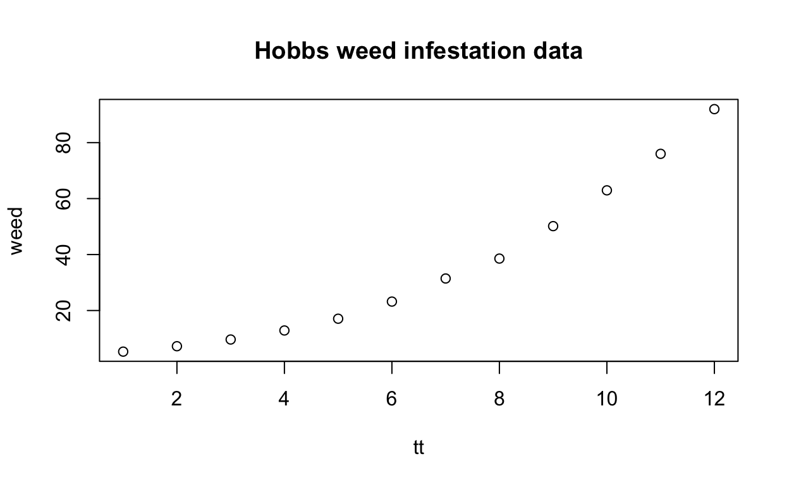

# The `nls()` function

`nls()` is the tool for estimating nonlinear statistical models in base R, the 
primary software distribution
from the Comprehensive R Archive Network (*https://cran.r-project.org*).
The function dates to the 1980s and the work related to @bateswatts in S (see 
*https://en.wikipedia.org/wiki/S_%28programming_language%29*). 

The `nls()` function has a remarkable and comprehensive set of capabilities for 
estimating nonlinear models that are expressed as **formulas**. In particular, we
note that it

- handles formulas that include R functions, even ones that call calculations in
  other programming languages
- allows data to be weighted or subset
- can estimate bound-constrained parameters
- provides a mechanism for handling partially linear models
- permits parameters to be indexed over a set of related data
- produces measures of variability (i.e., standard error estimates) for the 
estimated parameters
- has related profiling capabilities for exploring the likelihood surface as 
parameters are changed
- links to many pre-coded (`selfStart`) models that do not require
  initial parameter values.

With such a range of features and long history, the code has become untidy 
and overly patched, difficult to maintain, and its underlying methods could
be improved. Various workers have developed packages to overcome these 
concerns, and we will address some of these here.

# Scope of our comparison

The tools we will consider are the base-R `nls()` function 
and some packages that are available on the CRAN repository.
Of these, we will pay particular attention to **nlsr** (@nlsr2023manual),
**minpack.lm** (@minpacklm12), and **gslnls** (@gslnls23) which are
general nonlinear least-squares solvers.

While we will provide capsule comments for some other CRAN packages, 
we will not pursue those in the Bioconductor (@Bioconductor) 
collection, nor those on repositories such as 
GitHub (https://github.com) and Gitlab (https://about.gitlab.com).

## Principal messages

Our work was aimed at unifying nonlinear modeling functionality in R,
ideally in a refactored `nls()` function. 

For R **users**, we would advise adapting working scripts, preferably those
with documentation and using recent tools. If there is a suspicion that there
may be ill-conditioning, package `nlsr` or the example we give below of how to
find singular values of the Jacobian allow these diagnostics to be calculated.

For R **developers**, we invite and encourage discussion of the design choices, since these
have downstream implications for ease of use, adaptation to new features, and 
efficiency of ongoing maintenance.

# Some other CRAN packages for nonlinear modeling

`onls` (@R-onls-manual) -- The usual optimization in estimating nonlinear models
is the vertical difference between the dependent variable and the functional
model. `onls` minimizes the sum of **orthogonal** residuals. The objective is
therefore different and involves nontrivial extra calculation. A vignette with
the package and the blog article 
https://www.r-bloggers.com/2015/01/introducing-orthogonal-nonlinear-least-squares-regression-in-r/ 
give some description with illustrative graphs. `onls` appears to be limited to 
problems with one independent and one dependent variable. The Wikipedia article
https://en.wikipedia.org/wiki/Total_least_squares presents an overview of some
ideas, with references to the literature. The approach needs a wider 
discussion and tutorial examples to allow its merits to be judged than can be
included here.

`crsnls` (@R-crsnls-manual) -- This package allows nonlinear estimation by 
controlled random search via two methods. There is unfortunately no vignette.
A modest trial we carried out showed `nlsr::nlxb()` gave the same results in 
a small fraction of the time required by either of the methods in `crsnls`. The
method discussed in @tvrdik2007 claims better reliability in finding solutions
than a Levenberg-Marquardt code (actually from Matlab), but the tests were conducted
on the extreme NIST examples mentioned next.

`NISTnls` (@NISTnls-manual) -- This package provides R code and data for a set of
(numerically ill-conditioned) nonlinear least squares problems from the U.S. National 
Institute for Standards and Technology. These may not represent real-world situations.

`nlshelper` (@nlshelper-manual) -- This package, which unfortunately lacks a
vignette, provides a few utilities for summarizing, testing, and plotting 
non-linear regression models estimated with nls(), nlsList() or nlme() that
are linked or grouped in some way. 

`nlsic` (@nlsic22) -- This solves nonlinear least squares problems with optional
equality and/or inequality constraints. It is clearly not about modeling, and
the input and output are quite different from class `nls` methods. However, there do
not appear to be other R packages with these capabilities.

`nlsMicrobio` (@nlsMicrobio-manual) -- Data sets and nonlinear regression models 
dedicated  to predictive microbiology, including a vignette, by authors of the
`nlstools` package.

`nlstools` (@p-nlstools) -- This package provides several tools for aiding the estimation 
of nonlinear models, particularly using `nls()`. The vignette is actually a journal
article,  and the authors have considerable experience in the subject.

`nlsmsn` (@m-nlsmsn) -- Fit univariate non-linear scale mixture of skew-normal (NL-SMSN) 
regression, with details in Garay, Lachos, and Abanto-Valle (2011). The problem 
here is to minimize an objective that is modified from the traditional sum of squared
residuals.

`nls.multstart` (@nlsmultstart) -- Non-linear least squares regression using
AIC scores with the Levenberg-Marquardt algorithm using multiple starting values 
for increasing the chance that the minimum found is the global minimum.

`nls2` (@nls2-22) -- Nonlinear least squares by brute force has similar
motivations to `nls.multstart`, but uses `nls()` within multiple trials. The author
has extensive expertise in R.

`nlstac` (@m-nlstac) -- A set of functions implementing the algorithm described in
@Torvisco2018 for fitting separable nonlinear regression curves. The 
special class of problem for which this package is intended is an important and 
difficult one. No vignette is provided, unfortunately.

`easynls`  -- Fit and plot some nonlinear models. Thirteen models are treated, but 
there is minimal documentation and no vignette. Package `nlraa` is to be preferred.

`nlraa`  (@MiguezNLRAA2021) -- a set of nonlinear *selfStart* models, primarily from
agriculture. Most include analytic Jacobian code.

`optimx` (@p-optimx) -- This provides 
optimizers that can be applied to minimize a nonlinear function which could be
a nonlinear sum of squares. Not generally recommended if nonlinear 
least squares programs can be easily used, but provides a check and alternative
solvers.

# An illustrative example

The Hobbs weed infestation problem (@cnm79 [page 120]) is a growth-curve modeling 
task that seems straightforward but is quite nasty. Its very succinct statement 
provides the "short reproducible example" much requested on R mailing lists. 
This is a real problem from a field researcher. The data and graph follow.

<div class="layout-chunk" data-layout="l-body">
<div class="sourceCode"><pre class="sourceCode r"><code class="sourceCode r"><span><span class='va'>weed</span> <span class='op'>&lt;-</span> <span class='fu'><a href='https://rdrr.io/r/base/c.html'>c</a></span><span class='op'>(</span><span class='fl'>5.308</span>, <span class='fl'>7.24</span>, <span class='fl'>9.638</span>, <span class='fl'>12.866</span>, <span class='fl'>17.069</span>, <span class='fl'>23.192</span>, <span class='fl'>31.443</span>,</span>
<span>          <span class='fl'>38.558</span>, <span class='fl'>50.156</span>, <span class='fl'>62.948</span>, <span class='fl'>75.995</span>, <span class='fl'>91.972</span><span class='op'>)</span></span>
<span><span class='va'>tt</span> <span class='op'>&lt;-</span> <span class='fl'>1</span><span class='op'>:</span><span class='fl'>12</span></span>
<span><span class='va'>weeddf</span> <span class='op'>&lt;-</span> <span class='fu'><a href='https://rdrr.io/r/base/data.frame.html'>data.frame</a></span><span class='op'>(</span><span class='va'>tt</span>, <span class='va'>weed</span><span class='op'>)</span></span>
<span><span class='fu'><a href='https://rdrr.io/r/graphics/plot.default.html'>plot</a></span><span class='op'>(</span><span class='va'>weeddf</span>, main<span class='op'>=</span><span class='st'>"Hobbs weed infestation data"</span><span class='op'>)</span></span></code></pre></div>


</div>


<!-- 231018: attempt to address comments in 2report1 on modeling vs least squares -->
While model estimation is increasingly automated, nonlinear regression
should use background knowledge and graphs to obtain an understanding of
the general magnitude of the parameters. Indeed, the "visual fitting" approach
(@nash1996nonlinear) mentioned later accords with this viewpoint, as does use
of the **Logistic3T** variant of the model, as well as discussions in @Ross90, 
@Seber89Wild, @bateswatts, and @Gallant87.
Our emphasis on the software resilience to starting parameters that are, in the
sense of statistical modeling, "silly" comes from over half a century of dealing
with users whose interests and understanding are very far from those of statistical
modelers. Thus, we seek methods and codes that obtain reasonable answers under
highly unfavourable conditions. Nevertheless, a proper approach to 
nonlinear modeling is to apply all available knowledge to the task.
<!-- end 231018 work -->

Three suggested models for this data are (with names to allow for easy reference)

**Logistic3U**:
$$  y \approx  b_1 / (1 + b_2 * exp(- b_3 * t)) $$

**Logistic3S**:
$$ y \approx  100 * c_1 / (1 + 10 * c_2 * exp(- 0.1 * c_3 * t)) $$

**Logistic3T**:
$$ y \approx Asym / (1 + exp((xmid - t)/scal)) $$

where we will use `weed` for $y$ and `tt` for $t$. 
The functions above are equivalent, but the first is generally more awkward
to solve numerically due to its poor scaling. The parameters of the three forms
are related as follows:

$$   Asym =  b_1 = 100 * c_1 $$
$$ exp(xmid/scal)  =  b_2 = 10 * c_2 $$
$$ 1/scal  =  b_3 = 0.1*c3 $$
To allow for simpler discussion, let us say that the parameters form a (named) vector
$p$ and the model function is called $model(p)$ with $r = y - model(p)$.

We wish to minimize the sum of squared residuals, which is our loss (or objective) function. 
Starting with some guess for the parameters, we aim to alter these parameters to obtain a smaller
loss function. We then iterate until we can make no further progress.

Let us consider there are $n$ parameters and $m$ residuals. 
The loss function is 
$$ S(p) = r' r = \sum_{i=1}^m { r_i^2 }$$
The gradient of $S(p)$ is
$$ g = 2 * J' r$$
where the Jacobian $J$ is given by elements
$$ J_{i,j} = \partial r_i / \partial p_j $$
and the Hessian is defined by elements
$$ H_{i,j} = \partial ^2 S(p) / {\partial p_i \partial p_j} $$
If we expand the Hessian for nonlinear least squares problems, we find
$$  0.5 * H_{i,j} = \sum_{k = 1}^m{ J_{k,i} J_{k,j}}  + \sum_{k = 1}^m {r_k * \partial{r_k}/{\partial p_i \partial p_j}}$$
Let us use $D_{i,j}$ for the elements of the second term of this expression.
What is generally called **Newton's method** for function minimization tries
to set the gradient to zero (to find a stationary point of the function $S(p)$).
This leads to **Newton's equation**
$$ H \delta = -g $$
Given a set of parameters $p$, we solve this equation for $\delta$, adjust $p$
to $p + \delta$ and iterate, hopefully to converge on a solution. 
Applying this to a sum of squares problem gives
$$ 0.5 * H \delta = (J'J + D) \delta = - J' r$$
In this expression, only the elements of $D$ have second partial derivatives.
Gauss, attempting to model planetary orbits, had small residuals, and noted
that these multiplied the second partial derivatives of $r$, so he approximated
$$ 0.5 * H \approx J' J$$
by assuming $D \approx 0$. This results in the Gauss-Newton method where we
solve 
$$ J' J \delta = - J' r$$
though we can avoid some loss of accuracy by not forming the inner product matrix
$J' J$ and solving the linear least squares matrix problem 
$$ J \delta \approx -r $$
by one of several matrix decomposition methods. 

In reality, there are many problems were $D$ should not be ignored, but the work
to compute it precisely is considerable. Many work-arounds have been 
proposed, of which the Levenberg-Marquardt stabilization 
(@Levenberg1944, @Marquardt1963) is
the most commonly used. For convenience, we will use "Marquardt", as we believe he
first incorporated the ideas into a practical computer program. 

The usual suggestion is that $D$ be replaced by a multiple of the unit matrix or else
a multiple of the diagonal part of $J' J$. In low precision, some elements of 
$J' J$ could underflow to zero (@jn77ima), and a linear combination of both
choices is an effective compromise. Various choices for
$D$, as well as a possible line search along the
direction $\delta$ rather than a unit step (@Hartley1961), 
give rise to several variant
algorithms. "Marquardt's method" is a family of methods. Fortunately, most choices
work well.

## Problem setup

Let us specify in R the three model formulas and set some starting
values for parameters. These starting points are not equivalent and
are deliberately crude choices. Workers performing many calculations 
of a similar nature should try to provide good starting points to reduce
computation time and avoid finding a false solution.
  
<div class="layout-chunk" data-layout="l-body">
<div class="sourceCode"><pre class="sourceCode r"><code class="sourceCode r"><span><span class='co'># model formulas</span></span>
<span><span class='va'>frmu</span> <span class='op'>&lt;-</span> <span class='va'>weed</span> <span class='op'>~</span> <span class='va'>b1</span> <span class='op'>/</span> <span class='op'>(</span><span class='fl'>1</span> <span class='op'>+</span> <span class='va'>b2</span> <span class='op'>*</span> <span class='fu'><a href='https://rdrr.io/r/base/Log.html'>exp</a></span><span class='op'>(</span><span class='op'>-</span><span class='va'>b3</span> <span class='op'>*</span> <span class='va'>tt</span><span class='op'>)</span><span class='op'>)</span></span>
<span><span class='va'>frms</span> <span class='op'>&lt;-</span> <span class='va'>weed</span> <span class='op'>~</span> <span class='fl'>100</span> <span class='op'>*</span> <span class='va'>c1</span><span class='op'>/</span><span class='op'>(</span><span class='fl'>1</span> <span class='op'>+</span> <span class='fl'>10</span><span class='op'>*</span> <span class='va'>c2</span><span class='op'>*</span> <span class='fu'><a href='https://rdrr.io/r/base/Log.html'>exp</a></span><span class='op'>(</span><span class='op'>-</span><span class='fl'>0.1</span> <span class='op'>*</span> <span class='va'>c3</span><span class='op'>*</span> <span class='va'>tt</span><span class='op'>)</span><span class='op'>)</span></span>
<span><span class='va'>frmt</span> <span class='op'>&lt;-</span> <span class='va'>weed</span> <span class='op'>~</span> <span class='va'>Asym</span> <span class='op'>/</span> <span class='op'>(</span><span class='fl'>1</span> <span class='op'>+</span> <span class='fu'><a href='https://rdrr.io/r/base/Log.html'>exp</a></span><span class='op'>(</span><span class='op'>(</span><span class='va'>xmid</span> <span class='op'>-</span> <span class='va'>tt</span><span class='op'>)</span> <span class='op'>/</span> <span class='va'>scal</span><span class='op'>)</span><span class='op'>)</span></span>
<span><span class='co'>#</span></span>
<span><span class='co'># Starting parameter sets</span></span>
<span><span class='va'>stu1</span> <span class='op'>&lt;-</span> <span class='fu'><a href='https://rdrr.io/r/base/c.html'>c</a></span><span class='op'>(</span>b1 <span class='op'>=</span> <span class='fl'>1</span>, b2 <span class='op'>=</span> <span class='fl'>1</span>, b3 <span class='op'>=</span> <span class='fl'>1</span><span class='op'>)</span></span>
<span><span class='va'>sts1</span> <span class='op'>&lt;-</span> <span class='fu'><a href='https://rdrr.io/r/base/c.html'>c</a></span><span class='op'>(</span>c1 <span class='op'>=</span> <span class='fl'>1</span>, c2 <span class='op'>=</span> <span class='fl'>1</span>, c3 <span class='op'>=</span> <span class='fl'>1</span><span class='op'>)</span></span>
<span><span class='va'>stt1</span> <span class='op'>&lt;-</span> <span class='fu'><a href='https://rdrr.io/r/base/c.html'>c</a></span><span class='op'>(</span>Asym <span class='op'>=</span> <span class='fl'>1</span>, xmid <span class='op'>=</span> <span class='fl'>1</span>, scal <span class='op'>=</span> <span class='fl'>1</span><span class='op'>)</span></span></code></pre></div>

</div>


One of the useful features of `nls()` is the possibility of a `selfStart` model,
where starting parameter values are not required. However, if a `selfStart` model 
is not available, `nls()` sets all the starting parameters 
to 1. This is tolerable, but could be improved by using a set of values
that are all slightly different, which, in the case of the example 
model $y \,\sim\, a \,*\, exp(-b \,*\, x) + c\,*\,exp(-d \,*\, x)$
would avoid a singular Jacobian because $b$ and $d$ were equal in value. 
Program modifications to give a sequence like  1.0, 1.1, 1.2, 1.3 for the four 
parameters are fairly obvious. 

It is also possible to provide R functions for the residual and Jacobian. 
This is usually much more work for the user if the formula setup is possible.
To illustrate, we show the functions for the unscaled 3 parameter logistic.
<!-- 231018: added a note to explain deficiencies -->
The particular form of these explicit residual and Jacobian functions comes from
their translation from BASIC codes of the 1970s, as adapted in @jnmws87. The use
of the Laplace form of the residual and the inclusion of data within the functions
reflects choices of that era that are at odds with current practice. Some users
do still want or need to provide problems as explicit functions, particularly
for problems that are not regressions. For example, the Rosenbrock banana-valley
test problem can be provided this way, where the two "residuals" are different
functional forms.

<!-- 231018: removed "this variant uses looping" -->
<!-- Added note on form of the residual. See Stigler (1986) -->
<!--   History of Statistics pg.34 -->
<!-- Note: UNscaled, not scaled -->

<div class="layout-chunk" data-layout="l-body">
<div class="sourceCode"><pre class="sourceCode r"><code class="sourceCode r"><span><span class='co'># Logistic3U</span></span>
<span><span class='va'>hobbs.res</span> <span class='op'>&lt;-</span> <span class='kw'>function</span><span class='op'>(</span><span class='va'>x</span><span class='op'>)</span><span class='op'>{</span> <span class='co'># unscaled Hobbs weeds problem -- residual</span></span>
<span>  <span class='kw'>if</span><span class='op'>(</span><span class='fu'><a href='https://rdrr.io/r/base/length.html'>length</a></span><span class='op'>(</span><span class='va'>x</span><span class='op'>)</span> <span class='op'>!=</span> <span class='fl'>3</span><span class='op'>)</span> <span class='kw'><a href='https://rdrr.io/r/base/stop.html'>stop</a></span><span class='op'>(</span><span class='st'>"hobbs.res -- parameter vector n!=3"</span><span class='op'>)</span></span>
<span>  <span class='va'>y</span> <span class='op'>&lt;-</span> <span class='fu'><a href='https://rdrr.io/r/base/c.html'>c</a></span><span class='op'>(</span><span class='fl'>5.308</span>, <span class='fl'>7.24</span>, <span class='fl'>9.638</span>, <span class='fl'>12.866</span>, <span class='fl'>17.069</span>, <span class='fl'>23.192</span>, <span class='fl'>31.443</span>, </span>
<span>           <span class='fl'>38.558</span>, <span class='fl'>50.156</span>, <span class='fl'>62.948</span>, <span class='fl'>75.995</span>, <span class='fl'>91.972</span><span class='op'>)</span></span>
<span>  <span class='va'>tt</span> <span class='op'>&lt;-</span> <span class='fl'>1</span><span class='op'>:</span><span class='fl'>12</span></span>
<span>  <span class='va'>res</span> <span class='op'>&lt;-</span> <span class='va'>x</span><span class='op'>[</span><span class='fl'>1</span><span class='op'>]</span> <span class='op'>/</span> <span class='op'>(</span><span class='fl'>1</span> <span class='op'>+</span> <span class='va'>x</span><span class='op'>[</span><span class='fl'>2</span><span class='op'>]</span> <span class='op'>*</span> <span class='fu'><a href='https://rdrr.io/r/base/Log.html'>exp</a></span><span class='op'>(</span><span class='op'>-</span><span class='va'>x</span><span class='op'>[</span><span class='fl'>3</span><span class='op'>]</span> <span class='op'>*</span> <span class='va'>tt</span><span class='op'>)</span><span class='op'>)</span> <span class='op'>-</span> <span class='va'>y</span></span>
<span>  <span class='co'># Note: this form of the residual, from Laplace (1788) in the form</span></span>
<span>  <span class='co'># of "fitted - observed" has been used in our software for half</span></span>
<span>  <span class='co'># a century, but sometimes concerns users of the more traditional</span></span>
<span>  <span class='co'># "observed - fitted" form</span></span>
<span><span class='op'>}</span></span>
<span></span>
<span><span class='va'>hobbs.jac</span> <span class='op'>&lt;-</span> <span class='kw'>function</span><span class='op'>(</span><span class='va'>x</span><span class='op'>)</span> <span class='op'>{</span> <span class='co'># unscaled Hobbs weeds problem -- Jacobian</span></span>
<span>  <span class='va'>jj</span> <span class='op'>&lt;-</span> <span class='fu'><a href='https://rdrr.io/r/base/matrix.html'>matrix</a></span><span class='op'>(</span><span class='fl'>0.0</span>, <span class='fl'>12</span>, <span class='fl'>3</span><span class='op'>)</span></span>
<span>  <span class='va'>tt</span> <span class='op'>&lt;-</span> <span class='fl'>1</span><span class='op'>:</span><span class='fl'>12</span></span>
<span>  <span class='va'>yy</span> <span class='op'>&lt;-</span> <span class='fu'><a href='https://rdrr.io/r/base/Log.html'>exp</a></span><span class='op'>(</span><span class='op'>-</span><span class='va'>x</span><span class='op'>[</span><span class='fl'>3</span><span class='op'>]</span> <span class='op'>*</span> <span class='va'>tt</span><span class='op'>)</span></span>
<span>  <span class='va'>zz</span> <span class='op'>&lt;-</span> <span class='fl'>1.0</span> <span class='op'>/</span> <span class='op'>(</span><span class='fl'>1</span> <span class='op'>+</span> <span class='va'>x</span><span class='op'>[</span><span class='fl'>2</span><span class='op'>]</span> <span class='op'>*</span> <span class='va'>yy</span><span class='op'>)</span></span>
<span>  <span class='va'>jj</span><span class='op'>[</span><span class='va'>tt</span>, <span class='fl'>1</span><span class='op'>]</span> <span class='op'>&lt;-</span> <span class='va'>zz</span></span>
<span>  <span class='va'>jj</span><span class='op'>[</span><span class='va'>tt</span>, <span class='fl'>2</span><span class='op'>]</span> <span class='op'>&lt;-</span> <span class='op'>-</span><span class='va'>x</span><span class='op'>[</span><span class='fl'>1</span><span class='op'>]</span> <span class='op'>*</span> <span class='va'>zz</span> <span class='op'>*</span> <span class='va'>zz</span> <span class='op'>*</span> <span class='va'>yy</span></span>
<span>  <span class='va'>jj</span><span class='op'>[</span><span class='va'>tt</span>, <span class='fl'>3</span><span class='op'>]</span> <span class='op'>&lt;-</span> <span class='va'>x</span><span class='op'>[</span><span class='fl'>1</span><span class='op'>]</span> <span class='op'>*</span> <span class='va'>zz</span> <span class='op'>*</span> <span class='va'>zz</span> <span class='op'>*</span> <span class='va'>yy</span> <span class='op'>*</span> <span class='va'>x</span><span class='op'>[</span><span class='fl'>2</span><span class='op'>]</span> <span class='op'>*</span> <span class='va'>tt</span></span>
<span>  <span class='fu'><a href='https://rdrr.io/r/base/attr.html'>attr</a></span><span class='op'>(</span><span class='va'>jj</span>, <span class='st'>"gradient"</span><span class='op'>)</span> <span class='op'>&lt;-</span> <span class='va'>jj</span></span>
<span>  <span class='va'>jj</span></span>
<span><span class='op'>}</span></span></code></pre></div>

</div>


# Estimation of models specified as formulas

Using a formula specification was a principal advantage made
with `nls()` when it became available in S sometime in the 1980s. It uses a
Gauss-Newton (i.e., unstabilized) iteration with a step reduction line
search. This works very efficiently as long as $J$ is not ill-conditioned.
Below we see `nls()` does poorly on the example problem. To save page space,
we use 1-line result display functions from package `nlsr`, namely `pnls()` 
and `pshort()`.

<div class="layout-chunk" data-layout="l-body">


</div>


<div class="layout-chunk" data-layout="l-body">

```
Error in nls(formula = frmu, start = stu1, data = weeddf) : 
  singular gradient
```

```
Error in nls(formula = frms, start = sts1, data = weeddf) : 
  singular gradient
```

```
Error in nls(formula = frmt, start = stt1, data = weeddf) : 
  singular gradient
```

</div>


Here we see the infamous "singular gradient" termination message of `nls()`. 
<!-- Added comment to point out selfStart should be used. -->
Users should, of course, be using the `SSlogis` *selfStart* tool, but ignorance
of this possibility or a slight variant in the model can easily lead to outcomes
similar to those seen here.
<!-- End added comment -->

## Solution attempts with nlsr

<div class="layout-chunk" data-layout="l-body">

```
unlx1:residual sumsquares =  2.5873  on  12 observations
    after  19    Jacobian and  25 function evaluations
  name            coeff          SE       tstat      pval      gradient    JSingval   
b1               196.186         11.31      17.35  3.167e-08  -4.859e-09        1011  
b2               49.0916         1.688      29.08  3.284e-10  -3.099e-08      0.4605  
b3               0.31357      0.006863      45.69  5.768e-12   2.305e-06     0.04714  
```

```
snlx1  -- ss= 2.5873 :  c1 = 1.9619  c2 = 4.9092  c3 = 3.1357; 34 res/ 23 jac
```

```
tnlx1  -- ss= 2.5873 :  Asym = 196.19  xmid = 12.417  scal = 3.1891; 36 res/ 27 jac
```

</div>


Though we have found solutions, the Jacobian is essentially singular as 
shown by its singular
values. Note that these are displayed by package `nlsr` in a single column in
the output to provide a compact layout, but the values do not correspond to 
the individual parameters in 
whose row they appear; they are a property of the whole problem.


## Solution attempts with minpack.lm

<div class="layout-chunk" data-layout="l-body">

```
unlm1  -- ss= 2.5873 :  b1 = 196.19  b2 = 49.092  b3 = 0.31357; 17  itns
```

```
snlm1  -- ss= 2.5873 :  c1 = 1.9619  c2 = 4.9092  c3 = 3.1357; 7  itns
```

```
Error in nlsModel(formula, mf, start, wts) : 
  singular gradient matrix at initial parameter estimates
```

</div>


## Solution attempts with gslnls

<div class="layout-chunk" data-layout="l-body">

```
ugslnls1  -- ss= 2.5873 :  b1 = 196.19  b2 = 49.092  b3 = 0.31357; 25  itns
```

```
sgslnls1  -- ss= 2.5873 :  c1 = 1.9619  c2 = 4.9092  c3 = 3.1357; 9  itns
```

```
tgslnls1  -- ss= 9205.4 :  Asym = 35.532  xmid = 20846  scal = -1745.2; 47  itns
```

</div>


## Comparison notes for formula-setup solutions

`nlsr::nlxb()` uses `print()` to output standard errors and 
singular values of the Jacobian (for diagnostic purposes). By contrast, 
`minpack.lm::nlsLM()` and `nls()`
use `summary()`, which does not display the sum of squares, while `print()` 
gives the sum of squares, but not the standard error of the residuals.

The singular values allow us to gauge how "nearly singular" the 
Jacobian is at the solution, and the ratio of the smallest to largest of the 
singular values is a simple but effective measure. The ratios are
4.6641e-05 for Logistic3U, 0.021022 for Logistic3S, and 0.001055 for
Logistic3T, so Logistic3S is the "least singular". 

The results from `nlsLM` and `gsl_nls` for the transformed model Logistic3T have a very 
large sum of squares, which may suggest that these programs have failed. 
Since `nls()`, `nlsLM()`, and `gsl_nls()` do not 
offer singular values, we need to extract the Jacobian and compute its
singular values. The following script shows how to do this, using as Jacobian what is called
the `gradient` element in the returned solution for these solvers.

<div class="layout-chunk" data-layout="l-body">
<div class="sourceCode"><pre class="sourceCode r"><code class="sourceCode r"><span><span class='co'># for nlsLM</span></span>
<span><span class='kw'>if</span> <span class='op'>(</span><span class='fu'><a href='https://rdrr.io/r/base/class.html'>inherits</a></span><span class='op'>(</span><span class='va'>tnlm1</span>, <span class='st'>"try-error"</span><span class='op'>)</span><span class='op'>)</span>  <span class='op'>{</span></span>
<span>   <span class='fu'><a href='https://rdrr.io/r/base/print.html'>print</a></span><span class='op'>(</span><span class='st'>"Cannot compute solution -- likely singular Jacobian"</span><span class='op'>)</span></span>
<span> <span class='op'>}</span> <span class='kw'>else</span> <span class='op'>{</span>  </span>
<span>   <span class='va'>JtnlsLM</span> <span class='op'>&lt;-</span> <span class='va'>tnlm1</span><span class='op'>$</span><span class='va'>m</span><span class='op'>$</span><span class='fu'>gradient</span><span class='op'>(</span><span class='op'>)</span> <span class='co'># actually the Jacobian</span></span>
<span>   <span class='fu'><a href='https://rdrr.io/r/base/svd.html'>svd</a></span><span class='op'>(</span><span class='va'>JtnlsLM</span><span class='op'>)</span><span class='op'>$</span><span class='va'>d</span> <span class='co'># Singular values</span></span>
<span><span class='op'>}</span>   </span></code></pre></div>

```
[1] "Cannot compute solution -- likely singular Jacobian"
```

<div class="sourceCode"><pre class="sourceCode r"><code class="sourceCode r"><span><span class='co'># for gsl_nls</span></span>
<span><span class='kw'>if</span> <span class='op'>(</span><span class='fu'><a href='https://rdrr.io/r/base/class.html'>inherits</a></span><span class='op'>(</span><span class='va'>tgslnls1</span>, <span class='st'>"try-error"</span><span class='op'>)</span><span class='op'>)</span> <span class='op'>{</span></span>
<span>   <span class='fu'><a href='https://rdrr.io/r/base/cat.html'>cat</a></span><span class='op'>(</span><span class='st'>"Cannot compute solution -- likely singular Jacobian"</span><span class='op'>)</span></span>
<span><span class='op'>}</span> <span class='kw'>else</span> <span class='op'>{</span>  </span>
<span>   <span class='va'>JtnlsLM</span> <span class='op'>&lt;-</span> <span class='va'>tgslnls1</span><span class='op'>$</span><span class='va'>m</span><span class='op'>$</span><span class='fu'>gradient</span><span class='op'>(</span><span class='op'>)</span></span>
<span>   <span class='fu'><a href='https://rdrr.io/r/base/svd.html'>svd</a></span><span class='op'>(</span><span class='va'>JtnlsLM</span><span class='op'>)</span><span class='op'>$</span><span class='va'>d</span> <span class='co'># Singular values</span></span>
<span><span class='op'>}</span>   </span></code></pre></div>

```
[1] 3.4641e+00 9.8541e-09 3.8249e-11
```

</div>


We see that there are differences in detail, but the more important result is that
two out of three singular values are essentially 0. Our Jacobian is singular, and no 
method of the Gauss-Newton type should be able to continue. Indeed, from the parameters
reported at this saddle point, `nlsr::nlxb()` cannot proceed. 

<div class="layout-chunk" data-layout="l-body">
<div class="sourceCode"><pre class="sourceCode r"><code class="sourceCode r"><span><span class='va'>stspecial</span> <span class='op'>&lt;-</span> <span class='fu'><a href='https://rdrr.io/r/base/c.html'>c</a></span><span class='op'>(</span>Asym <span class='op'>=</span> <span class='fl'>35.532</span>,  xmid <span class='op'>=</span> <span class='fl'>43376</span>,  scal <span class='op'>=</span> <span class='op'>-</span><span class='fl'>2935.4</span><span class='op'>)</span></span>
<span><span class='va'>badstart</span> <span class='op'>&lt;-</span> <span class='kw'><a href='https://rdrr.io/r/base/try.html'>try</a></span><span class='op'>(</span><span class='fu'>nlxb</span><span class='op'>(</span>formula <span class='op'>=</span> <span class='va'>frmt</span>, start <span class='op'>=</span> <span class='va'>stspecial</span>, data <span class='op'>=</span> <span class='va'>weeddf</span><span class='op'>)</span><span class='op'>)</span></span>
<span><span class='kw'>if</span> <span class='op'>(</span><span class='op'>!</span> <span class='fu'><a href='https://rdrr.io/r/base/class.html'>inherits</a></span><span class='op'>(</span><span class='va'>badstart</span>, <span class='st'>"try-error"</span><span class='op'>)</span><span class='op'>)</span> <span class='fu'><a href='https://rdrr.io/r/base/print.html'>print</a></span><span class='op'>(</span><span class='va'>badstart</span><span class='op'>)</span></span></code></pre></div>

```
residual sumsquares =  9205.4  on  12 observations
    after  2    Jacobian and  2 function evaluations
  name            coeff          SE       tstat      pval      gradient    JSingval   
Asym             35.5321            NA         NA         NA  -9.694e-09       3.464  
xmid               43376            NA         NA         NA  -1.742e-09    2.61e-10  
scal             -2935.4            NA         NA         NA    -2.4e-08    7.12e-16  
```

</div>


# Functional specification of problems

We illustrate how to solve nonlinear least squares problems using
a function to define the residual. Note that `gsl_nls()` requires
a vector `y` that is the length of the vector returned by the
function supplied, e.g., `hobbs.res()`. `gsl_nls` uses 
a numerical approximation for the Jacobian if the argument `jac` 
is missing. Note function `nlsr::pnlslm()` for a 1-line display of
the results of `minpack.lm::nls.lm()`.

<div class="layout-chunk" data-layout="l-body">

```
hobnlfb<-nlfb(start=stu1, resfn=hobbs.res, jacfn=hobbs.jac)
```

```
hobnlfb  -- ss= 2.5873 :  b1 = 196.19  b2 = 49.092  b3 = 0.31357; 25 res/ 19 jac
```

```
hobnlm<-nls.lm(par=stu1, fn=hobbs.res, jac=hobbs.jac)
```

```
hobnlm  -- ss= 2.5873 :  b1 = 196.19  b2 = 49.092  b3 = 0.31357; 17  itns
```

```
hobgsln<-gsl_nls(start=stu1, fn=hobbs.res, y=rep(0,12))
```

```
hobgsln  -- ss= 2.5873 :  b1 = 196.19  b2 = 49.092  b3 = 0.31357; 25  itns
```

```
hobgsl<-gsl_nls(start=stu1, fn=hobbs.res, y=rep(0,12), jac=hobbs.jac)
```

```
hobgsl  -- ss= 2.5873 :  b1 = 196.19  b2 = 49.092  b3 = 0.31357; 25  itns
```

</div>


# Design goals, termination tests, and output objects

The output object of `nlxb()` is smaller than the class `nls` object returned
by `nls()`, `nlsLM()`, and `gsl_nls()`. Package `nlsr` emphasizes the solution 
of the nonlinear least squares problem rather than the estimation of a nonlinear 
model that fits or explains the data. The object of class `nls` allows for 
a number of specialized modeling and diagnostic extensions. For compatibility, 
the `nlsr` package has the function `wrapnlsr()`, for which `nlsr()` is an alias. 
This uses `nlxb()` to find good parameters, then calls `nls()` to return the class 
`nls` object. Unless particular modeling features are needed, the use of 
`wrapnlsr()` is unnecessary and wasteful of resources.

The design goals of the different tools may also be revealed in the so-called
"convergence tests" for the iterative solvers. In the manual page for `nls()` 
in R 4.0.0, there was the warning:

>  *Do not use `nls` on artificial "zero-residual" data*

with suggested addition of small perturbations to the data. This admits 
`nls()` could not solve well-posed problems unless data is polluted
with errors. Zero-residual problems are not always artificial,
since problems in function approximation and nonlinear equations can be 
approached with nonlinear least squares. Fortunately, a small adjustment
to the "termination test" for the program, rather than for the
"convergence" of the underlying algorithm, fixes the defect. The test
is the Relative Offset Convergence
Criterion (see @BatesWatts81). This scales an estimated reduction in the loss
function by its current value. If the loss function is very small, we are close
to a zero-divide. Adding a small quantity to the divisor avoids trouble. 
In 2021, one of us (J. Nash) proposed that `nls.control()` have an 
additional parameter `scaleOffset` with a default value of zero. Setting it to a 
small number -- 1.0 is a reasonable choice -- allows small-residual problems 
(i.e., near-exact fits) to be dealt with easily. We call this the
**safeguarded relative offset convergence criterion**, and it has been in `nlsr`
since it was introduced. The default value 
gives the legacy behavior. This improvement has been in the R distributed code 
since version 4.1.0.

Additional termination tests can be used. `nlsr` has a **small sum of 
squares** test (**smallsstest**) that compares the latest evaluated sum of squared
(weighted) residuals to `e4` times the initial sum of squares, where
`e4 <- (100*.Machine$double.eps)^4` is approximately 2.43e-55.

Termination after what may be considered excessive computation is also important.
`nls()` stops after `maxiter` "iterations". The meaning of "iteration" may require an 
examination of the code for the different algorithms. `nlsr` terminates execution 
when the number of residual or Jacobian evaluations exceed set limits. Generally, 
we prefer larger limits than the default `maxiter = 50` of `nls()` to avoid stopping 
early, though this may result in some unnecessary computations.

## Returned results of nls() and other tools

As mentioned, the output of `nls()`, `minpack.lm::nlsLM()`, or
`gslnls::gsl_nls()` is an object of class "nls" which has a quite rich structure
described in the manual files or revealed by applying the `str()` function to the
result of `nls()`.  The complexity of this object is a challenge to users. Let us 
use for example `result <- snlm1` as the returned object from `nlsLM()` for the 
Logistic3S problem. The `data` return element 
is an R symbol. To actually access the data from this element, we need to use 
the syntax:
```
eval(parse(text = result$data))
```
However, if the call is made with `model = TRUE`, then there is a returned element
`model` which contains the data, and we can list its contents using:
```
ls(result$model)
```
and if there is an element called `xdata`, then it can be accessed as
`result$model$xdata`.

By contrast, `nlsr::nlxb()` returns a much simpler structure of 11 items
in one level. Moreover, `nlxb` explicitly returns the sum of squares, the residual vector, Jacobian, and counts of evaluations.

## When to compute ancillary information

Tools that produce a class `nls` output object create a rich set of functions
and structures that are then used in a variety of modeling tasks, including the
least squares solution. By contrast,
`nlsr` computes quantities as they are requested or needed, with additional
features in separate functions. For example, the singular values of the Jacobian 
are actually computed in the `print` and `summary` methods for the result. 
These two approaches
lead to different consequences for performance and how features are
provided. `nlsr` has antecedents in the methods of @cnm79, where storage for
data and programs was at a ridiculous premium in the small computers of the era.
Thus, the code in `nlsr` is likely of value for workers to copy and modify
for customized tools.

# Jacobian calculation

Gauss-Newton/Marquardt methods all need a Jacobian matrix at each iteration. 
By default, `nlsr::nlxb()` will try to evaluate this using analytic 
expressions using symbolic and automatic differentiation tools. 
When using a formula specification of the model, `nls()`, `minpack.lm::nlsLM()`
and `gslnls::gsl_nls()` use a finite difference approximation to compute the
Jacobian, though `gsl_nls()` does have an option to attempt symbolic expressions.
Package `nlsr` provides, via appropriate calling syntax, four numeric approximation 
options for the Jacobian, with a further control `ndstep` for the size of the
step used in the approximation. These options allow programming choices to be
examined. Users can largely ignore them.

Using the "gradient" attribute of the output of the Jacobian function to hold
the Jacobian matrix lets us embed this in the residual function as well,
so that the call to `nlsr::nlfb()` can be made with the same name used for 
both residual and Jacobian function arguments. This programming trick saves a 
lot of trouble for the package developer, but it can be a nuisance for users 
trying to understand the code. 

As far as we can understand the logic in `nls()`, the Jacobian computation during
parameter estimation is carried out within the called C-language program
and its wrapper R code function `numericDeriv()`, part of
`./src/library/stats/R/nls.R`
in the R distribution source code. This is used to provide Jacobian information in 
the `nlsModel()` and `nlsModel.plinear()` functions, which are not exported for 
general use. `gsl_nls()` also appears to use `numericDeriv()`. 

`numericDeriv()` uses a 
simple forward difference approximation of derivatives, though a central 
difference approximation can be specified in control parameters. 
We are unclear why `numericDeriv()` in base R calls `C_numeric_deriv`,
as we were easily able to create a more compact version entirely in R. 
See *https://github.com/nashjc/RNonlinearLS/tree/main/DerivsNLS*.

`minpack.lm::nlsLM()` invokes `numericDeriv()` in its local 
version of `nlsModel()`, but it appears to use an internal approximate Jacobian 
code from 
the original Fortran `minpack` code, namely, `lmdif.f`. Such differences in approach
can lead to different behavior, usually minor, but sometimes annoying with
ill-conditioned problems. 

- A pasture regrowth problem (@Huet2004, page 1, based on @Ratkowsky1983) has a
  poorly conditioned Jacobian and `nls()` fails with "singular gradient". 
  Worse, numerical approximation to the Jacobian gives the error
  "singular gradient matrix at initial parameter estimates" for `minpack.lm::nlsLM`
  so that the Marquardt stabilization is unable to take effect, while the analytic
  derivatives of `nlsr::nlxb` give a solution. 

- Karl Schilling (private communication) provided an example where a model specified
  with the formula `y ~ a * (x ˆ b)` causes `nlsr::nlxb` to fail because the partial
  derivative w.r.t. `b` is `a * (x ^ b * log(x))`. If there is data for which `x = 0`,
  the derivative is undefined, but the model can be computed. In such cases, 
  we observed that `nls()` and 
  `minpack.lm::nlsLM` found a solution, though this seems to be a lucky accident.

## Jacobian code in selfStart models

Analytic Jacobian code can be provided to all the solvers discussed.
Most `selfStart` models that automatically provide starting parameters
also include such code. There is documentation in R
of `selfStart` models, but their construction is non-trivial. A number 
of such models are included with base R in `./src/library/stats/R/zzModels.R`,
with package `nlraa` (@MiguezNLRAA2021) providing a richer set. 
There are also some in the now-archived package `NRAIA`.
These provide the Jacobian in the "gradient" attribute of the "one-sided" formula
that defines each model, and these Jacobians are often the analytic forms. 

The `nls()` function, after
computing the "right-hand side" or `rhs` of the residual, checks to see if the
"gradient" attribute is defined, otherwise using `numericDeriv()` to compute a 
Jacobian into that attribute. This code is within the `nlsModel()` or
`nlsModel.plinear()` functions. The use of analytic Jacobians
almost certainly contributes to the good performance of `nls()` on `selfStart` 
models.

The use of `selfStart` models with
`nlsr` is described in the "Introduction to nlsr" vignette. However, since `nlsr`
generally can use very crude starting values, we have rarely needed them, though
it should be pointed out that our work is primarily diagnostic. If we were carrying
out a large number of similar estimations, such initial parameters are 
critical to efficiency.

In considering `selfStart` models, we noted that the base-R function `SSlogis`
is intended to solve problem **Logistic3T** above.  When this function is used
via `getInitial()` to  find
starting values, it actually calls `nls()` with the 'plinear' algorithm 
and finds a (full) solution. It then passes the solution coefficients to the default 
algorithm unnecessarily. Moreover, the implicit double call is, in our view, prone to creating 
errors in code maintenance. 
To provide simpler starting parameters, the function `SSlogisJN`
is now part of the package `nlsr`, but is most useful for `nls()`.

Users may also want to profit from the Jacobian code of `selfStart` models 
but supply explicit starting values other than those suggested by `getInitial()`.
This does not appear to be possible with `nls()`. `nlsr::nlxb()` always requires 
starting parameters, and can either use `getInitial()` to find them from the `selfStart`
model or provide explicit values, but the formula used in the call to `nlxb()`
still involves the `selfStart` function.

<!-- tssx <-try(nls(weed ~ SSlogis(tt, Asym, xmid, scale), start=stt1, data=weeddf)) -->
<!-- tssx <-try(nls(weed ~ SSlogis(tt, Asym=1, xmid=1, scale=1),  data=weeddf)) -->
<!-- tssx <-try(nls(weed ~ SSlogis(tt, Asym, xmid, scale),  data=weeddf))summary(tssx) -->

We are also surprised that the 
analytic expressions for the Jacobian ("gradient") in the `SSLogis` function 
and others save quantities in "hidden"
variables, i.e., with names preceded by ".". 
These are then not displayed by the `ls()`
command, making them difficult to access by users who may wish to create
their own `selfStart` model via copy and edit.
Interactive tools, such as "visual fitting" (@nash1996nonlinear) might be
worth considering as another way to find starting parameters, but we know of no
R capability of this type.

As a side note, the introduction of `scaleOffset` in R 4.1.1 to deal with the 
convergence test for small residual problems now requires that the `getInitial()`
function have dot-arguments (`...`) in its argument list. This illustrates the
entanglement of many features in `nls()` that complicate its maintenance and
improvement.

# Bounds constraints on parameters

For many problems, we know that parameters cannot be bigger or smaller than some
externally known limits. Such limits should be built into models, but there 
are some important details for using the tools in R.

- `nls()` can only impose bounds if the `algorithm = "port"` argument is 
used in the call. Unfortunately, the documentation warns us:

  *The algorithm = "port" code appears unfinished, and does not even 
   check that the starting value is within the bounds. Use with 
   caution, especially where bounds are supplied.*

- `gsl_nls()` does not offer bounds.

- bounds are part of the default method for package `nlsr`.

- `nlsLM()` includes bounds in the standard call, but we have observed cases
   where it fails to get the correct answer. From an examination of the code,
   we believe the authors have not taken into account all possibilities, though
   all programs have some weakness regarding constrained optimization in that
   programmers have to work with assumptions on the scale of numbers, 
   and some problems will be outside the scope envisaged.

<div class="layout-chunk" data-layout="l-body">
<div class="sourceCode"><pre class="sourceCode r"><code class="sourceCode r"><span><span class='co'># Start MUST be feasible i.e. on or within bounds</span></span>
<span><span class='va'>anlshob1b</span> <span class='op'>&lt;-</span> <span class='kw'><a href='https://rdrr.io/r/base/try.html'>try</a></span><span class='op'>(</span><span class='fu'><a href='https://rdrr.io/r/stats/nls.html'>nls</a></span><span class='op'>(</span><span class='va'>frms</span>, start <span class='op'>=</span> <span class='va'>sts1</span>, data <span class='op'>=</span> <span class='va'>weeddf</span>, lower <span class='op'>=</span> <span class='fu'><a href='https://rdrr.io/r/base/c.html'>c</a></span><span class='op'>(</span><span class='fl'>0</span>,<span class='fl'>0</span>,<span class='fl'>0</span><span class='op'>)</span>,</span>
<span>             upper <span class='op'>=</span> <span class='fu'><a href='https://rdrr.io/r/base/c.html'>c</a></span><span class='op'>(</span><span class='fl'>2</span>,<span class='fl'>6</span>,<span class='fl'>3</span><span class='op'>)</span>, algorithm <span class='op'>=</span> <span class='st'>'port'</span><span class='op'>)</span><span class='op'>)</span></span>
<span><span class='kw'>if</span> <span class='op'>(</span><span class='op'>!</span> <span class='fu'><a href='https://rdrr.io/r/base/class.html'>inherits</a></span><span class='op'>(</span><span class='va'>anlshob1b</span>, <span class='st'>"try-error"</span><span class='op'>)</span><span class='op'>)</span> <span class='fu'>pnls</span><span class='op'>(</span><span class='va'>anlshob1b</span><span class='op'>)</span> <span class='co'>#  check the answer (short form)</span></span></code></pre></div>

```
anlshob1b  -- ss= 9.4726 :  c1 = 2  c2 = 4.4332  c3 = 3; 12  itns
```

<div class="sourceCode"><pre class="sourceCode r"><code class="sourceCode r"><span><span class='co'># nlsLM seems NOT to work with bounds in this example</span></span>
<span><span class='va'>anlsLM1b</span> <span class='op'>&lt;-</span> <span class='kw'><a href='https://rdrr.io/r/base/try.html'>try</a></span><span class='op'>(</span><span class='fu'>nlsLM</span><span class='op'>(</span><span class='va'>frms</span>, start <span class='op'>=</span> <span class='va'>sts1</span>, data <span class='op'>=</span> <span class='va'>weeddf</span>, lower <span class='op'>=</span> <span class='fu'><a href='https://rdrr.io/r/base/c.html'>c</a></span><span class='op'>(</span><span class='fl'>0</span>,<span class='fl'>0</span>,<span class='fl'>0</span><span class='op'>)</span>, upper <span class='op'>=</span> <span class='fu'><a href='https://rdrr.io/r/base/c.html'>c</a></span><span class='op'>(</span><span class='fl'>2</span>,<span class='fl'>6</span>,<span class='fl'>3</span><span class='op'>)</span><span class='op'>)</span><span class='op'>)</span></span>
<span><span class='kw'>if</span> <span class='op'>(</span><span class='op'>!</span> <span class='fu'><a href='https://rdrr.io/r/base/class.html'>inherits</a></span><span class='op'>(</span><span class='va'>anlsLM1b</span>, <span class='st'>"try-error"</span><span class='op'>)</span><span class='op'>)</span> <span class='fu'>pnls</span><span class='op'>(</span><span class='va'>anlsLM1b</span><span class='op'>)</span></span></code></pre></div>

```
anlsLM1b  -- ss= 881.02 :  c1 = 2  c2 = 6  c3 = 3; 2  itns
```

<div class="sourceCode"><pre class="sourceCode r"><code class="sourceCode r"><span><span class='co'># also no warning if starting out of bounds, but gets a good answer!!</span></span>
<span><span class='va'>st4</span> <span class='op'>&lt;-</span> <span class='fu'><a href='https://rdrr.io/r/base/c.html'>c</a></span><span class='op'>(</span>c1 <span class='op'>=</span> <span class='fl'>4</span>, c2 <span class='op'>=</span> <span class='fl'>4</span>, c3 <span class='op'>=</span> <span class='fl'>4</span><span class='op'>)</span></span>
<span><span class='va'>anlsLMob</span> <span class='op'>&lt;-</span> <span class='kw'><a href='https://rdrr.io/r/base/try.html'>try</a></span><span class='op'>(</span><span class='fu'>nlsLM</span><span class='op'>(</span><span class='va'>frms</span>, start <span class='op'>=</span> <span class='va'>st4</span>, data <span class='op'>=</span> <span class='va'>weeddf</span>, lower <span class='op'>=</span> <span class='fu'><a href='https://rdrr.io/r/base/c.html'>c</a></span><span class='op'>(</span><span class='fl'>0</span>,<span class='fl'>0</span>,<span class='fl'>0</span><span class='op'>)</span>, upper <span class='op'>=</span> <span class='fu'><a href='https://rdrr.io/r/base/c.html'>c</a></span><span class='op'>(</span><span class='fl'>2</span>,<span class='fl'>6</span>,<span class='fl'>3</span><span class='op'>)</span><span class='op'>)</span><span class='op'>)</span></span>
<span><span class='kw'>if</span> <span class='op'>(</span><span class='op'>!</span> <span class='fu'><a href='https://rdrr.io/r/base/class.html'>inherits</a></span><span class='op'>(</span><span class='va'>anlsLMob</span>, <span class='st'>"try-error"</span><span class='op'>)</span><span class='op'>)</span> <span class='fu'>pnls</span><span class='op'>(</span><span class='va'>anlsLMob</span><span class='op'>)</span></span></code></pre></div>

```
anlsLMob  -- ss= 9.4726 :  c1 = 2  c2 = 4.4332  c3 = 3; 4  itns
```

<div class="sourceCode"><pre class="sourceCode r"><code class="sourceCode r"><span><span class='co'># Try nlsr::nlxb()</span></span>
<span><span class='va'>anlx1b</span> <span class='op'>&lt;-</span> <span class='kw'><a href='https://rdrr.io/r/base/try.html'>try</a></span><span class='op'>(</span><span class='fu'>nlxb</span><span class='op'>(</span><span class='va'>frms</span>, start <span class='op'>=</span> <span class='va'>sts1</span>, data <span class='op'>=</span> <span class='va'>weeddf</span>, lower <span class='op'>=</span> <span class='fu'><a href='https://rdrr.io/r/base/c.html'>c</a></span><span class='op'>(</span><span class='fl'>0</span>,<span class='fl'>0</span>,<span class='fl'>0</span><span class='op'>)</span>, upper <span class='op'>=</span> <span class='fu'><a href='https://rdrr.io/r/base/c.html'>c</a></span><span class='op'>(</span><span class='fl'>2</span>,<span class='fl'>6</span>,<span class='fl'>3</span><span class='op'>)</span><span class='op'>)</span><span class='op'>)</span></span>
<span><span class='kw'>if</span> <span class='op'>(</span><span class='op'>!</span> <span class='fu'><a href='https://rdrr.io/r/base/class.html'>inherits</a></span><span class='op'>(</span><span class='va'>anlx1b</span>, <span class='st'>"try-error"</span><span class='op'>)</span><span class='op'>)</span> <span class='fu'>pshort</span><span class='op'>(</span><span class='va'>anlx1b</span><span class='op'>)</span></span></code></pre></div>

```
anlx1b  -- ss= 9.4726 :  c1 = 2  c2 = 4.4332  c3 = 3; 12 res/ 12 jac
```

</div>


## Philosophical considerations

Bounds on parameters raise some interesting questions about how 
uncertainty in parameter estimates should be computed or reported. That is, the
traditional "standard errors" are generally taken to imply symmetric intervals about
the point estimate in which the parameter may be expected to be found with some
probability under certain assumptions.
Bounds change those assumptions and hence the interpretation of estimates of
uncertainty, whether by traditional approximations from the $J' J$ matrix or from methods
such as profile likelihood or bootstrap. At the time of writing, 
`nlsr::nlxb()` does not compute standard errors nor their derived statistics 
when bounds are active to avoid providing misleading information.

## Fixed parameters (masks)

Let us try to fix (mask) the first parameter in the first two example problems.

<div class="layout-chunk" data-layout="l-body">
<div class="sourceCode"><pre class="sourceCode r"><code class="sourceCode r"><span><span class='co'># Hobbsmaskx.R -- masks with formula specification of the problem</span></span>
<span><span class='kw'><a href='https://rdrr.io/r/base/library.html'>require</a></span><span class='op'>(</span><span class='va'>nlsr</span><span class='op'>)</span>; <span class='kw'><a href='https://rdrr.io/r/base/library.html'>require</a></span><span class='op'>(</span><span class='va'>minpack.lm</span><span class='op'>)</span>; <span class='va'>traceval</span> <span class='op'>&lt;-</span> <span class='cn'>FALSE</span></span>
<span><span class='va'>stu</span> <span class='op'>&lt;-</span> <span class='fu'><a href='https://rdrr.io/r/base/c.html'>c</a></span><span class='op'>(</span>b1 <span class='op'>=</span> <span class='fl'>200</span>, b2 <span class='op'>=</span> <span class='fl'>50</span>, b3 <span class='op'>=</span> <span class='fl'>0.3</span><span class='op'>)</span> <span class='co'># a default starting vector (named!)</span></span>
<span><span class='va'>sts</span> <span class='op'>&lt;-</span> <span class='fu'><a href='https://rdrr.io/r/base/c.html'>c</a></span><span class='op'>(</span>c1 <span class='op'>=</span> <span class='fl'>2</span>, c2 <span class='op'>=</span> <span class='fl'>5</span>, c3 <span class='op'>=</span> <span class='fl'>3</span><span class='op'>)</span> <span class='co'># a default scaled starting vector (named!)</span></span>
<span><span class='co'># fix first parameter</span></span>
<span><span class='va'>anxbmsk1</span> <span class='op'>&lt;-</span> <span class='kw'><a href='https://rdrr.io/r/base/try.html'>try</a></span><span class='op'>(</span><span class='fu'><a href='https://rdrr.io/pkg/nlsr/man/nlxb.html'>nlxb</a></span><span class='op'>(</span><span class='va'>frmu</span>, start <span class='op'>=</span> <span class='va'>stu</span>, data <span class='op'>=</span> <span class='va'>weeddf</span>, lower <span class='op'>=</span> <span class='fu'><a href='https://rdrr.io/r/base/c.html'>c</a></span><span class='op'>(</span><span class='fl'>200</span>, <span class='fl'>0</span>, <span class='fl'>0</span><span class='op'>)</span>, </span>
<span>      upper <span class='op'>=</span> <span class='fu'><a href='https://rdrr.io/r/base/c.html'>c</a></span><span class='op'>(</span><span class='fl'>200</span>, <span class='fl'>60</span>, <span class='fl'>3</span><span class='op'>)</span>, trace<span class='op'>=</span><span class='va'>traceval</span><span class='op'>)</span><span class='op'>)</span></span>
<span><span class='kw'>if</span> <span class='op'>(</span><span class='op'>!</span> <span class='fu'><a href='https://rdrr.io/r/base/class.html'>inherits</a></span><span class='op'>(</span><span class='va'>anxbmsk1</span>, <span class='st'>"try-error"</span><span class='op'>)</span><span class='op'>)</span> <span class='fu'><a href='https://rdrr.io/r/base/print.html'>print</a></span><span class='op'>(</span><span class='va'>anxbmsk1</span><span class='op'>)</span></span></code></pre></div>

```
residual sumsquares =  2.6182  on  12 observations
    after  4    Jacobian and  4 function evaluations
  name            coeff          SE       tstat      pval      gradient    JSingval   
b1                   200U M         NA         NA         NA           0          NA  
b2               49.5108          1.12      44.21  8.421e-13  -2.887e-07        1022  
b3              0.311461      0.002278      136.8  1.073e-17   0.0001635      0.4569  
```

<div class="sourceCode"><pre class="sourceCode r"><code class="sourceCode r"><span><span class='va'>anlM1</span> <span class='op'>&lt;-</span> <span class='kw'><a href='https://rdrr.io/r/base/try.html'>try</a></span><span class='op'>(</span><span class='fu'><a href='https://rdrr.io/pkg/minpack.lm/man/nlsLM.html'>nlsLM</a></span><span class='op'>(</span><span class='va'>frmu</span>, start <span class='op'>=</span> <span class='va'>stu</span>, data <span class='op'>=</span> <span class='va'>weeddf</span>, lower <span class='op'>=</span> <span class='fu'><a href='https://rdrr.io/r/base/c.html'>c</a></span><span class='op'>(</span><span class='fl'>200</span>, <span class='fl'>0</span>, <span class='fl'>0</span><span class='op'>)</span>, </span>
<span>      upper<span class='op'>=</span><span class='fu'><a href='https://rdrr.io/r/base/c.html'>c</a></span><span class='op'>(</span><span class='fl'>200</span>, <span class='fl'>60</span>, <span class='fl'>3</span><span class='op'>)</span>, trace <span class='op'>=</span> <span class='va'>traceval</span><span class='op'>)</span><span class='op'>)</span></span>
<span><span class='kw'>if</span> <span class='op'>(</span><span class='op'>!</span> <span class='fu'><a href='https://rdrr.io/r/base/class.html'>inherits</a></span><span class='op'>(</span><span class='va'>anlM1</span>, <span class='st'>"try-error"</span><span class='op'>)</span><span class='op'>)</span> <span class='fu'><a href='https://rdrr.io/pkg/nlsr/man/pnls.html'>pnls</a></span><span class='op'>(</span><span class='va'>anlM1</span><span class='op'>)</span></span></code></pre></div>

```
anlM1  -- ss= 2.6182 :  b1 = 200  b2 = 49.511  b3 = 0.31146; 4  itns
```

<div class="sourceCode"><pre class="sourceCode r"><code class="sourceCode r"><span><span class='va'>anlsmsk1</span> <span class='op'>&lt;-</span> <span class='kw'><a href='https://rdrr.io/r/base/try.html'>try</a></span><span class='op'>(</span><span class='fu'><a href='https://rdrr.io/r/stats/nls.html'>nls</a></span><span class='op'>(</span><span class='va'>frmu</span>, start <span class='op'>=</span> <span class='va'>stu</span>, data <span class='op'>=</span> <span class='va'>weeddf</span>, lower <span class='op'>=</span> <span class='fu'><a href='https://rdrr.io/r/base/c.html'>c</a></span><span class='op'>(</span><span class='fl'>200</span>, <span class='fl'>0</span>, <span class='fl'>0</span><span class='op'>)</span>, </span>
<span>    upper <span class='op'>=</span> <span class='fu'><a href='https://rdrr.io/r/base/c.html'>c</a></span><span class='op'>(</span><span class='fl'>200</span>, <span class='fl'>60</span>, <span class='fl'>3</span><span class='op'>)</span>,  algorithm <span class='op'>=</span> <span class='st'>"port"</span>, trace <span class='op'>=</span> <span class='va'>traceval</span><span class='op'>)</span><span class='op'>)</span></span>
<span><span class='kw'>if</span> <span class='op'>(</span><span class='op'>!</span> <span class='fu'><a href='https://rdrr.io/r/base/class.html'>inherits</a></span><span class='op'>(</span><span class='va'>anlsmsk1</span>, <span class='st'>"try-error"</span><span class='op'>)</span><span class='op'>)</span> <span class='fu'><a href='https://rdrr.io/pkg/nlsr/man/pnls.html'>pnls</a></span><span class='op'>(</span><span class='va'>anlsmsk1</span><span class='op'>)</span></span></code></pre></div>

```
anlsmsk1  -- ss= 2.6182 :  b1 = 200  b2 = 49.511  b3 = 0.31146; 5  itns
```

<div class="sourceCode"><pre class="sourceCode r"><code class="sourceCode r"><span><span class='co'># Hobbs scaled problem with bounds, formula specification</span></span>
<span><span class='va'>anlxmsks1</span> <span class='op'>&lt;-</span> <span class='kw'><a href='https://rdrr.io/r/base/try.html'>try</a></span><span class='op'>(</span><span class='fu'><a href='https://rdrr.io/pkg/nlsr/man/nlxb.html'>nlxb</a></span><span class='op'>(</span><span class='va'>frms</span>, start <span class='op'>=</span> <span class='va'>sts</span>, data <span class='op'>=</span> <span class='va'>weeddf</span>, lower <span class='op'>=</span> <span class='fu'><a href='https://rdrr.io/r/base/c.html'>c</a></span><span class='op'>(</span><span class='fl'>2</span>, <span class='fl'>0</span>, <span class='fl'>0</span><span class='op'>)</span>,</span>
<span>                  upper <span class='op'>=</span> <span class='fu'><a href='https://rdrr.io/r/base/c.html'>c</a></span><span class='op'>(</span><span class='fl'>2</span>, <span class='fl'>6</span>, <span class='fl'>30</span><span class='op'>)</span><span class='op'>)</span><span class='op'>)</span></span>
<span><span class='kw'>if</span> <span class='op'>(</span><span class='op'>!</span> <span class='fu'><a href='https://rdrr.io/r/base/class.html'>inherits</a></span><span class='op'>(</span><span class='va'>anlxmsks1</span>, <span class='st'>"try-error"</span><span class='op'>)</span><span class='op'>)</span> <span class='fu'><a href='https://rdrr.io/r/base/print.html'>print</a></span><span class='op'>(</span><span class='va'>anlxmsks1</span><span class='op'>)</span></span></code></pre></div>

```
residual sumsquares =  2.6182  on  12 observations
    after  4    Jacobian and  4 function evaluations
  name            coeff          SE       tstat      pval      gradient    JSingval   
c1                     2U M         NA         NA         NA           0          NA  
c2               4.95108         0.112      44.21  8.421e-13  -2.981e-06       104.2  
c3               3.11461       0.02278      136.8  1.073e-17   1.583e-05       4.482  
```

<div class="sourceCode"><pre class="sourceCode r"><code class="sourceCode r"><span><span class='va'>anlshmsk1</span> <span class='op'>&lt;-</span> <span class='kw'><a href='https://rdrr.io/r/base/try.html'>try</a></span><span class='op'>(</span><span class='fu'><a href='https://rdrr.io/r/stats/nls.html'>nls</a></span><span class='op'>(</span><span class='va'>frms</span>, start <span class='op'>=</span> <span class='va'>sts</span>, trace <span class='op'>=</span> <span class='va'>traceval</span>, data <span class='op'>=</span> <span class='va'>weeddf</span>, </span>
<span>                 lower <span class='op'>=</span> <span class='fu'><a href='https://rdrr.io/r/base/c.html'>c</a></span><span class='op'>(</span><span class='fl'>2</span>, <span class='fl'>0</span>, <span class='fl'>0</span><span class='op'>)</span>, upper <span class='op'>=</span> <span class='fu'><a href='https://rdrr.io/r/base/c.html'>c</a></span><span class='op'>(</span><span class='fl'>2</span>, <span class='fl'>6</span>, <span class='fl'>30</span><span class='op'>)</span>, algorithm <span class='op'>=</span> <span class='st'>'port'</span><span class='op'>)</span><span class='op'>)</span></span>
<span><span class='kw'>if</span> <span class='op'>(</span><span class='op'>!</span> <span class='fu'><a href='https://rdrr.io/r/base/class.html'>inherits</a></span><span class='op'>(</span><span class='va'>anlshmsk1</span>, <span class='st'>"try-error"</span><span class='op'>)</span><span class='op'>)</span> <span class='fu'><a href='https://rdrr.io/pkg/nlsr/man/pnls.html'>pnls</a></span><span class='op'>(</span><span class='va'>anlshmsk1</span><span class='op'>)</span></span></code></pre></div>

```
anlshmsk1  -- ss= 2.6182 :  c1 = 2  c2 = 4.9511  c3 = 3.1146; 5  itns
```

<div class="sourceCode"><pre class="sourceCode r"><code class="sourceCode r"><span><span class='va'>anlsLMmsks1</span> <span class='op'>&lt;-</span> <span class='kw'><a href='https://rdrr.io/r/base/try.html'>try</a></span><span class='op'>(</span><span class='fu'><a href='https://rdrr.io/pkg/minpack.lm/man/nlsLM.html'>nlsLM</a></span><span class='op'>(</span><span class='va'>frms</span>, start <span class='op'>=</span> <span class='va'>sts</span>, data <span class='op'>=</span> <span class='va'>weeddf</span>, lower <span class='op'>=</span> <span class='fu'><a href='https://rdrr.io/r/base/c.html'>c</a></span><span class='op'>(</span><span class='fl'>2</span>,<span class='fl'>0</span>,<span class='fl'>0</span><span class='op'>)</span>,</span>
<span>                 upper <span class='op'>=</span> <span class='fu'><a href='https://rdrr.io/r/base/c.html'>c</a></span><span class='op'>(</span><span class='fl'>2</span>,<span class='fl'>6</span>,<span class='fl'>30</span><span class='op'>)</span><span class='op'>)</span><span class='op'>)</span></span>
<span><span class='kw'>if</span> <span class='op'>(</span><span class='op'>!</span> <span class='fu'><a href='https://rdrr.io/r/base/class.html'>inherits</a></span><span class='op'>(</span><span class='va'>anlsLMmsks1</span>, <span class='st'>"try-error"</span><span class='op'>)</span><span class='op'>)</span> <span class='fu'><a href='https://rdrr.io/pkg/nlsr/man/pnls.html'>pnls</a></span><span class='op'>(</span><span class='va'>anlsLMmsks1</span><span class='op'>)</span></span></code></pre></div>

```
anlsLMmsks1  -- ss= 2.6182 :  c1 = 2  c2 = 4.9511  c3 = 3.1146; 4  itns
```

<div class="sourceCode"><pre class="sourceCode r"><code class="sourceCode r"><span><span class='co'># Test with all parameters masked</span></span>
<span><span class='va'>anlxmskall</span> <span class='op'>&lt;-</span> <span class='kw'><a href='https://rdrr.io/r/base/try.html'>try</a></span><span class='op'>(</span><span class='fu'><a href='https://rdrr.io/pkg/nlsr/man/nlxb.html'>nlxb</a></span><span class='op'>(</span><span class='va'>frms</span>, start<span class='op'>=</span><span class='va'>sts</span>, data<span class='op'>=</span><span class='va'>weeddf</span>, lower<span class='op'>=</span><span class='va'>sts</span>, upper<span class='op'>=</span><span class='va'>sts</span><span class='op'>)</span><span class='op'>)</span></span>
<span><span class='kw'>if</span> <span class='op'>(</span><span class='op'>!</span> <span class='fu'><a href='https://rdrr.io/r/base/class.html'>inherits</a></span><span class='op'>(</span><span class='va'>anlxmskall</span>, <span class='st'>"try-error"</span><span class='op'>)</span><span class='op'>)</span> <span class='fu'><a href='https://rdrr.io/r/base/print.html'>print</a></span><span class='op'>(</span><span class='va'>anlxmskall</span><span class='op'>)</span></span></code></pre></div>

```
residual sumsquares =  158.23  on  12 observations
    after  0    Jacobian and  1 function evaluations
  name            coeff          SE       tstat      pval      gradient    JSingval   
c1                     2U M         NA         NA         NA          NA          NA  
c2                     5U M         NA         NA         NA          NA          NA  
c3                     3U M         NA         NA         NA          NA          NA  
```

</div>


`nlsr` has an output format that indicates the constraint status of the parameter
estimates. For `nlsr`, we have chosen to suppress the calculation of 
approximate standard errors in the parameters when constraints are active because
their meaning under constraints is unclear, though we believe this 
policy worthy of discussion and further investigation.

# Stabilization of Gauss-Newton computations

All four major tools illustrated solve some variant of the Gauss-Newton 
equations. `nls()` uses a modification of an approach suggested by @Hartley1961,
while `nlsr`, `gslnls`, and `minpack.lm` use flavors of @Marquardt1963. `gslnls`
offers an accelerated Marquardt method and three alternative methods which we
have not investigated.
Control settings for `nlxb()` or `nlfb()` allow exploration of Hartley and Marquardt 
algorithm variants. In general, the Levenberg-Marquardt stabilization 
is important in obtaining 
solutions in methods of the Gauss-Newton family, as `nls()` terminates 
too frequently and unnecessarily with `singular gradient` errors.

## Programming language

An important choice made in developing `nlsr` was to code entirely within the R 
programming language. `nls()` uses a mix of R, C, and Fortran, as does `minpack.lm`. 
`gslnls` is an R wrapper to various C-language routines in the GNU Scientific 
Library (@GSL-manual).
Generally, keeping to a single programming language can allow for 
easier maintenance and upgrades. It also avoids some work when there are changes 
or upgrades to libraries for the non-R languages. 
R is usually considered slower 
than most computing environments because it keeps track of objects and 
because it is usually interpreted. In recent years, the 
performance penalty for using code entirely in R has been much reduced
with the just-in-time compiler and other improvements. All-R computation 
may now offer acceptable performance. In `nlsr`, the use of R may be a
smaller performance cost than the aggressive approach to a solution,
which can cause more iterations to be used.

# Data sources for problems

`nls()` can be called without specifying the `data` argument. In this case, it will
search in the available environments (i.e., workspaces) for suitable data objects. 
We do not like this approach, but it is "the R way". R allows users to leave many 
objects in the default (`.GlobalEnv`) workspace. Moreover, users have to actively 
suppress saving this workspace (`.RData`) on exit, otherwise any such file in 
the path will be loaded on startup. R users in our
acquaintance avoid saving the workspace because of lurking data and
functions that may cause unwanted results.

## Feature: Subsetting

`nls()` and other class `nls` tools accept an argument `subset`. This acts through 
the mediation of `model.frame`, which is not obvious in the 
source code files 
`/src/library/stats/R/nls.R` and 
`/src/library/stats/src/nls.C`. 
Having `subset` at the level of the call to a function like
`nls()` saves effort, but it does mean that the programmer of the 
solver needs to be aware of the
origin (and value) of objects such as the data, residuals and Jacobian. 
By preference, 
we would implement subsetting by zero-value weights, with observation counts
(and degrees of freedom) computed via the numbers of non-zero weights. Alternatively,
we would extract a working dataframe from the relevant elements in the original.

## Feature: na.action (missing value treatment)

`na.action` is an argument to the `nls()` function, but it does not appear 
obviously in the source code, often being handled behind the scenes after 
referencing the option `na.action`. This feature also changes the data 
supplied to our nonlinear least squares solver. 
A useful, but possibly dated, description is given in:
*https://stats.idre.ucla.edu/r/faq/how-does-r-handle-missing-values/*.
The typical default action, which can be seen by using the command
`getOption("na.action")`
is `na.omit`. This option removes from computations any observations
containing missing values (i.e. any row of a data frame containing an NA). 
`na.exclude` does much of the same for solver computations, but keeps the rows with 
NA elements so that predictions are in the correct row position. We recommend that 
workers actually test output to verify the behavior is as wanted.
See *https://stats.stackexchange.com/questions/492955/should-i-use-na-omit-or-na-exclude-in-a-linear-model-in-r*.
As with `subset`, our concern with `na.action` is that users may be unaware of the
effects of an option they may not even be aware has been set. Should `na.fail` be the default?

## Feature: model frame

`model` is an argument to the `nls()` and related functions, which is documented as:

> **model** logical. If true, the model frame is returned as part of the object. Default is FALSE.

Indeed, the argument only gets used when `nls()` is about to return its result
object, and the
element `model` is NULL unless the calling argument `model` is TRUE. (Using the same 
name could
be confusing.) Despite this, the model frame is used within the function code in 
the form of the object
`mf`. We feel that users could benefit from more extensive documentation and 
examples of its use since it is used to implement features like `subset`.

## Weights on observations

All four main tools we consider here allow a `weights` argument that
specifies a vector of fixed weights the same length as the number of residuals. 
Each residual is multiplied by the square root of the corresponding weight. 
Where available, the values returned by the
`residuals()` function are weighted, and the `fitted()` or `predict()` function are 
used to compute raw residuals.

While fixed weights may be useful, there are many problems for which
we want weights that are determined at least partially from the model 
parameters, for
example, a measure of the standard deviation of observations.
Such dynamic weighting situations are discussed in the vignette 
"Introduction to nlsr" of package `nlsr` in section 
*Weights that are functions of the model parameters*.
`minpack.lm` offers a function `wfct()` to 
facilitate such weighting. Care is advised
in applying such ideas.

## Weights in returned functions from nls()

The function `resid()` (an alias for `residuals()`) gives WEIGHTED residuals, 
as does, for example, `result$m$resid()`. The function `nlsModel()` 
allows us to compute residuals for particular coefficient sets.
We have had to extract `nlsModel()` from the base R code and include it via a code chunk 
(not echoed here for space) because it is not exported to the working namespace,
We could also explicitly `source()` this code.


<div class="layout-chunk" data-layout="l-body">


</div>


<div class="layout-chunk" data-layout="l-body">
<div class="sourceCode"><pre class="sourceCode r"><code class="sourceCode r"><span><span class='va'>wts</span> <span class='op'>&lt;-</span> <span class='fl'>0.5</span> <span class='op'>^</span> <span class='va'>tt</span> <span class='co'># simple weights</span></span>
<span><span class='va'>frmlogis</span> <span class='op'>&lt;-</span> <span class='va'>weed</span> <span class='op'>~</span> <span class='va'>Asym</span> <span class='op'>/</span> <span class='op'>(</span><span class='fl'>1</span> <span class='op'>+</span> <span class='fu'><a href='https://rdrr.io/r/base/Log.html'>exp</a></span><span class='op'>(</span><span class='op'>(</span><span class='va'>xmid</span> <span class='op'>-</span> <span class='va'>tt</span><span class='op'>)</span><span class='op'>/</span><span class='va'>scal</span><span class='op'>)</span><span class='op'>)</span></span>
<span><span class='va'>Asym</span> <span class='op'>&lt;-</span> <span class='fl'>1</span>; <span class='va'>xmid</span> <span class='op'>&lt;-</span> <span class='fl'>1</span>; <span class='va'>scal</span> <span class='op'>&lt;-</span> <span class='fl'>1</span></span>
<span><span class='va'>nowt</span> <span class='op'>&lt;-</span> <span class='kw'><a href='https://rdrr.io/r/base/try.html'>try</a></span><span class='op'>(</span><span class='fu'><a href='https://rdrr.io/r/stats/nls.html'>nls</a></span><span class='op'>(</span><span class='va'>weed</span> <span class='op'>~</span> <span class='fu'><a href='https://rdrr.io/r/stats/SSlogis.html'>SSlogis</a></span><span class='op'>(</span><span class='va'>tt</span>, <span class='va'>Asym</span>, <span class='va'>xmid</span>, <span class='va'>scal</span><span class='op'>)</span><span class='op'>)</span><span class='op'>)</span> <span class='co'># UNWEIGHTED</span></span>
<span><span class='kw'>if</span> <span class='op'>(</span><span class='op'>!</span> <span class='fu'><a href='https://rdrr.io/r/base/class.html'>inherits</a></span><span class='op'>(</span><span class='va'>nowt</span>, <span class='st'>"try-error"</span><span class='op'>)</span><span class='op'>)</span> <span class='op'>{</span></span>
<span>  <span class='va'>rnowt</span> <span class='op'>&lt;-</span> <span class='va'>nowt</span><span class='op'>$</span><span class='va'>m</span><span class='op'>$</span><span class='fu'>resid</span><span class='op'>(</span><span class='op'>)</span> <span class='co'># This has UNWEIGHTED residual and Jacobian. Does NOT take coefficients.</span></span>
<span>  <span class='fu'><a href='https://rdrr.io/r/base/attr.html'>attr</a></span><span class='op'>(</span><span class='va'>rnowt</span>, <span class='st'>"gradient"</span><span class='op'>)</span> <span class='op'>&lt;-</span> <span class='cn'>NULL</span> </span>
<span><span class='op'>}</span> <span class='kw'>else</span> <span class='va'>rnowt</span> <span class='op'>&lt;-</span> <span class='cn'>NULL</span></span>
<span><span class='va'>rnowt</span></span></code></pre></div>

```
 [1] -0.011900  0.032755 -0.092030 -0.208782 -0.392634  0.057594
 [7]  1.105728 -0.715786  0.107647  0.348396 -0.652592  0.287569
```

<div class="sourceCode"><pre class="sourceCode r"><code class="sourceCode r"><span><span class='va'>usewt</span> <span class='op'>&lt;-</span> <span class='kw'><a href='https://rdrr.io/r/base/try.html'>try</a></span><span class='op'>(</span><span class='fu'><a href='https://rdrr.io/r/stats/nls.html'>nls</a></span><span class='op'>(</span><span class='va'>weed</span> <span class='op'>~</span> <span class='fu'><a href='https://rdrr.io/r/stats/SSlogis.html'>SSlogis</a></span><span class='op'>(</span><span class='va'>tt</span>, <span class='va'>Asym</span>, <span class='va'>xmid</span>, <span class='va'>scal</span><span class='op'>)</span>, weights <span class='op'>=</span> <span class='va'>wts</span><span class='op'>)</span><span class='op'>)</span></span>
<span><span class='kw'>if</span> <span class='op'>(</span><span class='op'>!</span> <span class='fu'><a href='https://rdrr.io/r/base/class.html'>inherits</a></span><span class='op'>(</span><span class='va'>usewt</span>, <span class='st'>"try-error"</span><span class='op'>)</span><span class='op'>)</span> <span class='op'>{</span></span>
<span>  <span class='va'>rusewt</span> <span class='op'>&lt;-</span> <span class='va'>usewt</span><span class='op'>$</span><span class='va'>m</span><span class='op'>$</span><span class='fu'>resid</span><span class='op'>(</span><span class='op'>)</span> <span class='co'># WEIGHTED. Does NOT take coefficients.</span></span>
<span>  <span class='fu'><a href='https://rdrr.io/r/base/attr.html'>attr</a></span><span class='op'>(</span><span class='va'>rusewt</span>, <span class='st'>"gradient"</span><span class='op'>)</span> <span class='op'>&lt;-</span> <span class='cn'>NULL</span></span>
<span><span class='op'>}</span> <span class='kw'>else</span> <span class='va'>rusewt</span> <span class='op'>&lt;-</span> <span class='cn'>NULL</span></span>
<span><span class='va'>rusewt</span></span></code></pre></div>

```
 [1]  0.0085640  0.0324442 -0.0176652 -0.0388479 -0.0579575  0.0163623
 [7]  0.1042380 -0.0411766  0.0052509  0.0084324 -0.0194246 -0.0024053
```

<div class="sourceCode"><pre class="sourceCode r"><code class="sourceCode r"><span><span class='co'>## source("nlsModel.R") # or use {r nlsmodelsource, echo=FALSE} code chunk</span></span>
<span><span class='va'>nmod0</span> <span class='op'>&lt;-</span> <span class='fu'>nlsModel</span><span class='op'>(</span><span class='va'>frmlogis</span>, data <span class='op'>=</span> <span class='va'>weeddf</span>, start <span class='op'>=</span> <span class='fu'><a href='https://rdrr.io/r/base/c.html'>c</a></span><span class='op'>(</span>Asym <span class='op'>=</span> <span class='fl'>1</span>, xmid <span class='op'>=</span> <span class='fl'>1</span>, scal <span class='op'>=</span> <span class='fl'>1</span><span class='op'>)</span>, wts <span class='op'>=</span> <span class='va'>wts</span><span class='op'>)</span></span>
<span><span class='va'>rn0</span> <span class='op'>&lt;-</span> <span class='va'>nmod0</span><span class='op'>$</span><span class='fu'>resid</span><span class='op'>(</span><span class='op'>)</span> <span class='co'># Parameters are supplied in nlsModel() `start` above.</span></span>
<span><span class='fu'><a href='https://rdrr.io/r/base/attr.html'>attr</a></span><span class='op'>(</span><span class='va'>rn0</span>, <span class='st'>"gradient"</span><span class='op'>)</span> <span class='op'>&lt;-</span> <span class='cn'>NULL</span>; <span class='va'>rn0</span> <span class='co'># weighted residuals at starting coefficients</span></span></code></pre></div>

```
 [1] 3.3998 3.2545 3.0961 2.9784 2.8438 2.7748 2.6910 2.3474 2.1724
[10] 1.9359 1.6572 1.4214
```

<div class="sourceCode"><pre class="sourceCode r"><code class="sourceCode r"><span><span class='va'>nmod</span> <span class='op'>&lt;-</span> <span class='fu'>nlsModel</span><span class='op'>(</span><span class='va'>frmlogis</span>, data <span class='op'>=</span> <span class='va'>weeddf</span>, start <span class='op'>=</span> <span class='fu'><a href='https://rdrr.io/r/stats/coef.html'>coef</a></span><span class='op'>(</span><span class='va'>usewt</span><span class='op'>)</span>, wts <span class='op'>=</span> <span class='va'>wts</span><span class='op'>)</span></span>
<span><span class='va'>rn</span> <span class='op'>&lt;-</span> <span class='va'>nmod</span><span class='op'>$</span><span class='fu'>resid</span><span class='op'>(</span><span class='op'>)</span></span>
<span><span class='fu'><a href='https://rdrr.io/r/base/attr.html'>attr</a></span><span class='op'>(</span><span class='va'>rn</span>,<span class='st'>"gradient"</span><span class='op'>)</span><span class='op'>&lt;-</span><span class='cn'>NULL</span>; <span class='va'>rn</span> <span class='co'># same as rusewt</span></span></code></pre></div>

```
 [1]  0.0085640  0.0324442 -0.0176652 -0.0388479 -0.0579575  0.0163623
 [7]  0.1042380 -0.0411766  0.0052509  0.0084324 -0.0194246 -0.0024053
```

</div>


# Minor issues with nonlinear least-squares tools

## Interim output from the "port" algorithm

As the `nls()` **man** page states, when the "port" algorithm is used with the
`trace` argument TRUE, the iterations display the objective function value which 
is 1/2 the sum of squares (or deviance). The trace display is likely
embedded in the Fortran of the `nlminb` routine that is called to execute 
the "port" algorithm, but the factor of 2 discrepancy is nonetheless
unfortunate for users. 

## Failure to return the best result achieved

If `nls()` reaches a point where it cannot continue but has not found a point 
where the relative offset convergence criterion is met, it may simply exit,
especially if a "singular gradient" (singular Jacobian) is found. However, 
this may occur AFTER the function has made considerable progress in reducing 
the sum of squared residuals. 
<!-- An example is to be found in the `Tetra_1.R` example from the `nlsCompare` package. -->
<!-- ?? AB: Are we far enough along to include reference? -->
Here is an abbreviated example:

<div class="layout-chunk" data-layout="l-body">
<div class="sourceCode"><pre class="sourceCode r"><code class="sourceCode r"><span><span class='va'>time</span> <span class='op'>&lt;-</span> <span class='fu'><a href='https://rdrr.io/r/base/c.html'>c</a></span><span class='op'>(</span> <span class='fl'>1</span>,  <span class='fl'>2</span>,  <span class='fl'>3</span>,  <span class='fl'>4</span>,  <span class='fl'>6</span> , <span class='fl'>8</span>, <span class='fl'>10</span>, <span class='fl'>12</span>, <span class='fl'>16</span><span class='op'>)</span></span>
<span><span class='va'>conc</span> <span class='op'>&lt;-</span> <span class='fu'><a href='https://rdrr.io/r/base/c.html'>c</a></span><span class='op'>(</span> <span class='fl'>0.7</span>, <span class='fl'>1.2</span>, <span class='fl'>1.4</span>, <span class='fl'>1.4</span>, <span class='fl'>1.1</span>, <span class='fl'>0.8</span>, <span class='fl'>0.6</span>, <span class='fl'>0.5</span>, <span class='fl'>0.3</span><span class='op'>)</span></span>
<span><span class='va'>NLSdata</span> <span class='op'>&lt;-</span> <span class='fu'><a href='https://rdrr.io/r/base/data.frame.html'>data.frame</a></span><span class='op'>(</span><span class='va'>time</span>,<span class='va'>conc</span><span class='op'>)</span></span>
<span><span class='va'>NLSstart</span> <span class='op'>&lt;-</span> <span class='fu'><a href='https://rdrr.io/r/base/c.html'>c</a></span><span class='op'>(</span>lrc1 <span class='op'>=</span> <span class='op'>-</span><span class='fl'>2</span>, lrc2 <span class='op'>=</span> <span class='fl'>0.25</span>, A1 <span class='op'>=</span> <span class='fl'>150</span>, A2 <span class='op'>=</span> <span class='fl'>50</span><span class='op'>)</span> <span class='co'># a starting vector (named!)</span></span>
<span><span class='va'>NLSformula</span> <span class='op'>&lt;-</span> <span class='va'>conc</span> <span class='op'>~</span> <span class='va'>A1</span> <span class='op'>*</span> <span class='fu'><a href='https://rdrr.io/r/base/Log.html'>exp</a></span><span class='op'>(</span><span class='op'>-</span><span class='fu'><a href='https://rdrr.io/r/base/Log.html'>exp</a></span><span class='op'>(</span><span class='va'>lrc1</span><span class='op'>)</span> <span class='op'>*</span> <span class='va'>time</span><span class='op'>)</span> <span class='op'>+</span> <span class='va'>A2</span> <span class='op'>*</span> <span class='fu'><a href='https://rdrr.io/r/base/Log.html'>exp</a></span><span class='op'>(</span><span class='op'>-</span><span class='fu'><a href='https://rdrr.io/r/base/Log.html'>exp</a></span><span class='op'>(</span><span class='va'>lrc2</span><span class='op'>)</span> <span class='op'>*</span> <span class='va'>time</span><span class='op'>)</span></span>
<span><span class='va'>tryit</span> <span class='op'>&lt;-</span> <span class='kw'><a href='https://rdrr.io/r/base/try.html'>try</a></span><span class='op'>(</span><span class='fu'><a href='https://rdrr.io/r/stats/nls.html'>nls</a></span><span class='op'>(</span><span class='va'>NLSformula</span>, data <span class='op'>=</span> <span class='va'>NLSdata</span>, start <span class='op'>=</span> <span class='va'>NLSstart</span>, trace <span class='op'>=</span> <span class='cn'>TRUE</span><span class='op'>)</span><span class='op'>)</span></span></code></pre></div>

```
61216.    (3.56e+03): par = (-2 0.25 150 50)
2.1757    (2.23e+01): par = (-1.9991 0.31711 2.6182 -1.3668)
1.6211    (7.14e+00): par = (-1.9605 -2.6203 2.5753 -0.55599)
Error in nls(NLSformula, data = NLSdata, start = NLSstart, trace = TRUE) : 
  singular gradient
```

<div class="sourceCode"><pre class="sourceCode r"><code class="sourceCode r"><span><span class='kw'>if</span> <span class='op'>(</span><span class='op'>!</span> <span class='fu'><a href='https://rdrr.io/r/base/class.html'>inherits</a></span><span class='op'>(</span><span class='va'>tryit</span>, <span class='st'>"try-error"</span><span class='op'>)</span><span class='op'>)</span> <span class='fu'><a href='https://rdrr.io/r/base/print.html'>print</a></span><span class='op'>(</span><span class='va'>tryit</span><span class='op'>)</span></span></code></pre></div>

</div>


Note that the sum of squares has been reduced from 61216 to 1.6211, but 
unless `trace` is invoked, the user will not get any information about this.
Changing this in the `nls()` function could be useful to R users, and would
be almost trivial.

# Estimating models that are partially linear

The variable projection method (@Golub1973, @OlearyRust13) is 
usually much more effective than general approaches in finding good solutions 
to nonlinear least squares 
problems when some of the parameters appear linearly. In our logistic examples, 
the asymptote parameters are an illustration. However, identifying which parameters
are linear and communicating this information to estimating functions 
is not a trivial task. `nls()` has an option `algorithm = "plinear"` that allows some partially linear
models to be solved. The other tools, as far as we are aware, do not offer any
such capability. The `nlstac` package uses a different algorithm for similar goals.

Within `nls()` itself we must, unfortunately, use
different specifications with different `algorithm` options.
For example, the explicit model `y ~ a * x + b` does not work with the linear
modeling function `lm()`, which requires this model to be specified as `y ~ x`.
Within `nls()`, consider the following FOUR different specifications for the same 
problem, plus an intuitive choice, labeled `fm2a`, that does not work. 
In this failed attempt, putting the `Asym` parameter in the model causes the
`plinear` algorithm
to try to add another term to the model. We believe this is unfortunate, and would
like to see a consistent syntax. At the time of writing, we do
not foresee a resolution for this issue. In the example, we have not evaluated
the commands to save space.

<div class="layout-chunk" data-layout="l-body">
<div class="sourceCode"><pre class="sourceCode r"><code class="sourceCode r"><span><span class='va'>DNase1</span> <span class='op'>&lt;-</span> <span class='fu'><a href='https://rdrr.io/r/base/subset.html'>subset</a></span><span class='op'>(</span><span class='va'>DNase</span>, <span class='va'>Run</span> <span class='op'>==</span> <span class='fl'>1</span><span class='op'>)</span> <span class='co'># select the data</span></span>
<span><span class='co'>## using a selfStart model - do not specify the starting parameters</span></span>
<span><span class='va'>fm1</span> <span class='op'>&lt;-</span> <span class='kw'><a href='https://rdrr.io/r/base/try.html'>try</a></span><span class='op'>(</span><span class='fu'><a href='https://rdrr.io/r/stats/nls.html'>nls</a></span><span class='op'>(</span><span class='va'>density</span> <span class='op'>~</span> <span class='fu'><a href='https://rdrr.io/r/stats/SSlogis.html'>SSlogis</a></span><span class='op'>(</span><span class='fu'><a href='https://rdrr.io/r/base/Log.html'>log</a></span><span class='op'>(</span><span class='va'>conc</span><span class='op'>)</span>, <span class='va'>Asym</span>, <span class='va'>xmid</span>, <span class='va'>scal</span><span class='op'>)</span>, <span class='va'>DNase1</span><span class='op'>)</span><span class='op'>)</span></span>
<span><span class='kw'>if</span> <span class='op'>(</span><span class='op'>!</span> <span class='fu'><a href='https://rdrr.io/r/base/class.html'>inherits</a></span><span class='op'>(</span><span class='va'>fm1</span>, <span class='st'>"try-error"</span><span class='op'>)</span><span class='op'>)</span> <span class='fu'><a href='https://rdrr.io/r/base/summary.html'>summary</a></span><span class='op'>(</span><span class='va'>fm1</span><span class='op'>)</span></span>
<span></span>
<span><span class='co'>## using conditional linearity - leave out the Asym parameter</span></span>
<span><span class='va'>fm2</span> <span class='op'>&lt;-</span> <span class='kw'><a href='https://rdrr.io/r/base/try.html'>try</a></span><span class='op'>(</span><span class='fu'><a href='https://rdrr.io/r/stats/nls.html'>nls</a></span><span class='op'>(</span><span class='va'>density</span> <span class='op'>~</span> <span class='fl'>1</span> <span class='op'>/</span> <span class='op'>(</span><span class='fl'>1</span> <span class='op'>+</span> <span class='fu'><a href='https://rdrr.io/r/base/Log.html'>exp</a></span><span class='op'>(</span><span class='op'>(</span><span class='va'>xmid</span> <span class='op'>-</span> <span class='fu'><a href='https://rdrr.io/r/base/Log.html'>log</a></span><span class='op'>(</span><span class='va'>conc</span><span class='op'>)</span><span class='op'>)</span> <span class='op'>/</span> <span class='va'>scal</span><span class='op'>)</span><span class='op'>)</span>,</span>
<span>                 data <span class='op'>=</span> <span class='va'>DNase1</span>, start <span class='op'>=</span> <span class='fu'><a href='https://rdrr.io/r/base/list.html'>list</a></span><span class='op'>(</span>xmid <span class='op'>=</span> <span class='fl'>0</span>, scal <span class='op'>=</span> <span class='fl'>1</span><span class='op'>)</span>,</span>
<span>                 algorithm <span class='op'>=</span> <span class='st'>"plinear"</span><span class='op'>)</span><span class='op'>)</span></span>
<span><span class='kw'>if</span> <span class='op'>(</span><span class='op'>!</span> <span class='fu'><a href='https://rdrr.io/r/base/class.html'>inherits</a></span><span class='op'>(</span><span class='va'>fm2</span>, <span class='st'>"try-error"</span><span class='op'>)</span><span class='op'>)</span> <span class='fu'><a href='https://rdrr.io/r/base/summary.html'>summary</a></span><span class='op'>(</span><span class='va'>fm2</span><span class='op'>)</span></span>
<span></span>
<span><span class='co'>## without conditional linearity</span></span>
<span><span class='va'>fm3</span> <span class='op'>&lt;-</span> <span class='kw'><a href='https://rdrr.io/r/base/try.html'>try</a></span><span class='op'>(</span><span class='fu'><a href='https://rdrr.io/r/stats/nls.html'>nls</a></span><span class='op'>(</span><span class='va'>density</span> <span class='op'>~</span> <span class='va'>Asym</span> <span class='op'>/</span> <span class='op'>(</span><span class='fl'>1</span> <span class='op'>+</span> <span class='fu'><a href='https://rdrr.io/r/base/Log.html'>exp</a></span><span class='op'>(</span><span class='op'>(</span><span class='va'>xmid</span> <span class='op'>-</span> <span class='fu'><a href='https://rdrr.io/r/base/Log.html'>log</a></span><span class='op'>(</span><span class='va'>conc</span><span class='op'>)</span><span class='op'>)</span> <span class='op'>/</span> <span class='va'>scal</span><span class='op'>)</span><span class='op'>)</span>,</span>
<span>                 data <span class='op'>=</span> <span class='va'>DNase1</span>,</span>
<span>                 start <span class='op'>=</span> <span class='fu'><a href='https://rdrr.io/r/base/list.html'>list</a></span><span class='op'>(</span>Asym <span class='op'>=</span> <span class='fl'>3</span>, xmid <span class='op'>=</span> <span class='fl'>0</span>, scal <span class='op'>=</span> <span class='fl'>1</span><span class='op'>)</span><span class='op'>)</span><span class='op'>)</span></span>
<span><span class='kw'>if</span> <span class='op'>(</span><span class='op'>!</span> <span class='fu'><a href='https://rdrr.io/r/base/class.html'>inherits</a></span><span class='op'>(</span><span class='va'>fm3</span>, <span class='st'>"try-error"</span><span class='op'>)</span><span class='op'>)</span> <span class='fu'><a href='https://rdrr.io/r/base/summary.html'>summary</a></span><span class='op'>(</span><span class='va'>fm3</span><span class='op'>)</span></span>
<span></span>
<span><span class='co'>## using Port's nl2sol algorithm</span></span>
<span><span class='va'>fm4</span> <span class='op'>&lt;-</span> <span class='kw'><a href='https://rdrr.io/r/base/try.html'>try</a></span><span class='op'>(</span><span class='fu'><a href='https://rdrr.io/r/stats/nls.html'>nls</a></span><span class='op'>(</span><span class='va'>density</span> <span class='op'>~</span> <span class='va'>Asym</span> <span class='op'>/</span> <span class='op'>(</span><span class='fl'>1</span> <span class='op'>+</span> <span class='fu'><a href='https://rdrr.io/r/base/Log.html'>exp</a></span><span class='op'>(</span><span class='op'>(</span><span class='va'>xmid</span> <span class='op'>-</span> <span class='fu'><a href='https://rdrr.io/r/base/Log.html'>log</a></span><span class='op'>(</span><span class='va'>conc</span><span class='op'>)</span><span class='op'>)</span> <span class='op'>/</span> <span class='va'>scal</span><span class='op'>)</span><span class='op'>)</span>,</span>
<span>                 data <span class='op'>=</span> <span class='va'>DNase1</span>, start <span class='op'>=</span> <span class='fu'><a href='https://rdrr.io/r/base/list.html'>list</a></span><span class='op'>(</span>Asym <span class='op'>=</span> <span class='fl'>3</span>, xmid <span class='op'>=</span> <span class='fl'>0</span>, scal <span class='op'>=</span> <span class='fl'>1</span><span class='op'>)</span>,</span>
<span>                 algorithm <span class='op'>=</span> <span class='st'>"port"</span><span class='op'>)</span><span class='op'>)</span></span>
<span><span class='kw'>if</span> <span class='op'>(</span><span class='op'>!</span> <span class='fu'><a href='https://rdrr.io/r/base/class.html'>inherits</a></span><span class='op'>(</span><span class='va'>fm4</span>, <span class='st'>"try-error"</span><span class='op'>)</span><span class='op'>)</span> <span class='fu'><a href='https://rdrr.io/r/base/summary.html'>summary</a></span><span class='op'>(</span><span class='va'>fm4</span><span class='op'>)</span></span>
<span></span>
<span><span class='co'>## using conditional linearity AND Asym does not work</span></span>
<span><span class='va'>fm2a</span> <span class='op'>&lt;-</span> <span class='kw'><a href='https://rdrr.io/r/base/try.html'>try</a></span><span class='op'>(</span><span class='fu'><a href='https://rdrr.io/r/stats/nls.html'>nls</a></span><span class='op'>(</span><span class='va'>density</span> <span class='op'>~</span> <span class='va'>Asym</span> <span class='op'>/</span> <span class='op'>(</span><span class='fl'>1</span> <span class='op'>+</span> <span class='fu'><a href='https://rdrr.io/r/base/Log.html'>exp</a></span><span class='op'>(</span><span class='op'>(</span><span class='va'>xmid</span> <span class='op'>-</span> <span class='fu'><a href='https://rdrr.io/r/base/Log.html'>log</a></span><span class='op'>(</span><span class='va'>conc</span><span class='op'>)</span><span class='op'>)</span> <span class='op'>/</span> <span class='va'>scal</span><span class='op'>)</span><span class='op'>)</span>, </span>
<span>                 data <span class='op'>=</span> <span class='va'>DNase1</span>, start <span class='op'>=</span> <span class='fu'><a href='https://rdrr.io/r/base/list.html'>list</a></span><span class='op'>(</span>Asym<span class='op'>=</span><span class='fl'>3</span>, xmid <span class='op'>=</span> <span class='fl'>0</span>, scal <span class='op'>=</span> <span class='fl'>1</span><span class='op'>)</span>,</span>
<span>                 algorithm <span class='op'>=</span> <span class='st'>"plinear"</span>, trace <span class='op'>=</span> <span class='cn'>TRUE</span><span class='op'>)</span><span class='op'>)</span></span>
<span><span class='kw'>if</span> <span class='op'>(</span><span class='op'>!</span> <span class='fu'><a href='https://rdrr.io/r/base/class.html'>inherits</a></span><span class='op'>(</span><span class='va'>fm2a</span>, <span class='st'>"try-error"</span><span class='op'>)</span><span class='op'>)</span> <span class='fu'><a href='https://rdrr.io/r/base/summary.html'>summary</a></span><span class='op'>(</span><span class='va'>fm2a</span><span class='op'>)</span></span></code></pre></div>

</div>


# Models with indexed parameters

Some models have several common parameters and 
others that are tied to particular cases. 
The **man** file for `nls()` includes an example of a situation in which
parameters are indexed but which uses the "plinear" option as an added complication.
Running this example reveals that the answers for the parameters are not indexed
as in a vector. 
<!-- e.g. `coef(musc.2)` is a single level vector of parameters.  -->
That is, we do not see `a[1], a[2], a[3]` but `a1, a2, a3`. 
<!-- This is because the model -->
<!-- must integrate all the parameters because `th` is a common parameter across the index `Strip`. -->
This is no doubt because programming for indexed parameters is challenging.
<!-- However, we believe the current structure could cause confusion and error, and  -->
<!-- propose an alternative approach below. -->
We note that there are capabilities in packages for mixed-effects modeling
such as `nlme` (@p-nlme), `bbmle` (@p-bbmle), and `lme4` (@p-lme4) for 
estimating models of such type.


# Tests and use-case examples

Maintainers of packages need suitable tests and use-case examples in order

- to ensure packages work properly, in particular, giving
  results comparable to or better than the functions they are to replace. 
- to test individual solver functions to ensure they work across the range of 
  calling mechanisms, that is, different ways of supplying inputs to the solver(s);
- to pose "silly" inputs to see if these bad inputs are caught by the programs.
  
Such goals align with the aims of **unit testing** 
(e.g., *https://towardsdatascience.com/unit-testing-in-r-68ab9cc8d211*, @HWtestthat11, @HWdevtools21
and the conventional R package testing tools).
In our work, one of us (AB) has developed a working prototype package at *https://github.com/ArkaB-DS/nlsCompare* .
A primary design objective of this is to allow the summarization of multiple tests in
a compact output. The prototype has a vignette to illustrate its use.

# Documentation and resources

In our investigation, we built several resources, which are now part of 
the repository *https://github.com/nashjc/RNonlinearLS/*. Particular items
are:

- A BibTex bibliography for use with all documents in this project, but which 
  has wider application to nonlinear least squares projects in general
  (*https://github.com/nashjc/RNonlinearLS/blob/main/BibSupport/ImproveNLS.bib*).

- `MachID.R` offers a suggested concise summary function
  to identify a particular computational system used for tests. A discussion 
  of how it was built and the resources needed across platforms is given in
  at *https://github.com/nashjc/RNonlinearLS/tree/main/MachineSummary*.

- @PkgFromRbase22 is an explanation of the construction of the `nlspkg` from the
  `nls()` code in R-base. 

- As the 2021 Summer of Code period was ending, one of us (JN) was invited to prepare
  a review of optimization in R. Ideas from the present work have been instrumental
  in the creation of @NashWires22.


# Future of nonlinear model estimation in R

Given its importance to R, it is possible that `nls()` will remain more or less 
as it has been for the past several decades. If so, the focus of discussion 
should be the measures needed to secure its continued operation for legacy 
purposes and how that may be accomplished. 
We welcome an opportunity to participate in such conversations. 

To advance the stability and maintainability of R, we believe the program 
objects (R functions)
that are created by tools such as `nls()` should have minimal 
cross-linkages and side-effects.
The aspects of `nls()` that concern us follow.

- R tools presume data and parameters needed are available in an 
  accessible environment. This provides a compact syntax to invoke the
  calculations, but the wrong data can be used if the 
  internal search finds a valid name that is not the object we want, 
  or if `subset` or `na.action` settings modify the selection, or 
  `weights` are applied.

- Mixing of R, C and Fortran code adds to the burden of following the 
  program logic.

- The class `nls` structure simplifies calls with its rich set of functions, but
  also adds to the task of understanding what has been done. A design that isolates
  the setup, solution, and post-solution parts of complicated calculations reduces 
  the number of objects that must be kept in alignment. 
  
Given the existence of examples of good practices such as analytic derivatives, 
stabilized solution of Gauss-Newton equations, and bounds-constrained parameters, 
base R tools should 
be moving to incorporate them. These capabilities are available now by 
using several tools, but it would be helpful if they were unified.

# Acknowledgments

Hans Werner Borchers was helpful in developing the GSoC project motivating this article
and in comments on this and related work. Heather Turner co-mentored the project 
and helped guide the progress of the work. Exchanges with Fernando Miguez helped to
clarify aspects of `selfStart` models and instigated the "Introduction to nlsr" 
vignette. Colin Gillespie (package `benchmarkme`) has been helpful in guiding our 
attempts to succinctly summarize computing environments. We thank one of the referees 
for pointing out that it is important to use background knowledge and graphs to
guide modeling.

# References
```{.r .distill-force-highlighting-css}
```


