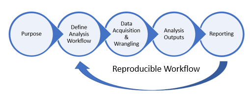
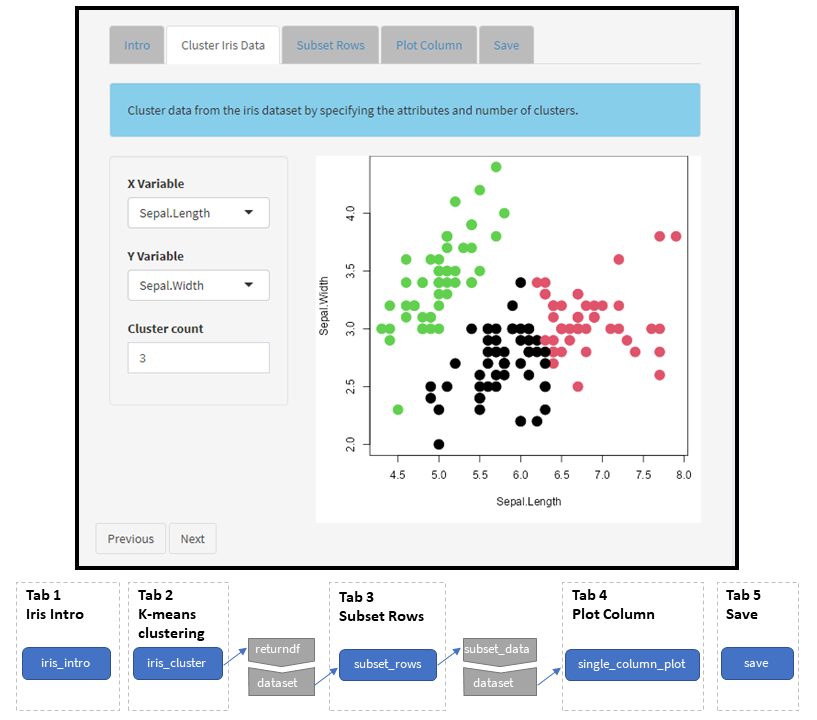
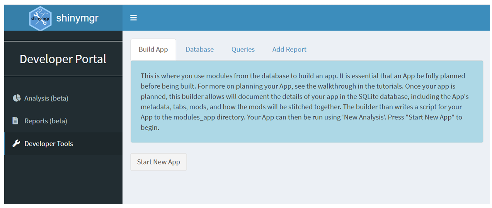
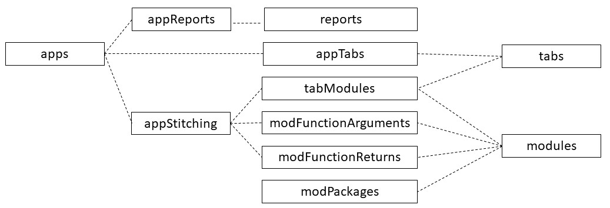
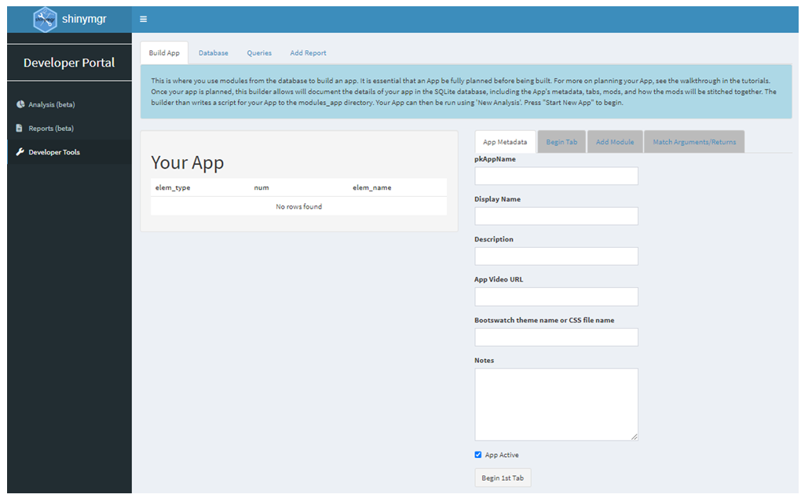
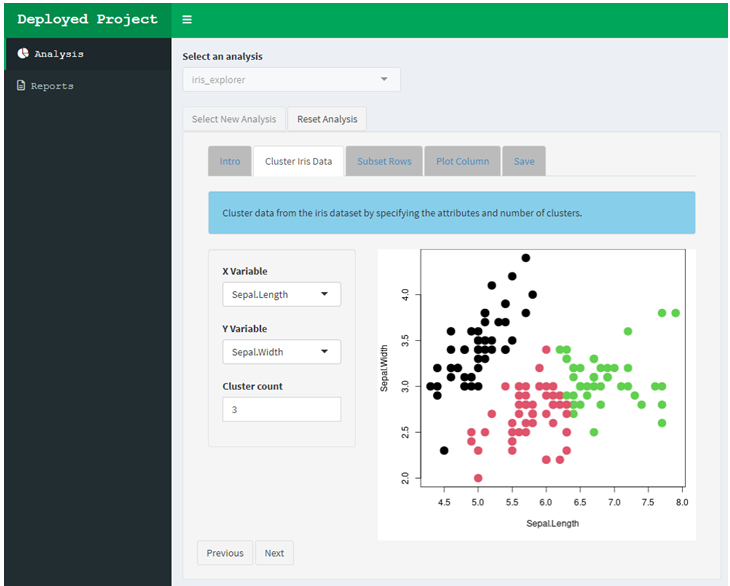
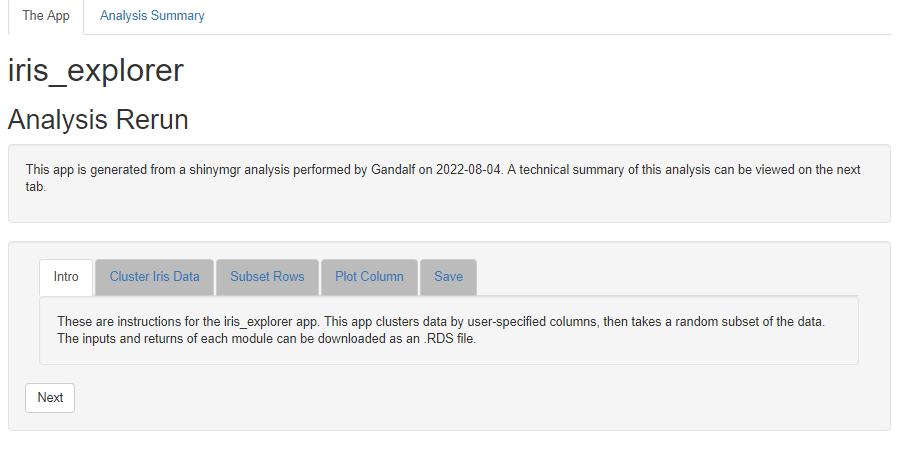
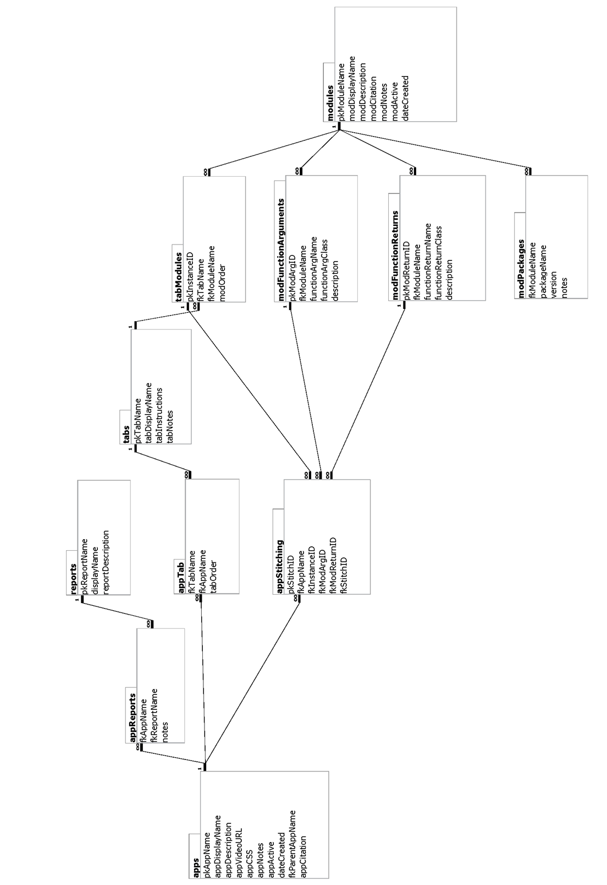

```{r, eval = FALSE, echo = FALSE}
# to be added to the yaml header when compiling to latex
output: 
  rjtools::rjournal_pdf_article:
    self_contained: yes
    toc: no
```

```{r setup, include=FALSE}
knitr::opts_chunk$set(echo = FALSE, warning = FALSE, message = FALSE, comment = NA)

library(shinymgr)
library(fs)
library(rjtools)
library(dplyr)
```


# Introduction {#intro}

The \CRANpkg{shiny} R package allows users to build interactive web apps straight from R, without advanced knowledge of HTML or JavaScript [@shiny]. A *shiny* web app can permit an expedient analysis pipeline or workflow. Ideally, the pipeline can produce outputs that are fully reproducible [@Peng; @Gentleman; @Alston]. Moreover, the pipeline can permit rapid reporting to convey the results of an analysis workflow to a target audience [@stoudt2021principles] (Figure \@ref(fig:fig1)).

```{r, eval = FALSE}
include=knitr::is_latex_output(), eval=knitr::is_latex_output()
```

```{r fig1, echo = F, out.width = "100%", fig.cap = "Stages of a reproducible workflow, a process that moves an inquiry from raw data to insightful contribution."}

```

*shiny* applications range from simple to complex, each with an intended purpose developed for an intended user audience. Several R packages provide a development framework for building multi-faceted master applications, including \CRANpkg{shinipsum} for prototyping [@shinipsum], \CRANpkg{golem} [@golum], and \CRANpkg{rhino} [@rhino]. 

From the developer's perspective, complex *shiny* applications can result in many lines of code, creating challenges for collaborating, debugging, streamlining, and maintaining the overall product. *shiny* modules are a solution to this problem. As stated by Winston Chang [@shinyblog], "A *shiny* module is a piece of a *shiny* app. It can't be directly run, as a *shiny* app can. Instead, it is included as part of a larger app . . . Once created, a *shiny* module can be easily reused – whether across different apps, or multiple times in a single app." *shiny* modules, and modularization in general, are a core element of agile software development practices [@larman2004agile].  Several authors have contributed R packages for distributing pre-written *shiny* modules for general use, including the \CRANpkg{datamods} [@datamods], \CRANpkg{shiny.reglog} [@reglog], \CRANpkg{periscope} [@periscope], \CRANpkg{shinyauthr} [@shinyauthr], and \CRANpkg{jsmodule} [@jsmodule] packages. 

However, as the number of available modules increases, there is a pressing need for documenting available *shiny* modules and easily incorporating them into new workflows. For example, consider a toy modular-based app that guides a user through an analysis of the famous "Iris Dataset," which contains 150 records of 3 species of iris, including measurements of the length and width of the flowers' sepals and petals [@fisher1936use]. The app, called "Iris Explorer," consists of 5 tabs to be worked through in sequence (Figure \@ref(fig:fig2), top). 

Tab 1 displays instructions for use, while tab 2 performs a *k*-means clustering of the data, where *k* is specified by the user. The resulting clusters are displayed with two variables of the user's choosing as depicted in Figure \@ref(fig:fig2).  In tab 3, the user will choose a value *n*, indicating the number of rows by which to randomly subset the data, and in tab 4 the user selects a single variable to be plotted as a bar chart. Finally, in tab 5 the user can save their outputs as an RDS file.  This contrived example includes some key elements of a typical workflow in that the five tabs introduce a dataset, guide the user through light data wrangling, produce analysis outputs, and offer the ability to save the results.

The app's blueprint (Figure \@ref(fig:fig2), bottom) identifies the *shiny* modules in each tab, showing how outputs from one module can serve as inputs to the next. Note that while this example shows a single module in each tab with differing inputs/outputs, in the general case tabs can contain an arbitrary number of *shiny* modules (including multiple instances of the same module) and each module can have multiple inputs/outputs. 

While two of the *shiny* modules within the "iris_explorer" app pertain to the iris dataset specifically ("iris_intro" and "iris_cluster"), the remaining *shiny* modules ("subset_rows", "single_column_plot", and "save") may be incorporated into other apps.  

```{r fig2,  echo = F, out.width = "100%", fig.cap = "Top:  The 'iris\\_explorer' app guides a user through an analysis of the iris dataset in a tab-based sequence.  Bottom:  A blueprint of the 'iris\\_explorer' app shows the 5 tabs, each containing a single module identified by name within blue ovals. Some of the shiny modules require inputs and generate outputs as identified in gray polygons.", fig.pos = "h"}

```

\newpage

Developers who utilize the same *shiny* modules within different apps will naturally be faced with several questions:

1.	Which *shiny* modules have been written? Are they well documented with unit testing?
2.	What are the module's inputs (arguments) and outputs (returns)?
3.	Where are the *shiny* modules stored?
4.	How can *shiny* modules be combined into a cohesive, well-documented app?
5.	How can production-ready apps be deployed for end-users?

Users of an app created with the *shinymgr* framework may wish to know:

6.	Can analysis outputs be saved as a fully reproducible workflow?
7.	Can outputs be ingested into a *Rmarkdown* or *Quarto* template for rapid reporting?

## Introducing *shinymgr*

The R package, \CRANpkg{shinymgr}, was developed to meet these challenges [@shinymgr_citation]. The *shinymgr* package includes a general framework that allows developers to create *shiny* modules, stitch them together as individual "apps" that are embedded within the master *shiny* application, and then deploy them on a *shiny* server or incorporate them into R packages.  *shinymgr* was motivated from our first-hand experience in our work building tools that assist scientists in remote wildlife monitoring with the R package *AMMonitor* [@balantic2020ammonitor]. Dependencies of *shinymgr* include the packages \CRANpkg{DBI} [@dbi], \CRANpkg{reactable} [@reactable], \CRANpkg{RSQLite} [@RSQLite], \CRANpkg{renv} [@renv], \CRANpkg{shiny} [@shiny], \CRANpkg{shinyjs} [@shinyjs], and \CRANpkg{shinydashboard} [@shinydashboard]. 

From the developer's perspective, an "app" consists of an ordered set of tabs, each of which contain specified *shiny* modules. *shiny* modules are the basic element in the *shinymgr* framework; they can be used and re-used across different tabs and different apps. Information about each module and app is stored in a SQLite database [@sqlite2020hipp]. The *shinymgr* app builder "stitches" *shiny* modules together so that outputs from one module serve as inputs to the next, creating an analysis pipeline that is easy to implement and maintain. When apps are production-ready , developers can deploy a stand-alone *shiny* application independent of *shinymgr* on a server or within an R package. From the end-user's perspective, an "app" created with the *shinymgr* framework consists of an ordered series of *shiny* tabs, establishing an analysis. Users can save their inputs and outputs as an RDS file to ensure full reproducibility.  Furthermore, the RDS file may be loaded into an R Markdown (Rmd) or Quarto (qmd) template for rapid reporting. We are unaware of existing packages that unify the elements of modularization, documentation, reproducibility, and reporting in a single framework.

We introduce *shinymgr* in sections 2-4 below.  In section [2](#appdev) we describe how developers can create apps using the *shinymgr* framework.  In section [3](#appdeploy) we describe how developers can deploy a *shinymgr* project on a local machine, server, or within an R package.  In section [4](#appUsing) describes the end-user experience, where end-users execute an "app" and store results for reproducibility and reporting. The package tutorials and cheat sheet are described in section [5](#tuts).  The *shinymgr* package comes with a series of \CRANpkg{learnr} [@learnr] tutorials described at the end of the paper. 

# Developing *shinymgr* apps {#appdev}

## Setting up *shinymgr*

The canonical home of *shinymgr* is https://code.usgs.gov/vtcfwru/shinymgr/ where *shinymgr* users may post merge requests and bug fix requests. *shinymgr* may also be downloaded from CRAN.

```{r, eval = FALSE, echo =TRUE}
install.packages("shinymgr")
```

The development version can be downloaded with:

```{r, eval = FALSE, echo =TRUE}
remotes::install_gitlab(
  repo = "vtcfwru/shinymgr",
  auth_token = Sys.getenv("GITLAB_PAT"),
  host = "code.usgs.gov",
  build_vignettes = FALSE)
```

Once installed, a new *shinymgr* project can be created within a parent directory: 

```{r, warning=FALSE, eval = FALSE, echo = TRUE}
# set the directory path that will house the shinymgr project
parentPath <- getwd()

# set up raw directories and fresh database
shinymgr_setup(
  parentPath = parentPath, 
  demo = TRUE)
```

The `shinymgr_setup()` function produces the following directory structure within the primary "shinymgr" directory. This structure consists of 3 files that make up the "master" app (global.R, server.R, and ui.R), and 9 directories.  If the argument demo is set to FALSE, these directories will be largely empty, except for the "modules_mgr" and "database" directories, which will contain *shiny* modules for rendering *shinymgr*'s UI and an empty SQLite database, respectively. If the argument demo is set to TRUE, each directory will include several demo files as shown, including a pre-populated database.  Here, we highlight a subset of the demo files related to the "iris_explorer" app to guide developers through the key elements of *shinymgr* (additional demo files come with package but are omitted here for clarity).  

```{r, comment = NA, echo = FALSE}
fs::dir_tree(
  path = "shinymgr",
  recurse = TRUE)
```


The directory structure produced by `shinymgr_setup()` includes the following:

- The **analyses** directory provides the developer an example of a previously run analysis that was created using the *shinymgr* framework (an RDS file). An analysis file name includes the app name (e.g. "iris_explorer"), the name of the person who ran the analysis (e.g. "Gandalf"), and the date and time of the analysis (e.g., "iris_explorer_Gandalf_2023_06_05_16_30.RDS"). 

- The **data** directory stores RData files that can be used by various *shinymgr* apps (e.g., "iris.RData").

- The **database** directory stores the *shinymgr* SQLite database, named "shinymgr.sqlite." The database is used by the developer to track all *shiny* modules, their arguments (inputs), returns (outputs), and how they are combined into *shinymgr* apps.

- The **modules** directory stores stand-alone *shiny* modules. These files are largely written by the developer with the help of the `mod_init()` function, and are registered in the database with the `mod_register()` function. Four of the example *shiny* modules listed are used in the "iris_explorer" app.   

- The **modules_app** directory stores *shiny* modules that are *shinymgr* "apps" – the stitching together of *shiny* modules into a tab-based layout that provides an analysis workflow (Figure \@ref(fig:fig2) shows the
"iris_explorer" app layout). Files within the "modules_app" directory are not written by hand - instead, they are created with the *shinymgr* "app builder." 

-  The **modules_mgr** directory stores *shiny* modules that build the overall *shinymgr* framework. 

- The **reports** directory provides an example of an *RMarkdown* (Rmd) template (e.g., "iris_explorer_report.Rmd"), allowing for rapid reporting by an end-user.

- The **tests** directory stores both \CRANpkg{testthat} [@testthat] and \CRANpkg{shinytest} [@shinytest] code testing scripts.

- The **www** directory stores images that may be used by a *shiny* app.  

- In addition to these directories, three files are created for launching the master *shinymgr* *shiny* application:

  1. **ui.R** - This file contains code to set the user interface for the master *shinymgr* app.  
  2. **server.R** - The master server file.  
  3. **global.R** - The global.R file is sourced into the server.R file at start-up. It sources all of the *shiny* modules within the *shinymgr* framework so they are available when *shinymgr* is launched.
  
## The *shinymgr* developer's portal

Once set-up is complete, the `launch_shinymgr()` function will launch the *shinymgr* "Developer's Portal" UI, allowing developers to create and test new *shinymgr* apps.

```{r, eval = FALSE, echo = TRUE}
# launch shinymgr
launch_shinymgr(shinyMgrPath = paste0(parentPath, "/shinymgr"))
```

The portal is recognizable by the *shinymgr* logo in the upper left corner (Figure \@ref(fig:fig3)). The portal consists of three main tabs in the left menu. The "Developer Tools" tab is used to create apps, view the *shinymgr* database, and register reports, while the "Analysis (beta)" and "Reports (beta)" tabs allow developers to evaluate apps from the user's perspective.

```{r fig3,  echo = F, out.width = "100%", fig.cap = "The shinymgr Developer Portal consists of a sidebar panel where developers can create new shiny modules and new apps, and test-drive analyses and reports from the user's perspective. The main panel shows the 'Build App' tab within the 'Developer Tools' section."}

```

The "Developer Tools" section includes 4 tabs for app development: The "Build App" tab allows the developer to create new *shinymgr* apps from existing modules using the *shinymgr* app builder; the "Database" tab displays the *shinymgr* database tables, the "Queries" tab contains a set of standard database queries, and the "Add Reports" tab allows the developer to link a report (Rmd or qmd) to a given *shinymgr* app (Figure \@ref(fig:fig3)), as described below.

## The *shinymgr* database

The *shinymgr* SQLite database ("shinymgr.sqlite") is a single file created by the `shinymgr_setup()` function. The database tracks all *shiny* modules, their arguments (inputs), returns (outputs), their package dependencies and version numbers, how they are combined into an "app," and any reports that are associated with apps. The database tables are  populated via dedicated *shinymgr* functions.

The *shinymgr* database consists of 11 tables in total (Figure \@ref(fig:fig4)). These tables are connected to each other as a typical relational database, with primary keys establishing unique records in each table, and foreign keys that reference primary keys in other tables (see Appendix A for a full database schema and the "database" *learnr* tutorial for additional information).

The "apps," "appReports," "reports," "appTabs," and "tabs" tables largely store information on what a user would see when they run an analysis. The table "apps" stores information about apps such as "iris_explorer." Apps consist of tabs, which are listed in the "tabs" table. Tabs are linked to apps via the "appTabs" table. The table "reports" lists any Rmd or qmd files that serve as a report template, and the table "appReports" links a specific report with a specific app. 

The remaining 6 tables in Figure \@ref(fig:fig4) are "modules," "modFunctionArguments," "modFunctionReturns," "modPackages," "tabModules," and "appStitching." These tables largely store information about *shiny* modules that a developer creates, i.e., what *shiny* modules have been written, what are their arguments and returns, and what packages they use. The "tabModules" table identifies which tabs call which *shiny* modules (with a single tab capable of calling multiple *shiny* modules), and the "appStitching" table specifies how *shiny* modules are "stitched" together, i.e., which module returns are passed in as arguments to downstream *shiny* modules.

```{r fig4, echo = FALSE, out.width = "100%", fig.cap = "The 11 tables of the shinymgr SQLite database. Lines indicate how the tables are related to each other.", fig.pos = "b"}

```

Four of the 11 database tables focus on modules, highlighting that *shiny* modules are basic building blocks of any *shinymgr* app.  Developers create new *shiny* modules with the `mod_init()` function, which copies a *shinymgr* module template (an R file template) that includes a header with key-value that describe the module, including the module name, display name, description, citation, notes, and module arguments and returns (if any).  For example, the header of the iris_cluster module is:

````{verbatim, echo = TRUE}
#!! ModName = iris_cluster
#!! ModDisplayName = Iris K-Means Clustering
#!! ModDescription = Clusters iris data based on 2 attributes
#!! ModCitation = Baggins, Bilbo.  (2023). iris_cluster. [Source code].
#!! ModNotes = Demo module for the shinymgr package.
#!! ModActive = 1
#!! FunctionReturn = returndf !! selected attributes and their assigned clusters !! data.frame
````

The module code is written beneath the header (see Appendix B for an example).  Function calls within the module code should be written with `package::function()` notation, making explicit any R package dependencies.  Once the module is completed, unit tests can written and stored in the *shinymgr* project's "tests" directory.  The final module file is saved to the "modules" directory and registered into the database with the `mod_register()` function. The `mod_register()` function populates the modules, "modFunctionArguments", and "modFunctionReturns" SQLite database tables. Further, it uses the *renv* package to identify any package dependencies and inserts them into the modPackages table.  Readers are referred to the "modules" "tests", and "shinymgr_modules" *learnr* tutorials that come with the *shinymgr* package for more details.

Once modules are registered in the database, the developer can incorporate them into new apps. As *shiny* modules and apps in the database represent files that contain their scripts, deleting a module or an app from the database will delete all downstream database entries as well as (optionally) the actual files themselves. Deletion of a module will fail if it is being used in other apps.  Module updates can be versioned by creating a new module and then referencing its precursor in the "modules" database table.

## The *shinymgr* app builder

Once developers create and register their own stand-alone *shiny* modules, apps are generated with *shinymgr*'s app builder (Figure \@ref(fig:fig5)).

```{r fig5, echo = FALSE, out.width = "100%", fig.cap= "The shinymgr Developer Portal layout, showing the app builder in the Developer Tools.", fig.pos = "h"}


```

Developers are guided through a process where they design their app from *shiny* modules they have registered. The builder then populates the *shinymgr* database with instructions on how to construct the app and writes the app's script based on those instructions. The newly created script is saved to the "modules_app" directory. Through this structured process, apps produced by the builder are well-documented and generate highly reproducible analyses.  Readers are encouraged to peruse the tutorial, "apps", for more information. 

The `qry_app_flow()` function will query the database to return a list of the *shiny* modules and tabs included in a specified app, such as "iris_explorer":

```{r, echo = TRUE}
# look at the appTabs table in the database
qry_app_flow("iris_explorer", shinyMgrPath = paste0(getwd(),"/shinymgr"))
```

As shown in Figure \@ref(fig:fig2), this app has 5 tabs, and each tab features a single module. The "Save" tab is the final tab in all *shinymgr* apps and is not listed in the query result.

Developers can "beta test" apps prior to deployment by selecting the Analysis (beta) tab in the Developer's Portal (Figure \@ref(fig:fig3)). They can also create *RMarkdown* or *Quarto* report templates that accept the outputs from an analysis and incorporate them into a report.  Report metadata are logged in the "reports" table of the database, and then linked with a specific app in the "appReports" table.  An end-user will run an analysis and render a report, a process described more fully in the "Using *shinymgr* Apps" section below. 

To summarize this section, developers use the `shinymgr_setup()` function to create the directory structure and underlying database needed to build and run *shiny* apps with *shinymgr*. Developers use the `mod_init()` and `mod_register()` functions to create modules and make them available for inclusion in new apps built with the *shinymgr* app builder. A developer can create as many *shinymgr* projects as needed. In each case, the *shinymgr* project is simply a fixed directory structure with three R files (ui.R, server.R, and global.R), and a series of subdirectories that contain the apps and *shiny* modules created by the developer, along with a database for tracking everything.

# Deploying *shinymgr* projects {#appdeploy}

Once development is completed, developers can deploy their *shinymgr* project on a server or within an R package by copying portions of the *shinymgr* project to a new location while retaining the original project for future development. Once deployed, a *shinymgr* project no longer requires the *shinymgr* package or database to be run. Thus, the files and directories to be copied for deployment include only:

```{r, eval = TRUE, echo = FALSE}
fs::dir_tree(
    path = "shinymgr",
    recurse = FALSE,
    regexp = '(modules)|(global)|(data$)|(reports)|(server)|(ui)|(www)'
)
```

The master app files, ui.R, global.R, and server.R, are needed to run the *shinymgr* framework.   

When deploying a *shinymgr* project within an R package, objects within the data folder should be copied into the package's "data" folder.  The remaining files should be copied into a directory within the package's "inst" folder that will house the master *shiny* application.   Deployment on a server such as shinyapps.io will require similar adjustments. 

After files are copied to the correct location, a few key adjustments are needed.  First, the "modules_app" directory should contain only those apps (and dependent modules and reports) that can be used by end-users; unused apps, modules, and reports can be deleted.  Second, the new.analysis.R script within the modules_mgr folder will require minor updates to remove dependencies on the *shinymgr* database.  Third, the ui.R and server.R scripts should be updated to no longer showcase *shinymgr* and the Developer's Portal; rather, it should be customized by the developer to create their own purpose-driven apps.  For example, Figure \@ref(fig:fig6) shows a hypothetical deployment of the master app titled "Deployed Project" that is based on the *shinymgr* framework.  Notice the absence of the Developer Tools tab and the absence of references to *shinymgr*. The "deployment" *learnr* tutorial provides more in-depth discussion.

```{r fig6, echo = FALSE, out.width = "100%", fig.cap= "An example of a deployed shinymgr app. The deployed version excludes the Developers Tools tab and is an example of what the end user sees when using a deployed app."}



```
To summarize this section, deploying the *shinymgr* framework involves copying key elements of the *shinymgr* developer project into package or server directories, updated as needed for use by end-users.  Readers are referred to the “deployment” tutorial for further information.

# Using *shinymgr* apps {#appUsing}

Apps built with *shinymgr* can appeal to various types of end-users. When deployed as part of an R package, end-users would be anyone who uses that package. Apps may also be distributed as stand-alone scripts, or hosted on a server, as described above. Developers may also use *shinymgr* to produce apps for their own use (i.e., the developer *is* the end-user). Regardless of who the intended end-user is, this section discusses that user's experience after the master app is deployed.

Whoever the intended audience for the app, this section discusses how an app can be used *after* it has been deployed.

## Reproducible analyses

The final tab in any *shinymgr* app provides the opportunity to save the analysis itself.  Reproducibility is a core tenet of *shinymgr.* Therefore, a robust set of metadata are saved as an RDS file to allow a user to understand and replicate their results. An example of a completed analysis is the file, "iris_explorer_Gandalf_2023_06_05_16_30.RDS," which stores a user's analytic steps for a run of the "iris explorer" app. The code below reads in this example file, and shows the structure (a list with 23 elements):

```{r, eval = TRUE, echo = TRUE}
rds_filepath <- paste0(getwd(),"/shinymgr/analyses/iris_explorer_Gandalf_2023_06_05_16_30.RDS")
old_analysis <- readRDS(rds_filepath)
str(old_analysis, max.level = 2, nchar.max = 20, vec.len = 15)
```

The list stores a great deal of information:

* **analysisName** is the name of the analysis and is equivalent to the filename of the RDS file (without the extension)
* **app** is the name of the app that produced the saved analysis results.
* **username** was entered in the "Save" tab when the analysis was performed.
* **mod#-value**  indicate the values of each *shiny* module's arguments (inputs), if any exist, at the time the analysis was saved. 
* **returns** includes values of all outputs (returns) of each module.
* **notes** were entered in the "Save" tab when the analysis was performed.
* **timestamp** is the date/time when the analysis was saved.
* **metadata** includes robust information about each module, including the app description and the description of each module as it was originally stored in the *shinymgr* database tables. The metadata list element also includes an *renv* "lockfile": a list that describes the R version and R package dependencies (including *shinymgr*) used by the app itself. The lockfile captures the state of the app's package dependencies at the time of its creation; in the case of *shinymgr*, it contains the dependencies used by the developer who created the app.  Each lockfile record includes the name and version of the package and their installation source. 
* **\*\_code** attributes with this format contain the source code for the app. 

The code list element allows an end user to revisit the full analysis with *shinymgr*'s `rerun_analysis()` function, supplying the file path to a saved *shinymgr* analysis (RDS file).

```{r, echo = TRUE, eval = FALSE}
rerun_analysis(analysis_path = rds_filepath)
```

The `rerun_analysis()` function will launch a *shiny* app with two tabs (Figure \@ref(fig:fig7)); it can only be run during an interactive R session, with no other *shiny* apps running.

```{r fig7, echo = F, out.width = "100%", fig.cap = "A screenshot of the rerun\\_analysis() function, as called on the saved analysis from the iris\\_explorer app (RDS file). The active tab, called 'The App', allows a user to rerun a previously executed analysis. The 'Analysis Summary' tab displays the values of all module arguments and returns, captured when the analysis was saved, along with a detailed description of the app, it's modules, the App's source code, and all package dependencies."}

```

The first tab is called "The App", and will be visible when the `rerun_analysis()` function is called. It contains a header with the app's name, a subheading of "Analysis Rerun," and a fully functioning, identical copy of the *shiny* app used to generate the saved analysis. Below that, a disclaimer appears, indicating the app was produced from a saved analysis. A summary of the analysis is presented on the second tab that displays the values used to produce the given analysis output.

If the `rerun_analysis()` function fails, it could be due to a change in R and package versions currently installed on the end-user's machine.  To that end, the lockfile that is included in the metadata section of the RDS file can be used to restore the necessary R packages and R version with the `restore_analysis()` function.  This function will attempt to create a self-contained *renv* R project that includes all of the packages and the R version used by the developer when the app was created.  The analysis RDS is added to this new project, where the `rerun_analysis()` function can be attempted again.  Readers are referred to the "analyses" tutorial for further information.  

## Rapid reporting

Another important feature of *shinymgr* is the ability to share results of an analysis with others in a friendly, readable format with *RMarkdown* or *Quarto*. Apps produce an RDS file, which may be passed into an Rmd or qmd file as a parameterized input. For example, the demo database includes a report template called "iris_explorer_report.Rmd." This file, with code shown below, allows users to navigate to the RDS file produced by the "iris explorer" app and render the rapid report.

```{r, comment = '', echo=FALSE, class.output='r'}
rmd_filepath <- paste0(getwd(),"/shinymgr/reports/iris_explorer/iris_explorer_report.Rmd")
cat(paste(readLines(rmd_filepath), collapse = '\n'))
```
Reports may be run within the deployed version of *shinymgr* (e.g., left menu of Figure \@ref(fig:fig6)), or may be run directly in R by opening the Rmd file and navigating to the RDS as a file input. Users who run a report can download it to their local machine as a HTML, PDF, or Word file, where they can further customize the output.

To summarize this section, users of *shinymgr* "apps" created with the *shinymgr* framework are presented with a series of *shiny* tabs that establish an analysis workflow. Users can save their inputs and outputs as an RDS file to ensure full reproducibility.  Further, the RDS file may be loaded into an R Markdown (Rmd) or Quarto (qmd) template for rapid reporting.

# Tutorials and cheatsheet {#tuts}

with the package. Below is a list of current tutorials, intended to be worked through in order:

```{r, warning = FALSE}
learnr::available_tutorials(
  package = "shinymgr") %>% 
  dplyr::arrange(title)

```

The "intro" tutorial gives a general overview.  Tutorials 2-5 are aimed at developers who are new to *shiny*, while tutorials 6 – 12 focus on the *shinymgr* package.

Launch a tutorial with the *learnr* `run_tutorial()` function, providing the name of the module to launch. The tutorial should launch in a browser, which has the benefit of being able to print the tutorial to PDF upon completion:

```{r, eval = FALSE, echo = TRUE}
learnr::run_tutorial(
  name = "modules", 
  package = "shinymgr")
```

Additionally, the package cheatsheet can be found with:

```{r, eval = FALSE, echo = TRUE}
browseURL(paste0(find.package("shinymgr"), "/extdata/shinymgr_cheatsheet.pdf"))
```

Contributions are welcome from the community. Questions can be asked on the
issues page at https://code.usgs.gov/vtcfwru/shinymgr/issues.


# Acknowledgments

We thank Cathleen Balantic and Jim Hines for feedback on the overall package and package tutorials.  *shinymgr* was prototyped by Therese Donovan at a *shiny* workshop taught by Chris Dorich and Matthew Ross at Colorado State University in 2020 (pre-pandemic).  We thank the instructors for feedback and initial coding assistance.  Any use of trade, firm, or product names is for descriptive purposes only and does not imply endorsement by the U.S. Government.  The Vermont Cooperative Fish and Wildlife Research Unit is jointly supported by the U.S. Geological Survey, University of Vermont, Vermont Fish and Wildlife Department, and Wildlife Management Institute.  

# Bibliography

<div id="refs"></div>

\newpage

# Appendix A

Entity relationship diagram for the *shinymgr* database, which tracks all components of an apps and modules (Figure \@ref(fig:fig8)).  The database consists of 11 tables. Primary keys are referenced with a "pk" prefix, while foreign keys are referenced with an "fk" prefix. A full description of the database is contained in the "database" *learnr* tutorial that comes with the *shinymgr* package

```{r fig8, echo = F, out.width = "85%", fig.cap = "Entity relationship diagram for the shinymgr database, which tracks all components of an apps and modules.  The database consists of 11 tables. Primary keys are referenced with a 'pk' prefix, while foreign keys are referenced with an 'fk' prefix. A full description of the database is contained in the 'database' learnr tutorial that comes with the shinymgr package.", fig.pos = 'h'}

```

\newpage

# Appendix B

Modules in *shinymgr* are written by developers for their own purposes.  The `shinymgr::mod_init()` function creates a template for module development. The header is a series of key-value pairs that the developer fills out (typically after the module code is written and tested).  The "iris_cluster" module is presented below as an example.  The module consists of two paired functions: here, `iris_cluster_ui(id)` and `iris_cluster_server()`. The UI is a function with an argument called id, which is turned into module's "namespace" with the `NS()` function. A namespace is simply the module's identifier and ensures that function and object names within a given module do not conflict with function and object names in other modules. The Id's for each input and output in the UI must be wrapped in a `ns()` function call to make explicit that these inputs are assigned to the module's namespace. All UI elements are wrapped in a `tagList()` function, where a `tagList` allows one to combine multiple UI elements into a single R object. Readers should consult the "modules," "tests," and "shinymgr_modules" tutorials for additional information.

```{r, comment = '', echo=FALSE, class.output='r'}
rmd_filepath <- paste0(getwd(),"/shinymgr/modules/iris_cluster.R")
cat(paste(readLines(rmd_filepath), collapse = '\n'))
```

\newpage


