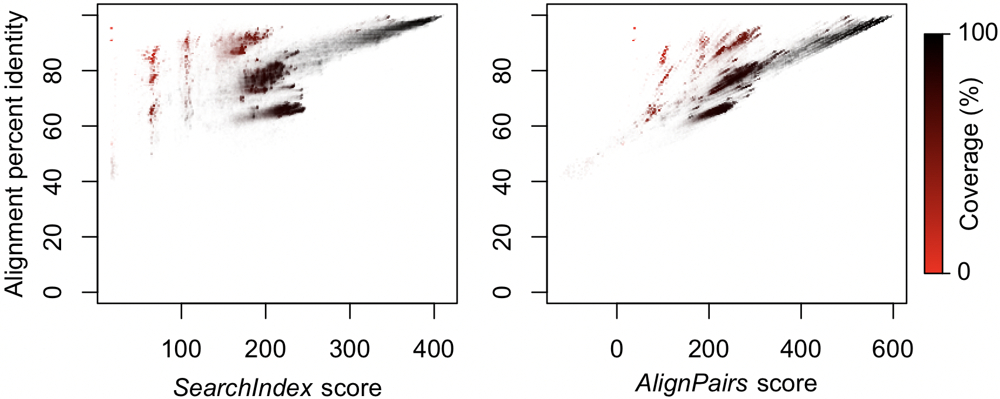

```{r setup, include=FALSE}
knitr::opts_chunk$set(echo = FALSE, warning = FALSE, message = FALSE)
```

# Introduction

Searching is one of the most common operations in biological sequence analysis with a wide variety of applications. The \BIOpkg{Biostrings} package includes the Aho-Corasick, Boyer-Moore, and Shift-Or algorithms that are frequently used for matching short sequences with relatively few differences, such as oligonucleotide probes or primers. More difficult queries typically rely on calling programs outside of R. For example, error-prone long reads can be rapidly mapped with programs that make use of seed-and-extend approaches to identify matching regions between longer sequences \citep{RN4230}. More distantly related homologs can be found with BLAST \citep{RN36} or quicker alternatives DIAMOND \citep{RN4223}, LAST \citep{RN4233}, and MMseqs2 \citep{RN4221}. The ubiquity of these tools in sequence analyses attests to the importance of searching through biological sequences.

BLAST is perhaps the most commonly used bioinformatics tool. With over 30 years since its first release, BLAST still represents the gold standard of sensitivity and specificity for sequence search, and competitors typically compare themselves to BLAST's speed and accuracy. Both DIAMOND version 2 and MMseqs2 offer modes with accuracy rivaling BLAST and several fold its speed for practical search tasks. There is a clear trade-off between search sensitivity and speed, with different programs specializing at opposite ends of the spectrum. Improved sensitivity can be obtained by converting initial search hits into a profile and iteratively repeating the search, which is the basis of programs such as HHblits \citep{RN4231}, PSI-BLAST \citep{RN36}, and PHMMER \citep{RN3488}. Greater speed is achievable when sensitivity is less of a concern, such as when mapping nearly identical short reads to a genome. For example, the \BIOpkg{Rsubread} package maps and quantifies short reads from R using the fast subread aligner \citep{RN4279}.

To my knowledge, there is currently no R-based implementation of a generalized homology search program, although there exist interfaces to external programs that can be called from within R. The \BIOpkg{DECIPHER} package is a natural fit for large-scale homology search because of its functionality for managing big biological data \citep{RN2700}. With this in mind, here I introduce \BIOpkg{DECIPHER} v3 with the addition of general-purpose search and improvements to sequence databases. \BIOpkg{DECIPHER} can now find locally homologous regions between two sets of nucleotide or protein sequences, report their scores and, if desired, align the search hits. In the examples below, I show the application of \BIOpkg{DECIPHER}'s search functions to common search problems. \BIOpkg{DECIPHER} v3 is available from the Bioconductor package repository.

# Design of the sequence search algorithm implemented in DECIPHER

The development of search functionality within \BIOpkg{DECIPHER} was inspired by user experiences with BLAST. First, BLAST is very sensitive but relatively slow for large sets of query and target sequences. Alternative search programs showed it was possible to exceed BLAST's speed, potentially at the expense of sensitivity. Second, BLAST results are limited by multiple parameters that have led to misinterpretation \citep{RN4237,RN4225,RN4259}. Third, reliance on BLAST requires running software outside of the R environment, and it would be preferable to have similar functionality available within R. These issues guided the development of fast and versatile search and pairwise alignment functions in \BIOpkg{DECIPHER}.

```{r fig1, out.width = "100%", fig.cap = "Overview of the main parameters and functions comprising homology search in DECIPHER.", fig.alt=""}
knitr::include_graphics(if(knitr::is_latex_output()) "figures/Fig1.pdf" else "figures/Fig1.svg")
```

As shown in Figure \@ref(fig:fig1), homology search in \BIOpkg{DECIPHER} v3 is separated into three functions: indexing the target sequences with `IndexSeqs`, searching a query (pattern) for significant target (subject) hits with `SearchIndex`, and, optionally, aligning those hits with `AlignPairs`. The statistical basis for \BIOpkg{DECIPHER}'s heuristic search algorithm is related to that of BLAT \citep{RN939}. Assuming equal frequencies of letters from an alphabet of size $A$, the $probability$ of finding at least one match of length $k$ among $T$ target k-mers is: $probability = 1-(1-(1/A)^k)^T$. When this $probability$ is near zero, as is typically the case when $4 \ge A \le 20$ and $k > 1$, it can be approximated as $T/A^k$. It is convenient to score using the negative log-likelihood of $probability$: $-\log_e(probability) \approx k*\log_e(A) - \log_e(T)$. The $k*\log_e(A)$ term can be replaced with the negative $\log_e$ of the normalized frequency ($f$) expected for a specific k-mer when $k$ is variable in length or alphabet composition is non-uniform (i.e., $f \approx A^{-k}$).

This scoring approach can be extended to approximate the probability of finding multiple k-mer matches within a region of a given size \citep{RN939}. However, the existence of insertions or deletions (i.e., gaps) between matches complicates the application of an analytical scoring approach. Hence, \BIOpkg{DECIPHER} uses a search formula with empirical costs for the number of positions ($sep$) and gaps ($gap$) between chained matches. The final scoring formula for a hit between a query and target sequence is: 

$$score = \sum_{i=1}^{n}(-\log_e(f)) + \sum_{i=1}^{n-1}(sepCost*\sqrt{sep}) + \sum_{i=1}^{n-1}(gapCost*\sqrt{gap}) - \log_e(Q) - \log_e(T/step)$$

Where $f$ is the expected frequency of the $i^{th}$ k-mer match, $sep$ is the number of positions separating neighboring (i.e., $i$ and $i + 1$) matches, $gap$ is the minimum length of insertions or deletions (indels) between neighboring matches, $Q$ is the number of k-mers queried, and $T$ is the number of k-mers in the target sequence, and $step$ is the staggering between adjacent k-mers recorded in the inverted index.

Affine (i.e., constant plus linear) gap penalties are popular for sequence alignment, although it is known that the distribution of indel lengths is approximated by a Zipfian distribution \citep{RN4262}. In the absence of alignment it is only feasible to estimate the total number of gaps between k-mers rather than their individual lengths. For this reason, the square root function was selected to penalize distances between adjacent k-mer matches in `SearchIndex`. The square root functional form gradually decreases the marginal penalty for longer distances, which reflects the diminishing probability of observing longer gaps. Since the probability of gaps relative to mismatches is unknown, both $sepCost$ and $gapCost$ are empirically optimized parameters.

The score for each hit represents the significance of the match, with scores above $minScore$ defined as significant. To correct for multiple testing, the default minimum score for reporting hits is $\log_e(D - T + 1)$, where $D$ is the number of unmasked positions in the database. By default, masking is applied to low complexity, ambiguous, and repeat regions of both the query and target sequences to avoid false positive hits within regions that are not due to common descent (i.e., homology). Masking is also applied to target k-mers that are far more numerous than expected in order to accelerate the search process. Since all remaining positions are fully indexed, \BIOpkg{DECIPHER}'s search functions guarantee that all matches of at least length $k$ are scored. Protein matches are found in a reduced amino acid alphabet with residue groups: {A}, {C}, {D, E}, {F, W, Y}, {G}, {H}, {I, L, M, V}, {N}, {P}, {Q}, {R, K}, and {S, T}.

The `SearchIndex` algorithm is written in C code and begins by calculating the normalized expected frequency ($f$) for every k-mer. Query (pattern) sequences are processed in parallel if \BIOpkg{DECIPHER} was compiled with OpenMP enabled and `processors` is not 1. After masking each query, the locations of all matching unmasked target (subject) k-mers are extracted from the inverted index and sorted by their location within each target sequence. Next, k-mers with starting positions separated by exactly the `step` size are collapsed into contiguous matches by combining their scores. If `subject` sequences are provided to `SearchIndex` then the matches are extended to the left and right until encountering their nearest neighbor or their score decreases. Matches between query and target sequences are chained together using dynamic programming \citep{RN4260}. The minimum score is applied to the set of top scoring chains to generate the candidate hit set (Fig. \@ref(fig:fig2)). Top scoring hits are returned after imposing any user-specified limits on the number of hits per target (`perSubjectLimit`) and query (`perPatternLimit`) for each sequence queried.

```{r fig2, out.width = "100%", fig.cap = "Matches between a query sequence and each target sequence in a database are chained into high scoring hits. Hits are scored based on the number of positions separating matches and the minimum number of implied gaps between matches.", fig.alt=""}
knitr::include_graphics(if(knitr::is_latex_output()) "figures/Fig2.pdf" else "figures/Fig2.svg")
```

The selection of an appropriate value for k-mer length (i.e., $k$) is critically important to balance sensitivity and search speed. An advantage of \BIOpkg{DECIPHER}'s scoring formulation is that is possible to approximate $sensitivity$ at a value of $k$ for the objective of finding homologous matches of length $Q$ with a given percent identity ($PID$). If $k$ is unknown, the `IndexSeqs` function allows users to provide their goal $sensitivity$, $Q$, and $PID$ to automatically estimate a reasonable value for $k$. Relatedly, a step size ($s$) between target k-mers of greater than one position can be provided to make k-mers partly overlapping or non-overlapping, which reduces the amount of memory required for the inverted index at the expense of decreased $sensitivity$.

# Comparing programs on a protein search benchmark

Homology search programs are typically compared on benchmarks composed of sequences assigned to protein families based on their structures \citep{RN4253}. To this end, I downloaded the set of 93,153 non-redundant amino acid sequences from the SCOPe (v2.08) database, which contains representative sequences from 5,047 protein families. Families may contain homologous sequences with very high or low similarity, representing a wide gamut of search cases. To create an independent test set, I withheld a single protein from each of the 4,041 protein families with more than one representative sequence. I constructed a matching decoy set by reversing the held-out proteins, as this is a common benchmarking approach since proteins do not evolve by reversal \citep{RN4221}. Therefore, the final query set consisted of 8,082 sequences and the target set contained 89,112 sequences.

Ideally, all sequences in the same family as the query sequence would be found with higher scores than any sequences in the decoy set. For each search, accuracy can be approximated as the fraction of a protein's family that was given higher scores than the highest scoring false positive hit to the matching decoy protein, an accuracy measure commonly known as AUC1 \citep{RN4223}. Figure \@ref(fig:fig3) shows that providing `SearchIndex` with `subject` (target) sequences for k-mer extension improved accuracy at the expense of approximately 2- to 3-fold slower search speed. As expected, lower values of k-mer length and step size improved accuracy and decreased search speed. Impressively, \BIOpkg{DECIPHER} showed comparable accuracy and speed to MMseqs2 (release 15-6f452) at some values of k-mer length and step size. Both programs were less sensitive than protein BLAST (v2.15.0), but able to achieve much higher speeds under some parameterizations. All programs accurately detected the vast majority of true positives above 40\% identity (Fig. \@ref(fig:fig3)) despite the short lengths of many SCOPe sequences.

```{r fig3, out.width = "100%", fig.cap = "The SCOPe database of amino acid sequences assigned to protein families was used to compare search programs. $(A)$ Speed is shown relative to protein BLAST (horizontal gray line) for easier comparison. All programs were configured to use the maximum available processor threads. DECIPHER achieved greater accuracy (average AUC1) with inclusion of subject sequences to allow extension of k-mer matches. The value of k-mer length ($k$) is shown on each DECIPHER point. Lower values of $k$ and step size improved accuracy at the expense of speed. MMseqs2 results are shown across a range of user-specified sensitivities from $-s$ $1$ to $-s$ $10$, with the default of $5.7$ shown as a point. BLAST was run under its default settings, which reports hits with E-values less than $10$. $(B)$ The average fraction of true positives given higher scores than those of their corresponding decoy false positive increases with percent identity between the true positives and query sequences. DECIPHER results are shown at different k-mer lengths for a step size of $1$ when supplying the subject sequences (i.e., the black line in $(A)$). MMseqs2 and BLAST results are shown at their default settings.", fig.alt=""}
knitr::include_graphics(if(knitr::is_latex_output()) "figures/Fig3.pdf" else "figures/Fig3.svg")
```

# Example 1: Locating nucleotide sequences in a genome

A common application of sequence search is to find the location of nucleotide sequences in a genome. This may include query sequences that are long or short, contiguous or discontiguous (e.g., exons), and similar or distant to the genome. Consider the case of locating promoter elements in a bacterial genome. Here, the query sequences are relatively short but may contain mismatches or indels at some sites relative to the genome. As a case study, I downloaded the set of 1,440 confirmed and strong confidence promoters in the \textit{E. coli} genome from RegulonDB \citep{RN4283}. Given that promoters can map to the forward or reverse strand, it is necessary to build an index from both strands using `IndexSeqs`. Since the optimal value for $k$ is unknown, it is possible to instead specify the goal of 90\% sensitivity for query sequences of length 60 nucleotides and 80\% identity to the genome, resulting in an estimated $k$ of $5$. Then, `SearchIndex` can be used to obtain a data frame containing hits meeting the minimum score:

\begin{verbatim}
 query <- readDNAStringSet("<<path to promoters.fas>>")
 target <- readDNAStringSet("<<path to genome.fas>>")
 target <- c(target, reverseComplement(target)) # search both stands
 index <- IndexSeqs(target, sensitivity=0.9, percentIdentity=80, patternLength=60)
 hits <- SearchIndex(query, index, perSubjectLimit=0, processors=NULL) # use all CPUs
\end{verbatim}

Performing this search for 1,440 promoter sequences of length 60 takes 4.1 seconds on a machine with 16 processor cores and 45 seconds using a single processor. In contrast, searching for a single promoter using the \BIOpkg{Biostrings} function `matchPattern` takes 6.7 seconds when allowing for up to 12 mismatches or gaps (i.e., $\ge 80\%$ identity). This equates to a speedup of over 2,000-fold with 16 processors or 200-fold with a single processor using \BIOpkg{DECIPHER}. Alternatively, the \BIOpkg{Biostrings} function `matchPDict` can search for all patterns without indels in 22 seconds. The `SearchIndex` function finds 1,593 significant hits, while the `matchPattern` function finds 1,478 matches and the `matchPDict` function finds 1,455 matches. All `matchPDict` matches are found by `matchPattern`, and all but one of the `matchPattern` matches overlap with a hit found by `SearchIndex`.

# Example 2: Aligning to the nearest neighbor in a reference database

Perhaps the most common use of biological sequence search is to find homologous sequences in a reference set. For example, the online BLAST search tool allows selection from a wide variety of databases, including many that are taxon or gene specific. To test the use of \BIOpkg{DECIPHER} for this purpose, I downloaded the set of 17,103 sequences that are part of the Fungi Internal Transcribed Spacer (ITS) project (BioProject PRJNA177353), which serves as a marker region for fungal taxonomy \citep{RN4289} and is searchable from BLAST's online tool. As a query, I downloaded a set of 4,823 unique ITS reads (SRA accession SRR5098782) obtained from the gut of a healthy human subject as part of the Human Microbiome Project \citep{RN4288}. Since every read is expected to be homologous to every reference sequence, it is useful to limit the number of hits per read by specifying a `perPatternLimit`.

\begin{verbatim}
 index <- IndexSeqs(reference, K=8L, processors=NULL)
 hits <- SearchIndex(reads, index, perPatternLimit=100, processors=NULL)
 aligned <- AlignPairs(reads, reference, hits, processors=NULL)
 PID <- 100*aligned$Matches/aligned$AlignmentLength
 coverage <- 100*(aligned$Matches + aligned$Mismatches)/width(reads)[aligned$Pattern]
\end{verbatim}

Searching the inverted index required 14 seconds using 16 processors and a k-mer length of 8. This resulted in 475,443 search hits, which were aligned by `AlignPairs` in 3.7 seconds using 16 processors. Alignment provides a means to easily calculate the $PID$ between each query/target hit, making it straightforward to determine the nearest reference sequence to each read using R code. There are multiple ways to formulate $PID$ \citep{RN4290}, all of which are possible to calculate from the metadata output by `AlignPairs`. Here, we will compute $PID$ of the alignment, which is correlated with the scores output by `SearchIndex` and `AlignPairs` (Fig. \@ref(fig:fig4)). This example illustrates the power and speed offered by the new search functions in \BIOpkg{DECIPHER} v3.

```{r fig4, out.width = "100%", fig.cap = "The scores output by \\textit{SearchIndex} and \\textit{AlignPairs} for each hit (point) show similar correlations with percent identity. Lower read (query) coverage often resulted in higher percent identities for the same score, implying the hit corresponded to a smaller aligned region with higher \\textit{PID}.", fig.alt=""}

```

# Example 3: Searching for homology between genomes

Determination of orthology represents a challenging application of sequence search, as establishing homology is difficult in the presence of substantial sequence divergence. As an example, I used \BIOpkg{DECIPHER}'s search functions to find orthologous proteins in humans and zebrafish (\textit{Danio rerio}), which share a common ancestor approximately 450 million years ago \citep{RN4252}. Many studies use reciprocal best hits to define orthologs by intersecting the best hit for each sequence from a first (query) genome to a second (target) genome with the best hit in the other direction \citep{RN4232}. Writing a `ReciprocalSearch` function in R is straightforward, given the two sets of sequences, k-mer length ($k$), and step size ($s$):

\begin{verbatim}
 ReciprocalSearch <- function(seqs1, seqs2, k, s, CPUs=NULL) { # bidirectional searching
  index1 <- IndexSeqs(seqs2, K=k, step=s, verbose=FALSE, processors=CPUs)
  hits1 <- SearchIndex(seqs1, index1, perPatternLimit=1, verbose=FALSE, processors=CPUs)
  index2 <- IndexSeqs(seqs1, K=k, step=s, verbose=FALSE, processors=CPUs)
  hits2 <- SearchIndex(seqs2, index2, perPatternLimit=1, verbose=FALSE, processors=CPUs)
  m <- match(hits1$Pattern, hits2$Subject) # intersect the best hits
  w <- which(!is.na(m))
  w <- w[hits1$Subject[w] == hits2$Pattern[m[w]]]
  hits1[w,]
 }
\end{verbatim}

Since many animal proteins are isoforms, I reduced each set to the unique protein sequences having distinct protein names and distinct gene names, maintaining the longest isoform per gene. This process resulted in 20,169 human proteins (BioProject PRJNA559484) and 23,005 zebrafish proteins (BioProject PRJNA11776). Applying the reciprocal search strategy predicted substantially more orthologs when searching with protein rather than their corresponding coding (nucleotide) sequences (Fig. \@ref(fig:fig5)). Consistent with the previous results, smaller k-mer lengths generally provided more orthologous hits, while increasing step size had a more detrimental effect than increasing k-mer length.

```{r fig5, out.width = "100%", fig.cap = "More orthologous pairs were predicted when searching protein (amino acid) sequences rather than their corresponding coding (nucleotide) sequences. Lower values of k-mer length and, especially, step size permitted the identification of a greater number of putative orthologs with or without matching protein annotations. The approximate p-value (one-sided binomial test) for observing a given number of matched annotations by chance is shown above each bar.", fig.alt=""}
knitr::include_graphics(if(knitr::is_latex_output()) "figures/Fig5.pdf" else "figures/Fig5.svg")
```

Additional information is required to determine whether the greater number of reciprocal best hits is due to more correct or incorrect predictions. It is possible to use annotation agreement as a proxy for the quality of orthology predictions \citep{RN257}. In total, 3,481 distinct protein names are common to human and zebrafish genomes, and the remaining proteins either lack a protein name, are without an ortholog in the other species, or follow alternative nomenclature. The total number of predicted orthologous pairs was correlated with the number of matching annotations, with putative protein orthologs having far more matched annotations than predicted nucleotide orthologs. Furthermore, increases in matched annotations were statistically significant (Fig. \@ref(fig:fig5)). These results confirm the expectations that amino acid search provides greater sensitivity than nucleotide search and lower values of step size improve sensitivity.

# Coupling search to improved sequence databases in DECIPHER v3

The requirement for in-memory indexing is a downside of \BIOpkg{DECIPHER}'s search functions relative to BLAST for large target databases. For example, loading all chromosomes of the complete human genome into memory requires 2.9 GB per strand before even building an inverted index. To mitigate this downside, users can construct workflows that process queries in subsets, such as searching individual chromosomes one at a time. For example, it is possible to search a database connection (`dbConn`) in batches of a given number of sequences (i.e., `batchSize` in the example below):

\begin{verbatim}
 n <- 0
 batchSize <- 1000
 repeat {
  seqs <- SearchDB(dbConn, limit=paste(n, batchSize, sep=","))
  hits <- SearchIndex(seqs, index)
  # do something with hits here before the next batch
  if (length(seqs) < batchSize)
   break
  n <- n + batchSize
 }
\end{verbatim}

Since inception, \BIOpkg{DECIPHER} has supported the curation of large amounts of biological sequences through SQLite databases. \BIOpkg{DECIPHER} v3 now supports multiple SQL database engines. This is accomplished by relying on generic SQL syntax in conjunction with an interface to the \CRANpkg{DBI} package such as \CRANpkg{RMariaDB}, \CRANpkg{RPostgres}, or \CRANpkg{RSQLite}. Supporting multiple database drivers allows users to tailor their database configuration to their needs. While SQLite is portable and straightforward to configure, other database types allow multiple users and distributed systems. This empowers users to construct more complex workflows by accessing or updating subsets of a large sequence database.

# Discussion

The new search functions in \BIOpkg{DECIPHER} v3 have a wide variety of potential applications. Here, I showed how users can control the trade-off between speed and accuracy by adjusting k-mer length and step size. The search functions described above are parallelized with OpenMP, which provides a substantial speed-up when multiple processors are enabled. Since all searches are in-memory, they can be used in conjunction with \BIOpkg{DECIPHER}'s database functionality to create adaptable and distributable workflows. Unlike application-specific search tools, I designed \BIOpkg{DECIPHER}'s search functions to be highly flexible and empower users with more control. My hope is that these search functions will be useful for creating customized workflows within the R environment.

A nice feature of BLAST is its general purpose use, which is mirrored by DECIPHER's search functions. Some alternative search methods make assumptions about the relative length of the query versus target sequences and the degree to which they overlap. For example, short read alignment methods typically expect the query (i.e., read) to be much shorter than the target (i.e., genome). Similarly, protein search can be accelerated by assuming the query and target sequences have similar lengths, because it is possible to constrain the search space to matches between similar positions in the query and target sequences. This assumption fails to hold if query or target sequences are incomplete or truncated. In contrast, \BIOpkg{DECIPHER}'s search functions are intended to find all hits sharing a significant set of (unmasked) k-mers.

As was used here, most benchmarks for homology inference are created to gauge how well a program can identify structurally similar protein domains at very low percent identity \citep{RN4242}. Structure-based search methods, such as DeepBLAST \citep{RN4244} and Foldseek \citep{RN4226}, outperform sequence-based search methods on these benchmarks. This result has led some to question whether protein BLAST is now obsolete \citep{RN4227}. However, domain-based benchmarks only represent a fraction of the situations where search is commonly used. Many use cases involve finding full-length proteins in a proteome \citep{RN4232} or short nucleotide sequences in a genome \citep{RN4236}. \BIOpkg{DECIPHER}'s search functionality was designed to provide dependable search for these common use cases, as well as many others.

The main strength of \BIOpkg{DECIPHER}'s search functions is their versatility. The main weakness is also their versatility, because the functions are not tailored for any particular purpose. Specific applications, such as paired-end read mapping, would require customized R code to process the results. For example, \BIOpkg{DECIPHER} does not automatically output BAM or SAM files that are common in mapping applications, although similar information is contained within the functions' outputs. In this sense, \BIOpkg{DECIPHER} is best suited for R users who have the inclination, time, and ability to develop code around its functions. I anticipate that the new features in \BIOpkg{DECIPHER} v3 will further encourage and empower users to perform bioinformatics in the R environment.

# Acknowledgements

This study was funded by the NIAID at the NIH (grant number 1U01AI176418-01). This work used computer resources provided by the Open Science Grid.
