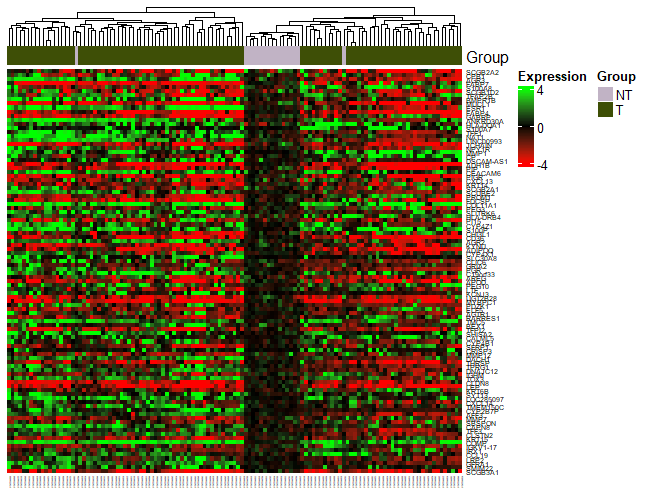
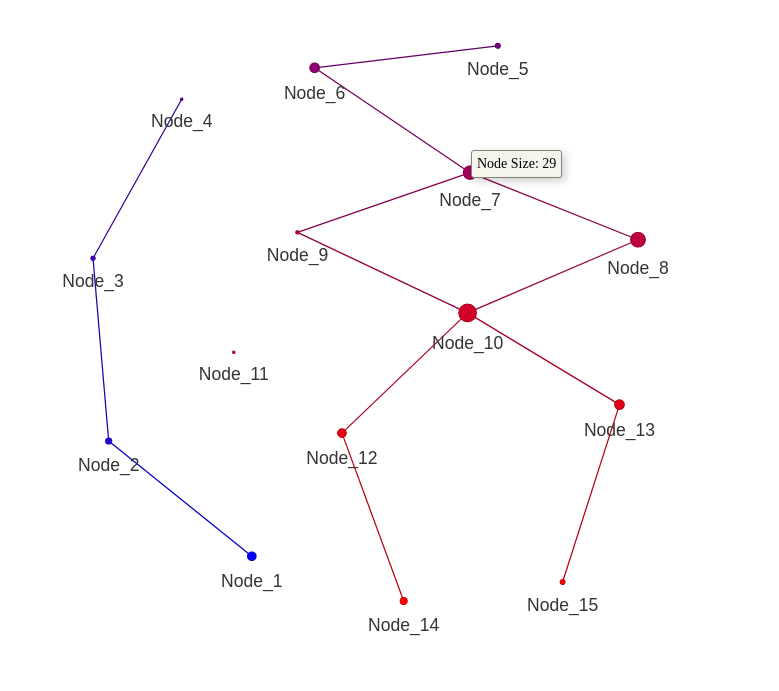
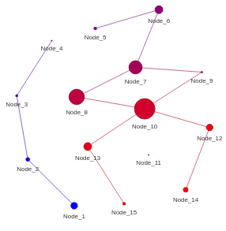

```{r setup, include=FALSE}
knitr::opts_chunk$set(echo = FALSE, warning = FALSE, message = FALSE)
library(GSSTDA)
library(kableExtra)
library(dplyr)
library(tidyr)
```


# Introduction

This paper presents the implementation of Progression Analysis of Disease with Survival (PAD-S) (@fores2022progression) a new analysis, based on Progression Analysis of Disease (PAD), whose main novelty is that it integrates information on genes linked to survival. The PAD, that was developed by @Nicolau2011, allows a set of transcriptomic data samples to be summarised in a combinatorial graph whose nodes are subsets of the samples. In this analysis, data pre-processed using the Disease-Specific Genomic Analyses (DSGA) is subjected to the Mapper algorithm. Although both DSGA and PAD were initially used with microarray data, they can be used on other types of continuous omics data. This extends to PAD-S as well. 

This DSGA is a mathematical analysis for trascriptomic data that isolates the component of data relevant to disease by defining a transformation that measures the extent to which diseased tissue samples deviates from healthy tissue samples (@Nicolau2007). On the other hand, Mapper is a Topological Data Analysis tool (@carlsson2009topology). TDA is intended to find the topological structure of the data using tools for algebraic topology and computational geometry. Two of its approaches is persistent homology (@edelsbrunner2022computational) and Mapper (@singh2007topological; @lum2013extracting). Persistent homology adopts concepts from abstract algebra in order to extract characteristics in the data, such as the presence of higher-dimensional holes and the number of connected components. Mapper however was designed as a visualization method although it can also be considered as an unsupervised classification methodology. It allows to simplify and visualize the information of high dimensional data sets into a combinatorial or complex simplicial graph, which is called the dataset skeleton. To do so, it employs preassigned guiding functions called filters. Mapper has been applied in biological and biomedical research. It has been used successfully to study aortic stenosis, where through the construction of  Mapper graph is able to identify disease subtypes with a higher resolution than standard approaches (@casaclang2019network). Another application in the clinic has been its use in asthma, where clinical examination and biochemical and cellular parameters in biological samples are introduced as input for Mapper in order to identify subgroup of healthy patients and subgroups of asthmatic patients (@hinks2015innate). In addition, it has also been used in other cases to analyze omics data, such as single-cell RNA sequencing data to study cell differentiation and development (@rizvi2017single) or to study breast cancer using RNA sequencing data (@mathews2019robust). 

The PAD, using DSGA and Mapper and developing an own filter function and a way to select the most relevant genes for Mapper, puzzles out the geometry characteristics of the data that are obscured when using cluster analysis and deliver a simple representation of the trascriptomic data set. Our new analysis, the PAD-S, integrates in its new filter function information about the relationship between gene expression level and survival and also uses this information to select the genes to be used in Mapper. This adapted filter function aims to capture the expected survival associated with each patient from the information obtained from the survival analyses.

Mapper performs clustering by strata of different value ranges of this filter function, an then, it is determined if there is a relationship between clusters of different strata, obtaining a topological invariant Reeb graph. As PAD-S filtering function captures the expected survival of each individual, we obtain a graph that captures the shape of the data along the values of the "survival". In this graph, in addition to possible clusters of interest, it is possible to study structures that appear in the graph, such as branches or loops, that can uncover underlying biological patterns. This could show new relevant groups of patients with good or bad prognosis and specific biological characteristics not detected by other types of analysis.

In PAD-S, this ability of Mapper is strengthened by DSGA preprocessing, as it facilitates only the portion of gene expression that is not present in healthy tissue to be used in clustering, thus streamlining data processing and enhancing the extraction of biologically relevant information. In turn, gene selection allows the results to meet the proposed objectives in the most efficient way by selecting the most relevant survival-related genes or that have greater variability. This could lead to the identification of potential biomarkers.

In the landscape of omics data analysis methods, PAD-S stands out for its unique approach rooted in TDA. Mapper can be defined as an atypical unsupervised classification method and, like PCA and traditional clustering, it is not necessary to have prior knowledge of the data and the possible subgroups that form it. However, the Mapper's approach provides a holistic view of the data, allowing for the identification of data subsets, non-linear relationships and intricate patterns reflected in the structures of the graph that may be missed by these methods.

Many methods for analysis of omics data are nowadays available in Bioconductor, a collection of almost 1000 packages for the analysis and comprehension of high-throughput biological data, in R packages such as:  \CRANpkg{rtracklayer} [@lawrence2009rtracklayer], for interacting with multiple genome browsers (UCSC) and manipulating annotation tracks in various formats  (GFF, BED, bedGraph, BED15, WIG, BigWig and 2bit); \CRANpkg{Rsubread} [@liao2019r], for read mapping, read counting, SNP calling, structural variant detection and gene fusion discovery; or \CRANpkg{survcomp} [@schroder2011survcomp], for performance assessment and comparison of survival models; \CRANpkg{scMappR} [@sokolowski2021single], for providing experimentally relevant cell-type specific information to a list of differentially expressed genes (DEG). Regarding the availability of the R implementation of the analyses used in this study, in GitHub, we can find implementations of the Mapper algorithm, \pkg{Mapper} [<https://github.com/peekxc/Mapper>] or \pkg{TDAMapper} [<https://github.com/paultpearson/TDAmapper>]. No implementations found in CRAN repository. In relation to the DSGA, the implementation provided by the developers is no longer available.

In this paper, we introduce a new package in R, called \CRANpkg{GSSTDA} which is the implementation of the already presented Progression Analysis of Disease with Survival (PAD-S). In particular, \CRANpkg{GSSTDA} includes a complete set of baseline functions, covering DSGA method and Mapper tool applying the filter function with information on survival-related genes. We make PAD-S available as a R package, with options for DSGA only, filtering function with selection of genes, Mapper only, or a combination of the three. \CRANpkg{GSSTDA} is available as free software, under the GNU General Public License version 3, and can be downloaded from the Comprehensive R Archive Network (CRAN) at <https://cran.r-project.org/web/packages/GSSTDA>, including supplementary material as data sets or vignettes to replicate all the results presented in this paper. In addition, \CRANpkg{GSSTDA} is hosted on an open source repository on GitHub at <https://github.com/MiriamEsteve/GSSTDA>.

The functions included in the \CRANpkg{GSSTDA} package are summarized in `r knitr::asis_output(ifelse(knitr::is_html_output(), '\\@ref(tab:fun-tabh)', '\\@ref(tab:fun-tabl)'))`. This table comprises two columns divided into four subsections: three of them correspond to the three stages of the Gene Structure Survival using Topological Data Analysis and one to the full analysis. The first column is the name of the functions and the second one is the description of the functions.

The paper is organized as follows. The following subsection [Background](#section2) summaries the three parts of the methodology in the \CRANpkg{GSSTDA} package: DSGA, gene selection and mapper process. Section [Data structure](#section3) describes the structure of the functions, the results and briefly explains which data are used to illustrate the package. Section [Basic functions of the package](#section4) presents the basic methods explained in [Background](#section2). Finally, Section [Conclusion](#section5) concludes.

```{r fun.tab}
input <- 
  c(
    "`dsga`", "For `dsga object`. It allows the calculation of the `disease component` of \n a expression matrix which consists of, through linear models, eliminating the part of the data that is considered normal or healthy and keeping only the \n component that is due to the  disease. It is intended to precede other techniques like  classification or clustering. \n For more information see @Nicolau2007.",
    
    "`results_dsga`", "For `dsga object`. It calculates the 100 genes with the highest variability in \n the matrix disease component between samples and use them to draw the heat map.",
    
    "`gene_selection`", "For `gene_selection object`. It fittings a Cox proportional hazard model to \n each gene, then it makes a selection of genes according to both: their variability within the database and their relationship with survival. Subsequently, with the genes selected, it calculates the values of the filtering functions for each patient. \n The filter function allows to summarise each vector of each individual in a single data. This function takes into account the \n survival associated with each gene. In particular, the implemented filter function performs the vector magnitude \n in the Lp-norm (as well as k powers of this magnitude) of the vector resulting of weighting each element of \n the column vector by the Z score obtained in the cox proportional hazard model.",
    
    "`mapper`", "For `mapper object`. It condenses the information of high-dimensional data sets into a combinatory graph or \n simplicial complex that is referred to as the skeleton of the data set. This implementation is the mapper of \n one dimension, i.e. using only one filter function value.",
    
    "`plot_mapper`", "For `mapper object`. It produces an interactive network plot using visNetwork \n function from the mapper results.",
    
    "`gsstda`", "For `gsstda object`. It integrate the three parts of the process: the preprocessing of the data [dsga process], \n the gene selection and the filter function [gene selection process], and the mapper algorithm [mapper process]."
  )

fun.tab <- data.frame(matrix(input, ncol = 2, byrow = T), stringsAsFactors = FALSE)
names(fun.tab) = c("Function", "Description")

```

```{r fun-tabh, eval = knitr::is_html_output(), layout = "l-body-outset"}
fun.tab %>%
  knitr::kable(format = "html", caption = "GSSTDA package functions", booktabs=TRUE) %>% 
  kable_styling(latex_options="scale_down")
```

```{r fun-tabl, eval = knitr::is_latex_output(), layout = "l-body-outset"}
fun.tab %>%
  knitr::kable(format = "latex", caption = "GSSTDA package functions", booktabs=TRUE, align = 'l') %>% 
      column_spec(1,width = "1in") %>%
      column_spec(2,width = "4in")
```


# Background {#section2} 

## DSGA: Disease-Specific Genomic Analysis {#section2.1} 

In PAD-S analysis the first step is use the DSGA method to transform the original data.
DSGA was first developed for transcriptome array data although it can be used for other continuous omics data such as methylation data. It is intended to precede other techniques like clustering. DSGA methods obtains the amount of deviation that is present in a diseased sample compared to healthy control tissues, by isolating and separating the disease component $(D_{c})$ from the normal-component $(N_{c})$ portion of the data. This method involves three steps: $(i)$ Flat construction $(ii)$ Healthy State Model (HSM) construction, and $(iii)$ Disease component computation for the original data set.  

### Flat constuction {#section2.1.1} 

The flat construction reduces or smooth characteristics of the data that are idiosyncratic to each normal or healthy tissue sample. The data used in this step is filtering with the healthy or normal tissue samples and is organized by columns. This matrix is denote as $N$. The $R$ normal tissue gene expression vectors, denoted as $N_{1},N_{2},...,N_{R}$, are computed as flattened vectors of the form $\hat{N}_{1},\hat{N}_{2},...,\hat{N}_{R}$. The flattened vector $\hat{N}_i$ is calculated by fitting a $0$-intercept least-squares linear model from all other $N_i$-normal tissue vectors $N_{1},N_{2},...,N_{i-1},N_{i+1},...,N_{R}$ as predictor variables, that is, 
\[\hat{N}_{i} = \sum_{\stackrel{j=1}{j\neq i}}^{R}\beta_{j}N_{j}.\]

In this equation, $\hat{N}_{i}$ is the $i$-th flat vector and $\beta_{j}$ is the coefficient associated with normal tissue sample $N_{j}$. Then, after carrying out this step separately for each healthy tissue sample, we obtain the flat matrix in which each column represents a flatted healthy tissue sample as: 
\[\hat{N} = \left[\hat{N}_{1},\hat{N}_{2},...,\hat{N}_{R}\right].\] 

This flat data matrix $\hat{N}$ could be expressed as the sum of a signal matrix $\hat{N}_{true}$ and a noise matrix. In the next step, a singular value decomposition will be applied to denoise it. The estimated matrix $\hat{N}_{true}$ is the so-called Healthy State Model.


### Healthy State Model (HSM) generation {#section2.1.2}

Healthy State Model (HSM) computation describes, predicts, and quantitatively captures the functioning of health systems. In this step, the singular value decomposition (SVD) of the flat data matrix $\hat{N}$ is performed. In the implementation presented in this article, a different method developed by @gavish2014optimal is used for the selection of the number of singular values than in the original DSGA, which allows the process to be automated.

In @gavish2014optimal, it is assumed that the number of rows in the matrix to be decomposed must be smaller than the number of columns. This is not true for the flat data matrix $\hat{N}$ obtained in the previous step, an $\ell$-by-$R$ matrix, as we assume a larger number of genes ($\ell$) than healthy tissue samples ($R$). For this reason, in this section we work with the transpose matrix $\hat{N}^T$, an $R$-by-$\ell$ matrix, and so $R$ < $\ell$.

Following this method, the matrix $\hat{N}^T$ can be expressed as the sum of a signal matrix and a noise matrix:
\[\hat{N}^T = \hat{N}_{true}^T + \gamma \hat{N}_{noise}^T,\]

where $\hat{N}^T$ is the transpose flat matrix; $\hat{N}_{true}^T$ is an underlying low-rank matrix that contains the true signal; $\hat{N}_{noise}^T$ is a noise matrix in which entries are assumed to be a sample of i.i.d. random variables extracted from a Gaussian distribution, with zero mean and unit variance; and $\gamma$ is a parameter that indicates the magnitude of the noise.

In the DSGA, the estimation of $\hat{N}_{true}$ corresponds to the previously introduced HSM. Our aim is to estimate it using a truncated SVD of $\hat{N}^T$ which is the default way of estimating it.

The singular value decomposition of the transpose of the flat matrix is denoted as: 
\[\hat{N}^T = U  D  V^T,\]
where $D$ is a diagonal matrix in which the elements of the diagonal are the singular values of $\hat{N}^T$ $\sigma_{1}, \sigma_{2},... \sigma_{R}$, with $R$ being the number of rows of $\hat{N}^T$, ordered from high to low; and $U$ and $V^T$ are matrices containing the left and right singular vectors in columns and rows, respectively.

As mentioned above, $\hat{N}_{true}^T$ can be estimated by truncated SVD. One option to carry out this truncated SVD is to determine a hard threshold from which singular values in $D$ are selected. This threshold depends on $\gamma$:

\[\hat{N}_{true}^T \simeq HSM^T = U D_{\gamma}V^T.\]

For rectangular matrices with known $\gamma$ the optimal hard threshold for singular value selection is:
\[\tau = \lambda(\beta)\sqrt{\ell}\gamma,\] 

where: 

* $\ell$ is the number of columns of the matrix $\hat{N}^T$. 
* $\beta$ is the aspect ratio of our input matrix $\hat{N}^T,$ that is, $\beta = \frac{R}{\ell}$, with $R$ and $\ell$ being the number of rows and colums respectively.
* $\lambda(\beta)$ is obtained through the following expression:

\[\lambda(\beta) = \left (2(\beta + 1) + \frac{8\beta}{(\beta + 1) + (\beta^2 + 14\beta + 1)^{1/2}} \right)^{1/2}.\]

On the other hand, for rectangular matrices with unknown $\gamma$ the optimal hard threshold for singular value selection is: 
\[\tau = \omega(\beta)\sigma_{med},\] 
where $\sigma_{med}$ is the median of the values $\{\sigma_{1}, \sigma_{2},... \sigma_{R}\}$ and $\omega(\beta)$ is defined by:
\[\omega(\beta) = \frac{\lambda(\beta)}{\mu_{\beta}}.\] 
$\lambda(\beta)$ has already been defined above. $\mu_{\beta}$ is found by computing numerically the upper bound of the following definite integral in the range $[(1-\beta)^2,(1+\beta)^2]$: 

\[\int_{(1-\beta)^2}^{\mu_{\beta}}\frac{\left[ \left((1 + \sqrt{\beta})^2 -t \right) \left( t - (1 - \sqrt{\beta})^2\right)\right]^{1/2}}{2\pi t \beta}dt = \frac{1}{2}.\]  

Only those singular values larger than the threshold obtained by the respective method will be kept. It is important to note that $\gamma$ is not known or predetermined in standard analyses. Nevertheless, our package is intentionally designed to enable users to assess the impact of varying $\gamma$ values, guided by external insights or theoretical assumptions about noise levels.

As already introduced, the estimation of $\hat{N}_{true}$, the new de-noised matrix, is the Healthy State Model (HSM). To construct it assume we need a diagonal matrix termed $D_{\gamma} =  \mathrm{diag}(\sigma_1^*,\ldots,\sigma_R^*)$ which is obtained from $D = \mathrm{diag}(\sigma_1,\ldots,\sigma_R)$ by using that equation:
\[
  \sigma_i^* = \left\{
    \begin{array}{cc}
    \sigma_i & \text{ if } \sigma_i > \tau, \\ 
    0 & \text{ otherwise.}
    \end{array}
    \right.
\] 

So, the `HSM` is defined as:
\[\hat{N}_{true}^T \simeq U D_{\gamma}V^T,\]
\[\textit{HSM} \simeq \hat{N}_{true}.\] 


###  Disease component {#section2.1.3} 

The computation of the disease vectors for each sample in the original data set is applied. The original matrix including healthy and disease samples is expressed as $O$. Then, for each $O_{i}$ data vector present in $O$, a zero-intercept linear model is fitted to the columns of the $HSM$ matrix, i.e,
$$
O_i = \sum_k \eta_k^{(i)} HSM_k + \varepsilon_i
$$ 
where $\eta_k^{(i)}$ are the coefficients obtained from the best approximation of the column space of the matrix $HSM$ to $O_i$ and $\varepsilon_i$ is its corresponding residual. The estimation of $\eta_k^{(i)}$ aims to minimize the error between disease vectors and the projection of the observed disease vectors onto the HSM. Least squares regression is used in our package but other options such as ridge regression could also be employed adapting the estimation method based on data complexity and considerations like multicollinearity and regularization needs.

Now, considering the matrix
\[
O_{DSGA} = [\varepsilon_1 \cdots \varepsilon_p],
\]

we remove the portion of each sample that best mimics the expression patterns of healthy tissues and remain with the vector of residuals that carry out the information about how much each gene of a particular sample deviates from the values observed in healthy tissues.


## Selection of the genes {#section2.2} 

Once the disease component matrix $O_{DSGA}$ has been constructed, the next step consists of the selection of genes for downstream analysis. The gene selection procedure is based on the variability of the expression of each gene across the $O_{DSGA}$ matrix and the degree of association of each gene with either disease-free or overall survival. 

Associations between the levels of the expression of each gene with survival are computed employing univariate Cox proportional hazard models using the vectors corresponding to the pathological tissue samples of the original expression matrix. The $Z$-scores derived from the Cox proportional hazard models fits representing the degree of association of each gene with survival are then stored in the vector $Z_{cox}$. While it is often essential to check compliance with the proportional hazards assumption, we believe it is not for the PAD-S analysis, as the $Z$ scores are merely used as weights.

The standard deviation of each gene in the pathological tissue samples is then calculated using the $O_{DSGA}$ matrix. 
The vector of standard deviations is then stored as $O_{sd}$. To avoid values between $1$ and $-1$, $+1$ is added to all positive values in vectors $Z_{cox}$ and $O_{sd}$, and $-1$ is added to all negative values of vector $Z_{cox}$. The element-wise product between $Z_{cox}$ and $O_{sd}$ matrices is computed. Two methods of gene selection are proposed. In the first of them, the top and bottom $n$ genes of the distribution of this product are selected for further analysis. In the other option, the $n$ genes with the highest absolute value of this product are chosen.

Then, the $O_{DSGA}$ matrix is filtered keeping the selected genes. This matrix constitute the input for the Mapper algorithm.


## Mapper {#section2.3} 

Mapper (@singh2007topological, @lum2013extracting) is a tool derived from TDA that allows to condense high-dimensional data sets into a combinatorial graph capturing the shape of the data. Some of its properties is that it is insensitivity to metric, noise robustness and it allows multiscale representations (@carlsson2009topology). 

This section explains $(i)$ the PAD-S filter function that needs to be applied before Mapper, $(ii)$ the the One Dimensional Mapper Algorithm itself and $(iii)$ the different options for selecting the optimal number of clusters that can be used in the cluster step. 

### Filter function in PAD-S {#section2.3.1}

To use the Mapper, a filter function denoted as $f$ is required. This function summarizes each point in our data set denoted by $X$ to $\mathbb{R}$. \[f: X \rightarrow \mathbb{R}.\] The selection of this filter function is of particular relevance and must be adapted to the nature of the problem under study. While more than one filter function can be used, resulting in a multi-dimensional mapper, the PAD-S methodology employs a single filter function to focus analysis on survival-associated gene expressions, simplifying the computational model, enhancing interpretability for clinical decision-making, and ensuring robustness through theoretical and empirical validation. This choice ensures a targeted analysis that is directly relevant to the biological and clinical questions at hand. The mapper developers suggest using density estimators, eccentricity, or graph Laplacians as filter functions (@singh2007topological), although any function deemed appropriate can be used. In PAD analysis the filter function of choice was the vector of magnitude in the $L^p$ norm, as well as $k$ powers of this magnitude:
\[f(O_{DSGA}^i) = f(O_{DSGA}^i;p,k) = \left[\sum_r |g_{r}^{(i)}|^p \right]^{k/p}.\]
where $O_{DSGA}^i$ denotes the $i$-th column vector of our disease component matrix (corresponding to individual $i$), which contains the values of each selected gene in that sample with coordinates $g_r^{(i)}.$ Note that if $k = 1$ and $p = 2$, the function simply computes the standard (Euclidean) vector magnitude of each column.

In PAD-S analysis the filter function takes account the magnitude of the association between the expression level of a particular gene and survival. In particular the filter function is defined as follows: 
\[f(O_{DSGA}^i;p,k) = \left[\sum_r |z_{r}\cdot g_{r}^{(i)}|^p \right]^{k/p},\]
where $z_{r}$ is the $z$-value derived from the Cox proportional hazard models analysis and  $g_r^{(i)}$ the $i$-th disease component value (corresponding to individual $i$) for $r$-th feature. 

Note that in this case, to avoid values between $1$ and $-1$, $+1$ is added to all positive values in vectors $Z_{cox}$ and $O_{DSGA}^{i}$, and $-1$ is added to all negative values of both vectors. Therefore, the amount of deviation of each gene to the `HSM` is multiplied by the degree of association of this particular gene with survival.

### The One Dimensional Mapper Algorithm {#section2.3.2}

In PAD-S methodology, the Mapper is subsequently applied on $O_{DSGA}$ using its filter function defined in the previous section [Filter function in PAD-S](#section2.3.1).  

In addition, Mapper requires the use of a specific distance metric and clustering type for the clustering step. 
To this end, the \CRANpkg{GSSTDA} package implementation allows choosing between correlation and Euclidean distances as distance metrics and among single linkage, average linkage, complete linkage or k-medioids as clustering methods. 

Once the values of the filter function have been calculated, the range of filter function values is divided into overlapping intervals. Subsequently, for each interval, the clustering of the individuals that have a value of the filter function that is within that interval is performed. After clustering each interval, the graph is constructed. Each cluster is a node and those that share at least one individual are joined by an edge. This is possible because the intervals are overlapping. 

The output graph $G=G(V,E)$ is then defined putting each cluster as a node (or vertex) of the nodes that share samples are connected with an edge.

### Methods for the identification of the optimal number of clusters {#section2.3.3}

Two different options for the selection of the optimal number of clusters are offered in the package presented. One of them is the method originally used in Mapper, which is also the one used by the PAD analysis. It selects the number of clusters by constructing a histogram of the cluster edge lengths using $k$ bins. An empty interval is usually generated in this histogram. The edge length of the start of this interval is chosen. The clusters with a greater edge length than this one are chosen. In addition to this method, the option of using the Silhouettes (@rousseeuw1987silhouettes) method is also available. 

In this method, the first step is as follows. For a particular data point $x$ included in cluster $C_{i}$ we first define $a(x)$ as the average distance of data point $x$ to all other points $y$ in the cluster. Thus,
\[
a(x) = \frac{1}{|C_{i}| - 1}\sum_{\stackrel{y \in C_{i}}{j\neq i}}d(x,y).
\]

Then, $b(x)$ is defined as the minimum mean difference of point $x$ to any other cluster $C$ of which $x$ is not a member, as the average distance from $x$ to all points $y$ in $C$ where $C \neq C_{i}$. 
\[
b(x) = \min_{\stackrel{1 \le k \le \ell}{k \neq i}}\frac{1}{|C_{k}|}\sum_{y \in C_{k}}d(x,y).
\]
The cluster which has the minimum average distance to point $x$ is said to be the neighbor cluster of $x$. 

In the context of our analysis, the function \(d(x, y)\) represents the distance measure used to quantify the similarity between data points \(x\) and \(y\) in our dataset. This distance metric is critical for clustering and analyzing the structure of the data. Specifically, \(d(x, y)\) could be any metric that suits the nature of the data and the specific requirements of the analysis, such as Euclidean, Manhattan, or cosine similarity. In this manuscript, unless otherwise specified, we use the Euclidean distance, which is defined as 
\[
d(x, y) = \sqrt{\sum_{i=1}^n (x_i - y_i)^2},
\]
where \(x_i\) and \(y_i\) are the components of vectors \(x\) and \(y\) respectively. This choice is motivated by its geometric interpretability and computational efficiency in handling numerical data typical in omics studies.


The concept of Silhouette for point $x$ is defined by \[s(x) = \frac{b(x) - a(x)}{\max\{a(x),b(x)\}}, \quad \textrm{if} \quad |C_{i} > 1|,\] that is, if the number of elements in the cluster is larger than $1$. 
When a particular cluster $C_{i}$ contains only a single object, it is unclear how $a(x)$ should be defined, and therefore we set the silhouette to $0$.
\[
s(x) = 0, \quad \textrm{if} \quad |C_{i}| = 1.
\]

The average of the $s(x)$ values of all points grouped in a particular cluster $C_{i},$ i.e.
$$
\overline{s}_i = \frac{1}{|C_i|}\sum_{x \in C_i}s(x)
$$
indicates how well grouped are the members of this cluster, whereas the average
of all data points
$$
\overline{s} = \frac{1}{|\cup_i C_i|}\sum_{x \in \cup_i C_i}s(x)
$$
indicates how well the available data points have been clustered in general. 

To select the optimum number of clusters within each interval of the filter function, the average silhouette values \(\overline{s}\) are computed for all possible partitions from \(2\) to \(n-1\), where \(n\) is the number of samples within a specific interval. Then the \(n\) that produces the highest value of \(\overline{s}\) and that exceeds a specific threshold is selected as the optimum number of clusters. The threshold of \(0.25\) for \(\overline{s}\) has been chosen based on standard practice, recognizing it as a moderate value that reflects adequate separation and cohesion within clusters, which is crucial for ensuring both statistical significance and biological or clinical relevance of the clusters. If a different threshold is considered, it should be adjusted based on the study's specific objectives and the dataset's characteristics, with higher thresholds used for stronger delineation between clusters and lower thresholds suitable for exploratory analyses or overlapping data categories. To implement an alternative threshold, one should: 1) Analyze the distribution of silhouette scores for various thresholds to understand the impact on cluster structures, 2) Validate the stability and validity of these clusters using additional internal metrics, 3) Consult with domain experts to align the threshold with biological or clinical importance, and 4) Conduct a sensitivity analysis to ensure robustness of the results. If no partition produces an \(\overline{s}\) exceeding the chosen threshold, all samples are then assigned to a unique cluster, facilitating the clear identification of distinct groupings within the data.


 
# Data structure {#section3}

Data are managed as a regular R `matrix` in the \CRANpkg{GSSTDA} functions. The main functions of the GSSTDA package are `dsga()`, `gene_selection()`, `mapper()` and `gsstda()`, which return structured objects named `dsga_object`, `gene_selection_object`, `mapper_object` and `GSSTDA_object`, respectively. These objects contain fields with relevant information such as the genes selected for the mapper algorithm or the arguments introduced by the user in the function call.

The main fields of the all objects are the following:

* `full_data`: Matrix containing normalized gene expression data. The columns correspond to the patients and the rows to the genes.
* `survival_time`: Numerical vector of the same length as the number of columns of `full_data`. In addition, the patients must be in the same order as in `full_data`. For the patients whose sample is pathological should be indicated the time between the disease diagnosis and event (death, relapse or other). If the event has not occurred it should be indicated the time until the end of follow-up. Patients whose sample is from healthy tissue must have an `NA` value.
* `survival_event`: Numerical vector of the same length as the number of columns of `full_data`. Patients must be in the same order as in `full_data`. For the the patients with pathological sample should be indicated whether the event has occurred (1) or not (0). Only these values are valid and healthy patients must have an `NA` value.
* `case_tag`:  Character vector of the same length as the number of columns of `full_data`. Patients must be in the same order as in `full_data`. It must be indicated for each patient whether its sample is from pathological or healthy tissue. One value should be used to indicate whether the patient's sample is healthy and another value should be used to indicate whether the patient's sample is pathological. The user will then be asked which one indicates whether the patient is healthy. Only two values are valid in the vector in total. 

## Data set {#section3.1}

```{r load_data, echo = TRUE, eval = TRUE}
# We load the data
data("full_data")
data("survival_time")
data("survival_event")
data("case_tag")
```

We illustrate all the functions presented in this paper resorting to a single data set (`full_data`) with its corresponding vectors (`survival_time`, `survival_event` and `case_tag`) available in the \CRANpkg{GSSTDA} package. The original data are from the study GSE42568 available in \url{https://www.ncbi.nlm.nih.gov/geo/query/acc.cgi?acc=GSE42568}. This data was processed normalizing the genes expression. We carry out background correction, summarizing, and quantile normalization of data set using the `fRMA` method implemented in the \CRANpkg{fRMA} package. Our data set consists of 20,825 genes and 121 patients. Compliant with CRAN publication requirements, which necessitate demonstrating our package's functionality on a manageable subset of data, we have strategically reduced the number of genes in our dataset to 4165. This ensures that our analysis remains computationally feasible while maintaining a representative sample. The examples were executed in the posit (RStudio Cloud) environment, which has a system configuration including 3.75 GB RAM, Intel Xeon E5-2673 v3 @ 2.40 GHz processor, and Ubuntu 20.04 operating system. The calculations were completed in 78 seconds, demonstrating the package’s efficiency. The dataset thus includes gene expression profiling from 104 breast cancer and 17 normal breast biopsies, exemplifying the package’s utility across typical clinical samples without compromising the integrity and representativeness of the results. The first four patients and their ten genes are shown below for the four data sets: 

```{r descrip_full_data}
summary_descrip_full_data <- full_data[1:10, 1:4]
```

```{r descr-full_data-html, eval = knitr::is_html_output(), layout = "l-body-outset"}
knitr::kable(summary_descrip_full_data, format = "html", caption = "Descriptive statistics of the four first variables included in the `full_data`",digits = 3)
```

```{r descr-full_data-lat, eval = knitr::is_latex_output()}
summary_descrip_full_data %>%
  knitr::kable(format = "latex", booktabs=TRUE, align = 'l', 
               digits = 3)
```  

```{r descrip_survival_time}
summary_descrip_survival_time <- round(survival_time[15:25], digits = 3)
summary_descrip_survival_event <- survival_event[15:25]
summary_descrip_case_tag <- case_tag[15:25]

input <- c("`survival_time`", paste(summary_descrip_survival_time, collapse=" "),
           "`survival_event`", paste(summary_descrip_survival_event, collapse=" "),
           "`case_tag`", paste(summary_descrip_case_tag, collapse=" "))

fun.summ <- data.frame(matrix(input, ncol = 2, byrow = T), stringsAsFactors = FALSE)
names(fun.summ) = c("Vectors", "Extract of the values")

```

```{r fun-summh, eval = knitr::is_html_output(), layout = "l-body-outset"}
fun.summ %>%
  knitr::kable(format = "html", caption = "Descriptive statistics of ten variables included in the `survival_time`, `survival_event` and `case_tag`", booktabs=TRUE) %>% 
  kable_styling(latex_options="scale_down")
```

```{r fun-summl, eval = knitr::is_latex_output(), layout = "l-body-outset"}
fun.summ %>%
  knitr::kable(format = "latex", booktabs=TRUE, align = 'l') %>% 
      column_spec(1,width = "1in") %>%
      column_spec(2,width = "4in")
```


# Basic functions of the package {#section4}

In this section, we introduce the main functions of the library related to Gene Structure Survival using Topological Data Analysis.

## DSGA object {#section4.1}

The basic model of Disease-Specific Genomic Analysis that we explained in subsection [DSGA: Disease-Specific Genomic Analysis](#section2.1) can be implemented in R using the function `dsga()`:

```{r dsga_obj, echo = TRUE, eval = FALSE}
dsga_object <- dsga(full_data, survival_time, survival_event, case_tag, gamma)
```

The minimum arguments of this function are `full_data`, `survival_time`, `survival_event` and `case_tag`, which were explained in the previous section [Data structure](#section3). The parameter `gamma` is optional. It indicates the magnitude of the noise assumed in the flat data matrix for the generation of the Healthy State Model. If it takes the value `NA` the magnitude of the noise is assumed to be unknown. We recommend using the default value `NA`. Additionally, the function requests the following information from the user at runtime:

*  Enter "yes" if the columns are the patients and the row the genes or "no" in other cases. In the "no" case, the library will automatically change the columns and rows to fulfill this condition.
* Enter which is the tag of the patients whose sample is from healthy tissue that is stored in the `case_tag` vector. It is also possible to introduce it in the function as a parameter.


This function returns an object composed of:

* `normal_space`: The matrix with the normal space (linear space generated from normal tissue samples).
* `matrix_disease`: The disease component matrix that contains the disease component of all patients (`dsga_object[["matrix_disease_component"]]`).

As an example, using data and vectors from subsection [Data structure](#section3), we next process the genes expression using the suitable code as follows. Results are returned as an `dsga object`, as explained in section [Data structure](#section3). 

```{r dsga_obj_info, echo = TRUE, results = F, fig.show='hide'}
dsga_object <- dsga(full_data = full_data,
                    survival_time = survival_time,
                    survival_event = survival_event,
                    case_tag = case_tag)

dsga_information <- results_dsga(
                    matrix_disease_component = dsga_object[["matrix_disease_component"]],
                    case_tag = case_tag)
```

The DSGA information are plotted using `results_dsga()` function (see Figure \@ref(fig:fig1)).

```{r print_dsga_info, echo = TRUE, eval = TRUE, fig.show='hide'}
print(dsga_information)
```


```{r fig1, out.width = "100%", out.height = "30%", fig.cap = "Heatmap of the disease component matrix (result of the `dsga` function) after selecting the 100 genes with the highest variability between samples. Each column represents a patient sample and each row represents a gene. The color scale reflects the values of the disease component, with warmer colors indicating higher expression values than in healthy tissue and cooler colors indicating lower expression. Key: `NT` stands for `Non-Tumor` – representing normal breast biopsy samples; `T` stands for `Tumor` – representing breast cancer biopsy samples. In addition, the result of the hierarchical clustering of the samples using the euclidean distance and the complete method is included. This visualization aids in distinguishing between the disease component profiles of tumor and non-tumor samples, highlighting the difference between the two types after preprocessing with DSGA."}

```

## Gene selection object {#section4.2}

The basic model of gene selection that we explained in subsection [Selection of the genes](#section2.2) can be implemented in R using the function `gene_selection()`. Furthermore, this function for convenience calculates the filter function values for mapper. It uses the filter function developed for the PAD-S:

```{r gene_obj, echo = TRUE, eval = FALSE}
gene_selection_object <- gene_selection(data, gen_select_type, percent_gen_select)
```

The fields of the `gene_selection()` are the following:

* `gen_select_type`: Options on how to select the genes to be used in the mapper:
  + `Abs`:  The genes with the highest absolute value are chosen.
  + `Top_Bot`: Half of the selected genes are those with the highest value (positive value, i.e. worst survival prognosis) and the other half are those with the lowest value (negative value, i.e. best prognosis). "Top_Bot" default option.
* `percent_gen_select`: Percentage (from zero to one hundred) of genes to be selected to be used in mapper. 10 is the default option.
* `data`: The `data` argument could be two options:
  + `dsga_object`: This is use if `dsga()` function was previously executed.
  + `data_object`: Create a object `data_object` with the require information (see following R example).
  
This function returns a `gene_selection object` composed of:

* `cox_all_matrix`: A matrix with the results of the application of proportional hazard models: the regression coefficients, the odds ratios, the standard errors of each coefficient, the Z values and the p-values for each Z value)
* `genes_selected`: A vector with the name of the selected genes,
* `genes_disease_ component`: The matrix of disease components with only the rows of the selected genes.
* `filter_values`: The vector of the values of the filter function.

We introduce two distinct options for data input when utilizing our analytical package. These input methods are designed to accommodate different data structures and user preferences, ensuring flexibility and accessibility for a variety of research needs.

### First option: dsga_object

The first option for data input involves using a predefined object type, `dsga_object`. This object is specifically tailored for users who have pre-processed their data using the Disease-Specific Genomic Analysis (DSGA) method. The `dsga_object` contains all necessary attributes and methods for subsequent analysis steps within our package, ensuring that users can seamlessly integrate their DSGA-processed data.

As an example, we next create a `gene_selection object` for the first option of data input:

```{r dsga_gene_selection1, echo = T, results = F}
dsga_object <- dsga(full_data = full_data,
                    survival_time = survival_time,
                    survival_event = survival_event, 
                    case_tag = case_tag)
gene_selection_object <- gene_selection(data =  dsga_object,
                                      gen_select_type = "Top_Bot", 
                                      percent_gen_select = 10)
```

### Second option: data_object

The second option allows users to input their data as a generic data_object. This approach is intended for users who may have their data prepared in different formats or who require a more general input method that does not depend on the specific preprocessing steps like those required by the DSGA. The data_object should contain all the necessary data fields, such as gene expression data, survival data, and any other relevant clinical parameters, formatted in a way that can be directly utilized by our package.

The example of the second option of data input is:

```{r dsga_gene_selection2, echo = T, results = F}
# Create data object
data_object <- list(full_data = full_data,
                    survival_time = survival_time,
                    survival_event = survival_event,
                    case_tag = case_tag)
class(data_object) <- "data_object"

#Select gene from data object
gene_selection_object <- gene_selection(data = data_object, 
                                      gen_select_type = "Top_Bot",
                                      percent_gen_select = 10)
```

Each of these input options is designed to provide the flexibility needed to handle diverse data types and preprocessing techniques. This ensures that our package can be effectively used in various scenarios, catering to both advanced users with specific preprocessing needs and those seeking more general data input methods.


## Mapper object {#section4.3}

The basic model of mapper that we explained in subsection [Mapper](#section2.3) can be implemented in R using the function `mapper()`:

```{r mapper_obj, echo = TRUE, eval = FALSE}
mapper_object <- mapper(data,
                        filter_values,
                        num_intervals,
                        percent_overlap,
                        distance_type,
                        clustering_type,
                        num_bins_when_clustering, 
                        linkage_type, 
                        optimal_clustering_mode, 
                        silhouette_threshold)
```

The fields of the mapper object are the following:

* `data`: Input matrix with which the analysis is performed. The user is asked whether the columns correspond to patients or features. In GSSTDA, this matrix corresponds to the matrix of disease components with only the rows of the selected genes. It can be any other matrix to which mapper is to be applied.
* `filter_values`: Vector obtained after applying the filtering function to the input matrix, i.e, a vector with the filtering function values for each included sample.
* `num_intervals`: Number of intervals used to create the first sample partition based on filtering values. "5" is the default option.
* `percent_overlap`: Percentage of overlap between intervals. Expressed as a percentage. "40" is the default option.
* `distance_type`: Type of distance to be used for clustering.
  + `correlation`: "correlation" is the default option.
  + `euclidean`
* `clustering_type`: Type of clustering method.
  + `hierarchical`: "hierarchical" is the default option.
  + `PAM`: "PAM" (“partition around medoids”) option. 
* `num_bins_when_clustering`: Number of bins to generate the histogram employed by the standard optimal number of cluster finder method. Parameter not necessary if the `optimal_clustering_mode` option is "silhouette" or the `clustering_type` is "PAM". "10" is the default option.
* `linkage_type`: Linkage criteria used in hierarchical clustering. Only necessary for hierarchical clustering. 
  + `single`:  Single-linkage clustering. "single" is the default option.
  + `complete`: Complete-linkage clustering.
  + `average`: Average linkage clustering (or UPGMA). 
* `optimal_clustering_mode`: Method for selection optimal number of clusters. It is only necessary if the chosen type of algorithm is "hierarchical". In this case, choose between "standard" (the method used in the original mapper article) or "silhouette". In the case of the "PAM" algorithm, the method will always be "silhouette".
* `silhouette_threshold`: Minimum value of $\overline{s}$ that a set of clusters must have to be chosen as optimal. Within each interval of the filter function, the average silhouette values $\overline{s}$ are computed for all possible partitions from $2$ to $n-1$, where $n$ is the number of samples within a specific interval. The $n$ that produces the highest value of $\overline{s}$ and that exceeds a specific threshold is selected as the optimum number of clusters. If no partition produces an $\overline{s}$ exceeding the chosen threshold, all samples are then assigned to a unique cluster. We recommend to use the default value of 0.25.

This function returns a `mapper object` which contains:

* `interval_data`: The values of the intervals.
* `sample_in_level`: The samples included in each interval.
* `clustering_all_levels`: The information about the cluster to which the individuals in each interval belong. 
* `node_samples`: A list including the individuals contained in each detected node.
* `node_sizes`: Their size.
* `node_average_filt`: The average of the filter function values of the individuals of each node.
* `adj_matrix`: The adjacency matrix linking the nodes.

As an example, using results of `dsga()` and `gene_selection()`, we next process the `mapper()` using the suitable code as follows:

```{r mapper_obj_exe, eval = TRUE, results=F}
mapper_object <- mapper(data = gene_selection_object[["genes_disease_component"]],
                        filter_values = gene_selection_object[["filter_values"]],
                        num_intervals = 10,
                        percent_overlap = 40,
                        distance_type = "correlation",
                        clustering_type = "hierarchical",
                        linkage_type = "single")
```

The information obtained from the mapper object are showed using `print`:

```{r print_mapper, echo = TRUE, eval = TRUE}
print(mapper_object)
```

In addition, the mapper information are plotted using `plot_mapper()` function (see Figure \@ref(fig:fig2)). Hovering the mouse over each node in the interactive graph displays the number of samples that form the node.


```{r fig2, fig.label="fig:fig2", out.width = "65%", out.height = "40%", fig.cap = "Mapper result graph. Mapper visualization depicting clusters of samples based on gene expression profiles along the value of the filter function, with nodes representing clusters and edges indicating overlap, facilitating the identification of nodes of different gene expression patterns and survival. The intensity of the color within each node reflects the average level of filter function within the cluster, aiding in the characterization of biological significance. Low filter function values, represented in blue, are associated with better survival. High values, in red, are associated with worse survival. Additionally, annotation allows for the identification of a cluster of interest, assisting in the extraction of insight into potential biomarkers or gene expression patterns associated with specific sample groups. The default option used in this case resizes the node sizes as $No. samples^{1/2}$."}

```

To show more clearly the resizing options provided by $plot\_mapper()$, the same graph is shown by varying the values of the function parameters (see Figure \@ref(fig:fig3)):

```{r plot_mapper, echo = TRUE, eval = F, results=F}
plot_mapper(mapper_object, trans_node_size = TRUE, exp_to_res = 1/1.5)
```

```{r fig3, fig.label="fig:fig3", out.width = "65%", out.height = "30%", fig.cap = "Mapper result graph after varying the parameter $exp\\_to\\_res$ to $1/1.5$ ($No. samples^{1/1.5}$). This way the resizing of the node size is smoother."}

```

## GSSTDA object {#section4.4}

The analysis of `gsstda()` function consists of the three previous parts, i.e., a preprocessing of the data {`dsga()`], the gene selection and the filter function [`gene_selection()`], and the mapper algorithm [`mapper()`]. So, this function integrates the explained functions above. Results are returned as an `gsstda object`, which is composed by all the results of `dsga()`, `gene_selection()` and `mapper()` functions.

The basic model of GSSTDA (dsga + gene selection + mapper) can be implemented in R using the function `gsstda()`:

```{r gsstda_obj, echo = TRUE, eval = FALSE}
gsstda_object <- gsstda(full_data, survival_time, survival_event, case_tag,
                        gamma, gen_select_type, percent_gen_select, 
                        num_intervals, percent_overlap, distance_type, 
                        clustering_type, num_bins_when_clustering, 
                        linkage_type, optimal_clustering_mode, 
                        silhouette_threshold)
```

This function returns a `gsstda object` composed of:

* `normal_space`: The matrix with the normal space (linear space generated from normal tissue samples).
* `matrix_disease_components`: The matrix of the disease components (the transformed `full_data` matrix from which the normal component has been removed).
* `cox_all_matrix`: A matrix with the results of the application of proportional hazard models for each gene.
* `genes_selected`: The genes selected for `gene_selection()`.
* `genes_disease_component`: The matrix of the disease components with information from these genes only.
* `mapper_object`: The mapper object explained in the subsection [Mapper object](#section4.3).

As an example, using arguments of `dsga()` and `gene_selection()`, we next process the `gsstda()` using the suitable code as follows:

```{r gsstda_obj_exe, echo = T, eval = TRUE, results = F}
gsstda_object <- gsstda(full_data = full_data,
                        survival_time = survival_time, 
                        survival_event = survival_event,
                        case_tag = case_tag, 
                        gen_select_type = "Top_Bot", 
                        percent_gen_select = 10, 
                        num_intervals = 10,
                        percent_overlap = 40, 
                        distance_type = "correlation", 
                        clustering_type = "hierarchical", 
                        linkage_type = "single")
```

The information obtained from the GSSTDA object are showed using `print` for `dsga` and `mapper` information. In addition, the mapper information obtained by GSSTDA object are plotted using `plot_mapper()` function (see Figure \@ref(fig:fig2)).


# Conclusions {#section5}

The \CRANpkg{GSSTDA} package allows transcriptomic data to be analysed (although it could be used for other types of omics data) integrating the information related on the degree of association of each gene with survival through the use of a specific feature selection procedure and a new adapted filter function. This allows to obtain a graph reflecting groups of samples that are not only differentiated by similarity in expression pattern but also by similarity in survival.

Specifically, this package is the implementation of the Progression Analysis of Disease with Survival. This methodology pre-processes the data using the DSGA which isolates the part of the expression that is considered pathological. This allows only this part to be used in further analysis. The genes to be used in the Mapper analysis are then selected on the basis of their association with survival. This information is also integrated into the filter function. Using the values of this filter function and the data processed through the DSGA, this information is condensed into a graph using the Mapper algorithm. One of the advantages of using Mapper over classical clustering techniques is that it has been shown in numerous applications to reveal aspects of the data that classical clustering does not detect.

In the broad field of oncology, the study of survival is essential, and omics sciences are increasingly important. GSSTDA allows the integration of both, so it could be useful in any oncological pathology and the results obtained can contribute to the development of personalized medicine. It can aid in the identification of prognostic biomarkers, therapeutic targets, or molecular subtypes. As has been done in this work with survival, any function of the data that reflects a clinical or biological characteristic of interest could be used as a filtering function so that the applications of possible adaptations of this package could be numerous.

Additionally, the combined use of our package with other analytical tools could show its versatility and potential for interdisciplinary research collaborations. Concrete examples or case studies demonstrating the application of the package in the analysis of real-world data sets and the discovery of novel biological insights can further illustrate its practical value and impact on biomedical research.

Several functions have been implemented in the \CRANpkg{GSSTDA} package: for processing the data using DSGA method, selecting the genes and calculating the values of the new filter function taking into account the association of each gene with survival, and generating a topological invariant Reeb graph applying the Mapper algorithm. The package provides a function to perform the full PAD-S analysis but also allows the DSGA and Mapper analyses, which can have numerous applications, to be performed independently. 

Throughout the paper, we have also shown how to organize the data, use the available functions, and interpret the results. In particular, to illustrate the different functions implemented in the package, we applied all of them on a common empirical example so that results can easily be compared. In this way, we believe that the \CRANpkg{GSSTDA} package is a valid self-contained R package for grouping transcriptomics data samples according to their survival and gene expression by integrating information on genes linked to survival in the process of gene selection and in the Mapper filter function from the popular topological technique: Topological Data Analysis.

Diving into potential future directions for expanding this R package, an array of promising avenues beckon. Initially, existing functionalities could be improved by refining data preprocessing algorithms, optimizing parameter selection methods, and bolstering computational efficiency to accommodate larger datasets more adeptly. Another possible parallel option is to explore new alternatives to carry out these processes and adapt them to other types of omics data. To complement its applications, functions that allow exploring the results obtained could be integrated into the package.Exploring integrative strategies for analyzing multi-omics data stands out as another compelling trajectory, offering deeper insights into biological mechanisms and disease pathology. Adapting the method to other problems by modifying the feature selection process and the filtering function represents another possible direction for future work. Additionally, fostering community engagement and collaboration will be pivotal for nurturing ongoing growth and evolution, inviting users to contribute feedback, suggestions, and innovative applications to enrich the package's capabilities and impact. Through these concerted efforts, the aim is to equip researchers with a versatile and robust toolkit for exploring complex biological datasets and advancing biomedical research.


# Acknowledgments
R. Bosch-Romeu, A. Falco and M. Esteve thank the grant TED2021-129347B-C22 funded by Ministerio de Ciencia e Innovación/ Agencia Estatal de Investigación. Additionally, R. Bosch-Romeu and A. Falco gratefully acknowledges the financial support from CEU Cardenal Herrera University and Santander under a predoctoral grant, from  Scientific Foundation of the Spanish Association Against Cancer under a predoctoral grant, and the Spanish Ministry of Science, Innovation and Universities under grant *Ayudas para la Formación de Profesorado Universitario FPU 2022* (FPU 22/02810).
