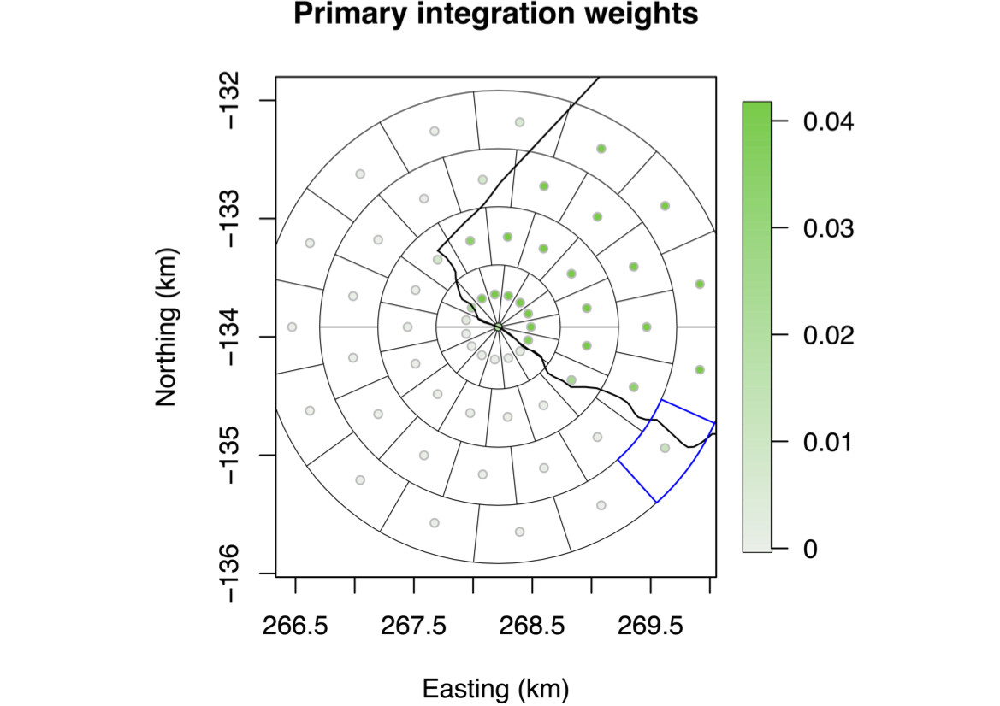
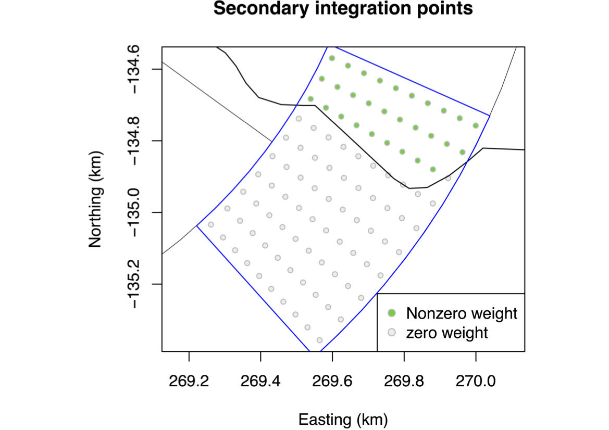
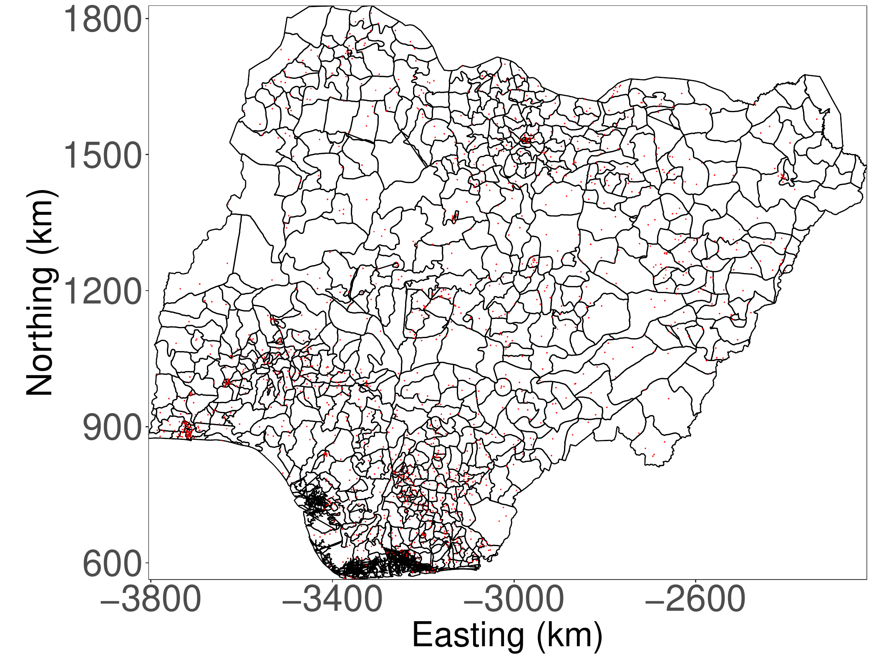
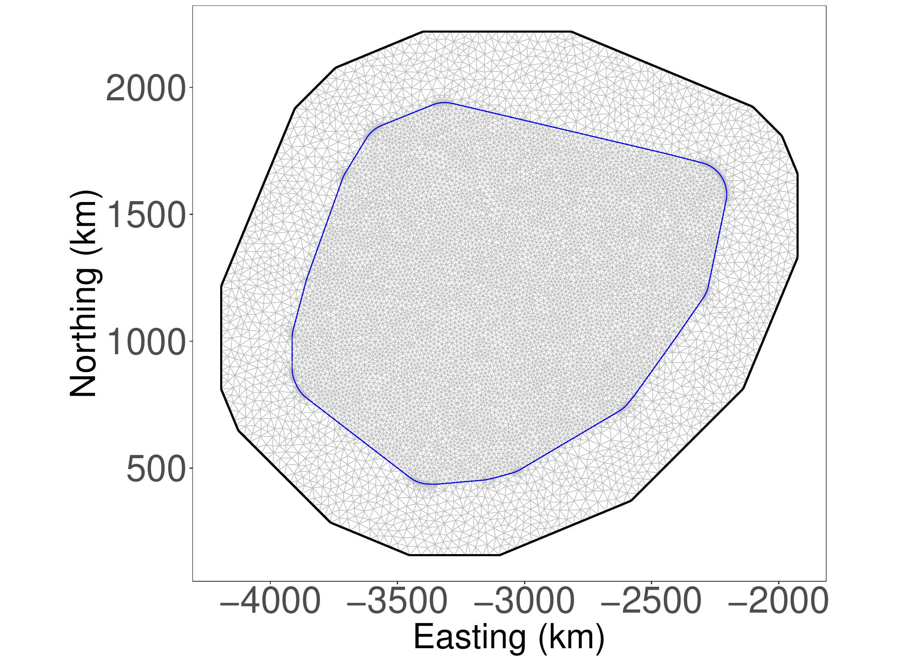
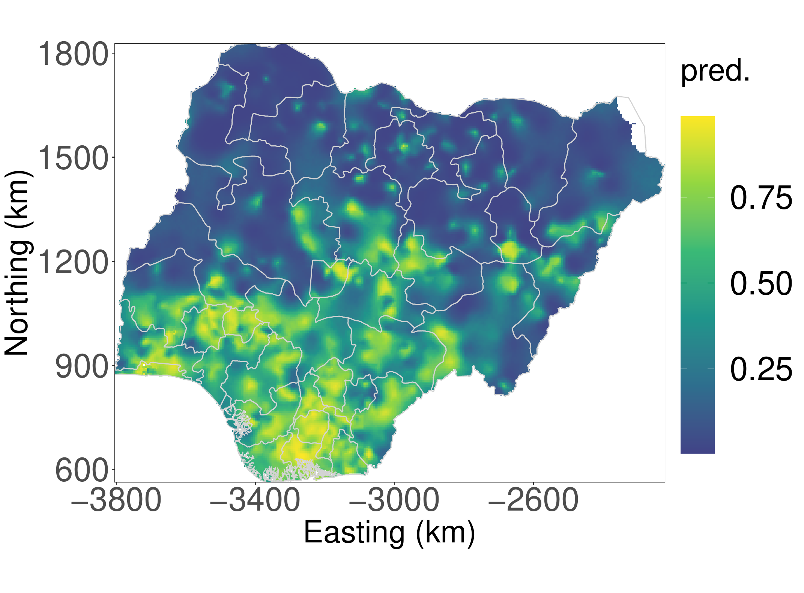
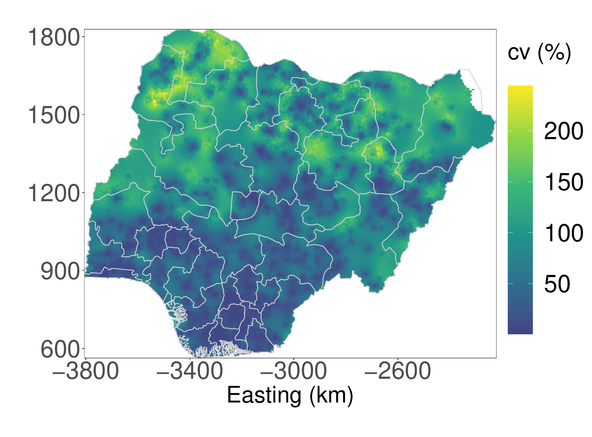

::: article
## Introduction

The Demographic and Health Surveys (DHS) Program[^1] implements
household surveys to collect and disseminate nationally representative
data about health, population, HIV and nutrition in low- and
middle-income countries. The DHS Program started in 1984, and has been
implemented in overlapping 5-year phases. So far more than 400 surveys
have been conducted in over $90$ countries. Standard DHS surveys usually
include between and households. GPS coordinates of household centres are
provided to allow for spatial analyses of the collected demographic and
health data, but the DHS has added intentional positional errors into
the published GPS coordinates to protect the privacy of the survey
respondents [@DHSspatial07].

The random displacement procedure, or *jittering* scheme, is publicly
known [@DHSspatial07], but traditional geostatistical analyses assume
that the locations are known exactly and ignore the jittering. However,
we have recently demonstrated that ignoring the positional error in DHS
data may lead to attenuated estimates of the covariate effect sizes and
reduced predictive performance [@altay2022covariates].

While common practice is to ignore jittering, some approaches have been
proposed to account for it. With respect to the error induced in spatial
covariates, @warren2016influenceOne proposed regression calibration for
distance-based covariates, and @perez2013guidelines
[@perez2016influence] proposed using a 5 km moving window (or buffer
zone) for raster-based covariates. However, these approaches do not
address the attenuation arising in the covariate effect sizes when
replacing the true covariate with a proxy. With respect to the error
induced in the spatial effect, @fanshawe2011spatial proposed a Bayesian
approach in the limited setting of no covariates and Gaussian
observation model. @wilson2021estimation proposed a more complex
approach using INLA-within-MCMC [@rue2009approximate; @gomez2018markov],
which could handle the error induced in both the spatial random effect
and in spatial covariates, but computation time is too extensive for
routine use of the approach. None of the mentioned papers provide an R
package for easy application of the methods.

The datasets from DHS are semi-public and one must apply for access. A
step-by-step explanation of the application procedure can be found at
<https://dhsprogram.com/data/new-user-registration.cfm>. The application
requires a brief project description explaining why the data set is
needed and how it will be used. Permission is typically granted within a
few days.

With the R package
[**GeoAdjust**](https://CRAN.R-project.org/package=GeoAdjust), we
address the need for fast, flexible and user-friendly software to
estimate geostatistical models for DHS data subject to positional
uncertainty.
[**GeoAdjust**](https://CRAN.R-project.org/package=GeoAdjust) corrects
for the positional uncertainty by adjusting for jittering both in the
spatial random effect and the spatial covariates, and achieves fast
inference by combining the computational efficiency of the stochastic
partial differential equations (SPDE) approach [@Lindgren:etal:11] with
the autodifferentiation features of Template Model Builder (TMB) [@tmb].
We use the R-package
[**fmesher**](https://CRAN.R-project.org/package=fmesher)
[@fmesherPackage] for computing the mesh and discretization matrices for
the SPDE approach, and the R-package
[**TMB**](https://CRAN.R-project.org/package=TMB) for easy use of the
TMB methodology.
[**GeoAdjust**](https://CRAN.R-project.org/package=GeoAdjust) is
available on CRAN [@Rmain] and can be installed with the command
`install.packages("GeoAdjust")`. While there are other R packages such
as [**SUMMER**](https://CRAN.R-project.org/package=SUMMER)
[@li2020space; @summerPackage] that can perform spatial or
spatio-temporal areal analysis of DHS data, none can account for
jittering in geostatistical analysis.

## Geostatistical inference under jittering {#sec:method}

We describe a country of interest as a spatial domain
$\mathcal{D}\subset\mathbb{R}^2$, and we assume that $C$ small groups of
households, called *clusters*, are observed within the country. For
clusters $c = 1, \ldots, C$, we denote the true location by
$\boldsymbol{s}_c^* \in\mathcal{D}$, and we denote the observed
(jittered) location, provided by DHS surveys, by
$\boldsymbol{s}_c \in\mathcal{D}$. Additionally, each cluster has a
known classification as urban (U) or rural (R). The urban/rural
designation, $\mathrm{Urb}[c]\in\{\mathrm{U},\mathrm{R}\}$, is important
since DHS surveys use different jittering mechanisms in urban and rural
clusters. Urban clusters are jittered up to $2\, \mathrm{km}$, and rural
clusters are jittered up to $5\, \mathrm{km}$ with probability $0.99$
and jittered up to $10\, \mathrm{km}$ with probability $0.01$
[@DHSspatial07]. The angle and jittering distance are sampled from
uniform distributions, but the boundaries of either the first or the
second administrative level are respected. We denote these *known*
jittering distributions by
$\pi_{\mathrm{Urb}[c]}(\boldsymbol{s}_c|\boldsymbol{s}_c^*)$,
$c = 1, \ldots, C$.

An observation $y_c$ is made at each cluster $c$, and the responses
$y_1, \ldots, y_C$ and the observed locations
$\boldsymbol{s}_1, \ldots, \boldsymbol{s}_C$ are modelled jointly as
$$\begin{aligned}
y_c \mid \mu_c, \boldsymbol{\phi} &\sim \pi(y_c \mid \mu_c, \boldsymbol{\phi}),  \quad \boldsymbol{s}_c|\boldsymbol{s}_c^*\sim \pi_{\mathrm{Urb}[c]}(\boldsymbol{s}_c|\boldsymbol{s}_c^*), \quad c  = 1, \ldots, C, \label{eq:model}
\end{aligned}   (\#eq:model)$$
where $\pi(y_c \mid \mu_c, \boldsymbol{\phi})$ denotes the likelihood of
$y_c$ given the mean $\mu_c$ and the vector of likelihood parameters
$\boldsymbol{\phi}$. The intuition is that the observed response $y_c$
and the observed location $\boldsymbol{s}_c$ are independent random
variables, which differ from the mean $\mu_c$ and the true location
$\boldsymbol{s}_c^*$, respectively. The mean is linked to a linear
predictor $\eta_c$ through a link function $g$ as
$$g(\mu_c) = \eta_c.$$
The package implements the identity link in the case of a Gaussian
likelihood, the log-link for Poisson likelihood, and the logit-link for
the binomial likelihood.

We model latent spatial variation in a traditional way as
$$\eta(\boldsymbol{s}^*) = \boldsymbol{x}(\boldsymbol{s}^*)^\mathrm{T}\boldsymbol{\beta}+u(\boldsymbol{s}^*), \quad \boldsymbol{s}^* \in\mathcal{D},$$
where $\boldsymbol{x}(\cdot)$ is a vector of $p$ spatial covariates,
$\boldsymbol{\beta}$ is a vector of $p$ coefficients, and $u(\cdot)$ is
a Matérn Gaussian random field (GRF). The GRF $u(\cdot)$ is controlled
by the three parameters: smoothness $\nu$, which is fixed to 1, spatial
range $\rho_\mathrm{S}$, and marginal variance $\sigma_\mathrm{S}^2$.
The key difference from a standard geostatistical model is that the mean
$$\mu_c = g^{-1}(\eta_c) = g^{-1}(\eta(\boldsymbol{s}_c^*))$$
depends on the *unknown* true location $\boldsymbol{s}_c^*$. This means
that we do not know from which pixel to extract covariates and we do not
know at which location to evaluate the GRF.

We choose a uniform prior
$\boldsymbol{s}_c^*\sim \mathcal{U}(\mathcal{D})$ for the true cluster
location, implying that all $\boldsymbol{s}_c^*$ compatible with
$\boldsymbol{s}_c$ are equally likely *a priori*, $c = 1, \ldots, C$. In
the case of Nigeria, which is the country used as an example in later
sections, compatible refers to all potential true cluster locations
lying in the same second administrative area (admin2) as the observed
location and within the maximum jittering distance. More complicated
priors that take population density or urban/rural status into account
are possible, but such rasters would have to be estimated and could be
biased and uncertain. Further,
$\boldsymbol{\beta}\sim\mathcal{N}_p(\boldsymbol{0},V \mathbf{I}_p)$,
where $V$ is a fixed variance, and $\rho_\mathrm{S}$ and
$\sigma_\mathrm{S}^2$ are assigned penalized complexity (PC) priors with
$\mathrm{P}(\rho_\mathrm{S} > \rho_0) = 0.50$ and
$\mathrm{P}(\sigma_\mathrm{S} > 1) = 0.05$ [@fuglstad:etal:19a]. We
recommend choosing the median range $\rho_0$ as 10% of the diameter of
$\mathcal{D}$ to be able to capture the spatial variability at moderate
distances.

For inference,
[**GeoAdjust**](https://CRAN.R-project.org/package=GeoAdjust) treats the
unknown true locations as nuisance parameters and integrates them out,
$$\begin{aligned}
    \pi(y_c, \boldsymbol{s}_c|\eta(\cdot)) &= \int_{\mathcal{D}} \pi(y_c, \boldsymbol{s}_c| \eta(\cdot), \boldsymbol{s}_c^*) \pi(\boldsymbol{s}_c^*) \ \mathrm{d}\boldsymbol{s}_c^* \notag \\
    &= \int_{\mathcal{D}} \pi(y_c| \eta(\boldsymbol{s}_c^*)) \pi_{\mathrm{Urb}[c]}(\boldsymbol{s}_c| \boldsymbol{s}_c^*) \pi(\boldsymbol{s}_c^*) \ \mathrm{d}\boldsymbol{s}_c^*.\label{eq:numInt}
\end{aligned}   (\#eq:numInt)$$
This means that the likelihood of $y_c$ is considered to be a mixture
distribution over all true locations $\boldsymbol{s}_c^*$ compatible
with the observed location $\boldsymbol{s}_c$, where the weighting is
informed by the prior and the known jittering mechanism. In the
implementation, the integral is computed numerically using a integration
scheme constructed with rings of integration points centered around the
DHS provided cluster location $\boldsymbol{s}_c$. Hence, Equation
[\[eq:numInt\]](#eq:numInt){reference-type="eqref"
reference="eq:numInt"} is approximated by a finite mixture over
potential true locations. Computational efficiency is achieved by
combining the SPDE approach [@Lindgren:etal:11] to describe $u(\cdot)$
and TMB which allows for fast and flexible autodifferentiation. For
details on the the integration scheme and the inference scheme, we refer
to @altay2022accounting [@altay2022covariates].

## Package structure and functionality

[**GeoAdjust**](https://CRAN.R-project.org/package=GeoAdjust) handles
the technical steps of the method described in the previous section in
order to make the adjustment for jittering widely accessible. Figure
[1](#fig:workflow){reference-type="ref" reference="fig:workflow"}
illustrates the structure of
[**GeoAdjust**](https://CRAN.R-project.org/package=GeoAdjust), and how
various data inputs are processed through the package workflow. The main
functionality of the package is described below, and is broken down into
the three main steps of the workflow illustrated in Figure
[1](#fig:workflow){reference-type="ref" reference="fig:workflow"}: input
preparation, estimation, and prediction.


workflow.](workflowVert.png){#fig:workflow width="100%"
alt="graphic without alt text"}

### Step 1: Input preparation []{#sec:InputPreparation label="sec:InputPreparation"}

Before estimation and prediction,
[**GeoAdjust**](https://CRAN.R-project.org/package=GeoAdjust) requires a
set of triangular basis functions forming a 'mesh' that is necessary for
the SPDE approach, and also a separate data structure containing
relevant information about the input datasets and the jittering.
[**GeoAdjust**](https://CRAN.R-project.org/package=GeoAdjust)
facilitates the preparation of these inputs via the functions
`meshCountry` and `prepareInput`. In
[**GeoAdjust**](https://CRAN.R-project.org/package=GeoAdjust), the GRF
$u(\cdot)$ is approximated using the so-called SPDE approach. This
requires the construction of a constrained refined Delaunay
triangulation (CRDT), a mesh over the country of interest. The
approximated spatial field can then be projected from the mesh nodes to
the cluster centers via projector matrices [@Lindgren:etal:11]. The
function `meshCountry` creates a triangular mesh based on the national
borders. It has five arguments: `max.edge` is a vector of two values,
where its first and second elements represent the largest allowed
triangle edge lengths for the inner and outer mesh, respectively, and
`offset` stands for the extension distance outside the country borders.
A negative value is interpreted as a relative extension, e.g., $-0.08$
means an extension of 8%. The argument `admin0` is an
[**sf**](https://CRAN.R-project.org/package=sf) (simple features) object
of class `MULTIPOLYGON` containing the geometry of the national borders
of the country, `cutoff` is the minimum allowed distance of the vertices
to each other [@fmesherPackage], and `target_crs` describes the
coordinate reference system (CRS) that the function operates within. The
CRS string is set by the user based on where on earth the user wishes to
do their modeling, since different projections are intended for use in
different parts of the world. See Step 1 in the Nigeria example for a
demonstration.

The integration in Equation
[\[eq:numInt\]](#eq:numInt){reference-type="eqref"
reference="eq:numInt"} is performed numerically. To calculate the
integrals, we need a set of integration points around the associated
jittered survey cluster centers.
[**GeoAdjust**](https://CRAN.R-project.org/package=GeoAdjust) specifies
the cluster center itself as the first integration point and builds
either 5 or 10 rings around it, depending on whether it is located in an
urban or a rural stratum, respectively. Each ring contains a set of 15
angularly equidistant 'primary' integration points as illustrated in the
left panel of Figure [2](#fig:intPtIllustration){reference-type="ref"
reference="fig:intPtIllustration"}. The first 5 rings are called the
\"inner rings\". An additional 5 rings are constructed for the rural
cluster centers, and are called the \"outer rings\". The primary
integration points are assigned equal weight *a priori* within any
single ring, where the weight for a given ring is determined by the
jittering distribution. Weights of individual points are adjusted,
however, for relevant subnational boundaries. If an observed cluster
location is closer to the nearest relevant subnational border than the
maximum jittering distance, a set of secondary integration points are
constructed, each with an associated primary integration point, and the
weight of each primary integration point is distributed among the
associated secondary integration points. Zero weight is assigned to any
secondary integration points that are across the border, and weights are
then reaggregated to the primary integration points to create the final
integration weights of the primary integration points. Figure
[2](#fig:intPtIllustration){reference-type="ref"
reference="fig:intPtIllustration"} shows an example set of primary and
secondary integration points and the corresponding integration weights
for a single cluster from the Kenya 2014 DHS household survey. The
supplementary materials of [@altay2022accounting] provides a detailed
mathematical explanation of the procedure.

<figure id="fig:intPtIllustration">
<p> </p>
<figcaption>Figure 2: Illustration of primary (left) and secondary
(right) integration weights for one cluster from Kenya 2014 DHS
household survey.</figcaption>
</figure>

The function `prepareInput` creates the set of integration points and
weights with respect to the urban/rural strata, and constructs the urban
and rural design matrices by extracting the covariate values at each
integration point. Internally, `prepareInput` function conducts various
distance based calculations and comparisons, all measured in kilometers.
Therefore, the measurement unit of the `target_crs` **must** also be in
kilometers. The output of `prepareInput` is a list containing the
strata-wise design matrices and response vectors, together with the
sparse matrix components of the SPDE model, and strata-wise projector
matrices. The argument `likelihood` can be `0` (Gaussian), `1`
(Binomial), and `2` (Poisson). For the Gaussian and Poisson likelihoods,
the argument `response` contains a list containing a vector `ys`
containing observed values, and, for the Binomial likelihood, the
argument `response` contains a list with a vector `ns` with the number
of trials and a vector `ys` with the number of successes. See Step 1 in
the Nigeria example for a demonstration.

### Step 2: Estimation

The list returned by the `prepareInput` function described in the
previous section contains elements that will be processed by TMB in
`estimateModel`. The `estimateModel` function is a wrapper function
built around C++ code implementing our model in TMB, allowing the user
to estimate model parameters and to use TMB's autodifferentiation
features without needing to know or program in C++. The main argument of
`estimateModel` is a list called `data`, referring to the input list
that has been created by `prepareInput` function. The function also
allows different prior choices for the model components, via its
argument called `priors`.

The `priors` argument allows the user to specify the parameters of the
Gaussian prior for covariate effect sizes, and of the penalized
complexity (PC) priors for the spatial range. These values can be passed
into the function as a list of two elements, namely, `beta` and `range`.
The element `beta` needs to be a vector of length two. The first and the
second elements of the vector `beta` are the mean and the standard
deviation of the Gaussian priors that are assigned for the intercept and
the covariate effect sizes. The element `range` refers to the *a priori*
median range. Further, the PC priors for marginal variance and
measurement variance are passed as `Uspatial`, `alphaSpatial`,
`UNugget`, and `alphaNug`. `USpatial` is the upper `alphaSpatial`
percentile of the marginal standard deviation, and `UNugget` and
`alphaNug` are the hyperparameters for the PC-prior on the nugget
variance. The hyperparameters `UNugget` and `alphaNug` pass into the
function as 1 and 0.05, by default, but they are only used in the
calculations when the likelihood is Gaussian. See Step 2 in the Nigeria
example for a demonstration.

Parameter estimation and model fitting via `estimateModel` integrates
out the unknown true coordinates by computing the contribution of each
integration point to the joint negative log-likelihood. Internally, once
the TMB function `MakeADFun` constructs the core model object
[@kaskr2022], `estimateModel` inputs the objective function and its
gradient into the optimization routine, `optim`. Afterwards,
`estimateModel` extracts the estimated model parameters from the
optimized core model object, and draws `n.sims` posterior samples. This
includes samples of the intercept, each covariate effect, and the
spatial random effect coefficients for each mesh node as well. The
samples for the intercept and the covariate effect sizes are then used
for constructing the 95% credible interval lengths as the measure of
uncertainty corresponding to the estimated parameters.

The function `estimateModel` returns a list of four elements. The list
contains a data frame of the estimated model parameters, together with
the optimized core model object, a matrix containing the `n.sims`
posterior samples, and information about the type of the likelihood. The
core model object and the posterior draws can then be passed to the
function `predRes` to generate predictions at a set of prediction
locations. The object returned by `estimateModel` can be printed in a
tidy way using `print`. See Step 2 in the Nigeria example for a
demonstration.

### Step 3: Prediction

Once the model parameters are estimated, the model can be used for
predicting the model outcomes at a new set of locations. The function
`gridCountry` in
[**GeoAdjust**](https://CRAN.R-project.org/package=GeoAdjust) helps with
the construction of a set of prediction points. The function creates a
`SpatRaster` of the desired resolution within the bounding box of the
national level shape file, extracts the coordinates of the cell centers
and returns them as an `sf` class `POINT` object together with the
raster, as the elements of a list.

The `gridCountry` function has three arguments. The first argument,
`admin0`, should be set to an `sf` object of class `MULTIPOLYGON`
containing the national borders. The second argument, `res`, indicates
the desired resolution of the grid in kilometers, and the last argument
is `target_crs`. Internally, `gridCountry` first creates a `SpatRaster`
within the bounding box of the `admin0` `MULTIPOLYGON`, with the chosen
resolution. Afterwards, it extracts the coordinates of the cell
centroids and converts them into an `sf` class `POINT` object. The
function returns the `sf` `POINT` object and the `SpatRaster` within a
list. See Step 3 in the Nigeria example for a demonstration.

The `sf` `POINT` object goes into the function `predRes` as the
prediction locations. Obtaining predictions at a new set of locations
with the function `predRes` requires the optimized core model object,
drawn samples of the parameters and the random effect coefficients,
triangular mesh, a list of covariate rasters, coordinates of the
prediction locations and an argument called `flag` to be passed as
inputs. The argument `flag` is used for passing the likelihood type into
the function. The integers 0, 1 and 2 indicate the Gaussian, binomial
and Poisson likelihoods, respectively, and the function deploys the
corresponding link function as outlined before. The package allows the
use of any number of covariates, as long as they are `SpatRaster`
objects. The covariates are passed into the function within a single
list. The function will extract the values from each one of them at the
prediction locations and form a design matrix. The coordinates of the
prediction locations has to be an `sf` `POINT` object.

Internally, `predRes` combines the sampled covariate effect sizes and
the random effect coefficients with the design matrix and forms one
model per sample, `n.sims` models in total. Each model predicts outcomes
across the set of prediction locations. Finally, the function calculates
the mean, median, standard deviation, and the upper and lower bounds of
95% credible intervals of predictions for each prediction point. These
results are returned in a matrix with a number of rows equal to the
number of prediction points, and 5 columns. See the Step 3 in the
Nigeria example for a demonstration.

The prediction raster will be used by the function `plotPred`, which
internally utilizes `geom_raster` from `ggplot2`, to plot the
predictions and the corresponding uncertainty across the country, as
demonstrated in Step 3 of the Nigeria example.

## Example: Spatial analysis of completion of secondary education in Nigeria[]{#sec:example label="sec:example"}

### Problem description

This example considers spatial analysis of the completion of secondary
education among women aged 20--49 years. As demonstrated in
@altay2022covariates, this is a case where not accounting for jittering
would substantially change the results. The data source is the 2018 DHS
survey in Nigeria (NDHS2018) [@NDHS2018], where there are $C = 1380$
clusters with valid GPS coordinates inside Nigeria. In these clusters,
out of women aged 20--49 completed secondary education. We demonstrate
how to conduct the geostatistical analysis using
[**GeoAdjust**](https://CRAN.R-project.org/package=GeoAdjust).

We assume a binomial likelihood for the model described in the method
section, and assume
$$\begin{aligned}
\label{eqn:NigeriaModel}
\begin{split}
y_c | r_c,n_c &\sim \text{Binomial}(n_c, r_c), \quad \boldsymbol{s}_c|\boldsymbol{s}_c^*\sim \pi_{\mathrm{Urb}[c]}(\boldsymbol{s}_c|\boldsymbol{s}_c^*),\\
    r_c  &= r(\boldsymbol{s}_c^*) = \mathrm{logit}^{-1}( \eta(\boldsymbol{s}_c^*)),
\end{split}
\end{aligned}   (\#eq:eqnNigeriaModel)$$
where $y_c$ is the number of women who completed secondary education,
$n_c$ is the number of women interviewed, and $r_c$ denotes the risk in
cluster $c$, for $c = 1, \ldots, C$. The spatially varying risk
$r(\cdot) = \mathrm{logit}^{-1}(\eta(\cdot))$ is modelled through the
linear predictor
$$\eta(\boldsymbol{s}^*) = \beta_0 +x(\boldsymbol{s}^*)\beta_1 + u(\boldsymbol{s}^*), \quad \boldsymbol{s}^*\in\mathcal{D},$$
where $\beta_0$ is the intercept, $x(\cdot)$ is the spatially varying
population density, $\beta_1$ is the coefficient of population density,
and $u(\cdot)$ is the Matérn GRF with known smoothness $\nu = 1$, and
unknown range $\rho_\mathrm{S}$ and marginal variance
$\sigma_\mathrm{S}^2$.

There are 774 admin2 areas, which are called local government areas,
and, in Nigeria, DHS's jittering mechanism does not move the GPS
coordinates of a cluster outside its original admin2 area. The goal of
the spatial analysis is to produce estimates of model parameters, and to
map spatial variation in completion of secondary association with
associated uncertainties.

### Step 0: Data preprocessing

The population density raster file (`Nga_ppp_v2c_2015.tif`) can be
downloaded from WorldPop [@pop]. Further, we need a description of the
national (admin0) borders, and the admin2 borders. Shape files of the
administrative levels for different countries can be obtained The
Database of Global Administrative Areas (GADM)[^2]. Appendix A shows how
to load the shape files, and we assume that admin0 level and admin2
level are stored in the data objects `admin0` and `admin2`,
respectively.

The DHS surveys consists of individual level responses together with
geographic information about the associated cluster. The surveys
consists of many questions, and extracting the desired 0/1 response
require preprocessing steps that are specific to a given response. The R
code for pre-processing the DHS data, administrative borders shape files
and the covariate rasters is given in Appendix A. To ease reading, we
assume that the preprocessing steps in Appendix A have been completed
and that the required variables have been stored in a data frame object
named `nigeria.data`. This data object is used in the following sections
and contains:

-   `clusterID`: The identification number that is assigned by DHS to
    each household cluster center

-   `long`: Longitude coordinate of the corresponding cluster center.

-   `lat`: Latitude coordinate of the corresponding cluster center.

-   `ys`: Number of 20--49 years old women who reported completing their
    secondary education in the cluster.

-   `ns`: Total number of 20--49 years old women survey participants in
    the cluster.

-   `urbanRuralDHS`: Urbanization strata of the cluster.

Further, `pointsKM` contains the household cluster center coordinates.

### Step 1: Input preparation

In the analysis we use the local coordinate system UTM 37 with km as the
length unit. Since the shape files use a longitude/latitude coordinate
reference system, they must be transformed into the local coordinate
system. We construct the triangular mesh using the function
`meshCountry`. We use an offset of $8\%$ for the external mesh, maximum
edge length of 25 km in the internal mesh, and maximum edge length 50 km
in the external mesh, and do not include boundary points closer than 4
km in the mesh.

<figure id="fig:meshAndCountry">


<figcaption>Figure 3: Nigeria subnational level map (left) and the
triangular mesh (right). The red points represent the jittered cluster
centers.</figcaption>
</figure>

``` r
# Set target geometry
target_crs = "+units=km +proj=utm +zone=37 +ellps=clrk80 
              +towgs84=-160,-6,-302,0,0,0,0 +no_defs"

# transform admin0 borders into target_crs: 
admin0_trnsfrmd = sf::st_transform(admin0, target_crs)

# construct the mesh
mesh.s = meshCountry(admin0= admin0_trnsfrmd,
                     max.edge = c(25, 50),
                     offset = -.08, cutoff=4,
                     target_crs = target_crs)
```

Figure [3](#fig:meshAndCountry){reference-type="ref"
reference="fig:meshAndCountry"} shows the admin2 borders together with
the resulting triangular mesh. We use the function `prepareInput` to
collect all data required for estimation and to precompute integration
points and integration weights necessary for the method described in the
method section.

``` r
# read the covariate raster
library(terra)
r = terra::rast("Nga_ppp_v2c_2015.tif")

inputData = prepareInput(response=list(ys=nigeria.data$ys,ns=nigeria.data$ns),
                                  locObs = pointsKM, 
                                  likelihood = 1,
                                  urban = nigeria.data$urbanRuralDHS, 
                                  mesh.s = mesh.s, 
                                  adminMap = admin2,
                                  covariateData = list(r), 
                                  target_crs = target_crs)
```

Since the likelihood is binomial, we set the argument `response` to a
list containing the number of trials `ns` and a list of the number of
successes `ys` for the clusters. Here, `ns` is
$(n_1, \ldots, n_{1380})^\mathrm{T}$ and `ys` is
$(y_1, \ldots, y_{1380})^\mathrm{T}$. We pass the covariate `SpatRaster`
objects within a list, through the argument `list(terra::rast(r = r))`.
[**GeoAdjust**](https://CRAN.R-project.org/package=GeoAdjust) allows
modelling the data with either one of Gaussian, binomial or Poisson
likelihoods. Accordingly, the likelihood type needs to be passed into
the function via the argument `likelihood`, by setting it to either 0, 1
or 2, respectively. We set the binomial likelihood with
`likelihood = 1`.

## Step 2: Estimation

We estimate the model using the function `estimateModel`.

``` r
# estimating the parameters
est = estimateModel(
      data = inputData, 
      priors = list(beta = c(0,1), range = 114), 
                    USpatial = 1, alphaSpatial = 0.05,
                    UNugget = 1, alphaNug = 0.05,
      n.sims = 1000)
```

Here we set priors
$\beta_0, \beta_1 \overset{\text{iid}}{\sim}\mathcal{N}(0, 1)$ using
`beta = c(0,1)`. We choose the prior on marginal variance
$\sigma_\mathrm{S}^2$ such that
$\mathrm{P}(\sigma_\mathrm{S} > 1) = 0.05$ through `USpatial = 1` and
`alphaSpatial = 0.05`. We use `n.sims = 1000` draws from the estimated
posteriors. The median of the prior on range $\rho_\mathrm{S}$ is set to
`range = 114` km. The function `estimateModel` returns a list of four
elements: `res`, `obj`, `draws` and `likelihood`.

``` r
# the output of estimateModel() function:
names(est)
[1] "res"        "obj"        "draws"      "likelihood"

print(est)

GeoAdjust::estimateModel() 
----------------------------------
Likelihood :          binomial
----------------------------------
parameter estimate    95% CI length
range     69.7677     NA
sigma     2.1462      NA
intercept -1.2998     0.6578
beta1     0.0069      0.0044
----------------------------------
```

The elements `obj` and `draws` are used for prediction in the next
section. The element `likelihood` indicates the likelihood type (`0` is
Gaussian, `1` is binomial, and `2` is Poisson) that is used in the model
construction, and `res` contains the estimated model parameters and the
lengths of 95% credible intervals. The credible interval lengths are
calculated as the difference between the 97.5% and 2.5% percentiles. The
result object `res` does not contain `CI_Length` values for the range
and the marginal variance, as the inference is empirical Bayesian where
these parameters are estimated to fixed values.

## Step 3: Prediction []{#sec:estPred label="sec:estPred"}

We grid the country using the function `gridCountry` with the admin0
boundaries and a resolution of 5 km.

``` r
# raster and the prediction coordinates:
predComponents = gridCountry(admin0 = admin0, 
                             res = 5, 
                             target_crs = target_crs)

names(predComponents)
[1] "loc.pred" "predRast"

# the sf multipoint object containing the prediction locations
loc.pred = predComponents[["loc.pred"]]

> print(loc.pred)
Simple feature collection with 80201 features and 0 fields
Geometry type: POINT
Dimension:     XY
Bounding box:  xmin: -3803.253 ymin: 565.4467 
               xmax: -2223.253 ymax: 1825.447
Projected CRS: +units=km +proj=utm +zone=37 +ellps=clrk80 +towgs84=-160,-6,-302,
0,0,0,0 +no_defs
First 10 features:
                     geometry
1  POINT (-3803.253 1825.447)
2  POINT (-3798.253 1825.447)
3  POINT (-3793.253 1825.447)
4  POINT (-3788.253 1825.447)
5  POINT (-3783.253 1825.447)
6  POINT (-3778.253 1825.447)
7  POINT (-3773.253 1825.447)
8  POINT (-3768.253 1825.447)
9  POINT (-3763.253 1825.447)
10 POINT (-3758.253 1825.447)

predRast = predComponents[["predRast"]]

> print(predRast)
class       : SpatRaster 
dimensions  : 253, 317, 1  (nrow, ncol, nlyr)
resolution  : 5, 5  (x, y)
extent      : -3805.753, -2220.753, 562.9467, 1827.947  
             (xmin, xmax, ymin, ymax)
coord. ref. : +proj=utm +zone=37 +ellps=clrk80 +towgs84=-160,-6,-302,0,0,0,
0 +units=km +no_defs 
```

The output shows that the grid cell centroids are 5 km apart and the
dimension of the grid is $253 \times 317$. This includes locations that
are outside the admin0 boundaries, which will be masked when plotting
the predictions.

We use the function `predRes` with `flag = 1` to indicate the Binomial
likelihood, and that the inverse of the logit needs to be applied to the
linear predictor. The argument `covariateData` contains a list of one
element which is the population density raster. Additionally, we input
the objects `obj` and `draws` from the function `estimateModel`.

``` r
predictions = predRes(obj = est[["obj"]] , predCoords = loc.pred,
                      draws = est[["draws"]],
                      covariateData = list(r),
                      mesh.s = mesh.s, flag = 1)

head(predictions)
          mean    median         sd       lower     upper
[1,] 0.2155746 0.2143489 0.02934076 0.165192003 0.2764130
[2,] 0.3471947 0.2220279 0.33308573 0.001691273 0.9860286
[3,] 0.3442247 0.2269676 0.32558640 0.002292870 0.9839695
[4,] 0.3447684 0.2402942 0.32414517 0.001921544 0.9817542
[5,] 0.3379962 0.2405484 0.31493574 0.002677005 0.9755113
[6,] 0.3329591 0.2317648 0.30754117 0.003479042 0.9637670

dim(predictions)
[1] 80201     5
```

The result object contains the desired quantities for each grid cell in
Nigeria. We use the function `plotPred` to plot the predictions and the
corresponding uncertainty accross the studied country. The uncertainty
is quantified as the coefficient of variation (CV), which is calculated
as $\frac{\sigma}{\mu} \times 100$, where $\sigma$ and $\mu$ is the
standard deviation and mean, respectively, of the predictive
distribution.

``` r
admin1 = st_read("gadm40_NGA_shp/gadm40_NGA_1.shp")
                 
plotPred(pred = predictions, 
         predRaster = predRast, 
         admin0 = admin0,
         admin1 = admin1, 
         admin2 = admin2, 
         rmPoly = 160,
         target_crs = target_crs)
```

Here we provide `predRaster`, which is the locations and geography for
prediction, and the predicted values `pred`. The argument `admin0` is
used to mask values outside Nigeria, the argument `admin1` is used to
plot the first administrative level (admin1) borders, and the argument
`admin2` together with `rmPoly = 160` is used to remove the admin2 area
corresponding to the lake, which is not a real admin2 area, from
plotting. The arguments `rmPoly` and `admin2` should be set to `NULL` if
all admin2 areas should be plotted. Figure
[4](#fig:predPlot){reference-type="ref" reference="fig:predPlot"} shows
the resulting predictions and CVs. The function returns a list
containing two `ggplot` objects, representing the plots for the
predictions and uncertainty across the country of interest.

<figure id="fig:predPlot">
<p> </p>
<figcaption>Figure 4: Predicted risk (left) and the CVs (right). The red
points indicate the example survey cluster centers.</figcaption>
</figure>

## Summary

[**GeoAdjust**](https://CRAN.R-project.org/package=GeoAdjust) allows
fast and easy geostatistical analysis of DHS household survey data while
accounting for jittering. The user can take advantage of a novel complex
method [@altay2022accounting; @altay2022covariates] and control settings
without being exposed to complex code. The user also has access to
convenient plotting functions, and the backend uses
[**sf**](https://CRAN.R-project.org/package=sf) and
[**terra**](https://CRAN.R-project.org/package=terra) to handle spatial
data with information on coordinate systems and rasters.
[**GeoAdjust**](https://CRAN.R-project.org/package=GeoAdjust) is the
only package that addresses the positional uncertainty in DHS data, and
has the potential to be extended to combine areal and point referenced
data from different areas involving the both positional uncertainty and
geomasking.

## A. Reading and pre-processing data []{#sec:InitialSteps label="sec:InitialSteps"}

This appendix describes data preprocessing steps that would clutter the
presentation of the Nigeria example. The appendix shows practical data
pre-processing steps that are helpful for easily reading the relevant
data files into R and extracting relevant survey data before using the
functions from
[**GeoAdjust**](https://CRAN.R-project.org/package=GeoAdjust).

The individual responses and the cluster information of DHS household
surveys are often contained in separate files in different formats. The
survey responses are collected via questionnaires and the answers of the
participants to each question are stored under the corresponding
variable names within one large data file. Descriptions of the variables
can be found from the corresponding DHS recode manuals such as
@fund2018demographic and the response of interest can be aggregated into
the cluster centers that is stored in the cluster level data file. The
aggregation step must be adapted to the application.

We read the DHS data into R and set it in the working environment. Here,
the ".DTA"-file containing individual survey results is a Stata file,
while the ".shp"-file is a shapefile containing the spatial coordinates
of the household cluster centers.

``` r
library(haven)
library(sf)
library(GeoAdjust)
corList = st_read("DHS/NG_2018_DHS_02242022_98_147470/NGGE7BFL/NGGE7BFL.shp")

educationData = read_dta("NGIR7BDT/NGIR7BFL.DTA")

# extract cluster level information:
clusterData = data.frame(clusterIdx = corList$DHSCLUST, 
                      urban = corList$URBAN_RURA,
                      long = corList$LONGNUM,
                      lat = corList$LATNUM,
                      admin1 = corList$ADM1NAME)

#  extract individual level information:
individualData = data.frame(clusterIdx = educationData$v001,  # cluster ID
                    age = educationData$v012,                # age 
                    secondaryEducation = educationData$v106) # v106 
```

The shape file of Nigeria includes a large lake on its north-eastern
corner. Lakes do not have any DHS household clusters within them,
therefore it does not make sense to make any predictions at locations
that are within the lake. Accordingly, we remove the polygon that
corresponds to the lake from the admin2 level shape file. We read the
administrative area shape files. This step is specific to Nigeria and
not necessary for other countries.

``` r
# reading admin0 and admin2 shape files :
admin0 = st_read("gadm40_NGA_0.shp")

admin2 = st_read("gadm40_NGA_2.shp")
                     
# remove the lake
admin2 = admin2[-160,] # Nigeria map has a large lake 
                       # The lake corresponds to polygon 160

                       # reading the covariate raster:
library(terra)
r = terra::rast("Nga_ppp_v2c_2015.tif")
```

Once the external data files are read into R, we need to extract the
variables of interest. Accordingly, the individual survey answers
contained in the data frame `individualData` are first subsetted with
respect to the age interval that we are interested in (20--49), and then
merged with the cluster level information in the data frame
`clusterData`. The merged data are then aggregated into the cluster
centers.

``` r
# subset data to the age interval:
individualData = subset(individualData, age <= 49 & age >=20)

# number of 20-49 years old women who completed 
# secondary education in each household:
individualData$ys = as.numeric((individualData$secondaryEducation>=2))

# merge the cluster level data with the 
# subsetted individual level data,
# with respect to the cluster ID:
individualData = merge(individualData, clusterData, by = "clusterIdx")

# add number of trials (for binomial response)
individualData$Ntrials = 1

# aggregate the survey responses to the cluster centers
answers_x = aggregate(individualData$ys,
                      by = list(clusterID = individualData[, 1]),
                      FUN = sum)


answers_n= aggregate(individualData$ys,
                     by = list(clusterID = individualData[, 1]),
                     FUN = length)

# merge
answers_joint = merge(answers_x, answers_n,
                      by="clusterID")

colnames(answers_joint) = c("clusterID", "ys", "ns")
```

This gives a vector of the total numbers of women participants within
the relevant age interval (`ns`) and a vector of the the numbers of
these women who completed secondary education (`ys`) for the clusters.
The main variables that are needed for the analysis are the ID numbers
and coordinates of the cluster centers (both in degrees and in
kilometers), their urbanicity classification, and the aggregated
response variable values. Accordingly, these are collected into a main
data frame.

``` r
# initial data frame
nigeria.data = data.frame(clusterID = corList$DHSCLUST,
                          long = corList$LONGNUM,
                          lat = corList$LATNUM)

# add ys and ns
nigeria.data = merge(nigeria.data, answers_joint, by="clusterID", all=T)

# add strata:
nigeria.data$urbanRuralDHS = corList$URBAN_RURA

# cluster cordinates as an sf POINT object in degrees
crs_degrees = "+proj=longlat +datum=WGS84"
pointsDegrees = data.frame(long = nigeria.data$long,
                           lat = nigeria.data$lat)

pointsDegrees = st_as_sf(pointsDegrees, coords=c("long","lat"),
                         crs = crs_degrees)
```

The DHS jittering scheme is implemented by respecting various levels of
administrative borders in different countries. The function
`prepareInput` creates the integration points and considers their
proximity to the respected level of administrative borders to decide if
a secondary set of points should also be deployed. In NDHS-2018,
jittering is done by respecting the second administrative level borders
in Nigeria. It is important to be sure that the admin2 level areas that
each cluster center is located within can be identified, in other words,
each cluster center matches with one of the areas. This is the
information that will lead the function `prepareInput` to evaluate the
proximity of each individual integration point to the borders of the
corresponding particular administrative area. Accordingly, the cluster
centers that do not match with any admin2 areas need to be dropped.

``` r
# add polygon IDs :
admin2$OBJECTID = 1:length(st_geometry(admin2))

#points (cluster centers) within the polygons (admin2) :
check1 = st_join(pointsDegrees, admin2)

# the non-matching ones :
idx = which(is.na(check1$NAME_2))

# drop from the main data set :
nigeria.data = nigeria.data[-idx, ]
pointsDegrees = pointsDegrees[-idx, ]

# cluster cordinates as an sf POINT object in target_crs
target_crs = "+units=km +proj=utm +zone=37 +ellps=clrk80
              +towgs84=-160,-6,-302,0,0,0,0 +no_defs"

pointsKM = st_transform(pointsDegrees, target_crs)
```
:::

[^1]: <https://dhsprogram.com>

[^2]: <https://gadm.org/data.html>
