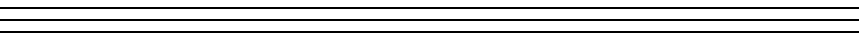

::::::::::::::: article
## Introduction {#sec:intro}

Time series segmentation, also known as change-point estimation in time
series, has become increasingly popular in various fields such as
statistics, bioinformatics, climate science, economics, finance, signal
processing, epidemiology, among many others. As a result, numerous
methods have been proposed to address different types of change-point
estimation problems under various settings. This in turn leads to the
development of many **R** packages for their implementation.

Here, we list some commonly used and influential packages for
change-point analysis in the **R** programming language. The package
**strucchange** [@zeileis2002struc] employs algorithms proposed by
[@zeileis2003cmpstat] to identify structural changes in linear
regression models. The package **changepoint** [@changepoint] provides
numerous methods for estimating change-points in a univariate time
series, containing the Binary Segmentation (BS) and the pruned exact
linear time (PELT) algorithm as described in [@Killick2012], and the
segment neighbourhoods algorithm in [@auger1989algorithms]. The package
**mosum** [@mosum2021] executes the moving sum (MOSUM) procedure
introduced by [@eichinger2018mosum] for univariate time series. It can
implement MOSUM with a single bandwidth parameter and also allows
multiple bandwidths via either bottom-up merging or localized pruning.
The package **cpss** [@wang2022cpss] focuses on change-point estimation
in various generalized linear models utilizing the sample-split strategy
proposed by [@zou2020consistent]. We note that there are also packages
targeting nonparametric distributional changes, e.g. the package **ecp**
[@ecp2014] and **cpm** [@cpm2015].

However, the aforementioned methods, as well as their implementation
packages, are subject to certain limitations when applied to
change-point estimation in multivariate time series. First, most
packages only provide functions to detect specific types of changes
(e.g. mean or variance). Although it may be possible to modify these
functions to cover other types of changes (e.g. quantiles), such a
generalization is usually not easy and requires non-trivial effort. This
means that for the same dataset, different methods or substantial
modifications to the existing codes may be required for estimating
different types of changes, which may incur inconvenience of
implementation for practitioners. Second, many packages implement
methods that assume temporal independence among data, which may not be
realistic in practice, and thus may suffer from issues such as false
positive detections.

Recently, [@zhao2021segmenting] have developed a new framework called
self-normalization based change-point estimation (SNCP) to overcome the
above limitations. The most appealing feature of SNCP is its versatility
as it allows for change-point estimation in a broad class of parameters
(such as mean, variance, correlation, quantile and their combinations)
in a unified fashion. The basic idea of SNCP is to augment the
conventional cumulative sum (CUSUM) statistics with the technique called
self-normalization (SN). SN is originally introduced by [@shao2010self]
for confidence interval construction of a general parameter in the
stationarity time series setting, and is later extended to change-point
testing by [@shaozhang2010testing]. It can bypass the issue of bandwidth
selection in the consistent long-run variance estimation. See
[@shao2015] for a review. SNCP is fully nonparametric, robust to
temporal dependence and applicable universally for various parameters of
interest for a multivariate time series. Furthermore, based on a series
of carefully designed nested local-windows, SNCP can isolate each true
change-point adaptively and achieves the goal of multiple change-point
estimation with respectable detection power and estimation accuracy.

In this paper, we introduce the **R** package
[**SNSeg**](https://CRAN.R-project.org/package=SNSeg) [@SNSeg2023],
which implements the SNCP framework in [@zhao2021segmenting] for
univariate and multivariate time series segmentation. This is achieved
by the functions `SNSeg_Uni()` and `SNSeg_Multi()`, respectively.
Another contribution of this paper is to extend the SNCP framework to
change-point estimation in the mean vector of a high-dimensional time
series. Since SNCP is only applicable to fixed-dimensional time series,
a new procedure based on U-statistics [@wang2022inference], termed as
SNHD, is proposed by modifying the original SNCP in
[@zhao2021segmenting]. The implementation of SNHD is available through
the function `SNSeg_HD()`. Graphical options are also allowed for
plotting the estimated change-points and associated test statistics.

The rest of the paper is organized as follows. We first provide the
background of SN based statistics and the SNCP/SNHD procedures for
change-point estimation in Section [2](#sec:SNCP){reference-type="ref"
reference="sec:SNCP"}. In Section [3](#sec:SNSeg){reference-type="ref"
reference="sec:SNSeg"}, we demonstrate the core functions of the package
**SNSeg** by various examples of change-point estimation problems.
Additional simulation results and comparison with existing packages are
provided in Section [4](#sec:additional){reference-type="ref"
reference="sec:additional"}. Section
[5](#sec:conclusion){reference-type="ref" reference="sec:conclusion"}
concludes.

## SNCP Framework {#sec:SNCP}

This section gives necessary statistical backgrounds of SNCP in
change-point estimation problems. We first demonstrate how an SN based
CUSUM test statistic works for estimating a single change-point, and
then introduce the nested local-window based SNCP algorithm for multiple
change-point estimation. The extension of SNCP to change-point
estimation in high-dimensional mean problem is also provided and we term
the related algorithm as SNHD. The issue of how to choose tuning
parameters is also discussed.

### Single Change-Point Estimation {#subsec:SNCPsingle}

Let $\{Y_t\}^n_{t=1}$ be a sequence of multivariate time series of
dimension $p$, which is assumed to be fixed for now. We aim to detect
whether there is a change-point in the quantities $\{\theta_t\}^n_{t=1}$
defined by $\theta_t = \theta(F_t)\in \mathbb{R}^d$, where $F_t$ denotes
the distribution function of $Y_t$, and $\theta(\cdot)$ is a general
functional such as mean, variance, auto-covariance, quantiles, etc. More
specifically, if there is no change-point, then
$$\begin{aligned}
\label{hypothesis_0}\theta_1=\cdots=\theta_n.
\end{aligned}   (\#eq:hypothesis-0)$$
Otherwise, we assume there is an unknown change-point
$k^*\in \{1,\cdots,n-1\}$ defined by
$$\begin{aligned}
\label{hypothesis_a}
	\theta_1=\cdots=\theta_{k^*}\neq \theta_{k^*+1}=\cdots=\theta_n,
\end{aligned}   (\#eq:hypothesis-a)$$
and our interest is to recover the location $k^*$.

The above setting allows for at most one change-point in
$\{\theta_t\}^n_{t=1}$. A commonly used statistic for testing the
existence of change-points is based on the CUSUM process, defined by
$$\label{cusum}
	D_n(k)=\frac{k (n-k)}{n^{3/2}}\left(\hat{\theta}_{1,k}-\hat{\theta}_{k+1,n}\right), ~~ k\in \{1,2,\cdots,n-1\},   (\#eq:cusum)$$
where for any $1\leq a<b\leq n$,
$\hat{\theta}_{a,b}=\theta(\hat{F}_{a,b})$ estimates the model parameter
with $\hat{F}_{a,b}$ being the empirical distribution of
$\{Y_t\}_{t=a}^b$. For example, when $\theta(\cdot)$ is the mean
functional, it can be shown that
$$D_n(k)=\frac{1}{\sqrt{n}}\sum_{t=1}^{ k}(Y_t-\Bar{Y}), \quad \Bar{Y}=n^{-1}\sum_{t=1}^n Y_t.$$

The CUSUM process in \@ref(eq:cusum) sequentially compares the estimates
before and after a time point $k$, and its norm is expected to attain
the maximum when $k=k^*$. Intuitively, if \@ref(eq:hypothesis-0) holds,
then $D_n(k)$ should fluctuate around zero; otherwise if
\@ref(eq:hypothesis-a) holds, then $\hat{\theta}_{1,k}$ and
$\hat{\theta}_{k+1,n}$ are consistent estimators for $\theta_1$ and
$\theta_n$, respectively at $k=k^*$, and the resulting contrast
$\|D_n(k^*)\|$ would be most informative about the change signal
$\Delta_n=\theta_{k^*+1}-\theta_{k^*}$. Therefore, it is natural to
estimate the change-point location via
$$\label{cusum_k}
	\tilde{k}=\arg\max_{k=1,\cdots,n-1}\|D_n(k)\|^2.   (\#eq:cusum-k)$$
However, analyzing the asymptotic distribution of CUSUM process
$\{D_n(\lfloor n r\rfloor)\}_{r\in[0,1]}$ for time series data is
difficult, as it typically depends on a nuisance parameter called
long-run variance [@newey1986simple; @andrews1991heteroskedasticity]. As
mentioned before, the estimation of long-run variance is quite
challenging even in a stationary time series, let alone the scenario
when a change-point is present.

To bypass this issue, [@zhao2021segmenting] propose to estimate the
change-point via the self-normalized version of \@ref(eq:cusum-k), i.e.
$$\label{sn_k}
	\hat{k} = \arg \max_{k=1,\cdots,n-1}T_n(k),\quad T_n(k)=D_n(k)'V^{-1}_n(k)D_n(k),   (\#eq:sn-k)$$
where
$$\label{V}
	V_n(k) =\sum_{i=1}^{k}\frac{i^2(k-i)^2}{n^2 k^2}(\hat{\theta}_{1,i}-\hat{\theta}_{i+1,k})^{\otimes 2} + \sum_{i=k+1}^{n}\frac{(n-i+1)^2(i-k-1)^2}{n^2(n-k)^2}(\hat{\theta}_{i,n}-\hat{\theta}_{k+1,i-1})^{\otimes 2},   (\#eq:V)$$
is defined as the self-normalizer of $D_n(k)$ with
$a^{\otimes 2}=aa^\top$ for a vector $a.$ The self-normalizer $V_n(k)$
is proportional to long run variance, which gets canceled out in the
limiting null distribution of $T_n(k)$. Thus, the testing/estimation of
a single change-point is completely free of tuning parameters.

In practice, we may not know whether the series $\{\theta_t\}_{t=1}^n$
contains a change-point or not, so a testing step is called for prior to
the estimation step. Formally speaking, given a pre-specified threshold
$K_n$, we declare the existence of a change-point when
$$SN_n:=\max_{k=1,\cdots,n-1}T_n(k) > K_n,$$
and then estimate the single change-point via \@ref(eq:sn-k). Otherwise,
if $SN_n$ is below the threshold $K_n$, we declare no change-points.

### Multiple Change-Point Estimation {#subsec:SNCPmultiple}

Section [2.1](#subsec:SNCPsingle){reference-type="ref"
reference="subsec:SNCPsingle"} introduces how SNCP works in the single
change-point setting. In this section, we further discuss its
implementation for multiple change-point estimation. Compared with the
single change-point setting, the main difficulty of multiple
change-point estimation lies in how to isolate one change-point from
another. In SNCP, this is achieved by a nested local-window approach.

We first introduce some notations. Assume there are $m_0 \geq 0$ unknown
number of change-points with $k_0=0<k_1<\cdots<k_{m_0}<n=k_{m_0+1}$ that
partition $Y_t$ into $m_0+1$ stationary segments with constant quantity
of interest $\theta^{(i)}$ in the $i$th segment, for $i=1,\cdots,m_0+1$.
In other words,
$$\theta_t = \theta^{(i)},~~ k_{i-1}+1 \leq t \leq k_i, ~\text{for}~ i = 1,\cdots,m_0+1.$$
Similar to the single change-point estimation framework, for
$1 \leq t_1 < k < t_2 \leq n$, we define an SN based test statistic
$$\label{eq:Tnt1kt2}
	T_n(t_1,k,t_2)=D_n(t_1,k,t_2)'V_n^{-1}(t_1,k,t_2)D_n(t_1,k,t_2),   (\#eq:Tnt1kt2)$$
where
$D_n(t_1,k,t_2) = \frac{(k-t_1+1)(t_2-k)}{(t_2-t_1+1)^{3/2}}(\hat{\theta}_{t_1,k}-\hat{\theta}_{k+1,t_2})$,
$V_n(t_1,k,t_2) = L_n(t_1,k,t_2) + R_n(t_1,k,t_2)$ and
$$\begin{aligned}
	L_n(t_1,k,t_2) = \sum_{i=t_1}^{k} \frac{(i-t_1+1)^2(k-i)^2}{(t_2-t_1+1)^2(k-t_1+1)^2}(\hat{\theta}_{t_1,i}-\hat{\theta}_{i+1,k})^{\otimes 2},   \\
	R_n(t_1,k,t_2) = \sum_{i=k+1}^{t_2} \frac{(t_2-i+1)^2(i-1-k)^2}{(t_2-t_1+1)^2(t_2-k)^2}(\hat{\theta}_{i,t_2}-\hat{\theta}_{k+1,i-1})^{\otimes 2}.
\end{aligned}$$
Here $T_n(t_1,k,t_2)$ plays the same role as $T_n(k)$ in \@ref(eq:sn-k),
except for the fact that it is defined on the subsample
$\{Y_t\}_{t=t_1}^{t_2}$. In other words, $T_n(t_1,k,t_2)=T_n(k)$ if
$t_1=1$ and $t_2=n$.

We now combine the SN framework with a nested local-window segmentation
algorithm in [@zhao2021segmenting] for multiple change-point estimation.
For each $k$, instead of using the global statistic $T_n(1,k,n)$ which
is computed with all observations, we compute a maximal SNCP test
statistic based on a collection of nested windows covering $k$.
Specifically, we fix a small trimming parameter $\epsilon \in (0,1/2)$
and define the window size $h=\lfloor{n\epsilon}\rfloor$. For each
$k=h,\cdots,n-h$, we define the nested local-window set $H_{1:n}(k)$ as
$$\label{window_set}
	H_{1:n}(k) = \{ (t_1,t_2)|t_1=k-j_1h+1,j_1=1,\cdots,\lfloor{k/h}\rfloor;t_2=k+j_2h,j_2=1,\cdots,\lfloor{(n-k)/h}\rfloor. \}   (\#eq:window-set)$$
Note that for $k<h$ and $k>n-h$, we have $H_{1:n}(k)=\emptyset$. In
Figure [1](#fig:local_window){reference-type="ref"
reference="fig:local_window"}, we plot a graphical illustration of the
nested local-windows in $H_{1:n}(k)$, where local windows are
constructed by combining every pair of the red left bracket
${\color{red}[}$ and the blue right bracket ${\color{blue}]}$.

![Figure 1: Graphical illustration of the nested local-windows in
$H_{1:n}(k)$. Each pair of the red left bracket ${\color{red}[}$ and the
blue right bracket ${\color{blue}]}$ represents a local-window in
$H_{1:n}(k)$. ](local_window.png){#fig:local_window width="80.0%"
alt="graphic without alt text"}

For each $k=1,\cdots,n-1$, based on its nested local-window set
$H_{1:n}(k)$, we define a maximal SN test statistic such that
$$\label{max_T}
	T_{1,n}(k) = \max_{(t_1,t_2) \in H_{1:n}(k)} T_n(t_1,k,t_2),   (\#eq:max-T)$$
where we set $\max_{(t_1,t_2) \in \emptyset} T_n(t_1,k,t_2) = 0$.

Intuitively, with a sufficiently small trimming $\epsilon$, the nested
local-window framework ensures that for a true change-point location,
say $k^*$, there exists some local window set denoted by $(t_1^*,t_2^*)$
containing $k^*$ as the only change-point. In other words, $k^*$ is
isolated by the interval $(t_1^*,t_2^*)$ so that the procedure in the
single change-point scenario as Section
[2.1](#subsec:SNCPsingle){reference-type="ref"
reference="subsec:SNCPsingle"} can be applied. This suggests that for at
least one pair of $(t_1,t_2)$ in $H_{1:n}(k)$, $T_n(t_1,k^*,t_2)$ is
large. The detection power is further enhanced by taking the maximum of
these test statistics.

Based on the maximal test statistic $T_{1,n}(k)$ and a pre-specified
threshold $K_n$, SNCP proceeds as follows. Starting with the full sample
$\{Y_t\}_{t=1}^{n}$, we calculate $T_{1,n}(k), k=1,\cdots, n.$ Given
that $\max_{k=1,\ldots,n} T_n(k)\leq K_n$, SNCP declares no
change-point. Otherwise, SNCP sets
$\widehat{k}=\arg\max_{k=1,\ldots,n} T_{1,n}(k)$ and we recursively
perform SNCP on the subsample $\{Y_t\}_{t=1}^{\widehat{k}}$ and
$\{Y_{t}\}_{t=\widehat{k}+1}^{n}$ until no change-point is declared.
Denote $W_{s,e}=\bigl\{(t_1,t_2)\big\vert s\leq t_1<t_2\leq e \bigl\}$
and $H_{s:e}(k)=H_{1:n}(k)\bigcap W_{s,e}$, which is the nested window
set of $k$ on the subsample $\{Y_{t}\}_{t=s}^e$. Define the subsample
maximal SN test statistic as
$T_{s,e}(k)=\max\limits_{(t_1,t_2)\in H_{s:e}(k)}T_n(t_1,k,t_2).$
Algorithm [1](#alg:one){reference-type="ref" reference="alg:one"} states
the formal description of SNCP in multiple change-points estimation.

We note that SNCP shares some similarity with binary segmentation (BS)
in the sense that both algorithms search for change-points in a
*sequential* fashion. However, they are also quite different. In
particular, the SN test statistic in SNCP is computed over a set of
nested local-windows instead of over a single interval. In contrast, in
the classical change-point literature, BS is usually coupled with a
global CUSUM statistic computed over the entire dataset $[1,n]$. As is
documented in the literature [@shao2010self], the main drawback of BS
with CUSUM statistic is its power loss under non-monotonic change, which
is caused by the use of the global CUSUM statistic coupled with the
sequential search. However, due to the use of the nested local-window
based SN test statistic, SNCP does not suffer from this power loss
phenomenon as long as $\epsilon$ is chosen to be smaller than the
minimum spacing between two change-points. On the other hand, due to the
sequential search nature, both SNCP and BS may encounter the multiple
testing problem. In addition, their power may be lesser compared to a
global search algorithm, such as dynamic programming or PELT, which is
again due to the sequential nature of the search algorithm.

As pointed out by a referee, another way of interpreting our method is
to view SNCP as the test statistic and BS as the search algorithm.
Therefore, the use of BS is not necessarily problematic when there are
multiple change-points in the data and it depends on what test
statistics BS is combined with. This points to a potentially interesting
research direction, which is to develop locally adaptive test statistic
that can accommodate multiple change-points and combine it with BS.

<figure id="alg:one">



<figcaption>Algorithm 1: SNCP procedures for multiple change-point
estimation</figcaption>
</figure>

### Multiple Change-Point Estimation for High-Dimensional Mean {#subsec:SNHD}

In this section, we modify the SNCP framework in Section
[2.2](#subsec:SNCPmultiple){reference-type="ref"
reference="subsec:SNCPmultiple"} to design a new algorithm called SNHD
for multiple change-point estimation in the mean vector of a
high-dimensional time series.

Different from the subsample test statistic $T_n(t_1,k,t_2)$ used in
SNCP for a low-dimensional time series, SNHD is designed based on the
high-dimensional U-statistic proposed by [@wang2022inference]. Given a
$p$-dimensional time series $\{Y_t\}_{t=1}^n$, we define the subsample
contrast statistic as
$$\label{eq:DnU}
	D_{n}^{U}(t_1,k,t_2)=\sum_{\substack{t_1\leq j_1,j_3\leq k \\ j_1\neq j_3}} \sum_{\substack{k+1\leq j_2,j_4\leq t_2 \\ j_2\neq j_4}} (Y_{j_1}-Y_{j_2})^{\top}(Y_{j_3}-Y_{j_4}).   (\#eq:DnU)$$
Note that $D_{n}^{U}(t_1,k,t_2)$ is a two-sample U-statistic estimating
the squared $L_2$-norm of the difference between the means of
$\{Y_t\}_{t=t_1}^k$ and $\{Y_t\}_{t=k+1}^{t_2}$ (up to some normalizing
constant), and therefore targets dense changes in high-dimensional mean.
The statistic in \@ref(eq:DnU) is only applicable to high-dimensional
time series with temporal independence, and in the presence of temporal
dependence, a trimming parameter needs to be introduced to alleviate the
bias due to serial dependence; see [@wang2022inference]. Define the
self-normalizer as
$$\label{eq:equation1}
	V_{n}^{U}(t_1,k,t_2)=\frac{1}{n}\Big[ \sum_{t=t_1+1}^{k-2} D_{n}^{U}(t_1,t,k)^2+\sum_{t=k+2}^{t_2-2}D_{n}^{U}(k+1,t,t_2)^2 \Big].   (\#eq:equation1)$$
The subsample SNHD test statistic at time point $k$, in the same spirit
as \@ref(eq:max-T), is defined as
$$\label{eq:equation2}
	T_{1,n}^{U}(k)=\max_{(t_1,t_2)\in H_{1:n}(k)}T_{n}^{U}(t_1,k,t_2),\quad  T_{n}^{U}(t_1,k,t_2)=D_{n}^{U}(t_1,k,t_2)^2/V_{n}^{U}(t_1,k,t_2),   (\#eq:equation2)$$
where $H_{1:n}(k)$ is the nested local-window set defined in
\@ref(eq:window-set). With a pre-specified threshold $K_n^{U}$, a
change-point is detected at
$\hat{k}=\arg\max_{k=1,\cdots,n}T_{1,n}^U(k)$ if
$\max_{k=1,\cdots,n}T_{1,n}^{U}(k)$ is above $K_n^U$. For multiple
change-point estimation, SNHD proceeds similarly as SNCP in Algorithm
[1](#alg:one){reference-type="ref" reference="alg:one"}.

### Choice of Trimming Parameter $\epsilon$ and Threshold $K_n$ {#subsec:SNtheory}

For practical implementation of SNCP and SNHD, there are still two
tuning parameters that one has to choose, namely the trimming parameter
$\epsilon$ and the change-point detection threshold $K_n$. The choice of
$\epsilon$ reflects one's belief of the minimum (relative) spacing
between two consecutive change-points. This is usually set to be a small
constant such as 0.05, 0.10, 0.15. The theoretical validity of our
approach requires the minimum spacing between change-points to be of
order $O(n)$, and opting for an overly small value of $\epsilon$ may
result in sub-optimal performance in finite sample as the nested
local-window may not contain sufficient observations. On the other hand,
an overly large value of $\epsilon$ may increase the potential risk of
under-estimating change-points if $\epsilon$ is larger than the minimum
spacing between two true change-points. In practice, we recommend using
0.05 as a default value when no prior knowledge of minimum spacing
between change-points is available.

A nice feature of using SN is that the limiting distributions for SNCP
or SNHD under the no change-point scenario are pivotal and furthermore
reflect the impact of the choice of $\epsilon$, see Theorem 3.1 in
[@zhao2021segmenting], and Section S.2.9 in [@zhao2021v1], respectively.
Since $K_n$ and $K_n^U$ are used to balance one's tolerance of type-I
and type-II errors, this implies that we can choose $K_n$ and $K_n^U$ as
the $q\times 100\%$ quantiles (i.e. the critical value) of the limiting
null distribution with $q$ typically set as 0.9, 0.95, 0.99. The
threshold value $K_n$ also increases with the dimension of the quantity
$\theta$, and we refer to Table 1 in [@zhao2021segmenting] for details.
In the **SNSeg** package, we offer users a wide range of $\epsilon$ and
$q$ to choose from. Details are given in the following section.

In Section [4.1](#subsec:execution-time){reference-type="ref"
reference="subsec:execution-time"}, we further conduct a sensitivity
analysis, which suggests that the performance of SNCP in general is
robust w.r.t. the choice of $(\epsilon,K_n)$.

## The SNSeg Package {#sec:SNSeg}

In this section, we introduce the functions within the **SNSeg** package
for multiple change-point estimation. In particular, `SNSeg_Uni()` in
Section [3.1](#subsec:SNSegUni){reference-type="ref"
reference="subsec:SNSegUni"} implements the SNCP procedure of
change-point estimation for a univariate time series with changes in a
single or multiple parameters, such as mean, variance,
auto-correlations, quantiles or even their combinations. It can also be
implemented for detecting change-points in other quantities, with a
user-defined function as input. The function `SNSeg_Multi()` in Section
[3.2](#subsec:SNSegMulti){reference-type="ref"
reference="subsec:SNSegMulti"} utilizes the SNCP algorithm for
change-point estimation in mean or covariance matrix of a multivariate
time series. In Section [3.3](#subsec:SNSegHD){reference-type="ref"
reference="subsec:SNSegHD"}, the function `SNSeg_HD()` estimates
change-points in mean of a high-dimensional time series using the SNHD
procedure. In addition to these major functions for change-point
estimation, we further introduce `max_SNsweep()` in Section
[3.4](#subsec:teststatistic){reference-type="ref"
reference="subsec:teststatistic"}, which helps obtain the SN test
statistics and create a segmentation plot based on the output of the
above functions. Followed by the graphical options, the function
`SNSeg_estimate()` generates parameter estimates within each segment
separated by the estimated change-points.

### SNCP for Univariate Time Series {#subsec:SNSegUni}

For a univariate time series, change-point estimation in a single or
multiple functionals can be implemented through the function
`SNSeg_Uni()`. This function is also capable of detecting change-points
associated with the change in correlation between bivariate time series.
The **R** code is given as:

``` r
SNSeg_Uni(ts, paras_to_test, confidence = 0.9, grid_size_scale = 0.05,
          grid_size = NULL, plot_SN = TRUE, est_cp_loc = TRUE)
```

It takes the following input arguments.

-   `ts`: Input time series $\{Y_t\}_{t=1}^n$, i.e., a univariate time
    series expressed as a numeric vector with length $n$. However, when
    the argument `paras_to_test` is specified as `bivcor`, which stands
    for the correlation between bivariate time series, the input `ts`
    must be an $n\times 2$ matrix.

-   `paras_to_test`: The parameters that SNCP aims to examine, which are
    presented as a string, a number, a combination of both, or a
    user-defined function that defines a specific functional. Available
    options of `paras_to_test` include:

    -   `"mean"`: The function performs change-point estimation on the
        mean of the time series.

    -   `"variance"`: The function performs change-point estimation on
        the variance.

    -   `"acf"`: The function performs change-point estimation on the
        autocorrelation of order 1.

    -   `"bivcor"`: The function performs change-point estimation on the
        bivariate correlation.

    -   A numeric quantile value within the range (0,1): The function
        performs change-point estimation on the quantile level specified
        by the numeric value.

    -   A vector containing characters `"mean"`, `"variance"`, `"acf"`,
        and one or more numerical quantile levels. Therefore,
        `SNSeg_Uni()` is capable of estimating change-points in either a
        single parameter or a combination of multiple parameters.

    -   A user-defined `R` function that returns a numeric value.
        Existing functions in **R** such as $\texttt{mean}()$ and
        $\texttt{var}()$ can also be used. This option provides
        additional flexibility for the users to define a specific
        functional that they are interested in and is not covered by our
        built-in options. The input argument `paras_to_test` should
        possess the form of `function(ts){...}`.

-   `confidence`: A numeric value that specifies the confidence level of
    the SN test. Available choices of confidence levels contain `0.9`,
    `0.95`, `0.99`, `0.995` and `0.999`. It automatically obtains the
    threshold ($K_n$, the critical value) corresponding to the input
    confidence level. The default value of `confidence` is set at 0.9.

-   `grid_size_scale`: A numeric value that specifies the trimming
    parameter $\epsilon$ and only in use if `grid_size = NULL`.
    Available choices include 0.05, 0.06, 0.07, 0.08, 0.09, 0.1, 0.11,
    0.12, 0.13, 0.14, 0.15, 0.2, 0.25, 0.3, 0.35, 0.4, 0.45 and 0.5. The
    default value of `grid_size_scale` is 0.05.

    -   In the function, any input less than 0.05 will be set to exactly
        0.05 and similarly, any input greater than 0.5 will be set to
        0.5. In such case, a warning that \"Detected the grid_size_scale
        is greater than 0.5\" or \"less than 0.05\" will be generated.

-   `grid_size`: A numeric value that specifies the local window size
    $h$. It should be noted that $h=\lfloor n\times\epsilon\rfloor$,
    i.e.,
    `grid_size`$= \lfloor n\times \texttt{grid\_size\_scale}\rfloor$. By
    default, the value of `grid_size` is set to NULL, and the function
    computes the critical value $K_n$ using the argument
    `grid_size_scale`. However, users have the option to set the
    `grid_size` manually, in which case the function computes the
    corresponding `grid_size_scale` via dividing `grid_size` by $n$, and
    then determines the critical value using this computed
    `grid_size_scale` value.

-   `plot_SN`: A Boolean value that specifies whether to plot the time
    series or not. The default setting is TRUE.

-   `est_cp_loc`: A Boolean value that specifies whether to plot a red
    vertical line for each estimated change-point. The default setting
    is TRUE.

The function `SNSeg_Uni()` provides users with flexibility by allowing
them to select parameter types that they want to target at.
Additionally, users can specify the window size or choose an appropriate
value for $\epsilon$ to achieve the desired theoretical critical value.
However, if $\epsilon$ happens to be larger than the true minimum
spacing between change-points, the function carries the risk of missing
some of them. This limitation also applies to the functions
`SNSeg_Multi()` and `SNSeg_HD()`. In practice, we suggest
$\epsilon=0.05$ with no prior knowledge. If the calculated trimming
parameter $\epsilon$ by any of the two arguments falls within the range
\[0.05, 0.5\], but is not in the pre-specified set of available values
for `grid_size_scale`, the function performs a linear interpolation by
identifying two nearest `grid_size_scale` that are below and above the
calculated $\epsilon$ and then computes the weighted average of the
corresponding critical values $K_n$. The resulting interpolated value is
used as the final critical value for the SN test.

When called, `SNSeg_Uni()` returns an S3 object of class `SNSeg_Uni`
containing the following entries.

-   `ts`: The input time series `ts`.

-   `paras_to_test`: The parameter(s) examined in change-point
    estimation.

-   `grid_size`: A numeric value of the local window size $h$.

-   `SN_sweep_result`: A list of $n$ matrices where the $k$th matrix
    stores the SN test statistic $T_n(t_1,k,t_2)$ computed for all
    $(t_1,t_2)\in H_{1:n}(k)$ as in \@ref(eq:max-T). In particular, the
    $k$th matrix consists of four columns: 1. the SN test statistic
    $T_n(t_1,k,t_2)$ computed via \@ref(eq:Tnt1kt2); 2. the location
    $k$; 3. the left endpoint $t_1$; and 4. the right endpoint $t_2$.

-   `est_cp`: A numeric vector containing the locations of the estimated
    change-points.

-   `confidence`: The confidence level of the SN test.

-   `critical_value`: The critical value of the SN test given $\epsilon$
    and the confidence level.

It is worth noting that the output of the function `SNSeg_Uni()` can
serve as an input of the function `max_SNsweep()` (to be described in
Section [3.4](#subsec:teststatistic){reference-type="ref"
reference="subsec:teststatistic"}) to generate a segmentation plot for
SN test statistics, and the same also holds for functions
`SNSeg_Multi()` and `SNSeg_HD()`. Additionally, S3 objects of class
`SNSeg_Uni` are supported by `print()`, `summary()` and `plot()`
functions. The S3 function `print()` can be used to display the
estimated change-points, `summary()` presents information such as
change-point locations and other details listed in the output of
`SNSeg_Uni()`, and `plot()` facilitates the generation of time series
segmentation plots, providing an alternative option to the argument
`plot_SN = TRUE` for users. These functions can also be applied to
outputs of functions `SNSeg_Multi()` and `SNSeg_HD()`, which will be
introduced below.

To illustrate, in the following, we present examples demonstrating
multiple change-point estimation in both single and multiple parameters.

**Example 1: variance change in univariate time series**

We start with the example of the change-point model (V1) in Section
S.2.5 in the supplement of [@zhao2021segmenting], where two variance
changes occur at $k=400$ and 750, respectively. Specifically,
$$(\mathrm{V} 1): \quad Y_t= \begin{cases}0.5 Y_{t-1}+\epsilon_t, & t \in[1,400], \\ 0.5 Y_{t-1}+2 \epsilon_t, & t \in[401,750], \\ 0.5 Y_{t-1}+\epsilon_t, & t \in[751,1024],\end{cases}$$
where $\epsilon_t$ is a sequence of i.i.d. $N(0,1)$ random variables.

We set `grid_size_scale` at $\epsilon=0.05$, which corresponds to a
`grid_size` of $\lfloor 0.05*1024\rfloor=51$, and set `confidence` at
$90\%$. Subsequently, we visualize the input time series by setting
`plot_SN` as `TRUE`, and generate an SN test statistics segmentation
plot using the `max_SNsweep()` function (to be introduced in Section
[3.4](#subsec:teststatistic){reference-type="ref"
reference="subsec:teststatistic"}).

``` r
# Generate model (V1)
set.seed(7)
ts <- MAR_Variance(reptime = 1, type = "V1") # generate model (V1)
par(mfcol = c(2, 1), mar = c(4, 2.5, 2.5, 0.5))

# SNCP in the change of variance
result1 <- SNSeg_Uni(ts, paras_to_test = "variance", confidence = 0.9,
                     grid_size_scale = 0.05, grid_size = NULL, plot_SN = TRUE, 
                     est_cp_loc = TRUE)

# Segmentation plot for SN-based test statistics
SNstat1 <- max_SNsweep(result1, plot_SN = TRUE, est_cp_loc = TRUE, critical_loc = TRUE)
```

The estimated locations of the change-points $\widehat{\mathbf k}$, the
local window size $h$, and the critical value $K_n$ used can be accessed
using the following commands:

``` r
result1$est_cp
[1] 411 748
result1$grid_size
[1] 51
result1$critical_value
[1] 141.8941
```

The estimated change-point locations are $\hat{k}=411$ and 748 with a
local window size of $h=51$ and critical value of $K_n=141.8941$ when
setting the trimming parameter to $\epsilon=0.05$ and the confidence
level to $90\%$. It is clear that the estimated change-points align
closely with the true change-points, which demonstrates the accuracy of
the SNCP procedure.

The above outputs can also be obtained via the S3 methods `summary()`
and `print()`, and are shown in the following commands:

``` r
# S3 method: print
print(result1)
#> The detected change-point location(s) are 411,748
# S3 method: summary
summary(result1)
#> There are 2 change-points detected at 90th confidence level based on the change in 
#> the single variance parameter.
#> 
#> The critical value of SN-based test is 141.8941189
#> 
#> The detected change-point location(s) are 411,748 with a grid_size of 51
```

Figure [2](#fig:SN-uni-single-var){reference-type="ref"
reference="fig:SN-uni-single-var"} displays segmentation plots for the
input time series and the SN test statistics regarding the changes in
univariate variance. It reveals that the SN statistics associated with
the detected change-points surpass the critical value, and can be deemed
as plausible changes. The upper plot (SN segmentation plot of the time
series) can also be achieved through the command `plot(result1)`.

{#fig:SN-uni-single-var width="100%"
alt="graphic without alt text"}

In addition to the summary statistics and SN based segmentation plots,
the function `SNSeg_estimate()` provides parameter estimates within each
segment that is separated by the estimated change-points. To illustrate
this, we apply the following command to the same example.

``` r
SNSeg_estimate(SN_result = result1)

# output
$variance
[1] 1.438164 5.065029 1.341965

attr(,"class")
[1] "SNSeg_estimate"
```

We can also manually specify the value of `grid_size` to calculate the
critical value $K_n$ and estimate change-points. The function
`SNSeg_Uni()` is applied to the same time series, with the only
difference being that the window size $h$ is set to 102, which
corresponds to `grid_size_scale=0.1`, instead of `NULL`. We further set
`confidence` at 90%. The estimated change-points and the critical value
$K_n$ can be obtained using the following commands:

``` r
# SNCP in the change of variance with a different grid_size and confidence level
result2 <- SNSeg_Uni(ts, paras_to_test = "variance", confidence = 0.9, 
                     grid_size_scale = 0.05, grid_size = 102, plot_SN = FALSE,
                     est_cp_loc = FALSE)
result2$est_cp
[1] 411 744
result2$grid_size
[1] 102
result2$critical_value
[1] 111.1472
```

Note that since `grid_size` is not `NULL`, the argument
`grid_size_scale = 0.05` will be ignored by the function `SNSeg_Uni()`.
Interestingly, though we use quite different window size $h=102$, the
estimated change-points are almost the same as before, which suggests
the robustness of SNCP. The critical value differs from the previous
example, due to the variation in the window size $h$ (or equivalently
$\epsilon$). In other words,the threshold $K_n$ used in SNCP reflects
the influence of the chosen window size $h$ (or $\epsilon$), which makes
the change-point detection more robust and accurate.

**Example 2: second moment change in univariate time series with a
user-defined function**

In addition to the built-in parameter choices, the function
`SNSeg_Uni()` allows users to customize the input parameter using their
own function.

For instance, if users are interested in examining changes in the second
moment, they can create a function that yields the mean square as a
numeric value and designate this function to the input argument for
`paras_to_test`.

To illustrate, we consider the model (V1) from **Example 1**. The
function `SNSeg_Uni()` is utilized with the default input configuration,
except that we now assess the change in the second moment of the data.
The specified `paras_to_test`, along with the execution time and the
resultant estimated change-points, can be acquired using the following
commands:

``` r
# define a function for paras_to_test
# change in 2nd moment
second_moment <- function(ts){
  result <- mean(ts^2)
  return(result)
}
start.time <- Sys.time()
result.general <- SNSeg_Uni(ts, paras_to_test = second_moment, confidence = 0.9,
                            grid_size_scale = 0.05, grid_size = NULL,
                            plot_SN = FALSE, est_cp_loc = TRUE)
end.time <- Sys.time()
as.numeric(difftime(end.time,start.time)) # execution time (in minutes)
result.general$est_cp # change-point estimates    

# Output 
> as.numeric(difftime(end.time,start.time)) # execution time (in minutes)
[1] 1.083779
> result.general$est_cp # change-point estimates
[1] 411 749
```

As evident from the above results, SNCP detected two change-points at
$\hat{k}=411,749$ when examining changes in the second moment. The
estimated change-points are close to the locations of the true
change-point locations, 400 and 750, respectively.

To illustrate the computational efficiency of the built-in choices of
`paras_to_test` (i.e., `"mean"`, `"variance"`, etc.) another example is
given to detect changes in variance but using the user-defined
functional `var()`, which is then compared with the built-in option
`paras_to_test = "variance"` in terms of the execution time. The
comparison result can be accessed using the following commands:

``` r
start.time <- Sys.time()
result1 <- SNSeg_Uni(ts, paras_to_test = "variance", confidence = 0.9,
                     grid_size_scale = 0.05, grid_size = NULL, plot_SN = TRUE,
                     est_cp_loc = TRUE)
end.time <- Sys.time()
difftime(end.time,start.time) # built-in parameter time

# user defined variance
paras_to_test <- function(ts){
  var(ts)
}
start.time <- Sys.time()
result.general <- SNSeg_Uni(ts, paras_to_test = paras_to_test, confidence = 0.9,
                            grid_size_scale = 0.05, grid_size = NULL,
                            plot_SN = FALSE, est_cp_loc = TRUE)
end.time <- Sys.time()
difftime(end.time,start.time) # general functional parameter time
c(result1$est_cp,result.general$est_cp) 

# output
> difftime(end.time,start.time) # built-in parameter time
Time difference of 4.702668 secs
> difftime(end.time,start.time) # general functional parameter time
Time difference of 1.154525 mins
> result1$est_cp # built-in parameter estimate 
[1] 411 748
> result.general$est_cp # general functional estimate
[1] 411 748
```

Both methods can accurately estimate change-points, but utilizing the
built-in parameter significantly reduces computation time compared to
using user-defined function. The former method optimizes efficiency by
leveraging the linear structure of variance calculation and is
implemented via dynamic programming with the `cumsum()` function. In
contrast, the latter method, employing a user-defined function, does not
utilize the linear structure of variance (since it takes a general
functional as an input which may not have a specific structure) and
instead recursively calculates all subsample variances, leading to
redundant calculations and increased computational time.

**Example 3: multiple-parameter change in univariate time series**

In addition to identifying changes in a single parameter, `SNSeg_Uni()`
also allows for estimating change-points by simultaneously combining
information across multiple parameters. This can be done by modifying
the `paras_to_test` argument. For example, users can specify
`paras_to_test = c("mean", "acf", 0.6, 0.9)` to simultaneously detect
changes in mean, autocorrelation, 60% and 90% quantile of the input time
series.

We consider the simulated univariate time series of model (MP1) in
Section 4.4 of [@zhao2021segmenting], where the true change-points are
located at $k=333$ and 667. In particular,
$$(\mathrm{MP} 1): Y_t= \begin{cases}X_t, & t \in[1,333] \\ F^{-1}\left(\Phi\left(X_t\right)\right), & t \in[334,667] \\ X_t, & t \in[668,1000],\end{cases}$$
where $\{X_t\}_{t=1}^n$ follows an AR(1) process with
$X_t=0.2 X_{t-1}+\sqrt{1-\rho^2}\epsilon_t$, $\epsilon_t$ is a sequence
of i.i.d. $N(0,1)$ random variables, $\Phi(\cdot)$ denotes the CDF of
$N(0,1)$, and $F(\cdot)$ denotes a mixture of a truncated normal and a
generalized Pareto distribution (GPD). In particular,
$F(x)=0.5F_1(x)+0.5F_2(x)$, where $F_1(x)=2\Phi(x), x\leq 0$ is a
standard normal distribution truncated at 0 and
$F_2(x)=1-(1+\xi(x-\mu)/\sigma)_+^{-1/\xi}$ is a GPD distribution with
the location parameter $\mu=0$, scale parameter $\sigma=2$ and tail
index $\xi=0.125$. Note that $F^{-1}(q)=\Phi^{-1}(q)$ for $q\leq 0.5$
and $F^{-1}(q)\neq \Phi^{-1}(q)$ for $q>0.5.$

To showcase the versatility of SNCP, we first detect change-points based
on the 90% quantiles, where we set the `grid_size_scale` at $0.1$ and
`confidence` at 0.9.

``` r
set.seed(7)
require(truncnorm)
require(evd)
mix_GauGPD <- function(u, p, trunc_r, gpd_scale, gpd_shape) {
    # function for generating a mixture of truncated normal + GPD
    indicator <- (u < p)
    rv <- rep(0, length(u))
    rv[indicator > 0] <- qtruncnorm(u[indicator > 0] / p, a = -Inf, b = trunc_r)
    rv[indicator <= 0] <- qgpd((u[indicator <= 0] - p) / (1 - p), loc = trunc_r, 
                               scale = gpd_scale, shape = gpd_shape)
    return(rv)
}

# Generate model (MP1)
n <- 1000
cp_sets <- c(0, 333, 667, 1000)
rho <- 0.2
ts <- MAR(n, 1, rho) * sqrt(1 - rho ^ 2) # generate AR(1)
trunc_r <- 0
p <- pnorm(trunc_r)
gpd_scale <- 2
gpd_shape <- 0.125
ts[(cp_sets[2] + 1):cp_sets[3]] <-
    mix_GauGPD(u = pnorm(ts[(cp_sets[2] + 1):cp_sets[3]]), p, trunc_r, gpd_scale, gpd_shape)

# SNCP in the change of 90% quantile
result_q9 <- SNSeg_Uni(ts, paras_to_test = c(0.9), confidence = 0.9, 
                       grid_size_scale = 0.1, plot_SN = FALSE, est_cp_loc = FALSE)
# Output
result_q9$est_cp
[1] 332 667
result_q9$grid_size
[1] 100
result_q9$critical_value
[1] 110.9993
```

As observed, the estimated change-points take place at $\hat{k}=332$ and
667, which are close to the locations of the true change-points. We can
further use SNCP to examine if there is any change in the variance for
the same time series.

``` r
# SNCP in the change of variance
result_v <- SNSeg_Uni(ts, paras_to_test = c('variance'), confidence = 0.9, 
                      grid_size_scale = 0.1, plot_SN = FALSE, est_cp_loc = FALSE)
# Output
result_v$est_cp
[1] 329 665
result_v$grid_size
[1] 100
result_v$critical_value
[1] 110.9993
```

The estimated change-points in variance take place at $\hat{k}=329$ and
665, which are close to the estimated change-points in the 90% quantile.
To reconcile the two sets of estimated change-points, we can further
examine changes in variance the 90% quantile simultaneously using SNCP,
which gives a final estimate of 331 and 667.

``` r
# SNCP in the change of variance and 90% quantile
result_q9v <- SNSeg_Uni(ts, paras_to_test = c(0.9, 'variance'), confidence = 0.9, 
                        grid_size_scale = 0.1, plot_SN = TRUE, est_cp_loc = TRUE)
# Output
result_q9v$est_cp
[1] 331 667
result_q9v$grid_size
[1] 100
result_q9v$critical_value
[1] 167.4226
```

For practitioners, how to further identify which component(s) in
"paras_to_test" changes is an interesting question. A natural strategy
is as follows. For each detected change-point $\hat{\tau}$, we first
construct a local window centered around it,
e.g. $[\hat{\tau}-\epsilon n,\hat{\tau}+\epsilon n]$, where the local
window should only contain a single change-point (with high
probability). Within the local window, we then apply `SNSeg_Uni`() for
each parameter in "`paras_to_test`" and test if it changes.

### SNCP for Multivariate Time Series {#subsec:SNSegMulti}

The SN based change-point estimation for multivariate time series can be
implemented via the function `SNSeg_Multi()`. In particular,
SNSeg_Multi() allows change-point detection in multivariate means or
covariance matrix of the input time series. The **R** code is given as:

``` r
SNSeg_Multi(ts, paras_to_test = "mean", confidence = 0.9, grid_size = NULL, 
            grid_size_scale = 0.05, plot_SN = FALSE, est_cp_loc = TRUE)
```

The input arguments of `confidence`, `grid_size`, `grid_size_scale` and
`est_cp_loc` are the same as those in the function `SNSeg_Uni()`, and
the difference lies in `ts`, `plot_SN` and `paras_to_test`.

-   `ts`: Input time series $\{Y_t=(Y_{t1},\cdots,Y_{tp})\}_{t=1}^n$ as
    a matrix, i.e., a multivariate time series represented as a matrix
    with $n$ rows and $p$ columns, where each column is a univariate
    time series. The dimension $p$ for `ts` should be at least 2.

-   `paras_to_test`: A string that specifies the parameter that SNCP
    aims to examine. Available options of `paras_to_test` include:

    -   `"mean"`: The function performs change-point estimation on the
        mean of the multivariate time series.

    -   `"covariance"`: The function performs change-point estimation on
        the covariance matrix of the multivariate time series.

-   `plot_SN`: A Boolean value that specifies whether to generate time
    series segmentation plot or not. `SNSeg_Multi` returns a plot for
    each individual time series if `plot_SN = TRUE`.

When necessary, the function `SNSeg_Multi()` applies the same linear
interpolation rule as `SNSeg_Uni()` to determine the critical value for
the SN test. When called, `SNSeg_Multi()` returns an S3 object of class
`SNSeg_Multi` comprising the `grid_size`, `SN_sweep_result`, `est_cp`,
`confidence` and `critical_value`, which have already been described in
the context of the function `SNSeg_Uni()`. It also generates plots for
each time series when `plot_SN = TRUE`. Similar to `SNSeg_Uni`, S3
objects of class `SNSeg_Multi` are also supported by `print()`,
`summary()` and `plot()` functions.

**Example 4: mean change in multivariate time series**

We consider model (M2) in Section 4.2 of [@zhao2021segmenting], which is
generated by
$$(\mathrm{M} 2):  Y_t= \begin{cases}-3 / \sqrt{5}+X_t, & t \in[1,75],[526,575], \\ 0+X_t, & t \in[76,375],[426,525],[576,1000], \\ 3 / \sqrt{5}+X_t, & t \in[376,425] .\end{cases}$$
where $X_t$ is a 5-dimensional VAR(1) process with
$X_t = 0.5X_{t-1} + \epsilon_t$, and $\epsilon_t$ is a sequence of
i.i.d. $N(0, \mathbf I_5)$ random vectors.

The five true change-points occur at $k=75,375,425,525$ and 575. We
analyze it by examining the change in multivariate means using
`grid_size_scale` at $0.05$ and `confidence` at 0.9. The code
implementation is as follows:

``` r
# Generate model (M2)
set.seed(7)
d <- 5
n <- 1000
cp_sets <- c(0, 75, 375, 425, 525, 575, 1000)
mean_shift <- c(-3, 0, 3, 0, -3, 0) / sqrt(d)
rho_sets <- 0.5
sigma_cross <- list(diag(d))
ts <- MAR_MTS_Covariance(n, 1, rho_sets, cp_sets = c(0, n), sigma_cross)[[1]] # generate VAR(1)
no_seg <- length(cp_sets) - 1

for (index in 1:no_seg) { # Mean shift
    tau1 <- cp_sets[index] + 1
    tau2 <- cp_sets[index + 1]
    ts[, tau1:tau2] <- ts[, tau1:tau2] + mean_shift[index]
}

par(mfrow=c(2,3))
# SNCP in the change of multivariate mean
result_multimean <- SNSeg_Multi(ts, paras_to_test = "mean", confidence = 0.9,
                                grid_size_scale = 0.05, plot_SN = TRUE,
                                est_cp_loc = TRUE)

# Output
result_multimean$est_cp
[1] 80 373 423 526 576
result_multimean$grid_size
[1] 50
result_multimean$critical_value
[1] 415.8649
```

The estimated change-points are $\hat{k}=80,373,423,526$ and 576 with a
window size $h=50$ and a critical value of 415.8649. This result again
closely aligns with the true change-point locations. The output of
`SNSeg_Multi()` also allows for the use of function `max_SNsweep()` for
plotting the segmentation of the SN test statistics. The code
implementation is as follows:

``` r
SNstat_multimean <- max_SNsweep(result_multimean, plot_SN = TRUE, est_cp_loc = TRUE,
                                critical_loc = TRUE)
plot(ts[1, ], main = 'SN Segmentation Plot for the First Time Series')
abline(v = result_multimean$est_cp, col = 'red')
```

Figure [3](#fig:SN-multi-mean){reference-type="ref"
reference="fig:SN-multi-mean"} plots the associated SN test statistics
and estimated change-points. For illustration, we also plot the first
time series $\{Y_{t,1}\}_{t=1}^n$ along with the estimated
change-points.

{#fig:SN-multi-mean
width="100%" alt="graphic without alt text"}

### SNHD for High-Dimensional Time Series {#subsec:SNSegHD}

The function `SNSeg_HD()` is specifically designed to estimate
change-points in the mean functional of high-dimensional time series.
The **R** code is given as:

``` r
SNSeg_HD(ts, confidence = 0.9, grid_size_scale = 0.05, grid_size = NULL,
         plot_SN = FALSE, est_cp_loc = TRUE, ts_index = c(1:5)
```

Its input arguments are the same as the function `SNSeg_Multi()` except
for the followings:

-   `ts`: The dimension of the input time series `ts` should be at least
    10 to ensure a decent finite sample performance of the asymptotic
    theory.

-   `plot_SN`: A Boolean value that specifies whether to return a plot
    for individual time series.

-   `ts_index`: A positive integer or a vector of positive integers that
    specifies which individual time series to plot given
    `plot_SN = TRUE`. The default value is `c(1:5)`, and under the
    default setting, the function will plot the first 5 time series.

When called, `SNSeg_HD()` returns an S3 object of class `SNSeg_HD`
containing `grid_size`, `SN_sweep_result`, `est_cp`, `confidence` and
`critical_value` that are similar to those described by `SNSeg_Uni()`
and `SNSeg_Multi()`. It also generates a plot for the time series
specified by the argument `ts_index` when `plot_SN = TRUE`.
Additionally, S3 objects of class `SNSeg_HD` are supported by `plot()`,
`summary()` and `print()` functions. Similar to the core function
`SNSeg_HD()`, the `plot()` method incorporates the option `ts_index`,
enabling users to visualize the desired time series.

**Example 5: mean change in high-dimensional time series**

We generate high-dimensional time series data based on the following
simulation setting:
$$\begin{aligned}
	(\mathrm{HD}):	Y_t= \mu_{i} + X_t, ~~ \tau_{i-1}+1\leq t\leq \tau_i, ~~ i=1,2,\cdots, 6,
\end{aligned}$$
where $X_t$ is a sequence of i.i.d. $N(0, I_{100})$ random vectors and
the five change-points are evenly located at
$(\tau_1,\tau_2,\cdots,\tau_5)=(100,200,\cdots,500),$ with $\tau_0=0$
and $\tau_6=600$. We set $\mu_1=\mathbf{0}_{100}$,
$\theta_i=\mu_{i+1}-\mu_i$,
$\theta_i=(-1)^i (\mathbf{1}_5^\top, \mathbf{0}_{95}^\top)^\top \times \sqrt{4/5}$
for $i =1,2,\cdots,5.$ We apply `SNSeg_HD()` to analyze this time series
with `grid_size_scale` set at $0.05$ and `confidence` set at 0.9.

``` r
# Generate model (HD)
set.seed(7)
p <- 100
n <- 600
cp_sets <- c(0, 100, 200, 300, 400, 500, 600)
mean_shift <- c(0, sqrt(4 / 5), 0, sqrt(4 / 5), 0, sqrt(4 / 5))
ts <- matrix(rnorm(n * p, 0, 1), n, p)
no_seg <- length(cp_sets) - 1
for (index in 1:no_seg) { # Mean shift
    tau1 <- cp_sets[index] + 1
    tau2 <- cp_sets[index + 1]
    ts[tau1:tau2, 1:5] <- ts[tau1:tau2, 1:5] + mean_shift[index]
}

# SNHD for high-dimensional means
par(mfrow=c(2,2))
result_hd <- SNSeg_HD(ts, confidence = 0.9, grid_size_scale = 0.05,
                      plot_SN = TRUE, est_cp_loc = TRUE, 
                      ts_index = c(1:4))

# Output
result_hd$est_cp
[1]  105 203 302 397 500
```

Figure [4](#fig:SN-HD-high-dimensional){reference-type="ref"
reference="fig:SN-HD-high-dimensional"} plots the first four individual
time series and the estimated change-points as requested by the argument
`ts_index = c(1:4)`. As observed in the example, `SNSeg_HD()`
successfully detects all the change-points in this high-dimensional time
series. This result demonstrates the effectiveness and feasibility of
using SN algorithms for change-point detection in high-dimensional time
series.

{#fig:SN-HD-high-dimensional width="100%"
alt="graphic without alt text"}

### Generate the SN Test Statistics  {#subsec:teststatistic}

As discussed in Section [2](#sec:SNCP){reference-type="ref"
reference="sec:SNCP"}, the success of SNCP and SNHD depends on the local
SN test statistic $T_{1:n}(k)$ and $T_{1,n}^U(k)$ for $k=1,\cdots,n$. To
facilitate further analysis, the function `maxSNsweep()` allows the
users to compute and plot these test statistics along with the
identified change-points. The **R** code is given as:

``` r
max_SNsweep(SN_result, plot_SN = TRUE, est_cp_loc = TRUE, critical_loc = TRUE)
```

It takes the following arguments:

-   `SN_result`: A list generated as the output of the functions
    `SNSeg_Uni()`, `SNSeg_Multi()`, or `SNSeg_HD()`.

-   `plot_SN`: A Boolean value that specifies whether to return an SN
    test statistics segmentation plot.

-   `est_cp_loc`: A Boolean value that specifies whether to plot a red
    vertical line for each estimated change-point.

-   `critical_loc`: A Boolean value that specifies whether to plot a
    blue horizontal line for the critical value $K_n$ or $K_n^U$ used in
    the SN test.

When called, `max_SNsweep()` returns the maximal SN test statistic,
namely $T_{1,n}(k)$ or $T_{1,n}^U(k)$, for each time point $k$. In
addition, it can provide a segmentation plot based on these SN test
statistics. Users are able to determine whether to mark the change-point
locations and the critical value on the plot.

As an illustration of `max_SNsweep()`, suppose we apply `SNSeg_Uni()` to
estimate change-points and save the output as `result1`. The following
code can be used to generate the SN test statistic $T_{1:n}(k)$ for each
$k=1,\cdots,n$ and in addition the segmentation plot, which is already
given in the lower panel of Figure
[2](#fig:SN-uni-single-var){reference-type="ref"
reference="fig:SN-uni-single-var"}.

``` r
SNstat1 <- max_SNsweep(result1, plot_SN = TRUE, est_cp_loc = TRUE, critical_loc = TRUE)
```

As delineated in Section [3.1](#subsec:SNSegUni){reference-type="ref"
reference="subsec:SNSegUni"},
[3.2](#subsec:SNSegMulti){reference-type="ref"
reference="subsec:SNSegMulti"} and
[3.3](#subsec:SNSegHD){reference-type="ref" reference="subsec:SNSegHD"},
functions `SNSeg_Uni()`, `SNSeg_Multi()`, and `SNSeg_HD()` serve as the
foundation for the `SNSeg_estimate()` function, which facilitates the
computation of parameter estimates for individual segments separated by
the identified change-points. When called, `SNSeg_estimate()` returns an
S3 object of class `"SNSeg_estimate"` containing the parameter estimate
of each segment. The **R** code is given as:

``` r
    SNSeg_estimate(SN_result)
```

It takes the following argument:

-   `SN_result`: an S3 object with class `"SNSeg_Uni"`, `"SNSeg_Multi"`
    or `"SNSeg_HD"`. The input of `SN_result` must be the output from
    one of the functions in `SNSeg_Uni()`, `SNSeg_Multi()` and
    `SNSeg_HD()`.

We refer back to **Example 1** for an illustration of its use.

## Additional Numerical Results {#sec:additional}

This section provides additional numerical results of **SNSeg**. In
Section [4.1](#subsec:execution-time){reference-type="ref"
reference="subsec:execution-time"}, we conduct a sensitivity analysis of
`SNSeg_Uni()` across various input parameters. Section
[4.2](#subsec:comparison-of-methods){reference-type="ref"
reference="subsec:comparison-of-methods"} compares with other popular
change-point estimation packages. In Section
[4.3](#subsec:single-vs-multiple){reference-type="ref"
reference="subsec:single-vs-multiple"}. we demonstrate the usefulness of
employing multiple parameters and contrasts it with detecting changes in
a single parameter. We also provide brief explanations and
recommendations on the selection of quantiles.

In this section, we measure the accuracy of change-point estimation by
counting the difference between the number of estimated change-points
and true values $\hat{m}-m_o$, the Hausdorff distance $d_H$, and
adjusted Rand index (ARI). The Hausdorff distance is defined as follows.
Denote the set of true change-points as $\tau_o$ and the set of
estimated change-points as $\hat{\tau}$, we define
$d_1(\tau_o,\hat{\tau})= \max_{\tau_1\in\hat{\tau}} \min_{\tau_2\in \tau_o} |\tau_1-\tau_2|$
and
$d_2(\tau_o,\hat{\tau})= \max_{\tau_1\in\tau_o} \min_{\tau_2\in\hat{\tau}} |\tau_1-\tau_2|$,
where $d_1(\tau_o,\hat{\tau})$ measures the over-segmentation error of
$\hat{\tau}$ and $d_2(\tau_o,\hat{\tau})$ measures the
under-segmentation error of $\hat{\tau}$. The Hausdorff distance is
$d_H(\tau_o, \hat{\tau})= \max \{d_1(\tau_o,\hat{\tau}),d_2(\tau_o,\hat{\tau})\}$.
The ARI is originally proposed in [@morey1984measurement] as a measure
of similarity between two different partitions of the same observations
for evaluating the accuracy of clustering. Under the change-point
setting, we calculate the ARI between partitions of the time series
given by $\hat{\tau}$ and $\tau_o$. Ranging from 0 to 1, a higher ARI
indicates more coherence between the two partitions by $\hat{\tau}$ and
$\tau_o$ and thus more accurate change-point estimation. We further note
that all numerical results in this section are implemented on a laptop
with 1.7 GHz 12th Gen Intel Core i7 CPU and 64 GB of RAM.

### Sensitivity analysis of SNCP {#subsec:execution-time}

We first examine the performance variations resulted from choices of the
trimming parameter $\epsilon$ and threshold $K_n$ (reflected by the
confidence level $q$) when multiple change-points exist. Specifically,
we generate the data according to model (SA):
$$(\mathrm{SA}): n=1200, \rho=0.5,  Y_t= \begin{cases}
0+X_t, & t \in  [1, 150], [301, 450], [601, 750], [901, 1050]
\\ \delta+X_t, & t \in  [151, 300], [451, 600], [751, 900], [1051, 1200],
\end{cases}$$
where $\{X_t\}_{t=1}^n$ is generated from a unit-variance AR(1) process
with $X_t=  X_{t-1}/2+\sqrt{3}\epsilon_t/2$, and $\{\epsilon_t\}$ is
*i.i.d.* $N(0,1)$. We vary $\delta\in\{\sqrt{3},\sqrt{6}\}$ to compare
the results under low and high signal-to-noise ratios.

:::: center
::: {#table:sensitivity-analysis}
  ------------------------------------------------------------------------------------------------------------------------------------------------------
                                                           $\hat{m}-m_o$                                                                      
  ------------ ---------------- ----------- ------ ------ --------------- ----- ----- ---------- ----------- ---------- ---------- ---------- ----------
    $\delta$    $(q,\epsilon)$   $\leq -3$   $-2$   $-1$        $0$        $1$   $2$   $\geq 3$      ARI       $d_1$      $d_2$      $d_H$     time(s)

   $\sqrt{3}$     0.90, 0.05         0        1      89         882        27     1       0       **0.933**     1.12       2.18       2.18       1.59

                  0.95, 0.05         0        26    175         788        11     0       0         0.918       1.01       3.38       3.38       1.59

                  0.90, 0.08         0        33    195         772         0     0       0         0.911       0.97       3.65       3.65       0.59

                  0.95, 0.08        16        85    302         597         0     0       0         0.880       0.92       5.92       5.92       0.59

                  0.90, 0.10         0        4      58       **938**       0     0       0         0.931       1.02     **1.75**   **1.75**     0.36

                  0.95, 0.10         0        24    120         856         0     0       0         0.919       0.99       2.74       2.74       0.36

                  0.90, 0.12         0        4     130         866         0     0       0       **0.933**     0.77       2.17       2.17       0.24

                  0.95, 0.12         1        14    159         826         0     0       0         0.926       0.76       2.69       2.69       0.24

                  0.90, 0.15       1000       0      0           0          0     0       0         0.002     **0.00**    49.98      49.98     **0.13**

                  0.95, 0.15       1000       0      0           0          0     0       0         0.001     **0.00**    50.01      50.01     **0.13**

   $\sqrt{6}$     0.90, 0.05         0        0      4          964        31     1       0       **0.965**     0.77     **0.60**     0.77       1.60

                  0.95, 0.05         0        0      11         968        21     0       0       **0.965**     0.66       0.79       0.79       1.60

                  0.90, 0.08         0        0      16         984         0     0       0         0.963       0.58       0.77       0.77       0.67

                  0.95, 0.08         0        2      48         950         0     0       0         0.958       0.57       1.17       1.17       0.67

                  0.90, 0.10         0        0      2        **998**       0     0       0         0.961       0.62       0.65     **0.65**     0.37

                  0.95, 0.10         0        0      8          992         0     0       0         0.961       0.62       0.72       0.72       0.37

                  0.90, 0.12         0        0      34         966         0     0       0         0.958       0.59       0.95       0.95       0.25

                  0.95, 0.12         0        0      34         966         0     0       0         0.958       0.59       0.95       0.95       0.25

                  0.90, 0.15       1000       0      0           0          0     0       0         0.000     **0.00**    50.01      50.01     **0.16**

                  0.95, 0.15       1000       0      0           0          0     0       0         0.000     **0.00**    50.01      50.01     **0.16**
  ------------------------------------------------------------------------------------------------------------------------------------------------------

  : (#tab:T1) Sensitivity analysis of $\epsilon$ and $q$ for time
  series model (SA) with $\delta\in\{\sqrt{3},\sqrt{6}\}$. $\delta$:
  magnitude of change in (SA); $q$: confidence level of SNCP;
  $\epsilon$: trimming parameter (the value of `grid_size_scale`);
  $\hat{m}-m_o$: the difference between the estimated number and the
  true number of change-points; $ARI$: Average Adjusted Rand Index;
  $d_1$: Average over-segmentation error; $d_2$: Average
  under-segmentation error; $d_H$: Average Hausdorff distance. The
  average time is presented in units of seconds. The optimal result is
  bolded for each comparison metric.
:::
::::

We vary $\epsilon \in \{0.05, 0.08, 0.10, 0.12, 0.15\}$ and
$q\in \{0.90, 0.95\}$, and study how they affect the performance of
SNCP. The numerical result over 1000 replications is summarized in Table
[1](#tab:T1){reference-type="ref"
reference="table:sensitivity-analysis"} for reader's convenience. From
the table, we find that as long as the window size $\epsilon$ is smaller
than the minimum spacing $\epsilon_o=0.125$, the performance of SNCP is
quite robust and stable across the choices of $\epsilon$ and $q$.
However, SNCP fails to detect changes with the window size
$\epsilon=0.15>\epsilon_o$, highlighting the importance of selecting an
appropriate value for $\epsilon$. Furthermore, we find that the
execution time increases with diminishing values of $\epsilon$, while no
discernible disparity in execution time is found across various
thresholds.

We also briefly study the execution time of SNCP using `SNSeg_Uni()`
across multiple model parameters including mean, variance,
autocorrelation (ACF), 90% quantile, and a multi-parameter scenario with
both variance and 90% quantile. For model (V1) from **Example 1** and
(MP1) from **Example 3**, Table [2](#tab:T2){reference-type="ref"
reference="table:execution-time-parameter"} presents the averaged
execution time over 100 replications of `SBSeg_Uni()`. The execution
time of SNCP varies in the order of mean, variance, ACF, and quantile,
progressing from the lowest to the highest. Notably, the multi-parameter
scenario requires a longer runtime compared to the single-parameter
cases.

:::: center
::: {#table:execution-time-parameter}
  ----------------------------------------------------------------------
   Model   mean   variance   ACF    quantile   multi-parameter        
  ------- ------ ---------- ------ ---------- ----------------- -- -- --
    V1     1.75     5.86     8.83    17.80          31.83             

    MP1    1.68     5.82     8.52    16.56          31.06             
  ----------------------------------------------------------------------

  : (#tab:T2) Execution time (in seconds) of SNCP for different
  parameters when applied to the models (V1) and (MP1) averaged over 100
  replications.
:::
::::

### Comparison: SNCP vs BinSeg, PELT, MOSUM and ECP {#subsec:comparison-of-methods}

We next compare SNCP with BinSeg, PELT, MOSUM and ECP in terms of the
accuracy of change-point estimates, especially when data exhibits
temporal dependence. BinSeg and PELT are implemented by the package
**changepoint** (the functions `cpt.mean()` and `cpt.var()`,
respectively), MOSUM utilizes the package **mosum** (the function
`mosum()`), and ECP adopts the package **ecp** (the function
`e.divisive()`). For SNCP, we set the trimming parameter $\epsilon=0.05$
and confidence level $q=0.9$, adhering to its default configuration. The
input parameters for other methods are also chosen as default values. In
particular, the default thresholds for MOSUM and ECP are based on
critical values of asymptotic null distribuions under confidence level
0.95; while that for BinSeg and PELT are non-asymptotic. For the
bandwidth parameter `G` that requires manual selection in the function
`mosum()` for MOSUM, we let $\texttt{G=100}$. This choice aligns with
the recommendation in Section 3.5 from [@eichinger2018mosum] that `G`
should be half the minimal distance between two change-points. In the
case of model (M) below, this minimum distance is 200. The details can
be found in the Appendix.

We first compare the performance of all methods under the no
change-point scenario, where the time series is stationary with no
change-point. We simulate a stationary univariate time series
$\{Y_t\}_{t=1}^{n=1000}$ from a unit-variance AR(1) process
$Y_t=\rho Y_{t-1}+\sqrt{1-\rho^2}\epsilon_t$ where $\{\epsilon_t\}$ is
*i.i.d.* $N(0,1)$. We vary $\rho\in\{0,0.4,0.7\}$ to investigate the
robustness of SNCP (and other methods) against false positives (i.e.
type-I error) under different levels of temporal dependence.

The experiment is repeated 1000 times for each $\rho$, and the results
are documented in Table [3](#tab:T3){reference-type="ref"
reference="table:comparison-no-change-point"}. In general, under their
respective default settings, all methods provide satisfactory type-I
error control when there is no temporal dependence ($\rho=0$) whereas
MOSUM and ECP are prone to produce false positives when dependence is
moderate ($\rho=0.4$). Under strong temporal dependence ($\rho=0.7$),
all tests exhibit high false-positive rates and SNCP is the most robust
option.

:::: center
::: {#table:comparison-no-change-point}
  ---------------------------------------------------------------------------------------------------------------
   $n=1000$               $\rho=0$                        $\rho=0.4$                        $\rho=0.7$  
  ----------- ---------- ---------- ---------- --------- ------------ ---------- --------- ------------ ---------
   $\hat{m}$     $0$        $1$      $\geq 2$     $0$        $1$       $\geq 2$     $0$        $1$       $\geq2$

     SNCP        910         82         8         884        111          5       **744**      210         46

    BinSeg     **1000**      0          0       **963**       35          2         558        240         202

     PELT      **1000**      0          0         943         30          27        152         66         782

     MOSUM       954         43         3         292        330         378         7          16         977

      ECP        952         24         24        145         72         783         0          0         1000
  ---------------------------------------------------------------------------------------------------------------

  : (#tab:T3) Number of change-points detected by each method when
  there is no change-point. A higher value of $\rho$ indicates a
  stronger temporal dependence. The optimal method is bolded for each
  $\rho$.
:::
::::

We further examine their power performance under model (M):
$$(\mathrm{M}): n=1000, \rho\in\{0,0.4,0.7\},  Y_t= \begin{cases}
X_t, & t \in[1,200], [401,600], [801,1000]\\ 2+X_t, & t \in[201,400], [601,800] .
\end{cases}$$
Here $\{X_t\}_{t=1}^{n}$ is generated from a unit-variance AR(1) process
that $X_t=\rho X_{t-1}+\sqrt{1-\rho^2}\epsilon_t$, and $\{\epsilon_t\}$
is *i.i.d.* $N(0,1)$. The true change-points occur at 200, 400, 600 and
800. Table [4](#tab:T4){reference-type="ref"
reference="table:comparison-of-methods"} summarizes the results over
1000 replications.

From the table, we observe that in the absence of temporal dependence
($\rho=0$), all the methods perform well, with PELT being the most
effective. It should be noted that, due to the use of self-normalizer,
SNCP may experience some decrease in estimation accuracy compared to
other methods. When the dependence is moderate at $\rho=0.4$, SNCP
demonstrates robust performance, while other competing methods tend to
overestimate the number of change-points. With stronger dependence
($\rho=0.7$), SNCP exhibits the best performance based on the
distribution of $\hat{m}-m_o$ along with $d_H$ and ARI, while all the
other methods severely overestimate the number of change-points. In
terms of the computational speed, we find that BinSeg, PELT, and MOSUM
are more efficient than SNCP. Consequently, we recommend employing SNCP
for change-point estimation when data exhibit moderate or strong
dependence, while opting for BinSeg or PELT in cases with no or weak
dependence.

Here, we only compare the results under mean shifts, and we refer the
interested readers to [@zhao2021segmenting] for results in other
settings. Broadly speaking, our findings indicate that the SNCP exhibits
greater robustness to temporal dependence compared to competing methods.
However, it's worth noting that other methods might demonstrate superior
performance in instances where temporal dependence is weak. For
instance, BinSeg, PELT, and MOSUM are adept at handling frequent
change-points with fast computational speed.

We note that the unsatisfactory performance associated with BinSeg,
PELT, MOSUM and ECP in the presence of strong temporal dependence is to
be expected since these methods are developed for time series with
temporal independence. To accommodate temporal dependence, some of these
above-mentioned methods offer choices to modify their built-in penalty,
which may avoid the over-segmentation and under-segmentation issues with
some proper choice of tuning parameters. In addition, we further
acknowledge that there exist several R packages such as **AR1seg**
[@levy2014package], **EnvCpt** [@killick2021package] or **fastcpd**
[@li2024fastcpd], which contain change-point detection methods allowing
for temporal dependence.

:::: center
::: {#table:comparison-of-methods}
  --------------------------------------------------------------------------------------------------------------------------------------------------
                                                     $\hat{m}-m_o$                                                                        
  ------------ ---------- ----------- ------ ------ --------------- ----- ----- ---------- ----------- ----------- ---------- ----------- ----------
     $\rho$      Method    $\leq -3$   $-2$   $-1$        $0$        $1$   $2$   $\geq 3$      ARI        $d_1$      $d_2$       $d_H$     time (s)

    $\rho=0$      SNCP         0        0      0          991         9     2       0         0.983       4.13        3.42       4.13        6.85

                 BinSeg        0        0      0          961        39     0       0         0.988       3.83        3.26       3.83      **0.01**

                **PELT**       0        0      0        **999**       1     0       0       **0.994**   **1.73**    **1.69**   **1.73**      0.11

                 MOSUM         0        0      0          993         7     0       0         0.992       3.09        2.09       3.09        0.00

                  ECP          0        0      0          937        56     7       0         0.984       7.04        2.24       7.04       46.85

   $\rho=0.4$   **SNCP**       0        0      0        **972**      27     1       0         0.956     **8.10**      5.73     **8.10**      5.78

                 BinSeg        0        0      0          744        256    0       0         0.963       15.16       5.60       15.16     **0.00**

                  PELT         0        0      0          862        109   29       0       **0.964**     14.03     **3.81**     14.03       0.05

                 MOSUM         0        0      0          779        199   20       2         0.959       38.19       4.81       38.19     **0.00**

                  ECP          0        0      0          170        184   217     429        0.828       87.05       4.14       87.05      54.62

   $\rho=0.7$   **SNCP**       0        2      59       **865**      69     4       1       **0.934**   **17.83**    23.69     **29.74**     6.01

                 BinSeg        0        0      0          201        799    0       0         0.930       55.11      11.30       55.11     **0.00**

                  PELT         0        0      0          104        162   195     539        0.867       99.50       8.95       99.50       0.06

                 MOSUM         0        0      0          209        414   281      96        0.909       126.3      11.06       126.3     **0.00**

                  ECP          0        0      0           1          0     1      998        0.537       146.4     **8.31**     146.4       92.2
  --------------------------------------------------------------------------------------------------------------------------------------------------

  : (#tab:T4) Performance of different methods for the time series
  model (M). $\rho$: The strength of temporal dependence; $\hat{m}-m_o$:
  the difference between the estimated number and the true number of
  change-points; $ARI$: Average Adjusted Rand Index; $d_1$: Average
  over-segmentation error; $d_2$: Average under-segmentation error;
  $d_H$: Average Hausdorff distance. The average time is presented in
  units of seconds. The optimal result is bolded for each comparison
  metric.
:::
::::

### Single vs Multiple Parameters {#subsec:single-vs-multiple}

As outlined in Section [3.1](#subsec:SNSegUni){reference-type="ref"
reference="subsec:SNSegUni"}, the function `SNSeg_Uni()` enables users
to examine changes in either a single parameter or multiple parameters.
We first provide a simple example which shows that using multiple
parameters may not necessarily be significantly inferior to using a
single parameter, in terms of change-point estimates. This observation
holds true even when the change solely stems from the single parameter.
For example, we consider model (M) with $\rho=0.4$ from Section
[4.2](#subsec:comparison-of-methods){reference-type="ref"
reference="subsec:comparison-of-methods"}, which is solely driven by
mean changes.

:::: center
::: {#table:comparison-of-multiple-parameters}
  -----------------------------------------------------------------------------------------------------------------------------------------------------
                                                          $\hat{m}-m_o$                                                                      
  ------- -------------------- ----------- ------ ------ --------------- ----- ----- ---------- ----------- ---------- ---------- ---------- ----------
   Model         Method         $\leq -3$   $-2$   $-1$        $0$        $1$   $2$   $\geq 3$      ARI       $d_1$      $d_2$      $d_H$     time (s)

   \(M\)        **SNM**             0        0      0        **972**      28     0       0       **0.969**   **8.54**   **6.40**   **8.54**   **1.49**

           $\text{SNMQ}_{20}$       0        0      3          958        39     0       0         0.967       9.71       7.33      10.25       28.6

                  SNMV              0        0      3          934        62     1       0         0.963      12.53       8.06      13.11       18.2
  -----------------------------------------------------------------------------------------------------------------------------------------------------

  : (#tab:T5) Performance of SNCP based on a single parameter and
  multiple parameters for (M). Beginning with \"SN\",
  $\text{M, V, Q}_{20}$ represent mean, variance and 20% quantile,
  respectively. $\hat{m}-m_o$: the difference between the estimated
  number and the true number of change-points; $ARI$: Average Adjusted
  Rand Index; $d_1$: Average over-segmentation error; $d_2$: Average
  under-segmentation error; $d_H$: Average Hausdorff distance. The
  average time is presented in units of seconds. The optimal result is
  bolded for each comparison metric.
:::
::::

Table [5](#tab:T5){reference-type="ref"
reference="table:comparison-of-multiple-parameters"} summarizes the
numerical results over 1000 replications. For clarity, we specify these
cases using names beginning with \"SN\". For instance, $\text{SNM}$
denotes SNCP for estimating changes in a single mean, $\text{SNMQ}_{20}$
represents SNCP for estimating changes in both mean and the 20%
quantile, and $\text{SNMV}$ targets the mean and variance changes
simultaneously. From the table, we find that all three methods yield
rather similar results, albeit mild overestimation by SNMV. This
indicates that introducing additional parameters does not necessarily
hinder the performance of SNCP.

We then provide another example that examining multiple parameters can
outperform examining a single parameter. Specifically, we compare the
performance of SNCP based on a single variance or quantile (90% or 95%)
and their multi-parameter combination under the setting (MP1) from
**Example 3**. Recall that for (MP1), the change originates from the
upper quantiles and the actual change-points take place at 333 and 667.
The numerical result of (MP1) over 1000 replications is taken from Table
5 of [@zhao2021segmenting], and summarized in Table
[6](#tab:T6){reference-type="ref"
reference="table:single-vs-multiple-mp1"} here for readers' convenience.
Similar to Table [5](#tab:T5){reference-type="ref"
reference="table:comparison-of-multiple-parameters"}, we specify the
parameter settings using names beginning with \"SN\". For instance,
$\text{SNV}$ denotes the change in a single variance, $\text{SNQ}_{90}$
represents the change in the 90% quantile, and $\text{SNQ}_{90}\text{V}$
targets the variance and 90% quantile changes simultaneously. We observe
that for (MP1), $\text{SNQ}_{90}$ and $\text{SNQ}_{95}$ performs well
with a high estimation accuracy since the change of (MP1) originates
from upper quantiles. By integrating changes in variance and quantiles,
improvements are observed across estimation accuracy, ARI, and Hausdorff
distance $d_H$. Notably, the combined-parameter setting
$\text{SNQ}_{90,95}\text{V}$ achieves the optimal performance compared
to all the other parameter configurations.

:::: center
::: {#table:single-vs-multiple-mp1}
  --------------------------------------------------------------------------------------------------------------------------------------------------------
                                                                        $\hat{m}-m_o$                                                           
  ------- ---------------------------------- ----------- ------ ------ --------------- ----- ----- ---------- ----------- ---------- ---------- ----------
   Model                Method                $\leq -3$   $-2$   $-1$        $0$        $1$   $2$   $\geq 3$      ARI       $d_1$      $d_2$      $d_H$

   (MP1)          $\text{SNQ}_{90}$               0        10    132         805        50     3       0         0.839       3.25       7.26       7.85

                  $\text{SNQ}_{95}$               0        5     100         820        73     2       0         0.868       3.16       5.70       6.62

                     $\text{SNV}$                 0        2     110         832        54     2       0         0.869       2.45       5.47       6.06

                 $\text{SNQ}_{90,95}$             0        3      82         850        62     3       0         0.878       3.01       4.88       5.67

              $\text{SNQ}_{90}\text{V}$           0        0      56         869        70     5       0         0.891       3.04       3.95       4.77

              $\text{SNQ}_{95}\text{V}$           0        2      64         861        68     5       0         0.889     **2.92**     4.30       5.14

           **$\text{SNQ}_{90,95}\text{V}$**       0        2      48       **882**      66     2       0       **0.894**     2.95     **3.79**   **4.58**
  --------------------------------------------------------------------------------------------------------------------------------------------------------

  : (#tab:T6) Performance of SNCP based on the change in a single
  parameter and multiple parameters for (MP1). $Q_{90},Q_{95},V$
  represent the change in the 90th and the 95th quantile as well as the
  variance respectively. $\hat{m}-m_o$: the difference between the
  estimated number and the true number of change-points; $ARI$: Average
  Adjusted Rand Index; $d_1$: Average over-segmentation error; $d_2$:
  Average under-segmentation error; $d_H$: Average Hausdorff distance.
  The optimal result is bolded for each comparison metric.
:::
::::

Overall, our findings illustrate that employing multiple parameters does
not always diminish performance of SNCP compared to using a single
parameter, even when the change is primarily driven by a single
parameter. Nevertheless, it is important to recognize that incorporating
prior information on change types can enhance the effectiveness of SNCP.

Another aspect that is of interest is the choice of quantile for SNCP.
As delineated in Section [3.1](#subsec:SNSegUni){reference-type="ref"
reference="subsec:SNSegUni"}, the `SNSeg_Uni()` function provides users
with the capability to assess variations in either a single or multiple
quantiles. Particularly for practitioners, an appropriate selection of
the quantile becomes pivotal when the true quantile that may change
remains unknown. Table [6](#tab:T6){reference-type="ref"
reference="table:single-vs-multiple-mp1"} for model (MP1) also offers
valuable insights in this regard. Given that (MP1) experiences changes
in upper quantiles, the usage of the 90% or the 95% quantile yields
satisfactory results. Furthermore, the application of both 90% and 95%
quantiles in combination results in an improvement compared to utilizing
a single quantile.

Consequently, in cases where the specific quantile that is changing is
unknown, we recommend users visually inspect their time series for
signals such as peaks or troughs to assess the potential range of
quantiles where changes might occur, and further employ multiple
quantiles within this range for more robust change-point estimation. In
other words, if one knows that the change happens in a specific range of
the distribution (for example, the upper tail), we recommend he/she
target several quantiles in this range (for example, targeting 90%, 95%)
simultaneously, instead of picking only one quantile. In practice, it is
seldom that only a particular quantile changes, while the other quantile
levels near this quantile exhibit no change. Hence, testing several
quantiles together can boost power and estimation accuracy to the best
degree.

## Summary {#sec:conclusion}

In this paper, we introduced the **R** package **SNSeg**, which provides
implementations of the SN-based procedures for change-points estimation
in univariate, multivariate, and high-dimensional time series. We
described the main functions of the package, namely `SNSeg_Uni()`,
`SNSeg_Multi()`, `SNSeg_HD()`, which enable the detection of
change-points in a single or multiple parameter(s) of the time series.
Furthermore, we presented examples demonstrating the usage of the
package, including visualizing both the time series data and the
segmentation plots of the SN test statistics, as well as the computation
of parameter estimates within the segments that are separated by the
estimated change-points.

The **SNSeg** package offers a comprehensive set of tools to effectively
identify change-points in time series data. We hope the availability of
**SNSeg** on CRAN can help facilitate the analysis and understanding of
temporal patterns and dynamics for both researchers and practitioners.

## Appendix: Further details of comparison settings {#appendix-further-details-of-comparison-settings .unnumbered}

We provide a full description of the R packages, functions as well as
settings utilized in Table [3](#tab:T3){reference-type="ref"
reference="table:comparison-no-change-point"} and
[4](#tab:T4){reference-type="ref"
reference="table:comparison-of-methods"} in the comparison between SNCP
and other change-point detection methods. We note that the same function
with the same setting is used across all comparisons for each method.

For SNCP, we use the `SNSeg_Uni()` function from the **SNSeg** package,
selecting a confidence level of `confidence = 0.9` and setting the
trimming parameter to $\epsilon = 0.05$ for detecting a change in a
single mean. For BinSeg and PELT, we apply the `cpt.mean()` function
from the **changepoint** package. The settings for `cpt.mean()` are
consistent for both BinSeg and PELT, with `penalty = ’MBIC’` (the
Modified Bayes Information Criterion penalty in [@zhang2007modified]),
`Q = 5` (the maximum number of change-points to search for),
`minseglen = 1` (the minimum number of observations between two
change-points), and `test.stat = ’Normal’` (assuming a normal
distribution for the data). The only difference is that we vary the
input parameter `method` from `BinSeg` to `PELT`.

For the MOSUM method, we use the `mosum()` function from the **MOSUM**
package, employing the both-sided MOSUM variance estimator.
Specifically, we set `G = 100` for the moving sum bandwidth and
`eta = 0.4` based on the criterion argument `criterion = "eta"`,
indicating a minimal mutual distance of changes calculated as
$G \times \eta = 40$. For the other key input arguments, we set the
length of the right summation window `G.right = G`,
`var.est.method = "mosum"` to specify the MOSUM-based variance estimator
from equation (10) of [@mosum2021], and `alpha = 0.1` for a significance
level of 10%.

Finally, for ECP, we utilize the `e.divisive()` function from the
**ecp** package. The ECP method is executed with a significance level of
`sig.lvl = 0.05`, a maximum of `R = 199` random permutations for each
iteration of the permutation test, and a minimum distance between two
change-points set to `min.size = 30`. The number of change-point
locations to estimate is set to be `k = NULL` such that all significant
estimated change-points are returned.
:::::::::::::::
