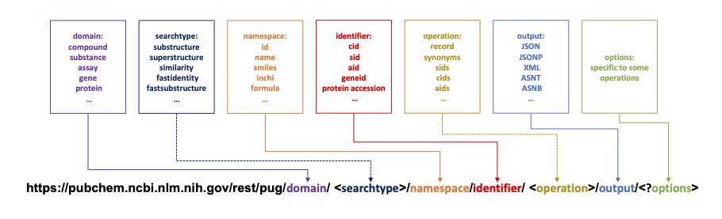
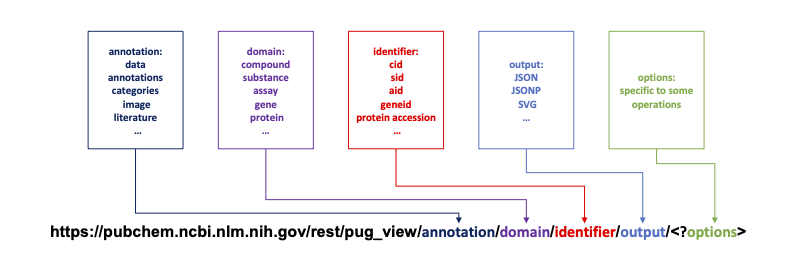

```{r setup, include=FALSE}
knitr::opts_chunk$set(echo = FALSE, warning = FALSE, message = FALSE)
library(PubChemR)
```

# Introduction

Chemical data serves as a foundational element in a wide spectrum of scientific research fields, from pharmacology and medicinal chemistry to materials science and environmental studies. The ability to access, query, and manipulate chemical information efficiently is essential for researchers and practitioners who rely on data-driven methodologies to advance their work. PubChem, hosted by the National Center for Biotechnology Information (NCBI), stands as one of the largest publicly available repositories of chemical data, offering free access to an abundance of information on chemical substances, compounds, and biological activities [@wang2009pubchem;@chen2009pubchem;@li2010pubchem;@wang2012pubchem;@kim2016pubchem].

The \CRANpkg{PubChemR} package for R provides a comprehensive interface to the PubChem database, allowing users to programmatically retrieve and utilize chemical data within the R environment [@Korkmaz2024]. This integration facilitates a more streamlined workflow for scientists who use R for statistical analysis, data visualization, and computational modeling. By utilizing the \CRANpkg{PubChemR} package, users can perform a variety of tasks such as searching for chemical substances, fetching compound properties, and obtaining assay data for bioactivity analysis.

Among the extensive range of R packages used in scientific research, \CRANpkg{webchem} [@szocs2020webchem] and \BIOpkg{ChemmineR} [@cao2008chemminer] have been important for accessing chemical databases. \BIOpkg{ChemmineR} provides tools for cheminformatics in R, enabling detailed handling and analysis of chemical data. \CRANpkg{webchem} supports access to multiple chemical databases. Additionally, other notable packages like \CRANpkg{rcdk}, \BIOpkg{ChemmineOB}, \BIOpkg{BridgeDbR}, \BIOpkg{RMassBank}, and \BIOpkg{rgoslin} offer robust functionalities for chemical data manipulation and analysis. The \CRANpkg{rcdk} package interfaces with the Chemistry Development Kit (CDK), providing molecular structure parsing and descriptor calculation [@guha2007chemical]. \BIOpkg{ChemmineOB} interfaces with OpenBabel for chemical format conversions and molecular property calculations [@horan2024]. \BIOpkg{BridgeDbR} facilitates identifier mapping across biological databases, enhancing data integration [@leemans2018]. \BIOpkg{RMassBank} supports the creation and handling of mass spectrometry databases, crucial for compound identification [@stravs2013automatic]. \BIOpkg{rgoslin} ensures accurate lipid nomenclature in lipidomics studies [@kopczynski2020goslin].

However, when it comes to direct interaction with the PubChem database, these packages have limitations, often requiring users to work through complex API documentation or use additional tools. To address these issues, \CRANpkg{PubChemR}, designed specifically for the PubChem database, complements the functionalities of these packages. It simplifies accessing chemical data from PubChem, using functions that make API interactions more straightforward. Users can retrieve data easily by calling these functions with the right parameters. Unlike \CRANpkg{webchem}, which works with various databases, and \BIOpkg{ChemmineR}, which covers a wide range of cheminformatics tasks, \CRANpkg{PubChemR} is focused solely on PubChem, allowing for more efficient and targeted data interactions.

Here, we introduce \CRANpkg{PubChemR}, detailing its functionality, design principles, and potential use cases. We will demonstrate how \CRANpkg{PubChemR} can be utilized to enhance research workflows and provide examples of its application in real-world scenarios. By the end of this paper, readers will be equipped with the knowledge to integrate \CRANpkg{PubChemR} into their data analysis toolkit, unlocking the potential to drive forward chemical and biological research with the power of R.

# Design

The design of \CRANpkg{PubChemR} is driven by the need for a seamless and intuitive interface for R users to access the vast chemical data available in the PubChem database. Our design principles focus on simplicity, efficiency, and robustness:

* **Simplicity:** The package is designed to minimize the complexity of interacting with the PubChem API. Functions are named and structured to be self-explanatory, allowing users to intuitively understand their purposes.

* **Efficiency:** Considering the extensive size of the PubChem database, we optimized \CRANpkg{PubChemR} for speed and minimal resource consumption. Our design includes efficient handling of API calls and data processing.

* **Robustness:** The package is designed to handle a wide range of user queries, from simple compound searches to complex data extractions. Exception handling and error reporting are integral, ensuring users are informed of issues in their queries or data processing.


# Implementation

The implementation of \CRANpkg{PubChemR} involved several key steps:

* **API Integration:** We integrated the PubChem API using R's HTTP client capabilities. This involved mapping the PubChem's RESTful services into R functions.

* **Data Processing:** The raw data from PubChem API calls are processed and transformed into user-friendly R data structures such as data frames and lists.

* **Function Development:** Each function in \CRANpkg{PubChemR} corresponds to a specific type of query or data retrieval from the PubChem database, with parameters allowing for flexible and targeted searches.

* **Testing and Validation:** We performed rigorous testing to ensure accuracy and efficiency using the testthat package for unit testing each function. This approach helps us define and verify expected behavior, catch errors, and integrate well with our workflow, thereby maintaining high code quality and reliability.

# Use cases

The \CRANpkg{PubChemR} package interfaces with the PubChem database through URL syntax, with each query within this syntax serving as an argument in the designated function (Figure 1).

```{r figure1, out.width = "100%", out.height = "20%", fig.cap = "Interfacing the PubChem's PUG-REST database with the PubChemR package through URL syntax: utilizing queries as function arguments"}
 
```

The functions in \CRANpkg{PubChemR} are designed with flexibility in mind, allowing users to specify the type of information they need and the format in which they wish to receive it. For instance, data can be returned as    R objects like data frames or lists, ready for analysis. 

\CRANpkg{PubChemR} pacakage can be installed from CRAN (The Comprehensive R Archive Network) and loaded as follow:

```{r load, echo = TRUE}
# install.packages("PubChemR", repos = "http://cran.us.r-project.org")
library("PubChemR")
```

The package is currently in a state of active development. The latest version in development can be accessed via GitHub (https://github.com/selcukorkmaz/PubChemR). This paper was composed utilizing \CRANpkg{PubChemR} version 2.1.

Most functions in the package require three main arguments; domain, namespace, and identifier. 

**1. Domain:** This represents the primary classification within the PubChem system that dictates the type of data being accessed. Examples of domains include "substance," "compound," "assay," "gene," and others. Each domain encapsulates specific types of scientific data, such as chemical compounds or genetic information.

**2. Namespace:** Within each domain, the namespace further specifies the method or criteria for querying the data. It acts as a sub-category within the domain that allows for more refined searches. For instance, in the compound domain, namespaces can be specific identifiers like "cid" for compound ID, or "name" for the compound's common name, among others.

**3. Identifier:** These are the actual data values used to perform the query. Identifiers can be vector of positive integers (e.g. cid, sid, aid) or strings (e.g. name, smiles, source, inchikey, formula). They are the key pieces of information that pinpoint the exact record or set of records to be retrieved from the database.

Additionally, the optional arguments "operation" and "searchtype" play crucial roles in refining the scope and focus of data queries. The "operation" argument specifies the type of data processing or retrieval task that should be performed on the identified records. For instance, operations can range from fetching complete data records to retrieving specific properties or summaries of compounds, genes, or assays. This flexibility allows users to access both broad overviews and detailed attributes of database entries according to their research needs. Meanwhile, the "searchtype" argument defines the method of search being employed. It could be a structured search, such as substructure or similarity search, which is essential for identifying compounds with particular chemical structures or features. These optional arguments enhance the API's versatility, enabling researchers to tailor queries more precisely and retrieve data that best fits their experimental and analytical requirements. For more detailed information, please refer to the official documentation at https://pubchem.ncbi.nlm.nih.gov/docs/pug-rest.
  
Table 1 provides detailed information about four key arguments: "domain," "searchtype," "namespace," and "operation." This table is designed to help users understand how to effectively utilize these components to customize queries within the PubChemR package.

domain  | searchtype | namespace  | operation  
------------- | ------------- | ------------- | -------------
substance  | - | sid, sourceid/\<source id\>, sourceall/\<source name\>, name, \<xref\>, listkey | record, synonyms, sids, cids, aids, assaysummary, classification, \<xrefs\>, description
compound  | \<structure search\> = {substructure, superstructure, similarity, identity}/{smiles, inchi, sdf, cid} \<fast search\> = {fastidentity, fastsimilarity_2d, fastsimilarity_3d, fastsubstructure, fastsuperstructure}/{smiles, smarts, inchi, sdf, cid}, fastformula | cid, name, smiles, inchi, sdf, inchikey, formula, \<structure search\>, \<xref\>, listkey, \<fast search\> | record, \<compound property\>, synonyms, sids, cids, aids, assaysummary, classification, \<xrefs\>, description, conformers
assay  | - | aid, listkey, type/\<assay type\>, sourceall/\<source name\>, target/\<assay target\>, activity/\<activity column name\> | record, concise, aids, sids, cids, description, targets/\<target type\>, \<doseresponse\>, summary, classification
gene  | - | geneid, genesymbol, synonym | summary, aids, concise, pwaccs
protein  | - | accession, gi, synonym | summary, aids, concise, pwaccs
pathway  | - | pwacc | summary, cids, geneids, accessions
taxonomy  | - | taxid, synonym | summary, aids
cell  | - | cellacc, synonym | summary, aids

Table 1: Overview of key arguments in the PubChemR package

In the following sections, we will explore each function in detail, examining the parameters they accept, the type of data they return, and providing examples to illustrate their use. These examples will serve as a guide for users to understand how to effectively utilize the \CRANpkg{PubChemR} package to access and manipulate chemical and biological data for their specific needs. 

First, we will concentrate on three primary functions, each focusing on a specific domain: `get_compounds` to retrieve compound data, `get_substances` to extract substance data, and `get_assays` to fetch assay data. These functions are capable of handling multiple queries simultaneously and return a *PubChemInstanceList* class. This is a specialized class specifically created for these functions to manage the complex PubChem data efficiently. After utilizing each of these functions, we will employ the `instance` function. This function is designed to retrieve detailed information about a compound from a *PubChemInstanceList*. It provides comprehensive details about the specific compound, including its instance details (i.e., slots). Finally, we will implement the `retrieve` function with the relevant slots to extract specific data elements from the compound data. This approach ensures that we can precisely access the required information from the vast amount of data available, thereby enhancing the efficiency and effectiveness of our data analysis process.

Next, we will fetch a variety of compound properties, such as molecular weight, chemical formula, isomeric SMILES, and more, using the `get_properties` function. Additionally, we will focus on two functions for downloading data from the PubChem database: `get_sdf` and `download.` The `get_sdf` function is specifically designed to download chemical structure data in the widely recognized Structure Data File (SDF) format. The `download` function streamlines the process of accessing and downloading content from the PubChem database.

Finally, we will introduce two new functions: `get_pug_rest` and `get_pug_view.` The `get_pug_rest` function provides a direct and efficient method for accessing a wide range of chemical data. In contrast, the `get_pug_view` function is designed to offer access to detailed summary reports and additional information that is not usually included in the primary PubChem Substance, Compound, or BioAssay records.

## Retrieve Compund Information

The `get_compounds` function allows R users to retrieve compound information from the PubChem database. This function specifically targets retrieving compound-related information. This specialized focus is crucial for users who require direct and efficient access to detailed compound data, a common need in various fields of chemical research and analysis. Below, we will demonstrate how to retrieve compound data using different namespaces:

**a. Retrieving Compound Information by Name:** The `get_compounds` function simplifies the process of retrieving detailed compound information by using common compound names. This feature is particularly beneficial in scenarios where the specific CIDs of compounds are unknown or in educational contexts where common names are more frequently used. It simplifies the process of data retrieval for users who may not be familiar with the technical identifiers of compounds but are well-versed with their common or commercial names.

Consider the following example where the `get_compounds` function is employed to fetch data for compounds using their common names:

```{r compoundsByName, echo = TRUE}
compounds <- get_compounds(identifier = c("aspirin", "caffeine", "glucose"), namespace = "name") 
compounds
```

The `request_args` function can be executed to view all the requested instance identifiers:

```{r requestByCID, echo = TRUE}
request_args(object = compounds)
```

To retrieve detailed information about a specific compound (e.g. aspirin), we can use the `instance` function on the result:

```{r compound_aspirin, echo = TRUE}
compound_aspirin <- instance(object = compounds, .which = "aspirin")
compound_aspirin
```

The `instance` function retrieves detailed information about the specific compound, including its various components (known as slots). In this example, the compound has seven slots: `id`, `atoms`, `bonds`, `coords`, `charge`, `props`, and `count`. To extract specific data elements from the compound data, we can use the `retrieve` function with the relevant slots. For example, using the *props* slot extracts detailed properties of the compound, including information such as label, name, data type, release, value, implementation, version, software, and source. This comprehensive information covers various physical, chemical, and structural properties of the compound.

```{r retrieve_by_props, echo = TRUE}
retrieve(object = compound_aspirin, .slot = "props", .to.data.frame = TRUE)
```

**b. Retrieving Compound Information by CID:** The `get_compounds` function can be used to extract detailed compound data utilizing CIDs. This feature is particularly advantageous for researchers who require precise and comprehensive data on specific compounds. By inputting a vector of CIDs, users can quickly access a vast amount of information for their research needs.

Here's an illustrative example demonstrating the use of `get_compounds` to obtain data for a set of compounds using their CIDs:

```{r compoundsByCID, echo = TRUE}
compounds <- get_compounds(identifier = c(2244, 305), namespace = "cid") 
compounds
```

Similarly, we can use the `instance` function on the result to retrieve detailed information about CID 2244: 

```{r instance_by_cid, echo = TRUE}
compound_2244 <- instance(object = compounds, .which = 2244)
compound_2244
```

Similar to the previous section, we can use the `retrieve` function with the element names (i.e. slots) mentioned above to extract specific data sections.

**c. Advanced Search with SMILES:** In cheminformatics, the Simplified Molecular Input Line Entry System (SMILES) is a widely-used method for representing chemical structures. The `get_compounds` function package adeptly handles queries based on SMILES strings, enabling users to search for compounds by their structural characteristics. The main advantage of using SMILES is their precise representation of molecular structures, unlike CIDs or chemical names that can be ambiguous or inapplicable.

Consider the following example where the `get_compounds` function is used to search for compounds using their SMILES strings:

```{r compoundsBySmiles, echo = TRUE}
compounds_by_smiles <- get_compounds(identifier = c("CC(=O)OC1=CC=CC=C1C(=O)O", 
                                                    "CN1C=NC2=C1C(=O)N(C(=O)N2C)C"), 
                                     namespace = "smiles")  
compounds_by_smiles
```

In this example, compounds_by_smiles object is a *PubChemInstanceList* containing data for compounds that correspond to the provided SMILES strings. The strings "CC(=O)OC1=CC=CC=C1C(=O)O" and "CN1C=NC2=C1C(=O)N(C(=O)N2C)C" represent the molecular structures of aspirin and caffeine, respectively. The function returns a *PubChemInstanceList* where each element contains comprehensive information about these compounds.

Let's only access data for *CC(=O)OC1=CC=CC=C1C(=O)O* using the instance function.

```{r instance_by_instance, echo = TRUE}
compound_smiles <- instance(object = compounds_by_smiles, .which = "CC(=O)OC1=CC=CC=C1C(=O)O")
compound_smiles
```

Finally, we can utilize the `retrieve` function to access data in each slot of the *compound_smiles* object, as demonstrated earlier.  

## Retrieve Substance Information

The `get_substances` function is for researchers looking to explore the extensive substance records in the PubChem database. PubChem's definition of substances encompasses a broad spectrum of chemical entities, ranging from unique samples of individual chemical compounds to complex mixtures. These substances often manifest in diverse forms, including but not limited to different salts, isotopes, complexes, or combinations of various compounds.

The `get_substances` function is designed to meet the specific requirements of accessing a wide range of substance records. It uses unique substance identifiers (SIDs) for each substance in PubChem, allowing users to easily and accurately retrieve detailed information. This feature is especially important in situations where understanding the differences between various forms or versions of a compound is critical, such as in drug research, managing chemical databases, or meeting regulatory standards.

In the following example, we will retrieve substance data for three substances using their SIDs:

* Aspirin (SID: 103164874): Aspirin, also known as acetylsalicylic acid, is widely used as an analgesic to relieve pain, reduce fever, and act as an anti-inflammatory medication. As a substance, it encompasses various forms and preparations of aspirin available from different sources.

* Caffeine (SID: 403385742): Caffeine is a central nervous system stimulant commonly found in coffee, tea, and various energy drinks. As a substance, it includes different sources and formulations of caffeine beyond its pure chemical structure.

* Glucose (SID: 403435554): Glucose is a simple sugar that serves as a primary energy source for living organisms. As a substance, it includes various forms and sources of glucose, providing detailed information beyond the pure compound.

Using the `get_substances` function, we can access detailed records for these substances in the PubChem database by providing their SIDs.

```{r substancesBySid, echo = TRUE}
substances <- get_substances(identifier = c(103164874, 403385742, 403435554), 
                             namespace = "sid") 
substances
```

Next, let's fetch detailed substance information for glucose (SID: 403435554). First, we need to run the instance function to see the slots that contain substance data:

```{r instance_substances, echo = TRUE}
instance(object = substances, .which = 403435554)
```

The output shows four slots that contain substance data for glucose. We can retrieve data from each slot using the `retrieve` function. For example, we can extract detailed compound information, such as the compound ID, atom IDs and elements, charges, bond details, and coordinates for molecular structure visualization:

```{r retrieve_substances_compound, echo = TRUE}
retrieve(object = substances, .which = 403435554, .slot = "compound", .to.data.frame = FALSE)
```

Besides SIDs, the function supports additional namespaces such as sourceid, sourceall, name, xref, and listkey. This flexibility enables researchers to access substance records from a range of perspectives, depending on their available data or specific requirements.

## Retrieve Assay Information

The `get_assays` function is another key function for researchers needing detailed biological assay information from the PubChem database. These assays, essential for drug discovery, toxicology, and pharmacology, measure  biological activities of substances. The function simplifies accessing this data, crucial for bioinformatics and cheminformatics [@korkmaz2020deep;@yamasan2024binding]. It enables customized queries in the PubChem database, allowing users to explore a wide range of assay data, including drug efficacy and toxicity. Its versatility in handling different parameters facilitates a specific data retrieval approach.

The utility of the `get_assays` function extends across multiple research scenarios. In drug discovery, It enables researchers to explore assays related to potential drug compounds, aiding in the comprehension of their efficacy and safety profiles.  In toxicological studies, the function is key in acquiring insights into the toxic effects of diverse substances.

In the field of scientific research, particularly in areas such as pharmacology, toxicology, and biochemistry, researchers frequently encounter specific assays that are of interest to their studies. These assays are often identified by their Assay IDs (AIDs), which are referenced in scientific literature or various databases. The get_assays function provides a direct and efficient means for researchers to access comprehensive information about these particular assays.

Utilizing the `get_assays` function, researchers can input a vector of AIDs to retrieve detailed data about each corresponding assay. This functionality is especially beneficial for those who need to analyze and interpret assay data as part of their research projects or for educational purposes.

Consider the following practical example where we retrieve assay data from PubChem using their AIDs. 

First, we use the `get_assays` function to retrieve data for the specified assays. The identifier parameter is a vector of AIDs (485314, 485341, 504466, 624202, and 651820), and the namespace parameter specifies that the identifiers are AIDs. 

```{r assayByAid, echo = TRUE}
assays <- get_assays(identifier = c(485314, 485341, 504466, 624202, 651820), 
                     namespace = "aid") 
assays
```

The output shows that the assays object is of class '*PubChemInstanceList*' and contains data for 5 assays identified by their AIDs. It includes information about the number of instances (5 in this case), the domain (Assay), the namespace (AID), and the specific identifiers. The output also provides hints on how to proceed further.

Now, we can use the `instance` function to extract specific instances from the complete list. For example, the following code extracts the detailed data for the assay with identifier 485314 from the list of assays:

```{r instance_assays_485314, echo=TRUE}
assay_485314 <- instance(object = assays, .which = 485314)
assay_485314
```

The output provides a detailed view of the assay_485314 object, which is of class 'PubChemInstance'. It includes both request details and instance details

The output also notes that we can use the `retrieve` function with the element names above to extract data from the corresponding list. For example, we can retrieve the results of the assay, providing detailed data on the outcomes observed during the assay:

```{r retrieve_assays_results, echo=TRUE}
retrieve(object = assays, .which = 485314, .slot = "results")
```

By following these steps and using the `retrieve` function, we can access detailed and specific data from the assay records in PubChem. This comprehensive approach allows researchers to gather all necessary information about assays, aiding in their analysis and research activities.

## Retrieve Property Information

The `get_properties` is another important function for researchers who require access to specific chemical property data from the PubChem database. This function is designed with the aim of simplifying the process of querying PubChem for a variety of compound properties, such as molecular weight, chemical formula, isomeric SMILES, and more. It is particularly useful for those in need of detailed chemical information across a range of compounds.

The `get_properties` function allows users to specify a set of properties and the identifiers of the compounds for which these properties are required. The function then queries the PubChem database and retrieves the requested data. 

Consider the following practical application of the `get_properties` function:

First, we use the `get_properties` function to retrieve specific properties for several compounds identified by their names:

```{r properties, echo = TRUE}
props <- get_properties(
  properties = c("MolecularWeight", "MolecularFormula", "InChI"),
  identifier = c("aspirin", "caffeine", "glucose"),
  namespace = "name"
)
```

In this example, the *properties* parameter specifies that we want to retrieve the molecular weight, molecular formula, and InChI for each compound. The *identifier* parameter lists the common names of the compounds (aspirin, caffeine, and glucose), and the *namespace* parameter indicates that these identifiers are compound names. The function fetches the specified properties from the PubChem database.

To extract the properties for a specific compound, such as aspirin, we can use the `retrieve` function:

```{r propertiesPrint, echo = TRUE}
retrieve(instance(props, "aspirin"), .slot = NULL)
```

This tibble shows the identifier (aspirin), CID (2244), molecular formula (C9H8O4), molecular weight (180.16), InChI, and InChIKey.

To combine the properties of all compounds into a single data frame, we set `.combine.all` as `TRUE`:

```{r propertiesPrint2, echo = TRUE}
retrieve(props, .combine.all = TRUE)
```

This tibble shows the identifier, CID, molecular formula, molecular weight, InChI, and InChIKey for aspirin, caffeine, and glucose.

To return only the selected properties for all compounds, we can specify the properties using the `.slot` argument. The output will be a tibble with only the molecular weight and molecular formula for each compound:

```{r propertiesPrint3, echo = TRUE}
retrieve(props, .combine.all = TRUE,
  .slot = c("MolecularWeight", "MolecularFormula"))
```

There are 40 compound properties that we can fetch from the PubChem: 

```{r property_map_all, echo = TRUE}
property_map(type = "all")
```
The `type` argument in the `property_map` function determines the method of searching within the available properties. Setting `type = "contain"` will retrieve all properties that include the strings specified in the properties argument. In the following example, we fetch properties for a range of CIDs from 2244 to 2260. The properties argument includes the keywords "mass" and "molecular", and the `propertyMatch` argument is set to `type = "contain"`. This setup ensures that the function retrieves any properties containing the specified keywords.

```{r get_properties_contain, echo = TRUE}
props <- get_properties(
  properties = c("mass", "molecular"),
  identifier = 2244:2260,
  namespace = "cid",
  propertyMatch = list(
    type = "contain"
  )
)
retrieve(props, .combine.all = TRUE, .to.data.frame = TRUE)
```

Moreover, we can extract properties that start or end with specific strings. In the following example, we fetch properties that start with the word "molecular." Here, the `type` parameter is set to `"start"`, and the `.ignore.case` parameter is set to `TRUE` to make the search case-insensitive.

```{r property_map_start, echo = TRUE}
props <- get_properties(
  properties = "molecular",
  identifier = 2244:2260,
  namespace = "cid",
  propertyMatch = list(
    type = "start",
    .ignore.case = TRUE
  )
)
retrieve(props, .combine.all = TRUE, .to.data.frame = TRUE)
```

This output indicates that "MolecularFormula" and "MolecularWeight" are the properties available in PubChem that start with the word "molecular."

Next, we extract properties that end with the word "mass." Here, the `type` parameter is set to `"end"`, and the `.ignore.case parameter` is set to `TRUE` to make the search case-insensitive.

```{r property_map_end, echo = TRUE}
props <- get_properties(
  properties = "mass",
  identifier = 2244:2260,
  namespace = "cid",
  propertyMatch = list(
    type = "end",
    .ignore.case = TRUE
  )
)
retrieve(props, .combine.all = TRUE, .to.data.frame = TRUE)
```

This output indicates that "ExactMass" and "MonoisotopicMass" are the properties available in PubChem that end with the word "mass."

Finally, to return all available properties of the requested compounds, set properties = NULL and the propertyMatch argument to type = "all".

```{r get_properties_all, echo = TRUE}
props <- get_properties(
  properties = NULL,
  identifier = 2244:2260,
  namespace = "cid",
  propertyMatch = list(
    type = "all"
  )
)
retrieve(props, .combine.all = TRUE)
```

## Download SDF Data
The `get_sdf` function is designed specifically for downloading chemical structure data in the widely recognized Structure Data File (SDF) format. This format is essential in the exchange of chemical structure information, encompassing comprehensive details such as molecular structure, associated properties, and extended chemical data. The primary function of `get_sdf` is to facilitate the retrieval of SDF files for specific compounds using their unique CID from the PubChem database. 

To obtain an SDF file for a particular compound, users can execute the `get_sdf` function with the compound's CID as the identifier. For instance, to download the SDF file for a compound with CID 2244, the following code is used: 

```{r getSDF, echo = TRUE, eval=FALSE}
get_sdf(identifier = 2244, namespace = "cid") 
```

This code triggers the download of the SDF file for the specified compound, saving it in a temporary folder with a unique, time-stamped file name. Furthermore, users can define the `path` and `file_name` arguments to customize the download.

## Download Data with Different Formats

The `download` function simplifies the process of accessing and downloading content from the PubChem database. This function is especially significant for researchers who need to retrieve various types of chemical data in different formats for their work. At its core, the `download` function serves to fetch data from the PubChem database using a specified identifier, and then save this data in a chosen format to a user-defined location on the local file system. The function supports a wide range of output formats, including JSON, XML, SDF and PNG.

For example, to `download` a JSON file for the compound "aspirin" and save it to a folder named "Compound" in the current directory, one would use the following code:

```{r download, echo = TRUE}
download( filename = "Aspirin", outformat = "json", path = tempdir(), 
identifier = "aspirin", namespace = "name", domain = "compound", overwrite = TRUE)
```
 
This flexibility in specifying parameters makes the `download` function particularly useful for diverse research requirements, from simple data retrievals to complex queries. 

## Accessing and Exploring Chemical Data with PUG REST Service

The `get_pug_rest` function is designed to provide easy and efficient access to the extensive chemical data in PubChem. This function highlights the advanced capabilities of the Power User Gateway (PUG) REST service provided by PubChem [@kim2015pug;@kim2018update]. It stands out for users who require programmatic interaction with PubChem's extensive database, simplifying the otherwise complex process of data retrieval and analysis. By leveraging the PUG REST service, `get_pug_rest` provides a direct and efficient pathway for accessing a vast array of chemical data, making it an important resource for researchers in various fields who rely on accurate and extensive chemical information for their work. This function is essential for modern computational chemistry, providing access to big data and efficient data processing, which are crucial for advancing research and development in the chemical sciences.

PUG REST is a simple way to access PubChem's data and services, designed for use in scripts, web page JavaScript, and third-party applications. This interface is a simpler and more user-friendly alternative to the complex XML and SOAP envelopes used by other PUG versions. Its design is based on the PubChem identifier system, which includes SID for substances, CID for compounds, and AID for assays, making targeted data retrieval easier. The request architecture in PUG REST is logically segmented into three core components: input (identifiers), operation (actions on identifiers), and output (the format on the PubChem API side).

Overall, the `get_pug_rest` function meets various user needs with different input methods, operations, and outputs, allowing users to customize their queries to the PubChem database in numerous ways. 

**1. Retrieving Chemical Structure Information:** Users can request detailed information about chemical structures using different identifiers like SIDs, CIDs, or common names. The `get_pug_rest` function provides a way to access this information efficiently through PubChem’s PUG REST service. For instance, the following R code demonstrates how to retrieve chemical structure information using an SID:

```{r chemicalStructure, echo = TRUE}
chemical_structure <- get_pug_rest(identifier = "10000", 
                                   namespace = "sid", 
                                   domain = "substance", 
                                   output = "JSON")
chemical_structure
```

This code requests detailed information about the chemical structure associated with the SID "10000", which corresponds to the compound dihydroergotamine. The `get_pug_rest` function sends a query to the PubChem database, specifying the identifier type (namespace), the domain of interest, and the output format for the response from the PubChem API. The result, stored in the chemical_structure object, contains comprehensive data about the substance, including its structural details, which can then be utilized for further analysis or research.

Upon execution, the chemical_structure_result object contains detailed information about the substance with SID 10000. Now, we use `pubChemData` function to access the chemical structure data.

```{r chemicalStructureRes, echo = TRUE}
chemical_structure_result <- pubChemData(chemical_structure)
```

The output is a nested list structure, and here is a breakdown of the key components:

**SID and Version:**
The identifier (SID) and its version are provided:

```{r chemical_structure_sid, echo = TRUE}
chemical_structure_result$PC_Substances[[1]]$sid
```

This indicates that the substance has SID 10000 and is on version 7.

**Source Database:**
Information about the source database is included:

```{r chemical_structure_sid_res, echo = TRUE}
chemical_structure_result$PC_Substances[[1]]$source$db$name
```

The substance is sourced from the KEGG database, and its KEGG ID is "C07798":

```{r chemical_structure_source_id, echo = TRUE}
chemical_structure_result$PC_Substances[[1]]$source$db$source_id
```

**Synonyms:**
Various synonyms for the substance are listed:

```{r chemical_structure_synonyms, echo = TRUE}
chemical_structure_result$PC_Substances[[1]]$synonyms
```

These include its CAS (Chemical Abstracts Service) number "511-12-6", its KEGG ID "C07798", and its common name "Dihydroergotamine".

**Comments:**
Additional comments provide links to related substances:

```{r chemical_structure_comment, echo = TRUE}
chemical_structure_result$PC_Substances[[1]]$comment
```

This indicates that SID 10000 is the same as another substance with SID 96024534.

**Cross-references (Xrefs):**
Cross-references to other identifiers and databases:

```{r chemical_structure_xref, echo = TRUE}
chemical_structure_result$PC_Substances[[1]]$xref
```
This includes references to the KEGG and its associated URLs.

**Compound Information:**
The compound section details atomic and bonding information. The atoms and their elements:

```{r chemical_structure_aid, echo = TRUE}
chemical_structure_result$PC_Substances[[1]]$compound[[1]]$atoms$aid
```

```{r chemical_structure_element, echo = TRUE}
chemical_structure_result$PC_Substances[[1]]$compound[[1]]$atoms$element
```

Atoms are identified by their atomic number, indicating elements like oxygen (8), nitrogen (7), carbon (6), and hydrogen (1).

Bonding information includes atom pairs and bond order:

```{r chemical_structure_aid1, echo = TRUE}
chemical_structure_result$PC_Substances[[1]]$compound[[1]]$bonds$aid1
```

```{r chemical_structure_aid2, echo = TRUE}
chemical_structure_result$PC_Substances[[1]]$compound[[1]]$bonds$aid2
```

```{r chemical_structure_order, echo = TRUE}
chemical_structure_result$PC_Substances[[1]]$compound[[1]]$bonds$order
```

**Coordinates:**
The coordinates of the atoms provide spatial information about the structure:

```{r chemical_structure_x, echo = TRUE}
chemical_structure_result$PC_Substances[[1]]$compound[[1]]$coords[[1]]$conformers
```
These coordinates allow for visualization and further spatial analysis of the chemical structure.

**2. Performing Structure Searches:** The function facilitates  searches like substructure or similarity searches and faster synchronous searches for identity, similarity, substructure, and superstructure. These faster searches typically return results in a single call, significantly improving efficiency for users who require quick access to chemical structure data.

For example, to perform a fast identity search, the following R code is used:

```{r structureSearch, echo = TRUE} 
structure_search <- get_pug_rest(identifier = "5793", 
                                 namespace = "cid", 
                                 domain = "compound", 
                                 operation = "cids", 
                                 searchtype = "fastidentity", 
                                 options = list(identity_type = "same_connectivity"), 
                                 output = "JSON")
structure_search
```

This code initiates a search using the CID "5793" to find all compounds with the same connectivity. The search results are returned in list object.

The output from this search provides a list of CIDs that match the criteria:

```{r structureSearchLength, echo = TRUE} 
structure_search_result <- pubChemData(structure_search)
length(structure_search_result$IdentifierList$CID)
```

```{r structureSearchRes, echo = TRUE} 
head(structure_search_result$IdentifierList$CID)
```

The output contains a comprehensive list of CIDs that have the same connectivity as the original compound with CID 5793, referring to acetaminophen, a commonly used analgesic and antipyretic agent. This indicates that all these compounds have the same atomic connectivity but might differ in other aspects such as stereochemistry or charge states. This fast identity search is particularly useful for researchers looking to quickly find all compounds with the same basic structure, which can then be further analyzed for properties, activities, or potential as drug candidates.

**3. Accessing BioAssay Data:** The function provides a gateway to comprehensive BioAssay records, including detailed descriptions, datasets, concise readouts, and target information. This is particularly useful for researchers who need to analyze biological activities of compounds.

For example, to retrieve concise data such as the active concentration readout, the following R code can be used:

```{r bioassay_data, echo=TRUE}
bioassay_data <- get_pug_rest(identifier = "504526", 
                              namespace = "aid", 
                              domain = "assay", 
                              operation = "concise", 
                              output = "CSV")
bioassay_data
```

The output provides a detailed dataset which includes the Activity Outcome, Target Accession, and other relevant information for each assay result. 

```{r bioassay_data_output, echo=TRUE}
bioassay_data_result <- pubChemData(bioassay_data)
head(bioassay_data_result)
```

The bioassay_data dataframe contains several columns, each providing specific information about the assay results. For example:

* *AID (Assay Identifier):* This column contains the unique identifier for the assay, which in this case is "504526" for all rows, indicating that all data pertains to the same assay.

* *SID (Substance Identifier) and CID (Compound Identifier):* These columns list the identifiers for the substances and compounds tested in the assay.

* *Activity.Outcome:* This column indicates whether the substance or compound was found to be "Active" or "Inactive" in the assay.

* *Target.Accession:* This column would typically contain the accession numbers for the protein targets involved in the assay. An accession number is a unique identifier assigned to a protein sequence record. In the given dataset, all entries show "NA", indicating that specific target accession numbers are not provided for these assay results.

* *Target.GeneID:* This column would contain the GeneID, a unique identifier for genes provided by the NCBI Gene database. Similar to the Target.Accession column, all entries in this dataset show "NA", suggesting that no specific gene identifiers are associated with these assay results.

* *Activity.Value..uM.*: This column shows the concentration at which the activity was measured, usually given in micromolar (uM). For example, values range from 0.22 uM to 50.00 uM, with "IC50" indicating the concentration at which 50% inhibition is observed.

* *Activity.Name:* This column typically indicates the type of activity measured, in this case, "IC50" for inhibitory concentration.

* *Assay.Name:* This column provides a detailed description of the assay. For example, all entries describe a cell-based high-throughput screening (HTS) approach for discovering new inhibitors of Respiratory Syncytial Virus (RSV) using synthesized compounds.

* *Assay.Type:* This column indicates the type of assay, with all entries marked as "Confirmatory," suggesting these are follow-up tests to initial screenings.

* *PubMed.ID and RNAi:* These columns are included but contain "NA," indicating no specific PubMed reference or RNA interference information is provided for these entries.

The concise format of this dataset allows researchers to quickly assess the activity outcomes of various substances and compounds tested in the assay. For instance, the dataset shows that compounds with SIDs 103061373, 103904139, and others are active against RSV at specific concentrations, while others are inactive, providing valuable insights into potential therapeutic candidates.

**4. Gene and Protein Data Retrieval:** To retrieve gene and protein data, the `get_pug_rest` function can be employed to access detailed information about genes and proteins, which is crucial for genetic and molecular biology research. This can be done by retrieving concise bioactivity data for a specific gene or protein, using gene IDs or protein accession numbers.

Here is an example of how to retrieve concise bioactivity data for a specific gene:

```{r geneData, echo = TRUE}
geneData <- get_pug_rest(identifier = "13649", 
                         namespace = "geneid", 
                         domain = "gene", 
                         operation = "concise", 
                         output = "CSV")
geneData
```

The output for this function provides a dataframe with information on bioactivity data related to the gene ID "13649". This gene ID corresponds to the epidermal growth factor receptor (EGFR) gene in mice. This gene encodes a transmembrane glycoprotein that is a member of the protein kinase superfamily. The encoded protein is a receptor for members of the epidermal growth factor family. Mutations, amplifications, or misregulations of EGFR or family members are implicated in various cancers. (ATIF)

```{r geneDataRes, echo = TRUE}
geneData_result <- pubChemData(geneData)
head(geneData_result)
```

This data provides researchers with detailed insights into the bioactivity of different substances tested in relation to a specific gene. The availability of target accession numbers and detailed assay descriptions makes it easier to understand the context and significance of each entry in the dataset. This information is crucial for advancing genetic and molecular biology research by understanding the effects of various substances on specific genes and proteins.

To retrieve concise bioactivity data for the specified protein with the accession number "Q01279" (which corresponds to the EGFR in mice), use the following R code:

```{r proteinData, echo = TRUE}
protein_data <- get_pug_rest(identifier = "Q01279", 
                             namespace = "accession", 
                             domain = "protein", 
                             operation = "concise", 
                             output = "CSV")
protein_data
```

```{r proteinDataRes, echo = TRUE}
protein_data_result <- pubChemData(protein_data)
head(protein_data_result)
```

This data provides researchers with detailed insights into the bioactivity of different substances tested in relation to a specific protein. The availability of target gene IDs and assay information makes it easier to understand the context and significance of each entry in the dataset. 

**5. Pathway Information:** The function offers access to detailed pathway information, essential for bioinformatics and molecular biology research. It provides a list of pathways involving a specific protein. For example, P00533 is the accession number for the human EGFR, which is a protein involved in the regulation of cell growth, survival, proliferation, and differentiation.

To retrieve pathway information for protein accession P00533:

```{r pathwayData, echo = TRUE}
pathway_data <- get_pug_rest(identifier = "P00533", 
                             namespace = "accession", 
                             domain = "protein", 
                             operation = "pwaccs", 
                             output = "JSON")
pathway_data
```

The output provides a list of pathways:

```{r pathwayDataRes, echo = TRUE}
pathway_data_result <- pubChemData(pathway_data)
head(pathway_data_result$InformationList$Information[[1]]$PathwayAccession)
```

This information provides a comprehensive list of pathways involving the specified protein, which is essential for understanding its biological roles and interactions. Each pathway entry includes the database source and the specific pathway identifier.

**6. Taxonomy Data:** The function enables researchers to access detailed taxonomy information, aiding in biological and environmental research. It provides summaries of taxonomy data for given taxonomic identifiers. For example, Taxonomy ID 2697049 corresponds to Severe acute respiratory syndrome coronavirus 2 (SARS-CoV-2):

```{r taxonomyData, echo = TRUE}
taxonomy_data <- get_pug_rest(identifier = c("2697049"), 
                              namespace = "taxid", 
                              domain = "taxonomy", 
                              operation = "summary", 
                              output = "JSON")
taxonomy_data
```

The output provides detailed taxonomy summaries:

```{r taxonomyDataRes, echo = TRUE}
taxonomy_data_result <- pubChemData(taxonomy_data)
taxonomy_data_result$TaxonomySummaries$TaxonomySummary
```

This information includes taxonomy ID, scientific name, common name, ranks, ranked lineages, and synonyms for the specified taxa. This detailed taxonomy data is essential for various research applications, including evolutionary studies and disease research.

**7. Cell Line Information:** The function is also useful in accessing detailed information about various cell lines, vital for cellular biology and pharmacology research. For example, CHEMBL3308376 corresponds to the HeLa cell line:

```{r cellLineData, echo = TRUE}
cell_line_data <- get_pug_rest(identifier = c("CHEMBL3308376"), 
                               namespace = "cellacc", 
                               domain = "cell", 
                               operation = "summary", 
                               output = "JSON")
cell_line_data
```
  
The output provides detailed cell line summaries:

```{r cellLineDataRes, echo = TRUE}
cell_line_data_result <- pubChemData(cell_line_data)
cell_line_data_result$CellSummaries$CellSummary
```

This information includes cell accession number, name, sex, category, source tissue, source taxonomy ID, source organism, and synonyms for the specified cell lines.  

## Enhancing Chemical Data Access with PUG View Service

The `get_pug_view` function is designed to provide access to detailed summary reports and additional information not typically found in primary PubChem Substance, Compound, or BioAssay records. It utilizes the PUG View service, a REST-style web service of PubChem [@kim2019pug], to generate comprehensive reports for individual PubChem records (Figure 2). The primary aim of `get_pug_view` is to offer a different approach from the PUG REST service, focusing on delivering complete summary reports rather than smaller bits of information. This function supports various data formats and record types, making it a versatile tool for users needing comprehensive information from the PubChem database. Key aspects include:

**Flexible Data Retrieval:** Users can choose between obtaining an index (summary or table of contents) or full data retrieval, catering to both overview and detailed information requirements. This flexibility allows users to access just the right amount of data they need for their specific research purposes.

**Diverse Record Types:** The function is capable of accessing a wide range of records, including compounds, substances, bioassays, patents, genes, proteins, pathways, taxonomies, and cell lines. This broad capability ensures that users can retrieve comprehensive data across various scientific domains using their respective identifiers or names.

**Annotations and Detailed Information:** The `get_pug_view` function can retrieve specific types of information, such as experimental properties, safety and hazard labeling, and more. This feature is particularly valuable for users needing in-depth annotations and detailed descriptions across PubChem's extensive databases.

**Comprehensive Reports:** It provides detailed summaries that encompass chemical properties, biological activities, safety information, patents, and literature references. This comprehensive reporting is crucial for researchers who require a holistic view of PubChem records for their studies and analyses.

In summary, the `get_pug_view` function offers in-depth and comprehensive reports that facilitate advanced research and development activities. By leveraging the PUG View service, it enables efficient access to detailed and annotated data, enhancing the user's ability to make informed decisions based on extensive PubChem records.
 
```{r figure2, out.width = "100%", out.height = "20%", fig.cap = "Using the PubChemR package to access PubChem's PUG-View database, with queries in URL syntax serving as function arguments"}
 
``` 

The `get_pug_view` function finds its application in various scenarios, making it a crucial resource in chemical data analysis:

**1. Full Data Record:** For researchers requiring comprehensive data of compounds, substances, or bioassays, `get_pug_view` provides detailed reports including experimental properties, safety information, and more.

We will initialize the retrieval of comprehensive data for the compound with ID 2244 (Aspirin) from PubChem using the following code chunk:

```{r full_record_aspirin, echo = TRUE}
full_record_2244 <- get_pug_view(annotation = "data", 
                                 identifier = "2244", 
                                 domain = "compound", 
                                 output = "JSON") 
full_record_2244
```

The resulting object contains extensive information about the compound, including various sections and references.

We can extract the record type, record number, and record title to confirm that the record pertains to a chemical compound, to identify the specific compound ID for Aspirin, and to verify that Aspirin is the common name for the compound with ID 2244. Moreoveer, `retrieve` function can be used to show detailed information about the references, including reference number, source name, source ID, name, description, URL, and license URL. Each reference provides insights into various aspects related to the compound Aspirin, sourced from databases like the Australian Industrial Chemicals Introduction Scheme (AICIS), CAMEO Chemicals, CAS Common Chemistry, and others. These references include descriptions of the chemical properties, regulatory information, safety data, and links to the original sources for further details.

To access the specific sections within the retrieved data, we use the following code:

```{r full_record_2244_Section, echo = TRUE}
sections <- retrieve(object = full_record_2244, .slot = "Section")
sections
```

This code retrieves the sections available within the full record of Aspirin. The output indicates that there are 20 sections available, with headings such as Structures, Chemical Safety, and others.

Now, we can employ the `sectionList` function to display all sections available in the "sections" object:

```{r full_record_2244_Sections, echo = TRUE}
sectionList(object = sections)
```
The "SectionID" column contains unique identifiers for each section, labeled S1 through S20. The "Headings" column provides descriptive titles for these sections, indicating the type of information contained within each.

The sections listed are:

**1. Structures:** Details on the structural information of Aspirin.

**2. Chemical Safety:** Information related to the safety measures and regulations for handling Aspirin.

**3. Names and Identifiers:** Various names and identifiers associated with Aspirin.

**4. Chemical and Physical Properties:** Data on the chemical and physical properties of Aspirin.

**5. Spectral Information:** Spectral data related to Aspirin.

**6. Related Records:** Records related to Aspirin.

**7. Chemical Vendors:** Information about vendors that supply Aspirin.

**8. Drug and Medication Information:** Details on the use of Aspirin as a drug or medication.

**9. Pharmacology and Biochemistry:** Information on the pharmacological and biochemical properties of Aspirin.

**10. Use and Manufacturing:** Data on the use and manufacturing processes of Aspirin.

**11. Identification:** Identification information for Aspirin.

**12. Safety and Hazards:** Safety hazards associated with Aspirin.

**13. Toxicity:** Toxicological information about Aspirin.

**14. Associated Disorders and Diseases:** Disorders and diseases associated with Aspirin.

**15. Literature:** References to literature involving Aspirin.

**16. Patents:** Patent information related to Aspirin.

**17. Interactions and Pathways:** Biological interactions and pathways involving Aspirin.

**18. Biological Test Results:** Results from biological tests conducted on Aspirin.

**19. Taxonomy:** Taxonomic information related to Aspirin.

**20. Classification:** Classification information for Aspirin.

These sections provide a comprehensive overview of various aspects of Aspirin. Now, we will focus on detailed data from the first section, "Structures," with the section ID "S1".

First, we assign the section to an object using the `section` function and then examine its contents:

```{r full_record_2244_S1, echo = TRUE}
s1 <- section(object = sections, .id = "S1")
```

The output provides an overview of the "Structures" section:

```{r full_record_2244_s1, echo = TRUE}
s1
```

Next, we list the sub-sections within the "Structures" section. The output shows the available sub-sections:

```{r full_record_2244_S11, echo = TRUE}
sectionList(object = s1)
```

This breakdown allows us to see that the "Structures" section contains detailed depictions of Aspirin, including 2D structures, 3D conformers, and crystal structures. Each sub-section can be further explored to gain more specific information about the molecular structure of Aspirin.

**2. Accessing Specific Headings:** Users can retrieve data under specific headings for targeted information, such as boiling points or viscosity measurements.

First, we initiate the retrieval of data for a specific heading using the `get_pug_view` function, focusing on the "Boiling Point" heading within the "heading" domain. 

```{r specificHeadings, echo = TRUE}
specific_headings <- get_pug_view(annotation = "annotations", 
                                  identifier = "Boiling Point", 
                                  domain = "heading", 
                                  output = "JSON", 
                                  headingType = "Compound")

specific_headings
```

The function call returns data from the PubChem database, specifying details about the request, including the domain, annotation type, identifier, and the number of annotations retrieved. It highlights that 1000 annotations were fetched, spread across multiple pages.

Next, we utilize the `retrieve` function to extract the "Annotation" slot from the *specific_headings* object. By displaying the annotations, we gain insight into the structure and content of the data. Each annotation includes the source name, source ID, compound name, description, URLs, and detailed data related to the boiling point, complete with references and specific values.

```{r specific_headings_annotation, echo = TRUE}
annotation <- retrieve(specific_headings, .slot = "Annotation", .to.data.frame = FALSE)
annotation[[1]]
```

This step reveals detailed information about various compounds, including their boiling points. For instance, it might display data such as "NITROGLYCERIN" from the "Hazardous Substances Data Bank (HSDB)" with specific boiling point details like "Explodes at 218 °C."

**3. Literature and Publication Data:** The function can be used to retrieve literature associated with a compound, aiding in academic research and publication review.

In the given example, we are querying the PubChem database for literature information related to the compound with identifier "1234" in the compound domain. The identifier "1234" corresponds to the compound Gallopamil. Gallopamil is a pharmaceutical compound used primarily as a calcium channel blocker, which is useful in treating cardiovascular conditions such as angina pectoris and hypertension.

By running the `get_pug_view` function with the identifier "1234", we retrieve various details about Gallopamil, including references to related literature.

```{r literature, echo = TRUE}
literature <- get_pug_view(annotation = "literature", 
                           identifier = "1234", 
                           domain = "compound", 
                           output = "JSON")
literature
```

The following code provides a URL, which directs to the PubMed search page for the specified compound. This link is valuable for researchers seeking detailed literature information related to the compound identified by CID 1234.

```{r literature_AllURL, echo = TRUE}
retrieve(literature, .slot = "AllURL")
```

**4. 3D Protein Structures:** The `get_pug_view` function allows access to detailed 3D protein structure information associated with specific compounds. These 3D structures provide critical insights into the molecular interactions, mechanisms of action, and potential binding sites of compounds, which are essential for understanding their biological effects. Access to such detailed structural data aids in drug design, understanding enzyme mechanisms, and studying protein-ligand interactions. The visual representation of these structures, along with associated metadata like MMDB (Molecular Modeling Database) and PDB (Protein Data Bank) IDs, URLs for accessing detailed pages, and descriptions of the structures, further enhances the utility of this function in scientific research and development. 

The following code retrieves a list of 3D protein structures associated with Aspirin (ID:2244):

```{r list3dProteins, echo = TRUE}
list_3d_proteins <- get_pug_view(annotation = "structure", 
                                 identifier = "2244", 
                                 domain = "compound", 
                                 output = "JSON")
list_3d_proteins
```

This code fetches detailed information about the 3D protein structures related to Aspirin. The output includes several components.

First, the URL for the data is retrieved:

```{r list3dProteinsURL, echo = TRUE}
retrieve(list_3d_proteins, .slot = "URL")
```

This output provides the URL to the PubChem page that contains detailed information about the 3D structures of Aspirin. This URL can be visited to explore further details visually and interactively.

Next, the number of 3D structures available is retrieved:

```{r list3dProteinsNumberOfStructures, echo = TRUE}
retrieve(list_3d_proteins, .slot = "NumberOfStructures")
```

The output indicates that there are 8 different 3D structures available for Aspirin.

Finally, details of each structure are retrieved:

```{r list3dProteinsStructures, echo = TRUE}
list_3d_proteins_structures <- retrieve(list_3d_proteins, .slot = "Structures", .to.data.frame = FALSE)
```

This code outputs a list of details for each 3D structure, including the MMDB ID, PDB ID, URLs for accessing and visualizing the structures, descriptions, and taxonomic information. For example, one of the structures is described as "Cryo-EM structure of aspirin-bound ABCC4," with the MMDB ID 230639 and PDB ID "8J3W." The structure is associated with Homo sapiens (human) as indicated by the taxonomy information.

```{r list3dProteinsStructuresFirstOne, echo = TRUE}
list_3d_proteins_structures[[1]]
```

**5. NCBI LinkOut Records:** The `get_pug_view` function is capable of listing all LinkOut records for substances, compounds, or assays, which is beneficial for tracking external resources and databases linked to specific chemical entities. This functionality is especially useful for researchers who need to access a wide array of related data from different external sources.

Here is an example of how the LinkOut records can be retrieved for identifier "1234":

```{r ncbiLinkouts, echo = TRUE}
ncbi_linkouts <- get_pug_view(annotation = "linkout", 
                              identifier = "1234", 
                              domain = "compound", 
                              output = "JSON")
```

Next, the retrieved data can then be accessed as follows:

```{r ncbi_linkoutsObjUrl, echo = TRUE}
retrieve(ncbi_linkouts, .slot = "ObjUrl", .to.data.frame = FALSE)
```

The extracted data includes information such as the URL of the external resource, the subject type, the category of information, attributes indicating if a subscription or fee is required, and the provider's details. For instance, the URL "http://partnersolution.ingenuity.com/?cid=97ae3f91eab87a&p1=EntrezPubChem&p2=GV&s=&ipaUri=%2Fpa%2Fapi%2Fv2%2Fgeneview%3Fapplicationname%3DEntrezPubChem%26geneId%3DING:qkb%26geneidtype%3Dingenuity" points to a resource provided by Ingenuity Pathways Analysis, categorized under "Chemical Information" and related to "molecular interactions". This URL requires a subscription or membership for access.

Such detailed LinkOut records facilitate the exploration of interconnected data across various platforms, enabling researchers to efficiently gather comprehensive information related to their chemical entities of interest.

# Discussion

## Related Packages

Several R packages provide access to chemical data and tools for cheminformatics, each with its unique focus and capabilities:

* **\BIOpkg{ChemmineR}:** A comprehensive cheminformatics toolkit for R, offering functionalities for compound data processing and analysis. It includes tools for compound classification, similarity searching, and structure-activity relationship modeling.

* **\CRANpkg{webchem}:** Designed for retrieving chemical information from various web sources, this package facilitates automated queries and integrates data into R objects for further analysis, focusing on structured data retrieval and usage.

* **\CRANpkg{rcdk}:** An R interface to the CDK, allowing users to manipulate and analyze chemical data. This package supports molecular structure parsing, descriptor calculation, and fingerprint generation, making it invaluable for computational chemistry, drug discovery, and bioinformatics research.

* **\BIOpkg{ChemmineOB}:** An interface with OpenBabel for chemical format conversions and molecular property calculations, enhancing cheminformatics workflows by offering easy access to OpenBabel's powerful functions directly from R.

* **\BIOpkg{BridgeDbR}:** Provides access to the BridgeDb framework, facilitating identifier mapping across different biological databases and supporting a wide range of identifier types, which is particularly useful in systems biology, genomics, and metabolomics studies.

* **\BIOpkg{RMassBank}:** Tailored for the creation and handling of mass spectrometry databases, providing tools for building, querying, and managing MassBank records essential for compound identification and annotation in MS experiments.

* **\BIOpkg{rgoslin}:** An R package for the systematic annotation of lipid species using the GOSlin format, supporting the conversion of lipid names to a structured format and ensuring consistency and accuracy in lipidomics studies.

\CRANpkg{PubChemR}, in comparison, is designed specifically to interface with the PubChem database, providing a focused approach for accessing chemical data within this database through R. While \BIOpkg{ChemmineR} and \CRANpkg{webchem} offer broad functionalities and access to multiple sources, \CRANpkg{PubChemR} specializes in efficient and targeted data interactions with PubChem, making it particularly suitable for users who predominantly rely on PubChem for their chemical data needs.

In the Python ecosystem, libraries such as \pkg{PubChempy} [@swain2014pubchempy], \pkg{ChemSpiPy} [@swain2012chemspipy], and \pkg{CIRpy} [@swain2016cirpy] offer functionalities similar to those described here. PubChemPy, like \CRANpkg{PubChemR}, provides a direct interface with the PubChem database for accessing chemical molecules and their properties, supporting various chemical searches, standardization, format conversions, depiction, and property retrieval. ChemSpiPy offers easy access to the ChemSpider web service, enabling chemical searches, downloads, and property retrieval. CIRpy interfaces with the Chemical Identifier Resolver (CIR) by the Computer-Aided Drug Design (CADD) Group at the National Cancer Institute (NCI), simplifying the conversion of chemical identifiers and calculation of properties, along with supporting diverse file format downloads.


## Usage Policy of PUG REST Service

Please note that PUG REST is not intended for handling very large volumes of requests, such as those numbering in the millions. To prevent overloading the PubChem servers, it is requested that any script or application limit the request rate to no more than five requests per second. This measure helps ensure the stability and reliability of the service for all users. For more information on request volume limitations and automated rate limiting (throttling), please refer to PubChem's dynamic request throttling documentation (https://pubchem.ncbi.nlm.nih.gov/docs/dynamic-request-throttling).

In some cases, a 503 HTTP status code may be returned when the server is temporarily unable to service the request due to maintenance downtime or capacity issues. If this occurs, it is advisable to try the request again later. This status code indicates that the server is currently overloaded or undergoing maintenance, and retrying the request after some time should allow it to be processed successfully. 

## Furter Research

The primary contribution of \CRANpkg{PubChemR} is its facilitation of direct access to PubChem's chemical data through the R programming environment. This functionality addresses a specific need for researchers who rely on R for data analysis and representation, allowing for more straightforward integration of chemical data into their workflows However, the effectiveness of \CRANpkg{PubChemR} is closely tied to the quality and comprehensiveness of the PubChem database. Inaccuracies or gaps in the PubChem data directly impact the outputs of \CRANpkg{PubChemR}, which is an important consideration for users relying on this tool for research or data analysis. As PubChem's database is dynamic and continually updated, keeping \CRANpkg{PubChemR} synchronized with these updates is critical for maintaining its accuracy and relevance.

While \CRANpkg{PubChemR} currently focuses on accessing PubChem data and does not include data analysis functions, future enhancements could potentially explore these areas. For instance, more sophisticated data analysis capabilities within the package itself could be developed, enabling users to perform preliminary analysis within the same framework. Another possible direction could be the integration with other chemical databases, expanding the range of accessible data. Additionally, improving the user interface for greater ease of use and better data visualization capabilities could make the tool more accessible to a wider range of users with varying levels of expertise in R programming. These are potential directions for future research and development, although there are no immediate plans to implement these features.

# Summary

\CRANpkg{PubChemR} represents a significant advancement in accessing chemical data through the R programming environment. It offers a straightforward, effective, and easy-to-use way to access information from the PubChem database, improving how users can get chemical data. \CRANpkg{PubChemR} combines practical features with user-friendly design, making it a useful tool for researchers in various scientific areas. As it continues to receive updates and enhancements, \CRANpkg{PubChemR} will keep up with changes in chemical data and computational technology.
