::: article
## Introduction {#sec:intro}

In functional data analysis (FDA), it is often desired that functions
considered are continuous or even differentiable up to a certain degree
. From this perspective, spline functions given over a set of knots form
convenient finite-dimensional functional spaces. There exist many
R-packages that handle splines, see [@Perperoglou:2019aa]. However, none
of them consistently treat splines as elements of functional spaces and
provide convenient functionally represented orthogonal bases. The recent
package, [**Splinets**](https://CRAN.R-project.org/package=Splinets)
[@SplinetsP], approaches splines exactly like this by using an object
that represents a set of functional splines and provides efficient
orthogonal bases as such objects. This focus on the functional form of
splines and functional analysis approach to them makes
[**Splinets**](https://CRAN.R-project.org/package=Splinets) particularly
suitable for functional data analysis. Care was taken to make this
functional treatment efficient by first accounting for support sets of
spline, then using efficient and novel orthogonal bases.

While the locality of the representation, expressed by the support sets,
makes the package suitable for the analysis of data distributed sparsely
over their domain, its most important feature is a direct access to
orthogonal spline bases. The $B$-spline bases,
[@Boor1978APG; @schumaker2007spline], are available as well, and
efficiency is achieved by explicitly using the support in implemented
algebra and calculus of splines. However, there is a fundamental problem
with the $B$-splines that introduces a computational burden to
functional decomposing -- the $B$-splines are not orthogonal. Since any
basis in a Hilbert space can be orthogonalized, it is to the point of
considering orthonormalization of the $B$-splines,
[@nguyen2015construction; @goodman2003class; @cho2005class]. In
[@LIU2022], a new natural orthogonalization method for the $B$-splines
has been introduced and an efficient dyadic algorithm has been proposed
for this purpose. The orthogonalization was argued to be the most
appropriate since it, firstly, preserves most from the original
structure of the $B$-splines and, secondly, obtains computational
efficiency both in the basis element evaluations and in the spectral
decomposition of a functional signal.

The main engine of the package is a new orthogonalization method of he
$B$-splines described in [@LIU2022]. The method is fundamentally
different from and superior to one-sided and two-sided orthogonalization
discussed in [@mason1993orthogonal] that are also implemented in the
package. Since the constructed basis spreads a net of splines rather
than a sequence of them, the term *splinet* was coined when referring to
such a base. It is formally shown that the splinets, similarly to the
$B$-splines, feature a locality due to the small size of the total
support, an example of such a splinet spanned on irregularly placed
knots is shown in Figure [1](#fig:splinets){reference-type="ref"
reference="fig:splinets"}  *(Left)*. The figure shows the splinet on the
dyadic graph. Using the dyadic presentation with different levels allows
for a better insight into the structure of the data and connects to the
dyadic algorithm used for generation of the graph, see [@LIU2022].
However, the presentation of the basis elements on a single coordinate
linearly is also possible and perhaps more natural from the
interpretational point of view, see also comparison of the two graphical
representation shown in Figure [3](#fig:Orth){reference-type="ref"
reference="fig:Orth"}. The dyadic graphical format finds its root in the
dyadic algorithm used for orthogonalization of the $B$-splines, see
[@LIU2022]. Here, it is used mostly for its visualization value. Beyond
splines defined on a subset of real line one can also consider splines
defined on a circle, i.e. periodic splines, see [@nassar2023splinets].
These are also implemented in the package, as shown in
Figure [1](#fig:splinets){reference-type="ref"
reference="fig:splinets"}  *(Right)* but the focus here is on the
functional data on the real line. The following code shows how one can
easily access both splinets and their graphical representation

``` r
xi <- c(-0.1, 0.0, 0.03, 0.05, 0.09, 0.36, 0.38, 0.49, 0.56, 0.62,
        0.63, 0.77, 0.79, 0.85, 0.86, 0.865, 0.91, 0.945, 0.95, 1.1) # Knots
so <- splinet(xi)  # Orthonormal basis
plot(so$os) 
N <- 4  # Number of levels in the dyadic structure 
k <- 3  # Spline degree
n_knots <- 2^N * 3 - 1  # Number of internal knots in the dyadic case
pxi <- seq(0, 1, length.out = n_knots + 2)  # Knots 
pso <- splinet(xi, periodic = TRUE)  # Periodic orthonormal basis
plot(pso$os) 
```

<figure id="fig:splinets">
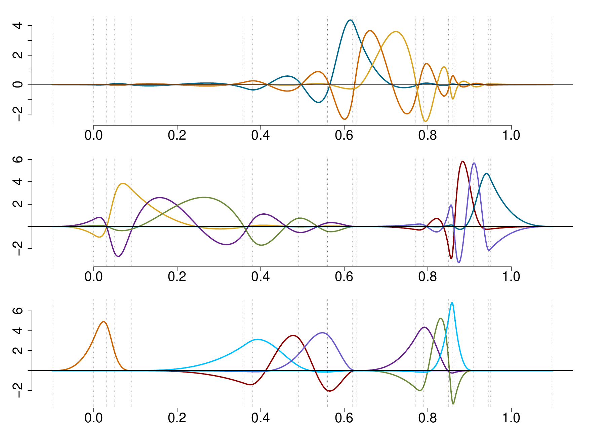
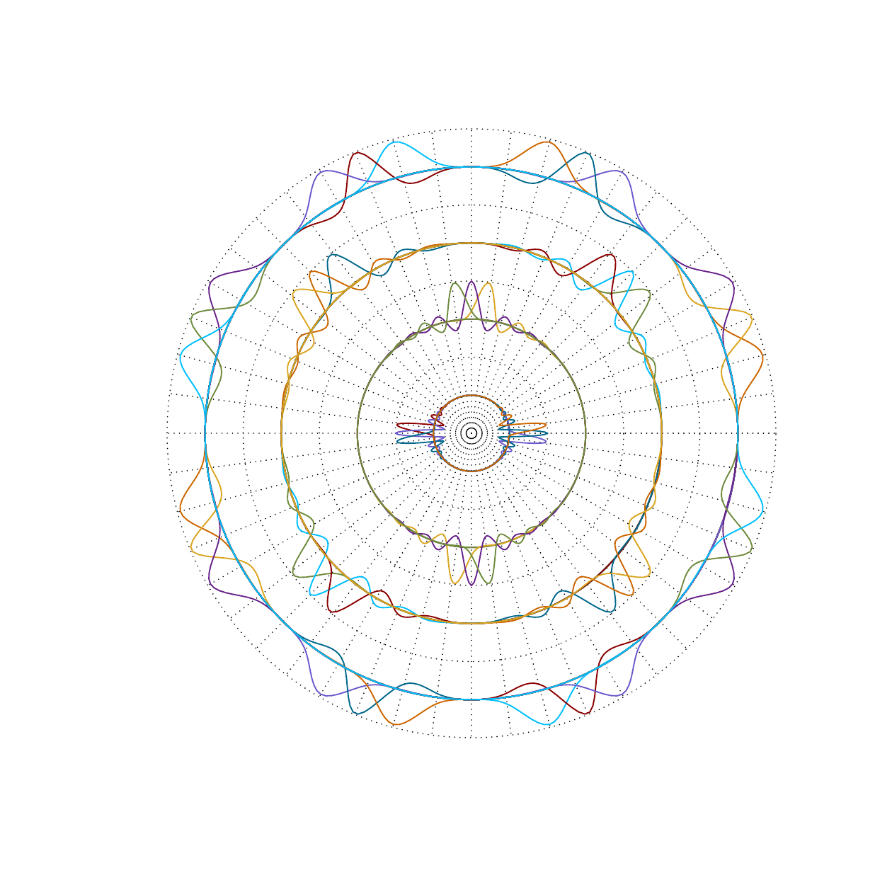
<figcaption>Figure 1: <span><em>Splinets</em></span> - the orthogonal
cubic spline bases presented on dyadic levels: <em>(Left)</em> A splinet
made on irregularly spaced knots on an interval, not a complete dyadic
case; <em>(Right)</em> Periodic splinet on regularly spaced knots
presented on circular dyadic levels, a complete dyadic case of 48
O-splines.</figcaption>
</figure>

Our goal is to demonstrate that all these features of the **Splinets**
package make it a powerful and effective tool for functional data
analysis (FDA). Not only does the package allow for standard methods to
be easily implemented, but it also facilitates the exploration of new
methodologies that are specific to the choice of splines as functional
spaces for analysis. In fact, the workflow for the classification
problem is presented in this paper to demonstrate the capabilities of
the **Splinets** package in various aspects of functional data. The
approach is used in a case study of classifying images.

The organization of the material is as follows. The paper starts with
the Taylor expansion based functional representation of splines used in
the package implementation. A discussion of the importance of the spline
space selection for the data at hand follows. The knot selection is
highlighted in this discussion. Once a proper spline space is chosen,
the projection to the space becomes the main tool in the data analysis
as it produces the isometry between functional spaces and Euclidean
spaces. Thus a presentation of the projection of functions to the space
of splines by means of the developed spline bases is discussed next.
Applications of these basic methods to perform a standard functional
analysis through some classical data sets illustrate the methodology.
The most advanced implementation of the FDA is presented in the final
section, where the workflow for the classification problem is elaborated
and applied through a case study based on the fashion MNIST data.

##  Splinets implementation

The splines can be represented in a variety of ways. In @Qin, a general
matrix representation was proposed that allows for efficient numerical
processing of the operations on the splines. This was utilized in @Zhou
and @Redd to represent and orthogonalize $B$-splines that were
implemented in the R-package **orthogonalsplinebasis**
[@orthogonalsplinebasis]. In our approach, we propose to represent a
spline in a different way. Namely, we focus on the values of the
derivatives at knots and the support of a spline. The goal is to achieve
better numerical stability as well as to utilize the discussed
efficiency of base splines having support only on a small portion of the
considered domain. In fact, there are three sources of the efficiency
and computational stability of the package **Splinets**:

Taylor expansion representation

:   Representing a spline by the matrix of the derivatives at the knots
    makes use the local Taylor expansion.

Sparse domains

:   Implementing partial support sets for splines as well as the spline
    algebra and calculus that is based on support sets.

Efficient orthogonal bases

:   Using the dyadic algorithm to orthogonalize the $B$-splines and
    utilize them in the projection methods.

The first two features are implemented in the `"Splinets"` class, the
third one is programmed through an algorithm of intelligent
orthogonalization of $B$-splines. The efficiency and stability of the
representation based on the local Taylor expansions is mathematically
justifiable since the matrix of the derivatives at the knots translate
directly to the function behaviour locally between knots. However, we
did not explicitly compare computational efficiency with other spline
implementations because these features are unique and, to our best
knowledge, they are not covered in other packages. Some details are
given in what follows, while the topic is more completely elaborated in
[@podgorski2021].

<figure id="fig:splinesp">
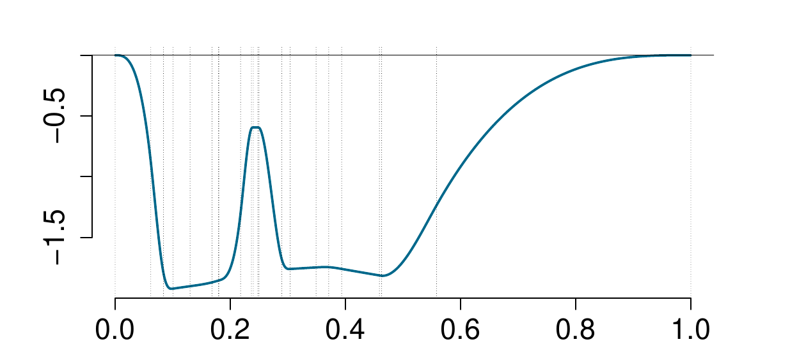
<p>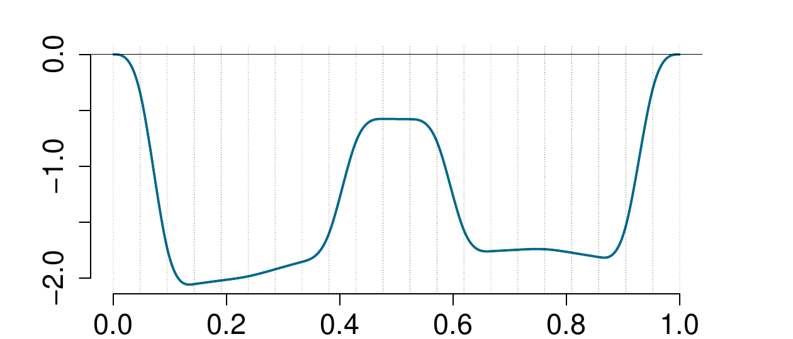<br />
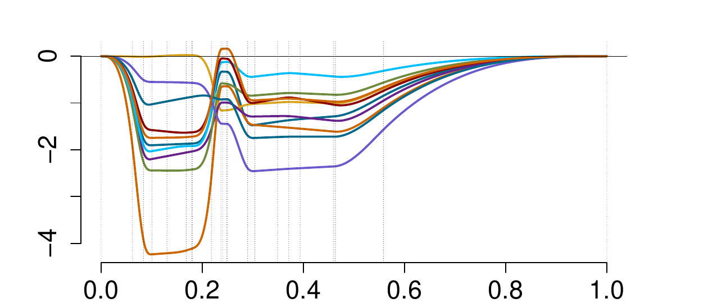</p>
<p>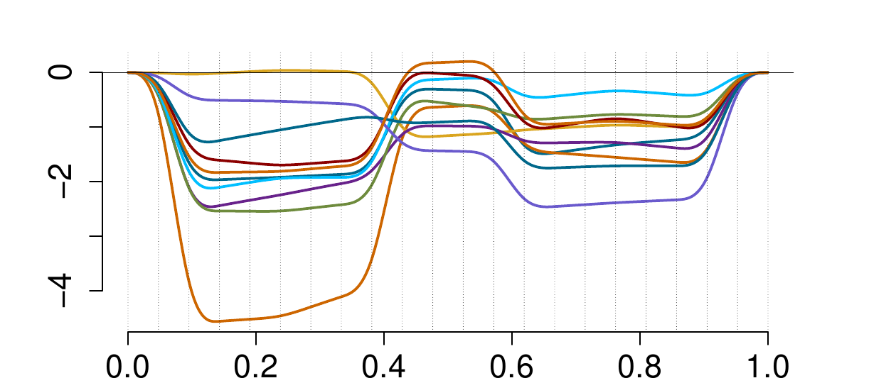<br />
</p>
<figcaption>Figure 2: Examples of splines for non-equally spaced knots
(left) and equally spaced knots (right). In the top graphs, we see
individual splines while in the bottom ones random spline samples are
generated around the top one by the random spline generator function
implemented in the package. The vertical dashed lines in all figures are
placed at the locations of the knots. </figcaption>
</figure>

In the following code, a random sample of splines is generated using
spline generator implemented in the package. The result is shown in
Figure [2](#fig:splinesp){reference-type="ref" reference="fig:splinesp"}
and demonstrates that the knot distribution is fundamental in shaping
geometry of functional spaces. The difference in the nature of the two
linear functional spaces is obvious: in the left graphs we see more
focus on the localized variability and detail, the capacity that is
lacked in splines in the right-hand side. From the analyst point of
view, the challenge is to choose a space that matches geometrical
characteristics observed in the data.

``` r
n <- 20  # Number of knots
k <- 3   # Degree of splines
set.seed(10)
xi <- sort(rbeta(n + 2, 2, 5))  # Randomly distributed knots
xi[1] <- 0
xi[n + 1] <- 1 
S <- matrix(rnorm((n + 2) * (k + 1)), ncol = (k + 1))  # Random matrix of derivatives
spl <- construct(xi, k, S)  # A spline object with corrected derivatives matrix
plot(spl)
y <- rspline(spl, 10)  # Random spline generator
plot(y)
xi2 <- seq(0, 1, by = 1 / (n + 1))
spl2 <- construct(xi2, k, S)  # Another spline object
plot(spl2)
y2 <- rspline(spl2, 10)  # Another random sample
plot(y2)
```

The implementation of a sparse domain is a novel feature not present, as
far as we know, in other spline implementations. The numerical gains are
obvious since we avoid numerical evaluations of operations that are
known to be zero. In this sense it is similar to the packages for sparse
matrices, where zero terms are omitted in the matrix representations.
The benefits for sparse functional data is illustrated in
Figure [4](#fig:MSSpectrum){reference-type="ref"
reference="fig:MSSpectrum"}- *(Bottom-right)*. Additional efficiency in
handling functional basis with locality features such as $B$-splines and
splinets lies in using the sparse domain feature. Indeed, the elements
of such bases are non-zero only on small portions of the domain and in
evaluating the projection to the spline spaces is significantly faster
if the unnecessary operations on zeros are omitted.

Finally, the package implements, for the first time, an innovative
orthogonalization through the numerical efficiency of the dyadic
algorithm. The orthogonal bases obtained in the process are discussed in
more detail further in the paper while the algorithm itself and its
computational benefits have been demonstrated in [@LIU2022].

### Splines with zero-boundary conditions at the endpoints

Splines are piecewise polynomials of a given degree with continuous
derivatives up to the degree (exclusive) at the points they
interconnect, which are called *internal knots*. The domain of a spline
will be called its *range* and is assumed in the paper to be a closed
finite interval. Additional knots called the *initial knots* and the
*terminal knots* are located at the beginning and the end of the spline
range, respectively. For a given set of knots, the space of splines is
finite-dimensional, with the inner product of the Hilbert space of the
square-integrable functions.

It is worth mentioning two extensions of functional spaces that are
handled by the package. The first are splines that do not have full
support over the entire range of the considered domain. This can be of
special utility for the sparse functional data, i.e. the functional data
that are nonzero only on a small number of locations. A good example of
such data are mass spectra in proteomics or metabolomics analyses. The
implementation of the `"splinet"` object allows specifying a support of
functional spline to be only on a union of disjoint intervals inside of
the entire range of domain. The second generalization extends beyond the
splines since the `Splinets` object can be used to represent any
piecewise polynomial function of a given degree. All the relevant
functions work properly even if the smoothness at the knots is not
preserved.

Due to the continuity requirements, the behaviour of a spline between
two given knots is necessarily affected by the form of polynomials at
the neighboring between-knots subintervals. Since the between-knots
intervals with terminal knots have only one neighboring between-knots
interval, the influence of values over other intervals is not the same.
To mitigate this biased terminal knots effect, it is natural and, as it
will be seen, also mathematically elegant to introduce the zero boundary
conditions at the terminal knots for all the derivatives except the
highest degree one. It can be shown that to remove the zero boundary
effect, one has to consider splines over the knots obtained through
extending by a certain number of knots from both ends of the complete
set of knots. More specifically, the number of knots that have to be
added at each end is equal to the degree of the splines. Often the knots
are added by replicating the terminal knots although there are some
serious disadvantages of such an approach.

The splines involve knots at which the polynomials smoothly connect. A
set of such knots is represented as a vector $\boldsymbol \xi$ of $n+2$
ordered values. As already mentioned, there are two alternatives, but in
a certain sense equivalent, requirements on the behaviour of a spline at
the endpoints of its range. In the first, no boundary conditions are
imposed. The main problem in this unrestricted approach is that the
polynomials at both ends of the considered range do not 'sense' the same
restrictions from the neighbors as the polynomial residing further from
both endpoints. This is due to the fact that at the endpoints the
'neighbors' are only present from one side. Another approach, favored in
this work, is by putting zero boundary restrictions on the derivatives
at the endpoints. This approach is mathematically equivalent to the
first one in a limiting sense, when the $k$ initial knots and the $k$
terminal knots converge to the beginning and the end of the range,
respectively. Moreover and most importantly, the approach is
structurally elegant and thus easier to implement. For all these
reasons, it is used in our package. However, the main object of the
package which is `"splinets"`.

We impose on a spline and all its derivatives of the degree smaller than
the spline degree the value of zero at both the endpoints of the range.
In this case, if we consider knots
$\boldsymbol \xi=(\xi_{0},\dots, \xi_{n+1})$ it is important to assume
that $n\ge k$, in order to have enough knots to define at least one
non-zero spline with the $2k$ zero-boundary conditions at the endpoints.
Indeed, if $n=k-1$, then we have $k+1$-knots yielding $k$ between knot
intervals. On each such interval, a spline is equal to a polynomial of
degree $k$. The dimension of the space of such piecewise polynomial
functions is $k(k+1)$. However, at each internal knot, there are $k$
equations to make derivative up to degree $k$ (excluding) continuous.
This reduces the initial unrestricted polynomials dimension by $(k-1)k$
dimensions to $2k$, but there are $2k$ equations for the derivatives to
be zero at the endpoints. We conclude that the dimension of the spline
space is eventually reduced to zero, meaning that there is only a
function trivially equal to zero in this space. From now on
$\mathcal S^{\boldsymbol \xi}_{ k}$ stands for the $n-k+1$ dimensional
space of the $k$-smoothed splines with the zero boundary conditions at
the terminal knots of in the ordered knots given in vector
$\boldsymbol \xi$. When the dependence on either $k$ or
$\boldsymbol \xi$ or both is not important, they will be dropped from
the notation.

The fundamental fact that we use here is that for a given degree , say
$k$, and a vector of knot points
$\boldsymbol \xi=\left(\xi_0,\dots, \xi_{n+1}\right)$, a spline
$S\in \mathcal S$ is uniquely defined by the values of the first
$0,\dots, k$ derivatives at the knots. The values of derivatives at the
knots allow for the Taylor expansions at the knots but they cannot be
taken arbitrarily due to the smoothness at the knots. The matrix of the
derivative values is the main component of an object belonging to our
main class in the package. For any spline function
$S\in \mathcal S_k^{\boldsymbol \xi}$, we consider
$\mathbf s_j=(s_{0j},\dots, s_{n+1j})$ is an $n+2$-dimensional vector
(column) of values of the $j^{\rm th}$-derivative of $S$,
$j=0,\dots, k$, at the knots given in vector
$\boldsymbol \xi= \left(\xi_0,\dots, \xi_{n+1}\right)$ that, as a
general convention for all vectors (also the convention in R, is treated
as a $(n+2)\times 1$ column matrix. These columns are kept in a
$(n+2)\times (k+1)$ matrix

$$\label{eq:spmat}
\mathbf{S} := \left[ \mathbf{s}_0\ \mathbf{s}_1\ \dots\ \mathbf{s}_k \right]   (\#eq:spmat)$$

More specifically, the main object `"Splinets"` implemented through the
S4 system for the OOP in R is defined through `setClass` function with
the following slots

``` r
representation(knots = "vector", degree = "numeric", equid = "logical", type =
    "character", supp = "list", der = "list", taylor = "matrix", epsilon = "numeric")
```

which represents a collection of splines, all built over the same knots
given in `knots`, of the degree $k$ given in `degree`. Further `supp` is
the list of matrices having row-wise pairs of the endpoints of the
intervals, the union of which constitutes the support set of a
particular spline, and the flag `equid` informs about the equally placed
knots, for which the computation can be significantly accelerated. The
matrices of the derivatives at the knots inside the support sets are
given in the list `der` of matrices, where an element in the list refers
to a particular spline in our collection and the length of the list
corresponds to the number of splines in the object. Descriptions of
other fields are given in the **Splinets** package but are not crucial
for this presentation.

Consequently, the above object corresponds to a spline function $S$ of
degree $k$ over knots in $\boldsymbol \xi=(\xi_0,\dots, \xi_{n+1})$ that
is identified as
$$S=\left\{k, \boldsymbol \xi,\mathcal I, \mathbf s_0,\mathbf s_1, \dots, \mathbf s_k\right\},$$
where $\mathcal I=\{(i_1, i_1+m_1+1), \dots,(i_ N,i_N+m_N+1) \}$ is a
sequence of ordered pairs of indexes in $\{1,\dots,n+2\}$ representing
the intervals, the union of which is the support of a spline, i.e. the
minimal closed set outside of which spline vanishes.

## Spline spaces for FDA

One of the fundamental aspects of functional data analysis is the
decision in which functional space the functional data (FD) in hand are
assumed to be located. FD are not observed as continuous objects, but
high-frequency sampling and mathematical efficiency enable us to see
these data as samples of curves, surfaces, or anything else varying over
a continuum. The fundamental step in FDA is to convert this discrete
recorded data to a truly functional form, which allows each function to
be evaluated at any value of its continuous argument. In order to
utilize the topology of such data for dimension reduction, one must
perform data conversion. Typically, one represents a functional object
as a linear combination of a suitably chosen basis functions. For this
purpose, one of the standard bases such as trigonometric, wavelet, or
polynomial is typically chosen. Then the efficiency is accomplished by
using smoothing through regression or roughness penalty for estimating
the coefficients of the basis expansions.

One can argue that the spline bases with their flexibility that comes
from the knot selection and the degree of splines make these spaces
ideal for efficiency in retrieving the functional structure of a studied
model, see also [@basna2022data]. The splines involve knots at which the
polynomials smoothly connect. A set of such knots is represented as a
vector $\boldsymbol \xi$ of $n+2$ ordered values. In this work, we
consider the zero-boundary version of splines by putting zero boundary
restrictions on the derivatives at the endpoints. This approach is
mathematically equivalent to the first one in a limiting sense, when the
$k$ initial knots and the $k$ terminal knots converge to the beginning
and the end of the range, respectively. Moreover and most importantly,
the approach is structurally elegant and thus easier to implement. For
all these reasons, it is used in our package. The central object of the
package is `"splinets"`, which represents a sequence of splines and
holds it in the object by coefficients of the Taylor expansion of the
function at the knots, which uniquely defines a spline using a matrix of
derivatives at the knots.

The fundamental feature of the package and of the approach to FDA are
the efficient orthogonal bases, the so-called splinets, which allow for
a very efficient data representation. These bases that were introduced
in [@LIU2022] are discussed next.

### Splinets -- orthonormal bases of splines

The direct approach to building splines requires a lot of care and often
can be cumbersome. A more efficient approach is through functional bases
of splines. There are many possible choices of such bases but the most
popular are the $B$-splines. Despite having many advantages, the
$B$-splines do not constitute an orthogonal basis, which is a
computational problem as the projection to the non-orthogonal bases adds
to the numerical complexity. This challenge occurs in implementing the
orthogonal projection operator discussed in the next subsection. On the
other hand, using the orthogonality of the splinet allows an efficient
representation of the data also in $B$-splines because the matrix
conversion from one basis to another is sparse. The main feature of the
package is to implement an optimal orthogonalization of the $B$-splines
into the orthogonal bases called *splinets* introduced in [@LIU2022].
The graphical presentation of the spline basis visually benefits from
organizing them in the form of a dyadic net that corresponds to the
dyadic orthogonalization procedure applied to the $B$-splines, the
technical definition of the dyadic net and further details can be found
in [@LIU2022]. However, this dyadic net representation is used mostly
for the visualization and one can equally use the sequential
representation if preferred. The package facilitates simple switching
between the two representations. In
Figure [3](#fig:Orth){reference-type="ref" reference="fig:Orth"}, one
can see $B$-spline basis in the left graphs and the corresponding
splinet in the right. In the top graphs, we use the sequential graphical
presentation and in the bottom ones the dyadic form that allows for a
better inspection of the basis functions.

The orthonormalized bases implemented in this package are obtained by
one of the following three orthogonalization procedures applied to
$B$-splines. The first one is simply the Gram-Schmidt orthogonalization
performed on the $B$-splines ordered by their locations, the second one
is a symmetric (with respect to the knot locations) version of the
Gram-Schmidt, and, finally, the dyadic orthogonalization into a
*splinet* which is our preferred method. We will not discuss the first
two orthonormalization methods as they have been included in the package
mostly because of historical reasons. In the object representation of
collections of splines, i.e. in the `"Splinets"` class, the field `type`
specifies which of the orthonormal basis one deals with. The function
`splinet()` is generating the proper basis as illustrated the code that
creates the $B$-splines, the corresponding splinet and the graphical
illustration shown in Figure [3](#fig:Orth){reference-type="ref"
reference="fig:Orth"}

``` r
k <- 3        # Degree of splines
N <- 5        # Number of layers
n <- k * 2^N - 1  # Number of knots
set.seed(2)
xi <- cumsum(runif(n + 2, min = 0.2))  # Random knots
so <- splinet(xi, k)  # Evaluation of the B-splines and the splinet
plot(so$bs, type = "dyadic")  # B-splines on the dyadic net
plot(so$os)                   # Splinet on the dyadic net
```

One can observe that `splinet()` is returning a list of two `Splinets`
objects, `so$bs` and `so$os` build over the ordered knots `xi`. The
first object represents the basis of the standard cubic $B$-splines and
is thus not orthogonal. The second one represents the recommended
orthonormal basis, which is referred to as a cubic splinet. In
Figure [3](#fig:Orth){reference-type="ref"
reference="fig:Orth"} *(Right)*, one can see the splinet obtained from
the $B$-splines given in the right-hand side.

<figure id="fig:Orth">
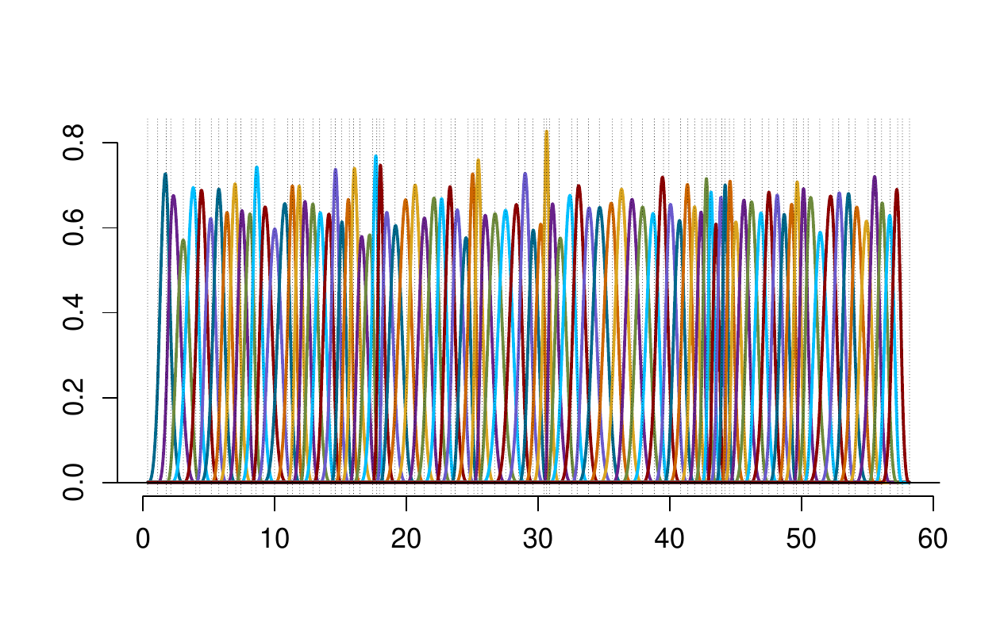
<p>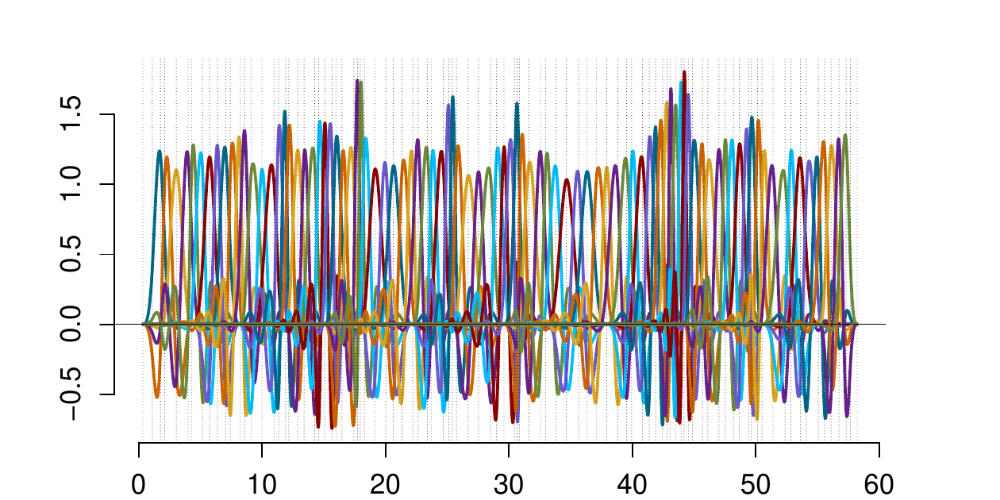<br />
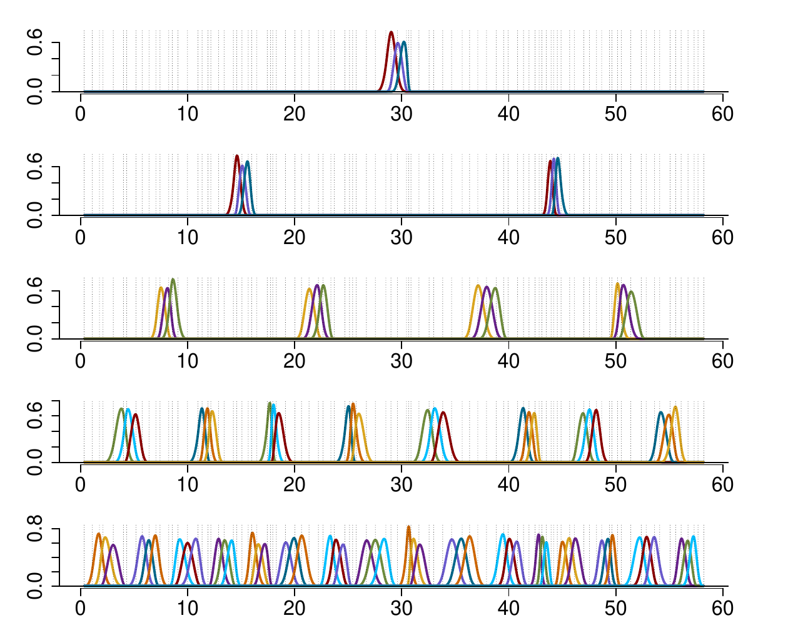</p>
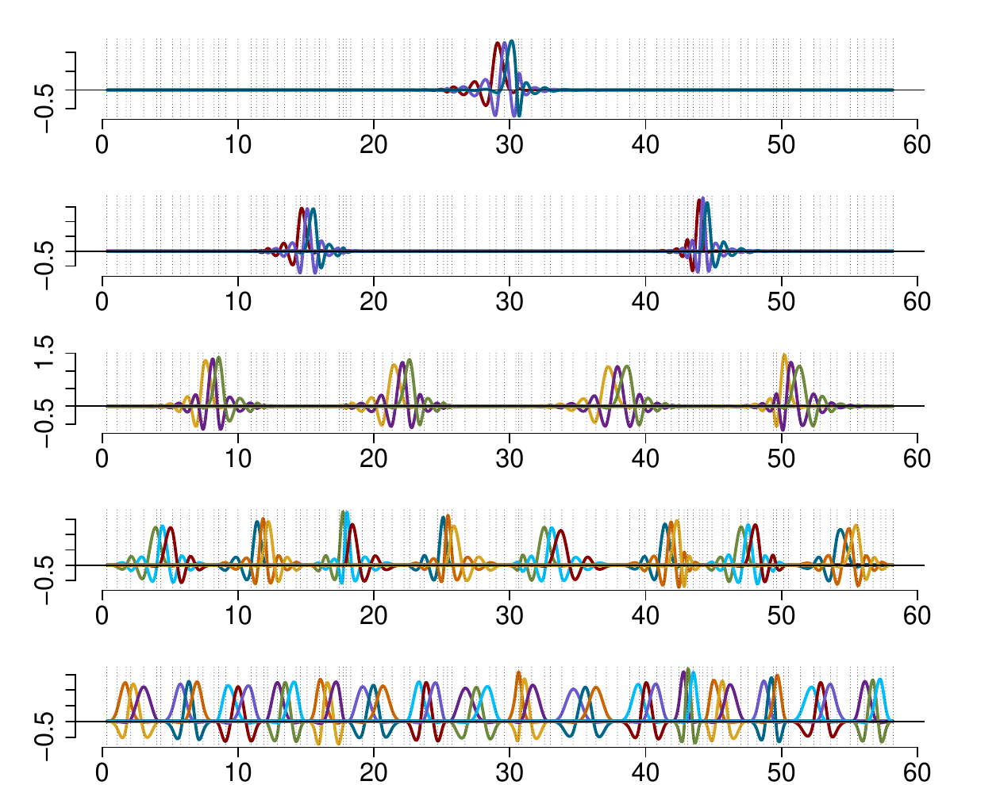
<figcaption>Figure 3: Cubic spline bases presented graphically in the
sequential form (top) and on the dyadic net (bottom). The case of <span
class="math inline"><em>n</em> = <em>k</em>2<sup><em>N</em></sup> − 1 = 95</span>,
<span class="math inline"><em>k</em> = 3</span>, <span
class="math inline"><em>N</em> = 5</span> which is the number of layers
in the dyadic structure seen in the figures. <em>(Left)</em>: The <span
class="math inline"><em>B</em></span>-spline basis; <em>(Right)</em>:
The corresponding splinet.</figcaption>
</figure>

### Projection to space of splines

Splines with a given knot selection constitute finite-dimensional
subspaces of the Hilbert space of square-integrable functions. Thus, any
such function can be projected orthogonally into the space of splines
defined by a particular set of knots. Functional data analysis typically
begins by projecting discretized data onto such a finite-dimensional
functional space, making the projection a fundamental operation in
statistical analysis. Projections can also serve as a smoothing step,
and various methods are available for this purpose.

In the package, orthogonal projection is implemented via the function
`project()`. Since functional data may be represented in different ways,
the actual projection depends on the input format, especially how the
inner product with a spline is evaluated numerically. The input to
`project()` can either be `Splinets` objects or a matrix with two
columns representing the arguments and values of discretized functional
data.

The output of the function is a list with three components:

`projsp$coeff`

:   A matrix of coefficients for the decomposition in the selected
    basis;

`projsp$basis`

:   The `Splinets` object representing the selected basis;

`projsp$sp`

:   The `Splinets` object representing the projection of the input data.

Additional details---such as the knots, degree, and basis type---can be
retrieved from `projsp$basis`. Many algebraic operations on splines are
more efficiently performed on the coefficient matrix rather than
directly on the `Splinets` objects. The matrix `projsp$coeff` can be
used for such tasks, while linear combinations of `projsp$basis` yield
the corresponding functional forms.

To highlight the simplicity and utility of **Splinets**, we apply it to
mass spectrometry data in a basic numerical example. This class of data
is particularly suited to the package due to its sparse nature and the
computational advantages of localized spline bases. We consider a
low-resolution SELDI-TOF mass spectrum available from the National
Cancer Institute, Center for Cancer Research, Clinical Proteomics
Program (<https://home.ccr.cancer.gov/ncifdaproteomics/ppatterns.asp>,
accessed 2024-05-26). For related work using such data, see
@Petricoin:2002aa.

<figure id="fig:MSSpectrum">
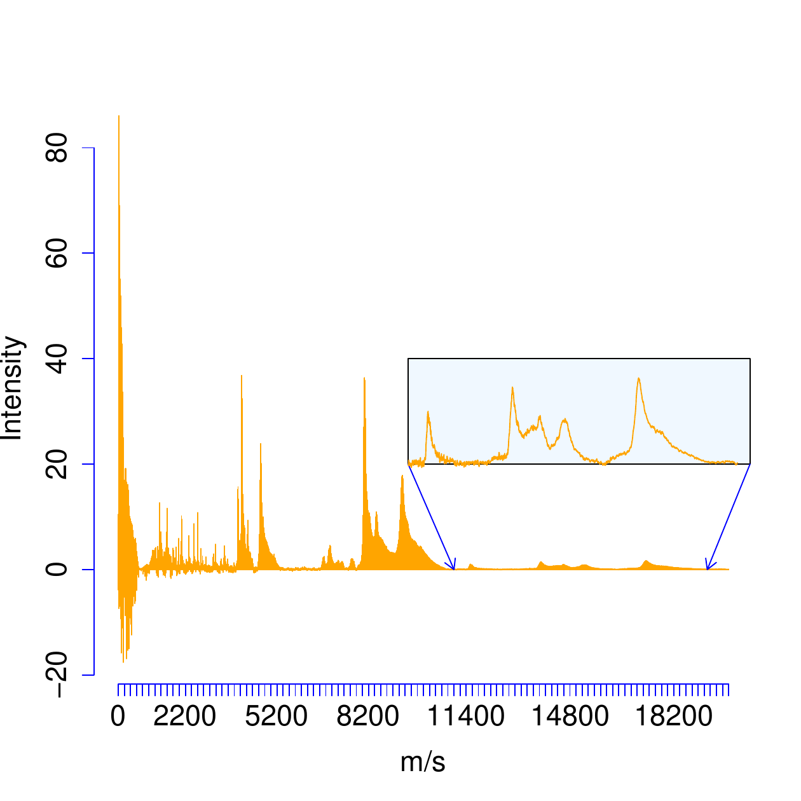
<p>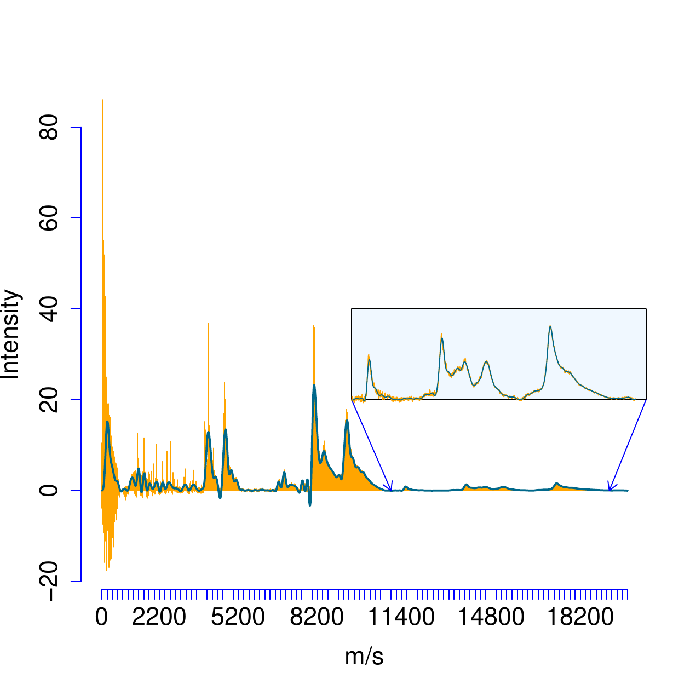<br />
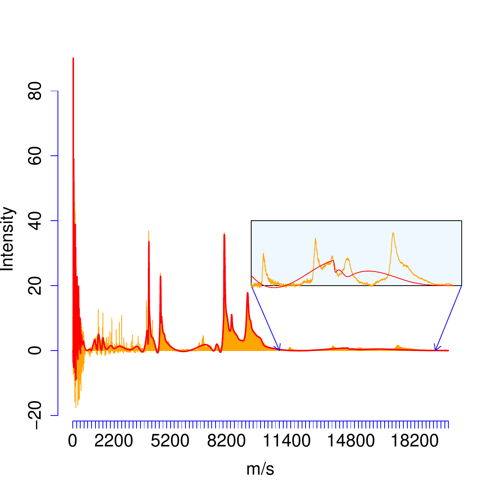</p>
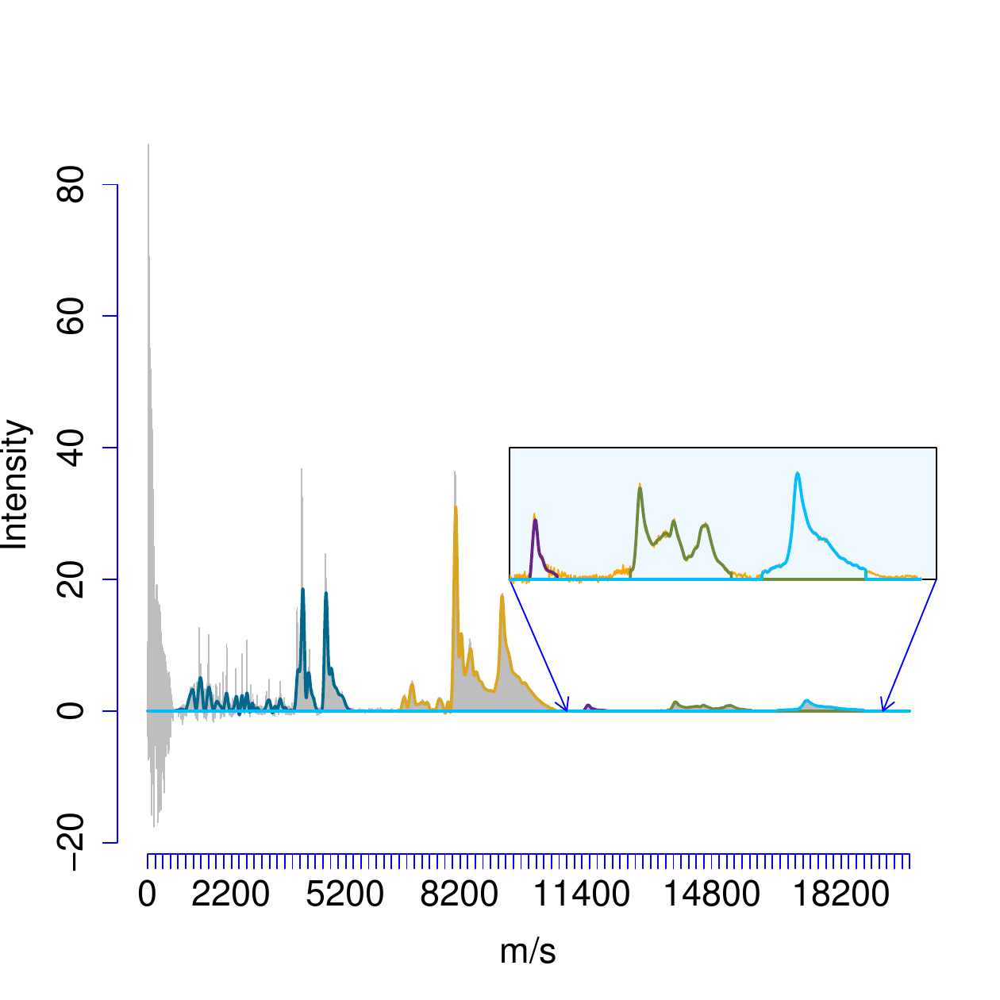
<figcaption>Figure 4: An ovarian cancer tissue low-resolution SELDI-TOF
mass spectrum (in orange) and its various representations as
<em>Splinet</em>-objects in approximately 200 dimensional spline spaces:
<em>(Top-Left)</em> The original sample (orange) consisting of 15154
values; <em>(Top-Right)</em> The projection (navy-blue) to the spline
space spanned on 200 equally spaced knots; <em>(Bottom-Left)</em> The
projection (red) to the spline space spanned on 200 non-equally spaced
knots with their locations chosen by the spectrum;
<em>(Bottom-Right)</em> The projection to the splines with a sparse
domain obtained by specifying five importance regions, with the graph
above each of the five support intervals drawn by a different
color.</figcaption>
</figure>

In Figure [4](#fig:MSSpectrum){reference-type="ref"
reference="fig:MSSpectrum"}, we present flexible ways of representing
the original signal by different **Splinets** objects. From these simple
illustrations, one can see dramatic reduction from the original 15154
dimension of the data to three different 200 dimensional spline
representations that emphasize different and subtle feature in the data.
The focus here is on the efficiency and flexibility by showing that 200
dimensional spline spaced can be molded toward particular features of
interest. We conclude that even without any in-depth FDA, one can get a
significant simplification and dimension reduction of the data at the
data representation level. In this work, we show that also advanced FDA
can be easily implemented with the help of the package.

The simplicity of using the **Splinets** package can be seen again in
the following code examples. If the `Ovarian` data and the **Splinets**
package are loaded, then the projection to splines with equally spaced
knots is simply obtained by

``` r
xi1 <- seq(min(Ovarian\$ms), max(Ovarian\$ms), length.out = 200) # Equally spaced knots 
so1 <- splinet(xi1)                                       # Orthogonal basis of splines
OvSpl1 <- project(as.matrix(Ovarian), basis = so1\$os)        # Projection to the basis
```

the projection to the data driven choice of knots by

``` r
wghts <- abs(Ovarian\$Intensity)/sum(abs(Ovarian\$Intensity))  # Knot selection weights
xi2 <- sort(sample(Ovarian\$ms, 200, prob = wghts))            # Random knots
so2 <- splinet(xi2)                                        # Orthogonal basis of splines
OvSpl2 <- project(as.matrix(Ovarian), basis = so2\$os)         # Projection to the basis
```

and the representation by a spline `OvSpl4` with a sparse domain with
five interval components, which requires a bit more coding, is presented
only on the graphs while the code is available in the package vignette
at
<https://ranibasna.github.io/R-Splinets/articles/MassSpectrometry.html>.

The omission of the first group of knots from the support is due to its
noisy character that typically is not of interest in the
mass-spectrometry data analysis.

The package provides a plot method for `Splinet` objects, so all the
plots from Figure [4](#fig:MSSpectrum){reference-type="ref"
reference="fig:MSSpectrum"} can be simply obtained through:

``` r
plot(Ovarian\$ms, Ovarian\$Intensity, type = "h")
lines(OvSpl1\$sp)
lines(OvSpl2\$sp) 
lines(OvSpl3)
```

The complete code, which facilitates experimentation, demonstrates data
analysis, performs the classification procedure, and allows for the
recreation of all figures and results, is available as R files with
comments. The R code is provided in the supplementary materials on the
GitHub page <https://github.com/ranibasna/R-Splinets> with the
accompanied package site
<https://ranibasna.github.io/R-Splinets/index.html>.

In the discussion of the projection to the spline spaces, we discuss
four different types of the projection: embedding, basis decomposition,
spline projection, and discretized data projection. This functionality
is illustrated by a numerically simulated example.

*Embedding a spline into higher-dimensional spaces of splines.* The
first function that we discuss is an embedding rather than a projection.
One of the most interesting aspects of spline spaces is their agility
attributed to different choices of the knots. Yet, when employing
splines for functional data analysis, the focus is typically on splines
with a fixed, often equally spaced, set of knots, rather than exploring
this adaptability. In the proposed package, we provide tools to
thoroughly explore the properties of splines under various knot choices.
Any spline remains a spline of the same *degree* when considered on a
set of knots larger than the original. However, this changes the
`Splinets` object representation of the refined spline. It is thus
important to have a function that embeds a given spline into a larger
space of splines defined on a refined set of knots. In the package, the
function `refine()` allows splines from smaller spaces to be
conveniently represented in larger, more refined spaces.

*Basis decomposition.* The simplest projection obtained through
`project()` is also not, strictly speaking, a projection but rather a
decomposition of a `Splinets` object into coefficients in the given
basis. If `sp` is a `Splinets` object, then the code

``` r
bdsp <- project(sp)
bdsp2 <- project(sp, type = "bs")
```

have as its main output the matrices of coefficients $a_{ji}$, such that
the $j^{\text{th}}$ input-spline $S_j$ that is in the input `sp` has the
form
$$S_j = \sum_{i=1}^{n-k+1} a_{ji} B_{i},$$
where $j$ indexes the input splines, $n$ is the number of the internal
knots (the knots not including the two endpoints of the domain), $k$ is
the degree of splines, and $B_{i}$'s are the elements of the selected
basis of splines controlled by the input `type`, so in the above example
it is either the splinet (`bdsp`) or the $B$-spline basis (`bdsp2`). The
bases are built on the same knots as the input spline.

*Projecting splines.* The projection of `Splinets`-objects over a given
set of knots to the space of splines over a different set of knots is
obtained through the orthogonal projection:

``` r
bdsp <- project(sp, knots)
bdsp2 <- project(sp, knots, type = "bs")
```

The results are represented in the spline space built over `knots`, and
thus the `Splinets`-object in the output representing the projection
spline satisfies `bdsp$bs@knots = knots`. Namely, if $S_j$ is the input
`Splinets`-object, then the output is denoted as $\mathbf{P} S_j$, where
$\mathbf{P}$ is the orthogonal projection to the space spanned by the
spline basis constructed from the second set of knots:
$$\label{projection}
\mathbf{P} S_j = \sum_{i=1}^{n - k + 1} a_{ji} B_i, \quad (S_j - \mathbf{P} S_j) \perp \mathbf{P} S_j,   (\#eq:projection)$$
where $B_i$ are elements of the specified spline basis, and `knots` can
differ from `sp@knots`.

This is an extension of the previous case since the output functions may
belong to a different space than the input functions. The output is
obtained by embedding both the input splines and the projection space to
the space of splines that contains both built over the union of the two
sets of knots.

*Projecting discretized functional data.* The function `project()` works
also when the input is not a spline object but discretized functional
data. This is the most important projection for FDA. In this case, the
input is a matrix having in the first column a set of arguments and in
the remaining ones the corresponding values of a sample of functional
data. The input data are treated as piecewise constant functions with
the value over two subsequent arguments equal to the value in the input
corresponding to the left-hand side argument. In this way, the
discretized data are viewed as functions, and their inner products with
any spline are well defined. Consequently, the projection
$\mathbf P S_j$ of the functional data in $S_j$ satisfies
([\[projection\]](#projection){reference-type="ref"
reference="projection"}), if $S_j$ represents the discretized datum as a
piece-wise constant function.

### Spectral decomposition of the wine dataset -- an example of FDA

We use the `Splinets` R package to perform Functional Principal
Component Analysis (FPCA) on a wine dataset that includes 124 samples,
with absorbance measurements taken across 256 wave numbers in the
mid-infrared spectrum (4000 to 400 cm$^{-1}$). These spectral
characteristics capture key aspects of the chemical composition of the
wines, such as alcohol content and sugar content. The wine dataset is
provided by Professor Marc Meurens of the Université Catholique de
Louvain [@benoudjit2004]. To initiate the analysis, we project the
discrete data onto orthogonal spline bases using the `project()`
function. This step transforms the discrete absorbance values into a
functional representation utilizing a selected set of knots.

``` r
WineProj <- project(WineData, knots) # Project wine data into the spline space.
```

It is assumed here that the `WineData` data object is processed. The
preprocessing steps of the data can be found at the *wine data example
package vignette page*
<https://ranibasna.github.io/R-Splinets/articles/FunctionalPrincipalValueDecomposition.html>.

The use of an orthogonalized functional basis provides significant
computational advantages, reducing the complexity of performing FPCA on
the functional data. By projecting the data onto an orthogonal basis, we
benefit from simplifying the process of finding the functional principal
components. This is because, in an orthogonal basis, the functional
principal components can be efficiently derived by performing PCA on the
projection coefficients.

Without orthogonality of the basis (like in the B-spline case), doing so
would not be correct. The functional principal components can be
computed as a linear combination of the eigenvectors and the spline
basis.

``` r
Sigma <- cov(WineProj\$coeff)    # Covariance matrix of the projection coefficients
Spect <- eigen(Sigma)            # Spectral decomposition of the covariance
EigenSp <- lincomb(WineProj\$basis, t(Spect\$vec))  # Functional eigenfunctions
```

<figure id="fig:eigen">

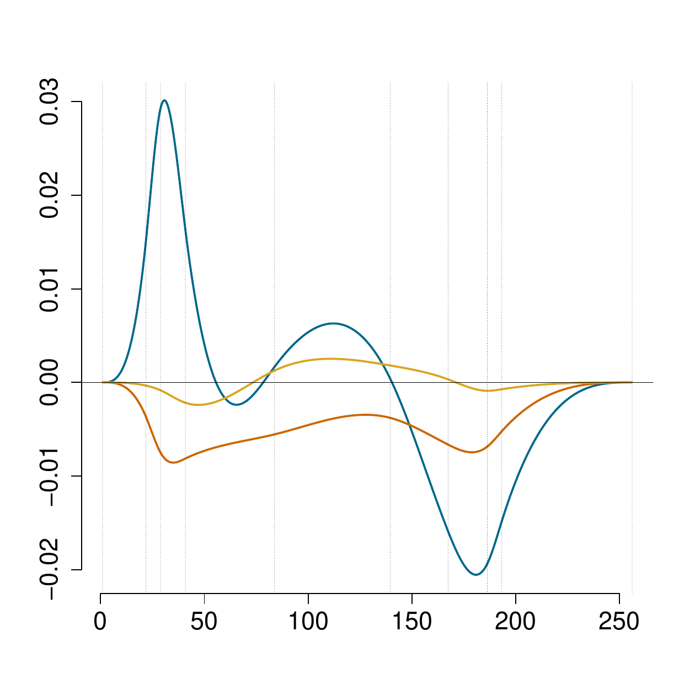
<figcaption>Figure 5: <em>Left:</em> One sample of the data (blue
curve), the data projected onto splinets (yellow curve) built over a set
of selected knots, with the location of the knots indicated by vertical
dashed lines, and the data decomposed using only the first eigenfunction
(orange curve); <em>Right:</em> the first three eigenfunctions scaled by
the square roots of their corresponding eigenvalues.</figcaption>
</figure>

The extracted principal components enable the identification of
significant spectral differences between the samples, offering a more
interpretable and efficient representation. The `plot()` function is
then used to visualize both the original and projected data, as well as
the principal components. The detailed plotting code can be found at
wine data example package vignette page
<https://ranibasna.github.io/R-Splinets/articles/FunctionalPrincipalValueDecomposition.html>.

This approach, leveraging the flexibility and efficiency of the
`Splinets` package, provides a robust framework for analyzing functional
wine spectra, ensuring that essential spectral features are preserved
without overfitting. Figure [5](#fig:eigen){reference-type="ref"
reference="fig:eigen"} (*Left*) shows a sample from the dataset,
comparing the original wine data (blue curve), the data projected onto
splinets over the selected knots (yellow curve), and the data decomposed
and reconstructed using only the first eigenfunction (orange curve). The
vertical dashed lines indicate the locations of the selected knots.
Figure [5](#fig:eigen){reference-type="ref" reference="fig:eigen"}
(*Right*) shows the first three eigenfunctions scaled by the square
roots of their respective eigenvalues.

## Classification problem - a case study using **Splinets**

The package **Splinets** provides a comprehensive toolbox to analyze
functional data. However, for a specific goal, one has to form a
workflow that assures all steps have been performed to form the final
conclusions following the analysis. Here, we introduce a workflow for
the classification problems. The focus here is on functional data that
have a one-dimensional domain. In the future, we plan to extend the
analytical tools to functional data with domains in higher dimensions
such as images, movies, etc. For this reason, we have chosen a classic
data set of images; however, our approach to their two-dimensional
nature involves converting them into functions of one argument; for a
more detailed discussion of the 2D extensions see [@Basna:2024aa].
Before introducing the actual workflow, we explain the fundamentals of
our methodology, highlighting the innovations that are specific to our
use of spline spaces.

### Methodology

In our approach to the classification of functional data, we first
search for a suitable functional space of splines that captures
important features of the data while maintaining a low dimensionality.
These two seemingly opposing goals---fidelity and parsimony---must be
balanced to ensure both efficiency and precision.

The main idea is to place knots in locations where the reduction in
total squared error of the data approximation by 0-`degree` splines is
largest. One implementation of this idea is available in the **ddk**
package, written in R and accessible on GitHub:
<https://github.com/ranibasna/ddk>, as discussed in [@basna2022data].

For classification, spline spaces are selected separately for each
class. The training data are then projected into the respective spaces,
and these projections are referred to as functional data points.
Functional principal component analysis (FPCA) is performed on the
functional data points for each class in the training set. Specifically,
the means are calculated for each class, and the centered data is
decomposed into eigenvalues and eigenfunctions, yielding a spectral
decomposition for each class separately.

This process involves estimating the eigenvalues
${\lambda_{i1}> \lambda_{i2} >\dots > \lambda_{in_i}}$ for the $i$th
class, along with the corresponding set of eigenfunctions
${e_{i1}, e_{i2},\dots, e_{in_i}}$, where $n_i$ is the number of
eigenfunctions for class $i$, and $i=1, 2, \dots, K$, with $K$
representing the number of classes. A validation method is used to
determine the optimal number of eigenvalues and eigenfunctions.
Theoretical validation of the spectral decomposition is through
Karhune-Loève's representation of the functional data which states that
a function in each class is sampled independently from the following
model
$$\begin{aligned}
\label{eq:spectdec}
X_i(t)=\mu_i(t) +\sum_{k=1}^\infty \sqrt{\lambda_{ki}} Z_{ki} e_{ki}(t),\, i=1,\dots, K,  
\end{aligned}   (\#eq:spectdec)$$
where $Z_{ki}$'s, mean-zero variance-one variables that are uncorrelated
within a class and independent between classes.

Subsequently, each original discretized data point, say $x_l$, from a
test set is projected onto all $K$ spline spaces based on the original
knot selection per class. Thus one obtains $K$ functional data points
$f_{li}$, $i=1,\dots, K$. The core principle of classification is to
determine how closely the $f_{li}$ test data point matches the
projection to the eigenspaces for a given class. The mathematical
techniques used in this process for image data include feature
extraction, dimensionality reduction, and classification algorithms,
which are used to obtain meaningful information from functional data
points and classify them efficiently. Let us describe this
classification procedure in some further detail.

The first step involves computing the mean for each of the ten classes
using our training data sets. For a given class such a mean function of
all elements in the training set belonging to the $i$th class is denoted
by $\hat \mu_i$ and is viewed as an estimated value of $\mu_i$. It is
obtained by projection of the averaged data per class into a space of
splines that has been determined by the knot selection process
specifically for the mean.

For each original data point $x_l$ in the test set, one evaluates its
representations $f_{li}$, $i=1,\dots, K$ in the spline spaces
corresponding to each class. Our objective is to assess the proximity to
each of the $K$ classes by projecting $f_{li}-\hat \mu_i$ onto the
eigenspaces (the space spanned by eigenfunctions) corresponding to that
class. Thus, we obtain $K$ distinctive projections. We denote them by
$\hat{f}_{l1},\hat{f}_{l2}, \dots, \hat{f}_{lK}$. Explicitly,
$$\label{eq:eigennu}
 \hat{f}_{li} =\hat \mu_i + \sum_{j=1}^{n_i} \langle f_{li}-\hat\mu_i,\hat e_{ji} \rangle \hat e_{ji},\, i=1,\dots, K   (\#eq:eigennu)$$
where $\langle\cdot \rangle$ stands for the inner product in the
functional spaces, i.e. integral over the product of two functions, and
$\hat e_{ij}$ are estimates of eigenfunctions $e_{ij}$ obtained in the
training phase and discussed above. Formally, we obtain the following
spectral decompositions
$$f_{li}=\hat f_{li} +\hat\varepsilon_{li},$$
where $\hat\varepsilon_{li}$ is the residual of the projection. If the
functional point $x_l$ belongs to the $i$th class and $\hat \mu_i$ and
$\hat e_{ij}$ are approximately equal to the true values, we would have
based on [\[eq:spectdec\]](#eq:spectdec){reference-type="eqref"
reference="eq:spectdec"}:
$$\begin{aligned}
\hat\varepsilon_{li}
\approx 
\sum_{j={n_i}+1}^\infty \sqrt{\lambda_{ki}} Z_{ki}  e_{ji}(t),
\end{aligned}$$
which should be rather small in the squared norm $\|\cdot\|$ of the
functional spaces. Indeed, we have
$$\|\hat\varepsilon_{li}\|^2\approx
\left \|
\sum_{j={n_i}+1}^\infty \sqrt{\lambda_{ki}} Z_{ki} e_{ji}
\right \|^2
=
\sum_{j=n_i+1}^\infty \lambda_{ki} Z_{ki}^2$$
and thus
$$\mathbb E (\|\hat\varepsilon_{li}\|^2)
 \approx
 \sum_{j={n_i}+1}^\infty \lambda_{ki}
 ,$$
which can be made small as long as the selection of $n_i$ targets values
so that
$\sum_{j=1}^\infty \lambda_{ji} \approx   \sum_{j=1}^{n_i} \lambda_{ji}$.

On the other hand, if $x_l$ does not belong to the $i$th class, the
residual $\hat\varepsilon_{li}$ should be large, given that the classes
are sufficiently distinguished by projections to the eigenspaces of
their largest eigenvectors. This justifies the following classification
rule
$$\label{eq:class}
    I(x_l)=\mathop{\rm arg\, min}_{i=1,\dots,K}\|\hat \varepsilon_{li}\|=\mathop{\rm arg\, min}_{i=1,\dots,K}\|x_l -\hat f_{li}\|,   (\#eq:class)$$
where $I(x_l)$ stands for the chosen class and $x_l$ is treated as a
piecewise constant function. One can enhance the outcome of
classification by providing the squared normalized distances
$$\label{eq:weights}
\left(w_1^l,\dots, w_K^l\right)=\frac{\left(\|x_l -\hat f_{l1}\|^2,\dots, \|x_l-\hat f_{lK}\|^2\right)}{\sum_{i=1}^K \|x_l-\hat f_{li}\|^2}.   (\#eq:weights)$$

*Remark 1.* This rule may be improved to account for the classes that
differ not by eigenvectors but by the corresponding eigenvalues. Namely,
one could consider the path of residuals over an increasing number of
eigenvectors and consider the sizes of the residuals along this path. We
do not investigate this enhancement of the proposed classification.

Having outlined the classification procedure, the pivotal role of
selecting the appropriate eigenvalues/eigenfunctions for each class
becomes evident. These hyper-parameters have a great impact on our
classification results. To enhance our classification's precision, we
ascertain the ideal number of eigenvalues or eigenfunctions. Using the
validation set technique, our primary objective is to identify the
optimal count of eigenvalues/eigenfunctions.

### Workflow

We describe, step-by-step, the workflow for the above-described
methodology and, along with this, we perform these steps on the
well-known Fashion MNIST dataset. The data set consists of a training
set of 60,000 examples and a test set of 10,000 examples of Zalando's
article images. The test dataset is divided into two distinct subsets:
the validation dataset and the test dataset. Each data entry is
represented by a grayscale image of $28 \times 28$ pixels. The problem
can be viewed as a classification problem on the $784$-dimensional
Euclidean space. Items belong to one of 10 types of clothing, such as
shoes, dresses, etc. The name of each class and its corresponding label
are: *0 -- T-shirt/top, 1 -- Trouser, 2 -- Pullover, 3 -- Dress, 4 --
Coat, 5 -- Sandal, 6 -- Shirt, 7 -- Sneaker, 8 -- Bag, 9 -- Ankle boot*.

<figure id="HC">
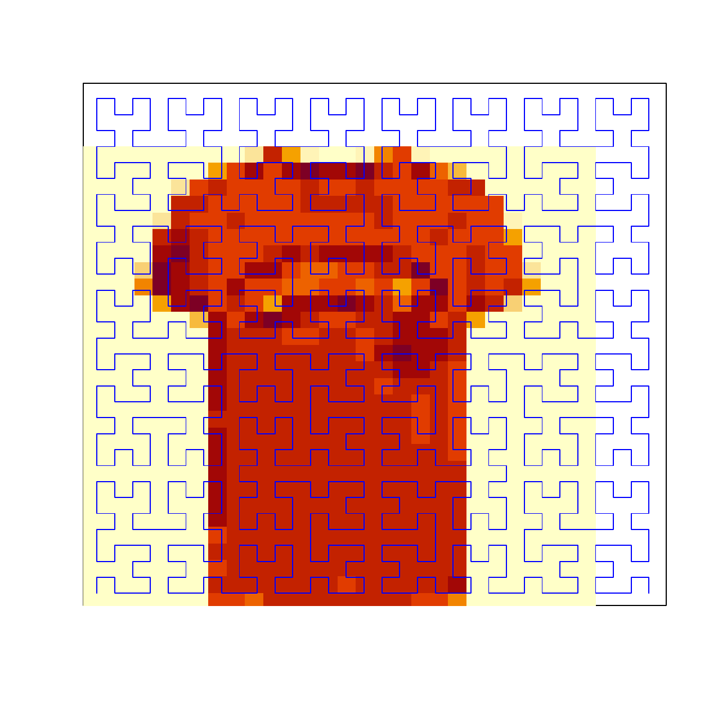
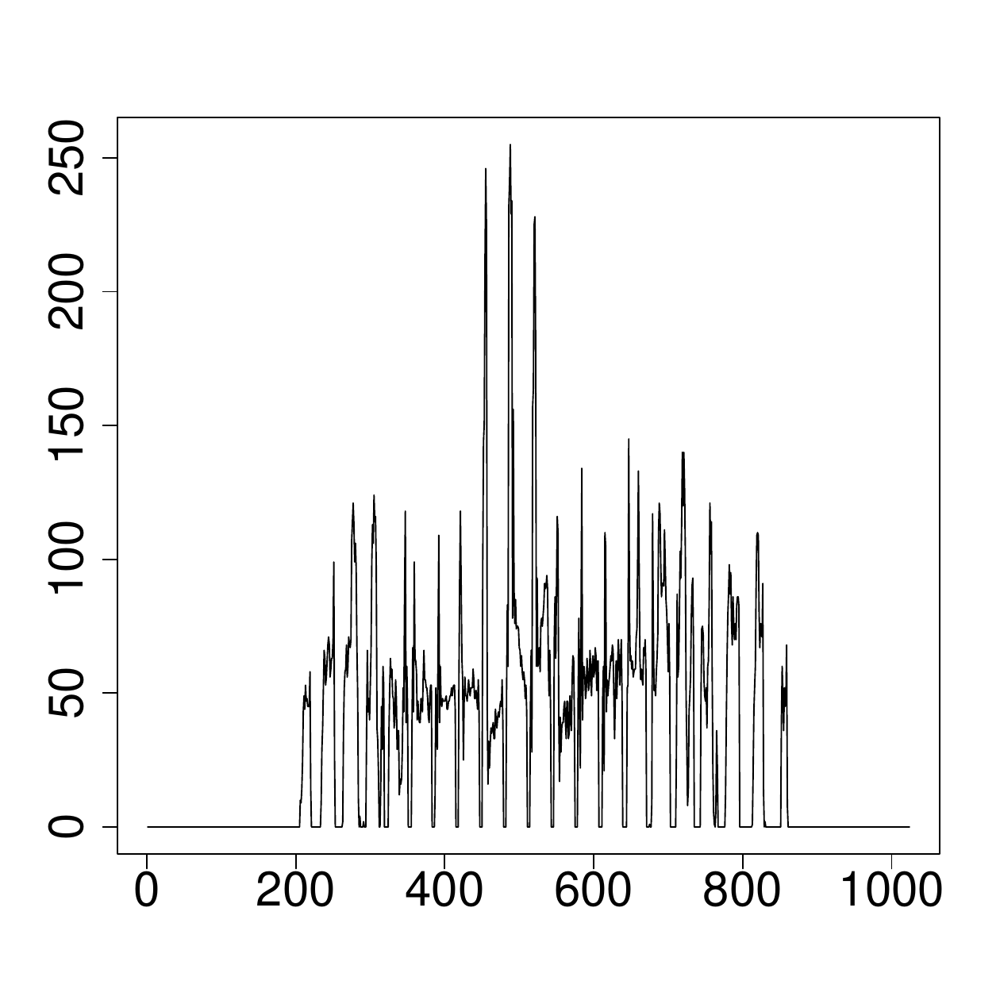
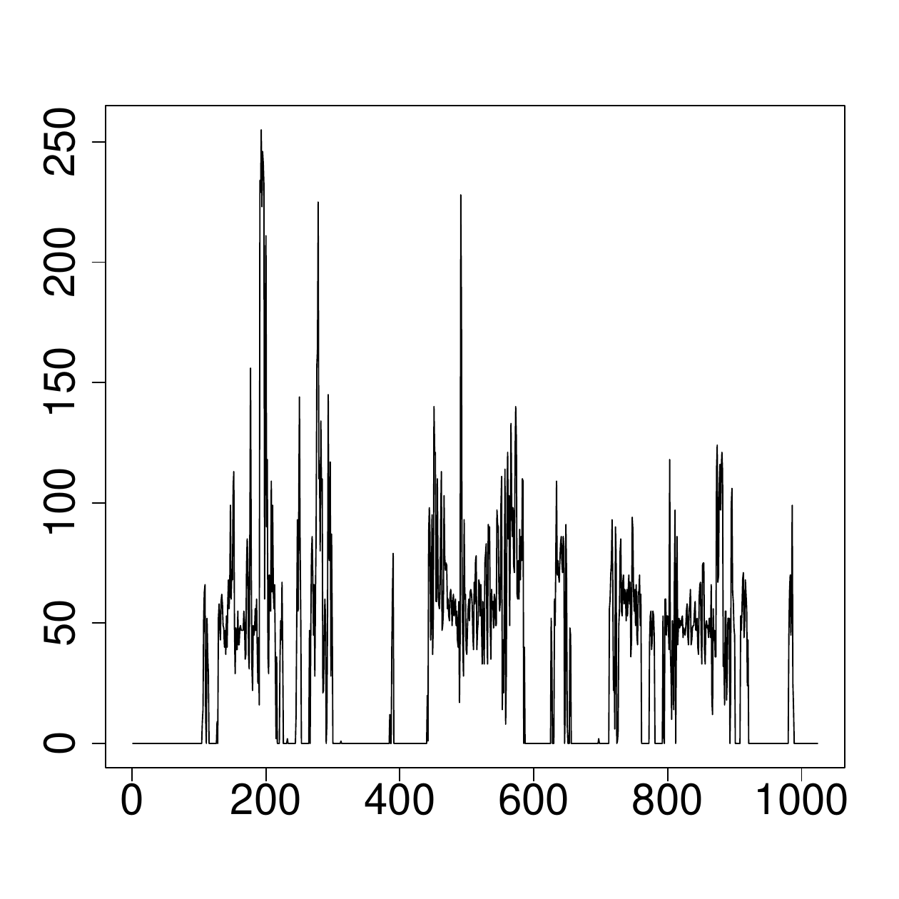
<figcaption>Figure 6: One- and two-dimensional representation of a
T-shirt . <em>Left:</em> original image with the Hilbert curve laid
over; <em>Middle:</em> column-major order representation;
<em>Right:</em> Hilbert curve representation.</figcaption>
</figure>

1.  **Data preparation:** In this segment of the workflow, the package
    **Splinets** is not used but the way we represent and preprocess our
    data plays a critical role in subsequent analyses and outcomes. The
    remaining steps of the workflow assume that the data represent
    discretized functions, i.e. are matrices of columns representing
    arguments and values of the functional data. Two variants of this
    format are allowed: one with the common arguments for all data
    points, where the vector of arguments stands as the last column; the
    second one allows different arguments for different data points, in
    which the input should be a list of two-column matrices, with the
    vector of the arguments as the first column and the vector of the
    corresponding values as the second one. We note that in the second
    case, it is allowed to have a varying number of rows in the elements
    of the list.

    Once the data are properly formatted, it should be divided into
    three parts. The first and largest part (typically at least $50\%$
    of the data) constitutes the training data, and the remaining are
    split into two, the validation and testing. Alternatively, one can
    perform training and cross-validation on a data set of size, for
    example, $75\%$, and test the approach on the remaining testing
    portion of the data.

    **Example:** (Fashion MNIST dataset). For the Fashion MNIST dataset,
    we deal with two-dimensional images, and transforming the data to
    one dimension is a critical process in which information will be
    lost. One of the tasks, we settled with the analysis of this data
    set is to compare different approaches to this transformation
    process. For this reason, we elucidate our approaches to data
    representation and transformation.

    Images are typically represented as matrices of pixels, where the
    value of each matrix element indicates the color and intensity of
    the respective part of the image. The matrices need to be
    transformed into vector form. A prevailing approach for such a
    transformation involves stacking the image's columns (or rows)
    consecutively to create a vectorized representation. However, this
    technique often neglects the local spatial correlations existing
    between image pixels, ensuring only the preservation of vertical (or
    horizontal) correlations.

    To more effectively retain these local correlations, we turn to the
    Hilbert curve transformation. A Hilbert curve is a continuous
    fractal space-filling curve that traverses every point in a square
    grid sized to any 2-power magnitude. For a detailed discussion of
    Hilbert curves, we refer to [@bader2012space]. Hilbert curves are
    particularly interesting for their ability to group pixels locally,
    see also R-package **gghilbertstrings** on CRAN [@gghilbertstrings].
    The additional materials accompanying the paper show the explicit
    definition of the Hilbert curve used for our data obtained from the
    R-code of the Hilbert space-filling algorithm. This specific case of
    the Hilbert curve is shown in Figure [6](#HC){reference-type="ref"
    reference="HC"} *(Left)* laid over the picture of a shirt.

    Given that our image dimensions do not align with a 2-power
    magnitude, we have implemented zero padding, adjusting the image to
    a $2^5\times 2^5$ pixel matrices.
    Figure [6](#HC){reference-type="ref" reference="HC"} presents two
    illustrative examples from the MNIST dataset: a shirt and a boot.
    The middle illustrations provide vectorized representations of these
    items, derived from consecutively stacking image columns. The
    right-hand-side depictions visualize vectors formed through the
    Hilbert space-filling curve. It is easy to notice that the
    locality-preserving properties of Hilbert's curve make the
    vectorization based on it a better choice in comparison to the
    column-wise vectorization. We also see that the Hilbert curve
    vectorization lead to more sparse data which could be accounted for
    using disjoint-interval domains featured by the package, which would
    lead to more efficient computations. However, this aspect of the
    data has not been implemented as we did not face any major
    computational burden in our studies.

2.  **Projection into spline spaces built on selected knots:** In this
    step, we consider $K$ distinct third- degree data-driven splinet
    bases, each built on knots specifically chosen for the corresponding
    class among the $K$ available. The number of knots for each class,
    as well as their placement, is determined using the DDK algorithm to
    effectively capture changes in the data. We then project the
    discrete training data points onto these splinets, constructed based
    on the class-specific knots. We considered separated spaces for the
    mean discrete data and the centered discrete data. We note that
    since the knots for the mean data are a subset of the knots for the
    centered data, the projections of the means are in the space of the
    projections of the centered data. However, they are not the same as
    their projections of the centered data space.

    <figure id="fig:KnotSelMean">
    <div class="center">
    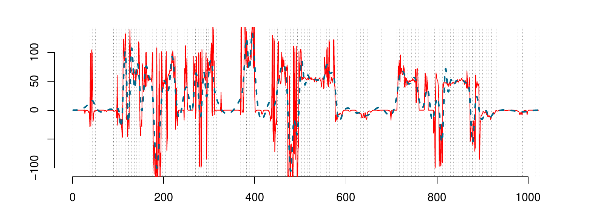
    </div>
    <figcaption>Figure 7: Fitting the centered ‘T-shirt’ by a spline with
    selected knots marked by vertical dotted lines.</figcaption>
    </figure>

    These projections establish an isomorphism between the Euclidean
    vectors made of coefficients of the projection and the space of
    splines into which the original data have been projected. More
    specifically, if $N_i$ is the number of knots chosen of the $i$th
    class and $k$ is the degree of the splines, then the splines spanned
    on these knots constitute a $N_i-k-1$-dimensional Hilbert space with
    $N_i-k-1$ elements of the corresponding splinet so that
    $$\label{eq:isom}
    x_l\stackrel{\tiny proj}{\longmapsto} f_{li} \stackrel{\tiny isom}{\longleftrightarrow} \mathbf a_{li}\in \mathbb R^{N_i-k-1},   (\#eq:isom)$$
    where $x_l$ is either the original centered discrete data point,
    $f_{li}$ is the corresponding functional data point when projected
    on the knots selected for the $i$th class, $\mathbf a_{li}$ is the
    vector of coefficients corresponding to the splinet expansion of
    $f_{li}$. This isomorphism allows us to perform the next part of the
    analysis simply by doing standard multivariate analysis on
    $\mathbf a_{li}$'s. The projection process is facilitated using the
    `project()` functions in the R-**Splinets** package. Other functions
    of the package assist exploration and visualization of various
    features of $f_{li}$'s.

    **Example:** (Fashion MNIST dataset, cont.). The original images
    that were transformed through the Hilbert curve transform to the 1D
    discrete data are next projected to spline spaces, where the number
    of knots for the respective classes are
    $$(N_1,N_2,N_3,N_4,N_5,N_6,N_7,N_8,N_9,N_{10})=(106 , 78, 100 ,86, 94, 100, 106,  78, 128, 102).$$
    Considering the number of knots and since we consider the third
    degree splines the dimension of the spline spaces are to be computed
    and put here according to the formula $(N_i-4)$. We note the initial
    dimension reduction from $784$ to the reported values of the given
    knot numbers in the classes. Additional further dimension reduction
    will be achieved through FPCA later on in the workflow. We see the
    projection of the 'T-Shirt' mean and an example of a centered
    'T-Shirt' in Figure [7](#fig:KnotSelMean){reference-type="ref"
    reference="fig:KnotSelMean"} *(Top-Middle)*. The locations of knots
    for these two cases are shown by vertical dashed lines.

    <figure id="KS_EigenFunctions">
    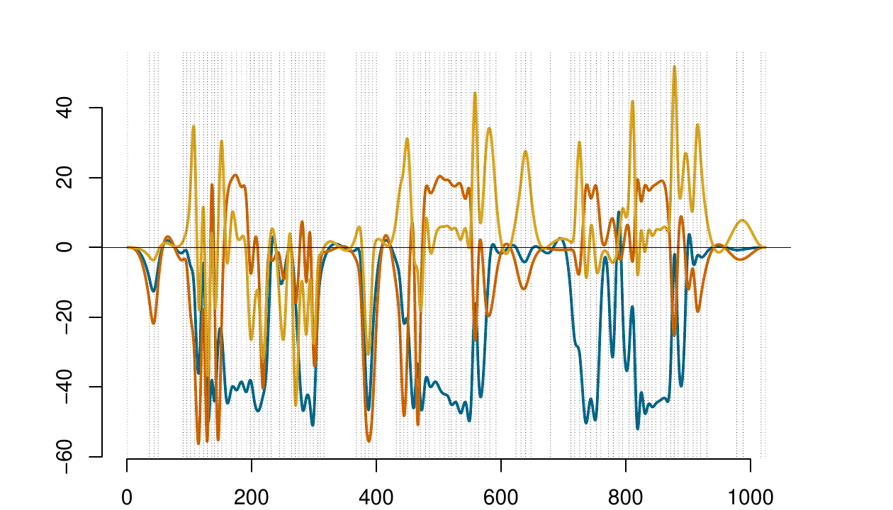
    <p>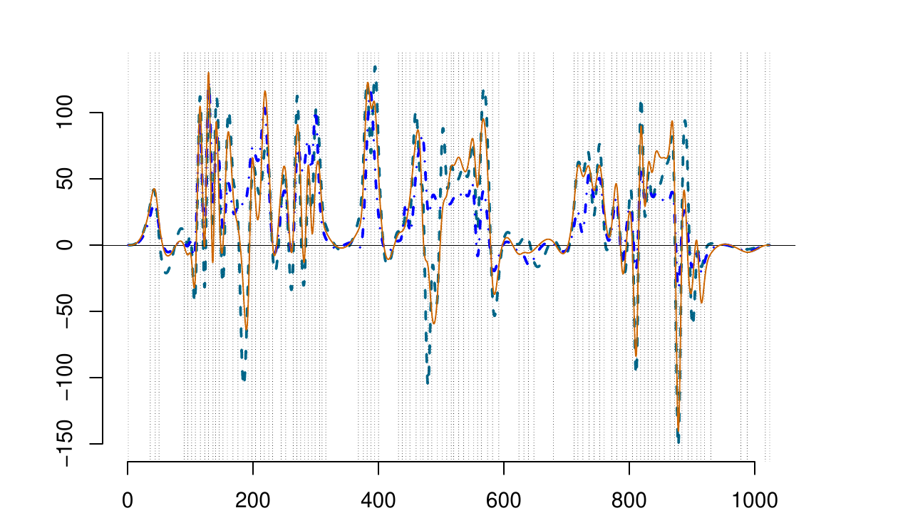<br />
    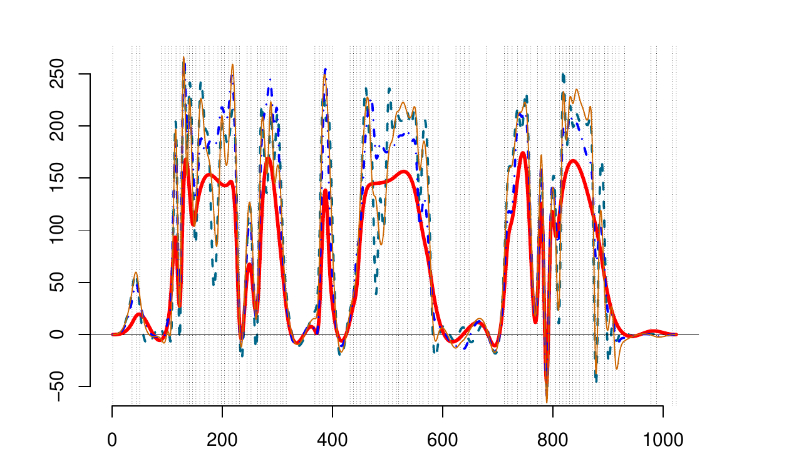</p>
    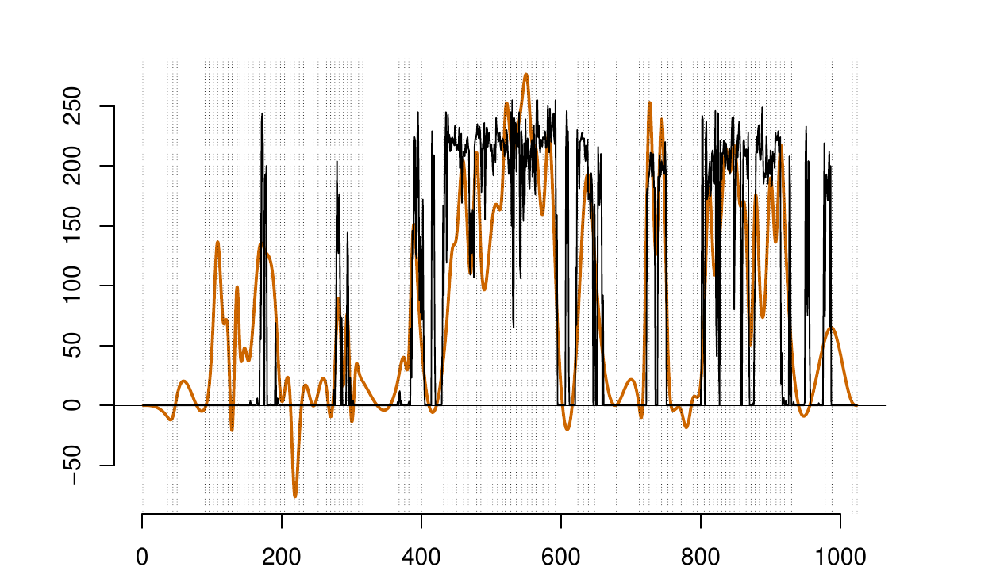
    <figcaption>Figure 8: The spectral decomposition of the training data.
    <em>Top-Left:</em> The first three eigenfunctions for the ‘T-shirt’
    class scaled by the square roots of the respective eigenvalues,
    <em>Top-Right:</em> Two approximations of the centered functional
    ‘T-shirt’ data point <em>(NavyBlue-Dashed Line)</em>: 1) by the first
    three eigenfunctions <em>(Blue-DottedDashed Line)</em> ; 2) by the first
    twenty eigenfunctions <em>(Orange-ThinSolid Line)</em>,
    <em>Bottom-Left:</em> The same approximation but centered around the
    ‘T-Shirt’ class mean <span
    class="math inline"><em>μ̂</em><sub>1</sub></span> <em>(Red-ThickSolid
    Line)</em>, <em>Bottom-Right:</em> Projection of a ’Boot’ data point to
    the ’T-Shirt’ spectrum with 20 eigenfunctions after centering around the
    ’T-Shirt’ class mean, the ‘Boot’ data point <em>(Black-Rough Line)</em>
    vs. its projection <em>(Orange-Solid Line).</em> </figcaption>
    </figure>

3.  **FPCA on training data:** To facilitate the classification
    procedure in the next step but also to gain a deeper understanding
    of the complexity of the data, the FPCA is performed within each
    class of the functional data points of the training set. In this
    task, one utilizes the isometry given in
    [\[eq:isom\]](#eq:isom){reference-type="eqref" reference="eq:isom"},
    and first the sample covariance matrix $\boldsymbol \Sigma_i$ is
    evaluated
    $$\boldsymbol \Sigma_i = \overline{\mathbf a_{.i}\mathbf a_{.i}^\top} -\overline{\mathbf a_{.i}}\,\,\overline{\mathbf a_{.i}}^\top,$$
    where averaging $\overline{\cdot}$ is made within the class $i$ of
    the training data. One simply applies `cov()` on the matrix of
    column vectors $\mathbf a_{li}$'s. Then the spectral decomposition
    of $\boldsymbol \Sigma_i$ into eigenvalues and eigenvectors is
    performed using `eigen()` of the R - *base* package. The obtained
    eigenvectors correspond to eigenfunctions through the isometry.

    **Example:** (Fashion MNIST dataset, cont.). This rather standard
    step when performed on cloth image classes is illustrated in
    Figure [8](#KS_EigenFunctions){reference-type="ref"
    reference="KS_EigenFunctions"}. The first three eigenfunctions of
    'T-shirts' scaled by the square roots of the respective eigenvalues
    are shown in the *(top-left)* graph and projections to the spaces
    based on 3 and 20 eigenfunctions are presented in the remaining
    graphs including the projection of 'Boots' to the 'T-Shirt' space,
    the *(bottom-right)* graph.

4.  **Determining the significant eigenfunctions:** In this step, the
    classification procedure
    [\[eq:class\]](#eq:class){reference-type="eqref"
    reference="eq:class"} as a function of the number of considered
    eigenfunctions is implemented. Then the number $n_i$ of the
    eigenfunctions for the $i$th class is based on its accuracy on the
    validation data set. In
    Figure [8](#KS_EigenFunctions){reference-type="ref"
    reference="KS_EigenFunctions"}  *(Bottom)*, we see the illustration
    of the classification principle. There are shown approximation of
    two data points, a 'T-Shirt' *(Left)*, and a 'Boot' *(Right)*, based
    on the projection to 20 eigenvalues in the 'T-Shirt spline space. It
    can be seen clearly that the approximation of 'T-shirt' is better
    than the approximation of 'Boot'. The functional $L_2$-norm of the
    functional spaces can be utilized to measure the approximation.

    The approach to data classification relies on projecting the data
    into a subspace defined by a set of numbers $n_i$, $i=1,\dots, K$,
    of eigenfunctions of the distinct classes. We can see from
    [\[eq:eigennu\]](#eq:eigennu){reference-type="eqref"
    reference="eq:eigennu"} and the classification rule
    [\[eq:class\]](#eq:class){reference-type="eqref"
    reference="eq:class"} that if $n_i$'s are taken too big, then it may
    result in overfitting of the data and a smaller dimension reduction,
    on the other hand, if the values are too small the precision of
    distinguishing the features in the data of different classes may be
    not sufficient. In this framework, the numbers of eigenfunctions for
    individual classes are of paramount significance and are treated as
    hyper-parameters. The $n_i$'s, $i=1,\dots,K$ are chosen through the
    following cross-validation procedure.

    From the training data, from each class, we exclude at random
    $10\%$-data points, denoted by $\mathcal C_i$, $i=1,\dots,K$.
    Consider the remaining $90\%$ for the $i$th class and build spectral
    decomposition of the data as explained in the previous step. Set the
    initial vector of numbers of the eigenvalues
    $\mathbf n^0=(n^0_1,\dots,n_{10}^0)$ in each class. For example, we
    can set it to zero to start with the classification based only on
    the mean $\hat \mu_i$, i.e. the closest mean decides for the class
    to which a data point belongs to. Let the classification distances
    (evaluated through
    [\[eq:weights\]](#eq:weights){reference-type="eqref"
    reference="eq:weights"}) for a given discrete data point $x$ be
    denoted by
    $$\mathbf w(x,{\mathbf n^0})=\mathbf w(x;n^0_1,\dots,n_{10}^0).$$
    Evaluate classification success rate through
    $$\mathbf s({\mathbf n^0})=\left(\frac{\sum_{x\in \mathcal C_1} w_1(x,\mathbf n^0)}{|\mathcal C_1|},\dots,\frac{\sum_{x\in \mathcal C_K} w_K(x,\mathbf n^0)}{|\mathcal C_K|} \right).$$
    where $|\mathcal C_i|$ is the number of elements in $\mathcal C_i$,
    or through the classification accuracy rate
    $$\mathbf a({\mathbf n^0})=\left(\frac{\#\{x\in \mathcal C_1; I(x,\mathbf n^0)=1\}}{|\mathcal C_1|} ,\dots,\frac{\#\{x\in \mathcal C_K; I(x,\mathbf n^0)=K\}}{|\mathcal C_K|} \right).$$
    Small values in $\mathbf s$ or large values in $\mathbf a$ indicate
    good classification. Thus, taking averages of these two vectors can
    be used to assess the overall quality of a classification rule.
    Since the accuracy $\mathbf a$ is more interpretable, we focus on it
    and denote the average of its entries by $\bar {\mathbf a}$.

    In general, the function
    $\mathbf n\mapsto \bar {\mathbf a}(\mathbf n)$ is a non-convex
    function of $K$ arguments, and our goal is to find its optimum when
    evaluated over the validation data set. We adopt a simple iterative
    marginal gradient method, where we increase by one that coordinates
    in $\mathbf n$ that produces the large increase in
    $\bar {\mathbf a}$. Allow for a specific number of negative
    increases $L$ and conclude with the location $\mathbf n_{opt}$ of
    the maximum over-searched path. The number $L$ is a hyperparameter
    and is data-specific. The algorithm is repeated by a number of
    random initial knot distributions and the final result is the
    maximum over these runs.

    <figure id="VAL">
    <p>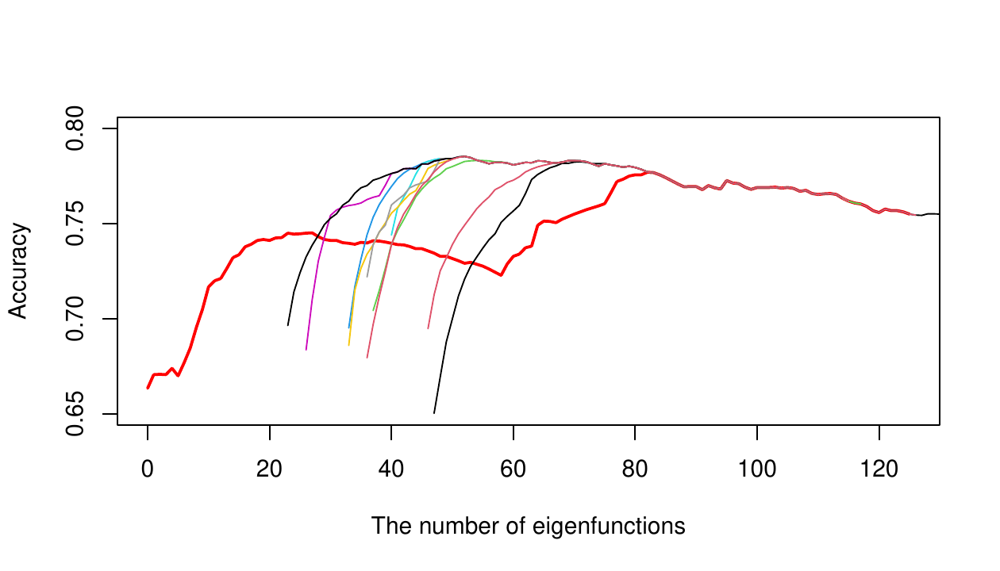<br />
    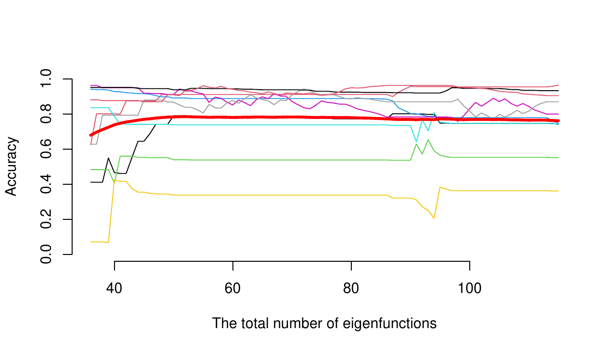</p>
    <figcaption>Figure 9: Optimization of the accuracy function in the
    validation phase (Step 4). <em>Top:</em> The trajectory of the average
    accuracy along the initial optimization path (thick-line) together with
    subsequently chosen random samples of the initial <span
    class="math inline"><strong>n</strong><sub>0</sub></span> that are shown
    in thin-lines; <em>Bottom:</em> The class-wise accuracies (thin-lines)
    against the average accuracy (thick-line). ‘Pullovers’ (green line) and
    ‘Shirts’ (yellow line) are notoriously difficult to classify.
    </figcaption>
    </figure>

    **Example:** (Fashion MNIST dataset, cont.). In
    Figure [9](#VAL){reference-type="ref" reference="VAL"} *(Top)*, the
    different trajectories of the accuracy obtained for randomly picked
    $\mathbf n_0$ are shown in thin-lines. The procedure was run on the
    validation set of the functional using the classification procedure
    [\[eq:class\]](#eq:class){reference-type="eqref"
    reference="eq:class"} (also used in the next step of the workflow).
    The baseline for the performance is made of the rates of correct
    classification per class when it is only based on the distance of a
    data point from the spline projection of the mean, i.e.
    $\|x-\hat \mu_i\|$, so no eigenfunctions are considered. The
    obtained rates of correct classification rates per class are
    $$(0.67, 0.88, 0.33, 0.73, 0.66, 0.75, 0.23, 0.80, 0.76, 0.86)$$
    with the overall average performance of $66\%$ of correct
    classification. From this, one sees that 'Pullover' and 'Shirt' seem
    to be difficult to classify. Overall accuracy is assessed using the
    approach as described above with random starting vector
    $\mathbf n_0$ of the initial allocation of the numbers of the
    eigenvalues in the class and searching for the optimal allocation.
    The procedure is illustrated in
    Figure [9](#VAL){reference-type="ref" reference="VAL"} *(Top)*,
    where several subsequent trajectories of the total accuracy are
    presented by the thin-lines against the initial selection, the
    thick-line. In Figure [9](#VAL){reference-type="ref"
    reference="VAL"} *(Bottom)*, the trajectories of the classwise
    accuracies and the average accuracies based on the above
    optimization procedure are presented. They lead to the following
    numbers of significant eigenvectors
    $(  8,  4,  5,  6,  4, 8,  2, 4,  5, 6)$ for the ten cloth classes
    and, with this choice, the average accuracy in the validation
    process is $78.5\%$. We conclude that the original dimension of
    $784$ vectors has been reduced more than tenfold (based on the total
    number $52$ of all eigenfunctions). However, we also see that
    'Pullovers' (y and 'Shirt' remain hard to classify, with the latter
    being properly classified less than $40\%$ of the time. The final
    classification based on the obtained sizes of the functional spaces
    is performed on the testing data set in the next step.

5.  **Testing the classification procedure:** This step is essentially
    repeating on the testing data set, most of the workflow except the
    validation steps used for the knot selection and deciding for the
    number of eigenfunctions. Thus for each data point $x_l$ in the
    testing sets, one projects it to ten functional spaces obtaining
    splines $f_{li}$, $i=1,\dots, K$. Those in turn are used to evaluate
    the classification rule
    [\[eq:class\]](#eq:class){reference-type="eqref"
    reference="eq:class"} and decide on the class of the object. In
    fact, in the algorithm, the following convenient representation of
    the squared distance between a discrete data point $x_l$ and its
    approximation $\hat f_{li}$ given in
    [\[eq:eigennu\]](#eq:eigennu){reference-type="eqref"
    reference="eq:eigennu"} is used
    $$\|x_l-\hat f_{li}\|^2=\|x_l\|^2-\|f_{li}\|^2 + \|f_{li}-\hat \mu_i\|^2
    -\sum_{j=1}^{n_i}\left| \langle f_{li}-\hat \mu_i,\hat e_{ji}\rangle\right|^2.$$
    The results are compared with actual class memberships and
    summarized in the confusion matrix and other standard measurements
    of efficiency.

    **Example:** (Fashion MNIST dataset, cont.). The leading example
    illustrating the workflow is using Hilbert curve approach to
    transform from two-dimensional images to one-dimensional discrete
    data points. The classification method
    [\[eq:class\]](#eq:class){reference-type="eqref"
    reference="eq:class"} with optimally chosen numbers of eigenvectors
    was performed through all testing data points and several
    characteristics have been evaluated. The average accuracy (over all
    classes) is $77.0\%$, which is close to the one in the
    cross-validation step and the classwise accuracies are
    $$(73.4\%, 89.1\% ,52.3\%, 87.7\%, 72.0\% , 91.7\%, 32.9\%, 82.2\%, 94.5\%, 92.9\%),$$
    which are also consistent with the results in the cross-validation
    experiment seen in Figure [9](#VAL){reference-type="ref"
    reference="VAL"}  *(Bottom)*.

    Another important summary is to report the averaged normalized
    distances $\bar{\mathbf w}$, of the elements of the class to their
    projection to that class and they are
    $$(0.049, 0.049, 0.053, 0.046, 0.047, 0.051, 0.060, 0.033, 0.042, 0.030).$$
    We observe expected negative correlations with the accuracies. The
    values are significantly lower from $0.1$ (the case that the
    distance does not differentiate between classes) and are a major
    improvement over the original relative distances to the spaces.

6.  **Final evaluation and conclusions:** This part depends on the goal
    for which the classification procedure has been used and thus is
    case-specific. One may need simply a classification method and its
    accuracy, then little is needed beyond the details shared in the
    previous step. It is also recommended to examine the statistics of
    misclassified data points and the features of these points as
    expressed by FPCA. This may give insight into the reasons for
    failing to identify data points properly and, in consequence, give
    an idea of how the classification can be further improved. If
    classification needs to be applied to some data without labels, then
    the classification should be run on it and summarized. This workflow
    can also serve as a benchmark to compare various classification
    methods. Then a comparison and a discussion should be carried out
    through reporting confusion matrices, along with other pertinent
    evaluation metrics. Again checking which data points have been
    misclassified can be important to see if a hybrid classification
    method could further improve the success rate.

    **Example:** (Fashion MNIST dataset, cont.). In our illustrative
    example, the goal was to show the workflow and the corresponding
    methodology. Since we focused on a single method, it is natural to
    present here more detailed characteristics of the method and comment
    on the obtained outcomes. It is clear that the method performs
    poorly in classifying 'Shirts' and, somewhat better, 'Pullovers'. We
    observe that a 'Shirt' is often classified as a 'T-Shirt' and a
    'Coat'. Additionally, a 'Pullover' is often classified as a 'Coat'.
    Generally, it seems that the main responsibilities for the
    misclassifications are the classes: 'T-shirt', 'Pullover', 'Coat',
    and 'Shirt'.

    To improve on the method one could try to use a lower degree of
    splines that could help due to the noisiness of the Hilbert curve
    data points. By just looking at the data, it appears that the first-
    degree splines should suffice. Improving the search for an optimal
    number of eigenfunctions could be another possible source of
    improvement. We have seen that the performance from the validation
    step carries over to the testing results. Thus, enhancing the
    validation process should lead to more accurate classification
    results. Nevertheless, it seems that the achieved performance will
    be hard to significantly improve unless the full 2D character of the
    data is considered. This is planned in a future 2D extension of the
    spline-based method for the FDA.

    ::: {#tab:confusion}
      -------------- --------- --------- ---------- ------- ------- -------- ------- --------- ------- -------
      **TARGET**                                                                                       

      **PREDICT.**     T-shirt   Trouser   Pullover   Dress    Coat   Sandal   Shirt   Sneaker     Bag    Boot

      T-shirt            73.4%      0.8%       4.5%    4.6%    0.8%     0.0%   25.5%      0.0%    2.2%    0.1%

      Trouser              0.1     89.1%       0.3%    1.7%    0.1%     0.0%    0.0%      0.0%    0.0%    0.0%

      Pullover            1.8%      0.5%      52.3%    1.5%   10.4%     0.0%    8.6%      0.0%    0.7%    0.0%

      Dress              12.1%      8.7%       2.0%   87.7%    8.4%     0.0%    8.9%      0.0%    1.2%    0.0%

      Coat                0.3%      0.6%      20.2%    1.7%   72.0%     0.0%   17.9%      0.0%    0.2%    0.0%

      Sandal              0.7%      0.0%       0.0%    0.1%    0.0%    91.7%    0.0%      9.2%    1.0%    3.3%

      Shirt               5.0%      0.1%      17.5%    1.8%    6.8%     0.0%   32.9%      0.0%    0.0%    0.0%

      Sneaker             0.0%      0.0%       0.0%    0.0%    0.0%     4.7%    0.0%     82.2%    0.1%    3.7%

      Bag                 6.6%      0.2%       3.0%    0.8%    1.4%     0.4%    6.2%      0.0%   94.5%    0.0%

      Boot                0.0%      0.0%       0.2%    0.1%    0.1%     3.2%    0.0%      8.6%    0.1%   92.9%
      -------------- --------- --------- ---------- ------- ------- -------- ------- --------- ------- -------

      : (#tab:T1) Confusion matrix
    :::

    []{#tab:confusion label="tab:confusion"}

### Comparing different 1D-methods functional methods

We employ the proposed workflow to investigate how different methods of
data preparation influence the efficiency of our classification method.
Our main goal is to assess the impact on the efficiency of two factors:
the Hilbert curve-based transformation method and the data targeted
knots selection.

(that can be obtained, for example, by using DDK described in
[@basna2022data]). We put forward three distinct scenarios to be
examined using our established workflow:

-   Hilbert curve transformation with $100$ data-driven knot selections.

-   By-row data with $100$ data-driven knot selections.

-   By-row data with $100$ equidistant knots.

This choice ensures both the validity and fairness of our comparisons,
thus enhancing the reliability and interpretability of our results.

<figure id="CM">
<p><span>-.8cm</span>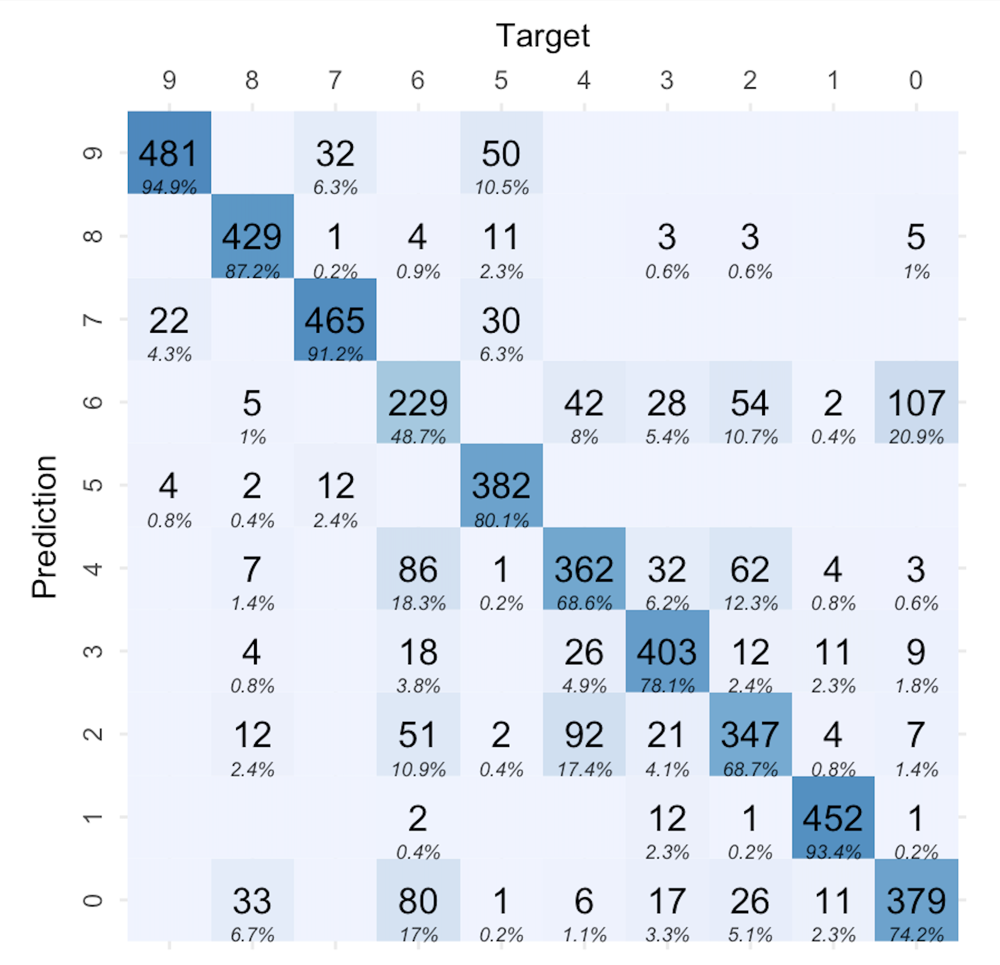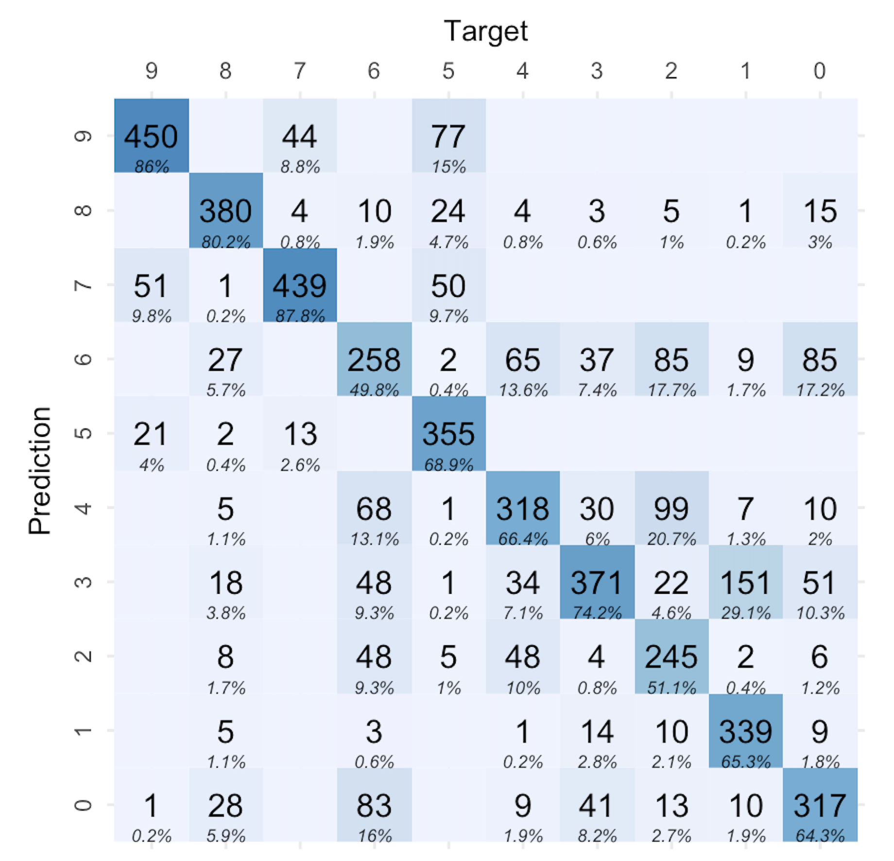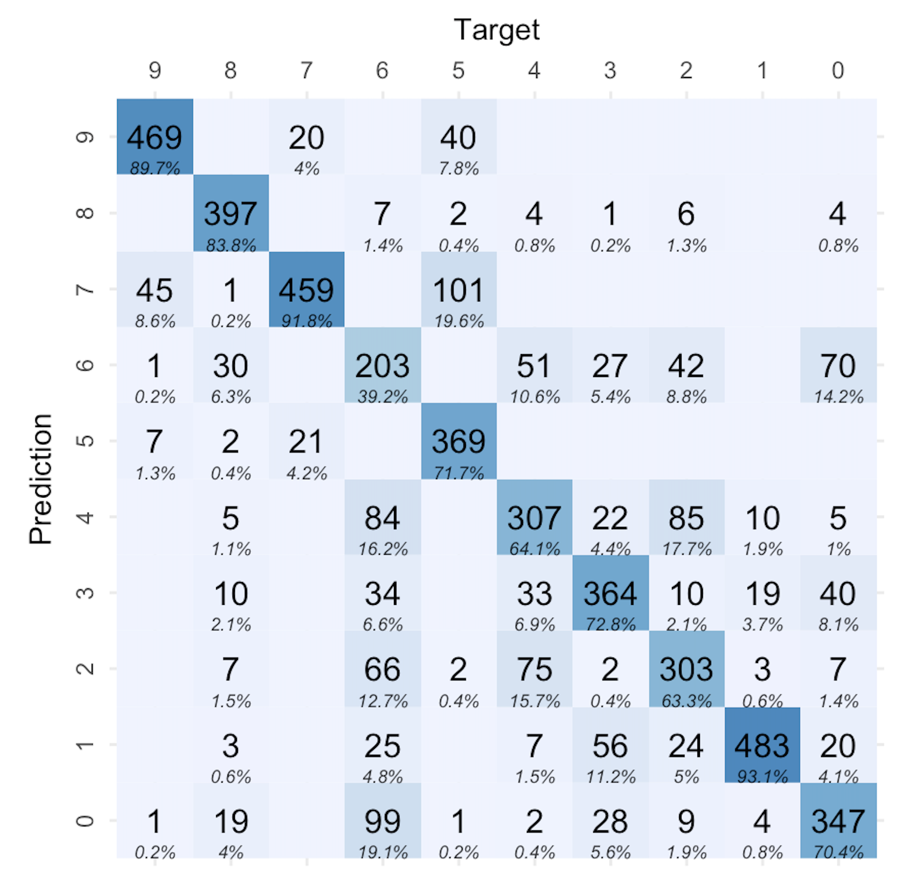</p>
<figcaption>Figure 10: Confusion matrix for S1, S2, and S3 from right to
left.</figcaption>
</figure>

The choice of these scenarios stems largely from our belief that the
data targeted knot selection method leads to a more efficient dimension
reduction, especially in the context of sparse data. As evidenced in
Figure [6](#HC){reference-type="ref" reference="HC"}, the pixel
distribution in the by-row data does not exhibit sparsity. This suggests
that we might not see significant performance gains if we were to deploy
the data based knot selection methodology on it. However, the
introduction of the Hilbert curve transformation imparts a noticeable
sparsity in the data's curvature.

As detailed above, we project the data into a subspace spanned by a
number of eigenfunctions. For each scenario, we chose a number of
eigenfunctions that achieved the highest accuracy on the validation data
set. The validation phase of the analysis suggests that the optimal
number of eigenvalues for S1, S2, and S3 are 15, 10, and 15,
respectively. After the testing phase, we carry the classification
problem described earlier across the three scenarios. To evaluate the
performance of our classification model, we define the following metrics
$$\text{Accuracy} = \frac{T_P + T_N}{T_P + T_N + F_P + F_N}, \ \ \ \  \text{Precision} = \frac{T_P}{T_P + F_P}, \ \ \ \  \text{Recall} = \frac{T_P}{T_P + F_N}, \ \ \ \ \text{F1} = 2 \, \frac{\text{Precision} \times \text{Recall}}{\text{Precision} + \text{Recall}},$$
where $T_P, T_N, F_P, F_N$ are true positives, true negatives, false
positives and false negatives, respectively. Table
[2](#3scenarios){reference-type="ref" reference="3scenarios"} presents
the outcomes obtained from analyzing the classification problem within
the three suggested scenarios.

::: {#3scenarios}
  ------------------------------------------------------------------
                   **Scenario 1**   **Scenario 2**   **Scenario 3**
  --------------- ---------------- ---------------- ----------------
   **Accuracy**       $78.6\%$        $69.44\%$         $73.6\%$

   **Precision**     $79.22\%$         $71.3\%$        $74.1 \%$

    **Recall**        $78.5\%$         $69.4\%$         $73.9\%$

      **F1**         $78.74\%$         $69.8\%$         $73.6\%$
  ------------------------------------------------------------------

  : (#tab:T2) Accuracy, Precision, Recall and F1 Score of the
  classification problem in each scenario.
:::

[]{#3scenarios label="3scenarios"}

The results from the first scenario (S1) clearly demonstrate its
superior performance, affirming our proposition. To further understand
the algorithm's misclassifications, we provide the confusion matrix for
each scenario in Figure [10](#CM){reference-type="ref" reference="CM"}.
The confusion matrix illustrates the comparison between the true labels
and the predicted labels of the test dataset. The confusion matrices
show the uncertainty mostly between the classes 0,2,4,6 in the fashion
image dataset, as discussed in the previous section . This makes sense
because t-shirts, pullovers, coats, and shirts look similar and might be
confusing.

In the absence of the Hilbert curve transformation, it is observed that
the classification performance of the data-driven knot selection
approach alone is the least accurate among the three scenarios. This is
consistent with expectations given that the data exhibits a dense and
non-sparse format with highly repetitive patterns. The equidistant knot
selection classification strategy shows a modest increment in the
accuracy results. However, the application of data-driven knot selection
on the transformed data significantly improves the accuracy of the
results. It is important to note that our aim is not to outperform or
compete with state-of-the-art machine learning and deep learning
methodologies in image classification. Although our method may not
achieve the the optimal accuracy levels that can be seen in the
convolution neural network approach, it does reach a commendable
accuracy rate of approximately $80\%$. This is comparable to simpler
neural networks, such as decision tree classifiers and MLP classifiers.
For further benchmarking of machine learning algorithm classifiers on
the Fashion MNIST dataset, see [@xiao2017fashion]. The implementation of
the Hilbert curve transformation highlights the effectiveness of the
data-driven method for representing data in a functional format,
resulting a noticeable increase in accuracy by $5-6\%$. This enhancement
is attributed to the efficient representation of locality features in
the data through the chosen basis, ensuring the preservation of space
curvature.

There are two notable observations to consider. First, the data-driven
knot selection method demonstrates superior performance compared to the
traditional equidistance method, especially when handling sparse data
that exhibits distinct spatial dependencies. This difference in
performance can be observed by comparing the class-wise accuracy between
S1, S2, and S3. Second, leveraging the 2D characteristics of the images
has a positive impact on the performance of Functional Principal
Component Analysis (FPCA) when combined with the data-driven knot
selection method. A transformation such as the Hilbert curve, can reveal
the two-dimensional characteristics of the original image by preserving
the locality relationships among the pixels. More precisely, in the
flattened one-dimensional vector, consecutive elements (pixels) were
likely neighbors in the original two-dimensional space. It also creates
a sparser representation of the image, which makes it more amenable to
our method. Therefore, when we apply our FPCA data-driven analysis
techniques to this one-dimensional vector, these techniques
approximately analyze the local neighborhoods of the original
two-dimensional image. This enhancement suggests, as expected, that
considering the 2D structure of the images contributes to improved
results and should be further investigated.

## Summary

We have presented tools from the **Splinets**-package that facilitate an
efficient analysis of functional data. The benefits using the orthogonal
basis implemented in the package are illustrated both by a simple
example of the FPCA performed on the classical wine data set and by a
more advanced workflow for classification of functional data. This
workflow is designed to enhance the efficiency of dimension reduction
while retaining functional dependencies in the data's characterizing
features, which may not necessarily be local. The workflow was
benchmarked on the Fashion MNIST data set. The findings from this
example emphasize the pivotal importance of the data's two-dimensional
nature in the functional principal component analysis approach. The
Hilbert curve proved to be the most efficient and it is partially due to
its capacity of capturing dependencies beyond one dimension. These
observations suggest that adopting the method further toward
two-dimensional analysis, for example, by considering gradient images
or, even better, two-dimensional FPCA may lead to significant gains in
the efficiencies.
:::
